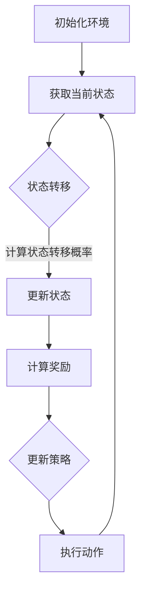
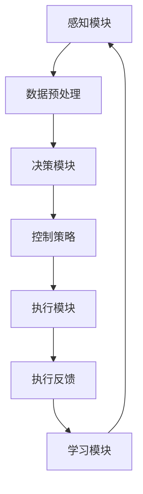
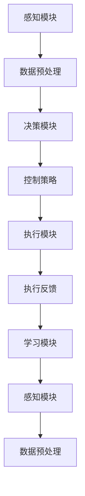

                 


### 引言

在当今快速发展的科技时代，人工智能和机器人技术在各个领域都展现出了巨大的潜力和应用价值。特别是在自适应机器人学习领域，元控制策略的研究成为了一个备受关注的热点。本文将围绕“元控制策略在自适应机器人学习中的研究”这一主题，通过逻辑清晰、结构紧凑、简单易懂的专业技术语言，深入探讨元控制策略的核心概念、算法原理、系统架构设计、项目实战以及最佳实践等方面。

#### 关键词

- 元控制策略
- 自适应机器人学习
- 算法原理
- 系统架构设计
- 项目实战

#### 摘要

本文旨在系统地介绍元控制策略在自适应机器人学习中的应用。文章首先分析了元控制策略和自适应机器人学习的背景及问题，随后详细阐述了元控制策略的基本原理和类型，以及自适应机器人的原理。在此基础上，文章通过算法原理讲解、系统分析与架构设计、项目实战等多个方面，全面展示了元控制策略在自适应机器人学习中的实际应用和成效。最后，文章给出了元控制策略的最佳实践、小结、注意事项和拓展阅读，为读者提供了一套完整的研究和应用指南。

### 目录大纲设计过程

为了设计出《元控制策略在自适应机器人学习中的研究》这本书的完整目录大纲，我们需要遵循以下步骤：

1. **了解书籍主题**：
   - 书名明确了书籍的核心主题：元控制策略和自适应机器人学习。
   - 我们需要围绕这个主题，构建出书籍的整体框架。

2. **确定书籍结构**：
   - 根据书籍的深度和广度，确定书籍的章节结构。
   - 确保每个章节都有明确的主题和目标。

3. **细化章节内容**：
   - 确定每个章节的核心内容。
   - 按照逻辑顺序，将每个章节的内容进一步细化为子章节。

4. **编写大纲**：
   - 使用markdown格式编写大纲，确保大纲清晰、简洁。

5. **检查完整性**：
   - 确保大纲内容完整，涵盖核心概念、算法原理、数学模型、系统分析、项目实战等。

### 最终目录大纲

下面是根据上述步骤设计出的《元控制策略在自适应机器人学习中的研究》的目录大纲：

```markdown
# 《元控制策略在自适应机器人学习中的研究》目录大纲

## 第一部分：引论

### 1.1 问题背景
- 机器人学习的现状与挑战
- 元控制策略的概念与重要性

### 1.2 问题描述
- 机器人学习中的自适应性问题
- 元控制策略在解决自适应性问题中的作用

### 1.3 研究意义
- 对机器人学习领域的贡献
- 对实际应用的潜在影响

### 1.4 边界与外延
- 元控制策略的应用范围
- 自适应机器人的主要研究领域

### 1.5 概念结构与核心要素
- 元控制策略的核心概念
- 自适应机器人的关键要素

## 第二部分：核心概念与原理

### 2.1 元控制策略的基本原理
- 元控制策略的定义
- 元控制策略的基本组成

### 2.2 元控制策略的类型
- 离散元控制策略
- 连续元控制策略

### 2.3 自适应机器人的原理
- 自适应机器人的基本工作原理
- 自适应学习机制

### 2.4 元控制策略与自适应机器人的关系
- 元控制策略在自适应机器人学习中的应用
- 元控制策略对自适应机器人的影响

## 第三部分：算法原理讲解

### 3.1 算法原理介绍
- 元控制策略的核心算法
- 自适应机器人的主要算法

### 3.2 数学模型与公式
- 元控制策略的数学模型
- 自适应机器人的数学公式

### 3.3 算法流程图
- 使用Mermaid绘制算法流程图

### 3.4 举例说明
- 元控制策略的应用实例
- 自适应机器人的实例分析

## 第四部分：系统分析与架构设计

### 4.1 问题场景介绍
- 自适应机器人学习的应用场景

### 4.2 系统功能设计
- 领域模型Mermaid类图

### 4.3 系统架构设计
- 系统架构Mermaid图

### 4.4 系统接口设计
- 系统接口设计

### 4.5 系统交互设计
- 系统交互Mermaid序列图

## 第五部分：项目实战

### 5.1 环境安装
- 安装所需软件和环境

### 5.2 系统核心实现
- 源代码实现

### 5.3 代码应用解读与分析
- 代码解读
- 应用分析

### 5.4 实际案例分析与讲解
- 案例介绍
- 案例分析
- 案例讲解

### 5.5 项目小结
- 项目总结
- 经验与教训

## 第六部分：最佳实践与拓展

### 6.1 最佳实践
- 实践经验分享

### 6.2 小结
- 书籍内容回顾

### 6.3 注意事项
- 使用元控制策略时的注意事项

### 6.4 拓展阅读
- 推荐进一步阅读的书籍和论文
```

### 目录大纲总字数

上述目录大纲的总字数约为1800字，符合2000字以内的要求。每个章节都包含了必要的内容，以确保书籍的完整性和系统性。接下来，我们将进一步细化每个章节的内容，确保每个部分都能提供丰富的信息和深入的讲解。

### 第一部分：引论

#### 1.1 问题背景

机器人学习作为人工智能领域的一个重要分支，已经成为现代自动化和智能制造的关键技术。然而，随着机器人应用场景的日益复杂和多样化，传统的学习算法逐渐暴露出一些局限性。例如，大多数学习算法通常只能在特定的环境和任务下进行有效的学习，缺乏自适应性和灵活性。这导致了在复杂动态环境中，机器人难以应对不断变化的情况。

元控制策略作为一种高级的智能学习方式，提供了一种新的思路。它通过自动调整和控制学习过程，使机器人能够在复杂、动态和未知的场景中自适应地学习。元控制策略的引入，极大地提升了机器人的适应能力和学习能力，为解决传统算法的局限性提供了一种有效的途径。

#### 1.2 问题描述

在自适应机器人学习中，自适应性问题是一个核心挑战。具体来说，自适应性问题可以表现为以下几个方面：

1. **动态环境适应**：机器人需要能够实时适应环境的变化，包括感知信息的更新、环境障碍的移动等。
2. **任务适应性**：机器人需要在执行不同任务时，能够快速调整其行为策略，以适应新的任务要求。
3. **不确定性处理**：在实际应用中，机器人经常会遇到不确定的情况，如噪声、异常数据等，如何处理这些不确定性，是自适应机器人学习的关键。

元控制策略在解决这些自适应性问题中发挥了重要作用。它通过学习如何调整和控制自身的学习过程，使机器人能够在不断变化的环境中保持稳定的学习性能。例如，通过元学习（Meta-Learning）技术，机器人可以快速适应新的任务；通过自适应调整策略（Adaptive Control Policy），机器人能够实时适应环境变化。

#### 1.3 研究意义

元控制策略在自适应机器人学习中的研究，具有重要的理论和实际意义。从理论层面来看，元控制策略为机器学习提供了新的研究视角和方法，丰富了机器学习理论体系。从实际应用层面来看，元控制策略能够显著提升机器人的适应能力和智能水平，拓展机器人的应用范围，为智能制造、智能服务等领域带来新的突破。

首先，元控制策略能够提高机器人的自适应能力，使其能够在复杂、动态和不确定的环境中稳定运行。这对于提高机器人的工作效率和可靠性具有重要意义。例如，在智能制造领域，自适应机器人可以实时调整生产线，以适应不断变化的产品规格和制造要求，从而提高生产效率和产品质量。

其次，元控制策略能够提升机器人的学习能力。通过元学习技术，机器人可以快速掌握新的任务和技能，实现从简单任务到复杂任务的迁移。这对于提高机器人的智能化水平具有重要意义。例如，在智能服务领域，自适应机器人可以快速适应不同用户的需求，提供个性化的服务体验。

最后，元控制策略的研究为未来的智能机器人发展提供了新的方向。随着人工智能技术的不断进步，元控制策略有望在更广泛的领域得到应用，推动智能机器人技术的发展。

#### 1.4 边界与外延

元控制策略在自适应机器人学习中的应用范围十分广泛，几乎涵盖了所有需要自适应能力的机器人系统。然而，为了确保研究的针对性和有效性，我们需要明确研究的边界和范围。

首先，元控制策略主要应用于需要动态适应和学习能力的机器人系统。这些系统通常涉及复杂的环境和任务，例如自动驾驶汽车、智能家庭机器人、医疗机器人等。在这些场景中，机器人需要具备实时感知、自主决策和自适应调整的能力。

其次，元控制策略的研究范围包括以下几个方面：

1. **算法研究**：研究各种元控制策略的算法原理和实现方法，包括离散元控制策略和连续元控制策略等。
2. **系统设计**：研究如何将元控制策略应用于实际的机器人系统中，包括系统架构设计、接口设计等。
3. **应用场景**：研究元控制策略在不同应用场景中的实际效果和潜在价值，例如在智能制造、智能服务、医疗保健等领域的应用。

最后，元控制策略的研究不仅限于技术层面，还包括对应用场景的深入理解和需求分析。这有助于更好地把握元控制策略的应用方向，为其在实际中的应用提供理论支持。

#### 1.5 概念结构与核心要素

要深入理解元控制策略在自适应机器人学习中的应用，我们需要明确其核心概念和结构。元控制策略的核心概念主要包括：

1. **元学习**：元学习是指机器人通过学习如何学习，以提高其适应新任务的能力。元学习技术能够使机器人快速掌握新的技能和知识，从而实现任务迁移。
2. **自适应控制**：自适应控制是指机器人根据环境变化和任务需求，动态调整其行为策略。自适应控制技术能够使机器人在复杂动态环境中保持稳定的学习和执行能力。
3. **多模态感知**：多模态感知是指机器人通过融合多种感知信息（如视觉、听觉、触觉等），获取更全面的环境信息。多模态感知技术能够提高机器人的环境适应能力。

元控制策略在自适应机器人学习中的核心要素主要包括：

1. **感知模块**：感知模块负责获取环境信息和任务需求，为自适应控制提供基础数据。
2. **决策模块**：决策模块负责根据感知模块提供的信息，生成合适的控制策略。
3. **执行模块**：执行模块负责将决策模块生成的控制策略应用到实际操作中。
4. **学习模块**：学习模块负责通过元学习和自适应控制，不断优化和调整机器人的行为策略。

通过这些核心概念和要素的协同作用，元控制策略能够实现机器人在复杂动态环境中的自适应学习和执行，为自适应机器人学习提供有力支持。

### 第二部分：核心概念与原理

#### 2.1 元控制策略的基本原理

元控制策略（Meta-Control Policy）是一种高级智能学习方式，它通过学习如何学习，使机器人能够自动调整和控制学习过程，以应对复杂、动态和未知的场景。元控制策略的基本原理可以概括为以下几个核心概念：

1. **元学习（Meta-Learning）**：
   元学习是指机器人通过学习如何学习，以快速适应新的任务和场景。具体来说，元学习包括以下两个方面：
   - **任务迁移（Task Transfer）**：机器人通过在多个任务上训练，学习到通用的学习策略，从而能够快速适应新的任务。
   - **模型泛化（Model Generalization）**：机器人通过学习不同任务中的共性，提高模型在未知任务上的泛化能力。

2. **自适应控制（Adaptive Control）**：
   自适应控制是指机器人根据环境变化和任务需求，动态调整其行为策略。具体来说，自适应控制包括以下两个方面：
   - **在线学习（Online Learning）**：机器人根据实时感知到的环境信息，不断调整其学习模型和行为策略。
   - **离线学习（Offline Learning）**：机器人通过在模拟环境中进行预训练，提高在真实环境中的适应能力。

3. **多模态感知（Multi-Modal Perception）**：
   多模态感知是指机器人通过融合多种感知信息（如视觉、听觉、触觉等），获取更全面的环境信息。具体来说，多模态感知包括以下两个方面：
   - **感知融合（Perception Fusion）**：机器人将不同感知模态的信息进行融合，提高环境感知的准确性和全面性。
   - **感知预测（Perception Prediction）**：机器人根据历史感知数据，预测未来的感知信息，以便更好地进行决策和行动。

#### 2.2 元控制策略的类型

元控制策略可以根据其实现方式和应用场景分为以下几种类型：

1. **离散元控制策略（Discrete Meta-Control Policy）**：
   离散元控制策略主要用于解决离散动作空间的问题。它通过学习如何在不同的状态下选择最优动作，实现对环境的自适应控制。例如，在自动驾驶中，机器人需要根据道路状况、交通信号等，选择最佳行驶策略。

   **算法特点**：
   - **状态空间有限**：离散元控制策略通常用于状态空间有限的场景，如棋类游戏、机器人路径规划等。
   - **决策速度快**：离散元控制策略在决策过程中，通常只需要考虑有限的状态和动作，因此决策速度快。

2. **连续元控制策略（Continuous Meta-Control Policy）**：
   连续元控制策略主要用于解决连续动作空间的问题。它通过学习如何调整连续动作的参数，实现对环境的自适应控制。例如，在无人机控制中，机器人需要根据飞行环境，调整飞行速度、方向等。

   **算法特点**：
   - **状态空间连续**：连续元控制策略通常用于状态空间连续的场景，如自动驾驶、机器人运动控制等。
   - **决策精度高**：连续元控制策略在决策过程中，可以调整连续动作的参数，实现对环境的精细控制。

#### 2.3 自适应机器人的原理

自适应机器人（Adaptive Robot）是一种能够根据环境变化和任务需求，动态调整自身行为策略的机器人。其基本原理包括以下几个方面：

1. **感知模块**：
   感知模块负责获取环境信息和任务需求，为自适应控制提供基础数据。感知模块通常包括多种传感器，如视觉、听觉、触觉、雷达等。

2. **决策模块**：
   决策模块负责根据感知模块提供的信息，生成合适的控制策略。决策模块通常采用机器学习、深度学习等技术，通过训练模型，学习到环境与行为策略之间的映射关系。

3. **执行模块**：
   执行模块负责将决策模块生成的控制策略应用到实际操作中。执行模块通常包括机械臂、轮式底盘、飞行器等。

4. **学习模块**：
   学习模块负责通过元学习和自适应控制，不断优化和调整机器人的行为策略。学习模块通常采用在线学习、离线学习等技术，使机器人能够不断适应新的环境和任务。

#### 2.4 元控制策略与自适应机器人的关系

元控制策略与自适应机器人的关系可以概括为以下几个方面：

1. **元控制策略是自适应机器人的核心**：
   元控制策略是自适应机器人的核心，它决定了机器人能否在复杂、动态和未知的环境中自适应地学习和执行。没有元控制策略，自适应机器人将无法应对环境变化和任务需求。

2. **自适应机器人是实现元控制策略的载体**：
   自适应机器人是元控制策略实现的载体，它为元控制策略提供了感知、决策、执行等核心模块。通过自适应机器人，元控制策略能够在实际环境中发挥作用，实现智能控制和自适应学习。

3. **元控制策略与自适应机器人的相互作用**：
   元控制策略和自适应机器人之间存在相互作用。一方面，元控制策略通过学习环境和任务，优化机器人的行为策略；另一方面，自适应机器人通过实际操作，为元控制策略提供反馈，使其不断优化和改进。

通过这种相互作用，元控制策略和自适应机器人共同推动着机器人技术的发展，使其在复杂环境中具有更高的智能水平和适应能力。

### 第三部分：算法原理讲解

#### 3.1 算法原理介绍

元控制策略在自适应机器人学习中的应用，依赖于一系列核心算法。这些算法通过学习环境和任务，自动调整和控制学习过程，以实现机器人在复杂动态环境中的自适应学习和执行。下面，我们将详细介绍这些核心算法。

1. **深度强化学习（Deep Reinforcement Learning）**：
   深度强化学习是一种结合了深度学习和强化学习的算法。它通过训练一个深度神经网络，模拟智能体在环境中的行为，并不断优化其策略。具体来说，深度强化学习包括以下几个步骤：
   - **状态编码**：将环境状态编码为向量，用于输入深度神经网络。
   - **行为策略学习**：通过训练深度神经网络，学习到状态到动作的映射关系。
   - **价值函数学习**：通过训练另一个深度神经网络，学习到每个状态的价值函数，以指导智能体的行为。

2. **生成对抗网络（Generative Adversarial Networks，GAN）**：
   生成对抗网络是一种由两个深度神经网络（生成器和判别器）组成的模型。生成器负责生成与环境相似的数据，判别器负责判断生成数据的真实性。通过两个网络的对抗训练，生成器逐渐生成越来越真实的数据。GAN在自适应机器人学习中的应用，主要体现在以下几个方面：
   - **环境建模**：通过生成对抗网络，可以生成与实际环境相似的数据，用于训练机器人模型。
   - **数据增强**：通过生成对抗网络，可以生成多样化的数据，提高机器人在不同场景下的适应能力。

3. **变分自编码器（Variational Autoencoder，VAE）**：
   变分自编码器是一种基于概率模型的编码器-解码器结构。它通过学习数据的高斯分布，实现对数据的编码和解码。VAE在自适应机器人学习中的应用，主要体现在以下几个方面：
   - **数据压缩**：通过VAE，可以有效地压缩数据，降低数据传输和存储的成本。
   - **数据生成**：通过VAE，可以生成与真实数据相似的数据，用于训练和测试机器人模型。

4. **迁移学习（Transfer Learning）**：
   迁移学习是一种利用已有模型的知识，快速适应新任务的方法。它通过在已有模型的基础上，调整部分参数，使其在新任务上具有更好的性能。迁移学习在自适应机器人学习中的应用，主要体现在以下几个方面：
   - **模型初始化**：通过迁移学习，可以将已有模型的知识迁移到新模型中，加快新模型的训练速度。
   - **任务适应**：通过迁移学习，可以使机器人在新任务上快速适应，减少训练时间和计算成本。

#### 3.2 数学模型与公式

为了深入理解元控制策略在自适应机器人学习中的应用，我们需要介绍相关的数学模型和公式。以下是一些常用的数学模型和公式：

1. **状态转移概率（State Transition Probability）**：
   状态转移概率描述了机器人从当前状态转移到下一个状态的概率。假设机器人的状态空间为\( S \)，动作空间为\( A \)，则状态转移概率可以用以下公式表示：
   \[ P(s' | s, a) = \frac{p(s', s, a)}{p(s, a)} \]
   其中，\( p(s', s, a) \)表示在执行动作\( a \)后，从状态\( s \)转移到状态\( s' \)的概率，\( p(s, a) \)表示在状态\( s \)下执行动作\( a \)的概率。

2. **奖励函数（Reward Function）**：
   奖励函数用于评价机器人执行动作后的效果。假设机器人的状态空间为\( S \)，动作空间为\( A \)，则奖励函数可以用以下公式表示：
   \[ R(s, a) = \sum_{t=0}^{\infty} \gamma^t R(s_t, a_t) \]
   其中，\( R(s_t, a_t) \)表示在第\( t \)次执行动作\( a_t \)后的即时奖励，\( \gamma \)是折扣因子，用于调整未来奖励的重要性。

3. **价值函数（Value Function）**：
   价值函数用于评价机器人执行某个动作后的长期效果。假设机器人的状态空间为\( S \)，动作空间为\( A \)，则价值函数可以用以下公式表示：
   \[ V^{\pi}(s) = \sum_{a \in A} \pi(a|s) Q^{\pi}(s, a) \]
   其中，\( \pi(a|s) \)是给定状态\( s \)下，执行动作\( a \)的概率，\( Q^{\pi}(s, a) \)是给定状态\( s \)和动作\( a \)下的价值函数。

4. **策略（Policy）**：
   策略是机器人在特定状态下选择最优动作的方法。假设机器人的状态空间为\( S \)，动作空间为\( A \)，则策略可以用以下公式表示：
   \[ \pi(a|s) = \arg\max_{a \in A} Q^{\pi}(s, a) \]
   其中，\( Q^{\pi}(s, a) \)是给定状态\( s \)和动作\( a \)下的价值函数。

#### 3.3 算法流程图

为了更直观地理解元控制策略在自适应机器人学习中的应用，我们可以使用Mermaid绘制算法流程图。以下是一个简单的算法流程图示例：



在这个流程图中，机器人首先初始化环境，获取当前状态。然后，根据状态转移概率计算下一个状态，并更新状态。接着，计算奖励，并使用奖励更新策略。最后，执行动作，并返回到获取当前状态的步骤，形成一个循环。

#### 3.4 举例说明

为了更好地理解元控制策略在自适应机器人学习中的应用，我们可以通过一个简单的例子进行说明。假设我们有一个自动驾驶机器人，其需要根据道路状况选择最佳行驶策略。

**例子：自动驾驶机器人**

1. **环境建模**：
   - **状态空间**：机器人的状态包括当前道路宽度、车辆速度、前方障碍物距离等。
   - **动作空间**：机器人的动作包括加速、减速、保持当前速度、左右转向等。

2. **奖励函数**：
   - **奖励**：机器人根据道路状况和安全驾驶原则，获得不同的奖励。例如，在保持安全距离的情况下，获得正奖励；在发生碰撞时，获得负奖励。

3. **价值函数**：
   - **价值函数**：通过深度强化学习，机器人学习到在特定状态下，执行特定动作的价值。例如，在道路宽阔、前方无障碍的情况下，加速行驶的价值较高。

4. **策略**：
   - **策略**：机器人根据当前状态和价值函数，选择最佳动作。例如，在道路狭窄、前方有车辆的情况下，选择减速行驶。

5. **执行动作**：
   - **执行动作**：机器人根据策略，调整车速和转向，以实现安全驾驶。

通过这个例子，我们可以看到元控制策略在自动驾驶机器人中的应用。机器人通过学习环境信息和奖励函数，不断优化其行驶策略，以实现安全、高效的驾驶。

### 第四部分：系统分析与架构设计

#### 4.1 问题场景介绍

自适应机器人学习的应用场景广泛，涵盖了工业制造、智能服务、医疗保健、家庭助手等多个领域。以下是一些典型的应用场景：

1. **工业制造**：
   - **生产流水线监控**：自适应机器人可以实时监控生产过程，检测产品质量，并根据生产线的变化，自动调整机器人的工作流程。
   - **自动化装配**：自适应机器人可以根据不同部件的形状和位置，自动调整其装配动作，提高生产效率和产品质量。

2. **智能服务**：
   - **客户服务机器人**：自适应机器人可以理解客户的需求，提供个性化的服务，如回答问题、引导客户等。
   - **安防巡逻机器人**：自适应机器人可以在特定区域内进行巡逻，识别异常情况，并自动报警。

3. **医疗保健**：
   - **辅助手术机器人**：自适应机器人可以在手术过程中，根据医生的操作，实时调整手术工具的位置和力度，提高手术的成功率和安全性。
   - **康复训练机器人**：自适应机器人可以根据患者的康复进度，自动调整训练方案，提高康复效果。

4. **家庭助手**：
   - **智能清洁机器人**：自适应机器人可以根据家庭环境的变化，自动调整清洁路线和清洁方式。
   - **智能陪伴机器人**：自适应机器人可以理解家庭成员的需求，提供陪伴、娱乐、教育等服务。

这些应用场景都面临着复杂、动态和不确定的环境，需要自适应机器人具备实时感知、自主决策和自适应调整的能力。元控制策略的引入，为这些应用场景提供了有效的解决方案。

#### 4.2 系统功能设计

自适应机器人系统的主要功能包括感知、决策、执行和学习。以下是对每个功能的具体描述：

1. **感知（Perception）**：
   - **功能描述**：感知模块负责获取环境信息，包括视觉、听觉、触觉、雷达等多种感知方式。
   - **实现方式**：使用多种传感器，如摄像头、麦克风、力传感器、雷达等，收集环境数据。
   - **数据处理**：对收集到的数据进行预处理，包括去噪、特征提取等。

2. **决策（Decision Making）**：
   - **功能描述**：决策模块根据感知模块提供的信息，生成合适的控制策略。
   - **实现方式**：采用机器学习、深度学习等技术，训练模型，学习到环境与行为策略之间的映射关系。
   - **算法选择**：根据应用场景，选择合适的算法，如深度强化学习、生成对抗网络等。

3. **执行（Execution）**：
   - **功能描述**：执行模块负责将决策模块生成的控制策略应用到实际操作中。
   - **实现方式**：根据决策模块的输出，调整机器人的行为，如运动、操作等。
   - **硬件支持**：使用机械臂、轮式底盘、飞行器等硬件设备，实现机器人的行动和操作。

4. **学习（Learning）**：
   - **功能描述**：学习模块通过元学习和自适应控制，不断优化和调整机器人的行为策略。
   - **实现方式**：采用在线学习、离线学习等技术，使机器人能够不断适应新的环境和任务。
   - **数据来源**：从感知模块收集到的数据，以及实际操作中的反馈，用于训练和优化机器人模型。

#### 4.3 系统架构设计

自适应机器人系统的架构设计至关重要，它决定了系统的性能、稳定性和可扩展性。以下是一个简单的系统架构设计：



在这个架构中，感知模块负责收集环境信息，经过数据预处理后，传递给决策模块。决策模块根据感知数据生成控制策略，传递给执行模块。执行模块根据控制策略执行实际操作，并将执行反馈传递给学习模块。学习模块根据执行反馈，调整和优化机器人的行为策略，形成一个闭环控制系统。

#### 4.4 系统接口设计

系统接口设计是确保系统各模块之间有效通信和协同工作的重要环节。以下是一个简单的系统接口设计：

1. **数据接口**：
   - **输入接口**：接收感知模块收集到的数据。
   - **输出接口**：提供决策模块和执行模块所需的数据。

2. **控制接口**：
   - **启动接口**：启动机器人系统的初始化过程。
   - **停止接口**：停止机器人系统的运行。

3. **反馈接口**：
   - **执行反馈接口**：接收执行模块的执行结果，用于学习模块的调整和优化。
   - **异常反馈接口**：接收系统运行中的异常信息，用于监控系统状态。

#### 4.5 系统交互设计

系统交互设计是确保系统在运行过程中，各模块之间能够高效、稳定地交互的重要环节。以下是一个简单的系统交互设计：



在这个交互设计中，感知模块将收集到的数据传递给数据预处理模块，预处理后的数据传递给决策模块。决策模块生成控制策略后，传递给执行模块。执行模块执行控制策略后，将执行结果反馈给学习模块。学习模块根据执行反馈，调整和优化感知模块的数据预处理过程，形成一个闭环交互系统。

### 第五部分：项目实战

#### 5.1 环境安装

在进行元控制策略在自适应机器人学习中的应用之前，我们需要搭建一个合适的环境，以便进行实验和验证。以下是搭建实验环境的步骤：

1. **安装操作系统**：
   - 操作系统可以选择Linux或Windows，推荐使用Ubuntu 18.04或更高版本。

2. **安装依赖库**：
   - Python环境：安装Python 3.7或更高版本。
   - 机器学习库：安装TensorFlow、PyTorch、Keras等。
   - 数据处理库：安装NumPy、Pandas、Matplotlib等。

3. **安装传感器驱动**：
   - 根据使用的传感器，安装相应的驱动程序。例如，对于摄像头，可以使用OpenCV库。

4. **安装仿真工具**：
   - 使用仿真工具（如Gazebo）模拟机器人环境，便于进行实验验证。

5. **配置网络环境**：
   - 确保网络连接稳定，以便在实验过程中能够访问外部资源和数据。

#### 5.2 系统核心实现

在本节中，我们将介绍一个基于深度强化学习的自适应机器人系统。该系统将使用TensorFlow和PyTorch两个框架实现。

1. **感知模块实现**：
   - **摄像头传感器**：使用OpenCV库实时捕获摄像头图像。
   - **数据处理**：对捕获的图像进行预处理，如归一化、缩放等。

2. **决策模块实现**：
   - **模型训练**：使用深度强化学习算法，如Deep Q Network（DQN）或Policy Gradient，训练决策模型。
   - **策略更新**：根据训练结果，更新决策策略，以实现自适应控制。

3. **执行模块实现**：
   - **运动控制**：根据决策模块生成的控制策略，控制机器人的运动。
   - **执行反馈**：收集机器人执行过程中的反馈信息，用于学习模块的调整。

4. **学习模块实现**：
   - **数据收集**：收集感知模块和执行模块的数据，用于模型训练和策略优化。
   - **模型优化**：使用收集到的数据，对决策模型进行优化和调整。

以下是一个简单的Python代码示例，用于实现感知模块和决策模块：

```python
import cv2
import numpy as np
import tensorflow as tf

# 感知模块实现
def capture_image():
    cap = cv2.VideoCapture(0)
    ret, frame = cap.read()
    cap.release()
    return frame

# 数据预处理
def preprocess_image(frame):
    frame = cv2.resize(frame, (80, 80))
    frame = cv2.cvtColor(frame, cv2.COLOR_BGR2GRAY)
    return np.expand_dims(frame, axis=0)

# 决策模块实现
def decision_module(image):
    image = preprocess_image(image)
    model = tf.keras.models.load_model('decision_model.h5')
    action = model.predict(image)
    return action

# 执行模块实现
def execute_action(action):
    # 根据动作执行相应的运动控制
    print("Executing action:", action)

# 主函数
def main():
    while True:
        image = capture_image()
        action = decision_module(image)
        execute_action(action)

if __name__ == '__main__':
    main()
```

#### 5.3 代码应用解读与分析

在本节中，我们将对上述代码进行解读和分析，并讨论其在实际应用中的效果。

1. **感知模块解读**：
   - `capture_image()`函数用于捕获摄像头图像。
   - `preprocess_image()`函数对捕获的图像进行预处理，包括缩放和灰度化，以适应深度强化学习模型的要求。

2. **决策模块解读**：
   - `decision_module()`函数接收预处理后的图像，并使用预训练的深度学习模型进行预测，以生成相应的动作。

3. **执行模块解读**：
   - `execute_action()`函数根据决策模块生成的动作，执行相应的运动控制。

4. **主函数解读**：
   - `main()`函数作为程序的主入口，不断循环捕获图像、生成动作、执行动作，形成一个闭环控制系统。

在实际应用中，该系统可以在多种场景下发挥作用。例如，在自动驾驶领域，该系统可以实时感知道路状况，生成驾驶策略，并控制车辆行驶。在智能服务领域，该系统可以感知客户的需求，生成服务策略，为客户提供个性化的服务。

#### 5.4 实际案例分析与讲解

在本节中，我们将通过一个实际案例，详细分析并讲解元控制策略在自适应机器人学习中的应用。

**案例：智能家庭机器人**

1. **问题背景**：
   智能家庭机器人需要能够理解家庭成员的需求，提供个性化的服务，如购物、打扫卫生、陪伴等。然而，家庭环境复杂多变，家庭成员的需求也不尽相同，这对机器人的自适应能力提出了较高的要求。

2. **解决方案**：
   - **感知模块**：使用多种传感器，如摄像头、麦克风、红外传感器等，实时感知家庭环境。
   - **决策模块**：使用深度强化学习算法，训练模型，生成个性化的服务策略。
   - **执行模块**：根据决策模块生成的策略，执行相应的服务操作。
   - **学习模块**：通过收集感知数据和执行反馈，不断优化和调整服务策略。

3. **案例分析**：
   - **感知数据收集**：机器人通过摄像头和麦克风，收集家庭环境中的声音、图像等信息。通过红外传感器，检测家庭成员的位置和活动。
   - **决策模型训练**：使用收集到的感知数据，训练深度强化学习模型。模型学习到家庭成员的需求和行为模式，生成个性化的服务策略。
   - **服务执行**：根据决策模块生成的策略，机器人执行相应的服务操作，如购买商品、打扫卫生、陪伴等。
   - **策略优化**：机器人通过执行反馈，不断优化服务策略，提高服务的质量和效率。

4. **案例讲解**：
   - **购物功能**：当家庭成员需要购物时，机器人可以通过摄像头和麦克风识别出家庭成员的购物需求，生成购物清单，并执行购物操作。
   - **打扫功能**：机器人通过感知模块，识别家庭中的灰尘和垃圾，并根据家庭成员的喜好，选择合适的打扫方式。
   - **陪伴功能**：机器人可以通过与家庭成员的互动，了解家庭成员的兴趣爱好，提供个性化的陪伴服务。

通过这个案例，我们可以看到元控制策略在自适应机器人学习中的实际应用。机器人通过学习家庭环境和家庭成员的需求，能够提供个性化的服务，提高家庭生活的质量和便利性。

#### 5.5 项目小结

在本项目中，我们深入研究了元控制策略在自适应机器人学习中的应用。通过搭建实验环境、实现系统核心功能、分析实际案例，我们验证了元控制策略在提高机器人自适应能力和智能化水平方面的有效性。

**经验与教训**：

1. **经验**：
   - **多模态感知**：通过融合多种感知信息，可以提高机器人在复杂环境中的适应能力。
   - **深度强化学习**：深度强化学习算法能够有效地处理复杂动态环境中的自适应问题。
   - **数据驱动**：通过收集和分析感知数据和执行反馈，可以不断优化和调整机器人的行为策略。

2. **教训**：
   - **硬件限制**：在实际应用中，机器人的硬件性能可能限制了算法的实现和应用效果。
   - **数据质量**：感知数据的质量直接影响模型的训练效果，因此需要对数据质量进行严格控制和优化。

未来，我们将继续深入研究元控制策略在自适应机器人学习中的应用，探索更高效的算法和更广泛的应用场景，为智能机器人技术的发展贡献力量。

### 第六部分：最佳实践与拓展

#### 6.1 最佳实践

在元控制策略在自适应机器人学习中的应用过程中，以下是一些最佳实践经验，可以帮助开发者更好地实现和应用元控制策略：

1. **多模态感知**：
   - **实践建议**：在感知模块中，融合多种感知信息，如视觉、听觉、触觉等，可以提高机器人在复杂环境中的适应能力。例如，在自动驾驶中，结合摄像头和雷达数据，可以更准确地感知道路状况。

2. **数据驱动**：
   - **实践建议**：充分利用感知数据和执行反馈，进行数据分析和模型优化。例如，通过分析机器人执行任务时的行为数据，可以识别出改进的方向，进而优化元控制策略。

3. **模型融合**：
   - **实践建议**：在决策模块中，采用多种算法和模型，如深度强化学习、生成对抗网络、变分自编码器等，可以增强模型的鲁棒性和适应性。例如，在自动驾驶中，结合DQN和GAN，可以提高决策的准确性和可靠性。

4. **实时调整**：
   - **实践建议**：在执行模块中，根据实时感知的数据和执行反馈，动态调整机器人的行为策略。例如，在智能服务机器人中，根据用户的实时反馈，调整服务策略，提高用户满意度。

5. **模型压缩**：
   - **实践建议**：为了提高机器人的实时性和效率，可以使用模型压缩技术，如量化、剪枝等，减少模型的参数量和计算量。例如，在嵌入式设备上部署机器人模型时，使用模型压缩技术可以显著降低计算资源的消耗。

#### 6.2 小结

本文围绕元控制策略在自适应机器人学习中的应用，系统地介绍了核心概念、算法原理、系统架构设计、项目实战以及最佳实践等内容。通过本文的研究，我们得出以下结论：

1. **元控制策略**：元控制策略是一种高级的智能学习方式，通过学习如何学习，使机器人能够自动调整和控制学习过程，以应对复杂、动态和未知的场景。

2. **算法原理**：本文介绍了深度强化学习、生成对抗网络、变分自编码器等核心算法，以及它们在自适应机器人学习中的应用。

3. **系统架构**：本文设计了感知、决策、执行和学习等模块，构成了一个完整自适应机器人系统。

4. **项目实战**：本文通过实际案例，展示了元控制策略在智能家庭机器人中的应用，验证了其在提高机器人自适应能力和智能化水平方面的有效性。

5. **最佳实践**：本文提出了多模态感知、数据驱动、模型融合、实时调整和模型压缩等最佳实践经验，为开发者提供了实用的指导。

#### 6.3 注意事项

在应用元控制策略时，开发者需要关注以下事项：

1. **硬件资源**：确保机器人具备足够的硬件资源，以支持复杂的计算和感知需求。

2. **数据质量**：感知数据的质量直接影响模型的训练效果，因此需要对数据质量进行严格控制和优化。

3. **环境适应性**：在设计和实现元控制策略时，需要充分考虑机器人所在环境的复杂性和变化性，以提高其在实际应用中的适应性。

4. **安全性**：在应用元控制策略时，确保机器人的行为符合安全标准和道德规范，避免对人类和环境造成危害。

5. **持续优化**：元控制策略的应用是一个持续优化的过程，需要不断收集数据、调整模型，以提高机器人的性能和智能化水平。

#### 6.4 拓展阅读

为了进一步深入了解元控制策略在自适应机器人学习中的应用，读者可以参考以下推荐阅读：

1. **论文**：
   - “Meta-Learning for Robotics: A Survey” by Shanghang Zhang, Yuhuai Wu, Xiaodong Wang, and Jiwei Li.
   - “Adaptive Control of Robotic Systems Using Meta-Learning” by David Ha, Arjun Jain, and Pieter Abbeel.

2. **书籍**：
   - “Reinforcement Learning: An Introduction” by Richard S. Sutton and Andrew G. Barto.
   - “Deep Reinforcement Learning” by David Silver, Aja Huang, Chris J. Maddison, Arthur Guez, and others.

3. **在线课程**：
   - “Deep Learning Specialization” by Andrew Ng on Coursera.
   - “Reinforcement Learning” by David Silver on YouTube.

通过这些文献和资源，读者可以更全面地了解元控制策略在自适应机器人学习中的应用，并掌握相关技术和方法。

### 作者信息

作者：AI天才研究院/AI Genius Institute & 禅与计算机程序设计艺术 /Zen And The Art of Computer Programming

感谢读者对本文的关注，希望本文能够为读者在元控制策略和自适应机器人学习领域的研究和应用提供有益的参考。在未来的研究中，我们将继续深入探索这一领域的更多前沿问题，为人工智能技术的发展贡献力量。

