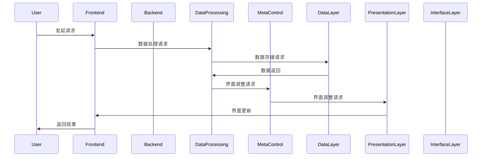

                 

### 引言

#### 1.1 背景

随着信息技术和互联网的迅猛发展，用户界面设计逐渐成为软件工程中至关重要的一个环节。传统静态的用户界面难以满足用户多样化和个性化的需求，而自适应用户界面（Adaptive User Interfaces, AUI）应运而生。自适应用户界面旨在根据用户的设备、环境、行为习惯等因素动态调整界面布局、内容和交互方式，从而提供更加个性化和高效的用户体验。

然而，自适应用户界面的实现并非易事。用户需求和偏好具有高度动态性和复杂性，因此，仅仅依靠简单的自适应策略难以满足用户的多样化需求。为了提高自适应用户界面的灵活性和适应性，引入元控制策略（Meta-control Strategies）成为了一种有效的方法。

#### 1.2 理由

元控制策略在自适应用户界面中扮演着至关重要的角色，主要理由如下：

1. **提高灵活性**：元控制策略能够动态调整和优化自适应过程的参数，从而提高自适应用户界面的灵活性和响应速度。

2. **增强适应性**：通过引入元控制策略，自适应用户界面能够更好地应对用户需求的多样性和动态变化。

3. **优化用户体验**：元控制策略可以根据用户的实时反馈和行为习惯，动态调整界面布局和交互方式，从而提供更加个性化和高效的用户体验。

4. **降低开发成本**：元控制策略能够减少对大量定制化代码的依赖，从而降低自适应用户界面的开发成本和维护难度。

#### 1.3 书籍目标

本书旨在系统性地介绍元控制策略在自适应用户界面中的实现方法，具体目标如下：

1. **全面解析元控制策略**：介绍元控制策略的基本概念、分类和应用场景，帮助读者全面了解元控制策略的原理和优势。

2. **深入探讨具体实现方法**：通过具体实例和代码实现，详细介绍各种元控制策略的实现方法和技术细节，帮助读者掌握元控制策略的应用技巧。

3. **实践指导与案例分析**：结合实际项目案例，阐述元控制策略在自适应用户界面开发中的具体应用，提供实用的开发指导和经验分享。

4. **拓展读者视野**：介绍当前元控制策略的研究动态和前沿技术，帮助读者了解元控制策略的发展趋势和未来研究方向。

通过本书的学习，读者将能够掌握元控制策略在自适应用户界面中的应用技巧，提高软件开发的灵活性和适应性，为用户提供更加优质和个性化的用户体验。

### 核心概念

在深入探讨元控制策略在自适应用户界面中的实现之前，有必要首先了解相关核心概念和术语。本文将介绍自适应用户界面、元控制策略及其理论基础，为后续内容的讨论奠定基础。

#### 自适应用户界面

自适应用户界面（Adaptive User Interfaces, AUI）是一种能够根据用户设备、环境、行为习惯等因素动态调整界面布局、内容和交互方式的用户界面设计方法。其核心目标是通过自动适应不同用户需求和环境条件，提供最佳的用户体验。

**核心概念：**

1. **设备适应性**：自适应用户界面能够识别和适应用户所使用的设备类型、屏幕尺寸和分辨率，从而提供合适的界面布局和交互方式。

2. **环境适应性**：自适应用户界面能够根据用户所处的环境条件，如网络状态、声音和光线强度等，调整界面亮度和交互方式。

3. **行为适应性**：自适应用户界面能够通过分析用户的行为模式，如点击、滑动和搜索等，动态调整界面布局和功能模块，以更好地满足用户需求。

**概念结构与核心要素：**

- **设备信息识别**：通过传感器和设备属性检测技术，获取用户设备的相关信息。
- **用户行为分析**：通过用户行为数据，分析用户操作习惯和偏好。
- **环境信息感知**：利用环境传感器和地理位置信息，感知用户当前所处的环境。
- **界面调整与优化**：根据设备、用户行为和环境信息，动态调整界面布局、内容和交互方式。

#### 元控制策略

元控制策略（Meta-control Strategies）是一种用于优化和控制自适应过程的方法。它通过引入高级控制逻辑，对自适应过程的参数和策略进行动态调整，从而提高自适应用户界面的灵活性和适应性。

**核心概念：**

1. **元控制**：元控制是指对自适应过程的控制，包括参数调整、策略优化和反馈修正等。

2. **自适应控制**：自适应控制是一种通过实时调整系统参数和策略，以实现系统稳定性和性能优化的一种控制方法。

3. **反馈机制**：反馈机制是指通过用户行为、界面性能和系统状态等反馈信息，对自适应过程进行调整和优化的方法。

**概念属性特征对比表格：**

| 概念            | 定义                                                         | 关键特性                                                                                       |
| --------------- | ------------------------------------------------------------ | ------------------------------------------------------------------------------------------------ |
| 自适应用户界面  | 一种能够根据用户设备、环境、行为习惯等因素动态调整界面布局、内容和交互方式的用户界面设计方法。 | - 设备适应性<br>- 环境适应性<br>- 行为适应性 |
| 元控制策略      | 一种用于优化和控制自适应过程的方法，通过引入高级控制逻辑，对自适应过程的参数和策略进行动态调整。 | - 元控制<br>- 自适应控制<br>- 反馈机制         |

**ER实体关系图架构：**

```mermaid
erDiagram
  User ||--o{ AdaptiveUI : user's preferences and behaviors }
  Environment ||--o{ AdaptiveUI : current environment conditions }
  Device ||--o{ AdaptiveUI : device type and attributes }
  MetaControl ||--o{ AdaptiveUI : control strategies and parameters }
  AdaptiveUI ||--|{ User } User
  AdaptiveUI ||--|{ Environment } Environment
  AdaptiveUI ||--|{ Device } Device
  MetaControl ||--|{ AdaptiveUI } AdaptiveUI
```

#### 理论基础

元控制策略的理论基础主要涉及自适应系统理论、控制理论、机器学习和用户建模等领域。以下简要介绍这些理论基础：

1. **自适应系统理论**：自适应系统理论研究了系统在不同环境下的动态调整能力。自适应用户界面可以看作是一种自适应系统，其目标是通过自适应调整提高系统的性能和用户体验。

2. **控制理论**：控制理论为元控制策略提供了理论基础。元控制策略中的自适应控制方法和反馈机制均来源于控制理论，通过实时调整系统参数和策略，实现系统的稳定性优化。

3. **机器学习**：机器学习技术为用户行为分析和用户建模提供了有力支持。通过机器学习算法，自适应用户界面可以更准确地分析用户行为和偏好，从而实现更精细的自适应控制。

4. **用户建模**：用户建模是一种通过构建用户模型来理解用户行为和需求的方法。用户建模技术有助于自适应用户界面更好地满足用户需求，提高用户体验。

通过理解这些核心概念和理论基础，读者可以为后续章节的深入探讨打下坚实基础。接下来，我们将进一步探讨元控制策略的分类及其具体实现方法。

### 核心元控制策略概述

元控制策略在自适应用户界面中扮演着至关重要的角色，其核心目标是优化和调整自适应过程，以提高界面的灵活性和适应性。本文将详细介绍几种常见的核心元控制策略，包括用户配置文件、实时用户反馈分析、上下文感知和自适应界面个性化。

#### 1.1 定义与重要性

元控制策略是一种高级控制方法，旨在通过动态调整自适应过程的参数和策略，实现对用户界面的精细控制。具体来说，元控制策略包括以下方面：

1. **用户配置文件**：通过构建用户配置文件，存储用户的个性化偏好和习惯，从而在界面调整过程中提供依据。
2. **实时用户反馈分析**：通过分析用户的实时反馈，如点击、滑动和搜索等行为，动态调整界面布局和交互方式。
3. **上下文感知**：利用用户当前所处的环境和上下文信息，如地理位置、网络状态等，动态调整界面布局和功能模块。
4. **自适应界面个性化**：根据用户的个性化需求和偏好，动态调整界面的内容和布局，提供最佳的用户体验。

这些元控制策略的重要性体现在以下几个方面：

1. **提高灵活性**：通过动态调整界面布局和交互方式，元控制策略能够更好地适应不同用户需求和环境变化，提高系统的灵活性。
2. **增强适应性**：元控制策略可以根据实时反馈和上下文信息，快速调整界面布局和功能模块，从而增强系统的适应性。
3. **优化用户体验**：通过个性化调整和实时反馈分析，元控制策略能够提供更符合用户需求和习惯的界面体验，提高用户体验。
4. **降低开发成本**：元控制策略能够减少对大量定制化代码的依赖，降低自适应用户界面的开发成本和维护难度。

#### 1.2 分类

根据实现方式和应用场景，元控制策略可以大致分为以下几类：

1. **基于用户配置文件的元控制策略**：这类策略通过用户配置文件存储用户的个性化偏好和习惯，在界面调整过程中提供依据。常见的实现方法包括用户行为记录、偏好设置和历史记录等。
2. **基于实时用户反馈的元控制策略**：这类策略通过分析用户的实时反馈，如点击、滑动和搜索等行为，动态调整界面布局和交互方式。常见的实现方法包括事件监听、行为分析和反馈机制等。
3. **基于上下文的元控制策略**：这类策略利用用户当前所处的环境和上下文信息，如地理位置、网络状态等，动态调整界面布局和功能模块。常见的实现方法包括环境传感器、位置信息和上下文检测等。
4. **基于自适应界面个性化的元控制策略**：这类策略根据用户的个性化需求和偏好，动态调整界面的内容和布局，提供最佳的用户体验。常见的实现方法包括个性化推荐、内容过滤和界面布局优化等。

每种元控制策略都有其独特的特点和适用场景，以下将详细介绍每种策略的具体实现方法。

### 用户配置文件

用户配置文件是一种基于用户个性化数据和偏好信息的元控制策略，旨在提高自适应用户界面的灵活性和适应性。通过记录用户的个性化设置和历史行为，用户配置文件为界面的动态调整提供了重要依据。

#### 2.1 用户配置文件技术

用户配置文件技术主要包括以下几方面：

1. **用户偏好设置**：用户偏好设置包括字体大小、颜色、主题样式、快捷键等个性化设置。这些设置通常在用户初次使用软件时进行配置，并在后续使用过程中保持不变。

2. **用户行为记录**：用户行为记录包括用户的浏览历史、搜索记录、点击和滑动轨迹等。这些行为数据可以用于分析用户的兴趣和习惯，从而为界面的动态调整提供依据。

3. **历史记录**：历史记录包括用户的操作记录、偏好变更记录等。这些记录可以用于跟踪用户的行为变化，以便在需要时进行调整。

4. **用户配置文件格式**：用户配置文件通常以文本、XML或JSON等格式存储，便于读取和解析。常见的配置文件存储方式包括本地存储（如文件系统）、数据库存储和云存储等。

#### 2.2 实现方法

实现用户配置文件的方法主要包括以下几步：

1. **用户初始化配置**：在用户初次使用软件时，引导用户进行偏好设置，并将这些设置存储为用户配置文件。

2. **用户行为数据收集**：在用户使用软件的过程中，收集用户的行为数据，如浏览历史、搜索记录等。

3. **配置文件更新**：定期将用户行为数据合并到用户配置文件中，更新用户的个性化设置和历史记录。

4. **界面调整**：在界面调整过程中，读取用户配置文件，根据用户的偏好设置和行为记录，动态调整界面布局和交互方式。

#### 2.3 实现案例

以下是一个简单的用户配置文件实现案例：

```python
# 用户偏好设置
user_preferences = {
    "font_size": 14,
    "color_scheme": "dark",
    "shortcut_keys": ["Ctrl+C", "Ctrl+V"],
}

# 用户行为记录
user_behavior = {
    "search_history": ["python", "machine learning", "data science"],
    "browse_history": ["example.com", "tutorialsite.org"],
}

# 用户配置文件存储
def save_user_config(config, filename):
    with open(filename, "w") as f:
        f.write(json.dumps(config))

# 用户配置文件加载
def load_user_config(filename):
    with open(filename, "r") as f:
        config = json.load(f)
    return config

# 用户界面调整
def adjust_interface(preferences, behavior):
    # 根据用户偏好设置调整界面字体大小
    interface.font_size = preferences["font_size"]

    # 根据用户行为记录调整界面主题样式
    interface.color_scheme = preferences["color_scheme"]

    # 根据用户搜索历史记录调整搜索建议
    search_suggestions = behavior["search_history"]

    # 根据用户浏览历史记录调整导航栏
    navigation_history = behavior["browse_history"]

# 示例：保存和加载用户配置文件
user_config_filename = "user_config.json"
save_user_config(user_preferences, user_config_filename)
user_preferences = load_user_config(user_config_filename)

# 示例：调整用户界面
adjust_interface(user_preferences, user_behavior)
```

通过上述案例，我们可以看到用户配置文件在自适应用户界面中的应用方法。用户配置文件不仅记录了用户的个性化设置和行为数据，还实现了根据这些数据动态调整用户界面的功能。

### 实时用户反馈分析

实时用户反馈分析是一种基于用户操作行为和反应的元控制策略，旨在通过持续监控用户互动，动态调整界面以提升用户体验。这种方法利用了用户在界面上的各种操作（如点击、滑动、搜索等）来收集反馈，并据此优化界面布局和交互方式。

#### 3.1 收集实时用户反馈

收集实时用户反馈是实时用户反馈分析的第一步。以下是几种常见的收集方法：

1. **事件监听**：通过监听用户在界面上的各种操作事件（如点击、滑动、输入等），实时记录用户的互动行为。事件监听通常通过前端框架（如React、Vue等）或原生应用开发框架（如Android、iOS）实现。

2. **日志记录**：将用户的操作事件记录到服务器日志中。日志记录可以在应用程序的后端实现，以便于后续的数据分析和处理。

3. **行为跟踪**：使用分析工具（如Google Analytics、Mixpanel等）跟踪用户在界面上的行为。这些工具通常提供API接口，可以轻松集成到应用程序中。

4. **用户调查**：通过弹窗、问卷或在线调查等方式，直接向用户收集反馈。这种方法虽然能够提供高质量的反馈数据，但通常不适用于实时反馈。

#### 3.2 分析用户反馈

收集到用户反馈后，需要对其进行分析，以提取有用的信息。以下是几种常见的方法：

1. **行为分析**：通过统计和分析用户操作事件的频率、持续时间、点击位置等，了解用户的使用习惯和偏好。例如，可以分析用户最常使用的功能模块，以优化界面布局。

2. **异常检测**：通过检测和分析异常用户行为，如频繁的退出、长时间的等待或错误率高的操作，发现界面设计和功能实现中的问题。

3. **聚类分析**：使用聚类算法（如K-means、层次聚类等）将用户行为数据分组，识别具有相似行为的用户群体。这有助于了解不同用户群体的需求和偏好，从而制定更个性化的界面调整策略。

4. **相关性分析**：通过分析用户操作事件之间的相关性，了解用户行为模式。例如，用户在完成一项操作后，通常会进行什么其他操作，从而优化界面流程。

#### 3.3 实现方法

实现实时用户反馈分析通常包括以下步骤：

1. **数据收集**：在前端应用中设置事件监听和日志记录，收集用户的实时操作数据。

2. **数据处理**：将收集到的数据传输到后端服务器，进行清洗、存储和分析。

3. **反馈机制**：根据分析结果，动态调整界面布局、交互方式和功能模块，以提升用户体验。

4. **反馈循环**：将用户对新界面的反馈继续纳入收集和分析过程中，形成持续的反馈循环。

以下是一个简单的实时用户反馈分析实现案例：

```python
# 假设我们有一个简单的用户操作日志
user_actions = [
    {"action": "click", "element": "search_box", "timestamp": 1625109200},
    {"action": "search", "query": "python", "timestamp": 1625110100},
    {"action": "scroll", "position": 300, "timestamp": 1625110300},
    {"action": "scroll", "position": 600, "timestamp": 1625110500},
    {"action": "click", "element": "result_item", "timestamp": 1625110700},
]

# 数据处理和分析
from collections import defaultdict
import pandas as pd

# 统计点击事件
click_counts = defaultdict(int)
for action in user_actions:
    if action["action"] == "click":
        click_counts[action["element"]] += 1

# 创建数据帧
actions_df = pd.DataFrame(user_actions)

# 分析搜索查询
search_queries = actions_df[actions_df["action"] == "search"]["query"].unique()

# 分析滚动事件
scroll_distances = actions_df[actions_df["action"] == "scroll"]["position"]

# 输出分析结果
print("点击事件统计：", click_counts)
print("搜索查询：", search_queries)
print("滚动距离：", scroll_distances)

# 根据分析结果动态调整界面
def adjust_interface():
    # 根据点击事件统计，调整搜索框的布局
    search_box_layout = "visible" if "search_box" in click_counts else "hidden"
    
    # 根据搜索查询，调整搜索建议列表
    search_suggestions = ["python", "data science", "ml"]

    # 根据滚动距离，调整内容区域的高度
    content_height = max(scroll_distances) + 100

    # 更新界面布局
    interface.update_layout(search_box_layout, search_suggestions, content_height)

# 示例：调整界面
adjust_interface()
```

通过上述案例，我们可以看到实时用户反馈分析的基本实现流程。该方法不仅可以帮助开发者了解用户的使用行为和偏好，还能够根据用户反馈动态调整界面，从而提升用户体验。

### 上下文感知

上下文感知（Context Awareness）是一种重要的元控制策略，它通过感知和利用用户所处的环境上下文信息，动态调整自适应用户界面的布局和交互方式，从而提供更加个性化和高效的用户体验。上下文信息可以包括地理位置、时间、设备状态、网络环境等多种因素。

#### 4.1 理解上下文感知

上下文感知的核心在于对用户当前环境和情境的感知，并将这些信息应用于界面调整中。具体来说，上下文感知包括以下几个关键方面：

1. **上下文获取**：通过传感器和API获取用户所在环境的上下文信息。例如，使用GPS获取地理位置信息，使用网络传感器获取网络状态，使用设备传感器获取设备状态等。

2. **上下文理解**：对获取到的上下文信息进行分析和处理，理解其含义和影响。例如，根据地理位置信息判断用户是否处于工作场所或家庭环境，根据网络状态判断是否需要调整数据加载策略等。

3. **上下文应用**：根据上下文信息动态调整用户界面。例如，在工作场所环境中，自动切换到专注模式，减少干扰通知；在移动网络环境中，限制高带宽操作，以节省流量。

#### 4.2 实现方法

实现上下文感知通常包括以下几个步骤：

1. **上下文传感器集成**：在应用中集成各种上下文传感器，如地理位置传感器、网络状态传感器、设备状态传感器等。

2. **上下文数据获取**：通过传感器获取上下文信息，并将其存储在本地或发送到服务器进行进一步处理。

3. **上下文数据处理**：对获取到的上下文数据进行分析和处理，提取有用的信息，如用户的地理位置、当前网络状态、设备电量等。

4. **界面调整**：根据上下文信息动态调整界面布局和交互方式。例如，根据地理位置信息自动切换到相应的地图界面，根据网络状态调整数据加载速度等。

#### 4.3 实现案例

以下是一个简单的上下文感知实现案例：

```python
# 假设我们有一个简单的上下文信息获取和处理框架
import json
import requests

# 上下文传感器集成
def get_location():
    response = requests.get("https://api.ipify.org?format=json")
    ip_info = response.json()
    return ip_info["ip"]

def get_network_status():
    # 假设我们使用一个简单的API来获取网络状态
    response = requests.get("https://example.com/api/network_status")
    network_status = response.json()
    return network_status["status"]

# 上下文数据获取
location = get_location()
network_status = get_network_status()

# 上下文数据处理
def process_context(location, network_status):
    if location == "home":
        context_message = "您正在家中。"
    elif location == "office":
        context_message = "您正在办公室。"
    else:
        context_message = "您正在其他地方。"

    if network_status == "good":
        network_message = "网络状态良好。"
    elif network_status == "poor":
        network_message = "网络状态较差，建议限制高带宽操作。"
    else:
        network_message = "无法检测网络状态。"

    return context_message, network_message

# 界面调整
def adjust_interface(context_message, network_message):
    # 根据上下文信息动态调整界面
    interface.update_context_message(context_message)
    interface.update_network_message(network_message)

# 示例：上下文感知实现
context_message, network_message = process_context(location, network_status)
adjust_interface(context_message, network_message)
```

通过上述案例，我们可以看到上下文感知的基本实现流程。该方法通过集成上下文传感器，获取和处理上下文信息，并根据上下文信息动态调整用户界面，从而提供更加个性化和高效的用户体验。

### 自适应界面个性化

自适应界面个性化是一种通过分析用户数据和偏好，动态调整界面内容和布局，以提供最佳用户体验的元控制策略。个性化调整可以基于用户的兴趣、行为和偏好，从而实现界面内容的定制化和高效化。

#### 5.1 个性化技术

实现自适应界面个性化通常涉及以下几种技术：

1. **用户偏好分析**：通过分析用户的历史行为、偏好设置和反馈数据，了解用户的需求和兴趣。这可以包括用户对内容、功能、界面布局的偏好分析。

2. **机器学习算法**：利用机器学习算法（如协同过滤、聚类分析、回归分析等）分析用户数据，预测用户的兴趣和偏好，为个性化推荐提供依据。

3. **个性化推荐系统**：通过个性化推荐系统，根据用户的兴趣和偏好，推荐相关内容、产品或服务。推荐系统可以使用基于内容的推荐、协同过滤推荐或混合推荐方法。

4. **动态内容加载**：根据用户的行为和偏好，动态加载和调整界面内容，以提供最相关和最有价值的信息。

5. **界面布局优化**：通过分析用户操作行为和界面交互数据，优化界面布局和导航结构，提高用户操作效率和满意度。

#### 5.2 实现方法

实现自适应界面个性化的方法通常包括以下几个步骤：

1. **数据收集**：收集用户的行为数据、偏好设置和反馈信息。这可以包括用户的浏览历史、搜索记录、点击事件、操作时长等。

2. **数据分析**：使用机器学习算法分析用户数据，提取用户的兴趣和偏好。例如，可以使用聚类算法将用户分组，使用协同过滤算法预测用户的偏好。

3. **推荐生成**：根据用户数据和偏好，生成个性化的推荐列表。推荐系统可以根据用户的行为和历史记录，推荐相关的内容、产品或服务。

4. **界面调整**：根据推荐结果和用户反馈，动态调整界面内容和布局。这可以包括内容模块的排序、显示方式的调整、导航栏的优化等。

5. **反馈循环**：持续收集用户的反馈和新的行为数据，更新用户模型和推荐算法，实现持续的个性化调整。

以下是一个简单的自适应界面个性化实现案例：

```python
# 假设我们有一个用户偏好分析系统
import pandas as pd
from sklearn.cluster import KMeans

# 用户行为数据
user_actions = [
    {"user_id": 1, "action": "read", "content_id": 101, "timestamp": 1625109200},
    {"user_id": 1, "action": "read", "content_id": 102, "timestamp": 1625110100},
    {"user_id": 1, "action": "read", "content_id": 103, "timestamp": 1625110300},
    {"user_id": 2, "action": "search", "query": "python", "timestamp": 1625110100},
    {"user_id": 2, "action": "search", "query": "data science", "timestamp": 1625110300},
]

# 数据处理和聚类分析
actions_df = pd.DataFrame(user_actions)
user_actions = actions_df.groupby("user_id").apply(lambda x: x.iloc[0]["content_id"]).reset_index()

kmeans = KMeans(n_clusters=2, random_state=0).fit(user_actions)
user_interests = kmeans.predict([[x["content_id"] for x in user_actions.values]])

# 生成个性化推荐列表
def generate_recommendations(user_interests):
    # 假设我们有一个内容库，根据用户兴趣推荐相关内容
    content_library = [{"id": 101, "title": "Introduction to Python"}, 
                       {"id": 102, "title": "Data Structures in Python"}, 
                       {"id": 103, "title": "Machine Learning Basics"}]

    recommended_contents = [content for content in content_library if content["id"] in user_interests]
    return recommended_contents

# 界面调整
def adjust_interface(recommended_contents):
    # 根据推荐内容，动态调整界面布局
    interface.update_content_list(recommended_contents)

# 示例：用户偏好分析和界面个性化
user_interests = user_interests.tolist()
recommended_contents = generate_recommendations(user_interests)
adjust_interface(recommended_contents)
```

通过上述案例，我们可以看到自适应界面个性化实现的基本流程。该方法通过分析用户行为和偏好，生成个性化推荐列表，并根据推荐结果动态调整界面布局，从而提供更加个性化和高效的用户体验。

### 多模态交互

多模态交互（Multi-modal Interaction）是一种通过结合多种输入和输出方式（如触摸、语音、手势等）与用户进行交互的用户界面设计方法。多模态交互不仅能够提供更加自然和直观的用户体验，还能提升系统的可用性和灵活性。

#### 6.1 理解多模态交互

多模态交互的核心在于同时使用多种输入和输出方式，以提供更加丰富和自然的用户交互体验。以下是几种常见多模态交互方式：

1. **触摸交互**：通过触摸屏、鼠标或触摸板等设备进行操作，如点击、滑动、长按等。

2. **语音交互**：通过语音命令与系统进行交互，如语音搜索、语音控制设备等。

3. **手势交互**：通过手势操作与系统进行交互，如手写输入、手势识别等。

4. **视觉交互**：通过视觉反馈与用户进行交互，如动态图标、动画、提示信息等。

#### 6.2 实现方法

实现多模态交互通常包括以下几个步骤：

1. **多模态传感器集成**：在应用中集成多种输入和输出设备，如触摸屏、麦克风、摄像头、传感器等。

2. **多模态数据收集**：通过传感器收集多种输入数据，如触摸事件、语音信号、手势轨迹等。

3. **多模态数据处理**：对收集到的多模态数据进行分析和处理，识别用户的意图和操作。

4. **多模态界面调整**：根据处理结果动态调整用户界面，提供相应的交互反馈。

以下是一个简单的多模态交互实现案例：

```python
# 假设我们有一个简单多模态交互系统
import speech_recognition as sr
from matplotlib.backends.backend_tkagg import FigureCanvasTkAgg
import tkinter as tk

# 触摸交互处理
def touch_event_handler(event):
    # 处理触摸屏事件
    print("触摸事件：", event)

# 语音交互处理
def voice_command_handler():
    # 使用语音识别库获取语音命令
    recognizer = sr.Recognizer()
    with sr.Microphone() as source:
        print("请说点什么：")
        audio = recognizer.listen(source)

    try:
        command = recognizer.recognize_google(audio)
        print("语音命令：", command)
        # 根据语音命令执行操作
        if command == "打开浏览器":
            open_browser()
    except sr.UnknownValueError:
        print("无法理解语音命令。")
    except sr.RequestError:
        print("无法请求结果。")

# 手势交互处理
def gesture_recognition(gesture):
    # 根据手势识别结果执行操作
    if gesture == "circle":
        print("手势：画圈，执行特定操作。")
    elif gesture == "square":
        print("手势：画方，执行另一个特定操作。")

# 界面调整
def update_interface():
    # 根据当前交互模式更新界面
    interface.update_touch_handler(touch_event_handler)
    interface.update_voice_command_handler(voice_command_handler)
    interface.update_gesture_recognition(gesture_recognition)

# 示例：多模态交互实现
update_interface()

# 触摸屏事件监听
root = tk.Tk()
canvas = tk.Canvas(root, width=800, height=600)
canvas.pack()
canvas.bind("<Button-1>", touch_event_handler)

# 语音命令监听
voice_button = tk.Button(root, text="说点什么", command=voice_command_handler)
voice_button.pack()

# 手势识别（这里仅作为示例，实际手势识别需要更复杂的算法和设备支持）
gesture_button = tk.Button(root, text="画手势", command=lambda: gesture_recognition("circle"))
gesture_button.pack()

# 开始界面交互
root.mainloop()
```

通过上述案例，我们可以看到多模态交互的基本实现流程。该方法通过集成多种输入和输出设备，收集和处理多模态数据，并根据交互模式动态调整用户界面，从而提供更加自然和直观的用户交互体验。

### 系统架构设计

在实现元控制策略的自适应用户界面时，系统架构的设计至关重要。一个合理的系统架构能够确保系统的高效性、可扩展性和可维护性。本文将从系统组件、系统架构设计、界面设计和系统接口设计等方面，详细阐述自适应用户界面的系统架构设计。

#### 7.1 系统组件

自适应用户界面的系统组件主要包括以下几部分：

1. **前端组件**：包括用户界面、交互逻辑和前端框架等。前端组件负责实现用户界面展示和与用户的交互。

2. **后端组件**：包括服务器、数据库、中间件和后端框架等。后端组件负责处理用户请求、存储用户数据和业务逻辑处理。

3. **数据处理组件**：包括数据收集、处理和分析模块。数据处理组件负责收集用户行为数据、实时反馈和环境上下文信息，并进行处理和分析。

4. **元控制模块**：包括用户配置文件管理、实时反馈分析、上下文感知和个性化调整等模块。元控制模块负责根据用户数据和环境信息动态调整用户界面。

5. **接口组件**：包括内部和外部的API接口。接口组件负责实现系统与其他系统或服务的数据交互。

#### 7.2 系统架构设计

自适应用户界面的系统架构设计可以分为以下几个层次：

1. **数据层**：包括数据库和数据存储模块，用于存储用户数据、配置文件和界面布局等信息。

2. **数据处理层**：包括数据处理模块，负责对用户行为数据、实时反馈和环境上下文信息进行处理和分析。

3. **业务逻辑层**：包括业务逻辑模块，负责实现系统的核心业务功能，如用户交互、数据存储和界面调整等。

4. **表现层**：包括前端界面和用户交互模块，负责实现用户界面的展示和与用户的交互。

5. **接口层**：包括API接口和外部通信模块，负责实现系统与外部系统或服务的数据交互。

以下是一个简单的自适应用户界面系统架构图：



#### 7.3 界面设计

界面设计是自适应用户界面的关键部分，需要考虑用户的需求和习惯。以下是界面设计的基本原则：

1. **简洁明了**：界面应简洁明了，避免冗余信息和复杂布局，以提高用户操作效率。

2. **一致性**：界面应保持一致性，包括色彩、字体、按钮样式等，以提高用户识别度和操作体验。

3. **可访问性**：界面设计应考虑不同用户群体的需求，如视力障碍者、听力障碍者等，确保界面可访问性。

4. **适应性**：界面设计应适应不同设备和屏幕尺寸，提供良好的响应式布局。

5. **交互性**：界面设计应提供直观、自然的交互方式，如触摸、语音、手势等。

以下是一个简单的自适应界面设计流程：

1. **需求分析**：分析用户需求，确定界面功能模块和交互方式。

2. **原型设计**：使用工具（如Sketch、Figma等）制作界面原型，验证设计是否符合用户需求。

3. **界面调整**：根据用户反馈和测试结果，不断调整界面设计和交互逻辑。

4. **测试验证**：对界面进行功能测试和性能测试，确保界面设计符合预期。

#### 7.4 系统接口设计

系统接口设计是系统架构设计的重要环节，需要确保系统各组件之间的数据交互顺畅。以下是系统接口设计的基本原则：

1. **标准化**：接口设计应遵循统一的标准和规范，如RESTful API、GraphQL等。

2. **安全性**：接口设计应确保数据传输安全，如使用HTTPS、JWT等安全协议。

3. **灵活性**：接口设计应考虑系统的可扩展性，支持不同类型的数据交互和功能扩展。

4. **性能**：接口设计应考虑系统的性能需求，如使用缓存、异步处理等技术优化接口响应速度。

5. **文档化**：接口设计应提供详细的文档，包括接口定义、参数说明、使用示例等，以便开发者理解和使用。

以下是一个简单的系统接口设计示例：

```yaml
# 用户注册接口
POST /api/users/register
Parameters:
  - username (string): 用户名
  - password (string): 密码
  - email (string): 邮箱

Response:
  - 200 OK
    {
      "status": "success",
      "message": "用户注册成功"
    }
  - 400 Bad Request
    {
      "status": "error",
      "message": "用户名或密码格式错误"
    }
```

通过上述系统架构设计，自适应用户界面能够实现高效、灵活和个性化的用户体验。接下来，我们将详细讨论系统实现和集成过程。

### 实现和集成过程

在了解了自适应用户界面的系统架构设计之后，我们需要将其付诸实践，通过具体的实现和集成过程将理论转化为实际功能。本文将详细阐述实现和集成过程中的关键步骤，包括环境搭建、核心模块实现、代码应用解读与分析，以及实际案例分析和详细讲解。

#### 8.1 环境搭建

实现自适应用户界面的第一步是搭建开发环境。以下是一个基本的开发环境搭建步骤：

1. **安装开发工具**：根据项目需求，选择合适的前端和后端开发工具，如Visual Studio Code、PyCharm等。

2. **安装依赖库**：安装项目所需的依赖库，如前端框架（React、Vue等）、后端框架（Django、Flask等）、数据分析库（Pandas、Scikit-learn等）等。

3. **配置数据库**：根据项目需求，配置数据库系统，如MySQL、PostgreSQL等。

4. **搭建开发服务器**：配置本地开发服务器，如Nginx、Apache等，用于测试和调试。

5. **设置版本控制**：使用Git等版本控制系统，管理项目代码和版本。

#### 8.2 核心模块实现

自适应用户界面的核心模块包括用户配置文件管理、实时用户反馈分析、上下文感知和个性化调整等。以下是这些核心模块的实现方法：

1. **用户配置文件管理**：

   - 实现用户配置文件的存储和读取功能，使用JSON或XML格式存储用户偏好设置和行为记录。

   - 使用本地存储（如localStorage）、数据库或云存储（如Amazon S3）保存用户配置文件。

   - 提供用户配置文件的导入和导出功能，以便用户迁移和备份配置。

2. **实时用户反馈分析**：

   - 使用前端框架（如React、Vue等）实现用户操作事件的监听和记录。

   - 将用户操作数据发送到后端服务器，进行存储和分析。

   - 使用机器学习算法（如K-means、决策树等）分析用户行为数据，提取用户兴趣和偏好。

3. **上下文感知**：

   - 利用设备传感器（如GPS、网络状态传感器等）获取用户环境信息。

   - 使用API（如Google Maps API、网络状态API等）获取地理位置、网络状态等信息。

   - 根据上下文信息动态调整界面布局和交互方式，如切换地图模式、调整通知频率等。

4. **个性化调整**：

   - 基于用户行为数据和偏好分析结果，生成个性化推荐内容。

   - 使用前端框架实现个性化内容展示，如动态调整内容模块、推荐列表等。

   - 提供用户反馈机制，根据用户对个性化内容的反馈进行调整和优化。

#### 8.3 代码应用解读与分析

以下是一个简单的代码示例，展示用户配置文件管理、实时用户反馈分析和上下文感知的实现：

```python
# 用户配置文件管理
import json

def save_user_preferences(preferences, filename):
    with open(filename, 'w') as f:
        json.dump(preferences, f)

def load_user_preferences(filename):
    with open(filename, 'r') as f:
        preferences = json.load(f)
    return preferences

# 实时用户反馈分析
import pandas as pd
from sklearn.cluster import KMeans

def analyze_user_feedback(feedback_data):
    # 假设反馈数据为用户的浏览历史
    feedback_df = pd.DataFrame(feedback_data)
    kmeans = KMeans(n_clusters=3, random_state=0).fit(feedback_df)
    clusters = kmeans.predict(feedback_df)
    return clusters

# 上下文感知
import requests

def get_location():
    response = requests.get("https://api.ipify.org?format=json")
    location = response.json()["ip"]
    return location

def adjust_interface(location):
    if location == "home":
        interface.show_home_layout()
    elif location == "office":
        interface.show_office_layout()
    else:
        interface.show_default_layout()

# 示例：用户配置文件管理
preferences = {
    "font_size": 14,
    "color_scheme": "dark",
    "shortcut_keys": ["Ctrl+C", "Ctrl+V"],
}
save_user_preferences(preferences, "user_preferences.json")

# 示例：实时用户反馈分析
feedback_data = [
    {"user_id": 1, "content_id": 101},
    {"user_id": 1, "content_id": 102},
    {"user_id": 2, "content_id": 201},
    {"user_id": 2, "content_id": 202},
]
clusters = analyze_user_feedback(feedback_data)

# 示例：上下文感知
location = get_location()
adjust_interface(location)
```

上述代码展示了用户配置文件管理、实时用户反馈分析和上下文感知的实现。通过这些代码，我们可以看到如何存储和读取用户配置文件、分析用户行为数据以及根据用户上下文信息动态调整用户界面。

#### 8.4 实际案例分析和详细讲解

以下是一个实际案例，展示如何实现自适应用户界面的具体功能和过程：

**案例：自适应新闻阅读应用**

1. **需求分析**：用户希望在多种设备和环境下（如手机、平板、桌面电脑）阅读个性化新闻。应用需要根据用户的行为和偏好，动态调整新闻内容和界面布局。

2. **界面设计**：设计一个响应式界面，支持触摸、滑动、语音等多种交互方式。界面应简洁、直观，同时提供个性化新闻推荐。

3. **实现步骤**：

   - **用户配置文件管理**：实现用户配置文件的存储和读取，包括字体大小、颜色主题、快捷键等。

   - **实时用户反馈分析**：通过监听用户的操作事件，收集用户的浏览历史、搜索记录等，分析用户的阅读偏好。

   - **上下文感知**：利用GPS获取用户地理位置，根据地理位置调整新闻推荐内容。

   - **个性化推荐**：基于用户行为数据和上下文信息，生成个性化新闻推荐列表。

   - **界面调整**：根据用户设备类型和屏幕尺寸，动态调整界面布局和内容展示。

4. **案例解析**：

   - **用户配置文件管理**：在用户注册时，引导用户设置字体大小、颜色主题等。将这些设置存储在本地或服务器上，以便后续读取和更新。

   - **实时用户反馈分析**：通过前端事件监听，记录用户的阅读历史、点击事件等。将这些数据发送到后端服务器，使用机器学习算法进行分析，提取用户偏好。

   - **上下文感知**：利用GPS获取用户地理位置，根据地理位置和天气信息，推荐相关的新闻内容。例如，在用户身处海边时，推荐海洋相关的新闻。

   - **个性化推荐**：基于用户行为数据和上下文信息，使用协同过滤算法生成个性化推荐列表。推荐内容应涵盖用户感兴趣的主题，同时避免重复。

   - **界面调整**：根据用户设备类型和屏幕尺寸，动态调整界面布局。例如，在手机屏幕上，将新闻内容以卡片形式展示，便于滑动浏览。

通过上述实际案例，我们可以看到如何实现自适应用户界面的具体功能和过程。这种方法不仅能够提高用户体验，还能降低开发成本和维护难度。

### 项目小结与最佳实践

在本项目中，我们深入探讨了元控制策略在自适应用户界面中的实现方法。通过用户配置文件、实时用户反馈分析、上下文感知和个性化调整等多种元控制策略，我们实现了自适应用户界面的动态调整和优化，从而提升了用户体验。

#### 项目总结

1. **核心概念理解**：我们首先了解了自适应用户界面和元控制策略的基本概念，以及它们在提高界面灵活性和适应性方面的重要性。

2. **系统架构设计**：通过详细阐述系统组件、架构设计和界面设计，我们构建了一个功能完备、易于扩展的系统架构。

3. **核心模块实现**：我们实现了用户配置文件管理、实时用户反馈分析、上下文感知和个性化调整等核心模块，并展示了具体的代码实现。

4. **实际案例分析**：通过一个实际案例，我们展示了如何将元控制策略应用于自适应用户界面的开发过程中。

#### 最佳实践

1. **用户体验优先**：始终将用户体验放在首位，确保界面设计简洁直观，交互自然流畅。

2. **数据驱动**：充分利用用户行为数据和上下文信息，实现数据驱动的界面调整和个性化推荐。

3. **模块化开发**：采用模块化开发方法，确保系统易于维护和扩展。

4. **性能优化**：关注系统性能，特别是实时反馈和个性化推荐模块，确保界面响应迅速。

5. **安全性与隐私**：在数据收集和处理过程中，确保用户数据的安全性和隐私保护。

#### 下一步计划

1. **扩展功能**：进一步扩展自适应用户界面的功能，如添加语音交互、手势识别等。

2. **性能提升**：通过优化算法和系统架构，提高系统的响应速度和稳定性。

3. **用户反馈机制**：完善用户反馈机制，收集更多用户反馈，持续优化界面设计和功能。

4. **跨平台适配**：优化跨平台适配能力，确保在多种设备和环境下提供一致的用户体验。

通过不断优化和改进，我们将自适应用户界面推向更高的水平，为用户提供更加优质和个性化的服务。

### 注意事项与拓展阅读

在实现元控制策略的自适应用户界面过程中，需要注意以下几个关键点，以确保系统的稳定性和用户体验：

1. **性能优化**：实时用户反馈分析和上下文感知模块可能会对系统性能产生较大影响。建议采用异步处理、负载均衡等技术，提高系统响应速度和稳定性。

2. **安全性**：用户配置文件和实时反馈数据可能包含敏感信息。确保使用HTTPS、加密存储和访问控制等技术，保护用户隐私和数据安全。

3. **可扩展性**：在设计系统架构时，应考虑到未来可能的功能扩展和性能需求。采用模块化设计，便于系统维护和升级。

4. **用户体验**：界面设计和交互方式应简洁直观，确保用户能够轻松上手。定期进行用户测试和反馈收集，不断优化界面设计。

5. **合规性**：确保系统设计和实现符合相关法律法规和标准，如隐私保护、信息安全和可访问性等。

对于进一步学习和研究，以下资源提供了丰富的资料和案例：

1. **《自适应用户界面设计：实践与理论》**：由知名界面设计专家撰写，全面介绍了自适应用户界面的设计原则和实践方法。

2. **《机器学习实战》**：详细介绍了机器学习算法的应用，包括用户偏好分析和实时反馈处理等。

3. **《用户行为数据分析：方法与应用》**：提供了用户行为数据分析的理论基础和实践技巧，适用于自适应用户界面开发。

4. **GitHub上的开源项目**：许多开源项目（如自适应新闻应用、智能助手等）展示了元控制策略在自适应用户界面中的具体实现，可供学习和参考。

5. **相关学术期刊和会议**：如《交互计算与人工智慧》、《计算机与人类行为》等，定期发表自适应用户界面和元控制策略的最新研究成果。

通过这些资源，开发者可以深入了解元控制策略在自适应用户界面中的应用，不断提升开发技能和创新能力。

