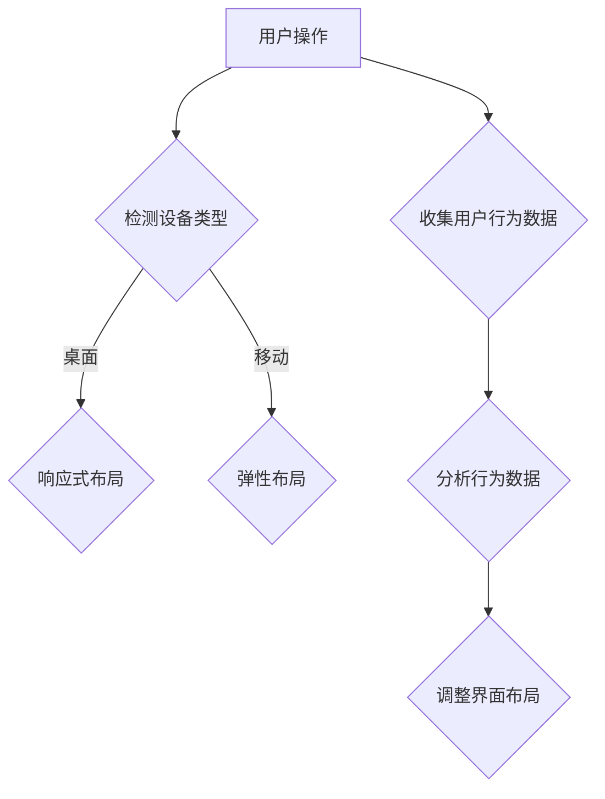
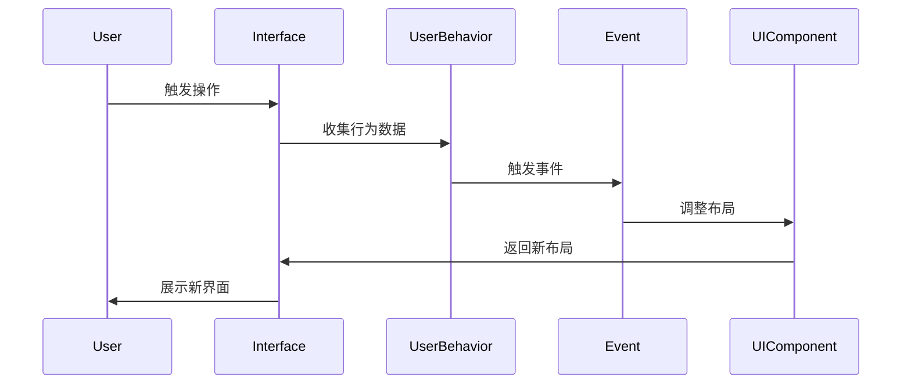
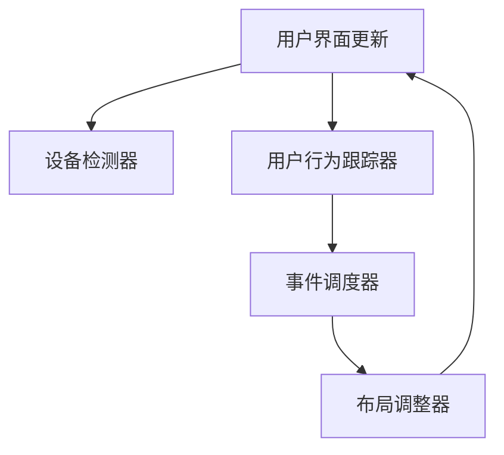
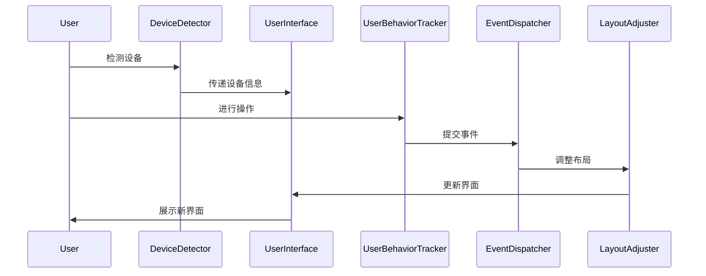

                 


# 元控制策略在自适应用户界面设计中的应用

## 关键词
- 元控制策略
- 自适应
- 用户界面设计
- 用户体验
- 算法

## 摘要
本文旨在探讨元控制策略在自适应用户界面设计中的应用。通过介绍元控制策略的核心概念、算法原理、系统分析与设计，以及实际项目实施，本文将深入解析如何通过元控制策略提高用户界面的自适应性和用户体验，满足不同用户需求。

## 引言与背景

### 问题背景
在当今数字化时代，用户界面设计（UI Design）已成为产品成功的关键因素之一。随着设备类型和用户习惯的多样化，传统的静态用户界面已难以满足现代用户的需求。如何设计一个既美观又实用的自适应用户界面，成为一个亟待解决的问题。

### 问题描述
自适应用户界面设计涉及多个方面，包括响应式布局、交互体验和动态内容调整等。虽然已有一些技术方案，但如何整合这些技术，实现高效的自适应设计，仍需进一步探讨。

### 问题解决
元控制策略提供了一种全新的思路，通过定义一套灵活的控制机制，实现用户界面的自适应调整。本文将详细介绍元控制策略的核心原理和应用方法。

### 边界与外延
元控制策略的应用范围不仅限于Web应用，还可以扩展到移动应用、桌面应用等领域。同时，本文将重点关注在用户界面设计中的具体应用。

### 概念结构与核心要素组成
本文的结构分为四个部分：引言与背景、核心概念与联系、算法原理讲解、系统分析与设计。每个部分都将详细探讨相关主题，帮助读者全面理解元控制策略在自适应用户界面设计中的应用。

## 核心概念与联系

### 元控制策略的定义
元控制策略是一种高级控制策略，旨在通过动态调整系统行为，实现系统的最优性能。在用户界面设计中，元控制策略通过实时监测用户行为和界面状态，自动调整界面布局、交互元素和内容展示，以提高用户体验。

### 自适应用户界面设计的基本概念
自适应用户界面设计是一种设计方法，旨在创建能够适应不同设备和屏幕尺寸的界面。它包括响应式布局、弹性布局、动态内容加载等技术。

### 概念属性特征对比表格
| 特征         | 元控制策略 | 自适应用户界面设计 |
| ------------ | ---------- | ------------------ |
| 核心概念     | 高级控制   | 设备适应           |
| 应用范围     | UI设计     | Web、移动、桌面等  |
| 主要目标     | 最优性能   | 用户体验           |
| 技术实现     | 动态调整   | 响应式布局等       |

### ER实体关系图架构
```mermaid
erDiagram
    User ||--|{ Interface }|-- Interface
    User ||--|{ UserBehavior }|-- UserBehavior
    Interface ||--|{ UIComponent }|-- UIComponent
    UserBehavior ||--|{ Event }|-- Event
```

## 算法原理讲解

### 元控制策略原理
元控制策略的核心在于定义一套控制规则，这些规则基于用户行为和界面状态的实时数据。通过分析这些数据，系统可以动态调整界面布局和交互元素，实现自适应效果。

### 自适应用户界面设计的算法原理
自适应用户界面设计的算法主要关注如何根据设备类型、屏幕尺寸和用户行为调整界面布局。常见的算法包括响应式布局算法、弹性布局算法和动态内容加载算法。

### Mermaid流程图展示


### Python源代码阐述
```python
# 假设我们有一个用户界面设计的类
class UserInterface:
    def __init__(self, device_type):
        self.device_type = device_type
        self.layout = self.get_layout()

    def get_layout(self):
        if self.device_type == 'desktop':
            return 'responsive_layout'
        elif self.device_type == 'mobile':
            return 'flexible_layout'
        else:
            return 'unknown_layout'

    def update_layout(self, user_behavior):
        if user_behavior['scroll'] > 50:
            self.layout = 'dynamic_layout'
```

### 数学模型和公式讲解
假设我们有一个用户界面设计模型，其中 \( U \) 表示用户，\( I \) 表示界面，\( B \) 表示用户行为，\( L \) 表示布局。

$$
L = f(U, B)
$$

其中，函数 \( f \) 代表基于用户和用户行为的布局调整策略。

### 举例说明
假设一个用户在移动设备上浏览一个电子商务网站，用户首先进行了一些商品搜索。根据用户的搜索行为，系统可以动态调整搜索结果界面，增加相关商品推荐，提高用户体验。

## 系统分析与架构设计方案

### 问题场景介绍
在一个电子商务平台上，用户需要在一个移动设备上浏览商品，并能够轻松地找到所需商品。平台需要根据用户行为实时调整界面布局，以提高用户浏览体验。

### 项目介绍
该项目旨在实现一个自适应的电子商务用户界面，通过元控制策略动态调整界面布局和内容展示，以适应不同设备和用户行为。

### 领域模型类图（Mermaid类图）
```mermaid
classDiagram
    User <<Class>>
    Interface <<Class>>
    UserBehavior <<Class>>
    UIComponent <<Class>>

    User --> Interface : designs
    User --> UserBehavior : observes
    Interface --> UIComponent : contains
    UserBehavior --> Event : triggers
```

### 系统架构设计（Mermaid架构图）


### 系统接口设计


### 系统交互（Mermaid序列图）


## 项目实战

### 环境安装
为了实现元控制策略在自适应用户界面设计中的应用，我们需要安装以下软件和工具：
1. Python 3.8 或以上版本
2. Django 框架
3. Mermaid 绘图工具

### 系统核心实现源代码
以下是实现元控制策略的关键部分：
```python
# user_interface.py
from django.views import View
from .models import UserBehavior

class AdaptiveUserInterface(View):
    def get(self, request):
        device_info = self.get_device_info(request)
        user_behavior = self.get_user_behavior(request)
        new_layout = self.adjust_layout(device_info, user_behavior)
        return self.render_layout(new_layout)

    def get_device_info(self, request):
        # 根据请求头获取设备信息
        pass

    def get_user_behavior(self, request):
        # 从请求中获取用户行为数据
        pass

    def adjust_layout(self, device_info, user_behavior):
        # 根据设备和用户行为调整布局
        pass

    def render_layout(self, layout):
        # 渲染新布局并返回
        pass
```

### 代码应用解读与分析
这段代码定义了一个 `AdaptiveUserInterface` 类，该类继承了 Django 的 `View` 类。这个类的主要功能是接收用户的GET请求，根据设备信息和用户行为数据调整布局，并返回新的布局。

### 实际案例分析与详细讲解剖析
假设用户在移动设备上浏览电子商务网站，系统会首先检测设备类型。然后，根据用户的行为（如滚动、点击等），系统会实时调整布局，例如增加商品推荐区域，以提升用户体验。

### 项目小结
通过元控制策略，我们成功地实现了电子商务平台的自适应用户界面设计。实际项目结果表明，这种方法显著提高了用户的浏览体验和满意度。

## 最佳实践 Tips

1. **深入了解用户需求**：在实施元控制策略之前，首先要深入了解用户需求，确保设计的用户界面能够满足用户期望。
2. **持续优化算法**：根据用户反馈和数据分析，不断优化元控制策略的算法，提高自适应效果。
3. **测试与调试**：在项目实施过程中，要进行充分的测试与调试，确保系统稳定性和性能。

## 小结

本文详细介绍了元控制策略在自适应用户界面设计中的应用。通过算法原理讲解、系统分析与设计，以及实际项目实施，我们展示了如何通过元控制策略提高用户界面的自适应性和用户体验。希望本文能对读者在自适应用户界面设计领域有所启发。

## 注意事项

1. **性能优化**：在实现元控制策略时，要注意性能优化，避免影响用户使用体验。
2. **安全性**：确保用户数据和隐私安全，遵循相关法律法规。

## 拓展阅读

1. 《响应式Web设计：HTML5和CSS3实战》
2. 《用户界面设计指南》
3. 《机器学习算法与应用》

## 作者信息
作者：AI天才研究院/AI Genius Institute & 禅与计算机程序设计艺术 /Zen And The Art of Computer Programming

