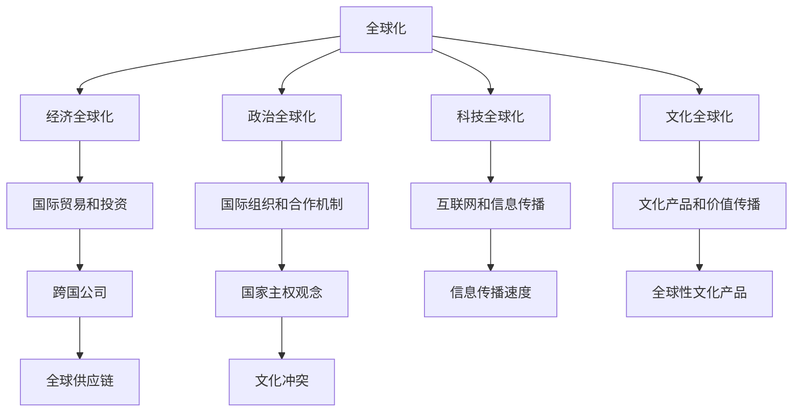
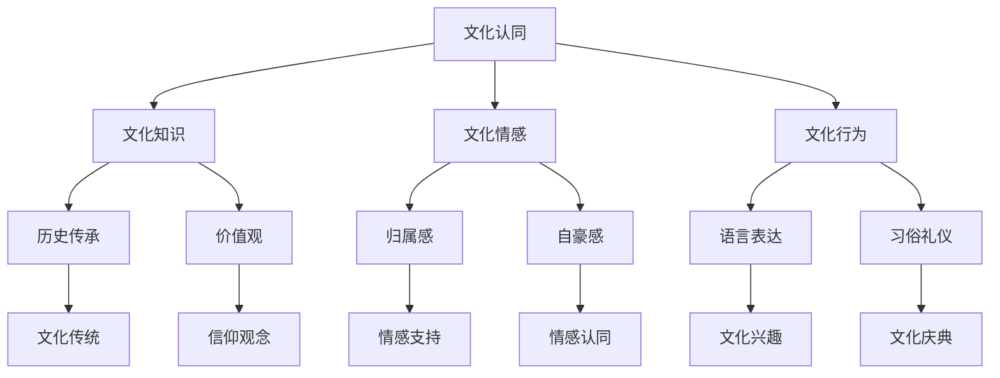
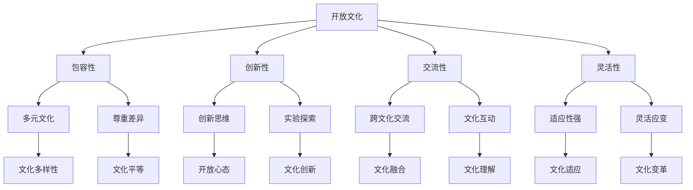
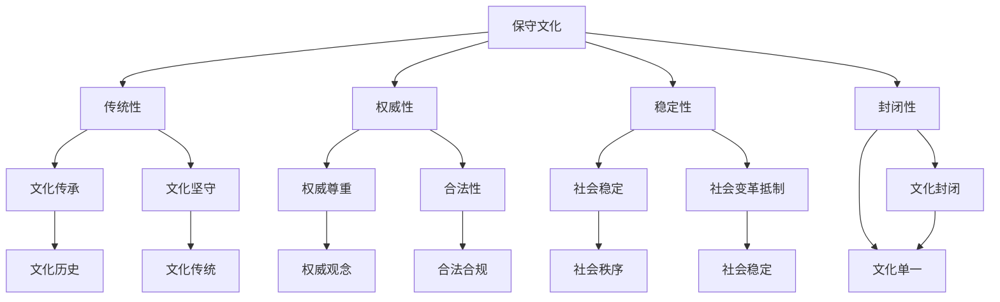

                 

### 引言

在全球化的浪潮中，文化交流和融合成为不可逆转的趋势。全球化不仅仅是经济、政治和科技的融合，更是文化的碰撞与交流。在这种大背景下，文化认同成为一个重要的议题。文化认同不仅仅是指个体对自身文化的认同，更是涉及到整个社会如何在多元文化共存的环境下，找到自我认同与共存的平衡。

**关键词**：全球化、文化认同、文化融合、多元文化、平衡

**摘要**：本文将探讨全球化背景下的文化认同问题，分析开放与保守两种文化观念的优劣势，并尝试寻找在全球化背景下文化认同的平衡点。通过国内外实践案例的剖析，本文将提供关于文化认同建设的一些思考和建议。

### 1. 全球化背景下的文化认同

#### 1.1 全球化趋势与文化交流

全球化使世界变得更加紧密，人们跨越国界，流动更加频繁。这种趋势不仅在经济、科技领域产生深远影响，也在文化层面带来了巨大的变化。文化交流的加深，使得不同文化之间的接触和碰撞更加频繁，这既带来了文化的丰富和多元化，也引发了文化认同的挑战。

**核心概念与联系**：

**全球化**：指世界各国家和地区在经济、政治、文化等方面的深度融合，以全球范围内的相互依存和互动为特征。

**文化交流**：指不同文化之间的相互接触、了解和互动，通过信息、思想、价值观等的传递和交流，实现文化的共享和融合。

**文化认同**：指个体或群体对自身文化的认知、认同和归属感，包括对文化的情感、价值观、信仰等方面的认同。

**全球化背景下的文化认同**：在全球化背景下，文化认同面临着多元文化共存、文化融合、文化冲突等多重挑战，需要寻找新的平衡点。

#### 1.1.1 全球化背景

全球化是一个复杂且多维度的过程，其背景因素包括：

- **经济全球化**：国际贸易和投资的自由化，跨国公司的发展，全球供应链的建立等。
- **政治全球化**：国际组织和国际合作机制的增多，国家主权观念的变化等。
- **科技全球化**：互联网、信息技术的发展，信息传播速度的加快等。
- **文化全球化**：文化产品和价值的跨国传播，文化交流活动的增多等。

全球化对文化的影响表现在：

- **文化的多元化**：全球化使得不同文化有机会相互接触和交流，文化多样性得以体现和丰富。
- **文化同质化**：全球化也带来了文化的同质化现象，一些全球性文化产品如好莱坞电影、流行音乐等在全球范围内广泛传播，导致某些文化特征的普及。
- **文化冲突**：不同文化之间的价值观和生活方式的差异，可能导致文化冲突和认同危机。

**ER实体关系图架构**：

#### 1.1.2 文化交流的影响

文化交流的影响可以从以下几个方面进行阐述：

- **文化认知的变化**：随着文化交流的加深，人们对自己和他人文化的认知发生变化，对其他文化的理解和接受程度提高。
- **文化价值观的冲突与融合**：不同文化价值观之间的碰撞和冲突可能导致文化认同的危机，但也为文化的融合提供了机会。
- **文化创新**：文化交流和融合往往激发文化创新，新的文化形式和表达方式得以产生。
- **文化多样性的保护**：在全球化背景下，如何保护和发展本土文化成为重要议题。

**核心概念属性特征对比表格**：

| 特征       | 全球化                                  | 文化交流                                  |
| ---------- | ------------------------------------- | ------------------------------------- |
| 定义       | 全球范围内的相互依存和互动             | 不同文化之间的相互接触、了解和互动          |
| 影响       | 经济、政治、科技、文化等方面的影响     | 文化认知的变化、价值观的冲突与融合、文化创新 |
| 目的       | 促进国际合作与发展                     | 保护文化多样性、促进文化融合                |
| 类型       | 经济全球化、政治全球化、科技全球化、文化全球化 | 跨国文化交流、本土文化交流、全球性文化产品传播 |

**总结**：

全球化趋势下，文化交流的影响深远而复杂。它既带来了文化的丰富和多元化，也引发了文化认同的挑战。在这种背景下，文化认同的重要性愈加凸显，如何在开放与保守之间找到平衡，是每一个社会都需要面对的问题。

### 1.2 文化认同的定义与重要性

#### 1.2.1 文化认同的概念

文化认同是一个多维度的概念，它不仅涉及个体层面的文化归属感，还涵盖群体层面的文化认同。从个体层面来看，文化认同是指个体对自己所属文化的认知、情感和归属感；从群体层面来看，文化认同是指一个群体对其共同文化的认可和坚守。

文化认同的构成要素包括：

- **文化知识**：个体或群体对自身文化传统、历史、价值观和习俗的了解和掌握。
- **文化情感**：个体或群体对自身文化的情感联系和情感认同，如自豪感、归属感和情感支持。
- **文化行为**：个体或群体在日常生活中表现出的文化特征和价值观，如语言、习俗、礼仪等。

**核心概念属性特征对比表格**：

| 特征       | 个体层面文化认同                          | 群体层面文化认同                          |
| ---------- | ------------------------------------- | ------------------------------------- |
| 构成要素   | 文化知识、文化情感、文化行为               | 文化知识、文化情感、文化行为、群体认同感     |
| 层次结构   | 个人认知、情感和行为层面                    | 个人认知、情感和行为层面，以及群体层面的共同认同 |
| 影响因素   | 个人成长背景、文化环境、社会互动           | 社会背景、文化环境、历史传承、社会互动       |
| 表现形式   | 个人行为、语言表达、文化兴趣               | 社会习俗、文化庆典、文化传统                 |

**ER实体关系图架构**：

#### 1.2.2 文化认同的重要性

文化认同的重要性体现在以下几个方面：

1. **社会稳定与凝聚力**：文化认同是社会成员共同认同的价值观和生活方式，是维系社会稳定和凝聚力的基础。一个社会成员对自身文化的认同感越强，越容易形成社会共识，从而增强社会的稳定性。

2. **民族自豪感与国家认同**：文化认同是民族自豪感和国家认同的重要组成部分。一个民族对自己的文化传统和历史有强烈的认同感，会增强民族自豪感和国家凝聚力。

3. **文化多样性的保护**：文化认同是文化多样性的保障。在全球化的背景下，保护和发展本土文化，需要建立强大的文化认同，以抵御文化同质化的冲击。

4. **文化创新与发展**：文化认同不仅是对传统文化的继承和发扬，也是文化创新的动力。在文化认同的基础上，文化可以更加开放和包容，促进文化的创新和发展。

**总结**：

文化认同是一个复杂而重要的概念，它涉及到个体和群体的多层次认同。在全球化的背景下，文化认同的重要性愈加凸显。通过建立强大的文化认同，可以增强社会凝聚力、民族自豪感和文化多样性，从而实现文化的可持续发展。

### 1.3 开放与保守的文化观念

#### 1.3.1 开放文化的特点

开放文化是一种包容多元、鼓励创新的文化观念。它具有以下几个特点：

1. **包容性**：开放文化强调多元文化并存，尊重不同文化的差异和特点，反对文化霸权和歧视。

2. **创新性**：开放文化鼓励创新思维和实验，不断探索新的文化形式和表达方式，推动文化的进步和发展。

3. **交流性**：开放文化倡导跨文化交流和互动，通过文化交流增进理解，促进文化融合。

4. **灵活性**：开放文化具有适应性和灵活性，能够迅速适应外部变化和文化冲击，保持文化的活力。

**核心概念属性特征对比表格**：

| 特征       | 开放文化                                       | 保守文化                                       |
| ---------- | -------------------------------------------- | -------------------------------------------- |
| 包容性     | 包容多元文化，尊重差异                         | 保守传统，强调文化一致性                       |
| 创新性     | 鼓励创新思维和实验                             | 反对创新，坚守传统                             |
| 交流性     | 倡导跨文化交流和互动                           | 缺乏交流，封闭保守                             |
| 灵活性     | 适应性强，灵活应对外部变化                       | 矩阵化，缺乏灵活应变能力                       |

**ER实体关系图架构**：

#### 1.3.2 保守文化的特点

保守文化是一种强调传统、尊重权威的文化观念。它具有以下几个特点：

1. **传统性**：保守文化强调对传统文化的坚守和传承，认为传统文化是社会的基石，应当得到保护和尊重。

2. **权威性**：保守文化尊重权威和传统，认为权威和传统具有指导社会行为的合法性。

3. **稳定性**：保守文化注重社会稳定，反对社会变革，认为变革可能导致社会动荡。

4. **封闭性**：保守文化往往封闭保守，缺乏对外部文化的包容和接纳，容易导致文化单一化。

**核心概念属性特征对比表格**：

| 特征       | 开放文化                                       | 保守文化                                       |
| ---------- | -------------------------------------------- | -------------------------------------------- |
| 传统性     | 鼓励创新，推动文化进步                         | 坚守传统，反对文化变革                         |
| 权威性     | 包容多元，尊重个人差异                         | 尊重权威，强调合法合规                         |
| 稳定性     | 适应性强，灵活应对外部变化                       | 注重稳定，反对社会变革                         |
| 封闭性     | 倡导交流，促进文化融合                         | 封闭保守，缺乏对外部文化的包容和接纳           |

**ER实体关系图架构**：

**总结**：

开放文化和保守文化各自有其特点，前者强调多元、创新和交流，后者强调传统、权威和稳定。在全球化背景下，如何平衡这两种文化观念，找到文化认同的平衡点，是一个需要深入探讨的问题。

### 2. 文化认同的挑战与应对

#### 2.1 开放文化的优势与挑战

开放文化在全球化背景下具有显著的优势，但也面临着一些挑战。

**优势**：

1. **文化多样性的增强**：开放文化鼓励多元文化的共存和交流，有助于增强文化多样性，促进文化的繁荣和发展。

2. **文化创新的推动**：开放文化倡导创新思维和实验，为文化创新提供了广阔的空间，有利于文化的进步和变革。

3. **文化融合的可能性**：开放文化强调跨文化交流和互动，有助于不同文化之间的理解和融合，推动全球文化的共同发展。

4. **适应能力**：开放文化具有更强的适应性和灵活性，能够迅速应对外部变化和文化冲击，保持文化的活力。

**挑战**：

1. **文化冲突**：开放文化可能导致不同文化之间的冲突和摩擦，影响社会的和谐与稳定。

2. **文化同质化**：在全球化背景下，一些全球性文化产品如好莱坞电影、流行音乐等可能占据主导地位，导致文化同质化，削弱本土文化的独特性。

3. **文化认同危机**：开放文化可能导致文化认同的危机，个体或群体可能因为文化的多元化和融合而失去对自身文化的认同感。

**应对策略**：

1. **增强文化自信**：通过教育、宣传等途径，增强人们对自身文化的认同感和自信心，促进文化自信的建设。

2. **保护本土文化**：制定相关政策，保护和发展本土文化，防止文化同质化，维护文化多样性。

3. **加强文化交流与融合**：鼓励不同文化之间的交流与融合，通过文化交流增进理解和认同，促进文化的共同发展。

4. **构建和谐文化环境**：营造包容和谐的文化环境，通过法律、道德等规范，减少文化冲突，增强社会凝聚力。

#### 2.2 保守文化的优势与挑战

保守文化在维护社会稳定和文化传承方面具有独特的优势，但也存在一些挑战。

**优势**：

1. **社会稳定**：保守文化强调社会稳定，反对社会变革，有助于维护社会的和谐与稳定。

2. **文化传承**：保守文化注重对传统文化的传承和发扬，有助于保护和传承本土文化，维护文化多样性。

3. **社会认同**：保守文化强调对权威和传统的尊重，有助于增强社会成员的认同感和归属感，增强社会凝聚力。

4. **社会规范**：保守文化往往具备严格的社会规范和伦理观念，有助于维护社会秩序和道德底线。

**挑战**：

1. **文化封闭**：保守文化可能封闭保守，缺乏对外部文化的包容和接纳，导致文化的单一化和僵化。

2. **文化滞后**：保守文化可能因为对传统的坚守而导致文化的滞后，难以适应快速变化的社会环境。

3. **创新不足**：保守文化往往缺乏创新精神，容易导致文化发展的停滞和落后。

**应对策略**：

1. **保持文化活力**：在尊重传统的基础上，鼓励文化创新，推动传统文化的现代转型，增强文化的活力。

2. **开放文化交流**：通过文化交流，吸取其他文化的优点，丰富和拓展本土文化，促进文化的多元化。

3. **培养文化自信**：通过教育、宣传等途径，增强人们对自身文化的认同感和自信心，推动文化自信的建设。

4. **完善文化规范**：在维护社会规范的同时，不断完善文化规范，使之适应社会发展的需求。

#### 2.3 寻找文化认同的平衡点

在全球化背景下，如何在开放与保守之间找到文化认同的平衡点，是一个重要而复杂的议题。以下是一些可能的策略：

1. **多元文化共存**：尊重多元文化的存在，促进不同文化之间的交流与融合，实现文化共存。

2. **文化自信**：在开放的过程中，保持对自身文化的自信，避免盲目崇拜外部文化，增强文化认同感。

3. **文化保护**：在保护本土文化的基础上，推动文化创新，实现文化的传承与发展。

4. **文化教育**：通过教育，增强人们对文化的理解和认同，提高文化素养，促进文化认同的建设。

5. **政策引导**：制定相关政策，引导文化的发展方向，实现文化认同与社会发展的和谐。

**总结**：

文化认同是一个复杂且多维度的议题，开放与保守文化观念各有其优劣势。在全球化背景下，如何在开放与保守之间找到平衡点，是每一个社会都需要面对的挑战。通过增强文化自信、保护本土文化、促进文化交流与融合、加强文化教育和政策引导，可以逐步实现文化认同的平衡与发展。

### 3. 文化认同的实践探索

#### 3.1 国内外文化认同的实践案例

在全球化的背景下，不同国家和地区都在积极探索文化认同的建设，以下是一些国内外典型的实践案例：

**国内案例：中国传统文化复兴运动**

中国传统文化复兴运动是中国在全球化背景下，为增强文化认同感而采取的一系列措施。这一运动主要包括以下几个方面：

1. **文化教育**：通过中小学教材的修订，加强传统文化教育，将中国历史、文学、哲学等内容纳入课程体系。

2. **文化遗产保护**：加大对文化遗产的保护力度，修缮古建筑、修复文物，推动非物质文化遗产的保护和传承。

3. **文化活动**：举办各类传统文化活动，如书法比赛、诗词大会、传统节日庆祝等，提高公众对传统文化的兴趣和认同。

**国际案例：加拿大多元文化政策**

加拿大作为多元文化国家，其多元文化政策是其文化认同建设的重要手段。具体措施包括：

1. **多元文化教育**：在学校教育中，融入不同民族和文化的教学内容，鼓励学生了解和尊重其他文化。

2. **文化政策支持**：政府制定一系列支持多元文化发展的政策，如文化补助、社区支持等，促进各民族文化的繁荣。

3. **文化交流活动**：举办各类文化交流活动，如文化节、音乐会、艺术展览等，增进不同文化之间的理解和认同。

#### 3.2 文化认同政策与策略

为了实现文化认同的建设，政府和社会各界需要采取一系列的政策和策略：

1. **文化政策制定**：政府应制定明确的文化政策，包括文化保护、文化传承、文化发展等方面的内容，为文化认同建设提供法律和政策保障。

2. **文化基础设施建设**：加大对文化基础设施的投入，如博物馆、图书馆、文化中心等，为文化认同提供物质支持。

3. **文化交流与传播**：通过文化交流与传播，扩大本土文化的影响力，提高公众对文化的认同感。

4. **文化教育普及**：在各级教育体系中，加强文化教育，培养学生的文化认同感和文化素养。

5. **文化产业发展**：通过文化产业的发展，推动文化产品的创新和传播，增强文化的活力和影响力。

#### 3.3 个人与社区层面的文化认同建设

除了政府和社会层面的努力，个人与社区层面的文化认同建设同样重要。以下是一些建议：

1. **个人文化素养提升**：个人应主动学习传统文化，提高自身文化素养，增强文化认同感。

2. **社区文化活动**：社区可以组织各类文化活动，如节日庆典、民俗活动、艺术展览等，增强社区成员的文化认同。

3. **文化传承与保护**：个人和社区应积极参与文化传承和保护工作，如修复文化遗产、记录民俗活动等。

4. **文化互动与交流**：通过文化互动与交流，增进不同文化之间的理解和认同，促进文化的融合与发展。

**总结**：

文化认同的建设是一个长期而复杂的工程，需要政府、社会、个人和社区的共同努力。通过制定合理的政策和策略，加强文化教育和基础设施建设，推动文化交流与传播，个人和社区层面的积极参与，可以实现文化认同的平衡与发展。

### 结论：文化认同的平衡与发展

在全球化的背景下，文化认同的重要性愈发凸显。开放与保守两种文化观念各具优劣势，如何在它们之间找到平衡，实现文化认同的健康发展，是一个复杂而艰巨的任务。通过上述分析和实践探索，我们可以得出以下结论：

**1. 多元文化共存的重要性**：在全球化的浪潮中，尊重和包容多元文化是实现文化认同平衡的基础。

**2. 文化自信的必要性**：在开放与融合的过程中，保持对自身文化的自信，是文化认同建设的重要保障。

**3. 文化保护与创新的平衡**：在传承和保护传统文化的基础上，推动文化创新，使文化更具活力和影响力。

**4. 政策与策略的支撑**：政府和社会各界应制定和实施合理的政策和策略，为文化认同建设提供强有力的支持。

**5. 个人与社区参与的关键性**：个人和社区在文化认同建设中扮演着重要角色，他们的积极参与是文化认同平衡发展的关键。

**未来展望**：

随着全球化进程的加快，文化认同建设将面临新的挑战和机遇。未来，我们应继续加强文化交流与传播，推动文化多样性的保护与发展，探索更加有效的文化认同建设策略。通过全社会的共同努力，我们有望实现文化认同的平衡与发展，构建一个多元、和谐、包容的全球文化共同体。

**结语**：

文化认同不仅关系到社会稳定和民族自豪感，更是文化创新和发展的动力源泉。让我们携手共进，寻找文化认同的平衡点，为构建一个更加美好、多元的全球文化环境而努力。

**作者**：

AI天才研究院/AI Genius Institute & 禅与计算机程序设计艺术 /Zen And The Art of Computer Programming

