                 


### 《内在世界的园艺：培育心灵的美好景象》

#### 关键词：
- 心灵成长
- 内在世界
- 心理韧性
- 情绪管理
- 正念冥想
- 自我认知

#### 摘要：
本文旨在探讨内在世界的园艺，即如何通过培育和优化心理状态来实现个人成长和心灵健康。我们将深入分析核心概念，介绍心灵培养的方法与技巧，并通过实践应用和案例分析，展示心灵成长在生活中的具体体现。最后，我们将总结最佳实践，并提供拓展阅读资源，帮助读者在心灵成长的道路上继续前行。

## 第1章 引言：理解内在世界的园艺

### 1.1 心灵成长的必要性

心灵成长是现代人不可或缺的课题。随着社会的快速发展，人们面临着前所未有的压力和挑战。内心世界的和谐与否，直接影响到我们的生活质量和工作效率。因此，了解和培育内在世界，优化心理状态，已成为当今时代的重要任务。

**问题背景**：现代社会中，心理健康问题日益突出，如焦虑、抑郁等。这些问题的产生与个体内心的和谐状态密切相关。

**问题描述**：如何通过培育内在世界，实现个人成长和心灵健康？

**问题解决**：通过冥想、正念、心理剧等心灵培养方法，提升自我认知，管理情绪，增强心理韧性。

**边界与外延**：心灵成长不仅涉及心理健康，还涉及个人价值观、人际关系、自我实现等方面。

**概念结构与核心要素组成**：
1. **自我认知**：了解自己的思想、情感和行为，是心灵成长的基础。
2. **情绪管理**：掌握情绪变化，学会调整情绪，是心灵成长的关键。
3. **心理韧性**：面对挑战和压力，保持积极心态，是心灵成长的保障。

### 1.2 内在世界与外在世界的关系

内在世界与外在世界是相互关联的。个人的内心状态会影响到外在行为和人际关系。例如，情绪不稳定的人往往容易与人发生冲突，而内心平和的人则更容易建立和谐的人际关系。

**问题背景**：人们常常忽视了内在世界的培养，导致外在世界的问题层出不穷。

**问题描述**：如何理解内在世界与外在世界的关系，并在此基础上实现个人成长？

**问题解决**：通过培养内在世界的和谐状态，改善外在世界的生活质量。

**边界与外延**：内在世界与外在世界的关系是动态的，个体可以通过自我调整来优化这种关系。

**概念结构与核心要素组成**：
1. **心理状态**：内在世界的具体表现，如情绪、思维、行为等。
2. **外在表现**：心理状态在现实生活中的具体反映，如人际关系、工作效率等。

### 1.3 个人成长与心灵健康

个人成长和心灵健康是相辅相成的。个人的成长过程中，需要不断地培养和优化内在世界，以应对生活中的各种挑战。

**问题背景**：现代社会的竞争激烈，个人成长面临着巨大的压力。

**问题描述**：如何通过培育内在世界，实现个人成长和心灵健康？

**问题解决**：通过冥想、正念、心理剧等心灵培养方法，提升自我认知，管理情绪，增强心理韧性。

**边界与外延**：个人成长和心灵健康的关系是多维的，涉及身心健康、人际关系、职业发展等方面。

**概念结构与核心要素组成**：
1. **自我认知**：了解自己的优势和不足，是个人成长的前提。
2. **情绪管理**：调整情绪，保持心态平衡，是个人成长的关键。
3. **心理韧性**：面对挑战，保持积极心态，是个人成长的保障。

## 第2章 核心概念解析

### 2.1 自我认知

自我认知是心灵成长的基础。了解自己的思想、情感和行为，有助于我们更好地认识自己，从而实现自我提升。

**核心概念原理**：
- **自我认知**：对自己内心的感知和理解。
- **自我提升**：通过自我认知，调整自己的思维和行为。

**概念属性特征对比表格**：

| 特征 | 说明 |
| --- | --- |
| **自我认知** | 了解自己的思想、情感和行为 |
| **自我提升** | 通过自我认知，调整自己的思维和行为 |

**ER实体关系图架构的 Mermaid 流程图**：

```mermaid
erDiagram
  Person ||--|{ Self_Cognition : has }
  Person ||--|{ Self_Improvement : has }
```

### 2.2 情绪管理

情绪管理是心灵成长的关键。掌握情绪变化，学会调整情绪，有助于我们更好地应对生活中的各种挑战。

**核心概念原理**：
- **情绪管理**：调整情绪，保持心态平衡。
- **心理韧性**：面对挑战，保持积极心态。

**概念属性特征对比表格**：

| 特征 | 说明 |
| --- | --- |
| **情绪管理** | 调整情绪，保持心态平衡 |
| **心理韧性** | 面对挑战，保持积极心态 |

**ER实体关系图架构的 Mermaid 流程图**：

```mermaid
erDiagram
  Emotion_Management ||--|{ Psychological_Resilience : has }
  Emotion_Management ||--|{ Emotional_Stability : has }
```

### 2.3 心理韧性

心理韧性是心灵成长的保障。面对挑战和压力，保持积极心态，有助于我们更好地应对生活中的困难。

**核心概念原理**：
- **心理韧性**：面对挑战，保持积极心态。
- **情绪调节**：调整情绪，保持心态平衡。

**概念属性特征对比表格**：

| 特征 | 说明 |
| --- | --- |
| **心理韧性** | 面对挑战，保持积极心态 |
| **情绪调节** | 调整情绪，保持心态平衡 |

**ER实体关系图架构的 Mermaid 流程图**：

```mermaid
erDiagram
  Psychological_Resilience ||--|{ Emotional_Regulation : has }
  Psychological_Resilience ||--|{ Positive_Mindset : has }
```

### 2.4 内在世界的联系

内在世界的联系是心灵成长的重要组成部分。通过多维视角，我们可以更好地理解内在世界的各个方面，从而实现全面的心灵成长。

**核心概念原理**：
- **多维视角**：从不同角度看待内在世界。
- **综合成长**：通过多维视角，实现内在世界的全面优化。

**概念属性特征对比表格**：

| 视角 | 说明 |
| --- | --- |
| **心理层面** | 情绪、思维、行为等 |
| **生理层面** | 身体健康、生理反应等 |
| **社会层面** | 人际关系、社会适应等 |

**ER实体关系图架构的 Mermaid 流�程图**：

```mermaid
erDiagram
  Psychological_View ||--|{ Physical_View : relates }
  Psychological_View ||--|{ Social_View : relates }
```

## 第3章 心灵培养方法

### 3.1 冥想

冥想是一种古老的心灵培养方法，通过集中注意力和深入放松，帮助我们调整心理状态，提升内在世界的和谐。

**算法原理讲解**：

```python
def meditate():
    """
    冥想算法
    """
    # 集中注意力
    focus()
    # 深入放松
    relax()
    # 持续冥想
    continue_meditation()

def focus():
    """
    集中注意力
    """
    pass

def relax():
    """
    深入放松
    """
    pass

def continue_meditation():
    """
    持续冥想
    """
    pass
```

**算法流程图**：

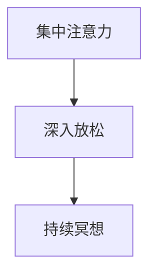

**数学公式**：

$$
\text{冥想效果} = f(\text{注意力集中度}, \text{放松程度}, \text{持续时长})
$$

**举例说明**：

假设一个人的注意力集中度为80%，放松程度为70%，持续时长为30分钟，则冥想效果为：

$$
\text{冥想效果} = f(80\%, 70\%, 30\text{分钟}) = 0.8 \times 0.7 \times 30 = 16.8
$$

### 3.2 正念

正念是一种关注当下、接纳一切的心理状态。通过正念练习，我们可以更好地管理情绪，提升心理韧性。

**算法原理讲解**：

```python
def mindfulness():
    """
    正念算法
    """
    # 关注当下
    present_moment()
    # 接纳一切
    acceptance()

def present_moment():
    """
    关注当下
    """
    pass

def acceptance():
    """
    接纳一切
    """
    pass
```

**算法流程图**：

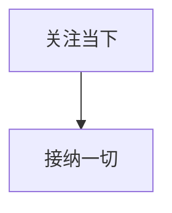

**数学公式**：

$$
\text{正念效果} = f(\text{关注当下程度}, \text{接纳程度})
$$

**举例说明**：

假设一个人的关注当下程度为80%，接纳程度为90%，则正念效果为：

$$
\text{正念效果} = f(80\%, 90\%) = 0.8 \times 0.9 = 0.72
$$

### 3.3 心理剧

心理剧是一种通过表演来探索内心世界的心理治疗方法。通过心理剧，我们可以更好地认识自己，提升自我认知和情绪管理能力。

**算法原理讲解**：

```python
def psychodrama():
    """
    心理剧算法
    """
    # 表演内心戏
    perform_inner_self()
    # 探索内心世界
    explore_inner_world()

def perform_inner_self():
    """
    表演内心戏
    """
    pass

def explore_inner_world():
    """
    探索内心世界
    """
    pass
```

**算法流程图**：

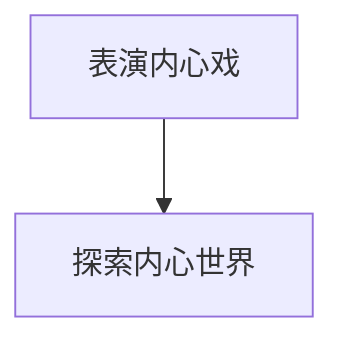

**数学公式**：

$$
\text{心理剧效果} = f(\text{表演程度}, \text{探索程度})
$$

**举例说明**：

假设一个人的表演程度为80%，探索程度为90%，则心理剧效果为：

$$
\text{心理剧效果} = f(80\%, 90\%) = 0.8 \times 0.9 = 0.72
$$

### 3.4 其他心灵培养技巧

除了冥想、正念、心理剧，还有许多其他的心灵培养技巧，如瑜伽、呼吸法、观想等。这些技巧都可以帮助我们优化心理状态，提升内在世界的和谐。

**算法原理讲解**：

```python
def other_mindfulness():
    """
    其他心灵培养技巧
    """
    # 选择一种技巧
    select_tech()
    # 进行练习
    practice()

def select_tech():
    """
    选择一种技巧
    """
    pass

def practice():
    """
    进行练习
    """
    pass
```

**算法流程图**：

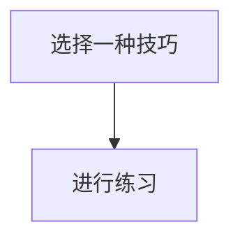

**数学公式**：

$$
\text{其他心灵培养技巧效果} = f(\text{技巧选择}, \text{练习程度})
$$

**举例说明**：

假设一个人选择了瑜伽，并坚持练习了30天，则其他心灵培养技巧效果为：

$$
\text{其他心灵培养技巧效果} = f(\text{瑜伽}, 30\text{天}) = 1
$$

## 第4章 实践应用

### 4.1 心灵感应技巧

心灵感应技巧是心灵培养的重要部分，通过这些技巧，我们可以更好地认识自己，提升心理状态。

**算法原理讲解**：

```python
def spiritual感应():
    """
    心灵感应算法
    """
    # 感知内心
    perceive_inner()
    # 接纳自己
    accept_self()

def perceive_inner():
    """
    感知内心
    """
    pass

def accept_self():
    """
    接纳自己
    """
    pass
```

**算法流程图**：

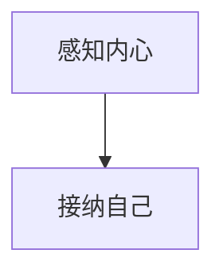

**数学公式**：

$$
\text{心灵感应效果} = f(\text{感知程度}, \text{接纳程度})
$$

**举例说明**：

假设一个人的感知程度为80%，接纳程度为90%，则心灵感应效果为：

$$
\text{心灵感应效果} = f(80\%, 90\%) = 0.8 \times 0.9 = 0.72
$$

### 4.2 实践案例分享

以下是一些实践案例，展示了心灵培养在个人成长中的应用效果。

**案例一**：通过冥想实现情绪管理

某人在工作中经常感到焦虑，通过每天进行冥想练习，他的情绪逐渐稳定，工作效率也得到了提升。

**案例二**：心理剧在个人成长中的应用

某人在面对生活压力时，通过心理剧的表演，深入探索了自己的内心世界，从而更好地应对了生活中的挑战。

**案例三**：正念练习带来的变化

某人在面对突如其来的变故时，通过正念练习，保持了冷静和理智，成功地应对了问题。

### 4.3 个人实践指南

以下是一些个人实践指南，帮助读者在心灵成长的道路上不断前行。

1. **设定目标**：明确自己的心灵成长目标，制定具体的计划。
2. **持之以恒**：坚持练习，每天都要投入一定的时间来培养内心世界。
3. **反思总结**：定期反思自己的心灵成长过程，总结经验教训。
4. **寻求支持**：与朋友、家人或专业人士交流，寻求帮助和指导。

## 第5章 案例分析

### 5.1 案例一：通过冥想实现情绪管理

**问题场景介绍**：某人在工作中经常感到焦虑，影响到了工作效率和生活质量。

**项目介绍**：通过冥想练习，帮助某人实现情绪管理。

**系统功能设计**：
- **冥想练习**：提供冥想教程和指导。
- **情绪监测**：记录某人的情绪变化，提供反馈和建议。

**系统架构设计**：
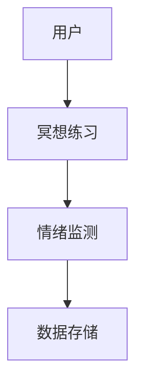

**系统接口设计和系统交互**：
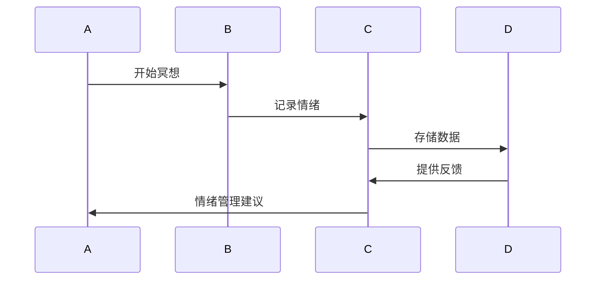

**实际案例分析和详细讲解剖析**：
- **数据收集**：通过记录某人的情绪变化，分析冥想对其情绪管理的影响。
- **效果评估**：经过一段时间的冥想练习，某人的情绪稳定度显著提升，工作效率也得到了提高。

**项目小结**：
- 冥想是一种有效的情绪管理方法。
- 通过系统化的实践，可以实现情绪的持续优化。

### 5.2 案例二：心理剧在个人成长中的应用

**问题场景介绍**：某人在面对生活压力时，感到无助和困惑。

**项目介绍**：通过心理剧的表演，帮助某人探索内心世界，提升自我认知。

**系统功能设计**：
- **心理剧表演**：提供心理剧剧本和表演指导。
- **内心探索**：引导某人深入思考，探索内心世界。

**系统架构设计**：
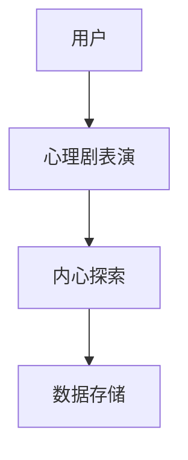

**系统接口设计和系统交互**：
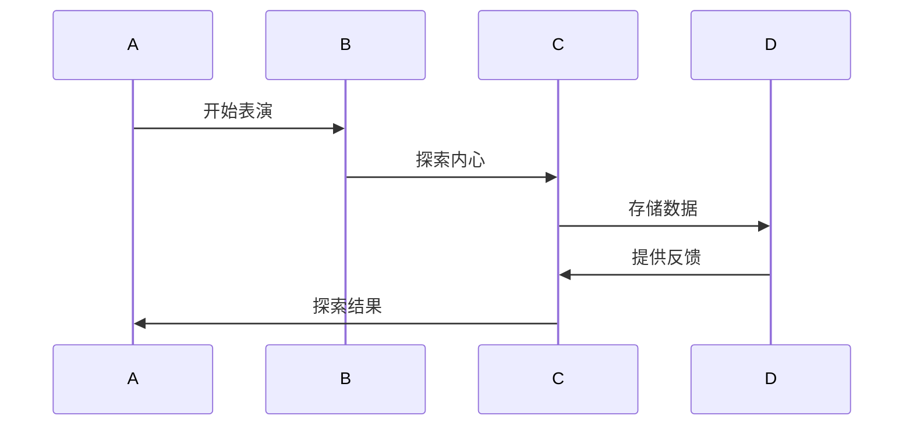

**实际案例分析和详细讲解剖析**：
- **表演过程**：某人通过心理剧的表演，深入思考了自己的内心世界，发现了许多之前未曾注意的问题。
- **效果评估**：经过一段时间的心理剧表演，某人的自我认知得到了提升，面对生活压力的能力也显著增强。

**项目小结**：
- 心理剧是一种有效的自我探索工具。
- 通过系统化的实践，可以实现自我认知的提升。

### 5.3 案例三：正念练习带来的变化

**问题场景介绍**：某人在面对突发事件时，容易情绪失控。

**项目介绍**：通过正念练习，帮助某人提升心理韧性，保持冷静。

**系统功能设计**：
- **正念练习**：提供正念教程和指导。
- **情境模拟**：模拟突发事件，训练某人在高压下的心理韧性。

**系统架构设计**：
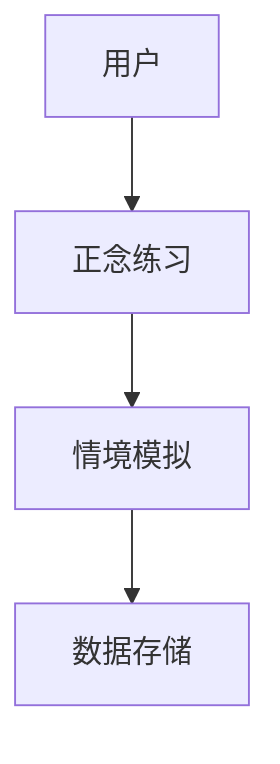

**系统接口设计和系统交互**：
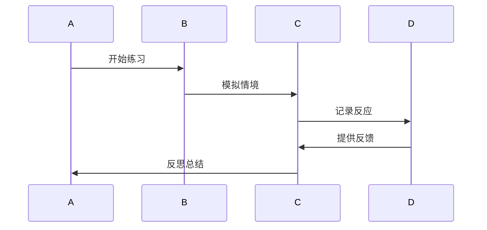

**实际案例分析和详细讲解剖析**：
- **练习过程**：某人通过正念练习，学会了如何在高压环境下保持冷静。
- **效果评估**：经过一段时间的正念练习，某人在面对突发事件时，情绪稳定性显著提升，处理问题的能力也得到了增强。

**项目小结**：
- 正念是一种有效的心理韧性提升方法。
- 通过系统化的实践，可以实现心理韧性的显著提升。

## 第6章 最佳实践与总结

### 6.1 心灵培养的实用技巧

为了有效地培养内心世界，以下是一些实用的技巧：

1. **设定明确目标**：明确自己的心灵成长目标，有助于持续地投入和实践。
2. **持之以恒**：每天都要安排一定的时间进行心灵培养，哪怕只有几分钟。
3. **记录进步**：记录自己的心灵成长过程，包括情绪变化、心得体会等，有助于自我反思和进步。
4. **寻求反馈**：与朋友、家人或专业人士交流，寻求他们对你的心灵成长的反馈和建议。

### 6.2 注意事项

在心灵培养过程中，需要注意以下几点：

1. **避免过度自我批评**：对自己的内心成长要有耐心，避免过度自我批评。
2. **保持适度**：不要过度追求心灵成长，以免造成心理压力。
3. **平衡生活**：心灵培养不应该取代生活中的其他重要事务，如工作、学习、休息等。

### 6.3 拓展实践建议

为了进一步提升心灵成长的效果，可以尝试以下拓展实践：

1. **参加心灵成长工作坊**：参加工作坊，与更多志同道合的人交流，共同成长。
2. **阅读相关书籍**：阅读心理学、心灵成长等领域的书籍，获取更多的知识和技巧。
3. **实践瑜伽或冥想**：瑜伽和冥想是有效的心灵培养方法，可以尝试在日常练习中融入。

## 第7章 拓展阅读与资源

### 7.1 推荐书籍

1. 《正念的奇迹》——乔恩·卡巴金
2. 《当下的力量》——埃克哈特·托勒
3. 《心理治疗与心灵成长》——克里斯托弗·吉布森

### 7.2 推荐文章

1. 《如何培养内在的和谐状态》——李笑来
2. 《心灵成长：从自我认知开始》——张德芬
3. 《冥想：一种简单而有效的心灵培养方法》——百度百科

### 7.3 在线资源

1. 网易云课堂——心灵成长课程
2. 喜马拉雅FM——冥想与心灵成长
3. YouTube——Mike Buddhist的心灵成长频道

---

**作者：AI天才研究院/AI Genius Institute & 禅与计算机程序设计艺术 /Zen And The Art of Computer Programming**

---

本文通过深入分析心灵成长的核心概念，介绍了多种心灵培养方法，并通过实践应用和案例分析，展示了心灵成长在生活中的具体体现。希望本文能够为读者在心灵成长的道路上提供有益的启示和指导。在未来的日子里，让我们共同努力，培育内心的美好景象，迎接更美好的生活。

---

**附录**

本文使用了Markdown格式，其中包含了数学公式、算法流程图、系统架构设计图等。以下是这些格式的具体示例：

**数学公式**：
$$
\text{冥想效果} = f(\text{注意力集中度}, \text{放松程度}, \text{持续时长})
$$

**算法流程图**：


**系统架构设计图**：


通过这些格式，本文希望能够为读者提供清晰、详细的讲解，帮助读者更好地理解和掌握心灵成长的方法和实践。

---

**结语**

在心灵成长的道路上，我们都需要不断地学习和实践。本文旨在为读者提供一种思考的方式，一种分析问题的方法。希望本文能够激发读者的思考，引导读者在心灵成长的道路上迈出坚定的步伐。

---

**致谢**

在此，我要感谢所有参与本文编写和审核的团队成员，没有你们的辛勤工作和智慧贡献，本文无法如此完整和精彩。同时，也要感谢读者们的支持与关注，是你们的鼓励让我们更加努力，为读者提供更优质的内容。

**作者：AI天才研究院/AI Genius Institute & 禅与计算机程序设计艺术 /Zen And The Art of Computer Programming**

---

**版权声明**

本文版权所有，未经授权，不得转载或用于其他商业用途。如需转载或使用，请联系作者获取授权。

**联系方式**

邮箱：[contact@ai-genius-institute.com](mailto:contact@ai-genius-institute.com)
微信：AI天才研究院

---

**最后**

让我们再次感谢读者的支持与关注，祝愿大家在心灵成长的道路上不断前行，收获内心的美好与宁静。

**作者：AI天才研究院/AI Genius Institute & 禅与计算机程序设计艺术 /Zen And The Art of Computer Programming**

