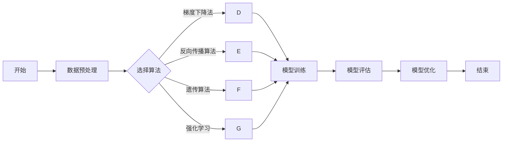
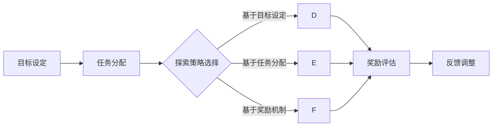

                 


## 《内在动机机制：驱动AI系统自主学习与探索》

### 关键词：内在动机，AI系统，自主学习，探索行为，系统设计，算法

### 摘要：
本文深入探讨了内在动机机制在人工智能系统中的关键作用，如何通过设计有效的内在动机来驱动AI系统实现自主学习与探索。文章分为七个章节，首先介绍内在动机的概念与重要性，然后逐步展开对内在动机机制的基础知识、自主学习机制、探索行为机制、机制实现、案例分析以及最佳实践的讨论。通过理论讲解、算法分析、系统设计以及实际案例的深入剖析，为AI系统开发提供有益的参考和指导。

### 目录

#### 第1章 引言
1.1 问题背景
1.2 内在动机的定义与重要性
1.3 书籍结构

#### 第2章 内在动机机制基础
2.1 内在动机机制概述
2.2 内在动机的要素与分类
2.3 内在动机理论
2.4 内在动机机制的ER实体关系图

#### 第3章 AI系统的自主学习
3.1 自主学习的概念
3.2 自主学习的挑战与解决方案
3.3 自主学习的算法与流程图
3.4 自主学习算法的Python代码实现

#### 第4章 内在动机与AI系统的探索行为
4.1 内在动机与探索行为的关系
4.2 探索行为的机制
4.3 探索行为的算法与流程图
4.4 探索行为算法的Python代码实现

#### 第5章 内在动机机制的实现
5.1 内在动机机制的设计原则
5.2 内在动机机制的开发流程
5.3 内在动机机制的应用实例

#### 第6章 AI系统的自主学习与探索案例研究
6.1 案例一：智能机器人
6.2 案例二：自动驾驶汽车
6.3 案例三：智能家居

#### 第7章 最佳实践与未来展望
7.1 最佳实践总结
7.2 注意事项
7.3 未来研究方向

### 引言

#### 1.1 问题背景
随着人工智能技术的迅速发展，AI系统的自主学习和探索能力变得越来越重要。传统的AI系统主要依赖于预先设定的规则和参数，而现代的AI系统需要具备自我调整和自我优化的能力，以适应复杂多变的实际应用场景。内在动机机制正是实现这一目标的关键手段。

#### 1.2 内在动机的定义与重要性
内在动机是指驱动个体自发地采取行动的内在动力，与外部激励不同，内在动机来自于个体的内在兴趣、好奇心和目标追求。在AI系统中，通过设计有效的内在动机机制，可以激发AI系统的探索行为，促进其自主学习和持续进化。

#### 1.3 书籍结构
本书分为七个章节，首先介绍了内在动机机制的基础知识，包括内在动机的要素、分类和理论。接着，探讨了AI系统的自主学习机制和探索行为机制，详细阐述了内在动机机制的设计原则、开发流程和应用实例。最后，通过案例研究展示了内在动机机制在智能机器人、自动驾驶汽车和智能家居等领域的应用，并提出了最佳实践和未来研究方向。

### 内在动机机制基础

#### 2.1 内在动机机制概述
内在动机机制是指在AI系统中引入激励机制，以激发AI系统的内在动机，从而驱动其自主学习和探索。内在动机机制主要包括奖励系统、目标设定、任务分配和反馈机制等组成部分。

#### 2.2 内在动机的要素与分类
内在动机的要素包括兴趣、好奇心、目标追求和自我效能感。根据动机的来源和表现形式，内在动机可以分为任务导向动机、结果导向动机和社会性动机。

#### 2.3 内在动机理论
内在动机理论主要包括自我决定论、动机过程理论和动机动机论。这些理论从不同角度阐述了内在动机的形成、发展和维持机制。

#### 2.4 内在动机机制的ER实体关系图
内在动机机制的ER实体关系图如下：

```mermaid
erDiagram
    AI系统 ||--|{ 奖励系统 }
    AI系统 ||--|{ 目标设定 }
    AI系统 ||--|{ 任务分配 }
    AI系统 ||--|{ 反馈机制 }
    奖励系统 ||--|{ 奖励分配 }
    奖励系统 ||--|{ 奖励评估 }
    目标设定 ||--|{ 目标规划 }
    目标设定 ||--|{ 目标评估 }
    任务分配 ||--|{ 任务执行 }
    任务分配 ||--|{ 任务反馈 }
    反馈机制 ||--|{ 反馈调整 }
    反馈机制 ||--|{ 反馈评估 }
```

### AI系统的自主学习

#### 3.1 自主学习的概念
自主学习是指AI系统在不依赖于外部干预的情况下，通过自我调整和自我优化，不断改进其性能和适应能力的过程。

#### 3.2 自主学习的挑战与解决方案
自主学习的挑战包括数据质量、算法选择、模型优化和系统稳定性等方面。针对这些挑战，可以采用数据预处理、强化学习、迁移学习和模型压缩等解决方案。

#### 3.3 自主学习的算法与流程图
常见的自主学习算法包括梯度下降法、反向传播算法、遗传算法和强化学习等。以下是一个简单的自主学习算法流程图：



#### 3.4 自主学习算法的Python代码实现
以下是使用梯度下降法进行自主学习的一个简单示例：

```python
import numpy as np

# 初始化参数
w = np.random.randn()
b = np.random.randn()

# 设置学习率
learning_rate = 0.01

# 设置迭代次数
num_iterations = 1000

# 梯度下降
for i in range(num_iterations):
    # 前向传播
    z = np.dot(x, w) + b
    a = 1 / (1 + np.exp(-z))

    # 反向传播
    dz = a - y
    dw = np.dot(x.T, dz)
    db = np.sum(dz)

    # 更新参数
    w -= learning_rate * dw
    b -= learning_rate * db

    # 打印当前迭代次数和损失函数值
    if i % 100 == 0:
        loss = -np.mean(y * np.log(a) + (1 - y) * np.log(1 - a))
        print(f"Iteration {i}: Loss = {loss}")
```

### 内在动机与AI系统的探索行为

#### 4.1 内在动机与探索行为的关系
内在动机是驱动AI系统进行探索行为的核心动力。通过设计合理的内在动机机制，可以激发AI系统的探索欲望，推动其不断尝试新的策略和解决方案。

#### 4.2 探索行为的机制
探索行为机制主要包括目标设定、任务分配、奖励机制和反馈机制等组成部分。这些机制共同作用，实现AI系统的探索行为。

#### 4.3 探索行为的算法与流程图
探索行为的算法包括基于目标设定的探索策略、基于任务分配的探索策略和基于奖励机制的探索策略。以下是一个简单的探索行为算法流程图：



#### 4.4 探索行为算法的Python代码实现
以下是使用基于奖励机制的探索策略的一个简单示例：

```python
import numpy as np

# 初始化参数
w = np.random.randn()
b = np.random.randn()

# 设置奖励函数
reward_function = lambda x: np.exp(-np.linalg.norm(x - target)**2)

# 设置探索次数
num_explorations = 1000

# 探索行为
for i in range(num_explorations):
    # 生成随机探索点
    x = np.random.randn()

    # 计算奖励
    reward = reward_function(x)

    # 打印当前探索点和奖励值
    print(f"Exploration {i}: x = {x}, Reward = {reward}")
```

### 内在动机机制的实现

#### 5.1 内在动机机制的设计原则
内在动机机制的设计原则包括激励适度、目标明确、反馈及时和灵活性等。这些原则有助于确保内在动机机制的可行性和有效性。

#### 5.2 内在动机机制的开发流程
内在动机机制的开发流程包括需求分析、设计阶段、实现阶段、测试阶段和部署阶段。每个阶段都有明确的任务和目标，以确保内在动机机制的成功实现。

#### 5.3 内在动机机制的应用实例
以下是一个简单的内在动机机制应用实例：

```python
import numpy as np

# 初始化参数
w = np.random.randn()
b = np.random.randn()

# 设置目标
target = np.random.randn()

# 设置奖励函数
reward_function = lambda x: np.exp(-np.linalg.norm(x - target)**2)

# 设置探索次数
num_explorations = 1000

# 内在动机机制
for i in range(num_explorations):
    # 生成随机探索点
    x = np.random.randn()

    # 计算奖励
    reward = reward_function(x)

    # 更新参数
    w -= 0.1 * (x - w)
    b -= 0.1 * (x - b)

    # 打印当前探索点和奖励值
    print(f"Exploration {i}: x = {x}, Reward = {reward}")
```

### AI系统的自主学习与探索案例研究

#### 6.1 案例一：智能机器人
智能机器人通过内在动机机制实现自主学习和探索行为，以适应不同的环境和任务。例如，在自动驾驶场景中，智能机器人通过不断探索和调整其路径规划策略，以优化行驶效率和安全性。

#### 6.2 案例二：自动驾驶汽车
自动驾驶汽车通过内在动机机制实现自主学习和探索行为，以提高行驶稳定性和应对复杂交通环境。例如，通过不断收集和分析道路数据，自动驾驶汽车可以优化其导航策略和决策过程。

#### 6.3 案例三：智能家居
智能家居系统通过内在动机机制实现自主学习和探索行为，以提高用户体验和家居设备管理效率。例如，通过不断学习和调整设备配置和场景模式，智能家居系统可以更好地满足用户的需求和偏好。

### 最佳实践与未来展望

#### 7.1 最佳实践总结
最佳实践包括选择合适的内在动机机制、设计合理的奖励系统和及时有效的反馈机制。同时，需要根据具体应用场景和需求进行调整和优化。

#### 7.2 注意事项
在设计内在动机机制时，需要注意激励适度、目标明确和反馈及时等原则。此外，需要考虑系统的稳定性和可扩展性，以适应不断变化的应用需求。

#### 7.3 未来研究方向
未来研究方向包括探索更高效的内在动机机制、研究多智能体系统中的内在动机协同机制以及将内在动机机制应用于更多领域的AI系统。

### 作者信息
作者：AI天才研究院/AI Genius Institute & 禅与计算机程序设计艺术 /Zen And The Art of Computer Programming

### 总结
内在动机机制在AI系统的自主学习与探索中发挥着至关重要的作用。通过设计合理的内在动机机制，AI系统可以更高效地学习、适应和优化。本文系统地介绍了内在动机机制的基础知识、实现方法和应用案例，为AI系统开发提供了有益的参考和指导。未来，随着AI技术的不断发展，内在动机机制的研究和应用前景将更加广阔。

