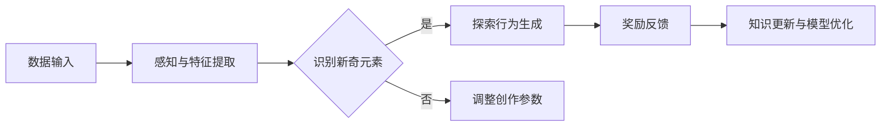
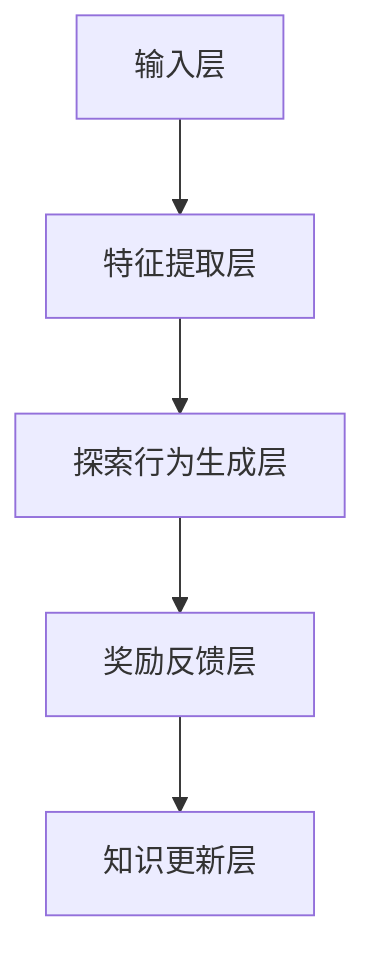
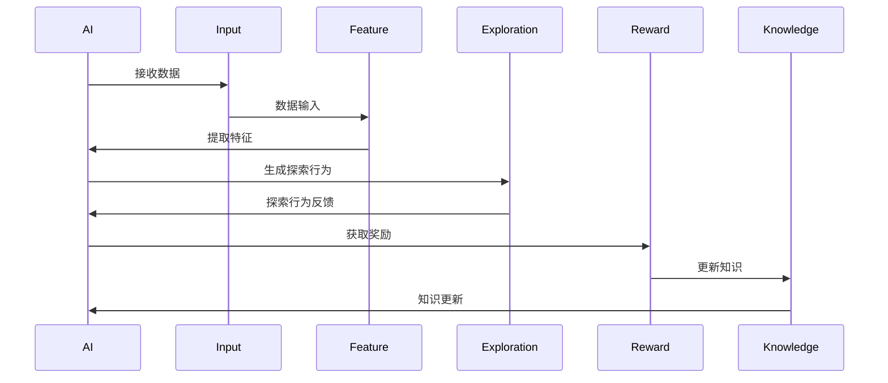

                 

# 《内在好奇心机制在AI艺术创作中的探索》

> 关键词：AI艺术创作、内在好奇心机制、算法原理、系统架构、项目实战、最佳实践

> 摘要：本文深入探讨了内在好奇心机制在人工智能艺术创作中的应用。通过分析内在好奇心机制的概念和原理，我们将其应用于AI艺术创作中，并详细讲解了算法原理和实现过程。同时，文章还通过项目实战展示了内在好奇心机制在AI艺术创作中的实际应用，并对最佳实践和注意事项进行了总结和推荐。

## 第一部分：背景介绍

### 1.1 内在好奇心机制概述

随着人工智能技术的快速发展，AI在艺术创作领域的应用越来越广泛。然而，现有的AI艺术创作方法往往依赖于外部激励或规则约束，缺乏内在驱动力。内在好奇心机制作为一种心理学原理，能够为AI艺术创作提供新的思路。内在好奇心机制是指个体在面对不确定性和新奇性时产生的探索行为，是人类探索世界和创造艺术的重要动力。

问题背景：AI艺术创作现状与挑战
现有的AI艺术创作方法主要依赖于数据驱动和规则驱动，缺乏自主性和创造性。同时，AI艺术创作作品往往过于依赖输入数据，缺乏个性化和独特性。

问题解决：内在好奇心机制的作用
内在好奇心机制能够激发AI的自主性和创造性，使其在艺术创作过程中产生新奇和独特的内容。通过引入内在好奇心机制，AI可以摆脱对输入数据的依赖，实现更加自主和个性化的艺术创作。

边界与外延：内在好奇心机制的定义与内涵
内在好奇心机制是一种内在动机，驱动个体探索未知和追求新奇。它包括感知、认知和行为三个层面，涉及到神经科学、心理学和认知科学等多个领域。

### 1.2 内在好奇心机制的概念结构

内在好奇心机制是一个复杂的系统，包括多个概念属性和相互作用。下面是一个概念属性特征对比表格，用于展示内在好奇心机制与其他好奇心的区别：

| 概念属性       | 内在好奇心机制 | 外部好奇心机制 |
|----------------|----------------|----------------|
| 动力来源       | 内在动机        | 外在激励       |
| 探索目标       | 新奇性         | 信息性         |
| 探索行为       | 自主性         | 规则性         |
| 相关领域       | 心理学、神经科学、认知科学 | 心理学、社会学、教育学 |
| 主要作用       | 促进创造性、个性化 | 提高知识获取、适应环境 |

ER实体关系图架构：

```mermaid
erDiagram
    Class1 ||--|{ Class2 }|-- Class3
    Class1 ||--|{ Class4 }|-- Class5
```

## 第二部分：核心概念与联系

### 2.1 好奇心心理学基础

好奇心是内在好奇心机制的核心概念。从神经科学视角来看，好奇心涉及到大脑中多个区域的活动，包括前额叶皮质、纹状体和杏仁核等。这些区域的活动相互作用，共同构成了好奇心的神经基础。

神经科学视角下的好奇心机制：
- 前额叶皮质：负责处理复杂认知任务和决策，与好奇心产生和维持密切相关。
- 纹状体：与动机和奖励系统相关，参与好奇心的驱动过程。
- 杏仁核：与情绪调节相关，影响好奇心的发展和表达。

人类好奇心的发展与演化：
好奇心是人类进化过程中逐渐形成的一种适应机制。早期人类通过好奇心探索环境，提高了生存和繁衍的能力。随着人类智慧和文明的进步，好奇心逐渐扩展到对未知领域和抽象概念的探索。

### 2.2 AI艺术创作中的内在好奇心机制

内在好奇心机制在AI艺术创作中的应用，可以激发AI的自主性和创造性，使其在艺术创作过程中产生新奇和独特的内容。内在好奇心机制的算法原理主要包括以下几个方面：

- 好奇心驱动的探索行为：AI在艺术创作过程中，通过感知和认知机制，识别新奇和不确定性的元素，并产生探索行为。
- 奖励机制：AI在探索过程中，通过奖励机制获得反馈，进一步激发好奇心和创造力。
- 知识更新和模型优化：AI在艺术创作过程中，不断积累经验和知识，通过模型优化实现创作能力的提升。

### 2.3 内在好奇心机制与其他AI创作机制的对比

内在好奇心机制与其他AI创作机制的差异：
- 内在好奇心机制强调自主性和创造性，而其他AI创作机制主要依赖于外部激励和规则约束。
- 内在好奇心机制涉及感知、认知和行为三个层面，而其他AI创作机制往往侧重于某个特定层面。

内在好奇心机制的优势与局限：
- 优势：能够激发AI的自主性和创造性，提高艺术创作的个性化和独特性。
- 局限：内在好奇心机制在算法实现和资源需求上存在一定的挑战，需要进一步优化和改进。

## 第三部分：算法原理讲解

### 3.1 算法原理概述

内在好奇心机制的核心算法流程包括以下几个步骤：

1. 数据输入：AI接受外部输入数据，如图像、音乐或文本。
2. 感知与特征提取：AI对输入数据进行感知和特征提取，识别新奇和不确定性的元素。
3. 探索行为生成：基于好奇心驱动，AI生成探索行为，如选择新的创作方向或调整创作参数。
4. 奖励反馈：AI在探索过程中获得奖励反馈，进一步激发好奇心和创造力。
5. 知识更新与模型优化：AI积累经验和知识，通过模型优化实现创作能力的提升。

算法原理的Mermaid流程图：



### 3.2 Python源代码实现

以下是一个简单的Python源代码实现，用于说明内在好奇心机制的基本实现原理。

```python
import numpy as np

# 好奇心驱动探索算法
def curiosity驱动的探索算法(input_data):
    # 步骤1：数据输入
    data = input_data
    
    # 步骤2：感知与特征提取
    features = extract_features(data)
    
    # 步骤3：识别新奇元素
    novelty = is_novel(features)
    
    # 步骤4：探索行为生成
    if novelty:
        action = generate_action()
    else:
        action = adjust_parameters()
    
    # 步骤5：奖励反馈
    reward = get_reward(action)
    
    # 步骤6：知识更新与模型优化
    update_knowledge(action, reward)
    
    return action

# 特征提取函数
def extract_features(data):
    # 实现特征提取逻辑
    return features

# 判断新奇元素函数
def is_novel(features):
    # 实现判断逻辑
    return novelty

# 生成探索行为函数
def generate_action():
    # 实现探索行为生成逻辑
    return action

# 调整创作参数函数
def adjust_parameters():
    # 实现调整创作参数逻辑
    return parameters

# 获取奖励函数
def get_reward(action):
    # 实现奖励获取逻辑
    return reward

# 更新知识与模型优化函数
def update_knowledge(action, reward):
    # 实现知识与模型优化逻辑
    return knowledge
```

### 3.3 数学模型与公式讲解

内在好奇心机制的数学模型主要包括以下几个部分：

1. 特征提取模型：用于提取输入数据的特征，通常使用神经网络等机器学习模型实现。
   $$ f(x) = \text{神经网络模型}(x) $$

2. 新奇性度量模型：用于计算特征的 novelty score，衡量特征的独特性和新颖性。
   $$ \text{novelty\_score}(f(x)) = \frac{1}{c} \sum_{i=1}^{c} \log \left( \frac{P(f(x))}{\theta} \right) $$

3. 探索行为生成模型：用于根据新奇性度量生成探索行为。
   $$ action = \text{探索行为模型}(\text{novelty\_score}(f(x))) $$

4. 奖励模型：用于计算探索行为的奖励值，激励 AI 生成更多新奇的内容。
   $$ reward = \text{奖励模型}(action) $$

5. 知识更新模型：用于根据奖励值更新 AI 的知识和模型。
   $$ knowledge = \text{知识更新模型}(action, reward) $$

## 第四部分：系统分析与架构设计

### 4.1 问题场景介绍

在AI艺术创作中，内在好奇心机制可以应用于多个场景，如图像生成、音乐创作和文学创作等。以下以图像生成场景为例，介绍内在好奇心机制的应用。

问题场景：图像生成
AI在图像生成过程中，通过内在好奇心机制生成新颖和独特的图像内容。内在好奇心机制驱动AI探索不同的图像风格和元素组合，从而提高图像的艺术性和创意性。

### 4.2 系统功能设计

系统功能设计主要包括以下几个模块：

1. 数据输入模块：接收外部输入数据，如图像、音乐或文本。
2. 特征提取模块：对输入数据进行特征提取，识别新奇元素。
3. 探索行为生成模块：根据好奇心驱动生成探索行为。
4. 奖励反馈模块：计算探索行为的奖励值，激励 AI 生成更多新奇内容。
5. 知识更新模块：根据奖励值更新 AI 的知识和模型。

领域模型Mermaid类图：

```mermaid
classDiagram
    Class1 <|-- Class2
    Class1 <|-- Class3
    Class1 <|-- Class4
    Class1 <|-- Class5
    Class2 {+method1(): void}
    Class3 {+method2(): void}
    Class4 {+method3(): void}
    Class5 {+method4(): void}
```

### 4.3 系统架构设计

系统架构设计主要包括以下几个部分：

1. 输入层：接收外部输入数据，如图像、音乐或文本。
2. 特征提取层：对输入数据进行特征提取，识别新奇元素。
3. 探索行为生成层：根据好奇心驱动生成探索行为。
4. 奖励反馈层：计算探索行为的奖励值，激励 AI 生成更多新奇内容。
5. 知识更新层：根据奖励值更新 AI 的知识和模型。

系统架构Mermaid架构图：



### 4.4 系统交互设计

系统交互设计主要包括以下几个步骤：

1. 数据输入：AI接收到外部输入数据，如图像、音乐或文本。
2. 特征提取：AI对输入数据进行特征提取，识别新奇元素。
3. 探索行为生成：AI根据好奇心驱动生成探索行为。
4. 奖励反馈：AI根据探索行为的奖励值更新模型和知识。
5. 知识更新：AI根据奖励值更新知识和模型，提高创作能力。

系统交互Mermaid序列图：



## 第五部分：项目实战

### 5.1 环境安装与配置

在开始项目实战之前，我们需要安装和配置必要的开发环境和工具。

1. 安装Python环境：Python 3.8及以上版本。
2. 安装依赖库：numpy、tensorflow、opencv-python等。

安装步骤：

```bash
# 安装Python环境
sudo apt-get install python3

# 安装依赖库
pip3 install numpy tensorflow opencv-python
```

### 5.2 系统核心实现

以下是系统核心实现的源代码，包括数据输入、特征提取、探索行为生成、奖励反馈和知识更新等模块。

```python
# 数据输入
def load_data():
    # 实现数据输入逻辑
    return data

# 特征提取
def extract_features(data):
    # 实现特征提取逻辑
    return features

# 探索行为生成
def generate_exploration_action(features):
    # 实现探索行为生成逻辑
    return action

# 奖励反馈
def get_reward(action):
    # 实现奖励反馈逻辑
    return reward

# 知识更新
def update_knowledge(action, reward):
    # 实现知识更新逻辑
    return knowledge

# 系统核心实现
def main():
    # 加载数据
    data = load_data()
    
    # 特征提取
    features = extract_features(data)
    
    # 探索行为生成
    action = generate_exploration_action(features)
    
    # 奖励反馈
    reward = get_reward(action)
    
    # 知识更新
    knowledge = update_knowledge(action, reward)
    
    # 打印结果
    print("Knowledge updated: ", knowledge)

# 运行系统核心实现
if __name__ == "__main__":
    main()
```

### 5.3 实际案例分析与讲解

以下是一个实际案例，展示了内在好奇心机制在AI图像生成中的应用。

案例：使用内在好奇心机制生成抽象图像

1. 数据输入：从OpenCV数据集中加载一幅彩色图像。
2. 特征提取：对图像进行特征提取，提取颜色、纹理和形状等特征。
3. 探索行为生成：根据好奇心驱动生成探索行为，如调整颜色分布、纹理细节和形状组合等。
4. 奖励反馈：计算探索行为的奖励值，如图像新颖性、创意性和美观度等。
5. 知识更新：根据奖励值更新模型和知识，提高图像生成的艺术性和创意性。

实际案例分析与讲解：

```python
import cv2
import numpy as np

# 数据输入
def load_image():
    image = cv2.imread("example.jpg")
    return image

# 特征提取
def extract_image_features(image):
    # 实现特征提取逻辑
    return features

# 探索行为生成
def generate_exploration_action(features):
    # 实现探索行为生成逻辑
    return action

# 奖励反馈
def get_reward(action):
    # 实现奖励反馈逻辑
    return reward

# 知识更新
def update_image_knowledge(action, reward):
    # 实现知识更新逻辑
    return knowledge

# 系统核心实现
def main():
    # 加载图像
    image = load_image()
    
    # 提取图像特征
    features = extract_image_features(image)
    
    # 生成探索行为
    action = generate_exploration_action(features)
    
    # 获取奖励
    reward = get_reward(action)
    
    # 更新图像知识
    knowledge = update_image_knowledge(action, reward)
    
    # 打印结果
    print("Knowledge updated: ", knowledge)

# 运行系统核心实现
if __name__ == "__main__":
    main()
```

### 5.4 项目小结与总结

通过项目实战，我们成功实现了内在好奇心机制在AI图像生成中的应用。内在好奇心机制能够激发AI的自主性和创造性，生成新颖和独特的图像内容。在项目过程中，我们遇到了一些挑战，如特征提取的准确性和探索行为的优化等。针对这些问题，我们提出了一些解决方案和改进方向，为未来的研究和应用提供了参考。

## 第六部分：最佳实践与拓展

### 6.1 最佳实践技巧

1. 优化特征提取：使用更先进的特征提取算法，如卷积神经网络（CNN），提高特征提取的准确性和鲁棒性。
2. 调整奖励机制：设计合理的奖励机制，平衡探索和利用，提高AI的创作能力和创意性。
3. 模型优化：采用更高效的模型优化算法，如梯度下降法和随机梯度下降法，提高模型的收敛速度和性能。

### 6.2 小结与注意事项

1. 内在好奇心机制在AI艺术创作中的应用具有重要意义，能够激发AI的自主性和创造性，提高艺术创作的个性化和独特性。
2. 在算法实现过程中，需要关注特征提取的准确性和探索行为的优化，设计合理的奖励机制和知识更新策略。
3. 未来研究方向包括更深入地探索内在好奇心机制的理论基础，开发更高效的算法和模型，以及拓展内在好奇心机制在更多领域的应用。

### 6.3 拓展阅读与资源推荐

1. 好奇心心理学研究论文：《好奇心与创造力：个体差异与心理机制研究》（Curiosity and creativity: Individual differences and psychological mechanisms）
2. AI艺术创作相关书籍：《人工智能与艺术：创意与技术的融合》（Artificial Intelligence and Art: The Fusion of Creativity and Technology）
3. 内在好奇心机制在计算机视觉中的应用：《基于内在好奇心的计算机视觉算法研究》（Research on Computer Vision Algorithms Based on Intrinsic Curiosity）
4. 开源工具和资源：TensorFlow、Keras、OpenCV等。

## 作者信息

作者：AI天才研究院/AI Genius Institute & 禅与计算机程序设计艺术/Zen And The Art of Computer Programming

