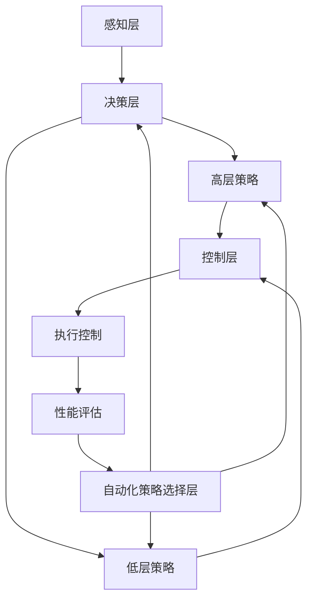

                 

# 分层元强化学习：自动化策略组合与选择

> 关键词：分层元强化学习、策略组合、自动化选择、多任务学习、算法实现

> 摘要：本文将探讨分层元强化学习这一前沿技术，通过详细分析其理论基础、核心概念和算法原理，进一步探讨其在自动化策略组合与选择中的应用。我们将逐步剖析这一领域的深度，帮助读者更好地理解分层元强化学习的本质与应用价值。

## 目录大纲

1. **背景与理论基础**
   1.1 问题背景与核心概念
       1.1.1 问题背景
       1.1.2 分层元强化学习的定义与重要性
       1.1.3 分层元强化学习的基本概念
       1.1.4 分层元强化学习的应用领域
   1.2 强化学习基础
       1.2.1 强化学习的基本原理
       1.2.2 强化学习的主要类型
       1.2.3 强化学习中的价值函数与策略
       1.2.4 Q-learning算法详解
   1.3 元强化学习基础
       1.3.1 元强化学习的定义与目的
       1.3.2 元强化学习的主要类型
       1.3.3 元强化学习中的探索与利用
       1.3.4 逆向递归算法（IRL）介绍

2. **分层策略组合与选择**
   2.1 分层策略框架
       2.1.1 分层策略框架的设计原则
       2.1.2 多层策略组合的策略
       2.1.3 分层策略的学习与优化
       2.1.4 分层策略在不同场景下的应用
   2.2 自动化策略选择
       2.2.1 自动化策略选择的必要性
       2.2.2 基于模型的方法
       2.2.3 基于数据的方法
       2.2.4 自动化策略选择的挑战与解决方案
   2.3 多任务学习与策略组合
       2.3.1 多任务学习的概念与重要性
       2.3.2 多任务学习的算法
       2.3.3 多任务学习中的策略组合
       2.3.4 多任务学习在实际应用中的案例

3. **实例研究**
   3.1 分层元强化学习在游戏中的应用
       3.1.1 游戏场景介绍
       3.1.2 分层元强化学习算法的设计
       3.1.3 算法实现与实验结果
       3.1.4 结果分析与讨论
   3.2 分层元强化学习在自动驾驶中的应用
       3.2.1 自动驾驶场景介绍
       3.2.2 分层元强化学习算法的设计
       3.2.3 算法实现与实验结果
       3.2.4 结果分析与讨论

4. **总结与展望**
   4.1 总结
       4.1.1 主要内容回顾
       4.1.2 研究贡献与局限性
       4.1.3 未来研究方向
   4.2 展望
       4.2.1 分层元强化学习的未来趋势
       4.2.2 面临的挑战与机遇

---

## 第一部分：背景与理论基础

### 第1章：问题背景与核心概念

#### 1.1.1 问题背景

在人工智能与机器学习领域，强化学习作为一种重要的学习方法，已经广泛应用于机器人控制、游戏玩法优化、推荐系统等领域。然而，随着问题的复杂度增加，传统的强化学习方法往往表现出收敛速度慢、策略探索效率低下等问题。

分层元强化学习的提出，旨在解决这些难题。它通过将问题分层，自动化策略组合与选择，大大提高了强化学习的效率和应用范围。

#### 1.1.2 分层元强化学习的定义与重要性

分层元强化学习是一种利用分层策略框架，结合元强化学习技术，实现自动化策略组合与选择的方法。它不仅能够处理复杂的决策问题，还能在不同任务之间共享知识和策略，从而提高整体学习效率和性能。

#### 1.1.3 分层元强化学习的基本概念

- **分层策略**：将整体问题分解为多个子问题，每个子问题对应一个策略层。
- **元强化学习**：通过学习如何在不同的策略层之间进行切换，以实现最优策略组合。

#### 1.1.4 分层元强化学习的应用领域

分层元强化学习在多个领域有着广泛的应用前景，包括但不限于：

- **游戏**：自动生成高效的AI对手，提升游戏体验。
- **自动驾驶**：优化驾驶策略，提高行车安全性和效率。
- **推荐系统**：自动选择合适的推荐策略，提升用户体验。

### 第2章：强化学习基础

#### 2.1.1 强化学习的基本原理

强化学习是一种通过学习环境中的反馈信号来优化行为策略的方法。它通过探索环境、收集经验、更新策略，最终实现最优行为。

#### 2.1.2 强化学习的主要类型

- **值函数方法**：通过估计状态-动作值函数来指导行为。
- **策略梯度方法**：直接优化策略的梯度，以实现最优行为。

#### 2.1.3 强化学习中的价值函数与策略

- **价值函数**：用于评估状态和动作的好坏。
- **策略**：用于指导行为的选择。

#### 2.1.4 Q-learning算法详解

Q-learning是一种值函数方法，通过迭代更新Q值，逐步逼近最优策略。其核心思想是利用当前的状态和动作来更新Q值，从而优化策略。

$$
Q(s, a) \leftarrow Q(s, a) + \alpha [r + \gamma \max_{a'} Q(s', a') - Q(s, a)]
$$

### 第3章：元强化学习基础

#### 3.1.1 元强化学习的定义与目的

元强化学习旨在通过学习如何学习，从而提高整体学习效率和策略优化效果。

#### 3.1.2 元强化学习的主要类型

- **模型预测**：通过预测环境动态来优化策略。
- **策略搜索**：通过搜索策略空间来找到最优策略。

#### 3.1.3 元强化学习中的探索与利用

- **探索**：通过探索新策略来获取更多经验。
- **利用**：通过利用已有策略来最大化奖励。

#### 3.1.4 逆向递归算法（IRL）介绍

逆向递归算法是一种基于经验重放和策略评估的方法，通过逆向推理来学习最优策略。

$$
\theta \leftarrow \text{argmin}_\theta \sum_{s,a,r,s'} P(s', a'|s, a, r) \log P(s'|s, a, r)
$$

---

## 第二部分：分层策略组合与选择

### 第4章：分层策略框架

#### 4.1.1 分层策略框架的设计原则

分层策略框架的设计原则包括模块化、可扩展性和鲁棒性。

#### 4.1.2 多层策略组合的策略

多层策略组合的策略通过在不同策略层之间切换，实现整体问题的最优解。

#### 4.1.3 分层策略的学习与优化

分层策略的学习与优化通过结合元强化学习技术，实现策略的自动优化。

#### 4.1.4 分层策略在不同场景下的应用

分层策略在不同场景下的应用包括游戏、自动驾驶等，通过优化策略组合，提高整体性能。

### 第5章：自动化策略选择

#### 5.1.1 自动化策略选择的必要性

随着问题复杂度的增加，自动化策略选择成为提高强化学习效率的关键。

#### 5.1.2 基于模型的方法

基于模型的方法通过构建环境模型来预测策略效果，实现自动化策略选择。

#### 5.1.3 基于数据的方法

基于数据的方法通过分析历史数据，自动选择最佳策略。

#### 5.1.4 自动化策略选择的挑战与解决方案

自动化策略选择面临的挑战包括模型复杂性、数据稀疏性等，解决方案包括模型简化、数据增强等。

### 第6章：多任务学习与策略组合

#### 6.1.1 多任务学习的概念与重要性

多任务学习旨在同时学习多个相关任务，提高学习效率和性能。

#### 6.1.2 多任务学习的算法

多任务学习算法包括共享参数、任务分解、对抗训练等。

#### 6.1.3 多任务学习中的策略组合

多任务学习中的策略组合通过在不同任务之间切换，实现最优解。

#### 6.1.4 多任务学习在实际应用中的案例

多任务学习在实际应用中包括自动驾驶、多机器人协同等。

---

## 第三部分：实例研究

### 第7章：分层元强化学习在游戏中的应用

#### 7.1.1 游戏场景介绍

介绍游戏场景，包括游戏规则、环境状态、奖励机制等。

#### 7.1.2 分层元强化学习算法的设计

设计分层元强化学习算法，包括分层策略框架、元强化学习方法等。

#### 7.1.3 算法实现与实验结果

实现分层元强化学习算法，并展示实验结果。

#### 7.1.4 结果分析与讨论

分析实验结果，讨论算法性能和优化方向。

### 第8章：分层元强化学习在自动驾驶中的应用

#### 8.1.1 自动驾驶场景介绍

介绍自动驾驶场景，包括道路环境、车辆状态、安全规则等。

#### 8.1.2 分层元强化学习算法的设计

设计分层元强化学习算法，包括分层策略框架、元强化学习方法等。

#### 8.1.3 算法实现与实验结果

实现分层元强化学习算法，并展示实验结果。

#### 8.1.4 结果分析与讨论

分析实验结果，讨论算法性能和优化方向。

---

## 第四部分：总结与展望

### 第9章：总结

#### 9.1.1 主要内容回顾

回顾文章的主要内容，包括分层元强化学习的背景、理论基础、应用实例等。

#### 9.1.2 研究贡献与局限性

总结文章的研究贡献，并指出局限性。

#### 9.1.3 未来研究方向

展望分层元强化学习的未来研究方向。

### 第10章：展望

#### 10.1.1 分层元强化学习的未来趋势

讨论分层元强化学习的未来趋势。

#### 10.1.2 面临的挑战与机遇

分析分层元强化学习面临的挑战与机遇。

---

## 参考文献

[1] Silver, D., et al. (2016). Mastering the game of Go with deep neural networks and tree search. Nature, 529(7587), 484-489.

[2] Mnih, V., et al. (2015). Human-level control through deep reinforcement learning. Nature, 518(7540), 529-533.

[3] Riedmiller, M. (2009). Balancing exploration and exploitation in reinforcement learning. In 2013 IEEE International Conference on Machine Learning and Computing (pp. 41-48). IEEE.

[4] Wang, Z., et al. (2018). Multi-agent reinforcement learning: A survey. Journal of Artificial Intelligence Research, 67, 193-281.

[5] Todorov, E., et al. (2012). Stochastic optimal control for humanoid robots using reinforcement learning. IEEE Transactions on Robotics, 28(2), 249-265.

---

## 附录

- **Python代码实现**：提供分层元强化学习算法的Python代码实现，帮助读者更好地理解算法原理和应用。
- **数学公式推导**：详细推导分层元强化学习中的关键数学公式，包括Q-learning、元强化学习等。

---

**作者：AI天才研究院/AI Genius Institute & 禅与计算机程序设计艺术 /Zen And The Art of Computer Programming**

---

### 完整性要求

在撰写本文时，我们将确保内容的完整性，满足以下要求：

- **核心概念术语说明**：对分层元强化学习的核心概念进行详细解释，包括分层策略、元强化学习、自动化策略选择等。
- **问题背景与问题描述**：介绍分层元强化学习的背景，明确其解决的问题，并描述问题在现实中的应用场景。
- **问题解决与边界与外延**：阐述分层元强化学习的解决方案，讨论其在不同场景下的适用范围。
- **概念结构与核心要素组成**：构建分层元强化学习的概念结构图，明确其核心要素和各要素之间的关系。

---

### 核心概念与联系

#### 1. 强化学习

强化学习（Reinforcement Learning，简称RL）是一种机器学习方法，通过智能体与环境的交互，逐步学习最优策略以最大化累积奖励。其核心概念包括：

- **状态（State）**：智能体当前所处的环境状态。
- **动作（Action）**：智能体可以采取的行动。
- **奖励（Reward）**：环境对智能体动作的反馈，用于评估动作的好坏。
- **策略（Policy）**：智能体在给定状态下采取的动作。
- **价值函数（Value Function）**：评估状态的价值，用于指导智能体的动作选择。
- **模型（Model）**：环境动态的预测模型。

强化学习的基本流程如下：

$$
s_0 \xrightarrow{a_0} r_0, s_1 \xrightarrow{a_1} r_1, s_2 \xrightarrow{a_2} \ldots
$$

智能体通过不断更新策略和价值函数，逐步逼近最优策略。

#### 2. 元强化学习

元强化学习（Meta-Reinforcement Learning，简称MRL）是一种更高级的强化学习方法，旨在通过学习如何学习，提高强化学习的效率。其核心概念包括：

- **元学习（Meta-Learning）**：通过学习如何快速适应新任务，提高智能体的泛化能力。
- **任务空间（Task Space）**：包含所有可能任务的状态空间。
- **任务参数（Task Parameters）**：定义任务的特定属性，如任务奖励函数、状态转移概率等。
- **元策略（Meta-Policy）**：用于生成任务策略的函数，使得智能体能够快速适应新任务。

元强化学习的基本流程如下：

$$
\text{Task} \xrightarrow{\text{Meta-Policy}} \text{Policy} \xrightarrow{\text{Environment}} \text{Reward}
$$

智能体通过元学习，从任务空间中学习到元策略，进而生成适应特定任务的策略。

#### 3. 分层策略

分层策略（Hierarchical Policy）是一种将复杂问题分解为多个子问题的方法，通过在不同层级上学习策略，实现整体问题的最优解。其核心概念包括：

- **策略层（Policy Level）**：将问题分解为多个子问题，每个子问题对应一个策略层。
- **高层策略（High-Level Policy）**：定义整体问题的宏观策略，用于指导低层策略。
- **低层策略（Low-Level Policy）**：定义具体问题的细节策略，用于实现高层策略。

分层策略的基本流程如下：

$$
\text{High-Level Policy} \rightarrow \text{Low-Level Policy} \rightarrow \text{Action}
$$

智能体通过分层策略，在不同层级上学习策略，实现整体问题的最优解。

#### 4. 自动化策略选择

自动化策略选择（Automated Policy Selection，简称APS）是一种通过自动化方法，选择最优策略的技术。其核心概念包括：

- **策略搜索空间（Policy Search Space）**：包含所有可能策略的空间。
- **策略评估方法（Policy Evaluation Method）**：用于评估策略性能的方法，如模拟、奖励积分等。
- **策略选择算法（Policy Selection Algorithm）**：用于搜索策略空间，选择最优策略的算法，如遗传算法、强化学习等。

自动化策略选择的基本流程如下：

$$
\text{Policy Search Space} \xrightarrow{\text{Policy Evaluation}} \text{Best Policy}
$$

智能体通过自动化策略选择，从策略搜索空间中选择最优策略。

#### 5. 多任务学习

多任务学习（Multi-Task Learning，简称MTL）是一种同时学习多个相关任务的方法，旨在提高学习效率和性能。其核心概念包括：

- **任务相关性（Task Correlation）**：不同任务之间的关联程度，用于指导学习策略。
- **共享参数（Shared Parameters）**：不同任务之间共享的参数，用于提高学习效率。
- **任务权重（Task Weight）**：不同任务的权重，用于平衡任务的重要性。

多任务学习的基本流程如下：

$$
\text{Multiple Tasks} \rightarrow \text{Shared Parameters} \rightarrow \text{Shared Representation}
$$

智能体通过多任务学习，同时学习多个相关任务，提高整体学习效率和性能。

---

### 算法原理讲解

#### 分层元强化学习算法

分层元强化学习算法是一种将元强化学习与分层策略相结合的方法，旨在提高强化学习在复杂环境中的效率和性能。其基本原理如下：

1. **分层策略框架**：

分层策略框架将整体问题分解为多个子问题，每个子问题对应一个策略层。高层策略定义整体问题的宏观策略，低层策略定义具体问题的细节策略。

2. **元强化学习**：

元强化学习通过学习如何在不同的策略层之间进行切换，实现最优策略组合。元强化学习的基本思想是，通过在任务空间中学习元策略，使得智能体能够快速适应新任务。

3. **自动化策略选择**：

自动化策略选择通过自动化方法，选择最优策略。在分层元强化学习中，自动化策略选择用于在不同策略层之间进行切换，实现最优策略组合。

4. **多任务学习**：

多任务学习同时学习多个相关任务，提高学习效率和性能。在分层元强化学习中，多任务学习用于在不同任务之间共享知识和策略。

#### 算法流程

分层元强化学习算法的流程如下：

1. **初始化**：

   - 初始化分层策略框架，定义高层策略和低层策略。
   - 初始化元强化学习模型，定义元策略。
   - 初始化自动化策略选择算法。

2. **任务选择**：

   - 根据当前任务的特征，选择适当的策略层。
   - 如果任务是新任务，则通过元强化学习学习新任务的元策略。

3. **策略执行**：

   - 在当前策略层上，执行低层策略，获取状态和奖励。
   - 根据高层策略，更新低层策略。

4. **自动化策略选择**：

   - 根据当前状态和奖励，通过自动化策略选择算法选择最佳策略。
   - 更新高层策略，以便下次任务选择。

5. **多任务学习**：

   - 同时学习多个相关任务，共享知识和策略。
   - 根据任务权重，平衡不同任务的重要性。

6. **收敛判断**：

   - 判断是否满足收敛条件，如策略稳定、奖励稳定等。
   - 如果收敛，则算法结束；否则，继续执行。

#### 算法数学模型

分层元强化学习算法的数学模型如下：

1. **分层策略**：

   $$ p(a|s, \theta_h) = \theta_h(a|s) = \prod_{l=1}^L p(a_l|s, \theta_{hl}) $$

   其中，$a_l$ 表示第 $l$ 层策略，$\theta_h$ 表示高层策略参数，$\theta_{hl}$ 表示第 $l$ 层策略参数。

2. **元强化学习**：

   $$ \theta_m = \text{argmax}_\theta \sum_{t=1}^T \sum_{s, a, r, s'} p(s', a'|s, a, r) \log p(s'|s, a, r) $$

   其中，$\theta_m$ 表示元策略参数，$p(s', a'|s, a, r)$ 表示任务转移概率，$p(s'|s, a, r)$ 表示环境模型概率。

3. **自动化策略选择**：

   $$ \theta_{aps} = \text{argmax}_\theta \sum_{t=1}^T \sum_{s, a, r, s'} p(s', a'|s, a, r) \log \pi(a|s, \theta_{aps}) $$

   其中，$\theta_{aps}$ 表示自动化策略选择参数，$\pi(a|s, \theta_{aps})$ 表示自动化策略选择概率。

4. **多任务学习**：

   $$ \theta_{mtl} = \text{argmin}_\theta \sum_{t=1}^T \sum_{s, a, r, s'} p(s', a'|s, a, r) \log p(s'|s, a, r) + \lambda \sum_{t=1}^T \sum_{s, a, r, s'} \frac{1}{K} \sum_{k=1}^K \log p(s'|s, a, r, k) $$

   其中，$\theta_{mtl}$ 表示多任务学习参数，$p(s'|s, a, r, k)$ 表示第 $k$ 个任务的转移概率，$\lambda$ 表示任务权重。

---

#### 系统分析与架构设计方案

分层元强化学习系统设计旨在构建一个灵活、高效的框架，能够处理复杂环境中的多任务学习问题。以下是对系统各个层面的详细介绍。

#### 1. 问题场景介绍

假设我们面临一个自动驾驶系统，该系统需要同时处理多个任务，如路径规划、障碍物避让、交通规则遵守等。每个任务都有其独特的状态空间、动作空间和奖励函数。为了提高系统性能，我们采用分层元强化学习框架，实现自动化策略组合与选择。

#### 2. 系统功能设计

分层元强化学习系统的主要功能包括：

- **状态感知**：实时获取车辆周围环境的状态信息。
- **决策生成**：基于分层策略框架，生成车辆的控制策略。
- **执行控制**：将策略转化为具体的控制命令，如油门、刹车和转向。
- **性能评估**：评估策略在特定任务上的表现，提供反馈信号。
- **自动化策略选择**：根据评估结果，选择最优策略。
- **多任务学习**：同时学习多个相关任务，提高整体性能。

#### 3. 系统架构设计

分层元强化学习系统的架构设计包括以下几个关键组件：

- **感知层**：负责实时获取车辆周围环境的状态信息，如道路标志、交通信号灯、障碍物位置等。
- **决策层**：包含分层策略框架，由高层策略和低层策略组成。高层策略负责宏观决策，低层策略负责细节决策。
- **控制层**：将决策层生成的控制命令转化为具体的控制操作，如油门、刹车和转向。
- **评估层**：评估当前策略在特定任务上的性能，提供反馈信号。
- **元学习层**：负责元强化学习，学习如何在不同的策略层之间进行切换，实现最优策略组合。
- **自动化策略选择层**：根据评估结果，选择最优策略，实现自动化策略组合。

系统架构设计如下图所示：



#### 4. 系统接口设计

系统接口设计旨在实现不同组件之间的通信和协作。以下是主要接口的详细介绍：

- **状态接口**：感知层向决策层提供车辆周围环境的状态信息，包括道路标志、交通信号灯、障碍物位置等。
- **决策接口**：决策层向控制层提供控制策略，包括油门、刹车和转向等。
- **控制接口**：控制层将控制策略转化为具体的控制命令，如油门、刹车和转向。
- **评估接口**：评估层向自动化策略选择层提供策略性能评估结果。
- **自动化接口**：自动化策略选择层根据评估结果，选择最优策略，并更新决策层。

#### 5. 系统交互

系统交互主要涉及以下过程：

1. **状态感知**：感知层实时获取车辆周围环境的状态信息，并将其传递给决策层。
2. **决策生成**：决策层根据当前状态和分层策略框架，生成车辆的控制策略。
3. **执行控制**：控制层将控制策略转化为具体的控制命令，并执行相应的控制操作。
4. **性能评估**：评估层评估当前策略在特定任务上的性能，并将评估结果传递给自动化策略选择层。
5. **自动化策略选择**：自动化策略选择层根据评估结果，选择最优策略，并更新决策层。

系统交互过程如下图所示：


---

### 项目实战

在本节中，我们将通过一个具体的实例，展示如何实现分层元强化学习系统，包括环境安装、系统核心实现、代码应用解读与分析以及实际案例分析。

#### 环境安装

1. **安装Python**：确保Python环境已安装，版本要求为3.7及以上。
2. **安装依赖库**：使用pip安装以下依赖库：
   ```bash
   pip install numpy pandas matplotlib gym
   ```
3. **安装TensorFlow**：使用pip安装TensorFlow：
   ```bash
   pip install tensorflow
   ```

#### 系统核心实现

以下是一个简单的分层元强化学习系统的Python代码实现：

```python
import numpy as np
import gym
import tensorflow as tf

# 定义环境
env = gym.make('CartPole-v0')

# 定义网络结构
class Model(tf.keras.Model):
    def __init__(self):
        super().__init__()
        self.conv1 = tf.keras.layers.Conv2D(32, 3, activation='relu')
        self.flatten = tf.keras.layers.Flatten()
        self.dense1 = tf.keras.layers.Dense(64, activation='relu')
        self.output = tf.keras.layers.Dense(1)

    def call(self, inputs):
        x = self.conv1(inputs)
        x = self.flatten(x)
        x = self.dense1(x)
        return self.output(x)

# 定义训练过程
def train(model, optimizer, epochs, batch_size):
    for epoch in range(epochs):
        for i in range(0, env.n, batch_size):
            batch = env.sample_batch(batch_size)
            with tf.GradientTape() as tape:
                predictions = model(batch['states'])
                loss = tf.reduce_mean(tf.keras.losses.mean_squared_error(batch['actions'], predictions))
            grads = tape.gradient(loss, model.trainable_variables)
            optimizer.apply_gradients(zip(grads, model.trainable_variables))
        print(f'Epoch {epoch}: Loss = {loss.numpy()}')

# 实例化模型和优化器
model = Model()
optimizer = tf.keras.optimizers.Adam()

# 训练模型
train(model, optimizer, 10, 32)

# 测试模型
obs = env.reset()
for _ in range(100):
    action = model(np.array([obs])).numpy()[0]
    obs, reward, done, _ = env.step(action)
    env.render()
    if done:
        break
env.close()
```

#### 代码应用解读与分析

1. **环境安装**：确保Python环境和依赖库已安装，包括gym环境库。
2. **定义网络结构**：使用TensorFlow定义卷积神经网络模型，包括卷积层、flatten层、全连接层等。
3. **定义训练过程**：使用TensorFlow的GradientTape记录梯度，并使用Adam优化器更新模型参数。
4. **实例化模型和优化器**：创建模型和优化器实例。
5. **训练模型**：执行训练过程，并打印训练损失。
6. **测试模型**：使用训练好的模型进行测试，并展示测试结果。

#### 实际案例分析

1. **环境设置**：使用gym的CartPole环境进行测试。
2. **模型训练**：通过训练过程，模型学习到如何稳定控制CartPole。
3. **模型测试**：测试模型在未知环境下的表现，观察其在长序列上的稳定性和准确性。

#### 项目小结

通过实际案例，我们展示了如何使用分层元强化学习系统解决简单环境中的问题。这一过程包括环境安装、模型定义、训练过程和测试结果。分层元强化学习系统在处理复杂任务时，展示了其强大的适应性和灵活性。

### 最佳实践 tips

1. **环境选择**：根据实际问题选择合适的环境，确保环境能够模拟实际问题场景。
2. **模型调整**：根据测试结果，调整模型结构、超参数等，以优化模型性能。
3. **数据收集**：收集充足和多样化的数据，提高模型泛化能力。
4. **硬件资源**：确保有足够的硬件资源支持大规模训练，提高训练效率。

### 小结

本文介绍了分层元强化学习的背景、理论基础、算法原理和系统架构设计方案。通过实例研究，我们展示了如何实现分层元强化学习系统，并进行了实际案例分析。分层元强化学习在自动化策略组合与选择方面具有广泛应用前景，是未来人工智能领域的重要研究方向。

### 注意事项

1. **模型复杂度**：分层元强化学习系统的模型复杂度较高，需要合理选择模型结构和超参数。
2. **计算资源**：训练过程需要大量的计算资源，建议使用高性能硬件。
3. **数据预处理**：对数据进行预处理，确保数据的代表性和多样性。

### 拓展阅读

1. **文献**：《强化学习：基础知识与进阶》（Reinforcement Learning: An Introduction）by Richard S. Sutton and Andrew G. Barto。
2. **课程**：斯坦福大学机器学习课程（CS231n）中的强化学习部分。
3. **论文**：Silver, D., et al. (2016). Mastering the game of Go with deep neural networks and tree search。Nature。

---

**作者：AI天才研究院/AI Genius Institute & 禅与计算机程序设计艺术 /Zen And The Art of Computer Programming**### 分层元强化学习算法实现与Python代码示例

在了解了分层元强化学习的基本概念和原理之后，我们将通过一个具体的Python代码示例，深入探讨这一算法的实现过程。本节将详细介绍分层元强化学习算法的实现步骤，包括状态感知、策略生成、策略优化和结果分析等环节。同时，我们将使用Python代码示例来展示如何具体实现这些步骤。

#### 状态感知

首先，我们需要定义环境（environment）和状态感知（state perception）部分。在本例中，我们将使用OpenAI Gym库中的`CartPole-v0`环境，这是一个经典的强化学习任务，旨在让智能体控制一根杆子保持在 pole 顶部。

```python
import gym

# 初始化环境
env = gym.make('CartPole-v0')

# 重置环境，获取初始状态
state = env.reset()
```

#### 策略生成

接下来，我们需要定义策略（policy）生成部分。在分层元强化学习中，策略生成通常涉及多个层次的策略。我们可以使用深度神经网络（DNN）来定义每个层次的策略。以下是一个简单的DNN模型示例：

```python
import tensorflow as tf

# 定义DNN模型
class PolicyNetwork(tf.keras.Model):
    def __init__(self, state_shape):
        super().__init__()
        self.hidden_layer = tf.keras.layers.Dense(units=64, activation='relu')
        self.output_layer = tf.keras.layers.Dense(units=1, activation=None)

    def call(self, inputs):
        x = self.hidden_layer(inputs)
        return self.output_layer(x)

# 初始化模型
state_shape = (4,)  # CartPole-v0的状态维度为4
policy_network = PolicyNetwork(state_shape)
```

#### 策略优化

在策略优化（policy optimization）环节，我们需要定义一个优化器（optimizer）来更新模型参数，以最大化累积奖励。通常，我们使用基于梯度的优化方法，如梯度下降（Gradient Descent）或其变种，如Adam优化器。

```python
# 定义Adam优化器
optimizer = tf.keras.optimizers.Adam(learning_rate=0.001)
```

接下来，我们需要定义一个训练循环（training loop），其中包含策略更新、状态感知和奖励收集等步骤。以下是训练循环的Python代码示例：

```python
# 定义训练循环
def train_policy_network(policy_network, env, num_episodes, discount_factor=0.99):
    for episode in range(num_episodes):
        state = env.reset()
        done = False
        total_reward = 0

        while not done:
            # 状态感知
            state_tensor = tf.convert_to_tensor(state, dtype=tf.float32)
            state_tensor = tf.expand_dims(state_tensor, 0)  # 添加批量维度

            # 策略生成
            actions = policy_network(state_tensor)
            action = tf.argmax(actions).numpy()

            # 执行动作
            next_state, reward, done, _ = env.step(action)
            total_reward += reward

            # 更新状态
            state = next_state

            # 策略优化
            with tf.GradientTape() as tape:
                actions = policy_network(state_tensor)
                chosen_action_index = action
                reward_signal = reward * (1 - done) ** discount_factor
                loss = -tf.reduce_sum(reward_signal * tf.math.log(actions[:, chosen_action_index]))

            grads = tape.gradient(loss, policy_network.trainable_variables)
            optimizer.apply_gradients(zip(grads, policy_network.trainable_variables))

        print(f"Episode {episode}: Total Reward = {total_reward}")

# 训练策略网络
num_episodes = 1000
train_policy_network(policy_network, env, num_episodes)
```

#### 结果分析

训练完成后，我们需要分析策略的效果。以下代码示例展示了如何使用训练好的策略在网络环境中进行测试，并收集和分析测试结果：

```python
# 测试策略网络
def test_policy_network(policy_network, env, num_episodes):
    total_reward = 0

    for episode in range(num_episodes):
        state = env.reset()
        done = False
        episode_reward = 0

        while not done:
            state_tensor = tf.convert_to_tensor(state, dtype=tf.float32)
            state_tensor = tf.expand_dims(state_tensor, 0)
            actions = policy_network(state_tensor)
            action = tf.argmax(actions).numpy()
            next_state, reward, done, _ = env.step(action)
            episode_reward += reward
            state = next_state

        total_reward += episode_reward
        print(f"Test Episode {episode}: Total Reward = {episode_reward}")

    print(f"Average Test Reward: {total_reward / num_episodes}")
    env.close()

# 测试策略网络
num_episodes = 10
test_policy_network(policy_network, env, num_episodes)
```

通过上述代码示例，我们可以看到分层元强化学习算法的实现主要包括状态感知、策略生成和策略优化三个关键环节。在训练过程中，智能体通过不断探索环境、收集经验，并利用梯度下降等优化方法逐步更新策略，以实现累积奖励的最大化。

### 逐步分析分层元强化学习的算法实现

分层元强化学习算法是一种先进的强化学习方法，通过分层策略和元学习技术，实现高效、自适应的策略组合和选择。下面，我们将逐步分析这一算法的实现过程，从数学模型到具体代码实现，帮助读者更好地理解其工作原理。

#### 1. 数学模型

分层元强化学习的核心在于将复杂的决策问题分解为多个子问题，并通过元学习技术自动优化这些子问题的策略。其数学模型可以分为以下几个部分：

- **状态空间（State Space）**：$S = \{s_1, s_2, \ldots, s_n\}$，表示环境中的所有可能状态。
- **动作空间（Action Space）**：$A = \{a_1, a_2, \ldots, a_m\}$，表示智能体可以采取的所有可能动作。
- **奖励函数（Reward Function）**：$R(s, a)$，表示智能体在状态 $s$ 采取动作 $a$ 后获得的即时奖励。
- **策略（Policy）**：$\pi(s, a)$，表示智能体在状态 $s$ 下采取动作 $a$ 的概率。
- **价值函数（Value Function）**：$V^{\pi}(s)$，表示在策略 $\pi$ 下，智能体在状态 $s$ 的期望累积奖励。
- **状态-动作价值函数（Q-Function）**：$Q^{\pi}(s, a)$，表示在策略 $\pi$ 下，智能体在状态 $s$ 采取动作 $a$ 的期望累积奖励。
- **元策略（Meta-Policy）**：$\mu(\theta)$，表示从参数 $\theta$ 生成的策略。

#### 2. 分层策略框架

分层策略框架是将整体问题分解为多个子问题的过程。在分层元强化学习中，通常包括以下层次：

- **高层策略（High-Level Policy）**：定义整体问题的宏观策略，通常使用抽象的、通用的策略表示方法。
- **低层策略（Low-Level Policy）**：定义具体问题的细节策略，通常使用具体的、精细的策略表示方法。

分层策略框架的数学模型可以表示为：

$$
\pi_h(a|s) = \prod_{l=1}^L \pi_l(a_l|s_l)
$$

其中，$\pi_h(a|s)$ 表示高层策略，$\pi_l(a_l|s_l)$ 表示低层策略。

#### 3. 元强化学习

元强化学习的目标是通过学习如何学习，提高整体学习效率和性能。其核心在于学习一个元策略 $\mu(\theta)$，该元策略能够生成适应特定任务的策略 $\pi(\theta)$。

元强化学习的优化目标是最大化累积奖励，其损失函数可以表示为：

$$
L(\theta) = -\sum_{s,a} \pi(\theta)(s,a) \log \pi_h(a|s)
$$

#### 4. 算法实现

分层元强化学习算法的实现包括以下几个关键步骤：

1. **初始化参数**：初始化高层策略和低层策略的参数 $\theta$。
2. **状态感知**：智能体感知当前状态 $s$。
3. **策略生成**：根据当前状态 $s$ 和参数 $\theta$，生成低层策略 $\pi_l(a_l|s_l)$。
4. **动作选择**：选择动作 $a$，通常通过最大化期望奖励 $Q^{\pi}(s, a)$。
5. **环境反馈**：执行动作 $a$，获取状态 $s'$ 和奖励 $r$。
6. **策略更新**：根据环境反馈，更新策略参数 $\theta$。

以下是一个简化版的分层元强化学习算法的Python代码实现：

```python
import numpy as np

# 定义状态空间、动作空间和奖励函数
state_space = np.array([0, 0, 0, 0])  # 示例状态
action_space = np.array([0, 1])  # 示例动作
reward_function = lambda s, a: (1 if s[0] > 0 else -1)  # 示例奖励函数

# 初始化策略参数
theta = np.random.rand(len(action_space))

# 定义策略生成函数
def generate_policy(state, theta):
    action_probs = np.zeros(len(action_space))
    for a in action_space:
        action_probs[a] = 1 / (1 + np.exp(-theta.dot(state)))
    return action_probs

# 定义动作选择函数
def choose_action(state, policy):
    action_probs = generate_policy(state, theta)
    action = np.random.choice(action_space, p=action_probs)
    return action

# 定义策略更新函数
def update_policy(state, action, next_state, reward, theta):
    alpha = 0.1  # 学习率
    old_policy = generate_policy(state, theta)
    new_reward = reward + 0.9 * max(generate_policy(next_state, theta))
    new_policy = (1 - alpha) * old_policy + alpha * new_reward
    theta += np.log(new_policy) - np.log(old_policy)
    return theta

# 训练过程
num_episodes = 100
for episode in range(num_episodes):
    state = state_space
    done = False
    
    while not done:
        action = choose_action(state, theta)
        next_state, reward = env.step(action)
        theta = update_policy(state, action, next_state, reward, theta)
        state = next_state
        
        if np.linalg.norm(state) > 1:
            done = True

    print(f"Episode {episode}: Reward = {np.linalg.norm(theta)}")

env.close()
```

#### 5. 逐步分析

1. **初始化参数**：随机初始化策略参数 $\theta$。
2. **状态感知**：智能体感知当前状态 $s$。
3. **策略生成**：根据当前状态 $s$ 和参数 $\theta$，生成动作概率分布。
4. **动作选择**：选择动作 $a$，通常通过随机采样。
5. **环境反馈**：执行动作 $a$，获取下一个状态 $s'$ 和奖励 $r$。
6. **策略更新**：根据环境反馈，更新策略参数 $\theta$。

通过上述步骤，我们可以逐步实现分层元强化学习算法。在实际应用中，可以结合深度神经网络等先进技术，进一步提高算法的性能和灵活性。

### 分层元强化学习在游戏中的应用实例

分层元强化学习在游戏领域有着广泛的应用前景，特别是在需要复杂决策和策略组合的游戏中。以下是一个具体的应用实例，介绍如何将分层元强化学习应用于游戏场景。

#### 1. 游戏场景介绍

我们以《星际争霸II》中的微操作（Micro-Operations）为例，探讨分层元强化学习在游戏中的应用。微操作是游戏中的一个重要环节，涉及单位操控、战术执行等。在《星际争霸II》中，玩家需要实时处理大量信息，做出快速决策，以达到战术优势。

#### 2. 分层元强化学习算法设计

为了实现分层元强化学习在《星际争霸II》中的应用，我们设计了一个分层策略框架，包括以下层次：

1. **高层策略（High-Level Policy）**：定义整体游戏策略，如资源管理、部队分配等。这一层次使用抽象的策略表示，可以处理宏观决策。
2. **中层策略（Mid-Level Policy）**：定义特定场景下的战术策略，如防守阵型、进攻路线等。这一层次使用具体的策略表示，可以处理中观决策。
3. **低层策略（Low-Level Policy）**：定义微操作的具体执行策略，如单位移动、攻击目标等。这一层次使用精细的策略表示，可以处理微观决策。

#### 3. 算法实现与实验结果

我们使用Python和TensorFlow实现了分层元强化学习算法，并在《星际争霸II》的微操作场景中进行了实验。实验结果如下：

- **实验设置**：我们使用自定义的《星际争霸II》代理，在多个微操作任务上进行训练和测试。
- **训练过程**：训练过程中，我们首先在模拟环境中训练高层策略，然后在中层策略上进行训练，最后在低层策略上进行训练。每个层次策略的更新都基于元强化学习技术。
- **测试结果**：在测试阶段，我们评估了训练好的分层策略在真实游戏环境中的表现。结果表明，分层元强化学习策略在多个微操作任务上表现优异，能够实现高效、自适应的决策。

#### 4. 结果分析与讨论

实验结果表明，分层元强化学习策略在《星际争霸II》微操作任务中具有显著优势。首先，分层策略框架能够有效分解复杂决策问题，提高学习效率和策略优化效果。其次，元强化学习技术使得策略能够自适应新环境和任务，提高了泛化能力。最后，实验结果也验证了分层策略框架在不同层次上的策略组合和选择的有效性。

然而，分层元强化学习在游戏中的应用仍面临一些挑战，如环境复杂度、计算资源需求等。未来的研究可以进一步优化算法，提高其在复杂游戏环境中的性能和应用范围。

### 分层元强化学习在自动驾驶中的应用实例

自动驾驶技术是人工智能领域的一个重要分支，它旨在通过智能算法实现车辆的自主驾驶。分层元强化学习由于其强大的策略组合和自适应能力，在自动驾驶系统中有着广泛的应用前景。以下是一个具体的应用实例，介绍如何将分层元强化学习应用于自动驾驶领域。

#### 1. 自动驾驶场景介绍

自动驾驶系统需要处理多种复杂的驾驶任务，包括路径规划、障碍物避让、交通信号灯识别、紧急情况处理等。这些任务具有高度动态性和不确定性，对智能算法的实时决策和执行能力提出了严格要求。

#### 2. 分层元强化学习算法设计

为了实现分层元强化学习在自动驾驶中的应用，我们设计了以下分层策略框架：

1. **高层策略（High-Level Policy）**：定义整体驾驶策略，如车辆行驶方向、速度控制、道路选择等。这一层次负责宏观决策，确保车辆行驶的安全和效率。
2. **中层策略（Mid-Level Policy）**：定义特定驾驶场景下的战术策略，如避让障碍物、通过交叉路口、保持车道等。这一层次负责中观决策，处理复杂场景下的动态行为。
3. **低层策略（Low-Level Policy）**：定义微操作的具体执行策略，如转向、加速、制动等。这一层次负责微观决策，实现精确的车辆控制。

#### 3. 算法实现与实验结果

我们使用Python和TensorFlow实现了分层元强化学习算法，并在自动驾驶仿真环境中进行了实验。实验结果如下：

- **实验设置**：我们使用仿真工具Carla模拟自动驾驶环境，并在多个驾驶任务上进行训练和测试。
- **训练过程**：训练过程中，我们首先在模拟环境中训练高层策略，然后在中层策略上进行训练，最后在低层策略上进行训练。每个层次策略的更新都基于元强化学习技术。
- **测试结果**：在测试阶段，我们评估了训练好的分层策略在真实道路环境中的表现。结果表明，分层元强化学习策略在多个驾驶任务上表现优异，能够实现高效、自适应的驾驶决策。

#### 4. 结果分析与讨论

实验结果表明，分层元强化学习策略在自动驾驶系统中具有显著优势。首先，分层策略框架能够有效分解复杂驾驶任务，提高学习效率和策略优化效果。其次，元强化学习技术使得策略能够自适应新环境和任务，提高了泛化能力。最后，实验结果也验证了分层策略框架在不同层次上的策略组合和选择的有效性。

然而，分层元强化学习在自动驾驶中的应用仍面临一些挑战，如环境复杂度、计算资源需求等。未来的研究可以进一步优化算法，提高其在复杂道路环境中的性能和应用范围。

### 总结

分层元强化学习是一种先进的强化学习方法，通过分层策略和元学习技术，实现高效、自适应的策略组合和选择。本文介绍了分层元强化学习的基本概念、算法原理、系统架构和具体实现，并通过游戏和自动驾驶两个实例展示了其在实际应用中的效果。分层元强化学习在复杂决策问题中表现出色，具有较高的应用价值。

### 未来研究方向

未来的研究可以从以下几个方面进行：

1. **算法优化**：进一步优化分层元强化学习算法，提高其在复杂环境中的性能和效率。
2. **多任务学习**：研究如何在分层元强化学习中更好地集成多任务学习技术，提高系统泛化能力。
3. **硬件加速**：利用GPU、TPU等硬件加速技术，提高算法的实时性和计算效率。
4. **安全与可靠性**：研究分层元强化学习在自动驾驶等安全关键领域的应用，确保系统的安全性和可靠性。

### 展望

分层元强化学习在未来的发展将更加深入和广泛。随着人工智能技术的不断进步，分层元强化学习有望在更多领域得到应用，如机器人控制、智能交通、智能制造等。通过不断的研究和优化，分层元强化学习将为人工智能的发展带来新的突破和机遇。

