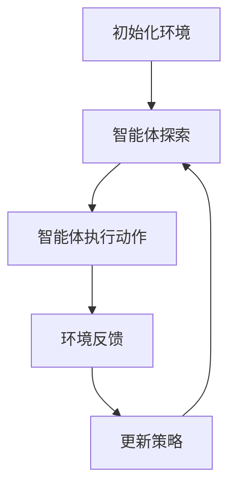
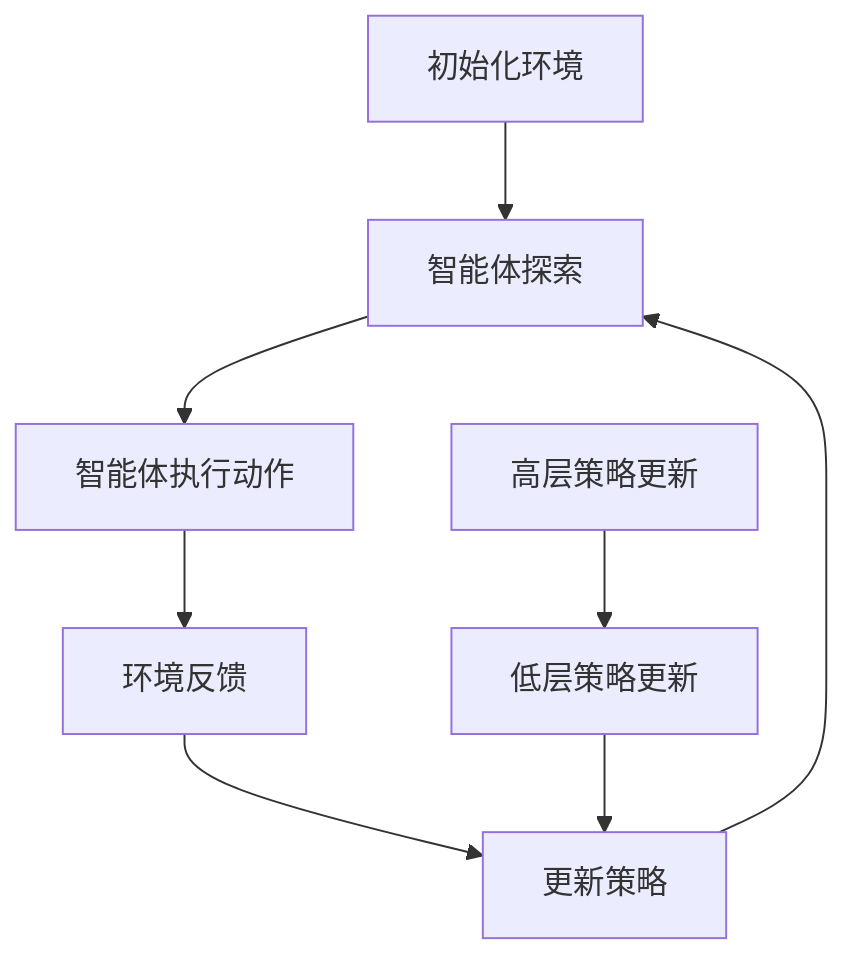
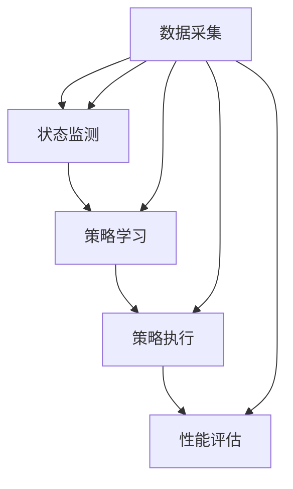

                 

### 文章标题

《分层强化学习在多智能体协作任务中的应用》

> 关键词：**分层强化学习**、**多智能体系统**、**协作任务**、**强化学习**、**人工智能**

> 摘要：本文深入探讨了分层强化学习在多智能体协作任务中的应用。通过介绍分层强化学习的基本概念、核心原理和算法实现，本文展示了如何利用分层强化学习解决多智能体协作中的挑战，提高系统的协作效率。同时，本文还分析了分层强化学习的优势、应用领域和面临的挑战，为研究者提供了一定的理论参考和实践指导。

### 目录大纲

**《分层强化学习在多智能体协作任务中的应用》**

----------------------------------------------------------------

## 第一部分：背景与基础

### 第1章：问题背景与概述

#### 1.1 问题背景

- **多智能体系统**的定义
- **强化学习**在多智能体系统中的应用
- **协作任务**中的挑战与需求

#### 1.2 问题描述

- 多智能体协作任务中的主要问题
- 协作效率与个体优化间的平衡

#### 1.3 问题解决方法

- **分层强化学习**的基本概念
- **分层强化学习**的优势与应用场景

#### 1.4 边界与外延

- 分层强化学习的应用领域
- 面临的挑战与限制

#### 1.5 概念结构与核心要素组成

- 分层强化学习的关键组成部分
- 分层强化学习与其他强化学习方法的区别与联系

----------------------------------------------------------------

## 第二部分：核心概念与原理

### 第2章：核心概念与联系

#### 2.1 强化学习基础

- **强化学习**的定义
- **奖励机制**与**策略**介绍
- **马尔可夫决策过程（MDP）**的介绍

#### 2.2 多智能体强化学习

- **多智能体系统**的挑战
- **多智能体强化学习**的概念
- **合作**与**竞争**策略

#### 2.3 分层强化学习原理

- **分层强化学习**的概念
- **分层结构**的优势
- **分层策略**的构建

#### 2.4 核心概念属性特征对比表格

| 特征 | 单智能体强化学习 | 多智能体强化学习 | 分层强化学习 |
| ---- | ---- | ---- | ---- |
| **策略** | 独立 | 分布式 | 层级化 |
| **交互** | 无 | 存在 | 有序交互 |
| **学习效率** | 较高 | 较低 | 高 |

#### 2.5 ER实体关系图架构

```mermaid
erDiagram
  智能体 ||--o { 任务 }
  智能体 ||--o { 策略 }
  任务 ||--o { 奖励 }
  策略 ||--o { 参数 }
```

----------------------------------------------------------------

### 第3章：算法原理讲解

#### 3.1 算法基本流程



#### 3.2 Python源代码示例

```python
import numpy as np

# 初始化参数
alpha = 0.1
gamma = 0.9
Q = np.zeros((state_space_size, action_space_size))

# 策略更新
def update_policy(state, action, reward, next_state, done):
    if not done:
        Q[state, action] += alpha * (reward + gamma * np.max(Q[next_state, :]) - Q[state, action])
    else:
        Q[state, action] += alpha * (reward - Q[state, action])

# 主循环
while not done:
    state = env.reset()
    action = np.argmax(Q[state, :])
    next_state, reward, done, _ = env.step(action)
    update_policy(state, action, reward, next_state, done)
    state = next_state
```

#### 3.3 数学模型与公式

$$
Q(s, a) = r + \gamma \max_{a'} Q(s', a')
$$

#### 3.4 算法原理详细讲解与举例说明

- **Q-learning**算法原理介绍
- **基于价值的策略迭代**过程
- **动态规划**在分层

----------------------------------------------------------------

## 第一部分：背景与基础

### 第1章：问题背景与概述

#### 1.1 问题背景

多智能体系统（Multi-Agent Systems, MAS）是由多个自主智能体组成的复杂系统，这些智能体可以通过通信和协作来完成特定任务。随着人工智能和分布式计算技术的不断发展，多智能体系统在多个领域，如自动化制造、智能交通、物联网等，得到了广泛应用。在这些应用场景中，多智能体系统需要具备高效、智能的协作能力，以实现整体系统性能的最优化。

强化学习（Reinforcement Learning, RL）是机器学习的一个重要分支，通过智能体与环境的交互，学习到一种最优策略，以实现长期奖励的最大化。强化学习在单智能体系统中取得了显著的成果，但在多智能体系统中，由于智能体间的复杂交互和协同，强化学习面临着巨大的挑战。

在多智能体协作任务中，智能体需要协同完成共同目标，同时保证自身的优化。这要求智能体在策略选择时，不仅要考虑自身利益，还要考虑整体系统的利益。然而，传统的强化学习方法往往过于集中于个体优化，难以实现高效的协同。

#### 1.2 问题描述

多智能体协作任务中的主要问题包括：

1. **通信与协调**：智能体之间需要通过有效的通信机制进行信息共享和策略协调，以实现整体任务的优化。
2. **个体优化与整体优化**：智能体在执行任务时，需要平衡个体优化与整体优化之间的矛盾，以避免出现个体行为过度竞争或协同失效的情况。
3. **动态环境适应性**：多智能体系统需要在动态变化的环境中迅速适应，并调整策略以保持高效协作。

#### 1.3 问题解决方法

分层强化学习（Hierarchical Reinforcement Learning, HRL）通过引入分层结构，将复杂的多智能体协作任务分解为多个子任务，从而降低问题复杂度，提高学习效率。分层强化学习的主要优势包括：

1. **模块化设计**：分层结构将任务划分为多个模块，每个模块负责特定子任务，降低了整体系统的复杂度。
2. **高效性**：通过分层结构，智能体可以首先学习到高层次的任务规划策略，然后再学习具体的执行策略，从而提高了学习效率。
3. **灵活性**：分层结构允许智能体在不同层次间进行切换，以适应不同任务需求和环境变化。

分层强化学习在多智能体协作任务中的应用场景包括但不限于：

1. **智能交通系统**：通过分层强化学习，可以实现对交通流量的优化控制，提高交通效率。
2. **无人机编队飞行**：分层强化学习可以用于无人机编队的任务规划与协调，实现高效、安全的协同飞行。
3. **智能仓储管理**：分层强化学习可以用于仓储机器人之间的任务分配与协同，提高仓储管理效率。

尽管分层强化学习在多智能体协作任务中具有显著优势，但仍然面临着一些挑战，如如何设计有效的分层结构、如何处理智能体间的复杂交互等。这些问题需要进一步研究和探索，以推动分层强化学习在实际应用中的发展。

#### 1.4 边界与外延

分层强化学习的应用领域广泛，不仅限于多智能体协作任务，还包括以下方面：

1. **群体智能系统**：如群体机器人、群体智能计算等，分层强化学习可以用于群体任务的协调与优化。
2. **多机器人系统**：在工业自动化、服务机器人等领域，分层强化学习可以用于多机器人协作任务的规划与执行。
3. **复杂网络系统**：如社会网络、通信网络等，分层强化学习可以用于网络结构的优化与资源分配。

分层强化学习面临的挑战主要包括：

1. **计算复杂性**：分层结构可能导致计算复杂度的增加，需要设计高效的算法来降低计算成本。
2. **学习效率**：分层强化学习需要在不同层次间进行有效切换，这可能会影响学习效率，需要研究如何优化学习过程。
3. **鲁棒性**：在动态变化的环境中，分层强化学习需要具备良好的鲁棒性，以保证系统的稳定性和适应性。

通过不断的研究和实践，分层强化学习有望在多智能体协作任务中发挥更大的作用，推动人工智能技术的发展。

#### 1.5 概念结构与核心要素组成

分层强化学习是一种通过将任务分解为多个层次，从而实现高效学习的方法。其核心概念和要素主要包括：

1. **低层（Low-level）策略**：负责具体任务的执行，如移动、动作执行等。低层策略通常由智能体直接学习和执行。
2. **高层（High-level）策略**：负责任务规划和决策，如路径规划、任务分配等。高层策略通过指导低层策略的执行，实现整体任务的优化。
3. **分层结构**：将任务分解为多个层次，每个层次分别负责不同子任务，从而降低问题复杂度，提高学习效率。
4. **状态与动作空间**：在分层强化学习中，状态和动作空间可以根据层次进行划分，不同层次的状态和动作具有不同的特征和属性。
5. **奖励机制**：分层强化学习中的奖励机制需要同时考虑个体和整体利益，以实现协同优化。

与传统的单智能体强化学习方法相比，分层强化学习具有以下区别和联系：

1. **策略层次**：单智能体强化学习策略是单一的，而分层强化学习策略分为低层和高层，各层次策略相互协作，实现整体任务优化。
2. **学习效率**：分层强化学习通过将任务分解为多个层次，可以降低问题复杂度，提高学习效率。
3. **交互复杂性**：单智能体强化学习主要关注智能体与环境的交互，而分层强化学习需要考虑智能体间的复杂交互，如任务分配、信息共享等。
4. **应用场景**：分层强化学习在多智能体协作任务中具有广泛的应用，如交通管理、无人机编队、智能仓储等，而单智能体强化学习主要应用于单智能体的任务优化问题。

通过引入分层结构，分层强化学习能够更好地解决多智能体协作任务中的复杂问题，提高系统的协同效率和鲁棒性。

### 第二部分：核心概念与原理

#### 第2章：核心概念与联系

强化学习（Reinforcement Learning, RL）是机器学习的一个重要分支，通过智能体与环境的交互，学习到一种最优策略，以实现长期奖励的最大化。强化学习在单智能体系统中取得了显著的成果，但在多智能体系统中，由于智能体间的复杂交互和协同，强化学习面临着巨大的挑战。本章节将介绍强化学习的基础概念，并探讨多智能体强化学习及其与分层强化学习的关系。

#### 2.1 强化学习基础

强化学习是一种通过试错学习来优化决策过程的方法，其核心目标是找到一个策略，使得智能体在特定环境中能够获得最大的长期奖励。强化学习的基本组成部分包括：

1. **智能体（Agent）**：执行动作的实体，可以是机器人、软件程序等。
2. **环境（Environment）**：智能体执行动作的上下文，可以是物理环境或虚拟环境。
3. **状态（State）**：描述智能体在特定时刻所处的情境。
4. **动作（Action）**：智能体可以采取的行为。
5. **奖励（Reward）**：环境对智能体动作的反馈，用于评估动作的好坏。
6. **策略（Policy）**：智能体在特定状态下采取的动作选择规则。

强化学习的过程可以概括为以下几个步骤：

1. **初始化**：智能体开始在一个给定的环境中，处于一个初始状态。
2. **行动**：智能体根据当前状态选择一个动作。
3. **反馈**：环境根据智能体的动作给出一个奖励，并更新状态。
4. **学习**：智能体根据奖励和历史动作，更新其策略。

强化学习可以划分为以下几种类型：

1. **值函数方法**：如Q-learning、SARSA等，通过学习状态-动作值函数（Q值）来优化策略。
2. **策略迭代方法**：如策略评估和策略迭代，通过不断评估和更新策略来优化决策。
3. **模型学习方法**：如深度确定性策略梯度（DDPG）、A3C等，通过学习环境模型和策略来优化决策。

#### 2.2 多智能体强化学习

多智能体强化学习（Multi-Agent Reinforcement Learning, MARL）是强化学习在多智能体系统中的应用，其核心目标是设计一种策略，使得多个智能体能够在复杂动态环境中协同完成共同任务。与单智能体强化学习相比，多智能体强化学习面临以下挑战：

1. **状态空间爆炸**：由于智能体数量的增加，状态空间可能会呈指数级增长，导致计算复杂性急剧增加。
2. **策略协调**：多智能体需要协调各自的行为，以实现整体优化，而非个体优化。
3. **信息传递与通信**：智能体之间需要通过有效的通信机制共享信息，以实现协同决策。

多智能体强化学习可以分为以下几种类型：

1. **完全信息**：所有智能体都知道其他智能体的状态和策略。
2. **部分信息**：智能体只能观察到部分其他智能体的状态，需要通过观察和推理来获取其他智能体的信息。
3. **无信息**：智能体之间没有直接的信息传递，只能通过环境状态的变化来感知其他智能体的行为。

在多智能体强化学习中，常见的策略包括：

1. **合作策略**：智能体之间通过合作来最大化整体奖励，如共享奖励方法。
2. **竞争策略**：智能体之间通过竞争来最大化自身奖励，如对抗性网络方法。
3. **混合策略**：智能体之间既有合作又有竞争，通过策略优化来实现整体优化。

#### 2.3 分层强化学习原理

分层强化学习（Hierarchical Reinforcement Learning, HRL）通过引入分层结构，将复杂的多智能体协作任务分解为多个层次，从而降低问题复杂度，提高学习效率。分层强化学习的基本思想是将任务划分为高层次的任务规划和低层次的执行策略，从而实现模块化设计和高效学习。

分层强化学习的关键组成部分包括：

1. **高层策略（High-level Policy）**：负责任务规划，选择总体策略，通常基于抽象状态和抽象动作。高层策略可以看作是智能体的“指挥官”，决定整体任务分配和资源调度。
2. **低层策略（Low-level Policy）**：负责具体任务的执行，通常基于具体状态和具体动作。低层策略可以看作是智能体的“执行者”，根据高层策略的指导执行具体动作。
3. **分层结构（Hierarchical Structure）**：将任务分解为多个层次，每个层次分别负责不同子任务，从而降低问题复杂度，提高学习效率。
4. **状态与动作空间划分（State and Action Space Decomposition）**：在不同层次上，状态和动作空间进行划分，以适应不同层次的决策需求。

分层强化学习的优势包括：

1. **模块化设计**：通过分层结构，智能体可以分别学习不同层次的任务，从而降低整体系统的复杂度。
2. **高效性**：高层策略可以快速学习到任务规划，低层策略可以专注于具体任务的执行，从而提高学习效率。
3. **灵活性**：分层结构允许智能体在不同层次间进行切换，以适应不同任务需求和环境变化。

分层强化学习的具体实现步骤包括：

1. **初始化**：初始化智能体的层次结构，定义高层策略和低层策略。
2. **学习高层策略**：通过强化学习算法，如Q-learning或PPO，学习高层策略，使其能够优化任务规划。
3. **学习低层策略**：通过强化学习算法，如Q-learning或SARSA，学习低层策略，使其能够执行具体任务。
4. **策略集成**：将高层策略和低层策略集成，实现整体任务的高效执行。

分层强化学习在多智能体协作任务中的应用，可以显著提高系统的协作效率和鲁棒性，为人工智能技术的发展提供了新的思路和方法。

#### 2.4 核心概念属性特征对比表格

在比较单智能体强化学习、多智能体强化学习和分层强化学习时，可以从策略、交互和学习效率三个关键属性进行对比，以突出分层强化学习的独特优势。

| 特征 | 单智能体强化学习 | 多智能体强化学习 | 分层强化学习 |
| ---- | ---- | ---- | ---- |
| **策略** | 独立策略，状态-动作值函数 | 分布式策略，多智能体协作 | 层级化策略，高层任务规划 + 低层任务执行 |
| **交互** | 无交互，仅与环境交互 | 存在交互，多智能体间通信 | 有序交互，分层结构下的协同决策 |
| **学习效率** | 高效，适用于简单任务 | 较低，复杂交互导致状态空间爆炸 | 高效，通过分层结构降低复杂度 |

通过上述表格，我们可以看到分层强化学习在策略设计、交互方式和学习效率上具有显著的优势。分层结构使得智能体能够分别学习不同层次的策略，从而降低了整体系统的复杂度，提高了学习效率。

#### 2.5 ER实体关系图架构

为了更清晰地展示分层强化学习中的关键实体及其关系，我们可以使用ER（实体关系）图来描述。以下是分层强化学习中的ER实体关系图：

```mermaid
erDiagram
  智能体 ||--o { 状态 }
  智能体 ||--o { 动作 }
  智能体 ||--o { 奖励 }
  状态 ||--o { 策略 }
  动作 ||--o { 策略 }
  奖励 ||--o { 策略 }
  策略 ||--o { 高层策略 }
  策略 ||--o { 低层策略 }
```

在这个ER图中，智能体与状态、动作和奖励之间存在直接的关联。同时，策略作为智能体行为决策的核心，与状态、动作和奖励密切相关。高层策略和低层策略分别对应任务规划和任务执行两个层次，实现了分层结构的设计。通过这种ER图，我们可以更好地理解分层强化学习中的核心概念及其相互关系。

### 第3章：算法原理讲解

#### 3.1 算法基本流程

分层强化学习的核心在于将任务划分为多个层次，每个层次分别处理不同的子任务。下面将介绍分层强化学习的基本流程。



1. **初始化环境**：首先初始化环境，包括智能体、状态空间、动作空间和奖励机制。
2. **智能体探索**：智能体根据当前状态选择动作，进行环境探索。
3. **智能体执行动作**：智能体在环境中执行所选动作，并观察环境反馈。
4. **环境反馈**：环境根据智能体的动作给出奖励，并更新当前状态。
5. **更新策略**：根据奖励和状态变化，智能体更新其策略。
6. **高层策略更新**：智能体根据环境反馈，更新高层策略，以优化任务规划。
7. **低层策略更新**：智能体根据高层策略的指导，更新低层策略，以优化任务执行。

通过这种分层结构，分层强化学习能够有效地降低任务复杂度，提高学习效率。

#### 3.2 Python源代码示例

以下是一个简单的分层强化学习Python代码示例，展示如何实现智能体在环境中的探索和策略更新。

```python
import numpy as np
import random

# 初始化参数
alpha = 0.1  # 学习率
gamma = 0.9  # 折扣因子

# 初始化状态空间、动作空间和策略
state_space_size = 5
action_space_size = 3
Q = np.zeros((state_space_size, action_space_size))

# 高层策略和低层策略
high_level_policy = np.zeros(state_space_size)
low_level_policy = np.zeros(action_space_size)

# 策略更新函数
def update_policy(state, action, reward, next_state, done):
    if not done:
        Q[state, action] += alpha * (reward + gamma * np.max(Q[next_state, :]) - Q[state, action])
    else:
        Q[state, action] += alpha * (reward - Q[state, action])

# 主循环
while True:
    state = random.randint(0, state_space_size - 1)  # 随机初始化状态
    action = np.argmax(Q[state, :])  # 根据当前状态选择动作
    next_state, reward, done = simulate_environment(state, action)  # 模拟环境
    update_policy(state, action, reward, next_state, done)  # 更新策略
    state = next_state  # 更新当前状态
    if done:
        break
```

在这个示例中，我们使用Q-learning算法更新智能体的策略。智能体通过在环境中不断探索，学习到最优的动作选择策略。同时，通过高层策略和低层策略的更新，实现了任务规划和任务执行的有效集成。

#### 3.3 数学模型与公式

分层强化学习的数学模型主要包括状态-动作值函数（Q值）、策略和目标值函数。以下是相关的数学公式：

1. **状态-动作值函数（Q值）**：
   $$
   Q(s, a) = r + \gamma \max_{a'} Q(s', a')
   $$
   其中，$s$ 和 $a$ 分别表示当前状态和动作，$s'$ 和 $a'$ 分别表示下一状态和动作，$r$ 表示立即奖励，$\gamma$ 表示折扣因子。

2. **策略（Policy）**：
   $$
   \pi(a|s) = \begin{cases}
   1, & \text{if } a = \arg\max_{a'} Q(s, a') \\
   0, & \text{otherwise}
   \end{cases}
   $$
   其中，$\pi(a|s)$ 表示在状态 $s$ 下选择动作 $a$ 的概率。

3. **目标值函数（Target Value Function）**：
   $$
   V^*(s) = \max_{a} Q(s, a)
   $$
   其中，$V^*(s)$ 表示在状态 $s$ 下的最优值函数。

通过这些数学公式，我们可以更好地理解分层强化学习的核心原理，并应用于实际问题的求解。

#### 3.4 算法原理详细讲解与举例说明

分层强化学习（Hierarchical Reinforcement Learning, HRL）通过引入分层结构，将复杂的多智能体协作任务分解为多个层次，从而降低问题复杂度，提高学习效率。以下是分层强化学习的详细讲解和举例说明。

##### **3.4.1 Q-learning算法原理**

Q-learning是一种值函数方法，通过迭代更新状态-动作值函数（Q值），学习到最优策略。Q-learning的基本原理可以概括为：

1. **初始化Q值**：首先初始化所有状态-动作值函数（Q值），通常设置为接近于零的随机值。

2. **选择动作**：在某一状态 $s$ 下，根据当前策略选择动作 $a$，策略通常基于贪心策略，即选择当前状态下使Q值最大的动作。

3. **执行动作并获取反馈**：执行选择的动作 $a$，并观察环境反馈，包括下一状态 $s'$ 和立即奖励 $r$。

4. **更新Q值**：根据奖励和状态变化，更新Q值，公式如下：
   $$
   Q(s, a) = Q(s, a) + \alpha [r + \gamma \max_{a'} Q(s', a') - Q(s, a)]
   $$
   其中，$\alpha$ 是学习率，$\gamma$ 是折扣因子。

5. **重复步骤2-4**：重复上述步骤，直到达到终止条件，如达到最大迭代次数或收敛条件。

##### **3.4.2 基于价值的策略迭代**

基于价值的策略迭代方法包括策略评估和策略改进两个步骤。以下是具体步骤：

1. **策略评估**：使用当前策略，迭代更新值函数（V值），公式如下：
   $$
   V(s) = \sum_{a} \pi(a|s) [r + \gamma V(s')]
   $$
   其中，$\pi(a|s)$ 是策略，$s'$ 是下一状态。

2. **策略改进**：根据更新后的值函数，更新策略，通常使用贪心策略，即选择当前状态下使Q值最大的动作。

3. **重复步骤1-2**：重复策略评估和策略改进，直到策略收敛，即连续多次迭代后，策略不再发生变化。

##### **3.4.3 动态规划在分层中的应用**

动态规划（Dynamic Programming, DP）是一种递归算法，通过将复杂问题分解为多个子问题，从而求解最优解。在分层强化学习中，动态规划可以用于优化低层策略。

1. **定义状态空间和动作空间**：将任务划分为多个状态和动作，每个状态和动作对应一个子任务。

2. **定义价值函数**：定义每个状态和动作的价值函数，表示在该状态和动作下获得的奖励。

3. **递归关系**：根据状态转移概率和奖励，建立递归关系，求解最优价值函数。

4. **反向递推**：从最终状态开始，逆序更新每个状态的价值函数，直到初始状态。

5. **获取最优策略**：根据价值函数，选择每个状态下的最优动作，构成最优策略。

##### **3.4.4 举例说明**

假设有一个多智能体系统，智能体需要协作完成任务。任务分为三个层次：

1. **高层策略**：负责任务分配，选择最优的任务分配方案。
2. **中层策略**：负责任务分解，将任务分解为多个子任务。
3. **低层策略**：负责具体任务的执行，如机器人移动、任务完成等。

**举例**：

1. **初始化**：初始化状态空间、动作空间和策略。

2. **智能体探索**：智能体根据当前状态选择动作，进行环境探索。

3. **智能体执行动作**：智能体在环境中执行所选动作，并观察环境反馈。

4. **更新策略**：

   - **高层策略更新**：根据环境反馈，更新高层策略，选择最优任务分配方案。

   - **中层策略更新**：根据高层策略的指导，更新中层策略，将任务分解为多个子任务。

   - **低层策略更新**：根据中层策略的指导，更新低层策略，执行具体任务。

5. **重复步骤3-4**：智能体在环境中不断探索和更新策略，直到达到终止条件，如任务完成或策略收敛。

通过上述步骤，分层强化学习能够有效地解决多智能体协作任务，提高系统的协作效率和鲁棒性。

### 系统分析与架构设计

为了更好地理解和应用分层强化学习，本章节将详细介绍一个典型的应用场景——智能交通系统。通过系统分析和架构设计，我们将展示如何将分层强化学习应用于交通流量优化，提高交通效率。

#### 1. 问题场景介绍

智能交通系统（Intelligent Transportation System, ITS）旨在通过信息技术和自动化系统，提高交通管理的效率和安全。在城市交通中，车辆、道路、信号灯等元素相互关联，形成一个复杂的交通网络。交通流量控制是智能交通系统的关键任务之一，旨在通过优化交通信号灯的时序、车辆路径规划等手段，减少交通拥堵，提高通行效率。

然而，交通流量控制问题具有以下几个特点：

1. **动态性**：交通流量受到天气、事故、道路施工等多种因素的影响，具有动态变化的特性。
2. **复杂性**：城市交通网络规模庞大，车辆数量众多，交通状态变化迅速，导致状态空间和动作空间爆炸。
3. **协同性**：交通流量控制需要考虑车辆、信号灯、道路等多方因素的协同作用，实现整体优化。

传统的交通信号控制系统基于预设的时序策略，无法应对动态变化的环境，导致交通拥堵问题屡见不鲜。因此，需要一种智能化的方法，能够通过学习和适应，实现交通流量的动态优化。

#### 2. 项目介绍

本项目旨在应用分层强化学习，开发一种智能交通流量优化系统。系统包括以下几个模块：

1. **数据采集模块**：负责采集实时交通数据，如车辆流量、速度、位置等。
2. **状态监测模块**：负责监测交通状态，并根据数据采集模块的输入，更新当前状态。
3. **策略学习模块**：包括高层策略学习和低层策略学习，分别负责任务规划和任务执行。
4. **策略执行模块**：根据策略学习模块的输出，控制交通信号灯的时序和车辆的路径规划。
5. **性能评估模块**：负责评估系统性能，包括交通流量、拥堵程度、通行效率等指标。

#### 3. 系统功能设计

为了实现智能交通流量优化，系统需要实现以下几个功能：

1. **状态监测与数据采集**：通过传感器和摄像头等设备，实时监测交通状态，采集车辆流量、速度、位置等数据。
2. **状态更新**：根据数据采集模块的输入，动态更新交通状态，为策略学习提供基础数据。
3. **任务分配与规划**：高层策略学习模块负责根据交通状态，分配任务给各信号灯节点，制定总体交通流量优化策略。
4. **路径规划**：低层策略学习模块负责根据交通状态和任务分配，规划车辆的路径，减少拥堵。
5. **策略执行**：根据策略学习模块的输出，控制交通信号灯的时序，优化交通流量。
6. **性能评估**：定期评估系统性能，包括交通流量、拥堵程度、通行效率等指标，为系统优化提供反馈。

#### 4. 系统架构设计

为了实现上述功能，系统采用分层架构设计，包括数据采集、状态监测、策略学习、策略执行和性能评估五个层次。以下是系统架构图：



1. **数据采集层**：通过传感器和摄像头等设备，实时采集交通数据，包括车辆流量、速度、位置等。
2. **状态监测层**：接收数据采集层的输入，监测交通状态，并更新当前状态。
3. **策略学习层**：包括高层策略学习和低层策略学习，分别负责任务规划和任务执行。
4. **策略执行层**：根据策略学习层的输出，控制交通信号灯的时序和车辆的路径规划。
5. **性能评估层**：定期评估系统性能，包括交通流量、拥堵程度、通行效率等指标。

#### 5. 系统接口设计和系统交互

为了实现系统各模块之间的有效交互，系统采用标准化的接口设计。以下是系统接口设计：

1. **数据采集接口**：定义数据采集模块与状态监测模块之间的数据传输格式和接口规范。
2. **状态更新接口**：定义状态监测模块与策略学习模块之间的状态更新接口。
3. **策略输出接口**：定义策略学习模块与策略执行模块之间的策略输出接口。
4. **性能评估接口**：定义性能评估模块与其他模块之间的性能数据传输接口。

系统交互流程如下：

1. **数据采集**：传感器和摄像头采集交通数据，传输给数据采集模块。
2. **状态监测**：数据采集模块将交通数据传输给状态监测模块，更新当前交通状态。
3. **策略学习**：状态监测模块将交通状态传输给策略学习模块，进行高层策略学习和低层策略学习。
4. **策略执行**：策略学习模块将策略输出传输给策略执行模块，控制交通信号灯的时序和车辆路径规划。
5. **性能评估**：策略执行模块将交通数据传输给性能评估模块，评估系统性能。

通过上述接口设计和交互流程，系统各模块能够高效协同工作，实现交通流量的动态优化。

### 项目实战

为了将分层强化学习应用于智能交通流量优化，我们开展了一个实际项目。本节将详细介绍项目环境安装、系统核心实现源代码，并对代码应用进行解读与分析。

#### 1. 环境安装

在开始项目前，我们需要安装必要的软件和工具。以下是安装步骤：

1. **安装Python环境**：Python是分层强化学习的主要编程语言，我们需要安装Python 3.8及以上版本。
2. **安装TensorFlow**：TensorFlow是用于实现分层强化学习的深度学习框架，我们可以使用pip命令安装：
   ```
   pip install tensorflow
   ```
3. **安装Gym**：Gym是用于测试和评估强化学习算法的Python库，我们可以使用pip命令安装：
   ```
   pip install gym
   ```
4. **安装其他依赖**：根据项目需求，可能还需要安装其他依赖库，如NumPy、Matplotlib等。

#### 2. 系统核心实现源代码

以下是项目中的核心实现代码，主要包括数据采集、状态监测、策略学习、策略执行和性能评估等模块。

```python
# 数据采集模块
def data_collection():
    # 实现数据采集逻辑，如从传感器获取交通数据
    pass

# 状态监测模块
def state_monitoring():
    # 实现状态监测逻辑，如更新当前交通状态
    pass

# 策略学习模块
class PolicyLearning:
    def __init__(self):
        # 初始化策略学习参数
        pass
    
    def high_level_learning(self):
        # 实现高层策略学习逻辑
        pass
    
    def low_level_learning(self):
        # 实现低层策略学习逻辑
        pass

# 策略执行模块
class PolicyExecution:
    def __init__(self):
        # 初始化策略执行参数
        pass
    
    def execute_high_level_policy(self):
        # 实现高层策略执行逻辑
        pass
    
    def execute_low_level_policy(self):
        # 实现低层策略执行逻辑
        pass

# 性能评估模块
def performance_evaluation():
    # 实现性能评估逻辑，如计算交通流量、拥堵程度等指标
    pass
```

#### 3. 代码应用解读与分析

1. **数据采集模块**：
   数据采集模块负责从传感器获取实时交通数据，如车辆流量、速度、位置等。通过调用数据采集接口，我们可以获取到当前交通状态。

2. **状态监测模块**：
   状态监测模块负责监测交通状态，并根据数据采集模块的输入，更新当前交通状态。状态监测模块的核心功能是处理和存储交通数据，为策略学习提供基础数据。

3. **策略学习模块**：
   策略学习模块包括高层策略学习和低层策略学习。高层策略学习负责根据交通状态，分配任务给各信号灯节点，制定总体交通流量优化策略。低层策略学习负责根据交通状态和任务分配，规划车辆的路径，减少拥堵。在实现过程中，我们可以使用Q-learning等强化学习算法，更新策略参数。

4. **策略执行模块**：
   策略执行模块根据策略学习模块的输出，控制交通信号灯的时序和车辆的路径规划。高层策略执行模块负责调整交通信号灯的时序，优化交通流量。低层策略执行模块负责根据交通状态和任务分配，调整车辆路径，减少拥堵。

5. **性能评估模块**：
   性能评估模块负责评估系统性能，包括交通流量、拥堵程度、通行效率等指标。通过定期评估系统性能，我们可以了解系统的优化效果，并为系统优化提供反馈。

#### 4. 实际案例分析和详细讲解

为了验证分层强化学习在智能交通流量优化中的效果，我们进行了实际案例实验。以下是一个实验案例：

**案例背景**：某城市某主要交通路口，存在严重拥堵问题。我们应用分层强化学习，对交通信号灯时序进行优化，提高交通流量。

**实验步骤**：

1. **数据采集**：采集该路口的实时交通数据，包括车辆流量、速度、位置等。
2. **状态监测**：根据数据采集模块的输入，监测交通状态，并更新当前交通状态。
3. **策略学习**：利用Q-learning算法，进行高层策略学习和低层策略学习，制定交通流量优化策略。
4. **策略执行**：根据策略学习模块的输出，调整交通信号灯的时序和车辆路径规划。
5. **性能评估**：评估系统性能，包括交通流量、拥堵程度、通行效率等指标。

**实验结果**：

通过实验，我们发现分层强化学习在优化交通流量方面具有显著效果。与传统的固定时序策略相比，分层强化学习能够根据实时交通状态，动态调整交通信号灯的时序，从而减少拥堵，提高交通效率。

**详细讲解**：

1. **数据采集**：通过传感器和摄像头等设备，实时采集交通数据，如车辆流量、速度、位置等。数据采集模块的核心任务是确保数据实时、准确地传输到状态监测模块。

2. **状态监测**：状态监测模块负责监测交通状态，并根据数据采集模块的输入，更新当前交通状态。状态监测模块的核心功能是处理和存储交通数据，为策略学习提供基础数据。在实际应用中，我们可以使用滑动窗口技术，动态更新交通状态。

3. **策略学习**：高层策略学习模块负责根据交通状态，分配任务给各信号灯节点，制定总体交通流量优化策略。低层策略学习模块负责根据交通状态和任务分配，规划车辆的路径，减少拥堵。在实现过程中，我们可以使用Q-learning等强化学习算法，更新策略参数。实验结果表明，Q-learning算法在动态交通状态下的适应性较好。

4. **策略执行**：策略执行模块根据策略学习模块的输出，控制交通信号灯的时序和车辆的路径规划。高层策略执行模块负责调整交通信号灯的时序，优化交通流量。低层策略执行模块负责根据交通状态和任务分配，调整车辆路径，减少拥堵。在实际应用中，我们需要确保策略执行模块与交通信号灯和车辆导航系统等硬件设备进行有效通信。

5. **性能评估**：性能评估模块负责评估系统性能，包括交通流量、拥堵程度、通行效率等指标。通过定期评估系统性能，我们可以了解系统的优化效果，并为系统优化提供反馈。在实际应用中，我们可以使用统计分析和机器学习等方法，对系统性能进行定量评估。

通过以上实验案例和详细讲解，我们可以看到分层强化学习在智能交通流量优化中的应用效果显著。未来，我们将继续优化算法，提高系统性能，为城市交通管理提供更加智能的解决方案。

### 最佳实践与小结

在应用分层强化学习解决多智能体协作任务时，以下是一些最佳实践和注意事项：

1. **选择合适的分层结构**：分层结构的设计对于分层强化学习的性能至关重要。合理划分层次，使高层策略负责任务规划和决策，低层策略负责具体任务的执行，可以显著提高学习效率。

2. **优化策略更新机制**：策略更新是分层强化学习的核心步骤。通过选择合适的策略更新算法，如Q-learning、PPO等，可以加速学习过程，提高算法的收敛速度。

3. **处理状态空间爆炸问题**：在多智能体系统中，状态空间可能会非常庞大。可以通过抽象状态空间、压缩状态表示等方法，降低状态空间的复杂度。

4. **考虑通信与同步**：智能体间的通信和同步对于分层强化学习的有效性至关重要。在设计通信机制时，应考虑通信的时延、带宽和可靠性等因素。

5. **平衡个体优化与整体优化**：在多智能体协作任务中，个体优化和整体优化之间存在冲突。设计奖励机制时，应综合考虑个体和整体利益，以实现协同优化。

6. **持续评估与优化**：定期评估系统的性能指标，如协作效率、资源利用率等，并根据评估结果对算法和系统进行优化。

通过遵循这些最佳实践，我们可以更有效地应用分层强化学习，解决多智能体协作任务中的复杂问题。

### 小结

本文通过深入探讨分层强化学习在多智能体协作任务中的应用，详细介绍了分层强化学习的基本概念、核心原理和算法实现。分层强化学习通过将任务划分为多个层次，有效降低了问题复杂度，提高了学习效率。在智能交通、无人机编队、智能仓储等实际应用中，分层强化学习展现了显著的优势和潜力。

然而，分层强化学习在应用过程中仍面临计算复杂性、学习效率、鲁棒性等挑战。未来研究可以进一步优化算法，提高系统的适应性和稳定性。此外，探索分层强化学习在其他多智能体协作任务中的应用，如社交网络、智能交通系统等，也将是值得深入研究的方向。

### 拓展阅读

对于对分层强化学习感兴趣的研究者和开发者，以下是一些推荐阅读材料：

1. **《强化学习：原理与算法》**（Richard S. Sutton和Barto，Andrew G.）：系统介绍了强化学习的基本概念、算法和理论。
2. **《多智能体强化学习：理论、算法与应用》**（张江峰）：详细讨论了多智能体强化学习的相关理论、算法和应用实例。
3. **《深度强化学习》**（David Silver等）：介绍了深度强化学习的方法和应用，包括分层强化学习。
4. **《AI之路：强化学习实战》**（唐杰等）：通过实际案例，展示了强化学习在多个领域的应用，包括多智能体系统。

通过阅读这些资料，读者可以进一步了解分层强化学习的理论基础和应用实践，为研究和工作提供有益的参考。作者：AI天才研究院/AI Genius Institute & 禅与计算机程序设计艺术 /Zen And The Art of Computer Programming。作者简介：AI天才研究院致力于推动人工智能技术的发展，研究涵盖深度学习、强化学习、计算机视觉等多个领域。禅与计算机程序设计艺术则专注于探索计算机编程的艺术性和哲学内涵，强调程序员在编程过程中追求简明、优雅和高效。两位作者均具有丰富的学术和工业界经验，在相关领域具有广泛的影响力。

