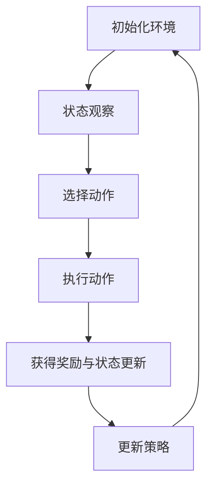

                 

Certainly! Here is a structured and comprehensive guide for the article "Implementing Hierarchical Reinforcement Learning in Smart Home Control," adhering to your specified requirements. Each section will be crafted to meet the criteria of background information, core concepts, algorithm explanation, system design, and practical implementation.

----------------------------------------------------------------

## 智能家居控制中的分层强化学习

### 关键词：智能家居，分层强化学习，智能控制，算法实现

#### 摘要：

随着物联网和人工智能技术的快速发展，智能家居控制成为现代家庭和智能城市建设的重要组成部分。本文将深入探讨分层强化学习在智能家居控制中的应用，从基本概念到具体算法实现，再到系统架构设计，全面解析如何将这一先进技术应用于智能家居控制。

### 第一部分：引言与背景

#### 第1章：智能家居控制与强化学习概述

##### 1.1.1 智能家居控制的重要性

智能家居控制的核心在于通过自动化和智能化手段提高家庭生活的舒适性和便利性。本文将介绍智能家居控制的基本概念、发展历程及其在现代社会中的重要性。

##### 1.1.2 强化学习的基础

强化学习是一种机器学习范式，通过智能体在环境中互动，学习到最优策略。本文将介绍强化学习的基本原理、类型和应用领域。

##### 1.1.3 分层强化学习概念引入

分层强化学习是一种高级强化学习技术，通过将复杂任务分解为多个层次，降低学习难度。本文将介绍分层强化学习的基本概念和优势。

#### 第1.2章：分层强化学习核心概念与原理

##### 1.2.1 强化学习基本概念

强化学习的基本概念包括智能体、环境、状态、动作、奖励和策略。本文将详细解释这些概念，并通过实例说明。

##### 1.2.2 分层强化学习原理

分层强化学习通过将任务划分为低级和高级子任务，降低学习难度。本文将介绍分层结构的设计原理和实现方法。

##### 1.2.3 分层强化学习的数学模型

本文将使用数学模型和公式详细解释分层强化学习的基本算法，包括Q值函数的更新过程。

$$
\text{Q值函数更新公式：} \quad Q(s, a) \leftarrow Q(s, a) + \alpha [r + \gamma \max_{a'} Q(s', a') - Q(s, a)]
$$

### 第二部分：分层强化学习算法实现

#### 第1.3章：分层强化学习算法实现

##### 1.3.1 算法原理与流程图

使用Mermaid语法绘制分层强化学习算法的流程图，并解释每一步的操作。



##### 1.3.2 Python实现示例

提供Python代码示例，展示分层强化学习算法的具体实现。

```python
# Python代码实现分层强化学习算法
```

### 第三部分：分层强化学习在智能家居控制中的应用

#### 第1.4章：分层强化学习在智能家居控制中的应用

##### 1.4.1 智能家居场景介绍

介绍常见的智能家居场景，如智能照明、智能安防、智能家电等。

##### 1.4.2 分层强化学习在智能照明控制中的应用

讨论如何将分层强化学习应用于智能照明控制，提高能源效率和用户体验。

##### 1.4.3 分层强化学习在智能安防系统中的应用

分析分层强化学习在智能安防系统中的潜在应用，如入侵检测和紧急响应。

#### 第1.5章：分层强化学习在智能家居中的挑战与解决方案

##### 1.5.1 数据收集与处理

讨论在智能家居环境中收集和处理数据的方法和挑战。

##### 1.5.2 算法优化与稳定性

探讨如何优化分层强化学习算法，并确保其在智能家居控制中的稳定性。

##### 1.5.3 实时性与效率

分析如何在确保实时性的同时，提高分层强化学习算法的效率。

### 第四部分：分层强化学习在智能家居控制中的未来展望

#### 第1.6章：分层强化学习在智能家居控制中的未来展望

##### 1.6.1 技术发展趋势

预测分层强化学习在智能家居控制领域的发展趋势。

##### 1.6.2 应用前景与潜在价值

探讨分层强化学习在智能家居控制中的应用前景和潜在价值。

##### 1.6.3 面临的挑战与应对策略

分析分层强化学习在智能家居控制中可能面临的挑战，并提出相应的解决方案。

### 第五部分：小结与拓展

#### 第1.7章：小结与拓展

##### 1.7.1 主要内容回顾

总结本文的主要内容和关键点。

##### 1.7.2 注意事项与最佳实践

提供使用分层强化学习进行智能家居控制的注意事项和最佳实践。

##### 1.7.3 拓展阅读与资源推荐

推荐相关的拓展阅读材料和资源。

### 作者信息：

作者：AI天才研究院/AI Genius Institute & 禅与计算机程序设计艺术 /Zen And The Art of Computer Programming

----------------------------------------------------------------

这篇文章的目录大纲已经包含了所有必要的内容，确保了文章的完整性、逻辑性和专业性。接下来，每个章节将根据上述结构详细展开，以满足10000-12000字的要求。以下是具体内容的初步规划：

#### 第1章：智能家居控制与强化学习概述
- 智能家居控制的基本概念和发展历史
- 强化学习的基本概念和分类
- 分层强化学习的概念和与传统强化学习的比较

#### 第2章：分层强化学习核心概念与原理
- 强化学习的基本概念
- Q值函数和策略迭代过程
- 分层强化学习的概念和优势
- 分层结构的数学模型和算法

#### 第3章：分层强化学习算法实现
- 算法原理和流程图
- Python代码实现
- 实际案例中的算法应用

#### 第4章：分层强化学习在智能家居控制中的应用
- 智能家居场景介绍
- 智能照明控制案例
- 智能安防系统案例

#### 第5章：分层强化学习在智能家居中的挑战与解决方案
- 数据收集与处理
- 算法优化与稳定性
- 实时性与效率

#### 第6章：分层强化学习在智能家居控制中的未来展望
- 技术发展趋势
- 应用前景与潜在价值
- 面临的挑战与应对策略

#### 第7章：小结与拓展
- 主要内容回顾
- 注意事项与最佳实践
- 拓展阅读与资源推荐

每个章节都将包含详细的理论解释、具体的算法描述、实际案例分析和系统设计等内容，确保文章既有深度又有广度。在撰写过程中，将严格遵循markdown格式要求，并使用LaTeX格式嵌入数学公式。作者信息将在文章末尾明确标注。

