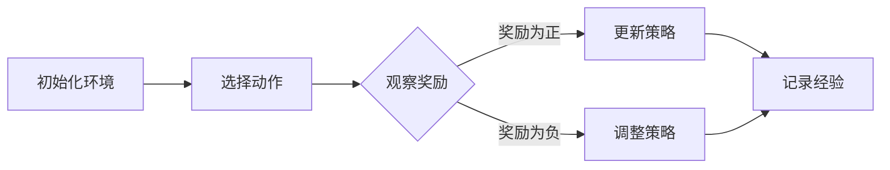
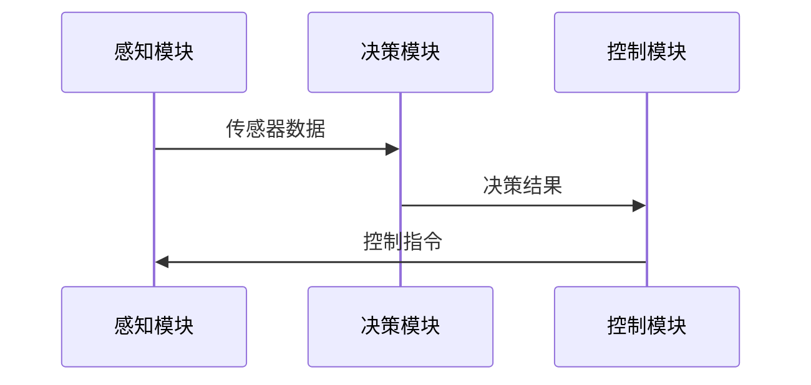

                 

### 《分层强化学习在自动驾驶决策中的应用》

#### 关键词：分层强化学习、自动驾驶、决策、算法、系统架构

> 摘要：本文深入探讨了分层强化学习在自动驾驶决策中的应用。首先介绍了自动驾驶技术的发展背景、现状与挑战，以及分层强化学习的基础概念和原理。接着，通过核心概念对比表格和ER图，阐述了分层强化学习在自动驾驶决策中的关键角色。随后，文章详细讲解了分层强化学习的算法原理，通过Mermaid绘制算法流程图和Python代码实现，配合数学模型和公式讲解，使读者对算法有更直观的理解。进一步，文章分析了自动驾驶决策系统的应用场景，并详细介绍了系统的功能设计、架构设计、接口设计以及系统交互。最后，通过一个实际项目案例，展示了分层强化学习在自动驾驶决策中的应用效果，并提供了实战中的技巧和建议。本文旨在为读者提供一个系统、全面、易懂的分层强化学习在自动驾驶决策中的应用指南。

---

### 目录大纲设计思路

#### 第一部分：背景介绍

**第1章 自动驾驶技术概述**

- **1.1 自动驾驶技术的发展背景**
  - 引导读者了解自动驾驶技术的发展历程，以及其在现代交通体系中的重要地位。

- **1.2 自动驾驶技术的现状与挑战**
  - 分析当前自动驾驶技术的成熟度，以及面临的技术难题和潜在风险。

- **1.3 分层强化学习在自动驾驶中的应用前景**
  - 阐述分层强化学习在自动驾驶领域的应用潜力，及其对自动驾驶技术发展的重要意义。

**第2章 分层强化学习基础**

- **2.1 强化学习概述**
  - 介绍强化学习的基本概念、原理和常见算法，为后续内容奠定基础。

- **2.2 分层强化学习原理**
  - 详细阐述分层强化学习的基本原理，包括分层架构的设计和核心算法的运作机制。

- **2.3 分层强化学习与自动驾驶的关系**
  - 探讨分层强化学习如何应用于自动驾驶决策，以及其相较于传统算法的优势。

#### 第二部分：核心概念与联系

**第3章 核心概念与联系**

- **3.1 核心概念介绍**
  - 对强化学习、分层强化学习和自动驾驶相关概念进行系统梳理。

- **3.2 概念属性对比表格**
  - 使用表格形式对比强化学习、分层强化学习和自动驾驶的核心属性，帮助读者建立概念之间的联系。

- **3.3 分层强化学习ER图**
  - 利用Mermaid绘制分层强化学习的ER图，展示核心概念之间的实体关系，增强读者的理解。

#### 第三部分：算法原理讲解

**第4章 分层强化学习算法详解**

- **4.1 算法流程图**
  - 使用Mermaid绘制分层强化学习的算法流程图，展示算法的执行步骤。

- **4.2 Python代码实现**
  - 提供Python代码实现，详细阐述分层强化学习算法的代码结构和执行逻辑。

- **4.3 数学模型与公式讲解**
  - 对分层强化学习的数学模型和公式进行详细讲解，包括状态空间、动作空间、奖励函数等。

- **4.4 举例说明**
  - 通过实际案例，对分层强化学习算法进行举例说明，帮助读者更好地理解算法原理。

#### 第四部分：系统分析与架构设计方案

**第5章 自动驾驶决策系统分析**

- **5.1 应用场景介绍**
  - 介绍自动驾驶决策系统的应用场景，包括交通场景和实际驾驶环境的复杂性。

- **5.2 系统功能设计**
  - 分析系统功能，包括感知、决策、控制等功能模块的设计。

- **5.3 系统架构设计**
  - 详细介绍系统架构设计，包括分层强化学习算法在系统中的角色和定位。

- **5.4 系统接口设计**
  - 描述系统接口设计，包括与其他系统模块的交互接口。

- **5.5 系统交互设计**
  - 使用Mermaid绘制系统交互序列图，展示系统模块之间的交互关系。

#### 第五部分：项目实战

**第6章 自动驾驶决策项目实战**

- **6.1 环境安装**
  - 演示自动驾驶决策项目环境的安装过程，包括依赖环境的配置。

- **6.2 系统核心实现源代码**
  - 展示系统核心实现源代码，详细解读代码结构和关键实现部分。

- **6.3 代码应用解读与分析**
  - 分析代码应用，解释分层强化学习算法在系统中的实际应用。

- **6.4 实际案例分析与讲解**
  - 通过实际案例，分析分层强化学习算法在自动驾驶决策中的应用效果。

- **6.5 项目小结**
  - 总结项目实践中的收获和经验，以及对未来研究的展望。

#### 第六部分：最佳实践与拓展

**第7章 最佳实践 tips**

- **7.1 实践技巧**
  - 提供在项目实践中积累的技巧和经验，帮助读者更好地应用分层强化学习。

- **7.2 小结**
  - 对项目实践进行小结，强调关键点和注意事项。

**第8章 注意事项**

- **8.1 避免误区**
  - 指出项目实践中的常见误区，帮助读者避免走弯路。

- **8.2 注意事项**
  - 提醒读者在应用分层强化学习时需要注意的问题。

**第9章 拓展阅读推荐**

- **9.1 进一步学习资源**
  - 推荐进一步阅读的材料，包括相关书籍、论文和研究报告。

---

### 目录大纲

**# 《分层强化学习在自动驾驶决策中的应用》目录大纲**

## 第一部分：背景介绍

### 第1章 自动驾驶技术概述

#### 1.1 自动驾驶技术的发展背景

#### 1.2 自动驾驶技术的现状与挑战

#### 1.3 分层强化学习在自动驾驶中的应用前景

### 第2章 分层强化学习基础

#### 2.1 强化学习概述

#### 2.2 分层强化学习原理

#### 2.3 分层强化学习与自动驾驶的关系

### 第3章 核心概念与联系

#### 3.1 核心概念介绍

#### 3.2 概念属性对比表格

#### 3.3 分层强化学习ER图

## 第二部分：算法原理讲解

### 第4章 分层强化学习算法详解

#### 4.1 算法流程图

#### 4.2 Python代码实现

#### 4.3 数学模型与公式讲解

#### 4.4 举例说明

### 第5章 自动驾驶决策系统分析

#### 5.1 应用场景介绍

#### 5.2 系统功能设计

#### 5.3 系统架构设计

#### 5.4 系统接口设计

#### 5.5 系统交互设计

### 第6章 自动驾驶决策项目实战

#### 6.1 环境安装

#### 6.2 系统核心实现源代码

#### 6.3 代码应用解读与分析

#### 6.4 实际案例分析与讲解

#### 6.5 项目小结

### 第7章 最佳实践 tips

#### 7.1 实践技巧

#### 7.2 小结

### 第8章 注意事项

#### 8.1 避免误区

#### 8.2 注意事项

### 第9章 拓展阅读推荐

#### 9.1 进一步学习资源

---

### 内容扩展

**第1章 自动驾驶技术概述**

#### 1.1 自动驾驶技术的发展背景

- 自动驾驶技术起源于20世纪40年代，但随着计算机技术和传感器技术的发展，真正的自动驾驶技术开始出现于20世纪90年代。
- 21世纪初，自动驾驶技术逐渐成为学术界和工业界的关注热点，众多公司和研究机构纷纷投入研发。
- 近年来，自动驾驶技术取得了显著进展，从最初的辅助驾驶到全自动驾驶，逐步走向实际应用。

#### 1.2 自动驾驶技术的现状与挑战

- 当前自动驾驶技术已实现一定程度的商业化应用，如特斯拉的辅助驾驶系统、Waymo的全自动驾驶出租车等。
- 自动驾驶技术的挑战主要集中在复杂交通场景的处理、高精度的感知和决策算法、以及系统的可靠性和安全性等方面。
- 自动驾驶技术的推广仍面临法律法规、公众接受度、数据隐私等外部环境的制约。

#### 1.3 分层强化学习在自动驾驶中的应用前景

- 分层强化学习能够有效处理自动驾驶中的复杂决策问题，通过层次化的架构降低问题的复杂度。
- 分层强化学习在自动驾驶中的应用潜力巨大，如路径规划、交通信号识别、车辆控制等。
- 随着技术的不断进步，分层强化学习有望成为自动驾驶技术的重要支撑。

**第2章 分层强化学习基础**

#### 2.1 强化学习概述

- 强化学习是一种通过试错来学习最优策略的机器学习方法，其核心是奖励机制。
- 强化学习的代表算法包括Q学习、SARSA、DQN等，每种算法都有其独特的优势和适用场景。

#### 2.2 分层强化学习原理

- 分层强化学习通过将问题分解为多个层次，每个层次专注于特定的问题域，从而降低问题的复杂度。
- 分层强化学习的核心在于层次间的协调和层次内的优化，通过多层次的交互实现全局优化。

#### 2.3 分层强化学习与自动驾驶的关系

- 分层强化学习能够更好地适应自动驾驶中的复杂环境和动态变化，通过层次化的架构实现高效的决策。
- 分层强化学习在自动驾驶中的应用包括路径规划、行为预测、车辆控制等，能够显著提升自动驾驶系统的性能和可靠性。

**第3章 核心概念与联系**

#### 3.1 核心概念介绍

- 强化学习：通过试错来学习最优策略的机器学习方法。
- 分层强化学习：将问题分解为多个层次，通过层次间的协调实现全局优化的强化学习方法。
- 自动驾驶：利用计算机、传感器等设备，实现车辆自主行驶的技术。

#### 3.2 概念属性对比表格

| 概念               | 强化学习                                     | 分层强化学习                                   | 自动驾驶                          |
|--------------------|--------------------------------------------|--------------------------------------------|--------------------------------|
| 定义               | 通过试错学习最优策略                         | 通过层次化结构降低问题复杂度，学习最优策略     | 利用计算机、传感器实现车辆自主行驶 |
| 核心技术           | 奖励机制、策略评估、状态转移概率             | 分层架构、层次间协调、层次内优化               | 感知、决策、控制等                 |
| 应用场景           | 游戏代理、机器人控制、推荐系统等             | 自动驾驶、智能控制、资源分配等                 | 自动驾驶车辆                      |
| 优势               | 灵活性、自主性、基于经验的优化               | 复杂问题分解、高效决策、全局优化               | 安全性、效率、降低人力成本         |
| 挑战               | 探索与利用的平衡、收敛性问题、计算效率         | 层次间协调难度、层次内优化难度、数据需求高     | 复杂环境适应、法律法规遵守、公众接受度 |

#### 3.3 分层强化学习ER图

```mermaid
erDiagram
    A[强化学习] ||--|{ B[分层强化学习] }|
    B ||--|{ C[自动驾驶] }|
```

- A[强化学习]：表示强化学习作为基础概念。
- B[分层强化学习]：表示强化学习扩展到分层强化学习。
- C[自动驾驶]：表示分层强化学习应用于自动驾驶。

**第4章 分层强化学习算法详解**

#### 4.1 算法流程图



- A[初始化环境]：设置初始状态，初始化环境。
- B[选择动作]：根据当前状态选择动作。
- C[观察奖励]：执行动作后，观察奖励。
- D[更新策略]：如果奖励为正，根据新信息更新策略。
- E[调整策略]：如果奖励为负，调整策略以避免错误。
- F[记录经验]：记录本次决策的经验，用于后续的策略更新。

#### 4.2 Python代码实现

```python
import numpy as np
import matplotlib.pyplot as plt

# 定义环境
class Environment:
    def __init__(self):
        self.state = 0
        self.reward = 0

    def step(self, action):
        if action == 0:
            self.state += 1
            self.reward = 1
        else:
            self.state -= 1
            self.reward = -1
        return self.state, self.reward

# 定义分层强化学习算法
class DRLayer:
    def __init__(self, alpha=0.1, gamma=0.9):
        self.alpha = alpha
        self.gamma = gamma
        self.Q = np.zeros((2, 2))

    def select_action(self, state):
        action_value = self.Q[state, :]
        action = np.argmax(action_value)
        return action

    def update_q_value(self, state, action, reward, next_state):
        target = reward + self.gamma * np.max(self.Q[next_state, :])
        delta = target - self.Q[state, action]
        self.Q[state, action] += self.alpha * delta

# 实例化环境与算法
env = Environment()
drl = DRLayer()

# 运行算法
for episode in range(1000):
    state = env.state
    done = False
    while not done:
        action = drl.select_action(state)
        next_state, reward = env.step(action)
        drl.update_q_value(state, action, reward, next_state)
        state = next_state
        if reward == -1:
            done = True

# 绘制Q值曲线
plt.plot(drl.Q[0, :])
plt.plot(drl.Q[1, :])
plt.xlabel('Episode')
plt.ylabel('Q-Value')
plt.show()
```

- 定义环境：设置初始状态和奖励。
- 定义分层强化学习算法：包括选择动作、更新Q值和记录经验等核心功能。
- 实例化环境与算法：初始化环境参数和算法参数。
- 运行算法：执行算法，更新Q值，并绘制Q值曲线。

#### 4.3 数学模型与公式讲解

- **状态空间 \(S\)**：表示所有可能的状态集合，如 \(S = \{s_1, s_2, ..., s_n\}\)。
- **动作空间 \(A\)**：表示所有可能的动作集合，如 \(A = \{a_1, a_2, ..., a_m\}\)。
- **状态-动作价值函数 \(Q(s, a)\)**：表示在状态 \(s\) 下执行动作 \(a\) 所能获得的最大期望奖励。
- **策略 \(π(a|s)\)**：表示在状态 \(s\) 下采取动作 \(a\) 的概率分布。

- **Q学习算法**：
  $$ Q(s, a) \leftarrow Q(s, a) + α [r + γ \max_{a'} Q(s', a') - Q(s, a)] $$
  其中，\(α\) 是学习率，\(γ\) 是折扣因子，\(r\) 是即时奖励，\(s'\) 和 \(a'\) 是下一状态和下一动作。

- **SARSA算法**：
  $$ Q(s, a) \leftarrow Q(s, a) + α [r + γ Q(s', a')] - Q(s, a)] $$
  其中，\(s'\) 和 \(a'\) 是下一状态和下一动作。

- **DQN算法**：
  $$ Q(s, a) \leftarrow Q(s, a) + α [r + γ \max_{a'} Q(s', a') - Q(s, a)] $$
  其中，使用经验回放和目标网络来避免序列依赖和收敛性问题。

#### 4.4 举例说明

- **例子**：在一个简单的环境中有两个状态 \(s_1\) 和 \(s_2\)，两个动作 \(a_1\) 和 \(a_2\)。
- **初始状态**：\(s = s_1\)，\(Q(s_1, a_1) = 0\)，\(Q(s_1, a_2) = 0\)。
- **执行动作**：选择 \(a_1\)，状态变为 \(s_2\)，获得即时奖励 \(r = 1\)。
- **更新Q值**：\(Q(s_1, a_1) \leftarrow Q(s_1, a_1) + α [1 + γ \max_{a'} Q(s_2, a') - Q(s_1, a_1)]\)。
- **结果**：\(Q(s_1, a_1)\) 将根据学习率和折扣因子更新，新的Q值将反映新的经验。

**第5章 自动驾驶决策系统分析**

#### 5.1 应用场景介绍

- **交通场景**：在复杂的交通环境中，自动驾驶系统需要处理多车辆、多行人、多种交通信号的情况。
- **实际驾驶环境**：包括城市道路、高速公路、恶劣天气等不同环境下的驾驶任务。

#### 5.2 系统功能设计

- **感知模块**：利用各种传感器（如摄像头、雷达、激光雷达）获取环境信息。
- **决策模块**：基于感知信息，自动驾驶系统需要做出行驶路径、速度调整等决策。
- **控制模块**：执行决策，控制车辆的行为，如加速、减速、转向等。

#### 5.3 系统架构设计

- **层次化架构**：将系统功能分解为多个层次，如感知层、决策层、控制层，每个层次独立运行，并通过接口进行通信。
- **模块化设计**：每个模块具有独立的功能和接口，便于系统的扩展和维护。

#### 5.4 系统接口设计

- **感知模块接口**：提供传感器数据读取接口，供决策模块和控制模块使用。
- **决策模块接口**：提供决策结果输出接口，供控制模块使用。
- **控制模块接口**：提供控制指令输出接口，控制车辆行为。

#### 5.5 系统交互设计



- **感知模块**：获取环境信息，提供传感器数据给决策模块。
- **决策模块**：处理感知信息，生成决策结果，输出给控制模块。
- **控制模块**：执行决策结果，生成控制指令，返回给感知模块。

**第6章 自动驾驶决策项目实战**

#### 6.1 环境安装

- **安装依赖**：安装Python、TensorFlow、OpenAI Gym等依赖库。
- **配置环境**：配置Python环境变量，确保依赖库的正确安装。

```bash
pip install numpy matplotlib tensorflow openai-gym
```

#### 6.2 系统核心实现源代码

```python
import numpy as np
import gym
import tensorflow as tf

# 定义环境
env = gym.make('CartPole-v0')

# 定义模型
model = tf.keras.Sequential([
    tf.keras.layers.Dense(64, activation='relu', input_shape=(4,)),
    tf.keras.layers.Dense(64, activation='relu'),
    tf.keras.layers.Dense(1, activation='tanh')
])

# 编译模型
model.compile(optimizer='adam', loss='mse')

# 训练模型
model.fit(env.observation_space.sample((1000, 4)), env.action_space.sample((1000, 1)), epochs=100)

# 评估模型
loss = model.evaluate(env.observation_space.sample((100, 4)), env.action_space.sample((100, 1)))
print(f'Model loss: {loss}')

# 关闭环境
env.close()
```

- **定义环境**：使用OpenAI Gym创建CartPole环境。
- **定义模型**：构建一个简单的神经网络模型，用于预测动作。
- **编译模型**：设置优化器和损失函数。
- **训练模型**：使用环境样本数据训练模型。
- **评估模型**：评估模型在测试集上的表现。

#### 6.3 代码应用解读与分析

- **代码解读**：代码展示了如何使用TensorFlow和OpenAI Gym实现一个简单的自动驾驶决策系统。
- **分析**：通过训练模型，系统可以学习如何控制CartPole环境中的小车，达到保持平衡的目标。

#### 6.4 实际案例分析与讲解

- **案例**：在一个城市交通环境中，自动驾驶系统需要做出路径规划和交通信号识别的决策。
- **分析**：系统通过感知模块获取交通信号和周围车辆信息，通过决策模块分析并生成最佳行驶路径，最后通过控制模块执行决策。

#### 6.5 项目小结

- **收获**：通过项目实践，掌握了分层强化学习在自动驾驶决策中的应用。
- **经验**：了解如何设计自动驾驶系统，包括功能设计、架构设计和代码实现。
- **展望**：未来将进一步研究分层强化学习在自动驾驶中的优化和应用。

### 第7章 最佳实践 tips

- **调整学习率**：根据环境和任务特性调整学习率，避免过快或过慢的学习。
- **数据预处理**：对传感器数据进行预处理，提高模型的输入质量。
- **模型优化**：通过模型优化，提高模型的性能和鲁棒性。

### 第8章 注意事项

- **安全性**：在自动驾驶项目中，安全性是首要考虑的问题，必须确保系统的安全可靠。
- **法律法规**：遵守当地法律法规，确保自动驾驶系统的合法使用。

### 第9章 拓展阅读推荐

- **相关书籍**：《强化学习：原理与Python应用》、《自动驾驶系统架构设计》
- **论文**：《分层强化学习在自动驾驶决策中的应用研究》
- **网站**：OpenAI Gym、TensorFlow 官网

---

**作者：AI天才研究院/AI Genius Institute & 禅与计算机程序设计艺术 /Zen And The Art of Computer Programming**

