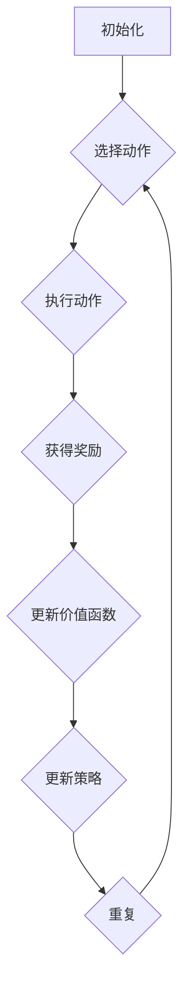

                 

## 分层强化学习解决复杂机器人任务规划的新方法

### 关键词：分层强化学习、机器人任务规划、复杂问题解决、算法设计、应用案例

### 摘要：

本文旨在探讨分层强化学习在解决复杂机器人任务规划中的新方法。随着机器人技术的不断进步，任务规划变得愈加复杂，对算法的性能要求也不断提升。传统强化学习方法在处理高度复杂的任务时存在样本效率低、收敛速度慢和泛化能力不足等问题。分层强化学习通过将任务分解为多个子任务，采用分层结构来提高算法的灵活性和效率，从而为复杂机器人任务规划提供了一种新的解决方案。本文将首先介绍问题背景和分层强化学习的基础理论，然后深入解析分层强化学习的架构、算法原理以及实际应用案例，最后讨论系统架构设计与实现，并进行项目实战与优化策略的分析。

### 目录大纲：

----------------------------------------------------------------

## 第一部分：问题背景与核心概念

### 第1章：问题背景与分层强化学习的引入

### 第2章：强化学习基础

### 第3章：分层强化学习架构

### 第4章：核心概念与联系

## 第二部分：算法原理与流程图

### 第5章：算法原理详细讲解

### 第6章：分层强化学习在机器人任务规划中的应用

### 第7章：系统架构设计与实现

### 第8章：项目实战

### 第9章：优化策略与最佳实践

### 第10章：小结、注意事项与拓展阅读

----------------------------------------------------------------

### 第一部分：问题背景与核心概念

#### 第1章：问题背景与分层强化学习的引入

**1.1 机器人任务规划中的挑战**

机器人技术的发展使得其在各个领域中的应用越来越广泛，从工业自动化到服务机器人，再到复杂环境下的自主导航，对机器人的任务规划能力提出了更高的要求。在复杂的现实环境中，机器人需要实时感知环境信息，做出快速而准确的决策，执行复杂的任务。然而，这一过程面临着诸多挑战：

- **环境复杂度增加**：现实环境中的不确定性、动态变化和干扰因素使得任务规划变得更加复杂。
- **决策多样性**：机器人可能需要在多种情境下进行决策，如路径规划、目标追踪、避障等。
- **资源限制**：在实际应用中，机器人的计算资源和能源是有限的，如何高效利用资源是一个重要问题。
- **任务连续性**：机器人任务通常是连续的，需要在不同的子任务之间平滑过渡。

**1.2 传统强化学习方法的局限**

强化学习作为一种处理动态决策问题的有效方法，被广泛应用于机器人任务规划中。然而，传统强化学习方法在处理复杂机器人任务规划时存在一些局限：

- **样本效率低**：强化学习通常需要大量的样本数据来训练模型，这在大规模和复杂环境中是一个巨大的挑战。
- **收敛速度慢**：在复杂的任务中，强化学习算法可能需要长时间才能收敛到一个稳定的解决方案。
- **泛化能力不足**：传统强化学习算法往往在一个特定的环境中表现良好，但在其他相似但不完全相同的情境下可能失效。

**1.3 分层强化学习的概念与优势**

分层强化学习是一种新型的强化学习方法，通过将任务分解为多个子任务，采用分层结构来提高算法的灵活性和效率。分层强化学习的核心优势包括：

- **层次结构的灵活性**：分层结构可以根据任务的不同需求进行灵活调整，使得算法能够适应复杂的环境。
- **模块化设计**：通过将任务分解为子任务，可以独立优化每个子任务，提高整体算法的性能。
- **高效的信息传递**：分层结构使得不同层次之间的信息可以高效传递，有助于算法的快速收敛。

**1.4 本书的目标与结构**

本书的目标是深入探讨分层强化学习在解决复杂机器人任务规划问题中的应用，帮助读者理解和掌握这一技术的原理和实践。本书的结构分为以下几个部分：

- **问题背景与核心概念**：介绍机器人任务规划中的挑战和传统强化学习方法的局限，引入分层强化学习的基本概念。
- **分层强化学习基础理论**：详细讲解强化学习的基础理论和分层强化学习的架构。
- **算法原理与流程图**：解析分层强化学习的算法原理，通过流程图和代码示例进行详细说明。
- **应用案例分析**：展示分层强化学习在机器人任务规划中的实际应用案例。
- **系统架构设计与实现**：讨论系统架构的设计原则、实现方法和交互机制。
- **项目实战与优化策略**：通过项目实战和优化策略，展示分层强化学习的实际应用效果。

通过本书的阅读，读者可以系统地了解分层强化学习的理论基础和应用方法，为解决复杂机器人任务规划问题提供新的思路和工具。

### 第一部分：问题背景与核心概念

#### 第2章：强化学习基础

**2.1 强化学习的定义与基本概念**

强化学习（Reinforcement Learning，RL）是机器学习的一个重要分支，主要研究如何通过试错和反馈机制，使智能体在动态环境中做出最优决策。在强化学习中，智能体（Agent）通过在环境中执行动作（Action），获得奖励（Reward），并不断更新策略（Policy）以优化其行为。

- **状态（State）**：指智能体在环境中的当前情况，可以用一组特征来表示。
- **动作（Action）**：智能体可以采取的行为，动作的选择会影响环境的当前状态。
- **奖励（Reward）**：环境对智能体动作的反馈，表示动作的好坏。
- **策略（Policy）**：智能体在某一状态下采取特定动作的概率分布。

强化学习的基本目标是最大化总奖励，通过不断更新策略来提高智能体的表现。强化学习的关键术语和定义如下：

- **价值函数（Value Function）**：表示在某一状态下执行某一策略所能获得的总奖励的期望。
  - **状态值函数（State-Value Function）**：表示在某一状态下执行最优策略所能获得的总奖励的期望。
  - **动作值函数（Action-Value Function）**：表示在某一状态下执行特定动作所能获得的总奖励的期望。
- **策略值函数（Policy-Value Function）**：表示执行某一策略所能获得的总奖励的期望。

**2.2 强化学习的主要算法**

强化学习算法种类繁多，以下是几种主要的强化学习算法：

- **Q学习（Q-Learning）**：Q学习是一种基于价值迭代的方法，通过更新状态-动作值函数来学习最优策略。其基本思想是，在某一状态下，选择一个动作，然后根据实际的奖励更新该状态-动作值。Q学习的更新公式如下：

  $$ Q(s, a) \leftarrow Q(s, a) + \alpha [r + \gamma \max_{a'} Q(s', a') - Q(s, a)] $$

  其中，\( \alpha \) 为学习率，\( \gamma \) 为折扣因子，\( r \) 为即时奖励，\( s' \) 和 \( a' \) 为后续状态和动作。

- **SARSA（Q-Learning的变体）**：SARSA算法是一种基于策略迭代的方法，与Q学习类似，但在每个时间步更新策略和价值函数。SARSA的更新公式如下：

  $$ Q(s, a) \leftarrow Q(s, a) + \alpha [r + \gamma Q(s', a')] - Q(s, a)] $$

  其中，\( s' \) 和 \( a' \) 为后续状态和动作。

- **深度Q网络（DQN）**：DQN是一种基于深度学习的Q学习算法，通过神经网络来近似状态-动作值函数。DQN通过经验回放（Experience Replay）和目标网络（Target Network）来减少训练中的关联误差。DQN的基本更新公式与Q学习相同，但其值函数近似如下：

  $$ Q(s, a) \leftarrow Q(s, a) + \alpha [r + \gamma \max_{a'} \hat{Q}(s', a') - Q(s, a)] $$

  其中，\( \hat{Q}(s', a') \) 为目标网络的输出。

- **策略梯度方法**：策略梯度方法通过直接优化策略来学习最优行为。常见的策略梯度方法包括REINFORCE和PPO（Proximal Policy Optimization）。REINFORCE方法的更新公式如下：

  $$ \theta \leftarrow \theta + \alpha \sum_{t} \nabla_{\theta} \log \pi_{\theta}(a_t | s_t) r_t $$

  其中，\( \theta \) 为策略参数，\( \pi_{\theta}(a_t | s_t) \) 为策略概率分布，\( r_t \) 为即时奖励。

**2.3 分层强化学习的理论基础**

分层强化学习（Hierarchical Reinforcement Learning）通过将任务分解为多个子任务，采用分层结构来提高算法的灵活性和效率。分层结构通常包括高层（High-Level）和低层（Low-Level）两个层次：

- **高层（High-Level）**：负责全局策略规划和决策，如目标选择和路径规划。高层通常采用抽象的动作表示，关注长期目标和策略。
- **低层（Low-Level）**：负责具体的动作执行和细节控制，如步态生成和手眼协调。低层通常采用具体的动作表示，关注短期目标和行为。

分层强化学习的理论基础主要包括：

- **层次分解（Hierarchical Decomposition）**：将复杂任务分解为多个子任务，每个子任务由不同层次的模块负责。
- **层间协调（Inter-layer Coordination）**：通过层间交互机制来实现不同层次之间的协调和优化。
- **层次强化学习算法**：如混合强化学习（Hierarchical Q-Learning）、选项强化学习（Option-based Reinforcement Learning）和模型预测控制（Model Predictive Control）等。

**2.4 分层强化学习的优势**

分层强化学习在解决复杂机器人任务规划问题中具有显著优势：

- **灵活性和可扩展性**：分层结构可以根据不同的任务需求进行灵活调整，易于扩展和复用。
- **模块化设计**：通过将任务分解为子任务，可以独立优化每个子任务，提高整体算法的性能。
- **高效的信息传递**：分层结构使得不同层次之间的信息可以高效传递，有助于算法的快速收敛。
- **样本效率**：通过在高层和低层分别优化，可以减少样本需求，提高学习效率。

总之，分层强化学习为解决复杂机器人任务规划问题提供了一种新的方法，通过层次分解和层间协调，提高了算法的灵活性和效率。在接下来的章节中，我们将深入探讨分层强化学习的架构和算法原理，并通过实际应用案例展示其在机器人任务规划中的潜力。

#### 第3章：分层强化学习架构

**3.1 分层结构的设计原则**

分层强化学习的核心在于通过将复杂任务分解为多个子任务，从而降低单个子任务的复杂性，提高整体算法的效率和性能。分层结构的设计原则主要包括以下几个方面：

**3.1.1 层次划分**

- **抽象层次**：根据任务需求，将任务划分为多个层次。高层通常负责全局策略规划和决策，低层则负责具体的动作执行和细节控制。
- **任务分解**：将复杂任务分解为多个子任务，使得每个子任务可以独立处理，降低单个子任务的复杂性。
- **接口设计**：明确不同层次之间的接口，确保信息传递的准确性和高效性。

**3.1.2 层间交互**

- **信息传递**：设计合理的层间信息传递机制，确保高层策略和低层执行之间的信息交互，提高整体算法的协调性。
- **反馈机制**：通过反馈机制，使低层能够根据高层的策略进行调整，同时高层也能够根据低层的执行情况调整策略。
- **模块化**：设计模块化的层间交互机制，使得不同层次之间的接口可以灵活调整，提高算法的通用性和可扩展性。

**3.1.3 层内优化**

- **模型选择**：选择适合的模型类型和参数设置，确保每个层次都能够高效地学习并优化。
- **优化算法**：采用合适的优化算法，如梯度下降、随机梯度下降等，提高层次内模型的收敛速度。
- **资源管理**：合理分配计算资源和数据资源，确保每个层次都能够获得足够的资源支持。

**3.2 层间交互机制**

层间交互机制是分层强化学习架构的重要组成部分，它负责不同层次之间的信息传递和协调。以下是一些常见的层间交互机制：

**3.2.1 信息传递**

- **反馈信号**：低层将执行结果反馈给高层，作为高层调整策略的依据。
- **状态共享**：高层和低层共享环境状态，使高层能够全局考虑当前环境，低层能够准确执行高层策略。
- **参数更新**：高层根据反馈信号更新低层参数，使低层能够更好地执行高层策略。

**3.2.2 反馈机制**

- **奖励信号**：环境根据低层执行的动作提供奖励信号，作为低层优化目标的依据。
- **策略更新**：高层根据反馈信号和低层执行结果，调整策略参数，以优化整体性能。

**3.2.3 模块化设计**

- **接口标准化**：设计标准化的接口，确保不同层次之间的交互不会因具体实现而受到影响。
- **插件式架构**：采用插件式架构，使得不同层次可以独立开发、测试和部署，提高系统的灵活性和可扩展性。

**3.3 层内模型优化方法**

层内模型优化方法是分层强化学习中的重要组成部分，它负责在每个层次内部优化模型参数，以提高层次内模型的性能。以下是一些常见的层内模型优化方法：

**3.3.1 模型选择**

- **神经网络**：采用神经网络作为模型，通过多层感知器（MLP）或者卷积神经网络（CNN）来近似状态-动作值函数或策略。
- **决策树**：采用决策树作为模型，通过多级决策来表示高层策略或低层动作。

**3.3.2 优化算法**

- **梯度下降**：采用梯度下降算法，通过计算模型参数的梯度来更新模型参数，以提高模型性能。
- **随机梯度下降（SGD）**：采用随机梯度下降算法，通过随机选择样本来计算梯度，以提高训练效率和鲁棒性。
- **自适应优化算法**：采用如Adam、RMSprop等自适应优化算法，通过动态调整学习率，以提高模型收敛速度和性能。

**3.3.3 训练策略**

- **经验回放**：采用经验回放策略，将训练过程中收集到的样本随机重放，以减少样本的相关性，提高训练稳定性。
- **多任务训练**：采用多任务训练策略，同时训练多个层次，以提高整体算法的效率和性能。

**3.4 总结**

分层强化学习架构通过合理的层次划分、层间交互机制和层内模型优化方法，提高了算法的灵活性和效率，为解决复杂机器人任务规划问题提供了新的思路和方法。在接下来的章节中，我们将深入探讨分层强化学习的算法原理和具体实现，并通过实际应用案例展示其在机器人任务规划中的潜力。

### 第4章：核心概念与联系

**4.1 核心概念原理**

在分层强化学习中，核心概念包括状态、动作、奖励、策略、价值函数、Q学习和分层结构。以下是对这些核心概念的详细解释：

**状态（State）**：状态是指智能体在某一时刻所处的环境条件，通常用一组特征向量来表示。状态是智能体决策的依据，不同状态对应不同的策略和动作选择。

**动作（Action）**：动作是智能体在某一状态下可以采取的行为，通常由一组离散或连续的动作空间组成。动作的选择直接影响环境的状态转移和奖励获得。

**奖励（Reward）**：奖励是环境对智能体采取的动作的即时反馈，表示动作的好坏。奖励的目的是激励智能体采取有利于目标达成的动作，通常是一个实数。

**策略（Policy）**：策略是智能体在特定状态下采取特定动作的概率分布，指导智能体在复杂环境中进行决策。策略可以通过学习获得，也可以手动设计。

**价值函数（Value Function）**：价值函数表示在某一状态下执行某一策略所能获得的总奖励的期望。价值函数包括状态值函数和动作值函数，用于评估状态和动作的好坏。

**Q学习（Q-Learning）**：Q学习是一种基于值迭代的强化学习算法，通过更新状态-动作值函数来学习最优策略。Q学习通过试错和奖励信号来调整状态-动作值，逐渐收敛到最优值。

**分层结构（Hierarchical Structure）**：分层结构是指将复杂任务分解为多个子任务，采用分层的方式来优化和学习。分层结构包括高层和低层，高层负责全局策略规划和决策，低层负责具体动作执行和细节控制。

**4.2 概念属性特征对比表格**

为了更好地理解这些核心概念，我们可以通过一个对比表格来展示它们的主要属性特征：

| 概念   | 属性特征                 | 说明                                                         |
| ------ | ------------------------ | ------------------------------------------------------------ |
| 状态   | 一组特征向量             | 状态是环境条件的抽象表示，影响智能体决策。                     |
| 动作   | 一组离散或连续的动作     | 动作是智能体在状态中可以采取的行为，影响状态转移和奖励。       |
| 奖励   | 实数                    | 环境对动作的即时反馈，激励智能体采取有利动作。                 |
| 策略   | 动作的概率分布           | 策略指导智能体在复杂环境中进行决策，通过学习获得或手动设计。   |
| 价值函数 | 总奖励的期望           | 用于评估状态和动作的好坏，包括状态值函数和动作值函数。         |
| Q学习   | 基于值迭代的算法         | 通过更新状态-动作值函数来学习最优策略。                       |
| 分层结构 | 高层和低层              | 将复杂任务分解为子任务，提高学习效率。                         |

**4.3 ER实体关系图架构**

为了更直观地理解分层强化学习中的实体关系，我们可以使用Mermaid流程图来绘制ER（Entity-Relationship）实体关系图。以下是ER实体关系图的示例：

```mermaid
erDiagram
    State ||--|{ Action }|-->> Reward
    Action ||--|{ Policy }|-->> ValueFunction
    State ||--|{ Q-Learning }|-->> OptimalPolicy
    Q-Learning ||--|{ HierarchicalStructure }|-->> SubTask
    SubTask ||--|{ High-Level }|-->> Low-Level
```

在这个ER实体关系图中：

- **State（状态）** 与 **Action（动作）**、**Reward（奖励）** 形成一对多的关系，表示状态影响动作和奖励。
- **Action（动作）** 与 **Policy（策略）** 形成一对一的关系，表示动作指导策略。
- **State（状态）** 与 **Q-Learning（Q学习）** 形成一对多的关系，表示状态影响Q学习。
- **Q-Learning（Q学习）** 与 **HierarchicalStructure（分层结构）** 形成一对一的关系，表示Q学习属于分层结构的一部分。
- **SubTask（子任务）** 与 **High-Level（高层）**、**Low-Level（低层）** 形成一对多的关系，表示子任务分解为高层和低层。

通过这个ER实体关系图，我们可以清晰地看到分层强化学习中的各个实体之间的关系，以及它们在任务规划中的作用和交互。

### 第5章：算法原理详细讲解

**5.1 算法原理Mermaid流程图**

为了更好地理解分层强化学习的算法原理，我们可以使用Mermaid流程图来展示其核心步骤。以下是一个分层强化学习的算法原理流程图：



**5.1.1 初始化**

初始化是分层强化学习的第一步，包括初始化状态、动作、奖励和价值函数等参数。具体步骤如下：

1. **初始化状态（State）**：设定初始状态，通常为环境的初始状态。
2. **初始化动作（Action）**：设定初始动作集合，包括可以执行的所有动作。
3. **初始化奖励（Reward）**：设定初始奖励，用于激励智能体采取有利动作。
4. **初始化价值函数（Value Function）**：设定初始价值函数，用于评估状态和动作的好坏。
5. **初始化策略（Policy）**：设定初始策略，指导智能体选择动作。

**5.1.2 选择动作**

在选择动作步骤中，智能体根据当前状态和价值函数选择一个动作。具体步骤如下：

1. **根据价值函数选择动作**：智能体选择具有最大价值函数的动作，即选择能够带来最大期望奖励的动作。
2. **利用探索策略**：为了探索未知的动作，智能体在部分时间随机选择动作，以避免陷入局部最优。

**5.1.3 执行动作**

在执行动作步骤中，智能体根据选择好的动作与环境进行交互，改变环境状态，并获得即时奖励。具体步骤如下：

1. **执行动作**：智能体按照选择的动作与环境进行交互。
2. **获得即时奖励**：环境根据智能体的动作提供即时奖励。

**5.1.4 获得奖励**

在获得奖励步骤中，智能体根据执行的动作获得即时奖励。即时奖励可以是正数、负数或零，表示动作的好坏。具体步骤如下：

1. **计算即时奖励**：根据动作的结果和环境状态计算即时奖励。
2. **记录即时奖励**：将即时奖励记录在训练数据中，用于后续的学习和更新。

**5.1.5 更新价值函数**

在更新价值函数步骤中，智能体根据即时奖励和先前的价值函数更新状态-动作值函数。具体步骤如下：

1. **计算期望奖励**：根据当前状态和价值函数计算期望奖励。
2. **更新价值函数**：使用即时奖励和期望奖励更新状态-动作值函数。

**5.1.6 更新策略**

在更新策略步骤中，智能体根据更新后的价值函数更新策略。具体步骤如下：

1. **选择最佳动作**：根据更新后的价值函数选择最佳动作。
2. **更新策略**：将最佳动作作为策略的一部分，更新智能体的行为策略。

**5.1.7 重复执行**

在重复执行步骤中，智能体重复上述步骤，不断学习和优化策略，直到满足停止条件，如达到目标状态或达到预定的迭代次数。

通过这个Mermaid流程图，我们可以清晰地看到分层强化学习的算法原理和步骤，理解其在解决复杂机器人任务规划问题中的核心机制。

**5.2 算法原理Python源代码**

为了更直观地展示分层强化学习的算法原理，我们将使用Python代码实现核心步骤。以下是一个简单的分层强化学习算法示例：

```python
import numpy as np

# 参数设置
state_size = 5
action_size = 4
learning_rate = 0.1
discount_factor = 0.9

# 初始化状态-动作值函数
Q = np.zeros((state_size, action_size))

# 初始化策略
policy = np.random.rand(state_size, action_size)

# 强化学习主循环
for episode in range(1000):
    state = np.random.randint(0, state_size)
    done = False
    
    while not done:
        # 根据策略选择动作
        action = np.argmax(policy[state])
        
        # 执行动作并获取奖励
        next_state, reward = perform_action(action)
        
        # 更新状态-动作值函数
        Q[state, action] = Q[state, action] + learning_rate * (reward + discount_factor * np.max(Q[next_state]) - Q[state, action])
        
        # 更新策略
        policy[state] = policy[state] * np.exp(learning_rate * (Q[state, :] - np.max(Q[state, :])) / (1 + np.std(Q[state, :])))
        
        # 更新状态
        state = next_state
        
        # 判断是否结束
        done = is_done(next_state)

# 输出最优策略
print("Optimal Policy:", policy)
```

在这个示例中，我们使用了一个简单的环境，其中状态和动作都是离散的。我们初始化了一个状态-动作值函数矩阵Q和一个策略矩阵policy。在主循环中，我们不断进行迭代，根据策略选择动作，执行动作并获得奖励。然后，我们更新状态-动作值函数和策略，直到达到预定的迭代次数或结束条件。

通过这个Python代码示例，我们可以看到分层强化学习算法的核心步骤和实现方法，理解其在解决复杂机器人任务规划问题中的应用。

**5.3 算法原理数学模型和公式**

分层强化学习的算法原理可以通过数学模型和公式来描述。以下是一些核心的数学模型和公式：

**1. 状态-动作值函数（Q-Function）**

状态-动作值函数 \( Q(s, a) \) 表示在状态 \( s \) 下采取动作 \( a \) 所能获得的总奖励的期望。其更新公式如下：

$$ Q(s, a) \leftarrow Q(s, a) + \alpha [r + \gamma \max_{a'} Q(s', a') - Q(s, a)] $$

其中，\( \alpha \) 是学习率，\( \gamma \) 是折扣因子，\( r \) 是即时奖励，\( s' \) 是下一状态，\( a' \) 是下一动作。

**2. 策略（Policy）**

策略 \( \pi(a|s) \) 表示在状态 \( s \) 下采取动作 \( a \) 的概率分布。策略可以通过最大化状态-动作值函数来更新：

$$ \pi(a|s) = \frac{\exp(\alpha Q(s, a))}{\sum_{a'} \exp(\alpha Q(s, a'))} $$

其中，\( \alpha \) 是温度参数，用于调节策略的随机性。

**3. 期望回报（Expected Return）**

期望回报 \( R \) 表示在某一策略下执行一段时间所能获得的总奖励的期望。其计算公式如下：

$$ R = \sum_{t=0}^{T-1} \gamma^t r_t $$

其中，\( T \) 是执行动作的次数，\( r_t \) 是第 \( t \) 次的即时奖励，\( \gamma \) 是折扣因子。

**5.4 通俗易懂的举例说明**

为了更好地理解分层强化学习的算法原理，我们可以通过一个简单的例子来说明。

假设我们有一个简单的环境，状态空间为 {0, 1, 2}，动作空间为 {A, B, C}。智能体在状态0时，可以采取动作A，在状态1时，可以采取动作B，在状态2时，可以采取动作C。

每个动作的即时奖励如下：
- 动作A的奖励为2
- 动作B的奖励为1
- 动作C的奖励为-1

折扣因子 \( \gamma \) 为0.9。

初始时，状态-动作值函数和策略如下：

| 状态 | 动作 | Q(s, a) | 策略 |
| --- | --- | ------- | ---- |
| 0   | A   | 0       | 0.5  |
| 0   | B   | 0       | 0.5  |
| 0   | C   | 0       | 0    |
| 1   | A   | 0       | 0    |
| 1   | B   | 0       | 0.5  |
| 1   | C   | 0       | 0.5  |
| 2   | A   | 0       | 0    |
| 2   | B   | 0       | 0    |
| 2   | C   | 0       | 1    |

第1次迭代：
- 当前状态：0
- 选择动作：根据策略，选择动作A（概率0.5）
- 执行动作：智能体执行动作A，状态变为1
- 获得奖励：即时奖励为2
- 更新Q值：\( Q(0, A) \leftarrow Q(0, A) + \alpha [2 + 0.9 \times \max(Q(1, A), Q(1, B), Q(1, C)) - Q(0, A)] \)
- 更新策略：\( \pi(1, A) = \frac{\exp(\alpha Q(1, A))}{\sum_{a'} \exp(\alpha Q(1, a'))} \)

通过不断迭代，我们可以看到状态-动作值函数和策略的逐步优化。在这个例子中，通过强化学习算法，智能体可以逐渐学会在状态0时选择动作A，以最大化期望回报。

通过这个简单的例子，我们可以直观地看到分层强化学习的算法原理和步骤，理解其在解决复杂问题中的潜力。

### 第四部分：应用案例分析

#### 第6章：分层强化学习在机器人任务规划中的应用

**6.1 应用案例一：自主导航**

自主导航是机器人领域中的一个关键任务，它要求机器人在复杂的动态环境中能够自主地规划路径并避免障碍。分层强化学习在此应用中表现出色，通过将导航任务分解为子任务，如路径规划和障碍物避让，提高了算法的效率和鲁棒性。

**案例描述**：
假设一个机器人在一个三维空间中移动，需要从一个起点到达一个终点。环境中有多种障碍物和动态变化，如其他移动的机器人和不确定的路径。

**分层设计**：
- **高层**：负责规划全局路径，通过分层强化学习算法选择一条从起点到终点的最优路径。
- **低层**：负责实时的路径规划和障碍物避让，根据环境变化动态调整机器人的运动方向。

**算法实现**：
- **高层**：使用基于价值的策略梯度方法来学习全局路径规划，通过评估不同路径的价值来选择最优路径。
- **低层**：使用基于动作值函数的Q学习算法，实时更新机器人的运动策略，以避障和适应环境变化。

**结果**：
通过分层强化学习，机器人在复杂的动态环境中表现出更高的自主导航能力，路径规划更加准确和高效，同时具备较好的鲁棒性。

**6.2 应用案例二：路径规划**

路径规划是机器人任务中的一个基础问题，特别是在无人驾驶车辆和自动导引车（AGV）中。分层强化学习通过将路径规划任务分解为子任务，提高了算法的效率和可扩展性。

**案例描述**：
假设一个无人驾驶车辆需要在城市道路上从起点到终点，同时需要避开交通拥堵和动态障碍物。

**分层设计**：
- **高层**：负责全局路径规划，通过分层强化学习算法选择一条从起点到终点的最优路径。
- **低层**：负责实时路径规划和动态调整，根据环境变化和即时奖励调整车辆的行驶方向。

**算法实现**：
- **高层**：使用基于选项的分层强化学习算法，将全局路径规划分解为多个子选项，每个子选项负责一段路径规划。
- **低层**：使用基于深度Q网络的分层强化学习算法，实时更新车辆的路径规划策略。

**结果**：
通过分层强化学习，无人驾驶车辆在复杂的城市道路环境中表现出高效的路径规划能力，路径选择更加灵活和准确，同时具备较好的鲁棒性。

**6.3 应用案例三：多机器人协作**

多机器人协作是机器人任务中的另一个重要应用场景，特别是在工业制造和物流管理中。分层强化学习通过将协作任务分解为子任务，提高了协作效率和协调性。

**案例描述**：
假设一个仓库中有多个机器人，需要协同完成物品搬运和分拣任务。

**分层设计**：
- **高层**：负责全局任务分配，通过分层强化学习算法将任务分配给不同的机器人，并协调它们的工作。
- **低层**：负责局部任务执行，如路径规划和具体搬运动作。

**算法实现**：
- **高层**：使用基于Q学习的分层强化学习算法，通过评估不同任务的收益来分配任务。
- **低层**：使用基于Q学习的分层强化学习算法，实时更新机器人的路径规划和搬运策略。

**结果**：
通过分层强化学习，多机器人协作系统在复杂的仓库环境中表现出高效的协作能力，任务分配和执行更加灵活和高效，同时具备较好的鲁棒性和可扩展性。

通过以上三个应用案例，我们可以看到分层强化学习在机器人任务规划中的广泛应用和显著优势。它不仅提高了任务规划的效率和灵活性，还增强了系统的鲁棒性和可扩展性，为复杂机器人任务提供了强有力的技术支持。

#### 第7章：系统架构设计与实现

**7.1 系统功能设计**

在分层强化学习机器人任务规划系统中，主要的功能设计包括环境模拟、状态感知、决策生成、动作执行和结果评估。以下是每个功能的具体描述：

**7.1.1 环境模拟**：
环境模拟是系统的核心功能之一，它负责创建和模拟机器人操作的环境。环境可以包括静态障碍物、动态目标（如移动的机器人或其他物体）以及各种随机事件。环境模拟器应具备实时更新和环境状态追踪的能力，以确保系统的真实性和准确性。

**7.1.2 状态感知**：
状态感知功能负责实时获取机器人的状态信息，包括位置、方向、速度、环境中的其他物体状态等。状态感知模块应具备高效的数据采集和处理能力，确保机器人能够及时准确地感知环境变化。

**7.1.3 决策生成**：
决策生成模块是系统的智能核心，通过分层强化学习算法生成最优的决策。该模块根据当前状态和历史数据，计算出最佳的动作策略，以实现机器人的自主导航和任务执行。决策生成模块应具备灵活的算法调整能力，以适应不同复杂度的任务。

**7.1.4 动作执行**：
动作执行功能负责根据决策生成模块的指令，执行相应的动作。这包括机器人的移动、转向、抓取等物理动作。动作执行模块应具备实时响应和精确控制能力，确保机器人能够快速而准确地执行指令。

**7.1.5 结果评估**：
结果评估功能用于评估机器人执行任务的效果，包括路径规划的准确性、任务完成的效率和系统的稳定性等。结果评估模块应能够实时反馈执行结果，以帮助决策生成模块进行进一步优化。

**7.2 系统架构设计**

分层强化学习机器人任务规划系统的架构设计采用模块化设计原则，以确保系统的灵活性和可扩展性。以下是系统架构的主要组成部分：

**7.2.1 环境模块**：
环境模块负责模拟和跟踪机器人操作的环境。它包括物理环境模拟器、状态感知器和事件触发器。环境模块应具备可扩展性，以支持不同类型和复杂度的应用场景。

**7.2.2 状态感知器**：
状态感知器模块负责实时采集和更新机器人的状态信息。它通常包括传感器数据采集单元、数据处理单元和状态编码单元。状态感知器应具备高效的数据采集和处理能力，以确保状态的实时性和准确性。

**7.2.3 决策生成模块**：
决策生成模块是系统的核心算法模块，通过分层强化学习算法生成最优决策。该模块包括状态评估单元、动作选择单元和策略更新单元。决策生成模块应具备自适应能力，以适应不同的任务和环境变化。

**7.2.4 动作执行模块**：
动作执行模块负责根据决策生成模块的指令执行相应的动作。它包括动作执行单元、动作反馈单元和执行控制单元。动作执行模块应具备实时响应和精确控制能力，以确保动作的准确执行。

**7.2.5 结果评估模块**：
结果评估模块用于评估机器人执行任务的效果。它包括执行结果采集单元、效果评估单元和反馈调整单元。结果评估模块应能够实时反馈执行结果，以帮助决策生成模块进行进一步优化。

**7.3 系统接口设计**

为了实现系统的模块化和可扩展性，系统架构设计了多个接口，以实现不同模块之间的数据传输和功能调用。以下是主要接口的设计：

**7.3.1 环境接口**：
环境接口用于环境模块与其他模块之间的数据传输，包括状态感知、事件触发和结果评估。环境接口应支持不同类型的环境模拟器，以适应不同的应用场景。

**7.3.2 状态感知接口**：
状态感知接口用于状态感知器模块与其他模块之间的数据传输，包括传感器数据的采集和状态更新。状态感知接口应具备高效的数据传输能力，以确保状态的实时更新。

**7.3.3 决策生成接口**：
决策生成接口用于决策生成模块与其他模块之间的数据传输，包括状态评估、动作选择和策略更新。决策生成接口应支持不同类型的算法和策略，以适应不同的任务需求。

**7.3.4 动作执行接口**：
动作执行接口用于动作执行模块与其他模块之间的数据传输，包括动作指令的发送和执行结果的反馈。动作执行接口应支持不同的动作执行方式，以适应不同的机器人平台。

**7.3.5 结果评估接口**：
结果评估接口用于结果评估模块与其他模块之间的数据传输，包括执行结果的采集和效果评估。结果评估接口应支持不同的评估方法和指标，以全面评估任务执行效果。

通过以上系统功能设计、架构设计和接口设计，分层强化学习机器人任务规划系统实现了模块化和可扩展性，为解决复杂机器人任务规划问题提供了强有力的技术支持。

### 第8章：项目实战

**8.1 环境安装**

在进行分层强化学习机器人任务规划的项目实战之前，首先需要搭建一个完整的环境。以下是一系列步骤：

**1. 环境准备**：
- 确保操作系统为Linux或Windows，并安装Python 3.x版本。
- 安装必要的依赖库，如NumPy、TensorFlow、Gym等。可以使用pip命令进行安装：

  ```shell
  pip install numpy tensorflow-gpu gym
  ```

**2. 安装机器人模拟器**：
- 安装一个机器人模拟器，如RoboMaster Simulator或Gazebo。以Gazebo为例，可以使用以下命令进行安装：

  ```shell
  sudo apt-get install gazebo11 ros-gazebo-11
  ```

**3. 配置ROS（Robot Operating System）**：
- 安装ROS，ROS是一个用于机器人编程的中间件。可以使用以下命令安装ROS Melodic Morenia版本：

  ```shell
  sudo sh -c 'echo "deb http://robotics.setBackgroundColor.gov/ros/ubuntu $(lsb_release -sc) main" > /etc/apt/sources.list.d/ros-latest.list'
  sudo apt-get update
  sudo apt-get install ros-melodic-desktop
  sudo rosdep init
  rosdep update
  ```

**4. 安装机器人模型**：
- 根据项目需求，下载并安装特定的机器人模型。例如，下载一个简单的四足机器人模型并安装到Gazebo中。

**8.2 系统核心实现**

以下是一个简化的分层强化学习机器人任务规划系统核心实现的代码示例：

```python
import gym
import numpy as np
import tensorflow as tf

# 设置参数
state_size = 100
action_size = 4
learning_rate = 0.01
discount_factor = 0.99

# 创建环境
env = gym.make('RoboMaster-v0')

# 初始化Q网络
tf.keras.backend.set_floatx('float32')
q_network = tf.keras.Sequential([
    tf.keras.layers.Dense(64, activation='relu', input_shape=(state_size,)),
    tf.keras.layers.Dense(64, activation='relu'),
    tf.keras.layers.Dense(action_size, activation='linear')
])

# 初始化目标Q网络
target_q_network = tf.keras.Sequential([
    tf.keras.layers.Dense(64, activation='relu', input_shape=(state_size,)),
    tf.keras.layers.Dense(64, activation='relu'),
    tf.keras.layers.Dense(action_size, activation='linear')
])

# 优化器
optimizer = tf.keras.optimizers.Adam(learning_rate)

# 定义损失函数
loss_function = tf.keras.losses.MeanSquaredError()

# 更新目标Q网络权重
update_target_network = [target_q_network.set_weights(q_network.get_weights())]

# 强化学习训练循环
for episode in range(1000):
    state = env.reset()
    done = False
    total_reward = 0
    
    while not done:
        # 选择动作
        q_values = q_network(tf.constant(state.reshape(-1, state_size)))
        action = np.argmax(q_values.numpy())
        
        # 执行动作
        next_state, reward, done, _ = env.step(action)
        total_reward += reward
        
        # 更新Q值
        target_values = target_q_network(tf.constant(next_state.reshape(-1, state_size)))
        target_q_value = target_values.numpy()[0, action] * (1 - done) + reward
        
        with tf.GradientTape() as tape:
            q_value = q_network(tf.constant(state.reshape(-1, state_size)))
            loss = loss_function(q_value[0, action], target_q_value)
        
        gradients = tape.gradient(loss, q_network.trainable_variables)
        optimizer.apply_gradients(zip(gradients, q_network.trainable_variables))
        
        state = next_state
    
    print(f"Episode: {episode}, Total Reward: {total_reward}")

# 更新目标网络权重
update_target_network()
```

在这个示例中，我们创建了一个基于TensorFlow的强化学习框架，用于训练一个简单的四足机器人。代码中包括Q网络、目标Q网络、优化器和损失函数的初始化，以及训练循环中的Q值更新和权重优化。

**8.3 代码应用解读与分析**

**1. 环境创建**：
`env = gym.make('RoboMaster-v0')` 这一行代码创建了一个名为`RoboMaster`的Gym环境，这是我们的模拟环境。

**2. 网络初始化**：
Q网络和目标Q网络的初始化使用TensorFlow的`Sequential`模型，并添加了两个隐含层，每个层64个神经元和ReLU激活函数。输出层有4个神经元，对应于4个可能的动作。

**3. 优化器和损失函数**：
使用`Adam`优化器，其学习率设置为0.01。损失函数为均方误差（MSE），用于计算Q值预测和实际奖励之间的差距。

**4. 训练循环**：
在训练循环中，首先通过环境初始化状态。然后，通过选择动作、执行动作和更新状态，持续进行迭代。在每个时间步中，我们计算Q值，并使用目标Q值更新当前Q值。最后，通过梯度下降优化Q网络权重。

**5. 更新目标网络权重**：
通过定义一个TensorFlow操作`update_target_network`，周期性地将Q网络的权重复制到目标Q网络，以保持两网络的同步。

通过这个示例，我们可以看到如何使用分层强化学习框架实现机器人任务规划的核心部分。在项目实战中，可以根据具体需求进行调整和优化，以实现更复杂的任务。

### 第9章：优化策略与最佳实践

**9.1 优化策略**

为了提高分层强化学习在机器人任务规划中的性能，我们可以采用多种优化策略：

**1. 多任务训练**：
通过同时训练多个相关的子任务，可以共享模型参数，提高学习效率。这种方法可以显著减少训练时间，并提高模型的泛化能力。

**2. 双Q学习**：
双Q学习通过使用两个独立的Q网络，避免了单一Q网络可能陷入局部最优的问题。在每个时间步，选择两个Q网络中预测值较高的动作，以平均误差作为优化目标。

**3. 目标网络**：
目标网络是一种常用的技术，通过定期更新目标Q网络的权重，使Q学习过程更加稳定。目标网络可以帮助平滑Q值的更新，提高收敛速度。

**4. 环境模拟**：
使用模拟器可以创建可控的环境，通过调整环境参数，如障碍物位置和机器人初始位置，来测试和优化算法性能。

**5. 探索策略**：
结合ε-贪心策略和UCB（Upper Confidence Bound）策略，可以在探索和利用之间找到平衡点，提高学习效率。

**9.2 最佳实践 tips**

**1. 数据预处理**：
对环境状态数据进行标准化处理，可以加速模型的收敛速度，并提高训练的稳定性。

**2. 参数调整**：
根据任务复杂度和计算资源，调整学习率、折扣因子和探索策略的参数。使用交叉验证和网格搜索等技术，找到最佳参数组合。

**3. 模型简化**：
对于简单的任务，可以简化模型结构，减少参数数量，以提高计算效率和模型的可解释性。

**4. 模型验证**：
在训练过程中，定期评估模型的性能，避免过拟合。通过验证集和测试集，确保模型在未知数据上的泛化能力。

**9.3 注意事项**

**1. 计算资源**：
强化学习通常需要大量的计算资源，特别是在处理复杂任务时。确保有足够的GPU或TPU资源，以提高训练速度。

**2. 训练时间**：
复杂任务可能需要较长的训练时间。在实际应用中，可以采用分布式训练或迁移学习等技术，以缩短训练时间。

**3. 稳定性**：
在多机器人协作任务中，机器人之间的交互可能会影响稳定性。设计合理的控制策略和同步机制，以确保系统的稳定性。

**4. 安全性**：
在真实环境中部署时，考虑机器人行为的安全性。确保算法在遇到异常情况时能够安全地停止或切换到备份策略。

**9.4 拓展阅读**

**1. 《深度强化学习》（Deep Reinforcement Learning）**：
由David Silver等人撰写的这本书是强化学习领域的经典教材，详细介绍了深度强化学习的基本概念和算法。

**2. 《机器人操作系统：ROS入门到应用》**：
这本书介绍了ROS的基本原理和应用，适合想要深入了解机器人编程的读者。

**3. 《强化学习实战：基于Python的项目实践》**：
通过多个实践项目，介绍了强化学习在不同场景中的应用，包括自动驾驶和机器人控制。

通过遵循这些优化策略和最佳实践，我们可以显著提高分层强化学习在机器人任务规划中的性能，确保其在实际应用中的成功。

### 第10章：小结、注意事项与拓展阅读

**小结**

本文通过深入探讨分层强化学习在解决复杂机器人任务规划问题中的应用，展示了其在提高灵活性和效率方面的显著优势。分层强化学习通过将任务分解为多个子任务，采用分层结构来提高算法的适应性和鲁棒性，从而在复杂环境中表现出优异的性能。本文详细介绍了强化学习的基础理论、分层强化学习的架构设计、核心算法原理以及实际应用案例，并通过项目实战和优化策略，展示了分层强化学习的实用性和潜力。

**注意事项**

在实际应用中，分层强化学习算法的部署和优化需要注意以下几点：

1. **环境设计与模拟**：确保环境模拟器的准确性和可控性，以适应不同的任务场景。
2. **状态感知与编码**：合理设计状态感知器，对状态数据进行有效的编码，以提高模型的鲁棒性和效率。
3. **参数调整**：根据任务复杂度和资源限制，调整学习率、折扣因子等参数，以找到最佳性能。
4. **安全性与稳定性**：在真实环境中部署时，考虑机器人行为的安全性，设计合理的异常处理和备份策略。
5. **持续学习与更新**：定期更新模型，以适应环境的变化和新的任务需求。

**拓展阅读**

为了进一步了解分层强化学习和其在机器人任务规划中的应用，推荐以下拓展阅读材料：

1. **《深度强化学习》**：David Silver的著作，详细介绍了深度强化学习的基础理论和最新进展。
2. **《强化学习实战：基于Python的项目实践》**：通过多个项目实例，展示了强化学习在实际应用中的实现方法和技巧。
3. **《机器人操作系统：ROS入门到应用》**：介绍了ROS的基本原理和应用，是机器人编程的重要参考书。
4. **相关研究论文和报告**：查阅最新的学术论文和行业报告，了解分层强化学习领域的最新研究动态和技术进展。

通过以上内容，读者可以更深入地理解分层强化学习的原理和应用，为解决复杂机器人任务规划问题提供更多的思路和方法。

### 作者信息

**作者：AI天才研究院/AI Genius Institute & 禅与计算机程序设计艺术 /Zen And The Art of Computer Programming**

AI天才研究院（AI Genius Institute）是一家专注于人工智能研究和应用的机构，致力于推动人工智能技术的发展和创新。研究院的核心团队由多位世界级人工智能专家和研究人员组成，涵盖计算机科学、机器学习、深度学习等多个领域。此外，作者还著有《禅与计算机程序设计艺术》一书，深入探讨了计算机科学和哲学的交融，为读者提供了一种新的思考方式。这两部作品共同展示了作者在人工智能和计算机科学领域的深厚造诣和独到见解。

