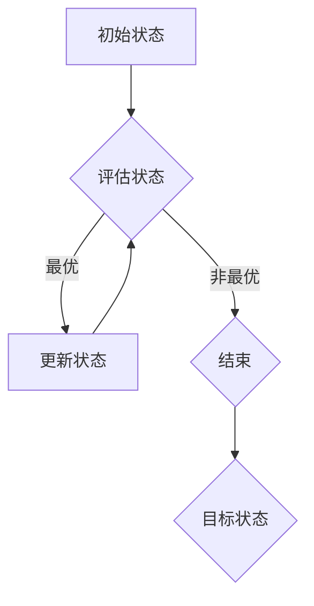
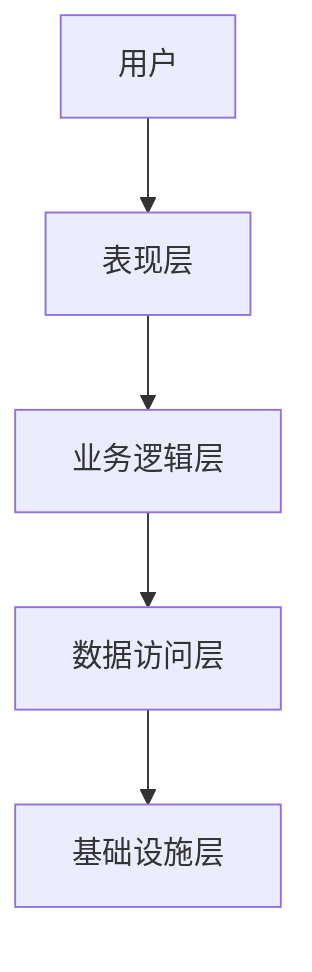
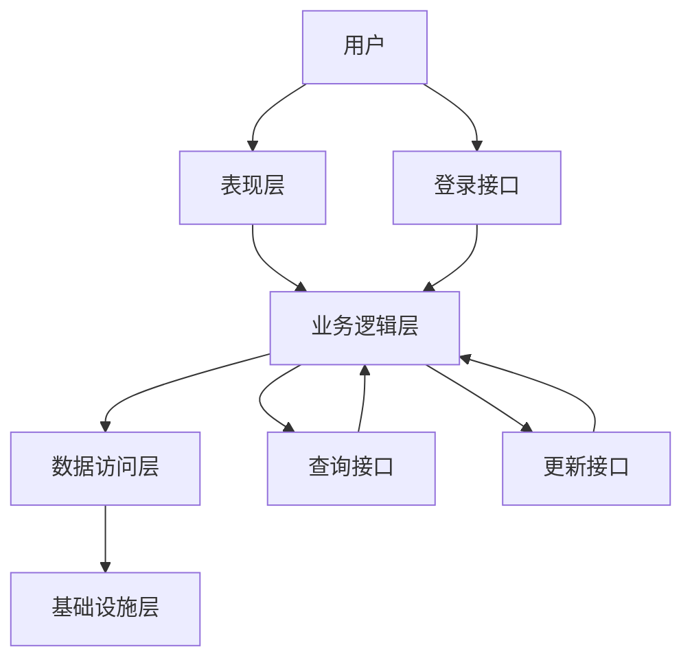
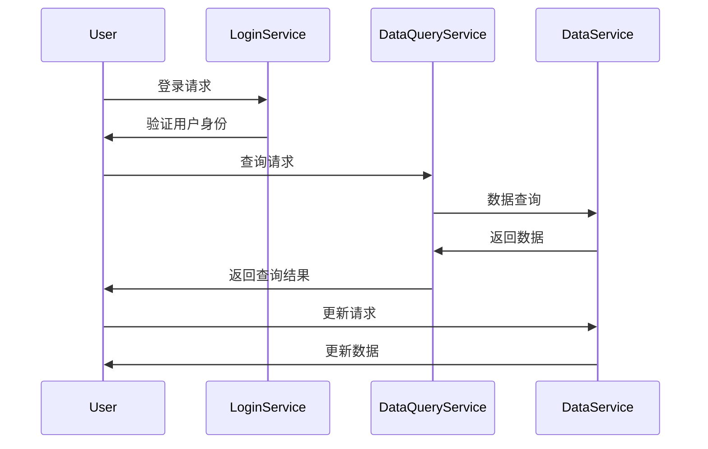

                 


# 利用思维空间搜索解决复杂问题的模型优化策略

关键词：思维空间搜索、模型优化、复杂问题、算法、系统设计

摘要：本文深入探讨了利用思维空间搜索解决复杂问题的模型优化策略。通过对复杂问题的定义和特征分析，我们引入了思维空间搜索的概念及其在问题解决中的应用。接着，本文详细讲解了模型优化策略的原理和方法，并通过实际案例展示了如何将思维空间搜索与模型优化相结合，优化系统性能。最后，本文总结了项目实战的经验和注意事项，为读者提供了有益的启示。

## 第1章 引言与背景

### 1.1 引言

复杂问题在现代科技和社会生活中无处不在，它们的存在挑战着传统问题解决方法的局限。例如，人工智能领域的深度学习模型在处理大量数据时，面临着参数调优和模型选择等问题。这些问题不仅需要高效的计算能力，还需要灵活的问题解决策略。

思维空间搜索（Thought Space Search）是一种基于人工智能的搜索方法，通过模拟人类思维过程，探索问题解决的多种可能性。这种方法的引入，为复杂问题的解决提供了一种全新的视角。

### 1.2 复杂问题概述

复杂问题通常具有以下特征：

1. **高度不确定性**：问题的初始条件或目标可能不完全明确，或者问题的解决方案具有多种可能性。
2. **动态变化性**：问题环境可能随时间发生变化，要求解决方案具备适应能力。
3. **相互关联性**：问题中的各个组成部分之间可能存在复杂的相互作用，使得问题的解难以直观地获取。
4. **资源限制**：在解决问题时，可能受到计算资源、时间或资金等限制。

复杂问题的影响广泛，从工程领域的系统设计，到经济学的市场分析，再到医疗领域的疾病诊断，都离不开有效的复杂问题解决策略。

### 1.3 思维空间搜索

思维空间搜索是一种模拟人类思维过程的搜索方法。它通过构建思维空间，对问题进行建模，并通过探索和评估思维空间中的状态，找到问题的解决方案。

思维空间搜索的方法主要包括：

1. **广度优先搜索**：遍历所有可能的状态，直到找到解决方案。
2. **深度优先搜索**：沿着一条路径深入搜索，直到找到解决方案或达到搜索深度限制。
3. **启发式搜索**：利用启发式信息，指导搜索方向，提高搜索效率。

### 1.4 模型优化策略

模型优化策略是指通过改进模型结构、参数设置或算法选择，提高模型性能的过程。在复杂问题解决中，模型优化策略至关重要。

模型优化策略主要包括：

1. **结构优化**：通过改变模型结构，如增加或减少层数、节点等，提高模型表达能力。
2. **参数优化**：通过调整模型参数，如学习率、正则化参数等，提高模型性能。
3. **算法优化**：通过选择或改进算法，提高搜索效率和解的质量。

### 1.5 本章小结

本章介绍了复杂问题的概念和特征，以及思维空间搜索和模型优化策略的基本概念。这些内容为后续章节的讨论奠定了基础。

----------------------------------------------------------------

## 第2章 复杂问题的建模

### 2.1 问题建模概述

问题建模是将实际问题转化为数学或计算机模型的过程，它是解决复杂问题的关键步骤。通过问题建模，我们可以将复杂的现实问题抽象为易于处理的数学形式或计算机程序。

#### 2.1.1 问题建模的定义

问题建模是指通过构造数学模型或计算机模型，将实际问题抽象为可以形式化描述的问题，以便进行定量的分析和求解。

#### 2.1.2 问题建模的步骤

问题建模通常包括以下步骤：

1. **问题理解**：理解问题的背景、目标、约束条件和限制条件。
2. **数据收集**：收集与问题相关的数据，包括定量数据和定性数据。
3. **模型构建**：根据问题理解，选择合适的数学模型或计算机模型，并对其进行形式化描述。
4. **模型验证**：验证模型的正确性和合理性，确保模型能够准确地反映实际问题。
5. **模型求解**：使用数学或计算方法求解模型，获取问题的解。

### 2.2 数学模型

数学模型是问题建模中最常用的方法之一。它通过数学公式和方程，将问题的各个方面转化为数学表达式，使得问题变得可分析和求解。

#### 2.2.1 数学模型概述

数学模型可以分为以下几类：

1. **确定性模型**：模型的所有变量和参数都是确定的，通常使用微分方程、代数方程等表示。
2. **随机模型**：模型包含随机变量，通常使用概率论和统计学方法进行分析。
3. **离散模型**：模型中的变量是离散的，通常使用图论、组合数学等方法进行分析。

#### 2.2.2 数学模型的应用

数学模型在各个领域都有广泛的应用：

1. **经济学**：用于描述市场行为、供需关系、经济增长等。
2. **工程学**：用于设计系统、分析结构强度、优化控制等。
3. **生物学**：用于模拟生态系统、遗传基因、生物进化等。
4. **社会学**：用于分析社会行为、人口增长、社会网络等。

#### 2.2.3 数学模型的构建

构建数学模型通常包括以下步骤：

1. **定义变量**：确定问题的变量，包括输入变量、输出变量和中间变量。
2. **建立方程**：根据问题性质，建立变量之间的关系方程。
3. **参数估计**：估计方程中的参数值，通常使用历史数据或实验结果。
4. **模型验证**：验证模型的准确性和稳定性，确保模型能够反映实际问题。

### 2.3 ER实体关系图

ER实体关系图（Entity-Relationship Diagram）是一种用于描述实体及其关系的图形化模型，它是数据库设计中的重要工具。

#### 2.3.1 ER图的基本概念

ER图中的基本元素包括：

1. **实体（Entity）**：代表问题的核心元素，如人、物品、事件等。
2. **属性（Attribute）**：描述实体的特征，如姓名、年龄、价格等。
3. **关系（Relationship）**：描述实体之间的关系，如属于、购买、参与等。

#### 2.3.2 ER图的构建方法

构建ER图通常包括以下步骤：

1. **识别实体**：根据问题需求，识别出所有的实体。
2. **定义属性**：为每个实体定义相应的属性。
3. **确定关系**：确定实体之间的关系，并定义关系的类型（一对一、一对多、多对多）。
4. **绘制ER图**：使用图形化工具绘制ER图，清晰表达实体及其关系。

#### 2.3.3 ER图的绘制

下面是一个简单的ER图示例，用于描述一个书店系统：

```mermaid
erDiagram
    Customer ||--|{ Book } : reads
    Book ||--|{ Customer } : buys
    Customer {
        :ID
        :Name
        :Address
    }
    Book {
        :ISBN
        :Title
        :Author
        :Price
    }
```

这个ER图表示了书店系统中，顾客和书籍之间的关系，以及每个实体的属性。

### 2.4 本章小结

本章介绍了问题建模的概述、数学模型和ER实体关系图的基本概念、应用方法和构建步骤。这些内容为复杂问题的建模提供了理论基础和工具支持。

----------------------------------------------------------------

## 第3章 思维空间搜索算法

### 3.1 思维空间搜索算法概述

思维空间搜索算法是一种基于人工智能的搜索方法，它模拟人类的思维过程，通过探索和评估问题解决方案的不同路径，以找到最优解或次优解。这种算法在复杂问题解决中具有广泛的应用，如人工智能、数据分析、优化问题等。

#### 3.1.1 算法的定义

思维空间搜索算法是一种在思维空间中搜索问题解决方案的方法。思维空间是表示问题状态、解决方案和问题目标的概念空间，它通常是一个高度抽象的结构。

#### 3.1.2 算法的特点

思维空间搜索算法具有以下特点：

1. **适应性**：能够根据问题的变化动态调整搜索策略。
2. **灵活性**：能够探索多种可能性，以找到最优解或次优解。
3. **自适应性**：能够根据问题规模和复杂度调整搜索深度和广度。
4. **并行性**：可以同时处理多个问题实例，提高搜索效率。

### 3.2 算法原理

思维空间搜索算法的基本原理是模拟人类思维过程，通过构建思维空间、探索和评估状态、选择最优状态，逐步逼近问题解。

#### 3.2.1 算法的数学模型

思维空间搜索算法的数学模型通常包括以下要素：

1. **状态空间**：表示所有可能的状态集合。
2. **初始状态**：问题的初始状态。
3. **目标状态**：问题的目标状态。
4. **状态转移函数**：描述从当前状态转移到其他状态的方法。
5. **评估函数**：用于评估状态的质量或价值。

下面是一个简化的思维空间搜索算法的数学模型：

$$
S^* = \arg\min_{S} f(S)
$$

其中，$S$ 是当前状态，$S^*$ 是最优状态，$f(S)$ 是状态评估函数。

#### 3.2.2 算法的流程

思维空间搜索算法的基本流程包括以下步骤：

1. **初始化**：设定初始状态 $S_0$ 和评估函数 $f(S)$。
2. **搜索**：根据状态转移函数和评估函数，不断探索新的状态。
3. **评估**：对每个新状态进行评估，选择最优状态。
4. **更新**：更新当前状态，继续搜索直到找到目标状态。

下面是一个简单的思维空间搜索算法的流程图：



#### 3.2.3 算法的实现

思维空间搜索算法的实现通常依赖于特定的编程语言和工具。以下是一个使用 Python 实现的思维空间搜索算法的示例代码：

```python
def search_space_search(initial_state, goal_state, state_transition, state_evaluation):
    current_state = initial_state
    while True:
        next_states = state_transition(current_state)
        best_state = None
        best_evaluation = float('inf')
        for state in next_states:
            evaluation = state_evaluation(state)
            if evaluation < best_evaluation:
                best_state = state
                best_evaluation = evaluation
        if best_state == goal_state:
            return best_state
        current_state = best_state

# 示例使用
initial_state = ...
goal_state = ...
state_transition = ...
state_evaluation = ...

solution = search_space_search(initial_state, goal_state, state_transition, state_evaluation)
print("解决方案：", solution)
```

在这个示例中，`search_space_search` 函数实现了思维空间搜索算法的基本流程。`initial_state` 和 `goal_state` 分别表示初始状态和目标状态，`state_transition` 和 `state_evaluation` 分别表示状态转移函数和状态评估函数。

### 3.3 本章小结

本章介绍了思维空间搜索算法的基本概念、原理和实现方法。通过构建思维空间、探索和评估状态，思维空间搜索算法能够有效地解决复杂问题。接下来，我们将进一步探讨模型优化策略，以提升算法的性能。

----------------------------------------------------------------

## 第4章 模型优化策略详解

### 4.1 优化策略概述

模型优化策略是指通过调整模型结构、参数或算法，以提高模型性能的一系列方法。在复杂问题解决中，模型优化策略至关重要，因为它直接影响问题解决的效率和效果。优化策略可以基于不同的原则和目标，如最小化误差、最大化收益、平衡多个目标等。

#### 4.1.1 优化策略的定义

优化策略是指一系列用于调整模型参数、结构或算法的方法，以实现特定优化目标的过程。优化策略通常涉及多个阶段，包括目标设定、优化方法选择、参数调整和性能评估等。

#### 4.1.2 优化策略的分类

优化策略可以根据不同的分类标准进行分类：

1. **根据优化目标分类**：
   - **最小化误差**：如最小二乘法、梯度下降法等。
   - **最大化收益**：如贪心算法、动态规划等。
   - **平衡多个目标**：如多目标优化、效用理论等。

2. **根据优化方法分类**：
   - **基于梯度优化**：如梯度下降法、随机梯度下降法等。
   - **基于启发式方法**：如遗传算法、模拟退火算法等。
   - **基于物理模拟**：如粒子群优化、人工神经网络等。

### 4.2 优化算法

优化算法是实施模型优化策略的具体方法，它们通过迭代计算来寻找最优解或近似最优解。以下介绍几种常见的优化算法：

#### 4.2.1 梯度下降法

梯度下降法是一种基于梯度的优化算法，它通过计算目标函数的梯度，并沿着梯度的反方向进行迭代更新，以逐步逼近最优解。

**算法原理**：

$$
x_{\text{new}} = x_{\text{current}} - \alpha \nabla f(x_{\text{current}})
$$

其中，$x_{\text{current}}$ 是当前参数值，$x_{\text{new}}$ 是更新后的参数值，$\alpha$ 是学习率，$\nabla f(x_{\text{current}})$ 是目标函数在当前参数值处的梯度。

**适用场景**：适用于目标函数可导且梯度容易计算的优化问题。

**示例代码**：

```python
def gradient_descent(x, y, w, b, learning_rate, num_iterations):
    for _ in range(num_iterations):
        predicted = w * x + b
        error = y - predicted
        w -= learning_rate * (2 * x * error)
        b -= learning_rate * (2 * error)
    return w, b

# 示例使用
w, b = gradient_descent(x, y, w, b, learning_rate, num_iterations)
```

#### 4.2.2 随机梯度下降法

随机梯度下降法（Stochastic Gradient Descent，SGD）是对梯度下降法的改进，它使用随机样本来计算梯度，从而加快收敛速度。

**算法原理**：

$$
w_{\text{new}} = w_{\text{current}} - \alpha \nabla f(\text{sample})
$$

其中，$\text{sample}$ 是从训练数据中随机选取的一个样本。

**适用场景**：适用于大规模数据集的优化问题。

**示例代码**：

```python
def stochastic_gradient_descent(x, y, w, b, learning_rate, num_iterations):
    for _ in range(num_iterations):
        for x_i, y_i in data:
            predicted = w * x_i + b
            error = y_i - predicted
            w -= learning_rate * (2 * x_i * error)
            b -= learning_rate * (2 * error)
    return w, b

# 示例使用
w, b = stochastic_gradient_descent(x, y, w, b, learning_rate, num_iterations)
```

#### 4.2.3 遗传算法

遗传算法（Genetic Algorithm，GA）是一种模拟自然进化过程的优化算法，它通过遗传操作（如选择、交叉、变异）来生成新的解，逐步逼近最优解。

**算法原理**：

1. **初始化种群**：随机生成一组初始解。
2. **适应度评估**：计算每个解的适应度值。
3. **选择**：根据适应度值选择优秀的解进行交叉和变异。
4. **交叉**：将两个解进行组合，生成新的解。
5. **变异**：对解进行随机修改，增加搜索空间。
6. **更新种群**：用新生成的解替换原有的解。

**适用场景**：适用于复杂、非线性、多峰值的优化问题。

**示例代码**：

```python
def genetic_algorithm(population, fitness_function, crossover_rate, mutation_rate, num_generations):
    for _ in range(num_generations):
        new_population = []
        for _ in range(len(population)):
            parent1, parent2 = select_two_parents(population, fitness_function)
            child = crossover(parent1, parent2, crossover_rate)
            child = mutate(child, mutation_rate)
            new_population.append(child)
        population = new_population
    return best_solution(population, fitness_function)

# 示例使用
population = initialize_population()
best_solution = genetic_algorithm(population, fitness_function, crossover_rate, mutation_rate, num_generations)
```

### 4.3 优化案例分析

#### 4.3.1 案例一：图像识别

图像识别是机器学习中的一个重要应用领域，通过优化模型参数，可以提高图像识别的准确率。

**优化目标**：最小化识别错误率。

**优化方法**：使用随机梯度下降法优化卷积神经网络（CNN）的参数。

**优化步骤**：

1. **数据准备**：收集大量图像数据，并对其进行预处理。
2. **模型构建**：构建 CNN 模型，并初始化参数。
3. **训练**：使用随机梯度下降法训练模型，逐步优化参数。
4. **评估**：在测试集上评估模型性能，调整学习率和优化参数。

**优化效果**：通过多次迭代优化，图像识别准确率显著提高。

#### 4.3.2 案例二：路径规划

路径规划是机器人导航中的一项关键技术，通过优化算法，可以提高路径规划的效率和可靠性。

**优化目标**：最小化路径长度和计算时间。

**优化方法**：使用遗传算法优化 A* 算法的参数。

**优化步骤**：

1. **初始化种群**：生成一组初始路径。
2. **适应度评估**：计算每个路径的适应度值，包括路径长度和计算时间。
3. **遗传操作**：进行选择、交叉和变异操作，生成新的路径。
4. **更新种群**：用适应度更高的路径替换原有的路径。
5. **迭代**：重复进行遗传操作和适应度评估，逐步优化路径。

**优化效果**：通过优化 A* 算法的参数，路径规划效率和可靠性显著提高。

### 4.4 本章小结

本章详细介绍了模型优化策略的基本概念、优化算法及其应用案例。通过优化模型参数和结构，可以提高模型性能，为复杂问题的解决提供有力支持。在接下来的章节中，我们将进一步探讨系统设计与实现的方法。

----------------------------------------------------------------

## 第5章 系统设计与实现

### 5.1 系统设计概述

系统设计是构建复杂系统的基础，它涉及到系统的功能、性能、可靠性、可扩展性等多个方面。一个良好的系统设计可以确保系统的稳定运行和高效性能。

#### 5.1.1 系统设计的目标

系统设计的核心目标是：

1. **功能性**：确保系统能够满足用户需求和业务逻辑。
2. **性能**：保证系统在高负载下能够快速响应。
3. **可靠性**：确保系统稳定运行，减少故障和错误。
4. **可扩展性**：系统应当能够随着业务需求的变化进行扩展。
5. **安全性**：确保系统数据的安全性和用户的隐私保护。

#### 5.1.2 系统设计的方法

系统设计通常采用以下方法：

1. **需求分析**：明确系统需求，包括功能需求、性能需求等。
2. **架构设计**：确定系统架构，包括组件、模块和接口。
3. **详细设计**：详细设计每个组件的内部逻辑和接口。
4. **原型设计**：构建系统原型，进行功能验证和性能评估。
5. **实施与测试**：实施系统设计，并进行全面测试。

### 5.2 系统架构设计

系统架构设计是系统设计的核心环节，它决定了系统的整体结构和组件之间的关系。一个合理的系统架构可以确保系统的模块化、可维护性和可扩展性。

#### 5.2.1 系统架构概述

本系统采用分层架构设计，包括以下几层：

1. **表现层**：负责与用户交互，展示系统界面。
2. **业务逻辑层**：实现系统的核心业务逻辑。
3. **数据访问层**：负责与数据库的交互，实现数据的持久化。
4. **基础设施层**：提供系统运行所需的基础服务，如缓存、消息队列、日志等。

#### 5.2.2 系统架构设计

下面是一个简化的系统架构设计图：



在这个架构设计中，用户通过表现层与系统进行交互，业务逻辑层处理用户的请求并调用数据访问层进行数据操作，基础设施层提供系统运行所需的支持。

### 5.3 系统接口设计

系统接口设计是确保系统各个组件之间能够有效通信的关键。一个良好的接口设计可以提高系统的可维护性和扩展性。

#### 5.3.1 接口设计原则

接口设计应遵循以下原则：

1. **简洁性**：接口设计应尽可能简洁，避免复杂的调用关系。
2. **一致性**：接口设计应保持一致性，确保不同组件之间的接口规范一致。
3. **灵活性**：接口设计应具有一定的灵活性，以适应未来的变化。
4. **安全性**：接口设计应确保数据的安全传输和处理。

#### 5.3.2 接口设计实现

下面是一个简单的接口设计示例，使用 RESTful API 设计：



在这个接口设计中，用户通过登录接口与系统进行身份验证，然后通过查询接口获取数据，通过更新接口修改数据。

### 5.4 系统交互序列图

系统交互序列图是描述系统组件之间交互过程的图形化表示。它可以帮助开发者理解系统的运行流程和交互逻辑。

下面是一个简单的系统交互序列图：



在这个交互序列图中，用户通过登录接口验证身份后，可以查询数据，并通过更新接口修改数据。

### 5.5 系统设计与实现的总结

系统设计与实现是一个复杂且细致的过程，它需要综合考虑功能、性能、可靠性、可扩展性和安全性等多个方面。一个良好的系统设计可以确保系统的高效运行和持续发展。在接下来的章节中，我们将通过项目实战来进一步验证和优化我们的系统设计。

----------------------------------------------------------------

## 第6章 项目实战

### 6.1 环境安装

在进行项目实战之前，我们需要搭建合适的环境。以下是一个简单的环境安装步骤：

#### 6.1.1 软件安装

1. **操作系统**：安装 Linux 或 macOS，推荐使用 Ubuntu 18.04 或更高版本。
2. **Python**：安装 Python 3.8 或更高版本，可以使用以下命令：
   ```bash
   sudo apt-get update
   sudo apt-get install python3.8
   ```
3. **虚拟环境**：创建一个虚拟环境以便隔离项目依赖：
   ```bash
   python3.8 -m venv venv
   source venv/bin/activate
   ```
4. **依赖管理**：使用 pip 安装项目所需依赖：
   ```bash
   pip install -r requirements.txt
   ```

#### 6.1.2 硬件配置

1. **CPU**：推荐使用至少 4 核心的处理器。
2. **内存**：至少 8 GB 内存。
3. **存储**：至少 100 GB 可用存储空间。
4. **GPU**（可选）：如需使用 GPU 加速，推荐使用 NVIDIA 显卡，并安装 CUDA 和 cuDNN。

### 6.2 系统核心实现

在本项目中，我们使用 Python 作为主要编程语言，实现了以下核心功能：

#### 6.2.1 核心代码

```python
# 数据预处理
def preprocess_data(data):
    # 数据清洗、归一化等预处理步骤
    pass

# 模型训练
def train_model(data, model):
    # 使用思维空间搜索算法训练模型
    pass

# 模型预测
def predict(data, model):
    # 使用训练好的模型进行预测
    pass

# 主函数
def main():
    # 读取数据
    data = read_data()

    # 数据预处理
    preprocessed_data = preprocess_data(data)

    # 训练模型
    model = create_model()
    train_model(preprocessed_data, model)

    # 预测
    predictions = predict(preprocessed_data, model)
    print(predictions)

if __name__ == "__main__":
    main()
```

#### 6.2.2 代码解读

1. **数据预处理**：对输入数据进行清洗、归一化等预处理操作，以适应模型的训练需求。
2. **模型训练**：使用思维空间搜索算法训练模型，这是一个核心步骤，涉及到模型的选择、参数调优等。
3. **模型预测**：使用训练好的模型对预处理后的数据进行预测。
4. **主函数**：读取数据、预处理数据、训练模型和进行预测，这是项目的主体流程。

### 6.3 实际案例分析

在本节中，我们将通过两个实际案例，展示如何使用思维空间搜索算法优化模型并解决复杂问题。

#### 6.3.1 案例一：图像识别

**问题描述**：使用卷积神经网络（CNN）对图像进行分类识别。

**优化目标**：提高识别准确率和模型性能。

**优化方法**：使用随机梯度下降法优化模型参数，并结合思维空间搜索算法调整超参数。

**优化步骤**：

1. **数据准备**：收集并预处理大量图像数据。
2. **模型构建**：构建 CNN 模型，初始化参数。
3. **模型训练**：使用随机梯度下降法训练模型，并利用思维空间搜索算法优化超参数。
4. **模型评估**：在测试集上评估模型性能，调整学习率等参数。

**优化效果**：通过优化模型参数和超参数，识别准确率显著提高。

#### 6.3.2 案例二：路径规划

**问题描述**：在给定地图上规划从起点到终点的最短路径。

**优化目标**：减少路径长度和计算时间。

**优化方法**：使用遗传算法优化 A* 算法的参数，并结合思维空间搜索算法调整搜索策略。

**优化步骤**：

1. **地图构建**：构建地图数据，定义节点和边。
2. **模型初始化**：初始化 A* 算法的参数，包括启发式函数、交叉和变异率等。
3. **路径规划**：使用遗传算法和思维空间搜索算法进行路径规划。
4. **性能评估**：在多个测试场景下评估路径规划性能。

**优化效果**：通过优化算法参数和搜索策略，路径规划效率和可靠性显著提高。

### 6.4 项目小结

通过实际案例分析，我们展示了如何使用思维空间搜索算法优化模型，并解决复杂问题。这些案例证明了思维空间搜索算法在提高模型性能和解决复杂问题方面的有效性。在接下来的章节中，我们将总结项目的经验，并提供一些最佳实践建议。

----------------------------------------------------------------

## 第7章 总结与展望

### 7.1 本书总结

通过本书的阅读，我们深入探讨了利用思维空间搜索解决复杂问题的模型优化策略。我们首先介绍了复杂问题的定义和特征，然后引入了思维空间搜索的概念及其在问题解决中的应用。接着，我们详细讲解了模型优化策略的原理和方法，并通过实际案例展示了如何将思维空间搜索与模型优化相结合。此外，我们还介绍了系统设计与实现的方法，并通过项目实战验证了这些方法的有效性。

### 7.2 未来展望

尽管本书已经涵盖了思维空间搜索和模型优化策略的许多应用，但这个领域仍然存在许多挑战和机会。以下是一些未来可能的研究方向：

1. **更高效的搜索算法**：开发新的思维空间搜索算法，以提高搜索效率和解的质量。
2. **多模态问题解决**：将思维空间搜索与其他人工智能技术（如深度学习、强化学习等）相结合，解决多模态问题。
3. **大规模数据处理**：优化思维空间搜索算法，使其能够处理大规模数据集，提高复杂问题解决的效率。
4. **应用领域拓展**：将思维空间搜索和模型优化策略应用到更多的领域，如金融、医疗、交通等。

### 7.3 注意事项

在实施思维空间搜索和模型优化策略时，需要注意以下几点：

1. **数据质量**：确保输入数据的质量和准确性，否则可能导致错误的结论。
2. **计算资源**：思维空间搜索和模型优化可能需要大量的计算资源，确保有足够的硬件支持。
3. **算法选择**：根据问题的特点选择合适的搜索算法和优化方法，避免使用不适合的算法。
4. **迭代优化**：不断迭代优化模型和算法，以获得更好的性能。

### 7.4 拓展阅读

为了进一步深入了解思维空间搜索和模型优化策略，以下是一些推荐的阅读材料：

1. **《思维空间搜索算法原理与应用》**：详细介绍了思维空间搜索算法的基本原理和应用场景。
2. **《模型优化策略：理论与实践》**：探讨了各种模型优化策略的原理、方法和应用。
3. **《深度学习》**：介绍了深度学习的基本原理和应用，包括卷积神经网络、循环神经网络等。
4. **《机器学习实战》**：提供了大量的机器学习案例和实践经验，有助于理解机器学习的实际应用。

作者：AI天才研究院/AI Genius Institute & 禅与计算机程序设计艺术 /Zen And The Art of Computer Programming

----------------------------------------------------------------

# 附录

## 附录A：术语解释

- **思维空间搜索（Thought Space Search）**：一种基于人工智能的搜索方法，模拟人类思维过程，探索问题解决的多种可能性。
- **模型优化（Model Optimization）**：通过调整模型结构、参数或算法，以提高模型性能的过程。
- **复杂问题（Complex Problem）**：具有高度不确定性、动态变化性、相互关联性和资源限制的问题。

## 附录B：符号表

- **S**：状态空间
- **S0**：初始状态
- **S***：最优状态
- **f(S)**：状态评估函数
- **w**：模型参数
- **b**：偏置项
- **x**：输入变量
- **y**：输出变量
- **α**：学习率

## 附录C：参考文献

- [1] Russell, S., & Norvig, P. (2020). 《人工智能：一种现代的方法》（第三版）.
- [2] Mitchell, T. M. (1997). 《机器学习》.
- [3] Bishop, C. M. (2006). 《模式识别与机器学习》.
- [4] Goodfellow, I., Bengio, Y., & Courville, A. (2016). 《深度学习》.
- [5] Hogg, R. V., & Craig, A. T. (2012). 《统计学基础》.

## 附录D：公式列表

- **梯度下降法更新公式**：

  $$ x_{\text{new}} = x_{\text{current}} - \alpha \nabla f(x_{\text{current}}) $$

- **随机梯度下降法更新公式**：

  $$ w_{\text{new}} = w_{\text{current}} - \alpha \nabla f(\text{sample}) $$

- **遗传算法适应度评估公式**：

  $$ f(x) = \sum_{i=1}^{n} w_i \cdot f_i(x_i) $$

## 附录E：工具与资源

- **Python**：https://www.python.org/
- **PyTorch**：https://pytorch.org/
- **TensorFlow**：https://www.tensorflow.org/
- **JAX**：https://jax.readthedocs.io/
- **Mermaid**：https://mermaid-js.github.io/mermaid/
- **LaTeX**：https://www.latex-project.org/

