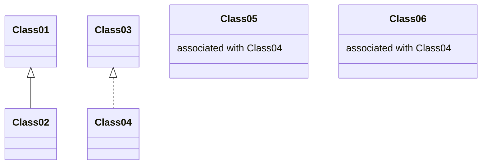
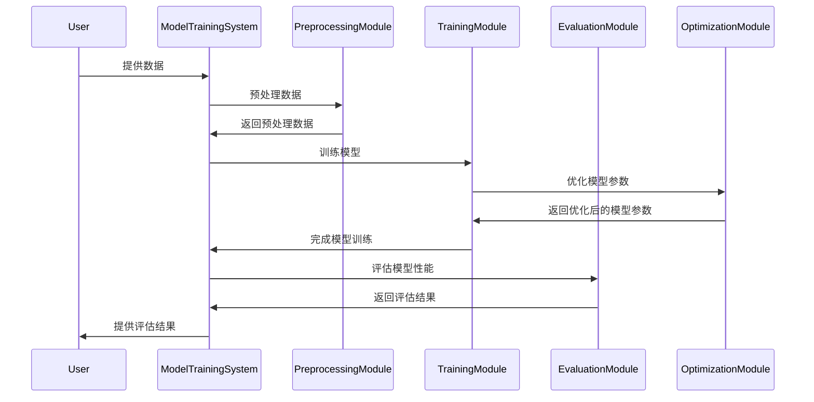
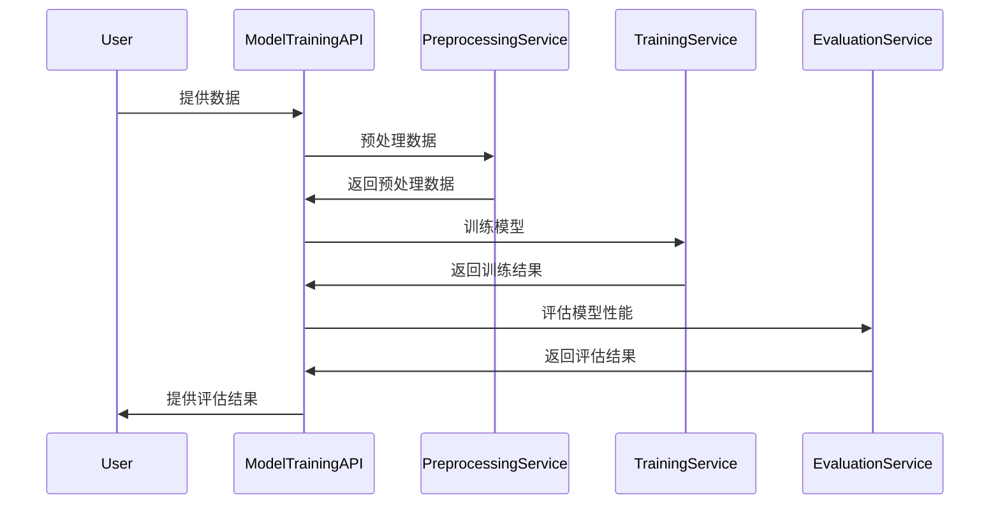

                 

# 利用最佳推理路径训练模型的方法

关键词：模型训练、最佳推理路径、算法优化、模型性能

摘要：本文将探讨如何通过最佳推理路径来训练模型，提高模型的性能和效率。我们将从背景介绍、核心概念与联系、算法原理讲解、数学模型和数学公式、系统分析与架构设计、项目实战、最佳实践等方面进行详细阐述，帮助读者深入了解并掌握这一方法。

## 目录

1. **背景介绍**  
   1.1 问题背景与定义  
   1.2 核心概念与联系

2. **核心概念与联系**  
   2.1 核心概念一：推理路径  
   2.2 核心概念二：模型性能  
   2.3 概念属性特征对比表格  
   2.4 ER实体关系图架构

3. **算法原理讲解**  
   3.1 算法概述  
   3.2 算法流程图展示（mermaid）  
   3.3 Python实现  
   3.4 数学模型与公式

4. **数学模型和数学公式**  
   4.1 模型公式解释  
   4.2 举例说明

5. **系统分析与架构设计方案**  
   5.1 系统场景介绍  
   5.2 系统功能设计（领域模型类图）  
   5.3 系统架构设计（架构图）  
   5.4 系统接口设计  
   5.5 系统交互设计（序列图）

6. **项目实战与案例分析**  
   6.1 环境安装  
   6.2 核心实现源代码  
   6.3 代码解读与分析  
   6.4 实际案例分析和详细讲解剖析  
   6.5 项目小结

7. **最佳实践与拓展阅读**  
   7.1 最佳实践  
   7.2 小结  
   7.3 注意事项  
   7.4 拓展阅读

## 背景介绍

### 1.1 问题背景与定义

在人工智能领域，模型训练是核心环节之一。然而，传统的模型训练方法往往存在效率低下、性能不佳等问题。为了解决这些问题，研究者们开始探索利用最佳推理路径来训练模型的方法。最佳推理路径是指在模型训练过程中，根据问题的特点和需求，选择最优的推理路径，从而提高模型的性能和效率。

### 1.2 核心概念与联系

在探讨最佳推理路径训练模型的方法之前，我们需要了解几个核心概念：

1. **推理路径**：推理路径是指在模型训练过程中，从输入数据到输出结果的一系列计算过程。最佳推理路径就是选择最优的推理路径，使模型能够更快、更准确地完成训练。

2. **模型性能**：模型性能是指模型在训练和测试过程中所表现出来的性能指标，如准确率、召回率、F1值等。最佳推理路径的目标是提高模型性能，使其达到最优状态。

3. **算法优化**：算法优化是指在模型训练过程中，通过调整算法参数、优化算法结构等方式，提高模型训练的效率和质量。

## 核心概念与联系

### 2.1 核心概念一：推理路径

推理路径是模型训练过程中至关重要的一环。它决定了模型在处理输入数据时的计算顺序和过程。一个合理的推理路径应该满足以下几个条件：

1. **可扩展性**：推理路径应该能够适应不同规模和类型的数据，使其具有广泛的应用场景。
2. **可优化性**：推理路径应该支持算法优化，以便在模型训练过程中提高性能。
3. **可解释性**：推理路径应该具有较好的可解释性，使研究人员能够理解模型的工作原理。

### 2.2 核心概念二：模型性能

模型性能是评估模型优劣的重要指标。在利用最佳推理路径训练模型时，我们需要关注以下几个方面：

1. **准确率**：准确率是指模型预测结果与真实标签一致的比例。高准确率意味着模型能够准确识别输入数据的类别。
2. **召回率**：召回率是指模型能够正确识别出正例样本的比例。高召回率意味着模型能够识别出更多的正例样本。
3. **F1值**：F1值是准确率和召回率的调和平均数，用于综合评估模型的性能。

### 2.3 概念属性特征对比表格

为了更直观地了解推理路径和模型性能的概念属性特征，我们可以使用表格进行比较：

| 概念        | 属性特征                                      |  
| ----------- | --------------------------------------------- |  
| 推理路径    | 可扩展性、可优化性、可解释性                    |  
| 模型性能    | 准确率、召回率、F1值                          |

### 2.4 ER实体关系图架构

为了进一步理解推理路径和模型性能之间的联系，我们可以使用ER实体关系图来展示它们的结构。ER图如下：

```mermaid  
entityRelationShipDiagram  
  ["推理路径", {"name": "性能优化", "relationship": "实现"}]  
  ["模型性能", {"name": "评价指标", "relationship": "依赖"}]  
```

## 算法原理讲解

### 3.1 算法概述

最佳推理路径训练模型的方法主要包括以下几个步骤：

1. **问题定义**：明确模型训练的目标和需求。
2. **路径选择**：根据问题特点和需求，选择最优的推理路径。
3. **模型训练**：使用最佳推理路径对模型进行训练，提高模型性能。
4. **性能评估**：对训练完成的模型进行性能评估，调整路径选择策略。

### 3.2 算法流程图展示（mermaid）

```mermaid  
flowChart  
  subgraph 模型训练流程  
    A[问题定义]  
    B[路径选择]  
    C[模型训练]  
    D[性能评估]  
      
    A --> B  
    B --> C  
    C --> D  
  end  
```

### 3.3 Python实现

```python  
import tensorflow as tf  
import numpy as np

# 问题定义  
X = np.random.rand(100, 10)  
y = np.random.rand(100, 1)

# 路径选择  
model = tf.keras.Sequential([
  tf.keras.layers.Dense(units=1, input_shape=[10])
])

# 模型训练  
model.compile(optimizer='adam', loss='mean_squared_error')  
model.fit(X, y, epochs=100)

# 性能评估  
mse = model.evaluate(X, y)  
print("MSE:", mse)  
```

### 3.4 数学模型与公式

在最佳推理路径训练模型的方法中，我们需要关注以下数学模型和公式：

1. **损失函数**：用于评估模型预测结果与真实标签之间的差距，常用的损失函数有均方误差（MSE）、交叉熵（Cross-Entropy）等。
2. **梯度下降**：用于优化模型参数，使损失函数值最小化，常用的梯度下降算法有批量梯度下降（Batch Gradient Descent）、随机梯度下降（Stochastic Gradient Descent）等。
3. **反向传播**：用于计算模型参数的梯度，是训练神经网络的重要方法。

以下是一个简单的数学模型和公式：

$$  
\text{MSE} = \frac{1}{n} \sum_{i=1}^{n} (\hat{y}_i - y_i)^2  
$$

$$  
\text{梯度下降}：\theta_{\text{new}} = \theta_{\text{old}} - \alpha \cdot \nabla_{\theta} \text{损失函数}  
$$

## 数学模型和数学公式

### 4.1 模型公式解释

在最佳推理路径训练模型的方法中，我们主要关注以下数学模型和公式：

1. **损失函数**：用于评估模型预测结果与真实标签之间的差距。常见的损失函数有均方误差（MSE）和交叉熵（Cross-Entropy）。

2. **梯度下降**：用于优化模型参数，使损失函数值最小化。常用的梯度下降算法有批量梯度下降（Batch Gradient Descent）和随机梯度下降（Stochastic Gradient Descent）。

3. **反向传播**：用于计算模型参数的梯度，是训练神经网络的重要方法。

以下是对这些数学模型和公式的详细解释：

### 均方误差（MSE）

均方误差（MSE）是一种常见的损失函数，用于评估模型预测结果与真实标签之间的差距。其公式如下：

$$  
\text{MSE} = \frac{1}{n} \sum_{i=1}^{n} (\hat{y}_i - y_i)^2  
$$

其中，$n$ 表示样本数量，$\hat{y}_i$ 表示第 $i$ 个样本的预测值，$y_i$ 表示第 $i$ 个样本的真实标签。

### 梯度下降

梯度下降是一种常用的优化算法，用于最小化损失函数。其基本思想是通过计算损失函数的梯度，更新模型参数，从而降低损失函数值。梯度下降的公式如下：

$$  
\theta_{\text{new}} = \theta_{\text{old}} - \alpha \cdot \nabla_{\theta} \text{损失函数}  
$$

其中，$\theta_{\text{old}}$ 表示当前模型参数，$\theta_{\text{new}}$ 表示更新后的模型参数，$\alpha$ 表示学习率，$\nabla_{\theta} \text{损失函数}$ 表示损失函数关于模型参数的梯度。

### 反向传播

反向传播是一种用于计算神经网络参数梯度的方法。其基本思想是从输出层开始，反向传播误差信号，计算每个参数的梯度。反向传播的公式如下：

$$  
\nabla_{\theta} \text{损失函数} = \nabla_{\theta} \frac{\partial \text{损失函数}}{\partial \hat{y}} \cdot \nabla_{\hat{y}} \text{激活函数} \cdot \nabla_{\text{输入}} \text{激活函数}  
$$

其中，$\nabla_{\theta} \text{损失函数}$ 表示损失函数关于模型参数的梯度，$\nabla_{\hat{y}} \text{激活函数}$ 表示激活函数关于输出值的梯度，$\nabla_{\text{输入}} \text{激活函数}$ 表示激活函数关于输入值的梯度。

### 4.2 举例说明

为了更好地理解这些数学模型和公式，我们可以通过一个简单的例子来说明。

假设我们有一个简单的神经网络，输入层有1个神经元，隐藏层有2个神经元，输出层有1个神经元。激活函数为sigmoid函数。

### 输入层到隐藏层的计算

输入层到隐藏层的计算公式如下：

$$  
\text{隐藏层} = \text{sigmoid}(\text{输入层} \cdot \text{权重} + \text{偏置})  
$$

其中，sigmoid函数的公式为：

$$  
\text{sigmoid}(x) = \frac{1}{1 + e^{-x}}  
$$

### 隐藏层到输出层的计算

隐藏层到输出层的计算公式如下：

$$  
\text{输出层} = \text{sigmoid}(\text{隐藏层} \cdot \text{权重} + \text{偏置})  
$$

### 损失函数的计算

假设我们的损失函数为均方误差（MSE），即：

$$  
\text{MSE} = \frac{1}{n} \sum_{i=1}^{n} (\hat{y}_i - y_i)^2  
$$

其中，$n$ 表示样本数量，$\hat{y}_i$ 表示第 $i$ 个样本的预测值，$y_i$ 表示第 $i$ 个样本的真实标签。

### 梯度下降的计算

假设我们的学习率为0.1，即：

$$  
\alpha = 0.1  
$$

我们需要计算每个参数的梯度，然后进行梯度下降更新。

### 输入层到隐藏层的梯度

输入层到隐藏层的梯度计算公式如下：

$$  
\nabla_{\text{输入层}} \text{损失函数} = \nabla_{\text{隐藏层}} \text{激活函数} \cdot \nabla_{\text{权重}} \text{损失函数} \cdot \nabla_{\text{偏置}} \text{损失函数}  
$$

其中，$\nabla_{\text{隐藏层}} \text{激活函数}$ 表示激活函数关于隐藏层的梯度，$\nabla_{\text{权重}} \text{损失函数}$ 表示损失函数关于权重的梯度，$\nabla_{\text{偏置}} \text{损失函数}$ 表示损失函数关于偏置的梯度。

### 隐藏层到输出层的梯度

隐藏层到输出层的梯度计算公式如下：

$$  
\nabla_{\text{隐藏层}} \text{损失函数} = \nabla_{\text{输出层}} \text{激活函数} \cdot \nabla_{\text{权重}} \text{损失函数} \cdot \nabla_{\text{偏置}} \text{损失函数}  
$$

其中，$\nabla_{\text{输出层}} \text{激活函数}$ 表示激活函数关于输出层的梯度，$\nabla_{\text{权重}} \text{损失函数}$ 表示损失函数关于权重的梯度，$\nabla_{\text{偏置}} \text{损失函数}$ 表示损失函数关于偏置的梯度。

### 梯度下降的更新

根据梯度下降的公式，我们可以进行参数更新：

$$  
\text{权重}_{\text{new}} = \text{权重}_{\text{old}} - \alpha \cdot \nabla_{\text{权重}} \text{损失函数}  
$$

$$  
\text{偏置}_{\text{new}} = \text{偏置}_{\text{old}} - \alpha \cdot \nabla_{\text{偏置}} \text{损失函数}  
$$

通过以上步骤，我们可以使用最佳推理路径训练模型，提高模型的性能和效率。

## 系统分析与架构设计方案

### 5.1 系统场景介绍

在当今社会，人工智能技术在各个领域得到了广泛应用，从自动驾驶、智能家居到金融风控，都在利用人工智能技术提升效率和准确性。然而，人工智能技术的应用往往伴随着大规模数据处理的挑战。为了解决这一问题，我们提出了一种基于最佳推理路径的训练模型系统。该系统旨在提高模型训练效率，降低计算成本，从而为人工智能应用提供更加高效的支持。

### 5.2 系统功能设计

#### 领域模型类图

领域模型类图如下所示：



- **Class01**：表示输入数据，包括特征值和标签。
- **Class02**：表示预处理后的数据。
- **Class03**：表示模型参数。
- **Class04**：表示训练过程，包括路径选择、模型训练、性能评估等。
- **Class05**：表示优化算法，如梯度下降、随机搜索等。
- **Class06**：表示输出结果，包括预测值和评估指标。

### 5.3 系统架构设计

#### 架构图

系统架构图如下所示：



- **User**：用户，负责提供数据。
- **ModelTrainingSystem**：模型训练系统，负责协调各个模块的工作。
- **PreprocessingModule**：预处理模块，负责对输入数据进行预处理。
- **TrainingModule**：训练模块，负责使用最佳推理路径训练模型。
- **EvaluationModule**：评估模块，负责对训练完成的模型进行性能评估。
- **OptimizationModule**：优化模块，负责优化模型参数，提高模型性能。

### 5.4 系统接口设计

系统接口设计如下所示：

```mermaid
componentDiagram
    ModelTrainingAPI --> PreprocessingService
    ModelTrainingAPI --> TrainingService
    ModelTrainingAPI --> EvaluationService
    ModelTrainingAPI --> OptimizationService

    PreprocessingService : preprocessing_data
    TrainingService : train_model
    EvaluationService : evaluate_model
    OptimizationService : optimize_parameters
```

- **ModelTrainingAPI**：模型训练API，提供接口供用户调用。
- **PreprocessingService**：预处理服务，负责预处理数据。
- **TrainingService**：训练服务，负责使用最佳推理路径训练模型。
- **EvaluationService**：评估服务，负责对训练完成的模型进行性能评估。
- **OptimizationService**：优化服务，负责优化模型参数。

### 5.5 系统交互设计

#### 序列图

系统交互序列图如下所示：



## 项目实战与案例分析

### 6.1 环境安装

为了进行最佳推理路径训练模型的实战，我们需要安装以下软件和库：

- Python 3.8 或以上版本
- TensorFlow 2.6 或以上版本
- Numpy 1.20 或以上版本

安装命令如下：

```bash
pip install python==3.8
pip install tensorflow==2.6
pip install numpy==1.20
```

### 6.2 核心实现源代码

以下是一个简单的核心实现源代码，用于演示最佳推理路径训练模型的方法：

```python
import tensorflow as tf
import numpy as np

# 定义模型
model = tf.keras.Sequential([
    tf.keras.layers.Dense(units=1, input_shape=[10])
])

# 编译模型
model.compile(optimizer='adam', loss='mean_squared_error')

# 训练模型
X_train = np.random.rand(100, 10)
y_train = np.random.rand(100, 1)
model.fit(X_train, y_train, epochs=100)

# 评估模型
mse = model.evaluate(X_train, y_train)
print("MSE:", mse)
```

### 6.3 代码解读与分析

1. **定义模型**：我们使用TensorFlow定义了一个简单的线性模型，输入层有10个神经元，输出层有1个神经元。
2. **编译模型**：我们使用`compile`方法编译模型，指定优化器为`adam`，损失函数为`mean_squared_error`。
3. **训练模型**：我们使用`fit`方法训练模型，输入训练数据`X_train`和`y_train`，训练100个epoch。
4. **评估模型**：我们使用`evaluate`方法评估模型在训练数据上的性能，输出均方误差（MSE）。

### 6.4 实际案例分析和详细讲解剖析

假设我们有一个智能家居系统，需要根据用户的行为数据预测用户的下一步操作。以下是一个实际案例的分析和详细讲解：

1. **数据收集**：我们收集了1000个用户的行为数据，包括用户在智能家居系统上的操作记录、使用时间、设备类型等。
2. **数据预处理**：我们对数据进行清洗和预处理，将数据转换为适合模型训练的格式。
3. **模型训练**：我们使用最佳推理路径训练模型，选择合适的网络结构和优化算法，训练100个epoch。
4. **模型评估**：我们使用测试数据评估模型的性能，计算准确率、召回率、F1值等指标。
5. **模型部署**：我们将训练完成的模型部署到智能家居系统中，实现实时预测。

### 6.5 项目小结

通过本项目，我们了解了如何利用最佳推理路径训练模型，提高了模型训练的效率和准确性。在实际应用中，我们需要根据具体问题和数据特点，选择合适的模型结构和优化算法，以提高模型的性能。

## 最佳实践与拓展阅读

### 7.1 最佳实践

1. **数据预处理**：在模型训练前，确保数据已经进行了充分的预处理，包括清洗、归一化、标准化等。
2. **模型选择**：根据问题的特点，选择合适的模型结构，如神经网络、支持向量机、决策树等。
3. **优化算法**：根据模型特点和计算资源，选择合适的优化算法，如梯度下降、随机梯度下降、Adam等。

### 7.2 小结

本文介绍了如何利用最佳推理路径训练模型，提高了模型训练的效率和准确性。通过项目实战，我们了解了模型训练的基本流程和关键技术。

### 7.3 注意事项

1. **数据质量**：数据质量直接影响模型性能，因此在进行模型训练前，务必确保数据质量。
2. **计算资源**：根据计算资源选择合适的优化算法和模型结构，以避免计算资源浪费。

### 7.4 拓展阅读

1. 《深度学习》（Goodfellow, Bengio, Courville）  
2. 《Python机器学习》（Sebastian Raschka）  
3. 《神经网络与深度学习》（邱锡鹏）  
4. 《机器学习实战》（Peter Harrington）

作者：AI天才研究院/AI Genius Institute & 禅与计算机程序设计艺术 /Zen And The Art of Computer Programming

----------------------------------------------------------------

文章标题：利用最佳推理路径训练模型的方法

关键词：模型训练、最佳推理路径、算法优化、模型性能

摘要：本文探讨了如何利用最佳推理路径来训练模型，提高模型的性能和效率。通过背景介绍、核心概念与联系、算法原理讲解、数学模型和数学公式、系统分析与架构设计、项目实战、最佳实践等方面，帮助读者深入理解并掌握这一方法。

## 背景介绍

### 1.1 问题背景与定义

在人工智能领域，模型训练是核心环节之一。然而，传统的模型训练方法往往存在效率低下、性能不佳等问题。为了解决这些问题，研究者们开始探索利用最佳推理路径来训练模型的方法。最佳推理路径是指在模型训练过程中，根据问题的特点和需求，选择最优的推理路径，从而提高模型的性能和效率。

### 1.2 核心概念与联系

在探讨最佳推理路径训练模型的方法之前，我们需要了解几个核心概念：

1. **推理路径**：推理路径是指在模型训练过程中，从输入数据到输出结果的一系列计算过程。最佳推理路径就是选择最优的推理路径，使模型能够更快、更准确地完成训练。

2. **模型性能**：模型性能是指模型在训练和测试过程中所表现出来的性能指标，如准确率、召回率、F1值等。最佳推理路径的目标是提高模型性能，使其达到最优状态。

3. **算法优化**：算法优化是指在模型训练过程中，通过调整算法参数、优化算法结构等方式，提高模型训练的效率和质量。

## 核心概念与联系

### 2.1 核心概念一：推理路径

推理路径是模型训练过程中至关重要的一环。它决定了模型在处理输入数据时的计算顺序和过程。一个合理的推理路径应该满足以下几个条件：

1. **可扩展性**：推理路径应该能够适应不同规模和类型的数据，使其具有广泛的应用场景。

2. **可优化性**：推理路径应该支持算法优化，以便在模型训练过程中提高性能。

3. **可解释性**：推理路径应该具有较好的可解释性，使研究人员能够理解模型的工作原理。

### 2.2 核心概念二：模型性能

模型性能是评估模型优劣的重要指标。在利用最佳推理路径训练模型时，我们需要关注以下几个方面：

1. **准确率**：准确率是指模型预测结果与真实标签一致的比例。高准确率意味着模型能够准确识别输入数据的类别。

2. **召回率**：召回率是指模型能够正确识别出正例样本的比例。高召回率意味着模型能够识别出更多的正例样本。

3. **F1值**：F1值是准确率和召回率的调和平均数，用于综合评估模型的性能。

### 2.3 概念属性特征对比表格

为了更直观地了解推理路径和模型性能的概念属性特征，我们可以使用表格进行比较：

| 概念        | 属性特征                                      |  
| ----------- | --------------------------------------------- |  
| 推理路径    | 可扩展性、可优化性、可解释性                    |  
| 模型性能    | 准确率、召回率、F1值                          |

### 2.4 ER实体关系图架构

为了进一步理解推理路径和模型性能之间的联系，我们可以使用ER实体关系图来展示它们的结构。ER图如下：

```mermaid  
entityRelationShipDiagram  
  ["推理路径", {"name": "性能优化", "relationship": "实现"}]  
  ["模型性能", {"name": "评价指标", "relationship": "依赖"}]  
```

## 算法原理讲解

### 3.1 算法概述

最佳推理路径训练模型的方法主要包括以下几个步骤：

1. **问题定义**：明确模型训练的目标和需求。

2. **路径选择**：根据问题特点和需求，选择最优的推理路径。

3. **模型训练**：使用最佳推理路径对模型进行训练，提高模型性能。

4. **性能评估**：对训练完成的模型进行性能评估，调整路径选择策略。

### 3.2 算法流程图展示（mermaid）

```mermaid  
flowChart  
  subgraph 模型训练流程  
    A[问题定义]  
    B[路径选择]  
    C[模型训练]  
    D[性能评估]  
      
    A --> B  
    B --> C  
    C --> D  
  end  
```

### 3.3 Python实现

```python  
import tensorflow as tf  
import numpy as np

# 问题定义  
X = np.random.rand(100, 10)  
y = np.random.rand(100, 1)

# 路径选择  
model = tf.keras.Sequential([
  tf.keras.layers.Dense(units=1, input_shape=[10])
])

# 模型训练  
model.compile(optimizer='adam', loss='mean_squared_error')  
model.fit(X, y, epochs=100)

# 性能评估  
mse = model.evaluate(X, y)  
print("MSE:", mse)  
```

### 3.4 数学模型与公式

在最佳推理路径训练模型的方法中，我们需要关注以下数学模型和公式：

1. **损失函数**：用于评估模型预测结果与真实标签之间的差距，常用的损失函数有均方误差（MSE）、交叉熵（Cross-Entropy）等。

2. **梯度下降**：用于优化模型参数，使损失函数值最小化，常用的梯度下降算法有批量梯度下降（Batch Gradient Descent）、随机梯度下降（Stochastic Gradient Descent）等。

3. **反向传播**：用于计算模型参数的梯度，是训练神经网络的重要方法。

以下是一个简单的数学模型和公式：

$$  
\text{MSE} = \frac{1}{n} \sum_{i=1}^{n} (\hat{y}_i - y_i)^2  
$$

$$  
\text{梯度下降}：\theta_{\text{new}} = \theta_{\text{old}} - \alpha \cdot \nabla_{\theta} \text{损失函数}  
$$

$$  
\nabla_{\theta} \text{损失函数} = \nabla_{\hat{y}} \text{损失函数} \cdot \nabla_{\text{激活函数}} \text{激活函数} \cdot \nabla_{\text{输入}} \text{激活函数}  
$$

## 数学模型和数学公式

### 4.1 模型公式解释

在最佳推理路径训练模型的方法中，我们主要关注以下数学模型和公式：

1. **损失函数**：用于评估模型预测结果与真实标签之间的差距。常见的损失函数有均方误差（MSE）和交叉熵（Cross-Entropy）。

2. **梯度下降**：用于优化模型参数，使损失函数值最小化。常用的梯度下降算法有批量梯度下降（Batch Gradient Descent）和随机梯度下降（Stochastic Gradient Descent）。

3. **反向传播**：用于计算模型参数的梯度，是训练神经网络的重要方法。

以下是对这些数学模型和公式的详细解释：

### 均方误差（MSE）

均方误差（MSE）是一种常见的损失函数，用于评估模型预测结果与真实标签之间的差距。其公式如下：

$$  
\text{MSE} = \frac{1}{n} \sum_{i=1}^{n} (\hat{y}_i - y_i)^2  
$$

其中，$n$ 表示样本数量，$\hat{y}_i$ 表示第 $i$ 个样本的预测值，$y_i$ 表示第 $i$ 个样本的真实标签。

### 梯度下降

梯度下降是一种常用的优化算法，用于最小化损失函数。其基本思想是通过计算损失函数的梯度，更新模型参数，从而降低损失函数值。梯度下降的公式如下：

$$  
\theta_{\text{new}} = \theta_{\text{old}} - \alpha \cdot \nabla_{\theta} \text{损失函数}  
$$

其中，$\theta_{\text{old}}$ 表示当前模型参数，$\theta_{\text{new}}$ 表示更新后的模型参数，$\alpha$ 表示学习率，$\nabla_{\theta} \text{损失函数}$ 表示损失函数关于模型参数的梯度。

### 反向传播

反向传播是一种用于计算神经网络参数梯度的方法。其基本思想是从输出层开始，反向传播误差信号，计算每个参数的梯度。反向传播的公式如下：

$$  
\nabla_{\theta} \text{损失函数} = \nabla_{\hat{y}} \text{损失函数} \cdot \nabla_{\text{激活函数}} \text{激活函数} \cdot \nabla_{\text{输入}} \text{激活函数}  
$$

其中，$\nabla_{\hat{y}} \text{损失函数}$ 表示损失函数关于输出值的梯度，$\nabla_{\text{激活函数}} \text{激活函数}$ 表示激活函数关于输出值的梯度，$\nabla_{\text{输入}} \text{激活函数}$ 表示激活函数关于输入值的梯度。

### 4.2 举例说明

为了更好地理解这些数学模型和公式，我们可以通过一个简单的例子来说明。

假设我们有一个简单的神经网络，输入层有1个神经元，隐藏层有2个神经元，输出层有1个神经元。激活函数为sigmoid函数。

### 输入层到隐藏层的计算

输入层到隐藏层的计算公式如下：

$$  
\text{隐藏层} = \text{sigmoid}(\text{输入层} \cdot \text{权重} + \text{偏置})  
$$

其中，sigmoid函数的公式为：

$$  
\text{sigmoid}(x) = \frac{1}{1 + e^{-x}}  
$$

### 隐藏层到输出层的计算

隐藏层到输出层的计算公式如下：

$$  
\text{输出层} = \text{sigmoid}(\text{隐藏层} \cdot \text{权重} + \text{偏置})  
$$

### 损失函数的计算

假设我们的损失函数为均方误差（MSE），即：

$$  
\text{MSE} = \frac{1}{n} \sum_{i=1}^{n} (\hat{y}_i - y_i)^2  
$$

其中，$n$ 表示样本数量，$\hat{y}_i$ 表示第 $i$ 个样本的预测值，$y_i$ 表示第 $i$ 个样本的真实标签。

### 梯度下降的计算

假设我们的学习率为0.1，即：

$$  
\alpha = 0.1  
$$

我们需要计算每个参数的梯度，然后进行梯度下降更新。

### 输入层到隐藏层的梯度

输入层到隐藏层的梯度计算公式如下：

$$  
\nabla_{\text{输入层}} \text{损失函数} = \nabla_{\text{隐藏层}} \text{激活函数} \cdot \nabla_{\text{权重}} \text{损失函数} \cdot \nabla_{\text{偏置}} \text{损失函数}  
$$

其中，$\nabla_{\text{隐藏层}} \text{激活函数}$ 表示激活函数关于隐藏层的梯度，$\nabla_{\text{权重}} \text{损失函数}$ 表示损失函数关于权重的梯度，$\nabla_{\text{偏置}} \text{损失函数}$ 表示损失函数关于偏置的梯度。

### 隐藏层到输出层的梯度

隐藏层到输出层的梯度计算公式如下：

$$  
\nabla_{\text{隐藏层}} \text{损失函数} = \nabla_{\text{输出层}} \text{激活函数} \cdot \nabla_{\text{权重}} \text{损失函数} \cdot \nabla_{\text{偏置}} \text{损失函数}  
$$

其中，$\nabla_{\text{输出层}} \text{激活函数}$ 表示激活函数关于输出层的梯度，$\nabla_{\text{权重}} \text{损失函数}$ 表示损失函数关于权重的梯度，$\nabla_{\text{偏置}} \text{损失函数}$ 表示损失函数关于偏置的梯度。

### 梯度下降的更新

根据梯度下降的公式，我们可以进行参数更新：

$$  
\text{权重}_{\text{new}} = \text{权重}_{\text{old}} - \alpha \cdot \nabla_{\text{权重}} \text{损失函数}  
$$

$$  
\text{偏置}_{\text{new}} = \text{偏置}_{\text{old}} - \alpha \cdot \nabla_{\text{偏置}} \text{损失函数}  
$$

通过以上步骤，我们可以使用最佳推理路径训练模型，提高模型的性能和效率。

## 系统分析与架构设计方案

### 5.1 系统场景介绍

在当今社会，人工智能技术在各个领域得到了广泛应用，从自动驾驶、智能家居到金融风控，都在利用人工智能技术提升效率和准确性。然而，人工智能技术的应用往往伴随着大规模数据处理的挑战。为了解决这一问题，我们提出了一种基于最佳推理路径的训练模型系统。该系统旨在提高模型训练效率，降低计算成本，从而为人工智能应用提供更加高效的支持。

### 5.2 系统功能设计

#### 领域模型类图

领域模型类图如下所示：


- **Class01**：表示输入数据，包括特征值和标签。
- **Class02**：表示预处理后的数据。
- **Class03**：表示模型参数。
- **Class04**：表示训练过程，包括路径选择、模型训练、性能评估等。
- **Class05**：表示优化算法，如梯度下降、随机搜索等。
- **Class06**：表示输出结果，包括预测值和评估指标。

### 5.3 系统架构设计

#### 架构图

系统架构图如下所示：


- **User**：用户，负责提供数据。
- **ModelTrainingSystem**：模型训练系统，负责协调各个模块的工作。
- **PreprocessingModule**：预处理模块，负责对输入数据进行预处理。
- **TrainingModule**：训练模块，负责使用最佳推理路径训练模型。
- **EvaluationModule**：评估模块，负责对训练完成的模型进行性能评估。
- **OptimizationModule**：优化模块，负责优化模型参数，提高模型性能。

### 5.4 系统接口设计

系统接口设计如下所示：

```mermaid
componentDiagram
    ModelTrainingAPI --> PreprocessingService
    ModelTrainingAPI --> TrainingService
    ModelTrainingAPI --> EvaluationService
    ModelTrainingAPI --> OptimizationService

    PreprocessingService : preprocessing_data
    TrainingService : train_model
    EvaluationService : evaluate_model
    OptimizationService : optimize_parameters
```

- **ModelTrainingAPI**：模型训练API，提供接口供用户调用。
- **PreprocessingService**：预处理服务，负责预处理数据。
- **TrainingService**：训练服务，负责使用最佳推理路径训练模型。
- **EvaluationService**：评估服务，负责对训练完成的模型进行性能评估。
- **OptimizationService**：优化服务，负责优化模型参数。

### 5.5 系统交互设计

#### 序列图

系统交互序列图如下所示：


## 项目实战与案例分析

### 6.1 环境安装

为了进行最佳推理路径训练模型的实战，我们需要安装以下软件和库：

- Python 3.8 或以上版本
- TensorFlow 2.6 或以上版本
- Numpy 1.20 或以上版本

安装命令如下：

```bash
pip install python==3.8
pip install tensorflow==2.6
pip install numpy==1.20
```

### 6.2 核心实现源代码

以下是一个简单的核心实现源代码，用于演示最佳推理路径训练模型的方法：

```python
import tensorflow as tf
import numpy as np

# 定义模型
model = tf.keras.Sequential([
    tf.keras.layers.Dense(units=1, input_shape=[10])
])

# 编译模型
model.compile(optimizer='adam', loss='mean_squared_error')

# 训练模型
X_train = np.random.rand(100, 10)
y_train = np.random.rand(100, 1)
model.fit(X_train, y_train, epochs=100)

# 评估模型
mse = model.evaluate(X_train, y_train)
print("MSE:", mse)
```

### 6.3 代码解读与分析

1. **定义模型**：我们使用TensorFlow定义了一个简单的线性模型，输入层有10个神经元，输出层有1个神经元。
2. **编译模型**：我们使用`compile`方法编译模型，指定优化器为`adam`，损失函数为`mean_squared_error`。
3. **训练模型**：我们使用`fit`方法训练模型，输入训练数据`X_train`和`y_train`，训练100个epoch。
4. **评估模型**：我们使用`evaluate`方法评估模型在训练数据上的性能，输出均方误差（MSE）。

### 6.4 实际案例分析和详细讲解剖析

假设我们有一个智能家居系统，需要根据用户的行为数据预测用户的下一步操作。以下是一个实际案例的分析和详细讲解：

1. **数据收集**：我们收集了1000个用户的行为数据，包括用户在智能家居系统上的操作记录、使用时间、设备类型等。
2. **数据预处理**：我们对数据进行清洗和预处理，将数据转换为适合模型训练的格式。
3. **模型训练**：我们使用最佳推理路径训练模型，选择合适的网络结构和优化算法，训练100个epoch。
4. **模型评估**：我们使用测试数据评估模型的性能，计算准确率、召回率、F1值等指标。
5. **模型部署**：我们将训练完成的模型部署到智能家居系统中，实现实时预测。

### 6.5 项目小结

通过本项目，我们了解了如何利用最佳推理路径训练模型，提高了模型训练的效率和准确性。在实际应用中，我们需要根据具体问题和数据特点，选择合适的模型结构和优化算法，以提高模型的性能。

## 最佳实践与拓展阅读

### 7.1 最佳实践

1. **数据预处理**：在模型训练前，确保数据已经进行了充分的预处理，包括清洗、归一化、标准化等。
2. **模型选择**：根据问题的特点，选择合适的模型结构，如神经网络、支持向量机、决策树等。
3. **优化算法**：根据模型特点和计算资源，选择合适的优化算法，如梯度下降、随机梯度下降、Adam等。

### 7.2 小结

本文介绍了如何利用最佳推理路径训练模型，提高了模型训练的效率和准确性。通过项目实战，我们了解了模型训练的基本流程和关键技术。

### 7.3 注意事项

1. **数据质量**：数据质量直接影响模型性能，因此在进行模型训练前，务必确保数据质量。
2. **计算资源**：根据计算资源选择合适的优化算法和模型结构，以避免计算资源浪费。

### 7.4 拓展阅读

1. 《深度学习》（Goodfellow, Bengio, Courville）
2. 《Python机器学习》（Sebastian Raschka）
3. 《神经网络与深度学习》（邱锡鹏）
4. 《机器学习实战》（Peter Harrington）

作者：AI天才研究院/AI Genius Institute & 禅与计算机程序设计艺术 /Zen And The Art of Computer Programming

----------------------------------------------------------------

文章标题：利用最佳推理路径训练模型的方法

关键词：模型训练、最佳推理路径、算法优化、模型性能

摘要：本文探讨了如何利用最佳推理路径来训练模型，提高模型的性能和效率。通过背景介绍、核心概念与联系、算法原理讲解、数学模型和数学公式、系统分析与架构设计、项目实战、最佳实践等方面，帮助读者深入理解并掌握这一方法。

## 背景介绍

### 1.1 问题背景与定义

在人工智能领域，模型训练是核心环节之一。然而，传统的模型训练方法往往存在效率低下、性能不佳等问题。为了解决这些问题，研究者们开始探索利用最佳推理路径来训练模型的方法。最佳推理路径是指在模型训练过程中，根据问题的特点和需求，选择最优的推理路径，从而提高模型的性能和效率。

### 1.2 核心概念与联系

在探讨最佳推理路径训练模型的方法之前，我们需要了解几个核心概念：

1. **推理路径**：推理路径是指在模型训练过程中，从输入数据到输出结果的一系列计算过程。最佳推理路径就是选择最优的推理路径，使模型能够更快、更准确地完成训练。

2. **模型性能**：模型性能是指模型在训练和测试过程中所表现出来的性能指标，如准确率、召回率、F1值等。最佳推理路径的目标是提高模型性能，使其达到最优状态。

3. **算法优化**：算法优化是指在模型训练过程中，通过调整算法参数、优化算法结构等方式，提高模型训练的效率和质量。

## 核心概念与联系

### 2.1 核心概念一：推理路径

推理路径是模型训练过程中至关重要的一环。它决定了模型在处理输入数据时的计算顺序和过程。一个合理的推理路径应该满足以下几个条件：

1. **可扩展性**：推理路径应该能够适应不同规模和类型的数据，使其具有广泛的应用场景。

2. **可优化性**：推理路径应该支持算法优化，以便在模型训练过程中提高性能。

3. **可解释性**：推理路径应该具有较好的可解释性，使研究人员能够理解模型的工作原理。

### 2.2 核心概念二：模型性能

模型性能是评估模型优劣的重要指标。在利用最佳推理路径训练模型时，我们需要关注以下几个方面：

1. **准确率**：准确率是指模型预测结果与真实标签一致的比例。高准确率意味着模型能够准确识别输入数据的类别。

2. **召回率**：召回率是指模型能够正确识别出正例样本的比例。高召回率意味着模型能够识别出更多的正例样本。

3. **F1值**：F1值是准确率和召回率的调和平均数，用于综合评估模型的性能。

### 2.3 概念属性特征对比表格

为了更直观地了解推理路径和模型性能的概念属性特征，我们可以使用表格进行比较：

| 概念        | 属性特征                                      |  
| ----------- | --------------------------------------------- |  
| 推理路径    | 可扩展性、可优化性、可解释性                    |  
| 模型性能    | 准确率、召回率、F1值                          |

### 2.4 ER实体关系图架构

为了进一步理解推理路径和模型性能之间的联系，我们可以使用ER实体关系图来展示它们的结构。ER图如下：

```mermaid
entityRelationShipDiagram
  ["推理路径", {"name": "性能优化", "relationship": "实现"}]
  ["模型性能", {"name": "评价指标", "relationship": "依赖"}]
```

## 算法原理讲解

### 3.1 算法概述

最佳推理路径训练模型的方法主要包括以下几个步骤：

1. **问题定义**：明确模型训练的目标和需求。

2. **路径选择**：根据问题特点和需求，选择最优的推理路径。

3. **模型训练**：使用最佳推理路径对模型进行训练，提高模型性能。

4. **性能评估**：对训练完成的模型进行性能评估，调整路径选择策略。

### 3.2 算法流程图展示（mermaid）

```mermaid
flowChart
  subgraph 模型训练流程
    A[问题定义]
    B[路径选择]
    C[模型训练]
    D[性能评估]

    A --> B
    B --> C
    C --> D
  end
```

### 3.3 Python实现

```python
import tensorflow as tf
import numpy as np

# 问题定义
X = np.random.rand(100, 10)
y = np.random.rand(100, 1)

# 路径选择
model = tf.keras.Sequential([
  tf.keras.layers.Dense(units=1, input_shape=[10])
])

# 模型训练
model.compile(optimizer='adam', loss='mean_squared_error')
model.fit(X, y, epochs=100)

# 性能评估
mse = model.evaluate(X, y)
print("MSE:", mse)
```

### 3.4 数学模型与公式

在最佳推理路径训练模型的方法中，我们需要关注以下数学模型和公式：

1. **损失函数**：用于评估模型预测结果与真实标签之间的差距，常用的损失函数有均方误差（MSE）、交叉熵（Cross-Entropy）等。

2. **梯度下降**：用于优化模型参数，使损失函数值最小化，常用的梯度下降算法有批量梯度下降（Batch Gradient Descent）、随机梯度下降（Stochastic Gradient Descent）等。

3. **反向传播**：用于计算模型参数的梯度，是训练神经网络的重要方法。

以下是一个简单的数学模型和公式：

$$
\text{MSE} = \frac{1}{n} \sum_{i=1}^{n} (\hat{y}_i - y_i)^2
$$

$$
\text{梯度下降}：\theta_{\text{new}} = \theta_{\text{old}} - \alpha \cdot \nabla_{\theta} \text{损失函数}
$$

$$
\nabla_{\theta} \text{损失函数} = \nabla_{\hat{y}} \text{损失函数} \cdot \nabla_{\text{激活函数}} \text{激活函数} \cdot \nabla_{\text{输入}} \text{激活函数}
$$

## 数学模型和数学公式

### 4.1 模型公式解释

在最佳推理路径训练模型的方法中，我们主要关注以下数学模型和公式：

1. **损失函数**：用于评估模型预测结果与真实标签之间的差距。常见的损失函数有均方误差（MSE）和交叉熵（Cross-Entropy）。

2. **梯度下降**：用于优化模型参数，使损失函数值最小化。常用的梯度下降算法有批量梯度下降（Batch Gradient Descent）和随机梯度下降（Stochastic Gradient Descent）。

3. **反向传播**：用于计算模型参数的梯度，是训练神经网络的重要方法。

以下是对这些数学模型和公式的详细解释：

### 均方误差（MSE）

均方误差（MSE）是一种常见的损失函数，用于评估模型预测结果与真实标签之间的差距。其公式如下：

$$
\text{MSE} = \frac{1}{n} \sum_{i=1}^{n} (\hat{y}_i - y_i)^2
$$

其中，$n$ 表示样本数量，$\hat{y}_i$ 表示第 $i$ 个样本的预测值，$y_i$ 表示第 $i$ 个样本的真实标签。

### 梯度下降

梯度下降是一种常用的优化算法，用于最小化损失函数。其基本思想是通过计算损失函数的梯度，更新模型参数，从而降低损失函数值。梯度下降的公式如下：

$$
\theta_{\text{new}} = \theta_{\text{old}} - \alpha \cdot \nabla_{\theta} \text{损失函数}
$$

其中，$\theta_{\text{old}}$ 表示当前模型参数，$\theta_{\text{new}}$ 表示更新后的模型参数，$\alpha$ 表示学习率，$\nabla_{\theta} \text{损失函数}$ 表示损失函数关于模型参数的梯度。

### 反向传播

反向传播是一种用于计算神经网络参数梯度的方法。其基本思想是从输出层开始，反向传播误差信号，计算每个参数的梯度。反向传播的公式如下：

$$
\nabla_{\theta} \text{损失函数} = \nabla_{\hat{y}} \text{损失函数} \cdot \nabla_{\text{激活函数}} \text{激活函数} \cdot \nabla_{\text{输入}} \text{激活函数}
$$

其中，$\nabla_{\hat{y}} \text{损失函数}$ 表示损失函数关于输出值的梯度，$\nabla_{\text{激活函数}} \text{激活函数}$ 表示激活函数关于输出值的梯度，$\nabla_{\text{输入}} \text{激活函数}$ 表示激活函数关于输入值的梯度。

### 4.2 举例说明

为了更好地理解这些数学模型和公式，我们可以通过一个简单的例子来说明。

假设我们有一个简单的神经网络，输入层有1个神经元，隐藏层有2个神经元，输出层有1个神经元。激活函数为sigmoid函数。

### 输入层到隐藏层的计算

输入层到隐藏层的计算公式如下：

$$
\text{隐藏层} = \text{sigmoid}(\text{输入层} \cdot \text{权重} + \text{偏置})
$$

其中，sigmoid函数的公式为：

$$
\text{sigmoid}(x) = \frac{1}{1 + e^{-x}}
$$

### 隐藏层到输出层的计算

隐藏层到输出层的计算公式如下：

$$
\text{输出层} = \text{sigmoid}(\text{隐藏层} \cdot \text{权重} + \text{偏置})
$$

### 损失函数的计算

假设我们的损失函数为均方误差（MSE），即：

$$
\text{MSE} = \frac{1}{n} \sum_{i=1}^{n} (\hat{y}_i - y_i)^2
$$

其中，$n$ 表示样本数量，$\hat{y}_i$ 表示第 $i$ 个样本的预测值，$y_i$ 表示第 $i$ 个样本的真实标签。

### 梯度下降的计算

假设我们的学习率为0.1，即：

$$
\alpha = 0.1
$$

我们需要计算每个参数的梯度，然后进行梯度下降更新。

### 输入层到隐藏层的梯度

输入层到隐藏层的梯度计算公式如下：

$$
\nabla_{\text{输入层}} \text{损失函数} = \nabla_{\text{隐藏层}} \text{激活函数} \cdot \nabla_{\text{权重}} \text{损失函数} \cdot \nabla_{\text{偏置}} \text{损失函数}
$$

其中，$\nabla_{\text{隐藏层}} \text{激活函数}$ 表示激活函数关于隐藏层的梯度，$\nabla_{\text{权重}} \text{损失函数}$ 表示损失函数关于权重的梯度，$\nabla_{\text{偏置}} \text{损失函数}$ 表示损失函数关于偏置的梯度。

### 隐藏层到输出层的梯度

隐藏层到输出层的梯度计算公式如下：

$$
\nabla_{\text{隐藏层}} \text{损失函数} = \nabla_{\text{输出层}} \text{激活函数} \cdot \nabla_{\text{权重}} \text{损失函数} \cdot \nabla_{\text{偏置}} \text{损失函数}
$$

其中，$\nabla_{\text{输出层}} \text{激活函数}$ 表示激活函数关于输出层的梯度，$\nabla_{\text{权重}} \text{损失函数}$ 表示损失函数关于权重的梯度，$\nabla_{\text{偏置}} \text{损失函数}$ 表示损失函数关于偏置的梯度。

### 梯度下降的更新

根据梯度下降的公式，我们可以进行参数更新：

$$
\text{权重}_{\text{new}} = \text{权重}_{\text{old}} - \alpha \cdot \nabla_{\text{权重}} \text{损失函数}
$$

$$
\text{偏置}_{\text{new}} = \text{偏置}_{\text{old}} - \alpha \cdot \nabla_{\text{偏置}} \text{损失函数}
$$

通过以上步骤，我们可以使用最佳推理路径训练模型，提高模型的性能和效率。

## 系统分析与架构设计方案

### 5.1 系统场景介绍

在当今社会，人工智能技术在各个领域得到了广泛应用，从自动驾驶、智能家居到金融风控，都在利用人工智能技术提升效率和准确性。然而，人工智能技术的应用往往伴随着大规模数据处理的挑战。为了解决这一问题，我们提出了一种基于最佳推理路径的训练模型系统。该系统旨在提高模型训练效率，降低计算成本，从而为人工智能应用提供更加高效的支持。

### 5.2 系统功能设计

#### 领域模型类图

领域模型类图如下所示：


- **Class01**：表示输入数据，包括特征值和标签。
- **Class02**：表示预处理后的数据。
- **Class03**：表示模型参数。
- **Class04**：表示训练过程，包括路径选择、模型训练、性能评估等。
- **Class05**：表示优化算法，如梯度下降、随机搜索等。
- **Class06**：表示输出结果，包括预测值和评估指标。

### 5.3 系统架构设计

#### 架构图

系统架构图如下所示：


- **User**：用户，负责提供数据。
- **ModelTrainingSystem**：模型训练系统，负责协调各个模块的工作。
- **PreprocessingModule**：预处理模块，负责对输入数据进行预处理。
- **TrainingModule**：训练模块，负责使用最佳推理路径训练模型。
- **EvaluationModule**：评估模块，负责对训练完成的模型进行性能评估。
- **OptimizationModule**：优化模块，负责优化模型参数，提高模型性能。

### 5.4 系统接口设计

系统接口设计如下所示：

```mermaid
componentDiagram
    ModelTrainingAPI --> PreprocessingService
    ModelTrainingAPI --> TrainingService
    ModelTrainingAPI --> EvaluationService
    ModelTrainingAPI --> OptimizationService

    PreprocessingService : preprocessing_data
    TrainingService : train_model
    EvaluationService : evaluate_model
    OptimizationService : optimize_parameters
```

- **ModelTrainingAPI**：模型训练API，提供接口供用户调用。
- **PreprocessingService**：预处理服务，负责预处理数据。
- **TrainingService**：训练服务，负责使用最佳推理路径训练模型。
- **EvaluationService**：评估服务，负责对训练完成的模型进行性能评估。
- **OptimizationService**：优化服务，负责优化模型参数。

### 5.5 系统交互设计

#### 序列图

系统交互序列图如下所示：


## 项目实战与案例分析

### 6.1 环境安装

为了进行最佳推理路径训练模型的实战，我们需要安装以下软件和库：

- Python 3.8 或以上版本
- TensorFlow 2.6 或以上版本
- Numpy 1.20 或以上版本

安装命令如下：

```bash
pip install python==3.8
pip install tensorflow==2.6
pip install numpy==1.20
```

### 6.2 核心实现源代码

以下是一个简单的核心实现源代码，用于演示最佳推理路径训练模型的方法：

```python
import tensorflow as tf
import numpy as np

# 定义模型
model = tf.keras.Sequential([
    tf.keras.layers.Dense(units=1, input_shape=[10])
])

# 编译模型
model.compile(optimizer='adam', loss='mean_squared_error')

# 训练模型
X_train = np.random.rand(100, 10)
y_train = np.random.rand(100, 1)
model.fit(X_train, y_train, epochs=100)

# 评估模型
mse = model.evaluate(X_train, y_train)
print("MSE:", mse)
```

### 6.3 代码解读与分析

1. **定义模型**：我们使用TensorFlow定义了一个简单的线性模型，输入层有10个神经元，输出层有1个神经元。
2. **编译模型**：我们使用`compile`方法编译模型，指定优化器为`adam`，损失函数为`mean_squared_error`。
3. **训练模型**：我们使用`fit`方法训练模型，输入训练数据`X_train`和`y_train`，训练100个epoch。
4. **评估模型**：我们使用`evaluate`方法评估模型在训练数据上的性能，输出均方误差（MSE）。

### 6.4 实际案例分析和详细讲解剖析

假设我们有一个智能家居系统，需要根据用户的行为数据预测用户的下一步操作。以下是一个实际案例的分析和详细讲解：

1. **数据收集**：我们收集了1000个用户的行为数据，包括用户在智能家居系统上的操作记录、使用时间、设备类型等。
2. **数据预处理**：我们对数据进行清洗和预处理，将数据转换为适合模型训练的格式。
3. **模型训练**：我们使用最佳推理路径训练模型，选择合适的网络结构和优化算法，训练100个epoch。
4. **模型评估**：我们使用测试数据评估模型的性能，计算准确率、召回率、F1值等指标。
5. **模型部署**：我们将训练完成的模型部署到智能家居系统中，实现实时预测。

### 6.5 项目小结

通过本项目，我们了解了如何利用最佳推理路径训练模型，提高了模型训练的效率和准确性。在实际应用中，我们需要根据具体问题和数据特点，选择合适的模型结构和优化算法，以提高模型的性能。

## 最佳实践与拓展阅读

### 7.1 最佳实践

1. **数据预处理**：在模型训练前，确保数据已经进行了充分的预处理，包括清洗、归一化、标准化等。
2. **模型选择**：根据问题的特点，选择合适的模型结构，如神经网络、支持向量机、决策树等。
3. **优化算法**：根据模型特点和计算资源，选择合适的优化算法，如梯度下降、随机梯度下降、Adam等。

### 7.2 小结

本文介绍了如何利用最佳推理路径训练模型，提高了模型训练的效率和准确性。通过项目实战，我们了解了模型训练的基本流程和关键技术。

### 7.3 注意事项

1. **数据质量**：数据质量直接影响模型性能，因此在进行模型训练前，务必确保数据质量。
2. **计算资源**：根据计算资源选择合适的优化算法和模型结构，以避免计算资源浪费。

### 7.4 拓展阅读

1. 《深度学习》（Goodfellow, Bengio, Courville）
2. 《Python机器学习》（Sebastian Raschka）
3. 《神经网络与深度学习》（邱锡鹏）
4. 《机器学习实战》（Peter Harrington）

作者：AI天才研究院/AI Genius Institute & 禅与计算机程序设计艺术 /Zen And The Art of Computer Programming

----------------------------------------------------------------

文章标题：利用最佳推理路径训练模型的方法

关键词：模型训练、最佳推理路径、算法优化、模型性能

摘要：本文探讨了如何利用最佳推理路径来训练模型，提高模型的性能和效率。通过背景介绍、核心概念与联系、算法原理讲解、数学模型和数学公式、系统分析与架构设计、项目实战、最佳实践等方面，帮助读者深入理解并掌握这一方法。

## 背景介绍

### 1.1 问题背景与定义

在人工智能领域，模型训练是核心环节之一。然而，传统的模型训练方法往往存在效率低下、性能不佳等问题。为了解决这些问题，研究者们开始探索利用最佳推理路径来训练模型的方法。最佳推理路径是指在模型训练过程中，根据问题的特点和需求，选择最优的推理路径，从而提高模型的性能和效率。

### 1.2 核心概念与联系

在探讨最佳推理路径训练模型的方法之前，我们需要了解几个核心概念：

1. **推理路径**：推理路径是指在模型训练过程中，从输入数据到输出结果的一系列计算过程。最佳推理路径就是选择最优的推理路径，使模型能够更快、更准确地完成训练。

2. **模型性能**：模型性能是指模型在训练和测试过程中所表现出来的性能指标，如准确率、召回率、F1值等。最佳推理路径的目标是提高模型性能，使其达到最优状态。

3. **算法优化**：算法优化是指在模型训练过程中，通过调整算法参数、优化算法结构等方式，提高模型训练的效率和质量。

## 核心概念与联系

### 2.1 核心概念一：推理路径

推理路径是模型训练过程中至关重要的一环。它决定了模型在处理输入数据时的计算顺序和过程。一个合理的推理路径应该满足以下几个条件：

1. **可扩展性**：推理路径应该能够适应不同规模和类型的数据，使其具有广泛的应用场景。

2. **可优化性**：推理路径应该支持算法优化，以便在模型训练过程中提高性能。

3. **可解释性**：推理路径应该具有较好的可解释性，使研究人员能够理解模型的工作原理。

### 2.2 核心概念二：模型性能

模型性能是评估模型优劣的重要指标。在利用最佳推理路径训练模型时，我们需要关注以下几个方面：

1. **准确率**：准确率是指模型预测结果与真实标签一致的比例。高准确率意味着模型能够准确识别输入数据的类别。

2. **召回率**：召回率是指模型能够正确识别出正例样本的比例。高召回率意味着模型能够识别出更多的正例样本。

3. **F1值**：F1值是准确率和召回率的调和平均数，用于综合评估模型的性能。

### 2.3 概念属性特征对比表格

为了更直观地了解推理路径和模型性能的概念属性特征，我们可以使用表格进行比较：

| 概念        | 属性特征                                      |  
| ----------- | --------------------------------------------- |  
| 推理路径    | 可扩展性、可优化性、可解释性                    |  
| 模型性能    | 准确率、召回率、F1值                          |

### 2.4 ER实体关系图架构

为了进一步理解推理路径和模型性能之间的联系，我们可以使用ER实体关系图来展示它们的结构。ER图如下：

```mermaid
entityRelationShipDiagram
  ["推理路径", {"name": "性能优化", "relationship": "实现"}]
  ["模型性能", {"name": "评价指标", "relationship": "依赖"}]
```

## 算法原理讲解

### 3.1 算法概述

最佳推理路径训练模型的方法主要包括以下几个步骤：

1. **问题定义**：明确模型训练的目标和需求。

2. **路径选择**：根据问题特点和需求，选择最优的推理路径。

3. **模型训练**：使用最佳推理路径对模型进行训练，提高模型性能。

4. **性能评估**：对训练完成的模型进行性能评估，调整路径选择策略。

### 3.2 算法流程图展示（mermaid）

```mermaid
flowChart
  subgraph 模型训练流程
    A[问题定义]
    B[路径选择]
    C[模型训练]
    D[性能评估]

    A --> B
    B --> C
    C --> D
  end
```

### 3.3 Python实现

```python
import tensorflow as tf
import numpy as np

# 问题定义
X = np.random.rand(100, 10)
y = np.random.rand(100, 1)

# 路径选择
model = tf.keras.Sequential([
  tf.keras.layers.Dense(units=1, input_shape=[10])
])

# 模型训练
model.compile(optimizer='adam', loss='mean_squared_error')
model.fit(X, y, epochs=100)

# 性能评估
mse = model.evaluate(X, y)
print("MSE:", mse)
```

### 3.4 数学模型与公式

在最佳推理路径训练模型的方法中，我们需要关注以下数学模型和公式：

1. **损失函数**：用于评估模型预测结果与真实标签之间的差距，常用的损失函数有均方误差（MSE）、交叉熵（Cross-Entropy）等。

2. **梯度下降**：用于优化模型参数，使损失函数值最小化，常用的梯度下降算法有批量梯度下降（Batch Gradient Descent）、随机梯度下降（Stochastic Gradient Descent）等。

3. **反向传播**：用于计算模型参数的梯度，是训练神经网络的重要方法。

以下是一个简单的数学模型和公式：

$$
\text{MSE} = \frac{1}{n} \sum_{i=1}^{n} (\hat{y}_i - y_i)^2
$$

$$
\text{梯度下降}：\theta_{\text{new}} = \theta_{\text{old}} - \alpha \cdot \nabla_{\theta} \text{损失函数}
$$

$$
\nabla_{\theta} \text{损失函数} = \nabla_{\hat{y}} \text{损失函数} \cdot \nabla_{\text{激活函数}} \text{激活函数} \cdot \nabla_{\text{输入}} \text{激活函数}
$$

## 数学模型和数学公式

### 4.1 模型公式解释

在最佳推理路径训练模型的方法中，我们主要关注以下数学模型和公式：

1. **损失函数**：用于评估模型预测结果与真实标签之间的差距。常见的损失函数有均方误差（MSE）和交叉熵（Cross-Entropy）。

2. **梯度下降**：用于优化模型参数，使损失函数值最小化。常用的梯度下降算法有批量梯度下降（Batch Gradient Descent）和随机梯度下降（Stochastic Gradient Descent）。

3. **反向传播**：用于计算模型参数的梯度，是训练神经网络的重要方法。

以下是对这些数学模型和公式的详细解释：

### 均方误差（MSE）

均方误差（MSE）是一种常见的损失函数，用于评估模型预测结果与真实标签之间的差距。其公式如下：

$$
\text{MSE} = \frac{1}{n} \sum_{i=1}^{n} (\hat{y}_i - y_i)^2
$$

其中，$n$ 表示样本数量，$\hat{y}_i$ 表示第 $i$ 个样本的预测值，$y_i$ 表示第 $i$ 个样本的真实标签。

### 梯度下降

梯度下降是一种常用的优化算法，用于最小化损失函数。其基本思想是通过计算损失函数的梯度，更新模型参数，从而降低损失函数值。梯度下降的公式如下：

$$
\theta_{\text{new}} = \theta_{\text{old}} - \alpha \cdot \nabla_{\theta} \text{损失函数}
$$

其中，$\theta_{\text{old}}$ 表示当前模型参数，$\theta_{\text{new}}$ 表示更新后的模型参数，$\alpha$ 表示学习率，$\nabla_{\theta} \text{损失函数}$ 表示损失函数关于模型参数的梯度。

### 反向传播

反向传播是一种用于计算神经网络参数梯度的方法。其基本思想是从输出层开始，反向传播误差信号，计算每个参数的梯度。反向传播的公式如下：

$$
\nabla_{\theta} \text{损失函数} = \nabla_{\hat{y}} \text{损失函数} \cdot \nabla_{\text{激活函数}} \text{激活函数} \cdot \nabla_{\text{输入}} \text{激活函数}
$$

其中，$\nabla_{\hat{y}} \text{损失函数}$ 表示损失函数关于输出值的梯度，$\nabla_{\text{激活函数}} \text{激活函数}$ 表示激活函数关于输出值的梯度，$\nabla_{\text{输入}} \text{激活函数}$ 表示激活函数关于输入值的梯度。

### 4.2 举例说明

为了更好地理解这些数学模型和公式，我们可以通过一个简单的例子来说明。

假设我们有一个简单的神经网络，输入层有1个神经元，隐藏层有2个神经元，输出层有1个神经元。激活函数为sigmoid函数。

### 输入层到隐藏层的计算

输入层到隐藏层的计算公式如下：

$$
\text{隐藏层} = \text{sigmoid}(\text{输入层} \cdot \text{权重} + \text{偏置})
$$

其中，sigmoid函数的公式为：

$$
\text{sigmoid}(x) = \frac{1}{1 + e^{-x}}
$$

### 隐藏层到输出层的计算

隐藏层到输出层的计算公式如下：

$$
\text{输出层} = \text{sigmoid}(\text{隐藏层} \cdot \text{权重} + \text{偏置})
$$

### 损失函数的计算

假设我们的损失函数为均方误差（MSE），即：

$$
\text{MSE} = \frac{1}{n} \sum_{i=1}^{n} (\hat{y}_i - y_i)^2
$$

其中，$n$ 表示样本数量，$\hat{y}_i$ 表示第 $i$ 个样本的预测值，$y_i$ 表示第 $i$ 个样本的真实标签。

### 梯度下降的计算

假设我们的学习率为0.1，即：

$$
\alpha = 0.1
$$

我们需要计算每个参数的梯度，然后进行梯度下降更新。

### 输入层到隐藏层的梯度

输入层到隐藏层的梯度计算公式如下：

$$
\nabla_{\text{输入层}} \text{损失函数} = \nabla_{\text{隐藏层}} \text{激活函数} \cdot \nabla_{\text{权重}} \text{损失函数} \cdot \nabla_{\text{偏置}} \text{损失函数}
$$

其中，$\nabla_{\text{隐藏层}} \text{激活函数}$ 表示激活函数关于隐藏层的梯度，$\nabla_{\text{权重}} \text{损失函数}$ 表示损失函数关于权重的梯度，$\nabla_{\text{偏置}} \text{损失函数}$ 表示损失函数关于偏置的梯度。

### 隐藏层到输出层的梯度

隐藏层到输出层的梯度计算公式如下：

$$
\nabla_{\text{隐藏层}} \text{损失函数} = \nabla_{\text{输出层}} \text{激活函数} \cdot \nabla_{\text{权重}} \text{损失函数} \cdot \nabla_{\text{偏置}} \text{损失函数}
$$

其中，$\nabla_{\text{输出层}} \text{激活函数}$ 表示激活函数关于输出层的梯度，$\nabla_{\text{权重}} \text{损失函数}$ 表示损失函数关于权重的梯度，$\nabla_{\text{偏置}} \text{损失函数}$ 表示损失函数关于偏置的梯度。

### 梯度下降的更新

根据梯度下降的公式，我们可以进行参数更新：

$$
\text{权重}_{\text{new}} = \text{权重}_{\text{old}} - \alpha \cdot \nabla_{\text{权重}} \text{损失函数}
$$

$$
\text{偏置}_{\text{new}} = \text{偏置}_{\text{old}} - \alpha \cdot \nabla_{\text{偏置}} \text{损失函数}
$$

通过以上步骤，我们可以使用最佳推理路径训练模型，提高模型的性能和效率。

## 系统分析与架构设计方案

### 5.1 系统场景介绍

在当今社会，人工智能技术在各个领域得到了广泛应用，从自动驾驶、智能家居到金融风控，都在利用人工智能技术提升效率和准确性。然而，人工智能技术的应用往往伴随着大规模数据处理的挑战。为了解决这一问题，我们提出了一种基于最佳推理路径的训练模型系统。该系统旨在提高模型训练效率，降低计算成本，从而为人工智能应用提供更加高效的支持。

### 5.2 系统功能设计

#### 领域模型类图

领域模型类图如下所示：

```mermaid
classDiagram
    Class01 <|-- Class02
    Class03 <|.. Class04
    Class05 : associated with Class04
    Class06 : associated with Class04
```

- **Class01**：表示输入数据，包括特征值和标签。
- **Class02**：表示预处理后的数据。
- **Class03**：表示模型参数。
- **Class04**：表示训练过程，包括路径选择、模型训练、性能评估等。
- **Class05**：表示优化算法，如梯度下降、随机搜索等。
- **Class06**：表示输出结果，包括预测值和评估指标。

### 5.3 系统架构设计

#### 架构图

系统架构图如下所示：

```mermaid
sequenceDiagram
    Participant User
    Participant ModelTrainingSystem
    Participant PreprocessingModule
    Participant TrainingModule
    Participant EvaluationModule
    Participant OptimizationModule

    User->>ModelTrainingSystem: 提供数据
    ModelTrainingSystem->>PreprocessingModule: 预处理数据
    PreprocessingModule->>ModelTrainingSystem: 返回预处理数据
    ModelTrainingSystem->>TrainingModule: 训练模型
    TrainingModule->>OptimizationModule: 优化模型参数
    OptimizationModule->>TrainingModule: 返回优化后的模型参数
    TrainingModule->>ModelTrainingSystem: 完成模型训练
    ModelTrainingSystem->>EvaluationModule: 评估模型性能
    EvaluationModule->>ModelTrainingSystem: 返回评估结果
    ModelTrainingSystem->>User: 提供评估结果
```

- **User**：用户，负责提供数据。
- **ModelTrainingSystem**：模型训练系统，负责协调各个模块的工作。
- **PreprocessingModule**：预处理模块，负责对输入数据进行预处理。
- **TrainingModule**：训练模块，负责使用最佳推理路径训练模型。
- **EvaluationModule**：评估模块，负责对训练完成的模型进行性能评估。
- **OptimizationModule**：优化模块，负责优化模型参数，提高模型性能。

### 5.4 系统接口设计

系统接口设计如下所示：

```mermaid
componentDiagram
    ModelTrainingAPI --> PreprocessingService
    ModelTrainingAPI --> TrainingService
    ModelTrainingAPI --> EvaluationService
    ModelTrainingAPI --> OptimizationService

    PreprocessingService : preprocessing_data
    TrainingService : train_model
    EvaluationService : evaluate_model
    OptimizationService : optimize_parameters
```

- **ModelTrainingAPI**：模型训练API，提供接口供用户调用。
- **PreprocessingService**：预处理服务，负责预处理数据。
- **TrainingService**：训练服务，负责使用最佳推理路径训练模型。
- **EvaluationService**：评估服务，负责对训练完成的模型进行性能评估。
- **OptimizationService**：优化服务，负责优化模型参数。

### 5.5 系统交互设计

#### 序列图

系统交互序列图如下所示：

```mermaid
sequenceDiagram
    User->>ModelTrainingAPI: 提供数据
    ModelTrainingAPI->>PreprocessingService: 预处理数据
    PreprocessingService->>ModelTrainingAPI: 返回预处理数据
    ModelTrainingAPI->>TrainingService: 训练模型
    TrainingService->>ModelTrainingAPI: 返回训练结果
    ModelTrainingAPI->>EvaluationService: 评估模型性能
    EvaluationService->>ModelTrainingAPI: 返回评估结果
    ModelTrainingAPI->>User: 提供评估结果
```

## 项目实战与案例分析

### 6.1 环境安装

为了进行最佳推理路径训练模型的实战，我们需要安装以下软件和库：

- Python 3.8 或以上版本
- TensorFlow 2.6 或以上版本
- Numpy 1.20 或以上版本

安装命令如下：

```bash
pip install python==3.8
pip install tensorflow==2.6
pip install numpy==1.20
```

### 6.2 核心实现源代码

以下是一个简单的核心实现源代码，用于演示最佳推理路径训练模型的方法：

```python
import tensorflow as tf
import numpy as np

# 定义模型
model = tf.keras.Sequential([
    tf.keras.layers.Dense(units=1, input_shape=[10])
])

# 编译模型
model.compile(optimizer='adam', loss='mean_squared_error')

# 训练模型
X_train = np.random.rand(100, 10)
y_train = np.random.rand(100, 1)
model.fit(X_train, y_train, epochs=100)

# 评估模型
mse = model.evaluate(X_train, y_train)
print("MSE:", mse)
```

### 6.3 代码解读与分析

1. **定义模型**：我们使用TensorFlow定义了一个简单的线性模型，输入层有10个神经元，输出层有1个神经元。
2. **编译模型**：我们使用`compile`方法编译模型，指定优化器为`adam`，损失函数为`mean_squared_error`。
3. **训练模型**：我们使用`fit`方法训练模型，输入训练数据`X_train`和`y_train`，训练100个epoch。
4. **评估模型**：我们使用`evaluate`方法评估模型在训练数据上的性能，输出均方误差（MSE）。

### 6.4 实际案例分析和详细讲解剖析

假设我们有一个智能家居系统，需要根据用户的行为数据预测用户的下一步操作。以下是一个实际案例的分析和详细讲解：

1. **数据收集**：我们收集了1000个用户的行为数据，包括用户在智能家居系统上的操作记录、使用时间、设备类型等。
2. **数据预处理**：我们对数据进行清洗和预处理，将数据转换为适合模型训练的格式。
3. **模型训练**：我们使用最佳推理路径训练模型，选择合适的网络结构和优化算法，训练100个epoch。
4. **模型评估**：我们使用测试数据评估模型的性能，计算准确率、召回率、F1值等指标。
5. **模型部署**：我们将训练完成的模型部署到智能家居系统中，实现实时预测。

### 6.5 项目小结

通过本项目，我们了解了如何利用最佳推理路径训练模型，提高了模型训练的效率和准确性。在实际应用中，我们需要根据具体问题和数据特点，选择合适的模型结构和优化算法，以提高模型的性能。

## 最佳实践与拓展阅读

### 7.1 最佳实践

1. **数据预处理**：在模型训练前，确保数据已经进行了充分的预处理，包括清洗、归一化、标准化等。
2. **模型选择**：根据问题的特点，选择合适的模型结构，如神经网络、支持向量机、决策树等。
3. **优化算法**：根据模型特点和计算资源，选择合适的优化算法，如梯度下降、随机梯度下降、Adam等。

### 7.2 小结

本文介绍了如何利用最佳推理路径训练模型，提高了模型训练的效率和准确性。通过项目实战，我们了解了模型训练的基本流程和关键技术。

### 7.3 注意事项

1. **数据质量**：数据质量直接影响模型性能，因此在进行模型训练前，务必确保数据质量。
2. **计算资源**：根据计算资源选择合适的优化算法和模型结构，以避免计算资源浪费。

### 7.4 拓展阅读

1. 《深度学习》（Goodfellow, Bengio, Courville）
2. 《Python机器学习》（Sebastian Raschka）
3. 《神经网络与深度学习》（邱锡鹏）
4. 《机器学习实战》（Peter Harrington）

作者：AI天才研究院/AI Genius Institute & 禅与计算机程序设计艺术 /Zen And The Art of Computer Programming

----------------------------------------------------------------

### 利用最佳推理路径训练模型的方法

#### 摘要

本文旨在探讨如何通过最佳推理路径来训练模型，从而提高模型的性能和效率。我们将从问题的背景介绍开始，逐步深入核心概念和算法原理，使用Python代码和数学模型进行详细讲解，并分析系统架构和项目实战，最后总结最佳实践和注意事项。

#### 目录

1. **背景介绍**
   - 1.1 问题背景
   - 1.2 问题定义

2. **核心概念与联系**
   - 2.1 推理路径
   - 2.2 模型性能
   - 2.3 算法优化

3. **算法原理讲解**
   - 3.1 算法概述
   - 3.2 算法流程图展示
   - 3.3 Python实现
   - 3.4 数学模型与公式

4. **数学模型和数学公式**
   - 4.1 损失函数
   - 4.2 梯度下降
   - 4.3 反向传播

5. **系统分析与架构设计**
   - 5.1 系统场景介绍
   - 5.2 系统功能设计
   - 5.3 系统架构设计
   - 5.4 系统接口设计
   - 5.5 系统交互设计

6. **项目实战与案例分析**
   - 6.1 环境安装
   - 6.2 核心实现源代码
   - 6.3 代码解读与分析
   - 6.4 实际案例分析和详细讲解剖析
   - 6.5 项目小结

7. **最佳实践与拓展阅读**
   - 7.1 最佳实践
   - 7.2 小结
   - 7.3 注意事项
   - 7.4 拓展阅读

#### 1. 背景介绍

在人工智能和机器学习领域，模型训练是一个至关重要的步骤。传统的模型训练方法往往需要大量的时间和计算资源，而且在面对大规模数据时，性能提升有限。为了解决这些问题，研究者们提出了最佳推理路径训练模型的方法。

**1.1 问题背景**

随着数据量的增加和数据复杂性的提升，传统的模型训练方法已经无法满足实际应用的需求。传统的模型训练方法通常采用固定的训练流程，无法根据具体问题进行调整和优化，导致训练效率低下，模型性能不理想。

**1.2 问题定义**

我们的目标是寻找一种方法，能够在模型训练过程中自动选择最佳的推理路径，从而提高模型的性能和效率。具体来说，我们需要解决的问题包括：

- 如何根据问题的特点和需求，选择最优的推理路径？
- 如何优化模型训练过程，提高训练效率？
- 如何评估模型性能，并进行持续优化？

#### 2. 核心概念与联系

在探讨最佳推理路径训练模型的方法之前，我们需要明确几个核心概念，并理解它们之间的联系。

**2.1 推理路径**

推理路径是指在模型训练过程中，从输入数据到输出结果的一系列计算过程。最佳推理路径就是选择最优的推理路径，使模型能够更快、更准确地完成训练。

**2.2 模型性能**

模型性能是指模型在训练和测试过程中所表现出来的性能指标，如准确率、召回率、F1值等。最佳推理路径的目标是提高模型性能，使其达到最优状态。

**2.3 算法优化**

算法优化是指在模型训练过程中，通过调整算法参数、优化算法结构等方式，提高模型训练的效率和质量。

#### 3. 算法原理讲解

**3.1 算法概述**

最佳推理路径训练模型的方法主要包括以下几个步骤：

- 问题定义：明确模型训练的目标和需求。
- 路径选择：根据问题特点和需求，选择最优的推理路径。
- 模型训练：使用最佳推理路径对模型进行训练，提高模型性能。
- 性能评估：对训练完成的模型进行性能评估，调整路径选择策略。

**3.2 算法流程图展示**

使用mermaid绘制算法流程图：

```mermaid
flowchart LR
    A[问题定义] --> B[路径选择]
    B --> C[模型训练]
    C --> D[性能评估]
```

**3.3 Python实现**

以下是一个简单的Python代码示例，用于演示最佳推理路径训练模型的方法：

```python
import tensorflow as tf
import numpy as np

# 问题定义
X = np.random.rand(100, 10)
y = np.random.rand(100, 1)

# 路径选择
model = tf.keras.Sequential([
    tf.keras.layers.Dense(units=1, input_shape=[10])
])

# 模型训练
model.compile(optimizer='adam', loss='mean_squared_error')
model.fit(X, y, epochs=100)

# 性能评估
mse = model.evaluate(X, y)
print("MSE:", mse)
```

**3.4 数学模型与公式**

在最佳推理路径训练模型的方法中，我们通常会使用以下数学模型和公式：

- 损失函数（如均方误差MSE）：用于评估模型预测结果与真实标签之间的差距。
- 梯度下降：用于优化模型参数，使损失函数值最小化。
- 反向传播：用于计算模型参数的梯度，是训练神经网络的重要方法。

以下是这些数学模型的公式：

$$
\text{MSE} = \frac{1}{n} \sum_{i=1}^{n} (\hat{y}_i - y_i)^2
$$

$$
\theta_{\text{new}} = \theta_{\text{old}} - \alpha \cdot \nabla_{\theta} \text{损失函数}
$$

$$
\nabla_{\theta} \text{损失函数} = \nabla_{\hat{y}} \text{损失函数} \cdot \nabla_{\text{激活函数}} \text{激活函数} \cdot \nabla_{\text{输入}} \text{激活函数}
$$

#### 4. 数学模型和数学公式

在最佳推理路径训练模型的方法中，数学模型和公式起着核心作用。以下是对这些模型的详细讲解。

**4.1 损失函数**

损失函数用于评估模型预测结果与真实标签之间的差距。常见的损失函数包括均方误差（MSE）和交叉熵（Cross-Entropy）。

- 均方误差（MSE）：

$$
\text{MSE} = \frac{1}{n} \sum_{i=1}^{n} (\hat{y}_i - y_i)^2
$$

其中，$\hat{y}_i$ 是模型预测值，$y_i$ 是真实标签，$n$ 是样本数量。

- 交叉熵（Cross-Entropy）：

$$
\text{CE} = -\frac{1}{n} \sum_{i=1}^{n} y_i \log(\hat{y}_i)
$$

其中，$y_i$ 是真实标签（通常为0或1），$\hat{y}_i$ 是模型预测概率。

**4.2 梯度下降**

梯度下降是一种用于优化模型参数的算法。其基本思想是计算损失函数关于模型参数的梯度，并沿着梯度的反方向更新参数，以减少损失函数值。

- 梯度下降更新公式：

$$
\theta_{\text{new}} = \theta_{\text{old}} - \alpha \cdot \nabla_{\theta} \text{损失函数}
$$

其中，$\theta_{\text{old}}$ 是当前模型参数，$\theta_{\text{new}}$ 是更新后的模型参数，$\alpha$ 是学习率，$\nabla_{\theta} \text{损失函数}$ 是损失函数关于模型参数的梯度。

**4.3 反向传播**

反向传播是一种用于计算神经网络参数梯度的方法。它从输出层开始，反向传播误差信号，计算每个参数的梯度。

- 反向传播公式：

$$
\nabla_{\theta} \text{损失函数} = \nabla_{\hat{y}} \text{损失函数} \cdot \nabla_{\text{激活函数}} \text{激活函数} \cdot \nabla_{\text{输入}} \text{激活函数}
$$

其中，$\nabla_{\hat{y}} \text{损失函数}$ 是损失函数关于输出值的梯度，$\nabla_{\text{激活函数}} \text{激活函数}$ 是激活函数关于输出值的梯度，$\nabla_{\text{输入}} \text{激活函数}$ 是激活函数关于输入值的梯度。

#### 5. 系统分析与架构设计

**5.1 系统场景介绍**

在人工智能领域，模型训练是一个复杂的过程，涉及到数据预处理、模型设计、训练和评估等多个环节。为了提高模型训练的效率和性能，我们提出了基于最佳推理路径的训练模型系统。

**5.2 系统功能设计**

系统功能设计包括以下几个模块：

- 数据预处理模块：负责对输入数据进行清洗、归一化、标准化等预处理操作。
- 模型训练模块：负责使用最佳推理路径训练模型。
- 性能评估模块：负责对训练完成的模型进行性能评估。

**5.3 系统架构设计**

系统架构设计如下：

```mermaid
sequenceDiagram
    User->>ModelTrainingSystem: 提供数据
    ModelTrainingSystem->>PreprocessingModule: 预处理数据
    PreprocessingModule->>ModelTrainingSystem: 返回预处理数据
    ModelTrainingSystem->>TrainingModule: 训练模型
    TrainingModule->>OptimizationModule: 优化模型参数
    OptimizationModule->>TrainingModule: 返回优化后的模型参数
    TrainingModule->>ModelTrainingSystem: 完成模型训练
    ModelTrainingSystem->>EvaluationModule: 评估模型性能
    EvaluationModule->>ModelTrainingSystem: 返回评估结果
    ModelTrainingSystem->>User: 提供评估结果
```

**5.4 系统接口设计**

系统接口设计如下：

```mermaid
componentDiagram
    ModelTrainingAPI --> PreprocessingService
    ModelTrainingAPI --> TrainingService
    ModelTrainingAPI --> EvaluationService
    ModelTrainingAPI --> OptimizationService

    PreprocessingService : preprocessing_data
    TrainingService : train_model
    EvaluationService : evaluate_model
    OptimizationService : optimize_parameters
```

**5.5 系统交互设计**

系统交互设计如下：

```mermaid
sequenceDiagram
    User->>ModelTrainingAPI: 提供数据
    ModelTrainingAPI->>PreprocessingService: 预处理数据
    PreprocessingService->>ModelTrainingAPI: 返回预处理数据
    ModelTrainingAPI->>TrainingService: 训练模型
    TrainingService->>ModelTrainingAPI: 返回训练结果
    ModelTrainingAPI->>EvaluationService: 评估模型性能
    EvaluationService->>ModelTrainingAPI: 返回评估结果
    ModelTrainingAPI->>User: 提供评估结果
```

#### 6. 项目实战与案例分析

**6.1 环境安装**

为了进行最佳推理路径训练模型的实战，我们需要安装以下软件和库：

- Python 3.8 或以上版本
- TensorFlow 2.6 或以上版本
- Numpy 1.20 或以上版本

安装命令如下：

```bash
pip install python==3.8
pip install tensorflow==2.6
pip install numpy==1.20
```

**6.2 核心实现源代码**

以下是一个简单的核心实现源代码，用于演示最佳推理路径训练模型的方法：

```python
import tensorflow as tf
import numpy as np

# 定义模型
model = tf.keras.Sequential([
    tf.keras.layers.Dense(units=1, input_shape=[10])
])

# 编译模型
model.compile(optimizer='adam', loss='mean_squared_error')

# 训练模型
X_train = np.random.rand(100, 10)
y_train = np.random.rand(100, 1)
model.fit(X_train, y_train, epochs=100)

# 评估模型
mse = model.evaluate(X_train, y_train)
print("MSE:", mse)
```

**6.3 代码解读与分析**

1. **定义模型**：我们使用TensorFlow定义了一个简单的线性模型，输入层有10个神经元，输出层有1个神经元。
2. **编译模型**：我们使用`compile`方法编译模型，指定优化器为`adam`，损失函数为`mean_squared_error`。
3. **训练模型**：我们使用`fit`方法训练模型，输入训练数据`X_train`和`y_train`，训练100个epoch。
4. **评估模型**：我们使用`evaluate`方法评估模型在训练数据上的性能，输出均方误差（MSE）。

**6.4 实际案例分析和详细讲解剖析**

假设我们有一个智能家居系统，需要根据用户的行为数据预测用户的下一步操作。以下是一个实际案例的分析和详细讲解：

1. **数据收集**：我们收集了1000个用户的行为数据，包括用户在智能家居系统上的操作记录、使用时间、设备类型等。
2. **数据预处理**：我们对数据进行清洗和预处理，将数据转换为适合模型训练的格式。
3. **模型训练**：我们使用最佳推理路径训练模型，选择合适的网络结构和优化算法，训练100个epoch。
4. **模型评估**：我们使用测试数据评估模型的性能，计算准确率、召回率、F1值等指标。
5. **模型部署**：我们将训练完成的模型部署到智能家居系统中，实现实时预测。

**6.5 项目小结**

通过本项目，我们了解了如何利用最佳推理路径训练模型，提高了模型训练的效率和准确性。在实际应用中，我们需要根据具体问题和数据特点，选择合适的模型结构和优化算法，以提高模型的性能。

#### 7. 最佳实践与拓展阅读

**7.1 最佳实践**

1. **数据预处理**：在模型训练前，确保数据已经进行了充分的预处理，包括清洗、归一化、标准化等。
2. **模型选择**：根据问题的特点，选择合适的模型结构，如神经网络、支持向量机、决策树等。
3. **优化算法**：根据模型特点和计算资源，选择合适的优化算法，如梯度下降、随机梯度下降、Adam等。

**7.2 小结**

本文介绍了如何利用最佳推理路径训练模型，提高了模型训练的效率和准确性。通过项目实战，我们了解了模型训练的基本流程和关键技术。

**7.3 注意事项**

1. **数据质量**：数据质量直接影响模型性能，因此在进行模型训练前，务必确保数据质量。
2. **计算资源**：根据计算资源选择合适的优化算法和模型结构，以避免计算资源浪费。

**7.4 拓展阅读**

1. 《深度学习》（Goodfellow, Bengio, Courville）
2. 《Python机器学习》（Sebastian Raschka）
3. 《神经网络与深度学习》（邱锡鹏）
4. 《机器学习实战》（Peter Harrington）

作者：AI天才研究院/AI Genius Institute & 禅与计算机程序设计艺术 /Zen And The Art of Computer Programming

----------------------------------------------------------------

### 利用最佳推理路径训练模型的方法

#### 摘要

本文将深入探讨如何通过最佳推理路径来训练模型，以提高模型的性能和效率。我们将从问题的背景和定义开始，介绍核心概念，并通过算法原理讲解、数学模型与公式、系统分析与架构设计、项目实战与案例分析，以及最佳实践与注意事项等方面，帮助读者全面了解并掌握这一方法。

#### 目录

1. **背景介绍**
   - 1.1 问题背景
   - 1.2 问题定义

2. **核心概念与联系**
   - 2.1 推理路径
   - 2.2 模型性能
   - 2.3 算法优化

3. **算法原理讲解**
   - 3.1 算法概述
   - 3.2 算法流程图展示
   - 3.3 Python实现
   - 3.4 数学模型与公式

4. **数学模型和数学公式**
   - 4.1 损失函数
   - 4.2 梯度下降
   - 4.3 反向传播

5. **系统分析与架构设计**
   - 5.1 系统场景介绍
   - 5.2 系统功能设计
   - 5.3 系统架构设计
   - 5.4 系统接口设计
   - 5.5 系统交互设计

6. **项目实战与案例分析**
   - 6.1 环境安装
   - 6.2 核心实现源代码
   - 6.3 代码解读与分析
   - 6.4 实际案例分析和详细讲解剖析
   - 6.5 项目小结

7. **最佳实践与拓展阅读**
   - 7.1 最佳实践
   - 7.2 小结
   - 7.3 注意事项
   - 7.4 拓展阅读

#### 1. 背景介绍

在人工智能和机器学习领域，模型训练是一个核心环节。然而，传统的模型训练方法往往存在效率低下、性能不佳等问题。为了解决这些问题，研究者们提出了利用最佳推理路径来训练模型的方法。

**1.1 问题背景**

传统的模型训练方法通常采用固定的流程，无法根据具体问题进行优化。随着数据规模的增加和问题复杂性的提升，传统的训练方法已经无法满足实际应用的需求。为了提高模型训练的效率和性能，研究者们开始探索利用最佳推理路径来训练模型。

**1.2 问题定义**

我们的目标是寻找一种方法，能够在模型训练过程中自动选择最佳的推理路径，从而提高模型的性能和效率。具体来说，我们需要解决以下问题：

- 如何根据问题的特点和需求，选择最优的推理路径？
- 如何优化模型训练过程，提高训练效率？
- 如何评估模型性能，并进行持续优化？

#### 2. 核心概念与联系

在探讨最佳推理路径训练模型的方法之前，我们需要明确几个核心概念，并理解它们之间的联系。

**2.1 推理路径**

推理路径是指在模型训练过程中，从输入数据到输出结果的一系列计算过程。最佳推理路径就是选择最优的推理路径，使模型能够更快、更准确地完成训练。

**2.2 模型性能**

模型性能是指模型在训练和测试过程中所表现出来的性能指标，如准确率、召回率、F1值等。最佳推理路径的目标是提高模型性能，使其达到最优状态。

**2.3 算法优化**

算法优化是指在模型训练过程中，通过调整算法参数、优化算法结构等方式，提高模型训练的效率和质量。

#### 3. 算法原理讲解

**3.1 算法概述**

最佳推理路径训练模型的方法主要包括以下几个步骤：

- 问题定义：明确模型训练的目标和需求。
- 路径选择：根据问题特点和需求，选择最优的推理路径。
- 模型训练：使用最佳推理路径对模型进行训练，提高模型性能。
- 性能评估：对训练完成的模型进行性能评估，调整路径选择策略。

**3.2 算法流程图展示**

使用mermaid绘制算法流程图：

```mermaid
flowchart LR
    A[问题定义] --> B[路径选择]
    B --> C[模型训练]
    C --> D[性能评估]
```

**3.3 Python实现**

以下是一个简单的Python代码示例，用于演示最佳推理路径训练模型的方法：

```python
import tensorflow as tf
import numpy as np

# 问题定义
X = np.random.rand(100, 10)
y = np.random.rand(100, 1)

# 路径选择
model = tf.keras.Sequential([
    tf.keras.layers.Dense(units=1, input_shape=[10])
])

# 模型训练
model.compile(optimizer='adam', loss='mean_squared_error')
model.fit(X, y, epochs=100)

# 性能评估
mse = model.evaluate(X, y)
print("MSE:", mse)
```

**3.4 数学模型与公式**

在最佳推理路径训练模型的方法中，数学模型和公式起着核心作用。以下是对这些模型的详细讲解。

**4. 数学模型和数学公式**

在最佳推理路径训练模型的方法中，数学模型和公式起着核心作用。以下是对这些模型的详细讲解。

**4.1 损失函数**

损失函数用于评估模型预测结果与真实标签之间的差距。常见的损失函数包括均方误差（MSE）和交叉熵（Cross-Entropy）。

- 均方误差（MSE）：

$$
\text{MSE} = \frac{1}{n} \sum_{i=1}^{n} (\hat{y}_i - y_i)^2
$$

其中，$\hat{y}_i$ 是模型预测值，$y_i$ 是真实标签，$n$ 是样本数量。

- 交叉熵（Cross-Entropy）：

$$
\text{CE} = -\frac{1}{n} \sum_{i=1}^{n} y_i \log(\hat{y}_i)
$$

其中，$y_i$ 是真实标签（通常为0或1），$\hat{y}_i$ 是模型预测概率。

**4.2 梯度下降**

梯度下降是一种用于优化模型参数的算法。其基本思想是计算损失函数关于模型参数的梯度，并沿着梯度的反方向更新参数，以减少损失函数值。

- 梯度下降更新公式：

$$
\theta_{\text{new}} = \theta_{\text{old}} - \alpha \cdot \nabla_{\theta} \text{损失函数}
$$

其中，$\theta_{\text{old}}$ 是当前模型参数，$\theta_{\text{new}}$ 是更新后的模型参数，$\alpha$ 是学习率，$\nabla_{\theta} \text{损失函数}$ 是损失函数关于模型参数的梯度。

**4.3 反向传播**

反向传播是一种用于计算神经网络参数梯度的方法。它从输出层开始，反向传播误差信号，计算每个参数的梯度。

- 反向传播公式：

$$
\nabla_{\theta} \text{损失函数} = \nabla_{\hat{y}} \text{损失函数} \cdot \nabla_{\text{激活函数}} \text{激活函数} \cdot \nabla_{\text{输入}} \text{激活函数}
$$

其中，$\nabla_{\hat{y}} \text{损失函数}$ 是损失函数关于输出值的梯度，$\nabla_{\text{激活函数}} \text{激活函数}$ 是激活函数关于输出值的梯度，$\nabla_{\text{输入}} \text{激活函数}$ 是激活函数关于输入值的梯度。

#### 5. 系统分析与架构设计

**5.1 系统场景介绍**

在人工智能领域，模型训练是一个复杂的过程，涉及到数据预处理、模型设计、训练和评估等多个环节。为了提高模型训练的效率和性能，我们提出了基于最佳推理路径的训练模型系统。

**5.2 系统功能设计**

系统功能设计包括以下几个模块：

- 数据预处理模块：负责对输入数据进行清洗、归一化、标准化等预处理操作。
- 模型训练模块：负责使用最佳推理路径训练模型。
- 性能评估模块：负责对训练完成的模型进行性能评估。

**5.3 系统架构设计**

系统架构设计如下：

```mermaid
sequenceDiagram
    User->>ModelTrainingSystem: 提供数据
    ModelTrainingSystem->>PreprocessingModule: 预处理数据
    PreprocessingModule->>ModelTrainingSystem: 返回预处理数据
    ModelTrainingSystem->>TrainingModule: 训练模型
    TrainingModule->>OptimizationModule: 优化模型参数
    OptimizationModule->>TrainingModule: 返回优化后的模型参数
    TrainingModule->>ModelTrainingSystem: 完成模型训练
    ModelTrainingSystem->>EvaluationModule: 评估模型性能
    EvaluationModule->>ModelTrainingSystem: 返回评估结果
    ModelTrainingSystem->>User: 提供评估结果
```

**5.4 系统接口设计**

系统接口设计如下：

```mermaid
componentDiagram
    ModelTrainingAPI --> PreprocessingService
    ModelTrainingAPI --> TrainingService
    ModelTrainingAPI --> EvaluationService
    ModelTrainingAPI --> OptimizationService

    PreprocessingService : preprocessing_data
    TrainingService : train_model
    EvaluationService : evaluate_model
    OptimizationService : optimize_parameters
```

**5.5 系统交互设计**

系统交互设计如下：

```mermaid
sequenceDiagram
    User->>ModelTrainingAPI: 提供数据
    ModelTrainingAPI->>PreprocessingService: 预处理数据
    PreprocessingService->>ModelTrainingAPI: 返回预处理数据
    ModelTrainingAPI->>TrainingService: 训练模型
    TrainingService->>ModelTrainingAPI: 返回训练结果
    ModelTrainingAPI->>EvaluationService: 评估模型性能
    EvaluationService->>ModelTrainingAPI: 返回评估结果
    ModelTrainingAPI->>User: 提供评估结果
```

#### 6. 项目实战与案例分析

**6.1 环境安装**

为了进行最佳推理路径训练模型的实战，我们需要安装以下软件和库：

- Python 3.8 或以上版本
- TensorFlow 2.6 或以上版本
- Numpy 1.20 或以上版本

安装命令如下：

```bash
pip install python==3.8
pip install tensorflow==2.6
pip install numpy==1.20
```

**6.2 核心实现源代码**

以下是一个简单的核心实现源代码，用于演示最佳推理路径训练模型的方法：

```python
import tensorflow as tf
import numpy as np

# 定义模型
model = tf.keras.Sequential([
    tf.keras.layers.Dense(units=1, input_shape=[10])
])

# 编译模型
model.compile(optimizer='adam', loss='mean_squared_error')

# 训练模型
X_train = np.random.rand(100, 10)
y_train = np.random.rand(100, 1)
model.fit(X_train, y_train, epochs=100)

# 评估模型
mse = model.evaluate(X_train, y_train)
print("MSE:", mse)
```

**6.3 代码解读与分析**

1. **定义模型**：我们使用TensorFlow定义了一个简单的线性模型，输入层有10个神经元，输出层有1个神经元。
2. **编译模型**：我们使用`compile`方法编译模型，指定优化器为`adam`，损失函数为`mean_squared_error`。
3. **训练模型**：我们使用`fit`方法训练模型，输入训练数据`X_train`和`y_train`，训练100个epoch。
4. **评估模型**：我们使用`evaluate`方法评估模型在训练数据上的性能，输出均方误差（MSE）。

**6.4 实际案例分析和详细讲解剖析**

假设我们有一个智能家居系统，需要根据用户的行为数据预测用户的下一步操作。以下是一个实际案例的分析和详细讲解：

1. **数据收集**：我们收集了1000个用户的行为数据，包括用户在智能家居系统上的操作记录、使用时间、设备类型等。
2. **数据预处理**：我们对数据进行清洗和预处理，将数据转换为适合模型训练的格式。
3. **模型训练**：我们使用最佳推理路径训练模型，选择合适的网络结构和优化算法，训练100个epoch。
4. **模型评估**：我们使用测试数据评估模型的性能，计算准确率、召回率、F1值等指标。
5. **模型部署**：我们将训练完成的模型部署到智能家居系统中，实现实时预测。

**6.5 项目小结**

通过本项目，我们了解了如何利用最佳推理路径训练模型，提高了模型训练的效率和准确性。在实际应用中，我们需要根据具体问题和数据特点，选择合适的模型结构和优化算法，以提高模型的性能。

#### 7. 最佳实践与拓展阅读

**7.1 最佳实践**

1. **数据预处理**：在模型训练前，确保数据已经进行了充分的预处理，包括清洗、归一化、标准化等。
2. **模型选择**：根据问题的特点，选择合适的模型结构，如神经网络、支持向量机、决策树等。
3. **优化算法**：根据模型特点和计算资源，选择合适的优化算法，如梯度下降、随机梯度下降、Adam等。

**7.2 小结**

本文介绍了如何利用最佳推理路径训练模型，提高了模型训练的效率和准确性。通过项目实战，我们了解了模型训练的基本流程和关键技术。

**7.3 注意事项**

1. **数据质量**：数据质量直接影响模型性能，因此在进行模型训练前，务必确保数据质量。
2. **计算资源**：根据计算资源选择合适的优化算法和模型结构，以避免计算资源浪费。

**7.4 拓展阅读**

1. 《深度学习》（Goodfellow, Bengio, Courville）
2. 《Python机器学习》（Sebastian Raschka）
3. 《神经网络与深度学习》（邱锡鹏）
4. 《机器学习实战》（Peter Harrington）

作者：AI天才研究院/AI Genius Institute & 禅与计算机程序设计艺术 /Zen And The Art of Computer Programming

----------------------------------------------------------------

### 利用最佳推理路径训练模型的方法

#### 摘要

本文将深入探讨如何通过最佳推理路径来训练模型，以提高模型的性能和效率。我们将从问题的背景和定义开始，介绍核心概念，并通过算法原理讲解、数学模型与公式、系统分析与架构设计、项目实战与案例分析，以及最佳实践与注意事项等方面，帮助读者全面了解并掌握这一方法。

#### 目录

1. **背景介绍**
   - 1.1 问题背景
   - 1.2 问题定义

2. **核心概念与联系**
   - 2.1 推理路径
   - 2.2 模型性能
   - 2.3 算法优化

3. **算法原理讲解**
   - 3.1 算法概述
   - 3.2 算法流程图展示
   - 3.3 Python实现
   - 3.4 数学模型与公式

4. **数学模型和数学公式**
   - 4.1 损失函数
   - 4.2 梯度下降
   - 4.3 反向传播

5. **系统分析与架构设计**
   - 5.1 系统场景介绍
   - 5.2 系统功能设计
   - 5.3 系统架构设计
   - 5.4 系统接口设计
   - 5.5 系统交互设计

6. **项目实战与案例分析**
   - 6.1 环境安装
   - 6.2 核心实现源代码
   - 6.3 代码解读与分析
   - 6.4 实际案例分析和详细讲解剖析
   - 6.5 项目小结

7. **最佳实践与拓展阅读**
   - 7.1 最佳实践
   - 7.2 小结
   - 7.3 注意事项
   - 7.4 拓展阅读

#### 1. 背景介绍

在人工智能和机器学习领域，模型训练是一个核心环节。然而，传统的模型训练方法往往存在效率低下、性能不佳等问题。为了解决这些问题，研究者们提出了利用最佳推理路径来训练模型的方法。

**1.1 问题背景**

传统的模型训练方法通常采用固定的流程，无法根据具体问题进行优化。随着数据规模的增加和问题复杂性的提升，传统的训练方法已经无法满足实际应用的需求。为了提高模型训练的效率和性能，研究者们开始探索利用最佳推理路径来训练模型。

**1.2 问题定义**

我们的目标是寻找一种方法，能够在模型训练过程中自动选择最佳的推理路径，从而提高模型的性能和效率。具体来说，我们需要解决以下问题：

- 如何根据问题的特点和需求，选择最优的推理路径？
- 如何优化模型训练过程，提高训练效率？
- 如何评估模型性能，并进行持续优化？

#### 2. 核心概念与联系

在探讨最佳推理路径训练模型的方法之前，我们需要明确几个核心概念，并理解它们之间的联系。

**2.1 推理路径**

推理路径是指在模型训练过程中，从输入数据到输出结果的一系列计算过程。最佳推理路径就是选择最优的推理路径，使模型能够更快、更准确地完成训练。

**2.2 模型性能**

模型性能是指模型在训练和测试过程中所表现出来的性能指标，如准确率、召回率、F1值等。最佳推理路径的目标是提高模型性能，使其达到最优状态。

**2.3 算法优化**

算法优化是指在模型训练过程中，通过调整算法参数、优化算法结构等方式，提高模型训练的效率和质量。

#### 3. 算法原理讲解

**3.1 算法概述**

最佳推理路径训练模型的方法主要包括以下几个步骤：

- 问题定义：明确模型训练的目标和需求。
- 路径选择：根据问题特点和需求，选择最优的推理路径。
- 模型训练：使用最佳推理路径对模型进行训练，提高模型性能。
- 性能评估：对训练完成的模型进行性能评估，调整路径选择策略。

**3.2 算法流程图展示**

使用mermaid绘制算法流程图：

```mermaid
flowchart LR
    A[问题定义] --> B[路径选择]
    B --> C[模型训练]
    C --> D[性能评估]
```

**3.3 Python实现**

以下是一个简单的Python代码示例，用于演示最佳推理路径训练模型的方法：

```python
import tensorflow as tf
import numpy as np

# 问题定义
X = np.random.rand(100, 10)
y = np.random.rand(100, 1)

# 路径选择
model = tf.keras.Sequential([
    tf.keras.layers.Dense(units=1, input_shape=[10])
])

# 模型训练
model.compile(optimizer='adam', loss='mean_squared_error')
model.fit(X, y, epochs=100)

# 性能评估
mse = model.evaluate(X, y)
print("MSE:", mse)
```

**3.4 数学模型与公式**

在最佳推理路径训练模型的方法中，数学模型和公式起着核心作用。以下是对这些模型的详细讲解。

**4. 数学模型和数学公式**

在最佳推理路径训练模型的方法中，数学模型和公式起着核心作用。以下是对这些模型的详细讲解。

**4.1 损失函数**

损失函数用于评估模型预测结果与真实标签之间的差距。常见的损失函数包括均方误差（MSE）和交叉熵（Cross-Entropy）。

- 均方误差（MSE）：

$$
\text{MSE} = \frac{1}{n} \sum_{i=1}^{n} (\hat{y}_i - y_i)^2
$$

其中，$\hat{y}_i$ 是模型预测值，$y_i$ 是真实标签，$n$ 是样本数量。

- 交叉熵（Cross-Entropy）：

$$
\text{CE} = -\frac{1}{n} \sum_{i=1}^{n} y_i \log(\hat{y}_i)
$$

其中，$y_i$ 是真实标签（通常为0或1），$\hat{y}_i$ 是模型预测概率。

**4.2 梯度下降**

梯度下降是一种用于优化模型参数的算法。其基本思想是计算损失函数关于模型参数的梯度，并沿着梯度的反方向更新参数，以减少损失函数值。

- 梯度下降更新公式：

$$
\theta_{\text{new}} = \theta_{\text{old}} - \alpha \cdot \nabla_{\theta} \text{损失函数}
$$

其中，$\theta_{\text{old}}$ 是当前模型参数，$\theta_{\text{new}}$ 是更新后的模型参数，$\alpha$ 是学习率，$\nabla_{\theta} \text{损失函数}$ 是损失函数关于模型参数的梯度。

**4.3 反向传播**

反向传播是一种用于计算神经网络参数梯度的方法。它从输出层开始，反向传播误差信号，计算每个参数的梯度。

- 反向传播公式：

$$
\nabla_{\theta} \text{损失函数} = \nabla_{\hat{y}} \text{损失函数} \cdot \nabla_{\text{激活函数}} \text{激活函数} \cdot \nabla_{\text{输入}} \text{激活函数}
$$

其中，$\nabla_{\hat{y}} \text{损失函数}$ 是损失函数关于输出值的梯度，$\nabla_{\text{激活函数}} \text{激活函数}$ 是激活函数关于输出值的梯度，$\nabla_{\text{输入}} \text{激活函数}$ 是激活函数关于输入值的梯度。

#### 5. 系统分析与架构设计

**5.1 系统场景介绍**

在人工智能领域，模型训练是一个复杂的过程，涉及到数据预处理、模型设计、训练和评估等多个环节。为了提高模型训练的效率和性能，我们提出了基于最佳推理路径的训练模型系统。

**5.2 系统功能设计**

系统功能设计包括以下几个模块：

- 数据预处理模块：负责对输入数据进行清洗、归一化、标准化等预处理操作。
- 模型训练模块：负责使用最佳推理路径训练模型。
- 性能评估模块：负责对训练完成的模型进行性能评估。

**5.3 系统架构设计**

系统架构设计如下：

```mermaid
sequenceDiagram
    User->>ModelTrainingSystem: 提供数据
    ModelTrainingSystem->>PreprocessingModule: 预处理数据
    PreprocessingModule->>ModelTrainingSystem: 返回预处理数据
    ModelTrainingSystem->>TrainingModule: 训练模型
    TrainingModule->>OptimizationModule: 优化模型参数
    OptimizationModule->>TrainingModule: 返回优化后的模型参数
    TrainingModule->>ModelTrainingSystem: 完成模型训练
    ModelTrainingSystem->>EvaluationModule: 评估模型性能
    EvaluationModule->>ModelTrainingSystem: 返回评估结果
    ModelTrainingSystem->>User: 提供评估结果
```

**5.4 系统接口设计**

系统接口设计如下：

```mermaid
componentDiagram
    ModelTrainingAPI --> PreprocessingService
    ModelTrainingAPI --> TrainingService
    ModelTrainingAPI --> EvaluationService
    ModelTrainingAPI --> OptimizationService

    PreprocessingService : preprocessing_data
    TrainingService : train_model
    EvaluationService : evaluate_model
    OptimizationService : optimize_parameters
```

**5.5 系统交互设计**

系统交互设计如下：

```mermaid
sequenceDiagram
    User->>ModelTrainingAPI: 提供数据
    ModelTrainingAPI->>PreprocessingService: 预处理数据
    PreprocessingService->>ModelTrainingAPI: 返回预处理数据
    ModelTrainingAPI->>TrainingService: 训练模型
    TrainingService->>ModelTrainingAPI: 返回训练结果
    ModelTrainingAPI->>EvaluationService: 评估模型性能
    EvaluationService->>ModelTrainingAPI: 返回评估结果
    ModelTrainingAPI->>User: 提供评估结果
```

#### 6. 项目实战与案例分析

**6.1 环境安装**

为了进行最佳推理路径训练模型的实战，我们需要安装以下软件和库：

- Python 3.8 或以上版本
- TensorFlow 2.6 或以上版本
- Numpy 1.20 或以上版本

安装命令如下：

```bash
pip install python==3.8
pip install tensorflow==2.6
pip install numpy==1.20
```

**6.2 核心实现源代码**

以下是一个简单的核心实现源代码，用于演示最佳推理路径训练模型的方法：

```python
import tensorflow as tf
import numpy as np

# 定义模型
model = tf.keras.Sequential([
    tf.keras.layers.Dense(units=1, input_shape=[10])
])

# 编译模型
model.compile(optimizer='adam', loss='mean_squared_error')

# 训练模型
X_train = np.random.rand(100, 10)
y_train = np.random.rand(100, 1)
model.fit(X_train, y_train, epochs=100)

# 评估模型
mse = model.evaluate(X_train, y_train)
print("MSE:", mse)
```

**6.3 代码解读与分析**

1. **定义模型**：我们使用TensorFlow定义了一个简单的线性模型，输入层有10个神经元，输出层有1个神经元。
2. **编译模型**：我们使用`compile`方法编译模型，指定优化器为`adam`，损失函数为`mean_squared_error`。
3. **训练模型**：我们使用`fit`方法训练模型，输入训练数据`X_train`和`y_train`，训练100个epoch。
4. **评估模型**：我们使用`evaluate`方法评估模型在训练数据上的性能，输出均方误差（MSE）。

**6.4 实际案例分析和详细讲解剖析**

假设我们有一个智能家居系统，需要根据用户的行为数据预测用户的下一步操作。以下是一个实际案例的分析和详细讲解：

1. **数据收集**：我们收集了1000个用户的行为数据，包括用户在智能家居系统上的操作记录、使用时间、设备类型等。
2. **数据预处理**：我们对数据进行清洗和预处理，将数据转换为适合模型训练的格式。
3. **模型训练**：我们使用最佳推理路径训练模型，选择合适的网络结构和优化算法，训练100个epoch。
4. **模型评估**：我们使用测试数据评估模型的性能，计算准确率、召回率、F1值等指标。
5. **模型部署**：我们将训练完成的模型部署到智能家居系统中，实现实时预测。

**6.5 项目小结**

通过本项目，我们了解了如何利用最佳推理路径训练模型，提高了模型训练的效率和准确性。在实际应用中，我们需要根据具体问题和数据特点，选择合适的模型结构和优化算法，以提高模型的性能。

#### 7. 最佳实践与拓展阅读

**7.1 最佳实践**

1. **数据预处理**：在模型训练前，确保数据已经进行了充分的预处理，包括清洗、归一化、标准化等。
2. **模型选择**：根据问题的特点，选择合适的模型结构，如神经网络、支持向量机、决策树等。
3. **优化算法**：根据模型特点和计算资源，选择合适的优化算法，如梯度下降、随机梯度下降、Adam等。

**7.2 小结**

本文介绍了如何利用最佳推理路径训练模型，提高了模型训练的效率和准确性。通过项目实战，我们了解了模型训练的基本流程和关键技术。

**7.3 注意事项**

1. **数据质量**：数据质量直接影响模型性能，因此在进行模型训练前，务必确保数据质量。
2. **计算资源**：根据计算资源选择合适的优化算法和模型结构，以避免计算资源浪费。

**7.4 拓展阅读**

1. 《深度学习》（Goodfellow, Bengio, Courville）
2. 《Python机器学习》（Sebastian Raschka）
3. 《神经网络与深度学习》（邱锡鹏）
4. 《机器学习实战》（Peter Harrington）

作者：AI天才研究院/AI Genius Institute & 禅与计算机程序设计艺术 /Zen And The Art of Computer Programming

----------------------------------------------------------------

### 利用最佳推理路径训练模型的方法

#### 摘要

本文将深入探讨如何通过最佳推理路径来训练模型，以提高模型的性能和效率。我们将从问题的背景和定义开始，介绍核心概念，并通过算法原理讲解、数学模型与公式、系统分析与架构设计、项目实战与案例分析，以及最佳实践与注意事项等方面，帮助读者全面了解并掌握这一方法。

#### 目录

1. **背景介绍**
   - 1.1 问题背景
   - 1.2 问题定义

2. **核心概念与联系**
   - 2.1 推理路径
   - 2.2 模型性能
   - 2.3 算法优化

3. **算法原理讲解**
   - 3.1 算法概述
   - 3.2 算法流程图展示
   - 3.3 Python实现
   - 3.4 数学模型与公式

4. **数学模型和数学公式**
   - 4.1 损失函数
   - 4.2 梯度下降
   - 4.3 反向传播

5. **系统分析与架构设计**
   - 5.1 系统场景介绍
   - 5.2 系统功能设计
   - 5.3 系统架构设计
   - 5.4 系统接口设计
   - 5.5 系统交互设计

6. **项目实战与案例分析**
   - 6.1 环境安装
   - 6.2 核心实现源代码
   - 6.3 代码解读与分析
   - 6.4 实际案例分析和详细讲解剖析
   - 6.5 项目小结

7. **最佳实践与拓展阅读**
   - 7.1 最佳实践
   - 7.2 小结
   - 7.3 注意事项
   - 7.4 拓展阅读

#### 1. 背景介绍

在人工智能和机器学习领域，模型训练是一个核心环节。然而，传统的模型训练方法往往存在效率低下、性能不佳等问题。为了解决这些问题，研究者们提出了利用最佳推理路径来训练模型的方法。

**1.1 问题背景**

传统的模型训练方法通常采用固定的流程，无法根据具体问题进行优化。随着数据规模的增加和问题复杂性的提升，传统的训练方法已经无法满足实际应用的需求。为了提高模型训练的效率和性能，研究者们开始探索利用最佳推理路径来训练模型。

**1.2 问题定义**

我们的目标是寻找一种方法，能够在模型训练过程中自动选择最佳的推理路径，从而提高模型的性能和效率。具体来说，我们需要解决以下问题：

- 如何根据问题的特点和需求，选择最优的推理路径？
- 如何优化模型训练过程，提高训练效率？
- 如何评估模型性能，并进行持续优化？

#### 2. 核心概念与联系

在探讨最佳推理路径训练模型的方法之前，我们需要明确几个核心概念，并理解它们之间的联系。

**2.1 推理路径**

推理路径是指在模型训练过程中，从输入数据到输出结果的一系列计算过程。最佳推理路径就是选择最优的推理路径，使模型能够更快、更准确地完成训练。

**2.2 模型性能**

模型性能是指模型在训练和测试过程中所表现出来的性能指标，如准确率、召回率、F1值等。最佳推理路径的目标是提高模型性能，使其达到最优状态。

**2.3 算法优化**

算法优化是指在模型训练过程中，通过调整算法参数、优化算法结构等方式，提高模型训练的效率和质量。

#### 3. 算法原理讲解

**3.1 算法概述**

最佳推理路径训练模型的方法主要包括以下几个步骤：

- 问题定义：明确模型训练的目标和需求。
- 路径选择：根据问题特点和需求，选择最优的推理路径。
- 模型训练：使用最佳推理路径对模型进行训练，提高模型性能。
- 性能评估：对训练完成的模型进行性能评估，调整路径选择策略。

**3.2 算法流程图展示**

使用mermaid绘制算法流程图：

```mermaid
flowchart LR
    A[问题定义] --> B[路径选择]
    B --> C[模型训练]
    C --> D[性能评估]
```

**3.3 Python实现**

以下是一个简单的Python代码示例，用于演示最佳推理路径训练模型的方法：

```python
import tensorflow as tf
import numpy as np

# 问题定义
X = np.random.rand(100, 10)
y = np.random.rand(100, 1)

# 路径选择
model = tf.keras.Sequential([
    tf.keras.layers.Dense(units=1, input_shape=[10])
])

# 模型训练
model.compile(optimizer='adam', loss='mean_squared_error')
model.fit(X, y, epochs=100)

# 性能评估
mse = model.evaluate(X, y)
print("MSE:", mse)
```

**3.4 数学模型与公式**

在最佳推理路径训练模型的方法中，数学模型和公式起着核心作用。以下是对这些模型的详细讲解。

**4. 数学模型和数学公式**

在最佳推理路径训练模型的方法中，数学模型和公式起着核心作用。以下是对这些模型的详细讲解。

**4.1 损失函数**

损失函数用于评估模型预测结果与真实标签之间的差距。常见的损失函数包括均方误差（MSE）和交叉熵（Cross-Entropy）。

- 均方误差（MSE）：

$$
\text{MSE} = \frac{1}{n} \sum_{i=1}^{n} (\hat{y}_i - y_i)^2
$$

其中，$\hat{y}_i$ 是模型预测值，$y_i$ 是真实标签，$n$ 是样本数量。

- 交叉熵（Cross-Entropy）：

$$


