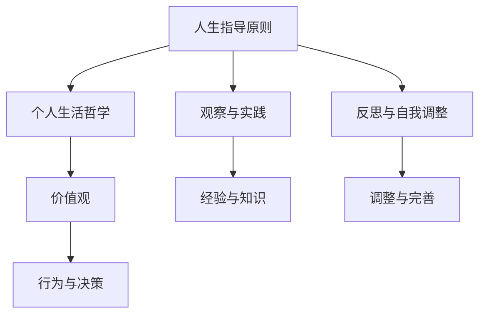

                 

### 第1章：引言：人生指导原则的重要性

#### 1.1 什么是人生指导原则？

**定义**：人生指导原则是一系列准则，用来指导我们在生活的各个方面做出决策和行为。它们是一套适用于不同情境的普遍性指导方针，帮助我们应对日常生活中的各种挑战。

**必要性**：随着社会的快速发展，人们面临着越来越多的选择和压力。没有明确的指导原则，我们可能会迷失方向，无法有效地处理复杂的问题。人生指导原则为我们提供了一个清晰的目标和价值观，使我们能够在不确定和变化的环境中保持平衡和稳健。

#### 1.2 个人生活哲学的定义与构成

**个人生活哲学的概念**：个人生活哲学是指个人对生活的理解、信念和价值观的体系。它是我们在面对世界和自我时形成的思维方式和行为准则。

**核心要素**：

1. **价值观**：价值观是对道德、伦理和信仰的信念，影响我们的行为和决策。例如，诚信、责任感和善良是我们生活中重要的价值观。
2. **信念**：信念是我们对某些事情的坚定信仰，例如对科学的信仰、对自由和正义的信念。
3. **目标**：目标是我们追求的长远愿景，它为我们提供了方向和动力。
4. **原则**：原则是我们认为正确的行为准则，例如尊重他人、公正和诚实。

#### 1.3 研究背景

在现代社会，个人生活哲学的重要性日益凸显。随着信息爆炸和价值观多元化，人们需要更加明确自己的价值观和信念，以应对复杂多变的环境。此外，随着人们年龄的增长，对生活的理解和认识也在不断变化。因此，制定一套适合自己的生活哲学，可以帮助我们在不同的人生阶段保持清晰和坚定，从而更好地应对各种挑战。

### 总结

本章介绍了人生指导原则的重要性以及个人生活哲学的概念和构成。下一章我们将深入探讨核心概念之间的联系，并使用表格和流程图来展示这些概念之间的关系。这将为我们理解个人生活哲学的构建提供更加清晰和直观的视角。

### 第2章：核心概念与联系

在了解了人生指导原则和个人生活哲学的基本概念之后，我们需要深入探讨这些核心概念之间的关系。本章节将列出关键概念，并使用表格和Mermaid流程图来展示它们之间的联系。

#### 2.1 关键概念表格

首先，我们列出几个关键概念，并简要定义它们：

| 概念                | 定义                                                         |
|---------------------|--------------------------------------------------------------|
| 人生指导原则       | 指导我们做出决策和行为的准则。                             |
| 个人生活哲学       | 个人对生活的理解、信念和价值观的体系。                     |
| 观察与实践         | 通过观察外界和亲身实践来获取经验和知识。                   |
| 反思与自我调整     | 通过反思过去的经历和当前的情况来调整个人的生活哲学。     |
| 价值观              | 对道德、伦理和信仰的信念，影响个人的行为和决策。          |

#### 2.2 概念关系图

为了更直观地展示这些概念之间的关系，我们使用Mermaid流程图来构建一个概念关系图：

在这个关系图中，我们可以看到：

- **人生指导原则**是核心，它直接关联到**个人生活哲学**。
- **观察与实践**和**反思与自我调整**是构建个人生活哲学的两个重要途径，它们相互影响，并与**经验与知识**和**调整与完善**紧密相关。
- **价值观**是个人生活哲学的基础，它直接影响**行为与决策**。

### 总结

通过列出关键概念和构建关系图，我们更清晰地理解了人生指导原则、个人生活哲学以及其他相关概念之间的联系。这些核心概念相互交织，共同构成了我们的思维方式和行为准则。在下一章中，我们将详细探讨如何通过观察、实践、反思和价值观塑造来构建个人的生活哲学。

### 第3章：构建个人生活哲学

构建个人生活哲学是一个复杂而深入的过程，它涉及多个步骤，包括观察、实践、反思和价值观塑造。在这一章节中，我们将详细探讨每个步骤的具体方法和重要性。

#### 3.1 观察与理解

**观察的重要性**：

观察是构建个人生活哲学的第一步，它是获取知识和理解世界的基础。通过观察，我们可以收集到大量的信息，这些信息将成为我们思考和决策的依据。

**如何进行有效观察？**：

1. **主动观察**：主动地寻找和关注生活中的各种现象和细节。不要仅仅停留在表面，而要深入思考背后的原因和机制。
2. **多元化视角**：从不同的角度和视角进行观察，以获得更全面的信息。这有助于我们避免片面和主观的偏见。
3. **记录与反思**：在观察过程中，记录下自己的感受和想法。这些记录将帮助我们在之后的反思阶段更好地理解和分析。

**案例**：

例如，在职场中，我们可以观察同事的工作方式、管理风格以及公司的运营机制。通过这些观察，我们可以学习到如何更有效地与他人合作、如何处理复杂的问题，以及如何在一个组织中实现个人价值。

#### 3.2 实践与行动

**实践的重要性**：

实践是观察的延伸和深化，它是将观察到的知识转化为行动的过程。通过实践，我们可以将理论应用于实际，从而验证和丰富我们的知识体系。

**如何将观察转化为行动？**：

1. **制定行动计划**：在观察后，根据收集到的信息制定具体的行动计划。这些计划应该明确、可行，并且具有可执行性。
2. **逐步实施**：将大目标分解为小步骤，逐步实施。这样可以避免因为目标过于宏大而导致的挫败感。
3. **反思与调整**：在实践过程中，不断反思和调整行动计划。根据实际情况的变化，及时调整策略和方法。

**案例**：

比如，在学习编程的过程中，我们可以通过完成各种编程任务来实践所学的知识。每次完成任务后，都要反思自己的代码是否高效、逻辑是否清晰，并从他人的反馈中学习和改进。

#### 3.3 反思与自我调整

**反思的作用**：

反思是构建个人生活哲学的重要步骤，它有助于我们深入思考自己的行为和决策，并从中学习和成长。

**如何进行有效的反思？**：

1. **定期回顾**：定期回顾自己的行为和决策，包括成功的经验和失败的教训。
2. **深入思考**：不仅要看到表面的结果，更要深入思考背后的原因和影响。
3. **寻求反馈**：向他人请教，获取他们的意见和建议。这样可以更全面地了解自己的行为和决策。

**案例**：

例如，在个人职业发展中，我们可以定期回顾自己的工作表现，思考哪些方面做得好，哪些方面需要改进。同时，也可以向同事或上司请教，了解他们对自己的看法和建议。

#### 3.4 价值观塑造

**价值观的重要性**：

价值观是我们行为的准则，它决定了我们在面对选择和挑战时的态度和行动。一个清晰的价值观可以帮助我们做出正确的决策，并在复杂的环境中保持平衡。

**如何塑造个人价值观？**：

1. **反思和自我认知**：通过反思自己的行为和决策，了解自己的价值观和信念。
2. **学习和借鉴**：从书籍、电影、他人经历中学习和借鉴价值观。
3. **实践与检验**：将价值观应用于实际生活中，通过实践来检验和强化它们。

**案例**：

比如，我们可以通过阅读关于道德和伦理的书籍来了解不同的价值观，并通过日常生活中的行为来实践这些价值观，如诚信、尊重和责任感。

### 总结

通过观察、实践、反思和价值观塑造，我们可以逐步构建出个人的生活哲学。这个过程不仅需要时间的积累，也需要不断的努力和自我反省。在下一章中，我们将探讨如何将这些原则应用到不同的生活阶段，以及在决策和面对挑战时如何运用这些原则。

### 第4章：人生指导原则的应用

构建出个人生活哲学后，我们需要将其应用到实际生活中，以便在各个阶段都能做出明智的决策和应对各种挑战。本章节将探讨在不同人生阶段如何应用指导原则，以及如何在决策和面对挑战时运用这些原则。

#### 4.1 在不同人生阶段的指导

**青年时期**：

在青年时期，我们通常面临着学业、职业选择和人际关系等多方面的挑战。人生指导原则可以帮助我们：

1. **学业规划**：明确自己的学习目标和兴趣，制定合理的学业计划，并坚持执行。
2. **职业选择**：根据自己的价值观和兴趣选择合适的职业道路，避免盲目跟风。
3. **人际关系**：学会尊重他人、倾听和沟通，建立和谐的人际关系。

**中年时期**：

中年时期，我们可能面临着家庭、工作和个人发展等多重压力。人生指导原则在这一阶段可以帮助我们：

1. **家庭管理**：平衡工作和家庭，关注家庭成员的需求，建立和谐的家庭关系。
2. **职业发展**：持续学习，提升自己的专业技能和管理能力，追求职业上的成长。
3. **个人发展**：保持好奇心和求知欲，不断探索和尝试新的领域，保持内心的活力。

**晚年时期**：

晚年时期，我们可能面临退休、健康和家庭关系等新的挑战。人生指导原则在这一阶段可以帮助我们：

1. **退休规划**：提前规划退休生活，确保财务安全和健康保障。
2. **健康维护**：注重身体健康，积极参与体育锻炼和社交活动。
3. **家庭关系**：加强与子女和孙子女的沟通，享受天伦之乐。

#### 4.2 决策与挑战中的原则应用

**决策中的原则应用**：

在做出决策时，我们可以将人生指导原则作为参考，具体方法如下：

1. **明确目标**：首先明确决策的目标，确保决策的方向与个人生活哲学一致。
2. **权衡利弊**：对每个选项进行全面的利弊分析，考虑其对个人价值观和生活目标的影响。
3. **咨询他人**：向信任的人请教意见，从不同的视角考虑问题。
4. **果断决策**：在充分考虑各种因素后，果断做出决策，并准备好承担相应的后果。

**面对挑战时的原则应用**：

面对挑战时，我们可以运用人生指导原则来应对：

1. **保持冷静**：在压力下保持冷静，理性分析问题，避免冲动行为。
2. **寻求解决方案**：积极寻找解决问题的方法，而不是逃避或放弃。
3. **反思与调整**：在解决问题后，反思过程中的得失，以便在未来的挑战中做得更好。
4. **价值观指导**：在面对道德和伦理问题时，坚持自己的价值观，做出符合道德原则的决策。

**案例**：

例如，在职业发展面临重大决策时，我们可以根据自己的人生指导原则来分析每个选项的利弊，考虑其对家庭和职业目标的影响。在面临职场挑战时，我们可以运用冷静和解决方案寻找的原则来应对困难，同时坚持诚信和责任感的价值观。

### 总结

通过在不同人生阶段应用人生指导原则，我们可以在决策和面对挑战时更加明智和有效。这些原则不仅帮助我们实现个人目标，还帮助我们保持内心的平衡和稳定。在下一章中，我们将探讨实践和反思在指导原则应用中的重要性，以及如何通过持续实践和反思来不断完善个人的生活哲学。

### 第5章：实践与反思

实践与反思是构建个人生活哲学的重要步骤，它们相辅相成，共同推动我们不断成长和进步。本章节将详细介绍实践的重要性、反思的方法，以及如何在实践中不断调整和完善个人的生活哲学。

#### 5.1 实践的重要性

**实践中的体验与成长**：

实践是检验理论的唯一标准。通过实践，我们可以将理论知识应用到实际中，从而获得真正的经验和技能。这些经验和技能不仅丰富我们的知识体系，还培养我们的能力，使我们在面对实际问题时更加自信和从容。

**实践与理论的关系**：

实践是理论的基础，理论是实践的指南。理论知识为我们提供了理解和分析问题的框架，而实践则是将这些理论应用于实际，从而验证和完善理论。在实践中，我们可能会遇到各种困难和挑战，这些挑战将迫使我们思考和解决问题，从而提高我们的能力和智慧。

**案例**：

例如，在编程学习中，理论学习是了解编程语言和算法的基础，而实践则是通过编写代码来应用这些知识。在编写代码的过程中，我们可能会遇到语法错误、逻辑漏洞等问题，通过解决这些问题，我们不仅巩固了理论知识，还提高了编程能力。

#### 5.2 反思与自我调整

**反思的作用**：

反思是成长的重要环节，它使我们能够从经验中学习，避免重复错误。通过反思，我们可以：

1. **发现不足**：识别自己在实践中的不足和错误，了解自己需要改进的地方。
2. **总结经验**：总结成功和失败的原因，提炼出有效的经验和教训。
3. **提升能力**：通过反思，我们能够不断提高自己的能力和智慧，从而更好地应对未来的挑战。

**如何进行有效的反思？**：

1. **定期回顾**：定期回顾自己的行为和决策，包括成功和失败的经历。
2. **深入思考**：不仅要看到表面的结果，更要深入分析背后的原因和影响。
3. **记录与总结**：将反思的过程和结果记录下来，形成文字或图表，以便日后查阅和总结。
4. **寻求反馈**：向他人请教，获取他们的意见和建议，从不同的视角看待问题。

**案例**：

例如，在工作结束后，我们可以回顾自己的工作表现，分析哪些方面做得好，哪些方面需要改进。通过记录这些反思，我们可以逐步完善自己的工作方法，提高工作效率和质量。

#### 5.3 实践与反思的结合

**实践与反思的结合**：

实践和反思是相互依赖的，只有在实践中进行反思，我们才能真正理解自己的行为和决策。同样，只有通过反思，我们才能更好地实践和应用我们的知识。

**如何将反思应用于实践？**：

1. **制定改进计划**：根据反思的结果，制定具体的改进计划，明确改进的目标和方法。
2. **逐步实施**：将改进计划分解为小步骤，逐步实施，并在实施过程中不断反思和调整。
3. **持续实践**：将反思和改进应用到日常实践中，不断积累经验和技能。

**案例**：

例如，在编程学习中，通过反思，我们发现自己在算法设计上存在一些问题。接下来，我们可以制定一个改进计划，通过学习更高效的算法设计和优化策略，逐步提升自己的编程能力。

### 总结

实践和反思是构建个人生活哲学的重要组成部分。通过实践，我们可以将理论知识应用到实际中，培养解决问题的能力。通过反思，我们可以总结经验，发现不足，并不断调整和完善个人的生活哲学。在下一章中，我们将探讨如何明确个人价值观和生活目标，并将它们融入个人的生活哲学中。

### 第6章：明确价值观与生活目标

在构建个人生活哲学的过程中，明确价值观和生活目标是至关重要的。价值观是我们行为的准则，而生活目标是我们的前进方向。本章节将探讨如何确定个人的价值观和生活目标，并讨论如何将它们融入个人的生活哲学中。

#### 6.1 价值观的重要性

价值观是我们对道德、伦理和信仰的信念，它决定了我们的行为和决策。一个清晰的价值观可以帮助我们：

1. **做出明智的决策**：在面临选择时，我们可以根据价值观来判断哪些选择是正确的。
2. **保持内心的平衡**：在面对困难和挑战时，价值观可以为我们提供精神支持，帮助我们保持冷静和坚定。
3. **建立人际关系**：与他人的互动中，价值观可以帮助我们建立共同的理解和信任。

**如何确定个人价值观？**：

1. **自我反思**：通过反思自己的行为和决策，了解自己在不同情境下表现出的价值观。
2. **学习借鉴**：阅读有关道德和伦理的书籍，了解不同的价值观，从中汲取灵感。
3. **咨询他人**：向信任的朋友和家人请教，了解他们如何看待价值观，并从中获得不同的视角。

**案例**：

例如，通过自我反思，我们发现自己在工作中重视诚信和责任感。阅读有关道德哲学的书籍后，我们更深入地理解了这些价值观的重要性，并在日常生活中积极践行。

#### 6.2 生活目标的重要性

生活目标是我们在人生中追求的愿景和方向。明确生活目标可以帮助我们：

1. **集中精力**：将时间和精力集中在实现目标上，从而提高效率和成果。
2. **提供动力**：生活目标可以激发我们的内在动力，让我们在面对困难时保持积极和坚定。
3. **实现个人价值**：通过实现生活目标，我们可以实现个人的价值和成就感。

**如何确定个人生活目标？**：

1. **自我探索**：通过尝试不同的活动和领域，了解自己的兴趣和激情。
2. **长期规划**：将长期目标分解为短期目标，逐步实现。
3. **设定优先级**：根据自己的价值观和实际情况，确定哪些目标是最重要和最紧急的。

**案例**：

例如，我们可能希望成为一名优秀的程序员。为了实现这个目标，我们可以设定短期目标，如学习新的编程语言、参加编程比赛，并逐步实现这些目标。

#### 6.3 将价值观和生活目标融入生活哲学

**价值观和生活目标与生活哲学的关系**：

价值观和生活目标是个人生活哲学的核心组成部分。生活哲学是我们对生活的理解、信念和价值观的体系，它决定了我们的行为和决策。将价值观和生活目标融入生活哲学中，可以帮助我们：

1. **保持一致性**：在生活的各个方面都遵循相同的价值观和目标，从而实现个人的一致性和完整性。
2. **增强动力**：价值观和生活目标可以作为我们前进的动力，激励我们不断追求更高的成就。
3. **提高生活质量**：通过明确和实现生活目标，我们可以过上更有意义、更有质量的生活。

**如何将价值观和生活目标融入生活哲学？**：

1. **明确价值观和生活目标**：首先明确自己的价值观和生活目标，确保它们与个人的生活哲学一致。
2. **制定行动计划**：将价值观和生活目标转化为具体的行动计划，确保它们能够实际执行。
3. **持续反思和调整**：定期反思自己的价值观和生活目标，并根据实际情况进行调整，以保持与生活哲学的一致性。

**案例**：

例如，我们可能将“持续学习”作为生活目标，并在日常生活中坚持学习新的知识和技能。在这个过程中，我们不断反思自己的学习方法和效果，并根据反馈进行调整，以实现持续学习的目标。

### 总结

明确个人价值观和生活目标是构建个人生活哲学的重要步骤。通过自我反思和学习借鉴，我们可以确定自己的价值观，并通过长期规划和行动计划的制定，实现个人生活目标。在下一章中，我们将探讨成长与持续学习的重要性，以及如何通过持续学习和自我提升来强化个人的生活哲学。

### 第7章：成长与持续学习

在构建个人生活哲学的过程中，成长和持续学习是不可或缺的要素。它们不仅帮助我们在知识和技能上不断提升，还使我们在面对挑战和变化时更加从容和自信。本章节将探讨成长的重要性，以及如何通过持续学习和自我提升来强化个人的生活哲学。

#### 7.1 成长的意义

**成长的意义**：

成长不仅仅是指年龄的增长，更是指在知识、技能和人格等方面的不断提升。成长的重要性体现在以下几个方面：

1. **提高竞争力**：在快速变化的社会中，不断学习和成长是保持竞争力的关键。通过提升自己的知识和技能，我们可以更好地适应和应对职场和生活中的各种挑战。
2. **增强自信心**：通过不断地学习和实践，我们可以积累更多的经验和成功案例，从而增强自信心，更加自信地面对未来的挑战。
3. **实现个人价值**：成长使我们能够更好地发掘自己的潜力，实现个人的价值和目标。

**成长与个人生活哲学的关系**：

成长是个人生活哲学的核心组成部分。一个坚定的生活哲学不仅帮助我们明确目标和价值观，还激励我们不断追求成长和进步。通过成长，我们可以更好地理解和践行自己的价值观，从而实现个人生活哲学的完善。

#### 7.2 持续学习的方法

**持续学习的重要性**：

持续学习是成长的关键。它不仅可以帮助我们获取新的知识和技能，还可以培养我们的思维方式和解决问题的能力。以下是一些持续学习的方法：

1. **阅读**：阅读是获取知识的重要途径。通过阅读书籍、文章和报告，我们可以学习到各种领域的知识，拓宽自己的视野。
2. **参加课程和培训**：参加线上或线下的课程和培训，可以帮助我们系统地学习新的知识和技能。这不仅可以提高我们的专业能力，还可以帮助我们结识志同道合的人。
3. **实践**：将学到的知识应用到实际中，通过实践来检验和巩固所学。实践是学习的高级阶段，它可以使我们将理论知识转化为实际能力。

**案例**：

例如，一个程序员可以通过阅读技术书籍和参加编程课程来学习新的编程语言和框架。然后，通过实际编写代码来应用这些知识，从而不断提升自己的编程能力。

#### 7.3 自我提升的策略

**自我提升的策略**：

自我提升是成长的重要部分。以下是一些自我提升的策略：

1. **设定目标**：明确自己的成长目标，并制定具体的行动计划。这样可以帮助我们有针对性地进行学习和提升。
2. **反思与反馈**：定期反思自己的学习和成长过程，并从他人那里获取反馈。这可以帮助我们了解自己的优点和不足，从而有针对性地进行改进。
3. **培养习惯**：养成良好的学习习惯和生活习惯，如定期阅读、坚持锻炼、保持良好的作息时间等。这些习惯可以帮助我们更好地保持学习的动力和状态。

**案例**：

例如，我们可以设定一个目标，每周阅读一本技术书籍，并制定一个详细的阅读计划。在阅读过程中，我们不仅要理解书中的内容，还要通过实践来应用所学知识。同时，我们可以定期反思自己的学习效果，并根据反馈进行调整。

#### 7.4 成长与生活哲学的结合

**成长与生活哲学的结合**：

成长与生活哲学是相辅相成的。通过成长，我们可以更好地理解和践行自己的生活哲学；而通过生活哲学的指导，我们可以更有方向和动力地追求成长。以下是一些结合的方法：

1. **价值观驱动**：以自己的价值观为指导，选择适合自己的学习方向和目标。这样可以帮助我们确保成长的过程与个人生活哲学一致。
2. **持续反思**：在成长过程中，定期反思自己的价值观和目标，确保它们与个人的生活哲学相符。通过反思，我们可以及时调整和修正自己的方向。
3. **平衡与取舍**：在追求成长的过程中，我们需要平衡个人兴趣、职业目标和家庭责任等。通过合理规划和取舍，我们可以确保在成长的同时，也能兼顾其他方面的生活。

**案例**：

例如，一个职业人士可能将“持续学习”和“家庭幸福”作为自己的价值观。在追求职业成长的过程中，他会设定具体的学习目标和职业发展计划，并通过平衡工作和家庭时间，确保两者都能得到充分关注。

### 总结

成长和持续学习是构建个人生活哲学的重要部分。通过不断学习和自我提升，我们可以更好地理解和践行自己的价值观，实现个人生活哲学的目标。在下一章中，我们将总结本文的主要内容，并给出一些实用的小结和注意事项。

### 总结与展望

在本章中，我们详细探讨了制定人生指导原则和构建个人生活哲学的重要性和方法。通过观察、实践、反思和价值观塑造，我们可以逐步构建出符合自己特点和生活需求的生活哲学。这一哲学不仅指导我们在生活中做出明智的决策，还能帮助我们应对各种挑战和变化。

#### 小结：

1. **人生指导原则**：是指导我们做出决策和行为的准则，有助于我们在复杂和不确定的环境中保持方向和平衡。
2. **个人生活哲学**：是个人对生活的理解、信念和价值观的体系，决定了我们的行为和决策。
3. **价值观与目标**：是个人生活哲学的核心，明确了我们的信念和追求，为生活提供了方向和动力。
4. **成长与学习**：是提升自我、实现生活目标的关键，通过持续学习和反思，我们可以不断完善个人的生活哲学。

#### 注意事项：

1. **定期反思**：定期对自己的行为和决策进行反思，确保它们与个人生活哲学一致。
2. **持续学习**：保持对知识和技能的渴望，不断学习和提升自己。
3. **平衡与取舍**：在追求成长的过程中，注意平衡个人兴趣、职业目标和家庭责任，确保各方面都能得到关注。

#### 拓展阅读：

- **《智慧的觉醒》：** 罗伯特·舒勒著，探讨了个人成长和自我实现的哲学。
- **《原则》：** 雷·达利欧著，提供了实现个人和职业成功的原则和方法。
- **《深度工作》：** 卡尔·纽波特著，介绍了如何在当今信息爆炸的时代保持专注和高效。

通过本文的探讨，我们希望能为读者提供一些有价值的思考和实践方法，帮助大家更好地理解人生指导原则和个人生活哲学的重要性，并逐步构建出属于自己的生活哲学。在未来的道路上，愿我们都能坚定信念，不断成长，过上充实而有意义的生活。

### 作者信息

**作者：AI天才研究院/AI Genius Institute & 禅与计算机程序设计艺术 /Zen And The Art of Computer Programming**

AI天才研究院致力于推动人工智能技术的创新和应用，培养下一代人工智能领域的专家。同时，我们的《禅与计算机程序设计艺术》系列书籍，为程序员提供了深入浅出的编程哲学和智慧。希望本文能为读者带来启发和帮助，一同探索人工智能与生活的奇妙结合。让我们共同追求智慧与技术的完美融合，创造更美好的未来。

