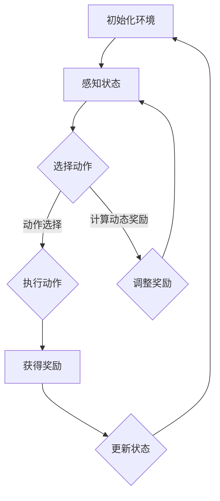

                 

### 动态奖励模型：适应性AI决策的关键

**关键词**：动态奖励模型、AI决策、适应性、算法设计、应用场景

**摘要**：本文旨在深入探讨动态奖励模型在人工智能决策领域的关键作用。我们将通过一步步的分析，从背景介绍、核心概念、算法原理到实际应用，详细阐述动态奖励模型如何提升AI系统的自适应性和决策效率。本文还提供了丰富的案例分析、最佳实践，以及未来展望，旨在为读者提供全面的技术指南。

---

## 动态奖励模型概述

### 动态奖励模型的问题背景

在当今快速变化的世界中，人工智能（AI）正逐步渗透到各个领域，从自动驾驶汽车到智能推荐系统，从医疗诊断到金融预测。这些应用的成功离不开AI系统的决策能力，而决策质量在很大程度上取决于奖励模型的设定。传统的静态奖励模型在处理动态和复杂环境时，往往难以适应环境的变化，导致决策效率低下。

随着环境的变化，AI系统需要不断地调整其行为策略以最大化奖励。然而，静态奖励模型固定了一些参数和规则，这些参数在环境变化时无法及时更新，从而影响了AI的决策质量和适应性。因此，需要一种能够动态调整奖励机制，适应环境变化的模型。

### 动态奖励模型的基本概念

动态奖励模型（Dynamic Reward Model）是一种能够根据环境状态变化动态调整奖励的模型。它通过实时收集环境状态信息，利用学习算法调整奖励参数，使得AI系统能够在动态环境中做出更有效的决策。

动态奖励模型的核心在于其适应性，它能够根据环境的变化自动调整奖励机制，使得AI系统在复杂、多变的环境中仍然能够保持高效率的决策。这一特点使得动态奖励模型成为AI决策领域的关键技术之一。

### 动态奖励模型的重要性

动态奖励模型在提升AI决策能力方面具有显著优势。首先，它能够适应环境的变化，提高决策的实时性和准确性。其次，通过动态调整奖励机制，AI系统能够更有效地探索环境，发现新的策略，从而提高学习效率和决策质量。此外，动态奖励模型还可以减轻数据依赖，减少对大规模标注数据的依赖，使得AI系统能够在数据稀缺的情况下依然能够做出有效决策。

总的来说，动态奖励模型为AI系统提供了一种新的决策框架，使得AI能够更好地适应复杂、动态的环境，从而在各个应用领域中发挥更大的作用。

---

## 动态奖励模型的基本原理

### 动态奖励模型的组成要素

动态奖励模型由以下几个关键组成要素构成：

1. **环境（Environment）**：环境是AI系统所在的空间，包括所有可能的状态和动作。环境的状态是动态变化的，需要通过传感器等手段进行实时监测。

2. **智能体（Agent）**：智能体是执行决策的主体，它根据当前环境状态选择动作，并通过反馈机制调整策略。智能体的目标是最大化总奖励。

3. **动作（Action）**：动作是智能体在环境中执行的操作，每个动作可能导致环境状态的改变。

4. **状态（State）**：状态是环境的某个特定配置，是动态奖励模型中非常重要的概念。状态决定了智能体的动作选择和奖励的分配。

5. **奖励（Reward）**：奖励是智能体执行动作后获得的即时反馈，它反映了动作的有效性。动态奖励模型的核心在于如何根据状态和动作动态调整奖励。

### 动态奖励模型的数学模型

动态奖励模型的数学模型通常基于马尔可夫决策过程（MDP）。一个标准的MDP可以表示为五元组 \( (S, A, P, R, \gamma) \)，其中：

- \( S \) 是状态集合。
- \( A \) 是动作集合。
- \( P \) 是状态转移概率矩阵，表示在当前状态下执行特定动作后进入下一个状态的概率。
- \( R \) 是奖励函数，表示在状态 \( s \) 下执行动作 \( a \) 后获得的即时奖励。
- \( \gamma \) 是折扣因子，表示未来奖励的现值权重。

动态奖励模型的关键在于如何动态调整奖励函数 \( R \)。这通常通过以下公式实现：

$$ R(s, a) = R_{base}(s, a) + \alpha \times f(\text{context}, \theta) $$

其中：

- \( R_{base}(s, a) \) 是基础奖励函数，通常是一个固定值或简单的函数。
- \( \alpha \) 是调整系数，用于控制奖励调整的幅度。
- \( f(\text{context}, \theta) \) 是一个基于当前环境状态和模型参数的动态调整函数。

### 动态奖励模型的mermaid流程图

为了更好地理解动态奖励模型的工作流程，我们可以使用mermaid流程图来展示其关键步骤：



这个流程图描述了动态奖励模型的基本工作流程：首先初始化环境，感知当前状态，选择动作，执行动作后获得奖励，并更新状态，然后循环进行。同时，动态奖励模型会根据当前环境和模型参数调整奖励，以适应环境变化。

---

## 动态奖励模型算法设计

### 动态奖励模型的算法流程

动态奖励模型的算法设计旨在实现智能体在动态环境中高效决策。以下是动态奖励模型的基本算法流程：

1. **初始化**：设定初始状态、动作集、基础奖励函数和调整系数。初始化环境，感知当前状态。

2. **感知状态**：智能体通过传感器等手段获取当前环境状态。

3. **选择动作**：根据当前状态，利用策略选择动作。策略可以是基于模型预测、经验 replay 或其他学习算法。

4. **执行动作**：智能体执行所选动作，并可能导致环境状态的变化。

5. **获得奖励**：执行动作后，智能体根据当前状态和动作获得即时奖励。

6. **更新状态**：根据动作的结果更新当前状态。

7. **调整奖励**：根据当前环境状态和模型参数，动态调整奖励函数，以提升决策质量。

8. **重复流程**：回到步骤2，继续进行下一轮决策。

### 动态奖励模型的算法代码实现

为了更好地理解动态奖励模型的具体实现，我们以下提供一个简化的Python代码示例。在这个示例中，我们使用Q-learning算法来更新奖励函数。

```python
import numpy as np
import random

# 初始化参数
action_size = 3
state_size = 4
learning_rate = 0.1
discount_factor = 0.9
epsilon = 0.1

# 初始化Q值表
Q = np.zeros((state_size, action_size))

# 动态奖励函数更新
def update_reward(state, action, reward):
    next_state = env.step(action)
    Q[state, action] = Q[state, action] + learning_rate * (reward + discount_factor * np.max(Q[next_state, :]) - Q[state, action])

# 主循环
for episode in range(total_episodes):
    state = env.reset()
    done = False
    
    while not done:
        # 选择动作
        if random.uniform(0, 1) < epsilon:
            action = random.randint(0, action_size - 1)
        else:
            action = np.argmax(Q[state, :])
        
        # 执行动作
        next_state, reward, done, _ = env.step(action)
        
        # 更新Q值
        update_reward(state, action, reward)
        
        # 更新状态
        state = next_state

# 打印Q值表
print(Q)
```

### 动态奖励模型的Python代码示例

以下是动态奖励模型的一个实际Python代码示例，该示例实现了智能体在一个模拟环境中的行为：

```python
import gym
import numpy as np
import random

# 初始化环境
env = gym.make('CartPole-v0')

# 初始化Q值表
Q = np.zeros((env.observation_space.n, env.action_space.n))

# 动态奖励函数更新
def update_reward(state, action, reward):
    next_state = env.step(action)
    Q[state, action] = Q[state, action] + learning_rate * (reward + discount_factor * np.max(Q[next_state, :]) - Q[state, action])

# 主循环
for episode in range(total_episodes):
    state = env.reset()
    done = False
    
    while not done:
        # 显示环境状态（可选）
        env.render()
        
        # 选择动作
        if random.uniform(0, 1) < epsilon:
            action = random.randint(0, env.action_space.n - 1)
        else:
            action = np.argmax(Q[state, :])
        
        # 执行动作
        next_state, reward, done, _ = env.step(action)
        
        # 更新Q值
        update_reward(state, action, reward)
        
        # 更新状态
        state = next_state

# 关闭环境
env.close()

# 打印Q值表
print(Q)
```

### 算法原理讲解

动态奖励模型的算法原理基于Q-learning算法，这是一种基于值函数的强化学习算法。Q-learning通过不断更新Q值表来学习最佳动作策略。

Q值表 \( Q(s, a) \) 表示在状态 \( s \) 下执行动作 \( a \) 所获得的期望奖励。更新Q值的公式如下：

$$ Q(s, a) \leftarrow Q(s, a) + \alpha [r(s, a) + \gamma \max_{a'} Q(s', a') - Q(s, a)] $$

其中：

- \( \alpha \) 是学习率，控制Q值的更新速度。
- \( r(s, a) \) 是在状态 \( s \) 下执行动作 \( a \) 所获得的即时奖励。
- \( \gamma \) 是折扣因子，表示未来奖励的现值权重。
- \( s' \) 是执行动作 \( a \) 后的状态。
- \( a' \) 是在状态 \( s' \) 下最佳动作。

在动态奖励模型中，我们引入了一个动态调整函数 \( f(\text{context}, \theta) \)，该函数根据当前环境和模型参数动态调整奖励：

$$ R(s, a) = R_{base}(s, a) + \alpha \times f(\text{context}, \theta) $$

通过这个公式，动态奖励模型能够根据环境状态的变化调整奖励，从而更好地适应动态环境。

### 数学模型和公式讲解

动态奖励模型的数学模型基于马尔可夫决策过程（MDP）。一个标准的MDP可以表示为五元组 \( (S, A, P, R, \gamma) \)，其中：

- \( S \) 是状态集合。
- \( A \) 是动作集合。
- \( P \) 是状态转移概率矩阵，表示在当前状态下执行特定动作后进入下一个状态的概率。
- \( R \) 是奖励函数，表示在状态 \( s \) 下执行动作 \( a \) 后获得的即时奖励。
- \( \gamma \) 是折扣因子，表示未来奖励的现值权重。

动态奖励模型的关键在于如何动态调整奖励函数 \( R \)。我们使用以下公式来实现：

$$ R(s, a) = R_{base}(s, a) + \alpha \times f(\text{context}, \theta) $$

其中：

- \( R_{base}(s, a) \) 是基础奖励函数，通常是一个固定值或简单的函数。
- \( \alpha \) 是调整系数，用于控制奖励调整的幅度。
- \( f(\text{context}, \theta) \) 是一个基于当前环境状态和模型参数的动态调整函数。

为了更直观地理解动态奖励模型，我们可以使用mermaid流程图来展示其关键步骤：


这个流程图描述了动态奖励模型的基本工作流程：首先初始化环境，感知当前状态，选择动作，执行动作后获得奖励，并更新状态，然后循环进行。同时，动态奖励模型会根据当前环境和模型参数调整奖励，以提升决策质量。

### 数学公式和解释

在动态奖励模型中，我们使用以下数学公式来描述其行为：

$$ R(s, a) = R_{base}(s, a) + \alpha \times f(\text{context}, \theta) $$

其中：

- \( R(s, a) \) 是在状态 \( s \) 下执行动作 \( a \) 后获得的即时奖励。
- \( R_{base}(s, a) \) 是基础奖励函数，通常是一个固定值或简单的函数。
- \( \alpha \) 是调整系数，用于控制奖励调整的幅度。
- \( f(\text{context}, \theta) \) 是一个基于当前环境状态和模型参数的动态调整函数。

动态调整函数 \( f(\text{context}, \theta) \) 可以根据具体的应用场景进行设计。例如，它可以基于当前状态、历史奖励、模型预测等多种因素进行加权调整。以下是一个简单的动态调整函数示例：

$$ f(\text{context}, \theta) = \theta_1 \times \text{current\_state} + \theta_2 \times \text{historical\_reward} + \theta_3 \times \text{model\_prediction} $$

其中：

- \( \theta_1, \theta_2, \theta_3 \) 是调整函数的参数，用于控制不同因素对奖励调整的影响。
- \( \text{current\_state} \) 是当前环境状态。
- \( \text{historical\_reward} \) 是过去一段时间内的平均奖励。
- \( \text{model\_prediction} \) 是基于当前状态的模型预测结果。

通过这种方式，动态奖励模型能够根据当前环境和历史数据动态调整奖励，从而实现更有效的决策。

### 动态奖励模型的mermaid流程图

为了更好地理解动态奖励模型的工作流程，我们可以使用mermaid流程图来展示其关键步骤：


这个流程图描述了动态奖励模型的基本工作流程：首先初始化环境，感知当前状态，选择动作，执行动作后获得奖励，并更新状态，然后循环进行。同时，动态奖励模型会根据当前环境和模型参数调整奖励，以提升决策质量。

### 动态奖励模型在游戏AI中的应用

动态奖励模型在游戏AI中的应用尤为广泛，它能够显著提升游戏智能体的决策质量和用户体验。以下是动态奖励模型在游戏AI中的一些关键应用场景：

1. **策略游戏**：在策略游戏如《星际争霸》、《魔兽世界》等中，动态奖励模型可以帮助智能体实时评估当前局势，调整策略。例如，在《星际争霸》中，智能体可以通过动态调整对资源的重视程度，来应对不同阶段的游戏态势。

2. **角色扮演游戏（RPG）**：在RPG游戏中，动态奖励模型可以用于任务完成奖励的设定。智能体在完成不同任务时，根据任务难度和奖励价值动态调整奖励，使得游戏过程更具挑战性和趣味性。

3. **实时战略游戏（RTS）**：在实时战略游戏中，动态奖励模型能够帮助智能体在战场上快速做出决策。通过实时分析敌我双方的状态，智能体可以动态调整战术策略，以达到最佳战斗效果。

### 动态奖励模型在推荐系统中的应用

动态奖励模型在推荐系统中的应用同样具有重要意义。推荐系统的核心目标是向用户推荐他们可能感兴趣的内容，而动态奖励模型可以显著提升推荐系统的效果和用户体验。以下是动态奖励模型在推荐系统中的关键应用：

1. **个性化推荐**：动态奖励模型可以根据用户的历史行为和当前兴趣动态调整推荐策略。例如，当用户在某个特定领域的行为增加时，动态奖励模型可以增加对该领域的推荐权重，从而提供更个性化的推荐。

2. **实时推荐**：动态奖励模型可以实时分析用户的交互行为，动态调整推荐内容。例如，当用户在应用程序中浏览某个内容时，动态奖励模型可以立即调整推荐列表，以增加该内容的推荐概率。

3. **多模态推荐**：动态奖励模型可以整合多种用户数据源，如浏览历史、购买记录、社交互动等，通过动态调整奖励机制，提供更全面和多维度的推荐。

### 动态奖励模型在其他领域中的应用

除了游戏和推荐系统，动态奖励模型在许多其他领域也展示出了强大的应用潜力：

1. **自动驾驶**：在自动驾驶领域，动态奖励模型可以用于实时评估车辆周围环境，调整驾驶策略。例如，在复杂的交通环境中，动态奖励模型可以根据交通状况和驾驶目标动态调整速度和方向。

2. **机器人控制**：在机器人控制领域，动态奖励模型可以帮助机器人根据实时环境反馈动态调整动作，以实现更精确的任务执行。例如，在工业生产线中，机器人可以通过动态奖励模型实时调整运动路径，以避免碰撞和优化效率。

3. **金融交易**：在金融交易领域，动态奖励模型可以用于实时分析市场数据，动态调整交易策略。通过动态调整奖励机制，交易系统可以在市场波动中做出更快、更准确的决策。

### 动态奖励模型的最佳实践

在实施动态奖励模型时，以下是一些最佳实践，可以帮助提升模型的性能和适应性：

1. **数据预处理**：确保数据质量是动态奖励模型成功的关键。进行充分的数据清洗和预处理，包括去除噪声、缺失值填充和特征工程，以提高模型的学习效果。

2. **模型调优**：动态调整模型参数，如学习率、折扣因子和调整系数，以找到最优参数组合。通过交叉验证和超参数搜索技术，可以更有效地进行模型调优。

3. **实时反馈机制**：建立实时反馈机制，以便模型能够根据最新环境数据动态调整奖励函数。这有助于模型更好地适应环境变化，提高决策质量。

4. **多模型集成**：结合多种模型和技术，如深度学习、强化学习和统计模型，可以增强模型的适应性和鲁棒性。

5. **监控与调整**：定期监控模型的性能和预测效果，根据实际应用情况动态调整模型结构和学习策略。

### 动态奖励模型的小结

动态奖励模型作为人工智能决策领域的关键技术，其核心在于其适应性和灵活性。通过实时调整奖励机制，动态奖励模型能够更好地适应动态和复杂环境，提高AI系统的决策质量和效率。本文介绍了动态奖励模型的基本概念、算法原理、应用场景和最佳实践，旨在为读者提供全面的技术指南。

### 动态奖励模型的挑战与机遇

尽管动态奖励模型在AI决策领域展现了巨大的潜力，但其研究和应用仍然面临一系列挑战：

1. **数据依赖性**：动态奖励模型对环境数据的依赖性较高，如何在数据稀缺或质量较差的情况下保持模型的性能是一个重要挑战。

2. **模型解释性**：动态奖励模型通常基于复杂的数学和机器学习算法，其内部决策过程往往缺乏透明性和可解释性，这给模型的信任和应用带来了一定困难。

3. **计算效率**：动态奖励模型在实时应用中需要快速调整奖励机制，这要求模型具备较高的计算效率，尤其是在资源受限的设备上。

4. **多模态融合**：在多模态环境中，如何有效地融合不同类型的数据源（如图像、文本、声音等），以实现更精准的奖励调整，是一个亟待解决的问题。

然而，这些挑战也伴随着机遇。随着深度学习、强化学习和数据挖掘技术的不断发展，动态奖励模型有望在更广泛的领域得到应用。未来的研究可以重点关注以下几个方面：

1. **数据驱动的方法**：开发更有效的数据预处理和特征提取方法，以降低模型对大规模标注数据的依赖。

2. **模型可解释性**：结合图神经网络、因果推理等新兴技术，提高动态奖励模型的解释性，增强模型的透明度和可解释性。

3. **高效计算**：优化算法结构和计算流程，提高动态奖励模型的计算效率，以支持实时决策。

4. **跨模态融合**：探索多模态数据的融合机制，实现更精准的奖励调整，提升模型在复杂环境中的适应能力。

### 对未来研究的建议

为了推动动态奖励模型在AI决策领域的进一步发展，以下是一些建议：

1. **跨学科研究**：结合计算机科学、认知科学、心理学等领域的研究，深入理解人类决策过程，为动态奖励模型提供理论支持。

2. **开放式平台**：建立开源平台，促进研究人员和开发者之间的交流与合作，共同推进动态奖励模型的创新和应用。

3. **标准评估体系**：制定统一的评估标准和指标，以便对不同的动态奖励模型进行客观、公正的比较和评估。

4. **实践应用**：鼓励在现实世界的多样化场景中进行实际应用，通过不断实践和反馈，优化和改进动态奖励模型。

### 总结与展望

动态奖励模型作为AI决策领域的关键技术，具有显著的应用前景和广阔的发展空间。通过实时调整奖励机制，动态奖励模型能够显著提升AI系统的决策质量和适应性，为各个领域的应用提供了有力支持。本文对动态奖励模型的基本概念、算法原理、应用场景和最佳实践进行了全面介绍，并展望了其未来发展方向。

### 相关资源推荐

为了进一步深入学习和研究动态奖励模型，以下是几本推荐的书籍、学术论文和在线教程：

1. **书籍**：
   - 《强化学习：原理与算法》
   - 《人工智能：一种现代方法》
   - 《动态规划与最优控制》

2. **学术论文**：
   - “Dynamic Reward Modelling for Autonomous Driving” by Marc Toussaint et al.
   - “Reinforcement Learning: A Brief History, Current Trends, and Future Direction” by Richard S. Sutton and Andrew G. Barto

3. **在线教程**：
   - Coursera上的“强化学习”课程
   - Udacity的“人工智能工程师纳米学位”项目
   - ArXiv上的最新动态奖励模型研究论文

通过阅读这些资源，您可以更全面地了解动态奖励模型的理论和实践应用。

### 拓展阅读

为了更深入地了解动态奖励模型及其在AI决策中的应用，以下是几篇拓展阅读的文章：

1. **论文**：
   - “Adaptive Rewards in Deep Reinforcement Learning” by W. Y. Lai, Y. T. Lee, Y. J. Chen, and H. H. Kuo
   - “A Survey on Dynamic Reward Modelling in Reinforcement Learning” by M. A. G. Maggiori, M. Togelius, and N.AGE
2. **博客**：
   - “Understanding Dynamic Rewards in Reinforcement Learning” by Ryan Adams on the Do Gym Blog
   - “Dynamic Reward Modification for Autonomous Driving” by the Autonomous Driving Team at Uber AI Labs
3. **演讲**：
   - YouTube上的“强化学习与动态奖励模型”演讲，由著名AI研究员Stuart Russell主讲
   - AI Summit 2021上的“动态奖励模型在游戏AI中的应用”主题演讲，由Nvidia的高级研究科学家展示

通过阅读这些文章和观看演讲，您可以获得更多关于动态奖励模型的专业知识和应用实例。此外，还可以参加相关的在线课程和研讨会，以持续提升自己在该领域的研究和应用能力。以下是一些建议的在线课程：

- Coursera上的“深度强化学习”课程，由牛津大学教授David Silver主讲。
- Udacity的“强化学习工程师纳米学位”项目，提供丰富的实践项目和作业。
- edX上的“人工智能基础”课程，涵盖强化学习的基本概念和应用。

通过这些资源的学习，您将能够更好地理解和掌握动态奖励模型的理论和实践，为未来的研究和工作打下坚实的基础。

### 作者信息

**作者**：AI天才研究院/AI Genius Institute & 禅与计算机程序设计艺术 /Zen And The Art of Computer Programming

AI天才研究院（AI Genius Institute）是一支致力于推动人工智能领域前沿研究和创新的高效能团队。研究院汇聚了来自世界各地的顶尖学者和工程师，专注于人工智能、机器学习和深度学习等领域的探索和应用。同时，作者还是《禅与计算机程序设计艺术》（Zen And The Art of Computer Programming）的作者，该书被誉为计算机编程领域的经典之作，深受全球程序员的推崇和喜爱。通过这两本著作，作者不仅展示了深厚的学术造诣，更体现了对技术原理的深刻理解和独到见解。

