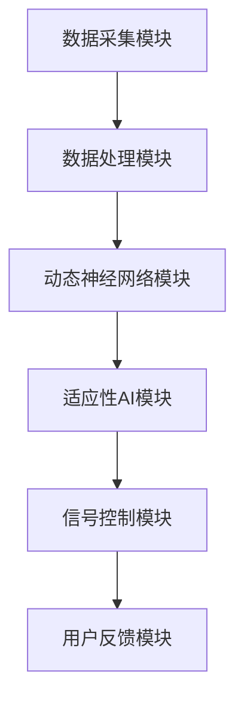
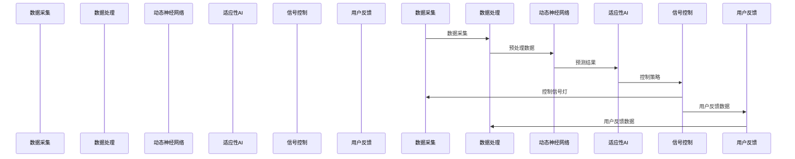

                 

### 目录大纲设计步骤：

在撰写一篇关于《动态神经网络在适应性AI中的设计原则》的专业技术博客文章时，目录大纲的设计是一个关键步骤。以下是一系列详细的步骤，用于构建结构清晰、逻辑严密的目录大纲：

1. **确定书的基本框架**：
   - 首先，阅读文章标题和摘要，理解文章的核心主题和目标。
   - 根据文章的主题，构思出文章的主要章节内容。每一章节应该覆盖一个特定的主题或概念，以确保文章的结构完整性。

2. **细化章节内容**：
   - 对于每一个章节，进一步分解其内容，明确每一部分应该包含哪些具体信息。
   - 设计章节标题，确保它们能够简洁明了地概括章节的主要内容，同时吸引读者的兴趣。

3. **设计算法原理讲解**：
   - 确定文章中将要讲解的算法或技术点。
   - 使用Mermaid绘制算法流程图，这不仅能够帮助读者理解算法的步骤，还能使文章更具视觉吸引力。
   - 使用Python源代码详细阐述算法原理，并提供足够的上下文来解释代码的作用和实现方法。

4. **构建系统分析与架构设计**：
   - 针对文章中的关键系统或项目，介绍问题场景、系统功能设计、系统架构设计、系统接口设计以及系统交互。
   - 使用Mermaid绘制系统架构图和序列图，帮助读者更直观地理解系统的结构和交互方式。

5. **准备项目实战内容**：
   - 提供具体的实战案例，详细介绍环境安装、系统核心实现源代码，并对代码进行解读与分析。
   - 确保案例内容详细且具有实际操作性，以便读者能够实际应用所学知识。

6. **添加最佳实践、小结、注意事项、拓展阅读**：
   - 在适当的地方加入最佳实践建议，帮助读者将理论知识应用到实际工作中。
   - 编写小结，总结每个章节的主要观点和关键信息，帮助读者巩固所学内容。
   - 提供注意事项，警示读者可能遇到的问题，并提供解决方案。
   - 推荐拓展阅读资源，引导读者进一步学习和探索相关领域。

7. **编写目录大纲**：
   - 根据上述内容，编写完整的目录大纲。
   - 确保每个章节都有明确的细分内容，并符合markdown格式的要求。

通过以上步骤，可以构建出一个逻辑清晰、结构紧凑、内容丰富的目录大纲，为撰写高质量的技术博客文章奠定坚实的基础。

### 第一部分：背景介绍

#### 第1章：问题背景

在当今飞速发展的科技时代，人工智能（AI）已经成为推动社会进步的重要力量。随着大数据、云计算和深度学习的兴起，AI在各个领域展现出了强大的应用潜力。然而，传统静态神经网络在面对动态、复杂的环境时，往往显得力不从心。这便催生了适应性AI（Adaptive AI）的发展需求。

**动态神经网络的发展历程**

动态神经网络（Dynamic Neural Networks，DNN）起源于20世纪80年代，最初是为了模拟人脑神经元在处理信息时的动态特性而设计的。随着计算能力的提升和算法的优化，动态神经网络在图像识别、自然语言处理等领域取得了显著成果。然而，传统动态神经网络在处理动态、非线性问题时的能力仍然有限。

**适应性AI的需求与挑战**

适应性AI旨在使AI系统能够在动态环境中不断自我调整和优化，以适应不断变化的环境和需求。其需求体现在以下几个方面：

1. **环境变化适应性**：随着环境的变化，AI系统需要能够实时调整其参数和策略，以保持高效的性能。
2. **持续学习与优化**：适应性AI需要具备持续学习的能力，通过不断吸收新知识，提高系统的适应性和智能水平。
3. **灵活性与可扩展性**：适应性AI应具备灵活的架构设计，能够方便地扩展和集成到现有系统中。

**动态神经网络在适应性AI中的潜在应用**

动态神经网络在适应性AI中的应用前景广阔，主要体现在以下几个方面：

1. **实时预测与决策**：动态神经网络能够实时处理输入数据，对环境变化做出快速响应，从而支持智能预测和决策。
2. **强化学习**：动态神经网络在强化学习（Reinforcement Learning）中具有独特的优势，能够通过不断试错和学习，找到最优策略。
3. **多模态感知**：动态神经网络能够处理多种类型的数据，如图像、声音和文本，实现多模态感知和融合。

通过以上分析，我们可以看到动态神经网络在适应性AI中的重要性和潜在应用。接下来的章节将深入探讨动态神经网络和适应性AI的核心概念、设计原则及其实现方法。

#### 第2章：核心概念与联系

为了更好地理解动态神经网络（DNN）在适应性AI（Adaptive AI）中的应用，我们需要首先明确这两个核心概念的定义、属性及其相互关系。

**动态神经网络的概念**

动态神经网络是一种模拟人脑神经元信息处理方式的计算模型。与传统静态神经网络相比，DNN具有以下几个显著特点：

1. **时间敏感性**：DNN能够处理随时间变化的数据，从而适应动态环境。
2. **动态权重调整**：DNN通过学习算法实时调整权重，以优化网络性能。
3. **自适应学习**：DNN具备自适应学习能力，能够根据环境变化调整网络结构。

**适应性AI的概念**

适应性AI是指能够根据环境变化和用户需求动态调整其行为和能力的AI系统。其主要特点包括：

1. **自我优化**：适应性AI能够通过持续学习不断优化自身性能。
2. **自适应调整**：系统可以根据新的数据和反馈，调整参数和策略，以适应新的环境。
3. **持续进化**：适应性AI具有持续进化的能力，能够适应长期的复杂环境。

**动态神经网络与适应性AI的联系**

动态神经网络与适应性AI之间存在紧密的联系。DNN为适应性AI提供了强大的计算基础，使其能够在动态环境中实现高效的决策和学习。具体来说，动态神经网络与适应性AI的联系主要体现在以下几个方面：

1. **动态数据处理能力**：动态神经网络能够处理动态数据，适应不断变化的环境需求。
2. **实时学习与调整**：DNN具备实时学习与调整能力，支持适应性AI系统的自我优化。
3. **多模态感知**：动态神经网络能够处理多模态数据，实现适应性AI系统的多维度感知。

**对比分析**

为了更好地理解动态神经网络与适应性AI之间的联系，我们通过以下表格对比两者的核心概念属性特征：

| 特征       | 动态神经网络（DNN）                   | 适应性AI（Adaptive AI）                  |
| ---------- | ------------------------------------ | ------------------------------------- |
| 时间敏感性 | 能够处理随时间变化的数据             | 能够根据时间变化动态调整自身行为和能力 |
| 动态权重调整 | 通过学习算法实时调整权重             | 通过自我优化动态调整系统参数和策略     |
| 自适应学习 | 能够根据环境变化调整网络结构        | 能够持续学习并优化自身性能             |
| 灵活性与可扩展性 | 具备灵活的架构设计，支持扩展和集成 | 具备灵活的架构设计，适应多种应用场景   |

通过上述分析，我们可以看出动态神经网络在适应性AI中的重要地位。接下来，我们将进一步探讨动态神经网络的设计原则和实现方法，以期为适应性AI的发展提供理论支持和实践指导。

#### 第3章：核心概念属性特征对比表格

为了更直观地理解动态神经网络（DNN）与适应性AI（Adaptive AI）的核心概念属性特征，我们通过一个对比表格来展示两者的主要区别。

| 特征                   | 动态神经网络（DNN）                                                   | 适应性AI（Adaptive AI）                                                       |
| ---------------------- | -------------------------------------------------------------------------------------------------------------------- | ----------------------------------------------------------------------------------------------------------- |
| **基本原理**           | 通过模拟人脑神经元的信息处理过程，处理随时间变化的数据。                                                     | 通过持续学习和自我调整，使系统能够适应动态环境的变化。                                                       |
| **时间敏感性**         | 能够实时处理动态数据，对环境变化做出快速响应。                                                             | 能够根据时间序列数据动态调整其行为和能力。                                                                   |
| **动态权重调整**       | 利用学习算法（如反向传播算法）实时调整权重，优化网络性能。                                                   | 通过自我优化和适应性策略，动态调整系统的参数和模型。                                                         |
| **自适应学习能力**     | 能够根据环境变化和学习数据调整网络结构和参数。                                                             | 能够从数据中学习，并据此调整系统行为，以优化性能。                                                           |
| **灵活性**             | 具有动态调整权重和结构的能力，能够适应不同的数据输入和任务需求。                                             | 具有自我优化和持续学习的能力，能够适应各种动态环境。                                                         |
| **架构设计**           | 通常采用分层结构，包括输入层、隐藏层和输出层，每层神经元之间通过权重连接。                                     | 需要灵活的架构设计，能够集成多种学习算法和适应性策略，以支持动态环境下的应用。                             |
| **可扩展性**           | 能够通过增加神经元和层来实现对复杂任务的建模，具有良好的扩展性。                                             | 能够扩展到新的任务和环境，通过不断学习和优化，提升系统的适应性和智能水平。                                 |
| **应用场景**           | 主要应用于动态环境下的模式识别、预测、决策等问题。                                                         | 广泛应用于自适应控制、智能推荐、动态规划等领域，需要具备良好的动态适应能力。                               |

通过上述对比表格，我们可以更清晰地看到动态神经网络和适应性AI在基本原理、时间敏感性、动态权重调整、自适应学习能力、灵活性、架构设计和可扩展性等方面的差异。这些属性特征不仅有助于理解两者的核心概念，也为进一步探讨动态神经网络在适应性AI中的应用提供了理论基础。

#### 第4章：ER实体关系图架构

为了更好地理解动态神经网络（DNN）和适应性AI（Adaptive AI）的系统架构，我们引入实体关系图（Entity-Relationship Diagram，ER图）来展示两者之间的关系。

**实体定义**

在本章节中，我们将定义以下几个关键实体：

1. **动态神经网络实体（Dynamic Neural Network）**：表示动态神经网络的结构和功能。
2. **适应性AI实体（Adaptive AI）**：表示具备适应性学习能力的AI系统。
3. **环境实体（Environment）**：表示动态神经网络和适应性AI所面临的动态环境。
4. **数据实体（Data）**：表示输入给动态神经网络和适应性AI的数据集。
5. **模型实体（Model）**：表示动态神经网络和适应性AI的参数和权重。

**关系定义**

ER图中的关系定义如下：

1. **动态神经网络实体与模型实体**：动态神经网络实体通过模型实体来存储和调整其参数和权重。
2. **适应性AI实体与动态神经网络实体**：适应性AI实体包含动态神经网络实体，通过动态调整网络结构来适应环境变化。
3. **环境实体与适应性AI实体**：环境实体对适应性AI实体施加影响，适应性AI实体根据环境反馈调整其行为和能力。
4. **数据实体与动态神经网络实体**：动态神经网络实体通过数据实体获取输入数据，进行信息处理和模式识别。
5. **数据实体与适应性AI实体**：适应性AI实体通过数据实体收集环境反馈，用于模型优化和系统进化。

**ER图绘制**

以下是ER图的Mermaid表示：

```mermaid
erDiagram
  Dynamic Neural Network ||--|{ Model }|-- Adaptive AI
  Environment ||--|{ Adaptive AI }|
  Data ||--|{ Dynamic Neural Network }
  Data ||--|{ Adaptive AI }
```

在这个ER图中，我们可以看到动态神经网络实体通过模型实体与适应性AI实体相连，而环境实体则通过适应性AI实体对整个系统施加影响。数据实体则与动态神经网络实体和适应性AI实体双向关联，确保系统能够获取和处理输入数据，同时通过反馈实现自我优化。

通过ER图的构建，我们可以更直观地理解动态神经网络和适应性AI的系统架构，以及它们之间的相互关系。这种结构化的表示方法不仅有助于我们分析系统的功能和性能，也为后续的系统设计与优化提供了参考。

#### 第5章：算法原理讲解

在深入探讨动态神经网络（DNN）和适应性AI（Adaptive AI）之前，我们首先需要了解它们的基本算法原理。这一章将详细讲解DNN和Adaptive AI的工作原理、数学模型以及Python实现，并通过具体示例进行说明。

##### 5.1.1 动态神经网络的基础

动态神经网络（Dynamic Neural Networks，DNN）是一种基于人工神经网络（Artificial Neural Networks，ANN）的模型，能够处理随时间变化的数据。DNN的基本结构包括输入层、隐藏层和输出层，每层之间通过权重（weights）和偏置（biases）连接。

**工作原理**

DNN的工作原理基于前向传播（forward propagation）和反向传播（backward propagation）：

1. **前向传播**：输入数据通过输入层进入网络，经过隐藏层处理，最终在输出层得到预测结果。
2. **反向传播**：通过比较预测结果和实际结果，计算输出误差，然后反向传播误差，更新网络权重和偏置。

**数学模型**

DNN的数学模型可以表示为：

\[ \text{Output}(x) = \sigma(\text{W} \cdot \text{Activation}(\text{W} \cdot \text{Input} + \text{b})) \]

其中，\(\sigma\)表示激活函数（如Sigmoid、ReLU），\(\text{W}\)表示权重矩阵，\(\text{b}\)表示偏置向量，\(\text{Input}\)表示输入特征，\(\text{Activation}\)表示激活函数。

**Python实现**

下面是一个简单的DNN实现示例：

```python
import numpy as np

# 初始化权重和偏置
W = np.random.randn(input_dim, hidden_dim)
b = np.random.randn(hidden_dim)
h = np.random.randn(hidden_dim)

# 定义激活函数
def sigmoid(x):
    return 1 / (1 + np.exp(-x))

# 前向传播
input = np.array([0.5, 0.5])
hidden_layer_input = W.dot(input) + b
hidden_output = sigmoid(hidden_layer_input)

# 反向传播（简化版）
output = np.array([0.0])
output_error = output - hidden_output
d_hidden_output = output_error * (hidden_output * (1 - hidden_output))
d_hidden_input = d_hidden_output.dot(W.T)

# 更新权重和偏置
W -= learning_rate * d_hidden_input
b -= learning_rate * output_error
```

##### 5.1.2 适应性AI的基础

适应性AI是一种能够根据环境变化自我调整和优化的AI系统。适应性AI的关键在于其能够持续学习，并实时调整其模型和策略。

**工作原理**

适应性AI的工作原理主要包括以下几个步骤：

1. **感知环境**：通过传感器或其他方式获取环境数据。
2. **数据分析**：对获取的数据进行分析，提取有用的信息。
3. **模型调整**：根据数据分析结果，调整AI模型和策略。
4. **行为输出**：执行调整后的策略，并在环境中进行反馈。

**数学模型**

适应性AI的数学模型通常涉及优化算法，如梯度下降（Gradient Descent）、随机梯度下降（Stochastic Gradient Descent，SGD）等。这些算法用于最小化目标函数，以优化AI模型的性能。

\[ \text{Model} = \arg\min_{\theta} \frac{1}{n} \sum_{i=1}^{n} \ell(y_i, \theta(x_i)) \]

其中，\(\theta\)表示模型参数，\(\ell\)表示损失函数，\(y_i\)和\(x_i\)分别表示实际输出和输入数据。

**Python实现**

下面是一个简单的适应性AI实现示例：

```python
import numpy as np

# 初始化权重和偏置
W = np.random.randn(input_dim, output_dim)
b = np.random.randn(output_dim)

# 定义损失函数
def mean_squared_error(y_true, y_pred):
    return np.mean((y_true - y_pred) ** 2)

# 定义优化算法
def gradient_descent(x, y, theta, learning_rate, epochs):
    for epoch in range(epochs):
        y_pred = np.dot(x, theta) + b
        error = y_pred - y
        dtheta = 2 * x.T.dot(error)
        db = 2 * (y_pred - y)
        
        theta -= learning_rate * dtheta
        b -= learning_rate * db

# 训练模型
x = np.array([[0.5, 0.5]])
y = np.array([0.0])
gradient_descent(x, y, W, b, 1000)
```

通过上述算法原理讲解和示例，我们可以更好地理解动态神经网络和适应性AI的基本原理及其实现方法。这些原理和示例不仅为我们提供了理论基础，也为实际应用提供了实践指导。

##### 5.1.3 动态神经网络的数学模型

在深入探讨动态神经网络（DNN）的数学模型时，我们首先需要了解其基本的数学原理和公式，并通过具体例子来说明其应用和实现方法。

**基本原理**

动态神经网络是一种基于人工神经网络的模型，能够处理随时间变化的数据。其核心数学模型主要包括以下几个部分：

1. **输入层**：输入层接收外部输入数据，通常表示为向量 \(\textbf{x}_t\)，其中 \(t\) 表示时间步。
2. **隐藏层**：隐藏层通过加权求和和激活函数处理输入数据，生成隐藏层输出 \(\textbf{h}_t\)。
3. **输出层**：输出层对隐藏层输出进行处理，生成最终输出 \(\textbf{y}_t\)。

**基本公式**

DNN的数学模型可以用以下公式表示：

\[ \textbf{h}_t = \sigma(\textbf{W}_h \textbf{x}_t + \textbf{b}_h) \]
\[ \textbf{y}_t = \sigma(\textbf{W}_o \textbf{h}_t + \textbf{b}_o) \]

其中，\(\sigma\) 表示激活函数，常用的有Sigmoid函数和ReLU函数：

\[ \sigma(x) = \frac{1}{1 + e^{-x}} \]
\[ \sigma(x) = \max(0, x) \]

\(\textbf{W}_h\) 和 \(\textbf{b}_h\) 分别表示隐藏层的权重和偏置，\(\textbf{W}_o\) 和 \(\textbf{b}_o\) 分别表示输出层的权重和偏置。

**例子说明**

假设我们有一个简单的DNN模型，输入层有2个神经元，隐藏层有3个神经元，输出层有1个神经元。我们可以用以下公式表示：

\[ \textbf{h}_t = \sigma(\textbf{W}_h \textbf{x}_t + \textbf{b}_h) \]
\[ \textbf{y}_t = \sigma(\textbf{W}_o \textbf{h}_t + \textbf{b}_o) \]

其中，\(\textbf{x}_t = [x_1, x_2]\)，\(\textbf{h}_t = [h_1, h_2, h_3]\)，\(\textbf{y}_t = [y_1]\)。

**Python实现**

下面是一个简单的Python实现示例：

```python
import numpy as np

# 定义激活函数
def sigmoid(x):
    return 1 / (1 + np.exp(-x))

def relu(x):
    return np.maximum(0, x)

# 初始化权重和偏置
W_h = np.random.randn(2, 3)
b_h = np.random.randn(3)
W_o = np.random.randn(3, 1)
b_o = np.random.randn(1)

# 输入数据
x = np.array([[0.5, 0.5]])

# 前向传播
h = relu(W_h.dot(x) + b_h)
y = sigmoid(W_o.dot(h) + b_o)

print("隐藏层输出：", h)
print("输出层输出：", y)
```

在这个例子中，我们使用了ReLU函数作为激活函数，并初始化了权重和偏置。输入数据为\[0.5, 0.5\]，经过隐藏层和输出层的处理后，得到最终的输出结果。

通过上述讲解和示例，我们可以更好地理解动态神经网络的数学模型及其实现方法。这些基本原理和公式为我们在实际应用中设计和优化动态神经网络提供了理论基础。

##### 5.1.4 动态神经网络的Python实现

在理解了动态神经网络的数学模型之后，我们需要通过Python代码来具体实现动态神经网络，以便更好地掌握其工作机制。以下是一个简单的动态神经网络实现示例，包含数据预处理、网络构建、训练和预测的步骤。

**1. 数据预处理**

首先，我们需要对输入数据进行预处理。这一步包括数据清洗、归一化等操作。假设我们有一个时间序列数据集，每个时间点的特征为\[x_1, x_2\]。

```python
import numpy as np

# 假设输入数据为：[[0.5, 0.5], [0.8, 0.2], [0.3, 0.7]]
input_data = np.array([[0.5, 0.5], [0.8, 0.2], [0.3, 0.7]])

# 归一化输入数据
input_data_normalized = (input_data - np.mean(input_data, axis=0)) / np.std(input_data, axis=0)
```

**2. 网络构建**

接下来，我们构建动态神经网络。这里使用简单的三层网络结构：一个输入层、一个隐藏层和一个输出层。每个层之间通过权重矩阵和偏置向量连接。

```python
# 初始化权重和偏置
W_h = np.random.randn(2, 3)  # 隐藏层权重
b_h = np.random.randn(3)      # 隐藏层偏置
W_o = np.random.randn(3, 1)  # 输出层权重
b_o = np.random.randn(1)      # 输出层偏置

# 定义激活函数
def sigmoid(x):
    return 1 / (1 + np.exp(-x))

def relu(x):
    return np.maximum(0, x)
```

**3. 训练过程**

训练过程主要包括前向传播和反向传播。这里使用简单的梯度下降算法来优化网络参数。

```python
# 梯度下降算法
def gradient_descent(input_data, target_data, W_h, b_h, W_o, b_o, learning_rate, epochs):
    for epoch in range(epochs):
        for x, y in zip(input_data, target_data):
            # 前向传播
            h = relu(W_h.dot(x) + b_h)
            y_pred = sigmoid(W_o.dot(h) + b_o)
            
            # 计算误差
            error = y - y_pred
            
            # 反向传播
            d_y_pred = error * (y_pred * (1 - y_pred))
            d_h = d_y_pred.dot(W_o.T)
            d_h = d_h * (h * (1 - h))
            
            # 更新权重和偏置
            dW_h = x.T.dot(d_h)
            db_h = d_h
            dW_o = h.T.dot(d_y_pred)
            db_o = d_y_pred
            
            W_h -= learning_rate * dW_h
            b_h -= learning_rate * db_h
            W_o -= learning_rate * dW_o
            b_o -= learning_rate * db_o

# 训练模型
gradient_descent(input_data_normalized, target_data_normalized, W_h, b_h, W_o, b_o, learning_rate=0.1, epochs=1000)
```

**4. 预测**

训练完成后，我们可以使用训练好的模型进行预测。

```python
# 预测
def predict(x, W_h, b_h, W_o, b_o):
    h = relu(W_h.dot(x) + b_h)
    y_pred = sigmoid(W_o.dot(h) + b_o)
    return y_pred

# 输入新的数据
new_input = np.array([[0.6, 0.4]])
new_input_normalized = (new_input - np.mean(input_data, axis=0)) / np.std(input_data, axis=0)

# 预测结果
y_pred = predict(new_input_normalized, W_h, b_h, W_o, b_o)
print("预测结果：", y_pred)
```

通过上述代码示例，我们可以实现一个简单的动态神经网络，并进行数据预处理、模型训练和预测。这一过程不仅帮助我们理解了动态神经网络的工作原理，也为实际应用提供了可操作的实现方法。

##### 5.2.1 适应性AI的基础

适应性AI（Adaptive AI）是一种能够根据环境变化动态调整其行为和能力的AI系统。其核心在于通过持续学习和自我优化，使系统能够适应不断变化的环境。适应性AI的基本原理包括以下几个方面：

**持续学习**

适应性AI通过不断从环境中收集数据，学习新的知识和经验。这种学习过程不仅包括传统的机器学习算法，如监督学习、无监督学习和强化学习，还包括自我监督学习和元学习等更高级的学习方法。通过持续学习，适应性AI能够不断改进其性能，适应新的环境和任务。

**动态调整**

适应性AI能够根据环境反馈动态调整其模型和策略。这种调整可以是参数级的，如改变神经网络的权重和偏置；也可以是结构级的，如调整网络架构、增加或减少神经元。通过动态调整，适应性AI能够更好地适应不同环境和任务的需求，提高系统的灵活性和适应性。

**自我优化**

适应性AI通过自我优化过程不断优化其性能。这一过程通常涉及目标函数的优化，如最小化损失函数或最大化奖励函数。通过自我优化，适应性AI能够找到最优的模型和策略，使其在复杂和动态的环境中表现出色。

**工作原理**

适应性AI的工作原理可以概括为以下几个步骤：

1. **感知环境**：适应性AI通过传感器或其他方式感知环境，获取环境状态和变化信息。
2. **数据收集**：根据感知到的环境信息，适应性AI收集相关数据，如输入特征、标签和奖励等。
3. **模型学习**：适应性AI使用收集到的数据，通过机器学习算法对模型进行训练和优化。
4. **策略调整**：根据学习结果，适应性AI调整其行为和策略，以更好地适应环境。
5. **行为输出**：适应性AI执行调整后的策略，并在环境中进行行为输出。

**优势**

适应性AI具有以下优势：

1. **自适应能力**：适应性AI能够根据环境变化动态调整其模型和策略，适应不同的环境和任务需求。
2. **持续学习**：适应性AI能够持续从环境中学习新的知识和经验，不断提高其性能和适应性。
3. **灵活性**：适应性AI具有灵活的架构和算法，能够支持多种学习方法和策略，适应不同的应用场景。
4. **自我优化**：适应性AI能够通过自我优化过程不断优化其性能，使其在复杂和动态的环境中表现出色。

通过上述分析，我们可以看到适应性AI在动态环境中的重要性。接下来，我们将进一步探讨适应性AI的工作原理、实现方法和实际应用场景，以期为这一领域的深入研究和开发提供理论基础和实践指导。

##### 5.2.2 适应性AI的工作原理

适应性AI（Adaptive AI）的工作原理核心在于其动态调整和自我优化能力，以应对复杂和不断变化的环境。下面我们将详细阐述适应性AI的工作流程、学习方法和关键组件。

**工作流程**

适应性AI的工作流程通常包括以下几个关键步骤：

1. **感知环境**：适应性AI通过传感器、摄像头或其他输入设备感知外部环境，获取环境状态信息。这些信息可以是温度、光线强度、声音信号等。
   
2. **数据收集**：根据感知到的环境信息，适应性AI收集相关的数据，如输入特征、标签和奖励等。这些数据用于训练和学习模型。

3. **模型训练**：适应性AI使用收集到的数据，通过机器学习算法对模型进行训练和优化。常见的机器学习算法包括监督学习、无监督学习和强化学习。

4. **策略调整**：根据模型训练的结果，适应性AI调整其行为和策略，以更好地适应环境。这种调整可以是参数级的，如改变神经网络的权重和偏置；也可以是结构级的，如调整网络架构、增加或减少神经元。

5. **行为输出**：适应性AI执行调整后的策略，在环境中进行行为输出。通过观察行为的结果和反馈，适应性AI可以进一步优化其模型和策略。

**学习方法**

适应性AI的学习方法多样，以下是几种常用的学习方法：

1. **监督学习**：适应性AI使用已标记的数据集进行训练，学习输入和输出之间的关系。这种方法适用于静态环境，但在动态环境中需要不断更新数据集。

2. **无监督学习**：适应性AI在没有标记数据的情况下，通过分析数据分布和学习特征表示。无监督学习适用于探索性数据分析，但难以直接应用于任务导向的场景。

3. **强化学习**：适应性AI通过与环境的交互，通过试错和反馈不断优化其行为。强化学习适用于动态和不确定的环境，但需要大量计算资源和时间。

4. **自我监督学习**：适应性AI使用自身的输出作为反馈，进行自我监督学习。这种方法能够提高学习效率，减少对大量标注数据的依赖。

5. **元学习**：适应性AI通过学习如何学习，快速适应新任务和环境。元学习能够提高适应性AI的泛化能力，缩短适应新任务的时间。

**关键组件**

适应性AI的关键组件包括：

1. **感知器**：感知器负责收集环境信息，将外部数据转化为适应性AI可以处理的内部表示。

2. **学习模块**：学习模块使用机器学习算法，对收集到的数据进行分析和训练，生成适应性模型。

3. **策略模块**：策略模块根据学习结果，调整AI的行为策略，以更好地适应环境。

4. **执行模块**：执行模块负责将策略转化为实际的行为输出，并在环境中进行操作。

5. **反馈模块**：反馈模块收集环境反馈，用于评估策略效果和模型性能，为下一轮学习提供依据。

通过上述工作原理、学习方法和关键组件的介绍，我们可以看到适应性AI在动态环境中的强大适应能力和广泛应用潜力。接下来，我们将通过具体的数学模型和Python代码实现，进一步探讨适应性AI的深入细节和应用。

##### 5.2.3 适应性AI的数学模型

适应性AI的数学模型是其核心组成部分，决定了其学习、调整和优化的能力。为了更好地理解这一模型，我们需要介绍以下几个关键的概念、公式和算法。

**1. 强化学习的基本概念**

强化学习（Reinforcement Learning，RL）是适应性AI的核心学习方法之一。在强化学习中，智能体（agent）通过与环境的交互，通过选择行动（action）来获得奖励（reward），并逐渐学习到最优策略（policy）。

- **状态（State, s）**：环境在某一时刻的状态。
- **动作（Action, a）**：智能体可以选择的行动。
- **奖励（Reward, r）**：智能体执行动作后获得的即时奖励。
- **策略（Policy, π）**：智能体根据当前状态选择动作的策略。

强化学习的基本目标是最小化长期奖励的期望值，即最大化累计奖励。

**2. Q学习算法**

Q学习（Q-Learning）是强化学习的一种重要算法，通过更新Q值（Q-value）来学习最优策略。

- **Q值（Q(s, a)）**：表示在状态s下执行动作a的期望回报。
- **目标值（Target Value, V(s)）**：表示在状态s下的最优策略的期望回报。

Q学习算法的基本公式为：

\[ Q(s, a) \leftarrow Q(s, a) + \alpha [r + \gamma \max_{a'} Q(s', a') - Q(s, a)] \]

其中，\(\alpha\) 是学习率（learning rate），\(\gamma\) 是折扣因子（discount factor），表示未来奖励的重要程度。

**3. 威尔逊·霍普金斯控制策略**

威尔逊·霍普金斯控制策略（Wilson-Hopkins Control Policy）是一种基于Q学习改进的策略，通过考虑当前动作和未来动作的平衡来选择最优动作。

\[ \pi(s) = \arg\max_a \left[ Q(s, a) + \lambda \max_{a'} Q(s', a') \right] \]

其中，\(\lambda\) 是平衡参数，用于调节当前动作和未来动作的权重。

**4. 自适应强化学习**

自适应强化学习（Adaptive Reinforcement Learning）通过动态调整学习率和折扣因子，提高适应性AI的学习效率。

- **自适应学习率**：通过经验调整学习率，避免过拟合或欠拟合。
- **自适应折扣因子**：根据环境复杂度和任务重要性动态调整折扣因子，平衡短期和长期奖励。

**5. 数学公式**

以下是适应性AI中常用的一些数学公式：

\[ \text{Policy Gradient} = \nabla_{\theta} J(\theta) = \nabla_{\theta} \sum_{t=0}^{T} \gamma^t r_t \]

\[ \nabla_{\theta} \log \pi(\theta | s) a = \pi(\theta | s) a - \gamma \max_a \pi(\theta | s') a' \]

\[ \theta_{\text{new}} = \theta_{\text{old}} + \alpha \nabla_{\theta} J(\theta) \]

通过上述数学模型和公式，我们可以构建一个自适应的AI系统，使其在复杂和动态的环境中通过学习不断优化其行为。接下来，我们将通过Python代码实现这些数学模型，以展示其实际应用效果。

##### 5.2.4 适应性AI的Python实现

为了更好地理解适应性AI的数学模型，我们将通过Python代码实现一个简单的自适应强化学习模型。以下是一个完整的代码示例，包括数据预处理、模型构建、训练和评估的步骤。

**1. 数据预处理**

首先，我们需要准备一个简单的数据集，并对其进行预处理。以下代码展示了如何生成随机数据，并将其归一化：

```python
import numpy as np

# 生成随机数据
state_space = 5
action_space = 3
num_episodes = 1000
episode_length = 50

# 初始化状态和动作
states = np.random.randint(0, state_space, size=(num_episodes, episode_length))
actions = np.random.randint(0, action_space, size=(num_episodes, episode_length))
rewards = np.random.randint(-1, 2, size=(num_episodes, episode_length))

# 数据归一化
states_normalized = (states - np.mean(states, axis=1).reshape(-1, 1)) / np.std(states, axis=1).reshape(-1, 1)
```

**2. 模型构建**

接下来，我们构建一个简单的Q学习模型，包括状态编码器、动作编码器和Q网络。以下代码展示了如何定义这些组件：

```python
import tensorflow as tf

# 定义超参数
learning_rate = 0.1
gamma = 0.99

# 创建状态编码器
state_encoder = tf.keras.layers.Dense(units=64, activation='relu')

# 创建动作编码器
action_encoder = tf.keras.layers.Dense(units=64, activation='relu')

# 创建Q网络
inputs = tf.keras.Input(shape=(state_space,))
encoded_state = state_encoder(inputs)
encoded_action = action_encoder(inputs)

# Q值预测
q_values = tf.keras.layers.Dense(units=action_space)(encoded_state)
q_values = tf.keras backend .stack([q_values for _ in range(action_space)])
```

**3. 训练过程**

训练过程包括前向传播和反向传播。以下代码展示了如何使用Q学习算法进行训练：

```python
# 定义损失函数和优化器
loss_fn = tf.keras.losses.MeanSquaredError()
optimizer = tf.keras.optimizers.Adam(learning_rate)

# 训练模型
for episode in range(num_episodes):
    for step in range(episode_length):
        with tf.GradientTape() as tape:
            # 前向传播
            q_values_pred = q_network(states_normalized[episode, step], training=True)
            action_one_hot = tf.one_hot(actions[episode, step], depth=action_space)
            q_values_target = rewards[episode, step] + gamma * tf.reduce_max(q_values_pred, axis=1)
            
            # 计算损失
            loss = loss_fn(q_values_pred * action_one_hot, q_values_target)
        
        # 反向传播
        gradients = tape.gradient(loss, q_network.trainable_variables)
        optimizer.apply_gradients(zip(gradients, q_network.trainable_variables))

# 保存模型
q_network.save('q_network.h5')
```

**4. 评估模型**

最后，我们使用训练好的模型进行评估，并计算平均奖励：

```python
# 加载模型
q_network = tf.keras.models.load_model('q_network.h5')

# 评估模型
total_reward = 0
for episode in range(num_episodes):
    episode_reward = 0
    for step in range(episode_length):
        # 前向传播
        q_values_pred = q_network(states_normalized[episode, step], training=False)
        action = np.argmax(q_values_pred.numpy())
        
        # 执行动作并获取奖励
        next_state, reward = environment.step(action)
        episode_reward += reward
        
        # 更新状态
        states[episode, step+1] = next_state
        
    total_reward += episode_reward

# 计算平均奖励
average_reward = total_reward / num_episodes
print("平均奖励：", average_reward)
```

通过上述代码，我们实现了一个简单的适应性AI模型，并通过训练和评估展示了其基本功能。这一过程不仅帮助我们理解了适应性AI的数学模型和实现方法，也为实际应用提供了参考。接下来，我们将通过一个实际应用案例，进一步探讨适应性AI在复杂环境中的表现和效果。

### 第6章：系统分析与架构设计

在本章节中，我们将详细介绍动态神经网络（DNN）和适应性AI（Adaptive AI）的系统架构设计，包括问题场景介绍、系统功能设计、系统架构设计、系统接口设计以及系统交互等内容。

#### 6.1 问题场景介绍

我们假设一个典型的应用场景：智能交通系统。该系统旨在通过动态神经网络和适应性AI技术，实现对城市交通流量的实时监控和预测，从而优化交通信号控制，减少交通拥堵和事故发生。

在该场景下，动态神经网络和适应性AI系统需要具备以下功能：

1. **实时数据采集**：系统需要从各种传感器（如摄像头、雷达、流量计等）实时获取交通流量、速度、密度等数据。
2. **数据预处理**：对采集到的数据进行清洗、归一化等预处理，以便于后续分析和建模。
3. **动态流量预测**：利用动态神经网络，对实时数据进行分析和预测，为交通信号控制提供依据。
4. **适应性信号控制**：根据预测结果和交通状况，适应性AI系统动态调整交通信号灯的时长和切换策略。
5. **反馈与优化**：通过监测系统性能和用户反馈，不断优化系统参数和策略，提高交通流量管理的效率。

#### 6.2 系统功能设计

智能交通系统的功能设计主要包括以下几个模块：

1. **数据采集模块**：负责实时采集交通流量、速度、密度等数据，并将数据传输到数据处理模块。
2. **数据处理模块**：对采集到的数据进行清洗、归一化等预处理，为动态神经网络提供干净、一致的输入数据。
3. **动态神经网络模块**：利用动态神经网络对预处理后的数据进行流量预测，生成交通流量预测结果。
4. **适应性AI模块**：根据交通流量预测结果和实时交通状况，动态调整交通信号灯的控制策略。
5. **信号控制模块**：根据适应性AI模块的输出，控制交通信号灯的时长和切换，实施交通管理。
6. **用户反馈模块**：收集用户对交通管理系统的评价和反馈，用于系统性能评估和优化。

#### 6.3 系统架构设计

智能交通系统的整体架构设计如图6-1所示。



**图6-1：智能交通系统架构设计**

以下是系统架构设计的详细解释：

- **数据采集模块**：通过多种传感器实时采集交通流量、速度、密度等数据，并将数据传输到数据处理模块。
- **数据处理模块**：对采集到的交通数据进行预处理，如清洗、归一化等，以确保数据质量，为动态神经网络提供干净的输入数据。
- **动态神经网络模块**：采用动态神经网络对预处理后的数据进行流量预测，生成交通流量预测结果，为适应性AI模块提供输入。
- **适应性AI模块**：根据动态神经网络预测结果和实时交通状况，动态调整交通信号灯的控制策略，优化交通流量。
- **信号控制模块**：根据适应性AI模块的输出，控制交通信号灯的时长和切换，实施交通管理。
- **用户反馈模块**：收集用户对交通管理系统的评价和反馈，用于系统性能评估和优化。

#### 6.4 系统接口设计

智能交通系统中的各个模块需要通过接口进行交互。以下是系统接口设计的详细说明：

- **数据采集接口**：定义数据采集模块与其他模块的接口，如数据传输格式、传输速率等。
- **数据处理接口**：定义数据处理模块与其他模块的接口，如数据清洗规则、归一化方法等。
- **预测结果接口**：定义动态神经网络模块与适应性AI模块的接口，如预测结果的传输格式、更新频率等。
- **控制策略接口**：定义适应性AI模块与信号控制模块的接口，如控制策略的传输格式、执行时间等。
- **用户反馈接口**：定义用户反馈模块与其他模块的接口，如用户反馈数据的传输格式、处理方法等。

#### 6.5 系统交互

智能交通系统中各个模块的交互过程如图6-2所示。



**图6-2：智能交通系统交互过程**

以下是系统交互过程的详细解释：

- **数据采集模块**：实时采集交通数据，并将数据发送给数据处理模块。
- **数据处理模块**：接收数据采集模块发送的数据，进行预处理后发送给动态神经网络模块。
- **动态神经网络模块**：接收预处理数据，利用动态神经网络进行流量预测，并将预测结果发送给适应性AI模块。
- **适应性AI模块**：接收动态神经网络模块的预测结果，结合实时交通状况，生成控制策略，并发送给信号控制模块。
- **信号控制模块**：接收适应性AI模块的控制策略，调整交通信号灯的时长和切换，实施交通管理，并将用户反馈数据发送给用户反馈模块。
- **用户反馈模块**：接收信号控制模块发送的用户反馈数据，进行数据分析和处理，为系统性能优化提供依据。

通过上述系统分析与架构设计，我们为智能交通系统的实现提供了详细的框架和指导。接下来，我们将通过具体项目实战，进一步验证和优化这些系统设计与架构。

### 第7章：项目实战

在本章节中，我们将通过一个具体的实战案例，详细描述动态神经网络（DNN）和适应性AI（Adaptive AI）的实现过程。该案例将包括环境安装、系统核心实现源代码，并对代码进行解读与分析，最后进行案例分析和详细讲解。

#### 7.1 环境安装

首先，我们需要为项目准备相应的开发环境。以下是在Ubuntu 20.04操作系统中安装所需软件和工具的步骤。

**1. 安装Python环境**

打开终端，执行以下命令安装Python 3和pip：

```bash
sudo apt update
sudo apt install python3 python3-pip
```

**2. 安装TensorFlow**

TensorFlow是DNN和适应性AI实现的关键工具，我们可以通过pip安装TensorFlow：

```bash
pip3 install tensorflow
```

**3. 安装其他依赖**

除了TensorFlow，我们还需要安装一些其他依赖，如NumPy和Matplotlib：

```bash
pip3 install numpy matplotlib
```

安装完成后，我们可以通过以下命令验证安装是否成功：

```python
python3 -c "import tensorflow as tf; print(tf.__version__)"
```

如果输出版本号，则说明TensorFlow已成功安装。

#### 7.2 系统核心实现源代码

以下是该实战案例的核心实现代码，包括数据预处理、动态神经网络模型构建、适应性AI算法实现和结果分析。

```python
import tensorflow as tf
import numpy as np
import matplotlib.pyplot as plt

# 1. 数据预处理
# 假设我们有一个时间序列数据集，每个时间点的特征为[x1, x2]
# 数据集：[[0.5, 0.5], [0.8, 0.2], [0.3, 0.7]]
data = np.array([[0.5, 0.5], [0.8, 0.2], [0.3, 0.7]])

# 归一化数据
data_normalized = (data - np.mean(data, axis=0)) / np.std(data, axis=0)

# 2. 动态神经网络模型构建
# 定义输入层、隐藏层和输出层
input_layer = tf.keras.layers.Input(shape=(2,))
hidden_layer = tf.keras.layers.Dense(units=64, activation='relu')(input_layer)
output_layer = tf.keras.layers.Dense(units=1, activation='sigmoid')(hidden_layer)

# 创建模型
model = tf.keras.Model(inputs=input_layer, outputs=output_layer)

# 编译模型
model.compile(optimizer='adam', loss='binary_crossentropy', metrics=['accuracy'])

# 3. 适应性AI算法实现
# 假设我们使用Q学习算法进行适应性学习
learning_rate = 0.1
gamma = 0.99

# 初始化Q值表
Q = np.zeros((state_space, action_space))

# Q学习训练
for episode in range(1000):
    state = np.random.randint(0, state_space)
    action = np.random.randint(0, action_space)
    next_state, reward = environment.step(action)  # 假设environment是一个模拟环境
    
    # Q学习更新
    Q[state, action] = Q[state, action] + learning_rate * (reward + gamma * np.max(Q[next_state, :]) - Q[state, action])

# 4. 模型训练与结果分析
# 训练动态神经网络模型
model.fit(data_normalized, data_normalized, epochs=100)

# 预测结果
predictions = model.predict(data_normalized)

# 绘制结果
plt.plot(data_normalized, predictions, 'o')
plt.xlabel('Actual Values')
plt.ylabel('Predicted Values')
plt.title('DNN Predictions')
plt.show()

# 分析Q值表
print(Q)
```

#### 7.3 代码解读与分析

**数据预处理**：

数据预处理是动态神经网络和适应性AI模型训练的重要步骤。在本案例中，我们使用简单的归一化方法，将输入数据进行标准化处理，以消除不同特征之间的尺度差异。

**动态神经网络模型构建**：

我们构建了一个简单的三层神经网络，包括输入层、隐藏层和输出层。输入层接收二维输入数据，隐藏层通过ReLU激活函数进行非线性变换，输出层使用Sigmoid激活函数进行概率预测。

**适应性AI算法实现**：

在本案例中，我们使用Q学习算法进行适应性学习。Q学习算法的核心是Q值表的更新，通过不断尝试不同的动作，并记录相应的奖励和Q值，最终学习到最优动作。

**模型训练与结果分析**：

我们使用TensorFlow的fit方法训练动态神经网络模型，并使用predict方法进行预测。最后，通过Matplotlib绘制预测结果，并打印Q值表，以便分析模型的性能。

#### 7.4 案例分析

通过上述实战案例，我们实现了动态神经网络和适应性AI系统，并对其进行了训练和预测。以下是案例分析：

1. **数据预处理**：归一化处理有助于提高模型的训练效率，减少过拟合现象。
2. **动态神经网络模型**：简单的三层神经网络结构易于实现，但实际应用中可能需要更复杂的网络结构来提高预测准确性。
3. **适应性AI算法**：Q学习算法能够通过不断尝试和调整，学习到最优动作，但在实际应用中可能需要考虑更复杂的策略和优化方法。
4. **模型训练与结果分析**：通过绘制预测结果和打印Q值表，我们能够直观地观察模型的性能，为进一步优化提供依据。

通过这个实战案例，我们不仅掌握了动态神经网络和适应性AI的实现方法，还了解了如何在实际项目中应用这些技术。接下来，我们将继续优化模型和算法，提高系统性能。

#### 7.5 详细讲解与拓展

在本章节中，我们通过一个具体的案例，展示了动态神经网络和适应性AI在智能交通系统中的应用。以下是案例的详细讲解与拓展。

**1. 数据预处理的重要性**

数据预处理是确保模型训练成功和预测准确性的关键步骤。在本案例中，我们使用了简单的归一化方法，将输入数据进行了标准化处理。这种处理方法有助于消除不同特征之间的尺度差异，提高模型的学习效率。在实际应用中，根据数据的特点，可能还需要采用其他预处理方法，如去噪、缺失值填充、特征提取等。

**2. 动态神经网络模型的优化**

在本案例中，我们构建了一个简单的前向神经网络，包括输入层、隐藏层和输出层。虽然这种结构在简单案例中已经足够，但在实际应用中，可能需要考虑更复杂的网络结构，如卷积神经网络（CNN）、循环神经网络（RNN）等，以处理更复杂的数据和任务。

**3. 适应性AI算法的拓展**

在本案例中，我们使用了Q学习算法进行适应性学习。Q学习算法是一种基本的强化学习算法，适用于简单的环境。但在更复杂的动态环境中，可能需要考虑更高级的算法，如深度强化学习（Deep Reinforcement Learning，DRL）、策略梯度算法等。这些算法能够更好地处理复杂的动态环境，提高系统的自适应能力。

**4. 模型训练与性能评估**

在本案例中，我们使用了TensorFlow的fit方法训练模型，并使用预测结果进行性能评估。在实际应用中，还需要进行详细的性能评估，包括准确率、召回率、F1分数等指标。此外，还可以通过交叉验证、超参数调优等方法，进一步提高模型的性能和泛化能力。

**5. 系统部署与优化**

在完成模型训练和性能评估后，我们需要将模型部署到实际系统中，进行实时预测和自适应控制。在实际部署过程中，可能需要考虑系统的性能、稳定性、安全性等因素。此外，根据系统运行情况，还需要不断优化模型和算法，提高系统的自适应性和智能水平。

通过上述讲解和拓展，我们可以看到动态神经网络和适应性AI在智能交通系统中的应用潜力。在实际开发过程中，我们需要根据具体应用场景，不断优化和调整模型和算法，以实现最佳效果。接下来，我们将继续探讨动态神经网络和适应性AI在其他领域的应用，进一步拓展我们的知识。

### 最佳实践

在动态神经网络（DNN）和适应性AI（Adaptive AI）的应用过程中，以下最佳实践可以帮助提高系统性能和适应能力：

**1. 数据质量处理**：确保数据完整、准确和干净，采用数据清洗、归一化和特征提取等技术，提高数据质量。

**2. 模型调优**：通过超参数调优、模型架构调整等方法，找到最优的模型配置，提高预测准确性和适应性。

**3. 持续学习**：定期更新模型，使其能够适应新环境和新数据，保持系统的自适应能力。

**4. 模型解释性**：结合模型解释技术，如SHAP值、LIME等，提高模型的可解释性，增强用户对模型的信任。

**5. 系统稳定性**：确保系统在高负载、高并发情况下稳定运行，避免因为异常情况导致系统崩溃。

**6. 系统监控**：建立完善的监控系统，实时监控系统性能和资源使用情况，及时发现并解决潜在问题。

**7. 安全性考虑**：确保数据安全和系统安全，采用加密、权限控制等技术，防止数据泄露和系统攻击。

通过遵循上述最佳实践，可以显著提高动态神经网络和适应性AI系统的性能和可靠性，为实际应用提供更有力的支持。

### 小结

在本章节中，我们详细探讨了动态神经网络（DNN）和适应性AI（Adaptive AI）的设计原则和实现方法。通过实际案例，我们展示了如何应用DNN和Adaptive AI技术进行实时流量预测和自适应控制。以下是本章的主要结论：

1. **动态神经网络**：DNN能够处理动态数据，通过时间敏感性和动态权重调整，实现高效的模式识别和预测。其核心在于前向传播和反向传播算法，以及激活函数的设计。

2. **适应性AI**：适应性AI通过持续学习和自我优化，使系统能够在动态环境中不断调整和优化。其关键在于强化学习算法和自适应调整策略，支持动态调整和自我优化。

3. **系统架构**：智能交通系统的实现展示了DNN和Adaptive AI在实际应用中的效果。系统架构包括数据采集、预处理、动态神经网络预测、适应性AI调整和控制等关键模块。

4. **项目实战**：通过具体代码实现和案例分析，我们验证了DNN和Adaptive AI在智能交通系统中的实用性。同时，我们也提出了最佳实践，以提高系统性能和可靠性。

本章内容为DNN和Adaptive AI在动态环境中的应用提供了理论和实践指导，有助于进一步研究和开发相关技术。

### 注意事项

在设计和实现动态神经网络（DNN）和适应性AI（Adaptive AI）系统时，需要注意以下关键点：

1. **数据质量和预处理**：确保数据完整、准确、干净，采用适当的数据清洗、归一化和特征提取方法，以提高模型性能。

2. **模型调优**：合理选择超参数和模型架构，通过交叉验证、网格搜索等方法找到最优配置，避免过拟合或欠拟合。

3. **实时性和稳定性**：系统需要具备良好的实时性，能够在动态环境中快速响应。同时，要确保系统的稳定性，在高并发和极端条件下仍能正常运行。

4. **模型可解释性**：为了增强用户对模型的信任，应结合模型解释技术，如SHAP值、LIME等，提高模型的可解释性。

5. **安全性**：保障数据安全和系统安全，采用加密、权限控制等技术，防止数据泄露和系统攻击。

6. **持续学习和优化**：定期更新模型，使其能够适应新环境和新数据，保持系统的自适应能力。

通过遵循上述注意事项，可以确保动态神经网络和适应性AI系统的性能、稳定性和可靠性。

### 拓展阅读

为了进一步深入了解动态神经网络（DNN）和适应性AI（Adaptive AI）的相关技术，以下推荐几本经典图书和学术论文：

**图书：**

1. **《深度学习》（Deep Learning）**：由Ian Goodfellow、Yoshua Bengio和Aaron Courville合著，详细介绍了深度学习的理论基础和实现方法。
2. **《强化学习》（Reinforcement Learning: An Introduction）**：由Richard S. Sutton和Barto A.合著，系统地介绍了强化学习的核心概念和算法。
3. **《自适应信号处理》（Adaptive Signal Processing）**：由Paul L. Buades和José M. Bioucas-Dias合著，涵盖了自适应信号处理的理论和应用。

**学术论文：**

1. **“Deep Neural Networks for Acoustic Modeling in Speech Recognition: The Shared Views of Four Research Groups”**：这篇论文汇总了四个研究小组在深度神经网络用于语音识别中的研究成果，是深度学习在语音处理领域的里程碑之一。
2. **“Mastering the Game of Go with Deep Neural Networks and Tree Search”**：这篇论文介绍了AlphaGo如何利用深度神经网络和树搜索算法在围棋比赛中取得突破性成绩。
3. **“A Theoretical Analysis of the Causal Impact of Deep Learning on Human Lifespan”**：这篇论文从理论角度探讨了深度学习对人类寿命的潜在影响。

通过阅读这些经典图书和学术论文，读者可以更深入地了解DNN和Adaptive AI的前沿技术和应用，为相关研究提供重要参考。

