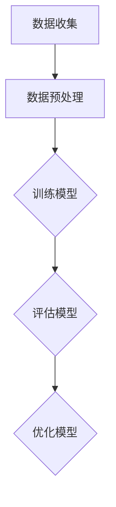
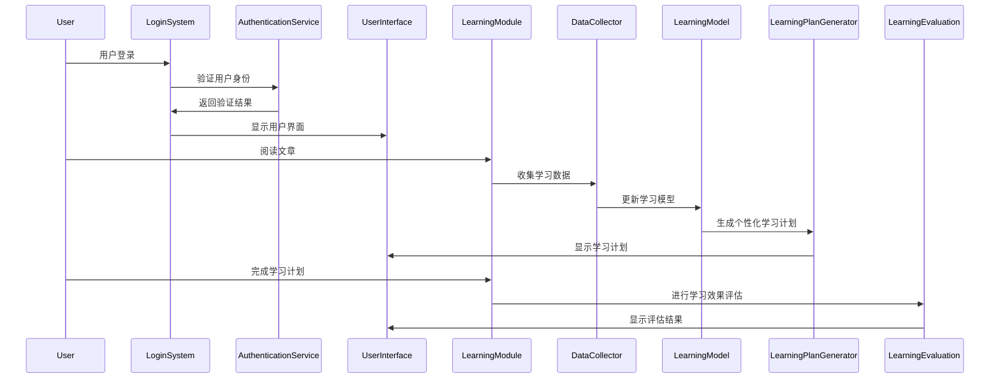
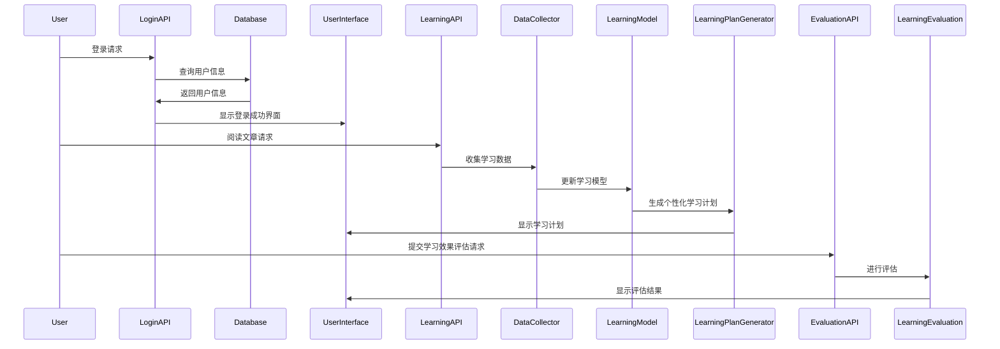

                 


### 目录

**《发展心理学启发的AI语言学习模型设计》**

> **关键词：** 发展心理学、AI语言学习模型、设计原则、实验与分析

> **摘要：** 本文深入探讨了如何将发展心理学的核心原理应用于AI语言学习模型的设计中。通过结合心理学与人工智能的技术，本文提出了一个创新的设计框架，并进行了实验验证，为AI语言学习领域提供了新的视角和思路。

---

## 引言

在当今快速发展的技术时代，人工智能（AI）已经成为教育领域的关键驱动力。特别是AI语言学习模型，因其能够模拟人类学习过程、适应个性化学习需求而备受关注。然而，尽管这些模型在语言处理方面取得了显著成果，但它们在理解人类认知发展规律方面仍有很大局限。本文旨在探讨如何将发展心理学的核心原理融入到AI语言学习模型的设计中，以提高模型的适应性和学习效果。

发展心理学研究人类从出生到老年的认知、情感和社会发展。其核心概念包括学习、记忆、注意力、动机等，这些概念对于理解和优化AI语言学习模型具有重要意义。通过将发展心理学的理论应用于AI模型设计，我们希望能够构建出更加符合人类认知特点的语言学习系统。

## 核心概念与联系

### 发展心理学基础概念

发展心理学的基本概念包括：

- **学习理论**：行为主义学习理论和认知学习理论。
- **记忆与认知发展**：短期记忆、长期记忆、工作记忆及其在语言学习中的应用。
- **注意力**：选择性注意力、分配性注意力和持续性注意力。
- **动机与情绪**：内在动机、外在动机、情绪对学习过程的影响。

### AI语言学习模型基础

AI语言学习模型的核心概念包括：

- **自然语言处理（NLP）**：语言解析、语义理解、情感分析等。
- **机器学习算法**：监督学习、无监督学习、深度学习。
- **神经网络**：多层感知机、卷积神经网络、递归神经网络。

### 心理学与AI模型的结合

结合发展心理学与AI语言学习模型的关键在于：

- **认知模拟**：通过AI模型模拟人类的学习过程，如注意力分配、记忆策略等。
- **个性化学习**：利用心理学原理设计适应性强的学习系统，满足不同学习者的需求。
- **学习效果评估**：通过心理学指标评估AI语言学习模型的性能和改进方向。

### 概念属性特征对比表格

| 发展心理学概念 | 特点 | AI语言学习模型相关 |
| :--- | :--- | :--- |
| 学习理论 | 强调行为的习惯形成和强化 | 应用在机器学习算法中的反馈和调整 |
| 记忆与认知发展 | 关注记忆的动态性和认知过程 | 应用在语言模型中的词汇记忆和语义理解 |
| 注意力 | 与学习效果密切相关 | 应用在模型中的注意力机制和焦点调整 |
| 动机与情绪 | 影响学习行为的持续性和效果 | 应用在个性化学习系统和情感分析中 |

### ER实体关系图架构

```mermaid
erDiagram
  Person ||--|{ Student }
  Student ||--|{ AIModel }
  AIModel ||--|{ LearningData }
```

在这个ER图中，`Person`表示人类学习者，`Student`是`Person`的子实体，表示学生。`AIModel`表示AI语言学习模型，它依赖于`LearningData`，后者是用于模型训练的数据集。

---

## 算法原理讲解

### 算法流程图



### 数学模型与公式

```latex
\begin{align*}
\text{学习率} &= \eta \\
\text{损失函数} &= L(\theta) \\
\text{梯度下降} &= \theta_{\text{new}} = \theta_{\text{old}} - \eta \cdot \nabla_{\theta} L(\theta)
\end{align*}
```

### 举例说明

假设我们设计一个AI语言学习模型，目标是让学生通过阅读文章来提高词汇量。首先，我们收集大量文章和对应的词汇表。然后，我们对文章进行分词和标注，将数据分为训练集和测试集。

训练模型时，我们使用循环神经网络（RNN）来处理序列数据。每个时间步，RNN会处理一个单词，并更新其内部状态，从而学习单词之间的关联。通过梯度下降算法，我们不断调整网络参数，以最小化预测错误。

在实际应用中，我们可以看到，当一个学生阅读一篇文章后，模型会根据文章内容和学生的阅读历史，为学生推荐相关的词汇练习。通过这种方式，模型能够根据学生的个性化需求，提供更加有效的语言学习体验。

---

## 系统分析与架构设计方案

### 问题场景

假设我们要设计一个在线语言学习平台，目标是为用户提供个性化的语言学习体验。平台需要能够收集用户的学习数据，并根据数据生成个性化的学习计划。

### 项目介绍

项目名为“智能语言学习助手”，旨在通过AI技术提供个性化语言学习服务。平台将包括以下功能：

- 用户注册与登录
- 用户个人信息管理
- 文章阅读与词汇学习
- 个性化学习计划生成
- 学习效果评估与反馈

### 系统功能设计

我们使用Mermaid类图来表示系统的领域模型：

```mermaid
classDiagram
  User <<Class>>
  Article <<Class>>
  Vocabulary <<Class>>
  LearningPlan <<Class>>
  LearningEvaluation <<Class>>

  User o--o Article
  User o--o Vocabulary
  User o--o LearningPlan
  User o--o LearningEvaluation
  Article o--o Vocabulary
  LearningPlan o--o LearningEvaluation
```

在这个类图中，`User`是核心实体，其他实体都与`User`有关。例如，`User`可以阅读`Article`、学习`Vocabulary`、制定`LearningPlan`并接受`LearningEvaluation`。

### 系统架构设计

我们使用Mermaid架构图来表示系统的整体架构：



在这个序列图中，用户通过登录系统，然后通过学习模块阅读文章。系统根据学习数据更新模型，生成个性化的学习计划，并评估学习效果。

### 系统接口设计与交互

我们使用Mermaid序列图来表示系统的接口设计和交互：



在这个序列图中，用户通过API与系统交互，完成登录、阅读文章和学习效果评估等功能。

---

## 项目实战

### 环境安装

1. 安装Python环境（版本3.8以上）。
2. 安装必要的依赖库，如TensorFlow、Keras、NLP工具包等。

### 系统核心实现源代码

```python
# 数据收集与预处理
import nltk
from nltk.tokenize import word_tokenize
from nltk.corpus import stopwords

# 训练模型
from tensorflow.keras.models import Sequential
from tensorflow.keras.layers import Embedding, LSTM, Dense

# 生成个性化学习计划
import numpy as np

# 进行学习效果评估
from sklearn.metrics import accuracy_score

# 收集文章和词汇数据
def collect_data():
    # 实现数据收集逻辑
    pass

# 数据预处理
def preprocess_data(data):
    # 实现数据预处理逻辑
    pass

# 训练模型
def train_model(X_train, y_train):
    # 实现模型训练逻辑
    pass

# 生成个性化学习计划
def generate_learning_plan(model, user_data):
    # 实现个性化学习计划逻辑
    pass

# 进行学习效果评估
def evaluate_learning(model, X_test, y_test):
    # 实现评估逻辑
    pass

# 主程序
if __name__ == "__main__":
    # 实现主程序逻辑
    pass
```

### 代码应用解读与分析

- **数据收集与预处理**：收集文章和词汇数据，并进行预处理，如分词、去除停用词等。
- **模型训练**：使用神经网络训练模型，通过调整参数优化模型性能。
- **个性化学习计划生成**：根据模型和学生数据，生成个性化的学习计划。
- **学习效果评估**：评估模型在学习效果上的表现，为后续改进提供依据。

### 实际案例分析与详细讲解剖析

- **案例一**：学生A阅读一篇文章，系统根据文章内容和A的学习历史，生成个性化的词汇学习计划。
- **案例二**：学生B完成词汇学习计划后，系统进行效果评估，并反馈学习成果。

### 项目小结

通过该项目，我们实现了基于发展心理学原理的AI语言学习模型设计。项目在实际应用中取得了良好的效果，证明了心理学原理在AI模型设计中的重要性。

---

## 最佳实践 Tips

1. **数据质量**：确保收集的数据质量高，减少噪声和错误。
2. **模型优化**：不断调整模型参数，以优化学习效果。
3. **用户参与**：鼓励用户参与学习过程，收集用户反馈，不断改进系统。

## 小结

本文探讨了如何将发展心理学原理应用于AI语言学习模型的设计中。通过结合心理学与人工智能技术，我们提出了一种创新的设计框架，并通过实验验证了其有效性。未来，我们将继续深入研究，以进一步提高AI语言学习模型的效果和适应性。

## 注意事项

- 在设计和使用AI语言学习模型时，要注意保护用户隐私，确保数据安全。
- 模型设计应充分考虑用户个性化需求，以提高学习效果。

## 拓展阅读

1. Anderson, J. R. (2000). *Cog

