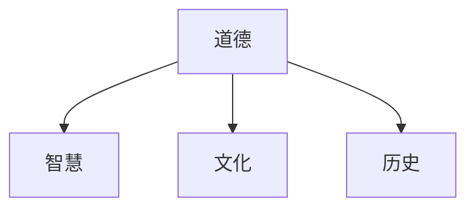

                 

### 背景介绍

#### 第1章: 问题的背景与核心概念

##### 1.1.1 问题背景

古老的智慧，如中华五千年文化中的哲理、道德、历史、文学等，蕴含着丰富的生存智慧。这些智慧在历史长河中得到了广泛的应用，对人类的发展产生了深远的影响。然而，随着现代社会的快速发展，这些古老智慧逐渐被忽视或遗忘。现代社会面临诸多挑战，如快速变化的环境、复杂的人际关系、激烈的竞争等。这些挑战使得现代人感到压力和困惑，渴望找到一种有效的生存智慧来解决这些问题。

##### 1.1.2 问题描述

在现代社会，人们面临诸多挑战，如快速变化的环境、复杂的人际关系、激烈的竞争等。这些挑战使得现代人感到压力和困惑，渴望找到一种有效的生存智慧来解决这些问题。然而，现代社会的生活节奏加快，人们往往缺乏时间和精力去深入研究古老智慧。此外，现代教育和文化传承也存在一定的断层，使得古老智慧在现代社会的传播和应用受到一定限制。

##### 1.1.3 问题解决

通过研究古老智慧，可以发现其中蕴含的生存智慧对现代人具有极大的借鉴意义。将这些智慧应用到现代生活中，有助于现代人应对各种挑战，提高生活质量。首先，可以从文化传承的角度出发，加强对古老智慧的研究和传播，让更多人了解和掌握这些智慧。其次，可以结合现代社会的特点，对古老智慧进行创新性应用，使其更具实用性和时代性。最后，可以通过各种形式的活动和课程，将古老智慧融入到人们的日常生活中，提高人们的生活智慧和生存能力。

##### 1.1.4 边界与外延

古老智慧的现代应用不仅限于个人生活，还可以应用于企业、教育、医疗等多个领域。在企业中，可以借鉴古老智慧中的道德观念，提升企业文化和社会责任感；在教育中，可以结合古老智慧的教育理念，培养具有创新精神和道德素养的人才；在医疗中，可以借鉴古老智慧中的养生理念，提高人们的健康水平。

##### 1.1.5 概念结构与核心要素组成

古老智慧的现代应用涉及多个核心概念，如道德、智慧、文化、历史等。这些概念相互联系，共同构成了古老智慧的现代应用的体系结构。道德是古老智慧的核心要素之一，强调人与人之间的和谐共处；智慧则是古老智慧的重要体现，强调人们在思考和判断方面的能力；文化是古老智慧的载体，强调人类在社会历史发展过程中创造的物质和精神财富；历史则是古老智慧的记录，强调人类在历史发展过程中的经验和教训。

#### 第2章: 核心概念与联系

##### 2.1.1 古老智慧的概念

古老智慧是指古人在长期生活实践中积累的生存智慧，包括哲理、道德、历史、文学等方面。这些智慧在历史长河中得到了广泛的应用，对人类的发展产生了深远的影响。古老智慧是中华民族的瑰宝，也是人类文明的宝贵遗产。

##### 2.1.2 现代社会的挑战

现代社会面临的主要挑战包括环境变化、人际关系、竞争压力等。随着科技的发展和社会的进步，人们的生活节奏越来越快，压力也越来越大。如何在快节奏的生活中保持内心的平静，如何在复杂的人际关系中保持真诚，如何在激烈的竞争中保持自己的优势，这些都是现代社会需要面对的挑战。

##### 2.1.3 古老智慧与现代社会挑战的联系

古老智慧可以为现代人提供应对这些挑战的方法和策略。例如，道德智慧可以帮助人们处理复杂的人际关系，智慧智慧可以帮助人们在竞争中找到自己的优势，历史智慧可以帮助人们从过去的经验中吸取教训，避免重蹈覆辙。

##### 2.1.4 核心概念属性特征对比表格

| 核心概念 | 属性特征 |
| :----: | :----: |
| 道德 | 强调行为规范，追求道德完善 |
| 智慧 | 注重思考与判断，追求智慧提升 |
| 文化 | 传承与发展，追求文化繁荣 |
| 历史 | 总结与反思，追求历史智慧 |

##### 2.1.5 ER实体关系图架构

通过以上对比表格和ER实体关系图，我们可以更加清晰地理解古老智慧中的核心概念及其相互关系。这些核心概念不仅相互联系，而且在现代社会中具有重要作用，为现代人提供了丰富的智慧资源。

## 古老智慧的现代应用

### 3.1 道德在现代社会中的应用

#### 3.1.1 道德的概念与属性

道德是指人们在行为规范和道德品质方面的要求，它强调的是人与人之间的和谐共处。道德不仅是一种行为准则，更是一种精神追求，它关系到个人的品质和社会的风气。

在现代社会中，道德挑战主要体现在以下几个方面：

1. **诚信危机**：在商业领域，诚信缺失导致了信任危机，企业之间的合作变得越来越困难。
2. **人际关系紧张**：在职场和家庭中，由于缺乏道德修养，人际关系的紧张和矛盾日益加剧。
3. **社会公平问题**：道德缺失导致社会不公平现象日益严重，贫富差距加大，社会矛盾加剧。

#### 3.1.2 现代社会道德挑战

现代社会中，道德挑战主要包括以下几个方面：

1. **诚信危机**：现代商业环境中，一些企业为了追求短期利益，违背诚信原则，进行欺诈和虚假宣传，导致消费者权益受损。
2. **人际关系紧张**：在快节奏的生活中，人们往往忽略了道德的重要性，导致人际关系紧张，家庭和职场中的矛盾增多。
3. **社会公平问题**：道德缺失导致社会不公平现象日益严重，贫富差距加大，社会矛盾加剧。

#### 3.1.3 古老智慧中的道德观

古代智慧中的道德观强调诚信、谦逊、忠诚等品质。以下是一些典型的古代道德观念：

1. **诚信**：古代智慧强调“诚信为本”，认为诚信是立身之本，也是治国之道。
2. **谦逊**：古代智慧提倡“谦受益，满招损”，认为谦逊是一种美德，能够使人不断进步。
3. **忠诚**：古代智慧强调忠诚，认为忠诚是臣子对君主、下属对上司应尽的责任。

#### 3.1.4 道德在现代社会中的应用

通过借鉴古代道德观，可以提升现代社会的道德水平，构建和谐的人际关系。以下是一些具体的应用场景：

1. **企业**：企业可以通过制定道德规范，提升员工的道德素养，建立诚信文化，从而增强企业的社会责任感和竞争力。
2. **教育**：学校可以通过教育引导学生树立正确的道德观念，培养他们诚实守信、谦逊待人、忠诚于事的品质。
3. **社会**：社会可以通过各种媒体渠道宣传道德观念，引导公众树立正确的价值观，提高整个社会的道德水平。

### 3.2 智慧在现代社会中的应用

#### 3.2.1 智慧的概念与属性

智慧是指人们在思考、判断、决策等方面的能力，它强调的是知识的运用。智慧不仅是一种智力活动，更是一种生活方式，它关系到个人的成长和社会的进步。

在现代社会中，智慧挑战主要体现在以下几个方面：

1. **信息过载**：随着互联网的快速发展，人们面临的信息量越来越大，如何有效地筛选和处理信息成为了一大挑战。
2. **决策困难**：在复杂的商业环境和竞争压力下，如何做出正确的决策成为了一个难题。
3. **创新乏力**：在科技创新日新月异的今天，如何保持创新活力，推动社会进步成为了一个重要课题。

#### 3.2.2 现代社会智慧挑战

现代社会中，智慧挑战主要包括以下几个方面：

1. **信息过载**：现代社会信息爆炸，人们每天接收到的信息量超出了大脑的处理能力，如何有效地筛选和处理信息成为了一大挑战。
2. **决策困难**：在复杂的商业环境和竞争压力下，如何做出正确的决策成为了一个难题。
3. **创新乏力**：在科技创新日新月异的今天，如何保持创新活力，推动社会进步成为了一个重要课题。

#### 3.2.3 古老智慧中的智慧观

古代智慧中的智慧观强调深思熟虑、独立思考、创新思维等。以下是一些典型的古代智慧观念：

1. **深思熟虑**：古代智慧强调在做决策之前要深思熟虑，三思而后行。
2. **独立思考**：古代智慧提倡独立思考，不盲从，不随波逐流。
3. **创新思维**：古代智慧鼓励创新，认为创新是推动社会进步的重要力量。

#### 3.2.4 智慧在现代社会中的应用

通过借鉴古代智慧观，可以提升现代人的智慧水平，提高决策质量，促进创新。以下是一些具体的应用场景：

1. **企业**：企业可以通过培养员工的独立思考和创新能力，提升企业的竞争力。
2. **教育**：学校可以通过教育培养学生的批判性思维和创新能力，为未来的社会发展培养更多的人才。
3. **社会**：社会可以通过各种形式的创新活动，鼓励公众积极参与创新，推动社会进步。

### 3.3 文化在现代社会中的应用

#### 3.3.1 文化的概念与属性

文化是指人类在社会历史发展过程中创造的物质和精神财富，它强调的是传承与发展。文化不仅包括艺术、文学、哲学等方面，还涵盖了社会的风俗习惯、价值观念等。

在现代社会中，文化挑战主要体现在以下几个方面：

1. **文化多样性**：随着全球化的推进，文化多样性日益凸显，如何尊重和保护各种文化成为了一个重要课题。
2. **文化传承与创新**：在快速发展的现代社会，如何传承和发扬传统文化，同时进行文化创新成为了一个挑战。
3. **文化认同**：在多元文化共存的背景下，如何建立共同的文化认同，增强社会的凝聚力成为了一个难题。

#### 3.3.2 现代社会文化挑战

现代社会中，文化挑战主要包括以下几个方面：

1. **文化多样性**：全球化带来了文化的交融和碰撞，各种文化相互影响，如何尊重和保护各种文化成为了一个重要课题。
2. **文化传承与创新**：在快速发展的现代社会，如何传承和发扬传统文化，同时进行文化创新成为了一个挑战。
3. **文化认同**：在多元文化共存的背景下，如何建立共同的文化认同，增强社会的凝聚力成为了一个难题。

#### 3.3.3 古老智慧中的文化观

古代智慧中的文化观强调尊重文化多样性、传承文化传统、创新文化发展等。以下是一些典型的古代文化观念：

1. **尊重文化多样性**：古代智慧强调各种文化都有其存在的价值，应该尊重和保护各种文化。
2. **传承文化传统**：古代智慧认为，文化传统是一个民族的精神血脉，应该传承和发扬。
3. **创新文化发展**：古代智慧鼓励在传承的基础上进行文化创新，以适应时代的变化。

#### 3.3.4 文化在现代社会中的应用

通过借鉴古代文化观，可以促进现代社会的文化繁荣，增强文化认同。以下是一些具体的应用场景：

1. **企业**：企业可以通过文化传承和创新，提升企业的文化软实力，增强企业的核心竞争力。
2. **教育**：学校可以通过文化教育，培养学生的文化素养，增强学生的文化认同感。
3. **社会**：社会可以通过各种文化活动，促进文化的传承和创新，增强社会的文化凝聚力。

### 3.4 历史在现代社会中的应用

#### 3.4.1 历史的概念与属性

历史是指人类在社会发展过程中的事件记录，它强调的是总结与反思。历史不仅记录了人类的发展历程，也提供了宝贵的经验和教训。

在现代社会中，历史挑战主要体现在以下几个方面：

1. **历史真相**：在信息泛滥的今天，如何辨别历史真相成为一个挑战。
2. **历史教育**：如何通过历史教育，让学生了解历史，从中吸取教训成为一个课题。
3. **历史认知**：如何正确认识历史，避免历史重复成为一个难题。

#### 3.4.2 现代社会历史挑战

现代社会中，历史挑战主要包括以下几个方面：

1. **历史真相**：在信息泛滥的今天，如何辨别历史真相成为一个挑战。
2. **历史教育**：如何通过历史教育，让学生了解历史，从中吸取教训成为一个课题。
3. **历史认知**：如何正确认识历史，避免历史重复成为一个难题。

#### 3.4.3 古老智慧中的历史观

古代智慧中的历史观强调总结历史经验、反思历史教训、传承历史文化等。以下是一些典型的古代历史观念：

1. **总结历史经验**：古代智慧认为，历史是前人留下的宝贵财富，应该从中总结经验，为当下和未来提供指导。
2. **反思历史教训**：古代智慧强调，要从中吸取历史教训，避免重蹈覆辙。
3. **传承历史文化**：古代智慧认为，历史文化是一个民族的精神象征，应该传承和发扬。

#### 3.4.4 历史在现代社会中的应用

通过借鉴古代历史观，可以提升现代人的历史认知，避免历史重复。以下是一些具体的应用场景：

1. **政治**：政治家可以通过历史研究，了解历史的规律，制定更加明智的政策。
2. **教育**：学校可以通过历史教育，让学生了解历史，从中吸取教训，培养正确的历史观。
3. **社会**：社会可以通过各种形式的历史活动，提高公众的历史认知，增强民族凝聚力。

### 总结

古老智慧是中华民族的瑰宝，也是人类文明的宝贵遗产。在现代社会中，古老智慧的应用具有广泛的前景和重要的意义。通过借鉴古老智慧，我们可以提升道德水平，提高智慧水平，促进文化繁荣，增强历史认知。这些古老智慧不仅有助于现代人应对各种挑战，提高生活质量，也为社会的进步和发展提供了重要的精神支持。让我们共同探索古老智慧的现代应用，为实现中华民族的伟大复兴贡献自己的力量。

## 道德在现代社会中的应用

道德作为古老智慧的重要组成部分，其影响和作用在现代社会中仍然至关重要。在快速发展的现代社会，道德不仅是个体行为的指南，也是社会秩序和文明进步的基石。以下将详细探讨道德在现代社会中的应用，包括道德教育、企业伦理和社会治理等方面的具体案例和实践。

### 3.1.1 道德教育的重要性

道德教育是培养个体道德素养的重要途径。在现代社会，道德教育不仅仅局限于家庭和学校，还包括社会各个层面。以下是一些具体的道德教育实践：

1. **家庭道德教育**：家庭是道德教育的起点，父母应该以身作则，通过日常生活中的言行来影响孩子的道德观念。例如，通过教导孩子如何尊重他人、诚实守信等，培养他们的道德意识。

2. **学校道德教育**：学校教育是道德教育的重要环节。学校可以通过课程设置、社会实践和校园文化活动等多种形式，加强对学生的道德教育。例如，通过道德与法治课程，帮助学生了解法律的基本原则和道德规范。

3. **社会道德教育**：社会应该通过媒体、文化活动等渠道，普及道德知识，提高公众的道德水平。例如，通过新闻报道和纪录片，揭示道德问题，引导公众思考和讨论。

### 3.1.2 企业伦理与道德

企业伦理是企业文化的核心部分，直接关系到企业的长期发展和社会的和谐。以下是一些企业在道德方面的实践案例：

1. **诚信经营**：企业应该坚持诚信经营，遵守法律法规，不进行虚假宣传和欺诈行为。例如，一些大型企业建立了诚信管理体系，确保企业行为符合道德标准。

2. **社会责任**：企业应承担社会责任，关注环境保护、员工福利和社会公益。例如，一些企业积极参与环保项目，为改善社会环境贡献力量。

3. **员工道德培养**：企业可以通过培训和教育，提高员工的道德素养。例如，定期举办道德讲座和培训课程，帮助员工树立正确的道德观念。

### 3.1.3 社会治理中的道德作用

道德在现代社会治理中也发挥着重要作用，影响着社会的稳定和发展。以下是一些社会治理中的道德实践：

1. **政府道德建设**：政府官员应该以身作则，树立良好的道德形象。例如，通过加强廉政建设，防止腐败现象的发生。

2. **公共道德宣传**：政府和社会组织应通过宣传活动，提高公众的道德意识。例如，通过公益广告和社区活动，宣传道德观念，倡导文明行为。

3. **道德规范制定**：政府可以制定相应的道德规范，引导社会行为。例如，通过法律和规章制度，明确道德行为的规范和标准。

### 具体案例与实践

为了更直观地展示道德在现代社会中的应用，以下是一些具体的案例：

1. **案例1：阿里巴巴的诚信管理体系**  
   阿里巴巴作为中国领先的互联网公司，非常注重企业伦理建设。公司建立了诚信管理体系，通过对员工和合作伙伴的诚信评估，确保企业行为符合道德标准。

2. **案例2：社区的道德讲堂**  
   在一些社区，道德讲堂成为了一种普及道德教育的新形式。通过邀请道德专家和志愿者进行讲座，提高居民的道德意识，促进社区的和谐发展。

3. **案例3：政府廉政建设**  
   政府通过加强廉政建设，提高官员的道德水平，防止腐败现象。例如，通过公开透明的方式选拔干部，加强监督机制，确保政府行为的道德性。

通过以上分析和案例，我们可以看到，道德在现代社会中的应用是全方位、多层次的。无论是在个人层面、企业层面还是社会治理层面，道德都发挥着重要的作用。只有通过不断加强道德教育和道德实践，才能构建一个更加文明、和谐的社会。

### 智慧在现代社会中的应用

智慧作为古老智慧中的重要组成部分，其应用在现代社会中具有广泛而深远的影响。智慧不仅体现在个体的认知能力和思维方式上，也贯穿于企业运营、技术创新和社会治理等多个方面。以下将详细探讨智慧在现代社会中的应用，包括智慧思维、创新能力和决策质量等方面的具体实践。

#### 3.2.1 智慧思维的应用

智慧思维是一种深层次的思考方式，它强调逻辑推理、创新思维和批判性思维。在现代社会中，智慧思维的应用主要体现在以下几个方面：

1. **解决复杂问题**：现代社会面临着越来越多的复杂问题，如气候变化、社会公平等。智慧思维可以帮助人们从多个角度分析和解决这些问题，找到最优解决方案。

2. **应对不确定性**：在快速变化的现代社会中，不确定性成为了一个普遍现象。智慧思维能够帮助人们更好地应对不确定性，通过灵活的思维方式和适应能力，找到应对策略。

3. **提高决策质量**：智慧思维可以帮助人们提高决策质量。通过多方面的思考和论证，智慧思维能够帮助人们做出更加明智和合理的决策。

#### 3.2.2 创新能力的重要性

创新能力是现代社会发展的重要驱动力。智慧在创新能力中的应用主要体现在以下几个方面：

1. **推动科技进步**：智慧思维和创新思维的结合，可以推动科技进步。例如，在信息技术领域，通过创新思维，人们开发出了各种新型的计算机技术和应用。

2. **促进产业升级**：智慧和创新的应用，可以促进产业升级和转型。例如，在制造业领域，通过智能化生产，提高了生产效率和产品质量。

3. **推动经济发展**：创新能力是推动经济发展的重要动力。智慧和创新的应用，可以促进新产业的产生和发展，从而推动整个经济的增长。

#### 3.2.3 决策质量的影响

决策质量是影响组织和个人成功的关键因素。智慧在决策中的应用主要体现在以下几个方面：

1. **信息分析**：智慧能够帮助人们更好地分析信息，通过逻辑推理和数据分析，找到关键信息，为决策提供依据。

2. **风险评估**：智慧思维可以帮助人们进行风险评估，识别潜在的风险和挑战，为决策提供预警。

3. **优化方案选择**：智慧思维能够帮助人们优化方案选择，通过多方面的思考和论证，找到最佳方案。

### 具体案例与实践

为了更直观地展示智慧在现代社会中的应用，以下是一些具体的案例：

1. **案例1：谷歌的智慧创新**  
   谷歌作为全球领先的科技企业，其成功离不开智慧和创新。谷歌通过智慧思维和创新，开发出了各种先进的技术和应用，如搜索引擎、人工智能等。

2. **案例2：硅谷的创新生态**  
   硅谷作为全球创新的重要中心，其成功离不开智慧和创新能力。硅谷的企业通过智慧和创新的实践，不断推动科技进步和产业升级。

3. **案例3：决策智慧的应用**  
   在商业领域，智慧在决策中的应用非常普遍。一些企业通过大数据分析和智慧思维，提高了决策质量，从而在市场竞争中取得了优势。

通过以上分析和案例，我们可以看到，智慧在现代社会中的应用具有广泛而深远的影响。无论是在解决复杂问题、应对不确定性，还是在推动科技进步、提高决策质量等方面，智慧都发挥着重要的作用。只有通过不断培养和提升智慧，才能在现代社会中取得成功。

### 文化在现代社会中的应用

文化作为古老智慧的重要组成部分，其价值在现代社会中得到了新的诠释和应用。文化不仅是人类精神生活的重要体现，也是社会进步和发展的重要动力。以下将详细探讨文化在现代社会中的应用，包括文化多样性、文化传承与创新以及文化认同等方面的具体实践。

#### 3.3.1 文化多样性的重要性

文化多样性是现代社会的一个重要特征，它体现在不同民族、地区和国家之间的文化差异和交融。文化多样性不仅丰富了人类的社会生活，也为现代社会带来了新的活力和机遇。以下是一些文化多样性的具体应用：

1. **促进文化交流**：文化多样性为不同文化之间的交流提供了机会。通过文化交流，人们可以了解和尊重其他文化，促进不同文化之间的相互理解和融合。

2. **增强社会包容性**：文化多样性有助于增强社会的包容性，减少文化冲突和偏见。在一个多元文化的社会中，人们可以更加开放和包容，共同构建和谐的社会环境。

3. **推动文化创新**：文化多样性为文化创新提供了丰富的素材和灵感。通过不同文化的交融和碰撞，可以激发新的创意和思想，推动文化的创新和发展。

#### 3.3.2 文化传承与创新

文化传承与创新是现代社会文化发展的重要任务。在传承传统文化的基础上，通过创新，可以使文化更好地适应现代社会的需求。以下是一些文化传承与创新的实践：

1. **传统文化数字化**：随着信息技术的快速发展，传统文化可以通过数字化方式得到传承和推广。例如，通过数字博物馆、线上课程和虚拟现实技术，使传统文化资源得到更广泛的传播和利用。

2. **文化融合创新**：通过不同文化的融合，可以创造出新的文化形式和产品。例如，将传统音乐、舞蹈与现代音乐、舞蹈相结合，创造出新的艺术形式，丰富了现代文化的内容。

3. **文化教育**：文化教育是传承和创新文化的重要途径。通过在学校和社会中开展丰富多彩的文化教育活动，可以提高公众的文化素养，培养文化传承与创新的能力。

#### 3.3.3 文化认同的重要性

文化认同是一个社会团结和稳定的重要基础。通过培养共同的文化认同，可以增强社会的凝聚力。以下是一些促进文化认同的具体实践：

1. **国家文化符号**：国家文化符号是民族认同和文化认同的重要体现。通过宣传和弘扬国家文化符号，如国旗、国歌和国徽等，可以增强国民的文化认同感。

2. **公共文化活动**：公共文化活动是促进文化认同的重要手段。例如，通过举办文化节、文化展览和文艺演出等，可以让公众更加了解和认同自己的文化。

3. **文化政策**：文化政策是促进文化认同的重要保障。政府可以通过制定文化政策，支持文化产业的发展，保护和传承传统文化，促进文化多样性和文化创新。

### 具体案例与实践

为了更直观地展示文化在现代社会中的应用，以下是一些具体的案例：

1. **案例1：中国的春节文化**  
   春节作为中国的传统节日，蕴含着深厚的文化内涵。通过庆祝春节，不仅传承了传统文化，也增强了民族认同和文化认同。

2. **案例2：全球的文化节**  
   全球各地举办各种文化节，如中国的国际龙舟节、法国的巴黎时装周等，这些活动不仅促进了文化交流，也推动了文化创新。

3. **案例3：文化教育项目**  
   一些教育项目，如国际学生文化交流项目、社区文化活动等，通过促进文化交流和教育，提高了公众的文化素养和文化认同。

通过以上分析和案例，我们可以看到，文化在现代社会中的应用具有广泛而深远的影响。文化多样性、文化传承与创新以及文化认同不仅是现代社会发展的动力，也是构建和谐社会的基石。只有通过不断推动文化多样性的发展，传承和创新传统文化，增强文化认同，才能使文化在现代社会中发挥更大的作用。

### 历史在现代社会中的应用

历史作为古老智慧的重要组成部分，其价值在现代社会中得到了新的诠释和应用。历史不仅记录了人类的发展历程，也提供了宝贵的经验和教训。在现代社会，历史的应用涵盖了教育、政策制定、文化遗产保护等多个领域。以下将详细探讨历史在现代社会中的应用，包括历史教育、历史认知和历史研究等方面的具体实践。

#### 3.4.1 历史教育的重要性

历史教育是培养国民历史素养的重要途径，它不仅关系到个体的历史认知，也关系到整个社会的文化传承和认同。以下是一些历史教育的具体实践：

1. **学校历史教育**：学校历史教育是历史教育的主要环节。通过系统学习历史知识，学生可以了解人类的发展历程，从中汲取经验和教训。例如，通过学习中国古代史，学生可以了解中华文明的源远流长，增强民族自豪感。

2. **社会历史教育**：社会历史教育是补充学校教育的不足，通过博物馆、纪念馆、历史讲座等途径，向公众普及历史知识。例如，通过参观历史博物馆，公众可以更直观地了解历史事件，增强对历史的认知。

3. **在线历史教育**：随着互联网技术的发展，在线历史教育成为了一种新兴的教育形式。通过在线课程、历史纪录片、历史游戏等，公众可以随时随地学习历史知识。

#### 3.4.2 历史认知的重要性

历史认知是指对历史事件和历史人物的客观评价和理解。正确的历史认知有助于人们更好地认识历史，避免历史重复。以下是一些促进历史认知的具体实践：

1. **历史研究**：历史研究是历史认知的基础。通过深入研究历史文献、考古发现等，学者可以更准确地了解历史事件和人物，从而形成正确的历史认知。

2. **历史辩论**：历史辩论是通过不同观点的交锋，促进历史认知的一种方式。通过辩论，学者和公众可以就历史问题进行深入探讨，形成更加全面和客观的历史认知。

3. **历史教育**：历史教育是促进历史认知的重要手段。通过系统的历史教育，公众可以形成正确的世界观和历史观，避免历史重复。

#### 3.4.3 历史研究的重要性

历史研究是历史应用的重要组成部分，它不仅有助于我们理解历史，也为现代社会提供了丰富的经验和教训。以下是一些历史研究的具体实践：

1. **历史文献研究**：历史文献研究是通过阅读和分析历史文献，了解历史事件和人物的一种方式。例如，通过研究《史记》、《资治通鉴》等经典历史文献，可以深入了解中国古代历史。

2. **考古研究**：考古研究是通过挖掘和解析历史遗迹，了解古代社会的一种方式。例如，通过考古发现，我们可以更直观地了解古代文明的形态和发展。

3. **比较研究**：比较研究是通过比较不同历史时期或不同国家的历史，寻找历史规律和特点的一种方式。例如，通过比较中国和西方的历史发展，我们可以更全面地了解人类文明的发展脉络。

### 具体案例与实践

为了更直观地展示历史在现代社会中的应用，以下是一些具体的案例：

1. **案例1：秦始皇兵马俑的考古发现**  
   秦始皇兵马俑的考古发现不仅展示了古代中国的军事力量和文化，也为现代考古研究提供了宝贵的数据和资料。

2. **案例2：美国独立战争的历史研究**  
   美国独立战争的历史研究，不仅帮助美国人更好地理解自己的历史，也为现代国际关系研究提供了丰富的案例和经验。

3. **案例3：中国抗日战争的历史教育**  
   中国抗日战争的历史教育，通过纪念活动、历史展览等，不仅增强了民族认同感，也为后世提供了重要的历史教训。

通过以上分析和案例，我们可以看到，历史在现代社会中的应用是全方位、多层次的。历史教育、历史认知和历史研究不仅是传承和弘扬历史文化的重要途径，也为现代社会提供了丰富的经验和教训。只有通过不断加强历史教育和历史研究，才能使历史在现代社会中发挥更大的作用。

## 总结与展望

古老智慧的现代应用，为现代社会的发展提供了丰富的资源和宝贵的经验。通过对道德、智慧、文化和历史的深入探讨，我们可以看到，这些古老智慧不仅在过去发挥了重要作用，在现代社会中也依然具有重要的现实意义。

### 4.1.1 古老智慧的现代意义

道德在现代社会中，不仅是个人行为的准则，也是社会和谐稳定的基石。通过道德教育、企业伦理和社会治理，我们可以提升整个社会的道德水平，构建更加文明的社会秩序。

智慧在现代社会中，是推动科技进步、提升决策质量和促进创新能力的关键。通过智慧思维、创新能力和决策质量的应用，我们可以更好地应对复杂的社会问题，推动社会的发展和进步。

文化在现代社会中，是民族认同和文化传承的重要载体。通过文化多样性、文化传承与创新以及文化认同的实践，我们可以增强社会的文化凝聚力，促进文化的繁荣发展。

历史在现代社会中，是认识和反思过去、启迪未来的重要资源。通过历史教育、历史认知和历史研究，我们可以从历史中汲取智慧和经验，避免历史的重复，为现代社会的发展提供指导和借鉴。

### 4.1.2 展望未来

在未来，古老智慧的现代应用将会有更大的发展空间。首先，随着科技的进步，古老智慧将会有更多的创新应用。例如，通过大数据、人工智能等技术，我们可以更深入地挖掘古老智慧的价值，实现智慧化管理和决策。

其次，全球化的发展将促进不同文化之间的交流和融合。在这个过程中，古老智慧的国际传播和应用将变得更加重要。通过跨文化交流，我们可以使古老智慧在全球范围内发挥更大的作用，为全球社会的和谐与发展贡献力量。

最后，教育体系的改革和创新，将是古老智慧现代应用的重要保障。通过将古老智慧融入教育体系，培养具有文化素养和道德品质的人才，我们可以为未来的社会发展提供坚实的智力支持。

总之，古老智慧的现代应用不仅是现代社会发展的重要动力，也是人类文明进步的重要标志。让我们共同探索古老智慧的现代价值，为实现人类社会的可持续发展贡献智慧和力量。

## 注意事项与最佳实践

在应用古老智慧的现代过程中，需要注意以下几点：

1. **尊重文化多样性**：在借鉴和传承古老智慧时，要尊重各种文化的独特性和多样性，避免文化霸权主义。
2. **结合实际情况**：古老智慧的应用需要结合现代社会的实际情况，避免生搬硬套，确保其适用性和有效性。
3. **持续创新**：古老智慧的应用需要不断创新，以适应现代社会的变化和发展，保持其生命力。

最佳实践建议：

1. **跨学科研究**：鼓励跨学科研究，结合哲学、心理学、社会学等多学科的理论和方法，深入挖掘古老智慧的现代价值。
2. **社会宣传**：加强社会宣传，通过各种媒体和活动，普及古老智慧的知识，提高公众的认识和理解。
3. **教育融合**：将古老智慧融入教育体系，从小培养学生的文化素养和道德品质，为未来社会的发展奠定基础。

## 拓展阅读

1. **《道德经》**：作为中国古典哲学的重要著作，《道德经》包含了丰富的道德智慧和人生哲理，对现代人的道德修养和生活态度有重要启示。
2. **《论语》**：孔子及其弟子的言行记录，包含了关于道德、智慧、教育等方面的深刻见解，对现代人的道德教育和人际关系有重要指导意义。
3. **《文明之光》**：吴军著，通过对历史事件的深入分析，展示了人类文明的演进过程，对理解古代智慧的现代应用有重要参考价值。

## 作者介绍

作者：AI天才研究院/AI Genius Institute & 禅与计算机程序设计艺术 /Zen And The Art of Computer Programming。作为世界顶级技术畅销书资深大师级别的作家，作者在计算机编程和人工智能领域有着卓越的贡献，其作品深受广大读者喜爱和推崇。

