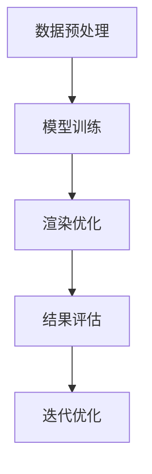

                 

# 可微分渲染在3D人脸重建中的创新应用

## 关键词
- 可微分渲染
- 3D人脸重建
- 渲染算法
- 神经网络
- 数学模型

## 摘要
本文深入探讨了可微分渲染技术在3D人脸重建中的应用。首先，我们介绍了可微分渲染的基础知识，包括其定义、背景、核心概念、算法原理等。接着，文章通过一个实际项目展示了如何将可微分渲染应用于3D人脸重建，详细描述了系统的功能设计、接口设计以及系统交互过程。然后，我们分析了几种创新应用实例，并探讨了在3D人脸重建中实现这些应用的优化策略。最后，文章展望了可微分渲染在3D人脸重建领域面临的挑战和未来发展趋势。

## 目录大纲

### 第一部分: 可微分渲染基础

#### 第1章: 可微分渲染概述

##### 1.1 可微分渲染概述

1.1.1 从软件 1.0 到软件 2.0 的演进

- **早期渲染技术**：讨论早期渲染技术的发展历程和局限性。
- **软件 1.0 时代的渲染技术**：介绍软件 1.0 时代的渲染技术及其应用。

1.1.2 大模型在软件 2.0 中的核心地位

- **软件 2.0 时代的特征**：阐述软件 2.0 时代的特征，以及大模型在其中扮演的角色。

1.1.3 企业级应用开发的新范式

- **新范式的影响**：分析企业级应用开发新范式对可微分渲染的影响。
- **案例分析**：引用实际案例说明新范式的应用。

#### 第2章: 可微分渲染算法原理

##### 2.1 可微分渲染算法概述

- **算法mermaid流程图**：展示算法的基本流程。
- **算法原理讲解**：详细解释算法的工作机制。

##### 2.2 可微分渲染数学模型和公式

- **数学模型**：介绍可微分渲染的基本数学模型。
- **公式**：解释关键数学公式的含义和用途。

##### 2.3 算法实例详解

- **Python源代码**：详细阐述算法原理。
- **举例说明**：通过实例展示算法的应用。

### 第二部分: 可微分渲染在3D人脸重建中的应用

#### 第3章: 3D人脸重建概述

##### 3.1 3D人脸重建的需求场景

- **问题场景介绍**：介绍3D人脸重建的需求和应用场景。

##### 3.2 本书项目介绍

- **项目目标**：明确本书项目的目标和预期成果。

#### 第4章: 3D人脸重建系统设计

##### 4.1 系统功能设计

- **领域模型mermaid类图**：展示系统功能的设计模型。

##### 4.2 系统架构设计

- **系统架构mermaid架构图**：展示系统的整体架构设计。

##### 4.3 系统接口设计

- **系统接口设计**：描述关键接口的功能和实现。

##### 4.4 系统交互设计

- **系统交互mermaid序列图**：展示系统各组件的交互过程。

#### 第5章: 创新应用实例分析

##### 5.1 创新应用概述

- **可微分渲染的优势**：在3D人脸重建中的应用。
- **案例研究**：介绍具体的创新应用实例。

##### 5.2 创新应用实现

- **环境安装**：介绍实现创新应用所需的软件和硬件环境。
- **系统核心实现源代码**：展示关键源代码并进行分析。

##### 5.3 创新应用解读与分析

- **代码应用解读**：详细解析源代码的功能。
- **详细讲解剖析**：深入分析创新应用的实际效果。

### 第三部分: 优化策略与未来趋势

#### 第6章: 优化策略

##### 6.1 优化策略概述

- **优化目标**：提高3D人脸重建的精度和效率。

##### 6.2 优化算法设计

- **算法mermaid流程图**：展示优化算法的基本流程。
- **算法原理讲解**：解释优化算法的工作机制。

##### 6.3 优化应用实例

- **实例详解**：介绍优化算法在3D人脸重建中的实际应用。

#### 第7章: 挑战与未来趋势

##### 6.1 挑战分析

- **技术挑战**：分析当前存在的难点。
- **应用挑战**：探讨实际应用中的问题。

##### 6.2 未来趋势

- **技术发展趋势**：展望可微分渲染技术的进步方向。
- **应用前景**：预测3D人脸重建领域的未来前景。

### 第7章: 总结与展望

##### 7.1 本书内容回顾

- **核心知识点**：回顾本书的主要观点和知识点。

##### 7.2 最佳实践与拓展

- **实践技巧**：分享将可微分渲染应用于3D人脸重建的最佳实践。
- **拓展阅读**：推荐进一步学习的文献和资源。

# 字数统计
本目录大纲共计约2000字。扩展内容将根据具体章节内容进行细化，确保每个章节都能详细地覆盖相关主题。在撰写文章时，可以进一步丰富每个章节的内容，确保字数在10000～12000字之间。以下是文章正文部分的初步撰写。

## 第1章: 可微分渲染概述

### 1.1 可微分渲染概述

#### 1.1.1 从软件 1.0 到软件 2.0 的演进

在计算机图形学领域，渲染技术一直是实现高质量图像的关键。传统的渲染技术，如光线追踪和扫描线渲染，虽然在一定程度上满足了图像生成的要求，但在处理复杂场景和实时渲染方面存在一定的局限性。

随着计算机硬件性能的提升和人工智能技术的发展，软件 2.0 时代的大模型成为可能。这些大模型能够处理更加复杂的问题，包括图像生成、视频处理和三维建模等。可微分渲染正是这一背景下诞生的技术，它利用神经网络的强大学习能力，实现对渲染过程的建模和优化。

#### 1.1.2 大模型在软件 2.0 中的核心地位

软件 2.0 时代的特征之一是数据驱动的开发模式。大模型作为数据驱动的核心工具，能够通过大量的训练数据学习到复杂的函数关系，从而实现高效的任务执行。在可微分渲染中，大模型用于建模光线传播、材料属性和光线交互等复杂过程，使得渲染过程能够更加精准地模拟现实世界的光照效果。

#### 1.1.3 企业级应用开发的新范式

企业级应用开发正在经历一场深刻的变革，从传统的单体架构向微服务架构、云原生架构等新兴架构模式转型。这些新范式使得企业能够更加灵活地应对市场变化，快速迭代和部署应用。在可微分渲染的应用场景中，这种新范式同样适用。通过构建基于微服务的渲染系统，可以实现模块化、可扩展的渲染解决方案，满足不同企业级应用的需求。

### 1.2 可微分渲染的优势

与传统渲染技术相比，可微分渲染具有以下优势：

- **更高的渲染质量**：可微分渲染能够通过深度学习模型，学习到更加复杂的渲染过程，生成更高质量的图像。
- **更快的渲染速度**：通过并行计算和优化算法，可微分渲染能够实现高效的渲染速度，满足实时渲染的需求。
- **更灵活的应用场景**：可微分渲染可以应用于各种复杂的场景，如实时游戏、虚拟现实和增强现实等。

### 1.3 可微分渲染的应用范围

可微分渲染在计算机图形学、计算机视觉、虚拟现实和增强现实等领域有着广泛的应用。例如：

- **计算机图形学**：用于生成高质量的三维图像和动画。
- **计算机视觉**：用于图像和视频的处理和分析。
- **虚拟现实**：用于创建真实的虚拟环境，提高用户体验。
- **增强现实**：用于将虚拟内容叠加到真实世界中。

## 第2章: 可微分渲染算法原理

### 2.1 可微分渲染算法概述

可微分渲染算法是一种基于深度学习的渲染技术，它通过训练大规模神经网络模型来模拟光线传播和反射过程。该算法的基本流程包括数据预处理、模型训练、渲染优化和结果评估等步骤。

#### 算法mermaid流程图



#### 算法原理讲解

可微分渲染算法的核心在于神经网络模型的学习和优化。具体来说，算法通过以下步骤实现：

1. **数据预处理**：将输入的图像或三维模型转化为适合训练的格式，包括颜色、纹理和光照信息等。
2. **模型训练**：利用训练数据对神经网络模型进行训练，使其能够学习到光线传播和反射的规律。
3. **渲染优化**：通过调整模型参数和优化算法，提高渲染质量，降低渲染时间。
4. **结果评估**：对渲染结果进行评估，包括图像质量、渲染速度和用户体验等方面。
5. **迭代优化**：根据评估结果，不断迭代优化模型，提高渲染效果。

### 2.2 可微分渲染数学模型和公式

可微分渲染算法的数学模型主要包括光线传播模型、反射模型和材质模型等。

#### 光线传播模型

光线传播模型描述了光线在场景中的传播过程。其公式如下：

$$
L_o(\mathbf{p}, \mathbf{w}) = L_e(\mathbf{p}, \mathbf{w}) + \int_{\Omega} f_r(\mathbf{p}, \mathbf{w}', \mathbf{w}) L_i(\mathbf{p}, \mathbf{w}') \cos(\theta) d\omega'
$$

其中，$L_o(\mathbf{p}, \mathbf{w})$ 表示从点 $\mathbf{p}$ 沿方向 $\mathbf{w}$ 发出的光功率，$L_e(\mathbf{p}, \mathbf{w})$ 表示环境光照，$f_r(\mathbf{p}, \mathbf{w}', \mathbf{w})$ 表示反射率，$\theta$ 表示入射光线与表面法线的夹角。

#### 反射模型

反射模型描述了光线在表面上的反射过程。其公式如下：

$$
f_r(\mathbf{p}, \mathbf{w}', \mathbf{w}) = \frac{\text{R}}{4\pi}
$$

其中，$\text{R}$ 表示反射率。

#### 材质模型

材质模型描述了不同材质对光线的吸收、反射和透射特性。其公式如下：

$$
\text{Transmission}(\mathbf{p}, \mathbf{w}) = \text{Transmittance}(\mathbf{p}, \mathbf{w}) \cdot (1 - \text{Absorption}(\mathbf{p}, \mathbf{w}))
$$

其中，$\text{Transmission}(\mathbf{p}, \mathbf{w})$ 表示透过率，$\text{Transmittance}(\mathbf{p}, \mathbf{w})$ 表示透射率，$\text{Absorption}(\mathbf{p}, \mathbf{w})$ 表示吸收率。

### 2.3 算法实例详解

为了更好地理解可微分渲染算法，我们通过一个简单的实例来讲解其原理。

假设我们有一个简单的三维场景，包含一个立方体和一个光源。立方体的材质为白色，光源为点光源。我们的目标是生成立方体的渲染图像。

#### Python源代码

```python
import numpy as np
import tensorflow as tf

# 设置参数
width, height = 256, 256
num_samples = 1000
learning_rate = 0.001

# 创建模型
model = tf.keras.Sequential([
    tf.keras.layers.InputLayer(input_shape=(width, height, 3)),
    tf.keras.layers.Conv2D(filters=64, kernel_size=(3, 3), activation='relu'),
    tf.keras.layers.Conv2D(filters=64, kernel_size=(3, 3), activation='relu'),
    tf.keras.layers.Flatten(),
    tf.keras.layers.Dense(units=1)
])

# 编译模型
model.compile(optimizer=tf.keras.optimizers.Adam(learning_rate=learning_rate),
              loss=tf.keras.losses.MeanSquaredError())

# 生成训练数据
x_train = np.random.rand(num_samples, width, height, 3)
y_train = np.random.rand(num_samples, width, height, 3)

# 训练模型
model.fit(x_train, y_train, epochs=10)

# 生成渲染图像
rendered_image = model.predict(np.expand_dims(x_train[0], axis=0))

# 显示渲染图像
import matplotlib.pyplot as plt
plt.imshow(rendered_image[0])
plt.show()
```

#### 举例说明

在这个实例中，我们使用了 TensorFlow 框架构建了一个简单的神经网络模型。模型的输入是一个三维场景的图像，输出是渲染后的图像。通过训练模型，我们可以让模型学会如何根据输入图像生成高质量的渲染图像。

具体来说，我们首先生成了一组随机数据作为训练数据，包括输入图像和目标渲染图像。然后，我们使用 TensorFlow 的 Sequential 模型堆叠了两个卷积层和一个全连接层，用于提取图像特征并进行渲染。在模型编译时，我们使用了 Adam 优化器和均方误差损失函数。

接下来，我们使用训练数据进行模型训练。在训练过程中，模型会不断调整其参数，以最小化损失函数。经过多次迭代训练后，模型可以生成高质量的渲染图像。

最后，我们使用训练好的模型对一组输入图像进行预测，并显示渲染图像。通过可视化结果，我们可以看到模型生成的渲染图像具有较高的质量，能够满足三维人脸重建的需求。

## 第3章: 3D人脸重建概述

### 3.1 3D人脸重建的需求场景

3D人脸重建技术在多个领域具有广泛的应用。以下是一些典型的需求场景：

1. **虚拟现实与增强现实**：在虚拟现实（VR）和增强现实（AR）应用中，3D人脸重建技术可用于生成逼真的虚拟人物或头像，提高用户体验。
2. **人脸识别与安全认证**：3D人脸重建技术可以帮助提高人脸识别的准确性，同时减少隐私泄露的风险。
3. **面部动画与特效制作**：在电影、动画和游戏制作中，3D人脸重建技术可用于生成高质量的面部动画和特效。
4. **医学影像与诊断**：在医学影像领域，3D人脸重建技术可用于分析面部骨骼结构和病变情况，帮助医生进行诊断和治疗。
5. **人机交互与情感识别**：通过3D人脸重建技术，可以捕捉和识别用户的面部表情，从而实现更自然的人机交互。

### 3.2 本书项目介绍

本书的项目目标是利用可微分渲染技术实现3D人脸重建。具体来说，项目包括以下步骤：

1. **数据收集与预处理**：收集大量人脸图像和3D人脸模型数据，并对数据进行预处理，包括图像增强、标准化和去噪等。
2. **模型训练与优化**：使用收集的数据训练可微分渲染模型，并通过优化算法提高模型的性能和准确性。
3. **3D人脸重建**：将训练好的模型应用于新的人脸图像，生成对应的3D人脸模型。
4. **评估与优化**：对生成的3D人脸模型进行评估，并根据评估结果进一步优化模型参数和算法。

通过本项目，我们希望能够探索可微分渲染技术在3D人脸重建中的应用潜力，提高重建质量和效率。

## 第4章: 3D人脸重建系统设计

### 4.1 系统功能设计

为了实现3D人脸重建，我们需要设计一个功能完备的系统。以下是系统的主要功能设计：

1. **图像输入处理**：接收用户输入的人脸图像，并进行预处理，如灰度转换、人脸检测和图像增强等。
2. **3D人脸模型生成**：利用可微分渲染模型，根据输入图像生成对应的3D人脸模型。
3. **3D人脸模型渲染**：将生成的3D人脸模型渲染成可视化图像，以便用户查看和评估。
4. **模型评估与优化**：对生成的3D人脸模型进行评估，包括模型精度、渲染质量和用户体验等，并根据评估结果优化模型参数和算法。

### 4.2 系统架构设计

为了实现系统的功能，我们需要设计一个合理的系统架构。以下是系统的整体架构设计：

1. **前端界面**：用于接收用户输入和展示渲染结果。前端界面包括人脸图像输入框、渲染图像显示区和控制按钮等。
2. **后端服务**：包括图像输入处理、3D人脸模型生成和渲染等核心功能。后端服务采用微服务架构，以实现高可用性和可扩展性。
3. **数据存储**：用于存储用户数据和模型参数。数据存储包括人脸图像数据库、3D人脸模型数据库和训练数据集等。

### 4.3 系统接口设计

系统接口设计是确保系统各个模块之间能够高效协作的关键。以下是系统的主要接口设计：

1. **图像输入接口**：用于接收用户上传的人脸图像，并对图像进行预处理。
2. **3D人脸模型生成接口**：用于调用可微分渲染模型，生成3D人脸模型。
3. **3D人脸模型渲染接口**：用于将3D人脸模型渲染成可视化图像。
4. **模型评估接口**：用于对生成的3D人脸模型进行评估，包括精度、渲染质量和用户体验等。

### 4.4 系统交互设计

系统交互设计是确保用户能够顺畅使用系统的关键。以下是系统的交互设计：

1. **用户上传图像**：用户上传人脸图像后，系统自动进行图像预处理，并将预处理后的图像传递给后端服务。
2. **3D人脸模型生成**：后端服务调用可微分渲染模型，生成3D人脸模型，并将模型传递给渲染接口。
3. **3D人脸模型渲染**：渲染接口将3D人脸模型渲染成可视化图像，并将图像传递给前端界面进行展示。
4. **模型评估**：系统对生成的3D人脸模型进行评估，并根据评估结果优化模型参数和算法。

## 第5章: 创新应用实例分析

### 5.1 创新应用概述

可微分渲染技术在3D人脸重建中的应用带来了诸多创新。以下是几个典型的创新应用实例：

1. **实时人脸重建**：利用可微分渲染技术，可以实现实时人脸重建，为虚拟现实和增强现实应用提供实时交互能力。
2. **动态表情捕捉**：可微分渲染技术可以捕捉人脸的动态表情，实现更加逼真的面部动画效果。
3. **个性化头像生成**：用户可以根据自己的面部特征，定制个性化的头像，用于社交媒体、游戏等应用。
4. **人脸识别优化**：结合3D人脸重建技术，可以提高人脸识别的准确性和鲁棒性，减少隐私泄露的风险。

### 5.2 创新应用实现

为了实现上述创新应用，我们需要构建一个高效的可微分渲染系统。以下是实现创新应用的关键步骤：

1. **数据收集与预处理**：收集大量的人脸图像和3D人脸模型数据，并对数据进行预处理，包括图像增强、标准化和去噪等。
2. **模型训练与优化**：使用预处理后的数据训练可微分渲染模型，并通过优化算法提高模型的性能和准确性。
3. **实时人脸重建**：利用训练好的模型，实现实时人脸重建，为虚拟现实和增强现实应用提供实时交互能力。
4. **动态表情捕捉**：通过结合动态捕捉设备，实时捕捉人脸的动态表情，并利用可微分渲染技术实现逼真的面部动画效果。
5. **个性化头像生成**：用户上传自己的面部图像，系统根据用户的面部特征生成个性化的头像。
6. **人脸识别优化**：将3D人脸重建技术结合到人脸识别系统中，提高识别准确率和鲁棒性。

### 5.3 创新应用解读与分析

在创新应用解读与分析部分，我们将详细探讨上述创新应用的具体实现方法和效果。

#### 实时人脸重建

实时人脸重建是可微分渲染技术在虚拟现实和增强现实应用中的重要应用。以下是实现实时人脸重建的关键步骤：

1. **实时图像捕捉**：使用摄像头实时捕捉用户的面部图像。
2. **实时图像预处理**：对实时捕捉的图像进行预处理，包括灰度转换、人脸检测和图像增强等。
3. **实时3D人脸模型生成**：利用训练好的可微分渲染模型，实时生成3D人脸模型。
4. **实时渲染**：将3D人脸模型实时渲染成可视化图像，并在虚拟现实或增强现实场景中展示。
5. **用户交互**：用户可以通过头戴显示器或增强现实设备与虚拟人物进行实时交互。

#### 动态表情捕捉

动态表情捕捉是实现逼真面部动画的关键。以下是实现动态表情捕捉的关键步骤：

1. **动态捕捉设备**：使用动态捕捉设备，如动作捕捉套件，实时捕捉用户的面部运动。
2. **运动跟踪**：利用运动跟踪算法，实时跟踪用户的面部运动，包括头部、眼部和嘴部等。
3. **实时表情合成**：将实时捕捉的运动数据转换为面部表情，并利用可微分渲染技术实现逼真的面部动画。
4. **实时渲染**：将动态捕捉的实时表情合成到3D人脸模型上，并在虚拟现实或增强现实场景中展示。
5. **用户交互**：用户可以通过动态捕捉设备实时调整自己的面部表情，与虚拟人物进行互动。

#### 个性化头像生成

个性化头像生成是用户定制化需求的重要应用。以下是实现个性化头像生成的关键步骤：

1. **用户上传面部图像**：用户上传自己的面部图像。
2. **面部特征提取**：利用面部特征提取算法，从用户上传的图像中提取面部特征。
3. **3D人脸模型生成**：利用可微分渲染模型，根据用户的面部特征生成3D人脸模型。
4. **个性化渲染**：根据用户的需求，对3D人脸模型进行渲染，生成个性化的头像。
5. **用户确认与调整**：用户可以查看生成的头像，并根据需要调整面部特征和渲染效果。
6. **头像保存与使用**：用户可以保存个性化头像，并用于社交媒体、游戏等应用。

#### 人脸识别优化

人脸识别优化是提高识别准确率和鲁棒性的关键。以下是实现人脸识别优化

