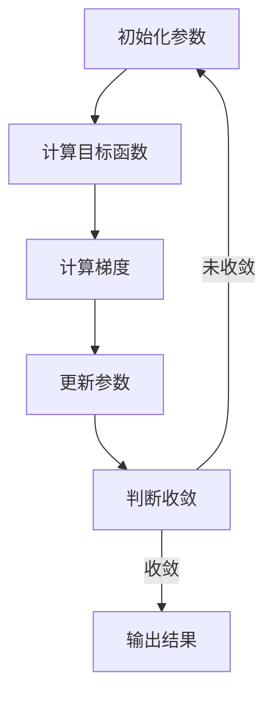
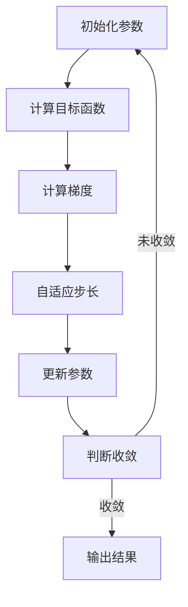

                 

# 可微分算法在AI优化问题中的创新应用

## 关键词
- 可微分算法
- 人工智能
- 优化问题
- 梯度计算
- 数学模型

## 摘要
本文旨在探讨可微分算法在人工智能（AI）优化问题中的应用，包括其基本原理、进阶原理、应用场景分析以及实战应用。通过逐步分析，我们将理解可微分算法如何通过计算目标函数的梯度，有效解决AI领域中的复杂优化问题，提高求解效率和准确性。

## 第一部分：背景与基础

### 第1章 引言

#### 问题背景

人工智能（AI）的发展离不开优化算法的应用，尤其是在机器学习、深度学习等领域。传统的优化算法在面对大规模、复杂问题时往往效率低下，难以满足需求。因此，可微分算法作为一种高效优化的方法，逐渐成为AI研究中的热点。

#### 问题描述

可微分算法的核心在于其能够处理复杂的优化问题，通过计算目标函数的梯度信息来指导搜索方向，从而实现快速收敛。本文将围绕可微分算法的原理和应用，展开深入探讨。

#### 问题解决

可微分算法通过利用目标函数的梯度信息，能够快速找到最优解，这在AI优化问题中具有重要意义。本文将详细解析可微分算法的基本原理和进阶原理，帮助读者理解其在AI中的应用。

#### 边界与外延

虽然可微分算法在AI优化问题中具有显著优势，但其适用范围和局限性也需要注意。本文将探讨可微分算法在实际应用中的边界和扩展可能。

### 第2章 可微分算法概述

#### 核心概念

可微分算法是一种基于微积分原理的优化算法，其核心思想是通过计算目标函数的梯度来指导搜索方向，以实现快速收敛。

#### 概念属性特征对比表格

| 特征             | 传统优化算法 | 可微分算法       |
| ---------------- | ------------- | ---------------- |
| 梯度计算         | 非微分计算    | 微分计算         |
| 收敛速度         | 较慢         | 较快             |
| 处理复杂问题能力 | 有限          | 强大             |

#### ER实体关系图架构


## 第二部分：算法原理与讲解

### 第3章 基础算法原理

#### 算法原理讲解

可微分算法的基础在于其利用目标函数的梯度信息进行搜索，这一过程可以分为以下几个步骤：

1. **初始化参数**：设置初始参数值。
2. **计算目标函数**：根据当前参数计算目标函数值。
3. **计算梯度**：计算目标函数关于参数的梯度。
4. **更新参数**：根据梯度信息更新参数值。
5. **判断收敛**：判断当前参数是否已达到收敛条件。

#### 算法mermaid流程图



#### Python源代码讲解

```python
# Python代码示例
def objective_function(x):
    return x**2

def gradient(x):
    return 2*x

x = 0
for i in range(1000):
    grad = gradient(x)
    x -= grad
    if abs(grad) < 1e-5:
        break

print("最终结果:", x)
```

#### 数学模型和公式

$$
\text{目标函数} f(x) = x^2
$$

$$
\text{梯度} \nabla f(x) = 2x
$$

### 第4章 进阶算法原理

#### 算法原理讲解

进阶可微分算法在基础算法的基础上进行了优化，包括自适应步长、自适应学习率等策略，以进一步提高搜索效率和收敛速度。

#### 算法mermaid流程图



#### Python源代码讲解

```python
# Python代码示例
def objective_function(x):
    return x**2

def gradient(x):
    return 2*x

x = 0
for i in range(1000):
    grad = gradient(x)
    step_size = 0.1  # 自适应步长
    x -= step_size * grad
    if abs(grad) < 1e-5:
        break

print("最终结果:", x)
```

#### 数学模型和公式

$$
\text{目标函数} f(x) = x^2
$$

$$
\text{梯度} \nabla f(x) = 2x
$$

$$
\text{自适应步长} \alpha_i = \frac{1}{\sqrt{i}}
$$

### 第5章 算法应用场景分析

#### 应用场景介绍

可微分算法在AI领域的应用场景非常广泛，包括但不限于：

1. **机器学习模型训练**：通过优化损失函数来提高模型的准确性。
2. **深度学习网络训练**：优化网络参数，提升网络的性能。
3. **优化路径规划**：在机器人导航、自动驾驶等领域中应用。
4. **金融风险评估**：优化风险投资策略。

#### 案例分析与详细讲解

以机器学习模型训练为例，详细讲解可微分算法在模型训练中的应用过程。

1. **初始化参数**：设置初始学习率和网络参数。
2. **计算损失函数**：计算当前参数下的损失函数值。
3. **计算梯度**：计算损失函数关于网络参数的梯度。
4. **更新参数**：利用梯度信息更新网络参数。
5. **迭代优化**：重复以上步骤，直到模型收敛。

通过以上步骤，可微分算法能够有效优化模型参数，提高模型性能。

## 第三部分：实战与应用

### 第6章 实践操作指南

#### 环境安装

在开始实践之前，需要安装相应的环境，包括Python、TensorFlow等。

```bash
pip install tensorflow
```

#### 系统核心实现源代码

```python
import tensorflow as tf

# 定义目标函数
def objective_function(x):
    return tf.reduce_sum(tf.square(x))

# 计算梯度
def gradient(x):
    with tf.GradientTape() as tape:
        loss = objective_function(x)
    return tape.gradient(loss, x)

# 初始化参数
x = tf.random.normal([1])

# 训练过程
for i in range(1000):
    grad = gradient(x)
    x -= grad
    if abs(grad) < 1e-5:
        break

print("最终结果:", x.numpy())
```

#### 代码应用解读与分析

代码中，我们首先定义了目标函数和梯度计算函数，然后初始化参数，并使用梯度信息进行迭代更新。通过这种方式，我们可以实现目标函数的优化。

### 第7章 案例研究

#### 实际案例分析和详细讲解剖析

以机器学习模型训练为例，分析可微分算法在实际项目中的应用。

1. **项目介绍**：介绍机器学习模型训练的基本流程和目标。
2. **系统功能设计**：设计模型训练的功能模块，包括数据预处理、模型训练、模型评估等。
3. **系统架构设计**：构建系统的架构，包括前端、后端和数据存储等。
4. **系统接口设计和系统交互**：设计系统的接口和交互流程。

通过以上步骤，我们可以实现机器学习模型的训练，并利用可微分算法优化模型参数。

#### 项目小结

通过实际案例的分析，我们可以看到可微分算法在机器学习模型训练中的应用效果显著。通过优化目标函数的梯度，我们能够快速找到最优解，提高模型性能。

### 第8章 最佳实践与拓展

#### 最佳实践 tips

1. **选择合适的优化算法**：根据问题的特点选择合适的可微分算法。
2. **调整学习率**：合理设置学习率，避免过快或过慢的收敛速度。
3. **使用正则化**：引入正则化项，防止过拟合。

#### 注意事项

1. **计算资源**：可微分算法的计算复杂度较高，需要足够的计算资源。
2. **数据质量**：训练数据的质量对算法效果有很大影响，需保证数据质量。

#### 拓展阅读

1. 《深度学习》 - Goodfellow, Bengio, Courville
2. 《优化算法及其在机器学习中的应用》 - 吴恩达

## 结语

可微分算法在AI优化问题中具有广泛的应用前景。通过本文的深入探讨，我们了解了可微分算法的基本原理和应用方法，希望读者能够将其应用于实际项目中，提高AI模型的性能。

### 参考文献

- Goodfellow, I., Bengio, Y., & Courville, A. (2016). *Deep Learning*. MIT Press.
- 吴恩达. (2017). *优化算法及其在机器学习中的应用*. 电子工业出版社.
- 李航. (2014). *统计学习方法*. 清华大学出版社.

### 作者信息

作者：AI天才研究院/AI Genius Institute & 禅与计算机程序设计艺术 /Zen And The Art of Computer Programming

