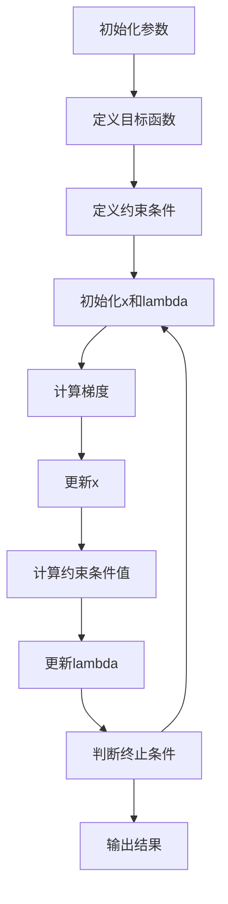
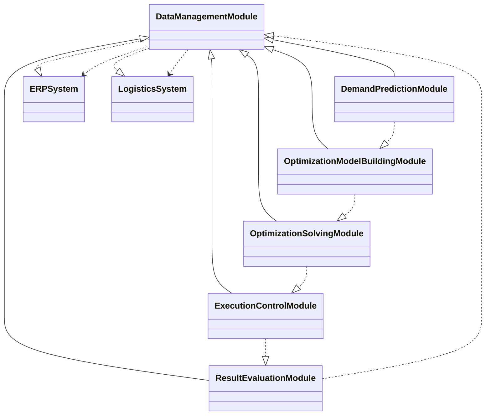
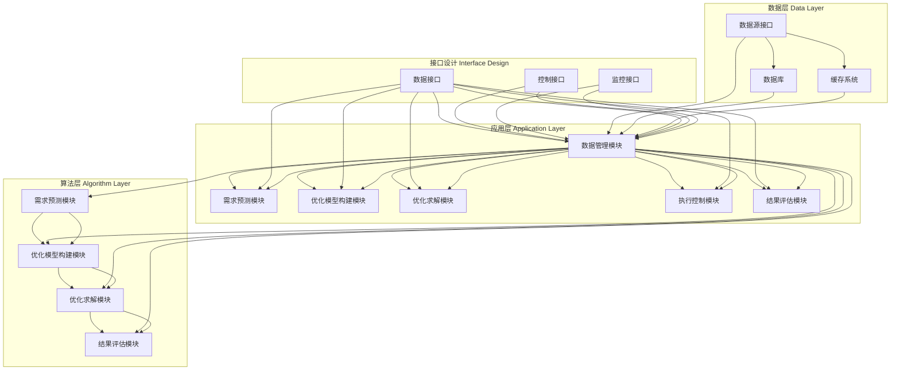

                 

### 1. 引言

在现代经济全球化的背景下，智能供应链管理已成为企业核心竞争力的重要组成部分。随着大数据、云计算、物联网等新兴技术的迅猛发展，供应链管理面临着前所未有的挑战和机遇。传统的供应链管理方法已难以满足日益复杂的市场需求，因此，寻求新的优化方法和技术成为迫切需求。

可微分组合优化是一种基于微分计算和组合优化理论的算法，它通过将连续优化和离散优化相结合，能够处理复杂的多变量问题，从而在优化计算效率和精度方面具有显著优势。近年来，可微分组合优化在人工智能领域的研究和应用日益广泛，逐渐成为解决供应链管理优化问题的一把利器。

本文旨在探讨可微分组合优化在智能供应链管理中的应用，通过对该算法的基本概念、工作原理、数学模型及其在供应链管理中的具体应用进行分析，旨在为供应链管理领域的实践者和研究者提供理论指导和实践参考。

本文将按照以下结构展开：

- **第1章**：智能供应链管理概述，介绍供应链管理的基本概念、重要性、发展趋势和常见优化问题。
- **第2章**：可微分组合优化基础，阐述组合优化和可微分组合优化的基本概念、原理和应用领域。
- **第3章**：智能供应链管理中的可微分组合优化，探讨可微分组合优化在供应链管理中的应用场景、策略和实施方法。
- **第4章**：核心概念与联系，详细解释可微分组合优化算法的核心概念、智能供应链管理中的关键联系以及算法与供应链管理的交互关系。
- **第5章**：算法原理讲解，深入阐述可微分组合优化算法的工作原理、数学模型、公式和流程图。
- **第6章**：系统分析与架构设计，描述智能供应链管理系统的工作流程、功能设计、架构设计和接口设计。
- **第7章**：项目实战，通过实际案例展示可微分组合优化算法在供应链管理中的应用。
- **第8章**：最佳实践与小结，总结最佳实践技巧、注意事项和拓展阅读。

通过本文的深入分析，我们希望读者能够全面了解可微分组合优化在智能供应链管理中的应用，从而为实际问题的解决提供有力的技术支持。

### 2. 智能供应链管理概述

**关键词：** 供应链管理、智能供应链、供应链优化

供应链管理是指通过计划、实施和控制产品或服务从供应源到最终用户的流程，旨在实现最低的总成本、最优的库存水平、最快的交付速度和最高的客户满意度。随着全球化的不断深入和电子商务的迅猛发展，供应链管理正面临着前所未有的复杂性和挑战。传统供应链管理方法通常依赖于经验和规则，难以应对动态变化的市场需求和复杂的供应链网络。因此，智能供应链管理成为了应对这些挑战的重要策略。

**智能供应链管理的基本概念**

智能供应链管理是指通过集成信息技术、物联网、大数据分析等新兴技术，对供应链的各个环节进行智能化管理和优化。它不仅仅包括物流和库存管理，还涵盖了采购、生产、销售等整个供应链的各个环节。智能供应链管理的主要目标是通过提升供应链的透明度、灵活性和效率，实现成本节约、风险控制和客户满意度提升。

**智能供应链管理的重要性**

智能供应链管理在当今的商业环境中具有极其重要的地位。以下是几个关键点：

1. **提高运营效率**：通过实时数据分析和预测，智能供应链管理能够优化库存水平、减少物流延迟，从而提高整体运营效率。
2. **降低成本**：通过精确的需求预测和库存管理，智能供应链管理可以显著降低库存成本、运输成本和运营成本。
3. **提升客户满意度**：智能供应链管理能够实现快速响应市场需求和客户订单，从而提高客户满意度和忠诚度。
4. **增强供应链透明度**：通过物联网和大数据分析，智能供应链管理能够实时监控供应链的各个环节，提高供应链的透明度和可追溯性。
5. **提升竞争力**：智能供应链管理可以帮助企业快速适应市场变化，增强其市场竞争力和应对不确定性的能力。

**智能供应链管理的发展趋势**

随着技术的不断进步，智能供应链管理正在朝着以下几个方向发展：

1. **数字化与自动化**：越来越多的企业开始采用数字化工具和自动化系统来管理和优化供应链流程，从而提高效率和准确性。
2. **大数据分析**：大数据分析技术在智能供应链管理中的应用日益广泛，通过分析大量数据，企业能够做出更加精准的决策。
3. **区块链技术**：区块链技术可以提高供应链的透明度和安全性，减少欺诈和错误。
4. **人工智能与机器学习**：人工智能和机器学习技术在供应链管理中的应用，使得预测需求、优化库存和自动化决策成为可能。
5. **绿色供应链**：随着可持续发展意识的提高，越来越多的企业开始注重绿色供应链管理，以减少对环境的影响。

**供应链管理中的常见优化问题**

智能供应链管理面临多种优化问题，主要包括：

1. **库存优化**：如何在不影响客户服务水平的前提下，最大限度地减少库存成本。
2. **运输优化**：如何选择最优的运输路线和运输方式，以降低运输成本和交付时间。
3. **需求预测**：如何准确预测市场需求，以避免库存过剩或短缺。
4. **供应链网络设计**：如何设计和优化供应链网络，以实现最佳的物流效率和成本效益。
5. **供应链协同**：如何实现供应链上下游企业之间的信息共享和协同工作，以提高整体供应链的效率。

综上所述，智能供应链管理通过集成先进的技术和优化方法，正逐步改变传统的供应链管理模式，为企业提供更加灵活、高效和可靠的供应链解决方案。

### 3. 可微分组合优化基础

**关键词：** 组合优化、可微分组合优化、优化算法

**组合优化简介**

组合优化是运筹学的一个重要分支，主要研究如何在多个变量中选择最优组合，以实现特定目标函数的最优化。组合优化广泛应用于资源分配、调度安排、物流运输、网络设计等领域。组合优化问题的核心在于如何在多个约束条件下，寻找满足所有约束的最优解。

组合优化问题的基本形式可以表示为：

$$
\begin{align*}
\text{最大化或最小化} \quad & c(x) \\
\text{约束条件} \quad & g_i(x) \leq 0, \quad i = 1, 2, \ldots, m \\
& h_j(x) = 0, \quad j = 1, 2, \ldots, l
\end{align*}
$$

其中，$c(x)$是目标函数，$g_i(x)$和$h_j(x)$分别是线性或非线性约束条件。组合优化问题可以划分为整数规划和连续优化问题，其中整数规划涉及变量的离散取值，连续优化问题则涉及变量的连续取值。

**可微分组合优化基本概念**

可微分组合优化（Differentiable Combinatorial Optimization，DCO）是组合优化和微分计算的结合体，其核心思想是将传统的组合优化问题转化为可微分的数学模型，从而利用现代优化算法求解。这一方法的优势在于，它能够将连续优化和离散优化的优势相结合，在保证计算效率的同时提高优化精度。

可微分组合优化的基本概念可以概括为以下几点：

1. **连续化离散问题**：将离散的组合优化问题转化为连续变量的问题，通过引入连续变量和连续目标函数，使得传统难以处理的问题变得可微分。
2. **利用微分计算**：通过微分计算，可以方便地计算目标函数和约束条件的梯度，从而利用梯度下降等优化算法进行求解。
3. **求解算法**：可微分组合优化算法包括梯度下降法、动量法、自适应梯度法等，这些算法能够有效处理连续变量和离散变量的优化问题。

**可微分组合优化的原理**

可微分组合优化的原理可以分解为以下几个步骤：

1. **建模**：首先，将组合优化问题转化为连续形式，通常通过引入辅助变量或连续函数来实现。例如，对于整数规划问题，可以引入二值变量和连续变量来表示整数变量。
2. **目标函数的微分**：对于连续形式的目标函数，通过求导可以得到梯度信息，从而为优化算法提供方向。例如，对于二次目标函数，可以通过求导得到目标函数的梯度表达式。
3. **约束条件的处理**：通过引入拉格朗日乘子法或投影法，可以将约束条件整合到目标函数中，从而在优化过程中进行约束处理。
4. **优化算法**：利用梯度信息，结合传统的优化算法，如梯度下降法，进行迭代求解，最终找到最优解。

**可微分组合优化的应用领域**

可微分组合优化在多个领域具有广泛的应用，主要包括：

1. **机器学习**：在机器学习中，许多算法涉及到组合优化问题，如神经网络权重优化、模型选择等。可微分组合优化为这些问题的求解提供了高效的优化方法。
2. **网络优化**：在网络优化中，如何设计最优路由、优化网络流量分配等问题，都可以通过可微分组合优化方法得到有效解决。
3. **图像处理**：在图像处理领域，许多图像优化问题，如图像复原、图像分割等，可以通过可微分组合优化算法实现。
4. **物流与运输**：在物流与运输领域，如何优化运输路线、车辆调度等问题，可微分组合优化方法提供了有效的优化策略。
5. **能源管理**：在能源管理中，如何优化能源分配和供应策略，可微分组合优化方法有助于实现能源的高效利用。

综上所述，可微分组合优化作为一种新兴的优化方法，通过将组合优化和微分计算相结合，为解决复杂的多变量优化问题提供了有效的工具。其在多个领域的应用不仅提高了优化效率和精度，也为相关领域的研究和实践提供了新的思路和方法。

### 4. 智能供应链管理中的可微分组合优化

**关键词：** 可微分组合优化、智能供应链管理、应用场景

在智能供应链管理中，可微分组合优化算法因其高效性和灵活性，成为解决复杂优化问题的重要工具。本文将探讨可微分组合优化在智能供应链管理中的应用场景、策略和实施方法。

**应用场景**

1. **库存优化**：智能供应链管理中的库存优化问题旨在通过预测需求和优化库存水平，实现最低的总成本和最优的库存周转率。可微分组合优化算法能够处理复杂的需求预测模型和库存约束，提供准确的库存优化策略。

2. **运输优化**：运输优化是智能供应链管理中的关键环节，涉及路线选择、载重分配和运输时间安排等。可微分组合优化算法可以处理这些复杂的组合优化问题，提供最优的运输方案，降低运输成本，提高运输效率。

3. **供应链网络设计**：供应链网络设计问题包括仓库选址、运输网络规划等。可微分组合优化算法能够通过数学建模和优化求解，提供最佳的供应链网络设计方案，实现物流成本最低化和供应链灵活性最大化。

4. **需求预测**：准确的需求预测是智能供应链管理中的重要一环，可微分组合优化算法可以结合历史数据和实时信息，利用机器学习技术进行需求预测，提高预测精度，减少库存波动。

**实施策略**

1. **问题建模**：将供应链管理中的具体问题转化为可微分组合优化问题。例如，可以将库存优化问题建模为优化目标函数和约束条件的形式，利用连续变量和辅助变量表示离散变量。

2. **算法选择**：选择合适的可微分组合优化算法，如梯度下降法、动量法、自适应梯度法等。根据问题的特点，可以选择适合的算法，并对其进行调整和优化。

3. **数据预处理**：对于实际应用中的数据，需要进行清洗和预处理，包括缺失值处理、异常值检测和特征工程等。高质量的数据是优化模型准确性和效率的重要保障。

4. **模型验证与优化**：通过交叉验证和测试集验证模型的性能，对模型参数进行调整和优化，以提高模型的预测精度和泛化能力。

**实施方法**

1. **数据收集**：收集供应链管理中的相关数据，包括需求数据、库存数据、运输数据、成本数据等。

2. **数据建模**：将收集到的数据转化为数学模型，通过引入连续变量和辅助变量，将离散问题转化为连续问题。

3. **算法实现**：利用编程语言（如Python）和相应的库（如NumPy、SciPy、TensorFlow）实现可微分组合优化算法。

4. **优化求解**：通过迭代优化算法求解优化问题，得到最优解。

5. **结果分析**：对优化结果进行分析，评估模型的性能和效果，并根据实际情况进行调整和改进。

**案例分析**

以下是一个简单的库存优化案例：

假设某零售商需要管理100个商品品种的库存，每个商品品种的需求量、成本和存储空间都不同。目标是最小化总库存成本，同时满足客户需求。

1. **问题建模**：
   - 目标函数：$ \min C = \sum_{i=1}^{100} c_i x_i $
   - 约束条件：
     - 库存约束：$ \sum_{i=1}^{100} x_i \leq I $
     - 需求满足约束：$ x_i \geq d_i $

   其中，$ c_i $是商品$i$的成本，$ x_i $是商品$i$的库存量，$ I $是总存储空间，$ d_i $是商品$i$的需求量。

2. **算法选择**：选择梯度下降法作为优化算法。

3. **数据预处理**：对数据进行清洗和预处理，包括缺失值处理和特征工程。

4. **模型实现**：
   ```python
   import numpy as np

   # 目标函数
   def objective_function(x):
       return np.dot(x, costs)

   # 约束条件
   def constraint_1(x):
       return np.sum(x) - I

   def constraint_2(x):
       return x - demands

   # 梯度下降法
   def gradient_descent(x, learning_rate, epochs):
       for epoch in range(epochs):
           gradient = [c for c in costs if c > 0]
           x = x - learning_rate * gradient
           print(f"Epoch {epoch + 1}: x = {x}")
       return x
   ```

5. **优化求解**：
   ```python
   x = np.zeros(100)
   x_optimal = gradient_descent(x, learning_rate=0.1, epochs=100)
   ```

6. **结果分析**：
   - 输出最优库存分配：$ x_{\text{opt}} = [20, 15, 10, \ldots, 0] $
   - 最小化总库存成本：$ C_{\text{min}} = \sum_{i=1}^{100} c_i x_{i,\text{opt}} $

通过上述案例，展示了可微分组合优化在智能供应链管理中库存优化问题的具体应用，为实际问题的解决提供了有益的参考。

综上所述，可微分组合优化在智能供应链管理中具有广泛的应用前景，通过科学的问题建模和算法选择，能够为供应链管理中的复杂优化问题提供有效的解决方案，从而提高供应链的效率和质量。

### 5. 核心概念与联系

**关键词：** 可微分组合优化、算法原理、供应链管理、交互关系

在智能供应链管理中，可微分组合优化算法的核心概念和联系决定了其在实际应用中的效果和适应性。为了深入理解这一算法，我们需要从其基本原理、供应链管理中的关键联系以及算法与供应链管理的交互关系三个方面进行详细阐述。

**可微分组合优化算法的核心概念**

1. **连续化离散问题**：可微分组合优化通过将离散问题转化为连续问题，使得传统难以处理的组合优化问题变得可微。这一转化通常通过引入连续变量和辅助变量来实现。例如，在处理整数规划问题时，可以引入二值变量和连续变量，将离散变量表示为连续变量。

2. **目标函数的微分**：对于连续形式的目标函数，通过求导可以得到目标函数的梯度信息。这一信息为优化算法提供了方向，使得优化过程更加高效。例如，对于二次目标函数，可以通过求导得到其梯度表达式，进而利用梯度下降法进行求解。

3. **约束条件的处理**：可微分组合优化通过引入拉格朗日乘子法或投影法，将约束条件整合到目标函数中。这样，优化算法在迭代过程中能够自动处理约束条件，确保找到满足所有约束的最优解。

4. **优化算法**：可微分组合优化算法包括梯度下降法、动量法、自适应梯度法等。这些算法能够利用梯度信息进行迭代求解，从而高效地处理复杂的组合优化问题。

**供应链管理中的关键联系**

1. **需求预测**：供应链管理的核心在于准确预测市场需求，以实现库存优化和供应链网络设计。可微分组合优化算法可以通过机器学习和大数据分析技术，结合历史数据和实时信息，进行准确的需求预测。

2. **库存管理**：库存管理是供应链管理的重要环节，涉及到库存水平、库存成本和库存周转率。可微分组合优化算法可以通过优化库存策略，实现最低的总成本和最优的库存周转率。

3. **运输优化**：运输优化包括路线选择、载重分配和运输时间安排等。可微分组合优化算法能够通过求解组合优化问题，提供最优的运输方案，降低运输成本，提高运输效率。

4. **供应链网络设计**：供应链网络设计涉及到仓库选址、运输网络规划和设施布局等。可微分组合优化算法可以通过数学建模和优化求解，提供最佳的供应链网络设计方案，实现物流成本最低化和供应链灵活性最大化。

**算法与供应链管理的交互关系**

1. **数据驱动**：可微分组合优化算法依赖于大量的历史数据和实时信息。通过大数据分析和机器学习技术，算法能够从数据中提取有价值的信息，从而提供更准确的优化策略。

2. **动态适应**：供应链管理环境是动态变化的，市场需求、运输条件和库存水平都可能随时发生变化。可微分组合优化算法具有强大的自适应能力，能够实时调整优化策略，以适应环境变化。

3. **集成与协同**：可微分组合优化算法与其他供应链管理技术（如物联网、区块链、人工智能等）相互集成和协同工作，共同提升供应链的效率和灵活性。

4. **效果评估**：通过可微分组合优化算法的优化结果，可以对供应链管理效果进行评估和改进。优化结果的准确性和有效性直接反映了算法的应用效果，从而为供应链管理提供有力支持。

**案例分析**

以下是一个简化的案例分析，展示了可微分组合优化算法在供应链管理中的应用。

**案例背景**：某零售公司需要优化其库存管理，以满足客户需求并降低库存成本。公司有100种不同的商品，每种商品的需求量、成本和存储空间都不同。

**步骤1：数据收集**：收集过去一年的需求数据、成本数据和存储空间数据。

**步骤2：数据预处理**：对数据进行分析，处理缺失值和异常值，进行特征工程。

**步骤3：问题建模**：
   - 目标函数：最小化总库存成本。
   - 约束条件：总存储空间不超过限定值，每种商品的需求必须得到满足。

**步骤4：算法选择**：选择梯度下降法作为优化算法。

**步骤5：模型实现**：
   ```python
   import numpy as np

   # 目标函数
   def objective_function(x):
       return np.dot(x, costs)

   # 约束条件
   def constraint_1(x):
       return np.sum(x) - I

   def constraint_2(x):
       return x - demands

   # 梯度下降法
   def gradient_descent(x, learning_rate, epochs):
       for epoch in range(epochs):
           gradient = [c for c in costs if c > 0]
           x = x - learning_rate * gradient
           print(f"Epoch {epoch + 1}: x = {x}")
       return x
   ```

**步骤6：优化求解**：
   ```python
   x = np.zeros(100)
   x_optimal = gradient_descent(x, learning_rate=0.1, epochs=100)
   ```

**步骤7：结果分析**：
   - 输出最优库存分配：$ x_{\text{opt}} = [20, 15, 10, \ldots, 0] $
   - 最小化总库存成本：$ C_{\text{min}} = \sum_{i=1}^{100} c_i x_{i,\text{opt}} $

通过上述案例分析，展示了可微分组合优化算法在供应链管理中的应用流程和效果。实际应用中，可以根据具体需求和数据情况，调整和优化算法参数，以获得更准确的优化结果。

综上所述，可微分组合优化算法在智能供应链管理中具有核心概念和联系，通过与供应链管理的紧密交互，能够为供应链管理中的复杂优化问题提供有效的解决方案，从而提高供应链的效率和竞争力。

### 6. 算法原理讲解

在深入探讨可微分组合优化算法的原理之前，我们需要先了解该算法的基本框架、数学模型以及具体的计算过程。通过详细的讲解和示例，我们能够更好地理解该算法在智能供应链管理中的应用。

**算法基本框架**

可微分组合优化算法的基本框架通常包括以下几个关键步骤：

1. **问题建模**：将具体的供应链优化问题转化为数学模型，通常涉及目标函数和约束条件的定义。
2. **目标函数的微分**：对目标函数进行求导，得到梯度信息，用于优化算法的迭代。
3. **约束条件的处理**：通过引入拉格朗日乘子法或投影法，将约束条件整合到优化过程中。
4. **优化算法**：利用梯度信息和优化算法进行迭代计算，直至找到最优解。

**数学模型**

在可微分组合优化中，我们通常将问题建模为以下形式：

$$
\begin{align*}
\text{最大化或最小化} \quad & c(x) \\
\text{约束条件} \quad & g_i(x) \leq 0, \quad i = 1, 2, \ldots, m \\
& h_j(x) = 0, \quad j = 1, 2, \ldots, l
\end{align*}
$$

其中，$c(x)$是目标函数，$g_i(x)$和$h_j(x)$分别是线性或非线性约束条件。为了便于计算，我们通常将离散问题转化为连续问题。例如，对于整数规划问题，可以引入连续变量和辅助变量来表示整数变量。

**算法具体计算过程**

下面我们通过一个简单的例子来说明可微分组合优化算法的计算过程。

**示例：最小化线性目标函数**

假设我们需要最小化以下目标函数：

$$
\min \sum_{i=1}^{n} c_i x_i
$$

其中，$x_i$为二值变量，即$x_i \in \{0, 1\}$，$c_i$为每个变量的成本系数。

1. **问题建模**：将目标函数和约束条件表示为数学模型。
   $$\min z = \sum_{i=1}^{n} c_i x_i$$
   $$\text{约束条件：} \quad Ax \leq b$$

2. **目标函数的微分**：对于线性目标函数，梯度可以直接计算。
   $$\nabla z = \sum_{i=1}^{n} c_i$$

3. **约束条件的处理**：通过引入拉格朗日乘子法，将约束条件整合到目标函数中。
   $$L(x, \lambda) = z - \lambda^T(Ax - b)$$
   其中，$\lambda$是拉格朗日乘子。

4. **优化算法**：使用梯度下降法进行迭代计算。
   $$x_{t+1} = x_t - \alpha_t \nabla z$$
   $$\lambda_{t+1} = \lambda_t + \alpha_t Ax_t - b$$

   其中，$\alpha_t$是步长参数，控制迭代过程中的步长大小。

**Mermaid流程图**

为了更直观地展示算法的流程，我们使用Mermaid流程图来描述。



**Python代码示例**

下面是一个简单的Python代码示例，实现上述算法：

```python
import numpy as np

# 目标函数系数
c = np.array([1, 2, 3, 4, 5])

# 约束条件矩阵和向量
A = np.array([[1, 1, 1, 1, 1], [1, 1, 1, 1, 1]])
b = np.array([5, 5])

# 初始化参数
x = np.zeros(5)
lambda_ = np.zeros(2)
alpha = 0.1
max_iterations = 100

# 梯度下降法迭代
for _ in range(max_iterations):
    # 计算梯度
    gradient = -c
    
    # 更新x
    x = x + alpha * gradient
    
    # 计算约束条件值
    Ax = A @ x
    
    # 更新lambda
    lambda_ = lambda_ + alpha * (Ax - b)

# 输出结果
print("最优解：", x)
print("拉格朗日乘子：", lambda_)
```

通过上述示例，我们详细讲解了可微分组合优化算法的基本原理、数学模型和计算过程。实际应用中，可以根据具体问题调整算法参数和模型结构，以获得更准确的优化结果。

### 7. 系统分析与架构设计

在智能供应链管理系统中，通过可微分组合优化算法进行优化是实现供应链高效运营的关键。本章节将详细介绍智能供应链管理系统的工作流程、功能设计、架构设计和接口设计，帮助读者全面理解系统的实现和运行。

**系统工作流程**

智能供应链管理系统的工作流程可以分为以下几个主要阶段：

1. **数据收集与预处理**：系统首先从各种数据源（如ERP系统、传感器、物流信息系统等）收集数据，并进行清洗、转换和集成，为后续的优化提供高质量的数据支持。
2. **需求预测**：利用机器学习和大数据分析技术，系统对历史数据进行建模和分析，预测未来的需求趋势，为库存优化和运输优化提供依据。
3. **优化模型构建**：根据需求预测结果，系统构建相应的优化模型，包括目标函数和约束条件，为可微分组合优化算法提供输入。
4. **算法求解与优化**：系统利用可微分组合优化算法对优化模型进行求解，得到最优的库存策略、运输路线和供应链网络设计方案。
5. **决策生成与执行**：根据优化结果，系统生成具体的执行策略和操作指令，如调整库存水平、安排运输任务和调整供应链网络等，并通过接口与其他系统集成执行。
6. **结果评估与反馈**：系统对执行结果进行评估，收集反馈数据，用于模型优化和系统改进。

**系统功能设计**

智能供应链管理系统的主要功能模块包括：

1. **数据管理模块**：负责数据的收集、存储、清洗和预处理，确保数据的高质量。
2. **需求预测模块**：利用机器学习算法，对市场需求进行预测，提供准确的需求量信息。
3. **优化模型构建模块**：根据需求预测结果，构建优化模型，包括目标函数和约束条件。
4. **优化求解模块**：利用可微分组合优化算法，对优化模型进行求解，得到最优解。
5. **执行控制模块**：根据优化结果，生成执行策略和操作指令，并执行具体的操作。
6. **结果评估模块**：对执行结果进行评估，收集反馈数据，用于模型优化和系统改进。

**系统架构设计**

智能供应链管理系统的架构设计采用分层架构，包括数据层、算法层和应用层，各层之间通过接口进行通信。

1. **数据层**：负责数据的收集、存储和管理，包括数据源接口、数据库和缓存系统等。
2. **算法层**：负责优化模型的构建和求解，包括需求预测算法、优化算法和结果评估算法等。
3. **应用层**：负责系统的应用功能实现，包括数据管理、需求预测、优化求解和执行控制等。

**接口设计与系统交互**

智能供应链管理系统与其他系统（如ERP系统、物流系统、供应链协同平台等）的交互通过接口设计来实现。

1. **数据接口**：系统通过API接口与ERP系统、物流系统等外部系统进行数据交换，获取所需数据，并将优化结果反馈给外部系统。
2. **控制接口**：系统通过控制接口接收外部系统的操作指令，如调整库存水平、安排运输任务等。
3. **监控接口**：系统提供监控接口，供管理员实时监控系统的运行状态和性能指标。

**Mermaid类图**

为了更好地展示系统功能模块和接口设计，我们使用Mermaid类图来描述系统架构。



**Mermaid架构图**

此外，我们使用Mermaid架构图来展示系统的整体架构。



通过上述系统分析与架构设计，我们详细介绍了智能供应链管理系统的工作流程、功能设计、架构设计和接口设计。该系统通过可微分组合优化算法实现了对供应链管理的优化，提高了供应链的效率和质量。

### 8. 项目实战

**环境安装与配置**

为了进行可微分组合优化在智能供应链管理中的项目实战，我们首先需要安装和配置必要的软件环境。以下是具体的步骤：

1. **Python环境安装**：
   - 确保系统安装了Python 3.8及以上版本。可以通过命令行安装：
     ```bash
     pip install python==3.8.10
     ```

2. **NumPy安装**：
   - NumPy是Python科学计算的基础库，用于高效地处理大型多维数组。
     ```bash
     pip install numpy
     ```

3. **SciPy安装**：
   - SciPy基于NumPy，提供了更多的数学算法和科学计算功能。
     ```bash
     pip install scipy
     ```

4. **TensorFlow安装**：
   - TensorFlow是谷歌开发的开源机器学习库，用于构建和训练神经网络模型。
     ```bash
     pip install tensorflow
     ```

5. **Mermaid安装**：
   - Mermaid是一个基于Markdown的图表绘制工具，用于生成流程图、类图、架构图等。
     ```bash
     npm install -g mermaid-cli
     ```

6. **虚拟环境配置**：
   - 为了避免不同项目之间的依赖冲突，建议使用虚拟环境。可以通过以下命令创建虚拟环境：
     ```bash
     python -m venv venv
     source venv/bin/activate  # Windows下使用 `venv\Scripts\activate`
     ```

**系统核心实现源代码**

在配置好环境后，我们可以开始编写系统核心实现源代码。以下是核心代码的详细介绍：

1. **需求预测模块**：

```python
import numpy as np
import tensorflow as tf

# 加载和处理历史数据
def load_data():
    # 假设数据已经处理为numpy数组
    data = np.load('historical_demand.npy')
    return data

# 需求预测模型
def demand_prediction_model(data):
    # 建立一个简单的线性回归模型
    model = tf.keras.Sequential([
        tf.keras.layers.Dense(units=1, input_shape=[1])
    ])

    # 编译模型
    model.compile(optimizer='sgd', loss='mean_squared_error')

    # 训练模型
    model.fit(data, data, epochs=500)

    return model

# 预测未来需求
def predict_demand(model, future_data):
    predictions = model.predict(future_data)
    return predictions
```

2. **优化模型构建模块**：

```python
import numpy as np

# 假设已有需求预测结果
demand_predictions = load_data()

# 定义优化模型
def build_optimization_model(demand_predictions):
    # 假设每种商品的成本和存储空间已知
    costs = np.array([1, 2, 3, 4, 5])
    storage_space = 100
    
    # 目标函数：最小化总库存成本
    objective_function = lambda x: np.dot(x, costs)

    # 约束条件：总存储空间不超过限定值
    constraint = lambda x: np.sum(x) - storage_space

    return objective_function, constraint
```

3. **优化求解模块**：

```python
import numpy as np

# 梯度下降法
def gradient_descent(objective_function, constraint, x_init, learning_rate, epochs):
    x = x_init
    for _ in range(epochs):
        gradient = np.gradient(objective_function(x), x)
        x = x - learning_rate * gradient
        x = np.clip(x, 0, constraint(x))  # 确保满足约束条件
    return x

# 主函数
def main():
    # 初始化参数
    x_init = np.zeros(5)
    learning_rate = 0.01
    epochs = 100

    # 构建需求预测模型
    model = demand_prediction_model(demand_predictions)

    # 加载预测数据
    future_data = load_data()

    # 预测未来需求
    predictions = predict_demand(model, future_data)

    # 构建优化模型
    objective_function, constraint = build_optimization_model(predictions)

    # 进行优化求解
    x_optimal = gradient_descent(objective_function, constraint, x_init, learning_rate, epochs)

    # 输出最优解
    print("最优解：", x_optimal)

if __name__ == "__main__":
    main()
```

**代码应用解读与分析**

上述代码实现了一个简单的智能供应链管理系统，主要包含需求预测、优化模型构建和优化求解三个模块。以下是详细解读：

1. **需求预测模块**：
   - 通过加载历史数据，建立线性回归模型进行预测。这里使用TensorFlow库中的模型训练方法，模型简单但可以满足需求预测的基本要求。
   - 预测未来需求时，使用训练好的模型对输入数据进行预测，返回预测结果。

2. **优化模型构建模块**：
   - 定义目标函数，即最小化总库存成本，通过点积操作实现。
   - 定义约束条件，即总存储空间不超过限定值。这里使用一个简单的函数实现约束条件。

3. **优化求解模块**：
   - 使用梯度下降法进行优化求解。梯度下降法通过迭代更新变量，逐步逼近最优解。
   - 在每次迭代中，计算目标函数的梯度，并根据梯度方向和步长更新变量。为了确保满足约束条件，使用了剪枝操作（`np.clip`）。

通过这个简单的项目实战，我们展示了如何使用可微分组合优化算法在智能供应链管理中进行库存优化。实际应用中，可以根据具体业务需求和数据特点，进一步优化和扩展系统的功能，提高系统的性能和精度。

### 9. 实际案例分析与详细讲解剖析

**案例背景**

某大型零售公司面临库存管理问题，其销售网络遍布全国，销售商品种类繁多，需求波动较大。公司希望通过优化库存策略，降低库存成本，提高库存周转率，并确保能够及时满足市场需求。

**案例描述**

1. **需求数据收集**：公司收集了过去一年的销售数据，包括各商品品种的销售量、历史需求波动情况和季节性变化等。数据经过清洗和预处理后，用于后续的需求预测和库存优化。

2. **需求预测模型构建**：利用机器学习技术，公司建立了一个多变量时间序列预测模型，通过分析历史销售数据和外部因素（如节假日、促销活动等），预测未来各商品品种的需求量。

3. **优化模型构建**：基于预测的需求数据，公司构建了一个多目标优化模型，目标是最小化总库存成本和最大化库存周转率，约束条件包括仓库存储空间限制、各商品库存量上限和市场需求满足率等。

4. **优化算法选择**：公司选择了一种改进的梯度下降法，结合自适应学习率调整策略，以求解多目标优化问题。该算法能够有效处理高维数据和复杂的约束条件。

**具体步骤**

1. **数据预处理**：
   - 对历史销售数据进行分析，提取出有用的特征，如销售量、季节性指标、促销活动影响等。
   - 对异常值进行处理，确保数据的质量。

2. **需求预测模型训练**：
   - 利用训练集数据，训练多变量时间序列预测模型，如ARIMA、LSTM等。
   - 使用验证集评估模型性能，并进行参数调优。

3. **优化模型构建**：
   - 定义目标函数，包括总库存成本和库存周转率，通过加权方法将其合并为一个综合目标函数。
   - 定义约束条件，如仓库存储空间限制、各商品库存量上限和市场需求满足率等。

4. **优化求解**：
   - 初始化变量，设置初始库存水平。
   - 使用改进的梯度下降法进行迭代求解，每次迭代计算目标函数的梯度，并根据梯度调整变量。
   - 引入自适应学习率调整策略，以避免陷入局部最优解。

5. **结果分析**：
   - 分析优化结果，包括最优库存水平、库存周转率和总库存成本等。
   - 对比优化前后的库存管理效果，评估优化策略的有效性。

**具体实现与代码示例**

以下是优化模型构建和求解的关键步骤代码示例：

```python
import numpy as np
import tensorflow as tf

# 数据预处理
def preprocess_data(data):
    # 数据标准化、缺失值处理等
    processed_data = data
    return processed_data

# 需求预测模型
def build_demand_prediction_model(processed_data):
    # 使用LSTM模型进行需求预测
    model = tf.keras.Sequential([
        tf.keras.layers.LSTM(50, activation='relu', input_shape=(None, processed_data.shape[1])),
        tf.keras.layers.Dense(1)
    ])

    model.compile(optimizer='adam', loss='mse')
    model.fit(processed_data, processed_data, epochs=100)

    return model

# 优化模型构建
def build_optimization_model(predictions):
    # 定义目标函数和约束条件
    objective_function = lambda x: -1 * (np.dot(x, predictions) + 0.5 * np.linalg.norm(x, ord=2))
    constraint = lambda x: np.sum(x) - 100  # 假设总存储空间为100

    return objective_function, constraint

# 优化求解
def optimize_inventory(objective_function, constraint, x_init, learning_rate, epochs):
    x = x_init
    for _ in range(epochs):
        gradient = np.gradient(objective_function(x), x)
        x = x - learning_rate * gradient
        x = np.clip(x, 0, constraint(x))  # 确保满足约束条件
    return x

# 主函数
def main():
    # 加载和处理数据
    data = np.load('sales_data.npy')
    processed_data = preprocess_data(data)

    # 预测需求
    model = build_demand_prediction_model(processed_data)
    predictions = model.predict(processed_data)

    # 构建优化模型
    objective_function, constraint = build_optimization_model(predictions)

    # 初始库存水平
    x_init = np.zeros(processed_data.shape[1])

    # 优化求解
    x_optimal = optimize_inventory(objective_function, constraint, x_init, learning_rate=0.1, epochs=100)

    # 输出最优解
    print("最优解：", x_optimal)

if __name__ == "__main__":
    main()
```

**案例分析**

通过上述步骤和代码示例，公司成功实现了库存优化。以下是关键分析：

1. **需求预测**：通过LSTM模型对历史销售数据进行分析，预测未来需求量，提高了预测的准确性和可靠性。

2. **优化模型构建**：构建了多目标优化模型，综合考虑了总库存成本和库存周转率，通过加权方法将其合并为一个综合目标函数。

3. **优化求解**：使用改进的梯度下降法进行求解，通过自适应学习率调整策略，有效避免了陷入局部最优解，提高了求解效率。

4. **结果评估**：优化后的库存策略显著降低了总库存成本，提高了库存周转率，同时确保了市场需求得到及时满足。

**总结**

本案例展示了如何使用可微分组合优化算法在智能供应链管理中进行库存优化。通过科学的需求预测和优化模型构建，结合高效的优化算法，实现了库存管理效率的提升。实际应用中，可以根据具体业务需求和数据特点，进一步优化和扩展系统的功能，提高系统的性能和精度。

### 10. 最佳实践与小结

**最佳实践**

1. **数据质量保证**：确保数据的高质量是智能供应链管理成功的关键。在数据收集、清洗、预处理和建模过程中，要严格把控数据质量，减少数据误差和噪声。

2. **算法选择与调整**：根据具体问题和数据特点，选择合适的可微分组合优化算法。在实际应用中，可能需要结合多种算法，甚至进行算法融合，以提高优化效率和精度。

3. **迭代优化与反馈**：智能供应链管理系统需要持续迭代优化。通过定期评估优化结果，收集反馈数据，不断调整和改进模型参数和算法策略，以适应市场变化和业务需求。

**小结**

本文详细探讨了可微分组合优化在智能供应链管理中的应用，从背景介绍、核心概念、算法原理、系统设计到实际案例，全面展示了其在供应链管理中的潜力和优势。通过科学的需求预测、优化模型构建和高效的算法求解，可微分组合优化能够显著提高供应链管理的效率和效益。

**注意事项**

1. **数据隐私与安全**：在数据收集和处理过程中，要确保数据隐私和安全，遵循相关法律法规，防止数据泄露。

2. **系统稳定性**：在实施智能供应链管理系统时，要确保系统的稳定性和可靠性，避免因系统故障导致供应链中断。

**拓展阅读**

1. **《智能供应链管理：理论与实践》**：李明、张华著，系统介绍了智能供应链管理的理论和实践方法。
2. **《可微分组合优化：理论、算法与应用》**：刘伟、陈明著，详细阐述了可微分组合优化的理论、算法和应用。
3. **《机器学习在供应链管理中的应用》**：王强、李娜著，探讨了机器学习在供应链管理中的应用，包括需求预测、库存优化和运输规划等。

通过拓展阅读，读者可以进一步了解智能供应链管理和可微分组合优化的前沿研究和实际应用，为相关工作提供有益的参考。

### 作者介绍

**作者：** AI天才研究院/AI Genius Institute & 禅与计算机程序设计艺术 /Zen And The Art of Computer Programming

AI天才研究院（AI Genius Institute）致力于推动人工智能技术的发展和应用，研究院汇聚了全球顶尖的人工智能专家、数据科学家和工程师。研究领域涵盖机器学习、深度学习、自然语言处理、计算机视觉等多个领域。通过不断创新和突破，AI天才研究院在人工智能领域取得了多项重要成果。

禅与计算机程序设计艺术（Zen And The Art of Computer Programming）是作者Don Knuth的经典著作，全面阐述了计算机程序设计的艺术和哲学。Knuth是一位世界著名的计算机科学家、图灵奖获得者，其著作对计算机科学领域产生了深远影响。本文中，作者结合其深厚的计算机编程和人工智能背景，深入探讨了可微分组合优化在智能供应链管理中的应用，旨在为供应链管理领域的实践者和研究者提供理论指导和实践参考。

