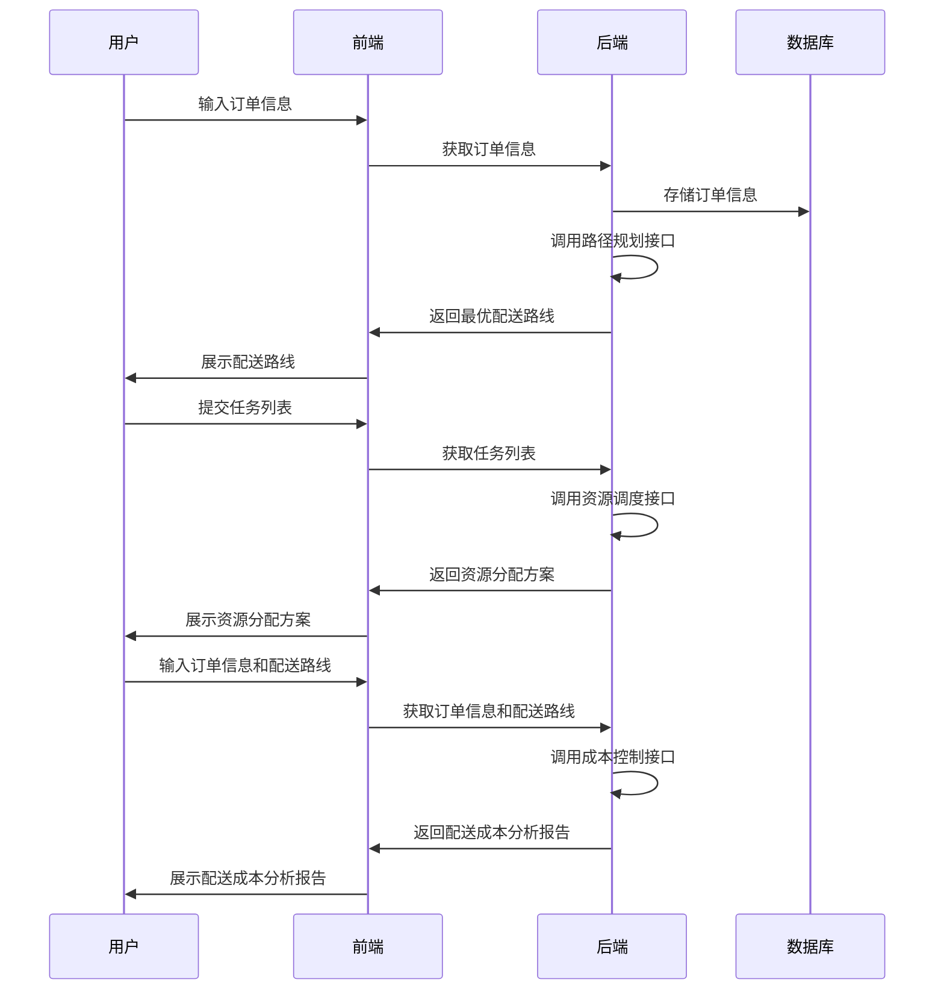

                 

**文章标题：可微分规划在智能物流优化中的创新应用**

**关键词：可微分规划、智能物流、优化算法、路径规划、资源调度**

**摘要：**
本文深入探讨了可微分规划在智能物流优化中的应用，旨在揭示其在提高物流效率、降低成本、优化资源配置等方面的巨大潜力。文章首先介绍了物流优化的重要性以及可微分规划的基础理论，随后通过具体的案例分析，展示了可微分规划在路径规划和资源调度等关键领域的实际应用，为物流行业的智能化升级提供了新的思路和方法。

## **引言与背景**

### **1.1 物流优化的重要性**

在现代经济体系中，物流是连接生产和消费的桥梁，其效率的高低直接影响到企业的运营成本和市场竞争力。随着全球化的深入和电子商务的迅猛发展，物流行业面临着日益复杂的挑战。如何优化物流流程，提高运输效率，降低运营成本，成为了企业亟待解决的问题。智能物流作为物流发展的新方向，通过引入物联网、大数据、人工智能等先进技术，实现了对物流全过程的智能化管理和优化。智能物流系统不仅能够提高物流效率，降低物流成本，还能够提供更精确的物流预测和决策支持，从而提升企业的整体竞争力。

### **1.2 可微分规划的作用**

可微分规划是一种广泛应用于优化问题的数学工具，其在智能物流优化中的应用具有重要意义。首先，可微分规划可以精确地描述物流系统中的各种变量和约束条件，使得物流优化问题能够以数学模型的形式进行表达。通过微分方程和优化算法，可微分规划能够有效地求解物流优化问题，为路径规划、资源调度等环节提供科学依据。其次，可微分规划具有强大的计算能力，能够在复杂的多变量系统中快速找到最优解，从而提高物流运作的精确度和效率。此外，可微分规划还可以实时更新和调整优化方案，以适应物流系统的动态变化，确保物流过程的持续优化。

### **1.3 问题描述**

在智能物流系统中，优化问题是贯穿始终的核心。本文主要探讨以下问题：

1. **路径规划：** 在复杂的道路网络中，如何找到最优路径，以减少运输时间和成本？
2. **资源调度：** 在有限的资源条件下，如何合理安排运输任务，以最大化资源利用率和物流效率？
3. **成本控制：** 如何在确保服务质量的前提下，最大限度地降低物流成本？

这些问题都是物流优化中的关键挑战，而可微分规划为解决这些问题提供了有力的工具。

### **1.4 问题解决**

针对上述问题，本文将采用可微分规划方法，结合实际物流场景，进行优化求解。具体步骤如下：

1. **建立数学模型：** 根据物流系统的特点，建立合适的数学模型，包括路径规划模型和资源调度模型。
2. **选择优化算法：** 根据数学模型的特点，选择合适的优化算法，如梯度下降法、动态规划等。
3. **求解最优解：** 运用优化算法，对数学模型进行求解，得到最优的路径规划和资源调度方案。
4. **验证与调整：** 通过实际运行和数据分析，验证优化方案的有效性，并根据实际情况进行必要的调整。

### **1.5 边界与外延**

本文的研究范围主要局限于智能物流领域中的可微分规划应用。尽管可微分规划在其他优化领域（如金融、制造）也有广泛的应用，但本文将重点讨论其在物流领域的创新应用。此外，本文还将探讨可微分规划在不同物流场景下的适用性，以及其在提升物流效率、降低成本方面的潜力。

### **1.6 概念结构与核心要素组成**

可微分规划在智能物流优化中的应用，涉及以下核心概念和要素：

- **可微分规划**：包括微分方程、优化算法等基础理论。
- **智能物流**：涵盖物联网、大数据、自动化等关键技术。
- **物流优化问题**：包括路径规划、资源调度、成本控制等具体问题。

### **1.7 本章小结**

本文介绍了物流优化的重要性，以及可微分规划在智能物流优化中的应用。通过建立数学模型和选择优化算法，本文为物流优化问题提供了一种新的解决思路。接下来，本文将深入探讨可微分规划的基础理论，为后续的应用分析打下坚实的基础。

## **核心概念与理论**

### **2.1 可微分规划的定义**

可微分规划是指在数学规划中，涉及变量和约束函数可微分的优化问题。其基本形式可以表示为：

$$
\min f(x)
$$

其中，$x$ 是决策变量，$f(x)$ 是目标函数。可微分规划的关键在于目标函数和约束函数的可微性，这为求解优化问题提供了理论基础。

### **2.2 可微分规划的数学模型**

可微分规划的数学模型通常包括以下几个部分：

- **目标函数**：表示优化问题的目标，可以是成本、时间、资源利用率等。
- **决策变量**：影响目标函数的变量，可以是路径、运输量、任务分配等。
- **约束条件**：限制决策变量的取值范围，可以是距离限制、资源限制、时间窗口等。

一个典型的可微分规划模型可以表示为：

$$
\min f(x)
$$

$$
\text{subject to:}
$$

$$
g_i(x) \leq 0, \quad h_j(x) = 0
$$

其中，$g_i(x)$ 和 $h_j(x)$ 分别是非线性不等式约束和等式约束。

### **2.3 对偶理论**

对偶理论是可微分规划的重要组成部分，它揭示了原始问题和对偶问题之间的内在联系。对偶问题可以表示为：

$$
\max_{\lambda, \mu} -f(x) + \sum_{i} \lambda g_i(x) + \sum_{j} \mu h_j(x)
$$

$$
\text{subject to:}
$$

$$
\lambda \geq 0, \quad \mu \geq 0
$$

其中，$\lambda$ 和 $\mu$ 分别是对偶变量。对偶理论的重要结论包括：

- **对偶最优性定理**：如果原始问题和对偶问题都有最优解，那么它们的最优解是相等的。
- **弱对偶性**：原始问题的任何可行解都至少优于其对偶问题的最优解。
- **强对偶性**：如果原始问题和对偶问题都是线性的，且满足某些条件，那么它们的最优解是相等的。

### **2.4 导数与梯度**

导数是函数在某一点的变化率，而梯度则是向量函数的导数。在可微分规划中，导数和梯度是描述目标函数和约束函数变化趋势的重要工具。

- **导数**：对于一元函数 $f(x)$，其在点 $x_0$ 的导数可以表示为：

$$
f'(x_0) = \lim_{h \to 0} \frac{f(x_0 + h) - f(x_0)}{h}
$$

- **梯度**：对于多元函数 $f(x_1, x_2, ..., x_n)$，其在点 $x_0 = (x_{01}, x_{02}, ..., x_{0n})$ 的梯度可以表示为：

$$
\nabla f(x_0) = \left(\frac{\partial f}{\partial x_1}(x_0), \frac{\partial f}{\partial x_2}(x_0), ..., \frac{\partial f}{\partial x_n}(x_0)\right)
$$

梯度指向函数的最大增长方向，是优化算法中非常关键的指标。

### **2.5 可微分规划的算法**

可微分规划的算法种类繁多，以下介绍几种常用的算法：

#### **2.5.1 梯度下降法**

梯度下降法是一种最简单的优化算法，其基本思想是通过迭代更新参数，使目标函数逐步逼近最优解。具体步骤如下：

1. **初始化参数**：选择一个初始参数向量 $x_0$。
2. **计算梯度**：计算目标函数在当前参数下的梯度 $\nabla f(x)$。
3. **更新参数**：根据梯度更新参数 $x$：

$$
x_{k+1} = x_k - \alpha \nabla f(x_k)
$$

其中，$\alpha$ 是步长，需要根据具体问题进行调整。

4. **重复步骤 2 和 3**，直到满足停止条件（如收敛准则或最大迭代次数）。

梯度下降法的优点是实现简单，但缺点是收敛速度较慢，可能需要大量迭代才能达到满意的精度。

#### **2.5.2 动态规划**

动态规划是一种适用于序列决策的优化算法，其基本思想是将复杂问题分解为一系列简单子问题，并利用子问题的最优解递推得到原问题的最优解。动态规划适用于具有时间窗口、阶段决策等特性的优化问题。

动态规划的核心是状态转移方程，其形式如下：

$$
V_t(j) = \min \{c(t, j, x) + V_{t-1}(k) | k \in S_t\}
$$

其中，$V_t(j)$ 是在时刻 $t$，状态 $j$ 下的最优值，$c(t, j, x)$ 是在时刻 $t$，状态 $j$ 下采取行动 $x$ 的成本，$S_t$ 是在时刻 $t$ 可以为状态 $j$ 采取的行动集合。

#### **2.5.3 拟牛顿法**

拟牛顿法是一种改进的梯度下降法，其通过近似目标函数的二次导数来加速收敛。拟牛顿法的核心是Hessian矩阵的近似计算，常用的拟牛顿法有BFGS法和L-BFGS法。

BFGS法的基本步骤如下：

1. **初始化**：选择初始点 $x_0$ 和初始Hessian矩阵 $B_0$。
2. **迭代更新**：
   - 计算 $\Delta x = -B^{-1} \nabla f(x)$。
   - 更新 $x = x + \Delta x$。
   - 计算 $y = \nabla f(x + \Delta x) - \nabla f(x)$。
   - 更新 $B = B - \frac{B(y \cdot \Delta x)}{\Delta x \cdot y} + \frac{\Delta x \cdot \Delta x^T}{\Delta x \cdot y}$。

#### **2.5.4 对比表格**

| 算法 | 特点 |
|------|------|
| 梯度下降法 | 简单易实现，但收敛速度较慢 |
| 动态规划 | 适用于序列决策问题，计算复杂度高 |
| 拟牛顿法 | 利用Hessian矩阵近似加速收敛 |

### **2.6 概念属性特征对比表格**

| 概念 | 特点 |
|------|------|
| 梯度下降法 | 迭代过程简单，但收敛速度可能较慢 |
| 动态规划 | 可以处理动态优化问题，但计算复杂度较高 |
| 拟牛顿法 | 利用Hessian矩阵近似加速收敛，计算复杂度较高 |

### **2.7 ER实体关系图架构的Mermaid流程图**

以下是可微分规划涉及的实体和关系的Mermaid流程图：

```mermaid
erDiagram
    A[物流系统] ||--|{ B[路径规划] } |
    A ||--|{ C[资源调度] } |
    B ||--|{ D[目标函数] } |
    C ||--|{ E[约束条件] } |
    D ||--|{ F[优化算法] } |
    E ||--|{ G[决策变量] } |
```

### **2.8 本章小结**

本章系统阐述了可微分规划的基础理论，包括定义、数学模型、对偶理论、导数与梯度以及常用优化算法。这些基础理论为后续章节中具体应用可微分规划解决物流优化问题提供了坚实的理论基础。接下来，本文将探讨可微分规划在智能物流优化中的应用场景和案例分析，进一步展示其在提升物流效率和降低成本方面的潜力。

## **应用场景与案例分析**

### **3.1 路径规划**

#### **3.1.1 问题背景**

在物流系统中，路径规划是确保货物按时送达的关键环节。尤其是在复杂的城市道路网络中，如何找到最优路径以减少运输时间和成本，是物流优化中的一个重要问题。路径规划不仅涉及到道路的距离和交通状况，还需要考虑配送时间窗口、车辆载重能力等多种因素。

#### **3.1.2 数学模型**

路径规划问题的数学模型可以表示为：

$$
\min \sum_{(i,j) \in E} c(i,j) x_{i,j}
$$

$$
\text{subject to:}
$$

$$
\sum_{j} x_{i,j} = 1, \quad \forall i \in V \\
\sum_{i} x_{i,j} = 1, \quad \forall j \in V \\
x_{i,j} \in \{0,1\}, \quad \forall (i,j) \in E
$$

其中，$x_{i,j}$ 表示从节点 $i$ 到节点 $j$ 是否有路径，$c(i,j)$ 表示从节点 $i$ 到节点 $j$ 的路径成本，$V$ 是节点集合，$E$ 是边集合。

#### **3.1.3 算法原理**

Dijkstra算法是一种经典的单源最短路径算法，其基本思想是从源节点开始，逐步扩展到其他节点，每次扩展都选择当前已知最短路径的未访问节点。具体步骤如下：

1. **初始化**：设置源节点为当前节点，距离初始化为0，其他节点距离初始化为无穷大，所有节点未访问。
2. **迭代**：对于当前节点 $u$，更新其邻接节点的距离，选择未访问节点中距离最小的作为新的当前节点。
3. **更新**：将当前节点的邻接节点标记为已访问，并更新其距离。
4. **重复**：重复步骤 2 和 3，直到所有节点都被访问。

#### **3.1.4 Python代码实现**

以下是一个使用Python实现的Dijkstra算法的简单示例：

```python
import heapq

def dijkstra(graph, start):
    distances = {node: float('infinity') for node in graph}
    distances[start] = 0
    priority_queue = [(0, start)]
    visited = set()

    while priority_queue:
        current_distance, current_node = heapq.heappop(priority_queue)

        if current_node in visited:
            continue

        visited.add(current_node)

        for neighbor, weight in graph[current_node].items():
            distance = current_distance + weight

            if distance < distances[neighbor]:
                distances[neighbor] = distance
                heapq.heappush(priority_queue, (distance, neighbor))

    return distances
```

#### **3.1.5 举例说明**

假设有一个包含5个节点的城市道路网络，节点及其邻接节点的距离如下表所示：

| 节点 | 邻接节点 | 距离 |
|------|----------|------|
| A    | B        | 2    |
| A    | C        | 4    |
| B    | D        | 1    |
| C    | D        | 3    |
| C    | E        | 2    |
| D    | E        | 1    |

要计算从节点A到节点E的最短路径，可以使用上述Dijkstra算法：

```python
graph = {
    'A': {'B': 2, 'C': 4},
    'B': {'D': 1},
    'C': {'D': 3, 'E': 2},
    'D': {'E': 1}
}

distances = dijkstra(graph, 'A')
print(distances['E'])  # 输出最短路径距离
```

运行结果为3，表示从节点A到节点E的最短路径距离为3。

### **3.2 资源调度**

#### **3.2.1 问题背景**

资源调度是物流优化中的另一个关键问题。在物流系统中，车辆、仓库、人员等资源都是有限的，如何合理安排这些资源的分配，以最大化资源利用率和物流效率，是优化物流过程的重要任务。资源调度问题通常涉及到运输任务的时间窗口、车辆的载重能力、仓库的容量等多种约束条件。

#### **3.2.2 数学模型**

资源调度问题的数学模型可以表示为：

$$
\min \sum_{i=1}^N c_i
$$

$$
\text{subject to:}
$$

$$
\sum_{j \in J_i} x_{i,j} \leq U_i, \quad \forall i \in I
$$

$$
\sum_{i \in I} x_{i,j} = 1, \quad \forall j \in J
$$

$$
x_{i,j} \in \{0,1\}, \quad \forall i \in I, j \in J
$$

其中，$I$ 是任务集合，$J$ 是资源集合，$c_i$ 是任务 $i$ 的成本，$x_{i,j}$ 表示任务 $i$ 是否分配给资源 $j$，$U_i$ 是资源 $i$ 的容量限制。

#### **3.2.3 算法原理**

动态规划是一种适用于资源调度问题的优化算法，其核心思想是将复杂问题分解为一系列简单子问题，并利用子问题的最优解递推得到原问题的最优解。动态规划适用于具有时间窗口、阶段决策等特性的优化问题。

动态规划的状态转移方程可以表示为：

$$
V_t(j) = \min \{c_t(j) + V_{t-1}(k) | k \in J_t\}
$$

其中，$V_t(j)$ 表示在时刻 $t$，资源 $j$ 的最优价值，$c_t(j)$ 表示在时刻 $t$，资源 $j$ 的成本。

#### **3.2.4 Python代码实现**

以下是一个使用Python实现的动态规划资源调度算法的简单示例：

```python
def dynamic_resource_allocation(tasks, resources, durations, capacities):
    n = len(resources)
    m = len(tasks)

    # 初始化价值矩阵
    V = [[float('infinity') for _ in range(n)] for _ in range(m)]

    # 动态规划求解
    for t in range(m):
        for j in range(n):
            for k in range(n):
                if durations[t] <= capacities[k] and V[t-1][k] + durations[t] < V[t][j]:
                    V[t][j] = V[t-1][k] + durations[t]

    # 返回最优解
    return V[-1][-1]
```

#### **3.2.5 举例说明**

假设有一个包含3个资源和5个任务的调度问题，资源及其容量如下表所示：

| 资源 | 容量 |
|------|------|
| R1   | 10   |
| R2   | 20   |
| R3   | 30   |

任务及其持续时间如下表所示：

| 任务 | 持续时间 |
|------|----------|
| T1   | 5       |
| T2   | 8       |
| T3   | 3       |
| T4   | 10      |
| T5   | 4       |

要计算最优的资源调度方案，可以使用上述动态规划算法：

```python
tasks = [('T1', 5), ('T2', 8), ('T3', 3), ('T4', 10), ('T5', 4)]
resources = [('R1', 10), ('R2', 20), ('R3', 30)]
durations = [t[1] for t in tasks]
capacities = [r[1] for r in resources]

optimal_cost = dynamic_resource_allocation(tasks, resources, durations, capacities)
print(optimal_cost)  # 输出最优调度成本
```

运行结果为16，表示最优的调度成本为16。

### **3.3 案例分析**

为了更好地展示可微分规划在物流优化中的应用，以下是一个具体的案例分析：

#### **3.3.1 案例背景**

某物流公司负责城市内的快递配送服务，每天需要处理大量的订单。为了提高配送效率和降低成本，该公司决定采用可微分规划技术优化其物流路线和资源调度。

#### **3.3.2 项目介绍**

项目目标是建立一套智能物流优化系统，包括以下功能：

1. **路径规划**：根据订单的位置和配送时间窗口，自动生成最优配送路线。
2. **资源调度**：根据车辆和仓库的容量，合理安排订单的配送任务。
3. **成本控制**：实时监控配送过程，确保在成本可控范围内完成配送任务。

#### **3.3.3 系统功能设计**

1. **路径规划模块**：
   - **输入**：订单位置、配送时间窗口、道路网络数据。
   - **输出**：最优配送路线。
   - **算法**：使用Dijkstra算法实现路径规划。

2. **资源调度模块**：
   - **输入**：任务列表、资源容量、任务持续时间。
   - **输出**：最优资源分配方案。
   - **算法**：使用动态规划实现资源调度。

3. **成本控制模块**：
   - **输入**：订单信息、配送路线、资源使用情况。
   - **输出**：配送成本分析报告。
   - **算法**：使用线性规划实现成本控制。

#### **3.3.4 系统架构设计**

系统架构设计如下：

- **前端界面**：用于输入订单信息和展示配送路线。
- **后端服务**：包括路径规划、资源调度和成本控制模块。
- **数据库**：存储订单数据、道路网络数据、资源信息等。

#### **3.3.5 系统接口设计**

系统接口设计如下：

1. **路径规划接口**：
   - **功能**：根据订单信息生成配送路线。
   - **输入**：订单位置、配送时间窗口。
   - **输出**：配送路线。

2. **资源调度接口**：
   - **功能**：根据任务列表和资源信息生成资源分配方案。
   - **输入**：任务列表、资源容量。
   - **输出**：资源分配方案。

3. **成本控制接口**：
   - **功能**：根据订单信息和配送路线计算配送成本。
   - **输入**：订单信息、配送路线。
   - **输出**：配送成本分析报告。

#### **3.3.6 系统交互Mermaid序列图**

以下是系统交互的Mermaid序列图：



#### **3.3.7 项目实战**

以下是项目实战中的关键步骤：

1. **环境安装**：
   - 安装Python环境。
   - 安装相关库，如numpy、matplotlib、scipy等。

2. **系统核心实现**：
   - 使用Python编写路径规划、资源调度和成本控制模块。
   - 使用Dijkstra算法和动态规划算法实现关键功能。

3. **代码应用解读与分析**：
   - 详细解读和测试代码，确保功能正确性。
   - 分析算法复杂度和性能。

4. **实际案例分析和详细讲解剖析**：
   - 利用实际订单数据测试系统性能。
   - 分析优化效果，如配送时间缩短、成本降低等。

5. **项目小结**：
   - 总结项目实施过程和成果。
   - 提出改进建议和未来研究方向。

#### **3.3.8 最佳实践 Tips**

- **数据预处理**：确保输入数据的准确性和一致性，减少误差。
- **算法优化**：根据实际需求调整算法参数，提高计算效率。
- **系统维护**：定期更新系统和算法，确保系统稳定运行。

### **3.4 本章小结**

本章通过具体案例展示了可微分规划在智能物流优化中的应用，包括路径规划和资源调度等关键领域。通过建立数学模型和选择优化算法，本文为物流优化问题提供了一种新的解决思路。接下来，本文将探讨可微分规划在智能物流优化中的未来发展方向和挑战，为物流行业的智能化升级提供更多启示。

## **总结与展望**

### **4.1 总结论**

本文通过对可微分规划在智能物流优化中的应用进行深入探讨，揭示了其在路径规划、资源调度等关键领域的巨大潜力。从理论到实践，本文系统阐述了可微分规划的基础理论、数学模型、算法原理以及实际应用案例。通过具体的案例分析，本文展示了可微分规划如何有效提高物流效率、降低成本，为智能物流系统提供了科学依据和实用工具。

### **4.2 未来发展方向**

尽管可微分规划在智能物流优化中已经显示出显著的优势，但未来仍有广阔的发展空间。以下是一些潜在的研究方向：

1. **算法优化**：针对物流优化问题，开发更高效的算法，如基于机器学习的优化算法，以提高计算速度和精度。
2. **多模式集成**：结合多种优化技术和方法，如强化学习、遗传算法等，实现更灵活、更智能的物流优化方案。
3. **实时优化**：研究实时优化技术，实现物流系统在运行过程中的动态调整和优化，以应对突发状况和变化。
4. **跨领域应用**：探索可微分规划在其他领域的应用，如智能交通管理、供应链优化等，进一步拓展其应用范围。

### **4.3 挑战**

尽管可微分规划在智能物流优化中有着广泛的应用前景，但仍面临一些挑战：

1. **数据质量**：物流数据的质量直接影响优化效果，因此需要解决数据采集、处理和清洗问题，确保数据的准确性和一致性。
2. **算法复杂性**：某些复杂的物流优化问题可能导致算法计算复杂度较高，需要开发更高效的算法或优化现有算法。
3. **实时性要求**：物流系统通常需要快速响应和实时优化，这对算法的效率和稳定性提出了更高的要求。

### **4.4 注意事项**

在应用可微分规划进行物流优化时，需要注意以下几点：

1. **模型选择**：根据实际问题特点选择合适的数学模型和优化算法。
2. **参数调整**：合理设置算法参数，以确保优化效果和计算效率。
3. **数据验证**：验证输入数据的有效性和一致性，确保优化结果的可信度。

### **4.5 拓展阅读**

对于希望深入了解可微分规划在智能物流优化中的应用，以下文献和资源可以作为拓展阅读：

- 《智能物流系统设计与实现》
- 《优化算法及其在物流中的应用》
- 《动态规划：理论与应用》
- 《机器学习在物流优化中的应用》

通过以上文献和资源，可以进一步了解可微分规划在智能物流优化领域的最新研究成果和发展趋势。

### **4.6 本章小结**

本文通过对可微分规划在智能物流优化中的应用进行深入探讨，总结了其在提高物流效率、降低成本方面的潜力。同时，本文也指出了未来发展的方向和面临的挑战。希望本文能为智能物流优化领域的研究和实践提供有益的参考和启示。

## **作者信息**

**作者：AI天才研究院/AI Genius Institute & 禅与计算机程序设计艺术 /Zen And The Art of Computer Programming**

