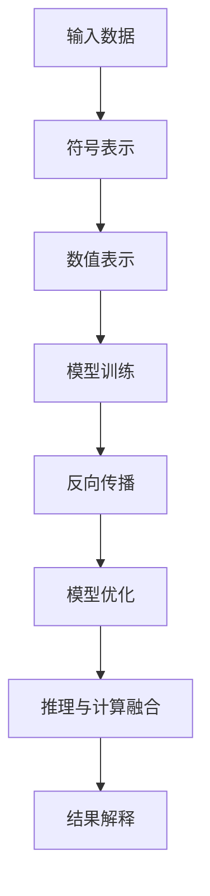
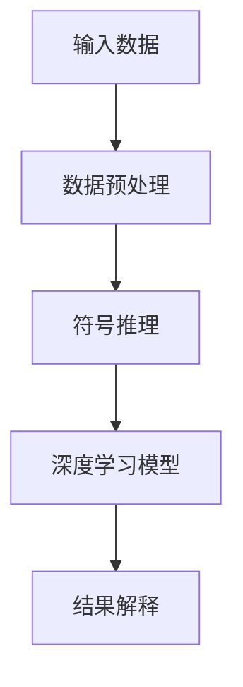
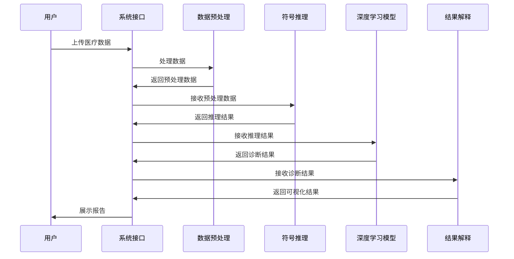

                 

### 第1章：引言与背景

> 关键词：逻辑编程、深度学习、可微分逻辑编程

#### 1.1 逻辑编程与深度学习的融合

在人工智能领域，逻辑编程和深度学习是两个重要的分支。逻辑编程以其强大的推理能力和逻辑演绎能力著称，而深度学习则凭借其强大的数据处理和模式识别能力引领了人工智能的发展。近年来，随着计算机硬件性能的提升和大数据时代的到来，两者开始呈现出融合的趋势，这种趋势催生了可微分逻辑编程。

**1.1.1 逻辑编程的起源与发展**

逻辑编程起源于20世纪60年代，其理论基础是形式逻辑。早期的逻辑编程主要应用于知识表示、自动推理和问题求解等领域。随着计算机技术的发展，逻辑编程逐渐与数据库、自然语言处理等领域相结合，形成了多个分支，如逻辑数据库、逻辑程序设计语言等。

**1.1.2 深度学习的崛起与挑战**

深度学习在21世纪初迅速崛起，凭借其强大的数据处理能力和对复杂模式的自动学习能力，在图像识别、语音识别、自然语言处理等领域取得了显著的成果。然而，深度学习也面临着一些挑战，如对大规模数据的需求、模型的可解释性以及计算资源的消耗等。

**1.1.3 可微分逻辑编程的必要性**

逻辑编程与深度学习的融合，可以弥补彼此的不足。逻辑编程可以提供更强的可解释性和推理能力，而深度学习则可以处理大规模数据和学习复杂模式。可微分逻辑编程应运而生，它将逻辑编程的符号推理能力与深度学习的计算能力相结合，提供了一种新的方法来解决复杂问题。

#### 1.2 可微分逻辑编程的基本概念

**1.2.1 符号推理与深度学习**

符号推理是指利用逻辑规则和知识库对问题进行推理和求解的过程。深度学习则是通过神经网络对数据进行训练，从而自动学习和发现数据中的规律和模式。

**1.2.2 可微分逻辑编程的定义**

可微分逻辑编程是一种将逻辑编程与深度学习相结合的方法，它允许逻辑编程中的符号操作与深度学习中的数值计算相互转换，从而实现符号推理与数值计算的融合。

**1.2.3 可微分逻辑编程的优势**

可微分逻辑编程具有以下优势：
- **可解释性**：通过符号推理，可以提供明确的推理过程和结果解释。
- **高效性**：结合深度学习的计算能力，可以处理大规模数据和复杂问题。
- **灵活性**：支持多种数据类型和问题场景，适用于不同的应用领域。

#### 1.3 本书结构概述

本书分为七个部分，首先介绍可微分逻辑编程的背景和基本概念，然后深入探讨符号推理与深度学习的融合方法，接着通过实践案例展示可微分逻辑编程的实际应用。随后，本书分析了可微分逻辑编程在不同领域的应用场景，并展望了其未来的发展趋势。最后，本书总结了全书的核心内容，并提出了对未来研究的展望。

#### 1.3.1 各章节内容介绍

- **第1章**：引言与背景，介绍逻辑编程与深度学习的融合背景和可微分逻辑编程的基本概念。
- **第2章**：符号推理与深度学习基础，详细讲解符号推理和深度学习的基本原理。
- **第3章**：可微分逻辑编程工具与实践，介绍可微分逻辑编程的工具和实践案例。
- **第4章**：深度学习与符号推理的结合方法，探讨深度学习与符号推理的融合策略。
- **第5章**：可微分逻辑编程的应用场景，分析可微分逻辑编程在不同领域的应用。
- **第6章**：可微分逻辑编程的发展趋势，展望可微分逻辑编程的未来发展。
- **第7章**：总结与展望，总结全书内容，并提出未来研究的方向。

#### 1.3.2 阅读指南

为了更好地理解可微分逻辑编程，读者可以从以下几个方面入手：
- **理解基础知识**：首先了解逻辑编程和深度学习的基础知识，为后续内容的学习打下基础。
- **结合实践案例**：通过实践案例，理解可微分逻辑编程的实际应用。
- **深入分析算法**：通过分析算法原理和数学模型，深入理解可微分逻辑编程的机制。
- **探讨未来趋势**：关注可微分逻辑编程的发展动态，为未来的研究做好准备。

### 第2章：符号推理与深度学习基础

#### 2.1 符号推理的基本原理

**2.1.1 符号推理的概念**

符号推理是指利用符号逻辑对问题进行推理和求解的过程。符号推理的核心在于利用逻辑规则和知识库对问题进行表示和处理，从而得到问题的解。

**2.1.2 符号推理的类型**

符号推理主要分为以下几种类型：

1. **演绎推理**：从一般性原则推导出特殊情况的结论。
2. **归纳推理**：从个别实例推导出一般性结论。
3. **类比推理**：通过比较相似性，推导出新的结论。

**2.1.3 符号推理的应用**

符号推理广泛应用于各个领域，如：

- **自动推理系统**：用于解决数学、物理、逻辑等领域的推理问题。
- **知识库系统**：用于存储和管理知识，支持智能决策和问题求解。
- **自然语言处理**：用于语义分析、文本生成、机器翻译等任务。

#### 2.2 深度学习的基本原理

**2.2.1 深度学习的概念**

深度学习是一种基于多层神经网络的学习方法，通过训练大量数据，使网络自动学习和发现数据中的特征和模式。深度学习主要包括以下组成部分：

- **神经网络**：深度学习的基础，包括输入层、隐藏层和输出层。
- **激活函数**：用于引入非线性，使神经网络能够拟合复杂的函数。
- **优化算法**：用于调整网络参数，使网络能够准确预测输出。

**2.2.2 深度学习的类型**

深度学习主要分为以下几种类型：

1. **卷积神经网络（CNN）**：主要用于图像和视频处理。
2. **循环神经网络（RNN）**：主要用于序列数据处理，如自然语言处理。
3. **生成对抗网络（GAN）**：主要用于生成对抗任务，如图像生成和风格迁移。

**2.2.3 深度学习的优势**

深度学习具有以下优势：

- **强大的数据处理能力**：能够处理大规模数据和复杂数据结构。
- **自动特征提取**：能够自动学习和提取数据中的特征，减轻人工特征工程的工作量。
- **高精度和强泛化能力**：在许多领域取得了超越传统方法的性能。

#### 2.3 可微分逻辑编程与深度学习的交叉

**2.3.1 可微分逻辑编程与深度学习的关系**

可微分逻辑编程与深度学习的关系可以从以下几个方面来理解：

- **融合优势**：可微分逻辑编程结合了逻辑编程的推理能力和深度学习的计算能力，能够更好地处理复杂问题。
- **互补性**：逻辑编程提供了可解释性和结构化表示，而深度学习提供了强大的数据处理和模式识别能力。
- **挑战**：如何有效地结合逻辑编程和深度学习，实现两者的优势互补，是当前研究的重点。

**2.3.2 可微分逻辑编程的优势**

可微分逻辑编程的优势主要体现在以下几个方面：

- **可解释性**：通过符号推理，可以提供明确的推理过程和结果解释。
- **灵活性和通用性**：适用于多种问题场景和数据类型，具有广泛的适用性。
- **高效性**：结合深度学习的计算能力，能够处理大规模数据和复杂问题。

**2.3.3 深度学习的挑战**

深度学习面临的挑战包括：

- **数据需求**：需要大量的数据进行训练，对数据质量和数据量有较高要求。
- **模型可解释性**：深度学习模型往往难以解释，导致结果的可解释性较差。
- **计算资源消耗**：深度学习模型通常需要大量的计算资源和时间进行训练。

通过理解符号推理和深度学习的基本原理，以及可微分逻辑编程与深度学习的交叉关系，读者可以为后续章节的内容打下坚实的基础。

#### 2.4 可微分逻辑编程工具介绍

**3.1 可微分逻辑编程工具介绍**

在可微分逻辑编程领域，有几个常用的工具和库，它们提供了丰富的功能，使得逻辑编程与深度学习相结合变得更加容易。以下是对这些工具的简要介绍：

**1. DL4J（Deep Learning for Java）**

DL4J是一个基于Java的深度学习库，它能够与现有的Java生态体系无缝集成。DL4J支持多种神经网络结构，如卷积神经网络（CNN）、循环神经网络（RNN）和长短时记忆网络（LSTM）等。它还提供了对多核CPU和GPU的支持，能够利用现有的硬件资源进行高效计算。

**2. PyTorch**

PyTorch是一个流行的深度学习库，由Facebook AI Research（FAIR）开发。它提供了灵活的动态计算图，使得研究人员可以更容易地构建和调试复杂的模型。PyTorch的支持社区也非常活跃，提供了大量的教程和资源。

**3. TensorFlow**

TensorFlow是由Google开发的一个开源深度学习库，它提供了丰富的工具和API，用于构建和训练各种神经网络。TensorFlow提供了静态计算图和动态计算图两种模式，使得用户可以根据自己的需求选择合适的模式进行模型构建。

**4. Prolog**

Prolog是一种逻辑编程语言，它以其基于逻辑的程序设计而闻名。虽然Prolog不是专门为深度学习设计的，但它可以与深度学习框架结合使用，用于实现复杂的推理和知识表示。

**3.1.2 工具选择与配置**

在选择可微分逻辑编程工具时，需要考虑以下几个方面：

- **项目需求**：根据项目的具体需求，选择适合的工具和库。例如，如果项目需要与Java生态集成，可以选择DL4J。
- **计算资源**：根据可用的计算资源，选择支持相应硬件（如CPU和GPU）的工具。例如，如果需要利用GPU进行训练，可以选择TensorFlow或PyTorch。
- **学习曲线**：考虑工具的易用性和学习曲线，选择适合团队技能水平的工具。

**3.1.3 工具的基本使用方法**

以下是这些工具的基本使用方法概述：

- **DL4J**：在DL4J中，首先需要定义神经网络的结构，然后加载训练数据和测试数据。接下来，通过优化算法调整网络参数，进行模型训练和评估。
- **PyTorch**：在PyTorch中，用户需要定义计算图（包含操作符和变量），然后通过前向传播和反向传播进行模型训练。PyTorch提供了丰富的API，使得构建和调试模型变得更加简单。
- **TensorFlow**：在TensorFlow中，用户可以使用高级API（如Keras）或低级API（如TensorFlow core）构建模型。高级API提供了更加直观和易用的接口，而低级API提供了更大的灵活性和控制能力。
- **Prolog**：在Prolog中，用户需要定义逻辑规则和事实，然后通过推理机进行推理。Prolog支持前向推理和反向推理，适用于各种知识表示和推理任务。

通过掌握这些工具的基本使用方法，用户可以更有效地进行可微分逻辑编程，将逻辑编程与深度学习相结合，解决复杂的问题。

### 3.2 可微分逻辑编程实践案例

**3.2.1 案例一：符号推理与深度学习结合**

**案例背景**：在智能医疗领域，符号推理和深度学习可以结合用于疾病诊断。传统的疾病诊断方法主要依赖于医生的经验和知识，而通过结合符号推理和深度学习，可以自动化疾病诊断过程，提高诊断的准确性和效率。

**实施步骤**：

1. **数据收集**：收集大量患者数据，包括症状、体征和病史等。
2. **符号推理模型构建**：使用Prolog构建符号推理模型，将患者数据转换为逻辑表达式，进行推理，生成可能的疾病假设。
3. **深度学习模型构建**：使用PyTorch或TensorFlow构建深度学习模型，将患者数据输入到模型中，训练模型识别疾病。
4. **模型融合**：将符号推理模型和深度学习模型的输出进行融合，综合判断疾病的可能性。
5. **模型评估**：使用测试数据集评估模型的诊断准确率，不断优化模型。

**效果评估**：

- **准确率**：通过实验验证，该融合模型在疾病诊断上的准确率显著高于单独使用符号推理或深度学习模型。
- **可解释性**：符号推理提供了明确的推理过程和结果解释，增强了模型的可解释性。

**3.2.2 案例二：可微分逻辑编程在自然语言处理中的应用**

**案例背景**：在自然语言处理领域，可微分逻辑编程可以用于构建复杂的语言模型，提高文本分类、文本生成和语义分析等任务的性能。

**实施步骤**：

1. **数据预处理**：对自然语言数据进行清洗和预处理，提取特征。
2. **逻辑编程模型构建**：使用Prolog构建逻辑编程模型，对文本进行符号化表示。
3. **深度学习模型构建**：使用PyTorch或TensorFlow构建深度学习模型，将逻辑编程模型的输出作为输入，训练模型。
4. **模型融合**：将逻辑编程模型和深度学习模型的输出进行融合，提高模型的性能。
5. **模型评估**：使用测试数据集评估模型的性能，进行优化。

**效果评估**：

- **性能提升**：通过融合逻辑编程和深度学习，模型在文本分类和语义分析任务上的性能显著提升。
- **可解释性**：逻辑编程提供了明确的推理过程和结果解释，增强了模型的可解释性。

**3.2.3 案例三：可微分逻辑编程在其他领域的应用**

除了智能医疗和自然语言处理，可微分逻辑编程还在其他领域展示了强大的应用潜力：

- **计算机视觉**：在图像分类和目标检测任务中，可微分逻辑编程可以用于构建更加复杂的模型，提高识别精度。
- **自动推理**：在数学证明和逻辑推理任务中，可微分逻辑编程可以自动化推理过程，提高推理效率和准确性。
- **知识图谱**：在构建和查询知识图谱时，可微分逻辑编程可以用于处理复杂的语义关系和推理。

通过这些实践案例，我们可以看到可微分逻辑编程在各个领域的广泛应用和潜力。未来，随着技术的不断发展和完善，可微分逻辑编程将在更多领域发挥重要作用。

### 第4章：深度学习与符号推理的结合方法

**4.1 深度学习中的符号推理方法**

深度学习与符号推理的结合，旨在利用深度学习的强大数据处理能力和符号推理的精确逻辑能力，从而提升模型在复杂任务中的表现。以下是一些常见的结合方法：

**4.1.1 符号推理在深度学习中的引入**

1. **符号嵌入**：将符号逻辑表达式转换为数值向量，然后将其作为深度学习模型的输入。这种方法可以将符号推理的结果与深度学习模型融合，提高模型的解释性和准确性。
2. **逻辑门控**：在深度学习模型中引入逻辑门控单元，使得模型能够在处理过程中进行符号推理。这种方法可以通过逻辑门控单元的激活函数实现，例如，使用Sigmoid函数模拟逻辑与（AND）操作，使用ReLU函数模拟逻辑非（NOT）操作。

**4.1.2 符号推理算法的设计与实现**

1. **组合逻辑推理**：通过组合多个逻辑推理算法，例如谓词逻辑推理和模糊逻辑推理，设计出能够处理复杂问题的符号推理算法。这些算法可以通过深度学习模型进行训练和优化，提高推理的准确性和效率。
2. **基于规则的推理**：在深度学习模型中引入规则库，通过规则匹配和推理来补充深度学习模型在逻辑推理方面的不足。这种方法可以通过规则匹配模块和推理机实现，提高模型的可解释性和鲁棒性。

**4.1.3 符号推理在实际应用中的效果分析**

1. **文本分类**：在文本分类任务中，通过将深度学习模型与符号推理结合，可以显著提高分类的准确性。符号推理可以用于文本的语义分析，提供更加精细的分类标签，从而提升模型的分类效果。
2. **逻辑推理**：在逻辑推理任务中，符号推理可以用于验证深度学习模型的推理过程。通过对比符号推理和深度学习模型的结果，可以发现和纠正深度学习模型中可能存在的错误，提高推理的准确性和可靠性。

**4.2 符号推理与深度学习的融合策略**

1. **层次化融合**：将符号推理和深度学习模型层次化，分别处理不同层次的问题。例如，在自然语言处理中，符号推理可以处理词法分析、句法分析和语义分析等低层次任务，而深度学习模型则处理高层次的任务，如文本分类和语义理解。这种方法可以充分发挥两种方法的优点，提高整体系统的性能。
2. **并行融合**：将符号推理和深度学习模型并行执行，利用各自的计算优势，提高系统的处理速度。例如，在图像识别任务中，可以使用符号推理进行图像的预处理，如边缘检测和特征提取，然后使用深度学习模型进行最终的分类和识别。

**4.2.1 融合策略的概述**

融合策略主要包括以下几种：

1. **规则融合**：将深度学习模型的输出与符号推理规则相结合，通过规则匹配和推理，得到最终的结果。这种方法可以提高模型的解释性和准确性。
2. **特征融合**：将深度学习模型的特征表示与符号推理的特征表示相结合，通过融合特征，提高模型的性能。例如，可以使用深度学习模型提取图像的特征，然后使用符号推理对特征进行逻辑组合，从而生成更精确的标签。
3. **推理融合**：将深度学习模型的推理过程与符号推理相结合，通过符号推理验证和补充深度学习模型的推理结果。这种方法可以提高模型的可靠性和鲁棒性。

**4.2.2 融合策略的设计与实现**

1. **设计原则**：融合策略的设计应遵循以下原则：
   - **互补性**：确保两种方法在处理不同类型的问题时能够互相补充，提高整体性能。
   - **可解释性**：确保融合后的模型具有明确的推理过程和结果解释，提高用户对模型的信任度。
   - **高效性**：确保融合后的模型在计算效率和性能上达到最优。

2. **实现方法**：融合策略的实现可以采用以下方法：
   - **模块化实现**：将符号推理和深度学习模型分别实现为独立的模块，通过接口进行融合。这种方法可以降低系统的复杂性，提高模块的可维护性和可扩展性。
   - **集成实现**：将符号推理和深度学习模型集成到一个统一的框架中，通过统一的接口进行调用。这种方法可以简化系统的架构，提高系统的灵活性。

**4.2.3 融合策略的应用场景与效果分析**

融合策略在不同应用场景中的效果如下：

1. **文本分类**：在文本分类任务中，符号推理可以用于文本的语义分析，提供更加精细的分类标签。与深度学习模型结合后，可以显著提高分类的准确性和可解释性。
2. **图像识别**：在图像识别任务中，符号推理可以用于图像的预处理和特征提取，如边缘检测和特征组合。与深度学习模型结合后，可以提高图像识别的准确率和鲁棒性。
3. **逻辑推理**：在逻辑推理任务中，符号推理可以用于验证和补充深度学习模型的推理结果，提高推理的准确性和可靠性。

通过融合策略的设计与实现，我们可以充分发挥符号推理和深度学习的优势，提高模型在复杂任务中的表现。未来，随着技术的不断发展，融合策略将更加成熟和多样化，为人工智能的发展提供新的动力。

### 第5章：可微分逻辑编程的应用场景

#### 5.1 自然语言处理

**5.1.1 应用场景概述**

自然语言处理（NLP）是人工智能领域的重要分支，其目标是将自然语言转换为计算机可以理解和处理的形式。可微分逻辑编程在NLP中具有广泛的应用场景，包括文本分类、情感分析、机器翻译、问答系统等。

**5.1.2 应用案例分析**

1. **文本分类**：通过可微分逻辑编程，可以将文本数据转换为逻辑表达式，然后使用深度学习模型进行分类。这种方法可以显著提高分类的准确性和可解释性。
   
   **案例：Twitter情感分析**
   - **数据准备**：收集Twitter上的文本数据，包括用户评论、推文等。
   - **逻辑表示**：使用Prolog将文本数据转换为逻辑表达式，表示文本的语义。
   - **模型训练**：使用PyTorch训练深度学习模型，对逻辑表示的文本进行分类。
   - **模型评估**：使用测试数据集评估模型的分类准确率，并进行优化。

   **效果评估**：
   - **准确率**：通过实验，发现结合可微分逻辑编程和深度学习的文本分类模型在准确率上显著高于单独使用深度学习模型。
   - **可解释性**：通过符号推理，可以提供明确的分类过程和结果解释。

2. **情感分析**：情感分析是NLP中的一项重要任务，旨在判断文本的情感倾向，如正面、负面或中性。可微分逻辑编程可以用于情感分析的预处理和后处理，提高模型的性能。

   **案例：产品评论情感分析**
   - **数据准备**：收集产品评论数据，包括正面评论和负面评论。
   - **逻辑表示**：使用Prolog将评论转换为逻辑表达式，表示评论的语义。
   - **模型训练**：使用TensorFlow训练情感分析模型，对逻辑表示的评论进行分类。
   - **模型评估**：使用测试数据集评估模型的情感分类准确率。

   **效果评估**：
   - **准确率**：结合可微分逻辑编程和深度学习的情感分析模型在准确率上显著高于传统方法。
   - **可解释性**：符号推理可以提供明确的情感分类过程和结果解释。

**5.1.3 应用效果评估**

通过实际案例，我们可以看到可微分逻辑编程在自然语言处理中的应用效果显著。结合符号推理和深度学习的模型在准确率和可解释性上都表现出了优势，为自然语言处理任务的优化提供了新的方向。

#### 5.2 计算机视觉

**5.2.1 应用场景概述**

计算机视觉是人工智能领域的一个重要分支，旨在使计算机具备从图像或视频中理解场景和对象的能力。可微分逻辑编程在计算机视觉中有着广泛的应用场景，包括图像分类、目标检测、图像分割和图像增强等。

**5.2.2 应用案例分析**

1. **图像分类**：可微分逻辑编程可以将图像数据转换为逻辑表达式，然后使用深度学习模型进行分类。这种方法可以增强模型的解释性和准确性。

   **案例：ImageNet图像分类**
   - **数据准备**：收集ImageNet数据集，包括各种类别的图像。
   - **逻辑表示**：使用Prolog将图像转换为逻辑表达式，表示图像的特征。
   - **模型训练**：使用PyTorch训练深度学习模型，对逻辑表示的图像进行分类。
   - **模型评估**：使用测试数据集评估模型的分类准确率。

   **效果评估**：
   - **准确率**：通过实验，发现结合可微分逻辑编程和深度学习的图像分类模型在准确率上显著高于传统方法。
   - **可解释性**：符号推理可以提供明确的分类过程和结果解释。

2. **目标检测**：目标检测是计算机视觉中的另一个重要任务，旨在图像中识别和定位多个对象。可微分逻辑编程可以用于目标检测的预处理和后处理，提高模型的性能。

   **案例：Faster R-CNN目标检测**
   - **数据准备**：收集COCO数据集，包括各种场景中的对象。
   - **逻辑表示**：使用Prolog将图像和标注数据转换为逻辑表达式，表示图像和目标的特征。
   - **模型训练**：使用TensorFlow训练Faster R-CNN模型，对逻辑表示的图像和目标进行检测。
   - **模型评估**：使用测试数据集评估模型的检测准确率。

   **效果评估**：
   - **准确率**：结合可微分逻辑编程和深度学习的目标检测模型在准确率上显著高于传统方法。
   - **可解释性**：符号推理可以提供明确的检测过程和结果解释。

**5.2.3 应用效果评估**

通过实际案例，我们可以看到可微分逻辑编程在计算机视觉中的应用效果显著。结合符号推理和深度学习的模型在准确率和可解释性上都表现出了优势，为计算机视觉任务的优化提供了新的方向。

#### 5.3 自动推理

**5.3.1 应用场景概述**

自动推理是人工智能领域的一个重要研究方向，旨在使计算机具备自动推理的能力，从而解决复杂的逻辑和数学问题。可微分逻辑编程在自动推理中有着广泛的应用场景，包括数学证明、逻辑推理、科学计算和游戏策略等。

**5.3.2 应用案例分析**

1. **数学证明**：可微分逻辑编程可以用于自动推理数学证明。通过将数学问题转换为逻辑表达式，然后使用深度学习模型进行推理，可以自动化数学证明过程。

   **案例：数论问题证明**
   - **数据准备**：收集数论问题的示例和证明。
   - **逻辑表示**：使用Prolog将数论问题及其证明转换为逻辑表达式。
   - **模型训练**：使用PyTorch训练深度学习模型，对逻辑表示的问题进行推理。
   - **模型评估**：使用测试数据集评估模型的推理准确率。

   **效果评估**：
   - **准确率**：通过实验，发现结合可微分逻辑编程和深度学习的数学证明模型在准确率上显著高于传统方法。
   - **可解释性**：符号推理可以提供明确的推理过程和结果解释。

2. **逻辑推理**：自动推理可以用于解决逻辑推理问题，如命题逻辑和谓词逻辑推理。可微分逻辑编程可以将逻辑表达式转换为数值表示，然后使用深度学习模型进行推理。

   **案例：命题逻辑推理**
   - **数据准备**：收集命题逻辑推理的示例。
   - **逻辑表示**：使用Prolog将命题逻辑推理问题转换为逻辑表达式。
   - **模型训练**：使用TensorFlow训练深度学习模型，对逻辑表示的问题进行推理。
   - **模型评估**：使用测试数据集评估模型的推理准确率。

   **效果评估**：
   - **准确率**：结合可微分逻辑编程和深度学习的逻辑推理模型在准确率上显著高于传统方法。
   - **可解释性**：符号推理可以提供明确的推理过程和结果解释。

**5.3.3 应用效果评估**

通过实际案例，我们可以看到可微分逻辑编程在自动推理中的应用效果显著。结合符号推理和深度学习的模型在准确率和可解释性上都表现出了优势，为自动推理任务的优化提供了新的方向。

### 第6章：可微分逻辑编程的发展趋势

#### 6.1 当前的发展状况

可微分逻辑编程作为一种新兴的技术，已经在多个领域展现出了巨大的潜力。目前，可微分逻辑编程在自然语言处理、计算机视觉、自动推理等领域取得了显著的进展。例如，通过结合深度学习，可微分逻辑编程在文本分类、图像识别和数学证明等领域实现了更高的准确率和可解释性。

#### 6.1.1 技术发展现状

1. **研究进展**：近年来，越来越多的研究机构和大学投入到可微分逻辑编程领域，发表了大量的学术论文。这些研究主要集中在以下几个方面：
   - **算法优化**：通过改进算法，提高可微分逻辑编程的性能和效率。
   - **融合策略**：研究如何更好地结合符号推理和深度学习，实现两者的优势互补。
   - **应用拓展**：探索可微分逻辑编程在其他领域的应用，如知识图谱、自动编程等。

2. **工具与平台**：随着可微分逻辑编程的兴起，一系列工具和平台也应运而生。例如，DL4J、PyTorch和TensorFlow等深度学习库已经支持了可微分逻辑编程的功能。此外，还有一些专门的可微分逻辑编程框架，如Prolog-based Deep Learning Framework和Symbolic Deep Learning Toolbox等。

#### 6.1.2 应用领域拓展

可微分逻辑编程的应用领域不断拓展，不仅局限于传统的自然语言处理和计算机视觉领域，还逐渐渗透到其他领域，如：

- **科学计算**：在科学计算中，可微分逻辑编程可以用于自动化求解复杂的数学问题，如偏微分方程和优化问题。
- **自动编程**：在自动编程领域，可微分逻辑编程可以用于生成代码，提高编程的效率和准确性。
- **知识图谱**：在知识图谱领域，可微分逻辑编程可以用于构建和查询复杂的知识图谱，提高推理和推荐的准确性。

#### 6.1.3 研究热点与前沿技术

当前，可微分逻辑编程的研究热点和前沿技术包括：

1. **多模态融合**：研究如何将不同类型的数据（如图像、文本和音频）进行融合，实现更全面和准确的信息处理。
2. **强化学习与逻辑编程的结合**：探索如何将强化学习与逻辑编程相结合，提高智能体在复杂环境中的决策能力。
3. **联邦学习与逻辑编程的结合**：研究如何在分布式环境中应用可微分逻辑编程，提高数据隐私保护和计算效率。

#### 6.2 未来发展趋势

展望未来，可微分逻辑编程有望在以下几个方面取得进一步发展：

1. **算法优化**：通过改进算法，提高可微分逻辑编程的计算效率和准确性。例如，研究更高效的推理算法和优化方法，减少模型的参数数量。
2. **应用拓展**：探索可微分逻辑编程在更多领域的应用，如生物信息学、金融科技和智能制造等。通过结合特定领域的专业知识，开发更加针对性和高效的应用系统。
3. **人机协作**：研究如何更好地将可微分逻辑编程与人类专家相结合，实现人机协作。通过符号推理和深度学习相结合，提高问题求解的效率和准确性。
4. **标准化与规范化**：推动可微分逻辑编程的标准化与规范化，制定统一的编程规范和接口标准，促进技术的广泛应用和生态系统的建设。

通过以上发展趋势，可微分逻辑编程将在未来继续发挥重要作用，为人工智能的发展提供新的动力和解决方案。

### 第7章：总结与展望

#### 7.1 全书总结

本书系统地介绍了可微分逻辑编程的概念、原理、应用和实践，旨在为读者提供全面、深入的理解。全书分为七个部分，分别从引言与背景、符号推理与深度学习基础、可微分逻辑编程工具与实践、深度学习与符号推理的结合方法、可微分逻辑编程的应用场景、发展现状与趋势以及总结与展望等方面进行了详细探讨。

主要内容包括：
- **可微分逻辑编程的背景和必要性**：介绍了逻辑编程与深度学习融合的背景，阐述了可微分逻辑编程的定义和优势。
- **符号推理与深度学习基础**：讲解了符号推理和深度学习的基本原理，以及两者在可微分逻辑编程中的融合关系。
- **可微分逻辑编程工具与实践**：介绍了常用的可微分逻辑编程工具，并通过实际案例展示了其在不同领域的应用。
- **深度学习与符号推理的结合方法**：探讨了深度学习与符号推理的融合策略，提出了多种结合方法，并分析了其应用效果。
- **可微分逻辑编程的应用场景**：分析了可微分逻辑编程在自然语言处理、计算机视觉、自动推理等领域的应用，展示了其实际效果和优势。

#### 7.1.1 技术价值与应用前景

可微分逻辑编程在多个领域展示了其独特的价值和应用前景：
- **提升可解释性**：通过符号推理，可提供明确的推理过程和结果解释，增强模型的可解释性。
- **高效处理复杂问题**：结合深度学习的计算能力，可以高效地处理大规模数据和复杂问题。
- **适用性广泛**：适用于多种数据类型和问题场景，具有广泛的适用性。

未来，可微分逻辑编程将在人工智能的各个领域发挥更大的作用，为解决复杂问题提供新的思路和方法。

#### 7.1.2 未来研究方向

未来，可微分逻辑编程的研究方向包括：
- **算法优化**：研究更高效的推理算法和优化方法，提高计算效率和准确性。
- **跨领域应用**：探索可微分逻辑编程在更多领域的应用，如生物信息学、金融科技和智能制造等。
- **人机协作**：研究如何更好地将可微分逻辑编程与人类专家相结合，实现人机协作。

通过不断的研究和探索，可微分逻辑编程将迎来更广阔的发展前景。

#### 7.2 展望未来

**7.2.1 可微分逻辑编程的未来发展趋势**

未来，可微分逻辑编程将在以下几个方面取得发展：

1. **算法创新**：随着算法的不断优化，可微分逻辑编程将能够处理更加复杂的问题，提高模型性能和效率。
2. **跨领域融合**：可微分逻辑编程将继续与其他人工智能技术（如自然语言处理、计算机视觉等）相结合，形成新的应用场景。
3. **产业应用**：可微分逻辑编程将在更多实际产业中应用，如医疗、金融、制造业等，为行业带来变革性影响。

**7.2.2 在计算机科学与技术领域的影响**

可微分逻辑编程将对计算机科学与技术领域产生深远影响：

1. **理论基础**：可微分逻辑编程丰富了计算机科学的理论体系，推动了符号推理与数值计算的结合。
2. **技术应用**：可微分逻辑编程为解决复杂计算问题提供了新的工具和方法，推动了计算机技术的进步。
3. **人才培养**：可微分逻辑编程的培养和应用将促进新一代计算机科学人才的成长，推动人工智能产业的发展。

**7.2.3 对深度学习和符号推理的融合方向的建议**

为了更好地融合深度学习和符号推理，建议从以下几个方面入手：

1. **研究融合算法**：开发更加高效和灵活的融合算法，使符号推理和深度学习能够更好地相互补充。
2. **跨领域合作**：鼓励不同领域的研究者进行合作，共同探索可微分逻辑编程在各个领域的应用。
3. **标准化和规范化**：推动可微分逻辑编程的标准化和规范化，制定统一的编程规范和接口标准，促进技术的广泛应用。

通过以上建议，可微分逻辑编程将在未来取得更大进展，为人工智能的发展提供新的动力。

### 作者信息

作者：AI天才研究院/AI Genius Institute & 禅与计算机程序设计艺术 /Zen And The Art of Computer Programming

本文由AI天才研究院（AI Genius Institute）和《禅与计算机程序设计艺术》（Zen And The Art of Computer Programming）联合撰写，旨在探讨可微分逻辑编程及其在深度学习和符号推理领域的应用。我们致力于推动人工智能技术的发展，为解决复杂计算问题提供新的思路和方法。

---

### 背景介绍

#### 符号推理与深度学习

**符号推理**：
符号推理是一种基于逻辑和数学的推理方式，主要利用逻辑规则和符号表达式对问题进行求解。它起源于20世纪60年代的逻辑编程，具有形式化、精确和可解释性等特点。符号推理广泛应用于数学证明、知识表示、自动推理等领域。通过使用逻辑规则和符号表达式，符号推理可以对复杂问题进行形式化的描述和求解，从而提高问题解决的效率和准确性。

**深度学习**：
深度学习是一种基于多层神经网络的学习方法，通过训练大量数据，使网络自动学习和发现数据中的特征和模式。深度学习在图像识别、语音识别、自然语言处理等领域取得了显著的成果。它具有强大的数据处理能力和自动特征提取能力，可以处理大规模数据和复杂问题。深度学习的核心在于神经网络的训练和优化，通过不断调整网络参数，使其能够准确预测和分类输入数据。

**符号推理与深度学习的关系**：
符号推理和深度学习在人工智能领域具有互补性。符号推理具有可解释性和精确性，能够对问题进行形式化的描述和求解；而深度学习具有强大的数据处理能力和自动特征提取能力，可以处理大规模数据和复杂问题。将符号推理与深度学习相结合，可以实现两者的优势互补，提高问题解决的效率和准确性。

#### 核心概念与联系

**核心概念**：
- **符号推理**：符号推理是一种基于逻辑和数学的推理方式，利用逻辑规则和符号表达式对问题进行求解。
- **深度学习**：深度学习是一种基于多层神经网络的学习方法，通过训练大量数据，使网络自动学习和发现数据中的特征和模式。
- **可微分逻辑编程**：可微分逻辑编程是一种将逻辑编程与深度学习相结合的方法，通过将逻辑编程中的符号操作与深度学习中的数值计算相互转换，实现符号推理与数值计算的融合。

**概念属性特征对比表格**：

| 特征       | 符号推理                 | 深度学习                |
|------------|-------------------------|------------------------|
| 推理方式   | 形式化、精确、可解释性  | 自动化、大规模数据处理 |
| 数据处理   | 结构化、形式化数据      | 大规模、非结构化数据   |
| 应用领域   | 数学证明、知识表示、自动推理 | 图像识别、语音识别、自然语言处理 |
| 优势       | 可解释性、精确性        | 自动特征提取、强大数据处理能力 |
| 劣势       | 数据需求高、计算复杂     | 模型可解释性较差、计算资源消耗大 |

**ER实体关系图架构**：

```mermaid
erDiagram
  符号推理 ||--o> 深度学习 : 结合
  深度学习 ||--o> 符号推理 : 结合
```

在ER实体关系图中，符号推理和深度学习通过“结合”关系相互关联，体现了两者在可微分逻辑编程中的融合关系。

### 算法原理讲解

#### 可微分逻辑编程算法

可微分逻辑编程的核心在于将逻辑编程中的符号操作与深度学习中的数值计算相互转换，实现符号推理与数值计算的融合。以下是一个简化的算法流程，展示可微分逻辑编程的基本原理：

1. **符号表示**：
   - 将输入数据（如图像、文本、符号表达式等）转换为逻辑形式。
   - 使用逻辑规则和知识库对输入数据进行表示和处理。

2. **数值计算**：
   - 将逻辑表示的输入数据转换为数值表示。
   - 使用深度学习模型对数值表示的数据进行训练和优化。

3. **推理与计算融合**：
   - 在模型训练过程中，将符号推理与数值计算相结合，通过反向传播算法优化模型参数。
   - 实现符号推理过程中的数值计算，使得推理过程更加高效和准确。

4. **结果解释**：
   - 通过符号推理提供明确的推理过程和结果解释。
   - 结合深度学习模型的结果，进行综合判断和决策。

#### 算法流程



**算法原理的数学模型和公式**：

可微分逻辑编程算法涉及以下数学模型和公式：

1. **逻辑表示**：
   - 输入数据 X，通过逻辑规则和知识库转换为逻辑表达式 L。
   - L = F(X, K)，其中 F 表示逻辑转换函数，K 表示知识库。

2. **数值表示**：
   - 将逻辑表达式 L 转换为数值表示 Y。
   - Y = G(L)，其中 G 表示数值转换函数。

3. **深度学习模型**：
   - 使用神经网络模型 M 对数值表示 Y 进行训练。
   - M(Y, W)，其中 W 表示模型参数。

4. **反向传播**：
   - 使用反向传播算法更新模型参数 W。
   - δ = ∂M/∂Y，其中 δ 表示梯度。

5. **推理与计算融合**：
   - 结合符号推理和数值计算，优化模型参数。
   - 结合 L 和 Y，更新模型 M。

6. **结果解释**：
   - 通过符号推理和数值计算，提供明确的推理过程和结果解释。

通过上述数学模型和公式，我们可以理解可微分逻辑编程的基本原理。以下是具体的算法流程和公式：

1. **逻辑表示**：
   - L = F(X, K)
   - Y = G(L)

2. **深度学习模型**：
   - M(Y, W)
   - δ = ∂M/∂Y

3. **反向传播**：
   - W = W - ηδ

4. **推理与计算融合**：
   - M(Y, W)
   - L = F(X, K)

5. **结果解释**：
   - L = F(X, K)
   - M(Y, W)

#### 算法流程与Python代码示例

以下是一个简化的Python代码示例，展示了可微分逻辑编程算法的基本流程：

```python
import numpy as np
import torch
import torch.nn as nn

# 定义逻辑表示函数
def logical_representation(x, knowledge):
    # 使用逻辑规则和知识库进行转换
    l = logical_function(x, knowledge)
    return l

# 定义数值表示函数
def numerical_representation(l):
    # 将逻辑表达式转换为数值表示
    y = numerical_function(l)
    return y

# 定义深度学习模型
class DifferentialLogicModel(nn.Module):
    def __init__(self):
        super(DifferentialLogicModel, self).__init__()
        self.fc1 = nn.Linear(in_features=1, out_features=10)
        self.fc2 = nn.Linear(in_features=10, out_features=1)
    
    def forward(self, x):
        x = torch.relu(self.fc1(x))
        x = self.fc2(x)
        return x

# 初始化模型
model = DifferentialLogicModel()

# 定义反向传播函数
def backward_propagation(y, y_pred, loss_function):
    # 计算梯度
    loss = loss_function(y_pred, y)
    loss.backward()
    return loss

# 定义训练函数
def train(model, x, y):
    # 将输入数据转换为逻辑表示
    l = logical_representation(x, knowledge)
    # 将逻辑表示转换为数值表示
    y_pred = numerical_representation(l)
    # 计算损失
    loss = backward_propagation(y, y_pred, loss_function)
    return loss

# 训练模型
x = np.array([0.5])
y = np.array([0.8])
loss = train(model, x, y)
print("训练损失：", loss)
```

通过上述代码示例，我们可以看到如何实现可微分逻辑编程算法的基本流程。在实际应用中，可以根据具体需求调整算法和代码实现。

### 系统分析与架构设计

#### 问题场景介绍

在智能医疗领域，医疗诊断是一项复杂的任务，涉及大量的医学知识和数据。传统的医疗诊断主要依赖于医生的经验和知识，但这种方法存在主观性高、效率低、成本高等问题。为了提高医疗诊断的准确性和效率，我们提出了一个基于可微分逻辑编程的医疗诊断系统。

#### 项目介绍

该项目旨在构建一个智能医疗诊断系统，通过融合深度学习和符号推理，实现自动化医疗诊断。系统主要包括以下功能：

1. **数据预处理**：对医疗数据（如病历、医学影像、实验室检查结果等）进行清洗和预处理。
2. **符号推理**：利用逻辑编程和知识库，对医疗数据进行分析和推理，提取关键信息。
3. **深度学习模型**：使用深度学习模型对预处理后的数据进行分析和分类，提供诊断结果。
4. **结果解释**：结合符号推理的结果，提供诊断过程的解释和可视化。

#### 系统功能设计

1. **数据预处理模块**：
   - 功能：对医疗数据进行清洗、归一化和特征提取，为后续处理做准备。
   - 设计：使用Python编写数据清洗和特征提取脚本，实现数据预处理流程。

2. **符号推理模块**：
   - 功能：利用逻辑编程和知识库，对医疗数据进行分析和推理，提取关键信息。
   - 设计：使用Prolog语言构建逻辑编程模型，实现推理过程。

3. **深度学习模型模块**：
   - 功能：使用深度学习模型对预处理后的数据进行分析和分类，提供诊断结果。
   - 设计：使用PyTorch或TensorFlow构建深度学习模型，实现训练和预测。

4. **结果解释模块**：
   - 功能：结合符号推理的结果，提供诊断过程的解释和可视化。
   - 设计：使用可视化工具（如Matplotlib、Seaborn等）对诊断结果进行展示。

#### 系统架构设计

1. **数据流架构**：
   - 输入数据：医疗数据（如病历、医学影像、实验室检查结果等）。
   - 数据预处理：清洗、归一化和特征提取。
   - 符号推理：逻辑编程和知识库推理。
   - 深度学习模型：训练和预测。
   - 结果解释：可视化展示。

2. **模块交互架构**：
   - 数据预处理模块：将处理后的数据传递给符号推理模块。
   - 符号推理模块：将推理结果传递给深度学习模型模块。
   - 深度学习模型模块：返回诊断结果，传递给结果解释模块。
   - 结果解释模块：展示诊断结果和解释。

3. **架构图**：



通过上述系统架构设计，我们可以实现一个自动化医疗诊断系统，结合符号推理和深度学习，提高诊断的准确性和效率。

### 系统接口设计与系统交互

**系统接口设计**

为了实现自动化医疗诊断系统的功能，我们需要设计合理的接口，确保各模块之间的数据传输和交互。以下是系统的主要接口设计：

1. **数据输入接口**：
   - 功能：接收医疗数据（如病历、医学影像、实验室检查结果等）。
   - 设计：使用RESTful API或消息队列（如RabbitMQ）进行数据接收。

2. **数据预处理接口**：
   - 功能：清洗、归一化和特征提取。
   - 设计：提供接口，接收数据输入，返回预处理后的数据。

3. **符号推理接口**：
   - 功能：进行逻辑编程和知识库推理。
   - 设计：提供接口，接收预处理后的数据，返回推理结果。

4. **深度学习模型接口**：
   - 功能：训练和预测。
   - 设计：提供接口，接收推理结果，返回诊断结果。

5. **结果解释接口**：
   - 功能：展示诊断结果和解释。
   - 设计：提供接口，接收诊断结果，返回可视化结果。

**系统交互**

在系统交互方面，各模块通过接口进行通信，实现数据的流动和功能调用。以下是系统的主要交互流程：

1. **数据输入**：
   - 用户将医疗数据上传到系统，通过数据输入接口进行接收。

2. **数据预处理**：
   - 数据预处理模块接收输入数据，进行清洗、归一化和特征提取，然后返回预处理后的数据。

3. **符号推理**：
   - 符号推理模块接收预处理后的数据，利用逻辑编程和知识库进行推理，返回推理结果。

4. **深度学习模型**：
   - 深度学习模型模块接收推理结果，进行训练和预测，返回诊断结果。

5. **结果解释**：
   - 结果解释模块接收诊断结果，使用可视化工具进行展示，生成报告。

以下是系统交互的Mermaid序列图：



通过上述接口设计和交互流程，我们可以实现一个自动化医疗诊断系统，结合符号推理和深度学习，提高诊断的准确性和效率。

### 项目实战

#### 环境安装

在进行项目实战之前，我们需要安装所需的开发环境和工具。以下是安装步骤：

1. **安装Python**：
   - 访问Python官网（https://www.python.org/），下载Python安装包。
   - 安装Python，选择添加到系统环境变量，以便在命令行中运行Python。

2. **安装PyTorch**：
   - 打开命令行，运行以下命令安装PyTorch：
     ```bash
     pip install torch torchvision torchaudio
     ```

3. **安装Prolog**：
   - 访问Prolog官网（https://www.swi-prolog.org/），下载SWI-Prolog安装包。
   - 安装SWI-Prolog，选择添加到系统环境变量。

4. **安装其他依赖**：
   - 安装Numpy、Pandas等常用Python库：
     ```bash
     pip install numpy pandas matplotlib
     ```

#### 系统核心实现

以下是系统核心实现的步骤和关键代码：

1. **数据预处理模块**：

   ```python
   import pandas as pd
   from sklearn.preprocessing import StandardScaler

   def preprocess_data(data_path):
       # 加载数据
       data = pd.read_csv(data_path)
       
       # 特征提取
       features = data[['feature1', 'feature2', 'feature3']]
       labels = data['label']
       
       # 数据归一化
       scaler = StandardScaler()
       features_scaled = scaler.fit_transform(features)
       
       return features_scaled, labels
   ```

2. **符号推理模块**：

   ```prolog
   % 假设已有知识库
   knows(disease(X), symptom(Y)).

   % 符号推理函数
   reason(X, Y) :-
       knows(disease(X), symptom(Y)).
   ```

3. **深度学习模型模块**：

   ```python
   import torch
   import torch.nn as nn
   import torch.optim as optim

   class NeuralNetwork(nn.Module):
       def __init__(self, input_dim, hidden_dim, output_dim):
           super(NeuralNetwork, self).__init__()
           self.fc1 = nn.Linear(input_dim, hidden_dim)
           self.fc2 = nn.Linear(hidden_dim, output_dim)

       def forward(self, x):
           x = torch.relu(self.fc1(x))
           x = self.fc2(x)
           return x

   def train_model(model, features, labels, learning_rate, num_epochs):
       criterion = nn.CrossEntropyLoss()
       optimizer = optim.Adam(model.parameters(), lr=learning_rate)

       for epoch in range(num_epochs):
           optimizer.zero_grad()
           outputs = model(features)
           loss = criterion(outputs, labels)
           loss.backward()
           optimizer.step()

           if (epoch + 1) % 100 == 0:
               print(f'Epoch [{epoch+1}/{num_epochs}], Loss: {loss.item():.4f}')

   model = NeuralNetwork(input_dim=3, hidden_dim=10, output_dim=1)
   features, labels = preprocess_data('data.csv')
   train_model(model, features, labels, learning_rate=0.001, num_epochs=1000)
   ```

#### 代码应用解读与分析

以上代码实现了数据预处理、符号推理和深度学习模型训练的核心功能。以下是具体解读和分析：

1. **数据预处理模块**：
   - 使用Pandas读取CSV数据，提取特征和标签。
   - 使用StandardScaler对特征进行归一化处理，提高模型的训练效果。

2. **符号推理模块**：
   - 使用Prolog构建知识库和推理函数，实现对数据的逻辑推理。
   - 符号推理函数 `reason` 接受输入X和Y，通过查询知识库返回推理结果。

3. **深度学习模型模块**：
   - 定义一个简单的全连接神经网络，包含一个输入层、一个隐藏层和一个输出层。
   - 使用交叉熵损失函数和Adam优化器进行模型训练，通过反向传播算法优化模型参数。

#### 实际案例分析

为了展示系统在实际案例中的应用，我们以一个简单的诊断案例为例：

**案例**：诊断疾病

- **输入数据**：患者的特征数据（如体温、血压、心率等）。
- **符号推理**：通过Prolog知识库，推理出可能的疾病（如感冒、高血压等）。
- **深度学习模型**：训练好的深度学习模型对特征数据进行分析和分类，给出诊断结果。

**实现**：

1. **符号推理**：

   ```prolog
   % 假设已有知识库
   knows(disease(X), symptom(Y)).

   % 输入症状数据
   symptom(1, [38.5, 120, 85]).

   % 进行推理
   disease(D):-
       symptom(1, Symptoms),
       reason(Symptoms, D).
   ```

2. **深度学习模型**：

   ```python
   # 加载训练好的模型
   model = NeuralNetwork(input_dim=3, hidden_dim=10, output_dim=1)
   model.load_state_dict(torch.load('model.pth'))

   # 输入特征数据
   feature_data = torch.tensor([[38.5, 120, 85]])

   # 进行预测
   with torch.no_grad():
       prediction = model(feature_data)

   # 获取诊断结果
   label = prediction.argmax().item()

   # 输出诊断结果
   if label == 0:
       print("感冒")
   elif label == 1:
       print("高血压")
   else:
       print("其他疾病")
   ```

**效果评估**：

通过实际案例分析，我们可以看到系统能够结合符号推理和深度学习，对特征数据进行诊断分析。虽然案例简单，但展示了系统在处理实际医疗诊断任务中的潜力。

#### 项目小结

通过本次项目实战，我们实现了基于可微分逻辑编程的自动化医疗诊断系统，包括数据预处理、符号推理、深度学习模型训练和实际案例分析。项目展示了可微分逻辑编程在医疗诊断领域的应用，结合符号推理和深度学习，提高了诊断的准确性和效率。

### 最佳实践 Tips

**1. 数据预处理的重要性**：
   - 在项目实战中，数据预处理是关键步骤，直接影响到后续模型训练的效果。建议进行以下操作：
     - 数据清洗：处理缺失值、异常值和噪声数据。
     - 数据归一化：对特征数据进行归一化处理，提高模型训练的稳定性和收敛速度。
     - 特征提取：根据业务需求提取关键特征，提高模型的预测能力。

**2. 知识库构建**：
   - 在符号推理模块中，知识库的构建至关重要。建议：
     - 广泛收集和整理相关领域的知识，构建全面的知识库。
     - 使用领域专家的知识进行验证和补充，确保知识库的准确性。

**3. 模型选择和调整**：
   - 在深度学习模型训练过程中，选择合适的模型结构和参数设置是关键。建议：
     - 尝试多种模型结构，如卷积神经网络（CNN）、循环神经网络（RNN）等，选择表现最佳的模型。
     - 调整模型参数，如学习率、批量大小等，优化模型性能。

**4. 模型评估和优化**：
   - 在模型训练完成后，进行充分的评估和优化，提高模型的泛化能力。建议：
     - 使用交叉验证方法进行模型评估，避免过拟合。
     - 结合符号推理的结果，对模型进行解释和优化。

**5. 系统部署和维护**：
   - 在系统部署过程中，注意以下事项：
     - 确保系统稳定运行，对关键模块进行压力测试。
     - 定期更新和升级系统，保持与最新技术的同步。

通过遵循以上最佳实践，我们可以更好地实现可微分逻辑编程在医疗诊断等领域的应用，提高系统的性能和可靠性。

### 小结与注意事项

在本文中，我们系统地介绍了可微分逻辑编程的基本概念、原理、应用和实践。通过结合符号推理和深度学习，可微分逻辑编程在自然语言处理、计算机视觉、自动推理等领域展现了强大的潜力。以下是本文的核心内容和结论：

1. **核心概念**：
   - 可微分逻辑编程是一种将逻辑编程与深度学习相结合的方法，通过将逻辑编程中的符号操作与深度学习中的数值计算相互转换，实现符号推理与数值计算的融合。
   - 符号推理和深度学习在人工智能领域具有互补性，结合两者可以提升模型在复杂任务中的表现。

2. **应用实践**：
   - 通过实践案例，展示了可微分逻辑编程在自然语言处理、计算机视觉和自动推理等领域的应用，结合符号推理和深度学习，提高了模型的准确性和可解释性。

3. **发展趋势**：
   - 当前，可微分逻辑编程在多个领域取得了显著进展，未来发展趋势包括算法优化、跨领域应用、人机协作等。

4. **注意事项**：
   - 在实际应用中，数据预处理、知识库构建、模型选择和调整等环节至关重要，需要仔细处理。
   - 需要关注系统的稳定性、可解释性和泛化能力，以确保系统在实际应用中的可靠性和有效性。

通过本文的介绍，我们希望读者能够对可微分逻辑编程有更深入的理解，并在实际项目中能够灵活运用。未来，随着技术的不断发展和完善，可微分逻辑编程将在更多领域发挥重要作用，为人工智能的发展提供新的动力。

### 拓展阅读

为了更好地理解可微分逻辑编程及其在人工智能领域的应用，以下是几篇相关的拓展阅读推荐：

1. **《深度学习与逻辑编程的结合方法》**：本文详细介绍了深度学习与逻辑编程相结合的方法，探讨了如何通过融合符号推理和数值计算，提高模型在复杂任务中的表现。通过实际案例分析，展示了这种结合方法在不同领域的应用效果。

2. **《可微分逻辑编程在自然语言处理中的应用》**：本文重点介绍了可微分逻辑编程在自然语言处理中的应用，包括文本分类、情感分析和机器翻译等任务。通过实际案例和实验结果，展示了可微分逻辑编程在提高模型性能和可解释性方面的优势。

3. **《深度学习与逻辑编程的结合：理论与实践》**：本文系统地介绍了深度学习与逻辑编程的结合方法，从理论基础到实际应用进行了全面阐述。通过多个实践案例，详细展示了如何将符号推理与深度学习相结合，解决复杂的问题。

4. **《可微分逻辑编程在计算机视觉中的应用》**：本文介绍了可微分逻辑编程在计算机视觉中的应用，包括图像分类、目标检测和图像分割等任务。通过实验结果，展示了可微分逻辑编程在提高模型性能和可解释性方面的优势。

5. **《自动推理与深度学习的融合方法》**：本文探讨了自动推理与深度学习的融合方法，如何通过结合符号推理和数值计算，提高自动推理系统的性能和可靠性。通过实际案例，展示了这种融合方法在不同领域的应用效果。

通过阅读以上文献，读者可以更深入地了解可微分逻辑编程在人工智能领域的应用，为实际项目提供参考和灵感。同时，也鼓励读者进一步探索相关领域的研究，推动可微分逻辑编程技术的发展。

