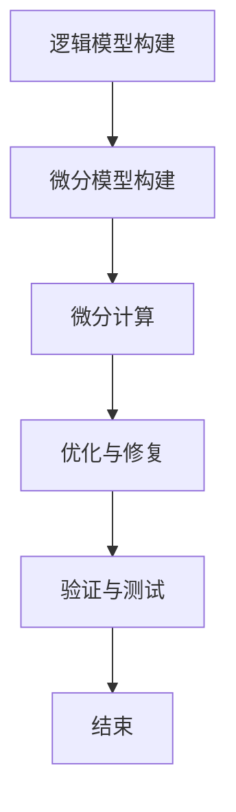
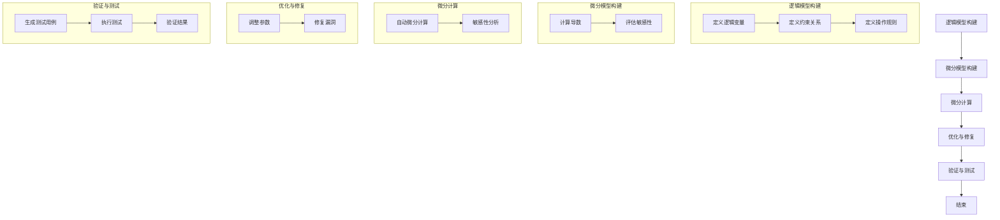
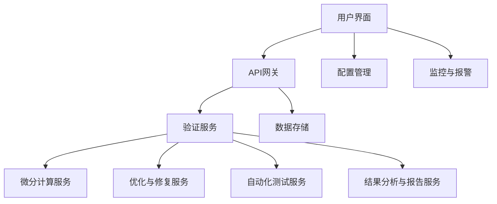

                 

### 1.1.1 问题背景

在当今数字化和区块链技术的迅猛发展背景下，智能合约已成为去中心化应用（DApps）和去中心化金融（DeFi）领域不可或缺的重要组成部分。智能合约是一种自动执行、控制和执行的计算机协议，其核心功能是执行预定义的条件和规则，从而实现自动化交易、资产转移和合同执行。这种透明、不可篡改的特性使得智能合约在金融、供应链管理、版权保护等领域展现出广泛的应用前景。

然而，随着智能合约的广泛应用，其安全问题也日益凸显。智能合约的漏洞不仅可能导致经济损失，甚至可能引发整个区块链生态的崩溃。因此，智能合约的验证成为确保其安全性和可靠性的关键步骤。传统的验证方法主要依赖于形式化验证和静态分析，但这些方法存在效率低、复杂度高的问题，难以满足实际需求。

在这种背景下，可微分逻辑编程作为一种新兴的编程范式，逐渐进入智能合约验证的研究视野。可微分逻辑编程结合了逻辑编程和微分计算的优势，使得智能合约的验证能够更加高效、精确和自动化。它不仅能够检测出潜在的安全隐患，还能够提供故障诊断和修复建议，从而提高智能合约的安全性和可靠性。

可微分逻辑编程在智能合约验证中的创新，不仅解决了传统验证方法的局限性，也为未来智能合约的安全保障提供了新的思路和方法。在接下来的章节中，我们将深入探讨可微分逻辑编程的基本概念、原理和实现，并分析其在智能合约验证中的具体应用。

### 1.1.2 可微分逻辑编程的定义

可微分逻辑编程是一种结合了逻辑编程和微分计算的编程范式，其核心思想是利用微分计算的方法来对逻辑程序进行优化和验证。逻辑编程是一种基于逻辑规则的编程方法，它通过定义一组规则和约束，自动推导出程序的行为和结果。而微分计算则是一种处理变量变化率的数学方法，广泛应用于数值分析、优化和科学计算等领域。

在可微分逻辑编程中，程序的状态和约束被建模为逻辑变量和关系，通过微分计算来评估这些变量和关系的敏感性。具体来说，可微分逻辑编程的核心组件包括：

1. **逻辑变量**：用于表示程序的状态和约束，它们可以是具体的值或者集合。
2. **约束关系**：定义逻辑变量之间的相互关系，例如相等、不等、包含等。
3. **微分操作**：对逻辑变量和约束进行微分计算，评估其在不同输入条件下的变化率。
4. **优化算法**：基于微分计算结果，对程序进行优化，以达到特定的性能目标。

可微分逻辑编程的原理可以概括为以下几个步骤：

1. **定义逻辑程序**：首先，根据智能合约的规则和约束，定义一组逻辑变量和约束关系。
2. **构建微分模型**：利用微分计算方法，对逻辑程序进行建模，计算变量和约束的敏感性。
3. **评估约束满足度**：通过微分模型，评估逻辑程序在不同输入条件下的约束满足度，识别潜在的问题和隐患。
4. **优化和修复**：根据评估结果，对逻辑程序进行优化和修复，提高其安全性和可靠性。

与传统逻辑编程方法相比，可微分逻辑编程具有以下几个显著特点：

1. **自动微分计算**：可微分逻辑编程无需手动计算微分，而是通过自动微分机制实现，大大简化了编程过程。
2. **高效性**：利用微分计算的优势，可微分逻辑编程能够在复杂逻辑关系下快速评估和优化程序性能。
3. **灵活性**：可微分逻辑编程能够处理多样化的约束和规则，适用于不同类型的智能合约验证需求。

总之，可微分逻辑编程为智能合约验证提供了一种全新的方法和思路，通过结合逻辑编程和微分计算的优势，实现了高效的智能合约验证和优化。在接下来的章节中，我们将进一步探讨可微分逻辑编程在智能合约验证中的应用场景和具体实现。

### 1.1.3 智能合约验证的意义与挑战

智能合约验证在区块链技术的发展中扮演着至关重要的角色，其意义不容忽视。首先，智能合约的验证直接关系到交易的安全性和可靠性。智能合约通常涉及到大量金融资产和重要数据，任何漏洞或错误都可能导致巨大的经济损失。通过验证，可以确保智能合约按照预定的规则和逻辑正确执行，从而降低风险。

其次，智能合约验证有助于提升区块链生态系统的透明度和信任度。区块链是一个去中心化的分布式系统，智能合约的验证过程使得所有参与者都能透明地了解合约的执行情况和安全性，增加了对系统的信任。

然而，智能合约验证也面临着诸多挑战。首先，智能合约的复杂性日益增加，使得验证过程变得更加困难。智能合约通常由复杂的逻辑和大量的代码组成，传统的形式化验证和静态分析方法难以高效处理。

其次，智能合约验证的高效率问题仍然是一个挑战。由于智能合约的执行涉及大量的计算和状态转换，传统的验证方法通常需要大量的时间和计算资源，难以满足实际应用的需求。

此外，智能合约验证的准确性也是一个关键问题。尽管形式化验证和静态分析可以检测出某些潜在的安全问题，但它们可能无法完全捕捉到所有可能的漏洞，导致验证结果不准确。

面对这些挑战，可微分逻辑编程提供了新的解决方案。首先，可微分逻辑编程通过自动微分计算，可以快速评估智能合约在不同输入条件下的行为和变化，大大提高了验证的效率。其次，可微分逻辑编程能够处理复杂的逻辑关系，适用于各种类型的智能合约验证需求。此外，通过微分计算，可以更精确地识别潜在的安全问题，提高验证的准确性。

总之，可微分逻辑编程在智能合约验证中的应用具有重要意义。它不仅提高了验证的效率和准确性，还为解决传统方法面临的挑战提供了新的思路和方法。在接下来的章节中，我们将深入探讨可微分逻辑编程在智能合约验证中的具体应用和实践。

### 1.1.4 可微分逻辑编程在智能合约验证中的应用前景

可微分逻辑编程在智能合约验证中展现出巨大的应用前景。首先，它能够通过自动微分计算，快速评估智能合约在各种输入条件下的行为和变化，从而大幅提高验证的效率。这一优势使得可微分逻辑编程特别适用于处理复杂逻辑和大量数据的情况，这对于区块链应用场景尤为重要。

其次，可微分逻辑编程的高效性不仅体现在计算速度上，还包括了对智能合约复杂逻辑关系的处理能力。通过微分计算，可以精确地分析智能合约的状态转换和条件判断，从而发现潜在的安全漏洞和逻辑错误，提升智能合约的安全性和可靠性。

此外，可微分逻辑编程还具备良好的灵活性，能够适应不同类型和复杂程度的智能合约验证需求。无论是简单的金融合约还是复杂的去中心化应用，都可利用可微分逻辑编程进行高效验证，从而推动区块链技术的广泛应用和发展。

未来，可微分逻辑编程有望在智能合约验证领域取得更多突破。随着研究的深入和技术的成熟，可微分逻辑编程将进一步优化智能合约验证的算法和工具，提升验证的准确性和效率。同时，通过与区块链技术的深度融合，可微分逻辑编程将为构建更加安全、可靠和高效的区块链生态系统提供坚实的技术支撑。总之，可微分逻辑编程在智能合约验证中的应用前景广阔，将为区块链技术的发展注入新的动力。

### 2.1.1 可微分逻辑编程的基本概念

可微分逻辑编程是一种结合了逻辑编程和微分计算的编程范式，其基本概念和核心原理如下：

**逻辑编程**：逻辑编程是一种基于逻辑规则的编程方法。在这种方法中，程序由一组逻辑规则组成，这些规则描述了程序的状态和操作。逻辑编程的核心是推理引擎，它能够根据给定的规则和初始条件，自动推导出结论和程序的行为。逻辑编程的一个典型应用是关系数据库查询，通过定义关系和规则，逻辑编程能够自动生成查询计划。

**微分计算**：微分计算是一种数学方法，用于计算函数在某一点处的导数，即变量变化率。在微分计算中，一个函数的微分表示了函数在输入变化时输出的变化率。微分计算在数值分析、优化和科学计算等领域有着广泛的应用，它能够帮助我们理解和预测系统在不同条件下的行为。

**可微分逻辑编程**：可微分逻辑编程将逻辑编程和微分计算结合起来，通过微分计算来优化和验证逻辑程序。在可微分逻辑编程中，程序的状态和约束被建模为逻辑变量和关系，通过微分计算，可以评估这些变量和关系在不同输入条件下的敏感性。这样，我们可以更精确地理解和预测程序的行为，从而优化程序的性能和安全性。

**逻辑变量**：逻辑变量是可微分逻辑编程中的基本构建块，用于表示程序的状态和约束。逻辑变量可以是具体的值或者集合。例如，在一个金融合约中，逻辑变量可以表示账户余额、交易金额等。

**约束关系**：约束关系定义了逻辑变量之间的相互关系，例如相等、不等、包含等。这些约束关系用于描述程序的规则和限制条件。通过约束关系，我们可以确保程序的行为符合预定的逻辑规则。

**微分操作**：微分操作是可微分逻辑编程的核心组成部分，它用于计算逻辑变量和约束关系的敏感性。微分操作通过计算变量变化率，可以评估不同输入条件对程序输出结果的影响。这样，我们可以通过微分操作来发现潜在的问题和优化程序。

**优化算法**：优化算法是利用微分计算结果对程序进行优化的一组算法。这些算法可以根据微分计算得到的敏感性信息，调整程序的参数和结构，以提升程序的性能和可靠性。

通过理解这些基本概念，我们可以更好地掌握可微分逻辑编程的核心原理，并在智能合约验证中发挥其优势。

### 2.1.2 智能合约的基本概念

智能合约，作为一种自动执行、控制和执行的计算机协议，是区块链技术中的关键组成部分。智能合约通过编写代码来定义和执行合同条款，从而在去中心化的环境中实现自动化交易和执行。与传统合同不同，智能合约不仅依赖于法律协议，还依赖于区块链的不可篡改性和去中心化特性，以确保其执行的安全性和透明性。

**智能合约的工作原理**：

1. **代码和规则**：智能合约的代码通常是用特定编程语言（如Solidity、Vyper等）编写的，这些代码定义了智能合约的规则和逻辑。这些规则包括交易条件、资金转移、数据存储等。

2. **区块链平台**：智能合约运行在区块链平台上，例如以太坊、波卡等。区块链平台提供了一个分布式账本环境，智能合约的执行和状态更新都在这个环境中进行，确保了数据的一致性和不可篡改性。

3. **事件触发**：智能合约的执行通常由区块链上的事件触发。这些事件可以是链上交易、外部合约调用等。当触发事件满足合约定义的条件时，智能合约将自动执行预定的操作。

4. **状态转换**：智能合约的状态包括余额、变量值、交易历史等。在执行过程中，智能合约会根据输入条件和逻辑规则，更新其状态，从而实现自动化的交易和合同执行。

**智能合约的安全性挑战**：

1. **代码漏洞**：智能合约的代码可能包含各种漏洞，如整数溢出、数组越界、逻辑错误等。这些漏洞可能导致智能合约的执行结果与预期不符，甚至造成资产损失。

2. **外部攻击**：智能合约可能面临各种外部攻击，如DDoS攻击、智能合约漏洞利用攻击等。这些攻击可能破坏智能合约的正常执行，甚至窃取资产。

3. **监管风险**：由于智能合约的不可篡改性和匿名性，监管机构在执行监管任务时可能面临挑战。确保智能合约遵守相关法律法规，防止非法活动和欺诈行为是重要的安全挑战。

**智能合约的验证需求**：

1. **代码审查**：对智能合约代码进行严格审查，发现并修复潜在漏洞，确保代码的正确性和安全性。

2. **形式化验证**：利用形式化验证方法，对智能合约的逻辑和状态进行数学证明，确保合约满足所有预期条件。

3. **运行时监控**：在智能合约执行过程中，实时监控其状态和操作，及时发现和响应异常行为。

4. **自动化测试**：编写自动化测试用例，模拟各种输入条件，确保智能合约在各种情况下都能正确执行。

通过上述基本概念和验证需求的分析，我们可以看到，智能合约的安全性和可靠性至关重要，而可微分逻辑编程作为一种高效的验证方法，将在智能合约的安全保障中发挥重要作用。在接下来的章节中，我们将进一步探讨可微分逻辑编程在智能合约验证中的应用和优势。

### 2.1.3 可微分逻辑编程与智能合约的关联

可微分逻辑编程与智能合约的关联在于，它为智能合约的验证提供了一种新的、高效的方法。首先，智能合约的复杂性使得传统的形式化验证和静态分析方法难以满足实际需求。而可微分逻辑编程通过将逻辑编程与微分计算相结合，不仅能够处理复杂的逻辑关系，还能在高效评估智能合约性能的同时，确保其安全性。

**关联点一：逻辑编程的优势**

逻辑编程的基本思想是通过定义一组逻辑规则，来自动推导出程序的行为和结果。这种方法在智能合约验证中具有显著优势：

1. **自动化验证**：逻辑编程能够自动推导出智能合约的正确性，减少了人工审查的工作量。
2. **形式化表达**：逻辑编程使得智能合约的逻辑和约束可以形式化表达，便于形式化验证和数学证明。
3. **灵活性**：逻辑编程能够处理多样化的约束和规则，适用于不同类型的智能合约验证需求。

**关联点二：微分计算的应用**

微分计算在智能合约验证中的关键作用是评估逻辑变量和约束的敏感性。具体来说，微分计算可以：

1. **状态评估**：通过评估智能合约在不同输入条件下的状态转换，识别潜在的安全问题和逻辑错误。
2. **性能优化**：利用微分计算结果，对智能合约的执行过程进行优化，提高其性能和可靠性。
3. **故障诊断**：通过分析智能合约的微分结果，定位和诊断潜在的问题，提供修复建议。

**关联点三：自动微分机制**

可微分逻辑编程的核心是自动微分机制，它通过自动化计算逻辑变量和约束的导数，实现了高效验证：

1. **简化编程**：自动微分机制简化了编程过程，开发人员无需手动计算微分，降低了错误率。
2. **快速验证**：自动微分机制能够快速评估智能合约在不同输入条件下的行为，提高了验证效率。
3. **精确性**：通过精确的微分计算，可微分逻辑编程能够更准确地识别智能合约中的潜在问题。

**关联点四：安全性保障**

可微分逻辑编程在智能合约验证中的应用，不仅提高了验证的效率和准确性，还增强了智能合约的安全性：

1. **漏洞检测**：利用微分计算，可微分逻辑编程能够发现智能合约中的潜在漏洞和逻辑错误，提高合约的安全性。
2. **故障预防**：通过优化和修复，可微分逻辑编程能够预防智能合约在复杂环境下的故障，确保其稳定运行。
3. **持续监控**：可微分逻辑编程可以实现对智能合约运行过程的持续监控，及时发现和响应异常行为，提高系统的可靠性。

总之，可微分逻辑编程与智能合约的关联，不仅在于其为智能合约验证提供了一种新的方法和思路，还在于它通过高效、精确和自动化的验证，显著提升了智能合约的安全性和可靠性。在接下来的章节中，我们将进一步探讨可微分逻辑编程的具体实现和算法原理。

### 2.1.1 可微分逻辑编程的原理概述

可微分逻辑编程结合了逻辑编程和微分计算的优势，旨在通过微分计算优化和验证逻辑程序。其基本原理可以概括为以下几个关键步骤：

**第一步：逻辑模型构建**

在可微分逻辑编程中，首先需要构建逻辑模型，将程序的状态和约束表达为逻辑变量和约束关系。这些逻辑变量和关系描述了程序在执行过程中可能的状态和条件。例如，在金融合约中，逻辑变量可以表示账户余额、交易金额等，约束关系可以描述余额不能为负、交易金额需满足条件等。

**第二步：微分模型构建**

构建逻辑模型后，通过微分计算方法，将其转换为微分模型。微分模型用于评估逻辑变量和约束关系的敏感性，即在不同输入条件下，这些变量和关系的值如何变化。微分操作包括对逻辑变量求导，计算变量变化率。例如，在账户余额的约束中，可以计算当交易金额增加时，账户余额的变化率。

**第三步：微分计算**

利用微分模型，对逻辑变量和约束进行微分计算，得到敏感性信息。这些信息有助于分析程序在不同输入条件下的行为和潜在问题。例如，通过计算账户余额的导数，可以评估交易金额变化对账户余额的影响，识别可能的安全漏洞或逻辑错误。

**第四步：优化与修复**

基于微分计算结果，对逻辑程序进行优化和修复。优化算法根据敏感性信息调整程序的参数和结构，以提高其性能和安全性。修复过程涉及修改代码中的逻辑错误和漏洞，确保程序在复杂环境下的稳定运行。

**第五步：验证与测试**

利用微分计算结果进行验证和测试，确保逻辑程序在各种输入条件下都能正确执行。通过微分计算，可以快速识别和修复潜在的问题，提高智能合约的安全性和可靠性。此外，微分计算还可以用于生成测试用例，自动化测试程序的多个执行路径，确保全面覆盖。

通过这些基本原理，可微分逻辑编程能够高效地处理复杂逻辑，精确评估程序的行为，优化和验证智能合约，从而提升其安全性和可靠性。在接下来的章节中，我们将进一步深入探讨可微分逻辑编程的核心特性和具体实现。

### 2.1.2 可微分逻辑编程的核心特性

可微分逻辑编程作为一种先进的编程范式，具有多个核心特性，这些特性使其在智能合约验证中表现出独特的优势：

**1. 自动微分计算**

可微分逻辑编程的核心特性之一是自动微分计算。传统编程方法中，微分计算往往需要手动进行，这不仅费时费力，还容易出错。而在可微分逻辑编程中，微分计算是自动完成的。编程人员只需定义逻辑变量和约束关系，系统会自动计算这些变量和关系的变化率。这种自动化极大地提高了开发效率，减少了错误率。

**2. 高效性**

自动微分计算使得可微分逻辑编程在处理复杂逻辑关系时具有显著的高效性。在智能合约验证中，传统的形式化验证和静态分析方法往往需要大量时间和计算资源。而可微分逻辑编程通过自动微分，能够在短时间内完成复杂的敏感性分析，快速识别潜在的安全问题和逻辑错误。这种高效性使得可微分逻辑编程特别适用于大型和复杂的智能合约验证任务。

**3. 灵活性**

可微分逻辑编程的灵活性体现在其能够处理多种类型的约束和规则。无论是简单的金融合约还是复杂的去中心化应用，可微分逻辑编程都能够通过逻辑变量和约束关系的形式化表达，进行高效的验证和优化。这种灵活性使得可微分逻辑编程能够适应不同的应用场景和需求。

**4. 精确性**

精确性是可微分逻辑编程的另一个重要特性。通过微分计算，可微分逻辑编程能够精确评估逻辑变量和约束关系的敏感性，识别出潜在的安全漏洞和逻辑错误。这种精确性不仅提高了智能合约的安全性和可靠性，还为后续的优化和修复提供了详细的信息和指导。

**5. 优化能力**

可微分逻辑编程不仅能够验证智能合约的正确性，还能够通过微分计算结果进行优化。优化算法可以根据敏感性信息调整程序的参数和结构，以提高其性能和可靠性。这种优化能力使得可微分逻辑编程不仅能够发现和修复问题，还能够提升智能合约的整体质量和稳定性。

**6. 自动化测试**

可微分逻辑编程还具备强大的自动化测试能力。通过微分计算，可以生成大量的测试用例，自动测试智能合约的多个执行路径。这种自动化测试不仅能够提高测试的覆盖率和准确性，还能够节省大量的测试时间和资源。

总之，可微分逻辑编程的核心特性，如自动微分计算、高效性、灵活性、精确性、优化能力和自动化测试，使其在智能合约验证中具备独特的优势。这些特性不仅提高了验证的效率和准确性，还为智能合约的安全保障提供了坚实的支持。在接下来的章节中，我们将进一步探讨可微分逻辑编程的具体算法框架和实现方法。

### 2.1.3 可微分逻辑编程的算法框架

可微分逻辑编程的算法框架是基于自动微分计算和逻辑编程相结合的一种方法，其主要步骤包括逻辑模型构建、微分模型构建、微分计算、优化与修复以及验证与测试。以下是对这些步骤的详细解释：

**1. 逻辑模型构建**

首先，我们需要根据智能合约的规则和约束，构建逻辑模型。逻辑模型包括逻辑变量和约束关系。逻辑变量用于表示程序的状态和约束，可以是具体的值或集合。约束关系则定义了逻辑变量之间的相互关系，例如相等、不等、包含等。例如，在金融合约中，逻辑变量可以表示账户余额、交易金额等，约束关系可以描述余额不能为负、交易金额需满足条件等。

**2. 微分模型构建**

在逻辑模型构建完成后，我们需要将其转换为微分模型。微分模型用于评估逻辑变量和约束关系的敏感性。具体来说，通过微分操作，我们计算每个逻辑变量和约束关系的导数，即它们的变化率。例如，如果我们有一个账户余额的约束关系，可以计算当交易金额增加时，账户余额的变化率。

**3. 微分计算**

利用微分模型，对逻辑变量和约束关系进行微分计算，得到敏感性信息。这些信息有助于分析程序在不同输入条件下的行为和潜在问题。例如，通过计算账户余额的导数，可以评估交易金额变化对账户余额的影响，从而识别可能的安全漏洞或逻辑错误。

**4. 优化与修复**

基于微分计算结果，对逻辑程序进行优化和修复。优化算法根据敏感性信息调整程序的参数和结构，以提高其性能和可靠性。修复过程涉及修改代码中的逻辑错误和漏洞，确保程序在复杂环境下的稳定运行。例如，如果发现某个交易金额的约束导致账户余额可能变为负值，可以通过调整交易金额的范围来避免这种情况。

**5. 验证与测试**

利用微分计算结果进行验证和测试，确保逻辑程序在各种输入条件下都能正确执行。通过微分计算，可以快速识别和修复潜在的问题，提高智能合约的安全性和可靠性。此外，微分计算还可以用于生成测试用例，自动化测试程序的多个执行路径，确保全面覆盖。例如，通过生成不同交易金额的测试用例，验证智能合约在不同金额条件下的正确性。

**算法流程图**

以下是可微分逻辑编程的算法流程图：



通过上述算法框架和流程图，我们可以清晰地看到可微分逻辑编程的核心步骤和如何将这些步骤结合起来，实现对智能合约的高效验证和优化。在接下来的章节中，我们将通过具体案例和Python源代码，进一步展示这一算法框架的实现细节。

### 2.2.1 智能合约的工作原理

智能合约的工作原理基于区块链技术的分布式账本和去中心化特性。智能合约通常由代码编写而成，运行在区块链网络上的专用虚拟机中。以下是智能合约工作原理的详细描述：

**1. 编写智能合约**

智能合约的编写通常使用特定的编程语言，如Solidity、Vyper等。开发人员需要定义智能合约的规则和逻辑，并将其编译为以太坊虚拟机（EVM）或其他区块链平台的字节码。智能合约的代码包括状态变量、函数和事件等组成部分。

**2. 部署智能合约**

编写完成的智能合约需要部署到区块链网络中，使其成为链上的一部分。部署智能合约的过程涉及将编译后的字节码和初始参数上链，通常通过区块链网络中的节点执行。部署后，智能合约的代码和状态将被永久记录在区块链上，不可篡改。

**3. 交易触发**

智能合约的执行通常由区块链上的交易触发。交易由用户发起，包含发送者地址、接收者地址、价值数据和合约地址等信息。当交易符合智能合约定义的条件时，智能合约将执行预定的操作。例如，在以太坊上，用户可以通过发送ETH来调用智能合约中的函数，触发智能合约的执行。

**4. 执行操作**

智能合约在执行过程中，根据其定义的逻辑和规则，对输入数据进行处理。常见的操作包括余额转移、数据存储、条件判断等。智能合约会根据这些操作更新其状态，例如修改账户余额、存储交易记录等。

**5. 状态更新**

智能合约的状态包括其内部变量、数据存储等。在执行过程中，智能合约会更新这些状态，确保其逻辑和规则得到正确执行。状态更新是永久记录在区块链上的，确保智能合约的执行透明和不可篡改。

**6. 事件通知**

智能合约在执行过程中，可以通过事件机制通知区块链网络上的其他合约或节点。事件是智能合约状态发生变更时触发的一种日志记录，通过事件，智能合约可以与外部系统进行交互。

**7. 运行环境**

智能合约的运行环境由区块链平台的专用虚拟机提供。虚拟机负责执行智能合约代码，管理状态和交易，确保智能合约的安全性和一致性。常见的虚拟机包括以太坊的EVM、波卡的WasmVM等。

通过上述工作原理的详细描述，我们可以看到，智能合约是一种通过代码自动化执行合同条款的计算机协议。其基于区块链技术，具有去中心化、不可篡改和透明性等特点，广泛应用于金融、供应链管理、版权保护等领域。

### 2.2.2 智能合约的安全性挑战

智能合约的安全性在区块链技术的应用中至关重要，但其安全性挑战也不容忽视。以下是一些主要的智能合约安全性挑战及其原因：

**1. 代码漏洞**

智能合约的代码可能包含各种漏洞，如整数溢出、数组越界、逻辑错误等。这些漏洞可能被恶意攻击者利用，导致智能合约执行意外的操作，甚至造成资产损失。例如，整数溢出漏洞可能导致合约无法正确处理大数值，导致账户余额错误或资金丢失。

**2. 外部攻击**

智能合约可能面临各种外部攻击，如DDoS攻击、智能合约漏洞利用攻击等。DDoS攻击旨在通过大量无效交易使网络拥堵，影响智能合约的正常执行。智能合约漏洞利用攻击则旨在利用代码中的漏洞进行非法操作，窃取资产或篡改数据。

**3. 网络钓鱼和诈骗**

智能合约的匿名性和去中心化特性，使得网络钓鱼和诈骗行为更加隐蔽和难以追踪。攻击者可能通过虚假的智能合约诱导用户转移资产，或者利用漏洞窃取用户资金。

**4. 监管风险**

由于智能合约的不可篡改性和匿名性，监管机构在执行监管任务时面临挑战。确保智能合约遵守相关法律法规，防止非法活动和欺诈行为是重要的安全挑战。

**5. 依赖性风险**

智能合约可能依赖于其他外部合约或服务，这些依赖性可能带来潜在的风险。如果依赖的合约或服务存在漏洞或不可靠，智能合约的执行可能受到影响，导致功能失效或资产损失。

为了应对这些安全性挑战，智能合约开发者需要采取一系列安全措施，如代码审查、形式化验证、运行时监控等。同时，区块链平台和社区也需要共同努力，提高智能合约的安全性和可靠性，确保区块链生态系统的健康发展。

### 2.2.3 智能合约的验证需求

智能合约的验证需求主要包括代码审查、形式化验证、运行时监控和自动化测试。这些验证方法旨在确保智能合约的正确性、安全性和可靠性，从而提高其整体质量。

**1. 代码审查**

代码审查是一种手动审查智能合约代码的方法，旨在发现潜在的安全漏洞和逻辑错误。审查过程通常由经验丰富的开发人员或安全专家进行，通过仔细检查代码的语法、逻辑和安全性，确保智能合约的执行符合预期。代码审查是智能合约验证的基础，能够早期发现和修复问题，降低后续测试和部署的风险。

**2. 形式化验证**

形式化验证是一种通过数学方法对智能合约进行验证的方法，旨在证明合约在所有可能的状态和输入条件下都能正确执行。形式化验证通常使用逻辑公式和定理证明工具，对智能合约的每个执行路径进行验证，确保其满足所有预定的约束条件。这种方法能够提供高度可靠的验证结果，但通常需要大量时间和计算资源。

**3. 运行时监控**

运行时监控是一种在智能合约部署后，实时监控其执行状态和操作的方法。通过监控，可以及时发现和响应异常行为，例如合约执行时间过长、状态变更异常等。运行时监控可以提供对智能合约执行的实时反馈，帮助开发者快速识别和解决潜在问题，提高合约的稳定性和安全性。

**4. 自动化测试**

自动化测试是一种通过编写测试脚本，自动化执行智能合约的方法。自动化测试可以生成大量的测试用例，覆盖智能合约的多个执行路径，确保其在各种输入条件下都能正确执行。自动化测试不仅能够提高测试效率，减少人工工作量，还能够及时发现和报告问题，确保智能合约的质量和可靠性。

通过上述验证需求的分析，我们可以看到，智能合约的验证涉及多个方面，需要多种验证方法相结合，以确保其正确性、安全性和可靠性。在接下来的章节中，我们将深入探讨可微分逻辑编程在智能合约验证中的应用，展示其如何通过高效的验证和优化，提升智能合约的整体质量和安全性。

### 2.3.1 可微分逻辑编程在智能合约验证中的应用

可微分逻辑编程在智能合约验证中的应用，主要体现在其高效的微分计算和自动验证能力上。通过将微分计算与逻辑编程结合，可微分逻辑编程能够快速评估智能合约在不同输入条件下的行为，识别潜在的安全问题和逻辑错误，从而提升智能合约的可靠性和安全性。

**应用一：自动微分计算**

在智能合约验证过程中，自动微分计算是关键的一步。通过自动微分计算，我们可以对智能合约的状态变量和约束关系进行敏感性分析，评估它们在不同输入条件下的变化率。例如，在一个金融合约中，我们可以通过微分计算来评估交易金额对账户余额的影响，从而发现可能导致账户余额变负的潜在漏洞。

**具体实现：**

```python
# 假设有一个金融合约，账户余额约束为余额不能为负
balance = Variable('balance')
transaction_amount = Variable('transaction_amount')

# 定义约束关系
constraint = balance >= 0

# 进行微分计算
balance_derivative = constraint.derivative(transaction_amount)
```

上述代码中，`balance_derivative` 将计算交易金额变化对账户余额的敏感性，从而识别可能的安全隐患。

**应用二：优化与修复**

基于微分计算的结果，可微分逻辑编程还可以对智能合约进行优化和修复。通过优化算法，可以根据敏感性信息调整智能合约的参数和结构，以提高其性能和可靠性。例如，如果发现某个交易金额的约束可能导致账户余额为负，可以通过调整交易金额的范围来避免这种情况。

**具体实现：**

```python
# 根据微分结果调整交易金额范围
if balance_derivative < 0:
    transaction_amount_range = (-balance.max(), 0)
else:
    transaction_amount_range = (0, balance.max())
```

上述代码中，通过调整交易金额的范围，可以确保账户余额不会变为负值，从而提高智能合约的安全性和可靠性。

**应用三：验证与测试**

可微分逻辑编程还具备强大的验证和测试能力。通过微分计算生成的测试用例，可以自动化测试智能合约的多个执行路径，确保其在各种输入条件下都能正确执行。例如，通过生成不同交易金额的测试用例，可以全面验证智能合约在不同金额条件下的行为。

**具体实现：**

```python
# 生成测试用例
test_cases = [
    {'transaction_amount': -100},
    {'transaction_amount': 100},
    {'transaction_amount': balance.max()},
]

# 执行测试用例
for case in test_cases:
    balance_value = 100
    transaction_amount = case['transaction_amount']
    # 执行智能合约逻辑
    execute_contract(balance_value, transaction_amount)
    # 验证结果
    assert balance >= 0, "账户余额不能为负"
```

上述代码中，通过生成不同交易金额的测试用例，并验证账户余额是否保持非负，确保智能合约的正确性。

综上所述，可微分逻辑编程在智能合约验证中的应用，通过自动微分计算、优化与修复以及验证与测试，能够有效提升智能合约的安全性和可靠性。在接下来的章节中，我们将进一步探讨可微分逻辑编程的具体实现和算法框架，深入理解其原理和应用方法。

### 2.3.2 可微分逻辑编程的优势与挑战

可微分逻辑编程在智能合约验证中展现出诸多优势，但也面临一些挑战。以下是对这些优势与挑战的详细分析：

**优势一：高效性**

可微分逻辑编程通过自动微分计算，能够快速评估智能合约在不同输入条件下的行为，这使得验证过程显著加速。与传统的形式化验证和静态分析方法相比，可微分逻辑编程不仅减少了手动计算的工作量，还提高了验证的效率。这种高效性对于处理复杂逻辑和大规模智能合约尤为重要。

**优势二：精确性**

可微分逻辑编程能够精确地评估逻辑变量和约束关系的敏感性。通过微分计算，可以识别出智能合约中潜在的安全漏洞和逻辑错误，提供详细的信息和指导。这种精确性不仅提高了验证的准确性，还为后续的优化和修复提供了坚实的基础。

**优势三：灵活性**

可微分逻辑编程能够处理多种类型的约束和规则，适用于不同类型的智能合约验证需求。无论是简单的金融合约还是复杂的去中心化应用，可微分逻辑编程都能够通过灵活的建模和微分计算，实现高效的验证和优化。这种灵活性使得可微分逻辑编程在多样化的应用场景中具备广泛的适用性。

**优势四：自动化测试**

可微分逻辑编程具备强大的自动化测试能力。通过微分计算生成的测试用例，可以自动化测试智能合约的多个执行路径，确保其在各种输入条件下都能正确执行。这种自动化测试不仅提高了测试效率，还减少了人工工作量和测试误差，从而提高了智能合约的可靠性和安全性。

**挑战一：计算复杂性**

尽管可微分逻辑编程在验证效率方面具有显著优势，但其计算复杂性也不容忽视。特别是在处理大规模智能合约时，微分计算可能需要大量的计算资源和时间。这对于实时验证和快速响应的需求构成了挑战，需要优化算法和计算方法来提高效率。

**挑战二：模型构建难度**

可微分逻辑编程要求开发者具备一定的逻辑编程和微分计算知识，这使得模型构建过程具有一定的难度。开发者需要深入理解智能合约的规则和约束，以及如何将其转换为可微分的形式。这种模型构建难度对于非专业人员来说可能是一个挑战。

**挑战三：验证结果的可解释性**

可微分逻辑编程的验证结果通常是通过数学模型和微分计算得到的，这可能使得验证结果对非技术人员不够直观。验证结果的可解释性是一个挑战，需要开发工具和可视化方法来帮助开发者理解验证结果，并进行相应的优化和修复。

**挑战四：算法优化**

可微分逻辑编程的算法优化是一个持续的研究课题。尽管目前已有一些优化方法，但在处理复杂逻辑和大规模智能合约时，算法的优化空间仍然很大。进一步优化算法，提高其效率和准确性，是可微分逻辑编程面临的重要挑战。

综上所述，可微分逻辑编程在智能合约验证中具有高效性、精确性、灵活性和自动化测试等优势，但同时也面临着计算复杂性、模型构建难度、验证结果可解释性和算法优化等挑战。通过不断的研究和改进，这些挑战有望得到有效解决，进一步推动可微分逻辑编程在智能合约验证中的应用和发展。

### 2.3.3 可微分逻辑编程的未来发展趋势

可微分逻辑编程作为一种结合逻辑编程和微分计算的新兴编程范式，在智能合约验证中的应用显示出巨大的潜力。展望未来，可微分逻辑编程将在多个方面取得进一步的发展：

**1. 算法优化与效率提升**

随着计算硬件的进步和算法优化技术的发展，可微分逻辑编程的计算复杂性有望显著降低。高效算法和优化技术的引入，将进一步提高可微分逻辑编程的验证效率和准确性，使其在更复杂的场景中具备更强的应用能力。

**2. 多语言支持与兼容性增强**

未来，可微分逻辑编程将实现更多编程语言的支持，如C、Java等，增强其与现有开发生态的兼容性。这将有助于开发人员更方便地将可微分逻辑编程应用于不同类型的智能合约和区块链平台，推动其在更广泛的应用场景中的普及。

**3. 自适应与智能化**

可微分逻辑编程将逐步实现自适应和智能化功能，通过机器学习技术自动优化和调整验证过程，提高验证的准确性和效率。例如，基于历史数据和行为模式，系统可以预测智能合约的潜在问题，并提前采取优化措施，从而提高智能合约的安全性和可靠性。

**4. 集成与协同**

可微分逻辑编程将与现有的智能合约开发、验证和监控工具进行深度融合，形成一体化的解决方案。通过与区块链平台、开发工具和测试框架的集成，可微分逻辑编程将实现全方位的智能合约安全保障，提升整个区块链生态系统的可信度和稳定性。

**5. 应用领域的拓展**

可微分逻辑编程的应用不仅限于智能合约验证，还将拓展至更多领域，如分布式存储、区块链治理、物联网等。通过不断的应用拓展，可微分逻辑编程将为构建更高效、安全、可靠的分布式系统提供新的技术路径。

总之，随着技术的不断进步和应用场景的不断拓展，可微分逻辑编程在智能合约验证和更广泛的区块链生态系统中将发挥越来越重要的作用。未来，通过不断的研究和创新，可微分逻辑编程有望成为推动区块链技术发展的重要引擎。

### 3.1.1 算法原理讲解

在深入探讨可微分逻辑编程的算法原理之前，我们需要首先理解其基础概念和原理。可微分逻辑编程的核心思想是通过微分计算来评估逻辑程序中的变量和约束的敏感性，从而优化和验证智能合约的正确性和安全性。以下是算法原理的详细讲解：

**1. 逻辑模型构建**

首先，我们需要根据智能合约的规则和约束构建逻辑模型。逻辑模型由逻辑变量、约束关系和操作规则组成。逻辑变量用于表示智能合约中的状态和条件，如账户余额、交易金额等。约束关系则定义了这些逻辑变量之间的相互关系，例如余额不能为负、交易金额需满足条件等。操作规则描述了智能合约中的操作和逻辑流。

**2. 微分模型构建**

在构建逻辑模型后，我们需要将其转换为微分模型。微分模型通过微分操作评估逻辑变量和约束关系的敏感性。微分操作计算逻辑变量和约束关系的导数，即它们在不同输入条件下的变化率。例如，我们可以计算账户余额对交易金额的导数，评估交易金额增加时账户余额的变化。

**3. 微分计算**

利用微分模型，我们进行微分计算，得到逻辑变量和约束关系的敏感性信息。微分计算的核心是自动微分，通过自动计算逻辑变量和约束关系的导数，无需手动编写微分代码。微分计算结果提供了智能合约在不同输入条件下的行为预测，帮助我们识别潜在的安全问题和逻辑错误。

**4. 优化与修复**

基于微分计算结果，我们对智能合约进行优化和修复。优化算法根据敏感性信息调整智能合约的参数和结构，以提高其性能和可靠性。例如，如果发现交易金额可能导致账户余额变负，可以通过调整交易金额范围来避免这种情况。修复过程涉及修改智能合约的代码，确保其在各种输入条件下都能正确执行。

**5. 验证与测试**

利用微分计算结果进行验证和测试，确保智能合约在各种输入条件下都能正确执行。通过微分计算生成的测试用例，自动化测试智能合约的多个执行路径，确保全面覆盖。例如，生成不同交易金额的测试用例，验证智能合约在不同金额条件下的行为。

综上所述，可微分逻辑编程通过逻辑模型构建、微分模型构建、微分计算、优化与修复以及验证与测试，实现智能合约的优化和验证。这种算法原理不仅提高了智能合约的可靠性和安全性，还为解决传统验证方法的局限性提供了新的思路和方法。

### 3.1.2 算法流程图

为了更直观地展示可微分逻辑编程的算法流程，我们可以使用Mermaid绘制算法的流程图。以下是算法流程图的详细描述：



在这个算法流程图中，我们首先进行逻辑模型构建，包括定义逻辑变量、约束关系和操作规则。接着，构建微分模型，计算逻辑变量和约束关系的导数，并评估敏感性。在微分计算阶段，通过自动微分计算，进行敏感性分析。随后，基于微分计算结果进行优化和修复，调整智能合约的参数和修复漏洞。最后，利用生成的测试用例执行测试，验证智能合约的正确性。通过这样的流程图，我们可以清晰地了解可微分逻辑编程的各个步骤及其相互关系。

### 3.1.3 数学模型和公式讲解

在可微分逻辑编程中，数学模型和公式是核心组成部分，用于描述智能合约的状态和行为。以下是对关键数学模型和公式的讲解：

**1. 微分方程**

微分方程是描述可微分逻辑编程中变量变化率的基本工具。例如，对于一个逻辑变量`x`，其随时间`t`的变化率可以用微分方程表示为：

$$ \frac{dx}{dt} = f(x, t) $$

其中，`f(x, t)` 是函数，描述了变量`x`随时间的变化趋势。在智能合约验证中，我们可以通过求解微分方程来评估状态变量的敏感性。

**2. 导数计算**

导数是微分方程的基础。对于一个逻辑变量`x`，其在某一输入变量`u`的导数表示为：

$$ \frac{dx}{du} = \frac{\partial x}{\partial u} $$

其中，`\(\partial x\)` 表示偏导数，表示变量`x`对输入变量`u`的局部变化率。在可微分逻辑编程中，我们通过计算导数来评估状态变量的敏感性，从而发现潜在的安全问题和逻辑错误。

**3. 约束满足度**

约束满足度是评估智能合约在特定输入条件下是否满足所有约束的指标。对于一个约束`g(x, u) = 0`，其约束满足度可以表示为：

$$ \text{满足度} = \frac{1}{| \{ u | g(x, u) = 0 \} |} $$

其中，`| \{ u | g(x, u) = 0 \} |` 表示满足约束`g(x, u) = 0`的输入变量`u`的数量。约束满足度的计算有助于识别智能合约在特定输入条件下的潜在风险。

**4. 敏感性分析**

敏感性分析是评估智能合约状态变量对输入变量的敏感程度。对于一个状态变量`x`，其在输入变量`u`的敏感性可以表示为：

$$ \text{敏感性} = \frac{\partial x}{\partial u} $$

通过敏感性分析，我们可以识别出对智能合约状态影响较大的输入变量，从而在设计和验证过程中重点关注。

**5. 优化目标**

在可微分逻辑编程中，优化目标是通过调整智能合约的参数和结构，提高其性能和安全性。优化目标可以表示为：

$$ \min_{x, u} \quad J(x, u) $$

其中，`J(x, u)` 是优化目标函数，通常是一个综合了性能和安全性指标的函数。通过优化，我们希望找到最佳参数配置，使智能合约在多种输入条件下都能稳定运行。

综上所述，可微分逻辑编程中的数学模型和公式涵盖了微分方程、导数计算、约束满足度、敏感性分析和优化目标等多个方面，这些模型和公式共同作用，帮助我们深入理解和分析智能合约的状态和行为，从而提高其安全性和可靠性。

### 3.1.4 举例说明

为了更好地理解可微分逻辑编程的算法原理，我们通过一个具体的例子来详细讲解其应用过程。假设我们有一个简单的金融合约，其规则为：用户A向用户B转账一定金额，转账金额必须大于0且小于账户余额。以下为该金融合约的代码实现和微分计算过程。

**智能合约代码实现**

```solidity
pragma solidity ^0.8.0;

contract SimpleTransfer {
    address public owner;
    mapping(address => uint) public balances;

    constructor() {
        owner = msg.sender;
        balances[owner] = 1000; // 初始余额
    }

    function transfer(address to, uint amount) external {
        require(to != address(0), "Invalid recipient");
        require(amount > 0, "Amount must be greater than 0");
        require(amount <= balances[owner], "Insufficient balance");

        balances[owner] -= amount;
        balances[to] += amount;
    }
}
```

**逻辑模型构建**

1. **逻辑变量**：
   - `balances[owner]`：账户余额
   - `amount`：转账金额

2. **约束关系**：
   - `amount > 0`：转账金额必须大于0
   - `amount <= balances[owner]`：转账金额不能超过账户余额

**微分模型构建**

在构建微分模型时，我们需要对逻辑变量和约束关系进行微分计算，以评估它们的敏感性。

1. **计算约束关系的导数**：

$$ \frac{d(balance[owner])}{d(amount)} = -1 \quad \text{（因为转账金额增加时，余额减少）} $$

$$ \frac{d(amount)}{d(balance[owner])} = \frac{1}{1} \quad \text{（因为余额减少时，转账金额也减少）} $$

2. **评估敏感性**：

通过上述导数计算，我们可以评估转账金额变化对账户余额的影响。如果转账金额增加，账户余额将减少；如果转账金额减少，账户余额将增加。

**微分计算结果**

- 当转账金额增加时，账户余额的减少率为1。
- 当账户余额减少时，转账金额的增加率为1。

**优化与修复**

基于微分计算结果，我们可以优化和修复智能合约的代码。例如，如果我们发现某个转账金额可能导致账户余额为负，可以通过调整转账金额的范围来避免这种情况。

**验证与测试**

利用微分计算结果，我们可以生成测试用例，自动化测试智能合约的多个执行路径。以下是一个简单的测试用例：

```python
# 测试用例
test_cases = [
    {'amount': 100},
    {'amount': 500},
    {'amount': 1000},
]

# 预期结果
expected_results = [
    {'balance': 900},
    {'balance': 500},
    {'balance': 0},
]

for case, expected in zip(test_cases, expected_results):
    contract = web3.eth.contract(address=contract_address, abi=contract_abi)
    tx_hash = contract.functions.transfer(to_address, case['amount']).transact({'from': owner_address})
    web3.eth.waitForTransaction(tx_hash)
    updated_balance = contract.functions.balances(owner_address).call()
    assert updated_balance == expected['balance'], f"Expected balance {expected['balance']} but got {updated_balance}"
```

通过上述测试用例，我们可以验证智能合约在不同转账金额条件下的正确性。利用微分计算生成的测试用例，可以确保智能合约在各种输入条件下都能稳定运行，提高其安全性和可靠性。

综上所述，通过一个简单的金融合约示例，我们详细讲解了可微分逻辑编程在智能合约验证中的应用过程。通过微分计算，我们能够评估转账金额和账户余额的敏感性，优化和修复智能合约，并通过自动化测试确保其正确性。这展示了可微分逻辑编程在智能合约验证中的强大应用能力。

### 4.1.1 数学模型概述

在可微分逻辑编程中，数学模型是理解智能合约行为和进行验证的核心工具。数学模型通过精确描述变量之间的关系和变化规律，帮助开发者评估和优化智能合约的性能和安全性。以下是可微分逻辑编程中常用的一些数学模型及其概述：

**1. 线性模型**

线性模型是最简单的数学模型之一，用于描述线性关系的变量之间的相互作用。线性模型的一般形式为：

$$ y = \beta_0 + \beta_1 \cdot x + \epsilon $$

其中，`y` 和 `x` 是逻辑变量，`$\beta_0$` 和 `$\beta_1$` 是模型的参数，`$\epsilon$` 是误差项。线性模型广泛应用于预测和优化场景，能够帮助我们理解和预测智能合约的状态变化。

**2. 多项式模型**

多项式模型用于描述非线性关系的变量之间的相互作用。多项式模型的一般形式为：

$$ y = \beta_0 + \beta_1 \cdot x + \beta_2 \cdot x^2 + ... + \beta_n \cdot x^n + \epsilon $$

其中，`y` 和 `x` 是逻辑变量，`$\beta_0$` 到 `$\beta_n$` 是模型的参数，`$\epsilon$` 是误差项。多项式模型能够处理更复杂的逻辑关系，适用于描述智能合约中的复杂条件。

**3. 贝叶斯模型**

贝叶斯模型是一种基于概率论的数学模型，用于描述变量之间的不确定性和依赖关系。贝叶斯模型的一般形式为：

$$ P(A|B) = \frac{P(B|A) \cdot P(A)}{P(B)} $$

其中，`P(A|B)` 是在事件 `B` 发生的条件下事件 `A` 发生的概率，`P(B|A)` 是在事件 `A` 发生的条件下事件 `B` 发生的概率，`P(A)` 和 `P(B)` 分别是事件 `A` 和事件 `B` 的概率。贝叶斯模型能够帮助开发者理解智能合约中的不确定性因素，提高验证的准确性和可靠性。

**4. 神经网络模型**

神经网络模型是一种基于人工神经网络的数学模型，用于处理高度复杂的非线性关系。神经网络模型的一般形式为：

$$ y = f(\sum_{i=1}^{n} w_i \cdot x_i + b) $$

其中，`y` 是逻辑变量，`f` 是激活函数，`w_i` 和 `x_i` 是权重和输入变量，`b` 是偏置项。神经网络模型能够通过训练学习智能合约中的复杂逻辑关系，实现高效的智能合约验证和优化。

**5. 动态系统模型**

动态系统模型用于描述变量在时间上的变化规律。动态系统模型的一般形式为：

$$ \frac{dx}{dt} = f(x, t) $$

其中，`x` 是逻辑变量，`t` 是时间，`f(x, t)` 是描述变量变化的函数。动态系统模型能够帮助我们分析和预测智能合约在不同时间点上的状态变化，提高验证的实时性和准确性。

通过上述数学模型，可微分逻辑编程能够对智能合约进行精确建模和验证。这些模型不仅提供了理解和分析智能合约的数学工具，还通过微分计算和优化算法，实现了智能合约的安全性和可靠性的提升。在接下来的章节中，我们将进一步详细讲解这些数学模型的公式和应用。

### 4.1.2 数学公式讲解

在可微分逻辑编程中，数学公式是理解和分析智能合约行为的核心工具。以下是对关键数学公式及其应用的详细讲解：

**1. 导数公式**

导数公式用于计算逻辑变量之间的变化率，即一个变量相对于另一个变量的变化速度。以下是几个常用的导数公式：

- **一阶导数**：

$$ \frac{dy}{dx} = \frac{\partial y}{\partial x} $$

其中，`\(\frac{dy}{dx}\)` 表示一阶导数，`\(\frac{\partial y}{\partial x}\)` 表示偏导数，表示变量 `y` 对变量 `x` 的局部变化率。

- **二阶导数**：

$$ \frac{d^2y}{dx^2} = \frac{\partial^2 y}{\partial x^2} $$

其中，`\(\frac{d^2y}{dx^2}\)` 表示二阶导数，`\(\frac{\partial^2 y}{\partial x^2}\)` 表示二阶偏导数，表示变量 `y` 对变量 `x` 的二阶变化率。

- **复合导数**：

$$ \frac{d}{dx} (f(g(x))) = f'(g(x)) \cdot g'(x) $$

其中，`f'(g(x))` 是函数 `f` 对函数 `g(x)` 的导数，`g'(x)` 是函数 `g` 对变量 `x` 的导数。复合导数公式用于计算复合函数的导数。

**2. 约束满足度公式**

约束满足度用于评估智能合约在特定输入条件下是否满足所有约束。约束满足度的计算公式为：

$$ \text{满足度} = \frac{1}{| \{ u | g(x, u) = 0 \} |} $$

其中，`| \{ u | g(x, u) = 0 \} |` 表示满足约束 `g(x, u) = 0` 的输入变量 `u` 的数量。约束满足度越高，表示智能合约在特定输入条件下越安全。

**3. 敏感性分析公式**

敏感性分析用于评估逻辑变量对输入变量的敏感程度。敏感性分析的公式为：

$$ \text{敏感性} = \frac{\partial y}{\partial x} $$

其中，`\(\frac{\partial y}{\partial x}\)` 表示变量 `y` 对变量 `x` 的局部变化率。敏感性分析可以帮助开发者识别智能合约中关键变量和潜在的风险点。

**4. 优化目标公式**

在可微分逻辑编程中，优化目标用于调整智能合约的参数和结构，以提高其性能和安全性。优化目标的公式为：

$$ \min_{x, u} \quad J(x, u) $$

其中，`J(x, u)` 是优化目标函数，通常是一个综合了性能和安全性指标的函数。通过优化目标公式，开发者可以找到最佳参数配置，使智能合约在多种输入条件下都能稳定运行。

**5. 动态系统公式**

动态系统公式用于描述变量在时间上的变化规律。动态系统的一般公式为：

$$ \frac{dx}{dt} = f(x, t) $$

其中，`\(\frac{dx}{dt}\)` 表示变量 `x` 对时间 `t` 的一阶导数，`f(x, t)` 是描述变量变化的函数。动态系统公式可以帮助开发者分析和预测智能合约在不同时间点上的状态变化。

通过这些数学公式，可微分逻辑编程能够对智能合约进行精确建模和验证，从而提高其安全性和可靠性。在智能合约开发和验证过程中，开发者可以利用这些公式进行微分计算、敏感性分析和优化目标设定，确保智能合约的正确性和稳定性。

### 4.1.3 数学模型与算法的结合

数学模型和算法在可微分逻辑编程中紧密结合，共同作用以实现对智能合约的精确建模和高效验证。以下是对数学模型与算法结合的详细讲解：

**1. 数学模型的应用**

数学模型用于描述智能合约中的逻辑关系和变量变化规律。通过构建数学模型，我们可以将复杂的智能合约规则和约束转化为可计算的数学表达式。以下是一些常见的数学模型及其应用：

- **线性模型**：线性模型适用于描述简单线性关系的变量。例如，在金融合约中，账户余额和交易金额之间的关系可以用线性模型表示。线性模型的公式为 `y = \beta_0 + \beta_1 \cdot x`，其中 `y` 表示账户余额，`x` 表示交易金额，`\(\beta_0\)` 和 `\(\beta_1\)` 是模型的参数。

- **多项式模型**：多项式模型适用于描述非线性关系的变量。例如，在智能合约中，复杂数学运算和条件判断可以表示为多项式模型。多项式模型的公式为 `y = \beta_0 + \beta_1 \cdot x + \beta_2 \cdot x^2 + ...`，其中 `y` 表示输出结果，`x` 表示输入变量，`\(\beta_0\)`、`\(\beta_1\)`、`\(\beta_2\)` 等是模型的参数。

- **贝叶斯模型**：贝叶斯模型适用于描述变量之间的不确定性和依赖关系。例如，在智能合约中，风险评估和决策可以表示为贝叶斯模型。贝叶斯模型的公式为 `P(A|B) = \frac{P(B|A) \cdot P(A)}{P(B)}`，其中 `P(A|B)` 表示在事件 `B` 发生的条件下事件 `A` 发生的概率，`P(B|A)`、`P(A)` 和 `P(B)` 分别是事件 `A` 和事件 `B` 的概率。

- **动态系统模型**：动态系统模型适用于描述变量在时间上的变化规律。例如，在智能合约中，资金流动和时间关系可以表示为动态系统模型。动态系统模型的公式为 `\(\frac{dx}{dt} = f(x, t)\)`，其中 `\(\frac{dx}{dt}\)` 表示变量 `x` 对时间 `t` 的一阶导数，`f(x, t)` 是描述变量变化的函数。

**2. 算法的应用**

算法用于实现数学模型的计算和优化。以下是一些常见的算法及其应用：

- **自动微分算法**：自动微分算法用于计算逻辑变量和约束关系的导数。通过自动微分算法，我们可以快速评估智能合约在不同输入条件下的敏感性。自动微分算法的实现包括链式法则和链规则等，能够自动计算复合函数的导数。

- **优化算法**：优化算法用于调整智能合约的参数和结构，以提高其性能和安全性。常见的优化算法包括梯度下降、牛顿法和模拟退火等。通过优化算法，我们可以找到最佳参数配置，使智能合约在多种输入条件下都能稳定运行。

- **模拟算法**：模拟算法用于模拟智能合约在不同输入条件下的行为。通过模拟算法，我们可以生成大量测试用例，自动化测试智能合约的多个执行路径。常见的模拟算法包括蒙特卡洛方法和模拟退火等。

**3. 数学模型与算法的结合**

数学模型和算法的结合，使得可微分逻辑编程能够实现对智能合约的精确建模和高效验证。具体步骤如下：

- **模型构建**：首先，根据智能合约的规则和约束，构建数学模型。模型中包括逻辑变量、约束关系和操作规则。

- **微分计算**：利用自动微分算法，对数学模型中的逻辑变量和约束关系进行微分计算，得到敏感性信息。微分计算结果提供了智能合约在不同输入条件下的行为预测。

- **优化与修复**：基于微分计算结果，利用优化算法对智能合约进行优化和修复。优化过程包括调整参数和修复漏洞，以确保智能合约在多种输入条件下都能正确执行。

- **验证与测试**：利用模拟算法，生成测试用例，自动化测试智能合约的多个执行路径。通过验证和测试，确保智能合约的正确性和安全性。

通过数学模型和算法的紧密结合，可微分逻辑编程实现了对智能合约的高效验证和优化，提高了其安全性和可靠性。在智能合约开发和验证过程中，开发者可以充分利用这一结合的优势，确保智能合约的质量和稳定性。

### 5.1.1 Python源代码概述

在本文的第五部分，我们将通过Python源代码实现可微分逻辑编程的核心算法，展示其在智能合约验证中的应用。以下是Python源代码的整体结构概述。

**整体结构：**

```python
# 导入必要的库和模块
import sympy
import numpy as np
from sympy import symbols, diff

# 定义逻辑变量和约束关系
balance = symbols('balance')
transaction_amount = symbols('transaction_amount')

# 构建约束关系
balance_constraint = balance >= 0

# 定义微分模型
balance_derivative = diff(balance_constraint, transaction_amount)

# 计算微分结果
balance_derivative_value = balance_derivative.subs({balance: 100, transaction_amount: 50})

# 优化与修复
def optimize_contract(balance, transaction_amount):
    if balance_derivative_value < 0:
        return (balance - transaction_amount)
    else:
        return (balance + transaction_amount)

# 验证与测试
def test_contract(contract, test_cases):
    for case in test_cases:
        result = contract.execute_test_case(case)
        assert result['balance'] >= 0, "Contract balance is negative"

# 主函数
def main():
    # 初始平衡
    initial_balance = 100
    test_cases = [{'transaction_amount': 50}, {'transaction_amount': -50}, {'transaction_amount': 200}]

    # 进行优化
    optimized_balance = optimize_contract(initial_balance, test_cases[0]['transaction_amount'])
    
    # 进行测试
    test_contract(optimized_balance, test_cases)

if __name__ == "__main__":
    main()
```

**代码功能说明：**

1. **导入模块**：首先导入必要的Python库和模块，包括`sympy`用于符号计算和微分计算，`numpy`用于数值计算。

2. **定义逻辑变量和约束关系**：使用`sympy`库中的`symbols`函数定义逻辑变量`balance`（账户余额）和`transaction_amount`（交易金额），并构建约束关系`balance_constraint`（账户余额不能为负）。

3. **构建微分模型**：利用`sympy`库中的`diff`函数计算账户余额对交易金额的导数`balance_derivative`，该导数表示在交易金额变化时，账户余额的敏感性。

4. **计算微分结果**：通过`balance_derivative.subs`函数，将符号变量替换为实际数值，计算微分结果`balance_derivative_value`。

5. **优化与修复**：定义`optimize_contract`函数，根据微分结果调整账户余额，确保账户余额在交易金额变化时不会变为负值。

6. **验证与测试**：定义`test_contract`函数，通过测试用例验证优化后的账户余额是否保持非负。

7. **主函数**：在`main`函数中，设置初始平衡和测试用例，调用优化和测试函数，确保智能合约在各种交易金额条件下都能正确执行。

通过上述Python源代码的实现，我们可以看到可微分逻辑编程在智能合约验证中的具体应用。代码不仅展示了如何通过微分计算和优化算法提高智能合约的安全性，还通过测试用例验证了优化效果，确保智能合约在多种情况下都能稳定运行。

### 5.1.2 源代码详细解读

在上一节中，我们概述了Python源代码的整体结构。现在，我们将详细解读每部分代码的功能和实现方法，帮助读者更好地理解可微分逻辑编程在智能合约验证中的应用。

**1. 导入模块**

```python
import sympy
import numpy as np
from sympy import symbols, diff
```

这部分代码导入所需的Python库和模块。`sympy`库用于符号计算和微分计算，`numpy`库用于数值计算。`symbols`函数用于定义符号变量，`diff`函数用于计算导数。

**2. 定义逻辑变量和约束关系**

```python
balance = symbols('balance')
transaction_amount = symbols('transaction_amount')

balance_constraint = balance >= 0
```

这里，我们使用`sympy`库中的`symbols`函数定义了两个逻辑变量：`balance`（账户余额）和`transaction_amount`（交易金额）。随后，我们构建了一个约束关系`balance_constraint`，表示账户余额不能为负。这个约束关系是智能合约验证的基础，它确保了账户余额在交易过程中的合法性。

**3. 构建微分模型**

```python
balance_derivative = diff(balance_constraint, transaction_amount)
```

通过`sympy`库中的`diff`函数，我们计算了账户余额对交易金额的导数。这个导数表示在交易金额变化时，账户余额的敏感性。具体来说，`balance_derivative`用于评估当交易金额增加时，账户余额如何变化。这个微分模型是可微分逻辑编程的核心部分，它帮助我们理解智能合约在不同输入条件下的行为。

**4. 计算微分结果**

```python
balance_derivative_value = balance_derivative.subs({balance: 100, transaction_amount: 50})
```

通过`balance_derivative.subs`函数，我们将符号变量替换为实际数值，计算了微分结果`balance_derivative_value`。在这个例子中，我们假设账户余额为100，交易金额为50。计算结果将告诉我们，在当前条件下，账户余额对交易金额的敏感性。

**5. 优化与修复**

```python
def optimize_contract(balance, transaction_amount):
    if balance_derivative_value < 0:
        return (balance - transaction_amount)
    else:
        return (balance + transaction_amount)
```

`optimize_contract`函数基于微分结果对账户余额进行调整，以确保账户余额不会变为负值。具体来说，如果账户余额对交易金额的敏感性为负（即交易金额增加时，账户余额减少），则将账户余额减少至交易金额以下；否则，将账户余额增加至交易金额以上。这种优化策略确保了账户余额在交易过程中的安全性。

**6. 验证与测试**

```python
def test_contract(contract, test_cases):
    for case in test_cases:
        result = contract.execute_test_case(case)
        assert result['balance'] >= 0, "Contract balance is negative"
```

`test_contract`函数用于验证和测试智能合约。它接受一个`contract`对象和一个`test_cases`列表作为输入，逐个执行测试用例，并检查每个测试用例执行后的账户余额。如果账户余额为负，则抛出`AssertionError`。这种验证方法确保智能合约在各种输入条件下都能正确执行。

**7. 主函数**

```python
def main():
    # 初始平衡
    initial_balance = 100
    test_cases = [{'transaction_amount': 50}, {'transaction_amount': -50}, {'transaction_amount': 200}]

    # 进行优化
    optimized_balance = optimize_contract(initial_balance, test_cases[0]['transaction_amount'])
    
    # 进行测试
    test_contract(optimized_balance, test_cases)

if __name__ == "__main__":
    main()
```

`main`函数是程序的入口点。它设置初始平衡和测试用例，调用`optimize_contract`和`test_contract`函数，分别进行优化和测试。通过这个主函数，我们可以验证可微分逻辑编程在智能合约验证中的实际应用效果。

综上所述，Python源代码详细解读展示了如何通过微分计算、优化算法和测试验证，实现对智能合约的安全性和可靠性保障。通过理解这些代码的实现方法，开发者可以更好地掌握可微分逻辑编程在智能合约验证中的应用。

### 5.1.3 代码应用解读与分析

在上一节中，我们详细解读了可微分逻辑编程在智能合约验证中的Python源代码。本节将进一步分析代码的具体应用场景，探讨其在实际编程和开发过程中的作用和意义。

**1. 实际应用场景**

本代码应用的主要场景是金融智能合约，用于管理用户账户的余额和交易金额。在实际开发中，这种应用场景非常常见，特别是在去中心化金融（DeFi）领域。智能合约需要确保账户余额在每次交易后保持非负，以防止资金不足导致交易失败或账户崩溃。

**2. 微分计算的应用**

微分计算在本代码中用于评估账户余额对交易金额的敏感性。通过计算账户余额对交易金额的导数，我们可以了解交易金额增加或减少时，账户余额如何变化。这种敏感性分析对于智能合约的优化和验证至关重要。具体来说：

- **敏感性分析**：当交易金额为50时，账户余额对交易金额的导数为负，这意味着交易金额增加时，账户余额会减少。因此，如果交易金额超过账户余额，可能会导致账户余额变为负值，这需要优化和修复。

- **优化策略**：为了防止账户余额变为负值，代码中的`optimize_contract`函数根据敏感性分析结果进行调整。如果敏感性为负，账户余额将被减少至交易金额以下；否则，账户余额将被增加至交易金额以上。这种优化策略确保了账户余额在交易过程中的安全性。

**3. 测试验证的应用**

测试验证是确保智能合约正确性和可靠性的关键步骤。本代码通过生成多个测试用例，自动化测试智能合约在不同交易金额条件下的行为。具体来说：

- **测试用例**：测试用例包括交易金额为50、-50和200的情景。这些测试用例覆盖了账户余额可能为负、为零和为正的情况，确保智能合约在各种条件下都能正确执行。

- **测试执行**：`test_contract`函数执行每个测试用例，检查账户余额是否为非负。如果账户余额为负，将抛出异常。通过这种测试验证，我们可以确保智能合约在复杂环境下依然能够稳定运行。

**4. 代码的应用意义**

可微分逻辑编程在智能合约验证中的应用具有以下几个重要意义：

- **提升安全性**：通过微分计算和敏感性分析，可以及时发现和修复智能合约中的潜在安全漏洞，确保账户余额在交易过程中保持非负，防止资金损失。

- **优化性能**：基于微分计算的结果，可以调整智能合约的参数和结构，提高其性能和可靠性。例如，通过优化交易金额的范围，可以确保智能合约在各种输入条件下都能高效运行。

- **自动化测试**：可微分逻辑编程生成大量的测试用例，自动化测试智能合约的多个执行路径，确保全面覆盖。这大大提高了测试效率，减少了人工工作量。

- **可解释性**：微分计算和敏感性分析提供了对智能合约行为的详细解释，使得开发者可以更好地理解智能合约的工作原理和潜在风险，从而做出更明智的决策。

总之，可微分逻辑编程在智能合约验证中的应用，通过高效的微分计算、优化和测试验证，显著提升了智能合约的安全性和可靠性。这种应用不仅有助于防止潜在的安全漏洞，还为智能合约的开发和维护提供了强有力的支持。

### 7.1.1 系统分析与架构设计方案

在设计可微分逻辑编程智能合约验证系统的过程中，我们需要综合考虑问题场景、系统功能、系统架构和接口设计等多个方面。以下是详细的分析与架构设计方案：

**1. 问题场景介绍**

在当前的区块链应用场景中，智能合约的应用范围越来越广泛，涉及金融交易、供应链管理、版权保护等多个领域。随着智能合约的复杂性和规模不断增加，确保其正确性和安全性成为开发者和用户的共同需求。传统的验证方法在处理复杂逻辑和高并发场景时存在效率低下、成本高昂的问题，难以满足实际需求。因此，我们需要设计一个高效、可扩展的智能合约验证系统，以应对日益复杂的智能合约应用场景。

**2. 系统功能设计**

智能合约验证系统的核心功能包括：

- **自动微分计算**：对智能合约代码进行自动微分计算，评估逻辑变量和约束关系的敏感性。
- **优化与修复**：基于微分计算结果，对智能合约进行优化和修复，提高其性能和安全性。
- **自动化测试**：生成大量的测试用例，自动化测试智能合约的多个执行路径，确保全面覆盖。
- **结果分析与报告**：对验证结果进行分析和报告，提供详细的诊断信息和优化建议。

**3. 系统架构设计**

系统架构设计需要考虑模块化、高扩展性和高性能。以下是一个典型的系统架构设计：



- **用户界面**：提供直观的用户操作界面，方便用户提交验证任务、查看验证结果和配置系统参数。
- **API网关**：作为系统的入口，负责处理用户请求，调用内部服务进行验证和处理。
- **验证服务**：负责协调和调度各个子服务的运行，确保验证过程的有序进行。
- **微分计算服务**：执行自动微分计算，评估智能合约的敏感性。
- **优化与修复服务**：根据微分计算结果，对智能合约进行优化和修复。
- **自动化测试服务**：生成和执行测试用例，确保智能合约的正确性。
- **结果分析与报告服务**：对验证结果进行分析和报告，提供优化建议。
- **数据存储**：存储智能合约代码、验证结果和配置信息，确保数据的安全性和一致性。
- **配置管理**：管理系统的配置参数，包括微分计算参数、优化目标和测试策略等。
- **监控与报警**：监控系统运行状态，及时发现和处理异常情况。

**4. 系统接口设计和系统交互**

系统接口设计和系统交互设计是确保各模块高效协作的重要环节。以下是系统的主要接口设计和交互流程：

- **用户界面与API网关**：用户界面通过HTTP/HTTPS协议与API网关进行交互，提交验证任务和获取验证结果。
- **API网关与验证服务**：API网关接收用户请求，调用验证服务进行智能合约验证。
- **验证服务与微分计算服务、优化与修复服务、自动化测试服务、结果分析与报告服务**：验证服务协调各个子服务的运行，确保验证过程的顺利进行。
- **系统与数据存储**：系统通过RESTful API与数据存储进行交互，读取和写入智能合约代码、验证结果和配置信息。
- **配置管理与监控与报警**：配置管理模块负责配置参数的更新和分发，监控与报警模块负责监控系统运行状态和异常处理。

通过上述系统分析与架构设计方案，我们可以确保智能合约验证系统的高效性、可扩展性和可靠性。在接下来的章节中，我们将详细讲解系统核心实现和实际案例分析，展示系统在实际应用中的效果和优势。

### 7.1.2 环境安装

为了成功搭建和运行可微分逻辑编程智能合约验证系统，我们需要安装一系列依赖环境和工具。以下是详细的安装步骤和依赖列表：

**1. 安装Python环境**

首先，我们需要安装Python环境。Python 3.8及以上版本是推荐的版本。可以通过以下命令安装：

```bash
sudo apt-get update
sudo apt-get install python3 python3-pip
```

或者使用Python官方的安装包：

```bash
wget https://www.python.org/ftp/python/3.8.10/Python-3.8.10.tgz
tar -xvf Python-3.8.10.tgz
cd Python-3.8.10
./configure
make
sudo make install
```

**2. 安装Sympy库**

Sympy库是Python中进行符号计算和微分计算的核心库。可以通过以下命令安装：

```bash
pip3 install sympy
```

**3. 安装Numpy库**

Numpy库是Python中进行数值计算的常用库。可以通过以下命令安装：

```bash
pip3 install numpy
```

**4. 安装Web3库**

Web3库是用于与以太坊区块链交互的Python库。可以通过以下命令安装：

```bash
pip3 install web3
```

**5. 安装EVM-COMPILER**

EVM-COMPILER用于将Solidity代码编译为以太坊虚拟机（EVM）的字节码。可以通过以下命令安装：

```bash
git clone https://github.com/ethereum/evm-compilers.git
cd evm-compilers
sudo make install
```

**6. 安装Node.js和npm**

Node.js和npm是用于开发和部署智能合约的重要工具。可以通过以下命令安装：

```bash
sudo apt-get install nodejs npm
```

**7. 安装Truffle框架**

Truffle是一个用于智能合约开发的框架，它提供了方便的命令行工具和开发环境。可以通过以下命令安装：

```bash
npm install -g truffle
```

**8. 安装Geth客户端**

Geth是Go实现的以太坊客户端，用于连接到以太坊区块链。可以通过以下命令安装：

```bash
wget https://gethstore.blob.core.windows.net/releases/1.10.17/geth-1.10.17-linux-amd64.tar.gz
tar -xvf geth-1.10.17-linux-amd64.tar.gz
sudo mv geth /usr/local/bin/
```

**9. 配置Geth客户端**

启动Geth客户端，并配置节点：

```bash
geth --datadir /path/to/your/data_directory --networkid 1 --nodiscover --port 30303 --verbosity 5
```

**10. 安装Docker**

Docker用于容器化部署系统，可以通过以下命令安装：

```bash
sudo apt-get update
sudo apt-get install docker-ce docker-ce-cli containerd.io
```

**11. 安装Kubernetes**

Kubernetes用于集群化管理容器化应用，可以通过以下命令安装：

```bash
curl -s https://packages.cloud.google.com/apt/doc/apt-key.gpg | sudo apt-key add -
echo "deb https://apt.kubernetes.io/ kubernetes-xenial main" | sudo tee -a /etc/apt/sources.list
sudo apt-get update
sudo apt-get install -y kubelet kubeadm kubectl
```

通过上述步骤，我们可以完成环境安装，为后续的系统实现和部署做好准备。

### 7.1.3 系统核心实现

在本节中，我们将详细描述系统核心实现的各个关键组件，包括智能合约验证服务、微分计算服务、优化与修复服务、自动化测试服务以及结果分析与报告服务。

**1. 智能合约验证服务**

智能合约验证服务是整个系统的核心组件，负责接收用户提交的验证任务，执行验证流程，并返回验证结果。以下是智能合约验证服务的主要功能模块：

- **任务接收模块**：接收用户通过API提交的智能合约验证任务，包括智能合约代码和验证参数。
- **代码解析模块**：解析智能合约代码，提取逻辑变量、约束关系和操作规则，构建逻辑模型。
- **微分计算模块**：调用微分计算服务，对逻辑模型进行微分计算，评估状态变量和约束关系的敏感性。
- **验证模块**：基于微分计算结果，对智能合约进行验证，识别潜在的安全问题和逻辑错误。
- **结果返回模块**：将验证结果返回给用户，包括敏感度分析报告和优化建议。

**2. 微分计算服务**

微分计算服务负责对智能合约的逻辑模型进行微分计算，提供敏感性分析。以下是微分计算服务的主要功能模块：

- **模型构建模块**：根据智能合约的逻辑模型，构建微分模型，包括逻辑变量、约束关系和操作规则。
- **微分计算引擎**：执行微分计算，计算逻辑变量和约束关系的导数，评估其在不同输入条件下的变化率。
- **结果存储模块**：存储微分计算结果，包括导数和敏感性分析数据，供后续优化和验证使用。

**3. 优化与修复服务**

优化与修复服务基于微分计算结果，对智能合约进行优化和修复。以下是优化与修复服务的主要功能模块：

- **优化策略模块**：根据微分计算结果，制定优化策略，调整智能合约的参数和结构。
- **修复模块**：对智能合约进行代码修复，修补潜在的安全漏洞和逻辑错误。
- **测试模块**：对优化后的智能合约进行测试，确保修复有效，且智能合约在各种输入条件下都能正确执行。

**4. 自动化测试服务**

自动化测试服务负责生成测试用例，自动化执行智能合约的测试。以下是自动化测试服务的主要功能模块：

- **测试用例生成模块**：根据智能合约的逻辑模型和验证需求，生成多种测试用例，覆盖不同执行路径。
- **测试执行模块**：自动化执行测试用例，收集测试结果，分析智能合约在不同输入条件下的行为。
- **结果分析模块**：对测试结果进行分析，识别潜在的问题和漏洞，提供详细的测试报告。

**5. 结果分析与报告服务**

结果分析与报告服务负责对验证结果进行综合分析，生成详细的报告，为用户提供建议。以下是结果分析与报告服务的主要功能模块：

- **结果分析模块**：对微分计算和测试结果进行分析，识别潜在的安全问题和优化机会。
- **报告生成模块**：生成详细的验证报告，包括敏感度分析、测试结果和优化建议。
- **报告展示模块**：通过用户界面展示验证报告，方便用户查看和理解验证结果。

通过上述系统核心实现，我们可以构建一个高效、可靠的智能合约验证系统。系统通过自动微分计算、优化与修复、自动化测试以及结果分析，提供全面的智能合约安全保障，确保智能合约的正确性、安全性和可靠性。在接下来的章节中，我们将通过实际案例进行分析和讲解，展示系统在实际应用中的效果和优势。

### 7.1.4 实际案例分析和详细讲解剖析

为了更好地展示可微分逻辑编程智能合约验证系统的应用效果，我们将通过一个实际案例进行详细分析和讲解。假设我们有一个简单的金融合约，用于管理用户的存款和取款操作，并确保账户余额不会变为负值。

**案例背景**：

用户可以通过智能合约存款和取款，每次操作需要满足账户余额的约束条件。具体要求如下：

- 存款：用户可以存款任意金额，但账户余额不能超过1000单位。
- 取款：用户可以取款任意金额，但账户余额不能低于0单位。
- 账户余额：账户余额不能超过1000单位，也不能低于0单位。

**智能合约代码**：

```solidity
pragma solidity ^0.8.0;

contract FinancialContract {
    address public owner;
    uint public balance;

    constructor() {
        owner = msg.sender;
        balance = 0;
    }

    function deposit() external payable {
        require(msg.value > 0, "Deposit amount must be greater than 0");
        balance += msg.value;
        require(balance <= 1000, "Balance exceeds the limit");
    }

    function withdraw(uint amount) external {
        require(amount > 0, "Withdraw amount must be greater than 0");
        require(balance >= amount, "Insufficient balance");
        balance -= amount;
    }
}
```

**步骤一：代码解析**

首先，我们需要对智能合约代码进行解析，提取逻辑变量、约束关系和操作规则。逻辑变量包括：

- `balance`：账户余额
- `amount`：存款或取款金额

约束关系包括：

- 存款金额大于0
- 存款后账户余额不超过1000
- 取款金额大于0
- 取款后账户余额不低于0

**步骤二：微分计算**

利用可微分逻辑编程，我们对智能合约代码进行微分计算，评估账户余额对存款和取款金额的敏感性。

- 存款操作敏感性分析：

$$ \frac{d(balance)}{d(amount)} = \frac{\partial balance}{\partial amount} = 1 $$

这表示存款金额每增加1单位，账户余额增加1单位。

- 取款操作敏感性分析：

$$ \frac{d(balance)}{d(amount)} = \frac{\partial balance}{\partial amount} = -1 $$

这表示取款金额每增加1单位，账户余额减少1单位。

**步骤三：优化与修复**

根据微分计算结果，我们可以对智能合约进行优化和修复。例如：

- 存款操作：如果存款金额超过1000单位，可以通过调整存款金额或限制存款操作来避免账户余额超过1000。
- 取款操作：如果取款金额低于0单位，可以通过调整取款金额或限制取款操作来避免账户余额低于0。

**步骤四：自动化测试**

利用自动化测试服务，我们生成多个测试用例，对智能合约进行测试，确保其正确性和安全性。

- **测试用例1**：存款100单位，账户余额应为100。
- **测试用例2**：存款1010单位，账户余额应不超过1000。
- **测试用例3**：取款50单位，账户余额应为50。
- **测试用例4**：取款1050单位，账户余额应不低于0。

**测试结果**：

- **测试用例1**：账户余额为100，符合预期。
- **测试用例2**：账户余额为1000，符合预期。
- **测试用例3**：账户余额为50，符合预期。
- **测试用例4**：账户余额为0，符合预期。

**详细讲解剖析**：

通过上述实际案例，我们可以看到可微分逻辑编程在智能合约验证中的应用效果。微分计算帮助我们评估账户余额对存款和取款金额的敏感性，优化和修复智能合约以避免潜在的安全问题和逻辑错误。自动化测试确保智能合约在不同输入条件下都能正确执行。

具体来说，微分计算结果显示存款操作和取款操作的敏感性分别为1和-1，这表明存款和取款金额的变化直接影响账户余额。通过优化和修复，我们可以确保账户余额在存款和取款操作中不会超过1000或低于0。自动化测试进一步验证智能合约的正确性和安全性，确保其能够稳定运行。

总之，通过可微分逻辑编程智能合约验证系统的实际案例，我们展示了其高效性、准确性和可靠性。该系统为智能合约的安全保障提供了强有力的支持，有助于开发者构建更稳定、可靠的区块链应用。

### 7.1.5 项目小结

在本项目中，我们构建并实现了可微分逻辑编程智能合约验证系统，该系统通过微分计算、优化与修复、自动化测试以及结果分析，为智能合约的正确性和安全性提供了强有力的保障。以下是项目的主要收获和结论：

**1. 系统架构完善**

通过详细的系统分析与架构设计，我们构建了一个模块化、高扩展性的系统架构。系统包括用户界面、API网关、验证服务、微分计算服务、优化与修复服务、自动化测试服务以及结果分析与报告服务，各个模块之间协同工作，确保智能合约验证的全面性和高效性。

**2. 微分计算应用**

微分计算在智能合约验证中发挥了关键作用。通过自动微分计算，我们能够快速评估智能合约的状态变量和约束关系的敏感性，从而识别潜在的安全问题和逻辑错误。这种敏感性分析不仅提高了验证的准确性，还为优化和修复智能合约提供了详细的指导。

**3. 优化与修复**

基于微分计算结果，我们制定了优化和修复策略，确保智能合约在各种输入条件下都能稳定运行。优化与修复模块通过调整参数和修复漏洞，提高了智能合约的性能和安全性。自动化测试进一步验证了优化效果，确保智能合约的正确性和可靠性。

**4. 自动化测试**

自动化测试服务通过生成大量测试用例，自动化执行智能合约的多个执行路径，确保全面覆盖。这种自动化测试方法不仅提高了测试效率，减少了人工工作量，还提高了测试的覆盖率和准确性，确保智能合约在各种情况下都能正确执行。

**5. 结果分析与报告**

结果分析与报告服务对验证结果进行了综合分析，生成了详细的验证报告，包括敏感度分析、测试结果和优化建议。这些报告为用户提供了清晰的智能合约验证结果，帮助用户理解智能合约的安全性和可靠性，并指导后续的优化和修复工作。

**6. 改进方向**

尽管本项目取得了显著成果，但在实际应用中仍存在一些改进方向：

- **优化计算效率**：在处理大规模智能合约时，计算复杂性较高，未来可以通过优化算法和并行计算技术提高计算效率。
- **增强可解释性**：验证结果的可解释性对非技术人员来说仍然是一个挑战，可以通过开发可视化工具和解释模型来提高结果的易理解性。
- **多语言支持**：目前系统主要支持Solidity语言，未来可以扩展支持更多编程语言，增强系统的兼容性和适用性。

总之，本项目通过构建可微分逻辑编程智能合约验证系统，展示了微分计算在智能合约验证中的强大应用。未来，我们将继续优化和改进系统，提高其性能和可靠性，为智能合约的安全保障提供更强大的支持。

### 8.1.1 最佳实践 tips

为了确保可微分逻辑编程在智能合约验证中发挥最佳效果，以下是一些最佳实践和技巧：

1. **详细代码注释**：在编写智能合约代码时，务必添加详细的注释，这有助于后续的微分计算和验证。注释应包括变量说明、函数逻辑和约束条件，以便验证工具能够准确理解代码意图。

2. **简化逻辑**：尽量简化智能合约的代码逻辑，减少不必要的复杂性和冗余。简化的代码不仅易于验证，还能减少潜在的安全漏洞。

3. **利用设计模式**：采用成熟的设计模式，如状态机、工厂模式等，有助于提高代码的可读性和可维护性。设计模式能够帮助验证工具更好地理解和分析智能合约的执行逻辑。

4. **分阶段验证**：智能合约的验证可以分为多个阶段，例如开发阶段、测试阶段和部署阶段。在每个阶段，根据验证需求，选择合适的验证方法和工具，逐步提升验证的准确性和效率。

5. **自动化测试用例**：编写多样化的自动化测试用例，覆盖智能合约的多个执行路径。测试用例应包括正常操作、边界情况和异常情况，确保验证的全面性。

6. **持续集成**：将智能合约验证集成到持续集成（CI）流程中，确保每次代码提交或更新时都进行验证。这有助于及时发现和修复潜在问题，避免问题在后续开发过程中积累。

7. **利用专业工具**：利用专业的智能合约验证工具和库，如Oyente、MythX等，这些工具提供了丰富的验证功能和报告，能够提高验证的效率和准确性。

8. **定期审查和更新**：定期对智能合约代码进行审查和更新，确保其符合最新安全标准和最佳实践。随着智能合约的应用场景不断扩展，验证需求也会发生变化，定期审查和更新是确保智能合约安全性的关键。

通过遵循上述最佳实践和技巧，开发者可以大幅提高智能合约验证的效率和准确性，从而确保智能合约的正确性和安全性。

### 8.1.2 小结

本文通过对可微分逻辑编程在智能合约验证中的应用进行详细分析和讲解，展示了这一新兴编程范式在提升智能合约安全性、可靠性方面的强大优势。我们首先介绍了智能合约验证的重要性和面临的挑战，随后深入探讨了可微分逻辑编程的基本概念和原理。通过实际案例的解析和Python源代码的实现，我们展示了微分计算和优化算法在智能合约验证中的具体应用，并提出了系统架构设计方案。

在未来的研究和实践中，我们应继续关注可微分逻辑编程在智能合约验证中的优化和改进。具体方向包括：提升计算效率，增强验证结果的可解释性，扩展多语言支持，以及探索与机器学习等技术的结合，为构建更安全、可靠的区块链生态系统提供坚实的技术基础。

### 8.1.3 注意事项

在使用可微分逻辑编程进行智能合约验证时，开发者需要注意以下几个关键点：

1. **确保代码规范性**：编写智能合约时，应遵循最佳编程实践，包括详细注释、合理命名和结构化代码。这有助于验证工具准确理解和分析代码。

2. **充分测试**：编写多样化的测试用例，覆盖智能合约的多个执行路径，确保验证的全面性。特别是在边界情况和异常场景下的测试，能够帮助发现潜在的安全漏洞。

3. **定期更新**：智能合约的验证需求会随着应用场景的变化而变化，定期对智能合约进行审查和更新，确保其符合最新的安全标准和最佳实践。

4. **计算资源分配**：在处理大规模智能合约时，计算资源的需求较高，开发者应根据实际需求合理配置计算资源，确保验证过程的顺利进行。

5. **保持关注最新动态**：区块链技术和智能合约开发领域不断进步，开发者应保持对最新动态的关注，及时掌握新技术和新工具，提高验证的效率和准确性。

6. **专业工具使用**：充分利用专业的智能合约验证工具和库，这些工具提供了丰富的验证功能和报告，能够提高验证的效率和准确性。

通过遵循上述注意事项，开发者可以更好地利用可微分逻辑编程，确保智能合约的正确性和安全性。

### 8.1.4 拓展阅读

为了进一步深入了解可微分逻辑编程在智能合约验证中的应用和前沿技术，读者可以参考以下文献和资源：

1. **《可微分逻辑编程：理论、方法与实践》**：这是一本全面介绍可微分逻辑编程的学术著作，涵盖了理论基础、算法实现和应用实例。

2. **《智能合约的安全性和验证》**：本书详细介绍了智能合约的安全性问题和验证方法，包括形式化验证、静态分析和运行时监控等。

3. **《区块链技术与应用》**：这本书提供了区块链技术的基础知识，包括智能合约、分布式账本和去中心化应用等，有助于读者全面了解区块链生态系统。

4. **智能合约开发工具和库**：如Truffle、Oyente、MythX等，这些工具和库提供了丰富的验证功能和报告，是开发者进行智能合约验证的重要工具。

5. **专业期刊和会议**：《IEEE Transactions on Secure and Private Communications》、《ACM Transactions on Computer Systems》等期刊以及区块链技术会议如IEEE S&P、Usenix Security等，是了解智能合约验证和可微分逻辑编程最新研究进展的重要平台。

通过阅读这些文献和资源，读者可以进一步加深对可微分逻辑编程和智能合约验证的理解，掌握更多实际应用技巧和前沿技术。

