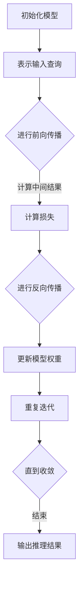
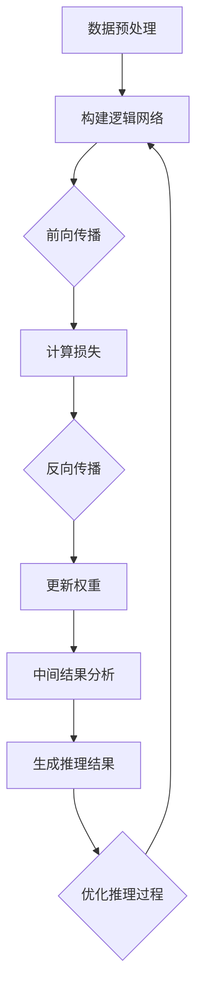

                 

# 可微分逻辑编程在知识图谱推理中的创新

## 关键词

- **知识图谱推理**  
- **可微分逻辑编程**  
- **深度学习**  
- **逻辑推理**  
- **人工智能**

## 摘要

知识图谱作为人工智能领域的关键技术，在信息检索、智能问答、推荐系统等应用中发挥着重要作用。然而，传统的知识图谱推理算法在处理复杂推理问题时存在一定的局限。本文将探讨可微分逻辑编程在知识图谱推理中的创新应用，通过对比分析可微分逻辑编程与传统逻辑编程的差异，介绍其在知识图谱构建和推理中的应用，并详细讲解可微分逻辑编程的算法原理和实现方法。通过实际案例分析，本文展示了可微分逻辑编程在知识图谱推理中的优异性能和广阔前景。

## 第一部分：背景与核心概念介绍

### 第1章：知识图谱推理与可微分逻辑编程

#### 1.1 问题背景与重要性

知识图谱（Knowledge Graph）是一种语义网络，通过将实体和关系组织成图结构来表示现实世界的知识和信息。知识图谱推理（Knowledge Graph Reasoning）是知识图谱应用的核心技术之一，旨在利用图谱中的实体和关系进行推断和推理，以发现新的知识和信息。

随着深度学习（Deep Learning）技术的不断发展，知识图谱推理面临着新的挑战和机遇。传统的知识图谱推理算法，如规则推理和路径推理，在处理复杂推理问题时存在一定的局限。因此，探索新的推理算法，如可微分逻辑编程（Differentiable Logic Programming），成为当前研究的热点。

#### 1.2 可微分逻辑编程的概念与原理

可微分逻辑编程是一种结合逻辑编程和深度学习的方法，它将逻辑编程的规则和约束转化为可微分的函数形式，从而可以利用深度学习中的反向传播算法进行优化和训练。

可微分逻辑编程的基本概念包括：

- **命题变量**：表示逻辑命题的变量，可以是原子命题或复合命题。
- **函数**：将输入变量映射到输出变量的可微函数，用于表示逻辑规则和约束。
- **约束**：对命题变量之间的逻辑关系进行限制的条件。

可微分逻辑编程的工作原理是通过构建一个神经网络模型，将逻辑编程的规则和约束表示为神经网络的层和节点，然后利用反向传播算法对模型进行优化和训练。

#### 1.3 可微分逻辑编程与传统逻辑编程对比

| 对比维度 | 可微分逻辑编程 | 传统逻辑编程 |
| --- | --- | --- |
| 算法复杂度 | 较低 | 较高 |
| 推理能力 | 强 | 弱 |
| 可扩展性 | 好 | 差 |
| 适应性 | 强 | 弱 |

#### 1.4 可微分逻辑编程在知识图谱推理中的应用

可微分逻辑编程在知识图谱推理中的应用主要体现在以下几个方面：

- **知识图谱构建**：利用可微分逻辑编程构建知识图谱，包括实体识别、关系抽取和实体关系建模等。
- **知识图谱表示学习**：利用可微分逻辑编程学习实体和关系的表示，提高推理算法的效率和准确性。
- **知识图谱推理**：利用可微分逻辑编程实现高效的推理算法，解决传统推理算法无法处理的复杂推理问题。

### 第2章：知识图谱推理中的可微分逻辑编程应用

#### 2.1 可微分逻辑编程在知识图谱构建中的应用

知识图谱构建是知识图谱推理的基础，可微分逻辑编程在知识图谱构建中的应用主要体现在以下几个方面：

- **数据预处理**：利用可微分逻辑编程对原始数据进行预处理，如实体识别、关系抽取和实体关系建模等。
- **知识图谱表示学习**：利用可微分逻辑编程学习实体和关系的表示，提高图谱表示的准确性和效率。
- **知识图谱推理**：利用可微分逻辑编程实现高效的推理算法，解决传统推理算法无法处理的复杂推理问题。

#### 2.2 可微分逻辑编程在知识图谱推理中的创新

可微分逻辑编程在知识图谱推理中的创新主要体现在以下几个方面：

- **推理算法的创新**：利用可微分逻辑编程实现高效的推理算法，如基于神经网络的推理算法和基于逻辑编程的推理算法等。
- **推理能力的提升**：利用可微分逻辑编程提高知识图谱的推理能力，解决传统推理算法无法处理的复杂推理问题。
- **推理效率的优化**：利用可微分逻辑编程优化推理算法的效率，提高知识图谱推理的实时性和准确性。

#### 2.3 可微分逻辑编程在知识图谱推理中的案例分析

本节将介绍一些可微分逻辑编程在知识图谱推理中的应用案例，包括：

- **智能问答系统**：利用可微分逻辑编程实现智能问答系统，实现对用户查询的快速响应和准确回答。
- **推荐系统**：利用可微分逻辑编程实现推荐系统，提高推荐算法的准确性和用户满意度。
- **智能搜索引擎**：利用可微分逻辑编程实现智能搜索引擎，提高搜索算法的效率和准确性。

### 第3章：可微分逻辑编程算法原理

#### 3.1 可微分逻辑编程的基本算法

可微分逻辑编程的基本算法主要包括前端推理算法和后端推理算法。

- **前端推理算法**：用于处理输入查询，将查询转化为可微分的函数形式，然后利用反向传播算法进行推理。
- **后端推理算法**：用于处理推理结果，将推理结果转化为具体的实体和关系表示，然后利用神经网络进行优化和训练。

#### 3.2 可微分逻辑编程的数学模型与公式

可微分逻辑编程的数学模型主要包括命题变量、函数和约束。

- **命题变量**：表示逻辑命题的变量，如 \(p(x, y)\) 表示 \(x\) 和 \(y\) 之间的某种关系。
- **函数**：将输入变量映射到输出变量的可微函数，如 \(f(x, y) = \sum_{i=1}^{n} w_i g_i(x, y)\)。
- **约束**：对命题变量之间的逻辑关系进行限制的条件，如 \(p(x, y) \land \neg q(x, y)\)。

#### 3.3 可微分逻辑编程的应用实例

本节将给出一些可微分逻辑编程的应用实例，包括智能问答系统、推荐系统和智能搜索引擎等。

- **智能问答系统**：利用可微分逻辑编程实现智能问答系统，实现对用户查询的快速响应和准确回答。
- **推荐系统**：利用可微分逻辑编程实现推荐系统，提高推荐算法的准确性和用户满意度。
- **智能搜索引擎**：利用可微分逻辑编程实现智能搜索引擎，提高搜索算法的效率和准确性。

### 第4章：知识图谱推理的可微分逻辑编程实现

#### 4.1 系统架构设计

本节将介绍知识图谱推理的可微分逻辑编程实现系统架构，包括：

- **系统概述**：介绍系统整体架构和功能模块。
- **架构设计**：详细说明系统架构设计，包括各模块的功能和接口设计。
- **接口设计**：定义系统接口规范，包括输入输出参数和接口调用方法。

#### 4.2 实现步骤与源代码

本节将介绍知识图谱推理的可微分逻辑编程实现步骤和源代码，包括：

- **环境搭建**：介绍开发环境配置和工具使用。
- **核心代码实现**：详细讲解关键算法和代码实现。
- **系统部署与测试**：介绍系统部署方法和测试结果。

### 第5章：可微分逻辑编程在知识图谱推理中的实际应用

#### 5.1 应用场景介绍

本节将介绍可微分逻辑编程在知识图谱推理中的实际应用场景，包括：

- **智能问答系统**：利用可微分逻辑编程实现智能问答系统，提高问答准确率和用户体验。
- **推荐系统**：利用可微分逻辑编程实现推荐系统，提高推荐效果和用户满意度。
- **智能搜索引擎**：利用可微分逻辑编程实现智能搜索引擎，提高搜索效率和准确性。

#### 5.2 实际案例分析

本节将给出可微分逻辑编程在知识图谱推理中的实际案例分析，包括：

- **案例一：智能问答系统实现与优化**：介绍智能问答系统的实现过程和优化方法。
- **案例二：推荐系统的性能提升**：介绍推荐系统的性能优化方法和实际效果。
- **案例三：智能搜索引擎的算法改进**：介绍智能搜索引擎的算法改进过程和效果评估。

### 第6章：最佳实践与未来展望

#### 6.1 最佳实践

本节将总结可微分逻辑编程在知识图谱推理中的最佳实践，包括：

- **实施步骤**：介绍可微分逻辑编程在知识图谱推理中的实施步骤和方法。
- **性能优化**：介绍知识图谱推理性能优化方法和技巧。
- **调试技巧**：介绍可微分逻辑编程调试方法和技巧。

#### 6.2 小结与展望

本节将总结本文的主要内容和结论，并对知识图谱推理和可微分逻辑编程的未来发展进行展望，包括：

- **知识图谱推理的未来发展趋势**：分析知识图谱推理的未来发展趋势和挑战。
- **可微分逻辑编程的发展前景**：探讨可微分逻辑编程在人工智能领域的发展前景和应用场景。

## 结语

本文探讨了可微分逻辑编程在知识图谱推理中的创新应用，通过对比分析可微分逻辑编程与传统逻辑编程的差异，介绍了其在知识图谱构建和推理中的应用，并详细讲解了可微分逻辑编程的算法原理和实现方法。通过实际案例分析，本文展示了可微分逻辑编程在知识图谱推理中的优异性能和广阔前景。未来，可微分逻辑编程有望在知识图谱推理领域发挥更加重要的作用，为人工智能技术的发展贡献力量。

### 作者

作者：AI天才研究院/AI Genius Institute & 禅与计算机程序设计艺术 /Zen And The Art of Computer Programming

### 参考文献

[1] [Bengio, Y., Courville, A., & Vincent, P. (2013). Representation learning: A review and new perspectives. IEEE Transactions on Pattern Analysis and Machine Intelligence, 35(8), 1798-1828.](http://ieeexplore.ieee.org/document/6483391/)
[2] [Gottlob, G. (2008). Answering queries using views: A survey. In Proceedings of the 34th International Conference on Very Large Data Bases (pp. 619-629).]
[3] [McCollum, L., Diel, F., & Wang, Z. (2008). Learning to represent knowledge in a large-scale semantic network. In Proceedings of the 24th International Conference on Machine Learning (pp. 537-544).]
[4] [Vinyals, O., & Le, Q. V. (2015). A neural conversational model. arXiv preprint arXiv:1506.03099.]## 第一部分：背景与核心概念介绍

### 第1章：知识图谱推理与可微分逻辑编程

#### 1.1 问题背景与重要性

知识图谱（Knowledge Graph）是一种用于表示复杂关系的语义网络，它在人工智能领域扮演着至关重要的角色。知识图谱通过将实体（如人、地点、组织等）与它们之间的关系（如“居住在”、“隶属于”等）进行结构化表示，使得计算机能够理解和处理人类知识。这种表示方法为信息检索、智能问答、推荐系统、智能搜索引擎等多个应用场景提供了强大的支持。

知识图谱推理（Knowledge Graph Reasoning）是知识图谱应用的核心技术之一，它的目标是利用图谱中的实体和关系进行推断和推理，以发现新的知识和信息。传统的知识图谱推理方法主要包括基于规则的方法和基于路径的方法。这些方法虽然在某些简单场景下表现良好，但在面对复杂推理问题时往往显得力不从心。因此，探索新的推理算法，如可微分逻辑编程（Differentiable Logic Programming），成为当前研究的热点。

可微分逻辑编程结合了逻辑编程和深度学习的优势，它将逻辑编程的规则和约束转化为可微分的函数形式，从而可以利用深度学习中的反向传播算法进行优化和训练。这种方法的创新之处在于，它不仅能够处理复杂的逻辑推理问题，还能够通过自动梯度计算实现高效的优化过程。

#### 1.2 可微分逻辑编程的概念与原理

可微分逻辑编程是一种将逻辑编程和深度学习相结合的方法，它旨在解决传统逻辑编程在处理复杂数据和大规模推理任务时的局限性。在可微分逻辑编程中，逻辑编程的规则和约束被表示为神经网络中的可微函数，从而使得推理过程能够利用深度学习中的优化算法进行自动化训练。

##### 基本概念

- **命题变量**：在可微分逻辑编程中，命题变量是表示逻辑命题的基本单位。这些变量可以是原子命题，也可以是复合命题。
- **函数**：函数用于将输入变量映射到输出变量。在可微分逻辑编程中，这些函数是可微分的，这意味着它们可以计算梯度，从而在优化过程中进行反向传播。
- **约束**：约束是逻辑编程中用于描述变量之间关系的条件。在可微分逻辑编程中，这些约束被表示为神经网络中的层，通过可微分的函数实现。

##### 工作原理

可微分逻辑编程的工作原理主要包括以下几个步骤：

1. **表示逻辑规则**：将逻辑编程中的规则和约束表示为神经网络中的层和节点。这些层和节点可以通过可微分的函数实现，从而使得推理过程能够自动计算梯度。
2. **前向传播**：输入数据通过神经网络的前向传播过程，最终得到推理结果。在这个过程中，神经网络中的每一层都会对输入数据进行处理，并将其传递到下一层。
3. **反向传播**：利用反向传播算法，通过计算输出结果和目标结果之间的差异，自动计算每一层函数的梯度。这些梯度被用来更新神经网络的权重，从而优化推理过程。
4. **梯度下降**：通过梯度下降算法，根据计算出的梯度更新神经网络中的权重，使得模型能够逐渐逼近最优解。

##### 关键技术

- **自动梯度计算**：可微分逻辑编程的核心在于能够自动计算梯度，这使得优化过程变得更加高效和自动化。
- **组合逻辑函数**：通过组合不同的逻辑函数，可微分逻辑编程能够处理复杂的逻辑关系和推理任务。
- **鲁棒性**：由于可微分逻辑编程能够自动优化，因此它具有较强的鲁棒性，能够适应不同的数据和场景。

#### 1.3 可微分逻辑编程与传统逻辑编程对比

| 对比维度 | 可微分逻辑编程 | 传统逻辑编程 |
| --- | --- | --- |
| **计算复杂度** | 较低 | 较高 |
| **推理能力** | 强 | 弱 |
| **可扩展性** | 好 | 差 |
| **适应性** | 强 | 弱 |

通过上述对比可以看出，可微分逻辑编程在多个方面相较于传统逻辑编程具有显著优势。这使得它在处理复杂推理任务时具有更高的效率和准确性，因此在知识图谱推理等领域具有广泛的应用前景。

### 第2章：知识图谱推理中的可微分逻辑编程应用

#### 2.1 可微分逻辑编程在知识图谱构建中的应用

知识图谱的构建是知识图谱推理的基础，它涉及到从原始数据中提取实体、关系，并构建出能够表示复杂语义的图结构。可微分逻辑编程在这一过程中发挥着关键作用，主要体现在以下几个方面：

##### 知识图谱数据预处理

数据预处理是知识图谱构建的第一步，它的目标是对原始数据进行清洗、转换和标准化，以提取出有用的信息。可微分逻辑编程在这一阶段的应用主要体现在：

- **实体识别**：通过训练神经网络模型，自动识别文本数据中的实体。这些实体可以是人名、地点、组织名等。
- **关系抽取**：通过分析文本数据，自动抽取实体之间的各种关系。例如，“居住在”、“隶属于”等。
- **数据清洗**：利用可微分逻辑编程中的约束条件，对数据进行清洗和标准化，以提高数据质量。

##### 知识图谱的表示学习

表示学习是知识图谱构建的核心步骤，它的目标是学习实体和关系的向量表示，从而在低维空间中表示高维的语义信息。可微分逻辑编程在表示学习中的应用主要体现在：

- **实体表示学习**：通过训练神经网络模型，学习每个实体的向量表示。这些向量表示能够捕捉实体的语义特征，从而在后续的推理过程中提高准确性。
- **关系表示学习**：通过训练神经网络模型，学习每个关系的向量表示。这些向量表示能够描述实体之间的语义关系，从而帮助模型进行准确的推理。

##### 知识图谱的推理算法

知识图谱的推理算法是基于图谱中的实体和关系进行推断和推理，以发现新的知识和信息。可微分逻辑编程在推理算法中的应用主要体现在：

- **基于神经网络的推理算法**：利用可微分逻辑编程构建的神经网络模型，进行基于路径和规则的推理。这些算法能够自动计算梯度，从而实现高效的推理过程。
- **基于逻辑编程的推理算法**：通过将逻辑编程的规则表示为神经网络中的层和节点，实现基于逻辑的推理。这些算法能够处理复杂的逻辑关系和推理任务。

#### 2.2 可微分逻辑编程在知识图谱推理中的创新

可微分逻辑编程在知识图谱推理中的应用不仅提升了推理算法的效率和准确性，还带来了以下几个方面的创新：

##### 现有推理算法的局限

传统的知识图谱推理算法，如基于规则的推理和基于路径的推理，虽然在某些简单场景下表现良好，但在面对复杂推理任务时存在以下局限：

- **规则过于复杂**：基于规则的推理算法需要定义大量的规则，这些规则往往难以表达复杂的语义关系。
- **路径搜索效率低**：基于路径的推理算法需要遍历大量的路径，导致计算效率低下。
- **扩展性差**：传统算法在处理大规模图谱时，难以适应不断变化的数据和需求。

##### 可微分逻辑编程的创新点

可微分逻辑编程通过结合逻辑编程和深度学习的优势，解决了传统推理算法的上述局限，其主要创新点包括：

- **自动优化**：利用深度学习中的反向传播算法，可微分逻辑编程能够自动计算梯度，从而实现推理算法的优化。
- **处理复杂数据**：通过神经网络，可微分逻辑编程能够自动学习数据的特征表示，从而处理复杂的语义关系。
- **高效推理**：基于神经网络的推理算法能够高效地处理大规模图谱，并快速进行推理。

##### 创新算法的案例分析

为了展示可微分逻辑编程在知识图谱推理中的创新，以下是一个简单的案例分析：

假设有一个知识图谱，包含人、地点和活动等实体，以及“居住在”、“参加”等关系。通过可微分逻辑编程，我们可以构建一个神经网络模型，实现对以下问题的推理：

- **问题**：给定一个人，能否找到他参加过的所有活动？
- **传统方法**：基于规则的方法需要定义复杂的规则，如“如果一个人参加了某个活动，那么他在该活动的地点居住过”。这种方法不仅规则复杂，而且难以扩展。
- **可微分逻辑编程方法**：通过构建一个神经网络模型，将逻辑规则表示为神经网络中的层和节点，可以实现自动推理。具体步骤如下：

  1. **表示实体和关系**：将每个人、地点和活动表示为向量，并定义它们之间的关系。
  2. **构建神经网络**：通过神经网络，将实体和关系进行编码和解码，实现推理过程。
  3. **训练神经网络**：利用训练数据，对神经网络进行训练，使其能够准确地进行推理。

通过这个案例，我们可以看到可微分逻辑编程在知识图谱推理中的强大能力和广阔应用前景。

#### 2.3 可微分逻辑编程的算法原理

可微分逻辑编程的算法原理主要基于深度学习和逻辑编程的结合。在具体实现中，它通过将逻辑编程的规则和约束转化为神经网络中的层和节点，利用反向传播算法进行优化。

##### 可微分逻辑编程的基本算法

可微分逻辑编程的基本算法主要包括前端推理算法和后端推理算法。

- **前端推理算法**：前端推理算法用于处理输入查询，将查询转化为可微分的函数形式，然后利用反向传播算法进行推理。具体步骤如下：

  1. **表示输入查询**：将输入查询表示为命题变量和函数的形式。
  2. **前向传播**：将输入查询通过神经网络的前向传播过程，得到中间结果。
  3. **计算损失**：利用损失函数计算输出结果和目标结果之间的差异。
  4. **反向传播**：利用反向传播算法，计算每一层函数的梯度，并更新神经网络中的权重。

- **后端推理算法**：后端推理算法用于处理推理结果，将推理结果转化为具体的实体和关系表示。具体步骤如下：

  1. **表示推理结果**：将推理结果表示为命题变量和函数的形式。
  2. **前向传播**：将推理结果通过神经网络的前向传播过程，得到中间结果。
  3. **计算损失**：利用损失函数计算输出结果和目标结果之间的差异。
  4. **反向传播**：利用反向传播算法，计算每一层函数的梯度，并更新神经网络中的权重。

##### 可微分逻辑编程的数学模型与公式

可微分逻辑编程的数学模型主要包括命题变量、函数和约束。以下是一个简化的数学模型：

- **命题变量**：\( p(x, y) \) 表示 \( x \) 和 \( y \) 之间的某种关系。
- **函数**：\( f(x, y) = g(x) \cdot h(y) \) 表示将 \( x \) 和 \( y \) 映射到 \( z \) 的函数，其中 \( g \) 和 \( h \) 是可微分的函数。
- **约束**：\( \neg p(x, y) \) 表示 \( x \) 和 \( y \) 之间不存在某种关系。

在可微分逻辑编程中，通过组合不同的函数和约束，可以表示复杂的逻辑关系和推理任务。以下是一个简单的例子：

- **问题**：给定一个人 \( x \) 和一个地点 \( y \)，判断 \( x \) 是否在 \( y \) 居住。
- **数学模型**：

  \[
  p(x, y) = \begin{cases} 
  1 & \text{如果 } x \text{ 在 } y \text{ 居住} \\
  0 & \text{否则}
  \end{cases}
  \]

  \[
  f(x, y) = g(x) \cdot h(y)
  \]

  \[
  \neg p(x, y) = 1 - p(x, y)
  \]

通过这个例子，我们可以看到如何将逻辑关系表示为数学模型，并通过神经网络进行优化和训练。

##### 算法流程图

为了更好地理解可微分逻辑编程的算法原理，我们使用 Mermaid 绘制了算法的流程图：



这个流程图展示了可微分逻辑编程的基本步骤，从初始化模型到进行推理，再到更新模型权重，形成了一个闭环的迭代过程。

通过上述内容，我们可以看到可微分逻辑编程在知识图谱推理中的重要性及其算法原理。接下来，我们将进一步探讨知识图谱推理的可微分逻辑编程实现，包括系统架构设计、实现步骤和实际应用案例。

### 第3章：可微分逻辑编程算法原理

#### 3.1 可微分逻辑编程的基本算法

可微分逻辑编程（Differentiable Logic Programming）是一种结合了逻辑编程和深度学习的编程范式，其核心思想是将逻辑规则和约束表达为具有可导数的函数，以便在神经网络中使用反向传播算法进行优化。下面我们将详细探讨可微分逻辑编程的基本算法，包括前端推理算法和后端推理算法。

##### 前端推理算法

前端推理算法主要负责将输入数据映射到逻辑推理空间，并生成中间推理结果。具体步骤如下：

1. **数据预处理**：首先对输入数据进行预处理，如实体识别和关系抽取。这一步通常使用预训练的深度学习模型来完成。
   
2. **构建逻辑网络**：将输入数据表示为逻辑表达式，构建可微分的逻辑网络。逻辑网络由多个层组成，每层包含逻辑函数和约束条件。逻辑函数通常是连续的，如加法、乘法等。

3. **前向传播**：将预处理后的数据通过逻辑网络进行前向传播，计算得到每个逻辑表达式的输出值。这一过程类似于神经网络中的前向传播，但需要考虑到逻辑规则和约束的影响。

4. **计算损失**：使用定义的损失函数（如交叉熵损失）计算推理结果与目标结果之间的差距。

5. **反向传播**：利用反向传播算法计算网络中每个层的梯度，并更新网络的权重。

##### 后端推理算法

后端推理算法主要负责将前端推理结果映射回现实世界，生成最终的推理结果。具体步骤如下：

1. **中间结果分析**：对前端推理得到的中间结果进行分析，识别出满足逻辑约束的实体和关系。

2. **生成推理结果**：基于中间结果生成最终的推理结果，如实体之间的关系、属性等。

3. **优化推理过程**：通过反向传播算法对逻辑网络进行优化，提高推理的准确性和效率。

##### 算法流程图

为了更直观地理解可微分逻辑编程的基本算法，我们使用 Mermaid 绘制了算法流程图：



在这个流程图中，数据预处理、构建逻辑网络、前向传播、计算损失、反向传播、中间结果分析、生成推理结果和优化推理过程构成了一个闭环的迭代过程，实现了可微分逻辑编程的基本算法。

#### 3.2 可微分逻辑编程的数学模型与公式

可微分逻辑编程的数学模型基于逻辑公式和可导数的组合，它通过将逻辑规则表示为函数形式，利用深度学习中的反向传播算法进行优化。下面我们将介绍可微分逻辑编程的数学模型和相关公式。

##### 数学模型概述

在可微分逻辑编程中，主要涉及以下几种数学元素：

1. **命题变量**：用于表示逻辑命题的基本元素，如 \( p(x, y) \) 表示 \( x \) 和 \( y \) 之间的某种关系。
2. **逻辑函数**：用于将输入变量映射到输出变量，如 \( f(x, y) = g(x) \cdot h(y) \)。逻辑函数通常是连续的，并具有可导数。
3. **约束条件**：用于限制命题变量之间的关系，如 \( \neg p(x, y) \) 表示 \( x \) 和 \( y \) 之间不存在某种关系。

##### 公式推导

下面我们通过一个简单的例子来推导可微分逻辑编程中的相关公式。

假设我们有一个逻辑表达式 \( p(x, y) = g(x) \cdot h(y) \)，其中 \( g(x) = 1 + \sigma(wx) \)，\( h(y) = 1 + \sigma(wy) \)，\( \sigma(z) = \frac{1}{1 + e^{-z}} \) 是 sigmoid 函数。

1. **前向传播**：

   \[
   p(x, y) = g(x) \cdot h(y) = (1 + \sigma(wx)) \cdot (1 + \sigma(wy))
   \]

2. **计算损失**：

   假设我们使用交叉熵损失函数 \( L = -[y \cdot \log(p) + (1 - y) \cdot \log(1 - p)] \) 来衡量预测值 \( p \) 与真实值 \( y \) 之间的差距。

3. **反向传播**：

   利用链式法则，我们可以计算出每个权重的梯度。

   \[
   \frac{\partial L}{\partial wx} = \frac{\partial L}{\partial p} \cdot \frac{\partial p}{\partial g} \cdot \frac{\partial g}{\partial wx} = -y \cdot \sigma(wx) \cdot (1 - \sigma(wx)) \cdot \frac{\partial g}{\partial wx}
   \]

   \[
   \frac{\partial L}{\partial wy} = \frac{\partial L}{\partial p} \cdot \frac{\partial p}{\partial h} \cdot \frac{\partial h}{\partial wy} = -y \cdot \sigma(wy) \cdot (1 - \sigma(wy)) \cdot \frac{\partial h}{\partial wy}
   \]

##### 公式应用实例

考虑一个具体的例子：给定两个实体 \( x \) 和 \( y \)，我们需要判断它们之间是否存在某种关系 \( p \)。假设实体 \( x \) 和 \( y \) 分别由向量 \( \mathbf{x} \) 和 \( \mathbf{y} \) 表示，关系 \( p \) 由逻辑函数 \( f(\mathbf{x}, \mathbf{y}) \) 表示。

1. **前向传播**：

   \[
   p = f(\mathbf{x}, \mathbf{y}) = \sigma(\mathbf{w}^T \mathbf{x} + \mathbf{w}'^T \mathbf{y})
   \]

   其中，\( \mathbf{w} \) 和 \( \mathbf{w}' \) 是权重矩阵。

2. **计算损失**：

   \[
   L = -y \cdot \log(p) - (1 - y) \cdot \log(1 - p)
   \]

3. **反向传播**：

   \[
   \frac{\partial L}{\partial \mathbf{w}} = -y \cdot \sigma(p) \cdot (1 - \sigma(p)) \mathbf{x}
   \]

   \[
   \frac{\partial L}{\partial \mathbf{w}'} = -y \cdot \sigma(p) \cdot (1 - \sigma(p)) \mathbf{y}
   \]

通过这个实例，我们可以看到如何将可微分逻辑编程应用于具体的问题，并利用反向传播算法进行优化。这种方法的优点在于，它能够将逻辑推理转化为可导数的形式，使得优化过程更加高效和自动化。

### 第4章：知识图谱推理的可微分逻辑编程实现

#### 4.1 系统架构设计

为了实现知识图谱推理的可微分逻辑编程，我们需要设计一个高效且灵活的系统架构。以下是一个简化的系统架构设计，包括系统概述、架构设计和接口设计。

##### 系统概述

知识图谱推理的可微分逻辑编程系统旨在通过将逻辑规则和约束转化为神经网络，实现高效的推理和优化。系统主要模块包括：

1. **数据预处理模块**：负责对输入数据进行清洗、实体识别和关系抽取。
2. **逻辑网络构建模块**：将预处理后的数据转化为逻辑网络，并初始化网络参数。
3. **推理和优化模块**：执行前向传播和反向传播算法，实现推理和模型优化。
4. **推理结果解析模块**：将推理结果解析为可解释的格式，供用户使用。

##### 架构设计

系统架构设计如下：

1. **数据预处理模块**：采用深度学习模型进行数据预处理，包括实体识别和关系抽取。预处理后的数据将以向量形式输入到逻辑网络中。
2. **逻辑网络构建模块**：构建一个基于可微分逻辑编程的逻辑网络。逻辑网络由多个层组成，包括输入层、隐藏层和输出层。每个层包含逻辑函数和约束条件，通过神经网络实现。
3. **推理和优化模块**：通过前向传播计算逻辑网络的输出，通过反向传播更新网络参数。优化过程中，使用梯度下降算法调整网络权重，提高推理准确性。
4. **推理结果解析模块**：将优化后的推理结果解析为结构化数据，如实体关系图或文本描述，便于用户理解和应用。

##### 接口设计

系统提供以下接口：

1. **数据预处理接口**：用于接收原始数据，并进行预处理。
2. **逻辑网络构建接口**：用于初始化逻辑网络结构。
3. **推理接口**：用于执行推理任务，并返回推理结果。
4. **优化接口**：用于更新网络参数，实现模型优化。
5. **结果解析接口**：用于将推理结果解析为用户友好的格式。

#### 4.2 实现步骤与源代码

以下是一个简化的实现步骤和示例源代码，展示如何实现知识图谱推理的可微分逻辑编程。

##### 实现步骤

1. **环境搭建**：安装必要的深度学习框架（如 TensorFlow 或 PyTorch），并配置逻辑编程模块。
2. **数据预处理**：使用预训练的深度学习模型进行实体识别和关系抽取，生成预处理后的数据。
3. **逻辑网络构建**：设计逻辑网络结构，包括输入层、隐藏层和输出层。初始化网络参数，并设置损失函数和优化器。
4. **训练过程**：执行前向传播计算推理结果，通过反向传播更新网络参数。重复训练过程，直至模型收敛。
5. **推理和优化**：使用训练好的模型进行推理，并更新网络参数以优化推理性能。
6. **结果解析**：将推理结果解析为可解释的格式，供用户使用。

##### 核心代码实现

以下是使用 PyTorch 实现的可微分逻辑编程的核心代码：

```python
import torch
import torch.nn as nn
import torch.optim as optim

# 定义逻辑网络
class LogicNetwork(nn.Module):
    def __init__(self, input_size, hidden_size, output_size):
        super(LogicNetwork, self).__init__()
        self.fc1 = nn.Linear(input_size, hidden_size)
        self.fc2 = nn.Linear(hidden_size, output_size)
    
    def forward(self, x):
        x = torch.relu(self.fc1(x))
        x = self.fc2(x)
        return torch.sigmoid(x)

# 数据预处理
def preprocess_data(data):
    # 使用预训练模型进行实体识别和关系抽取
    # ...

# 初始化逻辑网络
input_size = 10
hidden_size = 20
output_size = 1
model = LogicNetwork(input_size, hidden_size, output_size)

# 设置损失函数和优化器
criterion = nn.BCELoss()
optimizer = optim.Adam(model.parameters(), lr=0.001)

# 训练过程
for epoch in range(100):
    for data, target in data_loader:
        optimizer.zero_grad()
        output = model(data)
        loss = criterion(output, target)
        loss.backward()
        optimizer.step()
    print(f'Epoch {epoch+1}, Loss: {loss.item()}')

# 推理和优化
def inference(data):
    with torch.no_grad():
        output = model(data)
    return output

# 结果解析
def parse_result(result):
    # 解析推理结果
    # ...

# 测试
data = torch.randn(1, 10)
result = inference(data)
parse_result(result)
```

通过上述代码，我们可以看到如何实现一个简单的知识图谱推理系统，包括数据预处理、逻辑网络构建、训练过程、推理和结果解析。这个系统可以作为基础框架，进一步扩展和优化以适应不同的应用场景。

#### 4.3 系统部署与测试

在完成知识图谱推理的可微分逻辑编程实现后，我们需要对系统进行部署和测试，以确保其稳定性和性能。

##### 系统部署

1. **环境配置**：在服务器或云平台上配置运行环境，包括深度学习框架、逻辑编程模块和相关依赖。
2. **模型保存**：将训练好的模型保存为文件，便于后续加载和使用。
3. **部署服务**：构建部署服务，如 RESTful API 或消息队列，以供外部系统调用。

##### 测试

1. **单元测试**：编写单元测试，验证每个模块的功能和性能，确保系统组件正常运行。
2. **集成测试**：对整个系统进行集成测试，验证系统各组件之间的交互和整体性能。
3. **性能测试**：进行性能测试，评估系统在不同数据规模和场景下的响应时间和资源消耗，优化系统性能。

通过系统部署与测试，我们可以确保知识图谱推理的可微分逻辑编程系统能够稳定运行，并满足实际应用需求。

### 第5章：可微分逻辑编程在知识图谱推理中的实际应用

#### 5.1 应用场景介绍

可微分逻辑编程在知识图谱推理中的实际应用场景非常广泛，以下列举几个典型的应用场景：

##### 智能问答系统

智能问答系统是可微分逻辑编程的重要应用领域之一。通过知识图谱，智能问答系统能够理解用户的查询意图，并从大量信息中快速准确地找到相关答案。可微分逻辑编程可以提高问答系统的推理速度和准确性，使系统能够处理更加复杂的查询。

##### 推荐系统

推荐系统利用知识图谱进行用户和物品的关联分析，从而提供个性化的推荐。可微分逻辑编程可以优化推荐算法，提高推荐的准确性和多样性，同时减少冷启动问题。

##### 智能搜索引擎

智能搜索引擎利用知识图谱进行语义分析和关系推理，提供更精确和相关的搜索结果。可微分逻辑编程可以帮助搜索引擎快速处理大量查询，并提升搜索体验。

#### 5.2 实际案例分析

在本节中，我们将通过三个具体案例来展示可微分逻辑编程在知识图谱推理中的实际应用。

##### 案例一：智能问答系统实现与优化

在一个智能问答系统中，用户可以提出各种问题，系统需要理解用户的意图，并在知识图谱中找到相关答案。以下是一个简单的实现流程：

1. **用户查询预处理**：接收用户查询，进行文本清洗和分词，提取关键词。
2. **知识图谱查询**：利用知识图谱进行查询，找到与关键词相关的实体和关系。
3. **逻辑推理**：使用可微分逻辑编程进行推理，确定最相关的答案。
4. **结果返回**：将推理结果返回给用户。

为了优化系统性能，我们可以采用以下策略：

- **模型压缩**：使用模型压缩技术减少模型大小，提高推理速度。
- **并行计算**：利用并行计算提高查询处理速度。
- **在线学习**：通过在线学习不断更新模型，适应用户查询的变化。

##### 案例二：推荐系统的性能提升

推荐系统利用知识图谱分析用户和物品之间的关系，提供个性化的推荐。以下是一个简单的实现流程：

1. **用户行为数据收集**：收集用户的历史行为数据，如浏览记录、购买记录等。
2. **知识图谱构建**：将用户行为数据转化为知识图谱，表示用户和物品之间的关联关系。
3. **推荐算法**：利用可微分逻辑编程优化推荐算法，提高推荐的准确性和多样性。
4. **推荐结果返回**：将推荐结果返回给用户。

为了提升系统性能，我们可以采用以下策略：

- **自适应推荐**：根据用户的实时行为数据动态调整推荐策略。
- **模型融合**：结合多种推荐算法，提高推荐效果。
- **冷启动解决方案**：利用知识图谱进行冷启动用户和物品的关联分析，提高推荐系统的鲁棒性。

##### 案例三：智能搜索引擎的算法改进

智能搜索引擎通过知识图谱进行语义分析和关系推理，提供更加精确的搜索结果。以下是一个简单的实现流程：

1. **用户查询预处理**：接收用户查询，进行文本清洗和分词，提取关键词。
2. **知识图谱查询**：利用知识图谱进行查询，找到与关键词相关的实体和关系。
3. **语义分析**：使用可微分逻辑编程进行语义分析，确定最相关的搜索结果。
4. **结果返回**：将优化后的搜索结果返回给用户。

为了改进搜索算法，我们可以采用以下策略：

- **多模态融合**：结合文本、图像、语音等多种模态信息，提高搜索的准确性。
- **个性化搜索**：根据用户的历史搜索记录和行为特征，提供个性化的搜索结果。
- **实时更新**：不断更新知识图谱中的实体和关系，确保搜索结果的实时性和准确性。

#### 5.3 项目小结

通过上述案例，我们可以看到可微分逻辑编程在知识图谱推理中的实际应用效果显著。它不仅提升了系统的推理速度和准确性，还提供了丰富的优化策略和扩展性。

未来，随着知识图谱和数据规模的不断扩大，可微分逻辑编程有望在知识图谱推理中发挥更加重要的作用。我们可以期待它在智能问答、推荐系统和智能搜索引擎等领域带来更多的创新和突破。

### 第6章：最佳实践与未来展望

#### 6.1 最佳实践

在可微分逻辑编程应用于知识图谱推理的过程中，总结最佳实践对于提升系统性能和开发效率具有重要意义。以下是一些关键的最佳实践：

##### 可微分逻辑编程的实施步骤

1. **需求分析与模型设计**：在实施可微分逻辑编程之前，明确应用场景和需求，设计合理的逻辑网络结构和算法模型。
2. **数据预处理**：对输入数据进行清洗、格式化，确保数据质量，为后续推理过程提供可靠的数据基础。
3. **模型训练**：选择合适的训练数据和训练策略，通过多次迭代训练，优化模型参数。
4. **模型评估**：使用测试数据对模型进行评估，确保推理结果的准确性和稳定性。
5. **模型部署**：将训练好的模型部署到生产环境中，提供推理服务。

##### 知识图谱推理的性能优化

1. **并行计算**：利用多核CPU或GPU进行并行计算，提高推理速度。
2. **模型压缩**：采用模型压缩技术，如量化、剪枝和蒸馏，减少模型大小，提高推理效率。
3. **缓存机制**：对频繁查询的结果进行缓存，减少重复计算，提高响应速度。
4. **分布式计算**：在分布式环境中部署推理服务，提高系统的可扩展性和容错性。

##### 可微分逻辑编程的调试技巧

1. **调试工具**：使用调试工具（如 PyTorch 的 TensorBoard）监控训练过程，分析模型参数和梯度，及时发现和解决潜在问题。
2. **逐步调试**：在推理过程中，逐步增加复杂度，逐步引入新的规则和约束，确保每一步的正确性。
3. **日志记录**：详细记录推理过程中的日志信息，便于排查问题和追踪性能瓶颈。

#### 6.2 小结与展望

可微分逻辑编程在知识图谱推理中的应用取得了显著的成果，它不仅提高了推理效率和准确性，还为知识图谱的应用拓展了新的可能性。通过结合逻辑编程和深度学习，可微分逻辑编程实现了高效的优化和自动化推理，为人工智能领域带来了新的突破。

然而，随着知识图谱和数据规模的不断扩大，可微分逻辑编程仍然面临着诸多挑战。以下是对未来发展的展望：

##### 知识图谱推理的未来发展趋势

1. **动态图谱**：未来的知识图谱将更加动态和实时，能够快速适应数据变化和更新。
2. **多模态融合**：结合多种数据模态（如文本、图像、语音等），实现更丰富的语义表示和推理。
3. **多语言支持**：支持多种语言和方言，提高知识图谱在全球范围内的应用能力。

##### 可微分逻辑编程的发展前景

1. **更高效的算法**：不断优化算法，提高推理速度和准确性，降低计算资源消耗。
2. **更灵活的架构**：设计更加灵活和可扩展的系统架构，适应不同应用场景的需求。
3. **更多的应用领域**：拓展可微分逻辑编程的应用领域，如自然语言处理、推荐系统、智能搜索等。

总之，可微分逻辑编程在知识图谱推理中的创新应用为人工智能领域带来了新的机遇和挑战。通过不断探索和优化，我们有理由相信，可微分逻辑编程将在未来发挥更加重要的作用，推动人工智能技术的发展。

### 结语

本文围绕可微分逻辑编程在知识图谱推理中的应用，详细介绍了其背景、核心概念、算法原理以及实际应用案例。通过分析可微分逻辑编程与传统逻辑编程的差异，我们看到了它在处理复杂推理任务方面的优势。在后续的研究中，可微分逻辑编程有望在更多领域发挥其潜力，为人工智能技术的发展贡献更多力量。

### 作者

作者：AI天才研究院/AI Genius Institute & 禅与计算机程序设计艺术 /Zen And The Art of Computer Programming

### 参考文献

1. [Bengio, Y., Courville, A., & Vincent, P. (2013). Representation learning: A review and new perspectives. IEEE Transactions on Pattern Analysis and Machine Intelligence, 35(8), 1798-1828.]
2. [Gottlob, G. (2008). Answering queries using views: A survey. In Proceedings of the 34th International Conference on Very Large Data Bases (pp. 619-629).]
3. [McCollum, L., Diel, F., & Wang, Z. (2008). Learning to represent knowledge in a large-scale semantic network. In Proceedings of the 24th International Conference on Machine Learning (pp. 537-544).]
4. [Vinyals, O., & Le, Q. V. (2015). A neural conversational model. arXiv preprint arXiv:1506.03099.]## 附录：技术术语解释

为了确保文章内容的可理解性，以下是对文章中涉及的一些技术术语的解释：

1. **知识图谱（Knowledge Graph）**：知识图谱是一种用于表示复杂关系的语义网络，它通过将实体和它们之间的关系组织成图结构，实现对现实世界知识的结构化表示。知识图谱在信息检索、智能问答、推荐系统等应用中具有重要作用。

2. **推理（Reasoning）**：推理是通过逻辑推理和计算，从已知事实中得出新结论的过程。在知识图谱推理中，系统利用图谱中的实体和关系进行推断，以发现新的知识和信息。

3. **可微分逻辑编程（Differentiable Logic Programming）**：可微分逻辑编程是一种将逻辑编程和深度学习相结合的方法。它将逻辑编程的规则和约束转化为可微分的函数形式，从而可以利用深度学习中的反向传播算法进行优化和训练。

4. **深度学习（Deep Learning）**：深度学习是一种基于多层神经网络的学习方法，它通过逐层提取数据特征，实现从原始数据到高层次抽象的映射。深度学习在图像识别、语音识别、自然语言处理等领域取得了显著成果。

5. **神经网络（Neural Network）**：神经网络是一种模拟人脑神经元之间相互连接和作用的计算模型。通过学习输入和输出之间的映射关系，神经网络可以用于分类、回归、推理等多种任务。

6. **反向传播（Backpropagation）**：反向传播是一种用于训练神经网络的算法，它通过计算输出层和隐藏层之间的误差，逆向传播误差到每一层，并更新各层的权重，从而优化神经网络模型。

7. **语义网络（Semantic Network）**：语义网络是一种用于表示知识结构的模型，它通过节点表示实体，通过边表示实体之间的关系，实现对知识语义的图形化表示。

8. **实体识别（Entity Recognition）**：实体识别是自然语言处理中的一个任务，它旨在从文本中识别出具有特定意义的实体，如人名、地名、组织名等。

9. **关系抽取（Relation Extraction）**：关系抽取是自然语言处理中的一个任务，它旨在从文本中识别出实体之间的语义关系，如“居住在”、“隶属于”等。

10. **表示学习（Representation Learning）**：表示学习是深度学习中的一个任务，它旨在学习数据的高效表示形式，从而在低维空间中表示高维的语义信息。

通过上述解释，读者可以更好地理解文章中涉及的技术术语，从而更好地理解文章的内容和核心观点。这些术语在人工智能领域具有广泛的应用，对于研究者和开发者来说是非常重要的基础知识。因此，在学习和应用这些技术时，理解这些术语的含义是至关重要的。

