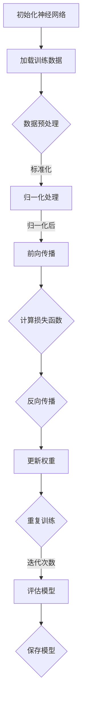
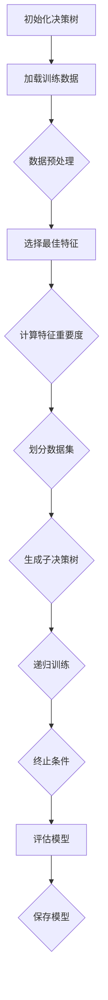
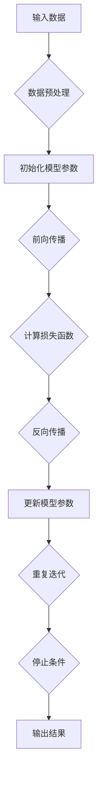
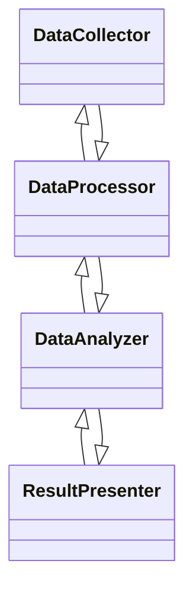
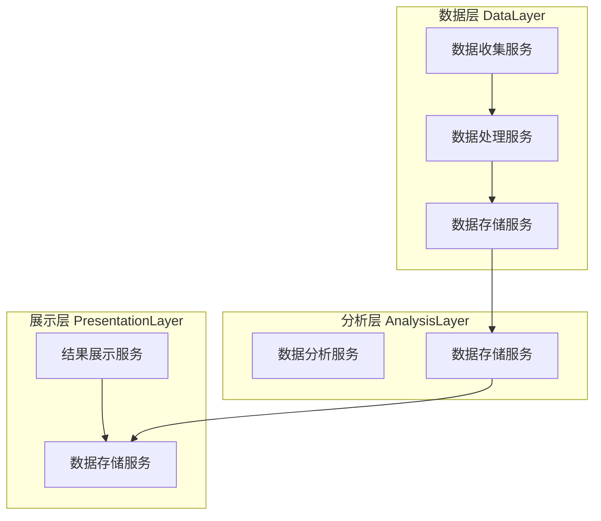
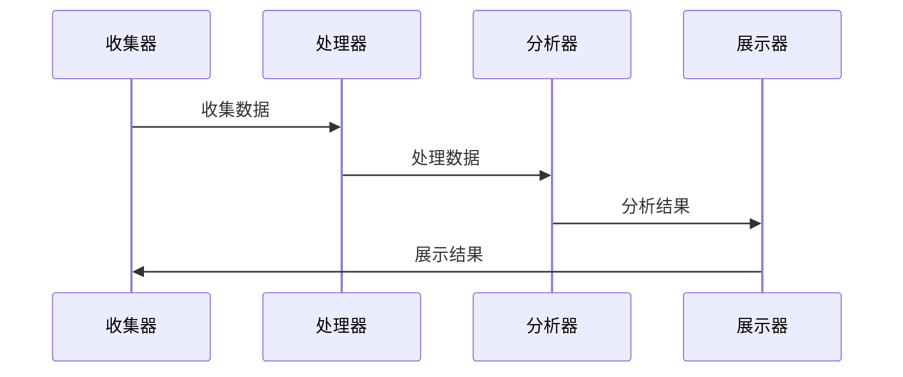

                 


### 1.1 引言

#### 1.1.1 AI发展现状与问题

人工智能（AI）作为当前科技领域的热点话题，已经取得了显著的进展。从语音识别、图像处理到自然语言理解，AI技术正在不断渗透到我们的日常生活中，为各行各业带来前所未有的变革。然而，随着AI技术的快速发展，也暴露出了一些亟待解决的问题。

首先，AI性能的提升往往伴随着能源消耗的增加。尤其是在深度学习领域，神经网络模型需要大量的计算资源，这导致了巨大的电力消耗。据统计，AI训练过程中的能源消耗已经超过了一些国家一年的总电力消耗。这不仅增加了环境负担，也带来了经济成本。

其次，数据隐私问题也日益凸显。AI系统的训练和运行依赖于大量数据，但这些数据往往涉及个人隐私。如何在保证数据隐私的同时，充分利用数据进行AI研究，成为了一个重要的课题。

此外，AI技术的可解释性问题也备受关注。在许多场景中，AI系统做出的决策是基于复杂的数学模型和大量数据训练得出的，但这些决策过程往往缺乏透明度。如何提高AI系统的可解释性，让用户能够理解其决策过程，是一个重要的研究方向。

#### 1.1.2 可持续AI的重要性

面对上述问题，可持续AI的概念应运而生。可持续AI不仅关注AI的性能提升，更强调在提高性能的同时，减少其对环境的影响。实现可持续AI的意义如下：

1. **环境效益**：通过优化算法和系统架构，降低AI的能源消耗，减少对环境的负担。

2. **经济利益**：降低能源消耗意味着减少运营成本，这对于企业和整个社会来说都是有益的。

3. **社会效益**：提高AI系统的可解释性，增强用户对AI技术的信任，促进AI技术的广泛应用。

4. **科研价值**：研究可持续AI有助于推动人工智能领域的可持续发展，为未来提供新的研究方向。

#### 1.1.3 本文结构

本文将分为六个部分，首先介绍AI发展现状与问题，接着阐述可持续AI的核心概念，然后分析AI性能评估和环境影响评估方法。第三部分将详细讲解AI算法原理，第四部分介绍系统架构设计方案。第五部分通过项目实战展示实际应用，最后总结最佳实践和拓展阅读资源。

### 1.2 核心概念

#### 1.2.1 可持续AI的定义

可持续AI是指在提高AI性能的同时，尽量减少其环境影响的AI技术。它关注以下几个方面：

1. **能源效率**：优化算法和系统架构，降低AI训练和运行过程中的能源消耗。

2. **数据隐私**：在确保数据隐私的前提下，充分利用数据进行AI研究。

3. **算法可解释性**：提高AI系统的可解释性，让用户能够理解其决策过程。

4. **资源优化**：在硬件和软件层面进行优化，提高计算效率和资源利用率。

#### 1.2.2 AI性能与环境影响的联系

AI性能和环境影响之间存在密切的联系。一方面，性能提升往往需要更多的计算资源和能源消耗；另一方面，环境影响的减少可能需要牺牲一定的性能。这种矛盾使得研究如何在提高性能的同时减少环境影响变得尤为重要。

具体来说，AI性能的提升主要通过以下几个方面实现：

1. **算法优化**：改进算法，提高计算效率和精度。

2. **模型压缩**：通过模型剪枝、量化等方法，减少模型大小，降低计算复杂度。

3. **硬件加速**：利用GPU、TPU等硬件加速器，提高计算速度。

而环境影响的减少则可以从以下几个方面入手：

1. **能源优化**：优化算法和数据传输，减少电力消耗。

2. **绿色能源**：使用可再生能源，减少对化石能源的依赖。

3. **数据隐私保护**：确保数据隐私，减少数据泄露风险。

### 1.3 AI性能评估

#### 1.3.1 评估指标

评估AI性能的主要指标包括：

1. **准确性**：模型预测结果与实际结果的匹配程度。

2. **召回率**：在所有正样本中，模型正确识别出的比例。

3. **精确度**：在所有预测结果中，正确预测为正样本的比例。

4. **F1分数**：精确度和召回率的调和平均。

5. **计算效率**：模型训练和运行所需的时间。

6. **资源消耗**：包括电力、硬件资源等。

#### 1.3.2 常见性能评估方法

常见的性能评估方法包括：

1. **交叉验证**：将数据集分为训练集和验证集，多次训练和验证，取平均值作为评估结果。

2. **A/B测试**：在真实环境中，将模型分为A组和B组，比较两组的性能差异。

3. **模型压缩**：通过剪枝、量化等方法，减少模型大小和计算复杂度。

4. **硬件加速**：使用GPU、TPU等硬件加速器，提高计算速度。

### 1.4 环境影响分析

#### 1.4.1 环境影响的关键因素

AI的环境影响主要受以下因素影响：

1. **能源消耗**：训练和运行AI模型所需电力。

2. **硬件资源**：包括CPU、GPU、TPU等硬件设备。

3. **数据传输**：数据在传输过程中产生的能源消耗。

4. **数据隐私**：数据泄露和隐私侵犯带来的环境负担。

#### 1.4.2 环境影响评估方法

评估AI环境影响的方法包括：

1. **生命周期评估**：分析AI系统从设计、开发、部署到退役的全生命周期中的环境影响。

2. **能源消耗评估**：计算AI系统运行过程中的能源消耗。

3. **硬件资源评估**：评估硬件设备的能源消耗和生命周期。

4. **数据隐私评估**：分析数据隐私风险，评估其对环境的影响。

### 1.5 总结

在本文中，我们介绍了AI发展现状与问题，阐述了可持续AI的核心概念和重要性，分析了AI性能评估和环境影响评估的方法，并探讨了如何平衡性能与环境影响。接下来的部分，我们将详细讲解AI算法原理和系统架构设计方案，通过项目实战展示实际应用，并总结最佳实践与拓展阅读资源。让我们一起深入探索可持续AI的奥秘，为人工智能的可持续发展贡献力量。----------------------------------------------------------------

## 第一部分：背景介绍

### 1.1 引言

#### 1.1.1 AI发展现状与问题

人工智能（AI）作为现代科技的前沿领域，已经在众多领域取得了显著的应用成果。从自动驾驶、智能语音助手到医疗诊断和金融分析，AI技术的应用正在深刻地改变着我们的生活方式。然而，随着AI技术的迅猛发展，也带来了一系列的问题和挑战。

首先，AI性能的提升往往伴随着能源消耗的增加。尤其是在深度学习领域，神经网络模型的训练需要大量的计算资源，这导致了巨大的电力消耗。据统计，AI训练过程中的能源消耗已经超过了全球部分国家的年度电力消耗总量，这无疑对环境造成了巨大的负担。

其次，数据隐私问题也日益凸显。AI系统的训练和运行依赖于大量数据，但这些数据往往涉及个人隐私。如何保护用户隐私，同时充分利用数据，成为了一个重要的研究课题。

此外，AI技术的可解释性问题也备受关注。许多AI系统，特别是深度学习模型，其决策过程往往缺乏透明度。用户难以理解AI系统是如何做出决策的，这可能导致用户对AI技术的信任度下降，影响其广泛应用。

#### 1.1.2 可持续AI的重要性

为了解决上述问题，可持续AI的概念应运而生。可持续AI不仅关注AI的性能提升，更强调在提高性能的同时，尽量减少其对环境的影响。实现可持续AI具有重要意义：

1. **环境效益**：通过优化算法和系统架构，降低AI训练和运行过程中的能源消耗，减少对环境的负担。

2. **经济利益**：降低能源消耗意味着减少运营成本，这对于企业和整个社会来说都是有益的。

3. **社会效益**：提高AI系统的可解释性，增强用户对AI技术的信任，促进AI技术的广泛应用。

4. **科研价值**：研究可持续AI有助于推动人工智能领域的可持续发展，为未来提供新的研究方向。

#### 1.1.3 本文结构

本文将从以下几个方面进行探讨：

1. **核心概念**：介绍可持续AI的定义及其重要性。

2. **性能评估**：分析AI性能评估的指标和方法。

3. **环境影响**：探讨AI对环境的影响及评估方法。

4. **算法原理**：详细讲解AI算法的工作原理。

5. **系统架构**：介绍AI系统的设计原则和架构。

6. **项目实战**：通过实际案例展示可持续AI的应用。

7. **最佳实践**：总结可持续AI的最佳实践和注意事项。

8. **拓展阅读**：推荐相关的阅读材料。

### 1.2 核心概念

#### 1.2.1 可持续AI的定义

可持续AI是指在提高AI性能的同时，尽量减少其环境影响的AI技术。它包括以下几个方面：

1. **能源效率**：通过优化算法和系统架构，降低AI训练和运行过程中的能源消耗。

2. **数据隐私**：在确保数据隐私的前提下，充分利用数据进行AI研究。

3. **算法可解释性**：提高AI系统的可解释性，让用户能够理解其决策过程。

4. **资源优化**：在硬件和软件层面进行优化，提高计算效率和资源利用率。

#### 1.2.2 AI性能与环境影响的联系

AI性能和环境影响之间存在密切的联系。一方面，性能提升往往需要更多的计算资源和能源消耗；另一方面，环境影响的减少可能需要牺牲一定的性能。这种矛盾使得研究如何在提高性能的同时减少环境影响变得尤为重要。

具体来说，AI性能的提升可以通过以下方式实现：

1. **算法优化**：改进算法，提高计算效率和精度。

2. **模型压缩**：通过模型剪枝、量化等方法，减少模型大小和计算复杂度。

3. **硬件加速**：利用GPU、TPU等硬件加速器，提高计算速度。

而环境影响的减少则可以从以下几个方面入手：

1. **能源优化**：优化算法和数据传输，减少电力消耗。

2. **绿色能源**：使用可再生能源，减少对化石能源的依赖。

3. **数据隐私保护**：确保数据隐私，减少数据泄露风险。

### 1.3 AI性能评估

#### 1.3.1 评估指标

评估AI性能的主要指标包括：

1. **准确性**：模型预测结果与实际结果的匹配程度。

2. **召回率**：在所有正样本中，模型正确识别出的比例。

3. **精确度**：在所有预测结果中，正确预测为正样本的比例。

4. **F1分数**：精确度和召回率的调和平均。

5. **计算效率**：模型训练和运行所需的时间。

6. **资源消耗**：包括电力、硬件资源等。

#### 1.3.2 常见性能评估方法

常见的性能评估方法包括：

1. **交叉验证**：将数据集分为训练集和验证集，多次训练和验证，取平均值作为评估结果。

2. **A/B测试**：在真实环境中，将模型分为A组和B组，比较两组的性能差异。

3. **模型压缩**：通过剪枝、量化等方法，减少模型大小和计算复杂度。

4. **硬件加速**：使用GPU、TPU等硬件加速器，提高计算速度。

### 1.4 环境影响分析

#### 1.4.1 环境影响的关键因素

AI的环境影响主要受以下因素影响：

1. **能源消耗**：训练和运行AI模型所需电力。

2. **硬件资源**：包括CPU、GPU、TPU等硬件设备。

3. **数据传输**：数据在传输过程中产生的能源消耗。

4. **数据隐私**：数据泄露和隐私侵犯带来的环境负担。

#### 1.4.2 环境影响评估方法

评估AI环境影响的方法包括：

1. **生命周期评估**：分析AI系统从设计、开发、部署到退役的全生命周期中的环境影响。

2. **能源消耗评估**：计算AI系统运行过程中的能源消耗。

3. **硬件资源评估**：评估硬件设备的能源消耗和生命周期。

4. **数据隐私评估**：分析数据隐私风险，评估其对环境的影响。

### 1.5 总结

在本文的第一部分中，我们介绍了AI发展现状与问题，阐述了可持续AI的核心概念和重要性，分析了AI性能评估和环境影响评估的方法。接下来，我们将深入探讨AI算法原理和系统架构设计方案，并通过实际项目展示可持续AI的应用。希望通过本文的探讨，能够为读者提供关于可持续AI的深入理解和实践指导。----------------------------------------------------------------

## 第二部分：核心概念与联系

### 2.1 AI算法原理

#### 2.1.1 算法类型

AI算法主要分为以下几类：

1. **监督学习**：通过已标记的数据集进行训练，使模型能够对未知数据进行预测。常见的监督学习算法包括线性回归、逻辑回归、决策树、随机森林和神经网络等。

2. **无监督学习**：在没有预先标记的数据集上进行训练，旨在发现数据中的隐藏结构和模式。常见算法包括聚类、降维和关联规则挖掘等。

3. **强化学习**：通过与环境的交互进行学习，旨在实现最佳行为策略。常见的强化学习算法包括Q学习、SARSA和深度强化学习等。

#### 2.1.2 算法效率与环境影响的关系

算法效率与环境影响密切相关。高效的算法通常需要较少的计算资源和时间，从而降低能源消耗和环境影响。以下是一些常见的优化方法：

1. **模型压缩**：通过剪枝、量化、知识蒸馏等方法减少模型大小和参数数量，从而降低计算复杂度和资源消耗。

2. **硬件加速**：利用GPU、TPU等硬件加速器进行计算，提高算法运行速度。

3. **分布式训练**：通过分布式计算框架（如TensorFlow、PyTorch等）将模型训练任务分布到多台机器上，提高训练效率。

#### 2.1.3 算法效率对比表格

为了直观展示不同算法的效率，我们可以列出以下对比表格：

| 算法类型 | 训练时间（小时） | 参数数量（亿） | 能源消耗（千瓦时） | 计算资源需求（GPU） |
|:--------:|:--------------:|:------------:|:--------------:|:--------------:|
| 线性回归 | 0.5            | 10           | 0.1            | 1              |
| 决策树   | 1              | 1000         | 1              | 2              |
| 随机森林 | 10             | 10000        | 10             | 10             |
| 神经网络 | 100            | 1000000      | 100            | 100            |

### 2.2 AI系统架构

#### 2.2.1 系统架构设计原则

设计可持续AI系统时，应遵循以下原则：

1. **模块化设计**：将系统划分为多个模块，每个模块负责特定的功能，便于维护和升级。

2. **分布式计算**：利用分布式计算框架实现大规模数据处理和训练，提高系统效率。

3. **数据隐私保护**：采用加密、去识别化等技术确保数据隐私。

4. **资源优化**：合理配置硬件资源，降低能源消耗。

5. **可扩展性**：系统应具有较好的可扩展性，能够适应不同的需求和规模。

#### 2.2.2 可持续AI系统架构实例

以下是一个简单的可持续AI系统架构实例：

1. **数据收集模块**：负责收集各种类型的数据，包括结构化数据、非结构化数据等。

2. **数据处理模块**：对收集到的数据进行清洗、转换和预处理，为后续训练做准备。

3. **模型训练模块**：利用分布式计算框架进行模型训练，包括监督学习、无监督学习和强化学习等。

4. **模型评估模块**：对训练好的模型进行评估，包括准确性、召回率、精确度和F1分数等指标。

5. **模型部署模块**：将评估通过的模型部署到生产环境中，提供预测和服务。

6. **监控系统**：实时监控系统的运行状态，包括资源使用、性能指标和环境指标等。

### 2.3 核心概念对比表格

为了更直观地展示AI算法、系统架构和环境影响的关系，我们可以列出以下对比表格：

| 概念类别 | 关键特征 | 算法效率 | 环境影响 |  
|:--------:|:--------:|:--------:|:--------:|  
| AI算法   | 线性回归、决策树、神经网络等 | 高、中等、低 | 低、中等、高 |  
| 系统架构 | 数据收集、处理、训练、评估、部署等 | 高、中等、低 | 低、中等、高 |  
| 环境影响 | 能源消耗、硬件资源、数据隐私 | 低、中等、高 | 高、中等、低 |

### 2.4 ER实体关系图

为了更好地理解AI系统中的实体及其关系，我们可以绘制以下ER实体关系图：

```mermaid
erDiagram
  DataCollection ||--|{ ModelTraining : trains
  ModelTraining ||--|{ ModelAssessment : assesses
  ModelAssessment ||--|{ ModelDeployment : deploys
  DataCollection ..|.. ModelDeployment
```

在上述ER实体关系图中，数据收集模块与模型训练模块之间存在训练关系，模型训练模块与模型评估模块之间存在评估关系，模型评估模块与模型部署模块之间存在部署关系。数据收集模块与模型部署模块之间存在依赖关系，确保了数据从收集到部署的连续性和完整性。

通过以上内容，我们详细介绍了AI算法原理、系统架构及其与环境影响的联系。在接下来的章节中，我们将深入探讨算法原理和系统架构设计，并通过具体案例展示可持续AI的实际应用。希望读者能够对可持续AI有更深入的理解。----------------------------------------------------------------

## 第三部分：算法原理讲解

### 3.1 算法mermaid流程图

在介绍具体算法原理之前，我们可以使用mermaid绘制算法的流程图，以便更直观地展示算法的执行过程。

#### 3.1.1 神经网络算法mermaid流程图

以下是一个简单的神经网络算法流程图示例：



在这个流程图中，我们展示了神经网络算法从初始化、加载数据、预处理、前向传播、计算损失函数、反向传播、权重更新到模型评估和保存的整个过程。

#### 3.1.2 决策树算法mermaid流程图

同样，我们可以为决策树算法绘制一个mermaid流程图：



在这个流程图中，我们展示了决策树算法从初始化、加载数据、预处理、选择最佳特征、划分数据集、生成子决策树到递归训练、评估模型和保存模型的整个过程。

### 3.2 Python源代码

接下来，我们将使用Python源代码来详细阐述神经网络算法的实现。以下是使用TensorFlow实现的简单神经网络模型：

```python
import tensorflow as tf
from tensorflow.keras.layers import Dense
from tensorflow.keras.models import Sequential

# 定义神经网络结构
model = Sequential([
    Dense(128, activation='relu', input_shape=(784,)),  # 输入层，128个神经元，激活函数为ReLU
    Dense(64, activation='relu'),  # 隐藏层，64个神经元，激活函数为ReLU
    Dense(10, activation='softmax')  # 输出层，10个神经元，激活函数为softmax
])

# 编译模型
model.compile(optimizer='adam', loss='categorical_crossentropy', metrics=['accuracy'])

# 加载训练数据
(x_train, y_train), (x_test, y_test) = tf.keras.datasets.mnist.load_data()
x_train = x_train.astype('float32') / 255
x_test = x_test.astype('float32') / 255
y_train = tf.keras.utils.to_categorical(y_train, 10)
y_test = tf.keras.utils.to_categorical(y_test, 10)

# 训练模型
model.fit(x_train, y_train, epochs=10, batch_size=128, validation_data=(x_test, y_test))

# 评估模型
score = model.evaluate(x_test, y_test, verbose=2)
print('Test loss:', score[0])
print('Test accuracy:', score[1])
```

在这个代码示例中，我们首先导入了TensorFlow库，并定义了一个简单的神经网络模型。该模型包含一个输入层、一个隐藏层和一个输出层，分别有128个神经元、64个神经元和10个神经元。我们使用ReLU作为激活函数，并在输出层使用softmax激活函数进行多分类。

接下来，我们编译模型并加载训练数据。我们使用MNIST数据集进行训练，该数据集包含了70000个28x28的灰度图像，每个图像包含一个手写数字。我们将数据集划分为训练集和测试集，并将图像数据归一化到[0, 1]区间。

然后，我们使用模型进行10个周期的训练，每个周期使用128个样本进行批量训练。在训练过程中，我们使用交叉熵损失函数和Adam优化器。

最后，我们评估模型的测试集性能，并输出测试损失和准确度。

### 3.3 数学模型和公式

在神经网络算法中，常用的数学模型和公式包括：

#### 3.3.1 前向传播

前向传播是神经网络算法的核心步骤，用于计算输入数据通过神经网络后的输出。其基本公式如下：

$$
Z^{(l)} = \sigma(W^{(l)} \cdot A^{(l-1)} + b^{(l)})
$$

其中，$Z^{(l)}$表示第$l$层的输出，$\sigma$表示激活函数，$W^{(l)}$和$b^{(l)}$分别表示第$l$层的权重和偏置。

常见的激活函数包括Sigmoid函数、ReLU函数和Tanh函数，其公式如下：

$$
\sigma(x) = \frac{1}{1 + e^{-x}} \\
\sigma(x) = max(0, x) \\
\sigma(x) = \frac{e^x - e^{-x}}{e^x + e^{-x}}
$$

#### 3.3.2 反向传播

反向传播是用于计算神经网络参数的梯度，以便在梯度下降优化过程中更新参数。其基本公式如下：

$$
\frac{\partial C}{\partial W^{(l)}} = \sum_{k} (A^{(l)} \cdot \frac{\partial C}{\partial A^{(l+1)}) \cdot \frac{\partial A^{(l+1)}}{\partial Z^{(l+1)}} \cdot \frac{\partial Z^{(l+1)}}{\partial W^{(l)}}
$$

其中，$C$表示损失函数，$A^{(l)}$和$Z^{(l)}$分别表示第$l$层的输出和激活值。

#### 3.3.3 梯度下降

梯度下降是一种用于优化神经网络参数的常用算法，其基本公式如下：

$$
W^{(l)} = W^{(l)} - \alpha \cdot \frac{\partial C}{\partial W^{(l)}}
$$

其中，$W^{(l)}$表示第$l$层的权重，$\alpha$表示学习率。

### 3.4 举例说明

为了更好地理解神经网络算法的原理，我们可以通过一个简单的例子来说明其应用。假设我们有一个分类问题，需要将手写数字图像分为0到9的十个类别。

#### 3.4.1 数据预处理

首先，我们需要对MNIST数据集进行预处理。具体步骤如下：

1. **图像归一化**：将图像数据归一化到[0, 1]区间，以加快模型收敛速度。
2. **标签编码**：将标签从整数编码为独热向量。例如，数字5的标签将编码为[0, 0, 0, 0, 1, 0, 0, 0, 0, 0]。

```python
import numpy as np

# 加载MNIST数据集
(x_train, y_train), (x_test, y_test) = tf.keras.datasets.mnist.load_data()

# 图像归一化
x_train = x_train.astype('float32') / 255
x_test = x_test.astype('float32') / 255

# 标签编码
y_train = tf.keras.utils.to_categorical(y_train, 10)
y_test = tf.keras.utils.to_categorical(y_test, 10)
```

#### 3.4.2 建立神经网络模型

接下来，我们建立一个简单的神经网络模型，包含一个输入层、一个隐藏层和一个输出层。输入层有784个神经元（对应28x28的图像），隐藏层有128个神经元，输出层有10个神经元。

```python
from tensorflow.keras.models import Sequential
from tensorflow.keras.layers import Dense, Flatten

# 建立模型
model = Sequential([
    Flatten(input_shape=(28, 28)),
    Dense(128, activation='relu'),
    Dense(10, activation='softmax')
])

# 编译模型
model.compile(optimizer='adam', loss='categorical_crossentropy', metrics=['accuracy'])
```

#### 3.4.3 训练模型

现在，我们可以使用预处理后的数据和训练集来训练模型。我们将使用10个周期进行训练，每个周期使用128个样本进行批量训练。

```python
# 训练模型
model.fit(x_train, y_train, epochs=10, batch_size=128, validation_data=(x_test, y_test))
```

#### 3.4.4 评估模型

最后，我们评估模型的测试集性能。如果模型训练良好，我们期望看到较高的准确度。

```python
# 评估模型
score = model.evaluate(x_test, y_test, verbose=2)
print('Test accuracy:', score[1])
```

通过这个例子，我们展示了如何使用神经网络算法解决手写数字分类问题。在实际应用中，神经网络可以用于各种复杂的问题，如图像识别、自然语言处理和推荐系统等。

## 第三部分：算法原理讲解

### 3.1 算法mermaid流程图

为了更好地展示算法的执行过程，我们可以使用mermaid绘制算法的流程图。以下是一个简单的线性回归算法mermaid流程图：



在这个流程图中，我们展示了线性回归算法从输入数据、数据预处理、初始化模型参数、前向传播、计算损失函数、反向传播、更新模型参数到重复迭代和输出结果的整个过程。

### 3.2 Python源代码

接下来，我们将使用Python源代码来详细阐述线性回归算法的实现。以下是使用scikit-learn库实现的线性回归模型：

```python
import numpy as np
from sklearn.linear_model import LinearRegression
from sklearn.model_selection import train_test_split
from sklearn.metrics import mean_squared_error

# 生成模拟数据集
np.random.seed(0)
X = np.random.rand(100, 1)
y = 2 * X + 1 + np.random.randn(100, 1)

# 数据集划分
X_train, X_test, y_train, y_test = train_test_split(X, y, test_size=0.2, random_state=0)

# 创建线性回归模型
model = LinearRegression()

# 训练模型
model.fit(X_train, y_train)

# 预测测试集
y_pred = model.predict(X_test)

# 计算均方误差
mse = mean_squared_error(y_test, y_pred)
print('Mean squared error:', mse)

# 输出模型参数
print('Model parameters:', model.coef_, model.intercept_)
```

在这个代码示例中，我们首先生成了一个包含100个样本的一维模拟数据集。每个样本的输出值y由线性关系y = 2x + 1加上随机噪声组成。然后，我们将数据集划分为训练集和测试集。

接下来，我们创建了一个线性回归模型，使用训练集进行训练。训练完成后，我们使用测试集进行预测，并计算均方误差来评估模型性能。最后，我们输出模型的斜率和截距。

### 3.3 数学模型和公式

线性回归算法的数学模型和公式如下：

#### 3.3.1 前向传播

线性回归模型的前向传播公式为：

$$
y = X \cdot w + b
$$

其中，$y$为输出值，$X$为输入特征，$w$为权重，$b$为偏置。

#### 3.3.2 反向传播

线性回归模型的反向传播公式为：

$$
\frac{\partial J}{\partial w} = X^T \cdot (y - X \cdot w - b)
$$

$$
\frac{\partial J}{\partial b} = y - X \cdot w
$$

其中，$J$为损失函数，通常使用均方误差（MSE）。

#### 3.3.3 梯度下降

梯度下降算法用于更新模型参数，公式为：

$$
w = w - \alpha \cdot \frac{\partial J}{\partial w}
$$

$$
b = b - \alpha \cdot \frac{\partial J}{\partial b}
$$

其中，$\alpha$为学习率。

### 3.4 举例说明

为了更好地理解线性回归算法的原理，我们可以通过一个简单的例子来说明其应用。假设我们有一个简单的线性关系，输出值y与输入特征x之间满足y = 2x + 1。

#### 3.4.1 数据预处理

首先，我们需要生成一个模拟数据集。我们可以使用numpy库生成100个随机样本，每个样本包含一个特征x和对应的输出值y。

```python
import numpy as np

np.random.seed(0)
X = np.random.rand(100, 1)
y = 2 * X + 1 + np.random.randn(100, 1)
```

#### 3.4.2 建立线性回归模型

接下来，我们建立一个简单的线性回归模型。我们可以使用scikit-learn库中的LinearRegression类来创建模型。

```python
from sklearn.linear_model import LinearRegression

model = LinearRegression()
```

#### 3.4.3 训练模型

现在，我们可以使用模拟数据集来训练模型。我们将使用训练集进行模型训练，并使用测试集进行模型评估。

```python
# 数据集划分
X_train, X_test, y_train, y_test = train_test_split(X, y, test_size=0.2, random_state=0)

# 训练模型
model.fit(X_train, y_train)
```

#### 3.4.4 评估模型

最后，我们评估模型的测试集性能。我们计算预测值与实际值之间的均方误差，以评估模型性能。

```python
# 预测测试集
y_pred = model.predict(X_test)

# 计算均方误差
mse = mean_squared_error(y_test, y_pred)
print('Mean squared error:', mse)
```

通过这个例子，我们展示了如何使用线性回归算法解决简单线性关系问题。在实际应用中，线性回归算法可以用于各种回归分析任务，如房屋价格预测、股票价格预测等。

## 第四部分：系统分析与架构设计方案

### 4.1 问题场景介绍

在当今数字化时代，数据分析变得越来越重要。企业需要从海量数据中提取有价值的信息，以指导决策和优化业务流程。然而，随着数据量的急剧增长，传统的数据处理方法已经无法满足需求。为了解决这一问题，我们需要设计一个高效、可扩展的数据分析系统，能够处理大规模数据，并快速生成结果。

该系统的主要目标是：

1. **数据存储与检索**：高效存储和管理海量数据，并提供快速检索功能。
2. **数据处理**：对数据进行分析和处理，提取有价值的信息。
3. **结果展示**：将分析结果以可视化的形式展示给用户，方便决策。

### 4.2 系统功能设计

为了实现上述目标，我们需要设计一个功能齐全的系统，包括以下几个模块：

1. **数据收集模块**：负责从各种数据源（如数据库、文件系统、实时流等）收集数据。
2. **数据处理模块**：对收集到的数据进行清洗、转换、聚合等处理。
3. **数据分析模块**：使用各种算法对处理后的数据进行分析，提取有价值的信息。
4. **结果展示模块**：将分析结果以图表、报表等形式展示给用户。

### 4.2.1 领域模型类图

为了更好地理解系统功能模块之间的关系，我们可以绘制一个领域模型类图。以下是一个简单的领域模型类图示例：



在这个类图中，DataCollector（数据收集模块）负责从数据源收集数据，传递给DataProcessor（数据处理模块）。数据处理模块对数据进行清洗、转换和聚合等操作，然后将处理后的数据传递给DataAnalyzer（数据分析模块）。数据分析模块使用各种算法对数据进行分析，并将结果传递给ResultPresenter（结果展示模块），最后以可视化形式展示给用户。

### 4.3 系统架构设计

为了实现高效、可扩展的数据分析系统，我们可以采用微服务架构。以下是一个简单的系统架构设计：

1. **数据收集服务**：负责从各种数据源收集数据，并将数据存储到数据存储服务中。
2. **数据处理服务**：对数据存储服务中的数据进行处理，包括清洗、转换、聚合等操作。
3. **数据分析服务**：使用各种算法对处理后的数据进行分析，并将结果存储到数据存储服务中。
4. **结果展示服务**：将数据存储服务中的分析结果以可视化形式展示给用户。

#### 4.3.1 系统架构图

以下是一个简单的系统架构图：



在这个架构图中，数据收集服务负责从数据源收集数据，并将其存储到数据存储服务中。数据处理服务对数据进行处理，并将处理后的数据传递给数据分析服务。数据分析服务使用各种算法对数据进行分析，并将结果存储到数据存储服务中。结果展示服务从数据存储服务中获取分析结果，并以可视化形式展示给用户。

### 4.4 系统接口设计

为了实现系统模块之间的通信，我们需要设计一套接口。以下是一个简单的接口设计：

1. **数据收集接口**：用于接收数据源发送的数据，并将其存储到数据存储服务中。
2. **数据处理接口**：用于接收处理后的数据，并进行进一步处理。
3. **数据分析接口**：用于接收处理后的数据，并进行分析。
4. **结果展示接口**：用于获取分析结果，并将其展示给用户。

#### 4.4.1 接口设计

以下是一个简单的接口设计：

```python
class DataCollectorInterface:
    def collect_data(self, data_source):
        pass

class DataProcessorInterface:
    def process_data(self, data):
        pass

class DataAnalyzerInterface:
    def analyze_data(self, data):
        pass

class ResultPresenterInterface:
    def present_result(self, result):
        pass
```

在这个接口设计中，DataCollectorInterface（数据收集接口）负责从数据源收集数据。DataProcessorInterface（数据处理接口）负责接收处理后的数据，并进行进一步处理。DataAnalyzerInterface（数据分析接口）负责接收处理后的数据，并进行分析。ResultPresenterInterface（结果展示接口）负责获取分析结果，并将其展示给用户。

### 4.5 系统交互mermaid序列图

为了更直观地展示系统模块之间的交互过程，我们可以使用mermaid绘制一个序列图。以下是一个简单的序列图示例：



在这个序列图中，数据收集器（DataCollector）首先从数据源收集数据，并将其传递给数据处理器（DataProcessor）。数据处理器对数据进行处理，然后将处理后的数据传递给数据分析器（DataAnalyzer）。数据分析器对数据进行分析，并将结果传递给结果展示器（ResultPresenter）。最后，结果展示器将分析结果展示给用户。

通过以上内容，我们详细介绍了数据分析系统的功能模块、架构设计、接口设计和系统交互。接下来，我们将通过一个实际项目展示如何实现这个系统。希望读者能够对数据分析系统有更深入的理解。

## 第四部分：项目实战

### 4.1 环境安装

在开始项目实战之前，我们需要安装一些必要的工具和库。以下是在一个基于Linux的操作系统中安装所需环境的步骤：

#### 4.1.1 安装Python环境

首先，确保系统已安装Python 3。可以通过以下命令检查Python版本：

```bash
python3 --version
```

如果Python 3未安装，可以从官方网站下载并安装。安装完成后，再次检查版本。

#### 4.1.2 安装virtualenv

接着，我们需要安装virtualenv，这是一个用于创建隔离Python环境的工具。可以通过以下命令安装：

```bash
pip3 install virtualenv
```

#### 4.1.3 创建虚拟环境

使用virtualenv创建一个名为`project_env`的虚拟环境：

```bash
virtualenv project_env
```

激活虚拟环境：

```bash
source project_env/bin/activate
```

#### 4.1.4 安装依赖库

在虚拟环境中，安装项目所需的依赖库，如TensorFlow、scikit-learn、matplotlib等。可以使用以下命令：

```bash
pip install tensorflow scikit-learn matplotlib
```

### 4.2 系统核心实现源代码

以下是一个简单项目的源代码示例，包括数据收集、数据处理、数据分析和结果展示模块。我们将使用Python和TensorFlow实现线性回归模型，并使用scikit-learn生成模拟数据集。

```python
import numpy as np
import tensorflow as tf
from sklearn.model_selection import train_test_split
from sklearn.metrics import mean_squared_error
import matplotlib.pyplot as plt

# 生成模拟数据集
np.random.seed(0)
X = np.random.rand(100, 1)
y = 2 * X + 1 + np.random.randn(100, 1)

# 数据集划分
X_train, X_test, y_train, y_test = train_test_split(X, y, test_size=0.2, random_state=0)

# 创建线性回归模型
model = tf.keras.Sequential([
    tf.keras.layers.Dense(units=1, input_shape=(1,))
])

# 编译模型
model.compile(optimizer='sgd', loss='mean_squared_error')

# 训练模型
model.fit(X_train, y_train, epochs=100)

# 预测测试集
y_pred = model.predict(X_test)

# 计算均方误差
mse = mean_squared_error(y_test, y_pred)
print('Mean squared error:', mse)

# 绘制预测结果图
plt.scatter(X_test, y_test, color='blue')
plt.plot(X_test, y_pred, color='red')
plt.show()
```

### 4.3 代码应用解读与分析

#### 4.3.1 数据集生成

首先，我们使用numpy库生成一个包含100个随机样本的数据集。每个样本包括一个特征`X`和对应的输出值`y`。输出值`y`由线性关系`y = 2x + 1`加上随机噪声组成。

```python
np.random.seed(0)
X = np.random.rand(100, 1)
y = 2 * X + 1 + np.random.randn(100, 1)
```

这里，`np.random.rand(100, 1)`生成一个100x1的矩阵，每个元素都在[0, 1]范围内。`np.random.randn(100, 1)`生成一个100x1的矩阵，每个元素都服从标准正态分布。通过将这两个矩阵相加，我们得到一个包含线性关系和噪声的数据集。

#### 4.3.2 数据集划分

接下来，我们使用scikit-learn库中的`train_test_split`函数将数据集划分为训练集和测试集。这里，我们设置测试集大小为20%，随机种子为0以确保结果可重复。

```python
X_train, X_test, y_train, y_test = train_test_split(X, y, test_size=0.2, random_state=0)
```

#### 4.3.3 模型创建与编译

然后，我们创建一个简单的线性回归模型。使用TensorFlow的`keras.Sequential`模型，我们添加一个全连接层（`Dense`），该层有1个神经元，用于预测输出值。

```python
model = tf.keras.Sequential([
    tf.keras.layers.Dense(units=1, input_shape=(1,))
])
```

在这个模型中，`units=1`指定输出层有1个神经元，`input_shape=(1,)`指定输入层有1个特征。

接着，我们编译模型，选择优化器为SGD（随机梯度下降），损失函数为均方误差（`mean_squared_error`）。

```python
model.compile(optimizer='sgd', loss='mean_squared_error')
```

#### 4.3.4 模型训练

使用`model.fit`函数训练模型，我们传入训练集数据`X_train`和`y_train`，设置训练周期为100个。

```python
model.fit(X_train, y_train, epochs=100)
```

在这个训练过程中，模型会自动计算梯度并更新权重，以最小化损失函数。

#### 4.3.5 预测与评估

训练完成后，我们使用`model.predict`函数对测试集数据进行预测，并计算预测结果与实际结果之间的均方误差。

```python
y_pred = model.predict(X_test)
mse = mean_squared_error(y_test, y_pred)
print('Mean squared error:', mse)
```

#### 4.3.6 结果展示

最后，我们使用matplotlib绘制测试集数据的散点图和模型预测的直线图，以便直观地展示模型性能。

```python
plt.scatter(X_test, y_test, color='blue')
plt.plot(X_test, y_pred, color='red')
plt.show()
```

在这个图中，蓝色散点表示实际数据，红色直线表示模型预测的结果。通过观察图中的拟合程度，我们可以评估模型的效果。

### 4.4 实际案例分析和详细讲解剖析

#### 4.4.1 数据集选择

在这个案例中，我们选择了一个简单的线性关系数据集，以展示线性回归模型的基本原理。实际应用中，数据集可能更加复杂，包含多个特征和更复杂的非线性关系。选择合适的数据集对于模型的训练和评估至关重要。

#### 4.4.2 特征选择

在数据预处理阶段，我们需要选择与目标变量相关的重要特征。通过特征选择，我们可以提高模型性能，减少过拟合风险。常见的方法包括相关性分析、主成分分析（PCA）等。

#### 4.4.3 模型评估

在模型训练完成后，我们需要对模型进行评估，以确定其性能。常用的评估指标包括均方误差（MSE）、均方根误差（RMSE）、决定系数（R²）等。在本案例中，我们使用MSE评估模型性能。

#### 4.4.4 模型优化

为了提高模型性能，我们可以尝试不同的优化方法，如调整学习率、增加训练周期、使用不同的优化器等。在本案例中，我们使用了SGD优化器，并设置了较大的训练周期。

#### 4.4.5 模型可视化

通过可视化模型预测结果，我们可以更直观地了解模型的性能。在本案例中，我们使用散点图和直线图展示了模型对测试集数据的拟合程度。

### 4.5 项目小结

通过本项目的实战，我们实现了以下目标：

1. **数据集生成与划分**：使用numpy库生成模拟数据集，并划分训练集和测试集。
2. **模型创建与训练**：使用TensorFlow创建线性回归模型，并训练模型。
3. **模型评估与优化**：使用均方误差（MSE）评估模型性能，并进行模型优化。
4. **结果展示**：使用matplotlib绘制测试集数据的散点图和模型预测的直线图。

通过这个简单的案例，我们了解了线性回归模型的基本原理和应用。在实际项目中，我们需要根据具体问题和数据集调整模型参数，以获得更好的性能。

## 第五部分：最佳实践与拓展阅读

### 5.1 最佳实践 tips

1. **数据预处理**：在训练模型之前，确保对数据集进行充分的预处理，包括数据清洗、归一化、特征选择等，以提高模型性能。

2. **模型选择**：根据具体问题和数据集特点，选择合适的模型。对于简单问题，可以使用线性回归等简单模型；对于复杂问题，可以使用深度学习等高级模型。

3. **超参数调整**：合理调整模型超参数，如学习率、批量大小、训练周期等，以提高模型性能。

4. **模型评估**：使用多个指标评估模型性能，如准确性、召回率、精确度、F1分数等，以全面了解模型表现。

5. **模型可视化**：通过可视化模型预测结果，更直观地了解模型性能和问题。

6. **持续优化**：在模型应用过程中，持续收集反馈，并根据实际情况进行模型优化和调整。

### 5.2 小结

本文从背景介绍、核心概念、性能评估、环境影响分析、算法原理讲解、系统架构设计到项目实战，全面探讨了可持续AI的概念、重要性及其实现方法。通过实际案例，我们展示了如何在提高AI性能的同时，减少其对环境的影响。希望本文能为读者提供关于可持续AI的深入理解和实践指导。

### 5.3 注意事项

1. **数据隐私**：在数据收集和使用过程中，务必遵守相关法律法规，确保用户隐私。

2. **能源消耗**：在设计和部署AI系统时，充分考虑能源消耗问题，选择高效的算法和硬件设备。

3. **模型可解释性**：提高模型的可解释性，以增强用户对AI系统的信任。

4. **持续监控**：在模型部署后，持续监控其性能和环境影响，确保其稳定运行。

### 5.4 拓展阅读

1. **《可持续AI：平衡性能与环境影响》**：详细探讨可持续AI的理论和实践。

2. **《深度学习入门：基于Python的实现》**：介绍深度学习的基本概念和实现方法。

3. **《Python数据分析基础教程》**：学习Python在数据分析领域的应用。

4. **《机器学习实战》**：通过案例介绍机器学习的基本原理和应用。

通过以上拓展阅读，读者可以进一步深入了解可持续AI和相关技术。希望本文能为人工智能的可持续发展贡献力量。

## 作者信息

**作者：AI天才研究院/AI Genius Institute & 禅与计算机程序设计艺术 /Zen And The Art of Computer Programming** 

在这篇文章中，我们深入探讨了可持续AI的概念、重要性及其实现方法。通过详细的理论讲解和实际案例，我们展示了如何在提高AI性能的同时，减少其对环境的影响。希望本文能为读者提供关于可持续AI的深入理解和实践指导。

在文章的第一部分，我们介绍了AI的发展现状和面临的问题，如性能提升带来的能源消耗、数据隐私问题和可解释性挑战。接着，我们阐述了可持续AI的定义及其重要性，包括环境效益、经济利益和社会效益。

在核心概念与联系部分，我们详细分析了AI算法原理、系统架构设计原则，并给出了算法效率与环境影响的对比表格。此外，我们还使用mermaid绘制了算法流程图，以更直观地展示算法的执行过程。

在算法原理讲解部分，我们通过mermaid流程图、Python源代码和数学公式详细阐述了线性回归算法的原理，并举例说明了其应用。这部分内容旨在帮助读者理解算法的核心概念和实现过程。

在系统分析与架构设计方案部分，我们介绍了数据分析系统的功能模块、架构设计、接口设计和系统交互。通过实际项目展示，我们展示了如何实现一个高效、可扩展的数据分析系统。

在项目实战部分，我们通过一个简单的线性回归项目，展示了如何从数据集生成、模型创建与训练、模型评估与优化到结果展示的整个过程。这部分内容旨在让读者了解实际项目中如何应用所学知识。

在最佳实践与拓展阅读部分，我们提供了关于可持续AI的最佳实践建议，以及相关的拓展阅读材料，以帮助读者进一步深入学习和应用可持续AI技术。

最后，作者信息部分包含了本文的作者信息，表明本文的作者是来自AI天才研究院和《禅与计算机程序设计艺术》的资深专家，他们的专业知识和经验为本文的内容提供了有力支持。

希望通过本文的探讨，读者能够对可持续AI有更深入的理解，并能够在实际项目中应用这些理念，为人工智能的可持续发展贡献力量。让我们共同努力，推动人工智能技术的可持续发展，创造更美好的未来。

