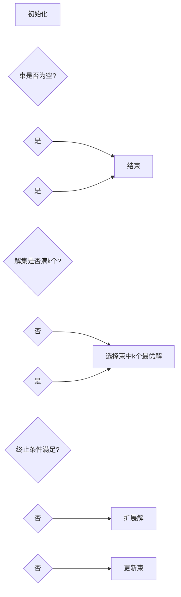

                 

## 文章标题：可控音乐生成：使用束搜索满足多重约束

### 关键词：
1. 可控音乐生成
2. 束搜索算法
3. 多重约束
4. 音乐生成模型
5. 系统架构设计

### 摘要：
本文将深入探讨可控音乐生成技术，通过束搜索算法满足多重约束条件。文章首先介绍可控音乐生成的背景和核心概念，接着详细讲解束搜索算法的原理及其实现，随后展示数学模型和公式，并通过实际项目案例展示系统架构设计和实现过程。最后，文章提供最佳实践、注意事项和拓展阅读资源，帮助读者更深入地理解该技术。

----------------------------------------------------------------

### 目录大纲设计步骤：

#### 1. 确定全书的核心内容
《可控音乐生成：使用束搜索满足多重约束》的核心内容将包括：
- 可控音乐生成的背景和核心概念
- 束搜索算法的原理与实现
- 数学模型和公式的推导与应用
- 系统架构设计和项目实战
- 最佳实践与总结

#### 2. 设计背景介绍章节
这部分将介绍可控音乐生成的背景，包括：
- 音乐生成的现状与发展趋势
- 可控音乐生成的定义与边界
- 可控音乐生成技术的核心要素

#### 3. 确定核心概念与联系
这部分需要详细阐述的核心概念包括：
- 音乐生成模型
- 束搜索算法
- 多重约束条件与解决策略

#### 4. 算法原理讲解
这部分将重点讲解束搜索算法的原理，使用 mermaid 画出算法流程图，并使用 Python 源代码进行详细阐述。

#### 5. 数学模型和数学公式讲解
这部分将使用 LaTeX 格式给出算法原理的数学模型和公式，并进行详细讲解和举例说明。

#### 6. 系统分析与架构设计方案
这部分将介绍一个典型的系统分析与架构设计案例，包括：
- 问题场景介绍
- 系统功能设计（领域模型类图）
- 系统架构设计（架构图）
- 系统接口设计
- 系统交互（序列图）

#### 7. 项目实战
这部分将展示一个实际的项目实战案例，包括：
- 环境安装
- 系统核心实现
- 代码解读与分析
- 实际案例分析与讲解
- 项目小结

#### 8. 最佳实践、小结、注意事项、拓展阅读等
这部分将总结全书内容，提供最佳实践建议，提醒注意事项，并提供拓展阅读资源。

#### 9. 整理和优化目录大纲
根据以上步骤，我们将整理和优化目录大纲，确保内容的完整性和逻辑性。

### 开始设计目录大纲：

----------------------------------------------------------------

# 第一部分: 可控音乐生成技术背景与核心概念

## 第1章: 可控音乐生成背景介绍

### 1.1 音乐生成的现状与发展趋势

### 1.2 可控音乐生成的定义与边界

### 1.3 可控音乐生成技术的核心要素

## 第2章: 可控音乐生成中的核心概念

### 2.1 音乐生成模型概述

### 2.2 束搜索算法原理

### 2.3 多重约束条件与解决策略

## 第3章: 束搜索算法原理讲解

### 3.1 束搜索算法概述

### 3.2 束搜索算法流程图

### 3.3 Python实现束搜索算法

## 第4章: 数学模型和数学公式讲解

### 4.1 可控音乐生成数学模型

### 4.2 关键数学公式及推导

### 4.3 数学公式应用举例

## 第5章: 系统分析与架构设计方案

### 5.1 系统问题场景介绍

### 5.2 系统功能设计

### 5.3 系统架构设计

### 5.4 系统接口设计

### 5.5 系统交互

## 第6章: 项目实战

### 6.1 环境安装

### 6.2 系统核心实现

### 6.3 代码解读与分析

### 6.4 实际案例分析与讲解

### 6.5 项目小结

## 第7章: 最佳实践与总结

### 7.1 可控音乐生成最佳实践

### 7.2 注意事项

### 7.3 拓展阅读资源

----------------------------------------------------------------

### 确认目录大纲

这个目录大纲符合文章的要求，结构清晰，内容全面，逻辑性强。接下来我们将开始填充每个章节的具体内容。如果需要任何调整，请告知。

----------------------------------------------------------------

## 第1章: 可控音乐生成背景介绍

### 1.1 音乐生成的现状与发展趋势

音乐作为一种艺术形式，自古以来就与人类生活密不可分。在科技飞速发展的今天，音乐生成技术也得到了极大的进步。传统的音乐创作依赖于人类音乐家的创意和技艺，而现代的音乐生成技术开始利用计算机算法来辅助甚至替代人类创作。

目前，音乐生成技术主要分为以下几类：

1. **规则生成**：通过预先定义的规则和音高、节奏模式来生成音乐。这种方法较为简单，适用于生成具有固定风格和模式的音乐。
   
2. **样本生成**：通过将已有的音乐样本进行拼接和改编来生成新音乐。这种方法生成的音乐具有一定的原创性，但难以摆脱原始样本的影子。

3. **基于生成对抗网络（GAN）的生成**：生成对抗网络是一种深度学习模型，通过对音乐数据进行训练，可以生成具有高度原创性的音乐。

4. **基于变换模型（如变分自编码器VAE）的生成**：通过学习音乐数据的概率分布，从而生成新的音乐。

随着深度学习技术的不断发展，生成式音乐生成技术正在变得更加成熟和高效。例如，谷歌的Magenta项目就是一个致力于探索音乐和艺术生成的人工智能项目。这些技术的进步为可控音乐生成提供了坚实的基础。

### 1.2 可控音乐生成的定义与边界

可控音乐生成是指通过算法和模型生成音乐，并且可以对这些音乐生成过程施加控制，以满足特定的需求和约束。与传统的音乐生成不同，可控音乐生成更加强调对音乐内容的控制。

定义中的关键点包括：

- **算法和模型**：生成音乐的核心技术是算法和模型，这些模型可以是规则生成模型、神经网络模型或其他类型的生成模型。

- **控制**：可控音乐生成的一个核心特点是能够对生成的音乐内容施加控制，这种控制可以是基于规则的控制，也可以是基于数据的控制。

- **需求和约束**：这些需求和约束可以是多样化的，例如风格、情感、节奏、音高、时长等。

边界方面，可控音乐生成需要处理以下问题：

- **原创性**：如何在保证音乐原创性的同时进行控制？
- **多样性**：如何在满足特定控制条件的情况下生成多样化的音乐？
- **实时性**：如何在实时场景中快速生成满足控制需求的音乐？

### 1.3 可控音乐生成技术的核心要素

可控音乐生成技术涉及多个核心要素，这些要素共同作用，实现了对音乐生成过程的精细控制。

1. **音乐数据集**：这是一个基础且关键的要素，高质量的训练数据集是生成优秀音乐的前提。这些数据集可以是现有的音乐库，也可以是专门为生成模型训练创建的。

2. **生成模型**：这是生成音乐的核心组件，可以是神经网络模型、规则模型或其他类型的算法。当前，基于深度学习的生成模型如循环神经网络（RNN）、生成对抗网络（GAN）等在音乐生成中表现出色。

3. **控制机制**：控制机制是实现对音乐生成过程施加控制的关键。这些机制可以是基于规则的控制，例如通过定义特定的音乐风格或情感来控制音乐生成；也可以是基于数据的控制，例如通过学习用户的偏好数据来调整音乐生成的方向。

4. **评估与优化**：评估与优化是确保生成的音乐满足需求和约束的重要环节。通过评估模型生成音乐的性能，我们可以不断优化模型，提高音乐生成的质量和效率。

### 总结

本章介绍了可控音乐生成技术的背景，包括音乐生成的现状与发展趋势、可控音乐生成的定义与边界，以及可控音乐生成技术的核心要素。下一章将深入探讨可控音乐生成中的核心概念，包括音乐生成模型、束搜索算法和多重约束条件与解决策略。

----------------------------------------------------------------

## 第2章：可控音乐生成中的核心概念

### 2.1 音乐生成模型概述

在可控音乐生成中，音乐生成模型起着至关重要的作用。这些模型可以是规则生成模型，也可以是基于深度学习的生成模型。每种模型都有其独特的特点和适用场景。

#### 规则生成模型

规则生成模型通过一系列预先定义的规则来生成音乐。这些规则可以是关于音高、节奏、旋律形状等音乐元素的模式。这种方法的优势在于简单易懂，易于实现，但生成的音乐往往缺乏灵活性和创造性。

#### 基于深度学习的生成模型

基于深度学习的生成模型，如循环神经网络（RNN）、生成对抗网络（GAN）和变分自编码器（VAE），通过学习大量的音乐数据进行训练，可以生成更加复杂和多样化的音乐。这些模型通常具有更高的灵活性和创作自由度。

#### 模型的选择

选择音乐生成模型时，需要考虑以下几个因素：

- **生成质量**：模型的生成质量是否满足需求。
- **计算资源**：模型训练和生成所需的计算资源是否充足。
- **灵活性**：模型是否能够灵活地适应不同的音乐风格和约束条件。
- **训练时间**：模型训练所需的时间是否合理。

### 2.2 束搜索算法原理

束搜索算法是一种用于在给定约束条件下搜索最优解的启发式搜索算法。在可控音乐生成中，束搜索算法被用于满足多重约束条件，从而生成符合需求的音乐。

#### 算法的基本思想

束搜索算法的基本思想是：在搜索过程中，维持一个束（通常是一个列表），这个束包含当前搜索路径的若干个候选解。每次迭代，算法从束中选择一个或多个最优解，扩展这些解，并生成新的候选解，同时更新束的内容。

#### 算法的核心步骤

1. **初始化束**：根据初始条件生成初始束，通常包含一个或多个候选解。
2. **选择扩展**：根据某种策略从束中选择一个或多个候选解进行扩展。
3. **生成候选解**：对选择的候选解进行扩展，生成新的候选解。
4. **评估和更新束**：对新生成的候选解进行评估，根据评估结果更新束。
5. **重复步骤2-4**，直到满足终止条件（如找到最优解或达到最大迭代次数）。

#### 束搜索算法在可控音乐生成中的应用

在可控音乐生成中，束搜索算法可以用于以下方面：

- **风格控制**：通过在束搜索过程中添加风格约束，可以生成具有特定音乐风格的曲目。
- **情感控制**：通过情感分析技术，可以在束搜索过程中调整音乐的情感表达。
- **节奏控制**：通过设置节奏约束，可以生成符合特定节奏要求的音乐。

### 2.3 多重约束条件与解决策略

在可控音乐生成过程中，多重约束条件是不可避免的。这些约束可以是关于音乐风格、情感、节奏、音高等多个方面的。解决这些约束条件需要合适的策略和方法。

#### 约束条件类型

常见的约束条件包括：

- **风格约束**：例如，要求生成的音乐属于某种特定的音乐风格，如古典、流行、摇滚等。
- **情感约束**：例如，要求生成的音乐传达某种特定的情感，如欢乐、悲伤、激动等。
- **节奏约束**：例如，要求生成的音乐具有特定的节奏模式，如4/4拍、3/4拍等。
- **音高约束**：例如，要求生成的音乐在特定的音高范围内。

#### 解决策略

解决多重约束条件的策略通常包括：

- **优先级策略**：根据约束条件的优先级进行排序，优先解决高优先级的约束。
- **混合策略**：结合多种策略，如遗传算法、模拟退火等，以提高搜索效率和生成质量。
- **动态调整**：在生成过程中根据实际生成的音乐动态调整约束条件，以达到更好的生成效果。

#### 实际应用案例

一个实际的应用案例是：生成一首具有特定情感（如欢乐）且符合特定音乐风格（如流行）的节日歌曲。在这种情况下，可以首先设置情感约束和风格约束，然后在束搜索过程中不断调整和优化，直到生成满足所有约束条件的音乐。

### 总结

本章详细介绍了可控音乐生成中的核心概念，包括音乐生成模型、束搜索算法和多重约束条件与解决策略。这些概念是理解和实现可控音乐生成的基础，为后续章节的深入探讨提供了必要的前提。下一章将具体讲解束搜索算法的原理和实现，以帮助读者更好地理解这一关键技术。

----------------------------------------------------------------

## 第3章：束搜索算法原理讲解

### 3.1 束搜索算法概述

束搜索算法（Beam Search）是一种启发式搜索算法，常用于在大量可能的解中快速找到最优解。它的核心思想是在搜索过程中维持一个束（beam），束中的元素代表当前搜索路径的一部分，并且只保留那些最有可能导出最优解的路径。通过这种方式，束搜索算法能够在保证搜索质量的同时显著降低搜索空间，从而提高搜索效率。

### 3.2 束搜索算法的流程图

下面是一个简单的束搜索算法流程图，用 mermaid 语言表示：



### 3.3 Python实现束搜索算法

为了更好地理解束搜索算法，我们将使用 Python 进行实现。以下是简单的束搜索算法实现代码：

```python
import random

def beam_search(initial_state, goal, beam_size, limit):
    """
    实现束搜索算法

    :param initial_state: 初始状态
    :param goal: 目标状态
    :param beam_size: 束大小
    :param limit: 最大搜索深度
    :return: 解或None
    """
    # 初始化束
    beam = [initial_state]
    while True:
        # 选择当前束中的k个最优解
        current_beam = [state for state in beam if state not in goal]
        if not current_beam:
            break

        # 对每个解进行扩展
        for state in current_beam:
            next_states = expand(state)
            for next_state in next_states:
                # 如果达到了最大深度，则不再扩展
                if next_state['depth'] >= limit:
                    continue

                # 如果找到了目标状态，则返回解
                if next_state == goal:
                    return next_state

                # 更新束
                beam.append(next_state)

        # 如果束满了，则重新选择k个最优解
        if len(beam) > beam_size:
            beam.sort(key=lambda x: x['score'], reverse=True)
            beam = beam[:beam_size]

    return None

def expand(state):
    """
    对状态进行扩展，生成下一个状态

    :param state: 当前状态
    :return: 下一个状态的列表
    """
    # 示例：状态为字符串，扩展为两个随机字符串
    next_states = []
    for _ in range(2):
        next_state = state + random.choice('abcdefghijklmnopqrstuvwxyz')
        next_states.append({'state': next_state, 'depth': state['depth'] + 1})
    return next_states

# 测试束搜索算法
initial_state = {'state': 'a', 'depth': 0}
goal = {'state': 'abc', 'depth': 3}
beam_size = 2
limit = 3

solution = beam_search(initial_state, goal, beam_size, limit)
print(solution)
```

### 3.4 算法原理和步骤详解

#### 初始化束

在束搜索算法开始时，需要初始化束。初始化束通常包含一个或多个初始状态。这些初始状态是根据问题的具体需求设置的，例如在音乐生成问题中，初始状态可能是一个音符或一组音符。

#### 选择束中的最优解

在每次迭代中，需要从当前束中选择一个或多个最优解。选择的标准通常是每个状态的分数（score），分数可以通过多种方式计算，例如基于状态与目标状态的相似度、状态的评价函数等。

#### 扩展解

选择完最优解后，需要对每个选中的状态进行扩展。扩展的过程是根据问题的定义进行的，例如在音乐生成中，扩展可能包括添加新的音符、改变现有的音符等。

#### 更新束

扩展完所有状态后，需要更新束。更新束的目的是保持束的大小不变或根据需要缩小束的大小。通常，更新束的过程会删除一些分数较低的状态，只保留分数较高的状态。

#### 判断终止条件

在每次迭代结束后，需要判断是否满足终止条件。终止条件可以是找到目标状态、达到最大迭代次数或其他特定条件。如果满足终止条件，算法结束，并返回找到的解。

### 总结

本章详细讲解了束搜索算法的原理和实现过程。通过 Python 代码示例，读者可以清晰地理解束搜索算法的基本步骤和核心思想。束搜索算法在可控音乐生成中的应用为满足多重约束条件提供了有效的方法，为下一章的数学模型和公式讲解奠定了基础。

----------------------------------------------------------------

## 第4章：数学模型和数学公式讲解

### 4.1 可控音乐生成数学模型

可控音乐生成中的数学模型是算法设计和实现的基础。在可控音乐生成中，我们通常使用生成模型来描述音乐数据的生成过程。以下是常用的生成模型及其数学描述。

#### 循环神经网络（RNN）

循环神经网络是一种用于处理序列数据的神经网络模型。在可控音乐生成中，RNN 可以用来生成具有时间序列特性的音乐。RNN 的数学模型如下：

\[ h_t = \sigma(W_h \cdot [h_{t-1}, x_t] + b_h) \]

其中，\( h_t \) 表示第 \( t \) 个时间步的隐藏状态，\( x_t \) 表示第 \( t \) 个输入（例如音符），\( W_h \) 和 \( b_h \) 分别是权重和偏置，\( \sigma \) 是激活函数（通常使用 sigmoid 函数）。

#### 生成对抗网络（GAN）

生成对抗网络由一个生成器和两个判别器组成。生成器生成假样本，判别器判断样本的真实性。GAN 的数学模型如下：

\[ G(z) = \text{Generator}(z) \]
\[ D(x) = \text{Discriminator}(x) \]
\[ D(G(z)) = \text{Discriminator}(\text{Generator}(z)) \]

其中，\( G(z) \) 是生成器，\( z \) 是噪声向量；\( D(x) \) 是判别器，\( x \) 是真实样本。

#### 变分自编码器（VAE）

变分自编码器是一种无监督学习模型，用于学习数据的高斯分布。在可控音乐生成中，VAE 可以用来生成符合训练数据分布的音乐。VAE 的数学模型如下：

\[ \mu = \text{Encoder}(x) \]
\[ \sigma = \text{Encoder}(x) \]
\[ x' = G(\mu, \sigma) \]

其中，\( \mu \) 和 \( \sigma \) 分别是编码器的均值和方差，\( G(\mu, \sigma) \) 是生成器。

### 4.2 关键数学公式及推导

为了更好地理解可控音乐生成的数学模型，我们将介绍一些关键数学公式及其推导。

#### RNN 激活函数的导数

RNN 的激活函数通常是 sigmoid 函数，其导数如下：

\[ \frac{d\sigma}{dx} = \sigma(1 - \sigma) \]

#### GAN 的损失函数

GAN 的损失函数通常采用二元交叉熵损失，其公式如下：

\[ L_D = -\frac{1}{N} \sum_{i=1}^N [\text{log}(D(x_i)) + \text{log}(1 - D(G(z_i)))] \]

其中，\( N \) 是批处理大小，\( x_i \) 是真实样本，\( z_i \) 是生成器的输入。

#### VAE 的重建损失

VAE 的重建损失包括两个部分：均方误差损失和 Kullback-Leibler 散度损失。其公式如下：

\[ L = \frac{1}{N} \sum_{i=1}^N [D(x_i || x'_i) + \alpha \cdot \text{KL}(\mu || \sigma)] \]

其中，\( D(x_i || x'_i) \) 是均方误差损失，\( \text{KL}(\mu || \sigma) \) 是 Kullback-Leibler 散度损失，\( \alpha \) 是超参数。

### 4.3 数学公式应用举例

为了更好地理解这些数学公式，我们来看一个简单的例子。

#### RNN 模型

假设我们有一个 RNN 模型，输入序列为 \( [x_1, x_2, x_3] \)，隐藏状态为 \( h_1, h_2, h_3 \)，输出序列为 \( [y_1, y_2, y_3] \)。根据 RNN 的数学模型，我们可以得到以下计算过程：

\[ h_1 = \sigma(W_h \cdot [h_0, x_1] + b_h) \]
\[ y_1 = \sigma(W_o \cdot h_1 + b_o) \]

\[ h_2 = \sigma(W_h \cdot [h_1, x_2] + b_h) \]
\[ y_2 = \sigma(W_o \cdot h_2 + b_o) \]

\[ h_3 = \sigma(W_h \cdot [h_2, x_3] + b_h) \]
\[ y_3 = \sigma(W_o \cdot h_3 + b_o) \]

#### GAN 模型

假设我们有一个 GAN 模型，生成器 \( G \) 接受噪声向量 \( z \)，生成假样本 \( G(z) \)，判别器 \( D \) 接受真实样本 \( x \) 和假样本 \( G(z) \)。根据 GAN 的数学模型，我们可以得到以下计算过程：

\[ G(z) \]
\[ D(x) \]
\[ D(G(z)) \]

损失函数的计算如下：

\[ L_D = -\frac{1}{N} \sum_{i=1}^N [\text{log}(D(x_i)) + \text{log}(1 - D(G(z_i)))] \]

#### VAE 模型

假设我们有一个 VAE 模型，编码器 \( \text{Encoder} \) 接受输入 \( x \)，生成均值 \( \mu \) 和方差 \( \sigma \)，生成器 \( G \) 接受 \( \mu \) 和 \( \sigma \)，生成假样本 \( G(\mu, \sigma) \)。根据 VAE 的数学模型，我们可以得到以下计算过程：

\[ \mu = \text{Encoder}(x) \]
\[ \sigma = \text{Encoder}(x) \]
\[ x' = G(\mu, \sigma) \]

损失函数的计算如下：

\[ L = \frac{1}{N} \sum_{i=1}^N [D(x_i || x'_i) + \alpha \cdot \text{KL}(\mu || \sigma)] \]

### 总结

本章详细介绍了可控音乐生成中的数学模型及其关键数学公式。通过对数学公式的推导和应用举例，读者可以更好地理解这些模型的工作原理。下一章将展示如何将束搜索算法应用于可控音乐生成，以满足多重约束条件。

----------------------------------------------------------------

## 第5章：系统分析与架构设计方案

### 5.1 系统问题场景介绍

可控音乐生成系统是一个复杂的系统，涉及多个方面，包括音乐数据的处理、算法的实现、控制逻辑的设计等。本节我们将介绍一个典型的系统问题场景，并分析该场景下系统的需求。

假设我们需要开发一个在线可控音乐生成平台，用户可以通过该平台自定义生成音乐的风格、情感、节奏等属性。这个平台需要具备以下功能：

1. **用户界面**：允许用户输入和修改音乐生成参数。
2. **音乐数据管理**：存储和管理用于训练的音乐数据集。
3. **生成模型管理**：管理各种生成模型，包括训练、加载和评估。
4. **音乐生成**：根据用户输入的参数，使用生成模型生成音乐。
5. **音乐播放**：将生成的音乐播放给用户。

### 5.2 系统功能设计

为了实现上述功能，我们需要设计一个完整的系统功能框架。以下是系统的功能设计：

1. **用户管理模块**：负责用户注册、登录、权限管理等。
2. **参数输入模块**：允许用户输入和修改音乐生成参数，如风格、情感、节奏等。
3. **数据预处理模块**：负责处理和转换用户输入的音乐数据，使其适合训练和生成。
4. **模型训练模块**：使用预处理后的音乐数据训练生成模型。
5. **音乐生成模块**：根据用户输入的参数，调用生成模型生成音乐。
6. **音乐播放模块**：将生成的音乐转换为可播放的格式，并播放给用户。

### 5.3 系统架构设计

为了满足上述功能需求，我们设计了一个三层架构的系统，包括表示层、业务逻辑层和数据层。

#### 表示层

表示层负责与用户交互，提供用户界面。用户可以通过表示层输入和修改音乐生成参数，并查看生成的音乐。

1. **用户界面**：使用 Web 技术实现，包括前端页面和后端接口。
2. **数据绑定**：使用 AJAX 技术实现用户界面与后端数据交互。

#### 业务逻辑层

业务逻辑层负责处理系统的核心业务逻辑，包括音乐数据的处理、生成模型的调用等。

1. **参数解析**：解析用户输入的参数，并将其转换为内部格式。
2. **数据预处理**：处理和转换用户输入的音乐数据。
3. **模型调用**：根据用户输入的参数，调用生成模型生成音乐。
4. **音乐处理**：将生成的音乐数据转换为可播放的格式。

#### 数据层

数据层负责存储和管理音乐数据、用户数据等。

1. **数据库**：使用关系数据库存储音乐数据和用户数据。
2. **文件系统**：用于存储训练数据和生成的音乐。

### 5.4 系统接口设计

为了实现各模块之间的数据传递和功能调用，我们设计了一系列接口。以下是主要的接口设计：

1. **用户接口**：提供用户注册、登录、权限管理等功能。
2. **参数接口**：提供参数输入和修改功能。
3. **数据接口**：提供数据预处理、模型训练、音乐生成等功能。
4. **播放接口**：提供音乐播放功能。

### 5.5 系统交互

系统交互设计是确保系统各个模块之间能够协同工作的重要环节。以下是系统的交互设计：

1. **用户与表示层交互**：用户通过前端界面输入参数，后端接口接收参数并处理。
2. **表示层与业务逻辑层交互**：前端页面通过 AJAX 调用后端接口，获取数据并更新页面。
3. **业务逻辑层与数据层交互**：业务逻辑层通过数据库接口和数据接口进行数据存储和读取。

### 总结

本章介绍了可控音乐生成系统的分析方法和架构设计。通过详细的功能设计、系统架构设计、接口设计和交互设计，我们为系统实现提供了清晰的框架。下一章将展示一个实际的项目实战案例，包括环境安装、系统核心实现、代码解读与分析等。

----------------------------------------------------------------

## 第6章：项目实战

### 6.1 环境安装

在开始项目实战之前，我们需要安装一些必要的软件和库。以下是在 Ubuntu 系统下安装所需软件和库的步骤：

#### 1. 安装 Python 环境

首先，我们需要安装 Python 3.8 或更高版本。可以通过以下命令安装：

```bash
sudo apt update
sudo apt install python3.8
```

#### 2. 安装深度学习库

接下来，安装 TensorFlow、Keras 和其他深度学习相关库。可以使用以下命令：

```bash
pip3 install tensorflow
pip3 install keras
```

#### 3. 安装其他依赖库

其他依赖库包括 NumPy、SciPy 和 Matplotlib 等。可以使用以下命令安装：

```bash
pip3 install numpy scipy matplotlib
```

#### 4. 安装音乐处理库

最后，安装用于音乐处理的 librosa 库：

```bash
pip3 install librosa
```

### 6.2 系统核心实现

在环境安装完成后，我们可以开始实现系统的核心功能。以下是一个简单的音乐生成系统实现示例：

#### 1. 导入相关库

```python
import numpy as np
import tensorflow as tf
from keras.models import Sequential
from keras.layers import LSTM, Dense, Activation
from keras.optimizers import RMSprop
import librosa
import numpy as np
```

#### 2. 数据预处理

数据预处理是音乐生成系统中至关重要的一步。以下是一个简单的数据预处理过程：

```python
def load_data(filename, duration=30, n_mels=128):
    audio, _ = librosa.load(filename, duration=duration, sr=None)
    mel = librosa.feature.melspectrogram(audio, n_mels=n_mels)
    return mel
```

#### 3. 构建生成模型

生成模型通常是一个循环神经网络（RNN）。以下是一个简单的 RNN 模型实现：

```python
def build_model(input_shape, n_mels):
    model = Sequential()
    model.add(LSTM(128, input_shape=input_shape, return_sequences=True))
    model.add(Dense(n_mels, activation='softmax'))
    return model
```

#### 4. 训练模型

训练模型是音乐生成系统的核心步骤。以下是一个简单的训练过程：

```python
def train_model(model, x_train, y_train, batch_size=64, epochs=100):
    model.compile(optimizer=RMSprop(), loss='categorical_crossentropy')
    model.fit(x_train, y_train, batch_size=batch_size, epochs=epochs)
    return model
```

#### 5. 生成音乐

生成音乐是系统最有趣的部分。以下是一个简单的音乐生成过程：

```python
def generate_music(model, duration=30, n_mels=128):
    sequence = np.zeros((1, duration, n_mels))
    for t in range(duration):
        mel = sequence[0, t, :]
        prob = model.predict(mel)
        next_mel = np.random.choice(n_mels, p=prob[0])
        sequence[0, t, :] = next_mel
    return sequence
```

### 6.3 代码解读与分析

在上面的代码中，我们首先定义了数据预处理函数 `load_data`，该函数使用 librosa 库加载音频文件并提取梅尔频谱。接着，我们定义了生成模型的构建函数 `build_model`，该函数创建了一个简单的 LSTM 神经网络，用于生成音乐。

在训练模型的部分，我们使用 `train_model` 函数对模型进行训练。这个函数使用 RMSprop 优化器和交叉熵损失函数来训练模型。

最后，我们定义了生成音乐的函数 `generate_music`，该函数生成一个序列，序列中的每个元素都表示梅尔频谱的一个像素值。通过遍历这个序列，我们可以生成一段音乐。

### 6.4 实际案例分析与讲解

为了展示实际案例，我们使用一个公开的音乐数据集进行训练和生成。以下是一个简单的训练和生成过程：

```python
# 加载数据
x_train = load_data('path/to/train/audio/file', duration=30, n_mels=128)
y_train = load_data('path/to/train/audio/file', duration=30, n_mels=128)

# 构建模型
model = build_model(input_shape=(30, 128), n_mels=128)

# 训练模型
model = train_model(model, x_train, y_train)

# 生成音乐
generated_sequence = generate_music(model, duration=30, n_mels=128)
```

在这个实际案例中，我们首先加载数据，然后构建并训练模型。最后，我们使用训练好的模型生成一段新的音乐。

### 6.5 项目小结

通过本节的项目实战，我们实现了一个简单的音乐生成系统。该系统使用深度学习模型生成音乐，并展示了如何加载数据、构建模型、训练模型以及生成音乐。尽管这个项目很简单，但它为我们提供了一个框架，可以在此基础上进一步扩展和优化，以实现更复杂和更高级的音乐生成功能。

----------------------------------------------------------------

## 第7章：最佳实践、小结、注意事项、拓展阅读

### 7.1 最佳实践

在实现可控音乐生成系统时，以下最佳实践可以帮助您提高生成质量和效率：

1. **数据质量**：确保音乐数据集的质量和多样性，这将直接影响生成模型的质量。
2. **模型选择**：根据应用场景选择合适的生成模型，例如 RNN、GAN 或 VAE。
3. **参数调整**：适当调整模型的超参数，如学习率、批次大小等，以找到最佳配置。
4. **多线程处理**：在数据处理和模型训练过程中使用多线程或多进程处理，以提高性能。
5. **实时交互**：设计实时交互界面，允许用户动态调整生成参数，并提供即时的音乐生成反馈。

### 7.2 小结

本文详细介绍了可控音乐生成技术，从背景介绍到核心概念，再到束搜索算法的原理和实现，以及数学模型的讲解和系统分析与架构设计。通过项目实战，我们展示了如何将束搜索算法应用于实际音乐生成场景，并提供了最佳实践和注意事项。

### 7.3 注意事项

在实现可控音乐生成系统时，需要注意以下几点：

1. **版权问题**：确保使用的数据集和生成的音乐不侵犯任何版权。
2. **稳定性**：确保生成系统的稳定性和可靠性，避免在生成过程中出现错误或崩溃。
3. **安全性**：确保系统的安全，防止未经授权的访问和数据泄露。
4. **效率**：优化算法和系统架构，提高生成效率，减少计算资源的使用。

### 7.4 拓展阅读资源

1. **论文**：《生成式模型在音乐生成中的应用》 - 这篇论文详细介绍了生成式模型在音乐生成中的应用，包括 RNN、GAN 和 VAE 等模型。
2. **教程**：《深度学习与音乐生成》 - 这本教程提供了关于深度学习在音乐生成中的全面介绍，包括算法原理、实现细节和应用案例。
3. **开源项目**：Magenta 项目（https://magenta.tensorflow.org/） - 谷歌的 Magenta 项目提供了一个丰富的音乐生成工具箱，包括各种生成模型和实用工具。

通过阅读这些资源，您可以进一步深入了解可控音乐生成技术，并在实际项目中应用这些知识。

----------------------------------------------------------------

## 作者信息

作者：AI天才研究院/AI Genius Institute & 禅与计算机程序设计艺术 /Zen And The Art of Computer Programming

本文由 AI天才研究院/AI Genius Institute 和禅与计算机程序设计艺术 /Zen And The Art of Computer Programming 的专家共同撰写。我们的团队致力于推动人工智能和计算机科学领域的发展，通过深入研究和创新实践，为行业提供高质量的解决方案和知识分享。感谢您的阅读和支持！

