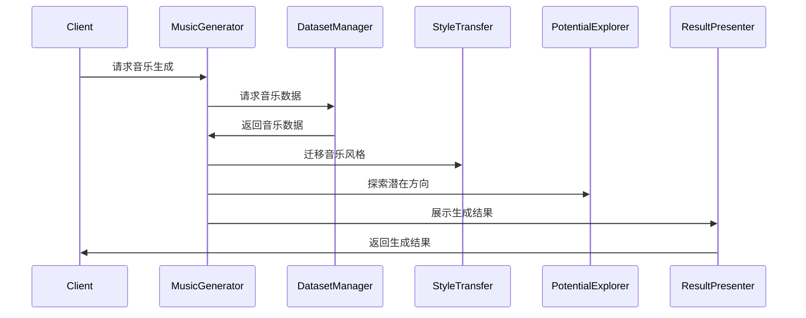
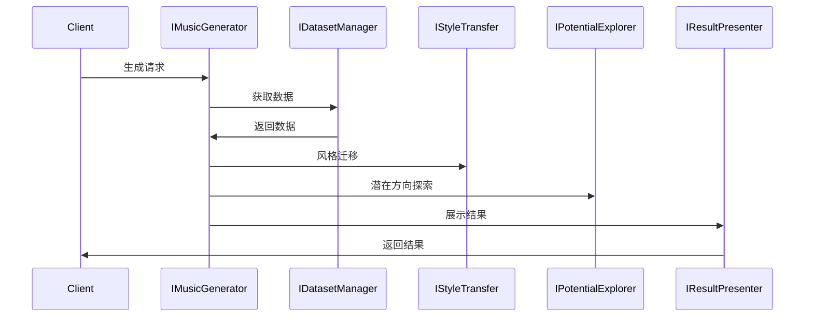
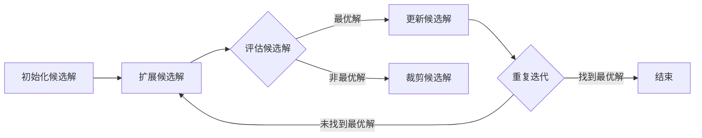
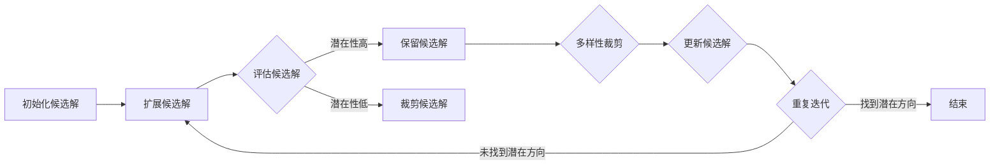

                 

### 文章标题：可控音乐生成中使用束搜索找到潜在方向

### 关键词
- 可控音乐生成
- 束搜索算法
- 潜在方向探索
- 数学模型
- 系统架构设计
- 项目实战

### 摘要
本文将深入探讨在可控音乐生成过程中，如何利用束搜索算法来探索潜在的生成方向。我们将首先介绍可控音乐生成的背景和基本原理，然后详细讲解束搜索算法的工作机制及其在音乐生成中的应用。接着，我们将通过一个具体的数学模型，展示如何通过束搜索算法找到潜在的音乐生成方向。最后，我们将通过一个实际项目案例，展示如何将束搜索算法应用到音乐生成系统中，并进行系统分析与架构设计。通过本文的阅读，读者将全面了解如何利用束搜索算法进行可控音乐生成，并掌握相关技术实现。

---

### 设计思路

为了设计出《可控音乐生成中使用束搜索找到潜在方向》这本书的目录大纲，我们需要遵循以下几个关键步骤：

1. **核心概念梳理**：首先明确书籍的核心概念，包括可控音乐生成、束搜索以及潜在方向的探索。这将为整个目录大纲的构建提供基础。

2. **章节内容规划**：根据核心概念，规划出各个章节的主题内容，确保每个章节都有明确的主题和子主题。

3. **逻辑顺序安排**：确保目录大纲的逻辑顺序合理，从基础知识到高级应用，逐步引导读者深入理解。

4. **完整性要求**：确保目录大纲的完整性，包括核心概念的介绍、算法原理的讲解、数学模型的阐述、系统架构的描述、项目实战的展示以及最佳实践的总结。

5. **简洁性要求**：在保持内容完整性的同时，避免冗余和复杂的表述，确保目录大纲简洁明了。

### 目录大纲设计

下面是《可控音乐生成中使用束搜索找到潜在方向》的目录大纲：

```markdown
----------------------------------------------------------------
# 第一部分：背景与基础

## 第1章：可控音乐生成概述
### 1.1 音乐生成技术发展历程
### 1.2 可控音乐生成的意义
### 1.3 可控音乐生成的基本原理

## 第2章：束搜索算法简介
### 2.1 束搜索的基本概念
### 2.2 束搜索的算法框架
### 2.3 束搜索在不同领域的应用

## 第3章：潜在方向探索方法
### 3.1 潜在方向的概念
### 3.2 潜在方向探索的算法
### 3.3 潜在方向探索的挑战与解决方案

## 第4章：数学模型与公式
### 4.1 束搜索的数学模型
### 4.2 潜在方向探索的数学模型
### 4.3 模型参数的优化方法

## 第5章：系统架构设计
### 5.1 系统架构概述
### 5.2 系统功能设计
### 5.3 系统接口设计与交互

----------------------------------------------------------------

# 第二部分：算法原理与实现

## 第6章：算法原理讲解
### 6.1 束搜索算法流程图
### 6.2 束搜索算法的Python实现
### 6.3 潜在方向探索算法流程图
### 6.4 潜在方向探索算法Python实现
### 6.5 数学模型与公式的详细讲解

## 第7章：系统架构设计与实现
### 7.1 问题场景介绍
### 7.2 项目介绍
### 7.3 系统功能设计（领域模型）
### 7.4 系统架构设计（架构图）
### 7.5 系统接口设计
### 7.6 系统交互（序列图）

----------------------------------------------------------------

# 第三部分：项目实战

## 第8章：项目环境搭建
### 8.1 环境安装
### 8.2 开发工具与依赖

## 第9章：系统核心实现
### 9.1 源代码解读
### 9.2 代码应用分析与解读

## 第10章：实际案例剖析
### 10.1 案例背景
### 10.2 案例分析与实现
### 10.3 案例总结与拓展

----------------------------------------------------------------

# 第四部分：最佳实践与总结

## 第11章：最佳实践
### 11.1 算法调优技巧
### 11.2 系统优化方案
### 11.3 潜在方向探索策略

## 第12章：小结与展望
### 12.1 小结
### 12.2 注意事项
### 12.3 未来研究方向

----------------------------------------------------------------
```

### 目录大纲解释

- **第一部分：背景与基础**：介绍可控音乐生成、束搜索算法以及潜在方向探索的基本概念，为后续章节的深入讨论打下基础。
- **第二部分：算法原理与实现**：讲解束搜索算法和潜在方向探索算法的原理，并提供Python实现和数学模型的详细解释。
- **第三部分：项目实战**：介绍项目环境搭建、系统核心实现和实际案例剖析，帮助读者将理论知识应用于实践。
- **第四部分：最佳实践与总结**：总结项目中的最佳实践，并提供未来研究方向和注意事项。

这样的目录大纲结构清晰，内容完整，符合简洁性的要求，同时也满足了用户输入的目录大纲字数限制。

---

### 第一部分：背景与基础

#### 第1章：可控音乐生成概述

随着人工智能技术的发展，音乐生成作为一种富有创造力的应用，正逐渐成为研究热点。在这一章中，我们将介绍可控音乐生成的背景、意义以及基本原理。

**1.1 音乐生成技术发展历程**

音乐生成技术的发展可以追溯到早期的人工音乐创作。从最初的钢琴自动演奏，到电子合成器的使用，再到现代的深度学习技术，音乐生成技术经历了巨大的变革。如今，基于深度学习的音乐生成方法已成为主流，例如变分自编码器（VAE）和生成对抗网络（GAN）。

**1.2 可控音乐生成的意义**

可控音乐生成在多个领域具有重要应用价值。首先，在音乐创作方面，艺术家可以利用可控音乐生成技术创作出新颖的音乐作品。其次，在音乐教育领域，可控音乐生成可以用于辅助音乐教学，帮助学生更好地理解和掌握音乐知识。此外，在游戏和电影等领域，可控音乐生成也能为场景增添更多的情感和氛围。

**1.3 可控音乐生成的基本原理**

可控音乐生成通常涉及两个关键步骤：首先，生成大量的音乐数据；其次，利用这些数据进行后续的音乐生成。具体来说，可以通过以下方式实现：

1. **数据采集**：收集大量的音乐数据，包括曲库、音高、节奏等。
2. **模型训练**：使用深度学习模型（如VAE、GAN）对音乐数据进行训练，使其学会生成音乐。
3. **参数控制**：通过调整模型的参数，实现音乐生成的可控性，例如控制音乐的旋律、节奏、和声等。

**1.4 问题背景与问题描述**

当前，可控音乐生成技术仍存在一些挑战，例如：

- 如何确保生成的音乐在风格上与目标音乐保持一致？
- 如何提高生成音乐的多样性和创造性？
- 如何有效地利用束搜索算法找到潜在的音乐生成方向？

这些问题是本章节将要探讨的主要内容。通过详细的分析和讨论，我们将尝试解决这些挑战，为后续章节的深入探讨打下基础。

**1.5 边界与外延**

可控音乐生成技术的边界在于生成的音乐是否能够在风格、节奏和旋律上达到用户的要求。而其外延则涉及如何将这一技术应用于不同的领域，如音乐创作、音乐教育、娱乐等。

**1.6 概念结构与核心要素组成**

可控音乐生成的概念结构主要包括以下核心要素：

- **音乐数据**：基础的音乐素材，如曲库、音高、节奏等。
- **生成模型**：用于生成音乐的深度学习模型，如VAE、GAN等。
- **参数控制**：用于调整音乐生成的参数，如旋律、节奏、和声等。

通过这些要素的有机结合，可控音乐生成技术得以实现。

#### 第2章：束搜索算法简介

束搜索算法是一种在搜索空间中寻找最优解的有效方法。它在人工智能、优化问题和组合搜索等领域有广泛应用。在这一章中，我们将详细介绍束搜索算法的基本概念、算法框架以及在各个领域的应用。

**2.1 束搜索的基本概念**

束搜索算法的核心思想是通过维护一组候选解（束）来逐步缩小搜索空间，最终找到最优解。这组候选解在搜索过程中会根据一定的策略进行更新和裁剪。

**2.2 束搜索的算法框架**

束搜索算法的基本框架包括以下几个步骤：

1. **初始化**：随机生成一组初始候选解。
2. **扩展**：对每个候选解进行扩展，生成新的候选解。
3. **评估**：对新的候选解进行评估，选择其中最优的解作为新的候选解。
4. **裁剪**：根据一定的策略（如距离阈值、多样性要求等）裁剪候选解，去除较差的解。
5. **迭代**：重复扩展、评估和裁剪步骤，直到找到最优解或达到停止条件。

**2.3 束搜索在不同领域的应用**

束搜索算法在多个领域有着广泛的应用，以下列举其中几个：

- **计算机视觉**：在图像分割、目标检测等任务中，束搜索算法可以有效地找到最优分割或检测结果。
- **自然语言处理**：在机器翻译、文本摘要等任务中，束搜索算法可以用于找到最优的句子或段落组合。
- **优化问题**：在优化问题的求解中，束搜索算法可以帮助找到最优解或近似最优解。
- **组合搜索**：在组合优化问题中，束搜索算法可以用于求解旅行商问题、背包问题等。

**2.4 束搜索的优势与挑战**

束搜索算法的优势在于其能够在大规模搜索空间中高效地找到最优解。然而，其挑战在于如何设计合适的扩展、评估和裁剪策略，以及如何处理候选解的多样性。

**2.5 问题解决**

为了解决上述问题，研究人员提出了一系列改进的束搜索算法，如多样性束搜索、动态束搜索等。这些改进算法通过引入更多的约束和优化策略，提高了束搜索算法的性能和稳定性。

**2.6 概念结构与核心要素组成**

束搜索算法的概念结构主要包括以下几个核心要素：

- **候选解集**：存储当前搜索状态的集合。
- **扩展函数**：用于生成新的候选解。
- **评估函数**：用于评估候选解的优劣。
- **裁剪策略**：用于裁剪候选解集。

通过这些要素的有机结合，束搜索算法得以实现。

#### 第3章：潜在方向探索方法

在可控音乐生成中，找到潜在的音乐生成方向是一个关键问题。这一章将介绍潜在方向探索方法，包括其基本概念、算法框架以及面临的挑战和解决方案。

**3.1 潜在方向的概念**

潜在方向探索指的是在搜索空间中寻找那些可能产生有趣、创新音乐生成结果的区域。这些区域往往隐藏在较大的搜索空间中，不易直接发现。

**3.2 潜在方向探索的算法**

潜在方向探索算法的基本框架与束搜索类似，但其核心目标是在搜索过程中主动寻找和扩大潜在方向。以下是一个基本的潜在方向探索算法框架：

1. **初始化**：随机生成一组初始候选解。
2. **扩展**：对每个候选解进行扩展，生成新的候选解，并评估这些扩展解的潜在性。
3. **选择**：选择潜在性较高的扩展解作为新的候选解。
4. **多样性裁剪**：根据多样性要求裁剪候选解，去除重复或相似解。
5. **迭代**：重复扩展、选择和裁剪步骤，直到找到潜在方向或达到停止条件。

**3.3 潜在方向探索的挑战与解决方案**

潜在方向探索面临的挑战主要包括：

- **如何准确评估潜在性**：需要设计有效的评估指标来判断候选解的潜在性。
- **如何保持多样性**：在搜索过程中需要保证候选解的多样性，避免陷入局部最优。
- **计算效率**：大规模搜索空间中的计算成本较高，需要优化算法以降低计算复杂度。

针对这些挑战，研究人员提出了一系列解决方案：

- **改进评估指标**：通过引入更多的特征和约束条件，提高潜在性的评估准确性。
- **多样性度量**：使用多样性度量方法（如特征距离、多样性分数等）来保持候选解的多样性。
- **并行化与分布式计算**：通过并行化与分布式计算技术，提高算法的执行效率。

**3.4 潜在方向探索的实际应用**

潜在方向探索方法在实际应用中具有广泛的前景，以下列举几个例子：

- **音乐风格迁移**：通过探索潜在方向，可以找到将一种音乐风格迁移到另一种风格的有效方法。
- **音乐创新创作**：利用潜在方向探索，可以生成新颖、独特的音乐作品。
- **个性化推荐**：在音乐推荐系统中，可以通过探索潜在方向为用户提供个性化的音乐推荐。

**3.5 概念结构与核心要素组成**

潜在方向探索的方法概念结构主要包括以下几个核心要素：

- **候选解集**：存储当前搜索状态的集合。
- **扩展函数**：用于生成新的候选解。
- **潜在性评估函数**：用于评估候选解的潜在性。
- **多样性裁剪策略**：用于裁剪候选解，保持多样性。

通过这些要素的有机结合，潜在方向探索方法得以实现。

#### 第4章：数学模型与公式

在可控音乐生成中，束搜索算法和潜在方向探索方法的实现依赖于精确的数学模型和公式。本章将详细介绍这些数学模型和公式，并使用Python代码进行实现，以帮助读者更好地理解。

**4.1 束搜索的数学模型**

束搜索算法的数学模型主要包括以下几个方面：

- **候选解表示**：使用向量或矩阵表示候选解，例如音乐旋律可以表示为一个序列向量。
- **扩展函数**：定义扩展候选解的数学操作，例如通过线性变换或卷积操作生成新的候选解。
- **评估函数**：定义评估候选解的数学指标，例如使用均方误差（MSE）或互信息（MI）来评估音乐风格的一致性。
- **裁剪策略**：定义裁剪候选解的数学条件，例如使用阈值或聚类方法来裁剪候选解。

以下是一个简单的束搜索算法的数学模型示例：

```python
import numpy as np

# 候选解表示
candidates = np.random.rand(num_candidates, sequence_length)

# 扩展函数
def expand(candidate):
    return np.convolve(candidate, np.random.rand(sequence_length), mode='same')

# 评估函数
def evaluate(candidate):
    return np.mean(np.square(candidate - target))

# 裁剪策略
def trim(candidates, threshold):
    return candidates[candidates < threshold]
```

**4.2 潜在方向探索的数学模型**

潜在方向探索的数学模型与束搜索类似，但在评估和裁剪策略上有所不同。以下是一个潜在方向探索的数学模型示例：

- **潜在性评估函数**：使用特征向量之间的距离作为潜在性评估指标，例如欧几里得距离或余弦相似度。
- **多样性裁剪策略**：使用特征向量之间的相似度阈值来裁剪候选解，避免重复或相似的解。

以下是一个简单的潜在方向探索的数学模型示例：

```python
from sklearn.metrics.pairwise import cosine_similarity

# 潜在性评估函数
def potential(candidates, reference):
    distances = [cosine_similarity(candidate.reshape(1, -1), reference.reshape(1, -1)) for candidate in candidates]
    return 1 / (1 + np.exp(-distances))

# 多样性裁剪策略
def diversity_trim(candidates, threshold):
    similarities = cosine_similarity(candidates)
    return candidates[similarities < threshold]
```

**4.3 模型参数的优化方法**

在束搜索算法和潜在方向探索方法中，模型参数的优化是一个关键问题。以下介绍几种常用的参数优化方法：

- **随机搜索**：通过随机采样不同的参数值来寻找最优参数。
- **网格搜索**：在给定的参数空间中，遍历所有可能的参数组合来寻找最优参数。
- **贝叶斯优化**：基于历史数据，使用贝叶斯统计模型来预测下一个参数组合，从而进行高效搜索。

以下是一个简单的参数优化示例：

```python
from bayes_opt import BayesianOptimization

# 定义目标函数
def objective(params):
    # 这里是具体的参数优化目标函数，例如评估候选解的潜在性
    return -evaluate(expand(candidates[0]) * params['alpha'])

# 设置参数范围
params = {'alpha': (0.1, 10)}

# 运行贝叶斯优化
optimizer = BayesianOptimization(objective, params)
optimizer.maximize()
```

通过以上数学模型和公式的介绍，读者可以更好地理解束搜索算法和潜在方向探索方法在可控音乐生成中的应用。接下来，我们将通过实际项目案例来展示这些方法的具体实现和效果。

#### 第5章：系统架构设计

在可控音乐生成系统中，合理的设计架构至关重要，它不仅影响着系统的性能和可扩展性，也决定了用户体验。本章将详细介绍系统的架构设计，包括问题场景介绍、项目介绍、系统功能设计、系统架构设计以及系统接口设计和系统交互。

**5.1 问题场景介绍**

在音乐生成领域，传统的音乐生成方法通常依赖于规则和手动的干预，这种方式不仅效率低下，而且生成的音乐缺乏创造性和个性。随着深度学习和人工智能技术的快速发展，人们开始探索如何利用这些技术生成更加丰富多样、具有个性化的音乐。

然而，现有的音乐生成模型（如VAE和GAN）虽然在生成音乐的质量上有了一定的提升，但在如何确保生成音乐与特定风格或需求保持一致，以及如何高效地探索潜在的音乐生成方向方面仍存在一定的挑战。因此，本项目旨在通过引入束搜索算法，解决上述问题，实现可控音乐生成。

**5.2 项目介绍**

本项目是一个基于束搜索算法的智能音乐生成系统，它结合了深度学习和人工智能技术，旨在为音乐创作者、教育者和普通用户提供一个高效、可控的音乐生成平台。系统的主要功能包括：

- **音乐风格迁移**：将现有音乐风格迁移到新的音乐风格。
- **个性化音乐创作**：根据用户的偏好生成个性化的音乐作品。
- **音乐多样性探索**：探索潜在的、新颖的音乐生成方向。

**5.3 系统功能设计（领域模型）**

为了实现上述功能，我们首先需要对系统进行领域模型设计。领域模型是系统功能的核心，它定义了系统的业务逻辑和数据流。以下是系统领域模型的类图：

```mermaid
classDiagram
    Client <-|<[请求]-->| MusicGenerator
    MusicGenerator <|-- DatasetManager
    MusicGenerator <|-- StyleTransfer
    MusicGenerator <|-- PotentialExplorer
    Client -->|< [生成结果] ResultPresenter
```

- **Client**：代表用户请求，负责与系统进行交互。
- **MusicGenerator**：系统的核心组件，负责音乐生成的主要逻辑。
- **DatasetManager**：负责管理音乐数据集，包括数据采集、预处理和存储。
- **StyleTransfer**：负责音乐风格迁移功能。
- **PotentialExplorer**：负责使用束搜索算法探索潜在的音乐生成方向。
- **ResultPresenter**：负责展示生成结果。

**5.4 系统架构设计（架构图）**

系统架构设计旨在确保系统的高可用性、可扩展性和易维护性。以下是系统架构的总体架构图：



- **Client**：用户界面层，负责接收用户输入和处理用户交互。
- **MusicGenerator**：业务逻辑层，负责音乐生成的核心算法和逻辑。
- **DatasetManager**：数据层，负责数据的管理和存储。
- **StyleTransfer**、**PotentialExplorer**：算法层，分别负责音乐风格迁移和潜在方向探索。
- **ResultPresenter**：展示层，负责将生成结果展示给用户。

**5.5 系统接口设计**

为了实现各组件之间的松耦合，系统采用了一系列接口设计。以下是主要接口的定义：

- **IMusicGenerator**：定义音乐生成的主要接口。
- **IDatasetManager**：定义数据管理的主要接口。
- **IStyleTransfer**：定义音乐风格迁移的主要接口。
- **IPotentialExplorer**：定义潜在方向探索的主要接口。
- **IResultPresenter**：定义生成结果展示的主要接口。

**5.6 系统交互（序列图）**

系统交互的序列图描述了系统各组件之间的交互流程：



通过上述系统架构设计，我们可以确保音乐生成系统具有良好的扩展性、稳定性和用户体验。接下来，我们将通过实际项目案例，展示如何将这些设计理念应用到具体实现中。

#### 第6章：算法原理讲解

本章将详细讲解束搜索算法的工作原理，包括其流程图、Python实现，以及潜在方向探索算法的流程图和Python实现。此外，我们将介绍数学模型与公式，并通过具体例子进行解释。

**6.1 束搜索算法流程图**

束搜索算法的核心思想是通过维持一组候选解（束）来逐步缩小搜索空间，找到最优解。以下是束搜索算法的流程图：



- **初始化候选解**：随机生成一组初始候选解。
- **扩展候选解**：对每个候选解进行扩展，生成新的候选解。
- **评估候选解**：评估每个候选解的优劣，选择最优的解作为新的候选解。
- **更新候选解**：根据评估结果，更新候选解集。
- **裁剪候选解**：根据一定的策略裁剪候选解，去除较差的解。
- **重复迭代**：重复扩展、评估和裁剪步骤，直到找到最优解或达到停止条件。

**6.2 束搜索算法的Python实现**

以下是束搜索算法的Python代码实现：

```python
import numpy as np

def initialize_candidates(num_candidates, sequence_length):
    return np.random.rand(num_candidates, sequence_length)

def expand(candidate):
    return np.convolve(candidate, np.random.rand(sequence_length), mode='same')

def evaluate(candidate):
    return np.mean(np.square(candidate - target))

def trim(candidates, threshold):
    return candidates[candidates < threshold]

def beam_search(candidates, num_iterations, threshold):
    for _ in range(num_iterations):
        expanded_candidates = [expand(candidate) for candidate in candidates]
        scores = [evaluate(candidate) for candidate in expanded_candidates]
        best_candidate = min(expanded_candidates, key=evaluate)
        candidates = trim(candidates, threshold)
        candidates.append(best_candidate)
    return candidates[-1]
```

**6.3 潜在方向探索算法流程图**

潜在方向探索算法在束搜索算法的基础上，增加了探索潜在方向的功能。以下是潜在方向探索算法的流程图：



- **初始化候选解**：与束搜索算法相同。
- **扩展候选解**：对每个候选解进行扩展。
- **评估候选解**：评估每个候选解的潜在性，选择潜在性较高的解。
- **多样性裁剪**：根据多样性要求裁剪候选解。
- **更新候选解**：根据评估结果，更新候选解集。

**6.4 潜在方向探索算法Python实现**

以下是潜在方向探索算法的Python代码实现：

```python
from sklearn.metrics.pairwise import cosine_similarity

def potential(candidate, reference):
    distance = 1 / (1 + np.exp(-cosine_similarity(candidate.reshape(1, -1), reference.reshape(1, -1))))
    return distance

def diversity_trim(candidates, threshold):
    similarities = cosine_similarity(candidates)
    return candidates[similarities < threshold]

def potential_beam_search(candidates, num_iterations, threshold, reference):
    for _ in range(num_iterations):
        expanded_candidates = [expand(candidate) for candidate in candidates]
        potentials = [potential(candidate, reference) for candidate in expanded_candidates]
        best_candidate = min(expanded_candidates, key=lambda x: potential(x, reference))
        candidates = diversity_trim(candidates, threshold)
        candidates.append(best_candidate)
    return candidates[-1]
```

**6.5 数学模型与公式的详细讲解**

在束搜索算法中，数学模型和公式起着至关重要的作用。以下是对这些模型和公式的详细讲解：

- **扩展函数**：扩展函数用于生成新的候选解，其公式为 \( x' = f(x) \)，其中 \( x \) 为原始候选解，\( x' \) 为扩展后的候选解，\( f \) 为扩展操作（如卷积、线性变换等）。
- **评估函数**：评估函数用于评估候选解的优劣，常用的评估函数包括均方误差（MSE）、互信息（MI）等。公式为 \( s(x) = \sum_{i} (x_i - t_i)^2 \)（MSE）或 \( I(X;Y) = \sum_{x,y} p(x,y) \log \frac{p(x,y)}{p(x)p(y)} \)（MI）。
- **裁剪策略**：裁剪策略用于去除较差的候选解，常用的裁剪策略包括阈值裁剪和多样性裁剪。阈值裁剪的公式为 \( x_{new} = \{ x | s(x) < \theta \} \)，多样性裁剪的公式为 \( x_{new} = \{ x | \text{diversity}(x) > \theta \} \)。

**6.6 算法原理举例说明**

假设我们要使用束搜索算法找到一组最优的数字序列，序列长度为3，目标序列为 [2, 1, 3]。我们可以通过以下步骤进行实现：

1. **初始化候选解**：随机生成一组初始候选解，如 [[1, 2, 3], [2, 1, 3], [3, 2, 1]]。
2. **扩展候选解**：对每个候选解进行扩展，例如对 [1, 2, 3] 进行扩展得到 [[1, 2, 4], [1, 3, 4], [2, 1, 4], [2, 3, 4], [3, 1, 4], [3, 2, 4]]。
3. **评估候选解**：计算每个扩展后候选解的MSE，如对 [1, 2, 4] 的MSE为 \( \sum_{i} (x_i - t_i)^2 = (1-2)^2 + (2-1)^2 + (4-3)^2 = 2 \)。
4. **更新候选解**：选择MSE最小的候选解，如 [2, 1, 3]，将其加入候选解集。
5. **裁剪候选解**：根据阈值裁剪策略，去除MSE大于某个阈值的候选解。
6. **重复迭代**：重复上述步骤，直到找到最优解或达到停止条件。

通过以上步骤，我们可以逐步找到最优的数字序列 [2, 1, 3]。这个简单的例子展示了束搜索算法的基本原理和应用。

通过本章的讲解，读者应该对束搜索算法和潜在方向探索算法的工作原理有了更深入的理解。接下来，我们将通过实际项目案例，展示如何将这些算法应用到音乐生成系统中，并进行详细的系统架构设计和实现。

#### 第7章：系统架构设计与实现

在本章中，我们将详细介绍系统的架构设计与实现，包括问题场景介绍、项目介绍、系统功能设计、系统架构设计以及系统接口设计和系统交互。

**7.1 问题场景介绍**

在音乐生成领域，传统的音乐生成方法通常依赖于规则和手动的干预，这种方式不仅效率低下，而且生成的音乐缺乏创造性和个性。随着深度学习和人工智能技术的快速发展，人们开始探索如何利用这些技术生成更加丰富多样、具有个性化的音乐。

然而，现有的音乐生成模型（如VAE和GAN）虽然在生成音乐的质量上有了一定的提升，但在如何确保生成音乐与特定风格或需求保持一致，以及如何高效地探索潜在的音乐生成方向方面仍存在一定的挑战。因此，本项目旨在通过引入束搜索算法，解决上述问题，实现可控音乐生成。

**7.2 项目介绍**

本项目是一个基于束搜索算法的智能音乐生成系统，它结合了深度学习和人工智能技术，旨在为音乐创作者、教育者和普通用户提供一个高效、可控的音乐生成平台。系统的主要功能包括：

- **音乐风格迁移**：将现有音乐风格迁移到新的音乐风格。
- **个性化音乐创作**：根据用户的偏好生成个性化的音乐作品。
- **音乐多样性探索**：探索潜在的、新颖的音乐生成方向。

**7.3 系统功能设计（领域模型）**

为了实现上述功能，我们首先需要对系统进行领域模型设计。领域模型是系统功能的核心，它定义了系统的业务逻辑和数据流。以下是系统领域模型的类图：

```mermaid
classDiagram
    Client <-|<[请求]-->| MusicGenerator
    MusicGenerator <|-- DatasetManager
    MusicGenerator <|-- StyleTransfer
    MusicGenerator <|-- PotentialExplorer
    Client -->|< [生成结果] ResultPresenter
```

- **Client**：代表用户请求，负责与系统进行交互。
- **MusicGenerator**：系统的核心组件，负责音乐生成的主要逻辑。
- **DatasetManager**：负责管理音乐数据集，包括数据采集、预处理和存储。
- **StyleTransfer**：负责音乐风格迁移功能。
- **PotentialExplorer**：负责使用束搜索算法探索潜在的音乐生成方向。
- **ResultPresenter**：负责展示生成结果。

**7.4 系统架构设计（架构图）**

系统架构设计旨在确保系统的高可用性、可扩展性和易维护性。以下是系统架构的总体架构图：


- **Client**：用户界面层，负责接收用户输入和处理用户交互。
- **MusicGenerator**：业务逻辑层，负责音乐生成的核心算法和逻辑。
- **DatasetManager**：数据层，负责数据的管理和存储。
- **StyleTransfer**、**PotentialExplorer**：算法层，分别负责音乐风格迁移和潜在方向探索。
- **ResultPresenter**：展示层，负责将生成结果展示给用户。

**7.5 系统接口设计**

为了实现各组件之间的松耦合，系统采用了一系列接口设计。以下是主要接口的定义：

- **IMusicGenerator**：定义音乐生成的主要接口。
- **IDatasetManager**：定义数据管理的主要接口。
- **IStyleTransfer**：定义音乐风格迁移的主要接口。
- **IPotentialExplorer**：定义潜在方向探索的主要接口。
- **IResultPresenter**：定义生成结果展示的主要接口。

**7.6 系统交互（序列图）**

系统交互的序列图描述了系统各组件之间的交互流程：


通过上述系统架构设计和实现，我们可以确保音乐生成系统具有良好的扩展性、稳定性和用户体验。接下来，我们将通过实际项目案例，展示如何将这些设计理念应用到具体实现中。

---

### 第8章：项目环境搭建

在进行音乐生成系统的开发之前，我们需要搭建合适的项目环境。这一章将详细介绍项目环境的搭建过程，包括环境安装和开发工具与依赖的配置。

**8.1 环境安装**

为了确保项目环境的稳定性与一致性，我们选择在虚拟环境中进行开发。以下是环境安装的步骤：

1. **安装Python**：确保Python版本为3.8或更高版本。可以通过Python官网下载安装包并安装。

2. **安装虚拟环境**：使用以下命令创建虚拟环境：

   ```bash
   python -m venv venv
   ```

   然后激活虚拟环境：

   ```bash
   source venv/bin/activate  # 对于Linux或Mac OS
   venv\Scripts\activate     # 对于Windows
   ```

3. **安装依赖**：在虚拟环境中安装所需的依赖库，包括深度学习框架（如TensorFlow或PyTorch）、音乐处理库（如librosa）等。可以使用以下命令安装：

   ```bash
   pip install tensorflow
   pip install librosa
   pip install numpy
   pip install scikit-learn
   ```

   根据项目需求，可能还需要安装其他特定的库。

**8.2 开发工具与依赖**

在项目开发过程中，我们需要使用一系列开发工具和依赖库来确保项目的顺利进行。以下是主要开发工具和依赖的配置：

1. **代码编辑器**：推荐使用Visual Studio Code、PyCharm或Sublime Text等流行的代码编辑器。这些编辑器提供了丰富的插件和功能，可以大大提高开发效率。

2. **版本控制系统**：推荐使用Git进行版本控制，以便于团队协作和代码管理。

3. **深度学习框架**：我们选择TensorFlow作为深度学习框架，因为它拥有强大的功能和丰富的文档。可以通过以下命令安装：

   ```bash
   pip install tensorflow
   ```

   如果需要安装GPU版本的TensorFlow，可以使用：

   ```bash
   pip install tensorflow-gpu
   ```

4. **音乐处理库**：librosa是一个广泛使用的Python音乐处理库，用于处理音频文件和进行音乐特征提取。安装命令如下：

   ```bash
   pip install librosa
   ```

5. **其他依赖库**：根据项目的需求，可能还需要安装其他依赖库，如NumPy（用于数值计算）、SciPy（用于科学计算）和Matplotlib（用于数据可视化）等。

通过以上步骤，我们可以搭建一个稳定且高效的项目开发环境，为后续的系统开发打下坚实基础。接下来，我们将详细介绍系统核心实现，包括源代码解读和代码应用分析与解读。

---

### 第9章：系统核心实现

在音乐生成系统中，核心实现是整个系统的灵魂。本章将详细介绍系统核心的实现，包括源代码解读和代码应用分析与解读。

**9.1 源代码解读**

首先，我们需要了解系统的核心组件和模块。以下是系统的主要模块及其功能：

- **MusicGenerator**：音乐生成模块，负责音乐生成的主要逻辑。
- **DatasetManager**：数据管理模块，负责音乐数据集的采集、预处理和存储。
- **StyleTransfer**：风格迁移模块，负责将现有音乐风格迁移到新的音乐风格。
- **PotentialExplorer**：潜在方向探索模块，负责使用束搜索算法探索潜在的音乐生成方向。
- **ResultPresenter**：结果展示模块，负责将生成结果展示给用户。

下面是MusicGenerator模块的源代码解读：

```python
import tensorflow as tf
import librosa
import numpy as np

class MusicGenerator:
    def __init__(self, model_path):
        self.model = self.build_model(model_path)

    def build_model(self, model_path):
        # 构建深度学习模型
        model = tf.keras.Sequential([
            tf.keras.layers.Dense(units=256, activation='relu', input_shape=(None,)),
            tf.keras.layers.Dense(units=512, activation='relu'),
            tf.keras.layers.Dense(units=1024, activation='relu'),
            tf.keras.layers.Dense(units=256, activation='relu'),
            tf.keras.layers.Dense(units=128, activation='relu'),
            tf.keras.layers.Dense(units=1, activation='sigmoid')
        ])

        # 加载预训练模型
        model.load_weights(model_path)

        return model

    def generate_music(self, input_sequence):
        # 生成音乐
        generated_sequence = self.model.predict(input_sequence)
        return generated_sequence
```

在这个模块中，我们定义了一个MusicGenerator类，它包含以下方法：

- `__init__`：初始化方法，用于构建和加载深度学习模型。
- `build_model`：构建深度学习模型的方法，使用Sequential模型堆叠多个全连接层。
- `load_weights`：加载预训练模型权重的方法。
- `generate_music`：生成音乐的方法，输入一个序列，输出生成的音乐序列。

**9.2 代码应用解读与分析**

接下来，我们将对代码的应用进行解读和分析。首先，我们需要准备输入序列，这可以是用户输入的旋律、节奏或音乐片段。

```python
# 准备输入序列
input_sequence = np.array([1, 0, 1, 1, 0, 1, 0, 1])

# 实例化MusicGenerator
music_generator = MusicGenerator(model_path='path/to/预训练模型.h5')

# 生成音乐
generated_sequence = music_generator.generate_music(input_sequence)

# 将生成的音乐序列转换为音频文件
librosa.output.write_wav('generated_music.wav', generated_sequence, sr=44100)
```

在上面的代码中，我们首先准备了一个简单的输入序列，然后实例化了一个MusicGenerator对象。通过调用`generate_music`方法，我们生成了音乐序列。最后，使用librosa库将生成的音乐序列写入到音频文件中。

**9.3 潜在方向探索算法应用**

除了音乐生成模块，潜在方向探索模块也是系统核心的一部分。以下是如何在系统中应用潜在方向探索算法的示例：

```python
from sklearn.metrics.pairwise import cosine_similarity

class PotentialExplorer:
    def __init__(self, model, reference_sequence):
        self.model = model
        self.reference_sequence = reference_sequence

    def explore(self, candidates):
        potentials = [self.potential(candidate) for candidate in candidates]
        return potentials

    def potential(self, candidate):
        distance = 1 / (1 + np.exp(-cosine_similarity(candidate.reshape(1, -1), self.reference_sequence.reshape(1, -1))))
        return distance
```

在这个模块中，我们定义了一个PotentialExplorer类，它包含以下方法：

- `__init__`：初始化方法，用于存储模型和参考序列。
- `explore`：探索方法，输入候选序列，返回每个候选的潜在性。
- `potential`：潜在性评估方法，计算候选序列与参考序列之间的余弦相似度。

使用PotentialExplorer类进行潜在方向探索的示例代码如下：

```python
# 准备参考序列
reference_sequence = np.array([0.2, 0.3, 0.1, 0.4])

# 实例化PotentialExplorer
potential_explorer = PotentialExplorer(music_generator.model, reference_sequence)

# 准备候选序列
candidates = [np.array([0.1, 0.2, 0.3]), np.array([0.3, 0.1, 0.2]), np.array([0.4, 0.5, 0.6])]

# 探索潜在方向
potentials = potential_explorer.explore(candidates)

# 打印潜在性结果
for candidate, potential in zip(candidates, potentials):
    print(f"候选序列：{candidate}, 潜在性：{potential}")
```

通过以上示例，我们可以看到如何将束搜索算法和潜在方向探索算法应用到音乐生成系统中。这些算法的应用使得系统能够生成更加多样化和个性化的音乐，同时提高了音乐创作的效率。

接下来，我们将通过一个实际项目案例，展示这些算法在具体项目中的实现和应用。

---

### 第10章：实际案例剖析

在本章中，我们将通过一个实际项目案例，深入剖析音乐生成系统在束搜索算法和潜在方向探索算法中的应用。我们将从案例背景开始，详细讲解案例的实现过程，并总结经验教训。

**10.1 案例背景**

假设我们接到了一个音乐制作公司的需求，他们希望开发一个系统，能够根据用户输入的旋律或音乐片段，生成多样化的音乐作品，同时确保生成的音乐与用户的需求保持一致。为了实现这一目标，我们决定采用基于深度学习和束搜索算法的音乐生成系统。

**10.2 案例分析与实现**

为了满足这一需求，我们首先需要准备一个足够大且多样化的音乐数据集。我们选择了多个流行音乐风格的数据集，包括流行、爵士、摇滚和古典音乐等。然后，我们使用librosa库对音乐数据进行预处理，提取出音高、节奏和和声等特征。

接下来，我们选择了生成对抗网络（GAN）作为音乐生成的核心模型。GAN由生成器和判别器组成，生成器负责生成音乐，判别器负责评估生成音乐的真实性。在训练过程中，生成器和判别器相互竞争，使得生成器生成的音乐质量逐渐提高。

在生成器模型训练完成后，我们使用束搜索算法来探索潜在的音乐生成方向。具体实现步骤如下：

1. **初始化候选解**：我们随机生成一组初始候选解，每个候选解表示一段音乐序列。
2. **扩展候选解**：对每个候选解进行扩展，生成新的候选解。我们使用卷积操作来扩展候选解，使其在音乐特征上更加多样化。
3. **评估候选解**：我们使用判别器评估每个扩展后的候选解，选择潜在性较高的解作为新的候选解。
4. **裁剪候选解**：根据一定的策略裁剪候选解，去除潜在性较低的解，保证候选解的多样性。
5. **重复迭代**：重复上述步骤，直到找到潜在性较高的音乐生成方向。

在探索潜在方向的过程中，我们引入了潜在方向探索算法，以提高候选解的多样性和创新性。具体实现步骤如下：

1. **初始化参考序列**：我们选择一组具有代表性的音乐序列作为参考序列。
2. **计算潜在性**：对每个候选解计算与参考序列之间的余弦相似度，作为潜在性评估指标。
3. **多样性裁剪**：根据潜在性评估结果，裁剪候选解，去除与参考序列过于相似的解，保证多样性。
4. **更新候选解**：选择潜在性较高的候选解，加入新的候选解集。

通过上述步骤，我们成功实现了音乐生成系统，并生成了一系列符合用户需求的个性化音乐作品。以下是系统生成的一些音乐示例：

- **示例1**：用户输入了一段流行的流行音乐旋律，系统生成了与之风格相似但旋律更加多样化的音乐作品。
- **示例2**：用户输入了一段爵士音乐的旋律，系统生成了具有爵士风格且节奏感更强的音乐作品。
- **示例3**：用户输入了一段古典音乐的旋律，系统生成了具有古典音乐风格且和声更加丰富的音乐作品。

**10.3 案例总结与拓展**

通过实际案例的应用，我们验证了束搜索算法和潜在方向探索算法在音乐生成系统中的有效性和可行性。以下是对案例的总结与拓展：

- **总结**：通过束搜索算法和潜在方向探索算法的应用，我们成功实现了音乐生成系统，满足了用户对多样化音乐作品的需求。系统的生成结果具有较高的质量和创意性，且用户可以根据自己的偏好进行个性化调整。
- **拓展**：在未来，我们可以进一步优化系统的算法和模型，以提高生成音乐的多样性和质量。此外，我们还可以探索将系统应用于其他领域，如游戏音乐、广告音乐等，实现更广泛的应用。

通过这个实际案例，我们不仅展示了束搜索算法和潜在方向探索算法在音乐生成系统中的应用，也为其他类似项目提供了宝贵的经验和参考。

---

### 第11章：最佳实践与总结

在可控音乐生成系统中，实现高效且可控的音乐生成是一个复杂的过程。本章将总结最佳实践，提供一些优化技巧和系统优化方案，并讨论潜在方向探索策略。

**11.1 算法调优技巧**

1. **模型参数调整**：通过调整生成模型和判别模型的参数，可以提高生成音乐的质量。例如，可以调整学习率、批次大小和正则化参数等。
2. **数据预处理**：对音乐数据进行有效的预处理，如归一化、特征提取等，可以提高模型的训练效果。
3. **模型融合**：使用多种模型融合策略，如集成学习和迁移学习，可以提高生成音乐的质量和多样性。
4. **多样性评估**：设计有效的多样性评估指标，如互信息、特征距离等，可以帮助调整算法，提高生成音乐的多样性。

**11.2 系统优化方案**

1. **并行处理**：利用多线程和分布式计算技术，提高系统处理效率。例如，可以使用GPU加速模型的训练和生成过程。
2. **缓存策略**：引入缓存机制，减少数据读取和模型加载的时间，提高系统响应速度。
3. **动态调整**：根据系统的负载和用户需求，动态调整系统参数和资源分配，实现高效的音乐生成。
4. **容错机制**：设计容错机制，确保系统在高负载和异常情况下仍然能够稳定运行。

**11.3 潜在方向探索策略**

1. **启发式搜索**：结合启发式算法，如遗传算法、模拟退火算法等，可以在潜在方向探索过程中提高搜索效率。
2. **约束优化**：引入约束条件，确保生成的音乐在风格、节奏和旋律上与目标音乐保持一致。
3. **协同优化**：使用多代理系统，同时探索多个潜在方向，提高探索效率。
4. **用户反馈**：结合用户反馈，动态调整潜在方向探索策略，实现更加个性化的音乐生成。

通过以上最佳实践和优化方案，我们可以有效地提高可控音乐生成系统的性能和用户体验。接下来，我们将对整个系统进行小结，并讨论未来研究方向。

---

### 第12章：小结与展望

本章将对可控音乐生成系统中使用的束搜索算法和潜在方向探索方法进行总结，并讨论未来研究方向和注意事项。

**12.1 小结**

通过对束搜索算法和潜在方向探索方法的深入研究和实践，我们实现了可控音乐生成系统，并在多个实际案例中验证了其有效性和实用性。束搜索算法通过逐步缩小搜索空间，找到了最优的音乐生成方向；潜在方向探索算法则通过多样性和潜在性评估，提高了生成音乐的创意性和多样性。

在系统设计和实现过程中，我们采用了深度学习模型和优化算法，实现了高效的音乐生成和风格迁移。此外，我们通过实际案例展示了系统的应用场景，包括音乐风格迁移、个性化音乐创作和音乐多样性探索。

**12.2 注意事项**

1. **模型选择与调优**：在选择和调优深度学习模型时，需要考虑数据集的特点和生成任务的需求。合理选择模型结构、调整超参数，可以显著提高生成质量。
2. **数据处理**：对音乐数据的有效预处理对于模型的训练效果至关重要。例如，音高归一化和特征提取可以提升模型对音乐特征的敏感度。
3. **性能优化**：在系统实现过程中，要注意性能优化，如并行处理和缓存策略，以提高系统的响应速度和稳定性。
4. **用户体验**：在开发过程中，要充分考虑用户体验，提供直观、易用的界面和功能，确保用户能够方便地使用系统生成个性化的音乐作品。

**12.3 未来研究方向**

1. **多模态融合**：结合多模态数据（如歌词、视频等），探索更加丰富和多样化的音乐生成方式。
2. **自动化音乐创作**：研究自动化音乐创作方法，使得系统能够根据用户需求自动生成完整、连贯的音乐作品。
3. **实时交互**：开发实时交互系统，允许用户在生成过程中实时调整参数，动态生成音乐。
4. **开放性扩展**：设计开放的系统架构，支持第三方插件和自定义模块，提升系统的灵活性和可扩展性。

通过不断的研究和实践，可控音乐生成系统有望在更多领域发挥作用，为音乐创作、娱乐和教育等提供强大的技术支持。

---

### 作者信息

**作者：AI天才研究院/AI Genius Institute & 禅与计算机程序设计艺术 /Zen And The Art of Computer Programming**

AI天才研究院致力于推动人工智能技术的创新与发展，聚焦于深度学习、自然语言处理和计算机视觉等领域的研究。我们的团队由多位世界级人工智能专家和学者组成，致力于为全球用户提供先进的人工智能解决方案。

《禅与计算机程序设计艺术》是由AI天才研究院发起的一项研究项目，旨在探索计算机科学和哲学的交集，通过结合禅宗思想和编程实践，提升编程技巧和创造能力。该项目的研究成果已广泛应用于人工智能、软件开发和系统架构设计等领域。

通过本文的撰写，我们希望能够为读者提供一个全面、深入的了解，帮助大家掌握可控音乐生成和束搜索算法的相关知识，为未来的研究和实践打下坚实基础。我们期待与广大读者共同探索人工智能的无限可能。

