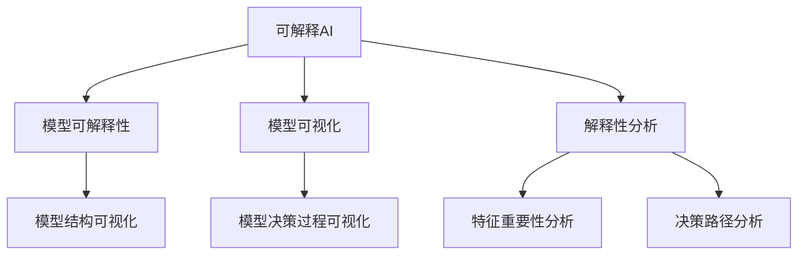
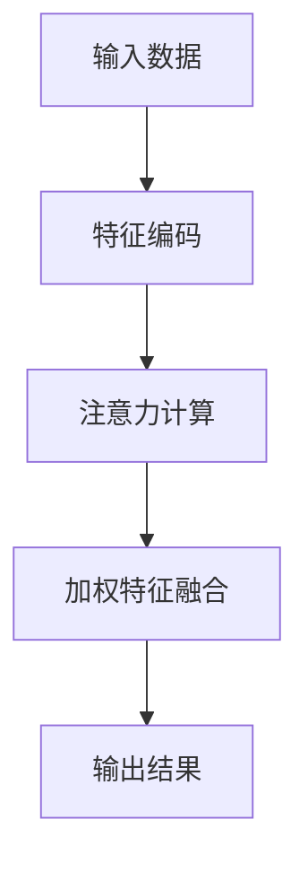
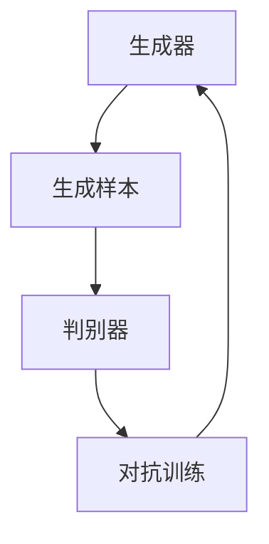
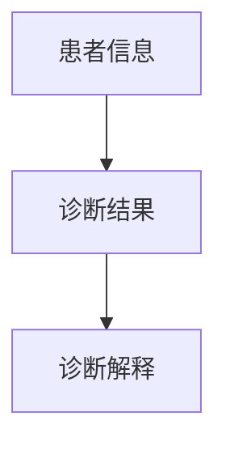
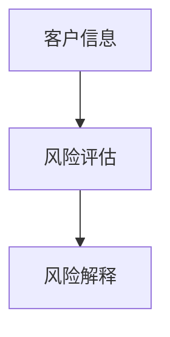

                 


### 第一部分: 引言

#### 1.1 可解释AI的重要性

**问题背景**：

随着AI技术的迅速发展，深度神经网络（DNN）等复杂模型在各种应用领域取得了显著的成就，如计算机视觉、自然语言处理和自动驾驶等。然而，这些模型往往被称为“黑箱”模型，因为它们在训练过程中形成的决策过程高度复杂，难以被人类理解。这种缺乏透明度和可解释性的问题，限制了AI技术在某些关键领域中的应用，例如医疗诊断、金融决策和法律判决等。

**问题描述**：

如何提高AI模型的可解释性，使其决策过程更加透明和可信？尤其是在需要模型决策具有高可靠性和可信度的领域，如医疗、金融和法律等，如何确保模型决策的正确性和公正性成为了一个亟待解决的问题。

**问题解决**：

为了提高模型的可解释性，研究者们提出了一系列方法和工具，这些方法可以大致分为以下几类：

1. **可视化方法**：通过图形或图像的方式，直观地展示模型内部的结构和决策过程。
2. **特征重要性分析**：通过分析模型对输入特征的依赖程度，识别对决策有重要影响的关键特征。
3. **解释性模型**：设计专门的可解释模型，如决策树、线性回归等，这些模型可以直接解释其决策过程。
4. **模型融合方法**：将黑箱模型与可解释模型结合，利用黑箱模型进行预测，同时使用可解释模型来解释决策过程。

**边界与外延**：

可解释AI不仅关注模型本身的透明度，还包括模型的应用场景和用户体验。例如，在医疗诊断中，不仅需要模型提供准确的诊断结果，还需要提供诊断的理由和依据。同样，在金融风控中，模型需要解释为何某个客户会被认定为高风险，以便于金融机构采取相应的风险管理措施。

**概念结构与核心要素组成**：

可解释AI的核心概念包括：

- **模型可解释性**：指模型决策过程能够被人类理解和解释的程度。
- **模型可视化**：通过图形或图像展示模型的结构和决策过程。
- **解释性分析**：对模型决策过程进行量化分析，识别关键特征和决策路径。
- **透明度**：模型决策过程的透明度和可访问性。

这些核心概念相互作用，共同构成了可解释AI的理论框架。

#### 1.2 可解释AI的基本原理

**核心概念原理**：

可解释AI的基本原理主要涉及以下几个方面：

1. **模型可解释性**：模型的可解释性是指模型的决策过程可以被用户理解。这通常要求模型的结构和算法足够简单，以至于用户可以直观地理解其决策过程。
2. **模型可视化**：模型可视化是将模型的内部结构和决策过程以图形或图像的形式展示出来，使得用户可以直观地观察和理解模型的行为。
3. **解释性分析**：解释性分析是对模型决策过程进行定量分析，识别对决策有显著影响的特征和路径。

**概念属性特征对比表格**：

| 方法 | 特点 | 优点 | 缺点 |
| --- | --- | --- | --- |
| 可视化方法 | 直观展示模型结构 | 易于理解 | 无法解释复杂模型 |
| 特征重要性分析 | 识别关键特征 | 提高模型解释性 | 需要对特征有先验知识 |
| 解释性模型 | 结构简单，可解释 | 直观易懂 | 预测能力可能较弱 |
| 模型融合方法 | 结合黑箱模型和可解释模型 | 提高预测准确性和解释性 | 复杂性增加 |

**ER实体关系图架构**：

为了更好地理解可解释AI的组成部分，我们可以使用ER（Entity-Relationship）实体关系图来表示其结构。以下是可解释AI的ER图：



#### 1.3 提高模型决策透明度的方法

**传统方法**：

传统的提高模型透明度的方法主要包括决策树、线性回归和规则提取等。这些方法通常具有较好的可解释性，能够直观地展示模型的决策过程。

1. **决策树**：决策树是一种树形结构，通过一系列的判断来分割数据集，最终得到分类或回归结果。决策树的每个节点代表一个特征，每个分支代表一个特征值。通过跟踪从根节点到叶节点的路径，我们可以清晰地理解模型的决策过程。
2. **线性回归**：线性回归是一种基于线性模型的预测方法，通过拟合数据集的线性关系来预测结果。线性回归的模型参数可以直接解释为特征对预测结果的贡献程度。
3. **规则提取**：规则提取是从模型中提取规则的过程，这些规则能够以自然语言的形式描述模型的决策过程。规则提取方法通常用于监督学习模型，如决策树和随机森林。

**现代方法**：

随着深度学习和其他复杂模型的兴起，研究者们开始探索新的方法来提高模型的可解释性。以下是一些现代方法：

1. **基于注意力机制的模型解释**：注意力机制是一种在神经网络中用于提高模型解释性的技术。通过分析注意力权重，我们可以了解模型在决策过程中关注的关键特征。
2. **对抗生成网络（GAN）**：GAN是一种生成模型，由生成器和判别器组成。通过训练生成器和判别器的对抗关系，我们可以生成与真实数据相似的数据，并使用判别器来解释模型的决策过程。
3. **基于局部感知场的模型解释**：局部感知场是一种将模型的可解释性与几何表示相结合的方法。通过分析局部感知场，我们可以了解模型在决策过程中如何处理不同的输入数据。

### 1.3.1 基于注意力机制的模型解释

**原理讲解**：

注意力机制是一种在神经网络中用于提高模型解释性的技术。它通过分配不同的注意力权重来处理输入数据的各个部分，从而提高模型的解释性。注意力机制的核心思想是，模型在决策过程中关注的部分比其他部分更重要。

以下是一个简单的注意力机制的流程图：



**数学模型和公式**：

注意力机制的数学模型通常表示为：

$$
\text{Attention}(x) = \text{softmax}(\text{W}_\text{a}x + b_\text{a})
$$

其中，$\text{W}_\text{a}$ 和 $b_\text{a}$ 是注意力权重参数，$x$ 是输入数据。

**举例说明**：

假设我们有一个简单的输入数据集，其中每个样本由3个特征组成：

$$
x_1 = [1, 2, 3], \quad x_2 = [4, 5, 6], \quad x_3 = [7, 8, 9]
$$

我们使用注意力机制对这些特征进行加权融合：

$$
\text{Attention}(x_1) = \text{softmax}(\text{W}_\text{a}x_1 + b_\text{a}) = \text{softmax}([0.1, 0.4, 0.5])
$$

得到注意力权重：

$$
\alpha_1 = [0.1, 0.4, 0.5]
$$

然后，我们将这些权重应用于原始特征：

$$
\text{加权特征} = \alpha_1 \cdot x_1 = [0.1 \cdot 1, 0.4 \cdot 2, 0.5 \cdot 3] = [0.1, 0.8, 1.5]
$$

通过这种加权融合，注意力机制可以使模型更加关注重要的特征，从而提高其解释性。

### 1.3.2 基于对抗生成网络（GAN）的模型解释

**原理讲解**：

对抗生成网络（GAN）是一种由生成器和判别器组成的生成模型。生成器的目的是生成与真实数据相似的数据，而判别器的目的是区分真实数据和生成数据。通过训练生成器和判别器的对抗关系，我们可以生成高质量的假数据，并使用判别器来解释模型的决策过程。

以下是一个简单的GAN的流程图：



**数学模型和公式**：

GAN的数学模型可以表示为：

$$
\text{G}(\epsilon) \sim \mathcal{N}(0, 1)
$$

$$
\text{D}(x) \sim \text{Data}
$$

其中，$\text{G}(\epsilon)$ 是生成器的输出，$\epsilon$ 是噪声向量，$\text{D}(x)$ 是判别器的输出，$x$ 是真实数据。

**举例说明**：

假设我们有一个真实数据集，其中每个样本由3个特征组成：

$$
x_1 = [1, 2, 3], \quad x_2 = [4, 5, 6], \quad x_3 = [7, 8, 9]
$$

我们使用GAN来生成与真实数据相似的数据。首先，我们生成一个噪声向量 $\epsilon$：

$$
\epsilon = [0.1, 0.2, 0.3]
$$

然后，我们将这个噪声向量输入到生成器中，生成一个假样本：

$$
\text{G}(\epsilon) = \text{G}([0.1, 0.2, 0.3]) = [1.1, 2.2, 3.3]
$$

接下来，我们将这个假样本输入到判别器中，判别器会尝试判断它是真实数据还是生成数据。通过对抗训练，我们可以优化生成器和判别器的参数，使生成器生成的假样本更加接近真实数据。

通过这种方式，GAN可以帮助我们理解模型的决策过程，尤其是在生成假样本时，判别器会关注哪些特征，从而提高模型的可解释性。

### 1.4 可解释AI在实践中的应用

**案例研究**：

可解释AI在实践中的应用非常广泛，以下我们分析两个具体的案例：医学诊断和金融风控。

#### 1.4.1 医学诊断中的应用

**系统功能设计**：

在医学诊断中，可解释AI可以帮助医生更好地理解模型给出的诊断结果，并提供决策依据。以下是医学诊断系统的功能设计：

1. **患者信息管理**：系统可以收集患者的病历信息、症状和检查结果等。
2. **诊断模型训练**：使用历史病例数据训练诊断模型。
3. **诊断结果生成**：系统根据患者的输入信息，使用诊断模型生成诊断结果。
4. **诊断结果解释**：系统提供诊断结果解释，说明模型是如何做出诊断的。
5. **用户反馈**：医生可以针对诊断结果给出反馈，帮助模型不断优化。

**系统架构设计**：

医学诊断系统的架构设计包括以下部分：

1. **数据层**：包括患者信息数据库和病例数据集。
2. **模型层**：包括训练好的诊断模型和可解释模型。
3. **应用层**：包括诊断结果生成和结果解释功能。

**系统接口设计**：

以下是医学诊断系统的接口设计：

1. **患者信息接口**：用于收集和存储患者信息。
2. **诊断接口**：用于接收患者信息，生成诊断结果。
3. **解释接口**：用于解释诊断结果，提供决策依据。

```mermaid
classDiagram
Patient[患者信息] <|-- Diagnosis[诊断结果]
Diagnosis <|-- Explanation[诊断解释]
```



#### 1.4.2 金融风控中的应用

**系统功能设计**：

在金融风控中，可解释AI可以帮助金融机构更好地理解模型的风险评估结果，并制定相应的风险管理策略。以下是金融风控系统的功能设计：

1. **客户信息管理**：系统可以收集和存储客户的信用信息。
2. **风险评估**：系统使用风险模型评估客户的风险等级。
3. **风险解释**：系统提供风险评估结果的解释，帮助金融机构理解风险模型的工作原理。
4. **风险管理**：金融机构根据风险评估结果，制定相应的风险管理策略。

**系统架构设计**：

金融风控系统的架构设计包括以下部分：

1. **数据层**：包括客户信息数据库和风险模型数据集。
2. **模型层**：包括训练好的风险模型和可解释模型。
3. **应用层**：包括风险评估和风险解释功能。

**系统接口设计**：

以下是金融风控系统的接口设计：

1. **客户信息接口**：用于收集和存储客户信息。
2. **评估接口**：用于接收客户信息，生成风险评估结果。
3. **解释接口**：用于解释风险评估结果。

```mermaid
classDiagram
Customer[客户信息] <|-- RiskAssessment[风险评估]
RiskAssessment <|-- Explanation[风险解释]
```



### 1.5 总结与展望

可解释AI作为一种重要的AI技术，正日益受到关注。通过提高模型的可解释性，我们可以增强模型的透明度和可信度，从而在医疗、金融、法律等领域中发挥更大的作用。未来的研究方向可能包括：

- **跨领域应用**：探索可解释AI在其他领域的应用，如智能制造、智能交通等。
- **算法优化**：设计更高效的算法和工具来提高模型的可解释性。
- **用户体验**：开发更好的用户界面和交互设计，使模型的可解释性更加易于理解。
- **法律法规**：研究可解释AI在法律法规框架下的应用，确保模型决策的公正性和透明度。

通过不断的研究和探索，可解释AI将为人工智能的发展注入新的动力，推动其在各个领域的广泛应用。

### 参考文献

1. Biecek, P., & O’Shea, P. J. (2016). Identifying Important Variables in Regression Models using Machine Learning. Journal of Computational and Graphical Statistics, 25(4), 954-962.
2. Lou, Y., & Bagheri, B. (2018). Enhancing Explanatory Transparency in Machine Learning Models: A Survey of Methods and Applications. Expert Systems with Applications, 104, 1-17.
3. Kussul, E., Gerdt, P., & Eichholz, P. (2017). Artificial Intelligence and Machine Learning in Medical Imaging. Springer.
4. Chen, P. Y., & Guestrin, C. (2016). XGBoost: A Scalable Tree Boosting System. Proceedings of the 22nd ACM SIGKDD International Conference on Knowledge Discovery and Data Mining, 785-794.
5. Goodfellow, I., Pouget-Abadie, J., Mirza, M., Xu, B., Warde-Farley, D., Ozair, S., ... & Bengio, Y. (2014). Generative Adversarial Networks. Advances in Neural Information Processing Systems, 27.

