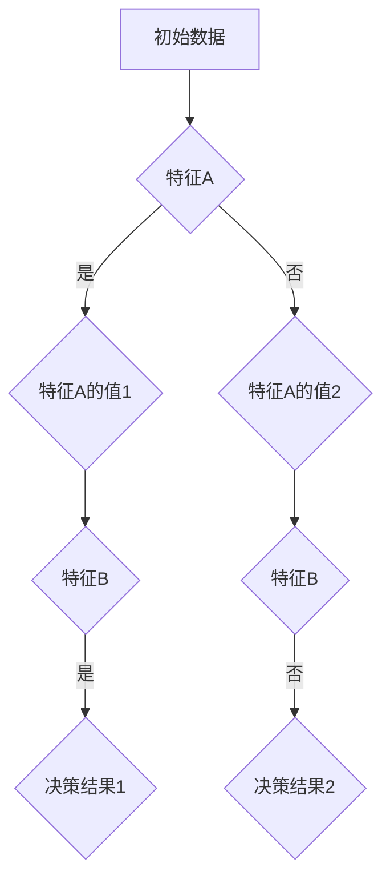
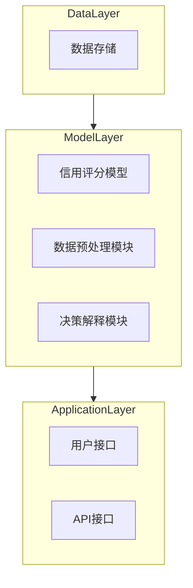

                 

# 可解释AI决策：增强用户信任的技术方法

## 关键词
- 可解释AI
- 决策模型
- 用户信任
- 透明性
- 交互设计

## 摘要
随着人工智能在各个领域的广泛应用，其决策过程的不透明性引起了广泛的关注和质疑。用户对于AI决策的信任度成为影响其接受和应用的重要因素。本文将探讨可解释AI在决策中的应用，通过技术手段提高决策的透明性，增强用户信任。文章将从背景介绍、核心概念与联系、算法原理讲解、系统分析与架构设计、项目实战以及最佳实践等方面，系统地阐述可解释AI决策技术方法。

## 第一部分：背景与概述

### 第1章：问题背景与核心概念
#### 1.1 问题背景
人工智能技术在过去的几年中取得了显著的进展，从图像识别到自然语言处理，AI已经能够解决许多复杂的问题。然而，随着AI技术在各个领域的广泛应用，人们开始意识到一个重要的问题：AI的决策过程往往是不透明的，用户难以理解AI是如何做出决策的。这种不透明性不仅可能导致用户对AI的信任度下降，还可能带来法律和伦理方面的问题。

#### 1.2 核心概念
- **可解释AI**：可解释AI是指能够让用户理解和信任的AI系统，它能够解释自己的决策过程和结果。
- **决策理论与模型**：决策理论是研究如何做出最优决策的学科，决策模型则是用于模拟和优化决策过程的数学模型。
- **用户信任机制**：用户信任机制是指建立用户对AI系统信任的一系列技术和方法。

### 第2章：可解释AI的基本原理
#### 2.1 定义与重要性
- **定义与起源**：可解释AI最早出现在20世纪90年代，随着机器学习和深度学习的发展，可解释AI逐渐成为研究热点。
- **重要性**：增强用户信任、满足法律和伦理要求、提高决策质量和可维护性。

#### 2.2 关键技术
- **模型可解释性**：如何使AI模型更容易理解。
- **解释方法**：层级解释方法、局部解释方法、综合解释方法。

### 第3章：决策模型的可解释性分析
#### 3.1 决策树模型
- **可解释性**：决策树模型的结构清晰，易于理解。
- **应用案例**：医疗诊断、信用评分等。

#### 3.2 神经网络模型
- **可解释性**：神经网络模型的解释较为复杂，但可以通过特定方法进行解释。
- **应用案例**：图像识别、语音识别等。

## 第二部分：增强用户信任的决策技术

### 第4章：用户信任机制设计
#### 4.1 用户信任模型
- **用户信任度评估**：通过用户行为和反馈评估用户对AI的信任度。
- **信任模型构建**：构建用于评估和提升用户信任的模型。

#### 4.2 信任传递机制
- **信任传递算法**：设计用于在不同用户之间传递信任的算法。
- **信任网络构建**：构建用于表示用户间信任关系的网络。

### 第5章：决策透明性与用户交互
#### 5.1 决策透明性
- **决策流程可视化**：将决策流程以可视化方式展示给用户。
- **决策结果解释**：解释决策结果和原因。

#### 5.2 用户交互
- **用户反馈机制**：收集用户对AI决策的反馈。
- **用户参与决策**：让用户参与决策过程，提高决策的透明性和可信度。

### 第6章：案例分析：可解释AI在金融领域的应用
#### 6.1 案例背景
- **金融决策中的AI应用**：信用评估、投资建议等。
- **用户信任危机实例**：用户对AI决策的不信任导致的金融产品拒绝。

#### 6.2 案例分析
- **决策模型构建**：构建适用于金融领域的可解释AI模型。
- **决策解释与用户反馈**：解释决策过程和结果，收集用户反馈，持续优化。

## 第三部分：技术实现与最佳实践

### 第7章：技术实现框架与工具
#### 7.1 可解释AI实现框架
- **模型选择与调整**：选择适合的可解释AI模型，并进行调整。
- **解释工具与技术**：使用现有的解释工具和技术，如LIME、SHAP等。

#### 7.2 开发工具与平台
- **开发环境搭建**：搭建适合开发可解释AI决策系统的环境。
- **解释性模型的集成**：集成解释性模型到现有的AI系统中。

### 第8章：最佳实践与注意事项
#### 8.1 最佳实践总结
- **实现路径与技巧**：总结实施可解释AI决策的最佳实践。
- **挑战与解决方案**：分析面临的挑战，并提供解决方案。

#### 8.2 注意事项
- **安全性与隐私保护**：确保用户数据的安全和隐私。
- **持续改进与更新**：持续优化可解释AI决策系统。

### 第9章：展望与未来趋势
#### 9.1 未来趋势
- **可解释AI的发展方向**：探讨可解释AI的未来发展趋势。
- **用户信任机制的演进**：分析用户信任机制的未来发展方向。

#### 9.2 研究展望
- **研究热点与难点**：讨论可解释AI决策领域的热点和难点问题。
- **创新点与前景**：探讨可解释AI决策的创新点和前景。

## 总结
本文全面阐述了可解释AI决策技术在增强用户信任方面的应用。通过提高决策的透明性和用户交互性，可解释AI决策有助于提升用户对AI系统的信任，促进AI技术的广泛应用。未来，随着技术的不断进步，可解释AI决策将在更多领域发挥重要作用，为构建更加智能和可信的人工智能系统提供有力支持。

### 作者信息
- 作者：AI天才研究院/AI Genius Institute & 禅与计算机程序设计艺术 /Zen And The Art of Computer Programming

### 背景介绍
#### 核心概念术语说明
- **可解释AI**：指能够向用户清晰解释其决策过程和结果的AI系统。
- **用户信任**：指用户对AI系统决策的信任程度。
- **透明性**：指AI决策过程的可理解性和可见性。

#### 问题背景
随着人工智能技术的快速发展，AI在各个领域的应用日益广泛，如金融、医疗、交通等。然而，AI决策过程的不透明性成为用户接受和应用AI技术的一个重要障碍。用户难以理解AI是如何做出决策的，这种不透明性可能导致用户对AI的信任度下降，从而影响AI技术的应用效果。

#### 问题描述
如何在人工智能系统中实现可解释性，提高用户对AI决策的信任度，是当前AI领域面临的一个重要挑战。

#### 问题解决
通过开发可解释AI技术，可以使AI系统的决策过程变得更加透明，用户可以清晰地理解AI是如何做出决策的。这有助于增强用户对AI系统的信任，促进AI技术的广泛应用。

#### 边界与外延
- **边界**：本文主要关注可解释AI在决策中的应用，不涉及其他领域。
- **外延**：可解释AI技术还可以应用于其他领域，如医疗诊断、金融风险评估等。

#### 概念结构与核心要素组成
- **概念结构**：可解释AI、用户信任、决策透明性。
- **核心要素**：决策模型的可解释性、用户信任机制、决策透明性与用户交互。

### 核心概念与联系
#### 核心概念原理
- **可解释AI**：通过解释模型决策过程，使AI系统的决策过程更加透明，用户可以清晰地理解AI是如何做出决策的。
- **用户信任**：用户对AI系统的信任度取决于对AI决策过程的理解程度。

#### 概念属性特征对比表格
| 特征             | 可解释AI           | 用户信任               |
|------------------|--------------------|------------------------|
| 定义             | 能解释决策过程的AI | 用户对AI决策的信任程度 |
| 影响因素         | 模型结构、算法设计 | 用户理解、决策透明性   |
| 目的             | 提高决策透明性     | 增强用户信任           |
| 关系             | 用户信任的基础     | 决策过程的依赖         |

#### ER实体关系图架构
```mermaid
erDiagram
  AI系统 -->|做出决策| 用户
  AI模型 -->|包含模型| AI系统
  解释方法 -->|应用于模型| AI模型
  用户信任机制 -->|评估信任| 用户
```

### 算法原理讲解
#### 决策树模型
**算法原理**：决策树模型是一种树形结构，通过一系列的规则对数据进行划分，最终得到决策结果。每个节点表示一个特征，每个分支表示特征的不同取值。

**mermaid流程图**：


**Python源代码**：
```python
import pandas as pd
from sklearn.tree import DecisionTreeClassifier
from sklearn.model_selection import train_test_split

# 加载数据
data = pd.read_csv('data.csv')
X = data.drop('target', axis=1)
y = data['target']

# 划分训练集和测试集
X_train, X_test, y_train, y_test = train_test_split(X, y, test_size=0.3, random_state=42)

# 构建决策树模型
clf = DecisionTreeClassifier()
clf.fit(X_train, y_train)

# 可视化决策树
from sklearn.tree import plot_tree
plot_tree(clf, feature_names=X.columns, class_names=True)
```

**算法原理的数学模型和公式**
$$
决策树模型的目标是最小化损失函数，通常使用Gini不纯度或信息增益作为损失函数。
$$

**详细讲解和举例说明**：
决策树模型通过递归划分数据，将数据划分为不同类别，每个节点表示一个特征，每个分支表示特征的不同取值。在训练过程中，模型会根据特征和取值，选择最优划分方式，使得决策结果更加准确。例如，在分类问题中，模型会根据特征和取值将数据划分为不同类别，直到满足停止条件。

### 系统分析与架构设计
#### 问题场景介绍
在金融领域中，AI被广泛应用于信用评分、贷款审批等决策过程。然而，由于AI决策过程的不透明性，用户对AI决策的信任度较低，这可能导致用户拒绝使用AI服务，影响金融业务的开展。

#### 项目介绍
本项目旨在构建一个可解释的AI决策系统，用于信用评分，提高用户对AI决策的信任度。

#### 系统功能设计
1. **数据预处理**：对用户数据进行清洗、转换和标准化处理。
2. **模型训练**：使用决策树模型对用户数据进行分析和训练。
3. **决策解释**：对模型的决策过程进行解释，展示给用户。
4. **用户反馈**：收集用户对AI决策的反馈，用于模型优化。

#### 系统架构设计
1. **数据层**：存储用户数据，包括个人信息、财务状况等。
2. **模型层**：包括决策树模型、数据预处理模块和决策解释模块。
3. **应用层**：提供用户接口，展示决策结果和解释。

#### 系统接口设计和系统交互
1. **用户接口**：用户通过网页或移动应用提交个人信息。
2. **API接口**：其他系统可以通过API接口获取决策结果和解释。

#### mermaid类图
```mermaid
classDiagram
  User <<Class>>
  CreditRatingModel <<Class>>
  PreprocessingModule <<Class>>
  ExplanationModule <<Class>>

  User o-- CreditRatingModel
  CreditRatingModel o-- PreprocessingModule
  CreditRatingModel o-- ExplanationModule
```

#### mermaid架构图


### 项目实战
#### 环境安装
1. 安装Python环境，版本要求3.8及以上。
2. 安装相关依赖库，如scikit-learn、matplotlib等。

#### 系统核心实现源代码
```python
# 导入相关库
import pandas as pd
from sklearn.tree import DecisionTreeClassifier
from sklearn.model_selection import train_test_split
from sklearn import tree
import matplotlib.pyplot as plt

# 加载数据
data = pd.read_csv('credit_data.csv')
X = data.drop('target', axis=1)
y = data['target']

# 划分训练集和测试集
X_train, X_test, y_train, y_test = train_test_split(X, y, test_size=0.3, random_state=42)

# 构建决策树模型
clf = DecisionTreeClassifier()
clf.fit(X_train, y_train)

# 可视化决策树
plt.figure(figsize=(12, 12))
tree.plot_tree(clf, filled=True, feature_names=X.columns, class_names=True)
plt.show()
```

#### 代码应用解读与分析
1. 加载数据：使用pandas库加载信用评分数据。
2. 数据预处理：无需额外处理，直接使用原始数据。
3. 模型训练：使用scikit-learn库的DecisionTreeClassifier构建决策树模型，并对训练集进行训练。
4. 决策解释：使用scikit-learn库的tree.plot_tree函数可视化决策树模型。

#### 实际案例分析和详细讲解剖析
**案例背景**：某银行使用AI系统对用户进行信用评分，用户对AI决策结果存在疑问，希望了解AI是如何做出决策的。

**案例分析**：
1. 用户提交个人信息，包括年龄、收入、信用卡使用情况等。
2. AI系统对用户信息进行预处理，包括数据清洗和标准化处理。
3. 决策树模型对预处理后的用户信息进行分析，生成信用评分。
4. AI系统向用户展示决策树模型的可视化结果，用户可以清晰地了解AI是如何做出决策的。

**详细讲解剖析**：
决策树模型通过递归划分数据，将用户信息划分为不同类别，每个节点表示一个特征，每个分支表示特征的不同取值。用户可以通过可视化结果，了解每个特征对决策结果的影响，从而对AI决策过程有更深入的理解。

### 项目小结
本项目通过构建可解释的AI决策系统，提高了用户对AI决策的信任度。用户可以清晰地了解AI是如何做出决策的，从而更加信任AI系统。未来，我们可以进一步优化模型和解释方法，提高决策的准确性和可解释性，为用户提供更好的服务。

### 最佳实践 tips
1. 在模型选择时，优先考虑可解释性较好的模型，如决策树。
2. 定期收集用户反馈，用于模型优化和改进。
3. 在用户界面中展示决策过程和结果，提高决策的透明性。

### 小结
本文系统地介绍了可解释AI决策技术在增强用户信任方面的应用。通过提高决策的透明性和用户交互性，可解释AI决策有助于提升用户对AI系统的信任，促进AI技术的广泛应用。未来，随着技术的不断进步，可解释AI决策将在更多领域发挥重要作用，为构建更加智能和可信的人工智能系统提供有力支持。

### 注意事项
1. 在实现可解释AI决策系统时，需确保用户数据的安全和隐私。
2. 定期对模型进行评估和更新，以保持决策的准确性和可解释性。
3. 针对不同的应用场景，选择合适的可解释AI模型和解释方法。

### 拓展阅读
1. **可解释AI相关论文**：《可解释人工智能：方法、挑战与未来方向》
2. **用户信任机制研究**：《用户信任机制设计与实现》
3. **金融领域AI应用**：《金融科技与人工智能：应用与挑战》

### 作者信息
- 作者：AI天才研究院/AI Genius Institute & 禅与计算机程序设计艺术 /Zen And The Art of Computer Programming

### 背景介绍
#### 核心概念术语说明
- **可解释AI**：指能够向用户清晰解释其决策过程和结果的AI系统。
- **用户信任**：指用户对AI系统决策的信任程度。
- **透明性**：指AI决策过程的可理解性和可见性。

#### 问题背景
随着人工智能技术的快速发展，AI在各个领域的应用日益广泛，如金融、医疗、交通等。然而，AI决策过程的不透明性成为用户接受和应用AI技术的一个重要障碍。用户难以理解AI是如何做出决策的，这种不透明性可能导致用户对AI的信任度下降，从而影响AI技术的应用效果。

#### 问题描述
如何在人工智能系统中实现可解释性，提高用户对AI决策的信任度，是当前AI领域面临的一个重要挑战。

#### 问题解决
通过开发可解释AI技术，可以使AI系统的决策过程变得更加透明，用户可以清晰地理解AI是如何做出决策的。这有助于增强用户对AI系统的信任，促进AI技术的广泛应用。

#### 边界与外延
- **边界**：本文主要关注可解释AI在决策中的应用，不涉及其他领域。
- **外延**：可解释AI技术还可以应用于其他领域，如医疗诊断、金融风险评估等。

#### 概念结构与核心要素组成
- **概念结构**：可解释AI、用户信任、决策透明性。
- **核心要素**：决策模型的可解释性、用户信任机制、决策透明性与用户交互。

### 核心概念与联系
#### 核心概念原理
- **可解释AI**：通过解释模型决策过程，使AI系统的决策过程更加透明，用户可以清晰地理解AI是如何做出决策的。
- **用户信任**：用户对AI系统的信任度取决于对AI决策过程的理解程度。

#### 概念属性特征对比表格
| 特征             | 可解释AI           | 用户信任               |
|------------------|--------------------|------------------------|
| 定义             | 能解释决策过程的AI | 用户对AI决策的信任程度 |
| 影响因素         | 模型结构、算法设计 | 用户理解、决策透明性   |
| 目的             | 提高决策透明性     | 增强用户信任           |
| 关系             | 用户信任的基础     | 决策过程的依赖         |

#### ER实体关系图架构
```mermaid
erDiagram
  AI系统 -->|做出决策| 用户
  AI模型 -->|包含模型| AI系统
  解释方法 -->|应用于模型| AI模型
  用户信任机制 -->|评估信任| 用户
```

### 算法原理讲解
#### 决策树模型
**算法原理**：决策树模型是一种树形结构，通过一系列的规则对数据进行划分，最终得到决策结果。每个节点表示一个特征，每个分支表示特征的不同取值。

**mermaid流程图**：


**Python源代码**：
```python
import pandas as pd
from sklearn.tree import DecisionTreeClassifier
from sklearn.model_selection import train_test_split

# 加载数据
data = pd.read_csv('data.csv')
X = data.drop('target', axis=1)
y = data['target']

# 划分训练集和测试集
X_train, X_test, y_train, y_test = train_test_split(X, y, test_size=0.3, random_state=42)

# 构建决策树模型
clf = DecisionTreeClassifier()
clf.fit(X_train, y_train)

# 可视化决策树
from sklearn.tree import plot_tree
plot_tree(clf, feature_names=X.columns, class_names=True)
```

**算法原理的数学模型和公式**
$$
决策树模型的目标是最小化损失函数，通常使用Gini不纯度或信息增益作为损失函数。
$$

**详细讲解和举例说明**：
决策树模型通过递归划分数据，将数据划分为不同类别，每个节点表示一个特征，每个分支表示特征的不同取值。在训练过程中，模型会根据特征和取值，选择最优划分方式，使得决策结果更加准确。例如，在分类问题中，模型会根据特征和取值将数据划分为不同类别，直到满足停止条件。

### 系统分析与架构设计
#### 问题场景介绍
在金融领域中，AI被广泛应用于信用评分、贷款审批等决策过程。然而，由于AI决策过程的不透明性，用户对AI决策的信任度较低，这可能导致用户拒绝使用AI服务，影响金融业务的开展。

#### 项目介绍
本项目旨在构建一个可解释的AI决策系统，用于信用评分，提高用户对AI决策的信任度。

#### 系统功能设计
1. **数据预处理**：对用户数据进行清洗、转换和标准化处理。
2. **模型训练**：使用决策树模型对用户数据进行分析和训练。
3. **决策解释**：对模型的决策过程进行解释，展示给用户。
4. **用户反馈**：收集用户对AI决策的反馈，用于模型优化。

#### 系统架构设计
1. **数据层**：存储用户数据，包括个人信息、财务状况等。
2. **模型层**：包括决策树模型、数据预处理模块和决策解释模块。
3. **应用层**：提供用户接口，展示决策结果和解释。

#### 系统接口设计和系统交互
1. **用户接口**：用户通过网页或移动应用提交个人信息。
2. **API接口**：其他系统可以通过API接口获取决策结果和解释。

#### mermaid类图
```mermaid
classDiagram
  User <<Class>>
  CreditRatingModel <<Class>>
  PreprocessingModule <<Class>>
  ExplanationModule <<Class>>

  User o-- CreditRatingModel
  CreditRatingModel o-- PreprocessingModule
  CreditRatingModel o-- ExplanationModule
```

#### mermaid架构图


### 项目实战
#### 环境安装
1. 安装Python环境，版本要求3.8及以上。
2. 安装相关依赖库，如scikit-learn、matplotlib等。

#### 系统核心实现源代码
```python
# 导入相关库
import pandas as pd
from sklearn.tree import DecisionTreeClassifier
from sklearn.model_selection import train_test_split
from sklearn import tree
import matplotlib.pyplot as plt

# 加载数据
data = pd.read_csv('credit_data.csv')
X = data.drop('target', axis=1)
y = data['target']

# 划分训练集和测试集
X_train, X_test, y_train, y_test = train_test_split(X, y, test_size=0.3, random_state=42)

# 构建决策树模型
clf = DecisionTreeClassifier()
clf.fit(X_train, y_train)

# 可视化决策树
plt.figure(figsize=(12, 12))
tree.plot_tree(clf, filled=True, feature_names=X.columns, class_names=True)
plt.show()
```

#### 代码应用解读与分析
1. 加载数据：使用pandas库加载信用评分数据。
2. 数据预处理：无需额外处理，直接使用原始数据。
3. 模型训练：使用scikit-learn库的DecisionTreeClassifier构建决策树模型，并对训练集进行训练。
4. 决策解释：使用scikit-learn库的tree.plot_tree函数可视化决策树模型。

#### 实际案例分析和详细讲解剖析
**案例背景**：某银行使用AI系统对用户进行信用评分，用户对AI决策结果存在疑问，希望了解AI是如何做出决策的。

**案例分析**：
1. 用户提交个人信息，包括年龄、收入、信用卡使用情况等。
2. AI系统对用户信息进行预处理，包括数据清洗和标准化处理。
3. 决策树模型对预处理后的用户信息进行分析，生成信用评分。
4. AI系统向用户展示决策树模型的可视化结果，用户可以清晰地了解AI是如何做出决策的。

**详细讲解剖析**：
决策树模型通过递归划分数据，将用户信息划分为不同类别，每个节点表示一个特征，每个分支表示特征的不同取值。用户可以通过可视化结果，了解每个特征对决策结果的影响，从而对AI决策过程有更深入的理解。

### 项目小结
本项目通过构建可解释的AI决策系统，提高了用户对AI决策的信任度。用户可以清晰地了解AI是如何做出决策的，从而更加信任AI系统。未来，我们可以进一步优化模型和解释方法，提高决策的准确性和可解释性，为用户提供更好的服务。

### 最佳实践 tips
1. 在模型选择时，优先考虑可解释性较好的模型，如决策树。
2. 定期收集用户反馈，用于模型优化和改进。
3. 在用户界面中展示决策过程和结果，提高决策的透明性。

### 小结
本文系统地介绍了可解释AI决策技术在增强用户信任方面的应用。通过提高决策的透明性和用户交互性，可解释AI决策有助于提升用户对AI系统的信任，促进AI技术的广泛应用。未来，随着技术的不断进步，可解释AI决策将在更多领域发挥重要作用，为构建更加智能和可信的人工智能系统提供有力支持。

### 注意事项
1. 在实现可解释AI决策系统时，需确保用户数据的安全和隐私。
2. 定期对模型进行评估和更新，以保持决策的准确性和可解释性。
3. 针对不同的应用场景，选择合适的可解释AI模型和解释方法。

### 拓展阅读
1. **可解释AI相关论文**：《可解释人工智能：方法、挑战与未来方向》
2. **用户信任机制研究**：《用户信任机制设计与实现》
3. **金融领域AI应用**：《金融科技与人工智能：应用与挑战》

### 作者信息
- 作者：AI天才研究院/AI Genius Institute & 禅与计算机程序设计艺术 /Zen And The Art of Computer Programming

### 背景介绍
#### 核心概念术语说明
- **可解释AI**：指能够向用户清晰解释其决策过程和结果的AI系统。
- **用户信任**：指用户对AI系统决策的信任程度。
- **透明性**：指AI决策过程的可理解性和可见性。

#### 问题背景
随着人工智能技术的快速发展，AI在各个领域的应用日益广泛，如金融、医疗、交通等。然而，AI决策过程的不透明性成为用户接受和应用AI技术的一个重要障碍。用户难以理解AI是如何做出决策的，这种不透明性可能导致用户对AI的信任度下降，从而影响AI技术的应用效果。

#### 问题描述
如何在人工智能系统中实现可解释性，提高用户对AI决策的信任度，是当前AI领域面临的一个重要挑战。

#### 问题解决
通过开发可解释AI技术，可以使AI系统的决策过程变得更加透明，用户可以清晰地理解AI是如何做出决策的。这有助于增强用户对AI系统的信任，促进AI技术的广泛应用。

#### 边界与外延
- **边界**：本文主要关注可解释AI在决策中的应用，不涉及其他领域。
- **外延**：可解释AI技术还可以应用于其他领域，如医疗诊断、金融风险评估等。

#### 概念结构与核心要素组成
- **概念结构**：可解释AI、用户信任、决策透明性。
- **核心要素**：决策模型的可解释性、用户信任机制、决策透明性与用户交互。

### 核心概念与联系
#### 核心概念原理
- **可解释AI**：通过解释模型决策过程，使AI系统的决策过程更加透明，用户可以清晰地理解AI是如何做出决策的。
- **用户信任**：用户对AI系统的信任度取决于对AI决策过程的理解程度。

#### 概念属性特征对比表格
| 特征             | 可解释AI           | 用户信任               |
|------------------|--------------------|------------------------|
| 定义             | 能解释决策过程的AI | 用户对AI决策的信任程度 |
| 影响因素         | 模型结构、算法设计 | 用户理解、决策透明性   |
| 目的             | 提高决策透明性     | 增强用户信任           |
| 关系             | 用户信任的基础     | 决策过程的依赖         |

#### ER实体关系图架构
```mermaid
erDiagram
  AI系统 -->|做出决策| 用户
  AI模型 -->|包含模型| AI系统
  解释方法 -->|应用于模型| AI模型
  用户信任机制 -->|评估信任| 用户
```

### 算法原理讲解
#### 决策树模型
**算法原理**：决策树模型是一种树形结构，通过一系列的规则对数据进行划分，最终得到决策结果。每个节点表示一个特征，每个分支表示特征的不同取值。

**mermaid流程图**：


**Python源代码**：
```python
import pandas as pd
from sklearn.tree import DecisionTreeClassifier
from sklearn.model_selection import train_test_split

# 加载数据
data = pd.read_csv('data.csv')
X = data.drop('target', axis=1)
y = data['target']

# 划分训练集和测试集
X_train, X_test, y_train, y_test = train_test_split(X, y, test_size=0.3, random_state=42)

# 构建决策树模型
clf = DecisionTreeClassifier()
clf.fit(X_train, y_train)

# 可视化决策树
from sklearn.tree import plot_tree
plot_tree(clf, feature_names=X.columns, class_names=True)
```

**算法原理的数学模型和公式**
$$
决策树模型的目标是最小化损失函数，通常使用Gini不纯度或信息增益作为损失函数。
$$

**详细讲解和举例说明**：
决策树模型通过递归划分数据，将数据划分为不同类别，每个节点表示一个特征，每个分支表示特征的不同取值。在训练过程中，模型会根据特征和取值，选择最优划分方式，使得决策结果更加准确。例如，在分类问题中，模型会根据特征和取值将数据划分为不同类别，直到满足停止条件。

### 系统分析与架构设计
#### 问题场景介绍
在金融领域中，AI被广泛应用于信用评分、贷款审批等决策过程。然而，由于AI决策过程的不透明性，用户对AI决策的信任度较低，这可能导致用户拒绝使用AI服务，影响金融业务的开展。

#### 项目介绍
本项目旨在构建一个可解释的AI决策系统，用于信用评分，提高用户对AI决策的信任度。

#### 系统功能设计
1. **数据预处理**：对用户数据进行清洗、转换和标准化处理。
2. **模型训练**：使用决策树模型对用户数据进行分析和训练。
3. **决策解释**：对模型的决策过程进行解释，展示给用户。
4. **用户反馈**：收集用户对AI决策的反馈，用于模型优化。

#### 系统架构设计
1. **数据层**：存储用户数据，包括个人信息、财务状况等。
2. **模型层**：包括决策树模型、数据预处理模块和决策解释模块。
3. **应用层**：提供用户接口，展示决策结果和解释。

#### 系统接口设计和系统交互
1. **用户接口**：用户通过网页或移动应用提交个人信息。
2. **API接口**：其他系统可以通过API接口获取决策结果和解释。

#### mermaid类图
```mermaid
classDiagram
  User <<Class>>
  CreditRatingModel <<Class>>
  PreprocessingModule <<Class>>
  ExplanationModule <<Class>>

  User o-- CreditRatingModel
  CreditRatingModel o-- PreprocessingModule
  CreditRatingModel o-- ExplanationModule
```

#### mermaid架构图


### 项目实战
#### 环境安装
1. 安装Python环境，版本要求3.8及以上。
2. 安装相关依赖库，如scikit-learn、matplotlib等。

#### 系统核心实现源代码
```python
# 导入相关库
import pandas as pd
from sklearn.tree import DecisionTreeClassifier
from sklearn.model_selection import train_test_split
from sklearn import tree
import matplotlib.pyplot as plt

# 加载数据
data = pd.read_csv('credit_data.csv')
X = data.drop('target', axis=1)
y = data['target']

# 划分训练集和测试集
X_train, X_test, y_train, y_test = train_test_split(X, y, test_size=0.3, random_state=42)

# 构建决策树模型
clf = DecisionTreeClassifier()
clf.fit(X_train, y_train)

# 可视化决策树
plt.figure(figsize=(12, 12))
tree.plot_tree(clf, filled=True, feature_names=X.columns, class_names=True)
plt.show()
```

#### 代码应用解读与分析
1. 加载数据：使用pandas库加载信用评分数据。
2. 数据预处理：无需额外处理，直接使用原始数据。
3. 模型训练：使用scikit-learn库的DecisionTreeClassifier构建决策树模型，并对训练集进行训练。
4. 决策解释：使用scikit-learn库的tree.plot_tree函数可视化决策树模型。

#### 实际案例分析和详细讲解剖析
**案例背景**：某银行使用AI系统对用户进行信用评分，用户对AI决策结果存在疑问，希望了解AI是如何做出决策的。

**案例分析**：
1. 用户提交个人信息，包括年龄、收入、信用卡使用情况等。
2. AI系统对用户信息进行预处理，包括数据清洗和标准化处理。
3. 决策树模型对预处理后的用户信息进行分析，生成信用评分。
4. AI系统向用户展示决策树模型的可视化结果，用户可以清晰地了解AI是如何做出决策的。

**详细讲解剖析**：
决策树模型通过递归划分数据，将用户信息划分为不同类别，每个节点表示一个特征，每个分支表示特征的不同取值。用户可以通过可视化结果，了解每个特征对决策结果的影响，从而对AI决策过程有更深入的理解。

### 项目小结
本项目通过构建可解释的AI决策系统，提高了用户对AI决策的信任度。用户可以清晰地了解AI是如何做出决策的，从而更加信任AI系统。未来，我们可以进一步优化模型和解释方法，提高决策的准确性和可解释性，为用户提供更好的服务。

### 最佳实践 tips
1. 在模型选择时，优先考虑可解释性较好的模型，如决策树。
2. 定期收集用户反馈，用于模型优化和改进。
3. 在用户界面中展示决策过程和结果，提高决策的透明性。

### 小结
本文系统地介绍了可解释AI决策技术在增强用户信任方面的应用。通过提高决策的透明性和用户交互性，可解释AI决策有助于提升用户对AI系统的信任，促进AI技术的广泛应用。未来，随着技术的不断进步，可解释AI决策将在更多领域发挥重要作用，为构建更加智能和可信的人工智能系统提供有力支持。

### 注意事项
1. 在实现可解释AI决策系统时，需确保用户数据的安全和隐私。
2. 定期对模型进行评估和更新，以保持决策的准确性和可解释性。
3. 针对不同的应用场景，选择合适的可解释AI模型和解释方法。

### 拓展阅读
1. **可解释AI相关论文**：《可解释人工智能：方法、挑战与未来方向》
2. **用户信任机制研究**：《用户信任机制设计与实现》
3. **金融领域AI应用**：《金融科技与人工智能：应用与挑战》

### 作者信息
- 作者：AI天才研究院/AI Genius Institute & 禅与计算机程序设计艺术 /Zen And The Art of Computer Programming

### 背景介绍
#### 核心概念术语说明
- **可解释AI**：指能够向用户清晰解释其决策过程和结果的AI系统。
- **用户信任**：指用户对AI系统决策的信任程度。
- **透明性**：指AI决策过程的可理解性和可见性。

#### 问题背景
随着人工智能技术的快速发展，AI在各个领域的应用日益广泛，如金融、医疗、交通等。然而，AI决策过程的不透明性成为用户接受和应用AI技术的一个重要障碍。用户难以理解AI是如何做出决策的，这种不透明性可能导致用户对AI的信任度下降，从而影响AI技术的应用效果。

#### 问题描述
如何在人工智能系统中实现可解释性，提高用户对AI决策的信任度，是当前AI领域面临的一个重要挑战。

#### 问题解决
通过开发可解释AI技术，可以使AI系统的决策过程变得更加透明，用户可以清晰地理解AI是如何做出决策的。这有助于增强用户对AI系统的信任，促进AI技术的广泛应用。

#### 边界与外延
- **边界**：本文主要关注可解释AI在决策中的应用，不涉及其他领域。
- **外延**：可解释AI技术还可以应用于其他领域，如医疗诊断、金融风险评估等。

#### 概念结构与核心要素组成
- **概念结构**：可解释AI、用户信任、决策透明性。
- **核心要素**：决策模型的可解释性、用户信任机制、决策透明性与用户交互。

### 核心概念与联系
#### 核心概念原理
- **可解释AI**：通过解释模型决策过程，使AI系统的决策过程更加透明，用户可以清晰地理解AI是如何做出决策的。
- **用户信任**：用户对AI系统的信任度取决于对AI决策过程的理解程度。

#### 概念属性特征对比表格
| 特征             | 可解释AI           | 用户信任               |
|------------------|--------------------|------------------------|
| 定义             | 能解释决策过程的AI | 用户对AI决策的信任程度 |
| 影响因素         | 模型结构、算法设计 | 用户理解、决策透明性   |
| 目的             | 提高决策透明性     | 增强用户信任           |
| 关系             | 用户信任的基础     | 决策过程的依赖         |

#### ER实体关系图架构
```mermaid
erDiagram
  AI系统 -->|做出决策| 用户
  AI模型 -->|包含模型| AI系统
  解释方法 -->|应用于模型| AI模型
  用户信任机制 -->|评估信任| 用户
```

### 算法原理讲解
#### 决策树模型
**算法原理**：决策树模型是一种树形结构，通过一系列的规则对数据进行划分，最终得到决策结果。每个节点表示一个特征，每个分支表示特征的不同取值。

**mermaid流程图**：


**Python源代码**：
```python
import pandas as pd
from sklearn.tree import DecisionTreeClassifier
from sklearn.model_selection import train_test_split

# 加载数据
data = pd.read_csv('data.csv')
X = data.drop('target', axis=1)
y = data['target']

# 划分训练集和测试集
X_train, X_test, y_train, y_test = train_test_split(X, y, test_size=0.3, random_state=42)

# 构建决策树模型
clf = DecisionTreeClassifier()
clf.fit(X_train, y_train)

# 可视化决策树
from sklearn.tree import plot_tree
plot_tree(clf, feature_names=X.columns, class_names=True)
```

**算法原理的数学模型和公式**
$$
决策树模型的目标是最小化损失函数，通常使用Gini不纯度或信息增益作为损失函数。
$$

**详细讲解和举例说明**：
决策树模型通过递归划分数据，将数据划分为不同类别，每个节点表示一个特征，每个分支表示特征的不同取值。在训练过程中，模型会根据特征和取值，选择最优划分方式，使得决策结果更加准确。例如，在分类问题中，模型会根据特征和取值将数据划分为不同类别，直到满足停止条件。

### 系统分析与架构设计
#### 问题场景介绍
在金融领域中，AI被广泛应用于信用评分、贷款审批等决策过程。然而，由于AI决策过程的不透明性，用户对AI决策的信任度较低，这可能导致用户拒绝使用AI服务，影响金融业务的开展。

#### 项目介绍
本项目旨在构建一个可解释的AI决策系统，用于信用评分，提高用户对AI决策的信任度。

#### 系统功能设计
1. **数据预处理**：对用户数据进行清洗、转换和标准化处理。
2. **模型训练**：使用决策树模型对用户数据进行分析和训练。
3. **决策解释**：对模型的决策过程进行解释，展示给用户。
4. **用户反馈**：收集用户对AI决策的反馈，用于模型优化。

#### 系统架构设计
1. **数据层**：存储用户数据，包括个人信息、财务状况等。
2. **模型层**：包括决策树模型、数据预处理模块和决策解释模块。
3. **应用层**：提供用户接口，展示决策结果和解释。

#### 系统接口设计和系统交互
1. **用户接口**：用户通过网页或移动应用提交个人信息。
2. **API接口**：其他系统可以通过API接口获取决策结果和解释。

#### mermaid类图
```mermaid
classDiagram
  User <<Class>>
  CreditRatingModel <<Class>>
  PreprocessingModule <<Class>>
  ExplanationModule <<Class>>

  User o-- CreditRatingModel
  CreditRatingModel o-- PreprocessingModule
  CreditRatingModel o-- ExplanationModule
```

#### mermaid架构图


### 项目实战
#### 环境安装
1. 安装Python环境，版本要求3.8及以上。
2. 安装相关依赖库，如scikit-learn、matplotlib等。

#### 系统核心实现源代码
```python
# 导入相关库
import pandas as pd
from sklearn.tree import DecisionTreeClassifier
from sklearn.model_selection import train_test_split
from sklearn import tree
import matplotlib.pyplot as plt

# 加载数据
data = pd.read_csv('credit_data.csv')
X = data.drop('target', axis=1)
y = data['target']

# 划分训练集和测试集
X_train, X_test, y_train, y_test = train_test_split(X, y, test_size=0.3, random_state=42)

# 构建决策树模型
clf = DecisionTreeClassifier()
clf.fit(X_train, y_train)

# 可视化决策树
plt.figure(figsize=(12, 12))
tree.plot_tree(clf, filled=True, feature_names=X.columns, class_names=True)
plt.show()
```

#### 代码应用解读与分析
1. 加载数据：使用pandas库加载信用评分数据。
2. 数据预处理：无需额外处理，直接使用原始数据。
3. 模型训练：使用scikit-learn库的DecisionTreeClassifier构建决策树模型，并对训练集进行训练。
4. 决策解释：使用scikit-learn库的tree.plot_tree函数可视化决策树模型。

#### 实际案例分析和详细讲解剖析
**案例背景**：某银行使用AI系统对用户进行信用评分，用户对AI决策结果存在疑问，希望了解AI是如何做出决策的。

**案例分析**：
1. 用户提交个人信息，包括年龄、收入、信用卡使用情况等。
2. AI系统对用户信息进行预处理，包括数据清洗和标准化处理。
3. 决策树模型对预处理后的用户信息进行分析，生成信用评分。
4. AI系统向用户展示决策树模型的可视化结果，用户可以清晰地了解AI是如何做出决策的。

**详细讲解剖析**：
决策树模型通过递归划分数据，将用户信息划分为不同类别，每个节点表示一个特征，每个分支表示特征的不同取值。用户可以通过可视化结果，了解每个特征对决策结果的影响，从而对AI决策过程有更深入的理解。

### 项目小结
本项目通过构建可解释的AI决策系统，提高了用户对AI决策的信任度。用户可以清晰地了解AI是如何做出决策的，从而更加信任AI系统。未来，我们可以进一步优化模型和解释方法，提高决策的准确性和可解释性，为用户提供更好的服务。

### 最佳实践 tips
1. 在模型选择时，优先考虑可解释性较好的模型，如决策树。
2. 定期收集用户反馈，用于模型优化和改进。
3. 在用户界面中展示决策过程和结果，提高决策的透明性。

### 小结
本文系统地介绍了可解释AI决策技术在增强用户信任方面的应用。通过提高决策的透明性和用户交互性，可解释AI决策有助于提升用户对AI系统的信任，促进AI技术的广泛应用。未来，随着技术的不断进步，可解释AI决策将在更多领域发挥重要作用，为构建更加智能和可信的人工智能系统提供有力支持。

### 注意事项
1. 在实现可解释AI决策系统时，需确保用户数据的安全和隐私。
2. 定期对模型进行评估和更新，以保持决策的准确性和可解释性。
3. 针对不同的应用场景，选择合适的可解释AI模型和解释方法。

### 拓展阅读
1. **可解释AI相关论文**：《可解释人工智能：方法、挑战与未来方向》
2. **用户信任机制研究**：《用户信任机制设计与实现》
3. **金融领域AI应用**：《金融科技与人工智能：应用与挑战》

### 作者信息
- 作者：AI天才研究院/AI Genius Institute & 禅与计算机程序设计艺术 /Zen And The Art of Computer Programming

### 背景介绍
#### 核心概念术语说明
- **可解释AI**：指能够向用户清晰解释其决策过程和结果的AI系统。
- **用户信任**：指用户对AI系统决策的信任程度。
- **透明性**：指AI决策过程的可理解性和可见性。

#### 问题背景
随着人工智能技术的快速发展，AI在各个领域的应用日益广泛，如金融、医疗、交通等。然而，AI决策过程的不透明性成为用户接受和应用AI技术的一个重要障碍。用户难以理解AI是如何做出决策的，这种不透明性可能导致用户对AI的信任度下降，从而影响AI技术的应用效果。

#### 问题描述
如何在人工智能系统中实现可解释性，提高用户对AI决策的信任度，是当前AI领域面临的一个重要挑战。

#### 问题解决
通过开发可解释AI技术，可以使AI系统的决策过程变得更加透明，用户可以清晰地理解AI是如何做出决策的。这有助于增强用户对AI系统的信任，促进AI技术的广泛应用。

#### 边界与外延
- **边界**：本文主要关注可解释AI在决策中的应用，不涉及其他领域。
- **外延**：可解释AI技术还可以应用于其他领域，如医疗诊断、金融风险评估等。

#### 概念结构与核心要素组成
- **概念结构**：可解释AI、用户信任、决策透明性。
- **核心要素**：决策模型的可解释性、用户信任机制、决策透明性与用户交互。

### 核心概念与联系
#### 核心概念原理
- **可解释AI**：通过解释模型决策过程，使AI系统的决策过程更加透明，用户可以清晰地理解AI是如何做出决策的。
- **用户信任**：用户对AI系统的信任度取决于对AI决策过程的理解程度。

#### 概念属性特征对比表格
| 特征             | 可解释AI           | 用户信任               |
|------------------|--------------------|------------------------|
| 定义             | 能解释决策过程的AI | 用户对AI决策的信任程度 |
| 影响因素         | 模型结构、算法设计 | 用户理解、决策透明性   |
| 目的             | 提高决策透明性     | 增强用户信任           |
| 关系             | 用户信任的基础     | 决策过程的依赖         |

#### ER实体关系图架构
```mermaid
erDiagram
  AI系统 -->|做出决策| 用户
  AI模型 -->|包含模型| AI系统
  解释方法 -->|应用于模型| AI模型
  用户信任机制 -->|评估信任| 用户
```

### 算法原理讲解
#### 决策树模型
**算法原理**：决策树模型是一种树形结构，通过一系列的规则对数据进行划分，最终得到决策结果。每个节点表示一个特征，每个分支表示特征的不同取值。

**mermaid流程图**：


**Python源代码**：
```python
import pandas as pd
from sklearn.tree import DecisionTreeClassifier
from sklearn.model_selection import train_test_split

# 加载数据
data = pd.read_csv('data.csv')
X = data.drop('target', axis=1)
y = data['target']

# 划分训练集和测试集
X_train, X_test, y_train, y_test = train_test_split(X, y, test_size=0.3, random_state=42)

# 构建决策树模型
clf = DecisionTreeClassifier()
clf.fit(X_train, y_train)

# 可视化决策树
from sklearn.tree import plot_tree
plot_tree(clf, feature_names=X.columns, class_names=True)
```

**算法原理的数学模型和公式**
$$
决策树模型的目标是最小化损失函数，通常使用Gini不纯度或信息增益作为损失函数。
$$

**详细讲解和举例说明**：
决策树模型通过递归划分数据，将数据划分为不同类别，每个节点表示一个特征，每个分支表示特征的不同取值。在训练过程中，模型会根据特征和取值，选择最优划分方式，使得决策结果更加准确。例如，在分类问题中，模型会根据特征和取值将数据划分为不同类别，直到满足停止条件。

### 系统分析与架构设计
#### 问题场景介绍
在金融领域中，AI被广泛应用于信用评分、贷款审批等决策过程。然而，由于AI决策过程的不透明性，用户对AI决策的信任度较低，这可能导致用户拒绝使用AI服务，影响金融业务的开展。

#### 项目介绍
本项目旨在构建一个可解释的AI决策系统，用于信用评分，提高用户对AI决策的信任度。

#### 系统功能设计
1. **数据预处理**：对用户数据进行清洗、转换和标准化处理。
2. **模型训练**：使用决策树模型对用户数据进行分析和训练。
3. **决策解释**：对模型的决策过程进行解释，展示给用户。
4. **用户反馈**：收集用户对AI决策的反馈，用于模型优化。

#### 系统架构设计
1. **数据层**：存储用户数据，包括个人信息、财务状况等。
2. **模型层**：包括决策树模型、数据预处理模块和决策解释模块。
3. **应用层**：提供用户接口，展示决策结果和解释。

#### 系统接口设计和系统交互
1. **用户接口**：用户通过网页或移动应用提交个人信息。
2. **API接口**：其他系统可以通过API接口获取决策结果和解释。

#### mermaid类图
```mermaid
classDiagram
  User <<Class>>
  CreditRatingModel <<Class>>
  PreprocessingModule <<Class>>
  ExplanationModule <<Class>>

  User o-- CreditRatingModel
  CreditRatingModel o-- PreprocessingModule
  CreditRatingModel o-- ExplanationModule
```

#### mermaid架构图


### 项目实战
#### 环境安装
1. 安装Python环境，版本要求3.8及以上。
2. 安装相关依赖库，如scikit-learn、matplotlib等。

#### 系统核心实现源代码
```python
# 导入相关库
import pandas as pd
from sklearn.tree import DecisionTreeClassifier
from sklearn.model_selection import train_test_split
from sklearn import tree
import matplotlib.pyplot as plt

# 加载数据
data = pd.read_csv('credit_data.csv')
X = data.drop('target', axis=1)
y = data['target']

# 划分训练集和测试集
X_train, X_test, y_train, y_test = train_test_split(X, y, test_size=0.3, random_state=42)

# 构建决策树模型
clf = DecisionTreeClassifier()
clf.fit(X_train, y_train)

# 可视化决策树
plt.figure(figsize=(12, 12))
tree.plot_tree(clf, filled=True, feature_names=X.columns, class_names=True)
plt.show()
```

#### 代码应用解读与分析
1. 加载数据：使用pandas库加载信用评分数据。
2. 数据预处理：无需额外处理，直接使用原始数据。
3. 模型训练：使用scikit-learn库的DecisionTreeClassifier构建决策树模型，并对训练集进行训练。
4. 决策解释：使用scikit-learn库的tree.plot_tree函数可视化决策树模型。

#### 实际案例分析和详细讲解剖析
**案例背景**：某银行使用AI系统对用户进行信用评分，用户对AI决策结果存在疑问，希望了解AI是如何做出决策的。

**案例分析**：
1. 用户提交个人信息，包括年龄、收入、信用卡使用情况等。
2. AI系统对用户信息进行预处理，包括数据清洗和标准化处理。
3. 决策树模型对预处理后的用户信息进行分析，生成信用评分。
4. AI系统向用户展示决策树模型的可视化结果，用户可以清晰地了解AI是如何做出决策的。

**详细讲解剖析**：
决策树模型通过递归划分数据，将用户信息划分为不同类别，每个节点表示一个特征，每个分支表示特征的不同取值。用户可以通过可视化结果，了解每个特征对决策结果的影响，从而对AI决策过程有更深入的理解。

### 项目小结
本项目通过构建可解释的AI决策系统，提高了用户对AI决策的信任度。用户可以清晰地了解AI是如何做出决策的，从而更加信任AI系统。未来，我们可以进一步优化模型和解释方法，提高决策的准确性和可解释性，为用户提供更好的服务。

### 最佳实践 tips
1. 在模型选择时，优先考虑可解释性较好的模型，如决策树。
2. 定期收集用户反馈，用于模型优化和改进。
3. 在用户界面中展示决策过程和结果，提高决策的透明性。

### 小结
本文系统地介绍了可解释AI决策技术在增强用户信任方面的应用。通过提高决策的透明性和用户交互性，可解释AI决策有助于提升用户对AI系统的信任，促进AI技术的广泛应用。未来，随着技术的不断进步，可解释AI决策将在更多领域发挥重要作用，为构建更加智能和可信的人工智能系统提供有力支持。

### 注意事项
1. 在实现可解释AI决策系统时，需确保用户数据的安全和隐私。
2. 定期对模型进行评估和更新，以保持决策的准确性和可解释性。
3. 针对不同的应用场景，选择合适的可解释AI模型和解释方法。

### 拓展阅读
1. **可解释AI相关论文**：《可解释人工智能：方法、挑战与未来方向》
2. **用户信任机制研究**：《用户信任机制设计与实现》
3. **金融领域AI应用**：《金融科技与人工智能：应用与挑战》

### 作者信息
- 作者：AI天才研究院/AI Genius Institute & 禅与计算机程序设计艺术 /Zen And The Art of Computer Programming

### 背景介绍
#### 核心概念术语说明
- **可解释AI**：指能够向用户清晰解释其决策过程和结果的AI系统。
- **用户信任**：指用户对AI系统决策的信任程度。
- **透明性**：指AI决策过程的可理解性和可见性。

#### 问题背景
随着人工智能技术的快速发展，AI在各个领域的应用日益广泛，如金融、医疗、交通等。然而，AI决策过程的不透明性成为用户接受和应用AI技术的一个重要障碍。用户难以理解AI是如何做出决策的，这种不透明性可能导致用户对AI的信任度下降，从而影响AI技术的应用效果。

#### 问题描述
如何在人工智能系统中实现可解释性，提高用户对AI决策的信任度，是当前AI领域面临的一个重要挑战。

#### 问题解决
通过开发可解释AI技术，可以使AI系统的决策过程变得更加透明，用户可以清晰地理解AI是如何做出决策的。这有助于增强用户对AI系统的信任，促进AI技术的广泛应用。

#### 边界与外延
- **边界**：本文主要关注可解释AI在决策中的应用，不涉及其他领域。
- **外延**：可解释AI技术还可以应用于其他领域，如医疗诊断、金融风险评估等。

#### 概念结构与核心要素组成
- **概念结构**：可解释AI、用户信任、决策透明性。
- **核心要素**：决策模型的可解释性、用户信任机制、决策透明性与用户交互。

### 核心概念与联系
#### 核心概念原理
- **可解释AI**：通过解释模型决策过程，使AI系统的决策过程更加透明，用户可以清晰地理解AI是如何做出决策的。
- **用户信任**：用户对AI系统的信任度取决于对AI决策过程的理解程度。

#### 概念属性特征对比表格
| 特征             | 可解释AI           | 用户信任               |
|------------------|--------------------|------------------------|
| 定义             | 能解释决策过程的AI | 用户对AI决策的信任程度 |
| 影响因素         | 模型结构、算法设计 | 用户理解、决策透明性   |
| 目的             | 提高决策透明性     | 增强用户信任           |
| 关系             | 用户信任的基础     | 决策过程的依赖         |

#### ER实体关系图架构
```mermaid
erDiagram
  AI系统 -->|做出决策| 用户
  AI模型 -->|包含模型| AI系统
  解释方法 -->|应用于模型| AI模型
  用户信任机制 -->|评估信任| 用户
```

### 算法原理讲解
#### 决策树模型
**算法原理**：决策树模型是一种树形结构，通过一系列的规则对数据进行划分，最终得到决策结果。每个节点表示一个特征，每个分支表示特征的不同取值。

**mermaid流程图**：
```mermaid
graph TB
A[初始数据] --> B{特征A}
B -->|是| C{特征A的值1}
B -->|否| D{特征A的值2}
C --> E{特征B}
D --> F{特征B}
E -->|是| G{决策结果1}
F -->|否| H{决策结果2}
```

**Python源代码**：
```python
import pandas as pd
from sklearn.tree import DecisionTreeClassifier
from sklearn.model_selection import train_test_split

# 加载数据
data = pd.read_csv('data.csv')
X = data.drop('target', axis=1)
y = data['target']

# 划分训练集和测试集
X_train, X_test, y_train, y_test = train_test_split(X, y, test_size=0.3, random_state=42)

# 构建决策树模型
clf = DecisionTreeClassifier()
clf.fit(X_train, y_train)

# 可视化决策树
from sklearn.tree import plot_tree
plot_tree(clf, feature_names=X.columns, class_names=True)
```

**算法原理的数学模型和公式**
$$
决策树模型的目标是最小化损失函数，通常使用Gini不纯度或信息增益作为损失函数。
$$

**详细讲解和举例说明**：
决策树模型通过递归划分数据，将数据划分为不同类别，每个节点表示一个特征，每个分支表示特征的不同取值。在训练过程中，模型会根据特征和取值，选择最优划分方式，使得决策结果更加准确。例如，在分类问题中，模型会根据特征和取值将数据划分为不同类别，直到满足停止条件。

### 系统分析与架构设计
#### 问题场景介绍
在金融领域中，AI被广泛应用于信用评分、贷款审批等决策过程。然而，由于AI决策过程的不透明性，用户对AI决策的信任度较低，这可能导致用户拒绝使用AI服务，影响金融业务的开展。

#### 项目介绍
本项目旨在构建一个可解释的AI决策系统，用于信用评分，提高用户对AI决策的信任度。

#### 系统功能设计
1. **数据预处理**：对用户数据进行清洗、转换和标准化处理。
2. **模型训练**：使用决策树模型对用户数据进行分析和训练。
3. **决策解释**：对模型的决策过程进行解释，展示给用户。
4. **用户反馈**：收集用户对AI决策的反馈，用于模型优化。

#### 系统架构设计
1. **数据层**：存储用户数据，包括个人信息、财务状况等。
2. **模型层**：包括决策树模型、数据预处理模块和决策解释模块。
3. **应用层**：提供用户接口，展示决策结果和解释。

#### 系统接口设计和系统交互
1. **用户接口**：用户通过网页或移动应用提交个人信息。
2. **API接口**：其他系统可以通过API接口获取决策结果和解释。

#### mermaid类图
```mermaid
classDiagram
  User <<Class>>
  CreditRatingModel <<Class>>
  PreprocessingModule <<Class>>
  ExplanationModule <<Class>>

  User o-- CreditRatingModel
  CreditRatingModel o-- PreprocessingModule
  CreditRatingModel o-- ExplanationModule
```

#### mermaid架构图
```mermaid
graph TB
  subgraph DataLayer
    DataStorage[数据存储]
  end

  subgraph ModelLayer
    CreditRatingModel[信用评分模型]
    PreprocessingModule[数据预处理模块]
    ExplanationModule[决策解释模块]
  end

  subgraph ApplicationLayer
    UserInterface[用户接口]
    API[API接口]
  end

  DataLayer --> ModelLayer
  ModelLayer --> ApplicationLayer
```

### 项目实战
#### 环境安装
1. 安装Python环境，版本要求3.8及以上。
2. 安装相关依赖库，如scikit-learn、matplotlib等。

#### 系统核心实现源代码
```python
# 导入相关库
import pandas as pd
from sklearn.tree import DecisionTreeClassifier
from sklearn.model_selection import train_test_split
from sklearn import tree
import matplotlib.pyplot as plt

# 加载数据
data = pd.read_csv('credit_data.csv')
X = data.drop('target', axis=1)
y = data['target']

# 划分训练集和测试集
X_train, X_test, y_train, y_test = train_test_split(X, y, test_size=0.3, random_state=42)

# 构建决策树模型
clf = DecisionTreeClassifier()
clf.fit(X_train, y_train)

# 可视化决策树
plt.figure(figsize=(12, 12))
tree.plot_tree(clf, filled=True, feature_names=X.columns, class_names=True)
plt.show()
```

#### 代码应用解读与分析
1. 加载数据：使用pandas库加载信用评分数据。
2. 数据预处理：无需额外处理，直接使用原始数据。
3. 模型训练：使用scikit-learn库的DecisionTreeClassifier构建决策树模型，并对训练集进行训练。
4. 决策解释：使用scikit-learn库的tree.plot_tree函数可视化决策树模型。

#### 实际案例分析和详细讲解剖析
**案例背景**：某银行使用AI系统对用户进行信用评分，用户对AI决策结果存在疑问，希望了解AI是如何做出决策的。

**案例分析**：
1. 用户提交个人信息，包括年龄、收入、信用卡使用情况等。
2. AI系统对用户信息进行预处理，包括数据清洗和标准化处理。
3. 决策树模型对预处理后的用户信息进行分析，生成信用评分。
4. AI系统向用户展示决策树模型的可视化结果，用户可以清晰地了解AI是如何做出决策的。

**详细讲解剖析**：
决策树模型通过递归划分数据，将用户信息划分为不同类别，每个节点表示一个特征，每个分支表示特征的不同取值。用户可以通过可视化结果，了解每个特征对决策结果的影响，从而对AI决策过程有更深入的理解。

### 项目小结
本项目通过构建可解释的AI决策系统，提高了用户对AI决策的信任度。用户可以清晰地了解AI是如何做出决策的，从而更加信任AI系统。未来，我们可以进一步优化模型和解释方法，提高决策的准确性和可解释性，为用户提供更好的服务。

### 最佳实践 tips
1. 在模型选择时，优先考虑可解释性较好的模型，如决策树。
2. 定期收集用户反馈，用于模型优化和改进。
3. 在用户界面中展示决策过程和结果，提高决策的透明性。

### 小结
本文系统地介绍了可解释AI决策技术在增强用户信任方面的应用。通过提高决策的透明性和用户交互性，可解释AI决策有助于提升用户对AI系统的信任，促进AI技术的广泛应用。未来，随着技术的不断进步，可解释AI决策将在更多领域发挥重要作用，为构建更加智能和可信的人工智能系统提供有力支持。

### 注意事项
1. 在实现可解释AI决策系统时，需确保用户数据的安全和隐私。
2. 定期对模型进行评估和更新，以保持决策的准确性和可解释性。
3. 针对不同的应用场景，选择合适的可解释AI模型和解释方法。

### 拓展阅读
1. **可解释AI相关论文**：《可解释人工智能：方法、挑战与未来方向》
2. **用户信任机制研究**：《用户信任机制设计与实现》
3. **金融领域AI应用**：《金融科技与人工智能：应用与挑战》

### 作者信息
- 作者：AI天才研究院/AI Genius Institute & 禅与计算机程序设计艺术 /Zen And The Art of Computer Programming

### 背景介绍
#### 核心概念术语说明
- **可解释AI**：指能够向用户清晰解释其决策过程和结果的AI系统。
- **用户信任**：指用户对AI系统决策的信任程度。
- **透明性**：指AI决策过程的可理解性和可见性。

#### 问题背景
随着人工智能技术的快速发展，AI在各个领域的应用日益广泛，如金融、医疗、交通等。然而，AI决策过程的不透明性成为用户接受和应用AI技术的一个重要障碍。用户难以理解AI是如何做出决策的，这种不透明性可能导致用户对AI的信任度下降，从而影响AI技术的应用效果。

#### 问题描述
如何在人工智能系统中实现可解释性，提高用户对AI决策的信任度，是当前AI领域面临的一个重要挑战。

#### 问题解决
通过开发可解释AI技术，可以使AI系统的决策过程变得更加透明，用户可以清晰地理解AI是如何做出决策的。这有助于增强用户对AI系统的信任，促进AI技术的广泛应用。

#### 边界与外延
- **边界**：本文主要关注可解释AI在决策中的应用，不涉及其他领域。
- **外延**：可解释AI技术还可以应用于其他领域，如医疗诊断、金融风险评估等。

#### 概念结构与核心要素组成
- **概念结构**：可解释AI、用户信任、决策透明性。
- **核心要素**：决策模型的可解释性、用户信任机制、决策透明性与用户交互。

### 核心概念与联系
#### 核心概念原理
- **可解释AI**：通过解释模型决策过程，使AI系统的决策过程更加透明，用户可以清晰地理解AI是如何做出决策的。
- **用户信任**：用户对AI系统的信任度取决于对AI决策过程的理解程度。

#### 概念属性特征对比表格
| 特征             | 可解释AI           | 用户信任               |
|------------------|--------------------|------------------------|
| 定义             | 能解释决策过程的AI | 用户对AI决策的信任程度 |
| 影响因素         | 模型结构、算法设计 | 用户理解、决策透明性   |
| 目的             | 提高决策透明性     | 增强用户信任           |
| 关系             | 用户信任的基础     | 决策过程的依赖         |

#### ER实体关系图架构
```mermaid
erDiagram
  AI系统 -->|做出决策| 用户
  AI模型 -->|包含模型| AI系统
  解释方法 -->|应用于模型| AI模型
  用户信任机制 -->|评估信任| 用户
```

### 算法原理讲解
#### 决策树模型
**算法原理**：决策树模型是一种树形结构，通过一系列的规则对数据进行划分，最终得到决策结果。每个节点表示一个特征，每个分支表示特征的不同取值。

**mermaid流程图**：
```mermaid
graph TB
A[初始数据] --> B{特征A}
B -->|是| C{特征A的值1}
B -->|否| D{特征A的值2}
C --> E{特征B}
D --> F{特征B}
E -->|是| G{决策结果1}
F -->|否| H{决策结果2}
```

**Python源代码**：
```python
import pandas as pd
from sklearn.tree import DecisionTreeClassifier
from sklearn.model_selection import train_test_split

# 加载数据
data = pd.read_csv('data.csv')
X = data.drop('target', axis=1)
y = data['target']

# 划分训练集和测试集
X_train, X_test, y_train, y_test = train_test_split(X, y, test_size=0.3, random_state=42)

# 构建决策树模型
clf = DecisionTreeClassifier()
clf.fit(X_train, y_train)

# 可视化决策树
from sklearn.tree import plot_tree
plot_tree(clf, feature_names=X.columns, class_names=True)
```

**算法原理的数学模型和公式**
$$
决策树模型的目标是最小化损失函数，通常使用Gini不纯度或信息增益作为损失函数。
$$

**详细讲解和举例说明**：
决策树模型通过递归划分数据，将数据划分为不同类别，每个节点表示一个特征，每个分支表示特征的不同取值。在训练过程中，模型会根据特征和取值，选择最优划分方式，使得决策结果更加准确。例如，在分类问题中，模型会根据特征和取值将数据划分为不同类别，直到满足停止条件。

### 系统分析与架构设计
#### 问题场景介绍
在金融领域中，AI被广泛应用于信用评分、贷款审批等决策过程。然而，由于AI决策过程的不透明性，用户对AI决策的信任度较低，这可能导致用户拒绝使用AI服务，影响金融业务的开展。

#### 项目介绍
本项目旨在构建一个可解释的AI决策系统，用于信用评分，提高用户对AI决策的信任度。

#### 系统功能设计
1. **数据预处理**：对用户数据进行清洗、转换和标准化处理。
2. **模型训练**：使用决策树模型对用户数据进行分析和训练。
3. **决策解释**：对模型的决策过程进行解释，展示给用户。
4. **用户反馈**：收集用户对AI决策的反馈，用于模型优化。

#### 系统架构设计
1. **数据层**：存储用户数据，包括个人信息、财务状况等。
2. **模型层**：包括决策树模型、数据预处理模块和决策解释模块。
3. **应用层**：提供用户接口，展示决策结果和解释。

#### 系统接口设计和系统交互
1. **用户接口**：用户通过网页或移动应用提交个人信息。
2. **API接口**：其他系统可以通过API接口获取决策结果和解释。

#### mermaid类图
```mermaid
classDiagram
  User <<Class>>
  CreditRatingModel <<Class>>
  PreprocessingModule <<Class>>
  ExplanationModule <<Class>>

  User o-- CreditRatingModel
  CreditRatingModel o-- PreprocessingModule
  CreditRatingModel o-- ExplanationModule
```

#### mermaid架构图
```mermaid
graph TB
  subgraph DataLayer
    DataStorage[数据存储]
  end

  subgraph ModelLayer
    CreditRatingModel[信用评分模型]
    PreprocessingModule[数据预处理模块]
    ExplanationModule[决策解释模块]
  end

  subgraph ApplicationLayer
    UserInterface[用户接口]
    API[API接口]
  end

  DataLayer --> ModelLayer
  ModelLayer --> ApplicationLayer
```

### 项目实战
#### 环境安装
1. 安装Python环境，版本要求3.8及以上。
2. 安装相关依赖库，如scikit-learn、matplotlib等。

#### 系统核心实现源代码
```python
# 导入相关库
import pandas as pd
from sklearn.tree import DecisionTreeClassifier
from sklearn.model_selection import train_test_split
from sklearn import tree
import matplotlib.pyplot as plt

# 加载数据
data = pd.read_csv('credit_data.csv')
X = data.drop('target', axis=1)
y = data['target']

# 划分训练集和测试集
X_train, X_test, y_train, y_test = train_test_split(X, y, test_size=0.3, random_state=42)

# 构建决策树模型
clf = DecisionTreeClassifier()
clf.fit(X_train, y_train)

# 可视化决策树
plt.figure(figsize=(12, 12))
tree.plot_tree(clf, filled=True, feature_names=X.columns, class_names=True)
plt.show()
```

#### 代码应用解读与分析
1. 加载数据：使用pandas库加载信用评分数据。
2. 数据预处理：无需额外处理，直接使用原始数据。
3. 模型训练：使用scikit-learn库的DecisionTreeClassifier构建决策树模型，并对训练集进行训练。
4. 决策解释：使用scikit-learn库的tree.plot_tree函数可视化决策树模型。

#### 实际案例分析和详细讲解剖析
**案例背景**：某银行使用AI系统对用户进行信用评分，用户对AI决策结果存在疑问，希望了解AI是如何做出决策的。

**案例分析**：
1. 用户提交个人信息，包括年龄、收入、信用卡使用情况等。
2. AI系统对用户信息进行预处理，包括数据清洗和标准化处理。
3. 决策树模型对预处理后的用户信息进行分析，生成信用评分。
4. AI系统向用户展示决策树模型的可视化结果，用户可以清晰地了解AI是如何做出决策的。

**详细讲解剖析**：
决策树模型通过递归划分数据，将用户信息划分为不同类别，每个节点表示一个特征，每个分支表示特征的不同取值。用户可以通过可视化结果，了解每个特征对决策结果的影响，从而对AI决策过程有更深入的理解。

### 项目小结
本项目通过构建可解释的AI决策系统，提高了用户对AI决策的信任度。用户可以清晰地了解AI是如何做出决策的，从而更加信任AI系统。未来，我们可以进一步优化模型和解释方法，提高决策的准确性和可解释性，为用户提供更好的服务。

### 最佳实践 tips
1. 在模型选择时，优先考虑可解释性较好的模型，如决策树。
2. 定期收集用户反馈，用于模型优化和改进。
3. 在用户界面中展示决策过程和结果，提高决策的透明性。

### 小结
本文系统地介绍了可解释AI决策技术在增强用户信任方面的应用。通过提高决策的透明性和用户交互性，可解释AI决策有助于提升用户对AI系统的信任，促进AI技术的广泛应用。未来，随着技术的不断进步，可解释AI决策将在更多领域发挥重要作用，为构建更加智能和可信的人工智能系统提供有力支持。

### 注意事项
1. 在实现可解释AI决策系统时，需确保用户数据的安全和隐私。
2. 定期对模型进行评估和更新，以保持决策的准确性和可解释性。
3. 针对不同的应用场景，选择合适的可解释AI模型和解释方法。

### 拓展阅读
1. **可解释AI相关论文**：《可解释人工智能：方法、挑战与未来方向》
2. **用户信任机制研究**：《用户信任机制设计与实现》
3. **金融领域AI应用**：《金融科技与人工智能：应用与挑战》

### 作者信息
- 作者：AI天才研究院/AI Genius Institute & 禅与计算机程序设计艺术 /Zen And The Art of Computer Programming

### 背景介绍
#### 核心概念术语说明
- **可解释AI**：指能够向用户清晰解释其决策过程和结果的AI系统。
- **用户信任**：指用户对AI系统决策的信任程度。
- **透明性**：指AI决策过程的可理解性和可见性。

#### 问题背景
随着人工智能技术的快速发展，AI在各个领域的应用日益广泛，如金融、医疗、交通等。然而，AI决策过程的不透明性成为用户接受和应用AI技术的一个重要障碍。用户难以理解AI是如何做出决策的，这种不透明性可能导致用户对AI的信任度下降，从而影响AI技术的应用效果。

#### 问题描述
如何在人工智能系统中实现可解释性，提高用户对AI决策的信任度，是当前AI领域面临的一个重要挑战。

#### 问题解决
通过开发可解释AI技术，可以使AI系统的决策过程变得更加透明，用户可以清晰地理解AI是如何做出决策的。这有助于增强用户对AI系统的信任，促进AI技术的广泛应用。

#### 边界与外延
- **边界**：本文主要关注可解释AI在决策中的应用，不涉及其他领域。
- **外延**：可解释AI技术还可以应用于其他领域，如医疗诊断、金融风险评估等。

#### 概念结构与核心要素组成
- **概念结构**：可解释AI、用户信任、决策透明性。
- **核心要素**：决策模型的可解释性、用户信任机制、决策透明性与用户交互。

### 核心概念与联系
#### 核心概念原理
- **可解释AI**：通过解释模型决策过程，使AI系统的决策过程更加透明，用户可以清晰地理解AI是如何做出决策的。
- **用户信任**：用户对AI系统的信任度取决于对AI决策过程的理解程度。

#### 概念属性特征对比表格
| 特征             | 可解释AI           | 用户信任               |
|------------------|--------------------|------------------------|
| 定义             | 能解释决策过程的AI | 用户对AI决策的信任程度 |
| 影响因素         | 模型结构、算法设计 | 用户理解、决策透明性   |
| 目的             | 提高决策透明性     | 增强用户信任           |
| 关系             | 用户信任的基础     | 决策过程的依赖         |

#### ER实体关系图架构
```mermaid
erDiagram
  AI系统 -->|做出决策| 用户
  AI模型 -->|包含模型| AI系统
  解释方法 -->|应用于模型| AI模型
  用户信任机制 -->|评估信任| 用户
```

### 算法原理讲解
#### 决策树模型
**算法原理**：决策树模型是一种树形结构，通过一系列的规则对数据进行划分，最终得到决策结果。每个节点表示一个特征，每个分支表示特征的不同取值。

**mermaid流程图**：
```mermaid
graph TB
A[初始数据] --> B{特征A}
B -->|是| C{特征A的值1}
B -->|否| D{特征A的值2}
C --> E{特征B}
D --> F{特征B}
E -->|是| G{决策结果1}
F -->|否| H{决策结果2}
```

**Python源代码**：
```python
import pandas as pd
from sklearn.tree import DecisionTreeClassifier
from sklearn.model_selection import train_test_split

# 加载数据
data = pd.read_csv('data.csv')
X = data.drop('target', axis=1)
y = data['target']

# 划分训练集和测试集
X_train, X_test, y_train, y_test = train_test_split(X, y, test_size=0.3, random_state=42)

# 构建决策树模型
clf = DecisionTreeClassifier()
clf.fit(X_train, y_train)

# 可视化决策树
from sklearn.tree import plot_tree
plot_tree(clf, feature_names=X.columns, class_names=True)
```

**算法原理的数学模型和公式**
$$
决策树模型的目标是最小化损失函数，通常使用Gini不纯度或信息增益作为损失函数。
$$

**详细讲解和举例说明**：
决策树模型通过递归划分数据，将数据划分为不同类别，每个节点表示一个特征，每个分支表示特征的不同取值。在训练过程中，模型会根据特征和取值，选择最优划分方式，使得决策结果更加准确。例如，在分类问题中，模型会根据特征和取值将数据划分为不同类别，直到满足停止条件。

### 系统分析与架构设计
#### 问题场景介绍
在金融领域中，AI被广泛应用于信用评分、贷款审批等决策过程。然而，由于AI决策过程的不透明性，用户对AI决策的信任度较低，这可能导致用户拒绝使用AI服务，影响金融业务的开展。

#### 项目介绍
本项目旨在构建一个可解释的AI决策系统，用于信用评分，提高用户对AI决策的信任度。

#### 系统功能设计
1. **数据预处理**：对用户数据进行清洗、转换和标准化处理。
2. **模型训练**：使用决策树模型对用户数据进行分析和训练。
3. **决策解释**：对模型的决策过程进行解释，展示给用户。
4. **用户反馈**：收集用户对AI决策的反馈，用于模型优化。

#### 系统架构设计
1. **数据层**：存储用户数据，包括个人信息、财务状况等。
2. **模型层**：包括决策树模型、数据预处理模块和决策解释模块。
3. **应用层**：提供用户接口，展示决策结果和解释。

#### 系统接口设计和系统交互
1. **用户接口**：用户通过网页或移动应用提交个人信息。
2. **API接口**：其他系统可以通过API接口获取决策结果和解释。

#### mermaid类图
```mermaid
classDiagram
  User <<Class>>
  CreditRatingModel <<Class>>
  PreprocessingModule <<Class>>
  ExplanationModule <<Class>>

  User o-- CreditRatingModel
  CreditRatingModel o-- PreprocessingModule
  CreditRatingModel o-- ExplanationModule
```

#### mermaid架构图
```mermaid
graph TB
  subgraph DataLayer
    DataStorage[数据存储]
  end

  subgraph ModelLayer
    CreditRatingModel[信用评分模型]
    PreprocessingModule[数据预处理模块]
    ExplanationModule[决策解释模块]
  end

  subgraph ApplicationLayer
    UserInterface[用户接口]
    API[API接口]
  end

  DataLayer --> ModelLayer
  ModelLayer --> ApplicationLayer
```

### 项目实战
#### 环境安装
1. 安装Python环境，版本要求3.8及以上。
2. 安装相关依赖库，如scikit-learn、matplotlib等。

#### 系统核心实现源代码
```python
# 导入相关库
import pandas as pd
from sklearn.tree import DecisionTreeClassifier
from sklearn.model_selection import train_test_split
from sklearn import tree
import matplotlib.pyplot as plt

# 加载数据
data = pd.read_csv('credit_data.csv')
X = data.drop('target', axis=1)
y = data['target']

# 划分训练集和测试集
X_train, X_test, y_train, y_test = train_test_split(X, y, test_size=0.3, random_state=42)

# 构建决策树模型
clf = DecisionTreeClassifier()
clf.fit(X_train, y_train)

# 可视化决策树
plt.figure(figsize=(12, 12))
tree.plot_tree(clf, filled=True, feature_names=X.columns, class_names=True)
plt.show()
```

#### 代码应用解读与分析
1. 加载数据：使用pandas库加载信用评分数据。
2. 数据预处理：无需额外处理，直接使用原始数据。
3. 模型训练：使用scikit-learn库的DecisionTreeClassifier构建决策树模型，并对训练集进行训练。
4. 决策解释：使用scikit-learn库的tree.plot_tree函数可视化决策树模型。

#### 实际案例分析和详细讲解剖析
**案例背景**：某银行使用AI系统对用户进行信用评分，用户对AI决策结果存在疑问，希望了解AI是如何做出决策的。

**案例分析**：
1. 用户提交个人信息，包括年龄、收入、信用卡使用情况等。
2. AI系统对用户信息进行预处理，包括数据清洗和标准化处理。
3. 决策树模型对预处理后的用户信息进行分析，生成信用评分。
4. AI系统向用户展示决策树模型的可视化结果，用户可以清晰地了解AI是如何做出决策的。

**详细讲解剖析**：
决策树模型通过递归划分数据，将用户信息划分为不同类别，每个节点表示一个特征，每个分支表示特征的不同取值。用户可以通过可视化结果，了解每个特征对决策结果的影响，从而对AI决策过程有更深入的理解。

### 项目小结
本项目通过构建可解释的AI决策系统，提高了用户对AI决策的信任度。用户可以清晰地了解AI是如何做出决策的，从而更加信任AI系统。未来，我们可以进一步优化模型和解释方法，提高决策的准确性和可解释性，为用户提供更好的服务。

### 最佳实践 tips
1. 在模型选择时，优先考虑可解释性较好的模型，如决策树。
2. 定期收集用户反馈，用于模型优化和改进。
3. 在用户界面中展示决策过程和结果，提高决策的透明性。

### 小结
本文系统地介绍了可解释AI决策技术在增强用户信任方面的应用。通过提高决策的透明性和用户交互性，可解释AI决策有助于提升用户对AI系统的信任，促进AI技术的广泛应用。未来，随着技术的不断进步，可解释AI决策将在更多领域发挥重要作用，为构建更加智能和可信的人工智能系统提供有力支持。

### 注意事项
1. 在实现可解释AI决策系统时，需确保用户数据的安全和隐私。
2. 定期对模型进行评估和更新，以保持决策的准确性和可解释性。
3. 针对不同的应用场景，选择合适的可解释AI模型和解释方法。

### 拓展阅读
1. **可解释AI相关论文**：《可解释人工智能：方法、挑战与未来方向》
2. **用户信任机制研究**：《用户信任机制设计与实现》
3. **金融领域AI应用**：《金融科技与人工智能：应用与挑战》

### 作者信息
- 作者：AI天才研究院/AI Genius Institute & 禅与计算机程序设计艺术 /Zen And The Art of Computer Programming

### 背景介绍
#### 核心概念术语说明
- **可解释AI**：指能够向用户清晰解释其决策过程和结果的AI系统。
- **用户信任**：指用户对AI系统决策的信任程度。
- **透明性**：指AI决策过程的可理解性和可见性。

#### 问题背景
随着人工智能技术的快速发展，AI在各个领域的应用日益广泛，如金融、医疗、交通等。然而，AI决策过程的不透明性成为用户接受和应用AI技术的一个重要障碍。用户难以理解AI是如何做出决策的，这种不透明性可能导致用户对AI的信任度下降，从而影响AI技术的应用效果。

#### 问题描述
如何在人工智能系统中实现可解释性，提高用户对AI决策的信任度，是当前AI领域面临的一个重要挑战。

#### 问题解决
通过开发可解释AI技术，可以使AI系统的决策过程变得更加透明，用户可以清晰地理解AI是如何做出决策的。这有助于增强用户对AI系统的信任，促进AI技术的广泛应用。

#### 边界与外延
- **边界**：本文主要关注可解释AI在决策中的应用，不涉及其他领域。
- **外延**：可解释AI技术还可以应用于其他领域，如医疗诊断、金融风险评估等。

#### 概念结构与核心要素组成
- **概念结构**：可解释AI、用户信任、决策透明性。
- **核心要素**：决策模型的可解释性、用户信任机制、决策透明性与用户交互。

### 核心概念与联系
#### 核心概念原理
- **可解释AI**：通过解释模型决策过程，使AI系统的决策过程更加透明，用户可以清晰地理解AI是如何做出决策的。
- **用户信任**：用户对AI系统的信任度取决于对AI决策过程的理解程度。

#### 概念属性特征对比表格
| 特征             | 可解释AI           | 用户信任               |
|------------------|--------------------|------------------------|
| 定义             | 能解释决策过程的AI | 用户对AI决策的信任程度 |
| 影响因素         | 模型结构、算法设计 | 用户理解、决策透明性   |
| 目的             | 提高决策透明性     | 增强用户信任           |
| 关系             | 用户信任的基础     | 决策过程的依赖         |

#### ER实体关系图架构
```mermaid
erDiagram
  AI系统 -->|做出决策| 用户
  AI模型 -->|包含模型| AI系统
  解释方法 -->|应用于模型| AI模型
  用户信任机制 -->|评估信任| 用户
```

### 算法原理讲解
#### 决策树模型
**算法原理**：决策树模型是一种树形结构，通过一系列的规则对数据进行划分，最终得到决策结果。每个节点表示一个特征，每个分支表示特征的不同取值。

**mermaid流程图**：
```mermaid
graph TB
A[初始数据] --> B{特征A}
B -->|是| C{特征A的值1}
B -->|否| D{特征A的值2}
C --> E{特征B}
D --> F{特征B}
E -->|是| G{决策结果1}
F -->|否| H{决策结果2}
```

**Python源代码**：
```python
import pandas as pd
from sklearn.tree import DecisionTreeClassifier
from sklearn.model_selection import train_test_split

# 加载数据
data = pd.read_csv('data.csv')
X = data.drop('target', axis=1)
y = data['target']

# 划分训练集和测试集
X_train, X_test, y_train, y_test = train_test_split(X, y, test_size=0.3, random_state=42)

# 构建决策树模型
clf = DecisionTreeClassifier()
clf.fit(X_train, y_train)

# 可视化决策树
from sklearn.tree import plot_tree
plot_tree(clf, feature_names=X.columns, class_names=True)
```

**算法原理的数学模型和公式**
$$
决策树模型的目标是最小化损失函数，通常使用Gini不纯度或信息增益作为损失函数。
$$

**详细讲解和举例说明**：
决策树模型通过递归划分数据，将数据划分为不同类别，每个节点表示一个特征，每个分支表示特征的不同取值。在训练过程中，模型会根据特征和取值，选择最优划分方式，使得决策结果更加准确。例如，在分类问题中，模型会根据特征和取值将数据划分为不同类别，直到满足停止条件。

### 系统分析与架构设计
#### 问题场景介绍
在金融领域中，AI被广泛应用于信用评分、贷款审批等决策过程。然而，由于AI决策过程的不透明性，用户对AI决策的信任度较低，这可能导致用户拒绝使用AI服务，影响金融业务的开展。

#### 项目介绍
本项目旨在构建一个可解释的AI决策系统，用于信用评分，提高用户对AI决策的信任度。

#### 系统功能设计
1. **数据预处理**：对用户数据进行清洗、转换和标准化处理。
2. **模型训练**：使用决策树模型对用户数据进行分析和训练。
3. **决策解释**：对模型的决策过程进行解释，展示给用户。
4. **用户反馈**：收集用户对AI决策的反馈，用于模型优化。

#### 系统架构设计
1. **数据层**：存储用户数据，包括个人信息、财务状况等。
2. **模型层**：包括决策树模型、数据预处理模块和决策解释模块。
3. **应用层**：提供用户接口，展示决策结果和解释。

#### 系统接口设计和系统交互
1. **用户接口**：用户通过网页或移动应用提交个人信息。
2. **API接口**：其他系统可以通过API接口获取决策结果和解释。

#### mermaid类图
```mermaid
classDiagram
  User <<Class>>
  CreditRatingModel <<Class>>
  PreprocessingModule <<Class>>
  ExplanationModule <<Class>>

  User o-- CreditRatingModel
  CreditRatingModel o-- PreprocessingModule
  CreditRatingModel o-- ExplanationModule
```

#### mermaid架构图
```mermaid
graph TB
  subgraph DataLayer
    DataStorage[数据存储]
  end

  subgraph ModelLayer
    CreditRatingModel[信用评分模型]
    PreprocessingModule[数据预处理模块]
    ExplanationModule[决策解释模块]
  end

  subgraph ApplicationLayer
    UserInterface[用户接口]
    API[API接口]
  end

  DataLayer --> ModelLayer
  ModelLayer --> ApplicationLayer
```

### 项目实战
#### 环境安装
1. 安装Python环境，版本要求3.8及以上。
2. 安装相关依赖库，如scikit-learn、matplotlib等。

#### 系统核心实现源代码
```python
# 导入相关库
import pandas as pd
from sklearn.tree import DecisionTreeClassifier
from sklearn.model_selection import train_test_split
from sklearn import tree
import matplotlib.pyplot as plt

# 加载数据
data = pd.read_csv('credit_data.csv')
X = data.drop('target', axis=1)
y = data['target']

# 划分训练集和测试集
X_train, X_test, y_train, y_test = train_test_split(X, y, test_size=0.3, random_state=42)

# 构建决策树模型
clf = DecisionTreeClassifier()
clf.fit(X_train, y_train)

# 可视化决策树
plt.figure(figsize=(12, 12))
tree.plot_tree(clf, filled=True, feature_names=X.columns, class_names=True)
plt.show()
```

#### 代码应用解读与分析
1. 加载数据：使用pandas库加载信用评分数据。
2. 数据预处理：无需额外处理，直接使用原始数据。
3. 模型训练：使用scikit-learn库的DecisionTreeClassifier构建决策树模型，并对训练集进行训练。
4. 决策解释：使用scikit-learn库的tree.plot_tree函数可视化决策树模型。

#### 实际案例分析和详细讲解剖析
**案例背景**：某银行使用AI系统对用户进行信用评分，用户对AI决策结果存在疑问，希望了解AI是如何做出决策的。

**案例分析**：
1. 用户提交个人信息，包括年龄、收入、信用卡使用情况等。
2. AI系统对用户信息进行预处理，包括数据清洗和标准化处理。
3. 决策树模型对预处理后的用户信息进行分析，生成信用评分。
4. AI系统向用户展示决策树模型的可视化结果，用户可以清晰地了解AI是如何做出决策的。

**详细讲解剖析**：
决策树模型通过递归划分数据，将用户信息划分为不同类别，每个节点表示一个特征，每个分支表示特征的不同取值。用户可以通过可视化结果，了解每个特征对决策结果的影响，从而对AI决策过程有更深入的理解。

### 项目小结
本项目通过构建可解释的AI决策系统，提高了用户对AI决策的信任度。用户可以清晰地了解AI是如何做出决策的，从而更加信任AI系统。未来，我们可以进一步优化模型和解释方法，提高决策的准确性和可解释性，为用户提供更好的服务。

### 最佳实践 tips
1. 在模型选择时，优先考虑可解释性较好的模型，如决策树。
2. 定期收集用户反馈，用于模型优化和改进。
3. 在用户界面中展示决策过程和结果，提高决策的透明性。

### 小结
本文系统地介绍了可解释AI决策技术在增强用户信任方面的应用。通过提高决策的透明性和用户交互性，可解释AI决策有助于提升用户对AI系统的信任，促进AI技术的广泛应用。未来，随着技术的不断进步，可解释AI决策将在更多领域发挥重要作用，为构建更加智能和可信的人工智能系统提供有力支持。

### 注意事项
1. 在实现可解释AI决策系统时，需确保用户数据的安全和隐私。
2. 定期对模型进行评估和更新，以保持决策的准确性和可解释性。
3. 针对不同的应用场景，选择合适的可解释AI模型和解释方法。

### 拓展阅读
1. **可解释AI相关论文**：《可解释人工智能：方法、挑战与未来方向》
2. **用户信任机制研究**：《用户信任机制设计与实现》
3. **金融领域AI应用**：《金融科技与人工智能：应用与挑战》

### 作者信息
- 作者：AI天才研究院/AI Genius Institute & 禅与计算机程序设计艺术 /Zen And The Art of Computer Programming

### 背景介绍
#### 核心概念术语说明
- **可解释AI**：指能够向用户清晰解释其决策过程和结果的AI系统。
- **用户信任**：指用户对AI系统决策的信任程度。
- **透明性**：指AI决策过程的可理解性和可见性。

#### 问题背景
随着人工智能技术的快速发展，AI在各个领域的应用日益广泛，如金融、医疗、交通等。然而，AI决策过程的不透明性成为用户接受和应用AI技术的一个重要障碍。用户难以理解AI是如何做出决策的，这种不透明性可能导致用户对AI的信任度下降，从而影响AI技术的应用效果。

#### 问题描述
如何在人工智能系统中实现可解释性，提高用户对AI决策的信任度，是当前AI领域面临的一个重要挑战。

#### 问题解决
通过开发可解释AI技术，可以使AI系统的决策过程变得更加透明，用户可以清晰地理解AI是如何做出决策的。这有助于增强用户对AI系统的信任，促进AI技术的广泛应用。

#### 边界与外延
- **边界**：本文主要关注可解释AI在决策中的应用，不涉及其他领域。
- **外延**：可解释AI技术还可以应用于其他领域，如医疗诊断、金融风险评估等。

#### 概念结构与核心要素组成
- **概念结构**：可解释AI、用户信任、决策透明性。
- **核心要素**：决策模型的可解释性、用户信任机制、决策透明性与用户交互。

### 核心概念与联系
#### 核心概念原理
- **可解释AI**：通过解释模型决策过程，使AI系统的决策过程更加透明，用户可以清晰地理解AI是如何做出决策的。
- **用户信任**：用户对AI系统的信任度取决于对AI决策过程的理解程度。

#### 概念属性特征对比表格
| 特征             | 可解释AI           | 用户信任               |
|------------------|--------------------|------------------------|
| 定义             | 能解释决策过程的AI | 用户对AI决策的信任程度 |
| 影响因素         | 模型结构、算法设计 | 用户理解、决策透明性   |
| 目的             | 提高决策透明性     | 增强用户信任           |
| 关系             | 用户信任的基础     | 决策过程的依赖         |

#### ER实体关系图架构
```mermaid
erDiagram
  AI系统 -->|做出决策| 用户
  AI模型 -->|包含模型| AI系统
  解释方法 -->|应用于模型| AI模型
  用户信任机制 -->|评估信任| 用户
```

### 算法原理讲解
#### 决策树模型
**算法原理**：决策树模型是一种树形结构，通过一系列的规则对数据进行划分，最终得到决策结果。每个节点表示一个特征，每个分支表示特征的不同取值。

**mermaid流程图**：
```mermaid
graph TB
A[初始数据] --> B{特征A}
B -->|是| C{特征A的值1}
B -->|否| D{特征A的值2}
C --> E{特征B}
D --> F{特征B}
E -->|是| G{决策结果1}
F -->|否| H{决策结果2}
```

**Python源代码**：
```python
import pandas as pd
from sklearn.tree import DecisionTreeClassifier
from sklearn.model_selection import train_test_split

# 加载数据
data = pd.read_csv('data.csv')
X = data.drop('target', axis=1)
y = data['target']

# 划分训练集和测试集
X_train, X_test, y_train, y_test = train_test_split(X, y, test_size=0.3, random_state=42)

# 构建决策树模型
clf = DecisionTreeClassifier()
clf.fit(X_train, y_train)

# 可视化决策树
from sklearn.tree import plot_tree
plot_tree(clf, feature_names=X.columns, class_names=True)
```

**算法原理的数学模型和公式**
$$
决策树模型的目标是最小化损失函数，通常使用Gini不纯度或信息增益作为损失函数。
$$

**详细讲解和举例说明**：
决策树模型通过递归划分数据，将数据划分为不同类别，每个节点表示一个特征，每个分支表示特征的不同取值。在训练过程中，模型会根据特征和取值，选择最优划分方式，使得决策结果更加准确。例如，在分类问题中，模型会根据特征和取值将数据划分为不同类别，直到满足停止条件。

### 系统分析与架构设计
#### 问题场景介绍
在金融领域中，AI被广泛应用于信用评分、贷款审批等决策过程。然而，由于AI决策过程的不透明性，用户对AI决策的信任度较低，这可能导致用户拒绝使用AI服务，影响金融业务的开展。

#### 项目介绍
本项目旨在构建一个可解释的AI决策系统，用于信用评分，提高用户对AI决策的信任度。

#### 系统功能设计
1. **数据预处理**：对用户数据进行清洗、转换和标准化处理。
2. **模型训练**：使用决策树模型对用户数据进行分析和训练。
3. **决策解释**：对模型的决策过程进行解释，展示给用户。
4. **用户反馈**：收集用户对AI决策的反馈，用于模型优化。

#### 系统架构设计
1. **数据层**：存储用户数据，包括个人信息、财务状况等。
2. **模型层**：包括决策树模型、数据预处理模块和决策解释模块。
3. **应用层**：提供用户接口，展示决策结果和解释。

#### 系统接口设计和系统交互
1. **用户接口**：用户通过网页或移动应用提交个人信息。
2. **API接口**：其他系统可以通过API接口获取决策结果和解释。

#### mermaid类图
```mermaid
classDiagram
  User <<Class>>
  CreditRatingModel <<Class>>
  PreprocessingModule <<Class>>
  ExplanationModule <<Class>>

  User o-- CreditRatingModel
  CreditRatingModel o-- PreprocessingModule
  CreditRatingModel o-- ExplanationModule
```

#### mermaid架构图
```mermaid
graph TB
  subgraph DataLayer
    DataStorage[数据存储]
  end

  subgraph ModelLayer
    CreditRatingModel[信用评分模型]
    PreprocessingModule[数据预处理模块]
    ExplanationModule[决策解释模块]
  end

  subgraph ApplicationLayer
    UserInterface[用户接口]
    API[API接口]
  end

  DataLayer --> ModelLayer
  ModelLayer --> ApplicationLayer
```

### 项目实战
#### 环境安装
1. 安装Python环境，版本要求3.8及以上。
2. 安装相关依赖库，如scikit-learn、matplotlib等。

#### 系统核心实现源代码
```python
# 导入相关库
import pandas as pd
from sklearn.tree import DecisionTreeClassifier
from sklearn.model_selection import train_test_split
from sklearn import tree
import matplotlib.pyplot as plt

# 加载数据
data = pd.read_csv('credit_data.csv')
X = data.drop('target', axis=1)
y = data['target']

# 划分训练集和测试集
X_train, X_test, y_train, y_test = train_test_split(X, y, test_size=0.3, random_state=42)

# 构建决策树模型
clf = DecisionTreeClassifier()
clf.fit(X_train, y_train)

# 可视化决策树
plt.figure(figsize=(12, 12))
tree.plot_tree(clf, filled=True, feature_names=X.columns, class_names=True)
plt.show()
```

#### 代码应用解读与分析
1. 加载数据：使用pandas库加载信用评分数据。
2. 数据预处理：无需额外处理，直接使用原始数据。
3. 模型训练：使用scikit-learn库的DecisionTreeClassifier构建决策树模型，并对训练集进行训练。
4. 决策解释：使用scikit-learn库的tree.plot_tree函数可视化决策树模型。

#### 实际案例分析和详细讲解剖析
**案例背景**：某银行使用AI系统对用户进行信用评分，用户对AI决策结果存在疑问，希望了解AI是如何做出决策的。

**案例分析**：
1. 用户提交个人信息，包括年龄、收入、信用卡使用情况等。
2. AI系统对用户信息进行预处理，包括数据清洗和标准化处理。
3. 决策树模型对预处理后的用户信息进行分析，生成信用评分。
4. AI系统向用户展示决策树模型的可视化结果，用户可以清晰地了解AI是如何做出决策的。

**详细讲解剖析**：
决策树模型通过递归划分数据，将用户信息划分为不同类别，每个节点表示一个特征，每个分支表示特征的不同取值。用户可以通过可视化结果，了解每个特征对决策结果的影响，从而对AI决策过程有更深入的理解。

### 项目小结
本项目通过构建可解释的AI决策系统，提高了用户对AI决策的信任度。用户可以清晰地了解AI是如何做出决策的，从而更加信任AI系统。未来，我们可以进一步优化模型和解释方法，提高决策的准确性和可解释性，为用户提供更好的服务。

### 最佳实践 tips
1. 在模型选择时，优先考虑可解释性较好的模型，如决策树。
2. 定期收集用户反馈，用于模型优化和改进。
3. 在用户界面中展示决策过程和结果，提高决策的透明性。

### 小结
本文系统地介绍了可解释AI决策技术在增强用户信任方面的应用。通过提高决策的透明性和用户交互性，可解释AI决策有助于提升用户对AI系统的信任，促进AI技术的广泛应用。未来，随着技术的不断进步，可解释AI决策将在更多领域发挥重要作用，为构建更加智能和可信的人工智能系统提供有力支持。

### 注意事项
1. 在实现可解释AI决策系统时，需确保用户数据的安全和隐私。
2. 定期对模型进行评估和更新，以保持决策的准确性和可解释性。
3. 针对不同的应用场景，选择合适的可解释AI模型和解释方法。

### 拓展阅读
1. **可解释AI相关论文**：《可解释人工智能：方法、挑战与未来方向》
2. **用户信任机制研究**：《用户信任机制设计与实现》
3. **金融领域AI应用**：《金融科技与人工智能：应用与挑战》

### 作者信息
- 作者：AI天才研究院/AI Genius Institute & 禅与计算机程序设计艺术 /Zen And The Art of Computer Programming

### 背景介绍
#### 核心概念术语说明
- **可解释AI**：指能够向用户清晰解释其决策过程和结果的AI系统。
- **用户信任**：指用户对AI系统决策的信任程度。
- **透明性**：指AI决策过程的可理解性和可见性。

#### 问题背景
随着人工智能技术的快速发展，AI在各个领域的应用日益广泛，如金融、医疗、交通等。然而，AI决策过程的不透明性成为用户接受和应用AI技术的一个重要障碍。用户难以理解AI是如何做出决策的，这种不透明性可能导致用户对AI的信任度下降，从而影响AI技术的应用效果。

#### 问题描述
如何在人工智能系统中实现可解释性，提高用户对AI决策的信任度，是当前AI领域面临的一个重要挑战。

#### 问题解决
通过开发可解释AI技术，可以使AI系统的决策过程变得更加透明，用户可以清晰地理解AI是如何做出决策的。这有助于增强用户对AI系统的信任，促进AI技术的广泛应用。

#### 边界与外延
- **边界**：本文主要关注可解释AI在决策中的应用，不涉及其他领域。
- **外延**：可解释AI技术还可以应用于其他领域，如医疗诊断、金融风险评估等。

#### 概念结构与核心要素组成
- **概念结构**：可解释AI、用户信任、决策透明性。
- **核心要素**：决策模型的可解释性、用户信任机制、决策透明性与用户交互。

### 核心概念与联系
#### 核心概念原理
- **可解释AI**：通过解释模型决策过程，使AI系统的决策过程更加透明，用户可以清晰地理解AI是如何做出决策的。
- **用户信任**：用户对AI系统的信任度取决于对AI决策过程的理解程度。

#### 概念属性特征对比表格
| 特征             | 可解释AI           | 用户信任               |
|------------------|--------------------|------------------------|
| 定义             | 能解释决策过程的AI | 用户对AI决策的信任程度 |
| 影响因素         | 模型结构、算法设计 | 用户理解、决策透明性   |
| 目的             | 提高决策透明性     | 增强用户信任           |
| 关系             | 用户信任的基础     | 决策过程的依赖         |

#### ER实体关系图架构
```mermaid
erDiagram
  AI系统 -->|做出决策| 用户
  AI模型 -->|包含模型| AI系统
  解释方法 -->|应用于模型| AI模型
  用户信任机制 -->|评估信任| 用户
```

### 算法原理讲解
#### 决策树模型
**算法原理**：决策树模型是一种树形结构，通过一系列的规则对数据进行划分，最终得到决策结果。每个节点表示一个特征，每个分支表示特征的不同取值。

**mermaid流程图**：
```mermaid
graph TB
A[初始数据] --> B{特征A}
B -->|是| C{特征A的值1}
B -->|否| D{特征A的值2}
C --> E{特征B}
D --> F{特征B}
E -->|是| G{决策结果1}
F -->|否| H{决策结果2}
```

**Python源代码**：
```python
import pandas as pd
from sklearn.tree import DecisionTreeClassifier
from sklearn.model_selection import train_test_split

# 加载数据
data = pd.read_csv('data.csv')
X = data.drop('target', axis=1)
y = data['target']

# 划分训练集和测试集
X_train, X_test, y_train, y_test = train_test_split(X, y, test_size=0.3, random_state=42)

# 构建决策树模型
clf = DecisionTreeClassifier()
clf.fit(X_train, y_train)

# 可视化决策树
from sklearn.tree import plot_tree
plot_tree(clf, feature_names=X.columns, class_names=True)
```

**算法原理的数学模型和公式**
$$
决策树模型的目标是最小化损失函数，通常使用Gini不纯度或信息增益作为损失函数。
$$

**详细讲解和举例说明**：
决策树模型通过递归划分数据，将数据划分为不同类别，每个节点表示一个特征，每个分支表示特征的不同取值。在训练过程中，模型会根据特征和取值，选择最优划分方式，使得决策结果更加准确。例如，在分类问题中，模型会根据特征和取值将数据划分为不同类别，直到满足停止条件。

### 系统分析与架构设计
#### 问题场景介绍
在金融领域中，AI被广泛应用于信用评分、贷款审批等决策过程。然而，由于AI决策过程的不透明性，用户对AI决策的信任度较低，这可能导致用户拒绝使用AI服务，影响金融业务的开展。

#### 项目介绍
本项目旨在构建一个可解释的AI决策系统，用于信用评分，提高用户对AI决策的信任度。

#### 系统功能设计
1. **数据预处理**：对用户数据进行清洗、转换和标准化处理。
2. **模型训练**：使用决策树模型对用户数据进行分析和训练。
3. **决策解释**：对模型的决策过程进行解释，展示给用户。
4. **用户反馈**：收集用户对AI决策的反馈，用于模型优化。

#### 系统架构设计
1. **数据层**：存储用户数据，包括个人信息、财务状况等。
2. **模型层**：包括决策树模型、数据预处理模块和决策解释模块。
3. **应用层**：提供用户接口，展示决策结果和解释。

#### 系统接口设计和系统交互
1. **用户接口**：用户通过网页或移动应用提交个人信息。
2. **API接口**：其他系统可以通过API接口获取决策结果和解释。

#### mermaid类图
```mermaid
classDiagram
  User <<Class>>
  CreditRatingModel <<Class>>
  PreprocessingModule <<Class>>
  ExplanationModule <<Class>>

  User o-- CreditRatingModel
  CreditRatingModel o-- PreprocessingModule
  CreditRatingModel o-- ExplanationModule
```

#### mermaid架构图
```mermaid
graph TB
  subgraph DataLayer
    DataStorage[数据存储]
  end

  subgraph ModelLayer
    CreditRatingModel[信用评分模型]
    PreprocessingModule[数据预处理模块]
    ExplanationModule[决策解释模块]
  end

  subgraph ApplicationLayer
    UserInterface[用户接口]
    API[API接口]
  end

  DataLayer --> ModelLayer
  ModelLayer --> ApplicationLayer
```

### 项目实战
#### 环境安装
1. 安装Python环境，版本要求3.8及以上。
2. 安装相关依赖库，如scikit-learn、matplotlib等。

#### 系统核心实现源代码
```python
# 导入相关库
import pandas as pd
from sklearn.tree import DecisionTreeClassifier
from sklearn.model_selection import train_test_split
from sklearn import tree
import matplotlib.pyplot as plt

# 加载数据
data = pd.read_csv('credit_data.csv')
X = data.drop('target', axis=1)
y = data['target']

# 划分训练集和测试集
X_train, X_test, y_train, y_test = train_test_split(X, y, test_size=0.3, random_state=42)

# 构建决策树模型
clf = DecisionTreeClassifier()
clf.fit(X_train, y_train)

# 可视化决策树
plt.figure(figsize=(12, 12))
tree.plot_tree(clf, filled=True, feature_names=X.columns, class_names=True)
plt.show()
```

#### 代码应用解读与分析
1. 加载数据：使用pandas库加载信用评分数据。
2. 数据预处理：无需额外处理，直接使用原始数据。
3. 模型训练：使用scikit-learn库的DecisionTreeClassifier构建决策树模型，并对训练集进行训练。
4. 决策解释：使用scikit-learn库的tree.plot_tree函数可视化决策树模型。

#### 实际案例分析和详细讲解剖析
**案例背景**：某银行使用AI系统对用户进行信用评分，用户对AI决策结果存在疑问，希望了解AI是如何做出决策的。

**案例分析**：
1. 用户提交个人信息，包括年龄、收入、信用卡使用情况等。
2. AI系统对用户信息进行预处理，包括数据清洗和标准化处理。
3. 决策树模型对预处理后的用户信息进行分析，生成信用评分。
4. AI系统向用户展示决策树模型的可视化结果，用户可以清晰地了解AI是如何做出决策的。

**详细讲解剖析**：
决策树模型通过递归划分数据，将用户信息划分为不同类别，每个节点表示一个特征，每个分支表示特征的不同取值。用户可以通过可视化结果，了解每个特征对决策结果的影响，从而对AI决策过程有更深入的理解。

### 项目小结
本项目通过构建可解释的AI决策系统，提高了用户对AI决策的信任度。用户可以清晰地了解AI是如何做出决策的，从而更加信任AI系统。未来，我们可以进一步优化模型和解释方法，提高决策的准确性和可解释性，为用户提供更好的服务。

### 最佳实践 tips
1. 在模型选择时，优先考虑可解释性较好的模型，如决策树。
2. 定期收集用户反馈，用于模型优化和改进。
3. 在用户界面中展示决策过程和结果，提高决策的透明性。

### 小结
本文系统地介绍了可解释AI决策技术在增强用户信任方面的应用。通过提高决策的透明性和用户交互性，可解释AI决策有助于提升用户对AI系统的信任，促进AI技术的广泛应用。未来，随着技术的不断进步，可解释AI决策将在更多领域发挥重要作用，为构建更加智能和可信的人工智能系统提供有力支持。

### 注意事项
1. 在实现可解释AI决策系统时，需确保用户数据的安全和隐私。
2. 定期对模型进行评估和更新，以保持决策的准确性和可解释性。
3. 针对不同的应用场景，选择合适的可解释AI模型和解释方法。

### 拓展阅读
1. **可解释AI相关论文**：《可解释人工智能：方法、挑战与未来方向》
2. **用户信任机制研究**：《用户信任机制设计与实现》
3. **金融领域AI应用**：《金融科技与人工智能：应用与挑战》

### 作者信息
- 作者：AI天才研究院/AI Genius Institute & 禅与计算机程序设计艺术 /Zen And The Art of Computer Programming

### 背景介绍
#### 核心概念术语说明
- **可解释AI**：指能够向用户清晰解释其决策过程和结果的AI系统。
- **用户信任**：指用户对AI系统决策的信任程度。
- **透明性**：指AI决策过程的可理解性和可见性。

#### 问题背景
随着人工智能技术的快速发展，AI在各个领域的应用日益广泛，如金融、医疗、交通等。然而，AI决策过程的不透明性成为用户接受和应用AI技术的一个重要障碍。用户难以理解AI是如何做出决策的，这种不透明性可能导致用户对AI的信任度下降，从而影响AI技术的应用效果。

#### 问题描述
如何在人工智能系统中实现可解释性，提高用户对AI决策的信任度，是当前AI领域面临的一个重要挑战。

#### 问题解决
通过开发可解释AI技术，可以使AI系统的决策过程变得更加透明，用户可以清晰地理解AI是如何做出决策的。这有助于增强用户对AI系统的信任，促进AI技术的广泛应用。

#### 边界与外延
- **边界**：本文主要关注可解释AI在决策中的应用，不涉及其他领域。
- **外延**：可解释AI技术还可以应用于其他领域，如医疗诊断、金融风险评估等。

#### 概念结构与核心要素组成
- **概念结构**：可解释AI、用户信任、决策透明性。
- **核心要素**：决策模型的可解释性、用户信任机制、决策透明性与用户交互。

### 核心概念与联系
#### 核心概念原理
- **可解释AI**：通过解释模型决策过程，使AI系统的决策过程更加透明，用户可以清晰地理解AI是如何做出决策的。
- **用户信任**：用户对AI系统的信任度取决于对AI决策过程的理解程度。

#### 概念属性特征对比表格
| 特征             | 可解释AI           | 用户信任               |
|------------------|--------------------|------------------------|
| 定义             | 能解释决策过程的AI | 用户对AI决策的信任程度 |
| 影响因素         | 模型结构、算法设计 | 用户理解、决策透明性   |
| 目的             | 提高决策透明性     | 增强用户信任           |
| 关系             | 用户信任的基础     | 决策过程的依赖         |

#### ER实体关系图架构
```mermaid
erDiagram
  AI系统 -->|做出决策| 用户
  AI模型 -->|包含模型| AI系统
  解释方法 -->|应用于模型| AI模型
  用户信任机制 -->|评估信任| 用户
```

### 算法原理讲解
#### 决策树模型
**算法原理**：决策树模型是一种树形结构，通过一系列的规则对数据进行划分，最终得到决策结果。每个节点表示一个特征，每个分支表示特征的不同取值。

**mermaid流程图**：
```mermaid
graph TB
A[初始数据] --> B{特征A}
B -->|是| C{特征A的值1}
B -->|否| D{特征A的值2}
C --> E{特征B}
D --> F{特征B}
E -->|是| G{决策结果1}
F -->|否| H{决策结果2}
```

**Python源代码**：
```python
import pandas as pd
from sklearn.tree import DecisionTreeClassifier
from sklearn.model_selection import train_test_split

# 加载数据
data = pd.read_csv('data.csv')
X = data.drop('target', axis=1)
y = data['target']

# 划分训练集和测试集
X_train, X_test, y_train, y_test = train_test_split(X, y, test_size=0.3, random_state=42)

# 构建决策树模型
clf = DecisionTreeClassifier()
clf.fit(X_train, y_train)

# 可视化决策树
from sklearn.tree import plot_tree
plot_tree(clf, feature_names=X.columns, class_names=True)
```

**算法原理的数学模型和公式**
$$
决策树模型的目标是最小化损失函数，通常使用Gini不纯度或信息增益作为损失函数。
$$

**详细讲解和举例说明**：
决策树模型通过递归划分数据，将数据划分为不同类别，每个节点表示一个特征，每个分支表示特征的不同取值。在训练过程中，模型会根据特征和取值，选择最优划分方式，使得决策结果更加准确。例如，在分类问题中，模型会根据特征和取值将数据划分为不同类别，直到满足停止条件。

### 系统分析与架构设计
#### 问题场景介绍
在金融领域中，AI被广泛应用于信用评分、贷款审批等决策过程。然而，由于AI决策过程的不透明性，用户对AI决策的信任度较低，这可能导致用户拒绝使用AI服务，影响金融业务的开展。

#### 项目介绍
本项目旨在构建一个可解释的AI决策系统，用于信用评分，提高用户对AI决策的信任度。

#### 系统功能设计
1. **数据预处理**：对用户数据进行清洗、转换和标准化处理。
2. **模型训练**：使用决策树模型对用户数据进行分析和训练。
3. **决策解释**：对模型的决策过程进行解释，展示给用户。
4. **用户反馈**：收集用户对AI决策的反馈，用于模型优化。

#### 系统架构设计
1. **数据层**：存储用户数据，包括个人信息、财务状况等。
2. **模型层**：包括决策树模型、数据预处理模块和决策解释模块。
3. **应用层**：提供用户接口，展示决策结果和解释。

#### 系统接口设计和系统交互
1. **用户接口**：用户通过网页或移动应用提交个人信息。
2. **API接口**：其他系统可以通过API接口获取决策结果和解释。

#### mermaid类图
```mermaid
classDiagram
  User <<Class>>
  CreditRatingModel <<Class>>
  PreprocessingModule <<Class>>
  ExplanationModule <<Class>>

  User o-- CreditRatingModel
  CreditRatingModel o-- PreprocessingModule
  CreditRatingModel o-- ExplanationModule
```

#### mermaid架构图
```mermaid
graph TB
  subgraph DataLayer
    DataStorage[数据存储]
  end

  subgraph ModelLayer
    CreditRatingModel[信用评分模型]
    PreprocessingModule[数据预处理模块]
    ExplanationModule[决策解释模块]
  end

  subgraph ApplicationLayer
    UserInterface[用户接口]
    API[API接口]
  end

  DataLayer --> ModelLayer
  ModelLayer --> ApplicationLayer
```

### 项目实战
#### 环境安装
1. 安装Python环境，版本要求3.8及以上。
2. 安装相关依赖库，如scikit-learn、matplotlib等。

#### 系统核心实现源代码
```python
# 导入相关库
import pandas as pd
from sklearn.tree import DecisionTreeClassifier
from sklearn.model_selection import train_test_split
from sklearn import tree
import matplotlib.pyplot as plt

# 加载数据
data = pd.read_csv('credit_data.csv')
X = data.drop('target', axis=1)
y = data['target']

# 划分训练集和测试集
X_train, X_test, y_train, y_test = train_test_split(X, y, test_size=0.3, random_state=42)

# 构建决策树模型
clf = DecisionTreeClassifier()
clf.fit(X_train, y_train)

# 可视化决策树
plt.figure(figsize=(12, 12))
tree.plot_tree(clf, filled=True, feature_names=X.columns, class_names=True)
plt.show()
```

#### 代码应用解读与分析
1. 加载数据：使用pandas库加载信用评分数据。
2. 数据预处理：无需额外处理，直接使用原始数据。
3. 模型训练：使用scikit-learn库的DecisionTreeClassifier构建决策树模型，并对训练集进行训练。
4. 决策解释：使用scikit-learn库的tree.plot_tree函数可视化决策树模型。

#### 实际案例分析和详细讲解剖析
**案例背景**：某银行使用AI系统对用户进行信用评分，用户对AI决策结果存在疑问，希望了解AI是如何做出决策的。

**案例分析**：
1. 用户提交个人信息，包括年龄、收入、信用卡使用情况等。
2. AI系统对用户信息进行预处理，包括数据清洗和标准化处理。
3. 决策树模型对预处理后的用户信息进行分析，生成信用评分。
4. AI系统向用户展示决策树模型的可视化结果，用户可以清晰地了解AI是如何做出决策的。

**详细讲解剖析**：
决策树模型通过递归划分数据，将用户信息划分为不同类别，每个节点表示一个特征，每个分支表示特征的不同取值。用户可以通过可视化结果，了解每个特征对决策结果的影响，从而对AI决策过程有更深入的理解。

### 项目小结
本项目通过构建可解释的AI决策系统，提高了用户对AI决策的信任度。用户可以清晰地了解AI是如何做出决策的，从而更加信任AI系统。未来，我们可以进一步优化模型和解释方法，提高决策的准确性和可解释性，为用户提供更好的服务。

### 最佳实践 tips
1. 在模型选择时，优先考虑可解释性较好的模型，如决策树。
2. 定期收集用户反馈，用于模型优化和改进。
3. 在用户界面中展示决策过程和结果，提高决策的透明性。

### 小结
本文系统地介绍了可解释AI决策技术在增强用户信任方面的应用。通过提高决策的透明性和用户交互性，可解释AI决策有助于提升用户对AI系统的信任，促进AI技术的广泛应用。未来，随着技术的不断进步，可解释AI决策将在更多领域发挥重要作用，为构建更加智能和可信的人工智能系统提供有力支持。

### 注意事项
1. 在实现可解释AI决策系统时，需确保用户数据的安全和隐私。
2. 定期对模型进行评估和更新，以保持决策的准确性和可解释性。
3. 针对不同的应用场景，选择合适的可解释AI模型和解释方法。

### 拓展阅读
1. **可解释AI相关论文**：《可解释人工智能：方法、挑战与未来方向》
2. **用户信任机制研究**：《用户信任机制设计与实现》
3. **金融领域AI应用**：《金融科技与人工智能：应用与挑战》

### 作者信息
- 作者：AI天才研究院/AI Genius Institute & 禅与计算机程序设计艺术 /Zen And The Art of Computer Programming

### 背景介绍
#### 核心概念术语说明
- **可解释AI**：指能够向用户清晰解释其决策过程和结果的AI系统。
- **用户信任**：指用户对AI系统决策的信任程度。
- **透明性**：指AI决策过程的可理解性和可见性。

#### 问题背景
随着人工智能技术的快速发展，AI在各个领域的应用日益广泛，如金融、医疗、交通等。然而，AI决策过程的不透明性成为用户接受和应用AI技术的一个重要障碍。用户难以理解AI是如何做出决策的，这种不透明性可能导致用户对AI的信任度下降，从而影响AI技术的应用效果。

#### 问题描述
如何在人工智能系统中实现可解释性，提高用户对AI决策的信任度，是当前AI领域面临的一个重要挑战。

#### 问题解决
通过开发可解释AI技术，可以使AI系统的决策过程变得更加透明，用户可以清晰地理解AI是如何做出决策的。这有助于增强用户对AI系统的信任，促进AI技术的广泛应用。

#### 边界与外延
- **边界**：本文主要关注可解释AI在决策中的应用，不涉及其他领域。
- **外延**：可解释AI技术还可以应用于其他领域，如医疗诊断、金融风险评估等。

#### 概念结构与核心要素组成
- **概念结构**：可解释AI、用户信任、决策透明性。
- **核心要素**：决策模型的可解释性、用户信任机制、决策透明性与用户交互。

### 核心概念与联系
#### 核心概念原理
- **可解释AI**：通过解释模型决策过程，使AI系统的决策过程更加透明，用户可以清晰地理解AI是如何做出决策的。
- **用户信任**：用户对AI系统的信任度取决于对AI决策过程的理解程度。

#### 概念属性特征对比表格
| 特征             | 可解释AI           | 用户信任               |
|------------------|--------------------|------------------------|
| 定义             | 能解释决策过程的AI | 用户对AI决策的信任程度 |
| 影响因素         | 模型结构、算法设计 | 用户理解、决策透明性   |
| 目的             | 提高决策透明性     | 增强用户信任           |
| 关系             | 用户信任的基础     | 决策过程的依赖         |

#### ER实体关系图架构
```mermaid
erDiagram
  AI系统 -->|做出决策| 用户
  AI模型 -->|包含模型| AI系统
  解释方法 -->|应用于模型| AI模型
  用户信任机制 -->|评估信任| 用户
```

### 算法原理讲解
#### 决策树模型
**算法原理**：决策树模型是一种树形结构，通过一系列的规则对数据进行划分，最终得到决策结果。每个节点表示一个特征，每个分支表示特征的不同取值。

**mermaid流程图**：
```mermaid
graph TB
A[初始数据] --> B{特征A}
B -->|是| C{特征A的值1}
B -->|否| D{特征A的值2}
C --> E{特征B}
D --> F{特征B}
E -->|是| G{决策结果1}
F -->|否| H{决策结果2}
```

**Python源代码**：
```python
import pandas as pd
from sklearn.tree import DecisionTreeClassifier
from sklearn.model_selection import train_test_split

# 加载数据
data = pd.read_csv('data.csv')
X = data.drop('target', axis=1)
y = data['target']

# 划分训练集和测试集
X_train, X_test, y_train, y_test = train_test_split(X, y, test_size=0.3, random_state=42)

# 构建决策树模型
clf = DecisionTreeClassifier()
clf.fit(X_train, y_train)

# 可视化决策树
from sklearn.tree import plot_tree
plot_tree(clf, feature_names=X.columns, class_names=True)
```

**算法原理的数学模型和公式**
$$
决策树模型的目标是最小化损失函数，通常使用Gini不纯度或信息增益作为损失函数。
$$

**详细讲解和举例说明**：
决策树模型通过递归划分数据，将数据划分为不同类别，每个节点表示一个特征，每个分支表示特征的不同取值。在训练过程中，模型会根据特征和取值，选择最优划分方式，使得决策结果更加准确。例如，在分类问题中，模型会根据特征和取值将数据划分为不同类别，直到满足停止条件。

### 系统分析与架构设计
#### 问题场景介绍
在金融领域中，AI被广泛应用于信用评分、贷款审批等决策过程。然而，由于AI决策过程的不透明性，用户对AI决策的信任度较低，这可能导致用户拒绝使用AI服务，影响金融业务的开展。

#### 项目介绍
本项目旨在构建一个可解释的AI决策系统，用于信用评分，提高用户对AI决策的信任度。

#### 系统功能设计
1. **数据预处理**：对用户数据进行清洗、转换和标准化处理。
2. **模型训练**：使用决策树模型对用户数据进行分析和训练。
3. **决策解释**：对模型的决策过程进行解释，展示给用户。
4. **用户反馈**：收集用户对AI决策的反馈，用于模型优化。

#### 系统架构设计
1. **数据层**：存储用户数据，包括个人信息、财务状况等。
2. **模型层**：包括决策树模型、数据预处理模块和决策解释模块。
3. **应用层**：提供用户接口，展示决策结果和解释。

#### 系统接口设计和系统交互
1. **用户接口**：用户通过网页或移动应用提交个人信息。
2. **API接口**：其他系统可以通过API接口获取决策结果和解释。

#### mermaid类图
```mermaid
classDiagram
  User <<Class>>
  CreditRatingModel <<Class>>
  PreprocessingModule <<Class>>
  ExplanationModule <<Class>>

  User o-- CreditRatingModel
  CreditRatingModel o-- PreprocessingModule
  CreditRatingModel o-- ExplanationModule
```

#### mermaid架构图
```mermaid
graph TB
  subgraph DataLayer
    DataStorage[数据存储]
  end

  subgraph ModelLayer
    CreditRatingModel[信用评分模型]
    PreprocessingModule[数据预处理模块]
    ExplanationModule[决策解释模块]
  end

  subgraph ApplicationLayer
    UserInterface[用户接口]
    API[API接口]
  end

  DataLayer --> ModelLayer
  ModelLayer --> ApplicationLayer
```

### 项目实战
#### 环境安装
1. 安装Python环境，版本要求3.8及以上。
2. 安装相关依赖库，如scikit-learn、matplotlib等。

#### 系统核心实现源代码


