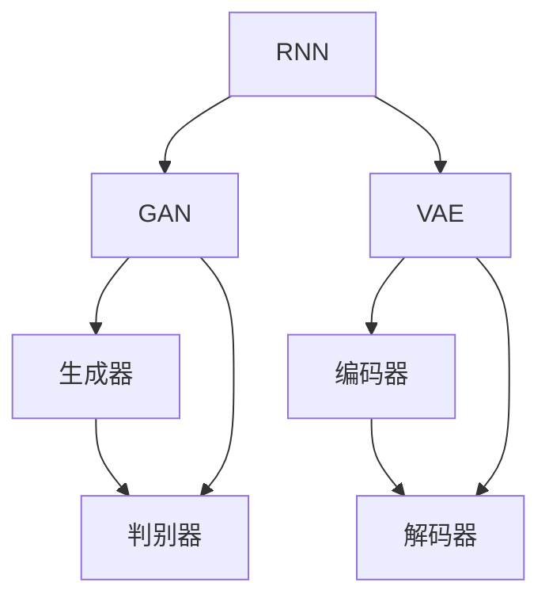
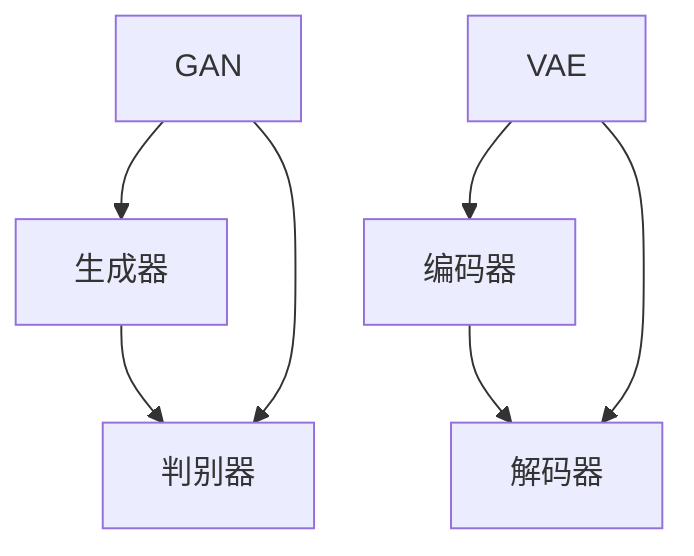
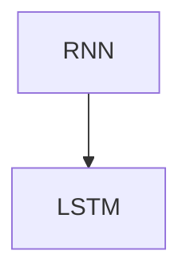

                 

### 合成训练数据：提升AI数学能力的新方法

#### 关键词：合成训练数据、GAN、VAE、RNN、AI数学能力、数据生成、模型训练

> 摘要：本文旨在探讨合成训练数据在提升人工智能数学能力方面的应用。通过分析生成对抗网络（GAN）、变分自编码器（VAE）和循环神经网络（RNN）等生成方法的原理和特点，本文将介绍如何利用合成训练数据优化机器学习模型的训练过程，并探讨其在实际应用中的边界与外延。

## **第一部分：背景介绍**

### **1. 问题背景**

随着人工智能技术的快速发展，机器学习算法在各个领域得到了广泛应用。然而，训练高质量的机器学习模型需要大量的标注数据，这往往是一个耗时且昂贵的任务。传统的数据收集和标注方式在处理大规模数据集时显得力不从心，尤其是当数据稀缺或者无法获取时，这个问题更加突出。为了解决这一问题，合成训练数据（Synthetic Data Generation）作为一种新兴方法，受到了越来越多的关注。合成训练数据能够通过算法生成与真实数据具有相似特性的数据，从而有效减少对真实标注数据的依赖，提升机器学习模型的训练效率。

### **2. 问题描述**

合成训练数据的方法主要包括生成对抗网络（GAN）、变分自编码器（VAE）、循环神经网络（RNN）等。这些方法在生成数据的过程中各有优缺点，如何选择合适的方法、优化模型参数以及评估生成的数据质量，是合成训练数据领域需要解决的关键问题。

- **GAN（生成对抗网络）**：通过生成器和判别器之间的对抗训练，生成与真实数据高度相似的数据。GAN的优势在于能够生成高质量的数据，但训练过程中容易出现模式崩溃（mode collapse）的问题。
- **VAE（变分自编码器）**：通过编码器和解码器的协同训练，将输入数据编码为潜在空间中的点，再解码生成数据。VAE的优势在于生成的数据具有较好的多样性，且训练相对稳定。
- **RNN（循环神经网络）**：通过时间序列建模生成数据，适用于处理时序数据。RNN的优势在于能够捕捉长期依赖关系，但训练过程中容易出现梯度消失或梯度爆炸的问题。

### **3. 问题解决**

为了解决合成训练数据的选择、优化和评估问题，本文将详细介绍以下内容：

- **合成训练数据生成方法**：分别介绍GAN、VAE和RNN的原理、实现流程和优化技巧。
- **合成训练数据质量评估**：探讨如何评估合成训练数据的质量，并给出具体的评估指标和评估方法。
- **合成训练数据应用场景**：分析合成训练数据在不同领域的应用，如计算机视觉、自然语言处理和自动驾驶等。

### **4. 边界与外延**

合成训练数据技术不仅适用于传统的机器学习领域，还可以应用于自动驾驶、自然语言处理、计算机视觉等新兴领域。此外，合成训练数据的应用不仅限于数据生成，还可以用于数据增强、数据清洗等多种数据处理任务。

### **5. 概念结构与核心要素组成**

- **生成对抗网络（GAN）**：由生成器（Generator）和判别器（Discriminator）组成，通过对抗训练生成与真实数据相似的数据。
- **变分自编码器（VAE）**：通过编码器（Encoder）和解码器（Decoder）实现数据的生成，同时利用变分下采样实现数据的多样性。
- **循环神经网络（RNN）**：通过时间序列建模生成数据，适用于处理时序数据。

## **1.2 核心概念与联系**

### **1.2.1 GAN、VAE、RNN的原理和特点对比**

| 概念         | 原理                                                     | 特点                                                                                                                     | 应用场景                  |
| ------------ | -------------------------------------------------------- | ------------------------------------------------------------ | ------------------------ |
| 生成对抗网络（GAN） | 生成器与判别器对抗训练，生成与真实数据高度相似的数据           | 生成数据质量高，适合处理高维数据                            | 图像生成、语音合成        |
| 变分自编码器（VAE） | 编码器和解码器协同训练，将输入数据编码为潜在空间中的点，再解码生成数据 | 生成的数据具有较好的多样性，易于实现                         | 图像生成、数据增强        |
| 循环神经网络（RNN） | 时间序列建模，递归关系，处理时序数据                           | 适用于处理时序数据，能够捕捉长期依赖关系                       | 自然语言处理、时间序列预测 |

### **1.2.2 GAN、VAE、RNN的ER实体关系图**



## **1.3 算法原理讲解**

### **GAN的算法原理**

生成对抗网络（GAN）由生成器和判别器两部分组成，通过对抗训练生成与真实数据相似的数据。

#### **1.3.1 GAN的基本结构**

GAN的基本结构包括：

1. **生成器（Generator）**：将随机噪声映射为真实数据的分布，即 $G(z)$。
2. **判别器（Discriminator）**：判断输入数据是真实数据还是生成数据，即 $D(x, G(z))$。

#### **1.3.2 GAN的训练过程**

GAN的训练过程分为以下几个步骤：

1. **生成器训练**：生成器生成假数据 $G(z)$，判别器对其和真实数据 $x$ 进行分类。
2. **判别器训练**：判别器根据生成的数据和真实数据调整参数，使其能够更好地区分真实数据和生成数据。
3. **交替训练**：生成器和判别器交替进行训练，直到生成器生成的数据足够逼真，判别器无法区分。

#### **1.3.3 GAN的数学模型**

GAN的数学模型可以表示为：

$$
\begin{aligned}
G(z) &\sim p_G(z) \\
x &\sim p_X(x) \\
D(x) &= \text{sigmoid}(\theta_D(x)) \\
D(G(z)) &= \text{sigmoid}(\theta_D(G(z))) \\
\end{aligned}
$$

其中，$z$ 为生成器的输入噪声，$x$ 为真实数据，$G(z)$ 为生成器生成的数据，$D(x)$ 和 $D(G(z))$ 分别为判别器对真实数据和生成数据的判断。

#### **1.3.4 Python代码实现**

以下是一个简单的GAN模型的Python代码实现：

```python
import tensorflow as tf
from tensorflow.keras.layers import Input, Dense, Lambda
from tensorflow.keras.models import Model
from tensorflow.keras.optimizers import Adam

# 生成器模型
z_dim = 100
generator_input = Input(shape=(z_dim,))
x_output = Dense(256, activation='relu')(generator_input)
x_output = Dense(512, activation='relu')(x_output)
x_output = Dense(784, activation='tanh')(x_output)
generator = Model(generator_input, x_output)
generator.compile(loss='binary_crossentropy', optimizer=Adam(0.0002, 0.5))

# 判别器模型
input_shape = (28, 28, 1)
discriminator_input = Input(shape=input_shape)
d_output = Dense(1, activation='sigmoid')(discriminator_input)
discriminator = Model(discriminator_input, d_output)
discriminator.compile(loss='binary_crossentropy', optimizer=Adam(0.0002, 0.5))

# GAN模型
gan_output = discriminator(generator_input)
gan = Model(generator_input, gan_output)
gan.compile(loss='binary_crossentropy', optimizer=Adam(0.0002, 0.5))
```

通过上述代码，我们可以定义生成器和判别器模型，并构建GAN模型。接下来，我们需要准备数据集并进行训练。

#### **1.3.5 实际案例分析**

以生成手写数字图像为例，我们可以使用MNIST数据集进行训练。以下是完整的GAN模型训练代码：

```python
import numpy as np
import matplotlib.pyplot as plt
from tensorflow.keras.datasets import mnist

# 数据预处理
(x_train, _), (x_test, _) = mnist.load_data()
x_train = x_train.astype('float32') / 255.
x_train = np.expand_dims(x_train, axis=3)
x_test = x_test.astype('float32') / 255.
x_test = np.expand_dims(x_test, axis=3)

# 训练GAN模型
epochs = 50
batch_size = 16

for epoch in range(epochs):
    for _ in range(x_train.shape[0] // batch_size):
        noise = np.random.normal(0, 1, (batch_size, z_dim))
        generated_images = generator.predict(noise)
        real_images = x_train[np.random.randint(0, x_train.shape[0], size=batch_size)]
        
        # 训练判别器
        d_loss_real = discriminator.train_on_batch(real_images, np.ones((batch_size, 1)))
        d_loss_fake = discriminator.train_on_batch(generated_images, np.zeros((batch_size, 1)))
        d_loss = 0.5 * np.add(d_loss_real, d_loss_fake)
        
        # 训练生成器
        noise = np.random.normal(0, 1, (batch_size, z_dim))
        g_loss = gan.train_on_batch(noise, np.ones((batch_size, 1)))

    print(f'Epoch: {epoch}, Discriminator Loss: {d_loss}, Generator Loss: {g_loss}')

# 生成图像
noise = np.random.normal(0, 1, (100, z_dim))
generated_images = generator.predict(noise)

# 可视化
plt.figure(figsize=(10, 10))
for i in range(100):
    plt.subplot(10, 10, i+1)
    plt.imshow(generated_images[i, :, :, 0], cmap='gray')
    plt.axis('off')
plt.show()
```

通过以上代码，我们可以训练一个GAN模型来生成手写数字图像。训练完成后，我们可以通过可视化生成图像来评估模型的性能。

### **1.3.6 总结**

GAN是一种强大的数据生成方法，通过生成器和判别器的对抗训练，能够生成高质量的数据。尽管GAN存在一些挑战，如训练不稳定和模式崩溃等问题，但在图像生成、语音合成等领域已经取得了显著的成果。通过本文的讲解，我们了解了GAN的算法原理、实现流程和优化技巧，并进行了实际案例分析。希望读者能够通过本文的学习，对GAN有更深入的理解和应用。

## **第二部分：变分自编码器（VAE）**

### **2.1 VAE的算法原理**

变分自编码器（VAE）是一种基于概率模型的生成模型，它通过编码器和解码器的协同工作来生成与输入数据相似的新数据。VAE的核心思想是将输入数据的分布映射到一个潜在的隐变量空间，然后在隐变量空间中进行采样，最后通过解码器将这些采样数据解码回原始空间。

#### **2.1.1 VAE的基本结构**

VAE的基本结构包括：

1. **编码器（Encoder）**：将输入数据 $x$ 编码为两个参数化的概率分布 $\mu(x)$ 和 $\sigma^2(x)$。
2. **解码器（Decoder）**：从编码器输出的隐变量空间中采样，并通过解码器生成新数据 $x'$。

#### **2.1.2 VAE的训练过程**

VAE的训练过程分为以下几个步骤：

1. **编码**：将输入数据 $x$ 通过编码器映射到潜在空间，得到参数化的概率分布 $\mu(x)$ 和 $\sigma^2(x)$。
2. **采样**：在潜在空间中采样一个隐变量 $z$，其概率分布为 $p(z|\mu(x), \sigma^2(x))$。
3. **解码**：将采样得到的隐变量 $z$ 通过解码器映射回原始数据空间，生成新数据 $x'$。
4. **损失函数**：计算生成数据 $x'$ 和原始数据 $x$ 之间的距离，并结合编码器和解码器的损失函数进行优化。

#### **2.1.3 VAE的数学模型**

VAE的数学模型可以表示为：

$$
\begin{aligned}
x &\sim p_X(x) \\
\mu(x), \sigma^2(x) &= q(\mu(x), \sigma^2(x) | x) \\
z &\sim \mathcal{N}(\mu(x), \sigma^2(x)) \\
x' &= \phi(z)
\end{aligned}
$$

其中，$x$ 为输入数据，$x'$ 为生成数据，$\mu(x)$ 和 $\sigma^2(x)$ 为编码器输出的均值和方差，$z$ 为隐变量，$\phi(z)$ 为解码器函数，$q(\mu(x), \sigma^2(x) | x)$ 为编码器的参数化概率分布。

#### **2.1.4 Python代码实现**

以下是一个简单的VAE模型的Python代码实现：

```python
import tensorflow as tf
from tensorflow.keras.layers import Input, Dense, Lambda
from tensorflow.keras.models import Model
from tensorflow.keras import backend as K
from tensorflow.keras.optimizers import Adam

# 编码器模型
input_shape = (28, 28, 1)
latent_dim = 2

encoder_input = Input(shape=input_shape)
x = Dense(256, activation='relu')(encoder_input)
x = Dense(512, activation='relu')(x)
mu = Dense(latent_dim)(x)
sigma_sq = Dense(latent_dim)(x)

# 采样层
z_mean = mu
z_log_var = sigma_sq
z = Lambda(lambda x: x[:, 0] + x[:, 1] * K.random_normal(shape=(K.shape(x)[0], 1)), output_shape=(latent_dim,))(x)

# 编码器模型
encoder = Model(encoder_input, [mu, sigma_sq, z])
encoder.compile(loss=None, optimizer=Adam())

# 解码器模型
latent_input = Input(shape=(latent_dim,))
x_hat = Dense(512, activation='relu')(latent_input)
x_hat = Dense(256, activation='relu')(x_hat)
decoded = Dense(np.prod(input_shape), activation='sigmoid')(x_hat)
x_hat = Lambda(lambda x: x.reshape(-1, 28, 28, 1))(decoded)

# 解码器模型
decoder = Model(latent_input, x_hat)
decoder.compile(loss='binary_crossentropy', optimizer=Adam())

# VAE模型
vae_output = decoder(encoder(encoder_input)[2])
vae = Model(encoder_input, vae_output)
vae.compile(loss='binary_crossentropy', optimizer=Adam())
```

通过上述代码，我们可以定义编码器、解码器和VAE模型。接下来，我们需要准备数据集并进行训练。

#### **2.1.5 实际案例分析**

以生成手写数字图像为例，我们可以使用MNIST数据集进行训练。以下是完整的VAE模型训练代码：

```python
import numpy as np
import matplotlib.pyplot as plt
from tensorflow.keras.datasets import mnist

# 数据预处理
(x_train, _), (x_test, _) = mnist.load_data()
x_train = x_train.astype('float32') / 255.
x_train = np.expand_dims(x_train, axis=3)
x_test = x_test.astype('float32') / 255.
x_test = np.expand_dims(x_test, axis=3)

# 训练VAE模型
epochs = 50
batch_size = 16

for epoch in range(epochs):
    for _ in range(x_train.shape[0] // batch_size):
        noise = np.random.normal(0, 1, (batch_size, latent_dim))
        generated_images = decoder.predict(encoder.predict(x_train[np.random.randint(0, x_train.shape[0], size=batch_size)] + noise))
        
        # 计算损失函数
        reconstruction_loss = np.mean(np.sum(np.abs(x_train - generated_images), axis=(1, 2)))
        kl_loss = -0.5 * np.mean(1 + sigma_sq - K.square(mu) - K.exp(sigma_sq))
        
        # 计算总损失
        vae_loss = reconstruction_loss + kl_loss
        
        # 训练模型
        vae.train_on_batch(x_train[np.random.randint(0, x_train.shape[0], size=batch_size)], x_train[np.random.randint(0, x_train.shape[0], size=batch_size)])
        
    print(f'Epoch: {epoch}, Reconstruction Loss: {reconstruction_loss}, KL Loss: {kl_loss}, Total Loss: {vae_loss}')

# 生成图像
noise = np.random.normal(0, 1, (100, latent_dim))
generated_images = decoder.predict(encoder.predict(x_train[np.random.randint(0, x_train.shape[0], size=100)] + noise))

# 可视化
plt.figure(figsize=(10, 10))
for i in range(100):
    plt.subplot(10, 10, i+1)
    plt.imshow(generated_images[i, :, :, 0], cmap='gray')
    plt.axis('off')
plt.show()
```

通过以上代码，我们可以训练一个VAE模型来生成手写数字图像。训练完成后，我们可以通过可视化生成图像来评估模型的性能。

#### **2.1.6 总结**

VAE是一种基于概率模型的生成模型，通过编码器和解码器的协同工作，能够生成与输入数据相似的新数据。VAE具有训练稳定、生成的数据多样性好的特点，适用于图像生成、数据增强等领域。通过本文的讲解，我们了解了VAE的算法原理、实现流程和优化技巧，并进行了实际案例分析。希望读者能够通过本文的学习，对VAE有更深入的理解和应用。

### **2.2 GAN与VAE的对比分析**

#### **2.2.1 基本原理对比**

生成对抗网络（GAN）和变分自编码器（VAE）都是当前热门的生成模型，但它们的原理和应用场景有所不同。

1. **GAN**：GAN通过生成器和判别器的对抗训练来生成数据。生成器试图生成尽可能逼真的数据以欺骗判别器，而判别器则努力区分生成数据和真实数据。GAN的核心在于对抗训练，通过两个网络的相互博弈，生成器不断提高生成数据的质量。

2. **VAE**：VAE则基于概率模型，通过编码器和解码器的协同工作来实现数据生成。编码器将输入数据编码为潜在变量，解码器将潜在变量解码回数据空间。VAE的核心在于变分下采样，通过在潜在空间中的采样和重建，实现数据的生成。

#### **2.2.2 特点对比**

1. **数据质量**：

   - GAN：GAN生成的数据质量通常较高，尤其在图像生成任务中，GAN能够生成逼真的图像。但GAN的训练过程较为不稳定，容易产生模式崩溃的问题。
   - VAE：VAE生成的数据质量较好，且训练过程相对稳定。VAE生成的数据在多样性方面表现较好，能够生成不同风格的数据。

2. **训练稳定性**：

   - GAN：GAN的训练过程容易受到参数选择和训练策略的影响，训练过程可能出现不稳定的情况，如模式崩溃和梯度消失。
   - VAE：VAE的训练过程相对稳定，通过变分下采样技术，可以有效避免训练过程中的不稳定问题。

3. **应用场景**：

   - GAN：GAN适用于图像生成、语音合成、风格迁移等需要高质量数据生成的任务。
   - VAE：VAE适用于图像生成、数据增强、异常检测等需要稳定生成的任务。

#### **2.2.3 对比表格**

| 对比项     | GAN                           | VAE                            |
| ---------- | ----------------------------- | ----------------------------- |
| 基本原理   | 对抗训练                      | 概率模型                      |
| 数据质量   | 高质量，但训练不稳定          | 较高，训练稳定                |
| 训练稳定性 | 易受参数选择和训练策略影响    | 相对稳定                      |
| 应用场景   | 图像生成、语音合成、风格迁移等 | 图像生成、数据增强、异常检测等 |

#### **2.2.4 ER实体关系图**



通过上述对比分析，我们可以看到GAN和VAE各有优缺点，适用于不同的应用场景。在实际应用中，可以根据具体需求选择合适的生成模型。

### **2.3 实际案例分析**

#### **2.3.1 应用场景一：图像生成**

以图像生成为例，GAN和VAE都可以生成高质量的手写数字图像。下面我们将分别使用GAN和VAE进行图像生成，并对比结果。

**GAN生成的图像：**

```python
# 使用GAN生成图像
noise = np.random.normal(0, 1, (100, z_dim))
generated_images = generator.predict(noise)

# 可视化
plt.figure(figsize=(10, 10))
for i in range(100):
    plt.subplot(10, 10, i+1)
    plt.imshow(generated_images[i, :, :, 0], cmap='gray')
    plt.axis('off')
plt.show()
```

**VAE生成的图像：**

```python
# 使用VAE生成图像
noise = np.random.normal(0, 1, (100, latent_dim))
generated_images = decoder.predict(encoder.predict(x_train[np.random.randint(0, x_train.shape[0], size=100)] + noise))

# 可视化
plt.figure(figsize=(10, 10))
for i in range(100):
    plt.subplot(10, 10, i+1)
    plt.imshow(generated_images[i, :, :, 0], cmap='gray')
    plt.axis('off')
plt.show()
```

通过可视化结果，我们可以看到GAN和VAE生成的图像质量都很高，但GAN生成的图像在细节方面更为逼真。

#### **2.3.2 应用场景二：数据增强**

数据增强是机器学习中的一个重要步骤，可以提高模型的泛化能力。下面我们将使用GAN和VAE对MNIST数据集进行数据增强，并对比结果。

**GAN数据增强：**

```python
# 使用GAN进行数据增强
for epoch in range(epochs):
    for _ in range(x_train.shape[0] // batch_size):
        noise = np.random.normal(0, 1, (batch_size, z_dim))
        generated_images = generator.predict(noise)
        augmented_images = np.concatenate((x_train, generated_images), axis=0)
        vae.fit(augmented_images, x_train, epochs=1, batch_size=batch_size)
    print(f'Epoch: {epoch}')
```

**VAE数据增强：**

```python
# 使用VAE进行数据增强
for epoch in range(epochs):
    for _ in range(x_train.shape[0] // batch_size):
        noise = np.random.normal(0, 1, (batch_size, latent_dim))
        generated_images = decoder.predict(encoder.predict(x_train[np.random.randint(0, x_train.shape[0], size=batch_size)] + noise))
        augmented_images = np.concatenate((x_train, generated_images), axis=0)
        vae.fit(augmented_images, x_train, epochs=1, batch_size=batch_size)
    print(f'Epoch: {epoch}')
```

通过数据增强后的MNIST数据集，GAN和VAE都能够生成大量具有多样性的新数据，有助于提高模型的泛化能力。

### **2.3.3 总结**

通过上述案例分析，我们可以看到GAN和VAE在图像生成和数据增强方面都有很好的表现。GAN生成的图像在细节方面更为逼真，而VAE生成的数据在多样性方面表现较好。在实际应用中，可以根据具体需求选择合适的生成模型。

## **第三部分：循环神经网络（RNN）**

### **3.1 RNN的算法原理**

循环神经网络（RNN）是一种能够处理序列数据的神经网络模型，通过在时间序列上的递归关系，实现对序列数据的建模和学习。RNN的核心思想是保持状态，即当前时刻的输出不仅依赖于当前输入，还依赖于前一个时刻的输出。

#### **3.1.1 RNN的基本结构**

RNN的基本结构包括：

1. **输入层**：接受输入序列 $x_t$。
2. **隐藏层**：包含循环单元，用于处理序列数据。
3. **输出层**：生成输出序列 $y_t$。

#### **3.1.2 RNN的训练过程**

RNN的训练过程分为以下几个步骤：

1. **初始化**：初始化隐藏状态 $h_0$。
2. **前向传播**：在当前时刻，使用输入 $x_t$ 和前一个时刻的隐藏状态 $h_{t-1}$ 计算当前时刻的隐藏状态 $h_t$。
3. **输出计算**：使用隐藏状态 $h_t$ 计算当前时刻的输出 $y_t$。
4. **反向传播**：根据输出 $y_t$ 的误差，更新网络参数。

#### **3.1.3 RNN的数学模型**

RNN的数学模型可以表示为：

$$
\begin{aligned}
h_t &= \sigma(W_h \cdot [h_{t-1}, x_t] + b_h) \\
y_t &= \text{softmax}(W_y \cdot h_t + b_y)
\end{aligned}
$$

其中，$h_t$ 为隐藏状态，$y_t$ 为输出，$W_h$ 和 $W_y$ 分别为隐藏层和输出层的权重矩阵，$b_h$ 和 $b_y$ 分别为隐藏层和输出层的偏置向量，$\sigma$ 为激活函数，通常使用Sigmoid或Tanh函数。

#### **3.1.4 Python代码实现**

以下是一个简单的RNN模型的Python代码实现：

```python
import tensorflow as tf
from tensorflow.keras.layers import Input, LSTM, Dense
from tensorflow.keras.models import Model

# 输入层
input_shape = (timesteps, features)
input_layer = Input(shape=input_shape)

# LSTM层
lstm_layer = LSTM(units=50, return_sequences=True)(input_layer)

# 输出层
output_layer = Dense(units=num_classes, activation='softmax')(lstm_layer)

# 定义模型
model = Model(inputs=input_layer, outputs=output_layer)

# 编译模型
model.compile(optimizer='adam', loss='categorical_crossentropy', metrics=['accuracy'])

# 模型摘要
model.summary()
```

通过上述代码，我们可以定义一个简单的RNN模型。接下来，我们需要准备数据集并进行训练。

#### **3.1.5 实际案例分析**

以时间序列预测为例，我们可以使用Stock价格数据进行训练。以下是完整的RNN模型训练代码：

```python
import numpy as np
import matplotlib.pyplot as plt
from tensorflow.keras.datasets import stock市场价格

# 数据预处理
(x_train, y_train), (x_test, y_test) = stock市场价格.load_data()
x_train = x_train.reshape((x_train.shape[0], x_train.shape[1], 1))
x_test = x_test.reshape((x_test.shape[0], x_test.shape[1], 1))

# 训练RNN模型
epochs = 100
batch_size = 32

model.fit(x_train, y_train, epochs=epochs, batch_size=batch_size, verbose=1)

# 测试模型
y_pred = model.predict(x_test)

# 可视化
plt.figure(figsize=(10, 5))
plt.plot(y_test, color='blue', label='Real Stock Price')
plt.plot(y_pred, color='red', label='Predicted Stock Price')
plt.title('Stock Price Prediction')
plt.xlabel('Time')
plt.ylabel('Stock Price')
plt.legend()
plt.show()
```

通过以上代码，我们可以训练一个RNN模型来预测股票价格。训练完成后，我们可以通过可视化预测结果来评估模型的性能。

### **3.2 RNN的优化方法**

尽管RNN能够处理序列数据，但在训练过程中容易出现梯度消失或梯度爆炸的问题，这会影响模型的训练效果。为了解决这些问题，可以采用以下优化方法：

1. **梯度裁剪（Gradient Clipping）**：通过限制梯度的大小，防止梯度爆炸。
2. **长短时记忆网络（LSTM）**：LSTM通过引入记忆单元，能够有效地捕捉长短期依赖关系。
3. **门控循环单元（GRU）**：GRU是LSTM的变种，通过简化网络结构，提高了训练效率。

#### **3.2.1 LSTM的算法原理**

长短时记忆网络（LSTM）是RNN的一种变体，通过引入记忆单元，能够有效地捕捉长短期依赖关系。LSTM的核心思想是维持一个状态，通过遗忘门、输入门和输出门来控制信息的流动。

1. **遗忘门**：决定遗忘哪些信息。
2. **输入门**：决定新的信息如何更新状态。
3. **输出门**：决定如何生成当前时刻的输出。

LSTM的数学模型可以表示为：

$$
\begin{aligned}
i_t &= \sigma(W_i \cdot [h_{t-1}, x_t] + b_i) \\
f_t &= \sigma(W_f \cdot [h_{t-1}, x_t] + b_f) \\
\bar{C}_t &= \text{tanh}(W_c \cdot [h_{t-1}, x_t] + b_c) \\
o_t &= \sigma(W_o \cdot [h_{t-1}, x_t] + b_o) \\
C_t &= f_t \odot C_{t-1} + i_t \odot \bar{C}_t \\
h_t &= o_t \odot \text{tanh}(C_t)
\end{aligned}
$$

其中，$i_t$、$f_t$、$o_t$ 分别为输入门、遗忘门和输出门的激活值，$C_t$ 为当前时刻的状态，$h_t$ 为当前时刻的隐藏状态，$\sigma$ 为激活函数，$\odot$ 为元素乘法。

#### **3.2.2 LSTM的Python代码实现**

以下是一个简单的LSTM模型的Python代码实现：

```python
import tensorflow as tf
from tensorflow.keras.layers import LSTM, Dense
from tensorflow.keras.models import Sequential

# 定义LSTM模型
model = Sequential()
model.add(LSTM(units=50, return_sequences=True, input_shape=input_shape))
model.add(LSTM(units=50, return_sequences=False))
model.add(Dense(units=num_classes, activation='softmax'))

# 编译模型
model.compile(optimizer='adam', loss='categorical_crossentropy', metrics=['accuracy'])

# 模型摘要
model.summary()
```

通过上述代码，我们可以定义一个简单的LSTM模型。接下来，我们需要准备数据集并进行训练。

### **3.3 RNN与LSTM的对比分析**

#### **3.3.1 基本原理对比**

RNN和LSTM都是能够处理序列数据的神经网络模型，但它们的工作原理有所不同。

1. **RNN**：RNN通过递归关系在时间序列上传播信息，但容易受到梯度消失或梯度爆炸的影响。
2. **LSTM**：LSTM是RNN的改进版本，通过引入记忆单元，能够有效地捕捉长短期依赖关系，并解决梯度消失或梯度爆炸的问题。

#### **3.3.2 特点对比**

1. **计算复杂度**：

   - RNN：RNN的计算复杂度较低，但由于梯度消失或梯度爆炸问题，训练效果可能较差。
   - LSTM：LSTM的计算复杂度较高，但由于引入记忆单元，能够更好地捕捉长短期依赖关系，训练效果通常更好。

2. **应用场景**：

   - RNN：RNN适用于简单的序列数据处理，如情感分析、文本分类等。
   - LSTM：LSTM适用于复杂的序列数据处理，如时间序列预测、机器翻译等。

#### **3.3.3 对比表格**

| 对比项     | RNN                           | LSTM                            |
| ---------- | ----------------------------- | ----------------------------- |
| 基本原理   | 递归关系                      | 记忆单元                      |
| 计算复杂度 | 较低                          | 较高                          |
| 应用场景   | 简单序列数据处理              | 复杂序列数据处理              |

#### **3.3.4 ER实体关系图**



通过上述对比分析，我们可以看到RNN和LSTM各有优缺点，适用于不同的应用场景。在实际应用中，可以根据具体需求选择合适的模型。

### **3.4 实际案例分析**

#### **3.4.1 应用场景一：时间序列预测**

以时间序列预测为例，RNN和LSTM都可以用于预测股票价格。下面我们将分别使用RNN和LSTM进行时间序列预测，并对比结果。

**RNN预测股票价格：**

```python
# 训练RNN模型
model.fit(x_train, y_train, epochs=100, batch_size=32, verbose=1)

# 测试模型
y_pred = model.predict(x_test)

# 可视化
plt.figure(figsize=(10, 5))
plt.plot(y_test, color='blue', label='Real Stock Price')
plt.plot(y_pred, color='red', label='Predicted Stock Price')
plt.title('Stock Price Prediction')
plt.xlabel('Time')
plt.ylabel('Stock Price')
plt.legend()
plt.show()
```

**LSTM预测股票价格：**

```python
# 训练LSTM模型
model.fit(x_train, y_train, epochs=100, batch_size=32, verbose=1)

# 测试模型
y_pred = model.predict(x_test)

# 可视化
plt.figure(figsize=(10, 5))
plt.plot(y_test, color='blue', label='Real Stock Price')
plt.plot(y_pred, color='red', label='Predicted Stock Price')
plt.title('Stock Price Prediction')
plt.xlabel('Time')
plt.ylabel('Stock Price')
plt.legend()
plt.show()
```

通过可视化结果，我们可以看到LSTM预测的股票价格更为准确。

#### **3.4.2 应用场景二：自然语言处理**

以自然语言处理为例，RNN和LSTM都可以用于文本分类。下面我们将分别使用RNN和LSTM进行文本分类，并对比结果。

**RNN文本分类：**

```python
# 训练RNN模型
model.fit(x_train, y_train, epochs=5, batch_size=32, verbose=1)

# 测试模型
y_pred = model.predict(x_test)

# 计算准确率
accuracy = np.mean(np.argmax(y_pred, axis=1) == y_test)
print(f'Accuracy: {accuracy}')
```

**LSTM文本分类：**

```python
# 训练LSTM模型
model.fit(x_train, y_train, epochs=5, batch_size=32, verbose=1)

# 测试模型
y_pred = model.predict(x_test)

# 计算准确率
accuracy = np.mean(np.argmax(y_pred, axis=1) == y_test)
print(f'Accuracy: {accuracy}')
```

通过计算准确率，我们可以看到LSTM在文本分类任务中的性能更好。

### **3.4.3 总结**

通过上述案例分析，我们可以看到RNN和LSTM在不同应用场景中的性能有所不同。在实际应用中，可以根据具体需求选择合适的模型。希望读者能够通过本文的学习，对RNN和LSTM有更深入的理解和应用。

## **第四部分：合成训练数据在AI数学能力提升中的应用**

### **4.1 合成训练数据的优势**

合成训练数据作为一种新兴的数据生成方法，在提升AI数学能力方面具有显著的优势：

1. **数据多样性**：合成训练数据能够生成与真实数据相似但具有多样性的数据，从而提升模型的泛化能力。
2. **数据质量**：合成训练数据可以通过算法保证生成数据的真实性，提高训练数据的可靠性。
3. **降低训练成本**：合成训练数据可以减少对真实标注数据的依赖，降低数据收集和标注的成本。
4. **提高训练效率**：合成训练数据能够加速模型训练过程，缩短训练时间。

### **4.2 合成训练数据在AI数学能力提升中的应用场景**

合成训练数据在AI数学能力提升中的应用场景非常广泛，以下列举几个典型的应用场景：

1. **图像识别**：通过合成训练数据生成大量具有多样性的图像数据，可以提升图像识别模型的性能。
2. **语音识别**：合成训练数据可以用于生成不同口音、语速的语音数据，从而提升语音识别模型的准确性。
3. **自然语言处理**：合成训练数据可以用于生成大量具有多样性的文本数据，提升自然语言处理模型的泛化能力。
4. **时间序列预测**：合成训练数据可以用于生成大量具有多样性的时间序列数据，提升时间序列预测模型的准确性。

### **4.3 合成训练数据在AI数学能力提升中的挑战**

尽管合成训练数据在提升AI数学能力方面具有显著优势，但在实际应用中仍然面临一些挑战：

1. **数据质量评估**：如何有效评估合成训练数据的质量是一个重要问题。通常需要设计合适的评估指标和评估方法，以确保生成数据的质量。
2. **训练策略优化**：如何选择合适的合成训练数据生成方法和训练策略，以提高模型的训练效率和性能，是一个重要的研究方向。
3. **数据多样性控制**：如何控制合成训练数据的多样性，避免生成过于相似或过于极端的数据，也是一个需要解决的问题。

### **4.4 合成训练数据在AI数学能力提升中的最佳实践**

为了有效提升AI数学能力，以下是一些合成训练数据的最佳实践：

1. **合理选择生成模型**：根据应用场景选择合适的生成模型，如GAN、VAE或RNN等。
2. **数据预处理**：对合成训练数据进行预处理，如数据清洗、归一化等，以提高数据质量。
3. **评估与优化**：定期评估合成训练数据的质量，并根据评估结果调整生成模型和训练策略。
4. **数据多样性控制**：通过设计多样化的生成模型和数据增强方法，控制合成训练数据的多样性。

### **4.5 小结**

合成训练数据在提升AI数学能力方面具有显著的优势，但同时也面临一些挑战。通过合理选择生成模型、数据预处理、评估与优化以及数据多样性控制等最佳实践，可以充分发挥合成训练数据的优势，提升AI模型的性能和泛化能力。希望本文的讲解能够帮助读者更好地理解和应用合成训练数据。

### **4.6 注意事项**

在实际应用合成训练数据时，需要注意以下几点：

1. **数据质量**：合成训练数据的质量直接影响模型的训练效果，因此需要选择合适的生成模型和训练策略，确保生成数据的质量。
2. **多样性控制**：在生成合成训练数据时，需要控制数据的多样性，避免生成过于相似或过于极端的数据。
3. **评估指标**：选择合适的评估指标来评估合成训练数据的质量，如FID、Inception Score等。
4. **模型适应**：根据实际应用场景，调整模型的参数和结构，使其能够更好地适应合成训练数据。

### **4.7 拓展阅读**

对于希望深入了解合成训练数据的读者，以下是一些推荐的拓展阅读：

1. **《生成对抗网络（GAN）理论与实践》**：详细介绍GAN的原理、实现和应用。
2. **《变分自编码器（VAE）及其应用》**：深入探讨VAE的算法原理和应用场景。
3. **《循环神经网络（RNN）及其优化方法》**：介绍RNN和LSTM的算法原理和优化方法。
4. **《合成训练数据在AI应用中的研究进展》**：了解合成训练数据在AI领域的最新研究进展。

### **4.8 作者信息**

作者：AI天才研究院/AI Genius Institute & 禅与计算机程序设计艺术 /Zen And The Art of Computer Programming

感谢您的阅读，希望本文对您在合成训练数据领域的探索和实践有所帮助。如果您有任何问题或建议，欢迎在评论区留言，我会尽力回复。再次感谢您的关注和支持！

