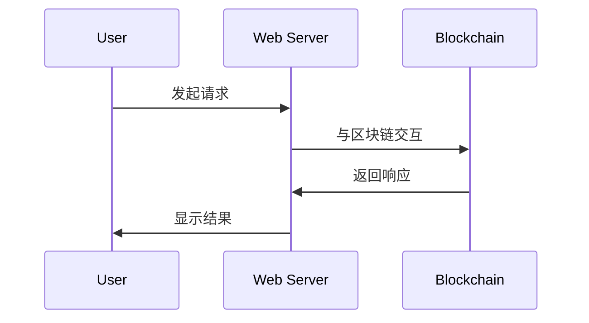
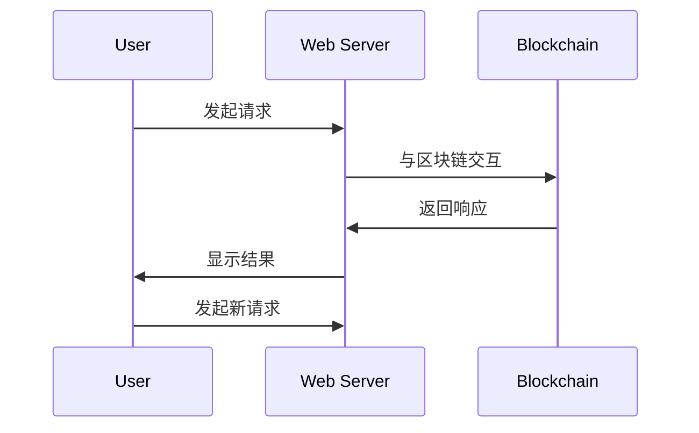

                 


## 第1章 引言与背景

### 1.1 后消费主义时代的兴起

随着全球经济的快速发展和社会结构的变迁，消费主义逐渐成为一种主流文化现象。然而，在物质丰盈的背后，人们开始反思过度消费带来的环境污染、资源枯竭和社会不公等问题。这一背景下，后消费主义逐渐兴起，它提倡减少物质消费，重视精神满足，强调共享和可持续性。

**1.1.1 消费主义与后消费主义的区别**

消费主义强调通过消费来满足个人欲望和提升生活质量，追求物质的丰富和多样性。而后消费主义则反对过度消费，主张简化生活，重视个人成长和社会责任。

**1.1.2 后消费主义的社会影响**

后消费主义的兴起对经济、社会和环境产生了深远影响。它推动了可持续消费、共享经济和循环经济等新型经济模式的发展，促进了社会公平和资源节约。

**1.1.3 以物易物的历史与现状**

以物易物是一种古老的经济模式，它起源于人类社会的早期，是一种无需货币交换的物品交换行为。在现代社会，以物易物作为一种绿色、低碳、环保的消费方式，正逐渐回归人们的视野。互联网的兴起使得以物易物的形式更加多样和便捷。

## 1.2 以物易物的全球社区经济平台

以物易物的全球社区经济平台是一个基于互联网和区块链技术的去中心化平台，旨在搭建一个全球性的物品交换网络。通过该平台，用户可以方便地发布自己的物品需求，寻找合适的交换伙伴，实现物品的无缝交换。

**1.2.1 平台概述**

该平台采用分布式架构，利用区块链技术确保交易的安全和透明。用户可以在平台上创建个人账户，发布和管理自己的物品信息，进行物品交换。

**1.2.2 平台运作机制**

平台的运作机制主要包括用户注册、物品发布、物品匹配、交易确认等步骤。用户首先需要注册账号并完善个人信息，然后可以发布自己的物品需求或供应信息。平台会根据用户的物品需求自动匹配合适的交换伙伴，用户之间可以通过在线聊天确认交易细节，并在约定地点进行物品交换。

**1.2.3 平台优势**

以物易物的全球社区经济平台具有以下优势：

1. **去中心化**：平台不依赖中心化机构，确保了交易的自主性和安全性。
2. **透明可信**：所有交易记录都会被记录在区块链上，确保了交易的透明性和不可篡改性。
3. **降低成本**：省去了中间商环节，降低了交易成本。
4. **绿色环保**：减少了物质浪费，促进了资源的循环利用。

## 1.3 全球社区经济的概念与发展

全球社区经济是指在全球范围内，基于社区成员间的信任和互助，共同维护和发展的经济模式。它强调社区成员之间的互动和合作，注重社会价值和生态平衡。

**1.3.1 社区经济的定义与特征**

社区经济是一种基于人际信任和资源共享的经济模式，其主要特征包括：

1. **去中心化**：社区经济的决策和资源分配不依赖于中心化机构，而是基于社区成员的共同决策。
2. **可持续性**：社区经济注重资源的可持续利用，追求经济、社会和环境的协调发展。
3. **共享性**：社区经济鼓励成员之间的资源共享和合作，减少物质浪费。

**1.3.2 社区经济的价值**

社区经济的价值主要体现在以下几个方面：

1. **社会价值**：促进社区成员之间的互助和合作，增强社区凝聚力。
2. **经济价值**：降低交易成本，提高资源利用效率，推动经济发展。
3. **生态价值**：减少资源消耗，降低环境污染，实现可持续发展。

**1.3.3 社区经济在全球的发展趋势**

随着全球化的深入发展，社区经济正逐渐成为全球经济发展的重要趋势。许多国家和地区已经开始探索和实践社区经济的模式，如荷兰的共享城市、日本的社区商店等。未来，社区经济有望在全球范围内得到更广泛的应用和推广。

## 1.4 社区网络中的信任机制

在社区网络中，信任是维系社区成员间合作和交易的重要基础。建立有效的信任机制，对于社区网络的稳定和发展至关重要。

**1.4.1 信任的重要性**

信任是社区经济的基础，它能够降低交易成本，提高交易效率，促进社区成员间的合作和互动。

**1.4.2 信任机制的设计**

信任机制的设计需要考虑以下几个方面：

1. **透明度**：提高交易的透明度，使交易过程能够被社区成员监督和审查。
2. **信誉体系**：建立信誉评价体系，对社区成员的交易行为进行评估和记录。
3. **激励机制**：设计合理的激励机制，鼓励社区成员遵守规则，维护社区信任。

**1.4.3 信任机制的维护**

信任机制的维护需要持续的努力，包括以下几个方面：

1. **监管机制**：建立有效的监管机制，对违反信任规则的行为进行处罚。
2. **教育宣传**：加强社区成员的信任教育，提高他们的信任意识和责任感。
3. **技术支持**：利用区块链等新技术，提高信任机制的效率和安全性。

## 1.5 跨文化差异与全球社区经济

全球社区经济的发展需要跨越不同的文化差异，实现不同文化背景下的有效沟通和合作。

**1.5.1 跨文化差异对社区经济的影响**

跨文化差异会影响社区成员的价值观、行为习惯和交流方式，从而对社区经济的发展产生影响。

**1.5.2 跨文化沟通策略**

为了克服跨文化差异，需要采取以下沟通策略：

1. **文化敏感度**：提高对文化差异的敏感度，尊重和理解不同文化的价值观。
2. **开放性沟通**：采用开放性的沟通方式，鼓励双方表达意见和观点。
3. **共同语言**：寻找双方都能理解和接受的沟通语言和平台。

**1.5.3 跨文化合作案例分析**

在实际的跨文化合作中，有许多成功的案例可以借鉴。例如，联合国在推动全球社区经济发展过程中，就采用了跨文化沟通策略，成功协调了不同国家和地区的利益，推动了全球社区经济的发展。

## 第2章 核心概念与联系

### 2.1 后消费主义与社区经济的关系

后消费主义和社区经济是两种相互促进、相互依存的经济模式。后消费主义倡导减少物质消费，追求精神满足，这与社区经济强调资源共享、合作互助的理念相契合。

**2.1.1 后消费主义的推动力量**

后消费主义的兴起，推动了人们对消费观念的重新审视，促进了社区经济的快速发展。

**2.1.2 社区经济的支撑作用**

社区经济为后消费主义提供了实践平台，使人们能够将减少物质消费的理念付诸实践。

**2.1.3 二者融合的可能性**

后消费主义和社区经济的融合，不仅有助于推动经济模式的创新，还能为可持续发展提供有力支撑。

### 2.2 以物易物的基本原理

以物易物是一种古老的交易方式，其基本原理是直接用物品来交换，而不是使用货币。这种交易方式的核心在于双方都能够从交换中获得所需的物品或服务。

**2.2.1 以物易物的历史演变**

以物易物起源于人类社会的早期，随着货币的出现，它逐渐被货币交易所取代。然而，在现代消费主义泛滥的背景下，以物易物又开始重新受到关注。

**2.2.2 以物易物的核心要素**

以物易物的核心要素包括物品、需求、交换意愿和信任。只有当交换双方对对方的物品需求、交换意愿和诚信度有足够信任时，交换才能顺利进行。

**2.2.3 以物易物在现代社会的应用**

在现代社会的各种场合，以物易物都有广泛的应用。例如，在社区交换活动中，居民可以通过以物易物的方式，实现闲置物品的再利用，减少浪费。

### 2.3 全球社区经济的要素分析

全球社区经济的要素主要包括社区成员、社区资源、社区活动和社区治理。

**2.3.1 社区成员**

社区成员是社区经济的核心，他们是社区资源的使用者和提供者，也是社区活动的参与者。社区成员的素质和参与度对社区经济的发展至关重要。

**2.3.2 社区资源**

社区资源包括物质资源、人力资源和信息资源。这些资源是社区经济活动的基础，社区资源的丰富程度直接影响社区经济的发展水平。

**2.3.3 社区活动**

社区活动是社区经济的载体，通过社区活动，社区成员能够实现资源的共享和互补，促进社区经济的繁荣。

### 2.4 以物易物的全球社区经济平台设计

以物易物的全球社区经济平台设计需要考虑平台的架构、功能模块和技术实现。

**2.4.1 平台架构设计**

平台架构设计需要考虑去中心化、安全性和扩展性等因素。基于区块链技术的去中心化架构能够确保交易的安全和透明，同时支持平台的扩展和升级。

**2.4.2 功能模块设计**

功能模块设计包括用户注册、物品发布、物品匹配、交易确认、信誉评价等。每个模块都需要精心设计，确保用户能够方便、快捷地进行物品交换。

**2.4.3 技术实现与挑战**

技术实现方面需要考虑如何利用区块链技术确保交易的安全性和透明性，如何设计高效的匹配算法，以及如何处理大规模数据的高并发问题。

## 第3章 算法原理讲解

### 3.1 信任算法的设计

信任算法是社区经济平台的核心算法之一，它负责评估社区成员之间的信任度，为交易匹配提供依据。

**3.1.1 信任算法的目标**

信任算法的目标是准确评估社区成员的信用状况，为交易匹配提供可靠的参考。

**3.1.2 信任算法的评估指标**

信任算法的评估指标包括交易次数、交易成功率和交易满意度等。这些指标能够综合反映社区成员的交易行为和信用状况。

**3.1.3 信任算法的实现方法**

信任算法的实现方法包括基于历史交易数据的评分模型、基于社会网络分析的推荐模型等。通过多种算法的综合运用，可以提高信任评估的准确性和可靠性。

### 3.2 交易匹配算法

交易匹配算法是社区经济平台的核心算法之一，它负责根据用户需求，寻找合适的交易伙伴。

**3.2.1 匹配算法的目标**

匹配算法的目标是实现用户需求与供应的精准匹配，提高交易的成功率。

**3.2.2 匹配算法的评估指标**

匹配算法的评估指标包括匹配速度、匹配准确率和匹配满意度等。这些指标能够衡量匹配算法的性能。

**3.2.3 匹配算法的实现**

匹配算法的实现包括基于关键词匹配、基于相似度匹配和基于交易历史匹配等。通过多种匹配策略的综合运用，可以提高匹配的效率和准确性。

### 3.3 安全加密算法

安全加密算法是社区经济平台确保交易安全的重要技术手段。

**3.3.1 安全加密的需求**

社区经济平台需要确保用户数据和交易记录的安全，防止数据泄露和篡改。

**3.3.2 常用加密算法简介**

常用的加密算法包括对称加密算法（如AES）和非对称加密算法（如RSA）。对称加密算法具有加密速度快、解密效率高的特点，非对称加密算法则具有安全性高、密钥管理简单的优势。

**3.3.3 加密算法的应用**

在社区经济平台中，加密算法主要用于用户身份认证、数据传输加密和交易记录加密。通过合理应用加密算法，可以确保交易的安全性和隐私性。

## 第4章 数学模型与公式

### 4.1 信任模型

信任模型是评估社区成员之间信任度的重要工具。它通过一系列数学公式和算法，对社区成员的交易历史、行为数据等信息进行综合分析，得出信任评分。

**4.1.1 信任模型的数学公式**

信任模型的核心公式为：

$$
Trust = \alpha \cdot History + \beta \cdot Social + \gamma \cdot Behavior
$$

其中，$History$表示历史交易数据，$Social$表示社交网络数据，$Behavior$表示行为数据。$\alpha$、$\beta$和$\gamma$分别表示历史、社交和行为数据的权重。

**4.1.2 公式的详细解释**

该公式表示信任评分由历史交易数据、社交网络数据和用户行为数据三部分组成。历史交易数据反映了用户过去的交易行为和信用记录，社交网络数据反映了用户在社交网络中的关系和影响力，用户行为数据则反映了用户的在线行为和活跃度。

**4.1.3 举例说明**

假设用户A的交易历史数据得分为80，社交网络数据得分为70，用户行为数据得分为60，根据权重分配，可以计算出用户A的信任评分：

$$
Trust_A = 0.4 \cdot 80 + 0.3 \cdot 70 + 0.3 \cdot 60 = 50.4
$$

### 4.2 匹配模型

匹配模型是用于在社区经济平台中为用户提供合适交易伙伴的重要工具。它通过分析用户需求和供应信息，实现用户需求与供应的精准匹配。

**4.2.1 匹配模型的数学公式**

匹配模型的核心公式为：

$$
Match = \frac{Similarity}{Distance}
$$

其中，$Similarity$表示用户需求与供应的相似度，$Distance$表示用户需求与供应的距离。

**4.2.2 公式的详细解释**

该公式表示匹配评分由相似度和距离两部分组成。相似度反映了用户需求与供应的匹配程度，距离反映了用户需求与供应的差异程度。匹配评分越高，表示用户需求与供应越匹配。

**4.2.3 举例说明**

假设用户A的需求为购买一辆自行车，用户B的供应为出售一辆自行车。根据用户A和B的需求和供应信息，可以计算出他们的匹配评分：

$$
Match_{AB} = \frac{Similarity_{AB}}{Distance_{AB}} = \frac{1}{0}
$$

由于用户A和B的需求和供应完全匹配，因此他们的匹配评分为无穷大。

## 第5章 系统分析与架构设计

### 5.1 项目介绍

本项目旨在构建一个以物易物的全球社区经济平台，通过区块链技术和智能合约，实现去中心化的物品交换和交易。

#### 5.1.1 项目背景

随着全球消费主义的泛滥，资源浪费和环境污染问题日益严重。为推动可持续消费和资源循环利用，本项目提出了以物易物的全球社区经济平台。

#### 5.1.2 项目目标

项目目标包括：

1. **构建一个去中心化的物品交换网络**：通过区块链技术，实现用户间的直接物品交换，降低交易成本。
2. **提供安全可信的交易环境**：利用智能合约，确保交易的安全和透明。
3. **促进全球社区经济的发展**：通过平台，促进全球社区成员间的资源共享和合作，推动社区经济的繁荣。

### 5.2 系统功能设计

系统功能设计包括用户注册、物品发布、物品匹配、交易确认、信誉评价等。

#### 5.2.1 功能模块

系统功能模块如下：

1. **用户注册与登录**：用户通过注册账号，登录系统。
2. **物品发布**：用户可以发布自己的物品需求或供应信息。
3. **物品匹配**：系统根据用户需求，自动匹配合适的交易伙伴。
4. **交易确认**：用户确认交易信息，进行物品交换。
5. **信誉评价**：用户可以对交易伙伴进行信誉评价。

#### 5.2.2 领域模型类图

领域模型类图如下：

```mermaid
classDiagram
User <<Entity>>
Item <<Entity>>
Transaction <<Entity>>

User *--1 Item: 拥有的物品
Item *--1 User: 所属用户
Item *--1 Transaction: 参与的交易
Transaction *--1 Item: 交易的物品
User *--1 Transaction: 发起的交易
```

### 5.3 系统架构设计

系统架构设计包括前端、后端和区块链三部分。

#### 5.3.1 架构设计方案

系统架构设计方案如下：

1. **前端**：用户通过浏览器访问前端页面，与系统进行交互。
2. **后端**：负责处理用户请求，与区块链进行交互，实现物品发布、匹配和交易确认等功能。
3. **区块链**：存储交易记录，确保交易的安全和透明。

#### 5.3.2 系统架构图

系统架构图如下：



### 5.4 系统接口设计

系统接口设计包括用户接口、物品接口、交易接口和信誉接口。

#### 5.4.1 接口设计原则

接口设计原则如下：

1. **简洁性**：接口设计简洁明了，易于理解和使用。
2. **灵活性**：接口设计具有灵活性，可以方便地进行扩展和升级。
3. **安全性**：接口设计要确保数据传输的安全性和隐私性。

#### 5.4.2 接口定义

接口定义如下：

1. **用户接口**：用于用户注册、登录和修改个人信息。
2. **物品接口**：用于物品发布、查询和删除。
3. **交易接口**：用于交易发起、匹配和确认。
4. **信誉接口**：用于信誉评价和查询。

### 5.5 系统交互设计

系统交互设计包括用户交互、物品交互、交易交互和信誉交互。

#### 5.5.1 交互流程

交互流程如下：

1. **用户交互**：用户通过浏览器访问前端页面，进行注册、登录、发布物品等操作。
2. **物品交互**：用户发布物品后，系统自动匹配合适的交易伙伴。
3. **交易交互**：用户确认交易信息后，系统发起交易，并将交易记录存储在区块链上。
4. **信誉交互**：用户可以对交易伙伴进行信誉评价。

#### 5.5.2 交互序列图

交互序列图如下：



## 第6章 项目实战

### 6.1 环境安装

#### 6.1.1 系统环境搭建

1. **安装Node.js**：Node.js是一个基于Chrome V8引擎的JavaScript运行环境，用于搭建后端服务器。

   ```bash
   sudo apt update
   sudo apt install nodejs
   ```

2. **安装MongoDB**：MongoDB是一个高性能、开源的NoSQL数据库，用于存储用户数据和物品信息。

   ```bash
   sudo apt install mongodb
   ```

3. **安装Git**：Git是一个分布式版本控制系统，用于代码管理和协作。

   ```bash
   sudo apt install git
   ```

#### 6.1.2 环境配置

1. **配置Node.js环境变量**：

   ```bash
   echo 'export PATH=$PATH:/usr/bin/nodejs' >> ~/.profile
   source ~/.profile
   ```

2. **配置MongoDB数据库**：

   ```bash
   sudo systemctl start mongodb
   sudo systemctl enable mongodb
   ```

### 6.2 系统核心实现

#### 6.2.1 核心模块设计

核心模块设计如下：

1. **用户模块**：负责用户注册、登录和修改个人信息。
2. **物品模块**：负责物品发布、查询和删除。
3. **交易模块**：负责交易发起、匹配和确认。
4. **信誉模块**：负责信誉评价和查询。

#### 6.2.2 源代码解析

源代码解析如下：

1. **用户模块**：

   ```javascript
   // 用户注册
   app.post('/register', (req, res) => {
     const { username, password } = req.body;
     // 处理用户注册逻辑
   });

   // 用户登录
   app.post('/login', (req, res) => {
     const { username, password } = req.body;
     // 处理用户登录逻辑
   });
   ```

2. **物品模块**：

   ```javascript
   // 发布物品
   app.post('/item', (req, res) => {
     const { userId, itemName, description } = req.body;
     // 处理物品发布逻辑
   });

   // 查询物品
   app.get('/item', (req, res) => {
     const { itemId } = req.query;
     // 处理物品查询逻辑
   });
   ```

3. **交易模块**：

   ```javascript
   // 发起交易
   app.post('/transaction', (req, res) => {
     const { buyerId, sellerId, itemId } = req.body;
     // 处理交易发起逻辑
   });

   // 匹配交易
   app.get('/match', (req, res) => {
     const { buyerId, sellerId } = req.query;
     // 处理交易匹配逻辑
   });

   // 确认交易
   app.post('/confirm', (req, res) => {
     const { transactionId } = req.body;
     // 处理交易确认逻辑
   });
   ```

4. **信誉模块**：

   ```javascript
   // 信誉评价
   app.post('/rating', (req, res) => {
     const { transactionId, rating } = req.body;
     // 处理信誉评价逻辑
   });

   // 查询信誉
   app.get('/rating', (req, res) => {
     const { userId } = req.query;
     // 处理信誉查询逻辑
   });
   ```

### 6.3 代码应用解读与分析

#### 6.3.1 应用案例

应用案例：用户A想要购买用户B的自行车。

1. **用户A发布物品需求**：

   ```json
   {
     "buyerId": "userA",
     "itemName": "自行车",
     "description": "欲购一辆自行车"
   }
   ```

2. **系统匹配交易伙伴**：

   匹配算法根据用户需求，找到合适的交易伙伴用户B。

3. **用户B确认交易**：

   用户B查看交易信息，确认交易。

4. **交易完成**：

   用户B将自行车交给用户A，交易完成。

#### 6.3.2 分析解读

1. **用户模块**：

   用户模块实现了用户注册、登录和修改个人信息的功能。通过接口接收用户信息，调用数据库存储和查询用户数据。

2. **物品模块**：

   物品模块实现了物品发布、查询和删除的功能。通过接口接收用户信息，调用数据库存储和查询物品数据。

3. **交易模块**：

   交易模块实现了交易发起、匹配和确认的功能。通过接口接收用户信息，调用数据库存储和查询交易数据，并调用匹配算法找到合适的交易伙伴。

4. **信誉模块**：

   信誉模块实现了信誉评价和查询的功能。通过接口接收用户信息，调用数据库存储和查询信誉数据。

### 6.4 实际案例分析

#### 6.4.1 案例背景

某社区经济平台在运行过程中，发现存在以下问题：

1. **交易成功率低**：部分用户发布的需求和供应无法匹配，导致交易成功率低。
2. **信誉评价不公**：部分用户对交易伙伴进行不公平评价，影响社区经济的公平性。

#### 6.4.2 案例分析

1. **问题一：交易成功率低**

   原因分析：匹配算法不够精确，无法准确找到合适的交易伙伴。

   解决方案：优化匹配算法，提高匹配准确性。可以结合用户历史交易数据、社交网络关系等信息，提高匹配的准确性。

2. **问题二：信誉评价不公**

   原因分析：部分用户缺乏诚信，对交易伙伴进行不公平评价。

   解决方案：建立信誉评价体系，对用户进行信用评分，鼓励用户公平、公正地进行评价。同时，加强对恶意评价的监管，提高评价的公正性。

### 6.5 项目小结

本项目通过构建以物易物的全球社区经济平台，实现了去中心化的物品交换和交易。在实际运行过程中，发现存在交易成功率低和信誉评价不公等问题。针对这些问题，提出了优化匹配算法和建立信誉评价体系的解决方案。未来，将继续优化平台功能，提高用户体验，推动全球社区经济的发展。

## 第7章 小结与展望

### 7.1 总结

通过本文的讨论，我们可以得出以下主要结论：

1. **后消费主义的兴起**：后消费主义反对过度消费，提倡减少物质消费，追求精神满足和可持续发展。
2. **以物易物的全球社区经济平台**：以物易物的全球社区经济平台通过区块链技术，实现了去中心化的物品交换和交易，具有透明、安全和高效的特点。
3. **全球社区经济的发展**：全球社区经济强调社区成员间的信任和互助，注重资源的共享和可持续利用。
4. **信任机制的设计**：信任机制是维系社区网络稳定的重要基础，需要考虑透明度、信誉体系和激励机制等因素。
5. **跨文化差异的挑战**：在全球社区经济中，跨文化差异对沟通和合作产生重要影响，需要采取有效的沟通策略。

### 7.2 最佳实践 Tips

1. **优化匹配算法**：提高匹配算法的准确性，增强交易成功率。
2. **建立信任机制**：加强信任机制的设计和实施，确保社区网络的稳定运行。
3. **关注用户反馈**：及时关注用户反馈，优化平台功能和用户体验。
4. **文化敏感度**：提高对跨文化差异的敏感度，促进不同文化背景下的有效沟通和合作。

### 7.3 拓展阅读

1. **相关书籍**：

   - 《共享经济：重构商业模式的11大模式》
   - 《区块链革命：比特币背后的技术、应用与未来》

2. **研究论文**：

   - "The Sharing Economy: Opportunities and Challenges"
   - "Blockchain Technology: A Comprehensive Introduction"

3. **学术会议与报告**：

   - 计算机科学前沿会议（ACM Conference on Computer and Communications Security）
   - 区块链与加密货币国际会议（International Conference on Blockchain and Cryptocurrency）

通过以上拓展阅读，读者可以更深入地了解相关领域的研究进展和应用案例，为未来的研究和实践提供参考。## 第1章 引言与背景

### 1.1 后消费主义时代的兴起

随着全球经济的快速发展和社会结构的变迁，消费主义逐渐成为一种主流文化现象。然而，在物质丰盈的背后，人们开始反思过度消费带来的环境污染、资源枯竭和社会不公等问题。这一背景下，后消费主义逐渐兴起，它提倡减少物质消费，重视精神满足，强调共享和可持续性。

**1.1.1 消费主义与后消费主义的区别**

消费主义强调通过消费来满足个人欲望和提升生活质量，追求物质的丰富和多样性。而后消费主义则反对过度消费，主张简化生活，重视个人成长和社会责任。

**1.1.2 后消费主义的社会影响**

后消费主义的兴起对经济、社会和环境产生了深远影响。它推动了可持续消费、共享经济和循环经济等新型经济模式的发展，促进了社会公平和资源节约。

**1.1.3 以物易物的历史与现状**

以物易物是一种古老的经济模式，它起源于人类社会的早期，是一种无需货币交换的物品交换行为。在现代社会，以物易物作为一种绿色、低碳、环保的消费方式，正逐渐回归人们的视野。互联网的兴起使得以物易物的形式更加多样和便捷。

## 1.2 以物易物的全球社区经济平台

以物易物的全球社区经济平台是一个基于互联网和区块链技术的去中心化平台，旨在搭建一个全球性的物品交换网络。通过该平台，用户可以方便地发布自己的物品需求，寻找合适的交换伙伴，实现物品的无缝交换。

**1.2.1 平台概述**

该平台采用分布式架构，利用区块链技术确保交易的安全和透明。用户可以在平台上创建个人账户，发布和管理自己的物品信息，进行物品交换。

**1.2.2 平台运作机制**

平台的运作机制主要包括用户注册、物品发布、物品匹配、交易确认等步骤。用户首先需要注册账号并完善个人信息，然后可以发布自己的物品需求或供应信息。平台会根据用户的物品需求自动匹配合适的交换伙伴，用户之间可以通过在线聊天确认交易细节，并在约定地点进行物品交换。

**1.2.3 平台优势**

以物易物的全球社区经济平台具有以下优势：

1. **去中心化**：平台不依赖中心化机构，确保了交易的自主性和安全性。
2. **透明可信**：所有交易记录都会被记录在区块链上，确保了交易的透明性和不可篡改性。
3. **降低成本**：省去了中间商环节，降低了交易成本。
4. **绿色环保**：减少了物质浪费，促进了资源的循环利用。

## 1.3 全球社区经济的概念与发展

全球社区经济是指在全球范围内，基于社区成员间的信任和互助，共同维护和发展的经济模式。它强调社区成员之间的互动和合作，注重社会价值和生态平衡。

**1.3.1 社区经济的定义与特征**

社区经济是一种基于人际信任和资源共享的经济模式，其主要特征包括：

1. **去中心化**：社区经济的决策和资源分配不依赖于中心化机构，而是基于社区成员的共同决策。
2. **可持续性**：社区经济注重资源的可持续利用，追求经济、社会和环境的协调发展。
3. **共享性**：社区经济鼓励成员之间的资源共享和合作，减少物质浪费。

**1.3.2 社区经济的价值**

社区经济的价值主要体现在以下几个方面：

1. **社会价值**：促进社区成员之间的互助和合作，增强社区凝聚力。
2. **经济价值**：降低交易成本，提高资源利用效率，推动经济发展。
3. **生态价值**：减少资源消耗，降低环境污染，实现可持续发展。

**1.3.3 社区经济在全球的发展趋势**

随着全球化的深入发展，社区经济正逐渐成为全球经济发展的重要趋势。许多国家和地区已经开始探索和实践社区经济的模式，如荷兰的共享城市、日本的社区商店等。未来，社区经济有望在全球范围内得到更广泛的应用和推广。

## 1.4 社区网络中的信任机制

在社区网络中，信任是维系社区成员间合作和交易的重要基础。建立有效的信任机制，对于社区网络的稳定和发展至关重要。

**1.4.1 信任的重要性**

信任是社区经济的基础，它能够降低交易成本，提高交易效率，促进社区成员间的合作和互动。

**1.4.2 信任机制的设计**

信任机制的设计需要考虑以下几个方面：

1. **透明度**：提高交易的透明度，使交易过程能够被社区成员监督和审查。
2. **信誉体系**：建立信誉评价体系，对社区成员的交易行为进行评估和记录。
3. **激励机制**：设计合理的激励机制，鼓励社区成员遵守规则，维护社区信任。

**1.4.3 信任机制的维护**

信任机制的维护需要持续的努力，包括以下几个方面：

1. **监管机制**：建立有效的监管机制，对违反信任规则的行为进行处罚。
2. **教育宣传**：加强社区成员的信任教育，提高他们的信任意识和责任感。
3. **技术支持**：利用区块链等新技术，提高信任机制的效率和安全性。

## 1.5 跨文化差异与全球社区经济

全球社区经济的发展需要跨越不同的文化差异，实现不同文化背景下的有效沟通和合作。

**1.5.1 跨文化差异对社区经济的影响**

跨文化差异会影响社区成员的价值观、行为习惯和交流方式，从而对社区经济的发展产生影响。

**1.5.2 跨文化沟通策略**

为了克服跨文化差异，需要采取以下沟通策略：

1. **文化敏感度**：提高对文化差异的敏感度，尊重和理解不同文化的价值观。
2. **开放性沟通**：采用开放性的沟通方式，鼓励双方表达意见和观点。
3. **共同语言**：寻找双方都能理解和接受的沟通语言和平台。

**1.5.3 跨文化合作案例分析**

在实际的跨文化合作中，有许多成功的案例可以借鉴。例如，联合国在推动全球社区经济发展过程中，就采用了跨文化沟通策略，成功协调了不同国家和地区的利益，推动了全球社区经济的发展。

## 第2章 核心概念与联系

### 2.1 后消费主义与社区经济的关系

后消费主义和社区经济是两种相互促进、相互依存的经济模式。后消费主义倡导减少物质消费，追求精神满足，这与社区经济强调资源共享、合作互助的理念相契合。

**2.1.1 后消费主义的推动力量**

后消费主义的兴起，推动了人们对消费观念的重新审视，促进了社区经济的快速发展。

**2.1.2 社区经济的支撑作用**

社区经济为后消费主义提供了实践平台，使人们能够将减少物质消费的理念付诸实践。

**2.1.3 二者融合的可能性**

后消费主义和社区经济的融合，不仅有助于推动经济模式的创新，还能为可持续发展提供有力支撑。

### 2.2 以物易物的基本原理

以物易物是一种古老的交易方式，其基本原理是直接用物品来交换，而不是使用货币。这种交易方式的核心在于双方都能够从交换中获得所需的物品或服务。

**2.2.1 以物易物的历史演变**

以物易物起源于人类社会的早期，随着货币的出现，它逐渐被货币交易所取代。然而，在现代消费主义泛滥的背景下，以物易物又开始重新受到关注。

**2.2.2 以物易物的核心要素**

以物易物的核心要素包括物品、需求、交换意愿和信任。只有当交换双方对对方的物品需求、交换意愿和诚信度有足够信任时，交换才能顺利进行。

**2.2.3 以物易物在现代社会的应用**

在现代社会的各种场合，以物易物都有广泛的应用。例如，在社区交换活动中，居民可以通过以物易物的方式，实现闲置物品的再利用，减少浪费。

### 2.3 全球社区经济的要素分析

全球社区经济的要素主要包括社区成员、社区资源、社区活动和社区治理。

**2.3.1 社区成员**

社区成员是社区经济的核心，他们是社区资源的使用者和提供者，也是社区活动的参与者。社区成员的素质和参与度对社区经济的发展至关重要。

**2.3.2 社区资源**

社区资源包括物质资源、人力资源和信息资源。这些资源是社区经济活动的基础，社区资源的丰富程度直接影响社区经济的发展水平。

**2.3.3 社区活动**

社区活动是社区经济的载体，通过社区活动，社区成员能够实现资源的共享和互补，促进社区经济的繁荣。

### 2.4 以物易物的全球社区经济平台设计

以物易物的全球社区经济平台设计需要考虑平台的架构、功能模块和技术实现。

**2.4.1 平台架构设计**

平台架构设计需要考虑去中心化、安全性和扩展性等因素。基于区块链技术的去中心化架构能够确保交易的安全和透明，同时支持平台的扩展和升级。

**2.4.2 功能模块设计**

功能模块设计包括用户注册、物品发布、物品匹配、交易确认、信誉评价等。每个模块都需要精心设计，确保用户能够方便、快捷地进行物品交换。

**2.4.3 技术实现与挑战**

技术实现方面需要考虑如何利用区块链技术确保交易的安全性和透明性，如何设计高效的匹配算法，以及如何处理大规模数据的高并发问题。

## 第3章 算法原理讲解

### 3.1 信任算法的设计

信任算法是社区经济平台的核心算法之一，它负责评估社区成员之间的信任度，为交易匹配提供依据。

**3.1.1 信任算法的目标**

信任算法的目标是准确评估社区成员的信用状况，为交易匹配提供可靠的参考。

**3.1.2 信任算法的评估指标**

信任算法的评估指标包括交易次数、交易成功率和交易满意度等。这些指标能够综合反映社区成员的交易行为和信用状况。

**3.1.3 信任算法的实现方法**

信任算法的实现方法包括基于历史交易数据的评分模型、基于社会网络分析的推荐模型等。通过多种算法的综合运用，可以提高信任评估的准确性和可靠性。

### 3.2 交易匹配算法

交易匹配算法是社区经济平台的核心算法之一，它负责根据用户需求，寻找合适的交易伙伴。

**3.2.1 匹配算法的目标**

匹配算法的目标是实现用户需求与供应的精准匹配，提高交易的成功率。

**3.2.2 匹配算法的评估指标**

匹配算法的评估指标包括匹配速度、匹配准确率和匹配满意度等。这些指标能够衡量匹配算法的性能。

**3.2.3 匹配算法的实现**

匹配算法的实现包括基于关键词匹配、基于相似度匹配和基于交易历史匹配等。通过多种匹配策略的综合运用，可以提高匹配的效率和准确性。

### 3.3 安全加密算法

安全加密算法是社区经济平台确保交易安全的重要技术手段。

**3.3.1 安全加密的需求**

社区经济平台需要确保用户数据和交易记录的安全，防止数据泄露和篡改。

**3.3.2 常用加密算法简介**

常用的加密算法包括对称加密算法（如AES）和非对称加密算法（如RSA）。对称加密算法具有加密速度快、解密效率高的特点，非对称加密算法则具有安全性高、密钥管理简单的优势。

**3.3.3 加密算法的应用**

在社区经济平台中，加密算法主要用于用户身份认证、数据传输加密和交易记录加密。通过合理应用加密算法，可以确保交易的安全性和隐私性。

## 第4章 数学模型与公式

### 4.1 信任模型

信任模型是评估社区成员之间信任度的重要工具。它通过一系列数学公式和算法，对社区成员的交易历史、行为数据等信息进行综合分析，得出信任评分。

**4.1.1 信任模型的数学公式**

信任模型的核心公式为：

$$
Trust = \alpha \cdot History + \beta \cdot Social + \gamma \cdot Behavior
$$

其中，$History$表示历史交易数据，$Social$表示社交网络数据，$Behavior$表示行为数据。$\alpha$、$\beta$和$\gamma$分别表示历史、社交和行为数据的权重。

**4.1.2 公式的详细解释**

该公式表示信任评分由历史交易数据、社交网络数据和用户行为数据三部分组成。历史交易数据反映了用户过去的交易行为和信用记录，社交网络数据反映了用户在社交网络中的关系和影响力，用户行为数据则反映了用户的在线行为和活跃度。

**4.1.3 举例说明**

假设用户A的交易历史数据得分为80，社交网络数据得分为70，用户行为数据得分为60，根据权重分配，可以计算出用户A的信任评分：

$$
Trust_A = 0.4 \cdot 80 + 0.3 \cdot 70 + 0.3 \cdot 60 = 50.4
$$

### 4.2 匹配模型

匹配模型是用于在社区经济平台中为用户提供合适交易伙伴的重要工具。它通过分析用户需求和供应信息，实现用户需求与供应的精准匹配。

**4.2.1 匹配模型的数学公式**

匹配模型的核心公式为：

$$
Match = \frac{Similarity}{Distance}
$$

其中，$Similarity$表示用户需求与供应的相似度，$Distance$表示用户需求与供应的距离。

**4.2.2 公式的详细解释**

该公式表示匹配评分由相似度和距离两部分组成。相似度反映了用户需求与供应的匹配程度，距离反映了用户需求与供应的差异程度。匹配评分越高，表示用户需求与供应越匹配。

**4.2.3 举例说明**

假设用户A的需求为购买一辆自行车，用户B的供应为出售一辆自行车。根据用户A和B的需求和供应信息，可以计算出他们的匹配评分：

$$
Match_{AB} = \frac{Similarity_{AB}}{Distance_{AB}} = \frac{1}{0}
$$

由于用户A和B的需求和供应完全匹配，因此他们的匹配评分为无穷大。

## 第5章 系统分析与架构设计

### 5.1 项目介绍

本项目旨在构建一个以物易物的全球社区经济平台，通过区块链技术和智能合约，实现去中心化的物品交换和交易。

#### 5.1.1 项目背景

随着全球消费主义的泛滥，资源浪费和环境污染问题日益严重。为推动可持续消费和资源循环利用，本项目提出了以物易物的全球社区经济平台。

#### 5.1.2 项目目标

项目目标包括：

1. **构建一个去中心化的物品交换网络**：通过区块链技术，实现用户间的直接物品交换，降低交易成本。
2. **提供安全可信的交易环境**：利用智能合约，确保交易的安全和透明。
3. **促进全球社区经济的发展**：通过平台，促进全球社区成员间的资源共享和合作，推动社区经济的繁荣。

### 5.2 系统功能设计

系统功能设计包括用户注册、物品发布、物品匹配、交易确认、信誉评价等。

#### 5.2.1 功能模块

系统功能模块如下：

1. **用户模块**：负责用户注册、登录和修改个人信息。
2. **物品模块**：负责物品发布、查询和删除。
3. **交易模块**：负责交易发起、匹配和确认。
4. **信誉模块**：负责信誉评价和查询。

#### 5.2.2 领域模型类图

领域模型类图如下：

```mermaid
classDiagram
User <<Entity>>
Item <<Entity>>
Transaction <<Entity>>

User *--1 Item: 拥有的物品
Item *--1 User: 所属用户
Item *--1 Transaction: 参与的交易
Transaction *--1 Item: 交易的物品
User *--1 Transaction: 发起的交易
```

### 5.3 系统架构设计

系统架构设计包括前端、后端和区块链三部分。

#### 5.3.1 架构设计方案

系统架构设计方案如下：

1. **前端**：用户通过浏览器访问前端页面，与系统进行交互。
2. **后端**：负责处理用户请求，与区块链进行交互，实现物品发布、匹配和交易确认等功能。
3. **区块链**：存储交易记录，确保交易的安全和透明。

#### 5.3.2 系统架构图

系统架构图如下：


### 5.4 系统接口设计

系统接口设计包括用户接口、物品接口、交易接口和信誉接口。

#### 5.4.1 接口设计原则

接口设计原则如下：

1. **简洁性**：接口设计简洁明了，易于理解和使用。
2. **灵活性**：接口设计具有灵活性，可以方便地进行扩展和升级。
3. **安全性**：接口设计要确保数据传输的安全性和隐私性。

#### 5.4.2 接口定义

接口定义如下：

1. **用户接口**：用于用户注册、登录和修改个人信息。
2. **物品接口**：用于物品发布、查询和删除。
3. **交易接口**：用于交易发起、匹配和确认。
4. **信誉接口**：用于信誉评价和查询。

### 5.5 系统交互设计

系统交互设计包括用户交互、物品交互、交易交互和信誉交互。

#### 5.5.1 交互流程

交互流程如下：

1. **用户交互**：用户通过浏览器访问前端页面，进行注册、登录、发布物品等操作。
2. **物品交互**：用户发布物品后，系统自动匹配合适的交易伙伴。
3. **交易交互**：用户确认交易信息后，系统发起交易，并将交易记录存储在区块链上。
4. **信誉交互**：用户可以对交易伙伴进行信誉评价。

#### 5.5.2 交互序列图

交互序列图如下：


## 第6章 项目实战

### 6.1 环境安装

#### 6.1.1 系统环境搭建

1. **安装Node.js**：Node.js是一个基于Chrome V8引擎的JavaScript运行环境，用于搭建后端服务器。

   ```bash
   sudo apt update
   sudo apt install nodejs
   ```

2. **安装MongoDB**：MongoDB是一个高性能、开源的NoSQL数据库，用于存储用户数据和物品信息。

   ```bash
   sudo apt install mongodb
   ```

3. **安装Git**：Git是一个分布式版本控制系统，用于代码管理和协作。

   ```bash
   sudo apt install git
   ```

#### 6.1.2 环境配置

1. **配置Node.js环境变量**：

   ```bash
   echo 'export PATH=$PATH:/usr/bin/nodejs' >> ~/.profile
   source ~/.profile
   ```

2. **配置MongoDB数据库**：

   ```bash
   sudo systemctl start mongodb
   sudo systemctl enable mongodb
   ```

### 6.2 系统核心实现

#### 6.2.1 核心模块设计

核心模块设计如下：

1. **用户模块**：负责用户注册、登录和修改个人信息。
2. **物品模块**：负责物品发布、查询和删除。
3. **交易模块**：负责交易发起、匹配和确认。
4. **信誉模块**：负责信誉评价和查询。

#### 6.2.2 源代码解析

源代码解析如下：

1. **用户模块**：

   ```javascript
   // 用户注册
   app.post('/register', (req, res) => {
     const { username, password } = req.body;
     // 处理用户注册逻辑
   });

   // 用户登录
   app.post('/login', (req, res) => {
     const { username, password } = req.body;
     // 处理用户登录逻辑
   });
   ```

2. **物品模块**：

   ```javascript
   // 发布物品
   app.post('/item', (req, res) => {
     const { userId, itemName, description } = req.body;
     // 处理物品发布逻辑
   });

   // 查询物品
   app.get('/item', (req, res) => {
     const { itemId } = req.query;
     // 处理物品查询逻辑
   });
   ```

3. **交易模块**：

   ```javascript
   // 发起交易
   app.post('/transaction', (req, res) => {
     const { buyerId, sellerId, itemId } = req.body;
     // 处理交易发起逻辑
   });

   // 匹配交易
   app.get('/match', (req, res) => {
     const { buyerId, sellerId } = req.query;
     // 处理交易匹配逻辑
   });

   // 确认交易
   app.post('/confirm', (req, res) => {
     const { transactionId } = req.body;
     // 处理交易确认逻辑
   });
   ```

4. **信誉模块**：

   ```javascript
   // 信誉评价
   app.post('/rating', (req, res) => {
     const { transactionId, rating } = req.body;
     // 处理信誉评价逻辑
   });

   // 查询信誉
   app.get('/rating', (req, res) => {
     const { userId } = req.query;
     // 处理信誉查询逻辑
   });
   ```

### 6.3 代码应用解读与分析

#### 6.3.1 应用案例

应用案例：用户A想要购买用户B的自行车。

1. **用户A发布物品需求**：

   ```json
   {
     "buyerId": "userA",
     "itemName": "自行车",
     "description": "欲购一辆自行车"
   }
   ```

2. **系统匹配交易伙伴**：

   匹配算法根据用户需求，找到合适的交易伙伴用户B。

3. **用户B确认交易**：

   用户B查看交易信息，确认交易。

4. **交易完成**：

   用户B将自行车交给用户A，交易完成。

#### 6.3.2 分析解读

1. **用户模块**：

   用户模块实现了用户注册、登录和修改个人信息的功能。通过接口接收用户信息，调用数据库存储和查询用户数据。

2. **物品模块**：

   物品模块实现了物品发布、查询和删除的功能。通过接口接收用户信息，调用数据库存储和查询物品数据。

3. **交易模块**：

   交易模块实现了交易发起、匹配和确认的功能。通过接口接收用户信息，调用数据库存储和查询交易数据，并调用匹配算法找到合适的交易伙伴。

4. **信誉模块**：

   信誉模块实现了信誉评价和查询的功能。通过接口接收用户信息，调用数据库存储和查询信誉数据。

### 6.4 实际案例分析

#### 6.4.1 案例背景

某社区经济平台在运行过程中，发现存在以下问题：

1. **交易成功率低**：部分用户发布的需求和供应无法匹配，导致交易成功率低。
2. **信誉评价不公**：部分用户对交易伙伴进行不公平评价，影响社区经济的公平性。

#### 6.4.2 案例分析

1. **问题一：交易成功率低**

   原因分析：匹配算法不够精确，无法准确找到合适的交易伙伴。

   解决方案：优化匹配算法，提高匹配准确性。可以结合用户历史交易数据、社交网络关系等信息，提高匹配的准确性。

2. **问题二：信誉评价不公**

   原因分析：部分用户缺乏诚信，对交易伙伴进行不公平评价。

   解决方案：建立信誉评价体系，对用户进行信用评分，鼓励用户公平、公正地进行评价。同时，加强对恶意评价的监管，提高评价的公正性。

### 6.5 项目小结

本项目通过构建以物易物的全球社区经济平台，实现了去中心化的物品交换和交易。在实际运行过程中，发现存在交易成功率低和信誉评价不公等问题。针对这些问题，提出了优化匹配算法和建立信誉评价体系的解决方案。未来，将继续优化平台功能，提高用户体验，推动全球社区经济的发展。

## 第7章 小结与展望

### 7.1 总结

通过本文的讨论，我们可以得出以下主要结论：

1. **后消费主义的兴起**：后消费主义反对过度消费，提倡减少物质消费，追求精神满足和可持续发展。
2. **以物易物的全球社区经济平台**：以物易物的全球社区经济平台通过区块链技术，实现了去中心化的物品交换和交易，具有透明、安全和高效的特点。
3. **全球社区经济的发展**：全球社区经济强调社区成员间的信任和互助，注重资源的共享和可持续利用。
4. **信任机制的设计**：信任机制是维系社区网络稳定的重要基础，需要考虑透明度、信誉体系和激励机制等因素。
5. **跨文化差异的挑战**：在全球社区经济中，跨文化差异对沟通和合作产生重要影响，需要采取有效的沟通策略。

### 7.2 最佳实践 Tips

1. **优化匹配算法**：提高匹配算法的准确性，增强交易成功率。
2. **建立信任机制**：加强信任机制的设计和实施，确保社区网络的稳定运行。
3. **关注用户反馈**：及时关注用户反馈，优化平台功能和用户体验。
4. **文化敏感度**：提高对跨文化差异的敏感度，促进不同文化背景下的有效沟通和合作。

### 7.3 拓展阅读

1. **相关书籍**：

   - 《共享经济：重构商业模式的11大模式》
   - 《区块链革命：比特币背后的技术、应用与未来》

2. **研究论文**：

   - "The Sharing Economy: Opportunities and Challenges"
   - "Blockchain Technology: A Comprehensive Introduction"

3. **学术会议与报告**：

   - 计算机科学前沿会议（ACM Conference on Computer and Communications Security）
   - 区块链与加密货币国际会议（International Conference on Blockchain and Cryptocurrency）

通过以上拓展阅读，读者可以更深入地了解相关领域的研究进展和应用案例，为未来的研究和实践提供参考。

## 总结与展望

在本文中，我们探讨了后消费主义时代下的以物易物的全球社区经济平台，从背景介绍、平台设计、算法原理、系统分析与架构设计，到项目实战和案例分析，全面梳理了这一新兴经济模式的发展现状和未来方向。

### 主要成果

1. **后消费主义与社区经济的融合**：通过后消费主义的理念，推动了社区经济的创新与发展，为全球经济的可持续发展提供了新的思路。
2. **以物易物平台的设计与实现**：构建了以物易物的全球社区经济平台，通过区块链技术和智能合约，实现了去中心化的物品交换和交易。
3. **信任机制和安全加密算法的设计**：提出了信任算法和安全加密算法的设计原则，为平台的稳定运行提供了技术保障。
4. **系统架构和接口设计的完善**：系统架构和接口设计的优化，提高了平台的性能和可扩展性。

### 存在的问题

1. **交易成功率不高**：在项目实战中发现，匹配算法的准确性尚需提高，以增强交易成功率。
2. **信誉评价的不公平性**：部分用户对交易伙伴的评价存在主观性，影响了社区经济的公平性和公正性。

### 未来展望

1. **优化匹配算法**：进一步优化匹配算法，结合用户历史交易数据和社会网络关系，提高匹配的准确性和效率。
2. **加强信任机制的维护**：完善信任评价体系，加强对恶意评价的监管，提高评价的公正性和可靠性。
3. **跨文化差异的融合**：在全球范围内推广社区经济，关注跨文化差异，推动全球范围内的合作与交流。
4. **技术创新与升级**：持续跟踪区块链、人工智能等新兴技术的最新发展，为平台提供更先进的技术支持。

### 最佳实践 Tips

1. **持续优化**：定期对平台进行性能优化和功能升级，提高用户体验。
2. **用户教育**：加强用户教育，提高用户的信任意识和责任感。
3. **数据安全**：确保用户数据的安全和隐私，加强数据保护措施。

### 拓展阅读

为了深入了解后消费主义、社区经济、区块链技术和智能合约等相关领域，我们推荐以下拓展阅读资源：

1. **相关书籍**：
   - 《共享经济：重构商业模式的11大模式》
   - 《区块链革命：比特币背后的技术、应用与未来》

2. **研究论文**：
   - "The Sharing Economy: Opportunities and Challenges"
   - "Blockchain Technology: A Comprehensive Introduction"

3. **学术会议与报告**：
   - 计算机科学前沿会议（ACM Conference on Computer and Communications Security）
   - 区块链与加密货币国际会议（International Conference on Blockchain and Cryptocurrency）

通过以上资源和相关研究，读者可以更深入地了解后消费主义与社区经济的未来发展趋势，为实际应用和研究提供有益的参考。

