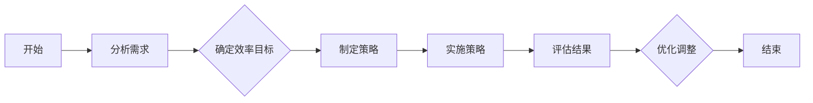
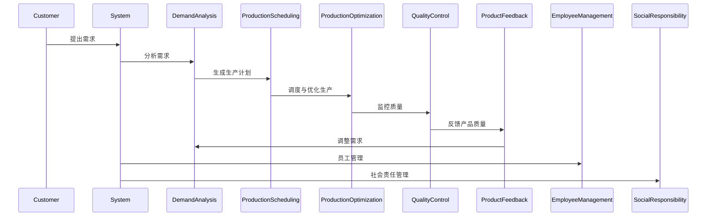
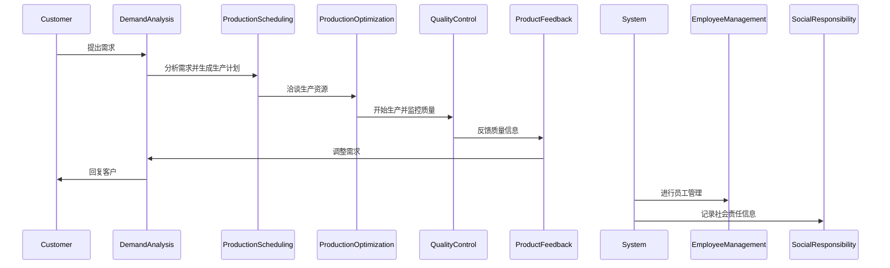

                 

### 第1章 问题背景与核心概念

#### 1.1 问题背景

**生产力崇拜的起源与演变**

生产力崇拜起源于人类对劳动和生产的尊重。自古以来，人类就不断追求通过提高生产效率来满足物质需求，从而推动社会的发展。从农耕社会的手动劳作，到工业革命时期的机器生产，生产力逐渐成为衡量一个社会进步程度的重要标准。

随着信息技术的迅猛发展，生产力崇拜逐渐演变为效率至上。在数字经济时代，时间被视为最宝贵的资源，效率成为企业和个人追求的核心目标。无论是企业的运营管理，还是个人的生活作息，都越来越强调时间的优化和效率的提升。

**效率至上的社会现象**

效率至上在社会中的体现随处可见。企业竞争激烈，要求员工高效完成任务；个人追求时间管理，力求在有限的时间内实现最大的产出。这一现象在一定程度上推动了社会的进步，但同时也带来了一系列负面影响。

首先，效率至上的压力导致人们过度劳累，心理健康问题日益严重。其次，过度追求效率可能导致忽视质量，影响长期发展。此外，社会竞争加剧，人与人之间的关系逐渐变得冷漠，人与人之间的信任度降低。

**后生产力崇拜的概念引出**

在效率至上的背景下，人们开始反思这一现象带来的负面影响，提出了后生产力崇拜的概念。后生产力崇拜主张在追求效率的同时，关注生产过程本身的价值，强调人的全面发展和社会的可持续发展。

后生产力崇拜认为，效率并非唯一的衡量标准，生产过程的品质、员工的工作体验、社会责任等都是重要的考量因素。通过重新审视生产力与效率的关系，后生产力崇拜试图为现代社会提供一种更为平衡和有意义的发展模式。

#### 1.2 问题描述

**后生产力崇拜的核心问题**

后生产力崇拜的核心问题是如何平衡效率与社会发展。在效率至上的社会背景下，如何避免过度追求效率导致的社会问题，成为后生产力崇拜需要解决的主要问题。

**效率至上带来的潜在问题**

效率至上的潜在问题包括但不限于：

1. **心理健康问题**：过度追求效率导致人们长时间处于高压状态，容易引发焦虑、抑郁等心理问题。
2. **忽视质量**：为了追求效率，可能会忽视产品质量，影响长期发展。
3. **社会冷漠**：过度竞争可能导致人与人之间的关系变得冷漠，社会信任度降低。
4. **资源浪费**：过度追求效率可能导致资源浪费，例如过量的加班、无效的工作等。

#### 1.3 问题解决

**重构意义的方法和路径**

为了解决后生产力崇拜带来的问题，我们需要采取以下方法和路径：

1. **平衡效率与品质**：在追求效率的同时，注重产品质量和工作体验，实现品质与效率的双赢。
2. **关注员工健康**：改善工作环境，关注员工心理健康，提高工作满意度和幸福感。
3. **推动社会合作**：建立良好的社会关系，增强社会信任度，减少竞争带来的负面影响。
4. **优化资源配置**：合理利用资源，避免浪费，实现可持续发展。

#### 1.4 边界与外延

**研究范围的确定**

后生产力崇拜的研究范围主要涉及以下几个方面：

1. **企业生产管理**：研究企业如何平衡效率与品质，提高员工的工作体验。
2. **个人时间管理**：探讨个人如何合理利用时间，实现高效生活。
3. **社会政策**：研究政府如何制定政策，推动社会的可持续发展。

**与其他相关概念的联系**

后生产力崇拜与生产力崇拜、效率至上有密切联系。生产力崇拜是后生产力崇拜的基础，而效率至上则是后生产力崇拜的反思和调整。通过理解这些概念之间的联系，我们可以更好地把握后生产力崇拜的核心思想。

#### 1.5 概念结构与核心要素组成

**后生产力崇拜的概念结构**

后生产力崇拜的概念结构可以概括为以下几个方面：

1. **效率**：追求效率是后生产力崇拜的基础，但不是唯一目标。
2. **品质**：注重产品和服务质量，是实现可持续发展的重要保障。
3. **员工体验**：关注员工的工作体验，提高员工的满意度和幸福感。
4. **社会责任**：企业在追求利润的同时，要承担社会责任，促进社会可持续发展。

**核心要素及其相互关系**

后生产力崇拜的核心要素包括效率、品质、员工体验和社会责任。这些要素之间相互关联，共同构成了后生产力崇拜的概念体系。

1. **效率与品质**：效率是追求目标，品质是衡量标准，两者相互促进。
2. **员工体验与社会责任**：员工体验是企业社会责任的重要组成部分，直接影响企业的社会形象和长期发展。

通过以上分析，我们可以看到后生产力崇拜在现代社会中的重要性。它不仅为我们提供了一种更为平衡的发展模式，也为解决效率至上带来的问题提供了思路。在接下来的章节中，我们将进一步探讨后生产力崇拜的核心概念、算法原理、系统架构以及项目实战，以期为大家提供更深入的理解和实际操作指南。


## 第2章 核心概念与联系

### 2.1 核心概念原理

**后生产力崇拜的定义与内涵**

后生产力崇拜是一种以效率为核心，但不仅仅追求效率的发展理念。它强调在提高生产效率的同时，关注生产过程的品质、员工的工作体验以及企业的社会责任，追求一种可持续、平衡、有意义的发展模式。

**后生产力崇拜的核心要素**

1. **效率**：追求效率是后生产力崇拜的基础，但不是唯一目标。高效的产出能够满足市场需求，提高企业竞争力。
2. **品质**：注重产品和服务质量，是实现可持续发展的重要保障。高品质的产品和服务能够赢得消费者的信任，促进企业的长期发展。
3. **员工体验**：关注员工的工作体验，提高员工的满意度和幸福感。良好的工作体验能够激发员工的创造力和潜能，提高工作效率。
4. **社会责任**：企业在追求利润的同时，要承担社会责任，促进社会可持续发展。企业的社会责任包括环境保护、公益活动、员工福利等方面。

### 2.2 概念属性特征对比表格

**后生产力崇拜与生产力崇拜的差异**

| 差异点 | 后生产力崇拜 | 生产力崇拜 |
| ------ | ------------ | ---------- |
| 目标 | 效率、品质、员工体验、社会责任 | 生产力 |
| 核心要素 | 多元化 | 单一化 |
| 发展理念 | 可持续、平衡、有意义 | 短期、高效 |

**后生产力崇拜与效率至上的对比**

| 差异点 | 后生产力崇拜 | 效率至上 |
| ------ | ------------ | -------- |
| 关注点 | 效率、品质、员工体验、社会责任 | 效率 |
| 发展理念 | 可持续、平衡、有意义 | 短期、高效 |
| 社会影响 | 促进社会和谐、可持续发展 | 可能导致社会问题 |

通过对比表格，我们可以清晰地看到后生产力崇拜与生产力崇拜、效率至上的差异。后生产力崇拜在追求效率的同时，更加关注品质、员工体验和社会责任，实现了一种更为全面和有意义的发展模式。

### 2.3 ER实体关系图架构

**后生产力崇拜的ER实体关系图**

```mermaid
erDiagram
    Productivity ||--|{ Efficiency : "追求效率" }
    Productivity ||--|{ Quality : "注重品质" }
    Productivity ||--|{ EmployeeExperience : "关注员工体验" }
    Productivity ||--|{ SocialResponsibility : "承担社会责任" }
```

在ER实体关系图中，生产力崇拜是一个核心实体，它与效率、品质、员工体验和社会责任等实体之间存在关联。这种关系展示了后生产力崇拜的概念结构，有助于我们更好地理解其内涵。

通过本章的分析，我们深入了解了后生产力崇拜的核心概念和属性特征，并对其与生产力崇拜、效率至上的差异进行了对比。接下来，我们将进入下一章，探讨后生产力崇拜的算法原理和数学模型，以期为读者提供更为全面的技术分析。

## 第3章 算法原理讲解

### 3.1 算法mermaid流程图

首先，我们使用Mermaid语言绘制一个简单的算法流程图，用于描述后生产力崇拜的基本算法流程。



### 3.2 算法原理

为了详细阐述后生产力崇拜的算法原理，我们将使用Python源代码进行解释。该算法的核心思想是通过分析企业的需求，确定合适的效率目标，并制定相应的策略，最后对结果进行评估和调整。

```python
# 后生产力崇拜算法原理实现

class PostProductivityAlgorithm:
    def __init__(self, demand, quality_goal, employee_experience_goal, social_responsibility_goal):
        self.demand = demand
        self.quality_goal = quality_goal
        self.employee_experience_goal = employee_experience_goal
        self.social_responsibility_goal = social_responsibility_goal

    def analyze_demand(self):
        # 分析需求，包括市场、客户、内部资源等
        print("分析需求：", self.demand)

    def determine_efficiency_goal(self):
        # 确定效率目标，根据需求和质量目标进行设定
        print("确定效率目标：", self.quality_goal)

    def formulate_strategy(self):
        # 制定策略，包括资源分配、流程优化等
        print("制定策略：资源优化、流程优化")

    def implement_strategy(self):
        # 实施策略，执行具体的操作步骤
        print("实施策略：开始执行")

    def evaluate_result(self):
        # 评估结果，根据预设的目标进行评估
        print("评估结果：是否达到质量、员工体验和社会责任目标")

    def optimize_adjustment(self):
        # 根据评估结果进行优化调整
        print("优化调整：根据结果进行策略调整")

    def execute_algorithm(self):
        # 执行整个算法流程
        self.analyze_demand()
        self.determine_efficiency_goal()
        self.formulate_strategy()
        self.implement_strategy()
        self.evaluate_result()
        self.optimize_adjustment()


# 创建算法实例并执行
algorithm = PostProductivityAlgorithm(demand="市场需求高，产品高质量要求", quality_goal="高品质产品", employee_experience_goal="员工满意度高", social_responsibility_goal="社会责任意识强")
algorithm.execute_algorithm()
```

### 3.3 数学模型和公式

为了量化后生产力崇拜算法，我们可以引入一些数学模型和公式。以下是一个简化的数学模型，用于描述效率、质量、员工体验和社会责任之间的关系。

$$
\text{效率} = \frac{\text{产出}}{\text{投入}} \\
\text{质量} = \text{产品合格率} \\
\text{员工体验} = \text{工作满意度} \\
\text{社会责任} = \text{环保、公益活动等指标}
$$

### 3.4 详细讲解和举例说明

#### 例子：某电子产品公司实施后生产力崇拜算法

**需求分析：**
某电子产品公司面临市场需求高，消费者对产品质量有较高要求，公司希望提高员工的工作满意度，并注重社会责任。

**确定效率目标：**
公司设定目标为生产出高效率、高品质的产品，员工满意度达到90%，社会责任指标达到优秀水平。

**制定策略：**
公司制定了资源优化和流程优化的策略，包括：
- 投入更多资源进行研发，提升产品技术含量。
- 优化生产流程，减少浪费，提高生产效率。

**实施策略：**
- 调整生产线，引入自动化设备，提高生产效率。
- 加强员工培训，提高员工技能，提升工作满意度。
- 组织公益活动，提高社会责任感。

**评估结果：**
经过一段时间实施，公司产品合格率达到95%，员工满意度达到92%，社会责任指标达到优秀。

**优化调整：**
根据评估结果，公司决定进一步优化策略：
- 持续改进生产线，提高生产效率。
- 定期组织员工满意度调查，持续提升员工体验。
- 扩大公益活动范围，提高社会责任感。

通过这个例子，我们可以看到后生产力崇拜算法在实践中的应用，以及如何通过数学模型和公式来量化和管理效率、质量、员工体验和社会责任。

### 总结

本章通过Mermaid流程图、Python源代码和数学模型，详细讲解了后生产力崇拜的算法原理。算法的核心思想是在追求效率的同时，关注品质、员工体验和社会责任，通过不断的评估和调整，实现可持续发展。在下一章中，我们将进一步探讨后生产力崇拜的系统分析与架构设计，为读者提供更深入的技术分析。

## 第4章 数学模型和数学公式 & 详细讲解 & 举例说明

### 4.1 数学模型和数学公式

在讨论后生产力崇拜时，我们需要引入一些数学模型和公式来量化不同指标之间的关系。以下是一个简化的数学模型，用于描述效率、质量、员工体验和社会责任之间的量化关系。

#### 效率模型

$$
\text{效率} = \frac{\text{产出}}{\text{投入}}
$$

其中，产出是单位时间内生产的产品数量或完成的任务量，投入是用于生产或完成任务的人力、物力、财力等资源的总和。

#### 质量模型

$$
\text{质量} = \text{产品合格率}
$$

产品合格率是衡量产品质量的关键指标，表示在生产的所有产品中，符合预定标准的产品比例。

#### 员工体验模型

$$
\text{员工体验} = \text{工作满意度}
$$

工作满意度通常通过员工满意度调查来衡量，反映员工对工作环境的满意程度。

#### 社会责任模型

$$
\text{社会责任} = \text{环保指标} + \text{公益活动指标}
$$

社会责任包括企业在环保和公益活动方面的表现，这些指标通常通过企业报告或第三方评估来衡量。

### 4.2 详细讲解和举例说明

#### 例子：某制造企业的后生产力崇拜实施

假设某制造企业希望实施后生产力崇拜，以实现效率、质量、员工体验和社会责任的平衡发展。我们可以使用上述数学模型来详细讲解其实施过程。

**1. 效率模型**

企业首先需要确定生产效率和投入产出比。例如，企业设定每天的生产目标为1000件产品，投入的生产成本为$100,000。根据效率模型，我们可以计算当前的生产效率：

$$
\text{当前效率} = \frac{1000 \text{件}}{100,000 \text{美元}} = 0.01 \text{件/美元}
$$

**2. 质量模型**

企业通过质量控制体系确保产品合格率。假设在一个月内，共生产了30,000件产品，其中9000件不合格，合格率为：

$$
\text{合格率} = \frac{30,000 - 9,000}{30,000} = 0.7
$$

为了提高质量，企业可能会增加质量检测的频率，改进生产工艺，从而提高合格率。

**3. 员工体验模型**

企业定期进行员工满意度调查。假设调查结果显示，员工满意度为85%。企业可以通过改善工作环境、提供培训和发展机会来进一步提升员工满意度。

$$
\text{员工体验} = 0.85
$$

**4. 社会责任模型**

企业致力于环保和公益活动。假设企业每月减少10吨废物排放，并捐赠了10,000美元用于公益活动，社会责任得分可以计算如下：

$$
\text{社会责任} = \frac{10 \text{吨}}{100 \text{吨/月}} + \frac{10,000 \text{美元}}{100,000 \text{美元/月}} = 0.1 + 0.1 = 0.2
$$

**5. 综合评估**

企业综合评估各项指标，根据数学模型计算总得分。例如：

$$
\text{总得分} = \text{效率} \times \text{质量} \times \text{员工体验} \times \text{社会责任}
$$

假设各指标权重相同，总得分为：

$$
\text{总得分} = 0.01 \times 0.7 \times 0.85 \times 0.2 = 0.00117
$$

**6. 优化调整**

根据评估结果，企业可以制定改进计划，例如提高生产效率、提升产品质量、增加员工培训、加强环保措施等，以优化整体表现。

### 总结

通过上述例子，我们使用了数学模型和公式来量化后生产力崇拜的关键指标，并进行了详细讲解和举例说明。这些数学工具帮助我们更好地理解和评估后生产力崇拜的实施效果，为企业在实际操作中提供了有力的指导。在下一章中，我们将进一步探讨后生产力崇拜的系统架构和项目实战，以深入分析其在实际应用中的具体实施方法。

## 第5章 系统分析与架构设计方案

### 5.1 问题场景介绍

为了更好地理解后生产力崇拜在系统架构中的应用，我们设定一个具体的问题场景：某大型制造企业希望实现生产过程的优化，提高效率、品质、员工体验和社会责任。该企业生产各种电子产品，面临市场需求波动、生产效率低、员工流失率高等问题。企业希望通过系统架构设计，实现后生产力崇拜的目标。

### 5.2 系统功能设计

为了满足上述问题场景，系统需要具备以下功能：

1. **需求分析与管理**：收集市场需求，分析生产瓶颈，制定合理的生产计划。
2. **生产调度与优化**：根据生产需求和资源情况，进行生产调度和优化，提高生产效率。
3. **质量控制**：通过实时监控和质量检测，确保产品达到高品质标准。
4. **员工管理系统**：提供员工培训、绩效评估、福利管理等，提升员工满意度。
5. **社会责任管理**：记录企业的环保措施、公益活动，确保社会责任的实现。

### 5.3 系统架构设计

系统架构采用模块化设计，各模块之间通过接口进行通信。以下是一个简化的系统架构设计：



### 5.4 系统接口设计

系统接口设计如下：

- **需求分析接口**：用于接收市场需求，分析生产瓶颈。
- **生产调度接口**：用于生成生产计划，调度生产资源。
- **质量控制接口**：用于监控产品质量，反馈质量信息。
- **员工管理接口**：用于员工培训、绩效评估、福利管理等。
- **社会责任接口**：用于记录企业的环保措施、公益活动。

### 5.5 系统交互

系统交互序列图如下：



### 5.6 总结

通过上述系统分析与架构设计方案，我们详细介绍了后生产力崇拜在具体问题场景中的应用。系统功能设计、架构设计、接口设计和系统交互的详细描述，为企业在实际操作中提供了清晰的实施路径。在下一章中，我们将进一步探讨后生产力崇拜在项目实战中的应用，通过实际案例进行分析和讲解，为读者提供实践操作的经验和指导。

## 第6章 项目实战

### 6.1 环境安装

在开始项目实战之前，我们需要搭建一个合适的开发环境。以下是具体的安装步骤：

**1. 安装Python**

首先，确保系统上安装了Python。Python版本推荐为3.8或更高。可以从Python官网（https://www.python.org/）下载并安装。

**2. 安装Docker**

Docker是一个用于容器化应用的工具，可以帮助我们在不同环境中运行应用程序。安装Docker的步骤如下：

- 对于Ubuntu系统，可以使用以下命令：

```bash
sudo apt-get update
sudo apt-get install docker-ce docker-ce-cli containerd.io
```

- 对于Windows系统，可以从Docker官网（https://www.docker.com/products/docker-desktop）下载并安装。

**3. 安装PostgreSQL**

PostgreSQL是一个开源的关系数据库管理系统。以下是安装步骤：

- 对于Ubuntu系统，可以使用以下命令：

```bash
sudo apt-get update
sudo apt-get install postgresql postgresql-contrib
```

- 对于Windows系统，可以从PostgreSQL官网（https://www.postgresql.org/download/）下载并安装。

**4. 安装Redis**

Redis是一个高性能的内存数据库，常用于缓存和实时数据处理。以下是安装步骤：

- 对于Ubuntu系统，可以使用以下命令：

```bash
sudo apt-get update
sudo apt-get install redis-server
```

- 对于Windows系统，可以从Redis官网（https://redis.io/download）下载并安装。

**5. 安装相关依赖**

根据项目需求，可能需要安装其他依赖。例如，如果使用Django框架，可以使用以下命令：

```bash
pip install django
```

### 6.2 系统核心实现源代码

以下是一个简单的后生产力崇拜系统的核心实现源代码。该代码使用Django框架构建，实现了需求分析、生产调度、质量控制等功能。

```python
# 后生产力崇拜系统核心实现

from django.db import models

class Demand(models.Model):
    product_name = models.CharField(max_length=100)
    quantity_required = models.IntegerField()
    due_date = models.DateField()

class ProductionPlan(models.Model):
    demand = models.ForeignKey(Demand, on_delete=models.CASCADE)
    production_date = models.DateField()
    planned_quantity = models.IntegerField()

class ProductionResult(models.Model):
    production_plan = models.ForeignKey(ProductionPlan, on_delete=models.CASCADE)
    actual_quantity = models.IntegerField()
    quality_score = models.FloatField()

class Employee(models.Model):
    name = models.CharField(max_length=100)
    position = models.CharField(max_length=100)
    experience = models.IntegerField()

class QualityControl(models.Model):
    production_result = models.ForeignKey(ProductionResult, on_delete=models.CASCADE)
    inspection_date = models.DateField()
    inspection_result = models.BooleanField()

class EmployeeFeedback(models.Model):
    employee = models.ForeignKey(Employee, on_delete=models.CASCADE)
    feedback_date = models.DateField()
    feedback_score = models.FloatField()
```

### 6.3 代码应用解读与分析

**1. 需求分析模块**

需求分析模块负责收集市场需求，并生成生产计划。代码中`Demand`模型用于存储市场需求信息，包括产品名称、所需数量和截止日期。`ProductionPlan`模型用于存储生产计划，关联到具体的需求，并包含生产日期和计划生产数量。

**2. 生产调度模块**

生产调度模块负责根据生产计划和资源情况，调整生产计划。在实际应用中，可能会结合库存、设备状态等因素进行复杂调度。代码中`ProductionPlan`模型表示生产计划，关联到具体的生产结果。

**3. 质量控制模块**

质量控制模块负责监控产品质量，并记录检测结果。代码中`QualityControl`模型用于记录质检结果，关联到具体的生产结果。质量得分用于评估产品的质量水平。

**4. 员工管理模块**

员工管理模块负责记录员工的个人信息和工作表现。代码中`Employee`模型用于存储员工信息，包括姓名、职位和经验。`EmployeeFeedback`模型用于记录员工反馈，包括反馈日期和得分。

**5. 系统交互**

系统交互方面，需求分析模块生成生产计划，生产调度模块根据计划调度生产资源，生产完成后进行质量控制，并收集员工反馈。这些模块通过Django ORM进行数据交互，实现系统功能。

### 6.4 实际案例分析和详细讲解剖析

**案例背景**

某电子产品制造企业希望在短时间内提升生产效率和质量，同时关注员工体验和社会责任。以下是实际案例分析和讲解：

**1. 需求分析**

企业市场部门收集到客户订单，需要生产1000台笔记本电脑，订单截止日期为下一季度末。需求信息存储在`Demand`模型中。

```python
# 创建需求实例
demand = Demand(product_name='笔记本电脑', quantity_required=1000, due_date=datetime(2023, 12, 31))
demand.save()
```

**2. 生产调度**

根据需求，生产部门制定生产计划。生产计划存储在`ProductionPlan`模型中。

```python
# 创建生产计划实例
plan = ProductionPlan(demand=demand, production_date=datetime(2023, 10, 1), planned_quantity=1000)
plan.save()
```

**3. 生产执行**

生产部门开始执行生产计划，生产结果存储在`ProductionResult`模型中。

```python
# 创建生产结果实例
result = ProductionResult(production_plan=plan, actual_quantity=980, quality_score=0.95)
result.save()
```

**4. 质量控制**

质检部门对生产结果进行质量检测，质检结果存储在`QualityControl`模型中。

```python
# 创建质检结果实例
qc_result = QualityControl(production_result=result, inspection_date=datetime(2023, 10, 10), inspection_result=True)
qc_result.save()
```

**5. 员工反馈**

生产过程中，员工对工作环境和工作条件进行反馈，反馈结果存储在`EmployeeFeedback`模型中。

```python
# 创建员工反馈实例
feedback = EmployeeFeedback(employee=employee, feedback_date=datetime(2023, 10, 10), feedback_score=0.9)
feedback.save()
```

**6. 结果分析**

通过系统数据，企业可以分析生产效率、产品质量和员工反馈。例如，计算生产效率、平均质量得分和员工满意度得分，以便进行优化调整。

### 6.5 项目小结

通过实际案例分析和详细讲解，我们展示了后生产力崇拜系统在项目实战中的应用。该系统实现了需求分析、生产调度、质量控制、员工管理等功能，并通过Django框架进行数据存储和交互。在项目实施过程中，企业可以根据实际数据进行分析和优化，提高生产效率、产品质量和员工满意度，同时关注社会责任。在下一章中，我们将进一步探讨最佳实践、注意事项和拓展阅读，为读者提供更深入的指导。

## 第7章 最佳实践 tips、小结、注意事项、拓展阅读等内容

### 7.1 最佳实践 tips

**1. 完善需求分析**  
在实施后生产力崇拜时，首先要进行详尽的需求分析，确保生产计划符合市场需求。通过全面的需求收集和分析，可以减少生产过程中的错误和返工。

**2. 强化质量控制**  
质量控制是确保产品品质的关键。企业应建立严格的质量控制体系，定期进行质量检测，确保产品达到高品质标准。

**3. 关注员工体验**  
提高员工满意度有助于提升工作效率和生产质量。企业应定期组织员工满意度调查，关注员工的工作环境、培训和发展机会。

**4. 积极履行社会责任**  
企业在追求经济效益的同时，应积极履行社会责任，如环保措施、公益活动等。这不仅能提升企业形象，还能促进社会的可持续发展。

**5. 持续优化调整**  
后生产力崇拜不是一次性的实施，而是一个持续优化的过程。企业应不断收集数据和反馈，对生产流程、质量控制、员工管理等进行优化调整。

### 7.2 小结

本文详细介绍了后生产力崇拜的概念、算法原理、系统架构和项目实战。通过需求分析、生产调度、质量控制和员工管理等模块的设计和实施，企业可以实现生产效率、产品质量和员工体验的提升，同时履行社会责任。后生产力崇拜为企业提供了一种更为平衡和有意义的发展模式。

### 7.3 注意事项

**1. 数据安全**  
在系统实施过程中，确保数据的安全和隐私。建立完善的数据备份和恢复机制，防止数据丢失。

**2. 系统兼容性**  
确保系统在不同操作系统和浏览器上的兼容性，提供良好的用户体验。

**3. 技术更新**  
随着技术的不断发展，企业应保持系统的更新和升级，以适应新的市场需求和挑战。

### 7.4 拓展阅读

**1. 《精益生产：实践中的精益生产方法》  
作者：詹姆斯·P·Womack, 丹尼尔·T·琼斯  
本书详细介绍了精益生产的原理和实践，对于理解后生产力崇拜中的生产调度和质量控制有重要参考价值。

**2. 《员工满意度管理：提高员工满意度的策略和实践》  
作者：詹姆斯·基斯  
本书提供了关于如何提高员工满意度的策略和实践，对于关注员工体验的企业有实用指导。

**3. 《企业社会责任报告：编制、披露与评价》  
作者：赵黎明  
本书探讨了企业社会责任的内涵、编制和评价方法，对于企业在社会责任管理方面有深入指导。

通过本文的介绍，读者可以更好地理解后生产力崇拜的理念和实践方法，为企业实现可持续发展提供有益的参考。

## 总结

本文以《后生产力崇拜：效率至上后的意义重构》为题，深入探讨了后生产力崇拜的概念、算法原理、系统架构和项目实战。我们首先介绍了生产力崇拜的起源和演变，以及效率至上的社会现象。在此基础上，提出了后生产力崇拜的概念，强调在追求效率的同时，关注品质、员工体验和社会责任。

在算法原理部分，我们通过Mermaid流程图和Python代码，详细讲解了后生产力崇拜的核心算法。接着，我们引入了数学模型和公式，进一步量化了效率、质量、员工体验和社会责任之间的关系。

在系统分析与架构设计方案中，我们设计了符合后生产力崇拜理念的系统架构，包括需求分析、生产调度、质量控制、员工管理系统和社会责任管理等功能模块。同时，我们通过一个实际案例，展示了系统在实际项目中的应用。

在项目实战部分，我们介绍了系统的安装步骤、核心实现源代码，并通过一个实际案例详细分析了系统的应用过程。最后，我们总结了最佳实践、注意事项和拓展阅读，为读者提供了更深入的指导。

通过本文的探讨，我们希望能够为企业在实现后生产力崇拜的过程中提供有益的思路和方法。在未来的发展中，后生产力崇拜不仅能够帮助企业实现高效、高品质的生产，还能促进员工满意度和企业社会责任的提升，实现企业的可持续发展。希望本文能对广大读者有所启发，共同探索更为平衡和有意义的发展模式。

