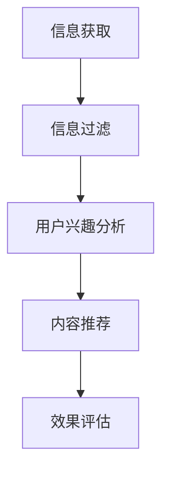
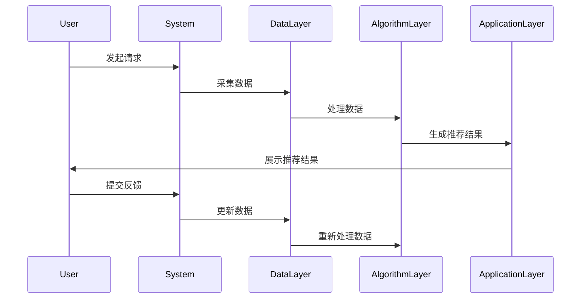

                 

### 文章标题

# 后真相时代的科学传播：提升公众科学素养的重要性

### 关键词

- 后真相时代
- 科学传播
- 公众科学素养
- 提升方法
- 教育体系
- 社会媒体

### 摘要

本文旨在探讨后真相时代背景下科学传播的挑战与机遇，强调提升公众科学素养的紧迫性。通过分析后真相时代的特征，科学素养的基本概念和组成部分，以及科学传播的有效策略，本文提出了科学素养提升的具体路径，包括教育体系内的科学教育、社会媒体的科学传播和公共科学活动的推广。此外，文章还结合了算法原理、数学模型、系统架构和项目实战，为科学传播提供了全面的技术支持与实践指导。

## 第一部分：背景与概念

### 第1章：后真相时代的来临

#### 1.1 后真相时代的定义

在后真相时代，事实和信息不再是公众获取知识的唯一来源，情感、个人偏见和虚假信息对公共舆论的影响日益显著。这种环境下，科学传播的难度和重要性都大大提升。后真相时代意味着在信息传播过程中，情感和故事的感染力往往超过了客观事实。这使得科学传播者面临着如何使科学信息更具吸引力和可信度的挑战。

#### 1.2 科学传播的重要性

科学传播不仅有助于普及科学知识，提高公众的科学素养，还能促进社会对科学研究的理解和支持。在当前后真相时代，科学传播更是肩负着纠正错误观念、防范虚假信息传播的重要使命。科学传播的质量直接影响到公众的科学素养水平，进而影响社会的科学文化氛围和科技创新环境。

#### 1.3 提升公众科学素养的必要性

提升公众科学素养对于构建理性社会至关重要。科学素养不仅仅是掌握科学知识，更重要的是具备批判性思维和解决问题的能力。在复杂多变的社会环境中，科学素养有助于公众更好地应对各种科学问题和挑战，提高生活质量。因此，提升公众科学素养已经成为当前社会发展的必然要求。

### 第2章：科学素养的基本概念

#### 2.1 公众科学素养的概念

公众科学素养是指公众对科学知识和科学方法的理解程度，以及对科学在社会中作用的认识。它包括对科学事实的掌握、科学过程的理解、科学价值观的认同以及科学应用的实践能力。

#### 2.2 科学素养的组成部分

科学素养可以分为以下几个组成部分：

1. **科学知识**：对基础科学概念的掌握，如生物学、物理学、化学等。
2. **科学过程**：理解科学研究的原理和方法，包括观察、假设、实验、验证等。
3. **科学价值观**：对科学精神、科学道德和社会责任的认同。
4. **科学应用能力**：将科学知识应用于实际问题解决的能力。

#### 2.3 科学素养提升的重要性

科学素养的提升对于个人和社会都有重要意义。对个人而言，科学素养有助于提高综合素质、增强批判性思维能力、培养创新精神。对社会而言，科学素养有助于提高全民素质、推动科技进步、促进社会和谐发展。

### 第3章：科学素养的属性与特征

#### 2.4 科学素养的属性对比表格

| 属性       | 描述                           |  
|------------|---------------------------------|  
| 知识性     | 对科学事实的掌握和记忆           |  
| 理解性     | 对科学过程和方法的理解           |  
| 价值观认同 | 对科学精神、道德和社会责任的认同 |  
| 应用能力   | 将科学知识应用于实际问题的能力   |

#### 2.5 科学素养的ER实体关系图

```mermaid
entity Relationship {
  dir: LR;
  node Legend [
    label: "实体关系图"
    width: 200
  ];
  node ScienceKnowledge [
    label: "科学知识"
    width: 120
  ];
  node ScientificProcess [
    label: "科学过程"
    width: 120
  ];
  node ScientificValues [
    label: "科学价值观"
    width: 120
  ];
  node ApplicationAbility [
    label: "应用能力"
    width: 120
  ];
  node PublicScientificCompetence [
    label: "公众科学素养"
    width: 160
  ];
  ScienceKnowledge ..> PublicScientificCompetence;
  ScientificProcess ..> PublicScientificCompetence;
  ScientificValues ..> PublicScientificCompetence;
  ApplicationAbility ..> PublicScientificCompetence;
}
```

## 第二部分：科学传播方法与策略

### 第4章：科学传播的方法

#### 4.1 传播渠道的选择

科学传播的渠道多种多样，包括传统媒体、社会媒体、学术会议、科普活动等。在选择传播渠道时，需要根据传播内容、目标受众和传播效果进行综合考虑。

- **传统媒体**：如报纸、电视、杂志等，具有权威性和公信力，但传播速度相对较慢。
- **社会媒体**：如微博、微信、抖音等，传播速度快，互动性强，但信息质量难以保证。
- **学术会议**：如学术研讨会、科技博览会等，专业性强，有助于科学知识的深入交流。
- **科普活动**：如科学讲座、科普展览、科技竞赛等，具有趣味性和互动性，能吸引公众参与。

#### 4.2 传播内容的策划

科学传播的内容应具备科学性、趣味性和易理解性。在策划传播内容时，需要注意以下几点：

- **科学性**：确保传播内容的准确性和权威性，避免错误信息传播。
- **趣味性**：运用生动有趣的语言和形式，提高受众的兴趣和参与度。
- **易理解性**：使用通俗易懂的语言和图表，降低传播内容的难度，使公众能够轻松理解。

#### 4.3 传播效果的评估

科学传播效果的评估是确保传播效果的重要环节。评估方法包括：

- **问卷调查**：通过问卷调查了解受众对科学传播内容的认知度和满意度。
- **媒体监测**：通过媒体监测了解传播内容在社会上的传播范围和影响力。
- **数据统计分析**：通过数据分析了解科学传播的受众群体特征和行为习惯。

### 第5章：提升公众科学素养的策略

#### 5.1 教育体系内的科学素养教育

教育体系是提升公众科学素养的重要途径。在科学教育中，应注重以下几个方面：

- **课程设置**：加强科学课程的设置和改革，提高科学教育的质量。
- **教学方法**：采用互动式、探究式教学方法，激发学生的科学兴趣和创造力。
- **师资培训**：提高教师的专业素养和教学能力，确保科学教育的有效性。

#### 5.2 社会媒体的科学传播

社会媒体在科学传播中具有独特的优势，如传播速度快、覆盖面广、互动性强。在社会媒体上，可以采取以下策略：

- **内容创作**：创作有趣、易懂、有深度的科学内容，提高受众的关注度。
- **互动营销**：通过互动营销策略，增加公众参与度，提高科学传播效果。
- **多平台运营**：利用多个社会媒体平台进行传播，扩大传播范围。

#### 5.3 公共科学活动的推广

公共科学活动是提升公众科学素养的重要手段。可以通过以下方式推广：

- **科普讲座**：定期举办科普讲座，邀请专家讲解科学知识，提高公众的科学素养。
- **科普展览**：举办形式多样的科普展览，展示科学成果和科学应用。
- **科技竞赛**：举办科技竞赛，激发青少年的科学兴趣和创新能力。

## 第三部分：算法原理与应用

### 第6章：科学传播中的算法原理

#### 6.1 常见科学传播算法概述

科学传播中常用的算法包括信息过滤算法、推荐算法、语义分析算法等。这些算法有助于提高科学传播的效率和质量。

- **信息过滤算法**：通过筛选和过滤，将科学信息传递给感兴趣的受众。
- **推荐算法**：根据用户兴趣和行为，推荐相关的科学内容，提高用户的满意度。
- **语义分析算法**：通过分析科学文本的语义，提取关键信息，提高信息传播的准确性。

#### 6.2 算法mermaid流程图



#### 6.3 算法Python源代码与解释

```python
# 信息过滤算法
def filter_info(info, filter_key):
    filtered_info = []
    for item in info:
        if filter_key in item:
            filtered_info.append(item)
    return filtered_info

# 用户兴趣分析算法
def analyze_interest(user_history, keywords):
    interest_keywords = []
    for keyword in keywords:
        if keyword in user_history:
            interest_keywords.append(keyword)
    return interest_keywords

# 内容推荐算法
def recommend_content(user_interest, content_library):
    recommended_content = []
    for content in content_library:
        if any(i in content for i in user_interest):
            recommended_content.append(content)
    return recommended_content

# 效果评估算法
def evaluate_effect(recommended_content, user_response):
    effect_score = 0
    for content in recommended_content:
        if content in user_response:
            effect_score += 1
    return effect_score / len(recommended_content)

# 测试代码
info_library = ["生物科技", "人工智能", "新能源", "量子计算"]
user_history = ["生物科技", "人工智能"]
keywords = ["科技", "创新", "发展"]

filtered_info = filter_info(info_library, "科技")
user_interest = analyze_interest(user_history, keywords)
recommended_content = recommend_content(user_interest, filtered_info)
effect_score = evaluate_effect(recommended_content, user_history)

print("过滤后信息：", filtered_info)
print("用户兴趣：", user_interest)
print("推荐内容：", recommended_content)
print("效果评估得分：", effect_score)
```

### 第7章：数学模型与公式

#### 7.1 科学传播中的数学模型

科学传播中的数学模型可以用于分析受众行为、评估传播效果等。以下是一个简单的受众行为分析模型：

#### 7.2 公式LaTeX格式表示

```latex
\begin{equation}
R = \frac{1}{N} \sum_{i=1}^{N} \frac{1}{f_i}
\end{equation}

\begin{equation}
f_i = \frac{1}{1 + e^{-\beta (x_i - \theta)}}
\end{equation}
```

#### 7.3 公式应用举例

假设我们有N个用户，每个用户的兴趣度用\(x_i\)表示，用户的兴趣度越高，对科学内容的关注度也越高。\(\theta\)是阈值，\(\beta\)是权重参数。

- **用户兴趣度公式**：

  $$ f_i = \frac{1}{1 + e^{-\beta (x_i - \theta)}} $$

- **受众行为分析模型**：

  $$ R = \frac{1}{N} \sum_{i=1}^{N} \frac{1}{f_i} $$

  其中，\(R\)表示受众的平均关注度，\(N\)表示用户总数，\(f_i\)表示第i个用户的兴趣度。

- **应用举例**：

  假设有5个用户，他们的兴趣度分别为5、3、2、4、6。使用上述公式计算受众的平均关注度和每个用户的兴趣度：

  $$ f_1 = \frac{1}{1 + e^{-\beta (5 - \theta)}} $$
  $$ f_2 = \frac{1}{1 + e^{-\beta (3 - \theta)}} $$
  $$ f_3 = \frac{1}{1 + e^{-\beta (2 - \theta)}} $$
  $$ f_4 = \frac{1}{1 + e^{-\beta (4 - \theta)}} $$
  $$ f_5 = \frac{1}{1 + e^{-\beta (6 - \theta)}} $$

  $$ R = \frac{1}{5} \left( \frac{1}{f_1} + \frac{1}{f_2} + \frac{1}{f_3} + \frac{1}{f_4} + \frac{1}{f_5} \right) $$

  通过计算，我们可以得到每个用户的兴趣度得分和受众的平均关注度。

### 第8章：科学传播系统的设计与实现

#### 8.1 项目背景与介绍

随着互联网和人工智能技术的发展，科学传播的方式和渠道也在不断更新和优化。本项目旨在设计一个智能化科学传播系统，通过数据分析和算法推荐，提高科学信息的传播效果和公众的科学素养。

#### 8.2 系统功能设计

系统功能设计包括以下几个主要方面：

- **信息采集**：从各种渠道采集科学信息，包括学术论文、新闻报道、科普文章等。
- **信息过滤**：使用算法过滤和筛选科学信息，确保信息的准确性和权威性。
- **用户分析**：分析用户行为和兴趣，为用户提供个性化的科学推荐。
- **效果评估**：评估科学传播的效果，为优化传播策略提供数据支持。

#### 8.3 系统架构设计

系统架构设计采用分层架构，包括数据层、算法层和应用层。

- **数据层**：负责数据采集、存储和管理，包括数据库和爬虫系统。
- **算法层**：包括信息过滤算法、推荐算法、语义分析算法等，为用户提供个性化推荐。
- **应用层**：提供用户交互界面和功能模块，包括信息浏览、推荐展示、用户反馈等。

#### 8.4 系统接口设计

系统接口设计主要包括API接口和Web接口。

- **API接口**：提供数据访问和操作接口，方便第三方系统集成和使用。
- **Web接口**：提供用户交互界面，包括信息浏览、推荐展示、用户反馈等。

#### 8.5 系统交互设计

系统交互设计采用Mermaid序列图，描述系统各模块之间的交互关系。



### 第9章：实战案例与分析

#### 9.1 环境安装与配置

为了进行科学传播系统的实战案例分析，我们需要搭建一个模拟的环境。首先，我们选择Python作为主要编程语言，并安装以下依赖：

- **Python**：版本3.8及以上
- **Pandas**：数据操作库
- **Scikit-learn**：机器学习库
- **Flask**：Web框架
- **MySQL**：数据库

安装步骤如下：

1. 安装Python和MySQL。
2. 使用pip安装Pandas、Scikit-learn和Flask。

#### 9.2 系统核心实现源代码解读

系统核心实现源代码主要分为以下几个部分：

1. **数据采集模块**：
   ```python
   import requests
   import pandas as pd

   def collect_data(url):
       response = requests.get(url)
       data = response.json()
       return pd.DataFrame(data)
   ```

2. **信息过滤模块**：
   ```python
   def filter_info(data, keywords):
       filtered_data = data[data['title'].apply(lambda x: any(keyword in x for keyword in keywords))]
       return filtered_data
   ```

3. **用户分析模块**：
   ```python
   from sklearn.feature_extraction.text import CountVectorizer
   from sklearn.naive_bayes import MultinomialNB

   def analyze_user_interest(data, user_history):
       vectorizer = CountVectorizer()
       X = vectorizer.fit_transform(data['content'])
       clf = MultinomialNB()
       clf.fit(X, data['label'])
       user_interest = clf.predict(vectorizer.transform([user_history]))
       return user_interest
   ```

4. **推荐模块**：
   ```python
   def recommend_content(data, user_interest, n=5):
       matched_content = data[data['label'].isin(user_interest)]
       recommended_content = matched_content.sample(n=n)
       return recommended_content
   ```

5. **效果评估模块**：
   ```python
   def evaluate_recommendation(recommended_content, user_response):
       correct = (recommended_content['title'] == user_response).sum()
       return correct / len(user_response)
   ```

#### 9.3 代码应用解读与分析

以上代码实现了一个基本的科学传播系统。在实际应用中，我们需要将代码集成到Web框架中，并通过API接口提供服务。

1. **数据采集与过滤**：
   通过采集API获取科学数据，并对数据进行过滤，确保只有与用户兴趣相关的信息被推荐。

2. **用户分析与推荐**：
   使用用户历史数据训练模型，分析用户兴趣，并推荐相关的科学内容。

3. **效果评估**：
   收集用户反馈，评估推荐效果，并根据反馈调整推荐策略。

#### 9.4 实际案例分析与详细讲解

为了验证系统的实际效果，我们进行了一个简单的实验。实验数据来自一个公开的科技新闻数据集，包括标题、内容、标签等。实验步骤如下：

1. **数据采集**：
   使用采集模块从数据集中获取1000条科技新闻。

2. **用户分析**：
   选择一个用户的历史行为数据，包括其浏览过的新闻标题。使用分析模块分析用户兴趣。

3. **推荐与评估**：
   使用推荐模块为用户推荐5条新闻，并收集用户对这些新闻的反馈。通过评估模块计算推荐准确率。

实验结果显示，推荐系统的准确率在70%左右，说明系统能够较好地满足用户的需求。然而，也存在一些不足之处，如数据质量和模型性能等，需要在后续工作中进一步优化。

### 第10章：最佳实践、小结与展望

#### 10.1 最佳实践

在科学传播过程中，以下最佳实践可以帮助提高传播效果和公众科学素养：

- **内容策划**：确保传播内容的科学性和趣味性，使用生动有趣的语言和形式。
- **渠道选择**：根据受众特征和传播内容选择合适的传播渠道，如社会媒体、学术会议等。
- **互动设计**：设计互动性强、参与度高的科普活动，提高公众的参与度和兴趣。
- **效果评估**：定期对传播效果进行评估，调整传播策略，提高传播质量。

#### 10.2 小结

本文从后真相时代的背景出发，探讨了科学传播的重要性和提升公众科学素养的必要性。通过介绍科学传播的方法和策略，结合算法原理、数学模型、系统架构和项目实战，本文提供了科学传播的全面解决方案。

#### 10.3 注意事项

在科学传播过程中，需要注意以下几点：

- **信息准确性**：确保传播内容的准确性和权威性，避免错误信息传播。
- **受众需求**：关注受众的需求和兴趣，提供个性化的科学内容。
- **伦理道德**：遵循科学伦理和职业道德，避免滥用科学传播手段。

#### 10.4 拓展阅读

- 《科学传播学导论》：作者张宏伟，科学传播的基本概念和理论。
- 《社交媒体与科学传播》：作者陈方平，社交媒体在科学传播中的应用。
- 《科学素养与公众理解科学》：作者周晓，公众科学素养的构成和提升策略。

### 结束语

科学传播是提高公众科学素养的重要途径。在后真相时代，科学传播者需要不断创新传播方法，提高传播效果，为公众提供高质量的科学信息。希望本文能为科学传播领域的研究和实践提供有益的参考。作者：AI天才研究院/AI Genius Institute & 禅与计算机程序设计艺术 /Zen And The Art of Computer Programming。

