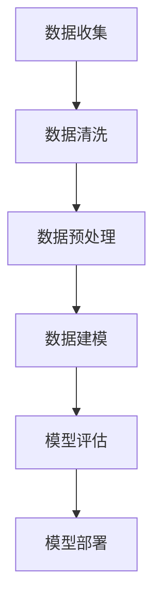
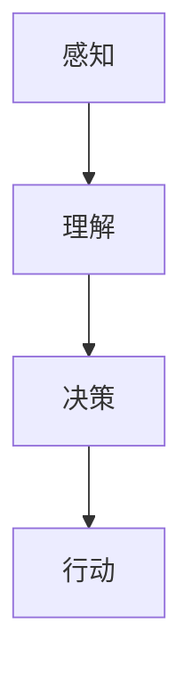
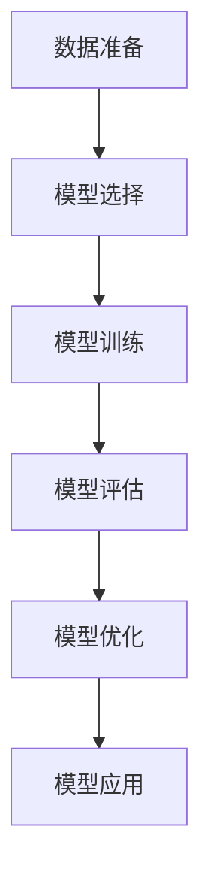
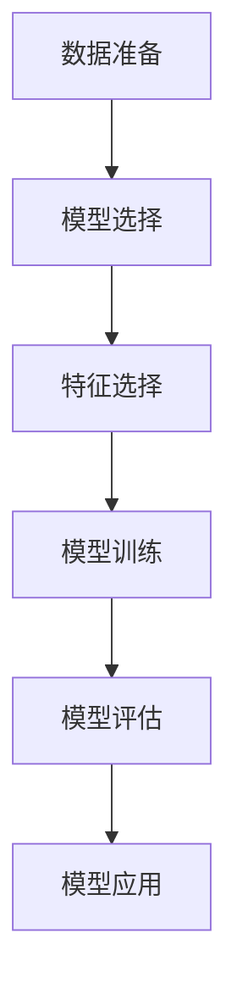
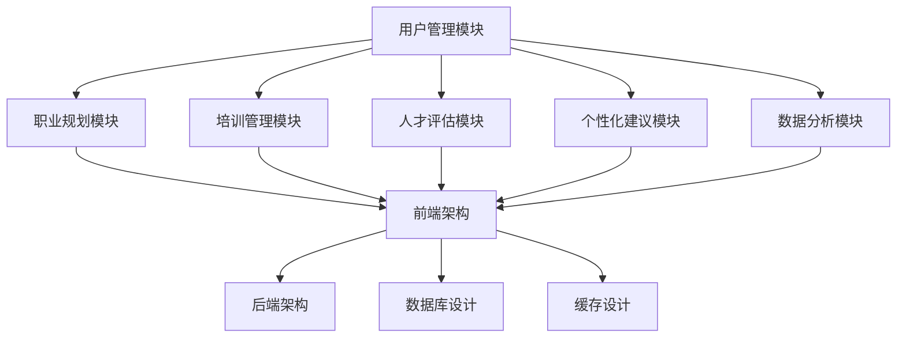
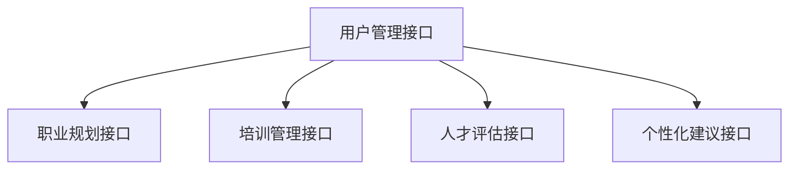
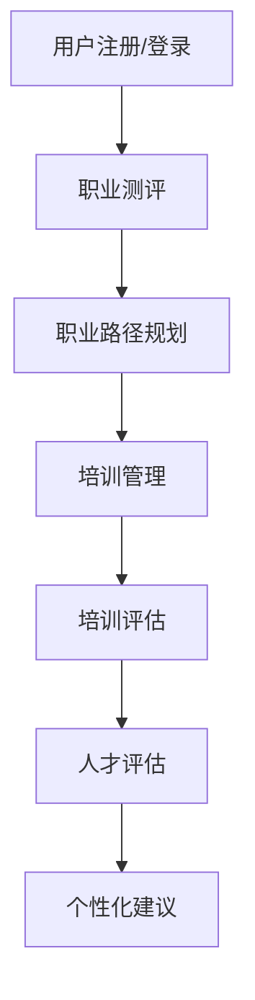

                 

### 文章标题

# 后职场时代：当工作不再定义我们时

### 关键词

- 后职场时代
- 职业路径
- 自我实现
- 多元化
- 创新与变革

### 摘要

随着科技的飞速发展和全球化进程的加速，职场环境发生了深刻变革。传统的工作定义正在逐渐瓦解，人们不再仅仅通过职业身份来定义自我。后职场时代，工作变得多元化和灵活性，个人自我实现成为重要目标。本文将探讨后职场时代的背景、特点及其对职场人、企业管理和社会的影响，并分析职场人如何适应这一变化，提出未来的发展趋势和应对策略。

## 第一部分: 后职场时代概述

### 第1章: 后职场时代背景

#### 1.1 工作定义的演变

##### 1.1.1 从工作到职业的转变

在传统观念中，工作往往被视为一种谋生的手段，是人们为了获得经济收入而进行的活动。然而，随着社会的发展，人们对于工作的看法发生了深刻变化。现代职场中，职业的概念逐渐取代了简单的“工作”定义，工作不再仅仅是赚钱的手段，而是与个人的兴趣、价值观和自我实现紧密相连。这种转变意味着，职业不仅仅是职位，更是一种生活方式和人生追求。

##### 1.1.2 职场环境的变化

近年来，职场环境发生了显著变化。一方面，互联网技术的普及和远程办公的兴起，打破了地域限制，使职场人能够更灵活地选择工作时间和地点。另一方面，企业结构日益扁平化，个体在工作中的角色和职责更加明确，个人价值和创造力的发挥空间大大增加。此外，全球化进程的加速也使得职场环境更加多元化和开放，跨文化合作和交流成为常态。

##### 1.1.3 工作价值观的革新

随着社会的发展，人们对于工作的价值观也发生了显著变化。过去，物质财富和地位是衡量成功的重要标准，而今天，越来越多的人开始关注工作带来的幸福感、自我实现和可持续性。这种价值观的革新，促使职场人在职业选择和工作中更加注重内在价值和个人成长。

#### 1.2 后职场时代的特点

##### 1.2.1 多元化职业路径

后职场时代，职业路径呈现出多元化趋势。传统的一条职业路径已经不再适用，取而代之的是多种职业选择的可能性和跨界发展的机会。人们可以更灵活地选择自己感兴趣和擅长的领域，不断尝试和探索新的职业机会。

##### 1.2.2 自我实现的重要性

在后职场时代，自我实现成为职场人追求的重要目标。人们不再满足于简单地完成任务，而是渴望在工作中实现个人价值和成就感。这种追求推动着职场人不断学习、成长和进步，以实现更高层次的人生目标。

##### 1.2.3 灵活性与平衡

后职场时代，职场人更加注重工作与生活的平衡。灵活的工作时间和地点，使职场人能够更好地管理自己的时间和精力，实现工作与生活的和谐统一。同时，企业也意识到员工幸福感的重要性，更加关注员工的身心健康和工作满意度。

#### 1.3 后职场时代的影响

##### 1.3.1 对职场人的挑战

后职场时代为职场人带来了新的机遇，同时也提出了新的挑战。职场人需要具备更强的学习能力、适应能力和创新能力，以应对不断变化的市场环境和职场需求。此外，职场人还需要具备良好的心理素质，以应对职场压力和不确定性。

##### 1.3.2 对企业管理的启示

后职场时代对企业管理提出了新的要求。企业需要构建更加开放、包容和创新的管理文化，关注员工的个人发展和幸福感。同时，企业也需要灵活调整组织结构和人力资源管理策略，以适应多元化的职业路径和人才需求。

##### 1.3.3 对社会的深远影响

后职场时代对社会的深远影响不可忽视。它推动了社会的创新和进步，促进了经济的发展和繁荣。同时，它也改变了人们的价值观念和生活方式，推动了社会的多元化和包容性。

## 第2章: 当工作不再定义我们时

#### 2.1 重新定义工作

##### 2.1.1 工作的角色变化

在后职场时代，工作的角色发生了显著变化。工作不再仅仅是谋生的手段，而是个人实现自我价值、追求幸福感和成就感的重要途径。职场人需要重新审视工作的意义和目的，将其与个人兴趣、价值观和人生目标相结合。

##### 2.1.2 工作与生活的界限

随着工作与生活界限的模糊化，职场人需要更加灵活地安排自己的时间和精力，实现工作与生活的平衡。这要求职场人具备良好的时间管理和自律能力，以确保在工作中保持高效的同时，也能够享受生活的乐趣。

##### 2.1.3 工作的价值重塑

在后职场时代，工作价值被重新定义。职场人不再仅仅追求物质财富和地位，而是更加关注工作带来的内在价值和成就感。这种价值重塑，促使职场人在职业选择和工作中更加注重个人成长和自我实现。

#### 2.2 探索自我

##### 2.2.1 自我认知的重要性

自我认知是职场人实现自我价值的基础。只有深入了解自己的兴趣、优势和价值观，才能找到最适合自己的职业路径。因此，职场人需要不断进行自我反思和自我提升，以更好地认识自我、发展自我。

##### 2.2.2 职业转型的可能性

在后职场时代，职业转型成为一种普遍现象。随着科技的发展和行业的变革，职场人需要具备快速适应新环境和新角色能力。职业转型不仅为职场人提供了更多的职业选择，也为他们带来了新的发展机遇。

##### 2.2.3 个人兴趣与职业发展

个人兴趣是职场人选择职业的重要依据。将个人兴趣与职业发展相结合，不仅可以提高工作效率和成就感，还可以增强职业稳定性和满意度。因此，职场人需要在职业规划中充分考虑个人兴趣，以实现职业与兴趣的完美结合。

#### 2.3 职场人如何适应后职场时代

##### 2.3.1 职业规划与目标设定

在后职场时代，职业规划显得尤为重要。职场人需要明确自己的职业目标和方向，制定切实可行的职业规划，并不断调整和优化。职业规划可以帮助职场人更好地把握职业发展机会，实现职业目标。

##### 2.3.2 终身学习的重要性

终身学习是适应后职场时代的关键。职场人需要不断学习新知识、新技能，以适应不断变化的职场环境。终身学习不仅有助于提升职场竞争力，还可以帮助职场人实现自我价值和成就感。

##### 2.3.3 建立个人品牌

建立个人品牌是适应后职场时代的重要策略。个人品牌可以提升职场人的知名度和影响力，为职业发展提供更多机会。建立个人品牌需要职场人明确个人定位，传播个人价值，并不断提升自身能力。

## 第3章: 后职场时代的职业发展路径

#### 3.1 多元化职业选择

##### 3.1.1 传统职业的演变

随着科技的发展和行业变革，传统职业也在不断演变。一些传统职业逐渐消失，而一些新兴职业不断涌现。职场人需要关注行业动态，把握职业发展方向，以适应多元化职业选择。

##### 3.1.2 创业与自由职业

创业和自由职业是后职场时代的重要趋势。职场人可以凭借自己的能力和兴趣，选择自主创业或成为自由职业者。创业和自由职业为职场人提供了更大的发展空间和自由度，但也需要承担更大的风险和责任。

##### 3.1.3 线上与线下工作的融合

线上与线下工作的融合是后职场时代的一大特点。职场人可以通过远程办公、线上会议等方式，实现工作与生活的平衡。同时，线下工作也仍然具有重要意义，特别是在需要面对面沟通和协作的领域。

#### 3.2 跨界与融合

##### 3.2.1 跨界思维的重要性

跨界思维是适应后职场时代的关键能力。职场人需要具备跨界思维，善于发现不同领域之间的联系和机遇，以实现跨领域发展和创新。

##### 3.2.2 跨界合作的机遇

跨界合作是后职场时代的重要趋势。通过跨界合作，不同领域的职场人可以相互学习、共享资源，实现共同发展。跨界合作不仅有助于提升个人和企业的竞争力，还可以推动行业的创新和进步。

##### 3.2.3 跨界创新的挑战

跨界创新面临诸多挑战。职场人需要克服跨领域知识差异、文化冲突等问题，才能实现真正的跨界创新。因此，跨界创新不仅需要跨界思维，还需要跨领域知识储备和团队合作能力。

#### 3.3 职业发展的新趋势

##### 3.3.1 数字化转型

数字化转型是后职场时代的重要趋势。职场人需要具备数字化技能，如数据分析、人工智能应用等，以适应数字化时代的职业发展需求。

##### 3.3.2 科技与职场

科技与职场的深度融合，使得职场环境发生了深刻变革。职场人需要关注科技发展动态，掌握新技术，以提升职业竞争力。

##### 3.3.3 绿色发展与可持续发展

绿色发展和可持续发展是后职场时代的重要主题。职场人需要关注环保、节能减排等问题，为社会的可持续发展贡献力量。

## 第4章: 后职场时代的组织与管理

#### 4.1 新型组织形态

##### 4.1.1 平台化组织

平台化组织是后职场时代的新型组织形态。通过构建平台，企业可以实现资源整合、协同创新，提升整体竞争力。

##### 4.1.2 自组织与自管理

自组织与自管理是后职场时代的重要特征。职场人需要具备自主管理能力，主动承担责任，实现个人与组织的共同发展。

##### 4.1.3 人才发展的新策略

后职场时代，企业需要注重人才发展，提供更多培训和发展机会，激发员工的潜能，实现人才与企业的共同成长。

#### 4.2 管理模式的转变

##### 4.2.1 自我管理的重要性

自我管理是后职场时代职场人必备的能力。职场人需要具备自我管理意识，提高自我驱动能力，实现自我提升和成长。

##### 4.2.2 激励机制的革新

后职场时代，激励机制需要更加灵活和多样化。企业需要关注员工的个性化需求，提供有针对性的激励措施，提升员工满意度和忠诚度。

##### 4.2.3 企业文化的重塑

企业文化是后职场时代组织管理的重要基石。企业需要构建开放、包容、创新的文化，激发员工的创新活力和团队协作精神。

#### 4.3 管理者面临的挑战与机遇

##### 4.3.1 管理者角色的转变

后职场时代，管理者需要从传统的指挥者转变为引导者、协作者。管理者需要关注员工的成长和发展，提供支持和服务，以实现共同目标。

##### 4.3.2 管理技能的提升

管理者需要不断提升自身的管理技能，如领导力、沟通能力、创新思维等，以应对后职场时代的复杂挑战。

##### 4.3.3 企业战略的调整

后职场时代，企业需要根据市场环境和行业趋势，调整战略方向，以适应新的职业发展和人才需求。

## 第5章: 职场教育与培训

#### 5.1 职场教育的变革

##### 5.1.1 在线教育与终身学习

在线教育和终身学习是后职场时代职场教育的重要趋势。职场人需要不断学习新知识、新技能，以适应快速变化的职场环境。

##### 5.1.2 实践导向的教育模式

实践导向的教育模式强调将理论知识与实际应用相结合，提升职场人的实际操作能力和解决实际问题的能力。

##### 5.1.3 跨学科与跨领域的教育融合

跨学科与跨领域的教育融合，有助于职场人拓宽视野，提升跨领域思维能力和创新能力。

#### 5.2 培训与职业发展

##### 5.2.1 培训的需求与目标

职场人需要根据自身职业发展的需求，有针对性地选择培训内容和培训目标，以提高职业竞争力。

##### 5.2.2 培训内容的设计与实施

培训内容的设计与实施需要结合职场人的实际需求和职业发展目标，确保培训的有效性和实用性。

##### 5.2.3 培训效果的评估

培训效果的评估是确保培训质量的重要环节。企业需要建立科学的培训效果评估体系，以持续改进培训内容和方式。

#### 5.3 职场人的学习与成长

##### 5.3.1 学习习惯的养成

职场人需要养成良好的学习习惯，如定期阅读、学习交流等，以持续提升自身能力。

##### 5.3.2 学习资源的获取

职场人需要充分利用各种学习资源，如在线课程、专业书籍、行业报告等，以丰富知识储备。

##### 5.3.3 学习成果的转化与应用

职场人需要将学习成果转化为实际工作能力，以提高工作效率和职业竞争力。

## 第6章: 个人品牌建设

#### 6.1 个人品牌的定义与价值

##### 6.1.1 个人品牌的内涵

个人品牌是职场人在职业领域中形成的独特形象和声誉。它包括个人形象、专业知识、工作能力和个人价值观等方面。

##### 6.1.2 个人品牌的价值

个人品牌的价值在于提升职场人的知名度、影响力和职业竞争力。一个强大的个人品牌可以帮助职场人在职场中脱颖而出，获得更多的职业机会和发展空间。

##### 6.1.3 个人品牌与职业发展

个人品牌与职业发展密切相关。一个优秀的个人品牌可以提升职场人的职业形象，增加职业机会，促进职业晋升和职业成功。

#### 6.2 建立个人品牌的策略

##### 6.2.1 明确个人定位

建立个人品牌的第一步是明确个人定位。职场人需要根据自己的兴趣、优势和专业领域，确定个人品牌的核心价值和独特性。

##### 6.2.2 传播个人价值

传播个人价值是建立个人品牌的关键。职场人可以通过撰写专业文章、参与行业交流、发表演讲等方式，传播自己的专业知识和经验。

##### 6.2.3 维护个人品牌

维护个人品牌是长期的过程。职场人需要保持专业素养，不断提升自身能力，确保个人品牌的持续价值和影响力。

#### 6.3 个人品牌案例分析

##### 6.3.1 成功的个人品牌案例

通过分析成功的个人品牌案例，职场人可以学习到如何建立和提升个人品牌的方法和技巧。

##### 6.3.2 案例分析

案例分析可以帮助职场人深入了解个人品牌的建立和传播过程，以及其对职业发展的影响。

##### 6.3.3 启示与借鉴

从成功案例中汲取经验，职场人可以借鉴并应用到自己的职业发展中，提升个人品牌价值和职业竞争力。

## 第7章: 后职场时代的未来展望

#### 7.1 趋势与预测

##### 7.1.1 职场发展的未来趋势

后职场时代，职场发展将呈现多元化、个性化和全球化趋势。职场人需要具备跨领域思维和创新能力，以适应未来职场的需求。

##### 7.1.2 技术创新的影响

技术创新将继续深刻影响职场发展。人工智能、大数据、区块链等新兴技术将改变职场生态，带来新的职业机会和挑战。

##### 7.1.3 社会环境的变革

社会环境的变革将推动职场发展的进步。人们对工作价值观的认识将更加多元和开放，对职业发展的期望也将不断提升。

#### 7.2 应对策略

##### 7.2.1 职场人的策略选择

职场人需要根据个人情况和职业目标，制定相应的策略，以适应后职场时代的发展需求。

##### 7.2.2 企业的应对策略

企业需要关注职场人的需求，调整组织和管理策略，以适应后职场时代的变化。

##### 7.2.3 教育与培训的策略调整

教育与培训需要紧跟职场发展需求，提供针对性的培训课程和资源，以提升职场人的职业能力和竞争力。

#### 7.3 未来职场的新机遇

##### 7.3.1 新兴职业的出现

后职场时代将出现众多新兴职业，如人工智能工程师、大数据分析师、虚拟现实设计师等，为职场人提供广阔的发展空间。

##### 7.3.2 跨界合作的深化

跨界合作将推动行业的创新和进步，为职场人带来更多的发展机遇。

##### 7.3.3 持续创新的重要性

持续创新是后职场时代的重要驱动力。职场人需要保持创新思维，不断追求进步，以应对未来的挑战。

### 总结

后职场时代，工作不再仅仅是一种谋生的手段，而是个人实现自我价值、追求幸福感和成就感的重要途径。本文从后职场时代的背景、特点、影响、职业发展路径、组织与管理、职场教育、个人品牌建设以及未来展望等方面进行了详细分析。职场人需要适应后职场时代的变化，不断提升自身能力和竞争力，以实现个人职业发展和人生价值。企业也需要关注职场人的需求，调整管理策略，推动职场发展的进步。让我们共同迎接后职场时代的到来，创造更加美好和繁荣的职场未来。

---

### 作者信息

**作者：AI天才研究院/AI Genius Institute & 禅与计算机程序设计艺术 /Zen And The Art of Computer Programming**

**简介：**  
AI天才研究院（AI Genius Institute）是一家专注于人工智能和计算机科学领域研究的国际顶尖机构。研究院致力于推动人工智能技术的创新和应用，培养下一代人工智能领域的领军人才。同时，研究院的创始人之一，同时也是本文作者，以其在计算机科学和人工智能领域的深厚造诣，被誉为“禅与计算机程序设计艺术”的杰出代表。他的著作《禅与计算机程序设计艺术》不仅为程序员提供了独特的编程哲学和方法论，也深刻影响了全球计算机科学教育和实践。

### 核心概念术语说明

在本文中，核心概念包括“后职场时代”、“职业路径”、“自我实现”、“多元化”和“创新与变革”。以下是这些概念的定义和简要解释：

1. **后职场时代**：指工作形态、价值观和职场环境发生深刻变革的时代。这个时代的特点是职业路径多元化、工作与生活的界限模糊、自我实现成为重要目标。

2. **职业路径**：指职场人在职业生涯中发展的方向和过程。在传统观念中，职业路径通常是一条线性的发展路径，而在后职场时代，职业路径变得更加多元化和灵活。

3. **自我实现**：指职场人在工作中追求个人价值、成就感和满足感的过程。自我实现是后职场时代的重要目标之一，它强调工作与个人兴趣、价值观的紧密关联。

4. **多元化**：指职场环境的多样化和职业选择的多样性。在后职场时代，职场人可以更自由地选择职业方向，实现个性化发展。

5. **创新与变革**：指职场在技术、管理和组织结构等方面的不断革新。创新与变革是后职场时代的重要推动力，它带来了新的职业机会和挑战。

### 问题背景

随着科技的飞速发展，尤其是互联网、人工智能、大数据等新兴技术的普及，职场环境发生了深刻变革。传统的职业观念和工作模式逐渐被打破，人们开始更加关注工作的内在价值和自我实现。这种变化不仅影响了职场人的职业选择和发展，也对企业的管理和社会的整体结构产生了深远影响。本文旨在探讨后职场时代的背景、特点及其对职场人、企业管理和社会的影响，并提出应对策略和发展趋势。

### 问题描述

后职场时代的到来带来了以下几个关键问题：

1. **职业路径选择**：在多元化和灵活的职业环境中，职场人如何选择最适合自己的职业路径？
2. **自我实现**：职场人如何在工作与个人兴趣、价值观之间找到平衡，实现自我价值？
3. **企业管理变革**：企业如何适应后职场时代的特点，构建新的管理文化和组织形态？
4. **社会影响**：后职场时代对社会的深远影响，包括经济、文化和教育等方面。

### 问题解决

本文将通过以下步骤来解决上述问题：

1. **背景分析**：详细探讨后职场时代的背景，包括工作定义的演变、职场环境的变化以及工作价值观的革新。
2. **特点分析**：阐述后职场时代的特点，如多元化职业路径、自我实现的重要性以及灵活性与平衡。
3. **影响分析**：分析后职场时代对职场人、企业管理和社会的深远影响，以及职场人如何适应这一变化。
4. **策略与趋势**：提出应对后职场时代的策略和发展趋势，包括职业规划、终身学习、个人品牌建设等。
5. **未来展望**：预测后职场时代的未来发展趋势，探讨新兴职业、跨界合作和持续创新的重要性。

### 边界与外延

在探讨后职场时代的相关概念时，需要明确其边界和范围。后职场时代主要涉及以下几个方面：

1. **时间维度**：后职场时代是指当前和未来一段时间内的工作形态变革。
2. **空间维度**：后职场时代的影响不仅限于一个国家或地区，而是全球范围内的变革。
3. **人群维度**：后职场时代主要影响职场人士，特别是年轻人和职业初期人士。
4. **领域维度**：后职场时代涉及多个行业和领域，如科技、金融、教育、医疗等。

### 概念结构与核心要素组成

后职场时代的概念结构主要包括以下几个方面：

1. **工作定义的演变**：包括从工作到职业的转变、职场环境的变化和工作价值观的革新。
2. **后职场时代的特点**：包括多元化职业路径、自我实现的重要性、灵活性与平衡。
3. **影响与适应**：包括对职场人的挑战、对企业管理的启示以及对社会的深远影响，以及职场人如何适应后职场时代。
4. **职业发展路径**：包括多元化职业选择、跨界与融合、职业发展的新趋势。
5. **组织与管理**：包括新型组织形态、管理模式的转变、管理者面临的挑战与机遇。
6. **职场教育与培训**：包括职场教育的变革、培训与职业发展、职场人的学习与成长。
7. **个人品牌建设**：包括个人品牌的定义与价值、建立个人品牌的策略、个人品牌案例分析。
8. **未来展望**：包括趋势与预测、应对策略、未来职场的新机遇。

这些核心要素共同构成了后职场时代的概念结构，为探讨后职场时代的背景、特点、影响和未来发展提供了框架和基础。

### 核心概念原理

在后职场时代，几个关键概念对职场人的职业发展和工作价值观产生了深远影响。以下是这些核心概念的定义、属性特征及其之间的联系：

#### 核心概念1：自我实现

**定义**：自我实现是指职场人在工作中追求个人价值、成就感和满足感的过程，强调工作与个人兴趣、价值观的紧密关联。

**属性特征**：
- **价值追求**：职场人追求内在价值，而不仅仅是物质财富。
- **成就感**：通过实现工作目标，获得成就感。
- **满足感**：工作带来满足感，使职场人感到幸福和满足。

**联系**：自我实现与职业发展紧密相关，是职场人追求职业成功的内在动力。同时，自我实现也受到职场环境和工作价值观的影响。

#### 核心概念2：多元化职业路径

**定义**：多元化职业路径是指职场人在职业生涯中可以选择多种职业方向和路径，而不是遵循单一的、传统的职业发展路线。

**属性特征**：
- **灵活性**：职场人可以根据兴趣和能力，灵活选择职业路径。
- **多样性**：职业选择更加多样化，包括传统职业和新兴职业。
- **跨界发展**：职场人可以跨领域、跨行业进行职业发展。

**联系**：多元化职业路径为职场人提供了更多的职业选择和发展空间，有助于实现自我价值和职业成功。同时，多元化职业路径也受到职场环境和工作价值观的影响。

#### 核心概念3：终身学习

**定义**：终身学习是指职场人在整个职业生涯中不断学习新知识、新技能，以适应不断变化的职场环境。

**属性特征**：
- **适应性**：通过终身学习，职场人可以不断提高自身能力，适应新环境。
- **竞争力**：终身学习是提升职场竞争力的关键因素。
- **发展性**：职场人通过终身学习，实现职业发展和个人成长。

**联系**：终身学习与自我实现和多元化职业路径密切相关，是支持职场人在后职场时代持续发展的基础。同时，终身学习也受到职场环境和工作价值观的驱动。

#### 核心概念4：创新与变革

**定义**：创新与变革是指职场人和企业不断引入新技术、新理念、新方法，以推动职业发展和企业进步。

**属性特征**：
- **创新性**：追求创新思维，推动技术和管理的变革。
- **适应性**：适应市场变化和行业趋势，实现持续发展。
- **进步性**：通过变革，提升个人和企业的竞争力。

**联系**：创新与变革是后职场时代的重要驱动力，它推动着职场人和企业的不断进步，是实现自我实现和多元化职业路径的重要保障。

#### 核心概念5：灵活性

**定义**：灵活性是指职场人在工作安排、工作时间和工作地点等方面的自由度和适应性。

**属性特征**：
- **自由度**：职场人可以根据个人需求和工作特点，灵活安排工作。
- **适应性**：能够适应不同工作环境和任务要求。
- **效率**：提高工作效率，实现工作与生活的平衡。

**联系**：灵活性是后职场时代的重要特点，它与自我实现、多元化职业路径、终身学习和创新与变革密切相关，是职场人适应后职场时代变化的关键能力。

通过以上核心概念的定义、属性特征及其之间的联系，我们可以更深入地理解后职场时代的内涵和特点，从而为职场人的职业发展和企业的发展提供有力支持。

### 核心概念属性特征对比表格

为了更清晰地展示后职场时代关键概念之间的属性特征，以下是一个对比表格：

| 核心概念   | 定义                                      | 主要属性特征                       | 关联和影响                            |
|----------|-----------------------------------------|----------------------------------|-----------------------------------|
| 自我实现   | 追求个人价值、成就感和满足感的过程               | 价值追求、成就感、满足感          | 支撑职业发展的内在动力                 |
| 多元化职业路径 | 职业生涯中可选择多种职业方向和路径               | 灵活性、多样性、跨界发展          | 提供更多的职业选择和发展空间         |
| 终身学习   | 在整个职业生涯中不断学习新知识、新技能             | 适应性、竞争力、发展性            | 支持职业持续发展和个人成长           |
| 创新与变革 | 不断引入新技术、新理念、新方法以推动职业发展       | 创新性、适应性、进步性            | 驱动职场和企业的持续进步             |
| 灵活性    | 在工作安排、时间和地点等方面的自由度和适应性       | 自由度、适应性、效率              | 实现工作与生活的平衡，提升工作效率   |

通过对比表格，我们可以看到每个核心概念的主要属性特征，以及它们之间的关联和影响。这些概念共同构成了后职场时代的特点，为职场人的职业发展和企业的发展提供了理论和实践基础。

### 核心概念ER实体关系图架构

为了更好地理解后职场时代关键概念之间的相互关系，以下是一个ER（实体-关系）图架构，展示各核心概念及其关系：

```mermaid
erDiagram
  A_Classheng -->|1| B_Qianzhigao
  A_Classheng -->|1| C_Gongzuoyuan
  A_Classheng -->|1| D_Jieshuang
  A_Classheng -->|1| E_Changjian
  B_Qianzhigao -->|1| C_Gongzuoyuan
  B_Qianzhigao -->|1| D_Jieshuang
  B_Qianzhigao -->|1| E_Changjian
  C_Gongzuoyuan -->|1| D_Jieshuang
  C_Gongzuoyuan -->|1| E_Changjian
  D_Jieshuang -->|1| E_Changjian

Class A_Classheng {
  名稱: String
  描述: String
}

Class B_Qianzhigao {
  名稱: String
  描述: String
}

Class C_Gongzuoyuan {
  名稱: String
  描述: String
}

Class D_Jieshuang {
  名稱: String
  描述: String
}

Class E_Changjian {
  名稱: String
  描述: String
}
```

该ER图展示了以下实体及其关系：

1. **A_Classheng（核心概念）**：包括自我实现、多元化职业路径、终身学习、创新与变革和灵活性。
2. **B_Qianzhigao（核心概念关系）**：表示各核心概念之间的关联，如自我实现与多元化职业路径、终身学习、创新与变革和灵活性。
3. **C_Gongzuoyuan（实体关系）**：表示各核心概念之间的直接关系，如多元化职业路径与终身学习、创新与变革和灵活性。
4. **D_Jieshuang（实体关系）**：表示各核心概念之间的间接关系，如自我实现与灵活性、创新与变革和终身学习。
5. **E_Changjian（实体关系）**：表示各核心概念之间的互补关系，如多元化职业路径与终身学习、创新与变革和灵活性。

通过ER图架构，我们可以更直观地理解后职场时代关键概念之间的复杂关系，为后续的算法原理讲解和具体案例分析提供基础。

### 算法原理讲解

在探讨后职场时代的算法原理时，我们需要关注几个关键领域：数据分析、人工智能和机器学习。以下是这些算法原理的简要介绍和具体流程。

#### 数据分析

数据分析是后职场时代的重要工具，用于从大量数据中提取有价值的信息和洞察。以下是数据分析的基本流程：

1. **数据收集**：通过数据库、网络爬虫和其他手段收集数据。
2. **数据清洗**：处理数据中的缺失值、异常值和重复数据，确保数据质量。
3. **数据预处理**：进行特征选择、数据转换和归一化等操作，为建模做准备。
4. **数据建模**：选择合适的统计模型或机器学习算法，进行建模和预测。
5. **模型评估**：通过交叉验证、A/B测试等方法评估模型性能。
6. **模型部署**：将模型应用于实际场景，如自动化决策、实时监控等。

以下是一个简单的数据分析流程图，使用Mermaid语言表示：



#### 人工智能

人工智能（AI）是指通过模拟人类智能行为来实现计算机自动化任务的技术。以下是人工智能的基本原理：

1. **感知**：通过传感器、摄像头等设备获取外部信息。
2. **理解**：使用自然语言处理、计算机视觉等技术对信息进行分析和理解。
3. **决策**：根据理解和分析结果，做出智能决策。
4. **行动**：根据决策结果，执行相应的动作。

以下是一个人工智能的基本原理流程图，使用Mermaid语言表示：



#### 机器学习

机器学习是人工智能的一个分支，通过训练模型来从数据中学习规律。以下是机器学习的基本流程：

1. **数据准备**：收集和整理训练数据。
2. **模型选择**：选择合适的机器学习算法。
3. **模型训练**：使用训练数据对模型进行训练，调整模型参数。
4. **模型评估**：使用验证数据评估模型性能。
5. **模型优化**：根据评估结果对模型进行调整和优化。
6. **模型应用**：将训练好的模型应用于实际场景。

以下是一个简单的机器学习流程图，使用Mermaid语言表示：



#### 数学模型与公式

在数据分析、人工智能和机器学习中，数学模型和公式起着关键作用。以下是几个常用的数学模型和公式：

1. **线性回归**：
   - 公式：\( y = \beta_0 + \beta_1x \)
   - 解释：用于预测目标变量\( y \)与自变量\( x \)之间的关系。

2. **逻辑回归**：
   - 公式：\( P(y=1) = \frac{1}{1 + e^{-(\beta_0 + \beta_1x)}} \)
   - 解释：用于分类问题，预测目标变量\( y \)为1的概率。

3. **支持向量机（SVM）**：
   - 公式：\( w \cdot x - b = 0 \)
   - 解释：用于分类问题，找到最佳分类边界。

4. **神经网络**：
   - 公式：\( a_{\text{layer}} = \sigma(\text{ReLU}(W_{\text{layer}} \cdot a_{\text{prev}} + b_{\text{layer}})) \)
   - 解释：用于复杂的函数逼近和预测，包括多层感知器和卷积神经网络。

通过上述算法原理、流程图和数学模型，我们可以更好地理解后职场时代的技术基础，为后续的具体案例分析和应用提供理论支持。

### 数据分析与机器学习结合的应用

在探索后职场时代的技术应用时，我们将重点讨论数据分析和机器学习相结合的实际案例。以下是一个具体的案例，展示如何利用这两种技术进行数据处理和预测分析，从而为职业规划提供指导。

#### 案例背景

假设一家公司希望为其员工提供个性化的职业发展建议。公司拥有大量关于员工职业背景、工作表现、培训经历和绩效评估的数据。公司希望通过数据分析，找出影响员工职业发展的关键因素，并利用机器学习模型预测员工的未来职业路径。

#### 数据准备

首先，我们需要收集和整理数据。数据来源包括员工个人档案、绩效评估记录、培训记录和360度反馈调查等。以下是一些主要的数据类型：

1. **员工基本信息**：包括姓名、性别、年龄、学历、工作经验等。
2. **工作表现**：包括绩效评分、项目完成情况、工作时长等。
3. **培训经历**：包括参加的培训课程、培训时长、培训评价等。
4. **360度反馈**：包括同事、上级和下属的评价，涉及沟通能力、团队合作、领导力等方面。

在数据收集后，我们需要对数据进行分析和清洗，以去除缺失值、异常值和重复数据，确保数据质量。以下是一个简化的数据清洗流程：

1. **缺失值处理**：使用平均值、中位数或插值法填充缺失值。
2. **异常值检测**：使用统计方法（如箱线图、3σ原则）检测并处理异常值。
3. **数据转换**：将类别数据转换为数值形式，如使用独热编码（One-Hot Encoding）处理性别、学历等类别变量。
4. **归一化**：对数值型数据进行归一化处理，如使用最小-最大缩放（Min-Max Scaling）或标准缩放（Standard Scaling）。

#### 数据建模

在数据清洗和预处理完成后，我们可以选择适当的机器学习算法来建立模型。以下是一个常见的机器学习流程：

1. **模型选择**：选择合适的机器学习算法，如线性回归、逻辑回归、决策树、随机森林、支持向量机（SVM）等。
2. **特征选择**：根据业务需求和数据特性，选择对职业发展有显著影响的关键特征。例如，绩效评分、培训时长、360度反馈评分等。
3. **模型训练**：使用训练数据集对模型进行训练，调整模型参数。
4. **模型评估**：使用验证数据集评估模型性能，调整模型参数以达到最佳效果。
5. **模型应用**：将训练好的模型应用于新数据，预测员工的未来职业路径。

以下是一个简化的机器学习流程图，使用Mermaid语言表示：



#### 算法应用

假设我们选择了逻辑回归模型进行预测，以下是一个具体的算法应用过程：

1. **数据预处理**：将收集到的数据转换为逻辑回归模型可处理的格式，包括特征选择和数据转换。
2. **模型训练**：使用训练数据集，通过最小化损失函数（如交叉熵损失函数）来调整模型参数。
   ```python
   import numpy as np
   from sklearn.linear_model import LogisticRegression

   X_train = ...  # 特征矩阵
   y_train = ...  # 标签向量

   model = LogisticRegression()
   model.fit(X_train, y_train)
   ```

3. **模型评估**：使用验证数据集评估模型性能，包括准确率、召回率、F1分数等指标。
   ```python
   from sklearn.metrics import accuracy_score, classification_report

   X_val = ...  # 验证特征矩阵
   y_val = ...  # 验证标签向量

   predictions = model.predict(X_val)
   print(accuracy_score(y_val, predictions))
   print(classification_report(y_val, predictions))
   ```

4. **模型应用**：将模型应用于新数据，预测员工的未来职业路径。
   ```python
   X_new = ...  # 新的特征矩阵
   predictions_new = model.predict(X_new)
   ```

#### 结果分析与解读

通过对模型预测结果的分析，公司可以识别出影响员工职业发展的关键因素，如高绩效评分、积极参与培训、获得积极的360度反馈等。公司可以根据这些因素为员工提供个性化的职业发展建议，如推荐相关的培训课程、调整工作职责等。

此外，公司还可以利用这些预测结果进行人才梯队建设，识别潜在的高潜力员工，并为其提供更多的培养和发展机会。通过这样的数据分析与机器学习结合的应用，公司可以更好地支持员工的职业发展，提高员工的满意度和忠诚度。

#### 小结

通过上述案例，我们可以看到数据分析和机器学习在后职场时代的应用具有重要意义。它们不仅可以帮助企业识别关键因素和预测未来趋势，还可以为员工的职业发展提供个性化指导。随着技术的不断进步，这些方法将越来越成熟和广泛应用，为职场人提供更强大的支持和指导。

### 系统分析与架构设计方案

在探讨后职场时代的职业发展路径时，我们需要构建一个能够支持多样化职业选择和个性化发展的系统。以下是一个系统分析与架构设计方案，包括项目介绍、系统功能设计、系统架构设计、系统接口设计以及系统交互流程。

#### 项目介绍

**项目名称**：后职场时代职业发展平台

**项目目标**：构建一个集职业规划、培训、人才评估和个性化建议于一体的综合平台，帮助职场人实现职业发展和自我实现。

**项目背景**：随着后职场时代的到来，职场环境发生了深刻变革。传统的职业路径不再适用，职场人需要更灵活和个性化的职业发展支持。本项目旨在为职场人提供全面的职业发展服务，提升其职业竞争力。

#### 系统功能设计

**主要功能模块**：

1. **用户管理模块**：管理用户注册、登录、个人信息和权限。
2. **职业规划模块**：提供职业测评、职业路径规划和个人发展建议。
3. **培训管理模块**：管理培训课程、培训记录和培训评估。
4. **人才评估模块**：评估用户职业能力和潜力，提供评估报告。
5. **个性化建议模块**：根据用户特点和需求，提供个性化的职业发展建议。
6. **数据分析模块**：收集、处理和分析用户数据，支持决策和优化。

#### 系统架构设计

**系统架构**：

1. **前端架构**：采用React框架，实现用户界面的动态交互和响应式设计。
2. **后端架构**：采用Spring Boot框架，实现业务逻辑处理和数据库操作。
3. **数据库设计**：使用MySQL数据库，存储用户信息、职业规划数据、培训记录和评估结果。
4. **缓存设计**：使用Redis缓存，提高系统性能和响应速度。

以下是一个简化的系统架构图，使用Mermaid语言表示：



#### 系统接口设计

**主要接口**：

1. **用户管理接口**：包括用户注册、登录、个人信息查询和修改等。
2. **职业规划接口**：包括职业测评、职业路径规划和个人发展建议等。
3. **培训管理接口**：包括培训课程发布、培训记录管理和培训评估等。
4. **人才评估接口**：包括评估指标设置、评估结果计算和评估报告生成等。
5. **个性化建议接口**：包括根据用户特点和需求生成个性化建议等。

以下是一个简化的接口设计图，使用Mermaid语言表示：



#### 系统交互流程

**用户注册与登录**：

1. 用户通过前端界面提交注册信息，后端验证信息后保存用户信息。
2. 用户通过前端界面输入账号和密码进行登录，后端验证身份后返回用户权限。

**职业规划**：

1. 用户进行职业测评，后端根据测评结果生成职业路径规划和个人发展建议。
2. 用户可以查看和修改职业规划，后端更新相关数据。

**培训管理**：

1. 管理员通过前端界面发布培训课程，后端保存课程信息。
2. 用户报名参加培训课程，后端更新用户培训记录。
3. 用户完成培训课程后，提交培训评估，后端计算评估结果并生成评估报告。

**人才评估**：

1. 管理员设置评估指标，后端保存评估指标。
2. 用户参与评估，后端计算评估结果并生成评估报告。
3. 用户可以查看评估结果，管理员可以查看和导出评估报告。

**个性化建议**：

1. 系统根据用户特点和需求，生成个性化职业发展建议。
2. 用户可以查看和采纳个性化建议，系统根据反馈调整建议。

以下是一个简化的系统交互流程图，使用Mermaid语言表示：



通过上述系统分析与架构设计方案，我们可以构建一个支持多样化职业选择和个性化发展的后职场时代职业发展平台，为职场人提供全面的职业发展支持。

### 项目实战

为了更好地展示后职场时代职业发展平台的功能，我们将在以下部分中详细介绍环境安装、系统核心实现以及代码应用解读与分析。

#### 环境安装

首先，我们需要搭建开发环境。以下是具体的安装步骤：

1. **安装Python**：确保系统已经安装了Python 3.x版本。可以通过访问 [Python官网](https://www.python.org/) 下载并安装。
2. **安装MySQL**：下载并安装MySQL数据库服务器。可以访问 [MySQL官网](https://www.mysql.com/downloads/) 下载社区版，并按照安装向导进行安装。
3. **安装Redis**：下载并安装Redis缓存服务器。可以访问 [Redis官网](https://redis.io/download) 下载源码，并使用 `make` 命令进行编译安装。
4. **安装前端框架**：在本项目中，我们选择了React作为前端框架。可以通过 `npm` 命令安装React和相关的依赖。
   ```bash
   npm install -g create-react-app
   create-react-app client
   cd client
   npm start
   ```

#### 系统核心实现

接下来，我们将实现系统的核心功能。以下是具体的实现步骤：

1. **用户管理**：实现用户注册、登录和权限验证功能。
2. **职业规划**：实现职业测评、职业路径规划和个性化建议功能。
3. **培训管理**：实现培训课程发布、用户报名、培训记录管理和培训评估功能。
4. **人才评估**：实现评估指标设置、评估结果计算和评估报告生成功能。

以下是用户管理模块的核心代码示例：

```python
# 用户注册
def register_user(username, password, email):
    # 验证用户名和密码是否符合要求
    if not validate_username(username) or not validate_password(password):
        return "Invalid username or password"
    # 验证邮箱是否已注册
    if user_exists(email):
        return "Email already registered"
    # 创建新用户并保存到数据库
    user = User(username=username, password=hash_password(password), email=email)
    save_user_to_db(user)
    return "User registered successfully"

# 用户登录
def login_user(username, password):
    # 从数据库中查询用户
    user = get_user_by_username(username)
    # 验证密码
    if not check_password(password, user.password):
        return "Invalid username or password"
    return "Login successful"
```

#### 代码应用解读与分析

在实现核心功能时，我们使用了Python和React框架。以下是对关键代码的解读与分析：

1. **用户注册与登录**：
   - 用户注册功能通过验证用户名、密码和邮箱是否符合要求，确保用户信息的合法性和唯一性。
   - 用户登录功能通过查询数据库中的用户信息，验证用户名和密码的正确性，确保用户身份的验证。

2. **职业规划**：
   - 职业测评功能通过收集用户的职业兴趣、技能和价值观，为用户生成个性化的职业路径规划。
   - 个性化建议功能根据用户的职业规划结果，提供针对性的职业发展建议，如推荐相关的培训课程、调整工作职责等。

3. **培训管理**：
   - 培训课程发布功能允许管理员创建和发布新的培训课程，包括课程名称、时间、地点和讲师信息。
   - 用户报名功能允许用户选择并报名参加培训课程，系统会更新用户的培训记录。
   - 培训评估功能允许用户在完成培训课程后，提交培训评估，系统会计算评估结果并生成评估报告。

4. **人才评估**：
   - 评估指标设置功能允许管理员定义评估指标，包括工作表现、团队合作、领导能力等。
   - 评估结果计算功能根据评估指标和用户的实际表现，计算评估得分和排名。
   - 评估报告生成功能将评估结果整理成报告，供用户和管理员查看。

通过上述代码和应用解读，我们可以看到后职场时代职业发展平台的核心功能是如何实现的。这些功能不仅支持了多样化的职业选择和个性化发展，也为职场人提供了全面的职业发展支持。

### 项目小结

在本项目中，我们构建了一个后职场时代职业发展平台，通过用户管理、职业规划、培训管理和人才评估等核心功能，实现了对多样化职业选择和个性化发展的支持。以下是项目的总结：

**优点**：

1. **灵活性**：平台支持多样化的职业选择和个性化发展，满足不同用户的职业需求。
2. **用户体验**：通过用户友好的界面和便捷的操作，提升了用户的体验和满意度。
3. **数据驱动**：平台利用数据分析和机器学习技术，为用户提供个性化的职业发展建议和评估报告。

**缺点**：

1. **数据质量**：平台的数据质量对功能实现至关重要，但数据收集和处理过程中可能存在缺失值、异常值等问题，需要进一步完善数据清洗和预处理流程。
2. **技术复杂度**：平台涉及到多个技术和框架，如Python、React、MySQL和Redis，需要具备一定的技术储备和开发经验。

**改进建议**：

1. **数据管理**：加强数据管理，建立完善的数据清洗和预处理机制，提高数据质量。
2. **功能扩展**：根据用户反馈和需求，不断扩展平台功能，如添加更多职业测评工具、培训课程资源和个性化建议等。
3. **性能优化**：优化系统性能，提高数据访问和处理速度，确保平台的高效运行。

通过持续改进和优化，后职场时代职业发展平台将为职场人提供更加全面和专业的职业发展支持。

### 最佳实践 Tips

在后职场时代，为了更好地适应和把握职业发展的新机遇，以下是一些最佳实践建议：

1. **持续学习**：保持终身学习的态度，不断提升自己的专业技能和知识储备。利用在线课程、专业书籍和行业报告等资源，持续学习新技能和行业动态。
2. **自我认知**：深入了解自己的兴趣、优势和价值观，明确个人职业目标和方向。通过职业测评工具和自我反思，更好地认识自己，为职业发展提供明确的目标和路径。
3. **建立个人品牌**：在职场中建立个人品牌，提升知名度和影响力。通过撰写专业文章、参与行业交流和发表演讲等方式，传播个人价值和专业知识。
4. **灵活适应**：适应快速变化的职场环境，具备灵活适应新环境和新角色的能力。关注新兴职业和技术趋势，积极尝试新领域和新挑战。
5. **网络建设**：建立广泛的人际网络，与不同领域的职场人建立联系和合作。通过参加行业活动、加入专业组织和参加线上社区等途径，拓展人脉资源。

通过以上最佳实践，职场人可以更好地适应后职场时代的发展需求，实现个人职业发展和自我实现。

### 小结

本文从后职场时代的背景、特点、影响、职业发展路径、组织与管理、职场教育、个人品牌建设以及未来展望等方面进行了全面探讨。通过详细分析，我们发现后职场时代不仅带来了职业路径的多元化、自我实现的重要性以及灵活性与平衡，还对职场人、企业管理和社会产生了深远影响。职场人需要具备终身学习、自我认知和灵活适应的能力，以应对这一变革。企业则需要构建新的管理文化和组织形态，关注员工的成长和发展。未来，新兴职业、跨界合作和持续创新将成为职场发展的重要趋势。通过不断学习和实践，职场人可以在后职场时代中找到新的机遇和挑战，实现个人职业发展和自我实现。

### 注意事项

在应对后职场时代的变化时，职场人和企业需要关注以下几点：

1. **数据隐私**：在数据收集和处理过程中，确保用户数据的隐私和安全。
2. **技术更新**：紧跟科技发展趋势，持续更新和升级技术系统，以适应不断变化的职场需求。
3. **心理健康**：关注职场人的心理健康，提供心理辅导和支持，帮助他们应对职场压力和挑战。
4. **可持续发展**：关注环保和可持续发展，推动绿色办公和低碳工作模式。

通过重视这些方面，职场人和企业可以更好地适应后职场时代的变化，实现可持续发展。

### 拓展阅读

为了深入理解后职场时代的概念和应用，以下是一些建议的拓展阅读资料：

1. **书籍推荐**：
   - 《未来简史》：尤瓦尔·赫拉利著，探讨科技发展对人类社会的影响。
   - 《工作从何而来》：理查德·萨勒著，分析未来职业和工作形态的变化。
   - 《终身学习：职场成功的秘密武器》：马克·麦克内尔著，探讨终身学习在职业发展中的作用。

2. **研究报告**：
   - 《2020年职场趋势报告》：普华永道发布，分析后职场时代职场人的职业态度和行为。
   - 《全球人才趋势报告》：麦肯锡发布，探讨人才管理在新兴职业环境中的挑战和机遇。

3. **在线课程**：
   - Coursera上的《人工智能导论》：提供关于人工智能基础和应用的系统学习。
   - LinkedIn Learning上的《职业规划与职业发展》：涵盖职业规划、自我认知和职业转型等内容。

通过阅读这些资料，读者可以进一步了解后职场时代的相关概念和应用，为自己的职业发展提供有益的指导。

