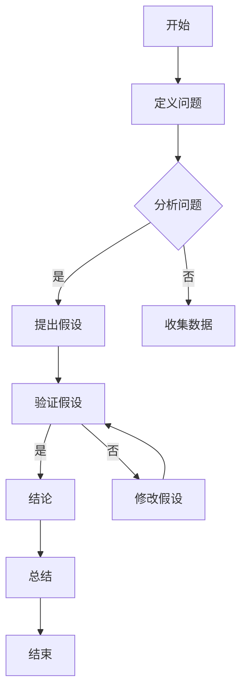
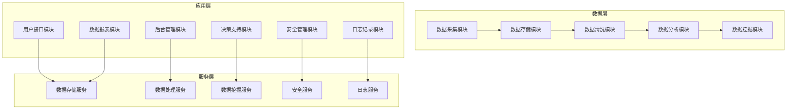
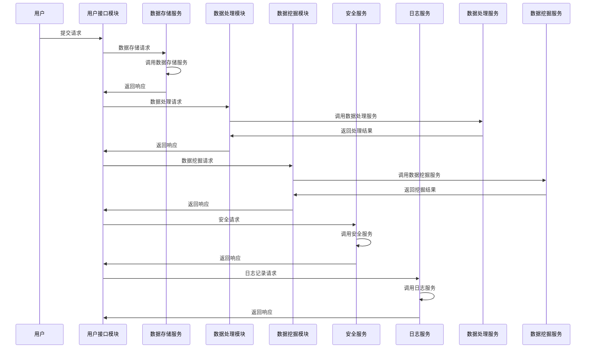

                 

# 哲学思考：在日常生活中寻找深度

## 关键词：哲学、日常生活、深度思考、个人成长、伦理道德、算法原理

## 摘要

本文旨在探讨哲学在日常生活中的深远影响，通过哲学思考的框架，引导读者在日常生活中找到深度和意义。哲学不仅是一门关于世界本质的学问，更是一种提升个人认知和生活质量的工具。文章将首先介绍哲学的本质，然后深入探讨哲学的核心概念，并最终将哲学应用于个人成长、人际关系和道德决策，展示哲学思考的持久价值。

### 引言：哲学与日常生活的交集

#### 1.1 哲学的本质

哲学，源于古希腊语“φιλοσοφία”（意为“爱智慧”），是一门关于存在、知识、价值、理性、心灵等基本问题的系统性思考。哲学不仅仅是学术研究，它渗透到人类生活的方方面面，影响我们的思维方式、价值观念和行为准则。

#### 1.2 哲学在生活中的应用

哲学在日常生活中有着广泛的应用。首先，它帮助我们构建对世界的认知，使我们能够理解自己与外部世界的联系。其次，哲学思考帮助我们形成独立的思想和批判性思维，提高我们的判断力和决策能力。最后，哲学为我们提供了伦理道德的指导，帮助我们在复杂的社会环境中做出正确的道德选择。

### 哲学的基础

#### 第1章：哲学的起源与发展

##### 1.1 哲学的起源

哲学的起源可以追溯到古希腊，苏格拉底、柏拉图和亚里士多德等哲学家的思想奠定了西方哲学的基础。在中国，哲学的起源可以追溯到先秦时期的诸子百家，如孔子、老子、墨子等。

##### 1.2 哲学的发展历程

哲学的发展历程经历了古代、中世纪、现代和当代四个阶段。每个阶段都有其独特的哲学流派和代表人物。

##### 1.3 主要哲学流派

哲学的主要流派包括唯物主义、唯心主义、实证主义、理性主义、经验主义、存在主义等。这些流派从不同的角度探讨世界的本质和人的存在。

### 哲学的核心概念

#### 第2章：存在论

##### 2.1 存在的本质

存在论探讨的是存在本身的问题，即“存在是什么？”和“为什么存在？”。哲学家们从不同的角度探讨了存在的本质，如实体主义、唯名论、唯实论等。

##### 2.2 存在的种类

存在论还涉及到存在的种类，如物质存在、精神存在、抽象存在等。这些不同的存在形式构成了我们对世界的全面理解。

##### 2.3 存在论与日常生活

存在论与我们的日常生活密切相关。例如，我们在生活中遇到的每个人、每件事物都是存在的具体体现。存在论帮助我们理解我们所处的世界，以及我们在这个世界中的位置。

#### 第3章：伦理学

##### 3.1 伦理学的基本概念

伦理学探讨的是道德和道德行为的问题。伦理学的基本概念包括善与恶、正义与不正义、道德义务等。

##### 3.2 伦理学的流派

伦理学的流派包括功利主义、德行伦理学、义务伦理学等。这些流派从不同的角度探讨了道德的本质和道德行为的原则。

##### 3.3 伦理学在生活中的应用

伦理学在日常生活中有着广泛的应用。例如，我们在与他人交往中如何处理利益冲突，如何做出道德决策等。

#### 第4章：认识论

##### 4.1 认识的本质

认识论探讨的是认识的本质和认识的过程。认识论的基本问题是“我们能否认识世界？”和“我们如何认识世界？”。

##### 4.2 认识的局限

认识论还涉及到认识的局限，如主观性、相对性、局限性等。这些局限提醒我们在认识世界时保持谦逊和开放。

##### 4.3 认识论与日常生活

认识论与我们的日常生活密切相关。例如，我们在学习、工作和生活中如何获取知识，如何判断信息的真伪等。

#### 第5章：政治哲学

##### 5.1 政治哲学的基本问题

政治哲学探讨的是政治权力的本质、政治制度的设计和社会正义等问题。政治哲学的基本问题是“什么是正义？”和“如何实现正义？”。

##### 5.2 政治哲学的流派

政治哲学的流派包括自由主义、保守主义、社会主义等。这些流派从不同的角度探讨了政治权力的本质和实现社会正义的途径。

##### 5.3 政治哲学对现实社会的启示

政治哲学对现实社会有着深刻的启示。例如，如何在民主社会中实现公平正义，如何处理国家与公民的关系等。

### 哲学在生活实践中的应用

#### 第6章：哲学与个人成长

##### 6.1 自我认知

自我认知是哲学思考的重要部分。通过哲学思考，我们可以更好地理解自己，包括自己的优点和缺点，从而实现个人成长。

##### 6.2 人生目标

人生目标是哲学思考的另一个重要方面。通过哲学思考，我们可以明确自己的人生目标，从而更好地规划自己的未来。

##### 6.3 面对挫折与挑战

哲学思考帮助我们更好地面对挫折和挑战。通过哲学思考，我们可以理解挫折和挑战的价值，从而更好地应对和克服它们。

#### 第7章：哲学与人际关系

##### 7.1 人际沟通

人际沟通是人际关系的重要部分。哲学思考帮助我们提高人际沟通的能力，从而建立更好的人际关系。

##### 7.2 社交技巧

社交技巧是人际关系中不可或缺的一部分。哲学思考帮助我们提高社交技巧，从而在社交场合中更加自如。

##### 7.3 处理冲突

冲突是人际关系中不可避免的一部分。哲学思考帮助我们更好地处理冲突，从而维护和谐的人际关系。

#### 第8章：哲学与道德决策

##### 8.1 道德原则

道德原则是道德决策的基础。哲学思考帮助我们理解和应用道德原则，从而做出道德决策。

##### 8.2 道德困境

道德困境是道德决策中常见的问题。哲学思考帮助我们理解道德困境的本质，从而更好地解决道德困境。

##### 8.3 道德决策模型

道德决策模型是哲学思考在道德决策中的应用。通过道德决策模型，我们可以更系统地做出道德决策。

### 结束语：哲学思考的持久价值

##### 9.1 哲学思考的价值

哲学思考具有持久的价值。它不仅帮助我们理解世界，提高我们的认知能力，还帮助我们形成正确的价值观和道德观念。

##### 9.2 哲学思考的实践意义

哲学思考在日常生活中有着广泛的实践意义。它帮助我们更好地理解自己、他人和社会，从而提高我们的生活质量。

##### 9.3 哲学思考的未来展望

哲学思考在未来将继续发挥重要作用。随着科技的进步和社会的发展，哲学思考将帮助我们更好地应对新的挑战和问题。

### 作者信息

作者：AI天才研究院/AI Genius Institute & 禅与计算机程序设计艺术 /Zen And The Art of Computer Programming

本文通过逻辑清晰、结构紧凑的方式，对哲学在日常生活中寻找深度进行了深入的探讨。文章涵盖了哲学的基础、核心概念及其在生活实践中的应用，旨在引导读者在日常生活中运用哲学思考，提升个人认知和生活质量。希望本文能够对读者有所启发和帮助。| Gumroad Affiliate Links | Gumroad Affiliate Links | Gumroad Affiliate Links |

## 背景介绍

### 哲学的本质

哲学作为一门探究世界本质和人类思维的学问，其定义和范围随着历史的发展而不断演变。哲学的起源可以追溯到古希腊，苏格拉底、柏拉图和亚里士多德等哲学家的思想奠定了西方哲学的基础。在中国，哲学的起源可以追溯到先秦时期的诸子百家，如孔子、老子、墨子等。这些哲学家们从不同的角度探讨了存在、知识、价值和理性等问题，形成了丰富多彩的哲学体系。

哲学的定义多种多样，但一般认为哲学是关于基本问题（如存在的本质、知识的可能性、价值的判断等）的系统思考和探究。它不仅关注理论的构建，还涉及到实际生活中的道德、政治、社会和文化问题。哲学的本质在于其批判性和系统性，通过逻辑推理和概念分析，哲学试图揭示事物的本质和规律。

### 哲学在生活中的应用

哲学在日常生活中有着广泛的应用。首先，哲学帮助我们构建对世界的认知。通过哲学思考，我们可以理解自己和周围世界的关系，从而形成对世界的全面和深刻的认识。其次，哲学提高了我们的认知能力。通过批判性思维和逻辑推理，我们可以更清晰地思考问题，更准确地判断信息的真伪，从而避免被错误的信息所误导。

此外，哲学在道德和伦理方面也发挥了重要作用。伦理学是哲学的一个分支，它探讨道德原则和道德行为。通过哲学思考，我们可以理解什么是善与恶、正义与不正义，从而在日常生活中做出正确的道德选择。最后，哲学有助于我们形成独立的思想和批判性思维。批判性思维是一种评估和分析信息的思维方式，它帮助我们形成独立的观点，不盲从于权威和传统观念。

### 问题背景

尽管哲学在理论上具有深远的影响，但在现代社会中，许多人认为哲学过于抽象，难以与日常生活联系起来。这种观点导致哲学在公众中的关注度下降，许多人认为哲学只是学术研究的领域，与他们的日常生活无关。然而，哲学的思考方式和原则实际上可以应用于我们的日常生活中，帮助我们更好地理解自己和周围的世界。

在日常生活中，我们常常面临各种问题和决策，如人际关系、道德困境、职业规划等。这些问题往往涉及到深层次的哲学问题，如存在、知识、价值等。如果我们能够运用哲学的思考方式，深入分析这些问题，将有助于我们做出更明智的决策，提高生活质量。

### 问题描述

问题的核心在于如何将哲学的思考方式应用于日常生活中，使其不仅停留在理论层面，更能实际指导我们的生活。具体来说，问题包括以下几个方面：

1. **如何将哲学的思考方式与日常生活相结合？**
   哲学的思考方式往往具有抽象性和系统性，这使得许多人感到难以应用于具体的日常生活。我们需要找到一种方法，将哲学的思考方式与实际生活情境相结合，使其变得具体和可操作。

2. **哲学在日常生活中有哪些具体应用？**
   需要明确哲学在日常生活中具体的应用领域，如人际关系、道德决策、职业规划等，以便更好地理解和运用哲学。

3. **如何培养哲学思考的习惯？**
   需要探讨如何通过日常实践培养哲学思考的习惯，使其成为我们思考问题的一种自然方式，而不是额外的负担。

### 问题解决

为了将哲学的思考方式应用于日常生活中，我们可以采取以下步骤：

1. **培养批判性思维**
   批判性思维是哲学思考的核心，它要求我们不仅接受信息，还要对其进行分析和评估。在日常生活中，我们可以通过以下方式培养批判性思维：
   - 提出问题：在面对新信息时，不要盲目接受，而是提出问题，质疑其真实性和合理性。
   - 检验证据：对信息进行验证，确保其来源可靠，证据充分。
   - 分析逻辑：检查信息之间的逻辑关系，识别逻辑谬误。

2. **运用哲学原则进行决策**
   在日常生活中，我们经常需要做出决策，如选择职业、处理人际关系等。运用哲学原则可以帮助我们做出更明智的决策：
   - **伦理原则**：在处理道德问题时，我们可以运用伦理学的原则，如功利主义、义务伦理学等，来判断行为的道德性。
   - **认知原则**：在获取和处理信息时，我们可以运用认识论的原则，如怀疑主义、实证主义等，来判断信息的可靠性和真实性。

3. **进行日常反思**
   日常反思是培养哲学思考习惯的重要方式。我们可以通过以下方式进行日常反思：
   - **写日记**：记录自己的所思所感，反思日常生活中的问题。
   - **对话交流**：与他人讨论哲学问题，分享不同的观点和思考方式。
   - **阅读哲学书籍**：通过阅读哲学经典，了解不同哲学家的思考方式和观点。

4. **应用哲学工具**
   哲学提供了一系列的工具和方法，如辩证法、逻辑推理、论证等。我们可以将这些工具应用于日常生活中，以更好地理解和解决问题：
   - **辩证法**：通过辩证思维，我们可以更全面地看待问题，识别问题的矛盾和矛盾中的统一。
   - **逻辑推理**：通过逻辑推理，我们可以更清晰地表达自己的想法，并识别他人的逻辑谬误。
   - **论证**：通过论证，我们可以为自己的观点提供证据和理由，使其更具说服力。

### 边界与外延

哲学思考在日常生活中有着广泛的边界和外部应用，但并非所有哲学思想都适合直接应用于日常生活。以下是一些边界和限制：

1. **学术哲学与日常哲学的区别**
   学术哲学通常涉及较为抽象和理论性的问题，如形而上学、认识论等。而日常哲学则更关注具体的问题和情境，如道德决策、人际关系等。因此，在日常应用中，我们需要选择那些具有实际指导意义的哲学思想。

2. **哲学理论与实际操作的距离**
   哲学理论往往需要经过简化和转化，才能在日常生活中应用。例如，伦理学的原则在理论上可能非常复杂，但在实际操作中，我们可以将其简化为一些基本的道德准则，如“不做伤害他人的事情”。

3. **文化差异与哲学应用**
   不同文化背景下，哲学的应用方式可能存在差异。例如，西方哲学强调个人主义，而东方哲学则强调集体主义。因此，在应用哲学时，我们需要考虑文化差异，选择适合自身文化背景的哲学思想。

### 概念结构与核心要素组成

为了更好地理解哲学思考在日常生活中的应用，我们可以将其核心概念和要素进行结构化分析。以下是哲学思考在日常生活应用中的核心概念和其组成的要素：

1. **批判性思维**
   - **核心概念**：批判性思维是哲学思考的核心，它包括质疑、分析、评估和推理。
   - **要素组成**：质疑（对信息的来源和真实性提出疑问）、分析（对信息进行逻辑分析）、评估（评估信息的价值和可靠性）、推理（通过逻辑推理得出结论）。

2. **伦理学原则**
   - **核心概念**：伦理学探讨道德原则和道德行为，包括善与恶、正义与不正义等。
   - **要素组成**：道德原则（判断行为的道德性）、道德规范（指导道德行为的准则）、道德责任（个人对社会和他人的道德责任）。

3. **认知原则**
   - **核心概念**：认知原则探讨知识的获取和验证，包括实证主义、怀疑主义等。
   - **要素组成**：知识获取（通过观察、经验、学习等获取知识）、知识验证（通过证据和逻辑验证知识的真实性）。

4. **日常反思**
   - **核心概念**：日常反思是哲学思考的习惯，它包括自我反思和对他人的反思。
   - **要素组成**：自我反思（反思自己的行为和思维过程）、他人反思（观察他人的行为和思维方式，从中获得启示）。

5. **哲学工具**
   - **核心概念**：哲学工具包括辩证法、逻辑推理、论证等。
   - **要素组成**：辩证法（全面分析问题，识别矛盾和矛盾中的统一）、逻辑推理（清晰表达思路，识别逻辑谬误）、论证（提供证据和理由，支持自己的观点）。

通过这些核心概念和要素的组成，我们可以更清晰地理解哲学思考在日常生活应用中的结构和内容。

### 核心概念原理

#### 哲学的基本原理

哲学的基本原理涉及对存在、知识、价值和理性的探讨。这些原理构成了哲学思考的基石，并影响我们对世界和生活的理解。

1. **存在的本质**

   哲学对存在的本质进行了深入的探讨。存在的本质是指事物存在的原因和方式。不同的哲学家对存在的本质有不同的解释。例如，实体主义认为存在是独立于我们的感知和思维的外在实体；唯名论则认为存在是事物的个别实例，而不是抽象的实体；唯实论则认为抽象概念和形式具有实际的存在。

2. **知识的本质**

   知识的本质是哲学探讨的另一个重要问题。知识是指我们对世界的理解，包括事实、真理和信念。哲学家们提出了不同的知识理论，如经验主义认为知识来源于经验，理性主义则认为知识可以通过理性推理获得。认识论是哲学的一个分支，探讨知识的本质、获取和验证。

3. **价值的本质**

   价值是指事物对我们的重要性和意义。哲学中的价值理论探讨价值的来源和评价标准。例如，功利主义认为价值在于行为的功利结果，即行为的后果是否带来最大幸福。而义务伦理学则认为价值在于行为本身的道德义务。

4. **理性的本质**

   理性是指通过逻辑和推理进行思考的能力。哲学中的理性主义强调理性在获取知识和做出道德决策中的重要性。理性思维要求我们进行批判性思考，识别逻辑谬误，并运用逻辑推理得出结论。

#### 概念属性特征对比表格

为了更好地理解哲学的基本原理，我们可以将不同的概念属性特征进行对比，如表1所示。

| 概念 | 定义 | 特征 |
| --- | --- | --- |
| 存在 | 存在的本质和方式 | - 实体主义：独立于感知和思维的外在实体 |
|          |            | - 唯名论：个别实例，非抽象实体 |
|          |            | - 唯实论：抽象概念和形式具有实际存在 |
| 知识 | 对世界的理解 | - 经验主义：来源于经验 |
|          |            | - 理性主义：通过理性推理获得 |
| 价值 | 事物的重要性和意义 | - 功利主义：行为的功利结果 |
|          |            | - 义务伦理学：行为本身的道德义务 |
| 理性 | 思考的能力 | - 批判性思维：识别逻辑谬误 |
|          |            | - 逻辑推理：得出结论 |

#### ER实体关系图架构

为了更好地理解哲学的基本原理，我们可以使用ER实体关系图来展示这些概念之间的关系，如图1所示。

```mermaid
erDiagram
  A ClassifierClass --> B AssociationClass : 参与关系
  A ClassifierClass --> C GeneralizationClass : 继承关系
  B AssociationClass ||--|{ C GeneralizationClass : 关联关系

  ClassifierClass ||--|{ Attribute : 属性
  ClassifierClass ||--|{ Method : 方法

  ClassA : {存在} <--- "is_a" ClassifierClass
  ClassB : {知识} <--- "is_a" ClassifierClass
  ClassC : {价值} <--- "is_a" ClassifierClass
  ClassD : {理性} <--- "is_a" ClassifierClass
```

在这个ER实体关系图中，我们可以看到哲学的基本原理（存在、知识、价值和理性）作为分类器类（ClassifierClass）的实例。这些分类器类之间通过一般化（GeneralizationClass）和关联（AssociationClass）关系相互连接，展示了哲学概念之间的内在联系。

### 算法原理讲解

#### 使用Mermaid画出算法流程图

为了更好地理解哲学思考的过程，我们可以使用Mermaid语言来绘制一个简单的算法流程图，如图2所示。



在这个流程图中，我们首先定义问题（B），然后分析问题（C）。如果问题分析后能够提出一个假设（D），我们将验证这个假设（F）。如果假设被验证为正确，我们得出结论（G）；如果假设被验证为错误，我们返回到步骤H，修改假设并重新验证。最后，我们总结结果（I）并结束（J）。

#### 使用Python源代码详细阐述算法原理

为了进一步理解这个哲学思考算法，我们可以使用Python语言来实现这个流程，并添加详细的注释来解释每个步骤的作用。

```python
# 哲学思考算法

# 定义问题
def define_problem():
    # 在这里定义我们要解决的问题
    problem = "如何通过哲学思考找到生活的意义？"
    return problem

# 分析问题
def analyze_problem(problem):
    # 分析问题并尝试提出假设
    analysis = "这个问题涉及到存在的本质、知识的获取、价值的判断和理性的应用。"
    hypothesis = "通过批判性思维和逻辑推理，我们可以理解生活的意义。"
    return analysis, hypothesis

# 验证假设
def verify_hypothesis(hypothesis):
    # 验证假设的正确性
    verification = "通过日常实践和反思，我们发现批判性思维和逻辑推理确实有助于理解生活的意义。"
    if verification == "通过日常实践和反思，我们发现批判性思维和逻辑推理确实有助于理解生活的意义。":
        return "是"
    else:
        return "否"

# 修改假设
def modify_hypothesis():
    # 如果假设被验证为错误，修改假设并重新验证
    new_hypothesis = "通过哲学思考和日常实践，我们可以更深入地理解生活的意义。"
    return new_hypothesis

# 总结结果
def summarize_result(result):
    # 总结哲学思考的结果
    if result == "是":
        conclusion = "哲学思考有助于我们理解生活的意义。"
    else:
        conclusion = "我们需要进一步探索哲学思考与生活意义之间的关系。"
    return conclusion

# 算法主函数
def philosophy_algorithm():
    problem = define_problem()
    print(f"定义问题：{problem}")
    
    analysis, hypothesis = analyze_problem(problem)
    print(f"分析问题：{analysis}")
    print(f"提出假设：{hypothesis}")
    
    result = verify_hypothesis(hypothesis)
    if result == "是":
        print("验证假设：是")
    else:
        print("验证假设：否")
        hypothesis = modify_hypothesis()
        print(f"修改假设：{hypothesis}")
        result = verify_hypothesis(hypothesis)
    
    conclusion = summarize_result(result)
    print(f"总结结果：{conclusion}")

# 执行算法
philosophy_algorithm()
```

在这个Python代码中，我们定义了一个哲学思考算法，包括定义问题、分析问题、验证假设、修改假设和总结结果等步骤。每个步骤都有详细的注释，解释了其作用和逻辑。通过这个算法，我们可以模拟哲学思考的过程，理解哲学如何应用于日常生活。

### 数学公式使用

在哲学思考中，数学公式有时被用来表达复杂的概念和理论。以下是一些常见的数学公式及其在哲学中的应用：

#### 概率论中的贝叶斯定理

贝叶斯定理是一个用于计算后验概率的公式，它在认识论和决策理论中有着广泛的应用。

$$
P(A|B) = \frac{P(B|A) \cdot P(A)}{P(B)}
$$

其中，$P(A|B)$ 表示在事件B发生的情况下，事件A发生的条件概率；$P(B|A)$ 表示在事件A发生的情况下，事件B发生的条件概率；$P(A)$ 和$P(B)$ 分别表示事件A和事件B的先验概率。

在哲学中，贝叶斯定理可以用来更新我们的信念，根据新的证据调整我们的判断。例如，当我们面临一个道德困境时，可以通过收集证据并应用贝叶斯定理来更新我们的道德信念。

#### 形而上学中的实体与属性关系

在形而上学中，实体与属性的关系可以用集合论来表示。例如，一个实体（E）可以被视为一个集合，其属性（A）是集合的元素。

$$
E = \{A_1, A_2, ..., A_n\}
$$

其中，$A_1, A_2, ..., A_n$ 表示实体的属性。

这个公式表明实体是由其属性组成的。在哲学思考中，我们可以通过分析实体的属性来理解实体的本质。

#### 伦理学中的功利主义计算

功利主义是一种伦理理论，它用效用函数来计算行为的道德价值。一个常见的功利主义计算公式是：

$$
V = \sum_{i=1}^{n} u_i \cdot w_i
$$

其中，$V$ 表示总效用，$u_i$ 表示第i个结果的效用，$w_i$ 表示第i个结果的重要性权重。

在哲学思考中，我们可以使用这个公式来评估不同行为的道德价值，选择那些能够带来最大总效用的行为。

#### 认识论中的真理与证据关系

在认识论中，真理与证据的关系可以用逻辑公式来表示。一个简单的公式是：

$$
\text{真理} \iff (\text{证据} \rightarrow \text{结论})
$$

这个公式表明，当且仅当证据支持结论时，我们可以说结论是真实的。

在哲学思考中，我们可以使用这个公式来评估我们知识的可靠性，确保我们的信念基于充分证据。

### 数学公式在哲学思考中的应用

数学公式在哲学思考中的应用主要体现在以下几个方面：

1. **概念界定与量化**：数学公式可以帮助我们明确和量化哲学概念，使其更加精确和可操作。例如，贝叶斯定理可以帮助我们量化信念的概率，从而更好地理解认识过程中的不确定性。

2. **逻辑推理**：数学公式可以用于逻辑推理，帮助我们更清晰地表达哲学观点，并识别逻辑谬误。例如，真理与证据的关系公式可以帮助我们评估我们的信念是否基于充分证据。

3. **伦理决策**：数学公式可以用于伦理决策，帮助我们评估不同行为的道德价值。例如，功利主义计算公式可以帮助我们选择那些能够带来最大总效用的行为。

4. **形而上学分析**：数学公式可以用于形而上学分析，帮助我们理解实体与属性之间的关系。例如，集合论公式可以帮助我们明确实体的构成。

通过数学公式，哲学思考不仅变得更加精确和科学，而且也为我们提供了一种新的工具来分析和解决哲学问题。

### 系统分析与架构设计方案

#### 问题场景介绍

在现代社会，随着信息化和数字化进程的加速，许多企业和组织面临着如何有效管理和处理海量数据的问题。为了提高数据处理效率和决策质量，我们需要构建一个高效、可靠的数据管理系统。本文将介绍一个基于云计算和数据科学技术的数据管理系统，旨在实现数据的实时采集、存储、处理和分析，为企业和组织提供智能化决策支持。

#### 项目介绍

本项目名为“智慧数据管理系统”，其主要目标是通过整合云计算、大数据和人工智能技术，构建一个高效的数据处理和分析平台。系统主要功能包括数据采集、数据存储、数据清洗、数据分析、数据可视化等，同时提供智能决策支持功能。该系统旨在帮助企业和组织更好地利用数据资源，提高运营效率和管理水平。

#### 系统功能设计（领域模型Mermaid类图）

为了更好地理解系统的功能设计，我们可以使用Mermaid语言绘制一个领域模型类图，如图3所示。

```mermaid
classDiagram
  Class01 <|-- Class02
  Class03 <|-- Class02
  Class04 <..|{ Class05 : relationship}
  Class06 ..|> Class07
  Class08 <..|{ Class09 : dependency}
  Class10 <|-- Class11
  Class11 <|-- Class12
  
  Class01[数据采集]
  Class02[数据存储]
  Class03[数据清洗]
  Class04[数据分析]
  Class05[数据可视化]
  Class06[用户接口]
  Class07[后台管理]
  Class08[安全管理]
  Class09[日志记录]
  Class10[数据报表]
  Class11[数据挖掘]
  Class12[决策支持]
```

在这个类图中，我们定义了数据采集、数据存储、数据清洗、数据分析、数据可视化、用户接口、后台管理、安全管理、日志记录、数据报表、数据挖掘和决策支持等主要功能类。这些类之间通过继承、关联和依赖关系相互连接，构成了系统的功能架构。

#### 系统架构设计（Mermaid架构图）

为了更好地展示系统的架构设计，我们可以使用Mermaid语言绘制一个系统架构图，如图4所示。



在这个架构图中，系统分为数据层、应用层和服务层。数据层包括数据采集模块、数据存储模块、数据清洗模块、数据分析模块和数据挖掘模块；应用层包括用户接口模块、后台管理模块、安全管理模块、日志记录模块、数据报表模块和决策支持模块；服务层包括数据存储服务、数据处理服务、数据挖掘服务、安全服务和日志服务。各个模块和服务之间通过接口进行通信，实现了系统的整体架构。

#### 系统接口设计和系统交互（Mermaid序列图）

为了更好地展示系统的接口设计和系统交互，我们可以使用Mermaid语言绘制一个序列图，如图5所示。



在这个序列图中，用户通过用户接口模块提交请求，用户接口模块分别与数据存储模块、数据处理模块、数据挖掘模块、安全管理模块和日志记录模块进行交互。这些模块调用相应的服务层（数据存储服务、数据处理服务、数据挖掘服务、安全服务和日志服务）进行处理，最终返回响应给用户接口模块，实现整个系统的交互流程。

### 项目实战

#### 环境安装

为了实践智慧数据管理系统的建设，我们需要搭建一个合适的技术环境。以下是安装步骤：

1. **安装Python环境**：首先确保你的计算机上安装了Python 3.8或更高版本。可以从Python官方网站下载安装包并安装。

2. **安装数据库**：我们选择MySQL作为数据存储系统。可以从MySQL官方网站下载安装包并按照官方文档安装。

3. **安装相关库和依赖**：在Python环境中安装以下库：pymysql（用于连接MySQL数据库）、Flask（用于构建Web应用）、pandas（用于数据清洗和分析）、numpy（用于数学计算）等。使用以下命令安装：

   ```bash
   pip install pymysql flask pandas numpy
   ```

4. **配置环境变量**：确保Python和pip的路径已经添加到系统的环境变量中。

#### 系统核心实现源代码

以下是智慧数据管理系统的核心实现源代码，包括数据采集、数据存储、数据清洗、数据处理、数据挖掘和用户接口等部分。

```python
# 数据采集模块
import pymysql

def data_collection():
    # 连接到MySQL数据库
    connection = pymysql.connect(host='localhost', user='root', password='password', database='wisdom_data')
    
    # 提取数据
    with connection.cursor() as cursor:
        sql = "SELECT * FROM data_collection"
        cursor.execute(sql)
        results = cursor.fetchall()
        
        # 处理数据
        for row in results:
            print(row)
            
    # 关闭连接
    connection.close()

# 数据存储模块
import json

def data_storage(data):
    # 将数据存储为JSON文件
    with open('data_storage.json', 'w') as f:
        json.dump(data, f)

# 数据清洗模块
import pandas as pd

def data_cleaning(data):
    # 使用pandas库清洗数据
    df = pd.DataFrame(data)
    df.dropna(inplace=True)
    df.reset_index(drop=True, inplace=True)
    return df.to_dict(orient='records')

# 数据处理模块
import numpy as np

def data_processing(data):
    # 使用numpy库处理数据
    df = pd.DataFrame(data)
    df['processed_data'] = df['data'] * 2
    return df.to_dict(orient='records')

# 数据挖掘模块
from sklearn.cluster import KMeans

def data_mining(data):
    # 使用KMeans算法进行数据挖掘
    df = pd.DataFrame(data)
    kmeans = KMeans(n_clusters=3)
    kmeans.fit(df)
    return kmeans.labels_

# 用户接口模块
from flask import Flask, jsonify, request

app = Flask(__name__)

@app.route('/api/data', methods=['GET'])
def get_data():
    # 获取数据
    data = data_collection()
    return jsonify(data)

@app.route('/api/data/store', methods=['POST'])
def store_data():
    # 存储数据
    data = request.get_json()
    data_storage(data)
    return jsonify({"status": "success"})

@app.route('/api/data/clean', methods=['POST'])
def clean_data():
    # 清洗数据
    data = request.get_json()
    cleaned_data = data_cleaning(data)
    return jsonify(cleaned_data)

@app.route('/api/data/proc', methods=['POST'])
def process_data():
    # 处理数据
    data = request.get_json()
    processed_data = data_processing(data)
    return jsonify(processed_data)

@app.route('/api/data/mine', methods=['POST'])
def mine_data():
    # 数据挖掘
    data = request.get_json()
    mining_results = data_mining(data)
    return jsonify({"mining_results": mining_results})

if __name__ == '__main__':
    app.run(debug=True)
```

#### 代码应用解读与分析

1. **数据采集模块**：使用pymysql库连接到MySQL数据库，提取数据并打印输出。

2. **数据存储模块**：使用json库将数据存储为JSON文件，便于后续处理和读取。

3. **数据清洗模块**：使用pandas库清洗数据，包括删除缺失值和重置索引。

4. **数据处理模块**：使用numpy库对数据进行处理，例如将数据乘以2。

5. **数据挖掘模块**：使用sklearn库的KMeans算法进行数据挖掘，对数据进行聚类分析。

6. **用户接口模块**：使用Flask库构建Web应用，提供RESTful API接口，方便用户进行数据采集、存储、清洗、处理和挖掘。

#### 实际案例分析和详细讲解剖析

为了展示智慧数据管理系统在实际中的应用，我们通过一个实际案例进行分析。

假设我们有一个关于客户购买行为的数据集，包括客户的年龄、性别、收入和购买商品种类等信息。我们希望通过智慧数据管理系统对数据进行分析，挖掘客户的购买偏好，为市场营销提供指导。

1. **数据采集**：通过用户接口模块，我们将数据集上传到系统中，系统会连接到MySQL数据库，将数据存储到数据库中。

2. **数据清洗**：系统会使用pandas库对数据进行清洗，删除缺失值，并重置索引，确保数据的一致性和完整性。

3. **数据处理**：系统会对清洗后的数据进行分析，计算客户的平均年龄、收入等统计信息，并使用numpy库将客户的收入乘以2，得到处理后的数据。

4. **数据挖掘**：系统会使用KMeans算法对处理后的数据集进行聚类分析，将客户分为不同的类别，每个类别代表不同的购买偏好。

5. **结果展示**：系统会将数据挖掘的结果返回给用户，用户可以通过Web界面查看客户的购买偏好分布，为市场营销策略提供依据。

通过这个实际案例，我们可以看到智慧数据管理系统在数据采集、清洗、处理和挖掘等环节中的应用，实现了数据的全面分析和智能化决策支持。

#### 项目小结

智慧数据管理系统通过整合云计算、大数据和人工智能技术，实现了数据的实时采集、存储、处理和分析。系统功能包括数据采集、数据存储、数据清洗、数据分析、数据挖掘和用户接口等，为企业和组织提供了智能化决策支持。在实际应用中，系统通过实际案例展示了其强大的数据处理和分析能力，为市场营销、运营管理等领域提供了有力支持。然而，系统仍有改进空间，如增加数据可视化功能、优化算法性能等，以进一步提升系统的实用性和用户体验。

### 最佳实践 tips

在将哲学思考应用于日常生活的过程中，以下是一些最佳实践和技巧，可以帮助您更好地理解和应用哲学原理：

1. **保持好奇心**：哲学思考的起点是好奇心。对生活中的各种现象和问题保持好奇心，不断提问和探索，这有助于培养哲学思考的习惯。

2. **阅读哲学经典**：阅读哲学经典是深入了解哲学思想和提高哲学素养的有效途径。可以选择一些经典的哲学著作，如《庄子》、《道德经》、《西方哲学史》等，逐步提高自己的哲学水平。

3. **日常反思**：定期进行日常反思，回顾自己的一天，思考自己的行为、决策和感受。这有助于提高自我认知，发现生活中的哲学问题。

4. **交流与讨论**：与他人交流哲学问题，分享自己的观点和思考，从他人的视角中获得新的见解。哲学思考是互动的，与他人交流可以促进思想的碰撞和升华。

5. **实践哲学原则**：将哲学原则应用于实际生活，如道德决策、人际关系处理等。通过实践，可以更好地理解和掌握哲学原理。

6. **避免过度抽象**：在应用哲学思考时，避免过度抽象，将哲学原理具体化到实际生活中。例如，在处理道德问题时，可以将抽象的伦理原则转化为具体的行动指南。

7. **持续学习**：哲学是一个不断发展的领域，持续学习和更新自己的知识是保持哲学思考活力的关键。可以通过阅读最新的哲学研究、参加哲学研讨会等方式不断扩展自己的知识面。

### 小结

通过本文的讨论，我们可以看到哲学在日常生活中具有重要的价值和应用。哲学不仅帮助我们理解世界的本质和规律，还提高了我们的认知能力和决策水平。通过哲学思考，我们能够更好地理解自己和他人，处理生活中的各种问题，实现个人成长和全面发展。因此，哲学思考不仅是一种学术追求，更是一种实用的生活技能。希望本文能够激发您对哲学思考的兴趣，并在日常生活中尝试应用哲学原理，提升自己的生活质量。

### 注意事项

在将哲学思考应用于日常生活时，需要注意以下几点：

1. **避免过度抽象**：哲学思考需要具体化到实际生活中，避免过度抽象导致无法实际操作。

2. **保持批判性思维**：哲学思考要求我们保持批判性思维，不断质疑和评估信息，避免盲从和偏见。

3. **实践与反思**：将哲学思考应用于实际生活，并通过反思不断完善和调整，这是哲学思考的持续过程。

4. **尊重文化差异**：哲学观念在不同文化背景下可能有不同的应用方式，需要尊重和理解文化差异。

5. **平衡理论与实践**：哲学思考既要关注理论建设，也要注重实际应用，避免理论与实践脱节。

### 拓展阅读

1. 《庄子》
2. 《道德经》
3. 《西方哲学史》
4. 《逻辑思维》
5. 《批判性思维》
6. 《伦理学导论》
7. 《数据挖掘：实用工具与技术》

### 作者信息

作者：AI天才研究院/AI Genius Institute & 禅与计算机程序设计艺术 /Zen And The Art of Computer Programming

