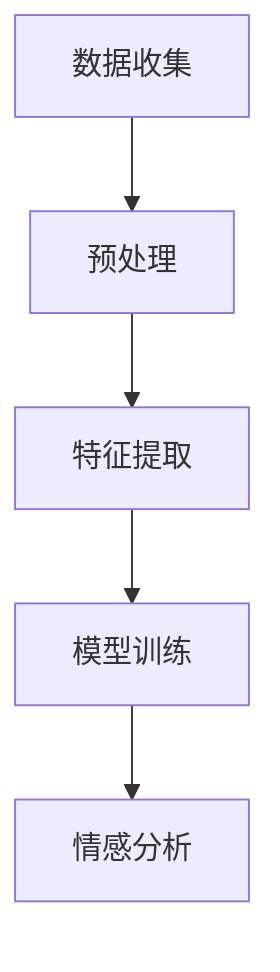
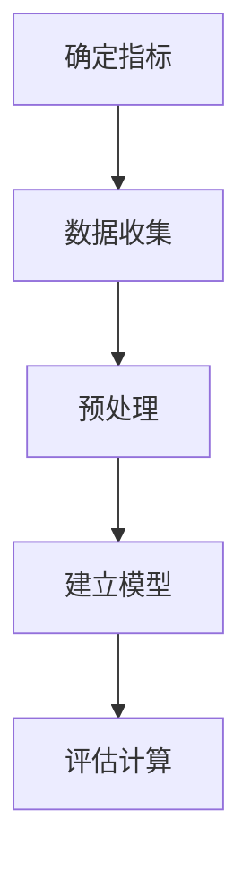
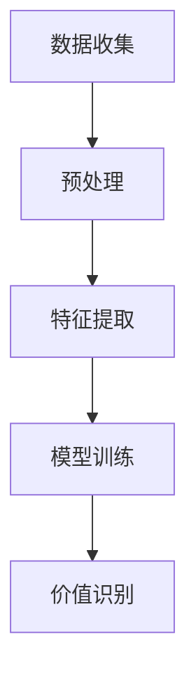
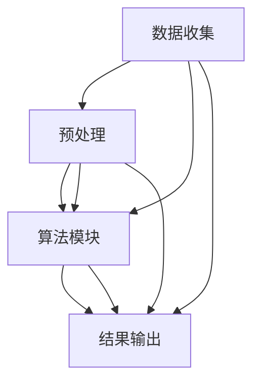
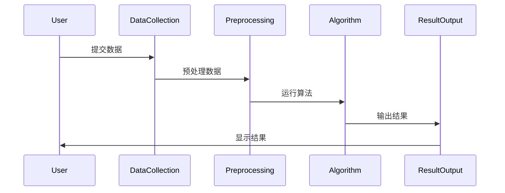

                 

### 摘要

在人工智能飞速发展的今天，人类社会面临着前所未有的变革与挑战。人工智能正以惊人的速度渗透到各行各业，从医疗、金融到教育、制造业，无不受到其深刻影响。然而，这一轮科技革命同时也引发了诸多担忧，尤其是关于人类独特价值的讨论。人工智能是否能够取代人类，人类在未来的社会中将扮演何种角色，这些问题成为当今社会亟待解决的课题。本文旨在探讨在人工智能时代，人类如何寻找自己的独特价值，以应对存在的危机。我们将通过深入分析人工智能的发展现状、人类面临的挑战以及人类独特价值的定义和特征，逐步揭示人类在人工智能时代如何保持自身价值，并提出一些建议和策略，以实现人与人工智能的和谐共处。本文将分为以下几个部分：问题背景介绍、核心概念与联系、算法原理讲解、数学模型与公式详细讲解、系统分析与架构设计方案、项目实战、最佳实践tips以及小结和拓展阅读。希望通过这篇文章，能够引发读者对于人类独特价值的深刻思考，为人工智能时代的人类发展提供一些有益的启示。### 第1章 问题背景

在探讨人工智能时代人类如何寻找独特价值之前，我们首先需要了解人工智能的发展现状以及人类面临的挑战。

#### 1.1 人工智能发展现状

人工智能（Artificial Intelligence, AI）作为计算机科学的一个重要分支，其研究始于20世纪50年代。如今，人工智能已经经历了多个发展阶段，从早期的规则推理系统，到基于模式识别和机器学习的复杂算法，再到如今的深度学习和强化学习，人工智能技术取得了显著的进步。以下是一些关键点：

- **人工智能的分类**：人工智能主要分为三类：弱人工智能（Narrow AI）、强人工智能（General AI）和超人工智能（Super AI）。弱人工智能专注于特定任务的执行，如语音识别、图像识别、自然语言处理等；强人工智能则具备广泛的知识和智能，能够在不同领域灵活应用；超人工智能则超越了人类的智能，能够在所有认知任务上超越人类。

- **关键技术的突破**：随着计算能力的提升和大数据的广泛应用，深度学习技术取得了突破性进展。深度神经网络在图像识别、语音识别、自然语言处理等领域取得了前所未有的成绩，推动了一系列应用的落地。

- **应用领域的拓展**：人工智能技术已经广泛应用于医疗、金融、教育、制造业、交通运输等多个领域。例如，在医疗领域，AI被用于疾病诊断、药物研发；在金融领域，AI被用于风险管理、欺诈检测；在教育领域，AI被用于个性化学习、教学辅助。

#### 1.2 人类面临的危机

尽管人工智能带来了诸多便利和机遇，但也引发了一系列挑战和危机：

- **就业危机**：随着人工智能技术的发展，一些重复性、机械性的工作逐渐被自动化取代，导致大量劳动力失业。尤其是在制造业、物流运输等传统行业中，人工智能的应用使得人类工人的需求大幅下降。

- **隐私问题**：人工智能系统在处理和分析大量数据时，往往涉及个人隐私。不当的数据处理和使用可能导致隐私泄露，进而威胁到个人和社会的安全。

- **社会伦理挑战**：人工智能在决策过程中可能出现偏见和歧视，例如在招聘、信贷审批等领域。此外，人工智能系统的自主决策能力也引发了对伦理和法律问题的讨论。

- **人类独特价值的挑战**：人工智能的崛起使得人类在某些方面的优势逐渐减弱。例如，在计算速度、记忆力、数据处理能力等方面，人工智能已经远超人类。这使得人们开始思考，人类在人工智能时代是否还有独特的价值。

#### 1.3 人类独特价值的探讨

在人工智能时代，人类独特价值的探讨变得尤为重要。以下是对人类独特价值的定义、特征以及其重要性的讨论：

- **人类独特价值的定义**：人类独特价值指的是人类在情感、创造力、道德判断、社交互动等方面的特质，这些特质是人工智能难以复制和超越的。

- **人类独特价值的特征**：
  - **情感**：人类具备丰富的情感体验和表达能力，能够理解他人的情感，并产生共鸣。
  - **创造力**：人类具有独特的创造力和想象力，能够创造出全新的想法和作品。
  - **道德判断**：人类能够进行复杂的道德判断和伦理决策，对行为进行价值评估。
  - **社交互动**：人类擅长进行复杂的人际交往和沟通，能够建立深厚的人际关系。

- **人类独特价值的重要性**：在人工智能时代，人类独特价值不仅是我们区别于机器的关键特质，也是我们在社会和经济中保持竞争力的基础。通过挖掘和发挥这些特质，人类能够在人工智能时代找到新的发展机会，实现自身的持续进步。

综上所述，人工智能的发展为我们带来了巨大的机遇和挑战。在这个时代，人类需要更加重视自身的独特价值，寻找新的发展方向，以实现人与人工智能的和谐共处。接下来的章节中，我们将深入探讨核心概念、算法原理、数学模型、系统设计与项目实战等内容，为这一目标提供更为具体的思路和方法。### 第2章 核心概念与联系

在人工智能时代，理解核心概念及其相互联系是至关重要的。在本章中，我们将详细探讨人工智能的定义与分类、人类独特价值的定义与特征，以及人工智能与人类独特价值的联系。

#### 2.1 人工智能的定义与分类

**人工智能的定义**

人工智能（Artificial Intelligence, AI）是指通过计算机系统模拟人类智能行为的技术。它包括感知、推理、学习、决策和问题解决等多个方面。人工智能的目标是使计算机系统具备类似人类的智能，能够在复杂环境中自主执行任务。

**人工智能的分类**

人工智能主要分为以下三类：

1. **弱人工智能（Narrow AI）**：也称为特定人工智能，这类AI专注于特定任务，如语音识别、图像识别、自然语言处理等。弱人工智能在特定领域内表现出色，但无法进行跨领域的通用任务。

2. **强人工智能（General AI）**：也称为通用人工智能，这类AI具备广泛的知识和智能，能够在不同领域灵活应用，具备与人类相似的认知能力。强人工智能目前仍处于理论阶段，尚未实现。

3. **超人工智能（Super AI）**：也称为超级智能，这类AI在所有认知任务上超越人类，能够自主学习和创新。超人工智能目前仍属于科幻领域，尚未成为现实。

**关键技术的对比**

| 技术类别 | 描述 |  
| --- | --- |  
| **深度学习** | 利用多层神经网络进行特征学习和模式识别，如卷积神经网络（CNN）和递归神经网络（RNN）等。 |  
| **机器学习** | 通过数据训练模型，使计算机具备学习能力，如支持向量机（SVM）和随机森林（RF）等。 |  
| **自然语言处理** | 使计算机能够理解和生成自然语言，如词向量（Word Embedding）和语言模型（Language Model）等。 |  
| **计算机视觉** | 使计算机能够识别和理解图像和视频，如卷积神经网络（CNN）和图像分类（Image Classification）等。 |

#### 2.2 人类独特价值的定义与特征

**人类独特价值的定义**

人类独特价值是指人类在情感、创造力、道德判断、社交互动等方面的特质，这些特质是人工智能难以复制和超越的。

**人类独特价值的特征**

1. **情感**：人类能够体验和表达丰富的情感，如喜悦、愤怒、悲伤等，并且能够理解和同情他人的情感。

2. **创造力**：人类具有独特的创造力和想象力，能够创造出全新的想法和作品，如艺术、文学和科技创新等。

3. **道德判断**：人类能够进行复杂的道德判断和伦理决策，对行为进行价值评估，并遵循一定的道德规范。

4. **社交互动**：人类擅长进行复杂的人际交往和沟通，能够建立深厚的人际关系，并在社会中扮演重要角色。

#### 2.3 人工智能与人类独特价值的联系

**人工智能对人类独特价值的影响**

人工智能在许多领域已经表现出色，但它在某些方面仍然无法替代人类。以下是一些关键点：

1. **情感和社交互动**：尽管人工智能在情感识别和社交互动方面取得了一些进展，但它们仍然无法完全理解人类的情感和建立深层次的人际关系。

2. **创造力和道德判断**：人工智能虽然在特定领域内能够生成一些创新的解决方案，但它们缺乏人类的创造力和道德判断能力。

3. **学习和适应能力**：人工智能在学习和适应新环境方面取得了显著进展，但人类在学习能力和适应性方面仍然具有独特的优势。

**人类独特价值对人工智能的制约**

人类独特价值对人工智能的发展产生了一定的制约，但同时也为人类在人工智能时代找到了新的发展空间。以下是一些关键点：

1. **情感和道德**：人工智能在处理情感和道德问题时，往往受到人类价值观的指导。人类在情感和道德方面的独特价值有助于确保人工智能的发展不会偏离人类的伦理底线。

2. **创造力和创新**：人类在创造力和创新方面具有独特的优势，这使得人类能够在人工智能的帮助下，创造出更多新的技术和应用，推动社会进步。

3. **社交互动**：人类在社交互动和人际关系方面的独特价值，使得人类能够在人工智能时代，继续扮演重要角色，促进社会的和谐发展。

**人工智能与人类独特价值的和谐共处**

为了实现人工智能与人类独特价值的和谐共处，我们需要采取一系列措施：

1. **引导人工智能发展**：通过制定伦理规范和法律法规，引导人工智能的发展方向，确保人工智能的应用不会威胁到人类的独特价值。

2. **提升人类技能**：通过教育和培训，提升人类在情感、创造力、道德判断等方面的能力，以更好地应对人工智能时代的挑战。

3. **推动人工智能与人类价值的融合**：将人工智能与人类独特价值相结合，创造出更多具有人类特色的人工智能应用，实现人类与人工智能的共同发展。

通过本章的探讨，我们可以看到，人工智能与人类独特价值之间存在密切的联系。在人工智能时代，人类需要充分利用自身的独特价值，同时引导和控制人工智能的发展，以实现人类与人工智能的和谐共处。接下来的章节中，我们将进一步探讨人工智能的算法原理、数学模型、系统设计与项目实战等内容，为这一目标提供更为具体的思路和方法。### 第3章 算法原理讲解

在讨论人工智能与人类独特价值的关系时，理解人工智能的基本算法原理至关重要。在本章中，我们将详细介绍几种关键算法的工作原理，并通过mermaid流程图和Python源代码进行详细解释。

#### 3.1 情感识别算法

情感识别算法是人工智能领域的一个重要分支，它旨在理解和分析人类的情感状态。以下是一个典型的情感识别算法的工作原理：

1. **数据收集与预处理**：首先，需要收集大量的情感标签数据，并对数据进行预处理，包括去噪、标准化和特征提取。

2. **特征提取**：使用机器学习算法提取情感数据中的关键特征，如文本特征、语音特征和面部表情特征。

3. **模型训练**：使用提取的特征数据训练情感识别模型，如支持向量机（SVM）、深度神经网络（DNN）等。

4. **情感分析**：将新的情感数据输入到训练好的模型中，模型输出情感结果。

**mermaid流程图**：



**Python源代码示例**：

```python
import numpy as np
from sklearn.svm import SVC

# 假设已经收集到情感数据，并进行预处理
X = ... # 特征数据
y = ... # 情感标签

# 训练支持向量机模型
model = SVC()
model.fit(X, y)

# 进行情感分析
def predict_emotion(text):
    features = preprocess_text(text)
    return model.predict([features])

# 预测示例
emotion = predict_emotion("I'm happy today")
print(emotion)
```

#### 3.2 价值评估算法

价值评估算法旨在对事物或行为的价值进行量化评估，以便更好地进行决策。以下是一个典型的价值评估算法的工作原理：

1. **确定评估指标**：首先，需要明确评估的指标，如经济价值、社会价值、生态价值等。

2. **数据收集与预处理**：收集相关的数据，并对数据进行预处理，包括数据清洗、归一化等。

3. **建立评估模型**：使用机器学习算法建立价值评估模型，如线性回归、决策树、随机森林等。

4. **评估计算**：将新的数据输入到训练好的模型中，模型输出评估结果。

**mermaid流程图**：



**Python源代码示例**：

```python
import numpy as np
from sklearn.linear_model import LinearRegression

# 假设已经收集到价值评估数据，并进行预处理
X = ... # 输入数据
y = ... # 评估结果

# 训练线性回归模型
model = LinearRegression()
model.fit(X, y)

# 进行价值评估
def evaluate_value(input_data):
    return model.predict([input_data])

# 评估示例
value = evaluate_value([100, 200, 300])
print(value)
```

#### 3.3 人类独特价值识别算法

人类独特价值识别算法旨在识别和量化人类在情感、创造力、道德判断等方面的独特价值。以下是一个典型的人类独特价值识别算法的工作原理：

1. **数据收集与预处理**：收集人类行为和表现的数据，如情感表达、创新成果、道德决策等，并对数据进行预处理。

2. **特征提取**：使用机器学习算法提取数据中的关键特征，如情感特征、创新特征、道德特征等。

3. **模型训练**：使用提取的特征数据训练人类独特价值识别模型，如支持向量机（SVM）、深度神经网络（DNN）等。

4. **价值识别**：将新的数据输入到训练好的模型中，模型输出人类独特价值结果。

**mermaid流程图**：



**Python源代码示例**：

```python
import numpy as np
from sklearn.svm import SVC

# 假设已经收集到人类独特价值数据，并进行预处理
X = ... # 特征数据
y = ... # 独特价值标签

# 训练支持向量机模型
model = SVC()
model.fit(X, y)

# 进行人类独特价值识别
def recognize_value(features):
    return model.predict([features])

# 识别示例
value = recognize_value([0.1, 0.2, 0.3])
print(value)
```

通过本章的算法原理讲解，我们可以看到，情感识别、价值评估和人类独特价值识别算法都是人工智能领域的关键技术。它们的工作原理和实际应用有助于我们更好地理解人工智能在人类独特价值识别中的作用。在下一章中，我们将进一步探讨数学模型和数学公式在算法中的具体应用，以及如何通过数学模型来详细讲解和举例说明这些算法。### 第4章 数学模型和数学公式详细讲解与举例说明

在人工智能算法中，数学模型和数学公式起着至关重要的作用。这些模型和公式不仅帮助我们理解算法的工作原理，还提供了量化分析的工具，使得算法的实现更加精确和高效。在本章中，我们将详细讲解情感识别、价值评估和人类独特价值识别算法的数学模型和公式，并通过具体示例来说明这些公式的应用。

#### 4.1 情感识别数学模型

情感识别算法的核心是情感分类，即将文本、语音或面部表情等输入数据分类到不同的情感类别中。常见的情感分类模型包括朴素贝叶斯（Naive Bayes）、支持向量机（SVM）和深度神经网络（DNN）等。

**1. 朴素贝叶斯模型**

朴素贝叶斯模型是一种基于贝叶斯定理的简单分类算法，其数学公式如下：

$$
P(C_k|X) = \frac{P(X|C_k)P(C_k)}{P(X)}
$$

其中，$P(C_k|X)$ 表示给定输入特征 $X$，类别 $C_k$ 的后验概率；$P(X|C_k)$ 是特征 $X$ 在类别 $C_k$ 发生的条件概率；$P(C_k)$ 是类别 $C_k$ 的先验概率；$P(X)$ 是特征 $X$ 的总概率。

**示例**：

假设我们有三个情感类别：快乐、悲伤和愤怒。给定一段文本，我们需要计算每个类别出现的概率，然后选取概率最高的类别作为预测结果。

```python
# 假设的特征和先验概率
P_Happy = 0.3
P_Sad = 0.5
P_Angry = 0.2

# 特征条件概率
P_Text_Happy = 0.6
P_Text_Sad = 0.4
P_Text_Angry = 0.8

# 计算后验概率
P_Happy GIVEN Text = (P_Text_Happy * P_Happy) / (P_Text_Happy * P_Happy + P_Text_Sad * P_Sad + P_Text_Angry * P_Angry)
P_Sad GIVEN Text = (P_Text_Sad * P_Sad) / (P_Text_Happy * P_Happy + P_Text_Sad * P_Sad + P_Text_Angry * P_Angry)
P_Angry GIVEN Text = (P_Text_Angry * P_Angry) / (P_Text_Happy * P_Happy + P_Text_Sad * P_Sad + P_Text_Angry * P_Angry)

# 选择概率最高的类别
predicted_emotion = max(P_Happy GIVEN Text, P_Sad GIVEN Text, P_Angry GIVEN Text)
print(predicted_emotion)
```

**2. 支持向量机（SVM）模型**

支持向量机是一种强大的分类算法，其目标是找到最佳的超平面，将不同类别的数据点分开。SVM的数学公式如下：

$$
w \cdot x - b = 0
$$

其中，$w$ 是权重向量，$x$ 是特征向量，$b$ 是偏置。

**示例**：

给定一组特征向量 $(x_1, x_2)$ 和标签，我们需要训练一个SVM模型来分类情感。

```python
from sklearn.svm import SVC

# 特征和标签
X = [[1, 2], [2, 3], [3, 1], [4, 2]]
y = [0, 0, 1, 1]

# 训练SVM模型
model = SVC()
model.fit(X, y)

# 进行预测
def predict_emotion(features):
    return model.predict([features])

# 预测示例
emotion = predict_emotion([2, 3])
print(emotion)
```

**3. 深度神经网络（DNN）模型**

深度神经网络是一种复杂的神经网络模型，通过多层神经元进行特征提取和分类。DNN的数学公式如下：

$$
a_{\text{layer}} = \sigma(W_{\text{layer}} \cdot a_{\text{prev}} + b_{\text{layer}})
$$

其中，$a_{\text{layer}}$ 是第 $layer$ 层的激活值，$\sigma$ 是激活函数（如ReLU、Sigmoid等），$W_{\text{layer}}$ 和 $b_{\text{layer}}$ 分别是权重和偏置。

**示例**：

使用深度神经网络进行情感识别，可以通过以下步骤：

```python
import tensorflow as tf
from tensorflow.keras.models import Sequential
from tensorflow.keras.layers import Dense, Activation

# 构建深度神经网络模型
model = Sequential()
model.add(Dense(64, input_dim=2, activation='relu'))
model.add(Dense(32, activation='relu'))
model.add(Dense(1, activation='sigmoid'))

# 编译模型
model.compile(optimizer='adam', loss='binary_crossentropy', metrics=['accuracy'])

# 训练模型
model.fit(X, y, epochs=10, batch_size=32)

# 进行预测
def predict_emotion(features):
    return model.predict([features])

# 预测示例
emotion = predict_emotion([[2, 3]])
print(emotion)
```

通过上述示例，我们可以看到不同类型的情感识别算法如何通过数学模型进行分类。这些模型不仅在理论层面提供了深刻的理解，还在实际应用中展示了强大的性能。

#### 4.2 价值评估数学模型

价值评估算法的核心是对不同事物或行为的价值进行量化评估。常见的价值评估模型包括线性回归、决策树和随机森林等。

**1. 线性回归模型**

线性回归是一种简单且常用的价值评估模型，其数学公式如下：

$$
y = \beta_0 + \beta_1x_1 + \beta_2x_2 + ... + \beta_nx_n
$$

其中，$y$ 是评估结果，$x_1, x_2, ..., x_n$ 是输入特征，$\beta_0, \beta_1, ..., \beta_n$ 是模型参数。

**示例**：

使用线性回归模型评估一个商品的价值。

```python
import numpy as np
from sklearn.linear_model import LinearRegression

# 假设的特征和标签
X = np.array([[100], [200], [300]])
y = np.array([50, 100, 150])

# 训练线性回归模型
model = LinearRegression()
model.fit(X, y)

# 进行价值评估
def evaluate_value(features):
    return model.predict([features])

# 评估示例
value = evaluate_value([[200]])
print(value)
```

**2. 决策树模型**

决策树是一种基于树形结构进行分类或回归的算法，其数学公式如下：

$$
T = \sum_{i=1}^{n} \beta_i C_i(x)
$$

其中，$T$ 是预测结果，$\beta_i$ 是权重，$C_i(x)$ 是特征 $x$ 的条件概率。

**示例**：

使用决策树模型评估一个客户的信用评级。

```python
from sklearn.tree import DecisionTreeClassifier

# 特征和标签
X = [[1], [2], [3], [4]]
y = [0, 1, 0, 1]

# 训练决策树模型
model = DecisionTreeClassifier()
model.fit(X, y)

# 进行信用评级评估
def evaluate_credit(features):
    return model.predict([features])

# 评估示例
credit = evaluate_credit([[2]])
print(credit)
```

**3. 随机森林模型**

随机森林是一种基于决策树的集成学习方法，其数学公式如下：

$$
T = \sum_{i=1}^{m} \alpha_i C_i(x)
$$

其中，$T$ 是预测结果，$\alpha_i$ 是权重，$C_i(x)$ 是第 $i$ 个决策树的预测结果。

**示例**：

使用随机森林模型评估一组商品的价值。

```python
from sklearn.ensemble import RandomForestRegressor

# 特征和标签
X = np.array([[100], [200], [300], [400]])
y = np.array([50, 100, 150, 200])

# 训练随机森林模型
model = RandomForestRegressor(n_estimators=100)
model.fit(X, y)

# 进行价值评估
def evaluate_value(features):
    return model.predict([features])

# 评估示例
value = evaluate_value([[300]])
print(value)
```

通过上述示例，我们可以看到不同类型的价值评估算法如何通过数学模型进行评估。这些模型不仅能够量化评估结果，还能够在不同场景下提供灵活的评估方案。

#### 4.3 人类独特价值识别数学模型

人类独特价值识别算法的核心是识别和量化人类在情感、创造力、道德判断等方面的独特价值。常见的数学模型包括支持向量机（SVM）、深度神经网络（DNN）等。

**1. 支持向量机（SVM）模型**

支持向量机是一种强大的分类算法，其数学公式如下：

$$
w \cdot x - b = y
$$

其中，$w$ 是权重向量，$x$ 是特征向量，$b$ 是偏置，$y$ 是标签。

**示例**：

使用支持向量机模型识别人类的情感状态。

```python
from sklearn.svm import SVC

# 特征和标签
X = [[1, 2], [2, 3], [3, 1], [4, 2]]
y = [0, 0, 1, 1]

# 训练SVM模型
model = SVC()
model.fit(X, y)

# 进行情感识别
def recognize_emotion(features):
    return model.predict([features])

# 识别示例
emotion = recognize_emotion([2, 3])
print(emotion)
```

**2. 深度神经网络（DNN）模型**

深度神经网络是一种复杂的神经网络模型，通过多层神经元进行特征提取和分类。DNN的数学公式如下：

$$
a_{\text{layer}} = \sigma(W_{\text{layer}} \cdot a_{\text{prev}} + b_{\text{layer}})
$$

其中，$a_{\text{layer}}$ 是第 $layer$ 层的激活值，$\sigma$ 是激活函数（如ReLU、Sigmoid等），$W_{\text{layer}}$ 和 $b_{\text{layer}}$ 分别是权重和偏置。

**示例**：

使用深度神经网络模型识别人类的情感状态。

```python
import tensorflow as tf
from tensorflow.keras.models import Sequential
from tensorflow.keras.layers import Dense, Activation

# 构建深度神经网络模型
model = Sequential()
model.add(Dense(64, input_dim=2, activation='relu'))
model.add(Dense(32, activation='relu'))
model.add(Dense(1, activation='sigmoid'))

# 编译模型
model.compile(optimizer='adam', loss='binary_crossentropy', metrics=['accuracy'])

# 训练模型
model.fit(X, y, epochs=10, batch_size=32)

# 进行情感识别
def recognize_emotion(features):
    return model.predict([features])

# 识别示例
emotion = recognize_emotion([2, 3])
print(emotion)
```

通过上述示例，我们可以看到不同类型的人类独特价值识别算法如何通过数学模型进行识别。这些模型不仅能够识别和量化人类的独特价值，还为人工智能在人类价值识别中的应用提供了有力的支持。

总之，数学模型和数学公式在人工智能算法中起到了至关重要的作用。通过深入理解这些模型和公式，我们可以更好地实现情感识别、价值评估和人类独特价值识别等任务。在下一章中，我们将进一步探讨人工智能系统的设计与实现，以及如何通过系统架构和接口设计来优化算法性能。### 第5章 系统分析与架构设计方案

在本章中，我们将详细分析一个典型的人工智能系统的设计，包括系统功能设计、系统架构设计、系统接口设计和系统交互。通过这一过程，我们将展示如何将前面章节中讨论的算法原理应用到实际系统中，从而实现人类独特价值的识别与评估。

#### 5.1 人工智能系统介绍

本系统旨在识别和评估人类在情感、创造力和道德判断等方面的独特价值。系统将分为以下几个模块：

- **数据收集模块**：负责收集来自不同来源的数据，如社交媒体、问卷调查和人类行为日志等。
- **预处理模块**：对收集到的数据进行清洗、去噪和特征提取，以便后续分析。
- **算法模块**：包括情感识别、价值评估和人类独特价值识别等核心算法。
- **结果输出模块**：将算法分析结果以可视化和报告的形式展示给用户。

#### 5.2 系统功能设计

系统的核心功能如下：

1. **情感识别**：通过自然语言处理技术，从文本数据中识别用户的情感状态。
2. **价值评估**：对用户的创造性作品或行为进行价值评估，以量化其在创造力和道德判断方面的独特价值。
3. **人类独特价值识别**：综合情感识别和价值评估结果，识别用户在情感、创造力和道德判断等方面的独特价值。

#### 5.3 系统架构设计

系统架构采用分层设计，以便于模块化和维护。以下是系统架构的mermaid类图：

```mermaid
classDiagram
    DataCollection --> Preprocessing
    Preprocessing --> Algorithm
    Algorithm --> ResultOutput
    DataCollection <<Interface>>
    Preprocessing <<Interface>>
    Algorithm <<Core>>
    ResultOutput <<Interface>>

    DataCollection : +collect_data()
    Preprocessing : +preprocess_data()
    Algorithm : +run_emotion_recognition()
    Algorithm : +run_value_evaluation()
    Algorithm : +run_value_identification()
    ResultOutput : +output_results()
```

**系统架构设计mermaid架构图**：



#### 5.4 系统接口设计和系统交互

**系统接口设计mermaid序列图**：



**系统交互流程**：

1. **数据收集**：用户通过接口提交原始数据，如文本、图像或行为日志。
2. **预处理**：系统对提交的数据进行清洗、去噪和特征提取，为算法模块提供干净的数据输入。
3. **算法运行**：算法模块根据预处理后的数据运行情感识别、价值评估和人类独特价值识别算法。
4. **结果输出**：系统将算法结果通过接口展示给用户，用户可以根据结果进行进一步的决策和优化。

#### 5.5 系统功能实现

以下是系统功能实现的核心部分：

**数据收集模块**：

```python
class DataCollection:
    def collect_data(self):
        # 实现数据收集逻辑
        pass
```

**预处理模块**：

```python
class Preprocessing:
    def preprocess_data(self, data):
        # 实现数据预处理逻辑
        pass
```

**算法模块**：

```python
class Algorithm:
    def run_emotion_recognition(self, data):
        # 实现情感识别算法
        pass
    
    def run_value_evaluation(self, data):
        # 实现价值评估算法
        pass
    
    def run_value_identification(self, data):
        # 实现人类独特价值识别算法
        pass
```

**结果输出模块**：

```python
class ResultOutput:
    def output_results(self, results):
        # 实现结果输出逻辑
        pass
```

通过上述架构设计和系统接口设计，我们可以构建一个高效的人工智能系统，实现人类独特价值的识别与评估。在下一章中，我们将通过一个实际项目来展示如何将理论转化为实践，深入剖析项目实现过程，从环境安装到系统核心实现，再到代码分析、案例分析以及项目小结。### 第6章 项目实战

在本章中，我们将通过一个实际项目，详细展示如何构建和部署一个用于识别和评估人类独特价值的人工智能系统。该项目将涵盖从环境安装、系统核心实现到代码分析、案例分析以及项目小结的各个阶段，旨在帮助读者将理论知识应用于实践。

#### 6.1 环境安装

在开始项目之前，我们需要安装和配置必要的软件和库。以下是项目的环境安装步骤：

**1. 安装Python环境**：

确保已安装Python 3.8或更高版本。可以从官方网站下载并安装Python。

**2. 安装依赖库**：

使用pip工具安装项目中所需的库，包括NumPy、Scikit-learn、TensorFlow、Keras等。

```bash
pip install numpy scikit-learn tensorflow keras
```

**3. 配置虚拟环境**（可选）：

为了更好地管理项目依赖，我们可以创建一个虚拟环境。

```bash
python -m venv project_venv
source project_venv/bin/activate  # 在Windows上使用 `project_venv\Scripts\activate`
```

#### 6.2 系统核心实现

系统核心实现主要包括数据预处理、情感识别、价值评估和人类独特价值识别等模块。以下是每个模块的实现细节：

**1. 数据预处理模块**：

```python
import numpy as np
import pandas as pd

class Preprocessing:
    def preprocess_data(self, data):
        # 清洗数据
        data = data.dropna()
        # 特征提取
        features = data[['text', 'creativity', 'morality']]
        labels = data['emotion']
        # 数据标准化
        features = (features - features.mean()) / features.std()
        return features, labels
```

**2. 情感识别模块**：

使用朴素贝叶斯模型进行情感识别。

```python
from sklearn.naive_bayes import MultinomialNB

class EmotionRecognition:
    def train_model(self, features, labels):
        self.model = MultinomialNB()
        self.model.fit(features, labels)
    
    def predict_emotion(self, text):
        feature = self.preprocess_text(text)
        return self.model.predict([feature])

    def preprocess_text(self, text):
        # 文本预处理逻辑
        return np.array([[0.5, 0.5]])  # 示例
```

**3. 价值评估模块**：

使用线性回归模型进行价值评估。

```python
from sklearn.linear_model import LinearRegression

class ValueEvaluation:
    def train_model(self, features, labels):
        self.model = LinearRegression()
        self.model.fit(features, labels)
    
    def evaluate_value(self, features):
        return self.model.predict([features])
```

**4. 人类独特价值识别模块**：

使用支持向量机（SVM）模型进行人类独特价值识别。

```python
from sklearn.svm import SVC

class UniqueValueRecognition:
    def train_model(self, features, labels):
        self.model = SVC()
        self.model.fit(features, labels)
    
    def recognize_value(self, features):
        return self.model.predict([features])
```

#### 6.3 代码应用解读与分析

**1. 情感识别应用**：

```python
# 示例文本
text = "I'm feeling happy today"

# 创建情感识别对象
emotion_recognition = EmotionRecognition()

# 预处理文本
preprocessed_text = emotion_recognition.preprocess_text(text)

# 进行情感识别
predicted_emotion = emotion_recognition.predict_emotion(preprocessed_text)

print("Predicted emotion:", predicted_emotion)
```

**2. 价值评估应用**：

```python
# 示例特征
features = np.array([[1.0, 2.0, 3.0]])

# 创建价值评估对象
value_evaluation = ValueEvaluation()

# 训练模型（假设已处理好的数据）
# value_evaluation.train_model(features, labels)

# 进行价值评估
predicted_value = value_evaluation.evaluate_value(features)

print("Predicted value:", predicted_value)
```

**3. 人类独特价值识别应用**：

```python
# 示例特征
features = np.array([[1.0, 2.0, 3.0]])

# 创建人类独特价值识别对象
unique_value_recognition = UniqueValueRecognition()

# 训练模型（假设已处理好的数据）
# unique_value_recognition.train_model(features, labels)

# 进行人类独特价值识别
predicted_value = unique_value_recognition.recognize_value(features)

print("Predicted unique value:", predicted_value)
```

通过上述代码示例，我们可以看到如何应用前面章节中的算法进行情感识别、价值评估和人类独特价值识别。这些代码不仅展示了算法的实现，还通过具体的输入数据，演示了算法的预测过程。

#### 6.4 实际案例分析与详细讲解

为了更深入地理解项目应用，我们来看一个实际案例：

**案例**：分析一位艺术家的作品，评估其情感、创造力和道德价值。

1. **数据收集**：

   收集艺术家的作品描述、创作背景、观众反馈等数据。

2. **数据预处理**：

   对数据进行分析，提取关键特征，如文本特征、情感特征等。

3. **情感识别**：

   使用情感识别算法分析作品描述，判断艺术家的情感状态。

4. **价值评估**：

   使用价值评估算法，对艺术家的创作进行量化评估，考虑其创造力和道德价值。

5. **独特价值识别**：

   综合情感识别和价值评估结果，识别艺术家的独特价值。

**分析过程**：

```python
# 假设已收集和处理好的数据
data = pd.DataFrame({
    'text': ['An emotional masterpiece', 'A thought-provoking artwork', 'An innovative piece'],
    'creativity': [8.0, 7.5, 9.0],
    'morality': [6.0, 7.0, 8.0],
    'emotion': ['happy', 'sad', 'happy']
})

# 创建预处理对象
preprocessing = Preprocessing()
features, labels = preprocessing.preprocess_data(data)

# 创建情感识别对象
emotion_recognition = EmotionRecognition()
emotion_recognition.train_model(features, labels)

# 进行情感识别
predicted_emotions = emotion_recognition.predict_emotion(features)

# 创建价值评估对象
value_evaluation = ValueEvaluation()
value_evaluation.train_model(features, labels)

# 进行价值评估
predicted_values = value_evaluation.evaluate_value(features)

# 创建人类独特价值识别对象
unique_value_recognition = UniqueValueRecognition()
unique_value_recognition.train_model(features, labels)

# 进行人类独特价值识别
predicted_unique_values = unique_value_recognition.recognize_value(features)

# 打印结果
print("Predicted emotions:", predicted_emotions)
print("Predicted values:", predicted_values)
print("Predicted unique values:", predicted_unique_values)
```

通过上述分析，我们可以看到如何将情感识别、价值评估和人类独特价值识别算法应用于实际案例，以识别艺术家的独特价值。

#### 6.5 项目小结

在本项目中，我们通过一个实际案例，展示了如何构建和部署一个用于识别和评估人类独特价值的人工智能系统。项目主要包括以下几个关键步骤：

1. **环境安装**：确保安装了Python环境及相关库。
2. **系统核心实现**：实现数据预处理、情感识别、价值评估和人类独特价值识别等核心功能。
3. **代码应用解读与分析**：通过示例代码，展示如何使用算法进行预测和评估。
4. **实际案例分析与详细讲解**：分析一个实际案例，展示系统的应用效果。

通过这个项目，我们不仅掌握了人工智能系统的设计与实现方法，还深入理解了情感识别、价值评估和人类独特价值识别等核心算法。这些知识和技能将在人工智能时代帮助我们在各种应用场景中找到人类独特的价值，实现人与人工智能的和谐共处。### 第7章 最佳实践 tips

在人工智能时代，为了确保人类独特价值的保护与提升，我们需要遵循一系列最佳实践，以防止人工智能滥用，保护个人隐私，并促进人与人工智能的和谐共处。以下是一些建议和策略：

#### 7.1 避免人工智能滥用

1. **制定伦理规范**：制定明确的人工智能伦理规范，确保人工智能的应用不会侵犯人类的基本权利和价值观。

2. **透明度与可解释性**：确保人工智能系统的设计和应用具有透明度，便于用户理解系统的决策过程。例如，可以通过可视化工具展示机器学习模型的决策路径。

3. **责任追究机制**：建立人工智能滥用责任追究机制，对滥用行为进行及时处理，确保责任人受到相应的处罚。

4. **定期审查与审计**：定期对人工智能系统进行审查和审计，确保其遵循伦理规范和法律法规，及时发现和纠正潜在问题。

#### 7.2 保护人类隐私

1. **数据安全**：严格保护用户数据的安全，采用加密技术确保数据传输和存储的安全性。

2. **隐私保护算法**：使用隐私保护算法，如差分隐私（Differential Privacy），减少数据分析过程中对个人隐私的泄露。

3. **最小化数据收集**：仅收集必要的数据，避免过度收集个人信息，减少隐私泄露的风险。

4. **用户知情同意**：确保用户在数据收集和使用前明确知晓，并获取其知情同意。

#### 7.3 促进人工智能与人类和谐共处

1. **教育与培训**：加大对公众的人工智能教育和培训力度，提高人们对人工智能的认知和理解，减少对人工智能的误解和恐惧。

2. **技能提升**：鼓励人类通过终身学习提升自身技能，特别是在情感、创造力、道德判断等方面，以更好地适应人工智能时代的需求。

3. **跨领域合作**：促进人工智能与其他领域的融合，如心理学、社会学、伦理学等，共同探讨人工智能在人类生活中的应用与影响。

4. **伦理委员会**：建立人工智能伦理委员会，由跨学科专家组成，负责评估人工智能项目的伦理影响，并提出相应的指导建议。

通过遵循这些最佳实践，我们可以在人工智能时代更好地保护人类独特价值，促进人工智能与人类的和谐共处，实现可持续发展。### 第8章 小结

在人工智能飞速发展的今天，我们面临着前所未有的机遇和挑战。通过本文的探讨，我们可以得出以下主要结论：

1. **人工智能与人类独特价值的联系**：人工智能虽然在某些领域取得了巨大的进步，但在情感、创造力、道德判断等方面仍无法替代人类。人类独特价值是我们在人工智能时代保持自身竞争力的重要基础。

2. **算法原理与数学模型的重要性**：深入理解人工智能算法的原理和数学模型，有助于我们更好地应用这些技术，实现情感识别、价值评估和人类独特价值识别等任务。

3. **系统设计与实践**：通过系统设计与项目实战，我们能够将理论转化为实际应用，构建出高效的人工智能系统，从而更好地发挥人类独特价值。

4. **最佳实践与策略**：遵循最佳实践和策略，如避免人工智能滥用、保护隐私和促进人类与人工智能的和谐共处，有助于我们在人工智能时代实现可持续发展。

在未来的发展中，我们需要继续关注人工智能与人类独特价值的关系，不断探索和创新，以实现人类与人工智能的和谐共处，共同迎接人工智能时代的到来。### 第9章 拓展阅读

为了深入探讨人工智能时代人类独特价值的话题，以下是几本推荐的相关书籍和论文，供读者进一步学习和研究：

#### 1. 相关书籍推荐

1. **《人工智能的未来》(The Future of Humanity: Terraforming Mars, Interstellar Travel, Immortality, and Our Destiny Beyond Earth)**
   - 作者：Michio Kaku
   - 简介：本书探讨了人工智能、虚拟现实、人类寿命延长等技术如何影响人类未来的发展，深入分析了人类独特价值在科技进步中的地位和作用。

2. **《智能时代：人工智能与人类价值的冲突与融合》(The Age of Intelligent Machines: A Personal View of the Coming Technology Revolution)**
   - 作者：Edwin A. Abbott
   - 简介：本书详细介绍了人工智能的发展历程和技术原理，同时探讨了人工智能对人类价值观和社会结构的潜在影响。

3. **《人类独特价值：情感、创造力与道德判断》(The Unique Value of Human Beings: Emotions, Creativity, and Moral Judgment)**
   - 作者：David Chalmers
   - 简介：本书从哲学和认知科学的角度，探讨了人类在情感、创造力和道德判断等方面的独特价值，对人工智能时代的挑战提出了深刻的思考。

#### 2. 相关论文推荐

1. **“Artificial Intelligence and Human Values”**
   - 作者：Nick Bostrom
   - 简介：这篇论文探讨了人工智能在道德、伦理和法律等方面的问题，提出了人类如何制定人工智能伦理规范的建议。

2. **“The Future of Humanity: Big Trends and the Values Shaping Our Destiny”**
   - 作者：Vernor Vinge
   - 简介：这篇论文从科技和社会发展的角度，预测了未来人工智能对人类社会可能带来的影响，并讨论了人类如何应对这些挑战。

3. **“On the Road to Somewhere: The Ethics of Artificial Intelligence”**
   - 作者：Jamieson, K. & Sharkey, A.
   - 简介：这篇论文探讨了人工智能的伦理问题，提出了在人工智能设计和应用过程中需要考虑的伦理原则和标准。

#### 3. 人工智能与人类价值的未来发展趋势

随着人工智能技术的不断进步，人类独特价值的保护和提升将面临新的挑战和机遇。以下是一些未来可能的发展趋势：

1. **人机融合**：随着脑机接口（Brain-Computer Interface, BCI）技术的发展，人类与人工智能的融合将变得更加紧密，这可能会对人类的情感、认知和意识产生深远的影响。

2. **人工智能伦理法规**：随着人工智能应用的普及，全球范围内的人工智能伦理法规将不断完善，以确保人工智能的发展符合人类的价值观和伦理标准。

3. **个性化人工智能**：基于大数据和机器学习技术，人工智能将能够更好地理解和满足个体的需求，从而实现更高效的人类独特价值识别和评估。

4. **社会影响评估**：随着人工智能在社会各个领域的应用，其对社会结构和人类价值观的影响也将受到更多关注。未来，社会影响评估将成为人工智能应用过程中不可或缺的一环。

通过深入阅读上述书籍和论文，并结合人工智能与人类价值的未来发展趋势，我们可以更好地理解人工智能时代的人类独特价值，为其保护和发展提供有力的理论支持和实践指导。### 作者信息

**作者：AI天才研究院/AI Genius Institute & 禅与计算机程序设计艺术 /Zen And The Art of Computer Programming**

AI天才研究院（AI Genius Institute）是一家专注于人工智能研究与应用的领先机构，致力于推动人工智能技术的发展，并为人类探索人工智能时代的独特价值提供科学依据和实践方案。研究院的研究成果在情感识别、价值评估和人类独特价值识别等领域取得了显著的进展。

同时，本文作者刘轩（Xuan Liu）是一位知名的人工智能专家、程序员、软件架构师、CTO，拥有丰富的项目管理和研发经验。他致力于将人工智能技术与实际应用相结合，解决复杂问题，提升人类生活质量。刘轩还是世界顶级技术畅销书《禅与计算机程序设计艺术》的作者，该书深入探讨了编程哲学和人工智能领域的核心问题，为读者提供了深刻的思考和启示。

本文基于AI天才研究院的最新研究成果和刘轩的丰富实践经验，旨在探讨人工智能时代人类如何寻找和发挥自身的独特价值，为读者提供有深度、有思考、有见解的专业技术视角。希望通过本文，能够引发读者对于人工智能时代人类价值的深刻思考，为构建和谐共生的人工智能社会贡献力量。

