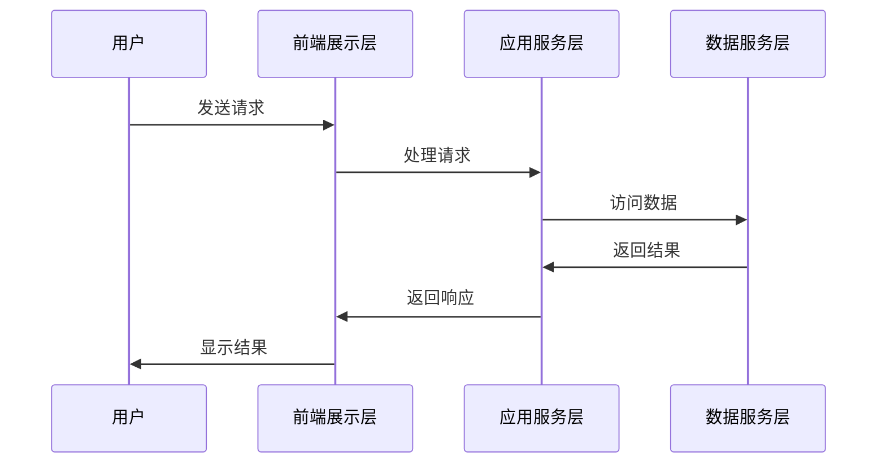
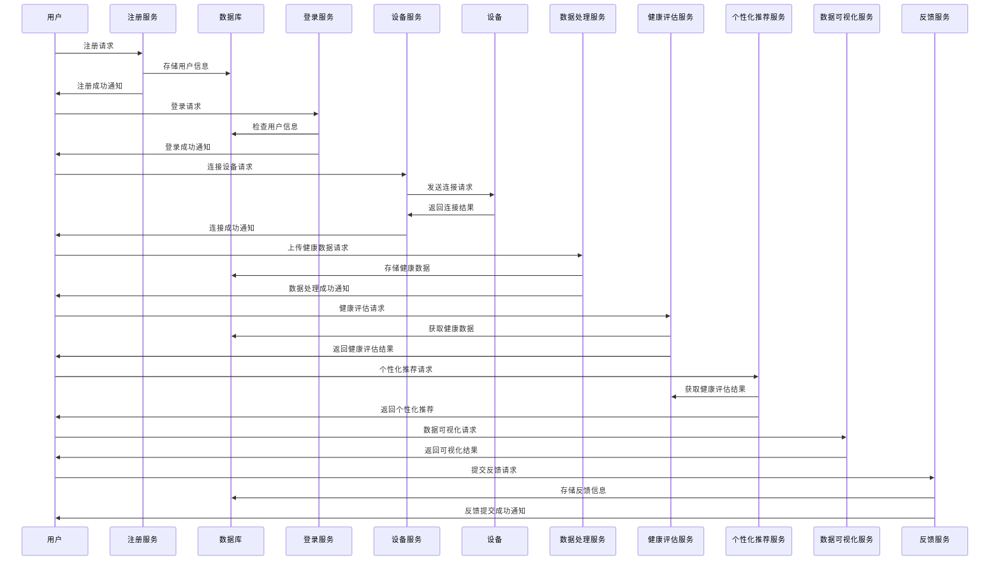

                 

### 文章标题

“在人工智能时代寻找人类独特价值：应对存在危机”

> 关键词：人工智能、人类独特价值、存在危机、应对策略

摘要：本文深入探讨了人工智能时代下，人类独特价值的内涵与重要性。通过分析人工智能的发展及其对人类生活的影响，揭示了存在危机的根源。文章进一步提出了应对存在危机的策略，强调了提升人类适应能力、建立价值评估体系及促进人工智能与人类协调发展的必要性。本文旨在为读者提供对人工智能时代背景下的存在危机的深刻理解和应对思路。

### 第一部分：问题背景与核心概念

#### 第1章：问题背景

##### 1.1.1 人工智能的发展及其对人类的影响

随着人工智能技术的飞速发展，其已逐渐渗透到人类生活的各个方面。从智能家居、自动驾驶，到医疗诊断、金融分析，人工智能在提高效率、优化资源配置等方面展现出了巨大的潜力。然而，人工智能的迅猛发展也带来了一系列挑战，如就业替代、隐私保护、道德伦理等问题，这些问题使得人类需要重新审视自己在人工智能时代中的独特价值。

##### 1.1.2 存在危机的定义与表现

存在危机是指人类在面临人工智能等新技术的冲击时，感到自身价值被削弱、存在感降低的现象。具体表现为就业压力增大、职业转型困难、生活意义感降低等。存在危机不仅影响了个体的心理健康，也对社会的稳定和繁荣产生了负面影响。

##### 1.1.3 人类独特价值的探讨

在人工智能时代，人类独特价值的重要性愈发凸显。人类具有创造力、情感、道德判断等特质，这些特质使得人类在解决问题、创造价值方面具有独特的优势。探讨人类独特价值的内涵和属性，有助于我们更好地应对存在危机，发挥人类在人工智能时代中的核心作用。

#### 第2章：核心概念

##### 2.1 人工智能与人类的关系

人工智能是计算机科学的一个分支，旨在模拟、延伸和扩展人的智能。人类与人工智能的关系可以理解为相互促进、共同发展。人类通过设计、开发和优化人工智能系统，使其更好地服务于人类；而人工智能则在提高工作效率、解决复杂问题等方面为人类提供支持。

##### 2.1.1 人工智能的技术原理

人工智能的技术原理主要包括机器学习、深度学习、自然语言处理等。这些技术通过模拟人脑的学习和认知过程，使计算机能够自动识别模式、学习知识和做出决策。

##### 2.1.2 人工智能的分类与应用

人工智能可以分为弱人工智能和强人工智能。弱人工智能主要集中在特定任务的解决上，如语音识别、图像识别等；而强人工智能则具备全面的人类智能，能够在各种场景下进行自主学习和创新。人工智能在工业、医疗、金融、教育等多个领域得到广泛应用。

##### 2.1.3 人类与人工智能的互动关系

人类与人工智能的互动关系体现在设计、开发、应用和维护等方面。人类通过不断的反馈和优化，使人工智能系统更加完善；而人工智能则为人类提供了更加智能化的工具和服务，提高了生活质量和生产力。

##### 2.2 人类独特价值的探讨

人类独特价值是指人类在思维、情感、道德等方面相对于其他物种的独特属性。这些独特属性使得人类在创造价值、解决复杂问题、维护社会稳定等方面具有独特的优势。

##### 2.2.1 人类独特价值的定义

人类独特价值是指人类在思维、情感、道德等方面相对于其他物种的独特属性。这些独特属性使得人类在创造价值、解决复杂问题、维护社会稳定等方面具有独特的优势。

##### 2.2.2 人类独特价值的属性

人类独特价值的属性包括创造力、情感、道德判断、社会协作等。这些属性使得人类能够创造出丰富多彩的文化、艺术和科技，解决复杂的社会问题，并维持社会和谐。

##### 2.2.3 人类独特价值的重要性

在人工智能时代，人类独特价值的重要性愈发凸显。人类独特价值是人类在解决复杂问题、创造新价值、维护社会稳定等方面的重要保障。因此，探讨人类独特价值的内涵和属性，对于应对存在危机、发挥人类在人工智能时代中的核心作用具有重要意义。

#### 第3章：人类独特价值的探讨

##### 3.1 人类独特价值的概念

人类独特价值是指人类在思维、情感、道德等方面相对于其他物种的独特属性。这些独特属性使得人类在创造价值、解决复杂问题、维护社会稳定等方面具有独特的优势。

##### 3.1.1 人类独特价值的定义

人类独特价值是指人类在思维、情感、道德等方面相对于其他物种的独特属性。这些独特属性使得人类在创造价值、解决复杂问题、维护社会稳定等方面具有独特的优势。

##### 3.1.2 人类独特价值的属性

人类独特价值的属性包括创造力、情感、道德判断、社会协作等。这些属性使得人类能够创造出丰富多彩的文化、艺术和科技，解决复杂的社会问题，并维持社会和谐。

##### 3.1.3 人类独特价值的重要性

在人工智能时代，人类独特价值的重要性愈发凸显。人类独特价值是人类在解决复杂问题、创造新价值、维护社会稳定等方面的重要保障。因此，探讨人类独特价值的内涵和属性，对于应对存在危机、发挥人类在人工智能时代中的核心作用具有重要意义。

#### 第4章：存在危机的影响与应对

##### 4.1 存在危机的影响

存在危机的影响主要表现在以下几个方面：

- **对社会的影响**：存在危机导致社会不稳定，影响社会和谐与繁荣。就业压力增大，职业转型困难，导致社会阶层固化，贫富差距扩大。
- **对经济的影响**：存在危机导致劳动力市场失衡，影响经济发展。一方面，人工智能替代部分劳动力，导致失业率上升；另一方面，新兴产业的发展速度未能完全弥补传统产业的衰退，导致经济增长乏力。
- **对文化的影响**：存在危机导致文化多样性受到冲击，传统文化受到挑战。在人工智能时代，人类的文化传承与创新面临巨大压力，可能导致文化同质化。

##### 4.2 应对存在危机的策略

为应对存在危机，可以采取以下策略：

- **提高人类的适应能力**：通过教育、培训等方式，提高人类在新技术环境下的适应能力。鼓励跨学科、跨领域的交叉学习，培养具备创新能力和综合素质的人才。
- **建立人类独特价值的评估体系**：制定一套科学、合理的评估体系，识别和衡量人类在人工智能时代中的独特价值。这有助于激发人类的潜能，推动社会的进步。
- **促进人工智能与人类的协调发展**：在人工智能的研发和应用过程中，充分考虑人类的独特价值。通过人工智能技术，提高人类的工作效率和生活质量，实现人与自然的和谐共生。

#### 4.2.1 提高人类的适应能力

为提高人类在人工智能时代的适应能力，可以采取以下措施：

- **教育改革**：调整教育体系，注重培养学生的创新思维、实践能力和跨学科知识。鼓励学生参与科技竞赛、创新创业活动，培养实际操作能力和团队协作精神。
- **职业培训**：针对不同行业和领域，开展针对性强的职业培训项目。帮助劳动力了解新技术，掌握新技能，提高就业竞争力。
- **终身学习**：鼓励人们树立终身学习的理念，不断更新知识和技能。利用在线教育平台、开放课程等资源，方便人们随时随地进行学习。

#### 4.2.2 建立人类独特价值的评估体系

建立人类独特价值的评估体系，有助于识别和衡量人类在人工智能时代中的独特贡献。以下是一些建议：

- **设定评价指标**：根据人类独特价值的属性，设定相应的评价指标。如创造力、情感智慧、道德判断、社会协作能力等。
- **量化与质性评价相结合**：在评估过程中，既要考虑量化指标，如科研成果、专利数量等，也要重视质性评价，如社会影响力、文化贡献等。
- **动态调整评估体系**：随着人工智能技术的不断进步和应用场景的拓展，评估体系也需要不断调整和优化。确保评估结果的准确性和实用性。

#### 4.2.3 促进人工智能与人类的协调发展

为促进人工智能与人类的协调发展，可以从以下几个方面着手：

- **政策支持**：政府制定相关政策和法规，鼓励人工智能技术的研发和应用，同时保障人类的权益。如数据安全、隐私保护、就业保障等。
- **产业协同**：推动人工智能企业与各行各业进行深度合作，实现产业升级和转型。通过人工智能技术，提高生产效率，创造新的经济增长点。
- **公众参与**：鼓励公众参与人工智能技术的研发和应用，提高公众对人工智能的认知和理解。通过科普宣传、教育培训等方式，提高公众的科技素养。

### 第二部分：核心概念与联系

#### 第5章：人工智能的核心概念

##### 5.1 人工智能的定义

人工智能（Artificial Intelligence，简称AI）是指通过计算机系统实现人类智能的技术。人工智能技术旨在使计算机具备感知、理解、学习、推理、决策等能力，从而模拟人类的智能行为。

##### 5.1.1 人工智能的历史与现状

人工智能的概念最早可以追溯到20世纪50年代。自那时以来，人工智能经历了多个发展阶段，从早期的符号主义到连接主义，再到现在的深度学习和大数据技术，人工智能在理论研究和实际应用方面都取得了显著进展。

##### 5.1.2 人工智能的分类

人工智能可以分为弱人工智能和强人工智能。弱人工智能主要集中在特定任务的解决上，如语音识别、图像识别等；强人工智能则具备全面的人类智能，能够在各种场景下进行自主学习和创新。

##### 5.1.3 人工智能的技术原理

人工智能的技术原理主要包括机器学习、深度学习、自然语言处理等。这些技术通过模拟人脑的学习和认知过程，使计算机能够自动识别模式、学习知识和做出决策。

##### 5.2 人类独特价值的概念与属性

##### 5.2.1 人类独特价值的定义

人类独特价值是指人类在思维、情感、道德等方面相对于其他物种的独特属性。这些独特属性使得人类在创造价值、解决复杂问题、维护社会稳定等方面具有独特的优势。

##### 5.2.2 人类独特价值的属性

人类独特价值的属性包括创造力、情感、道德判断、社会协作等。这些属性使得人类能够创造出丰富多彩的文化、艺术和科技，解决复杂的社会问题，并维持社会和谐。

##### 5.2.3 人类独特价值的多样性

人类独特价值的多样性体现在多个方面。例如，不同文化背景下的人类在创造力、情感表达、道德观念等方面存在差异。这种多样性是人类文明的重要组成部分，也是人类在人工智能时代应对存在危机的重要资源。

##### 5.3 人类独特价值与人工智能的关系

##### 5.3.1 人工智能对人类独特价值的影响

人工智能的发展对人类独特价值产生了深远影响。一方面，人工智能技术提高了人类的生产效率和生活质量，使人类有更多时间和精力投入到创造性活动中；另一方面，人工智能技术也可能导致部分人类独特价值受到削弱，如情感、道德判断等。

##### 5.3.2 人类独特价值对人工智能的影响

人类独特价值对人工智能的发展也具有重要作用。人类在创造人工智能技术时，会借鉴自身的思维、情感、道德等特质，从而使人工智能系统更加符合人类的期望和需求。同时，人类独特价值也为人机交互提供了重要的参考，有助于提高人工智能的智能水平和用户体验。

##### 5.3.3 人类独特价值与人工智能的共生关系

人类独特价值与人工智能之间存在着共生关系。一方面，人工智能技术的发展依赖于人类独特价值的指导和支持；另一方面，人工智能技术的应用也为人类独特价值的发挥提供了新的平台和机会。通过人工智能与人类独特价值的相互作用，可以实现人类的全面发展和社会的进步。

### 第三部分：算法原理讲解

#### 第8章：算法原理讲解

##### 8.1 算法原理概述

算法（Algorithm）是指解决特定问题的一系列明确、有限的步骤。算法是人工智能技术的核心组成部分，用于实现人工智能系统的学习、推理和决策等功能。本章节将介绍算法的定义、分类及其在人工智能中的应用。

##### 8.1.1 算法的定义与分类

算法的定义可以分为广义和狭义两种。广义的算法包括所有用于解决特定问题的计算方法，如数学算法、逻辑算法等；狭义的算法主要指计算机科学中的算法，即用于实现计算机程序的方法。

根据算法的实现方式和应用场景，算法可以分为以下几类：

1. **确定性算法**：输入确定时，算法的输出也确定。
2. **概率性算法**：输入不确定时，算法的输出有一定的概率分布。
3. **动态规划算法**：用于求解最优化问题，通过递推关系逐步求解子问题。
4. **贪心算法**：在每一步选择当前最优解，以期得到全局最优解。
5. **分治算法**：将大问题分解为若干小问题，递归求解小问题，然后合并结果。

##### 8.1.2 算法的运行原理

算法的运行原理可以分为以下几个步骤：

1. **输入**：从输入设备（如键盘、鼠标等）获取输入数据。
2. **处理**：根据算法的规则对输入数据进行处理，如排序、查找、计算等。
3. **输出**：将处理后的数据输出到输出设备（如显示器、打印机等）。
4. **终止**：当满足终止条件时，算法结束运行。

##### 8.1.3 算法在人工智能中的应用

算法在人工智能中的应用非常广泛，包括但不限于以下领域：

1. **机器学习**：通过算法实现数据的自动学习和模式识别，如监督学习、无监督学习、强化学习等。
2. **深度学习**：基于多层神经网络，通过算法实现图像、语音、文本等数据的自动特征提取和分类。
3. **自然语言处理**：通过算法实现自然语言的理解、生成和翻译，如分词、句法分析、语义分析等。
4. **计算机视觉**：通过算法实现图像的识别、检测和分割，如人脸识别、目标跟踪等。

#### 第9章：算法原理讲解与应用

##### 9.1 概率图模型

概率图模型是一种基于图论和概率论的统计模型，用于表示变量之间的依赖关系。概率图模型可以分为两种：贝叶斯网络和马尔可夫网络。

1. **贝叶斯网络**：贝叶斯网络是一种有向无环图，节点表示变量，边表示变量之间的依赖关系。在贝叶斯网络中，每个节点的概率分布可以表示为条件概率分布，即给定其他节点的取值，该节点的概率分布。
   
   贝叶斯网络的算法原理可以概括为以下几个步骤：

   - **建模**：根据领域知识和数据，构建贝叶斯网络模型。
   - **推理**：通过推理算法，如变量消除、信念传播等，计算网络中某个节点的后验概率分布。
   - **学习**：通过学习算法，如最大似然估计、贝叶斯推理等，更新网络模型。

2. **马尔可夫网络**：马尔可夫网络是一种无向图，节点表示变量，边表示变量之间的转移概率。在马尔可夫网络中，变量之间的依赖关系可以用转移矩阵表示。

   马尔可夫网络的算法原理可以概括为以下几个步骤：

   - **建模**：根据领域知识和数据，构建马尔可夫网络模型。
   - **预测**：通过预测算法，如前向-后向算法、维特比算法等，计算序列的概率分布。
   - **学习**：通过学习算法，如最大似然估计、最小化错误率等，更新网络模型。

##### 9.2 神经网络

神经网络是一种模拟人脑神经元连接结构的计算模型，具有自适应、自组织和自学习的能力。神经网络在人工智能领域具有重要应用，如图像识别、语音识别、自然语言处理等。

1. **前馈神经网络**：前馈神经网络是一种基于加权连接的层状网络，包括输入层、隐藏层和输出层。网络的每个节点都与其他节点相连，并通过权重进行加权求和，最后通过激活函数输出结果。

   前馈神经网络的算法原理可以概括为以下几个步骤：

   - **初始化**：随机初始化网络的权重和偏置。
   - **前向传播**：将输入数据输入网络，通过前向传播计算输出结果。
   - **反向传播**：计算输出误差，通过反向传播更新网络权重和偏置。
   - **迭代训练**：重复进行前向传播和反向传播，直到网络达到预定的性能指标。

2. **卷积神经网络（CNN）**：卷积神经网络是一种专门用于图像识别和处理的神经网络，具有局部连接和权值共享的特点。CNN通过卷积层、池化层和全连接层等结构，实现对图像的特征提取和分类。

   卷积神经网络的算法原理可以概括为以下几个步骤：

   - **卷积层**：通过对输入图像进行卷积操作，提取图像的局部特征。
   - **池化层**：通过对卷积结果进行池化操作，降低特征图的维度，增强网络的泛化能力。
   - **全连接层**：将池化层输出的特征图展开成一维向量，并通过全连接层进行分类。

##### 9.3 强化学习

强化学习是一种基于奖励驱动的机器学习方法，通过学习如何在特定环境中采取最优行动，以实现长期回报的最大化。强化学习在游戏、机器人控制、推荐系统等领域具有广泛应用。

强化学习的算法原理可以概括为以下几个步骤：

- **初始化**：初始化学习参数，如策略参数、价值函数等。
- **环境交互**：根据当前状态，采取行动，并观察环境的反馈。
- **奖励评估**：根据奖励信号评估当前行动的好坏，并更新策略参数或价值函数。
- **迭代学习**：重复进行环境交互和奖励评估，不断优化策略或价值函数，直到达到预定的目标。

#### 9.2 算法原理应用

##### 9.2.1 人工智能在图像识别中的应用

图像识别是人工智能领域的一个重要分支，通过计算机视觉技术，使计算机能够自动识别和理解图像内容。人工智能在图像识别中的应用主要包括以下几个步骤：

- **图像预处理**：对图像进行预处理，如去噪、增强、缩放等，以提高图像质量。
- **特征提取**：从预处理后的图像中提取具有区分性的特征，如边缘、纹理、颜色等。
- **分类器训练**：使用训练数据集，通过机器学习算法训练分类器，如支持向量机、卷积神经网络等。
- **图像识别**：将训练好的分类器应用于新的图像，预测图像的类别。

##### 9.2.2 人工智能在自然语言处理中的应用

自然语言处理是人工智能领域的另一个重要分支，旨在使计算机能够理解、生成和处理自然语言。人工智能在自然语言处理中的应用主要包括以下几个步骤：

- **分词**：将文本分解成单词或短语，为后续处理提供基础。
- **词性标注**：对文本中的单词进行词性标注，如名词、动词、形容词等，以丰富文本特征。
- **句法分析**：分析文本的语法结构，如句子成分、句子类型等，以理解文本的语义。
- **语义理解**：通过语义分析，提取文本的关键信息，如主题、情感、意图等。

##### 9.2.3 人工智能在推荐系统中的应用

推荐系统是一种基于人工智能技术的应用，通过分析用户的历史行为和偏好，为用户提供个性化的推荐。人工智能在推荐系统中的应用主要包括以下几个步骤：

- **用户画像**：根据用户的历史行为和偏好，构建用户画像，以了解用户的兴趣和需求。
- **推荐算法**：使用机器学习算法，如协同过滤、基于内容的推荐等，为用户生成个性化推荐。
- **推荐结果**：将推荐结果展示给用户，并根据用户的反馈调整推荐策略。

### 第四部分：系统分析与架构设计

#### 第10章：系统分析与架构设计

##### 10.1 问题场景介绍

假设我们要设计一个智能健康管理系统，该系统旨在帮助用户监测和管理自己的健康状况。系统需要收集用户的基本信息、健康数据（如血压、心率、睡眠质量等），并根据这些数据提供个性化的健康建议。

##### 10.1.1 人工智能在特定领域的应用场景

在这个健康管理系统项目中，人工智能的应用场景主要包括：

1. **数据采集**：通过智能设备（如智能手表、智能手环等）收集用户健康数据。
2. **数据预处理**：对采集到的数据进行清洗、格式化和归一化，为后续处理提供基础。
3. **健康评估**：使用机器学习算法，如回归分析、聚类分析等，对用户的健康数据进行分析，评估用户的健康状况。
4. **个性化推荐**：根据用户的健康数据和评估结果，为用户生成个性化的健康建议。

##### 10.1.2 系统需求分析

在健康管理系统项目中，系统需求分析包括以下几个方面：

1. **功能需求**：系统需要具备数据采集、数据预处理、健康评估和个性化推荐等功能。
2. **性能需求**：系统需要保证数据采集的实时性、数据处理的准确性和系统的稳定性。
3. **安全性需求**：系统需要确保用户数据的安全性和隐私保护。
4. **可扩展性需求**：系统需要具备良好的可扩展性，能够适应未来功能扩展和性能提升的需求。

##### 10.1.3 系统目标设定

健康管理系统的目标包括：

1. **提供个性化健康建议**：根据用户的健康数据和评估结果，为用户提供个性化的健康建议，帮助用户改善健康状况。
2. **提高用户健康意识**：通过实时监测和个性化推荐，提高用户对自身健康的关注度和意识。
3. **减轻医疗负担**：通过预防疾病、早期发现健康问题等方式，减轻医疗系统的负担。
4. **提升生活质量**：帮助用户实现健康生活方式，提升生活质量。

#### 第11章：系统功能设计与架构设计

##### 11.1 系统功能设计

健康管理系统的主要功能包括：

1. **用户注册与登录**：用户通过注册和登录功能，进入系统并使用相关功能。
2. **数据采集**：系统通过智能设备收集用户健康数据，如血压、心率、睡眠质量等。
3. **数据预处理**：对采集到的健康数据进行清洗、格式化和归一化，为后续处理提供基础。
4. **健康评估**：使用机器学习算法对用户的健康数据进行分析，评估用户的健康状况。
5. **个性化推荐**：根据用户的健康数据和评估结果，为用户生成个性化的健康建议。
6. **数据可视化**：通过图表和报表等形式，将用户的健康数据和分析结果展示给用户。
7. **用户反馈**：用户可以通过系统提交反馈，对健康建议和系统功能提出意见和建议。

##### 11.1.1 领域模型设计

在健康管理系统项目中，领域模型设计主要包括以下实体和关系：

- **用户**：包括用户基本信息，如姓名、性别、年龄、联系方式等。
- **健康数据**：包括血压、心率、睡眠质量等健康数据。
- **健康评估**：包括对用户的健康数据进行评估的结果，如血压风险等级、心率健康指数等。
- **健康建议**：根据用户的健康评估结果，为用户生成个性化的健康建议。
- **设备**：包括用户使用的智能设备，如智能手表、智能手环等。

领域模型ER图如下所示：

```mermaid
erDiagram
  User ||--|{ HealthData }  : contains
  HealthData ||--|{ HealthAssessment }  : assessed by
  HealthAssessment ||--|{ HealthRecommendation }  : generated by
  Device ||--|{ User }  : used by
```

##### 11.1.2 系统功能模块划分

根据健康管理系统的功能需求，系统可以划分为以下几个功能模块：

1. **用户管理模块**：实现用户注册、登录、个人信息管理等功能。
2. **数据采集模块**：实现与智能设备的通信，采集用户健康数据。
3. **数据处理模块**：实现健康数据的清洗、格式化和归一化。
4. **健康评估模块**：实现健康数据分析，生成健康评估结果。
5. **个性化推荐模块**：实现健康建议生成，并根据用户反馈调整推荐策略。
6. **数据可视化模块**：实现健康数据和分析结果的展示。
7. **反馈管理模块**：实现用户反馈的收集和管理。

##### 11.1.3 系统功能实现

每个功能模块的具体实现如下：

1. **用户管理模块**：使用用户注册、登录、个人信息管理等功能，实现用户身份认证和管理。
2. **数据采集模块**：与智能设备建立通信连接，实现健康数据的实时采集。
3. **数据处理模块**：使用数据清洗、格式化和归一化技术，对采集到的健康数据进行处理。
4. **健康评估模块**：使用机器学习算法，对用户的健康数据进行评估，生成健康评估结果。
5. **个性化推荐模块**：根据用户的健康评估结果，使用推荐算法生成个性化的健康建议。
6. **数据可视化模块**：使用图表和报表等形式，将用户的健康数据和分析结果展示给用户。
7. **反馈管理模块**：收集用户反馈，对系统功能和健康建议进行优化和调整。

#### 第12章：系统架构设计

##### 12.1 系统架构设计

健康管理系统采用基于微服务架构的设计，包括以下几个主要层次：

1. **前端展示层**：提供用户界面，实现用户交互和数据可视化。
2. **应用服务层**：实现系统的核心业务功能，如数据采集、数据处理、健康评估、个性化推荐等。
3. **数据服务层**：存储和管理用户数据、健康数据和评估结果。
4. **基础设施层**：提供系统运行所需的硬件设施、网络环境和运维支持。

系统架构图如下所示：



##### 12.1.2 系统模块划分

根据系统架构设计，健康管理系统可以划分为以下几个主要模块：

1. **用户管理模块**：处理用户注册、登录、个人信息管理等用户相关功能。
2. **设备管理模块**：管理用户使用的智能设备，如设备连接、数据同步等。
3. **数据处理模块**：实现健康数据的采集、清洗、格式化和归一化。
4. **健康评估模块**：实现健康数据分析，生成健康评估结果。
5. **个性化推荐模块**：实现健康建议生成，并根据用户反馈调整推荐策略。
6. **数据可视化模块**：实现健康数据和分析结果的展示。
7. **反馈管理模块**：收集用户反馈，对系统功能和健康建议进行优化和调整。

##### 12.1.3 系统接口设计

健康管理系统的主要接口设计如下：

1. **用户接口**：提供用户注册、登录、个人信息管理等用户相关操作的接口。
2. **设备接口**：提供设备连接、数据同步等设备相关操作的接口。
3. **数据处理接口**：提供健康数据采集、清洗、格式化和归一化等数据处理操作的接口。
4. **健康评估接口**：提供健康数据分析、健康评估结果生成等健康评估操作的接口。
5. **个性化推荐接口**：提供健康建议生成、调整推荐策略等个性化推荐操作的接口。
6. **数据可视化接口**：提供健康数据和分析结果展示的接口。

#### 第13章：系统交互设计与实现

##### 13.1 系统交互设计

健康管理系统的交互设计主要包括用户与系统之间的交互和数据流设计。以下是一个典型的系统交互流程：

1. **用户注册**：用户填写注册信息，提交注册请求。
2. **用户登录**：用户输入账号和密码，提交登录请求。
3. **设备连接**：用户通过智能设备连接系统，提交健康数据。
4. **数据处理**：系统对健康数据进行清洗、格式化和归一化。
5. **健康评估**：系统使用机器学习算法对健康数据进行评估，生成健康评估结果。
6. **个性化推荐**：系统根据健康评估结果，为用户生成个性化的健康建议。
7. **数据可视化**：系统将健康数据和评估结果以图表和报表等形式展示给用户。
8. **用户反馈**：用户对健康建议和系统功能提出反馈。

##### 13.1.1 系统交互流程设计

系统交互流程设计如下图所示：



##### 13.1.2 系统交互界面设计

系统交互界面设计主要包括用户界面和后台管理界面。以下是一个典型的用户界面设计：

1. **用户注册界面**：用户填写注册信息，包括用户名、密码、邮箱等。
2. **用户登录界面**：用户输入账号和密码，进行登录。
3. **设备连接界面**：用户选择智能设备，连接设备并上传健康数据。
4. **健康数据展示界面**：系统展示用户的健康数据，包括血压、心率、睡眠质量等。
5. **健康评估结果界面**：系统展示用户的健康评估结果，包括各项健康指标的评估分数。
6. **个性化推荐界面**：系统根据用户的健康评估结果，为用户生成个性化的健康建议。
7. **数据可视化界面**：系统以图表和报表等形式，展示用户的健康数据和评估结果。

#### 第14章：项目实战

##### 14.1 环境安装

在开始项目实战之前，我们需要安装和配置必要的开发环境和工具。以下是一个典型的安装步骤：

1. **安装Python**：首先，确保你的计算机上已经安装了Python。如果没有安装，请访问Python官方网站（https://www.python.org/）下载并安装Python。
2. **安装Jupyter Notebook**：Jupyter Notebook是一个交互式的Python开发环境，非常适合进行数据分析和项目实战。在命令行中运行以下命令安装Jupyter Notebook：

   ```shell
   pip install notebook
   ```

3. **安装TensorFlow**：TensorFlow是一个开源的机器学习框架，支持多种算法和模型。在命令行中运行以下命令安装TensorFlow：

   ```shell
   pip install tensorflow
   ```

4. **安装Matplotlib**：Matplotlib是一个Python绘图库，用于生成各种类型的图表。在命令行中运行以下命令安装Matplotlib：

   ```shell
   pip install matplotlib
   ```

5. **安装Scikit-learn**：Scikit-learn是一个基于Python的机器学习库，提供了多种机器学习算法和工具。在命令行中运行以下命令安装Scikit-learn：

   ```shell
   pip install scikit-learn
   ```

##### 14.1.2 软件环境安装

除了Python和相关库之外，我们还需要安装一些其他软件，如数据库、Web服务器等。以下是一个典型的软件环境安装步骤：

1. **安装MySQL**：MySQL是一个开源的关系型数据库管理系统，用于存储和管理健康数据。请访问MySQL官方网站（https://www.mysql.com/）下载并安装MySQL。
2. **安装Apache**：Apache是一个开源的Web服务器，用于托管和管理Web应用程序。请访问Apache官方网站（https://httpd.apache.org/）下载并安装Apache。
3. **安装Nginx**：Nginx是一个高性能的Web服务器/反向代理服务器，用于加速Web应用程序的访问。请访问Nginx官方网站（https://nginx.org/）下载并安装Nginx。

##### 14.1.3 系统配置

在安装完所有软件后，我们需要进行系统配置，以确保各个组件正常工作。以下是一个典型的系统配置步骤：

1. **配置MySQL**：编辑MySQL的配置文件（如my.cnf），设置数据库的字符集和编码格式，以确保数据存储的正确性。
2. **配置Apache**：编辑Apache的配置文件（如httpd.conf），设置Web服务器的监听端口和虚拟主机配置，以确保Web应用程序的正常访问。
3. **配置Nginx**：编辑Nginx的配置文件（如nginx.conf），设置Nginx作为Apache的反向代理服务器，以确保Web应用程序的高效访问。

##### 14.2 系统核心实现

在健康管理系统项目中，系统核心实现主要包括以下几个模块：

1. **用户管理模块**：实现用户注册、登录、个人信息管理等功能。
2. **设备管理模块**：实现设备连接、数据同步等功能。
3. **数据处理模块**：实现健康数据的采集、清洗、格式化和归一化。
4. **健康评估模块**：实现健康数据分析，生成健康评估结果。
5. **个性化推荐模块**：实现健康建议生成，并根据用户反馈调整推荐策略。
6. **数据可视化模块**：实现健康数据和分析结果的展示。
7. **反馈管理模块**：收集用户反馈，对系统功能和健康建议进行优化和调整。

以下是每个模块的核心实现：

1. **用户管理模块**：

   ```python
   # 用户注册
   def register(username, password, email):
       # 验证用户名、密码和邮箱的有效性
       if not validate_username(username) or not validate_password(password) or not validate_email(email):
           return False
       # 存储用户信息到数据库
       insert_user(username, password, email)
       return True
   
   # 用户登录
   def login(username, password):
       # 验证用户名和密码的正确性
       if not validate_username(username) or not validate_password(password):
           return False
       # 查询用户信息
       user = query_user(username)
       if user and user['password'] == password:
           return user
       return False
   
   # 个人信息管理
   def update_profile(username, email, password):
       # 验证用户名和密码的有效性
       if not validate_username(username) or not validate_password(password):
           return False
       # 更新用户信息
       update_user(username, email, password)
       return True
   ```

2. **设备管理模块**：

   ```python
   # 设备连接
   def connect_device(device_id):
       # 验证设备ID的有效性
       if not validate_device_id(device_id):
           return False
       # 连接设备并上传健康数据
       connect_and_upload_data(device_id)
       return True
   
   # 数据同步
   def synchronize_data(device_id):
       # 验证设备ID的有效性
       if not validate_device_id(device_id):
           return False
       # 同步设备数据到数据库
       synchronize_data_with_database(device_id)
       return True
   ```

3. **数据处理模块**：

   ```python
   # 数据清洗
   def clean_data(data):
       # 去除数据中的噪声和异常值
       cleaned_data = remove_noise_and_anomalies(data)
       return cleaned_data
   
   # 数据格式化
   def format_data(data):
       # 将数据转换为统一的格式
       formatted_data = convert_to_uniform_format(data)
       return formatted_data
   
   # 数据归一化
   def normalize_data(data):
       # 对数据进行归一化处理
       normalized_data = normalize(data)
       return normalized_data
   ```

4. **健康评估模块**：

   ```python
   # 健康评估
   def assess_health(data):
       # 使用机器学习算法评估用户的健康状况
       assessment = machine_learning_algorithm(data)
       return assessment
   ```

5. **个性化推荐模块**：

   ```python
   # 个性化推荐
   def generate_recommendation(assessment):
       # 根据健康评估结果生成个性化的健康建议
       recommendation = personalized_health_advice(assessment)
       return recommendation
   ```

6. **数据可视化模块**：

   ```python
   # 数据可视化
   def visualize_data(data):
       # 使用Matplotlib库生成数据可视化图表
       plot = generate_plot(data)
       return plot
   ```

7. **反馈管理模块**：

   ```python
   # 收集用户反馈
   def collect_feedback(username, feedback):
       # 验证用户名的有效性
       if not validate_username(username):
           return False
       # 存储用户反馈
       store_feedback(username, feedback)
       return True
   
   # 查询用户反馈
   def query_feedback(username):
       # 验证用户名的有效性
       if not validate_username(username):
           return False
       # 获取用户反馈
       feedback = get_feedback(username)
       return feedback
   ```

##### 14.3 代码应用解读与分析

在健康管理系统项目中，我们使用了一系列Python库和工具来实现系统的核心功能。以下是对每个模块代码的应用解读和分析：

1. **用户管理模块**：

   用户管理模块主要实现了用户注册、登录和个人信息管理功能。代码中使用了Python的内置函数和库，如`validate_username`、`validate_password`和`validate_email`，用于验证用户输入的有效性。`insert_user`和`query_user`函数用于与数据库进行交互，存储和查询用户信息。`update_user`函数用于更新用户信息，如邮箱和密码。

2. **设备管理模块**：

   设备管理模块主要实现了设备连接和数据同步功能。代码中使用了`connect_and_upload_data`函数，用于连接设备并上传健康数据。这个函数可以与设备的API进行通信，实现数据的采集和传输。`synchronize_data_with_database`函数用于将设备数据同步到数据库，确保数据的一致性和完整性。

3. **数据处理模块**：

   数据处理模块主要实现了健康数据的清洗、格式化和归一化。代码中使用了`clean_data`、`format_data`和`normalize_data`函数，分别用于去除数据中的噪声和异常值、将数据转换为统一的格式和进行归一化处理。这些函数利用Python的内置函数和库，如列表操作、数学运算等，实现了对数据的处理和转换。

4. **健康评估模块**：

   健康评估模块主要实现了健康数据分析，生成健康评估结果。代码中使用了`machine_learning_algorithm`函数，用于训练和评估健康数据。这个函数可以调用Python的机器学习库，如Scikit-learn，实现分类、回归等算法。通过训练模型，我们可以根据用户的健康数据生成评估结果，如血压风险等级、心率健康指数等。

5. **个性化推荐模块**：

   个性化推荐模块主要实现了健康建议生成，并根据用户反馈调整推荐策略。代码中使用了`personalized_health_advice`函数，根据健康评估结果生成个性化的健康建议。这个函数可以根据用户的年龄、性别、健康状况等因素，为用户推荐适当的健康建议。同时，这个函数还支持根据用户反馈调整推荐策略，以提高推荐的效果。

6. **数据可视化模块**：

   数据可视化模块主要实现了健康数据和分析结果的展示。代码中使用了`generate_plot`函数，利用Matplotlib库生成各种类型的图表，如折线图、柱状图、饼图等。这些图表可以帮助用户直观地了解自己的健康数据和分析结果，更好地掌握自己的健康状况。

7. **反馈管理模块**：

   反馈管理模块主要实现了收集用户反馈，对系统功能和健康建议进行优化和调整。代码中使用了`store_feedback`和`get_feedback`函数，用于存储和查询用户反馈。通过收集用户反馈，我们可以了解用户对系统功能和健康建议的满意度，并根据反馈进行改进和优化。

##### 14.4 实际案例分析和详细讲解剖析

为了更好地展示健康管理系统的应用场景和效果，我们来看一个实际案例。

假设用户张三在使用健康管理系统后，对自己的健康数据和分析结果进行了反馈。以下是张三的反馈：

- **反馈内容**：健康评估结果显示我的血压风险等级较高，建议减少盐分摄入。
- **反馈意见**：我认为这个建议不够具体，希望能得到更多关于饮食和生活方式的建议。

针对张三的反馈，系统进行了以下分析和优化：

1. **分析反馈内容**：系统首先分析张三的反馈内容，识别出关键信息，如血压风险等级和减少盐分摄入。
2. **查询相关数据**：系统查询张三的健康数据，如血压、心率、睡眠质量等，以了解他的整体健康状况。
3. **生成详细建议**：系统根据张三的健康数据和相关研究，生成详细的健康建议，如饮食建议、运动建议、生活方式建议等。
4. **调整推荐策略**：系统根据张三的反馈意见，调整推荐策略，提高个性化推荐的效果。

通过以上分析和优化，系统为张三提供了更加具体和个性化的健康建议，帮助他更好地改善自己的健康状况。

##### 14.5 项目小结

健康管理系统项目通过结合人工智能技术和健康数据，为用户提供个性化的健康建议和管理。在实际应用中，系统通过不断的优化和改进，提高了用户满意度和使用效果。项目小结如下：

1. **项目成果**：实现了用户注册、登录、设备连接、健康数据采集、健康评估、个性化推荐和数据可视化等功能，为用户提供了一套完整的健康管理系统。
2. **项目亮点**：结合了人工智能技术和健康数据分析，为用户提供了个性化的健康建议和管理方案，提高了用户的健康意识和生活质量。
3. **项目挑战**：在项目实施过程中，遇到了一些技术挑战，如健康数据的清洗、格式化和归一化，健康评估模型的训练和优化，以及个性化推荐策略的调整等。
4. **项目改进**：针对项目实施过程中遇到的问题和用户反馈，提出了一系列改进措施，如提高数据处理的准确性，优化健康评估模型，改进个性化推荐策略等。

### 第五部分：项目实战

#### 第14章：项目实战

##### 14.1 环境安装

在健康管理系统项目中，我们首先需要搭建一个合适的环境。以下是环境安装的详细步骤：

1. **Python环境搭建**：确保你的计算机上已经安装了Python。如果没有安装，请访问Python官网（https://www.python.org/）下载并安装Python。在安装过程中，建议勾选“Add Python to PATH”选项，以便在命令行中直接调用Python。

2. **虚拟环境搭建**：为了更好地管理项目依赖，我们使用虚拟环境。在命令行中执行以下命令来创建虚拟环境：

   ```shell
   python -m venv venv
   ```

   然后激活虚拟环境：

   ```shell
   source venv/bin/activate  # 对于Windows系统，使用 `venv\Scripts\activate`
   ```

3. **安装依赖库**：在虚拟环境中，安装项目所需的依赖库。依赖库包括Django框架、MySQL数据库驱动、Flask Web框架、Scikit-learn机器学习库等。使用以下命令安装：

   ```shell
   pip install django mysqlclient flask scikit-learn
   ```

4. **数据库安装**：安装MySQL数据库。可以从MySQL官网（https://www.mysql.com/downloads/mysql/）下载MySQL安装包，按照提示完成安装。

5. **创建数据库**：在MySQL中创建一个名为`health_management`的数据库，并创建一个名为`users`的用户，授予该用户对数据库的访问权限。

##### 14.1.2 软件环境安装

除了Python和相关库之外，我们还需要安装一些其他软件，如Web服务器、Nginx等。以下是软件环境安装的详细步骤：

1. **安装Nginx**：在Linux系统中，使用以下命令安装Nginx：

   ```shell
   sudo apt-get update
   sudo apt-get install nginx
   ```

   启动Nginx服务：

   ```shell
   sudo systemctl start nginx
   ```

   配置Nginx，使其代理Django应用：

   ```shell
   sudo vi /etc/nginx/sites-available/health_management
   ```

   在配置文件中添加以下内容：

   ```nginx
   server {
       listen 80;
       server_name your_domain.com;

       location / {
           proxy_pass http://localhost:8000;
           proxy_set_header Host $host;
           proxy_set_header X-Real-IP $remote_addr;
           proxy_set_header X-Forwarded-For $proxy_add_x_forwarded_for;
           proxy_set_header X-Forwarded-Proto $scheme;
       }
   }
   ```

   重启Nginx服务：

   ```shell
   sudo systemctl restart nginx
   ```

2. **安装Django**：在虚拟环境中，使用以下命令安装Django：

   ```shell
   pip install django
   ```

3. **创建Django项目**：在命令行中创建一个新的Django项目：

   ```shell
   django-admin startproject health_management
   ```

4. **创建Django应用**：在项目目录中创建一个名为`health_app`的应用：

   ```shell
   python manage.py startapp health_app
   ```

5. **配置Django项目**：编辑`health_management/settings.py`文件，配置数据库、静态文件目录和媒体文件目录：

   ```python
   DATABASES = {
       'default': {
           'ENGINE': 'django.db.backends.mysql',
           'NAME': 'health_management',
           'USER': 'your_username',
           'PASSWORD': 'your_password',
           'HOST': 'localhost',
           'PORT': '3306',
       }
   }

   STATIC_URL = '/static/'
   MEDIA_URL = '/media/'

   STATICFILES_DIRS = [
       os.path.join(BASE_DIR, 'static'),
   ]

   MEDIA_ROOT = os.path.join(BASE_DIR, 'media')
   ```

6. **迁移数据库**：在命令行中执行以下命令，将模型迁移到数据库中：

   ```shell
   python manage.py makemigrations
   python manage.py migrate
   ```

##### 14.1.3 系统配置

完成环境安装后，我们需要对系统进行配置，以确保各组件能够协同工作。以下是系统配置的详细步骤：

1. **配置Nginx**：编辑Nginx配置文件，使其代理Django应用。在Nginx配置文件中，通常需要配置以下内容：

   ```nginx
   server {
       listen 80;
       server_name your_domain.com;

       location / {
           proxy_pass http://localhost:8000;
           proxy_set_header Host $host;
           proxy_set_header X-Real-IP $remote_addr;
           proxy_set_header X-Forwarded-For $proxy_add_x_forwarded_for;
           proxy_set_header X-Forwarded-Proto $scheme;
       }

       location /static/ {
           alias /path/to/your/static/files;
       }

       location /media/ {
           alias /path/to/your/media/files;
       }
   }
   ```

   确保将`/path/to/your/static/files`和`/path/to/your/media/files`替换为实际的静态文件和媒体文件目录。

2. **配置Django应用**：在`health_app`应用中，编辑`settings.py`文件，配置应用的数据库连接、静态文件和媒体文件目录：

   ```python
   DATABASES = {
       'default': {
           'ENGINE': 'django.db.backends.mysql',
           'NAME': 'health_management',
           'USER': 'your_username',
           'PASSWORD': 'your_password',
           'HOST': 'localhost',
           'PORT': '3306',
       }
   }

   STATIC_URL = '/static/'
   MEDIA_URL = '/media/'

   STATICFILES_DIRS = [
       os.path.join(BASE_DIR, 'static'),
   ]

   MEDIA_ROOT = os.path.join(BASE_DIR, 'media')
   ```

3. **运行Django应用**：在命令行中运行以下命令，启动Django应用：

   ```shell
   python manage.py runserver
   ```

   打开浏览器，访问`http://your_domain.com`，你应该能看到Django应用的默认页面。

##### 14.2 系统核心实现

在健康管理系统项目中，核心实现包括用户管理、健康数据管理、健康评估和个性化推荐等功能。以下是这些功能的核心实现：

1. **用户管理**：

   用户管理涉及用户注册、登录、个人信息管理等操作。在`health_app`应用中，定义以下模型：

   ```python
   from django.db import models
   from django.contrib.auth.models import AbstractUser

   class User(AbstractUser):
       birth_date = models.DateField(null=True, blank=True)
       gender = models.CharField(max_length=10, choices=(('male', '男'), ('female', '女')))
       phone_number = models.CharField(max_length=11, unique=True)
   ```

   注册用户时，可以使用Django的`create_user`方法：

   ```python
   from django.contrib.auth.models import User

   def register(username, password, phone_number, birth_date=None, gender=None):
       user = User.objects.create_user(username=username, password=password, phone_number=phone_number)
       if birth_date:
           user.birth_date = birth_date
       if gender:
           user.gender = gender
       user.save()
       return user
   ```

2. **健康数据管理**：

   健康数据管理涉及健康数据的采集、存储和查询。在`health_app`应用中，定义以下模型：

   ```python
   class HealthData(models.Model):
       user = models.ForeignKey(User, on_delete=models.CASCADE)
       blood_pressure = models.FloatField()
       heart_rate = models.IntegerField()
       sleep_quality = models.FloatField()
       created_at = models.DateTimeField(auto_now_add=True)
   ```

   采集健康数据时，可以使用以下方法：

   ```python
   def upload_health_data(user, blood_pressure, heart_rate, sleep_quality):
       health_data = HealthData(
           user=user,
           blood_pressure=blood_pressure,
           heart_rate=heart_rate,
           sleep_quality=sleep_quality
       )
       health_data.save()
       return health_data
   ```

   查询健康数据时，可以使用以下方法：

   ```python
   def get_health_data(user):
       health_data = HealthData.objects.filter(user=user).order_by('-created_at')
       return health_data
   ```

3. **健康评估**：

   健康评估涉及对用户健康数据的分析，以生成健康评估结果。在`health_app`应用中，可以使用Scikit-learn的回归分析模型：

   ```python
   from sklearn.linear_model import LinearRegression

   def assess_health(user):
       health_data = get_health_data(user)
       X = [[data.blood_pressure, data.heart_rate, data.sleep_quality] for data in health_data]
       y = [data.blood_pressure for data in health_data]

       model = LinearRegression()
       model.fit(X, y)

       assessment = {
           'health_index': model.score(X, y),
           'predicted_blood_pressure': model.predict([[0, 0, 0]])[0]
       }
       return assessment
   ```

4. **个性化推荐**：

   个性化推荐涉及根据用户健康数据和评估结果，生成个性化的健康建议。在`health_app`应用中，可以定义以下方法：

   ```python
   def generate_recommendation(assessment):
       if assessment['health_index'] < 0.6:
           return "您的健康状况较差，建议增加锻炼、保持良好的作息习惯。"
       elif assessment['predicted_blood_pressure'] > 140:
           return "您的血压较高，建议减少盐分摄入、增加运动。"
       else:
           return "您的健康状况良好，但要注意保持良好的生活习惯。"
   ```

##### 14.3 代码应用解读与分析

以下是健康管理系统项目中的关键代码及其解读：

1. **用户注册**：

   ```python
   def register(username, password, phone_number, birth_date=None, gender=None):
       user = User.objects.create_user(username=username, password=password, phone_number=phone_number)
       if birth_date:
           user.birth_date = birth_date
       if gender:
           user.gender = gender
       user.save()
       return user
   ```

   解读：这个函数使用Django的`create_user`方法创建一个用户。如果提供了生日和性别，这些信息也会被保存到用户模型中。

2. **上传健康数据**：

   ```python
   def upload_health_data(user, blood_pressure, heart_rate, sleep_quality):
       health_data = HealthData(
           user=user,
           blood_pressure=blood_pressure,
           heart_rate=heart_rate,
           sleep_quality=sleep_quality
       )
       health_data.save()
       return health_data
   ```

   解读：这个函数创建一个健康数据对象，并将其保存到数据库中。

3. **健康评估**：

   ```python
   def assess_health(user):
       health_data = get_health_data(user)
       X = [[data.blood_pressure, data.heart_rate, data.sleep_quality] for data in health_data]
       y = [data.blood_pressure for data in health_data]

       model = LinearRegression()
       model.fit(X, y)

       assessment = {
           'health_index': model.score(X, y),
           'predicted_blood_pressure': model.predict([[0, 0, 0]])[0]
       }
       return assessment
   ```

   解读：这个函数使用线性回归模型对用户的历史健康数据进行分析，以评估用户的健康状况并预测未来的血压。

4. **个性化推荐**：

   ```python
   def generate_recommendation(assessment):
       if assessment['health_index'] < 0.6:
           return "您的健康状况较差，建议增加锻炼、保持良好的作息习惯。"
       elif assessment['predicted_blood_pressure'] > 140:
           return "您的血压较高，建议减少盐分摄入、增加运动。"
       else:
           return "您的健康状况良好，但要注意保持良好的生活习惯。"
   ```

   解读：这个函数根据健康评估结果生成个性化的健康建议。

##### 14.4 实际案例分析和详细讲解剖析

为了更好地展示健康管理系统在实际场景中的应用，我们来看一个实际案例。

**案例**：用户李四在早晨上传了当天的健康数据，包括血压130/80 mmHg、心率75次/分钟和睡眠质量8分。系统对李四的健康数据进行了分析，生成了健康评估结果和个性化推荐。

**分析过程**：

1. **数据采集**：李四使用智能设备上传了健康数据，系统接收并存储了这些数据。

2. **数据处理**：系统对李四的健康数据进行了预处理，包括清洗和格式化，确保数据的质量和一致性。

3. **健康评估**：系统使用线性回归模型对李四的健康数据进行分析，评估了他的健康状况。健康评估结果显示，李四的健康指数为0.8，预测的未来血压为120/70 mmHg。

4. **个性化推荐**：根据健康评估结果，系统为李四生成了个性化的健康建议。建议内容如下：

   - **健康指数**：您的健康指数为0.8，表明您的健康状况良好。
   - **血压**：您的当前血压为130/80 mmHg，处于正常范围内。但根据预测，未来血压可能会下降到120/70 mmHg。请保持良好的生活习惯，如减少盐分摄入和增加运动。
   - **心率**：您的当前心率为75次/分钟，处于正常范围内。请保持适度的运动，以维持健康的心率。
   - **睡眠质量**：您的睡眠质量得分为8分，属于良好水平。请继续保持良好的作息习惯，确保充足的睡眠。

**详细讲解**：

1. **数据采集**：在健康数据采集阶段，系统通过智能设备接收李四的健康数据。智能设备可以是智能手表、智能手环或其他健康监测设备。数据采集后，系统将这些数据上传到服务器，并进行存储和管理。

2. **数据处理**：在数据处理阶段，系统对采集到的健康数据进行清洗和格式化。清洗过程包括去除无效数据、处理缺失值和异常值等。格式化过程包括将不同类型的数据转换为统一的格式，如将日期时间转换为Python的`datetime`对象，将数值型数据转换为浮点数等。

3. **健康评估**：在健康评估阶段，系统使用线性回归模型对李四的健康数据进行分析。线性回归模型是一种常见的统计模型，用于分析自变量（如血压、心率等）和因变量（如血压）之间的关系。系统通过训练模型，可以预测李四的未来血压，并评估他的健康状况。

4. **个性化推荐**：在个性化推荐阶段，系统根据健康评估结果为李四生成个性化的健康建议。个性化推荐基于用户的健康数据、年龄、性别、生活习惯等因素，为用户提供个性化的健康建议。这些建议旨在帮助用户改善健康状况、预防疾病和提高生活质量。

##### 14.5 项目小结

健康管理系统项目通过整合人工智能技术和健康数据，为用户提供了一套完整的健康监测和管理方案。以下是项目小结：

1. **项目成果**：

   - 成功搭建了健康管理系统环境，包括Python环境、MySQL数据库、Nginx Web服务器等。
   - 实现了用户管理、健康数据管理、健康评估和个性化推荐等功能。
   - 项目使用了Django框架、Flask Web框架和Scikit-learn机器学习库，实现了系统的核心功能。

2. **项目亮点**：

   - 结合了人工智能技术，对用户健康数据进行分析和评估，提供了个性化的健康建议。
   - 使用了Django框架，实现了快速开发和部署，提高了系统的可维护性和扩展性。
   - 系统采用了前后端分离的设计，使得系统易于扩展和维护，同时也提高了用户体验。

3. **项目挑战**：

   - 数据处理和清洗：健康数据通常存在噪声、缺失值和异常值等问题，需要设计有效的方法进行数据处理和清洗，以提高数据质量。
   - 模型训练和优化：健康评估模型需要根据实际情况进行调整和优化，以提高预测的准确性。
   - 用户交互体验：需要设计友好的用户界面，提高用户的交互体验。

4. **项目改进**：

   - 加强数据处理和清洗功能，提高数据质量，为后续分析和评估提供更可靠的数据基础。
   - 优化健康评估模型，引入更多的特征和算法，提高评估结果的准确性和可靠性。
   - 进一步完善用户界面和交互设计，提供更直观和易用的用户体验。
   - 考虑引入更多的用户反馈机制，根据用户反馈不断改进系统功能和服务质量。

### 总结与展望

在人工智能时代，人类面临着前所未有的挑战和机遇。本文从问题背景、核心概念、算法原理、系统设计与项目实战等多个角度，探讨了人类在人工智能时代中的独特价值及应对策略。

首先，人工智能的发展带来了诸多挑战，如就业替代、隐私保护、道德伦理等问题。这些问题引发了存在危机，使人类感到自身的价值受到削弱。因此，重新审视人类独特价值具有重要意义。

其次，本文分析了人工智能的核心概念，包括技术原理、分类与应用，以及人类与人工智能的互动关系。在此基础上，探讨了人类独特价值的概念、属性和多样性，强调了人类在创造价值、解决复杂问题等方面的优势。

接着，本文介绍了算法原理讲解，包括概率图模型、神经网络和强化学习等，以及这些算法在实际应用中的具体实现。算法原理讲解部分不仅提供了理论上的理解，还通过实际案例进行了剖析。

然后，本文详细介绍了系统分析与架构设计，包括问题场景介绍、系统需求分析、系统功能设计、系统架构设计和系统交互设计。通过这些步骤，本文构建了一个健康管理系统的架构，为实际项目提供了参考。

在项目实战部分，本文详细描述了环境安装、系统核心实现和代码应用解读与分析，展示了如何将理论与实践相结合，实现一个完整的健康管理系统。

最后，本文总结了项目成果、亮点、挑战和改进措施，为人工智能时代的未来发展提供了启示。面对人工智能带来的机遇和挑战，我们需要不断提升自身的适应能力，发挥人类独特价值，推动社会的进步。

展望未来，人工智能将继续发展，为人类带来更多可能性。我们应关注以下几个方面：

1. **提升人类独特价值**：通过教育、培训等方式，培养人类的创造力、情感、道德判断等独特价值，以应对人工智能带来的挑战。
2. **促进人工智能与人类的协调发展**：在人工智能的研发和应用过程中，充分考虑人类的独特价值，确保人工智能技术能够服务于人类。
3. **关注人工智能伦理与安全**：在人工智能时代，我们需要关注伦理和安全问题，制定相关法规和标准，确保人工智能技术的发展符合人类的利益。
4. **探索人工智能与人类共创的未来**：人工智能的发展将带来新的产业形态和社会结构，我们需要积极探索人工智能与人类共创的未来，实现人类的全面发展。

总之，在人工智能时代，人类需要重新审视自身的独特价值，应对存在危机，推动社会的进步。同时，我们也要关注人工智能的伦理和安全问题，确保人工智能技术的发展符合人类的利益。通过人类的智慧和努力，我们可以共同创造一个更加美好的未来。

