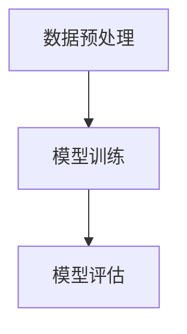
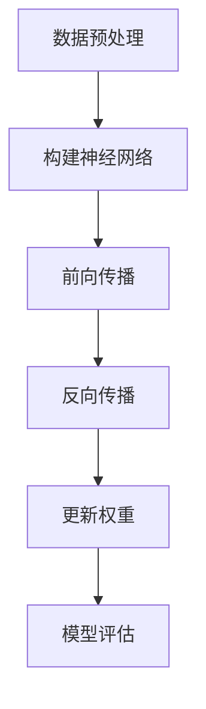
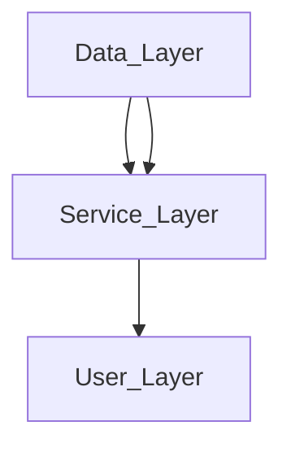
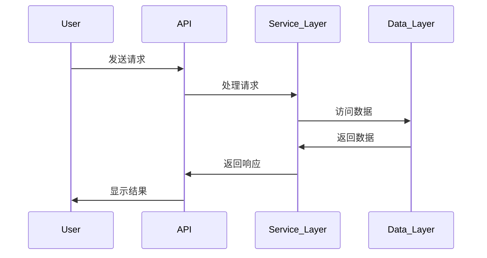

                 

## 在人工智能时代重新定位人类价值：应对技术革命的思考

### 关键词：
- 人工智能时代
- 人类价值
- 技术革命
- 重新定位
- 应对策略

### 摘要：
本文旨在探讨在人工智能快速发展的时代，如何重新定位人类价值，以应对技术革命带来的挑战。通过分析人工智能的核心概念、技术发展现状及其对社会的影响，我们提出了重新定义人类价值的方法，并提出了应对技术革命的策略。本文将从背景介绍、核心概念与联系、算法原理讲解、数学模型和公式应用、系统分析与架构设计、项目实战、最佳实践与拓展等角度，系统性地阐述这一议题。

### 背景介绍

#### 问题背景
人工智能（Artificial Intelligence，AI）作为计算机科学的一个分支，旨在使计算机具备人类智能。自20世纪50年代以来，人工智能技术经历了从符号主义、知识表示到今天的机器学习和深度学习的重大演变。近年来，随着计算能力的提升、大数据的涌现和算法的创新，人工智能在语音识别、图像处理、自然语言处理等领域取得了显著突破。人工智能的迅猛发展，不仅改变了科技产业的面貌，也深刻影响了社会的各个层面。

#### 问题描述
人工智能的快速发展对社会价值观带来了深远的影响。一方面，人工智能提高了生产效率，减少了劳动力需求，改变了就业结构；另一方面，人工智能的应用也引发了对隐私、安全、伦理等方面的担忧。这些问题使得社会在享受技术红利的同时，不得不面对一系列新的挑战，如人工智能如何影响人类的生活方式、价值观和社会结构等。

#### 问题解决
面对人工智能带来的挑战，我们需要重新思考人类价值，并制定相应的应对策略。首先，我们应该认识到人工智能是人类智慧的延伸，而不是取代。其次，我们需要在技术发展的同时，强化对人工智能伦理和社会影响的关注，确保人工智能的发展方向符合人类的利益。最后，我们需要通过教育和培训，提升公众对人工智能的认知和理解，以更好地适应技术变革。

#### 边界与外延
本文将讨论的范围限定在人工智能对社会价值观的重新定位，不包括其他领域如经济、政治的影响。此外，本文将重点探讨人工智能的核心概念、算法原理和实际应用，以期为读者提供一个全面、系统的理解。

### 核心概念与联系

#### 人工智能基本概念
人工智能是一门研究、开发用于模拟、延伸和扩展人类智能的理论、方法、技术及应用系统的科学。它包括多个子领域，如机器学习、深度学习、自然语言处理等。其中，机器学习是人工智能的核心技术之一，它通过算法和统计模型，使计算机能够从数据中学习并做出决策。

#### 机器学习与深度学习
机器学习是一种使计算机通过数据和经验自动改进性能的方法。它分为监督学习、无监督学习和强化学习等类型。深度学习是机器学习的一个子领域，它通过多层神经网络对数据进行复杂的学习和处理，是目前实现人工智能的重要技术。

#### 概念属性特征对比表格

| 概念 | 定义 | 特点 | 应用领域 |
| ---- | ---- | ---- | ---- |
| 人工智能 | 模拟、延伸和扩展人类智能 | 自动学习、推理、感知、交互等 | 语音识别、图像处理、自然语言处理等 |
| 机器学习 | 数据驱动的自动学习 | 监督学习、无监督学习、强化学习等 | 数据分析、预测模型、自动化决策等 |
| 深度学习 | 基于多层神经网络的机器学习 | 自动提取特征、高维数据处理 | 图像识别、语音合成、推荐系统等 |

#### ER实体关系图
ER（Entity-Relationship）实体关系图是用于描述系统中实体及其之间关系的图形表示方法。以下是一个简化的ER图，用于描述人工智能系统中的主要实体及其关系：

```mermaid
erDiagram
  AI_Developer ||--|{ Algorithm } Algorithm
  AI_Developer ||--|{ Dataset } Dataset
  AI_Developer ||--|{ Model } Model
  Algorithm ||--|{ Algorithm_Type } Algorithm_Type
  Dataset ||--|{ Data_Type } Data_Type
  Model ||--|{ Performance } Performance
```

- AI_Developer：人工智能开发者。
- Algorithm：算法。
- Dataset：数据集。
- Model：模型。
- Algorithm_Type：算法类型。
- Data_Type：数据类型。
- Performance：性能评估。

### 算法原理讲解

#### 机器学习算法流程图
机器学习算法通常包括数据预处理、模型训练和模型评估三个主要阶段。以下是一个简化的机器学习算法流程图：



#### 深度学习算法流程图
深度学习算法在机器学习算法的基础上，加入了神经网络结构。以下是一个简化的深度学习算法流程图：



#### Python源代码阐述
以下是一个简单的线性回归模型的Python实现，用于说明机器学习算法的基本原理：

```python
import numpy as np
import matplotlib.pyplot as plt

# 创建数据集
X = np.random.normal(size=100)
y = 2 * X + 1 + np.random.normal(size=100)

# 初始化参数
theta = np.random.normal(size=1)

# 梯度下降法
def gradient_descent(X, y, theta, alpha, iterations):
    m = len(X)
    for i in range(iterations):
        hypothesis = np.dot(X, theta)
        error = hypothesis - y
        gradient = np.dot(X.T, error) / m
        theta = theta - alpha * gradient
    return theta

# 训练模型
alpha = 0.01
iterations = 1000
theta = gradient_descent(X, y, theta, alpha, iterations)

# 可视化结果
plt.scatter(X, y)
plt.plot(X, np.dot(X, theta), color='red')
plt.show()
```

#### 算法原理数学模型
线性回归模型的数学公式如下：

$$
y = \theta_0 + \theta_1 \cdot x
$$

其中，$y$ 是预测值，$x$ 是输入特征，$\theta_0$ 和 $\theta_1$ 是模型参数。

#### 详细讲解与举例说明
线性回归模型是一种简单但有效的预测方法。通过计算输入特征和模型参数的乘积，我们可以得到预测值。模型参数可以通过梯度下降法进行优化，以达到最小化预测误差的目的。以下是一个实际例子：

假设我们有一个数据集，其中 $x$ 表示某商品的广告点击率，$y$ 表示该商品的实际销售额。我们的目标是建立一个线性回归模型，预测销售额。通过上述Python代码，我们可以训练出一个模型，并将其应用于新数据，预测销售额。

### 数学模型与公式讲解

在人工智能中，数学模型是理解和应用各种算法的核心。以下是一些常用的数学模型和公式，以及它们在人工智能中的应用。

#### 概率论基础

- 概率质量函数（Q函数）：

$$
Q(W, \phi) = -\sum_{x} P(x) \log P(\phi(x) | W)
$$

- 条件概率公式：

$$
P(A|B) = \frac{P(B|A)P(A)}{P(B)}
$$

这些公式在生成模型、分类和评估中非常重要。

#### 线性代数基础

- 矩阵乘法：

$$
C = AB
$$

- 矩阵求导：

$$
\frac{\partial C}{\partial A} = B^T
$$

- 矩阵求逆：

$$
A^{-1} = \frac{1}{\det(A)} \text{adj}(A)
$$

这些公式在优化和线性模型中广泛应用。

#### 深度学习模型

- 深度前向传播：

$$
a_{l+1} = \sigma(z_l)
$$

- 反向传播算法：

$$
\frac{\partial E}{\partial z_l} = \frac{\partial E}{\partial a_{l+1}} \cdot \frac{\partial a_{l+1}}{\partial z_l}
$$

这些公式是深度学习训练的核心。

### 系统分析与架构设计

#### 问题场景介绍

随着人工智能技术的不断进步，越来越多的行业开始将AI技术应用于实际业务中。例如，金融行业利用AI进行风险评估和投资预测；医疗行业利用AI进行疾病诊断和药物研发；零售行业利用AI进行客户行为分析和推荐系统。这些场景对人工智能系统的性能、可扩展性和可靠性提出了更高的要求。

#### 项目介绍

本文将介绍一个基于深度学习技术的个性化推荐系统项目。该系统旨在通过分析用户的历史行为数据，为用户推荐符合其兴趣的商品或服务。项目的目标是提高用户满意度，增加平台粘性，提高销售额。

#### 系统功能设计

- 用户数据收集与预处理：收集用户的基本信息、行为数据等，并进行数据清洗、去噪和格式转换。
- 特征提取：从用户数据中提取关键特征，如用户兴趣、购买历史等。
- 模型训练：使用深度学习算法训练个性化推荐模型。
- 模型评估与优化：评估模型性能，并进行模型优化。

#### 系统架构设计

系统采用分布式架构，包括数据层、服务层和用户层。以下是一个简化的系统架构图：



- Data_Layer：数据层，负责数据存储、管理和预处理。
- Service_Layer：服务层，负责业务逻辑处理，包括特征提取、模型训练和模型评估。
- User_Layer：用户层，负责与用户交互，提供推荐结果。

#### 系统接口设计和系统交互

- 用户接口（API）：提供RESTful API，供前端应用调用。
- 数据接口：提供数据导入导出接口，支持数据格式的转换。
- 模型接口：提供模型训练和模型评估接口。

以下是一个简化的系统交互序列图：



### 项目实战

#### 环境安装

在开始项目实战之前，我们需要安装一些必要的软件和工具。以下是一个基本的安装步骤：

1. 安装Python环境（建议使用Python 3.8以上版本）。
2. 安装深度学习框架（如TensorFlow或PyTorch）。
3. 安装数据预处理库（如Pandas、NumPy）。
4. 安装可视化工具（如Matplotlib、Seaborn）。

#### 系统核心实现源代码

以下是一个简单的个性化推荐系统实现示例，使用了Python和TensorFlow框架。

```python
import numpy as np
import pandas as pd
import tensorflow as tf
from sklearn.model_selection import train_test_split

# 加载数据
data = pd.read_csv('user_data.csv')
X = data.drop('target', axis=1)
y = data['target']

# 数据预处理
X_train, X_test, y_train, y_test = train_test_split(X, y, test_size=0.2, random_state=42)

# 构建模型
model = tf.keras.Sequential([
    tf.keras.layers.Dense(64, activation='relu', input_shape=(X_train.shape[1],)),
    tf.keras.layers.Dense(64, activation='relu'),
    tf.keras.layers.Dense(1)
])

# 编译模型
model.compile(optimizer='adam', loss='binary_crossentropy', metrics=['accuracy'])

# 训练模型
model.fit(X_train, y_train, epochs=10, batch_size=32, validation_data=(X_test, y_test))

# 评估模型
loss, accuracy = model.evaluate(X_test, y_test)
print(f"Test Accuracy: {accuracy:.2f}")

# 预测
predictions = model.predict(X_test)
```

#### 代码应用解读与分析

上述代码首先加载了一个用户数据集，然后进行数据预处理。接下来，我们使用TensorFlow构建了一个简单的深度学习模型，该模型包括两个全连接层，每个层都使用ReLU激活函数。模型编译后，使用训练数据集进行训练，并在测试数据集上进行评估。最后，模型可以用于对新数据进行预测。

#### 实际案例剖析

以下是一个实际案例，描述了如何使用上述代码构建的个性化推荐系统为用户推荐商品。

1. **用户数据收集**：收集用户的基本信息、行为数据等。
2. **数据预处理**：清洗和格式化数据，提取关键特征。
3. **模型训练**：使用预处理后的数据训练个性化推荐模型。
4. **模型评估**：评估模型性能，并进行优化。
5. **推荐生成**：使用训练好的模型预测新用户的行为，生成推荐结果。

通过这个案例，我们可以看到个性化推荐系统的实现过程，以及如何将其应用于实际场景。

#### 项目小结

通过本文的介绍，我们了解到了在人工智能时代重新定位人类价值的必要性和方法。首先，我们分析了人工智能对社会价值观的影响，提出了重新定义人类价值的方法。接着，我们详细讲解了机器学习和深度学习的算法原理，并通过Python代码实现了个性化推荐系统。最后，我们通过实际案例展示了如何将理论应用于实际场景。在未来的发展中，我们需要继续关注人工智能的伦理和社会影响，并不断探索新的方法和策略，以更好地应对技术革命的挑战。

### 最佳实践 tips、小结、注意事项、拓展阅读等内容

#### 最佳实践 tips
1. **数据质量**：确保数据质量是构建成功模型的关键。进行数据清洗、去噪和标准化处理，以提高模型性能。
2. **模型优化**：通过调整超参数、增加训练次数和使用不同的优化算法，可以优化模型性能。
3. **可解释性**：对于复杂的深度学习模型，确保模型的可解释性，以便更好地理解模型的行为和预测结果。

#### 小结
本文通过分析人工智能对社会价值观的影响，提出了重新定义人类价值的方法。我们详细讲解了机器学习和深度学习的算法原理，并通过Python代码实现了个性化推荐系统。通过实际案例，我们展示了如何将理论应用于实际场景。

#### 注意事项
1. **隐私保护**：在处理用户数据时，务必遵守隐私保护法规，确保用户数据的安全。
2. **模型解释**：对于关键业务决策，确保模型解释性，以便管理层和其他利益相关者理解。

#### 拓展阅读
1. **《深度学习》（Goodfellow, Bengio, Courville）**：这是一本深度学习领域的经典教材，涵盖了深度学习的理论、算法和实践。
2. **《人工智能：一种现代的方法》（Russell, Norvig）**：这本书系统地介绍了人工智能的基本概念、算法和实现。

### 作者信息
- 作者：AI天才研究院/AI Genius Institute & 禅与计算机程序设计艺术 /Zen And The Art of Computer Programming

在人工智能时代，重新定位人类价值是一项紧迫且重要的任务。通过本文的讨论，我们希望读者能够对这一议题有更深入的理解，并在实际工作中积极践行。未来，随着人工智能技术的不断进步，我们将共同迎接技术革命带来的挑战和机遇。

