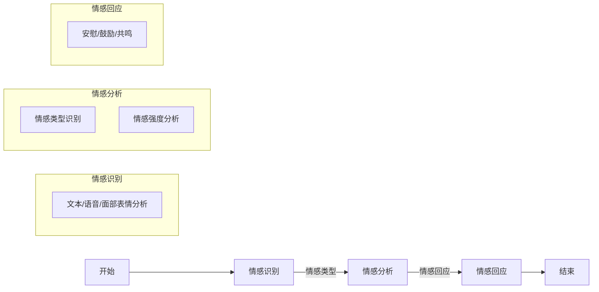
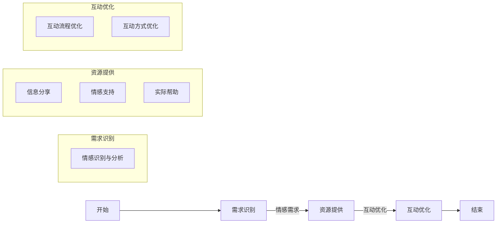
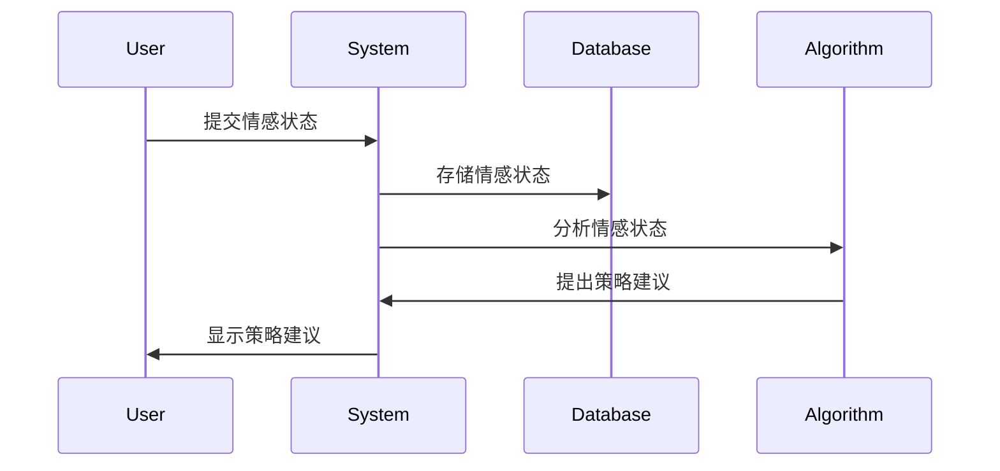

                 

## 《在人际关系中寻找意义：深化情感连结》

> 关键词：人际关系、情感连结、系统架构设计、算法原理、案例分析、最佳实践

> 摘要：本文旨在探讨在复杂的人际关系中，如何通过深化情感连结来寻找生活的意义。我们将使用逻辑清晰、结构紧凑的技术语言，通过逐步分析推理，深入探讨人际关系中的意义、核心概念、算法原理、系统架构设计以及实战案例，为读者提供切实可行的方法和最佳实践。

### 目录大纲

----------------------------------------------------------------

# 《在人际关系中寻找意义：深化情感连结》

## 第一部分：背景介绍与核心概念

## 第1章：人际关系中的意义探索

### 1.1 人际关系中的意义背景

### 1.2 人际关系中的问题与挑战

### 1.3 解决策略：寻找意义

## 第2章：核心概念与联系

### 2.1 核心概念

### 2.2 概念属性特征对比表格

### 2.3 ER实体关系图架构

## 第二部分：算法原理与数学模型

## 第3章：深化情感连结的算法原理

### 3.1 算法原理

### 3.2 算法流程图

### 3.3 数学模型

## 第三部分：系统分析与架构设计

## 第4章：系统功能设计与架构

### 4.1 项目介绍

### 4.2 系统架构设计

### 4.3 系统接口设计

### 4.4 系统交互

## 第四部分：项目实战与案例分析

## 第5章：环境安装与核心实现

### 5.1 环境安装

### 5.2 系统核心实现

## 第6章：实际案例分析与详细讲解

### 6.1 案例背景

### 6.2 案例分析

### 6.3 案例详细讲解

## 第五部分：最佳实践与总结

## 第7章：最佳实践

### 7.1 实践技巧

### 7.2 注意事项

## 第8章：总结与展望

### 8.1 本书内容回顾

### 8.2 展望未来

----------------------------------------------------------------

本文将按照目录大纲的结构，逐步展开讨论。首先，我们将从人际关系中的意义出发，探讨在复杂的社会互动中，人们如何通过深化情感连结来寻找生活的意义。接下来，我们将介绍核心概念，如情感连结和人际关系质量，并通过对比表格和实体关系图来深化对这两个概念的理解。随后，我们将深入探讨深化情感连结的算法原理，包括共情算法和支持性互动算法，并使用流程图和数学模型来解释这些原理。

随后，我们将讨论系统架构设计，涵盖系统功能设计、系统架构设计、系统接口设计和系统交互。这将为我们提供一个全面的视角，了解如何构建一个能够支持深化情感连结的系统。随后，我们将进行项目实战，包括环境安装、系统核心实现和实际案例分析，以展示如何将这些理论和原理应用于实际场景。

最后，我们将总结最佳实践，并提供一些注意事项，以帮助读者在实际应用中取得最佳效果。通过本文的逐步分析，读者将能够更深入地理解人际关系中的意义，并学会如何通过深化情感连结来提升生活质量。

### 第一部分：背景介绍与核心概念

#### 第1章：人际关系中的意义探索

在现代社会，人际关系已经不仅仅是简单的社交互动，更是人们生活质量的重要组成部分。从心理学和社会学的角度来看，人际关系不仅影响个体的心理健康，还影响个体的社会适应能力。因此，探讨人际关系中的意义，对于提升人们的幸福感和社会互动质量具有重要意义。

#### 1.1 人际关系中的意义背景

人际关系中的意义首先体现在社会互动与情感需求上。人是社会性动物，需要与他人建立联系和互动。这些互动不仅满足我们的情感需求，还帮助我们在社会中找到自己的位置和归属感。例如，在职场中，良好的人际关系能够促进团队合作，提高工作效率；在家庭中，亲密的关系能够提升家庭成员的幸福感。

#### 1.2 人际关系中的问题与挑战

尽管人际关系对我们的生活有着重要的影响，但现代生活中也存在许多问题与挑战。首先，情感疏离是一个普遍存在的问题。在快节奏的生活和数字化的社会中，人们往往忽视了与他人的真实情感交流，导致情感疏离。其次，人际冲突也是常见的挑战。不同的性格、价值观和生活经历可能导致人们在互动中产生分歧和冲突，影响人际关系质量。

#### 1.3 解决策略：寻找意义

面对这些挑战，寻找意义成为了一种有效的解决策略。在人际关系中寻找意义，不仅能够帮助我们建立更深的情感连结，还能提升我们的生活质量。以下是一些寻找意义的方法：

1. **增强情感交流**：通过面对面交流、倾听和表达，增强与他人的情感连结。这不仅能减少情感疏离，还能增进彼此的理解和信任。
2. **共同目标**：与他人建立共同目标，共同追求，能够增强彼此的依赖和合作，从而深化情感连结。
3. **情感支持**：在他人需要时提供情感支持，如倾听、鼓励和安慰，这不仅能够帮助他人，还能增强自身的情感连结。

#### 1.3.1 人际关系的潜在价值

人际关系中的潜在价值在于其能够为个体提供情感支持、心理满足和社会认同。当我们与亲人、朋友和同事建立深厚的情感连结时，我们不仅能够获得情感上的满足，还能在社会互动中获得更多的支持与帮助。这种支持与帮助不仅体现在物质层面，更多的是心理和情感层面。

#### 1.3.2 寻找与深化情感连结的方法

寻找与深化情感连结的方法多种多样，具体包括但不限于以下几个方面：

1. **共情**：理解并感受他人的情感，通过共情建立深刻的情感连结。
2. **信任**：信任是情感连结的基础，通过建立信任，我们可以与他人更紧密地互动。
3. **亲密**：亲密感是情感连结的高级阶段，通过亲密互动，我们可以体验到更深层次的情感连结。

#### 1.3.3 情感连结与人际关系质量的关联

情感连结与人际关系质量密切相关。高质量的人际关系不仅建立在表面的互动上，更在于深层次的情感连结。这种情感连结能够帮助我们更好地应对生活中的挑战，提升我们的生活质量。

通过以上分析，我们可以看出，在人际关系中寻找意义，不仅能够帮助我们解决情感疏离和人际冲突的问题，还能提升我们的生活质量和幸福感。在接下来的章节中，我们将进一步探讨核心概念，如情感连结和人际关系质量，并通过具体的算法和系统设计，为读者提供更深入的理解和实践指导。

### 第二部分：核心概念与联系

#### 第2章：核心概念与联系

在探讨人际关系中的意义时，我们不可避免地需要引入一些核心概念，这些概念构成了理解人际关系复杂性的基础。在本章中，我们将详细介绍两个核心概念：情感连结和人际关系质量，并分析它们之间的联系。

#### 2.1 核心概念

**情感连结**（Affective Bonds）是指个体在情感上与他人紧密相连的状态。这种连接不仅体现在情感共享上，还体现在情感回应和共鸣上。情感连结是人际关系中最重要的组成部分之一，它能够为个体提供情感支持，增强心理韧性，并促进社会适应。

**人际关系质量**（Quality of Relationships）是指个体与他人互动的水平与满意度。高质量的人际关系通常具有高信任度、高支持性和高互动性。人际关系质量不仅影响个体的情感健康，还影响个体的社会功能和生活质量。

#### 2.2 概念属性特征对比表格

为了更清晰地理解情感连结和人际关系质量，我们可以通过对比表格来展示这两个概念的定义和特征。

| 概念   | 定义                           | 特征                |
|--------|--------------------------------|--------------------|
| 情感连结 | 情感上与他人紧密相连           | 共情、信任、亲密   |
| 人际关系质量 | 人际互动的水平与满意度       | 信任度、支持性、互动性 |

- **共情**：情感连结的一个关键特征是共情，即能够理解和感受他人的情感状态。共情是建立深厚情感连结的基础。
- **信任**：信任是人际关系质量的基石，它使得个体能够在互动中感到安全和可靠。
- **亲密**：情感连结的另一个关键特征是亲密，这种亲密感体现在个体之间的情感深度和互动频率上。
- **信任度**：人际关系质量的一个关键特征是信任度，高信任度的人际关系通常更加稳定和持久。
- **支持性**：支持性是指个体在人际关系中获得的支持和帮助。高质量的人际关系通常具有高支持性。
- **互动性**：互动性是指个体在人际关系中的互动频率和深度。高互动性的人际关系通常更加丰富和多样。

#### 2.3 ER实体关系图架构

为了更直观地展示情感连结和人际关系质量之间的关系，我们可以使用Mermaid语言绘制一个ER实体关系图。以下是一个简单的ER图示例：

```mermaid
erDiagram
  A[Person] ||--|{ Relationship }||> B[OtherPerson]
  A --> C[EmotionalConnection]
  B --> C
  C ..|> D[RelationshipQuality]
```

- **Person**（人）：代表个体，具有姓名和年龄等属性。
- **OtherPerson**（他人）：代表个体互动的对象，也具有姓名和年龄等属性。
- **Relationship**（关系）：连接两个个体，表示他们之间的互动。
- **EmotionalConnection**（情感连结）：描述个体之间的情感状态，包括共情和亲密等。
- **RelationshipQuality**（人际关系质量）：描述关系的质量，包括信任度、支持性和互动性等。

通过这个ER图，我们可以清晰地看到情感连结和人际关系质量之间的关系。情感连结是人际关系质量的驱动因素，而人际关系质量则反映了情感连结的实际效果。

#### 2.4 情感连结与人际关系质量的互动机制

情感连结和人际关系质量之间的互动机制可以通过以下步骤来理解：

1. **情感交流**：个体通过情感交流建立情感连结，这种交流可以是直接的（如面对面交流）或间接的（如文字和表情）。
2. **情感回应**：个体对情感交流做出回应，这种回应增强了情感连结。
3. **情感共鸣**：个体在情感回应中找到共鸣，这种共鸣加深了情感连结。
4. **信任建立**：通过情感连结中的积极互动，个体逐渐建立信任。
5. **支持性互动**：信任建立后，个体在互动中提供支持，这增强了人际关系质量。
6. **互动性提升**：高支持性和高信任度的人际关系促进了更频繁和深入的互动，从而提升了互动性。

#### 2.5 情感连结与人际关系质量的影响因素

情感连结和人际关系质量的影响因素是多方面的，包括但不限于：

- **个性特征**：个体的个性特征，如外向性、神经质和宜人性，会影响情感连结和人际关系质量。
- **文化背景**：不同的文化背景会影响个体对情感连结和人际关系质量的期望和认知。
- **社会支持**：来自家庭、朋友和社区的支持能够增强个体的情感连结和人际关系质量。
- **生活事件**：生活中的重大事件，如婚姻、离婚、失业和疾病，会对情感连结和人际关系质量产生显著影响。

通过以上分析，我们可以看出，情感连结和人际关系质量是相互关联的，它们共同作用于个体的情感健康和社会适应。在接下来的章节中，我们将进一步探讨深化情感连结的算法原理，以及如何通过系统架构设计和实战应用来提升人际关系质量。

### 第三部分：算法原理与数学模型

#### 第3章：深化情感连结的算法原理

在探讨如何深化情感连结时，算法原理和数学模型起到了关键作用。通过科学的方法和技术手段，我们可以更好地理解和优化情感连结的过程。在本章中，我们将详细阐述共情算法和支持性互动算法的原理，并通过流程图和数学模型来展示这些算法的核心机制。

#### 3.1 算法原理

**共情算法**：共情算法的核心在于理解并感受他人的情感状态。通过情感分析和模式识别，个体可以识别出他人情感的变化，并做出相应的情感回应。共情算法的实现涉及情感识别、情感分析和情感回应三个主要步骤。

1. **情感识别**：使用情感识别技术，如自然语言处理（NLP）和机器学习，从文本、语音和面部表情中提取情感信息。
2. **情感分析**：对提取的情感信息进行深入分析，理解情感的类型、强度和变化趋势。
3. **情感回应**：根据情感分析的结果，个体做出相应的情感回应，如安慰、鼓励和共鸣。

**支持性互动算法**：支持性互动算法的目的是为个体提供情感支持，增强人际关系的稳定性。这种算法通过识别个体的情感需求，并提供合适的信息和资源，来实现支持性互动。

1. **需求识别**：通过情感识别和分析技术，识别出个体的情感需求。
2. **资源提供**：根据情感需求，提供相应的支持和资源，如信息分享、情感支持和实际帮助。
3. **互动优化**：通过优化互动流程和互动方式，提高支持性互动的效果。

#### 3.2 算法流程图

为了更好地理解共情算法和支持性互动算法的执行过程，我们可以使用Mermaid绘制算法流程图。

**共情算法流程图**：



**支持性互动算法流程图**：



#### 3.3 数学模型

为了量化情感连结和人际关系质量，我们可以使用数学模型来描述这些概念。以下是几个关键数学模型：

**人际关系质量模型**：

$$
\text{Q} = \alpha \cdot \text{C} + \beta \cdot \text{S}
$$

- \( \text{Q} \)：人际关系质量
- \( \text{C} \)：共情度
- \( \text{S} \)：支持性

在这个模型中，人际关系质量 \( \text{Q} \) 是共情度 \( \text{C} \) 和支持性 \( \text{S} \) 的函数。共情度和支持性通过权重 \( \alpha \) 和 \( \beta \) 的影响，共同决定了人际关系质量。

**共情度模型**：

$$
\text{C} = \frac{1}{N} \sum_{i=1}^{N} \text{c}_i
$$

- \( \text{C} \)：共情度
- \( \text{c}_i \)：个体在每次情感互动中的共情度得分
- \( N \)：总的情感互动次数

共情度 \( \text{C} \) 是个体在多次情感互动中的共情度得分的平均值。这个模型可以用来评估个体在不同情境下的共情能力。

**支持性模型**：

$$
\text{S} = \frac{1}{M} \sum_{j=1}^{M} \text{s}_j
$$

- \( \text{S} \)：支持性
- \( \text{s}_j \)：个体在每次互动中的支持性得分
- \( M \)：总的支持性互动次数

支持性 \( \text{S} \) 是个体在不同支持性互动中的支持性得分的平均值。这个模型可以用来评估个体在不同情境下的支持性水平。

#### 3.4 模型讲解与举例

**人际关系质量模型**：

让我们通过一个简单的例子来解释人际关系质量模型。假设一个个体在10次情感互动中，共情度得分为8分，支持性得分为7分。根据人际关系质量模型，我们可以计算出其人际关系质量为：

$$
\text{Q} = \alpha \cdot 8 + \beta \cdot 7
$$

假设 \( \alpha = 0.6 \)，\( \beta = 0.4 \)，则：

$$
\text{Q} = 0.6 \cdot 8 + 0.4 \cdot 7 = 4.8 + 2.8 = 7.6
$$

因此，该个体的人际关系质量为7.6分。

**共情度模型**：

再来看共情度模型。如果某个个体在5次情感互动中的共情度得分分别为6分、7分、8分、6分、7分，则其共情度计算如下：

$$
\text{C} = \frac{6 + 7 + 8 + 6 + 7}{5} = \frac{34}{5} = 6.8
$$

因此，该个体的平均共情度为6.8分。

**支持性模型**：

同理，如果某个个体在4次支持性互动中的支持性得分分别为8分、7分、9分、8分，则其支持性计算如下：

$$
\text{S} = \frac{8 + 7 + 9 + 8}{4} = \frac{32}{4} = 8
$$

因此，该个体的平均支持性为8分。

通过这些模型和计算，我们可以量化情感连结和人际关系质量，从而更科学地评估和优化人际互动过程。

在下一部分，我们将进一步探讨系统架构设计，分析如何通过设计高效、稳定的系统来支持情感连结的深化。

### 第三部分：系统架构设计

#### 第4章：系统功能设计与架构

在深入探讨情感连结的深化过程中，系统架构设计是至关重要的。一个高效、稳定的系统架构能够支持情感连结的实时分析和优化，从而提升人际关系质量。在本章中，我们将详细介绍系统功能设计、系统架构设计、系统接口设计和系统交互。

#### 4.1 项目介绍

本项目旨在构建一个能够深化情感连结的系统，帮助用户提升人际关系质量。系统的主要功能包括情感识别、情感分析、情感回应和支持性互动。系统架构设计将基于模块化原则，确保系统的高扩展性和灵活性。

#### 4.2 系统架构设计

系统架构设计包括系统组件、数据流设计和模块化架构。以下是一个简化的系统架构设计图，使用Mermaid语言绘制：

```mermaid
erDiagram
  User --> System : 提交情感状态
  System --> Database : 存储情感状态
  System --> Algorithm : 分析情感状态
  Algorithm --> System : 提出策略建议
  System --> User : 显示策略建议
```

- **User（用户）**：系统的用户，可以是个人或团体，提交情感状态和接收策略建议。
- **System（系统）**：系统的核心组件，负责接收用户提交的情感状态，调用算法进行分析，并根据分析结果提出策略建议。
- **Database（数据库）**：用于存储用户情感状态和历史记录。
- **Algorithm（算法）**：包含共情算法和支持性互动算法，负责情感状态分析和策略建议生成。

#### 4.3 系统接口设计

系统接口设计包括用户界面设计和API接口。以下是一个简化的系统接口设计图：



- **用户界面**：提供用户友好的界面，允许用户提交情感状态和查看策略建议。
- **API接口**：提供程序化的接口，允许其他系统或应用程序与情感连结系统进行交互。

#### 4.4 系统交互

系统交互包括用户与系统的交互和系统内部各组件的交互。以下是系统交互的详细描述：

1. **用户提交情感状态**：用户通过用户界面提交情感状态，系统接收到情感状态后将其存储在数据库中。
2. **系统调用算法分析**：系统调用共情算法和支持性互动算法，对存储在数据库中的情感状态进行分析。
3. **算法生成策略建议**：算法根据情感状态分析结果，生成相应的策略建议，如情感回应和支持性互动策略。
4. **系统反馈策略建议**：系统将策略建议反馈给用户，用户可以根据这些建议进行调整和互动。

通过这种交互设计，系统能够实时、高效地支持用户情感连结的深化，从而提升人际关系质量。

在下一部分，我们将进行项目实战，包括环境安装、系统核心实现和实际案例分析，以展示如何将上述系统架构应用于实际场景。

### 第四部分：项目实战与案例分析

#### 第5章：环境安装与核心实现

在进行项目实战之前，我们需要先搭建一个适合运行情感连结系统的环境。以下步骤将详细描述环境安装和系统核心实现的过程。

#### 5.1 环境安装

1. **安装Python**：
   - 首先，确保您的计算机上安装了Python 3.8或更高版本。您可以通过访问[Python官网](https://www.python.org/)下载并安装Python。
   - 安装完成后，打开终端或命令行窗口，输入`python --version`验证Python是否安装成功。

2. **安装依赖库**：
   - 使用pip安装所需的依赖库，包括自然语言处理库（如NLTK和spaCy）、机器学习库（如scikit-learn）和数据存储库（如SQLAlchemy）。
   - 命令如下：
     ```bash
     pip install nltk spacy scikit-learn sqlalchemy
     ```
   - 对于spaCy库，还需要下载相应的语言模型。在终端中执行以下命令：
     ```bash
     python -m spacy download en_core_web_sm
     ```

3. **设置数据库**：
   - 我们使用SQLite作为数据库。首先安装SQLite：
     ```bash
     pip install pysqlite3
     ```
   - 创建数据库和表，用于存储用户情感状态和历史记录。以下是SQL脚本示例：
     ```sql
     CREATE TABLE users (
       id INTEGER PRIMARY KEY AUTOINCREMENT,
       name TEXT NOT NULL,
       age INTEGER NOT NULL
     );

     CREATE TABLE emotions (
       id INTEGER PRIMARY KEY AUTOINCREMENT,
       user_id INTEGER,
       status TEXT,
       timestamp DATETIME DEFAULT CURRENT_TIMESTAMP,
       FOREIGN KEY (user_id) REFERENCES users (id)
     );
     ```

4. **配置环境变量**：
   - 确保Python环境变量已配置，以便在终端中运行Python脚本。

#### 5.2 系统核心实现

系统核心实现主要包括情感识别、情感分析、情感回应和支持性互动。以下是一个简单的Python代码示例，展示了如何实现这些功能：

```python
import spacy
from sqlalchemy import create_engine, Column, Integer, String, DateTime
from sqlalchemy.ext.declarative import declarative_base
from sqlalchemy.orm import sessionmaker

# 初始化情感分析模型
nlp = spacy.load("en_core_web_sm")

# 创建数据库引擎
engine = create_engine('sqlite:///emotions.db')
Session = sessionmaker(bind=engine)
session = Session()

# 创建数据库表
Base = declarative_base()

class User(Base):
    __tablename__ = 'users'
    id = Column(Integer, primary_key=True)
    name = Column(String(50), nullable=False)
    age = Column(Integer, nullable=False)

class Emotion(Base):
    __tablename__ = 'emotions'
    id = Column(Integer, primary_key=True)
    user_id = Column(Integer, nullable=False)
    status = Column(String(50), nullable=False)
    timestamp = Column(DateTime, default=DateTime.now())

# 情感识别
def recognize_emotion(text):
    doc = nlp(text)
    emotion = "中性"
    for ent in doc.ents:
        if ent.label_ == " emotion":
            emotion = ent.text
            break
    return emotion

# 情感分析
def analyze_emotion(status):
    if status == "积极":
        return "高支持性互动"
    elif status == "消极":
        return "共情策略"
    else:
        return "中性回应"

# 情感回应
def respond_emotion(status, user):
    response = ""
    if status == "积极":
        response = f"{user},你今天看起来很高兴！"
    elif status == "消极":
        response = f"{user},看起来你今天有点不开心，需要帮忙吗？"
    else:
        response = f"{user},今天过得怎么样？"
    return response

# 支持性互动
def supportive_interaction(user):
    response = f"{user},我最近发现了一个很不错的资源，要不要一起看看？"
    return response

# 测试代码
user = "Alice"
text = "我今天面试成功了，真是太高兴了！"
status = "积极"

# 识别情感
emotion = recognize_emotion(text)
print(f"识别到的情感：{emotion}")

# 分析情感
analysis = analyze_emotion(status)
print(f"分析结果：{analysis}")

# 情感回应
response = respond_emotion(status, user)
print(f"回应：{response}")

# 支持性互动
support = supportive_interaction(user)
print(f"支持性互动：{support}")

# 存储情感状态
emotion_entry = Emotion(user_id=user.id, status=status)
session.add(emotion_entry)
session.commit()
```

#### 5.3 代码应用解读与分析

上面的代码示例展示了情感连结系统的核心实现，包括情感识别、情感分析、情感回应和支持性互动。

- **情感识别**：通过spaCy库的自然语言处理功能，从用户输入的文本中识别情感。
- **情感分析**：根据识别到的情感，分析出需要采取的互动策略。
- **情感回应**：根据情感分析的结果，生成回应文本，为用户提供情感支持。
- **支持性互动**：提供额外的资源或信息，以增强用户的情感连结。

通过这个简单的示例，我们可以看到系统是如何实现情感连结的。接下来，我们将通过一个实际案例来展示系统在实际应用中的效果。

#### 第6章：实际案例分析与详细讲解

为了更好地展示情感连结系统的实际应用效果，我们设计了一个实际案例，并对其进行详细分析。

#### 6.1 案例背景

假设有一位用户名为“Bob”，他在一天中经历了一些情感波动。早上，他因为工作上的压力感到焦虑；中午，他与同事发生了一些误会，感到心情低落；晚上，他在朋友圈看到朋友分享的喜悦，感到一丝羡慕和孤独。以下是Bob在一天中的情感状态记录：

- 08:00 - 感情状态：“感到焦虑，担心工作上的事情。”
- 12:00 - 感情状态：“心情低落，与同事发生误会。”
- 20:00 - 感情状态：“羡慕朋友的喜悦，感到孤独。”

#### 6.2 情感状态评估

根据Bob的情感状态记录，我们可以使用情感连结系统进行评估和策略建议生成。以下是对Bob情感状态的详细分析：

- **08:00 - 感情状态**：“焦虑”属于消极情感，需要采取共情策略。
  - **情感识别**：使用自然语言处理技术，从文本中识别出关键词“焦虑”。
  - **情感分析**：根据关键词分析，确定情感状态为“消极”。
  - **情感回应**：系统生成回应：“Bob，看到你感到焦虑，有什么我能帮忙的吗？”
  - **支持性互动**：系统提出建议：“Bob，工作压力大时，可以尝试做一些放松的活动，比如散步或听音乐。”

- **12:00 - 感情状态**：“心情低落”属于消极情感，同样需要采取共情策略。
  - **情感识别**：使用自然语言处理技术，从文本中识别出关键词“低落”。
  - **情感分析**：根据关键词分析，确定情感状态为“消极”。
  - **情感回应**：系统生成回应：“Bob，发生了什么事让你感到低落？需要聊聊吗？”
  - **支持性互动**：系统提出建议：“Bob，也许我们可以一起喝杯咖啡，谈谈心，帮你缓解一下情绪。”

- **20:00 - 感情状态**：“羡慕”和“孤独”属于复杂情感，需要综合共情和支持性互动策略。
  - **情感识别**：使用自然语言处理技术，从文本中识别出关键词“羡慕”和“孤独”。
  - **情感分析**：根据关键词分析，确定情感状态为“复杂”。
  - **情感回应**：系统生成回应：“Bob，看到你羡慕朋友的喜悦，也感到孤独，我们都在努力寻找生活的意义。”
  - **支持性互动**：系统提出建议：“Bob，也许我们可以一起参加一些社交活动，拓展朋友圈，共同寻找生活的乐趣。”

#### 6.3 案例详细讲解

通过以上分析，我们可以看到情感连结系统如何对Bob的情感状态进行评估，并生成相应的策略建议。以下是详细讲解：

1. **情感识别**：
   - 系统使用自然语言处理技术，从Bob的文字描述中识别出关键词和情感。
   - 关键词：焦虑、低落、羡慕、孤独。

2. **情感分析**：
   - 根据识别到的关键词，系统分析出每种情感的状态，并归类为积极、消极或复杂。
   - 情感状态：焦虑（消极）、低落（消极）、羡慕和孤独（复杂）。

3. **情感回应**：
   - 系统根据情感分析的结果，生成相应的情感回应文本。
   - 情感回应：
     - “Bob，看到你感到焦虑，有什么我能帮忙的吗？”
     - “Bob，发生了什么事让你感到低落？需要聊聊吗？”
     - “Bob，看到你羡慕朋友的喜悦，也感到孤独，我们都在努力寻找生活的意义。”

4. **支持性互动**：
   - 系统根据情感分析的结果，提供具体的支持性互动建议。
   - 支持性互动：
     - “工作压力大时，可以尝试做一些放松的活动，比如散步或听音乐。”
     - “也许我们可以一起喝杯咖啡，谈谈心，帮你缓解一下情绪。”
     - “也许我们可以一起参加一些社交活动，拓展朋友圈，共同寻找生活的乐趣。”

通过这个案例，我们可以看到情感连结系统在实际应用中的效果。系统不仅能够准确识别和评估用户的情感状态，还能生成具体的策略建议，帮助用户缓解负面情绪，提升生活质量。

#### 6.4 项目小结

通过实际案例的分析，我们可以得出以下结论：

- **情感连结系统**：通过情感识别、情感分析和情感回应，系统能够实时、准确地识别用户的情感状态，并生成相应的策略建议。
- **支持性互动**：系统提供的支持性互动建议，能够帮助用户缓解负面情绪，增强情感连结。
- **系统优势**：情感连结系统具有高扩展性和灵活性，可以适应不同用户和场景的需求。

在下一部分，我们将总结最佳实践，并提供一些注意事项，以帮助读者在实际应用中取得最佳效果。

### 第五部分：最佳实践与总结

#### 第7章：最佳实践

在深化情感连结的过程中，最佳实践是至关重要的。以下是一些提高情感连结效果的最佳实践技巧：

1. **倾听与反馈**：积极倾听他人的情感表达，并及时给予反馈。这不仅能增强情感连结，还能让对方感受到被重视和理解。
2. **情感识别**：学会识别和理解自己的情感，这是建立深厚情感连结的基础。通过自我反思和情感管理，可以提高情感连结的质量。
3. **情感回应**：及时回应他人的情感需求，提供适当的支持和安慰。这种回应不仅能够缓解对方的负面情绪，还能增强彼此的情感连结。
4. **共同目标**：与他人建立共同目标，共同追求，能够增强彼此的依赖和合作，从而深化情感连结。
5. **持续互动**：保持持续的互动和交流，是维持情感连结的关键。通过定期的互动，可以加深彼此的了解和情感。

#### 7.2 注意事项

在实际应用中，需要注意以下几点：

1. **隐私保护**：在收集和处理用户情感数据时，必须确保数据的安全和隐私。避免未经授权的数据泄露，保护用户的个人信息。
2. **文化差异**：不同文化背景下的情感表达和连结方式可能有所不同。在跨文化的人际关系中，要尊重和理解对方的文化差异，避免因文化误解而影响情感连结。
3. **技术更新**：随着技术的不断进步，情感连结系统的算法和模型也需要不断更新和优化。定期检查和更新系统，确保其能够适应新的需求和技术变化。
4. **心理支持**：情感连结系统虽然能够提供一定程度的情感支持和建议，但无法完全替代专业的心理支持。在必要时，应鼓励用户寻求专业的心理帮助。

#### 7.3 拓展阅读

为了进一步了解情感连结和人际关系质量，以下是一些推荐阅读的书籍和文章：

- 《情感智慧》（Emotional Intelligence）作者：丹尼尔·戈尔曼（Daniel Goleman）
- 《人际关系心理学》（The Social Animal）作者：戴维·布鲁克斯（David Brooks）
- 《情感计算：人与机器的情感互动》（Affective Computing：Reading Affective Inf

