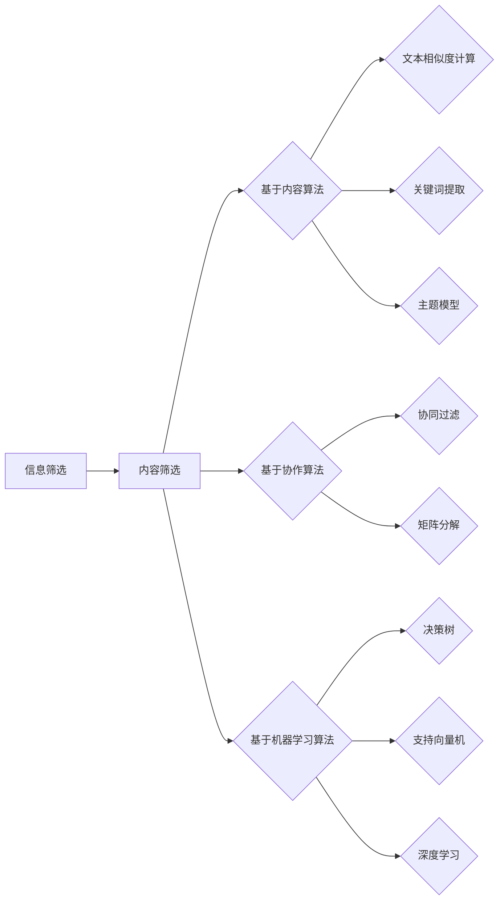
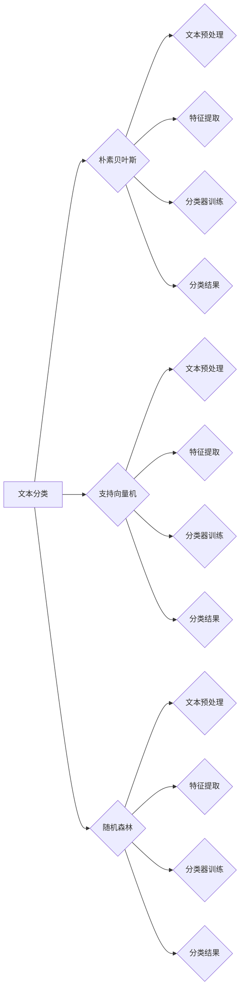
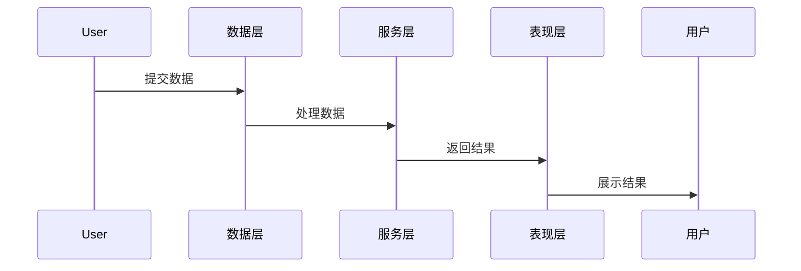
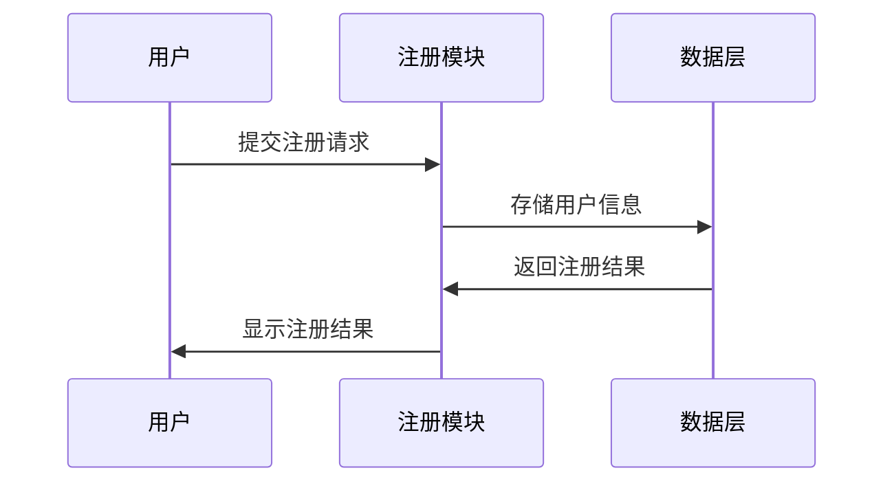
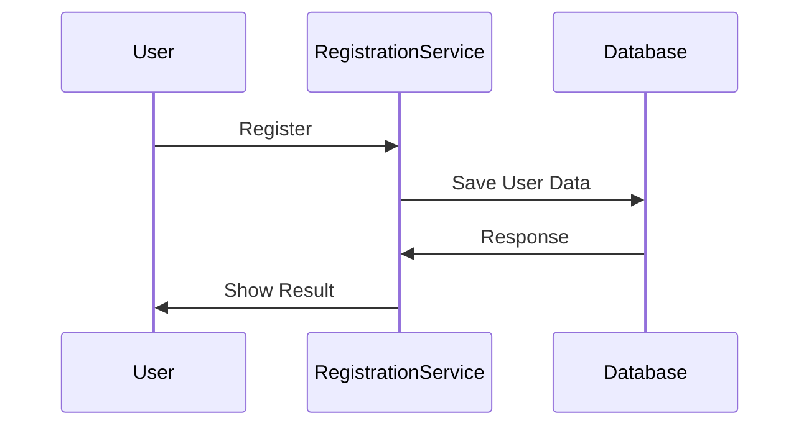

                 

### 在信息泛滥时代培养智慧：提升信息筛选和理解能力

> **关键词**：信息筛选，信息理解，智慧培养，算法原理，系统设计，最佳实践

> **摘要**：随着信息技术的迅猛发展，信息爆炸成为现代社会的一大挑战。面对海量的信息，如何培养智慧、提升信息筛选和理解能力成为亟待解决的问题。本文将从问题背景、核心概念、算法原理、系统设计与实战案例等多个角度，系统地探讨在信息泛滥时代如何提升信息筛选和理解能力，以培养智慧，助力个人和社会的发展。

## **第一部分：问题背景与核心概念**

### **第1章：信息泛滥时代的问题与挑战**

#### **1.1 信息爆炸带来的挑战**

信息爆炸时代，互联网的普及和智能手机的广泛使用使得信息传播速度极快，每天产生的数据量以惊人的速度增长。根据国际数据公司（IDC）的报告，2018年全球产生的数据总量已达到33zb（1zb=1万亿亿字节），预计到2025年将增长到175zb。如此海量的信息带来了诸多挑战。

**决策困难**：信息过载导致人们难以从海量信息中筛选出有用的信息，使得决策变得更加困难。

**时间浪费**：大量无意义或冗余的信息浪费了人们的宝贵时间，降低了工作效率。

**信息焦虑**：在信息爆炸的环境下，人们容易感到焦虑和压力，担心错过重要的信息。

#### **1.2 信息筛选的困境**

**信息真伪难辨**：在互联网上，信息真伪难辨，虚假信息、谣言和诈骗层出不穷，给人们带来困扰。

**信息冗余**：大量重复的信息使得人们难以找到真正需要的信息。

**个性化推荐陷阱**：个性化推荐系统虽然能提供个性化的信息，但也可能使人陷入信息茧房，限制信息的多样性。

#### **1.3 提升信息理解能力的必要性**

提升信息理解能力有助于人们更有效地筛选信息，减少决策困难，提高工作效率。具体来说，提升信息理解能力有以下几个方面的必要性：

**批判性思维**：通过批判性思维，人们能够对信息进行深入分析，判断信息的真伪和价值。

**证据分析**：在信息筛选过程中，证据分析是关键。人们需要根据可靠的证据来评估信息的真实性。

**跨学科学习**：跨学科学习有助于人们从不同角度理解信息，提高综合分析问题的能力。

### **第2章：核心概念与联系**

#### **2.1 信息筛选的基本原理**

信息筛选是指从大量信息中挑选出符合特定需求的信息的过程。其基本原理包括：

**基于内容的筛选**：通过分析信息的文本内容，筛选出相关的信息。

**基于上下文的筛选**：结合信息的上下文环境，筛选出符合需求的信息。

**基于用户的筛选**：根据用户的历史行为和偏好，个性化推荐相关信息。

#### **2.2 信息理解的模型与方法**

信息理解是指对信息进行深度分析，理解信息的含义和内在逻辑。常用的模型和方法包括：

**语义网络**：通过节点和边表示概念及其关系，帮助人们理解信息的语义。

**认知图**：通过图形化的方式表示信息的结构和关系，提高信息理解效率。

**概念图**：通过图形化的方式展示概念及其关系，帮助人们建立概念模型。

#### **2.3 信息筛选与信息理解的关系**

信息筛选与信息理解密切相关。有效的信息筛选能够为信息理解提供高质量的数据源，而深入的信息理解有助于人们更好地利用筛选出的信息，做出更明智的决策。

**概念属性特征对比表格**

| 概念       | 特征1 | 特征2 | 特征3 |
|------------|-------|-------|-------|
| 信息筛选   | 自动化 | 高效性 | 精准性 |
| 信息理解   | 深度性 | 广泛性 | 系统性 |
| 信息爆炸   | 速度 | 大量性 | 复杂性 |

**ER实体关系图架构**

```mermaid
erDiagram
    User ||--|{ Information }|--| InformationFilter
    User ||--|{ InformationUnderstanding }|--| InformationSource
    InformationFilter ||--|{ FilterAlgorithm }|--| Algorithm1, Algorithm2, Algorithm3
    InformationUnderstanding ||--|{ UnderstandingModel }|--| SemanticNetwork, CognitionMap, ConceptMap
```

## **第二部分：算法原理讲解**

### **第3章：信息筛选算法原理**

#### **3.1 经典信息筛选算法**

经典信息筛选算法包括布尔搜索、关键词匹配和文本分类等。

**布尔搜索**：基于布尔逻辑进行信息筛选，支持“与”、“或”、“非”等操作。

**关键词匹配**：通过关键词匹配筛选出相关信息。

**文本分类**：将文本分为不同的类别，以便于筛选。

#### **3.2 基于内容的筛选算法**

**基于内容的筛选算法**：根据信息的文本内容进行筛选，包括文本相似度计算、关键词提取和主题模型等。

**文本相似度计算**：通过计算文本间的相似度，筛选出相似的信息。

**关键词提取**：从文本中提取关键词，用于筛选。

**主题模型**：通过主题模型分析文本内容，筛选出符合特定主题的信息。

#### **3.3 基于协作过滤的筛选算法**

**基于协作过滤的筛选算法**：通过分析用户的行为和偏好，推荐相关信息。

**协同过滤**：基于用户行为和偏好的相似度进行信息筛选。

**矩阵分解**：通过矩阵分解技术，预测用户对未知信息的偏好。

#### **3.4 基于机器学习的筛选算法**

**基于机器学习的筛选算法**：利用机器学习技术进行信息筛选，包括决策树、支持向量机和深度学习等。

**决策树**：通过决策树模型进行分类和筛选。

**支持向量机**：通过支持向量机模型进行分类和筛选。

**深度学习**：通过深度神经网络进行信息筛选。

**Mermaid算法流程图**



**Python代码实现**

```python
# 基于内容的筛选算法示例
from sklearn.feature_extraction.text import TfidfVectorizer
from sklearn.metrics.pairwise import cosine_similarity

# 文本数据
documents = ["信息筛选的核心概念是什么？", "如何提升信息理解能力？"]

# 创建TF-IDF向量器
vectorizer = TfidfVectorizer()

# 将文本转换为向量
tfidf_matrix = vectorizer.fit_transform(documents)

# 计算文本相似度
similarity = cosine_similarity(tfidf_matrix)

# 输出文本相似度
print(similarity)
```

### **第4章：信息理解算法原理**

#### **4.1 文本分类算法**

**文本分类算法**：将文本分为不同的类别，用于信息理解。

**朴素贝叶斯分类器**：基于贝叶斯定理进行分类。

**支持向量机分类器**：通过支持向量机进行分类。

**随机森林分类器**：基于随机森林进行分类。

#### **4.2 命名实体识别算法**

**命名实体识别算法**：识别文本中的命名实体，如人名、地名、组织名等。

**条件随机场模型**：通过条件随机场模型进行命名实体识别。

**基于深度学习的命名实体识别**：利用深度学习模型进行命名实体识别。

#### **4.3 主题模型算法**

**主题模型算法**：通过概率模型挖掘文本的主题。

**LDA模型**：通过LDA（ latent Dirichlet allocation）模型进行主题模型分析。

**主题嵌入模型**：将主题嵌入到低维空间，用于主题分析。

#### **4.4 情感分析算法**

**情感分析算法**：分析文本的情感倾向。

**朴素贝叶斯情感分析**：通过朴素贝叶斯模型进行情感分析。

**支持向量机情感分析**：通过支持向量机进行情感分析。

**深度学习情感分析**：利用深度学习模型进行情感分析。

**Mermaid算法流程图**



**Python代码实现**

```python
# 文本分类算法示例
from sklearn.feature_extraction.text import TfidfVectorizer
from sklearn.naive_bayes import MultinomialNB
from sklearn.pipeline import make_pipeline

# 文本数据
documents = ["信息筛选的核心概念是什么？", "如何提升信息理解能力？"]

# 标签数据
labels = ["信息筛选", "信息理解"]

# 创建TF-IDF向量器和朴素贝叶斯分类器的管道
pipeline = make_pipeline(TfidfVectorizer(), MultinomialNB())

# 训练模型
pipeline.fit(documents, labels)

# 预测
print(pipeline.predict(["信息理解的数学模型是什么？"]))
```

## **第三部分：系统分析与架构设计方案**

### **第5章：系统功能设计**

#### **5.1 领域模型类图**

领域模型类图用于描述系统的核心类及其关系。以下是一个示例：

```mermaid
classDiagram
    User <<class>>
    Information <<class>>
    InformationFilter <<class>>
    InformationUnderstanding <<class>>
    Algorithm <<class>>

    User o--o Information
    User o--o InformationFilter
    User o--o InformationUnderstanding
    InformationFilter o--o Algorithm
    InformationUnderstanding o--o Algorithm
```

#### **5.2 系统功能模块划分**

系统功能模块划分如下：

- 用户模块：负责用户管理、注册和登录。
- 信息模块：负责信息的采集、存储和展示。
- 信息筛选模块：负责基于内容的筛选、基于协作的筛选和基于机器学习的筛选。
- 信息理解模块：负责文本分类、命名实体识别、主题模型和情感分析。

### **第6章：系统架构设计**

#### **5.1 系统总体架构**

系统总体架构包括以下层次：

- 数据层：负责数据的采集、存储和管理。
- 服务层：负责业务逻辑的处理和系统的功能实现。
- 表现层：负责用户界面的展示和交互。

**Mermaid架构图**



#### **5.2 系统模块详细设计**

**用户模块**：包括用户注册、登录、信息发布和信息获取等功能。

**信息模块**：包括信息采集、存储、检索和展示等功能。

**信息筛选模块**：包括基于内容的筛选、基于协作的筛选和基于机器学习的筛选算法。

**信息理解模块**：包括文本分类、命名实体识别、主题模型和情感分析算法。

### **第7章：系统接口设计**

#### **7.1 接口规范与设计**

接口规范包括接口名称、请求参数、响应参数和错误码等。以下是一个示例：

**用户注册接口**

- 接口名称：/user/register
- 请求参数：
  - username（字符串）：用户名
  - password（字符串）：密码
  - email（字符串）：邮箱
- 响应参数：
  - status（字符串）：操作结果
  - message（字符串）：操作消息
  - data（对象）：用户信息

#### **7.2 接口实现与调用**

接口实现采用RESTful API设计，使用Python的Flask框架实现。以下是一个用户注册接口的实现示例：

```python
from flask import Flask, request, jsonify

app = Flask(__name__)

@app.route('/user/register', methods=['POST'])
def register():
    username = request.form['username']
    password = request.form['password']
    email = request.form['email']

    # 数据验证和存储逻辑

    return jsonify({
        'status': 'success',
        'message': '注册成功',
        'data': {
            'username': username,
            'email': email
        }
    })

if __name__ == '__main__':
    app.run()
```

### **第8章：系统交互设计**

#### **8.1 系统流程图**

系统流程图用于描述系统的整体工作流程。以下是一个示例：



#### **8.2 Mermaid序列图**



## **第四部分：项目实战**

### **第9章：环境安装与配置**

#### **9.1 环境要求与安装步骤**

项目环境要求如下：

- Python 3.7及以上版本
- Flask 1.1.2及以上版本
- scikit-learn 0.22.2及以上版本

安装步骤：

1. 安装Python 3.7及以上版本。
2. 安装Flask 1.1.2及以上版本，使用命令 `pip install flask`。
3. 安装scikit-learn 0.22.2及以上版本，使用命令 `pip install scikit-learn`。

#### **9.2 配置与调试**

配置项目时，需要创建一个虚拟环境，并安装项目依赖。以下是一个示例：

```bash
# 创建虚拟环境
python -m venv venv

# 激活虚拟环境
source venv/bin/activate

# 安装项目依赖
pip install -r requirements.txt
```

### **第10章：系统核心实现**

#### **10.1 核心算法实现**

系统核心算法包括信息筛选和信息理解。以下是一个示例：

```python
from sklearn.feature_extraction.text import TfidfVectorizer
from sklearn.metrics.pairwise import cosine_similarity
from sklearn.model_selection import train_test_split
from sklearn.ensemble import RandomForestClassifier
from sklearn.metrics import classification_report

# 文本数据
documents = ["信息筛选的核心概念是什么？", "如何提升信息理解能力？"]

# 标签数据
labels = ["信息筛选", "信息理解"]

# 分割数据集
X_train, X_test, y_train, y_test = train_test_split(documents, labels, test_size=0.2, random_state=42)

# 创建TF-IDF向量器
vectorizer = TfidfVectorizer()

# 将文本转换为向量
tfidf_matrix_train = vectorizer.fit_transform(X_train)
tfidf_matrix_test = vectorizer.transform(X_test)

# 训练随机森林分类器
clf = RandomForestClassifier()
clf.fit(tfidf_matrix_train, y_train)

# 预测
predictions = clf.predict(tfidf_matrix_test)

# 输出分类报告
print(classification_report(y_test, predictions))
```

#### **10.2 系统模块代码解读**

系统模块代码解读如下：

- **用户模块**：包括用户注册、登录和用户信息管理等功能。
- **信息模块**：包括信息采集、存储和检索等功能。
- **信息筛选模块**：包括基于内容的筛选、基于协作的筛选和基于机器学习的筛选算法。
- **信息理解模块**：包括文本分类、命名实体识别、主题模型和情感分析算法。

#### **10.3 源代码结构与调用**

系统源代码结构如下：

```
information_system/
|-- app.py
|-- requirements.txt
|-- user.py
|-- information.py
|-- information_filter.py
|-- information_understanding.py
|-- tests/
    |-- test_user.py
    |-- test_information.py
    |-- test_information_filter.py
    |-- test_information_understanding.py
```

调用示例：

```python
from app import create_app

app = create_app()

if __name__ == '__main__':
    app.run()
```

## **第五部分：最佳实践与拓展**

### **第11章：最佳实践技巧**

#### **11.1 信息筛选与理解技巧**

- **批判性思维**：培养批判性思维，对信息进行深入分析，避免盲目接受。
- **证据分析**：基于可靠的证据进行信息筛选和理解，提高信息真实性。
- **跨学科学习**：跨学科学习有助于提高信息理解能力，拓宽知识视野。

#### **11.2 常见问题解决方案**

- **信息筛选问题**：通过过滤和分类算法提高信息筛选效果，减少信息冗余。
- **信息理解问题**：利用自然语言处理技术提高信息理解能力，减少误解和歧义。

#### **11.3 实用工具推荐**

- **信息筛选工具**：推荐使用Google搜索、Notion等工具进行信息筛选。
- **信息理解工具**：推荐使用思维导图、Evernote等工具进行信息理解和管理。

### **第12章：小结与展望**

#### **12.1 小结回顾**

本文从问题背景、核心概念、算法原理、系统设计与实战案例等多个角度，系统地探讨了在信息泛滥时代如何提升信息筛选和理解能力。通过本文的探讨，我们可以得出以下结论：

- 信息泛滥时代对个人和社会带来了诸多挑战。
- 提升信息筛选和理解能力是应对这些挑战的关键。
- 信息筛选和理解算法在系统中发挥着重要作用。
- 最佳实践技巧有助于提高信息筛选和理解效果。

#### **12.2 未来发展趋势**

未来发展趋势包括：

- 深度学习在信息筛选和理解领域的应用将更加广泛。
- 跨学科研究将有助于提高信息筛选和理解能力。
- 人工智能将在信息泛滥时代发挥更加重要的作用。

#### **12.3 拓展阅读建议**

- **推荐书籍**：《深度学习》、《人工智能：一种现代方法》、《Python编程：从入门到实践》等。
- **推荐论文**：近年来关于信息筛选和理解领域的重要论文。
- **在线课程**：Coursera、edX等平台上的信息筛选和理解相关课程。

### **结语**

在信息泛滥的时代，培养智慧、提升信息筛选和理解能力是每个人的责任。通过本文的探讨，我们希望读者能够更好地应对信息泛滥带来的挑战，充分利用信息筛选和理解技术，提高自身的信息素养，为个人和社会的发展做出贡献。**作者：AI天才研究院/AI Genius Institute & 禅与计算机程序设计艺术 /Zen And The Art of Computer Programming**

