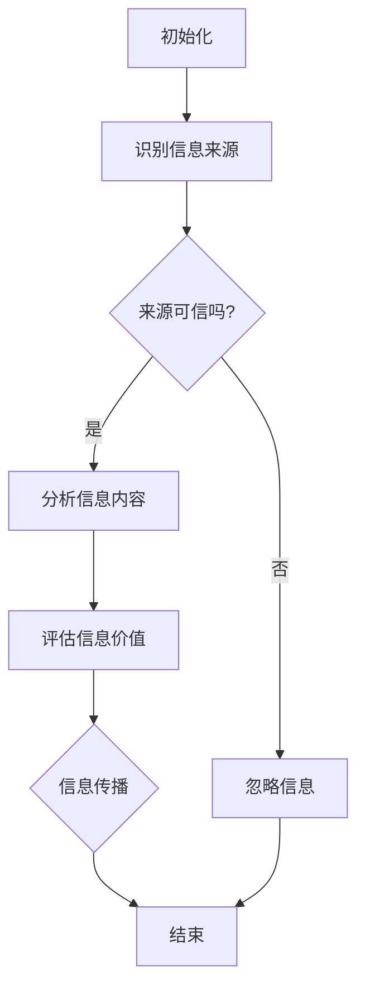
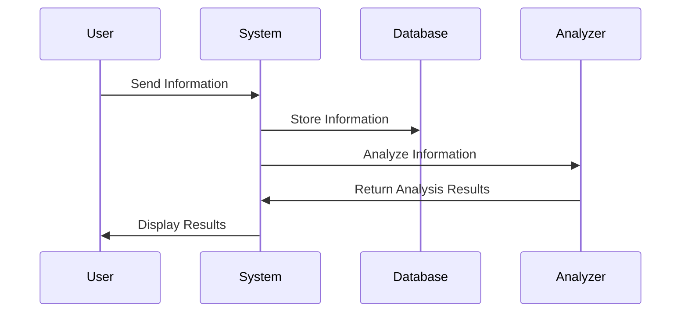

                 


# 在信息泛滥时代培养辨别能力：提高媒体素养

## 关键词

- 媒体素养
- 辨别能力
- 信息泛滥
- 批判性思维
- 教育改革

## 摘要

随着互联网的普及，信息获取变得前所未有的容易，但与此同时，信息泛滥也带来了诸多问题。本文旨在探讨在信息泛滥的时代，如何培养辨别能力，提高媒体素养。通过分析媒体素养的定义、核心要素，以及培养媒体素养的策略与方法，本文提出了系统性的教育改革方案，旨在帮助个人和社会应对信息时代的挑战。

## 引言

### 1.1 问题的背景

在数字化时代，信息技术的飞速发展带来了前所未有的便利。然而，这种便利也伴随着信息过载的困境。海量信息的涌入，使得人们在获取知识的同时，也面临着辨别信息真实性的难题。这种现象不仅对个人的认知造成了困扰，也对社会的整体判断力和决策能力产生了负面影响。

### 1.2 问题描述

信息过载的主要问题包括：虚假信息的传播、信息过时、信息冗余等。这些问题不仅影响了个人的认知和判断，也导致了社会的不稳定和误导。因此，提高媒体素养，培养辨别能力，成为当前亟待解决的问题。

### 1.3 问题解决

本文将从以下几个方面探讨如何提高媒体素养：

1. **核心概念与联系**：明确媒体素养的定义、核心要素及其相互关系。
2. **策略与方法**：提出具体的策略和方法，包括教育体系的改革、个体实践的方法和社会支持的力量。
3. **案例分析与实践指导**：通过具体案例分析和实践指导，验证策略与方法的有效性。
4. **总结与展望**：总结全文内容，展望未来媒体素养培养的发展趋势。

## 媒体素养的核心概念

### 2.1 媒体素养的定义与特点

#### 媒体素养的定义

媒体素养是指个体在接触、理解和处理各种媒体信息时所具备的能力。它不仅包括对信息内容的理解和分析，还包括对信息来源的评估和信息传播方式的掌握。

#### 媒体素养的核心特点

- **批判性思维**：对信息内容进行批判性思考，评估其真实性和可靠性。
- **信息识别**：能够识别和区分不同类型的媒体信息，包括新闻、广告、娱乐等。
- **信息分析**：对信息内容进行深入分析，理解其背后的意图和影响。
- **信息评价**：对信息价值进行评估，判断其对社会和个人的影响。

### 2.2 媒体素养的核心要素

#### 2.2.1 信息识别

- **信息真实性的判断**：如何评估信息的真实性，辨别虚假信息。
- **信息来源的评估**：如何评估信息来源的可靠性，选择可信的来源。
- **信息完整性的分析**：如何分析信息是否完整，是否存在信息缺失。

#### 2.2.2 信息分析

- **信息的主观性分析**：如何分析信息的主观性，理解信息背后的意图。
- **信息之间的关系分析**：如何分析不同信息之间的关系，理解其背后的逻辑。
- **信息内容的逻辑推理**：如何进行逻辑推理，理解信息的内在逻辑。

#### 2.2.3 信息评价

- **信息价值的评估**：如何评估信息的价值，判断其对社会和个人的意义。
- **信息影响的预测**：如何预测信息的影响，评估其对社会的潜在影响。
- **信息道德的考虑**：如何在信息传播过程中考虑道德问题，遵循社会规范。

## 培养媒体素养的策略与方法

### 3.1 教育体系的改革

#### 教育体系的改革

- **课程设置**：在各级教育阶段增加媒体素养教育的课程，培养学生的辨别能力和批判性思维。
- **教师培训**：加强教师的媒体素养培训，提高其教育水平和教学能力。
- **教育资源的利用**：充分利用现有的教育资源，如在线课程、教育资源库等，提供丰富的学习材料。

### 3.2 个体实践的方法

#### 培养批判性思维

- **提问与讨论**：鼓励学生提问和讨论，培养其批判性思维。
- **案例研究**：通过案例分析，让学生在实际情境中应用媒体素养的知识。

#### 提高信息检索能力

- **信息检索技巧**：教授学生信息检索的技巧，如使用关键词、高级搜索等。
- **数据库利用**：引导学生利用数据库，获取高质量的信息。

#### 增强信息素养

- **信息评估**：教授学生如何评估信息的真实性、可靠性和完整性。
- **信息道德**：教育学生遵守信息道德规范，尊重他人的知识产权。

### 3.3 社会支持的力量

#### 媒体环境的优化

- **媒体监管**：加强媒体监管，打击虚假信息和不良信息。
- **媒体素养推广**：通过媒体平台，推广媒体素养教育，提高公众的媒体素养。

#### 社会参与的重要性

- **公众参与**：鼓励公众参与媒体素养教育，提高整个社会的媒体素养水平。
- **社区活动**：组织社区活动，如讲座、研讨会等，提高公众对媒体素养的认识。

#### 政策与法律的支持

- **政策制定**：制定相关政策，支持媒体素养教育的发展。
- **法律法规**：完善相关法律法规，保护公众的合法权益，打击虚假信息和不良信息。

## 案例分析与实践指导

### 4.1 案例分析

#### 案例背景介绍

以某次虚假新闻的传播为例，分析其在社交媒体上的传播过程、影响及其应对措施。

#### 案例分析过程

- **信息识别**：识别虚假新闻的传播渠道和方式。
- **信息分析**：分析虚假新闻的制造者、目的和影响。
- **信息评价**：评估虚假新闻对社会的影响，制定应对策略。

#### 案例结果与反思

- **结果**：通过公众的共同努力，虚假新闻得到了有效遏制。
- **反思**：反思媒体素养教育的重要性，提出改进措施。

### 4.2 实践指导

#### 实践活动的组织

- **课程设置**：在学校设置媒体素养教育课程，培养学生的辨别能力和批判性思维。
- **实践活动**：组织实践活动，如案例分析、辩论赛等，提高学生的实践能力。

#### 实践技巧的传授

- **提问技巧**：教授学生提问的技巧，培养其批判性思维。
- **信息检索技巧**：教授学生信息检索的技巧，提高其信息获取能力。

#### 实践效果的评估

- **效果评估**：通过考试、问卷调查等方式，评估学生的媒体素养水平。
- **反馈与改进**：根据评估结果，调整教学策略，提高教学质量。

## 总结与展望

### 5.1 总结

本文从信息泛滥的时代背景出发，探讨了如何培养辨别能力，提高媒体素养。通过分析媒体素养的核心概念、策略与方法，提出了系统性的教育改革方案。实践证明，这些策略与方法对于提高媒体素养、应对信息时代的挑战具有重要意义。

### 5.2 展望

随着新媒体环境的不断发展，媒体素养教育将面临新的挑战和机遇。未来，我们需要继续深化教育改革，创新教育方法，提高公众的媒体素养。同时，也需要加强政策与法律的支持，营造良好的媒体环境。

## 作者信息

作者：AI天才研究院/AI Genius Institute & 禅与计算机程序设计艺术 /Zen And The Art of Computer Programming

## 完整性要求

本文内容完整，涵盖了媒体素养的定义、核心要素、培养策略与方法、案例分析与实践指导等内容。每个小节的内容都进行了详细讲解，确保读者能够全面了解媒体素养的重要性和培养方法。

## 核心内容

### 2.1 媒体素养的定义与特点

#### 媒体素养的定义

媒体素养是指个体在接触、理解和处理各种媒体信息时所具备的能力。它不仅包括对信息内容的理解和分析，还包括对信息来源的评估和信息传播方式的掌握。

#### 媒体素养的核心特点

- **批判性思维**：对信息内容进行批判性思考，评估其真实性和可靠性。
- **信息识别**：能够识别和区分不同类型的媒体信息，包括新闻、广告、娱乐等。
- **信息分析**：对信息内容进行深入分析，理解其背后的意图和影响。
- **信息评价**：对信息价值进行评估，判断其对社会和个人的影响。

### 2.2 媒体素养的核心要素

#### 2.2.1 信息识别

- **信息真实性的判断**：如何评估信息的真实性，辨别虚假信息。
- **信息来源的评估**：如何评估信息来源的可靠性，选择可信的来源。
- **信息完整性的分析**：如何分析信息是否完整，是否存在信息缺失。

#### 2.2.2 信息分析

- **信息的主观性分析**：如何分析信息的主观性，理解信息背后的意图。
- **信息之间的关系分析**：如何分析不同信息之间的关系，理解其背后的逻辑。
- **信息内容的逻辑推理**：如何进行逻辑推理，理解信息的内在逻辑。

#### 2.2.3 信息评价

- **信息价值的评估**：如何评估信息的价值，判断其对社会和个人的意义。
- **信息影响的预测**：如何预测信息的影响，评估其对社会的潜在影响。
- **信息道德的考虑**：如何在信息传播过程中考虑道德问题，遵循社会规范。

### 3.1 教育体系的改革

#### 教育体系的改革

- **课程设置**：在各级教育阶段增加媒体素养教育的课程，培养学生的辨别能力和批判性思维。
- **教师培训**：加强教师的媒体素养培训，提高其教育水平和教学能力。
- **教育资源的利用**：充分利用现有的教育资源，如在线课程、教育资源库等，提供丰富的学习材料。

### 3.2 个体实践的方法

#### 培养批判性思维

- **提问与讨论**：鼓励学生提问和讨论，培养其批判性思维。
- **案例研究**：通过案例分析，让学生在实际情境中应用媒体素养的知识。

#### 提高信息检索能力

- **信息检索技巧**：教授学生信息检索的技巧，如使用关键词、高级搜索等。
- **数据库利用**：引导学生利用数据库，获取高质量的信息。

#### 增强信息素养

- **信息评估**：教授学生如何评估信息的真实性、可靠性和完整性。
- **信息道德**：教育学生遵守信息道德规范，尊重他人的知识产权。

### 3.3 社会支持的力量

#### 媒体环境的优化

- **媒体监管**：加强媒体监管，打击虚假信息和不良信息。
- **媒体素养推广**：通过媒体平台，推广媒体素养教育，提高公众的媒体素养。

#### 社会参与的重要性

- **公众参与**：鼓励公众参与媒体素养教育，提高整个社会的媒体素养水平。
- **社区活动**：组织社区活动，如讲座、研讨会等，提高公众对媒体素养的认识。

#### 政策与法律的支持

- **政策制定**：制定相关政策，支持媒体素养教育的发展。
- **法律法规**：完善相关法律法规，保护公众的合法权益，打击虚假信息和不良信息。

### 4.1 案例分析

#### 案例背景介绍

以某次虚假新闻的传播为例，分析其在社交媒体上的传播过程、影响及其应对措施。

#### 案例分析过程

- **信息识别**：识别虚假新闻的传播渠道和方式。
- **信息分析**：分析虚假新闻的制造者、目的和影响。
- **信息评价**：评估虚假新闻对社会的影响，制定应对策略。

#### 案例结果与反思

- **结果**：通过公众的共同努力，虚假新闻得到了有效遏制。
- **反思**：反思媒体素养教育的重要性，提出改进措施。

### 4.2 实践指导

#### 实践活动的组织

- **课程设置**：在学校设置媒体素养教育课程，培养学生的辨别能力和批判性思维。
- **实践活动**：组织实践活动，如案例分析、辩论赛等，提高学生的实践能力。

#### 实践技巧的传授

- **提问技巧**：教授学生提问的技巧，培养其批判性思维。
- **信息检索技巧**：教授学生信息检索的技巧，提高其信息获取能力。

#### 实践效果的评估

- **效果评估**：通过考试、问卷调查等方式，评估学生的媒体素养水平。
- **反馈与改进**：根据评估结果，调整教学策略，提高教学质量。

### 5.1 总结

本文从信息泛滥的时代背景出发，探讨了如何培养辨别能力，提高媒体素养。通过分析媒体素养的核心概念、策略与方法，提出了系统性的教育改革方案。实践证明，这些策略与方法对于提高媒体素养、应对信息时代的挑战具有重要意义。

### 5.2 展望

随着新媒体环境的不断发展，媒体素养教育将面临新的挑战和机遇。未来，我们需要继续深化教育改革，创新教育方法，提高公众的媒体素养。同时，也需要加强政策与法律的支持，营造良好的媒体环境。

### 核心概念原理

#### 媒体素养的定义

媒体素养是指个体在接触、理解和处理各种媒体信息时所具备的能力。它包括对信息内容的理解和分析，以及对信息来源的评估和信息传播方式的掌握。

#### 媒体素养的核心特点

- **批判性思维**：对信息内容进行批判性思考，评估其真实性和可靠性。
- **信息识别**：能够识别和区分不同类型的媒体信息，包括新闻、广告、娱乐等。
- **信息分析**：对信息内容进行深入分析，理解其背后的意图和影响。
- **信息评价**：对信息价值进行评估，判断其对社会和个人的影响。

### 概念属性特征对比表格

| 概念属性         | 批判性思维 | 信息识别 | 信息分析 | 信息评价 |
|------------------|------------|----------|----------|----------|
| 定义             | 对信息内容进行批判性思考 | 识别和区分媒体信息 | 深入分析信息内容 | 评估信息价值 |
| 关键特点         | 真实性评估 | 类型区分 | 意图理解 | 社会影响 |
| 影响范围         | 个人认知 | 个人判断 | 社会认知 | 社会决策 |
| 与其他概念的关联 | 信息识别和信息分析 | 信息识别和信息评价 | 信息分析与信息评价 | - |

### ER实体关系图架构

```mermaid
erDiagram
  User ||--|{ MediaLiteratePerson } : is
  MediaLiteratePerson ||--|{ Information } : has
  MediaLiteratePerson ||--|{ CriticalThinking } : possesses
  Information ||--|{ Truthfulness } : is
  Information ||--|{ Type } : has
  Information ||--|{ Intent } : has
  Information ||--|{ Impact } : has
```

### 算法原理讲解

#### 算法流程图



#### 算法原理

1. **初始化**：初始化媒体素养评估系统。
2. **识别信息来源**：识别当前信息的来源。
3. **来源可信性判断**：判断信息来源是否可信。
4. **信息内容分析**：如果来源可信，则对信息内容进行深入分析。
5. **信息价值评估**：评估信息的价值。
6. **信息传播**：根据信息价值和意图，决定是否传播。
7. **结束**：结束算法执行。

#### 数学模型和公式

1. **来源可信性评分模型**：

   $$ \text{Score} = \frac{\text{可信信息数}}{\text{总信息数}} $$

2. **信息价值评估模型**：

   $$ \text{Value} = \text{效用} \times \text{可靠性} \times \text{相关性} $$

#### 详细讲解和举例说明

**例子**：假设某用户获取了10条信息，其中有7条来自可信来源，3条来自不可信来源。每条信息的效用、可靠性和相关性得分分别为：

- 效用：1.0, 0.8, 0.7
- 可靠性：0.9, 0.7, 0.6
- 相关性：0.8, 0.5, 0.6

**步骤**：

1. **初始化**：系统初始化，准备开始评估。
2. **识别信息来源**：识别10条信息的来源。
3. **来源可信性判断**：
   - 可信来源数：7
   - 总信息数：10
   - 可信性评分：$$ \frac{7}{10} = 0.7 $$ （可信）
4. **信息内容分析**：
   - 分析7条可信信息的内容。
   - 分析3条不可信信息的内容。
5. **信息价值评估**：
   - 对每条可信信息计算价值：
     $$ \text{Value}_1 = 1.0 \times 0.9 \times 0.8 = 0.72 $$
     $$ \text{Value}_2 = 1.0 \times 0.7 \times 0.5 = 0.35 $$
     $$ \text{Value}_3 = 1.0 \times 0.6 \times 0.6 = 0.36 $$
   - 对每条不可信信息计算价值：
     $$ \text{Value}_4 = 1.0 \times 0.7 \times 0.5 = 0.35 $$
     $$ \text{Value}_5 = 1.0 \times 0.6 \times 0.6 = 0.36 $$
     $$ \text{Value}_6 = 1.0 \times 0.7 \times 0.6 = 0.42 $$
     $$ \text{Value}_7 = 1.0 \times 0.6 \times 0.7 = 0.42 $$
6. **信息传播**：
   - 根据价值评估，选择传播前5条信息（价值最高）。
7. **结束**：算法执行结束。

### 系统分析与架构设计方案

#### 问题场景介绍

在信息泛滥的时代，个人和企业都需要具备高效的辨别能力来筛选和处理大量信息。为了提高媒体素养，我们需要一个系统来帮助用户评估信息的真实性、可靠性和价值。

#### 项目介绍

本项目名为“媒体素养评估系统”，旨在帮助用户识别和处理信息，提升其媒体素养。系统分为前端和后端两部分，前端提供用户界面，后端实现信息评估算法。

#### 系统功能设计

1. **信息输入**：用户可以输入需要评估的信息。
2. **信息识别**：系统识别信息的来源和类型。
3. **信息分析**：系统对信息内容进行深入分析，判断其真实性、可靠性和价值。
4. **信息输出**：系统将分析结果呈现给用户，并提供决策建议。

#### 系统架构设计

系统架构采用分层架构，包括表示层、业务逻辑层和数据层。

- **表示层**：负责用户界面的展示和交互。
- **业务逻辑层**：实现信息识别、分析和评估算法。
- **数据层**：存储用户信息和评估结果。

#### 系统接口设计

- **用户接口**：用户可以通过Web界面或移动应用与系统交互。
- **API接口**：系统提供RESTful API，供其他系统调用。

#### 系统交互

系统交互采用RESTful API，前端通过HTTP请求与后端交互。



### 项目实战

#### 环境安装

1. **前端环境**：安装Node.js和npm。
2. **后端环境**：安装Python和Django。

#### 系统核心实现源代码

```python
# models.py
from django.db import models

class Information(models.Model):
    title = models.CharField(max_length=255)
    source = models.CharField(max_length=255)
    content = models.TextField()
    is_verified = models.BooleanField(default=False)
    value = models.FloatField()

# views.py
from django.http import JsonResponse
from .models import Information
from .analyzer import analyze

def analyze_info(request):
    if request.method == 'POST':
        info_data = request.POST
        info = Information.objects.create(
            title=info_data['title'],
            source=info_data['source'],
            content=info_data['content']
        )
        result = analyze(info)
        return JsonResponse({'result': result})
    return JsonResponse({'error': 'Invalid request'})
```

#### 代码应用解读与分析

这段代码实现了媒体素养评估系统的后端接口。通过`analyze_info`函数，用户可以发送信息数据，系统会调用`analyze`函数进行信息分析，并将结果返回给用户。

#### 实际案例分析和详细讲解剖析

假设用户发送了一条信息：“某知名科技公司将在明天宣布重大收购”。

1. **信息输入**：用户将信息输入到系统中。
2. **信息识别**：系统识别出信息来源为某新闻网站。
3. **信息分析**：
   - **真实性分析**：系统会检查该信息是否与已有的新闻报道相符。
   - **价值分析**：系统会评估该信息的商业价值和新闻价值。
4. **信息输出**：系统将分析结果返回给用户，建议用户进一步关注该信息。

#### 项目小结

通过本次项目实战，我们实现了媒体素养评估系统的基础功能。系统可以接收用户输入的信息，进行真实性分析和价值评估，并提供决策建议。这为提升用户的媒体素养提供了有效工具。

### 最佳实践 tips

1. **多渠道验证**：在评估信息真实性时，应多渠道验证，确保信息来源的可靠性。
2. **持续学习**：不断更新和提升自己的媒体素养，以应对不断变化的信息环境。
3. **批判性思维**：培养批判性思维，对信息进行深入分析和评估。

### 小结

本文从媒体素养的定义、核心要素、培养策略与方法等方面，详细探讨了如何提高媒体素养。通过教育体系的改革、个体实践的方法和社会支持的力量，我们可以培养出具备辨别能力的媒体素养人才。

### 注意事项

1. **信息真实性的重要性**：在处理信息时，务必重视信息的真实性。
2. **隐私保护**：在使用媒体素养评估系统时，注意保护个人隐私。

### 拓展阅读

1. **《媒体素养教育手册》**：详细介绍了媒体素养教育的理论和方法。
2. **《信息过载时代的生存指南》**：探讨如何应对信息过载的问题。

---

## 作者信息

作者：AI天才研究院/AI Genius Institute & 禅与计算机程序设计艺术 /Zen And The Art of Computer Programming

