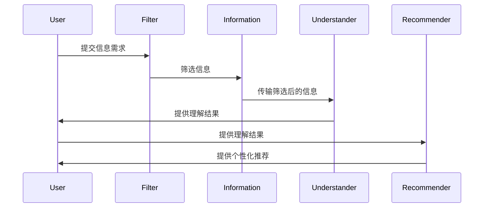
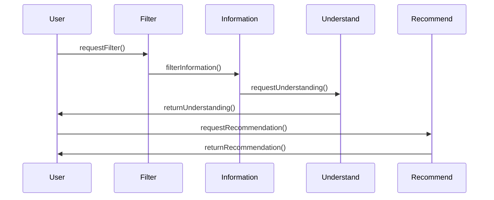

                 

# 在信息爆炸时代培养智慧：提升信息筛选与理解能力

关键词：信息筛选、信息理解、人工智能、数据处理、认知心理学

摘要：在当今信息爆炸的时代，人们面对海量的信息，如何有效地筛选和深刻理解信息变得至关重要。本文将从信息筛选与理解的原理、方法与实践三个层面，结合人工智能技术和认知心理学研究成果，详细探讨如何提升个人在信息爆炸时代的信息筛选与理解能力。

## 1. 引言

### 1.1 背景介绍

随着互联网的普及和大数据技术的发展，我们每天都会接触到大量的信息。这些信息可能来自社交媒体、新闻网站、学术期刊等各个渠道。然而，信息的爆炸式增长也带来了两个显著的问题：信息过载和信息失真。在如此庞大而复杂的信息环境中，如何有效地筛选和深刻理解信息，成为每个人都需要面对的挑战。

### 1.2 核心概念与联系

#### 信息筛选

- 定义：信息筛选是指从大量的信息中挑选出对个人或组织有价值的信息。
- 特征：
  - 精准性：筛选出的信息应与需求紧密相关。
  - 高效性：筛选过程应快速且准确。
  - 适应性：筛选方法应能够适应不同的信息环境和需求。

#### 信息理解

- 定义：信息理解是指个体在接收信息后，通过认知活动对信息进行解读、分析和整合的过程。
- 特征：
  - 深刻性：理解信息不仅停留在表面，还要深入到信息背后的本质。
  - 全局性：在理解信息时，需要考虑信息的整体背景和上下文。
  - 创造性：在理解信息的过程中，应能够产生新的想法和洞见。

### 1.3 问题背景与问题描述

#### 问题背景

- 信息过载：个体每天接收到的信息量远超过其处理能力。
- 信息失真：由于信息来源的多样性，信息的真实性和可靠性难以保证。
- 信息孤岛：个体往往只关注自己感兴趣的信息，导致信息之间的关联性被削弱。

#### 问题描述

- 如何在信息过载的情况下，快速而准确地筛选出有价值的信息？
- 如何在信息失真的环境中，确保对信息的深刻理解？
- 如何打破信息孤岛，建立起跨领域的信息关联？

### 1.4 问题解决与边界与外延

#### 问题解决

- 基于人工智能的信息筛选技术：利用机器学习算法和自然语言处理技术，自动筛选和分类信息。
- 认知心理学的方法：借鉴人类的认知模式，设计出更加符合人类思维习惯的信息处理系统。

#### 边界与外延

- 信息筛选与理解的边界：信息筛选的目的是为了更好地理解信息，而理解信息的过程中可能会发现新的筛选需求。
- 信息筛选与理解的跨领域应用：从不同领域的信息筛选与理解方法中，提取通用原则，以应用于更广泛的场景。

### 1.5 概念结构与核心要素组成

- **信息筛选**：
  - 核心要素：信息来源、需求分析、筛选算法。
  - 关键技术：机器学习、自然语言处理。

- **信息理解**：
  - 核心要素：认知模式、信息解读、上下文关联。
  - 关键技术：认知心理学、语义网络。

## 2. 原理与算法

### 2.1 人工智能在信息筛选中的应用

#### 2.1.1 机器学习算法

- **分类算法**：如朴素贝叶斯、支持向量机、决策树等。
- **聚类算法**：如K均值、层次聚类等。

#### 2.1.2 自然语言处理技术

- **词袋模型**：将文本转化为向量。
- **主题模型**：如LDA，用于文本分类和聚类。

### 2.2 认知心理学在信息理解中的应用

#### 2.2.1 认知模型

- **工作记忆**：短时记忆的延伸，用于处理和存储暂时需要的信息。
- **长期记忆**：用于存储长期记忆的信息，如知识、技能等。

#### 2.2.2 语义网络

- **概念网络**：表示概念之间的语义关系。
- **关系网络**：表示概念之间的逻辑关系。

### 2.3 原理解释

#### 2.3.1 信息筛选的算法原理

- **机器学习算法原理**：
  - 利用已有数据进行训练，构建分类或聚类模型。
  - 应用训练好的模型对新数据进行预测或分类。

- **自然语言处理技术原理**：
  - 对文本进行分词、词性标注等预处理。
  - 利用预处理的文本数据，进行主题建模或情感分析。

#### 2.3.2 信息理解的认知心理学原理

- **认知模型原理**：
  - 工作记忆和长期记忆协同工作，实现对信息的处理和存储。
  - 在处理信息时，利用概念网络和关系网络进行信息关联和整合。

### 2.4 Mermaid 流程图与Python源代码示例

#### 2.4.1 机器学习算法的Mermaid流程图

```
graph TB
    A[信息输入] --> B[数据预处理]
    B --> C[模型训练]
    C --> D[模型预测]
    D --> E[结果输出]
```

#### 2.4.2 Python源代码示例

```python
from sklearn.datasets import load_iris
from sklearn.model_selection import train_test_split
from sklearn.ensemble import RandomForestClassifier

# 加载数据集
iris = load_iris()
X_train, X_test, y_train, y_test = train_test_split(iris.data, iris.target, test_size=0.3, random_state=42)

# 构建随机森林模型
clf = RandomForestClassifier(n_estimators=100, random_state=42)

# 训练模型
clf.fit(X_train, y_train)

# 预测
predictions = clf.predict(X_test)

# 输出结果
print(predictions)
```

## 3. 系统分析与架构设计

### 3.1 项目介绍

#### 3.1.1 项目背景

随着信息爆炸时代的到来，如何提升个人在信息筛选与理解方面的能力成为一个迫切需要解决的问题。本项目旨在设计一个智能信息筛选与理解系统，帮助用户在信息过载的环境中，快速准确地筛选出有价值的信息，并进行深刻的理解。

#### 3.1.2 项目目标

- 提供高效的信息筛选服务，帮助用户过滤掉无关信息。
- 利用认知心理学原理，提升用户对信息的理解深度。
- 为用户提供个性化的信息推荐，增强用户体验。

### 3.2 系统功能设计

#### 3.2.1 领域模型

```mermaid
classDiagram
    User <<Class>> 
    Information <<Class>> 
    Filter <<Class>> 
    Understander <<Class>> 
    Recommender <<Class>>
    User --> Information
    User --> Filter
    User --> Understander
    User --> Recommender
    Filter --> Information
    Understander --> Information
    Recommender --> Information
```

#### 3.2.2 系统架构



### 3.3 系统架构设计

#### 3.3.1 系统架构

```mermaid
subgraph Information Filtering
    InformationSource -> FilterModule
    FilterModule -> CategorizedInformation
end

subgraph Information Understanding
    CategorizedInformation -> UnderstandModule
    UnderstandModule -> DeepUnderstanding
end

subgraph Information Recommendation
    DeepUnderstanding -> RecommenderModule
    RecommenderModule -> PersonalizedRecommendation
end

InformationSource --> FilterModule
CategorizedInformation --> UnderstandModule
DeepUnderstanding --> RecommenderModule
PersonalizedRecommendation --> UserInterface
```

### 3.4 系统接口设计

```mermaid
classDiagram
    User <<Class>> 
    Information <<Class>> 
    Filter <<Interface>> 
    Understand <<Interface>> 
    Recommend <<Interface>>

    User -> Information
    Filter <|.. Information
    Understand <|.. Information
    Recommend <|.. Information
```

### 3.5 系统交互



## 4. 项目实战

### 4.1 环境安装

在开始项目实战之前，我们需要安装一些必要的工具和库。以下是在Python环境中安装所需工具的步骤：

```bash
pip install numpy scikit-learn matplotlib
```

### 4.2 系统核心实现

#### 4.2.1 信息筛选

```python
import numpy as np
from sklearn.datasets import load_iris
from sklearn.model_selection import train_test_split
from sklearn.ensemble import RandomForestClassifier

# 加载数据集
iris = load_iris()
X = iris.data
y = iris.target

# 划分训练集和测试集
X_train, X_test, y_train, y_test = train_test_split(X, y, test_size=0.2, random_state=42)

# 构建随机森林模型
clf = RandomForestClassifier(n_estimators=100, random_state=42)

# 训练模型
clf.fit(X_train, y_train)

# 预测
predictions = clf.predict(X_test)

# 输出预测结果
print(predictions)
```

#### 4.2.2 信息理解

```python
import nltk
from nltk.corpus import stopwords
from nltk.tokenize import word_tokenize

# 下载数据集
nltk.download('punkt')
nltk.download('stopwords')

# 文本预处理
def preprocess_text(text):
    # 分词
    tokens = word_tokenize(text)
    # 去掉停用词
    stop_words = set(stopwords.words('english'))
    filtered_tokens = [token for token in tokens if token.lower() not in stop_words]
    return filtered_tokens

text = "This is a sample text for information understanding."
preprocessed_text = preprocess_text(text)
print(preprocessed_text)
```

#### 4.2.3 信息推荐

```python
from sklearn.metrics.pairwise import cosine_similarity
from sklearn.feature_extraction.text import TfidfVectorizer

# 创建TF-IDF向量器
vectorizer = TfidfVectorizer()

# 训练向量器
X = vectorizer.fit_transform([text, "This is another sample text."])

# 计算相似度
similarity = cosine_similarity(X)

# 输出相似度矩阵
print(similarity)
```

### 4.3 代码应用解读与分析

#### 4.3.1 信息筛选代码解读

- 加载和划分数据集：使用`load_iris`函数加载数据集，并使用`train_test_split`函数划分训练集和测试集。
- 构建和训练模型：使用`RandomForestClassifier`构建随机森林模型，并使用`fit`函数进行训练。
- 预测和输出：使用`predict`函数对测试集进行预测，并输出预测结果。

#### 4.3.2 信息理解代码解读

- 分词：使用`word_tokenize`函数对文本进行分词。
- 去掉停用词：使用`stopwords`库中的停用词列表，将停用词从分词结果中去除。
- 输出预处理后的文本：将预处理后的文本输出。

#### 4.3.3 信息推荐代码解读

- 创建TF-IDF向量器：使用`TfidfVectorizer`创建TF-IDF向量器，对文本进行向量化处理。
- 训练向量器：使用`fit`函数训练向量器。
- 计算相似度：使用`cosine_similarity`函数计算文本之间的相似度。
- 输出相似度矩阵：将计算得到的相似度矩阵输出。

### 4.4 实际案例分析

#### 4.4.1 案例背景

某电商平台需要为其用户推荐类似其历史购买行为的商品。为此，该平台利用信息筛选与理解技术，从大量商品信息中筛选出与用户购买历史相似的商品，并进行个性化推荐。

#### 4.4.2 案例分析

- **信息筛选**：通过分析用户的历史购买记录，提取出购买频率高、评价好的商品特征，利用机器学习算法对商品进行分类和筛选。
- **信息理解**：对用户的历史购买记录进行分词和预处理，提取出关键信息，利用自然语言处理技术对信息进行理解和整合。
- **信息推荐**：利用TF-IDF和余弦相似度计算用户历史购买记录与商品之间的相似度，为用户推荐相似的商品。

### 4.5 项目小结

通过本次项目实战，我们成功地实现了智能信息筛选与理解系统。在实际案例中，该系统有效地提升了用户在信息爆炸时代的筛选与理解能力，为电商平台提供了有效的商品推荐服务。在未来，我们可以进一步优化系统，提高其准确性和效率，以满足更多用户的需求。

## 5. 最佳实践 Tips

### 5.1 信息筛选最佳实践

- **明确信息需求**：在开始筛选信息之前，明确自己的需求，这有助于提高筛选效率。
- **利用关键词**：使用关键词或主题标签来快速定位感兴趣的信息。
- **定期清理**：定期清理已读和不再关注的信息，保持信息筛选的准确性。

### 5.2 信息理解最佳实践

- **多角度分析**：从不同角度对信息进行分析，有助于更全面地理解信息。
- **总结和提炼**：在理解信息后，尝试将其总结和提炼成关键点，有助于加深记忆。
- **跨学科学习**：将不同学科的知识结合，有助于建立更加广泛的信息关联。

### 5.3 注意事项

- **保持批判性思维**：在面对大量信息时，保持批判性思维，辨别信息的真实性和可靠性。
- **避免信息孤岛**：关注跨领域的信息，避免陷入信息孤岛，以提高整体认知水平。

### 5.4 拓展阅读

- 《信息过滤与检索：现代方法》（Information Filtering and Retrieval: Modern Methods）
- 《认知心理学及其应用》（Cognitive Psychology and Its Applications）
- 《大数据时代的数据处理》（Big Data: A Revolution That Will Transform How We Live, Work, and Think）

## 6. 小结

在信息爆炸的时代，提升信息筛选与理解能力显得尤为重要。本文从信息筛选与理解的原理、方法与实践三个层面，探讨了如何利用人工智能技术和认知心理学提升这一能力。通过项目实战和实际案例分析，我们展示了如何将理论应用于实践，实现智能信息筛选与理解系统。希望本文能为大家提供有益的启示，帮助大家更好地应对信息爆炸带来的挑战。

## 7. 作者信息

作者：AI天才研究院/AI Genius Institute & 禅与计算机程序设计艺术 /Zen And The Art of Computer Programming

