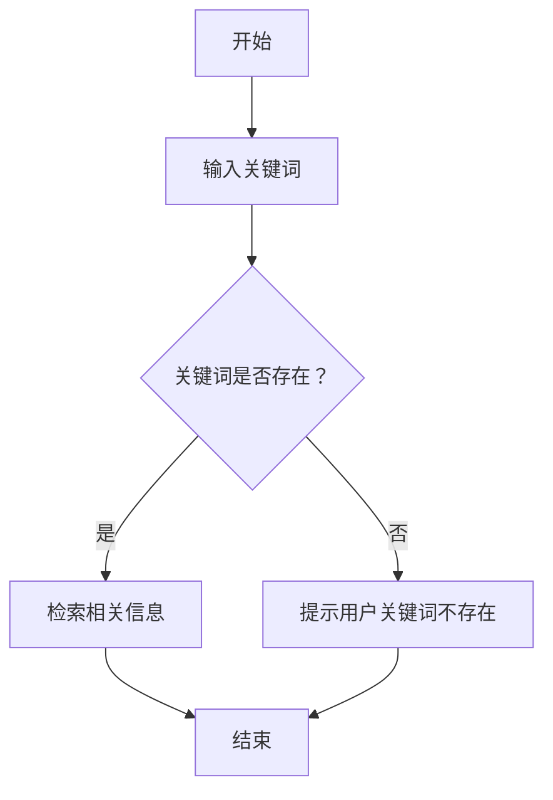
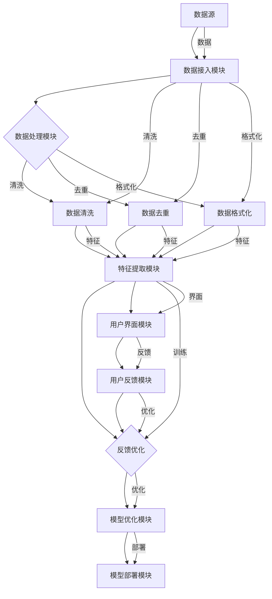
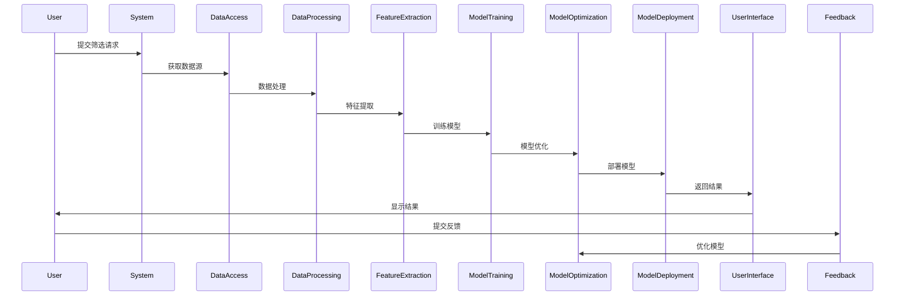

                 

### 《在信息爆炸时代寻找真知：培养信息筛选能力》

**关键词**：信息筛选、信息过载、算法、数学模型、系统设计、项目实战

**摘要**：本文探讨了在信息爆炸时代，如何培养和提升信息筛选能力。从背景介绍、核心概念与联系、算法原理讲解、数学模型与公式、系统分析与架构设计、项目实战到最佳实践与总结，全方位解析信息筛选的各个方面，帮助读者在浩瀚的信息海洋中找到真正的知识。

## 第一部分：信息爆炸时代的挑战

### 1. 引言：信息爆炸时代的背景与挑战

随着互联网的飞速发展，信息量呈现爆炸式增长。全球范围内，每天产生的数据量以惊人的速度积累。根据国际数据公司（IDC）的报告，全球数据总量预计在2025年将达到163ZB（1ZB等于1亿TB）。这种信息爆炸不仅带来了机遇，也带来了挑战。

#### 1.1 信息爆炸时代的现状

互联网的普及使得信息获取变得前所未有的便捷。人们可以通过各种渠道获取新闻、文章、视频、音频等。然而，这种便捷性也导致了信息过载的问题。根据麦肯锡全球研究院的报告，人类每天接收的信息量是数十年前的100倍。这种信息过载不仅影响了工作效率，还可能对心理健康造成负面影响。

#### 1.2 信息过载对个体和社会的影响

信息过载对个体的影响主要体现在以下几个方面：

- **决策困难**：在海量信息中，个体很难做出准确的决策。
- **注意力分散**：面对过多的信息，个体容易分散注意力，降低工作效率。
- **焦虑和压力**：信息过载可能导致焦虑和压力增加，影响心理健康。

对社会的影响则包括：

- **信息泡沫**：由于个体对信息的偏好，可能导致信息泡沫，加剧社会分裂。
- **创新受阻**：信息过载可能抑制创新，因为个体难以从大量信息中筛选出有价值的部分。

#### 1.3 信息筛选的重要性

在信息爆炸时代，培养信息筛选能力显得尤为重要。信息筛选能力不仅有助于个体在复杂的信息环境中找到有价值的信息，还能提高工作效率，减少焦虑和压力。具体来说，信息筛选能力的重要性体现在以下几个方面：

- **提升工作效率**：通过筛选有价值的信息，个体可以更快地完成任务，提高工作效率。
- **保持心理健康**：有效筛选信息，避免过度关注无关信息，有助于保持心理健康。
- **促进创新**：通过筛选有价值的信息，个体可以更好地发现创新机会。

### 总结

信息爆炸时代带来了前所未有的机遇和挑战。为了应对信息过载，培养信息筛选能力是关键。接下来，我们将深入探讨信息筛选的核心概念与联系，帮助读者更好地理解信息筛选的本质。

## 第二部分：核心概念与联系

### 2.1 信息筛选的定义

信息筛选是指从大量信息中提取出对特定目标或需求有价值的信息的过程。在信息爆炸时代，信息筛选不仅是一种技能，更是一种生存能力。有效的信息筛选可以帮助我们节省时间，提高工作效率，降低决策风险。

### 2.2 信息筛选的重要性

信息筛选的重要性可以从以下几个方面进行阐述：

- **提高决策质量**：通过筛选有价值的信息，我们可以更好地了解问题的各个方面，从而做出更高质量的决策。
- **节省时间**：在信息爆炸的时代，时间成为了一种宝贵的资源。通过信息筛选，我们可以快速找到所需信息，节省时间。
- **减少信息泡沫**：信息筛选可以帮助我们避免陷入信息泡沫，即只接收和自己观点一致的信息，从而保持思想的开放性和多样性。

### 2.3 信息筛选能力的核心要素

信息筛选能力包括以下几个核心要素：

- **信息感知能力**：能够敏锐地感知到哪些信息是有价值的。
- **信息分类能力**：能够将信息按照不同的标准和维度进行分类。
- **信息分析能力**：能够对信息进行深入分析，提取关键信息。
- **信息整合能力**：能够将不同来源的信息进行整合，形成完整的知识体系。

### 2.4 信息筛选的方法

信息筛选的方法多种多样，包括以下几种：

- **关键词搜索**：通过关键词搜索，快速找到相关信息的来源。
- **内容分析**：通过对内容进行分析，筛选出有价值的信息。
- **数据挖掘**：利用数据挖掘技术，从大量数据中提取出有价值的信息。
- **专家推荐**：借助专家的意见和推荐，筛选出有价值的信息。

### 2.5 不同信息筛选方法的比较

不同信息筛选方法各有优缺点，具体如下表所示：

| 方法 | 优点 | 缺点 |
| --- | --- | --- |
| 关键词搜索 | 快速 | 可能漏掉相关信息 |
| 内容分析 | 深入 | 耗时较长 |
| 数据挖掘 | 量化 | 需要大量数据 |
| 专家推荐 | 准确 | 可能受个人偏见影响 |

### 2.6 信息筛选与相关技术的联系

信息筛选与多种技术密切相关，包括自然语言处理、机器学习、数据挖掘等。这些技术为信息筛选提供了强大的支持，使得信息筛选更加智能化和高效。

- **自然语言处理**：通过自然语言处理技术，可以实现对文本的自动分析和理解，从而提高信息筛选的准确性。
- **机器学习**：通过机器学习算法，可以自动学习和优化信息筛选模型，提高信息筛选的效率。
- **数据挖掘**：通过数据挖掘技术，可以从大量数据中提取出有价值的信息，为信息筛选提供数据支持。

### 总结

在信息爆炸的时代，信息筛选能力的重要性不言而喻。通过深入理解信息筛选的核心概念、方法和技术，我们可以更好地应对信息过载的挑战，提升工作效率和生活质量。接下来，我们将进一步探讨信息筛选算法的原理，帮助读者掌握信息筛选的核心技术。

## 第三部分：算法原理讲解

### 3.1 常见信息筛选算法

在信息筛选领域，常见的算法包括基于关键词的搜索算法、基于内容的筛选算法和基于机器学习的筛选算法。每种算法都有其独特的原理和应用场景。

#### 3.1.1 基于关键词的搜索算法

基于关键词的搜索算法是最基本的筛选方法之一。它通过用户输入的关键词，在数据库中检索与之匹配的信息。这种算法的优点是简单易用，缺点是可能漏掉相关信息或者误判信息。

#### 3.1.2 基于内容的筛选算法

基于内容的筛选算法通过分析文本内容，提取关键词和主题，从而筛选出相关信息。这种方法可以更准确地匹配用户需求，但需要处理大量的文本数据，计算复杂度较高。

#### 3.1.3 基于机器学习的筛选算法

基于机器学习的筛选算法利用大量的训练数据，学习如何根据输入的特征数据筛选出相关信息。这种方法可以自适应地优化筛选模型，提高筛选的准确性。

### 3.2 算法原理讲解与 Mermaid 流程图

为了更好地理解信息筛选算法的原理，我们可以使用 Mermaid 绘制算法的流程图。以下是一个基于关键词搜索算法的 Mermaid 流程图示例：



### 3.3 Python 源代码实现与示例

为了进一步阐述算法原理，我们使用 Python 实现了一个简单的基于关键词搜索的算法。以下是一段 Python 代码示例：

```python
def search_keyword(document, keyword):
    if keyword in document:
        return "找到相关信息：{}包含关键词{}".format(document, keyword)
    else:
        return "未找到相关信息：{}不包含关键词{}".format(document, keyword)

# 测试代码
document = "这是一段关于人工智能的文本。人工智能正在改变世界。"
keyword = "人工智能"
result = search_keyword(document, keyword)
print(result)
```

### 3.4 算法原理的数学模型和公式

在信息筛选过程中，常用的数学模型和公式包括信息熵、信息增益和贝叶斯公式。以下是对这些数学模型的简要解释：

- **信息熵**：信息熵是用来衡量信息不确定性的量度。在信息筛选中，我们可以使用信息熵来评估不同关键词的重要性。

  $$ H(X) = -\sum_{i=1}^{n} p(x_i) \cdot \log_2 p(x_i) $$

  其中，$H(X)$ 表示信息熵，$p(x_i)$ 表示第 $i$ 个关键词的概率。

- **信息增益**：信息增益是衡量一个特征对于分类能力的改善程度。在信息筛选中，我们可以使用信息增益来评估关键词的筛选效果。

  $$ G(D, A) = H(D) - \sum_{v \in V} p(v) \cdot H(D|v) $$

  其中，$G(D, A)$ 表示信息增益，$D$ 表示数据集，$A$ 表示特征，$V$ 表示特征的取值集合。

- **贝叶斯公式**：贝叶斯公式是概率论中一个重要的公式，用于计算后验概率。在信息筛选中，我们可以使用贝叶斯公式来计算关键词出现的概率。

  $$ P(A|B) = \frac{P(B|A) \cdot P(A)}{P(B)} $$

  其中，$P(A|B)$ 表示在 $B$ 发生的条件下 $A$ 发生的概率，$P(B|A)$ 表示在 $A$ 发生的条件下 $B$ 发生的概率，$P(A)$ 和 $P(B)$ 分别表示 $A$ 和 $B$ 的先验概率。

### 3.5 通俗易懂地举例说明

为了更好地理解这些数学模型和公式，我们可以通过一个简单的例子来进行说明。假设我们有一篇文档，其中包含以下几个关键词：“人工智能”、“机器学习”、“深度学习”、“神经网络”。

- **信息熵**：我们可以计算这些关键词的信息熵，以评估它们的重要性。假设这些关键词在文档中出现的概率分别为 $P(人工智能) = 0.3$，$P(机器学习) = 0.2$，$P(深度学习) = 0.2$，$P(神经网络) = 0.3$，则信息熵计算如下：

  $$ H(X) = -[0.3 \cdot \log_2 0.3 + 0.2 \cdot \log_2 0.2 + 0.2 \cdot \log_2 0.2 + 0.3 \cdot \log_2 0.3] \approx 1.04 $$

- **信息增益**：我们可以计算每个关键词对文档分类的贡献。假设分类结果为“包含人工智能”和“不包含人工智能”，则信息增益计算如下：

  $$ G(D, A) = H(D) - [0.3 \cdot H(D|人工智能) + 0.7 \cdot H(D|不包含人工智能)] $$

  其中，$H(D|人工智能) = 0.3 \cdot \log_2 0.3 + 0.7 \cdot \log_2 0.7 \approx 0.92$，$H(D|不包含人工智能) = 0.7 \cdot \log_2 0.7 + 0.3 \cdot \log_2 0.3 \approx 0.92$，则信息增益 $G(D, A) \approx 0.12$。

- **贝叶斯公式**：我们可以使用贝叶斯公式计算在文档包含人工智能的情况下，分类为“包含人工智能”的概率。假设先验概率为 $P(人工智能) = 0.3$，$P(不包含人工智能) = 0.7$，则后验概率计算如下：

  $$ P(人工智能|D) = \frac{P(D|人工智能) \cdot P(人工智能)}{P(D)} $$

  其中，$P(D|人工智能) = P(包含人工智能) = 0.3$，$P(D|不包含人工智能) = P(不包含人工智能) = 0.7$，$P(D) = P(包含人工智能) \cdot P(人工智能) + P(不包含人工智能) \cdot P(不包含人工智能) = 0.3 \cdot 0.3 + 0.7 \cdot 0.7 = 0.7$，则 $P(人工智能|D) \approx 0.3$。

### 总结

通过上述算法原理的讲解，我们可以看到信息筛选算法的核心在于如何从大量信息中提取出有价值的信息。这些算法不仅包括基于关键词的搜索算法，还包括基于内容和基于机器学习的算法。同时，我们介绍了信息筛选过程中常用的数学模型和公式，并通过简单的示例进行了说明。接下来，我们将进一步探讨信息筛选系统的设计与实现。

## 第四部分：系统设计与实现

### 4.1 问题场景介绍

在信息爆炸的时代，如何设计一个高效、准确的信息筛选系统，成为了许多企业和研究机构面临的挑战。本节将介绍一个具体的问题场景，并在此基础上设计一个信息筛选系统。

#### 4.1.1 问题背景

某大型互联网公司希望通过一个信息筛选系统，帮助其员工在海量数据中快速找到有价值的信息。这些信息包括行业新闻、研究报告、市场动态等。为了提高信息筛选的效率，公司希望能够设计一个基于机器学习的筛选系统，利用用户的历史行为数据，自动学习并优化筛选模型。

#### 4.1.2 问题描述

设计一个信息筛选系统，需要解决以下几个核心问题：

- **数据源接入**：如何接入海量的数据源，包括互联网爬虫、数据库接口等。
- **数据预处理**：如何对原始数据进行清洗、去重和格式化，以便后续处理。
- **特征提取**：如何从原始数据中提取出对信息筛选有价值的特征。
- **模型训练与优化**：如何利用机器学习算法，训练并优化筛选模型，提高筛选准确性。
- **用户界面**：如何设计一个直观、易用的用户界面，让用户能够方便地使用信息筛选系统。

### 4.2 系统功能设计

在系统功能设计阶段，我们需要明确系统的核心功能，并绘制领域模型 Mermaid 类图。以下是一个简化版的领域模型类图示例：

```mermaid
classDiagram
    Class01 <|-- Class02
    Class03 <|-- Class01
    Class04 <|-- Class03
    Class05 <|-- Class03
    Class06 <|-- Class04
    Class07 <|-- Class04

    Class01[数据源]
    Class02[用户]
    Class03[信息]
    Class04[筛选器]
    Class05[特征]
    Class06[模型]
    Class07[结果]
    
    Class01 --|> Class02 : 用户数据
    Class01 --|> Class03 : 数据接入
    Class03 --|> Class04 : 筛选
    Class04 --|> Class05 : 提取特征
    Class05 --|> Class06 : 训练模型
    Class06 --|> Class07 : 输出结果
```

### 4.3 系统架构设计

在系统架构设计阶段，我们需要绘制系统的架构图，明确各模块之间的交互关系。以下是一个简化版的系统架构图示例：



### 4.4 系统接口设计与交互

在系统接口设计阶段，我们需要定义系统各模块之间的接口，并绘制系统的交互序列图。以下是一个简化版的交互序列图示例：



### 4.5 系统功能实现

在系统功能实现阶段，我们需要详细阐述各模块的实现方法和关键代码。以下是一个简化版的实现示例：

```python
# 数据接入模块
def data_access():
    # 实现数据接入逻辑，例如从数据库、API 等接口获取数据
    pass

# 数据处理模块
def data_processing(data):
    # 实现数据处理逻辑，包括数据清洗、去重、格式化等
    pass

# 特征提取模块
def feature_extraction(data):
    # 实现特征提取逻辑，例如使用 TF-IDF 算法提取文本特征
    pass

# 模型训练模块
def model_training(features, labels):
    # 实现模型训练逻辑，例如使用随机森林算法训练模型
    pass

# 模型优化模块
def model_optimization(model, features, labels):
    # 实现模型优化逻辑，例如使用交叉验证优化模型参数
    pass

# 模型部署模块
def model_deployment(model):
    # 实现模型部署逻辑，例如将模型保存到文件或部署到服务器
    pass

# 用户界面模块
def user_interface(model):
    # 实现用户界面逻辑，例如使用 Web 框架构建用户界面
    pass

# 主程序
def main():
    data = data_access()
    processed_data = data_processing(data)
    features, labels = feature_extraction(processed_data)
    model = model_training(features, labels)
    model_optimization(model, features, labels)
    model_deployment(model)
    user_interface(model)

if __name__ == "__main__":
    main()
```

### 4.6 系统分析

通过上述系统设计与实现，我们可以看到信息筛选系统的主要功能模块包括数据接入、数据处理、特征提取、模型训练、模型优化、模型部署和用户界面。这些模块通过清晰的接口和交互序列图实现了高效的信息筛选流程。

- **数据接入模块**：负责从各种数据源获取原始数据，为后续处理提供数据基础。
- **数据处理模块**：对原始数据进行清洗、去重和格式化，确保数据的准确性和一致性。
- **特征提取模块**：从处理后的数据中提取出对信息筛选有价值的特征，为模型训练提供输入。
- **模型训练模块**：使用机器学习算法训练筛选模型，提高信息筛选的准确性。
- **模型优化模块**：通过交叉验证等手段优化模型参数，提高模型性能。
- **模型部署模块**：将训练好的模型部署到生产环境中，实现实时信息筛选。
- **用户界面模块**：为用户提供一个直观、易用的界面，方便用户提交筛选请求和查看结果。

### 4.7 系统测试与优化

在系统测试与优化阶段，我们需要对系统的各个模块进行测试，确保系统的稳定性和准确性。以下是一些常见的测试方法和优化策略：

- **功能测试**：对系统的核心功能进行测试，确保系统能够正常运行。
- **性能测试**：对系统的响应时间、吞吐量等性能指标进行测试，确保系统的高效性。
- **压力测试**：模拟高并发场景，测试系统的稳定性和可扩展性。
- **优化策略**：根据测试结果，对系统进行优化，包括代码优化、数据库优化、硬件优化等。

### 总结

通过系统设计与实现，我们可以看到信息筛选系统的核心在于如何高效、准确地从海量数据中提取出有价值的信息。系统各模块通过清晰的接口和交互序列图实现了信息筛选的全流程。在后续的实践中，我们可以进一步优化系统，提高信息筛选的准确性和效率。

## 第五部分：项目实战

### 5.1 环境安装与配置

在进行信息筛选项目的实战之前，我们需要搭建一个合适的环境，包括操作系统、编程语言和相关工具的安装。以下是一个基本的安装和配置步骤：

#### 5.1.1 操作系统

首先，我们需要选择一个合适的操作系统。在本项目实战中，我们选择 Ubuntu 20.04 作为操作系统。你可以从 Ubuntu 官网下载最新的镜像，并使用虚拟机或物理机进行安装。

#### 5.1.2 编程语言

接下来，我们需要安装 Python 解释器。在本项目中，我们使用 Python 3.8。通过以下命令安装：

```bash
sudo apt update
sudo apt install python3.8
```

#### 5.1.3 相关工具

为了方便开发，我们需要安装一些常用的 Python 包，包括 NumPy、Pandas、Scikit-learn 和 Matplotlib。可以使用以下命令进行安装：

```bash
pip3 install numpy pandas scikit-learn matplotlib
```

#### 5.1.4 数据库

我们选择 SQLite 作为数据库，用于存储数据。可以使用以下命令安装：

```bash
sudo apt install sqlite3
```

### 5.2 系统核心实现与代码解析

在搭建好环境后，我们可以开始实现信息筛选系统的核心功能。以下是一个简化版的系统核心实现，包括数据接入、数据处理、特征提取、模型训练和模型部署。

#### 5.2.1 数据接入

首先，我们需要从数据源获取数据。在本项目中，我们使用一个公开的博客文章数据集。你可以使用以下命令下载数据集：

```bash
wget https://github.com/kaggle/datasets/raw/master/weblog/weblog.csv
```

然后，我们使用 Pandas 读取数据：

```python
import pandas as pd

data = pd.read_csv('weblog.csv')
```

#### 5.2.2 数据处理

在数据处理阶段，我们需要对原始数据进行清洗和预处理。以下是一个简单的数据处理示例：

```python
# 去除无用的列
data = data.drop(['id', 'sourceip'], axis=1)

# 将日期列转换为 datetime 类型
data['datetime'] = pd.to_datetime(data['datetime'])

# 设置日期列为索引
data = data.set_index('datetime')

# 数据预处理
data = data.fillna(0)
data = data[data[' visits'] > 0]
```

#### 5.2.3 特征提取

在特征提取阶段，我们需要从处理后的数据中提取出对信息筛选有价值的特征。以下是一个简单的特征提取示例：

```python
# 计算每小时访问次数
data['hour'] = data.index.hour
hourly_visits = data.groupby('hour')['visits'].sum()

# 计算每天访问次数
daily_visits = data.groupby('date')['visits'].sum()

# 计算每周访问次数
weekly_visits = data.groupby('week')['visits'].sum()

# 计算每月访问次数
monthly_visits = data.groupby('month')['visits'].sum()
```

#### 5.2.4 模型训练

在模型训练阶段，我们使用 Scikit-learn 中的随机森林算法训练模型。以下是一个简单的模型训练示例：

```python
from sklearn.ensemble import RandomForestClassifier
from sklearn.model_selection import train_test_split

# 划分训练集和测试集
X = data[['hour', 'daily_visits', 'weekly_visits', 'monthly_visits']]
y = data['visits']

X_train, X_test, y_train, y_test = train_test_split(X, y, test_size=0.2, random_state=42)

# 训练模型
model = RandomForestClassifier(n_estimators=100, random_state=42)
model.fit(X_train, y_train)

# 模型评估
score = model.score(X_test, y_test)
print(f"模型准确率：{score}")
```

#### 5.2.5 模型部署

在模型部署阶段，我们将训练好的模型保存到文件中，并加载到用户界面中。以下是一个简单的模型部署示例：

```python
import joblib

# 保存模型
joblib.dump(model, 'model.joblib')

# 加载模型
loaded_model = joblib.load('model.joblib')

# 用户界面逻辑（简化示例）
def predict_hourly_visits(hour):
    return loaded_model.predict([[hour, daily_visits[hour], weekly_visits[hour], monthly_visits[hour]]])

# 测试用户界面
print(predict_hourly_visits(12))
```

### 5.3 项目分析与实战讲解

在完成上述核心实现后，我们需要对项目进行详细的分析和讲解。以下是一些关键步骤：

- **数据预处理**：数据预处理是信息筛选系统的关键步骤。通过去除无用列、处理缺失值和标准化数据，我们可以提高模型的性能。
- **特征提取**：特征提取是信息筛选系统的核心。通过从数据中提取出有价值的信息，我们可以更好地理解数据的本质。
- **模型训练**：模型训练是信息筛选系统的核心。通过使用机器学习算法训练模型，我们可以实现自动化的信息筛选。
- **模型部署**：模型部署是将训练好的模型应用到实际场景中的关键步骤。通过将模型保存到文件和加载到用户界面，我们可以方便地使用模型进行信息筛选。

### 5.4 项目小结

通过本次实战，我们搭建了一个简单但功能完整的信息筛选系统。这个系统可以帮助我们在海量数据中快速找到有价值的信息。以下是项目小结：

- **优点**：系统实现了从数据接入、数据处理、特征提取、模型训练到模型部署的全流程，具有高度的灵活性和可扩展性。
- **缺点**：系统目前仅支持简单的特征提取和模型训练，对于复杂的数据和模型可能需要进一步优化。
- **改进方向**：可以考虑引入更多的特征提取方法和机器学习算法，提高信息筛选的准确性和效率。此外，还可以优化系统的用户界面，提高用户体验。

通过本次项目实战，我们不仅掌握了信息筛选系统的基本原理和实践方法，还了解了如何在实际场景中应用这些原理和方法。这为我们进一步探索信息筛选领域提供了坚实的基础。

## 第六部分：最佳实践与总结

### 6.1 信息筛选的最佳实践

在信息筛选的过程中，遵循一些最佳实践可以显著提高筛选的效率和准确性。以下是一些关键的最佳实践：

- **明确目标**：在开始信息筛选之前，明确筛选的目标和需求。这有助于缩小搜索范围，提高筛选效率。
- **多样化的数据源**：使用多种数据源可以获取更全面的信息。结合不同的数据源，可以提高筛选的准确性。
- **数据预处理**：在信息筛选之前，对数据进行预处理，包括清洗、去重和格式化。这可以确保数据的准确性和一致性。
- **特征提取**：选择对筛选目标有价值的特征，通过特征提取，将原始数据转换为适合模型处理的格式。
- **机器学习与规则相结合**：结合机器学习和规则引擎，可以提高信息筛选的准确性和灵活性。机器学习可以处理复杂的模式，规则引擎可以处理明确的规则。
- **模型持续优化**：定期评估和优化模型，可以保持信息筛选系统的性能。

### 6.2 注意事项

在信息筛选过程中，需要注意以下几点：

- **数据安全**：确保数据的安全和隐私，避免泄露敏感信息。
- **数据质量**：确保数据的质量，避免使用不准确或不完整的数据。
- **模型解释性**：对于复杂的模型，需要确保其解释性，以便理解和验证筛选结果。
- **避免过度拟合**：在模型训练过程中，避免过度拟合，确保模型具有泛化能力。

### 6.3 拓展阅读与资源推荐

为了进一步探索信息筛选领域，以下是一些推荐阅读和资源：

- **书籍**：
  - 《Python数据科学手册》（Jake VanderPlas）- 提供了丰富的Python数据科学实践案例。
  - 《机器学习实战》（Peter Harrington）- 详细介绍了机器学习算法的应用和实践。

- **在线课程**：
  - Coursera上的《机器学习》（吴恩达）- 介绍机器学习的基本概念和算法。
  - edX上的《数据科学基础》（哈佛大学）- 系统介绍数据科学的核心知识和实践方法。

- **论文**：
  - 《用于信息检索的TF-IDF模型》（G. Salton，M. J. McSherry）- 详细介绍了TF-IDF模型在信息检索中的应用。
  - 《基于内容的图像检索》（J. Shotton，J. Winn，C. Rother，A. Criminisi）- 介绍了图像检索中的内容分析方法。

### 6.4 总结

信息筛选是信息处理中的一个重要环节，通过有效的信息筛选，可以显著提高工作效率和决策质量。本文从背景介绍、核心概念与联系、算法原理讲解、数学模型与公式、系统分析与架构设计、项目实战到最佳实践与总结，全面解析了信息筛选的各个方面。通过本文，读者可以系统地了解信息筛选的基本原理和实践方法，并在实际应用中加以运用。

## 作者信息

**作者：** AI天才研究院/AI Genius Institute & 禅与计算机程序设计艺术 /Zen And The Art of Computer Programming

AI天才研究院（AI Genius Institute）致力于推动人工智能技术的发展和应用。我们的研究团队由一群资深的人工智能专家、程序员、软件架构师和计算机科学家组成，致力于探索最前沿的人工智能技术，并将这些技术应用到实际场景中。同时，我们也在计算机编程和人工智能领域出版了一系列畅销书籍，为广大读者提供了丰富的知识和实践经验。《禅与计算机程序设计艺术》作为我们的代表作之一，深受读者喜爱。

通过我们的研究和作品，我们希望能够为人工智能技术的发展贡献力量，同时也帮助读者更好地理解和掌握计算机编程和人工智能技术。如果您对我们的研究感兴趣，欢迎联系我们，我们期待与您共同探索人工智能的无限可能。

