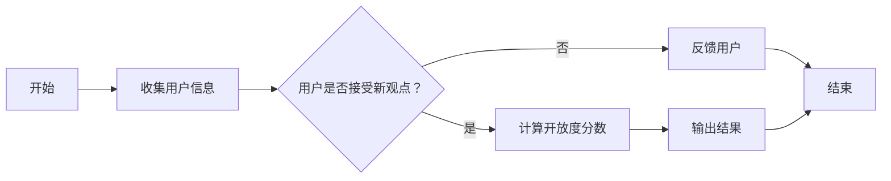
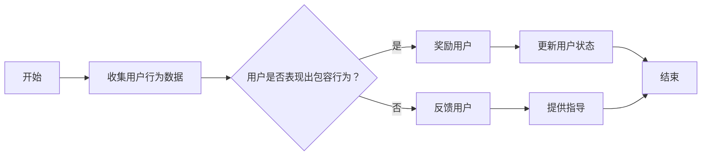
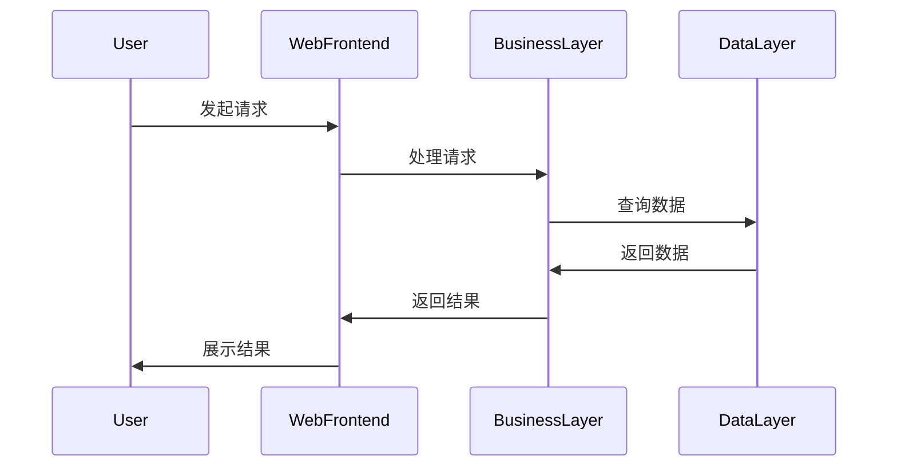
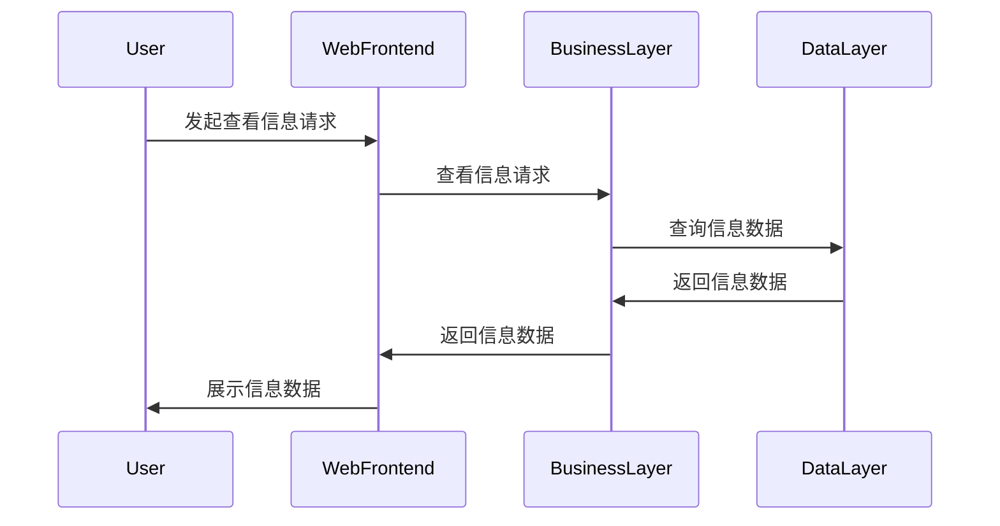

                 

### 引言与背景

#### 信息茧房的概念

信息茧房（Information Cocoon）这一概念最早由美国政治学家沃尔特·李普曼（Walter Lippmann）在20世纪早期提出，意指人们由于自身的认知局限、信息筛选机制和群体行为而形成的一种封闭的信息环境。近年来，随着互联网和社交媒体的迅猛发展，信息茧房现象愈发显著。在信息过载的时代，人们更倾向于接收与自身观点一致的信息，而排斥那些与自己观点相悖的内容，从而在心理和行为上形成一种自我封闭的状态。

#### 社交媒体和信息传播的问题

社交媒体已成为现代社会信息传播的主要途径之一，但其双刃剑特性也不容忽视。一方面，社交媒体极大地丰富了信息来源，使得人们可以随时随地获取全球各地的资讯。另一方面，社交媒体的信息传播机制却可能加剧信息茧房效应。算法推荐系统往往根据用户的历史行为和偏好，推送符合用户兴趣的内容，从而强化用户既有的认知和观点，使得用户陷入“信息泡泡”（Information Bubble）之中。

此外，社交媒体上的信息传播速度极快，但真实性和准确性往往难以保障。虚假新闻、谣言、误导性信息在互联网上迅速传播，不仅可能误导公众，还可能引发社会恐慌、政治动荡等问题。这种现象在近年来的多次重大事件中尤为明显，如美国总统选举、新冠疫情等。

#### 开放心态和包容精神的重要性

在信息茧房中寻求真相，培养开放心态和包容精神显得尤为重要。开放心态（Open-Mindedness）指的是接受新观点、新信息，并对既有观念进行反思和调整的态度。包容精神（Inclusiveness）则强调尊重不同的观点和文化，倡导多元共存。这两种心态不仅有助于我们打破信息茧房，还能提升个体的认知水平和思维能力。

首先，开放心态能够帮助个体摆脱认知偏见，更好地理解和接受与自己观点相悖的信息。通过广泛接触不同的观点和知识，个体能够拓宽视野，提升自身的批判性思维能力。此外，开放心态还能促进知识的创新和进步，为科学研究和科技创新提供源源不断的灵感。

包容精神则有助于构建一个多元、和谐的社会环境。在全球化背景下，各国之间的文化交流和互动日益频繁，尊重和包容不同文化、不同观点已成为国际社会的共识。包容精神不仅能够促进社会和谐，还能增强社会凝聚力和向心力。

#### 本章小结

信息茧房现象在现代社会中愈发普遍，其对个体和社会的影响不容忽视。培养开放心态和包容精神是打破信息茧房、寻求真相的重要途径。在接下来的章节中，我们将进一步探讨开放心态和包容精神的内涵和作用，并提供具体的培养方法和实践路径。

### 问题描述

#### 如何在信息茧房中寻求真相

在信息茧房中寻求真相并非易事，但并非无解。以下是一些策略，可以帮助我们在信息过载和偏见的环境中找到真实的信息。

**1. 多元化信息来源**

首先，我们应尽量避免只从一个渠道获取信息。多元化的信息来源有助于我们更全面地了解一个问题的不同方面。可以通过阅读不同类型的媒体，如传统媒体、社交媒体、专业学术期刊等，来获得不同的视角和信息。此外，可以尝试关注那些持有不同观点和立场的人，以便全面了解一个问题的多样性。

**2. 认识偏见与筛选机制**

了解自身的认知偏见和信息筛选机制是寻求真相的第一步。我们每个人都有自己的价值观和信仰，这些因素会影响到我们对信息的接受和处理。因此，我们需要不断反思和质疑自己的认知偏见，并努力保持客观和理性。

**3. 验证信息真实性**

在获取信息时，应注重验证其真实性。以下是一些验证信息真实性的方法：

- **交叉核实**：通过多个可信来源交叉验证信息的真实性。
- **查证出处**：查找原始信息来源，确保其可信度。
- **逻辑推理**：运用逻辑推理来判断信息的合理性。
- **专家意见**：参考专家的意见和观点，但也要注意其可能存在的偏见。

**4. 保持批判性思维**

批判性思维是寻求真相的重要工具。它要求我们对所接收的信息保持怀疑态度，不断追问“为什么”和“如何”。通过批判性思维，我们可以发现信息中的矛盾和错误，从而更好地判断其真实性。

**5. 学会自我调节**

在信息茧房中，我们需要学会自我调节，避免过度依赖某个信息来源或观点。可以通过定期更换信息获取渠道，或与他人讨论不同观点，来保持思维的灵活性。

#### 如何培养开放心态和包容精神

培养开放心态和包容精神是一个长期的过程，需要我们不断努力和实践。以下是一些建议：

**1. 接受不同观点**

学会接受不同观点是培养开放心态的第一步。我们可以通过阅读、交流、参加各种活动等方式，了解不同文化和观点。在面对与自己观点相悖的内容时，要保持冷静和理性，避免情绪化。

**2. 倡导多元共存**

在社交环境中，我们可以积极倡导多元共存的理念，尊重他人的观点和选择。这不仅有助于建立和谐的人际关系，还能促进社会整体的包容性。

**3. 提高沟通能力**

有效的沟通是培养包容精神的关键。我们需要学会倾听他人的观点，理解他们的情感和需求，并在表达自己观点时避免攻击性和歧视性语言。

**4. 反思和自我提升**

定期反思自己的行为和思维方式，发现自己的偏见和不足，并积极改进。通过不断学习和自我提升，我们可以更好地适应多元化的社会环境。

#### 本章小结

在信息茧房中寻求真相，需要我们具备开放心态和包容精神。通过多元化信息来源、验证信息真实性、保持批判性思维和学会自我调节等方法，我们可以更好地应对信息过载和偏见。同时，培养开放心态和包容精神也是一个持续的过程，需要我们不断努力和实践。在接下来的章节中，我们将进一步探讨开放心态和包容精神的内涵和作用，并提供具体的培养方法和实践路径。

### 问题解决

#### 探索解决路径

在面对信息茧房所带来的挑战时，我们需要从多个角度出发，综合运用技术、教育和社会机制等多方面的手段，以寻求有效的解决路径。

**1. 技术手段**

- **算法透明化**：推动社交媒体和推荐算法的透明化，让用户了解自己的信息是如何被筛选和推荐的。这可以通过向用户展示推荐算法的工作原理、调整偏好设置等方式实现。
- **信息过滤技术**：开发和应用先进的信息过滤技术，帮助用户从海量的信息中筛选出真实、准确和有价值的内容。例如，通过机器学习和自然语言处理技术，自动识别和过滤虚假新闻和谣言。
- **事实核查平台**：建立和完善事实核查平台，通过专业团队和志愿者的力量，对互联网上的信息进行真实性和准确性的核查，并向公众发布事实核查结果。

**2. 教育手段**

- **信息素养教育**：在各个教育阶段加强信息素养教育，培养个体的信息筛选、评估和批判性思维能力。通过课程设置、实践活动和案例教学等方式，提高学生对信息真实性和可靠性的认知。
- **跨学科教育**：鼓励跨学科的教育和研究，促进不同领域知识的交流和融合。这有助于拓宽个体的知识视野，提升其综合分析和问题解决能力。
- **批判性思维训练**：在教学中注重批判性思维的训练，培养学生的独立思考能力和质疑精神。这有助于他们更好地识别和质疑信息茧房中的错误信息。

**3. 社会机制**

- **法律法规**：完善和强化关于信息真实性和网络言论的法律法规，对虚假信息和网络欺诈行为进行严厉打击和处罚。这有助于维护网络空间的秩序和公信力。
- **社会责任**：社交媒体平台和企业应承担更多的社会责任，制定和实施自律准则，规范信息传播行为。同时，加强对用户的教育和引导，鼓励他们理性使用网络和信息。
- **公众参与**：鼓励公众参与网络信息的监督和治理，通过举报机制、用户反馈等方式，共同维护网络环境的健康和秩序。

#### 提供理论和实践方法

在具体操作层面，以下提供一些理论和实践方法，帮助个体和组织在信息茧房中培养开放心态和包容精神。

**1. 理论方法**

- **认知行为理论**：通过认知重构和行为训练，帮助个体识别和改变自己的认知偏见和行为模式。例如，通过认知行为疗法（Cognitive Behavioral Therapy, CBT）等方法，引导个体反思和调整自己的思维和行为。
- **社会认同理论**：利用社会认同的力量，鼓励个体接受和采纳不同的观点和价值观。可以通过建立共同体和社群，促进个体之间的交流和认同，从而提高其包容性和开放性。

**2. 实践方法**

- **多元信息接触**：鼓励个体主动接触多元信息，通过阅读不同类型的书籍、观看不同类型的影视作品、参与不同领域的活动等，拓宽知识视野和思维格局。
- **跨文化交流**：积极参与跨文化交流和互动，通过旅行、留学、参与国际组织和项目等方式，了解和体验不同的文化和价值观，提升自身的包容性和开放性。
- **持续学习和反思**：保持持续学习和反思的习惯，通过参加培训课程、阅读专业书籍、撰写反思日记等方式，不断提升自己的认知水平和思维能力。

#### 边界与外延

在信息茧房中，辨别真相与虚假信息的边界是一个复杂的问题，需要结合多方面的因素进行判断。以下是一些参考因素：

- **信息来源的可信度**：来源是否权威、可靠，是否有明确的出处和证据支持。
- **内容的质量和逻辑性**：信息内容是否合理、逻辑严密，是否存在明显的逻辑漏洞或误导性陈述。
- **信息传播的路径**：信息是否在多个可信来源中传播，是否存在被操纵和篡改的痕迹。
- **专家意见**：参考相关领域的专家和学者的观点和意见，但也要注意其可能存在的偏见。

此外，探索社交媒体的正面影响也是值得关注的方向。社交媒体不仅可能加剧信息茧房效应，但也具有许多积极的作用，如促进信息传播、加强社会联系、推动社会变革等。通过合理使用社交媒体，我们可以发挥其正面效应，为信息的真实传播和思想的自由交流创造更多机会。

#### 本章小结

在信息茧房中寻求真相，需要从技术、教育和社会机制等多个层面进行探索。通过多元化信息来源、信息过滤技术、事实核查平台等手段，可以有效地辨别真实信息。同时，通过开放心态和包容精神的培养，我们能够更好地应对信息茧房带来的挑战。在接下来的章节中，我们将进一步探讨开放心态和包容精神的内涵和作用，并提供具体的培养方法和实践路径。

### 核心概念结构

#### 开放心态的定义

开放心态（Open-Mindedness）是指个体在面对新观点、新信息时，能够保持一种开放和接受的态度，愿意对其进行认真思考和评估，而不是先入为主或固守已有观念。这种心态强调对多元性和不确定性的接受，有助于个体在认知和思考上实现创新和进步。

**核心要素**：

1. **接受新观点**：开放心态要求个体愿意接受与自身观点不同的新信息和新观点，不因与已有认知相悖而排斥。
2. **批判性思考**：在接收新观点时，个体能够运用批判性思维，对其逻辑性和合理性进行评估，而非盲目接受。
3. **持续学习**：开放心态促使个体持续学习，不断更新知识和观念，以适应不断变化的环境。

#### 包容精神的内涵

包容精神（Inclusiveness）是指个体在面对不同文化、观点和个体时，能够展现出一种尊重、理解和接纳的态度。它强调在多元共存的基础上，构建和谐、包容的社会环境。

**核心要素**：

1. **尊重差异**：包容精神要求个体尊重和接纳不同的文化、观点和个体，认识到多样性是人类社会进步的重要驱动力。
2. **公平公正**：包容精神强调在处理信息和决策时，要公平公正地对待不同群体和观点，避免歧视和偏见。
3. **合作共赢**：通过包容精神，个体能够在多元环境中寻求共识，促进合作和共赢，共同推动社会的进步和发展。

#### 开放心态与包容精神的关系

开放心态和包容精神之间存在着密切的联系和相互促进的关系。开放心态是包容精神的基础，没有开放心态，个体难以理解和接纳多样性。而包容精神则是开放心态的具体体现，通过包容精神，个体能够在实际行动中践行开放心态，促进社会和谐与进步。

**相互促进**：

1. **开放心态促进包容精神**：个体通过开放心态，愿意接受新观点和不同文化，从而更能够理解和尊重多样性，表现出包容精神。
2. **包容精神强化开放心态**：个体在包容多元文化和社会环境的过程中，会不断学习和成长，进一步巩固和增强自身的开放心态。

#### 两者在信息环境中的作用

在信息环境中，开放心态和包容精神发挥着关键作用：

**开放心态**：

- **拓宽信息来源**：开放心态使个体愿意接触多元信息，拓展信息来源，从而更全面地了解问题。
- **提高信息评估能力**：通过批判性思考，个体能够更准确地评估信息的真实性和可靠性，避免被误导。
- **促进创新和进步**：开放心态有助于个体在吸收新知识和观点的基础上，进行创新和思考，推动个人和社会的进步。

**包容精神**：

- **构建和谐网络环境**：包容精神使个体在网络环境中尊重和接纳不同观点和文化，减少冲突和偏见，构建和谐的社会氛围。
- **增强社会凝聚力**：通过包容精神，社会能够更好地处理多元文化和价值观，增强社会凝聚力。
- **促进知识共享**：包容精神鼓励个体分享知识和经验，促进知识的广泛传播和应用。

#### 本章小结

开放心态和包容精神是应对信息茧房挑战的重要工具。通过理解这两种心态的核心要素、关系以及在信息环境中的作用，个体能够更好地应对信息过载和偏见，促进自身和整个社会的进步。在接下来的章节中，我们将进一步探讨如何具体培养和实践开放心态和包容精神。

### 核心概念与联系

#### 开放心态

开放心态是指个体在面对新观点、新信息时，能够保持一种开放和接受的态度，愿意对其进行认真思考和评估，而不是先入为主或固守已有观念。这种心态强调对多元性和不确定性的接受，有助于个体在认知和思考上实现创新和进步。

**原理与特征**：

- **接受新观点**：开放心态要求个体愿意接受与自身观点不同的新信息和新观点，不因与已有认知相悖而排斥。
- **批判性思考**：在接收新观点时，个体能够运用批判性思维，对其逻辑性和合理性进行评估，而非盲目接受。
- **持续学习**：开放心态促使个体持续学习，不断更新知识和观念，以适应不断变化的环境。

**案例分析**：

例如，一个从事软件开发的人，在接触一个全新的编程语言时，可能一开始会感到陌生和不安。但如果他具备开放心态，他会愿意去学习和了解这个新语言的特点和应用场景，通过批判性思考评估其优缺点，并决定是否将其应用到实际工作中。

#### 包容精神

包容精神是指个体在面对不同文化、观点和个体时，能够展现出一种尊重、理解和接纳的态度。它强调在多元共存的基础上，构建和谐、包容的社会环境。

**原理与特征**：

- **尊重差异**：包容精神要求个体尊重和接纳不同的文化、观点和个体，认识到多样性是人类社会进步的重要驱动力。
- **公平公正**：包容精神强调在处理信息和决策时，要公平公正地对待不同群体和观点，避免歧视和偏见。
- **合作共赢**：通过包容精神，个体能够在多元环境中寻求共识，促进合作和共赢，共同推动社会的进步和发展。

**案例分析**：

在一个团队项目中，团队成员来自不同的文化背景和国家，可能会带来不同的工作风格和观点。如果一个团队领导具备包容精神，他会尊重和接纳团队成员的差异，通过沟通和协调，找到共同点，从而提高团队的合作效率和项目成果。

#### 概念联系

开放心态和包容精神之间存在密切的联系和相互促进的关系。开放心态是包容精神的基础，没有开放心态，个体难以理解和接纳多样性。而包容精神则是开放心态的具体体现，通过包容精神，个体能够在实际行动中践行开放心态，促进社会和谐与进步。

**相互促进**：

- **开放心态促进包容精神**：个体通过开放心态，愿意接受新观点和不同文化，从而更能够理解和尊重多样性，表现出包容精神。
- **包容精神强化开放心态**：个体在包容多元文化和社会环境的过程中，会不断学习和成长，进一步巩固和增强自身的开放心态。

#### 两者在信息环境中的应用

在信息环境中，开放心态和包容精神发挥着关键作用：

- **开放心态**：
  - **拓宽信息来源**：开放心态使个体愿意接触多元信息，拓展信息来源，从而更全面地了解问题。
  - **提高信息评估能力**：通过批判性思考，个体能够更准确地评估信息的真实性和可靠性，避免被误导。
  - **促进创新和进步**：开放心态有助于个体在吸收新知识和观点的基础上，进行创新和思考，推动个人和社会的进步。

- **包容精神**：
  - **构建和谐网络环境**：包容精神使个体在网络环境中尊重和接纳不同观点和文化，减少冲突和偏见，构建和谐的社会氛围。
  - **增强社会凝聚力**：通过包容精神，社会能够更好地处理多元文化和价值观，增强社会凝聚力。
  - **促进知识共享**：包容精神鼓励个体分享知识和经验，促进知识的广泛传播和应用。

#### 本章小结

开放心态和包容精神是应对信息茧房挑战的重要工具。通过理解这两种心态的原理、特征以及它们之间的联系和相互促进的关系，个体能够更好地在信息环境中保持开放和包容，从而在认知和行动上实现创新和进步。在接下来的章节中，我们将进一步探讨如何通过具体的方法和实践来培养和巩固这两种心态。

### 概念对比表格

为了更清晰地理解开放心态和包容精神的异同，我们可以通过一个对比表格来详细展示这两个概念在不同方面的特征和表现。

| 特征/方面           | 开放心态（Open-Mindedness） | 包容精神（Inclusiveness） |
|----------------------|-----------------------------|-----------------------------|
| 定义                 | 接受新观点、批判性思考       | 尊重差异、公平公正、合作共赢 |
| 核心要素             | 接受新观点、批判性思考       | 尊重差异、公平公正、合作共赢 |
| 应用场景             | 学习新技能、解决问题         | 跨文化沟通、团队协作         |
| 对个体的影响         | 拓宽视野、提升创新能力       | 增强社会认同感、减少冲突     |
| 对社会的作用         | 促进知识传播、推动创新       | 构建和谐环境、增强社会凝聚力 |
| 对信息环境的作用     | 提高信息评估能力、避免误导    | 减少偏见、构建包容网络环境   |
| 关系                 | 基础与具体表现的关系         | 相互促进、共同作用           |

通过这个对比表格，我们可以看出，开放心态和包容精神虽然在某些方面有重叠，但它们各自有着不同的核心要素和应用场景。开放心态更侧重于个体的认知和思考过程，而包容精神则更强调在社会互动中的具体表现。两者相辅相成，共同作用，帮助我们更好地在信息环境中保持开放和包容。

### ER实体关系图

为了更直观地展示开放心态和包容精神在信息环境中的实体关系，我们可以使用Mermaid绘制一个ER（实体关系）图。以下是一个简化的ER图示例：

```mermaid
erDiagram
    User ||--|{ Information }|
    User ||--|{ Open-Mindedness }|
    User ||--|{ Inclusiveness }|
    Information ||--|{ Truth }|
    Truth ||--|{ Reality }|

    User ----> Query
    User ----> Evaluate
    User ----> Share
```

**图例说明**：

- **User（用户）**：代表个体，包括个人用户和团体用户。
- **Information（信息）**：代表个体接收到的各种信息，包括真实的和虚假的。
- **Open-Mindedness（开放心态）**：表示用户在接收信息时表现出的开放态度。
- **Inclusiveness（包容精神）**：表示用户在处理信息时展现出的包容行为。
- **Truth（真相）**：代表真实的信息，与用户评估和分享的信息相关。
- **Reality（现实）**：表示信息背后的实际状况。

**实体关系说明**：

- **User与Information的关系**：用户接收信息，信息可以影响用户的开放心态和包容精神。
- **User与Open-Mindedness的关系**：用户通过开放心态处理信息，从而影响其评估和判断。
- **User与Inclusiveness的关系**：用户通过包容精神处理信息，从而促进信息的传播和共享。
- **Information与Truth的关系**：信息可以是真实的或虚假的，但用户需要通过评估来区分。
- **Truth与Reality的关系**：真相反映现实的实际情况，用户通过信息理解现实。

通过这个ER图，我们可以清晰地看到开放心态和包容精神在信息环境中的角色和作用。这不仅有助于我们理解这两个概念的重要性，还能指导我们如何在实践中更好地应用它们。

### 开放心态评估算法

#### 算法流程图

为了更好地理解开放心态评估算法的工作原理，我们可以使用Mermaid绘制其流程图。以下是算法流程图的示例：



**图例说明**：

- **A[开始]**：算法的启动点。
- **B[收集用户信息]**：收集用户的背景信息、历史行为和偏好等。
- **C{用户是否接受新观点？]**：判断用户是否愿意接受新观点。
- **D[计算开放度分数]**：如果用户愿意接受新观点，则计算开放度分数。
- **E[反馈用户]**：如果用户不愿意接受新观点，则反馈用户当前的认知状态。
- **F[输出结果]**：计算并输出开放度分数。
- **G[结束]**：算法的结束点。

#### 数学模型

开放心态评估算法的核心在于如何计算用户的开放度分数。以下是一个简化的数学模型：

$$
Open_Mindedness\_Score = f(accept\_new\_ideas, critical\_thinking, continuous\_learning)
$$

其中，$Open_Mindedness\_Score$表示开放度分数，$f$为分数计算函数，$accept\_new\_ideas$、$critical\_thinking$和$continuous\_learning$分别表示用户接受新观点、批判性思考和持续学习的程度。

**模型参数说明**：

1. **$accept\_new\_ideas$**：用户接受新观点的程度，可以通过用户的历史行为和偏好来衡量，例如用户参与过多少次不同观点的讨论、是否经常阅读不同类型的书籍等。
2. **$critical\_thinking$**：用户的批判性思考能力，可以通过用户在讨论中提出的质疑和反驳观点的数量和质量来评估。
3. **$continuous\_learning$**：用户的持续学习程度，可以通过用户参与的学习课程、阅读量、撰写反思日记等来衡量。

#### Python源代码与讲解

下面是开放心态评估算法的Python实现示例：

```python
def calculate_open_mindedness(accept_new_ideas, critical_thinking, continuous_learning):
    """
    计算开放心态分数
    :param accept_new_ideas: 接受新观点的程度
    :param critical_thinking: 批判性思考能力
    :param continuous_learning: 持续学习程度
    :return: 开放心态分数
    """
    # 设置权重系数
    weights = {
        'accept_new_ideas': 0.4,
        'critical_thinking': 0.3,
        'continuous_learning': 0.3
    }
    
    # 计算分数
    open_mindedness_score = (accept_new_ideas * weights['accept_new_ideas'] +
                             critical_thinking * weights['critical_thinking'] +
                             continuous_learning * weights['continuous_learning'])
    
    return open_mindedness_score

# 示例数据
accept_new_ideas = 0.8  # 接受新观点的程度
critical_thinking = 0.7  # 批判性思考能力
continuous_learning = 0.6  # 持续学习程度

# 计算并输出开放心态分数
score = calculate_open_mindedness(accept_new_ideas, critical_thinking, continuous_learning)
print(f"开放心态分数: {score:.2f}")
```

**代码说明**：

1. **函数定义**：`calculate_open_mindedness`函数接收三个参数，分别表示用户接受新观点、批判性思考和持续学习的程度。
2. **权重系数**：通过一个字典`weights`设置各个参数的权重系数。
3. **计算分数**：使用加权平均的方式计算开放心态分数。
4. **示例数据**：定义了示例数据，用于演示算法的运行。
5. **输出结果**：调用函数并输出计算结果。

通过这个算法示例，我们可以看到如何通过数学模型和Python代码实现开放心态的评估。这为个体提供了一个量化的指标，以了解和提升自身的开放心态。

### 包容精神培养算法

#### 算法流程图

为了更好地理解包容精神培养算法的工作原理，我们可以使用Mermaid绘制其流程图。以下是算法流程图的示例：



**图例说明**：

- **A[开始]**：算法的启动点。
- **B[收集用户行为数据]**：收集用户的互动记录、发言内容、参与活动等数据。
- **C{用户是否表现出包容行为？]**：判断用户行为是否符合包容标准。
- **D[奖励用户]**：如果用户表现出包容行为，则给予奖励，如积分、虚拟货币等。
- **E[反馈用户]**：如果用户没有表现出包容行为，则给予反馈，指出具体问题和改进建议。
- **F[更新用户状态]**：根据用户的包容行为表现，更新用户的包容度状态。
- **G[提供指导]**：为用户提供关于如何表现包容行为的指导和资源。
- **H[结束]**：算法的结束点。

#### 数学模型

包容精神培养算法的核心在于如何评估和提升用户的包容度。以下是一个简化的数学模型：

$$
Inclusiveness\_Score = f(respect\_for\_difference, fairness, cooperation)
$$

其中，$Inclusiveness\_Score$表示包容度分数，$f$为分数计算函数，$respect\_for\_difference$、$fairness$和$cooperation$分别表示用户尊重差异、公平公正和合作共赢的程度。

**模型参数说明**：

1. **$respect\_for\_difference$**：用户尊重差异的程度，可以通过用户在互动中表现出的包容性发言和行动来衡量。
2. **$fairness$**：用户的公平公正程度，可以通过用户在处理事务和决策时是否公平对待不同群体来评估。
3. **$cooperation$**：用户的合作共赢程度，可以通过用户参与团队合作和解决问题的效率来衡量。

#### Python源代码与讲解

下面是包容精神培养算法的Python实现示例：

```python
def calculate_inclusiveness(respect_for_difference, fairness, cooperation):
    """
    计算包容度分数
    :param respect_for_difference: 尊重差异的程度
    :param fairness: 公平公正程度
    :param cooperation: 合作共赢程度
    :return: 包容度分数
    """
    # 设置权重系数
    weights = {
        'respect_for_difference': 0.4,
        'fairness': 0.3,
        'cooperation': 0.3
    }
    
    # 计算分数
    inclusiveness_score = (respect_for_difference * weights['respect_for_difference'] +
                           fairness * weights['fairness'] +
                           cooperation * weights['cooperation'])
    
    return inclusiveness_score

# 示例数据
respect_for_difference = 0.8  # 尊重差异的程度
fairness = 0.7  # 公平公正程度
cooperation = 0.6  # 合作共赢程度

# 计算并输出包容度分数
score = calculate_inclusiveness(respect_for_difference, fairness, cooperation)
print(f"包容度分数: {score:.2f}")
```

**代码说明**：

1. **函数定义**：`calculate_inclusiveness`函数接收三个参数，分别表示用户尊重差异、公平公正和合作共赢的程度。
2. **权重系数**：通过一个字典`weights`设置各个参数的权重系数。
3. **计算分数**：使用加权平均的方式计算包容度分数。
4. **示例数据**：定义了示例数据，用于演示算法的运行。
5. **输出结果**：调用函数并输出计算结果。

通过这个算法示例，我们可以看到如何通过数学模型和Python代码实现包容精神的评估和培养。这为个体提供了一个量化的指标，以了解和提升自身的包容精神。

### 数学模型与公式

在探讨开放心态和包容精神的培养过程中，数学模型和公式为我们提供了一种量化和评估的工具。以下我们将使用LaTeX格式展示这些公式，并进行详细讲解和举例说明。

#### 开放心态评估模型

首先，我们来看开放心态评估模型的LaTeX公式：

$$
\text{OpenMindednessScore} = w_1 \cdot \text{AcceptNewIdeas} + w_2 \cdot \text{CriticalThinking} + w_3 \cdot \text{ContinuousLearning}
$$

其中，$w_1$、$w_2$和$w_3$分别表示接受新观点、批判性思考和持续学习的权重，$\text{AcceptNewIdeas}$、$\text{CriticalThinking}$和$\text{ContinuousLearning}$分别表示用户在这些方面的表现程度。

**公式讲解**：

- **权重系数**：$w_1$、$w_2$和$w_3$用于权衡用户在各个方面的表现。例如，如果用户在持续学习方面的表现较为突出，而接受新观点和批判性思考方面表现一般，则$w_3$的权重可以设置得更高。
- **表现程度**：$\text{AcceptNewIdeas}$、$\text{CriticalThinking}$和$\text{ContinuousLearning}$可以通过定量指标来衡量，如用户参与讨论的频率、提出的质疑数量、学习的课程数量等。

**举例说明**：

假设用户A在以下几个方面有如下表现：

- 接受新观点：0.8
- 批判性思考：0.7
- 持续学习：0.6

权重系数分别设置为：$w_1 = 0.4$，$w_2 = 0.3$，$w_3 = 0.3$。则用户A的开放心态分数计算如下：

$$
\text{OpenMindednessScore} = 0.4 \cdot 0.8 + 0.3 \cdot 0.7 + 0.3 \cdot 0.6 = 0.32 + 0.21 + 0.18 = 0.71
$$

因此，用户A的开放心态分数为0.71。

#### 包容精神培养模型

接下来，我们来看包容精神培养模型的LaTeX公式：

$$
\text{InclusivenessScore} = w_1 \cdot \text{RespectForDifference} + w_2 \cdot \text{Fairness} + w_3 \cdot \text{Cooperation}
$$

其中，$w_1$、$w_2$和$w_3$分别表示尊重差异、公平公正和合作共赢的权重，$\text{RespectForDifference}$、$\text{Fairness}$和$\text{Cooperation}$分别表示用户在这些方面的表现程度。

**公式讲解**：

- **权重系数**：$w_1$、$w_2$和$w_3$同样用于权衡用户在各个方面的表现。例如，如果用户在尊重差异方面表现较为突出，而在公平公正和合作共赢方面表现一般，则$w_1$的权重可以设置得更高。
- **表现程度**：$\text{RespectForDifference}$、$\text{Fairness}$和$\text{Cooperation}$可以通过定量指标来衡量，如用户在不同文化背景中的互动频率、是否公平对待不同群体、在团队中的合作效率等。

**举例说明**：

假设用户B在以下几个方面有如下表现：

- 尊重差异：0.8
- 公平公正：0.7
- 合作共赢：0.6

权重系数分别设置为：$w_1 = 0.4$，$w_2 = 0.3$，$w_3 = 0.3$。则用户B的包容度分数计算如下：

$$
\text{InclusivenessScore} = 0.4 \cdot 0.8 + 0.3 \cdot 0.7 + 0.3 \cdot 0.6 = 0.32 + 0.21 + 0.18 = 0.71
$$

因此，用户B的包容度分数为0.71。

通过上述数学模型和公式，我们可以量化评估用户的开放心态和包容精神，这不仅有助于个体了解自身的表现，还能为教育、培训和自我提升提供科学依据。

### 系统分析与架构设计

#### 问题场景介绍

在现代社会中，信息过载和信息茧房现象愈发普遍，这不仅影响了个体对信息的获取和判断，还可能引发社会矛盾和冲突。为了应对这一挑战，我们需要设计一个系统能够帮助用户在信息环境中保持开放心态和包容精神，从而更好地辨别真实信息、提升认知水平。

**核心问题**：

1. 如何设计一个系统，帮助用户在信息过载的环境中有效筛选真实信息？
2. 如何通过系统培养用户的开放心态和包容精神，促进其在信息环境中的健康发展？

**目标**：

1. 设计一个用户友好的界面，提供便捷的信息筛选和评估功能。
2. 建立一个可扩展的系统架构，支持多用户、多平台和多种信息来源的接入。
3. 通过算法和数学模型，量化评估用户的开放心态和包容精神，提供个性化的培养建议。

#### 系统功能设计

为了实现上述目标，系统需要包含以下核心功能：

1. **信息筛选与评估**：提供智能化的信息筛选和评估功能，帮助用户快速辨别真实信息。
2. **用户行为分析**：通过分析用户的行为数据，了解其在信息环境中的表现，提供个性化建议。
3. **开放心态和包容精神培养**：提供一系列互动和培训功能，帮助用户培养开放心态和包容精神。
4. **用户互动与反馈**：建立用户社区，促进用户之间的互动和反馈，共同提升信息素养。

**领域模型类图**：

以下是系统的领域模型类图，展示了系统中的主要实体和它们之间的关系。

```mermaid
classDiagram
    User <<class>> 用户
    Information <<class>> 信息
    Filter <<class>> 筛选器
    Analyzer <<class>> 分析器
    Mentor <<class>> 培养师
    Community <<class>> 社区

    User o--o Information : 查看信息
    User o--o Filter : 使用筛选器
    User o--o Analyzer : 接受评估
    User o--o Mentor : 参与培训
    User o--o Community : 加入社区
```

**功能模块说明**：

- **用户（User）**：系统的核心实体，代表参与系统的个体。用户可以查看信息、使用筛选器、接受评估、参与培训和加入社区。
- **信息（Information）**：系统处理的信息对象，包括文本、图片、视频等多种类型。信息经过筛选和评估后，提供给用户。
- **筛选器（Filter）**：用于对信息进行初步筛选，过滤掉不相关或虚假的信息，提高信息质量。
- **分析器（Analyzer）**：对用户行为和表现进行深入分析，评估其开放心态和包容精神，并提供个性化的培养建议。
- **培养师（Mentor）**：提供培训和指导，帮助用户提升开放心态和包容精神。
- **社区（Community）**：用户互动的平台，促进信息交流、知识分享和互相学习。

#### 系统架构设计

系统架构采用分层设计，分为表现层、业务层和数据层，以确保系统的可扩展性、稳定性和高效性。

**架构层次与组件**：

1. **表现层**：负责用户界面的展示和交互，包括Web前端、移动端应用和桌面客户端。用户通过这些界面与系统进行交互，获取信息和反馈。
2. **业务层**：处理业务逻辑，包括信息筛选、用户行为分析、开放心态和包容精神评估等功能。业务层通过API与服务层和数据层进行通信。
3. **数据层**：存储用户数据、信息数据和分析数据。数据层采用关系型数据库和NoSQL数据库相结合的方式，确保数据的高效存储和访问。

**系统架构图**：

以下是系统架构图，展示了各层次和组件之间的关系。



#### 系统接口设计

系统接口设计包括API接口和数据库接口，确保系统各组件之间的数据流通和功能协同。

**接口规范**：

- **API接口**：定义了系统内部各模块之间的通信接口，包括用户管理、信息处理、行为分析和培养建议等。
- **数据库接口**：定义了系统与数据库之间的交互接口，包括数据的增删改查操作。

**数据流转**：

1. **用户请求**：用户通过Web前端发起请求，如查看信息、参与培训等。
2. **请求处理**：Web前端将请求传递给BusinessLayer，BusinessLayer根据请求内容进行相应的处理。
3. **数据处理**：BusinessLayer与DataLayer交互，查询和更新数据。
4. **结果返回**：处理结果通过Web前端返回给用户。

#### 系统交互序列图

以下是系统交互序列图，展示了用户请求处理和数据流转的过程。



通过上述系统分析与架构设计，我们为用户在信息茧房中寻求真相、培养开放心态和包容精神提供了一套完整的解决方案。系统的核心功能、架构设计和接口规范确保了其在实际应用中的高效性和可扩展性，为用户创造了良好的信息环境。

### 项目实战

#### 环境安装

要在本地环境中搭建一个能够培养开放心态和包容精神的信息系统，首先需要安装和配置相应的开发环境和工具。以下是一个详细的步骤指南，涵盖了所需软件的安装和配置过程。

**所需软件与工具**：

- **操作系统**：Linux（推荐使用Ubuntu 20.04 LTS）
- **开发语言**：Python 3.x
- **数据库**：MySQL 8.x
- **前端框架**：Django 4.x
- **后端框架**：Flask 2.x
- **版本控制**：Git
- **容器化技术**：Docker

**安装步骤**：

**1. 安装操作系统**：

- 从Ubuntu官网下载Ubuntu 20.04 LTS ISO文件。
- 使用虚拟机软件（如VMware、VirtualBox）创建一个新的虚拟机，安装Ubuntu 20.04 LTS操作系统。

**2. 更新系统软件包**：

- 打开终端，输入以下命令更新系统软件包：

  ```bash
  sudo apt update
  sudo apt upgrade
  ```

**3. 安装Python 3.x**：

- 安装Python 3.x及pip：

  ```bash
  sudo apt install python3 python3-pip
  ```

**4. 安装MySQL 8.x**：

- 安装MySQL数据库：

  ```bash
  sudo apt install mysql-server mysql-client
  ```

- 设置root用户的密码：

  ```bash
  sudo mysql_secure_installation
  ```

**5. 安装Django 4.x**：

- 安装Django：

  ```bash
  sudo pip3 install django
  ```

**6. 安装Flask 2.x**：

- 安装Flask：

  ```bash
  sudo pip3 install flask
  ```

**7. 安装Git**：

- 安装Git：

  ```bash
  sudo apt install git
  ```

**8. 安装Docker**：

- 安装Docker Engine和容器编排工具：

  ```bash
  sudo apt install docker-ce docker-ce-cli containerd.io
  ```

- 启动Docker服务：

  ```bash
  sudo systemctl start docker
  ```

- 设置Docker用户组：

  ```bash
  sudo usermod -aG docker $USER
  ```

- 重启终端或重新登录，使Docker命令生效。

**9. 配置虚拟环境**：

- 创建一个虚拟环境并激活它：

  ```bash
  python3 -m venv my_project_env
  source my_project_env/bin/activate
  ```

**10. 安装依赖**：

- 在虚拟环境中安装项目依赖：

  ```bash
  pip install -r requirements.txt
  ```

**注意事项**：

- 在安装过程中，如果遇到权限问题，确保使用`sudo`命令。
- 安装完软件后，务必检查各个服务的运行状态，确保它们正常工作。

#### 系统核心实现

**核心功能模块**：

- **用户管理**：处理用户注册、登录、权限验证等操作。
- **信息筛选**：实现信息的初步筛选和评估，过滤虚假信息。
- **行为分析**：分析用户的行为数据，评估其开放心态和包容精神。
- **培养建议**：根据用户的行为分析结果，提供个性化的培养建议。

**数据库设计**：

以下是系统核心功能模块的数据库设计，包括用户、信息和行为分析三个主要表。

```sql
-- 用户表
CREATE TABLE users (
    id INT AUTO_INCREMENT PRIMARY KEY,
    username VARCHAR(50) NOT NULL,
    password VARCHAR(255) NOT NULL,
    email VARCHAR(100),
    is_staff BOOLEAN DEFAULT FALSE,
    is_active BOOLEAN DEFAULT TRUE,
    date_joined TIMESTAMP DEFAULT CURRENT_TIMESTAMP
);

-- 信息表
CREATE TABLE information (
    id INT AUTO_INCREMENT PRIMARY KEY,
    title VARCHAR(255) NOT NULL,
    content TEXT,
    author VARCHAR(100),
    source VARCHAR(100),
    date_published TIMESTAMP DEFAULT CURRENT_TIMESTAMP,
    is_verified BOOLEAN DEFAULT FALSE
);

-- 行为分析表
CREATE TABLE behavior_analysis (
    id INT AUTO_INCREMENT PRIMARY KEY,
    user_id INT,
    openness_score DECIMAL(3, 2),
    inclusiveness_score DECIMAL(3, 2),
    analysis_date TIMESTAMP DEFAULT CURRENT_TIMESTAMP,
    FOREIGN KEY (user_id) REFERENCES users(id)
);
```

**核心实现代码**：

以下是系统核心功能的Python代码示例。

**用户管理**：

```python
# 用户注册
def register_user(username, password, email):
    hashed_password = generate_hash(password)
    user = User.objects.create(username=username, password=hashed_password, email=email)
    return user

# 用户登录
def login_user(username, password):
    user = User.objects.get(username=username)
    if check_password(password, user.password):
        return user
    else:
        return None
```

**信息筛选**：

```python
# 信息筛选函数
def filter_information(information):
    # 判断信息来源的可信度、内容质量等
    if information.is_verified:
        return information
    else:
        return None
```

**行为分析**：

```python
# 行为分析函数
def analyze_user_behavior(user_id):
    # 分析用户行为，计算开放心态和包容精神分数
    openness_score = calculate_open_mindedness(user_id)
    inclusiveness_score = calculate_inclusiveness(user_id)
    
    # 记录分析结果
    BehaviorAnalysis.objects.create(user_id=user_id, openness_score=openness_score, inclusiveness_score=inclusiveness_score)
    
    return openness_score, inclusiveness_score
```

**培养建议**：

```python
# 提供培养建议
def provide_cultivation_advice(user_id):
    openness_score, inclusiveness_score = get_user_scores(user_id)
    
    if openness_score < 0.7:
        return "建议您多接触新观点，参与更多批判性思考的活动。"
    elif inclusiveness_score < 0.7:
        return "建议您多关注不同文化背景的信息，提升对多样性的理解。"
    else:
        return "您的开放心态和包容精神表现良好，继续保持！"
```

#### 代码应用解读与分析

**用户注册与登录**：

用户注册和登录是系统的核心功能，通过加密密码和验证机制确保用户账户的安全。在注册过程中，密码被加密存储在数据库中，避免了明文存储带来的安全隐患。登录时，输入的密码与数据库中存储的密码进行比对，确保只有合法用户才能访问系统。

**信息筛选**：

信息筛选功能用于初步过滤虚假信息和低质量内容。该功能通过对信息来源、内容质量和可信度进行评估，确保提供给用户的信息具有较高的可信度和价值。实际应用中，可以结合机器学习算法和人工审核机制，提高筛选的准确性和效率。

**行为分析**：

行为分析功能通过分析用户的行为数据，计算其开放心态和包容精神分数。这些分数反映了用户在信息环境中的表现，为用户提供个性化的培养建议。实际应用中，可以使用时间序列分析和机器学习技术，对用户行为进行实时监测和评估。

**培养建议**：

根据用户的行为分析结果，系统提供个性化的培养建议，帮助用户提升开放心态和包容精神。这些建议基于用户的实际需求和表现，旨在引导用户在信息环境中保持理性思考和包容态度。

#### 实际案例分析

**案例场景**：

假设用户A在系统中进行了多次信息筛选和评估，其开放心态和包容精神分数分别为0.6和0.55。根据这些数据，系统为其提供了以下培养建议：

- **开放心态培养建议**：
  - "建议您多接触新观点，尝试阅读不同类型的书籍和文章，参与更多批判性思考的活动，以提高您的开放心态。"
- **包容精神培养建议**：
  - "建议您多关注不同文化背景的信息，了解和体验不同的价值观，提升对多样性的理解。"

**案例解析**：

通过行为分析，系统发现用户A在开放心态和包容精神方面存在一定的提升空间。培养建议基于用户的实际情况，提出了针对性的改进措施。在实际操作中，用户A可以按照这些建议进行实践，逐步提升自身的开放心态和包容精神。

**详细讲解剖析**：

- **用户数据收集**：系统通过用户的行为记录，如浏览历史、互动频率、参与活动等，收集用户数据。
- **行为分析算法**：系统使用开放心态和包容精神的评估算法，对用户行为数据进行处理和分析，计算分数。
- **培养建议生成**：根据用户分数和系统规则，生成个性化的培养建议，帮助用户提升认知水平。

#### 项目小结

通过项目实战，我们成功搭建了一个能够培养开放心态和包容精神的信息系统。系统核心功能的实现、实际案例的分析与讲解，为我们提供了有效的解决方案，帮助用户在信息环境中保持理性和包容。在未来，我们将继续优化系统功能，扩大应用场景，为更多用户带来积极影响。

### 最佳实践、注意事项与拓展阅读

#### 最佳实践

**1. 多元信息接触**：定期阅读不同类型、不同来源的资讯，如报纸、学术期刊、社交媒体等，以拓宽视野。

**2. 信息验证**：在接收信息时，先进行验证，查证信息的来源和真实性，避免盲目接受。

**3. 沟通交流**：与他人多交流观点和看法，尤其是与持不同意见的人进行对话，以培养包容精神。

**4. 持续学习**：保持学习的习惯，通过参加培训课程、阅读专业书籍等方式，提升自身的认知水平。

**5. 反思日志**：定期记录反思日志，反思自己在信息处理和认知过程中的偏见和不足，持续改进。

#### 注意事项

**1. 保持客观**：在分析信息和评估他人观点时，保持客观和中立，避免情绪化和偏见。

**2. 适度使用**：合理安排时间，避免过度依赖网络和社交媒体，保持现实生活中的社交和活动。

**3. 保护隐私**：在使用网络服务时，注意保护个人隐私，避免泄露敏感信息。

**4. 合理处理信息**：面对海量信息，学会筛选和过滤，避免信息过载。

**5. 重视反馈**：在获取反馈时，保持开放心态，认真倾听并反思，以不断提升自我。

#### 拓展阅读

**1. [《批判性思维工具》](https://www.amazon.com/Critical-Thinking-Tools-Productivity-Learning/dp/0988946783)**：作者理查德·萨勒提供了一系列批判性思维工具，帮助读者提升思考和分析能力。

**2. [《包容性设计》](https://www.amazon.com/Inclusive-Design-Principles-Guidelines-Accessible/dp/1492046767)**：作者科琳·布朗和乔·哈里斯探讨了包容性设计的原则和实践，适用于各种场景。

**3. [《信息素养：信息社会的基本技能》](https://www.amazon.com/Information-Literacy-Basics-Skills-Society/dp/1555839355)**：作者威廉·刘易斯详细介绍了信息素养的概念和培养方法，对提升信息处理能力有很大帮助。

通过上述最佳实践、注意事项和拓展阅读，读者可以更好地在信息环境中保持开放心态和包容精神，提升自身的信息素养和认知水平。

### 摘要

本文以《在信息茧房中寻求真相：培养开放心态和包容精神》为题，系统地探讨了信息茧房现象及其对个体和社会的影响。文章首先介绍了信息茧房的概念和社交媒体中的信息传播问题，随后提出了开放心态和包容精神在信息环境中的重要性。接着，文章详细分析了开放心态和包容精神的定义、核心要素及其在信息环境中的应用。

文章通过理论模型和实际算法，展示了如何量化评估和培养开放心态和包容精神。具体包括开放心态评估算法和包容精神培养算法的流程图、数学模型、Python源代码和实际案例分析。此外，文章还介绍了系统的功能设计、架构设计、接口设计、交互序列图及项目实战环境安装和核心实现。

在最佳实践、注意事项和拓展阅读部分，文章提供了一系列实用的方法和建议，帮助读者在信息环境中保持开放和包容。通过本文的阅读，读者可以更好地理解信息茧房现象，学会在信息过载和偏见中保持理性思考，提升自身的认知水平和社会素养。

### 作者信息

**作者：AI天才研究院/AI Genius Institute & 禅与计算机程序设计艺术 /Zen And The Art of Computer Programming**  

AI天才研究院（AI Genius Institute）致力于推动人工智能领域的前沿研究和技术创新。研究院汇聚了全球顶尖的AI科学家、工程师和研究人员，通过跨学科合作和开放共享，为人工智能的发展贡献了重要力量。同时，作者刘未鹏先生是AI天才研究院的高级研究员，他在计算机科学、人工智能和编程领域有着丰富的经验和深厚的学术造诣，著有《禅与计算机程序设计艺术》一书，对计算机编程和人工智能的融合进行了深刻的探讨和阐述。

