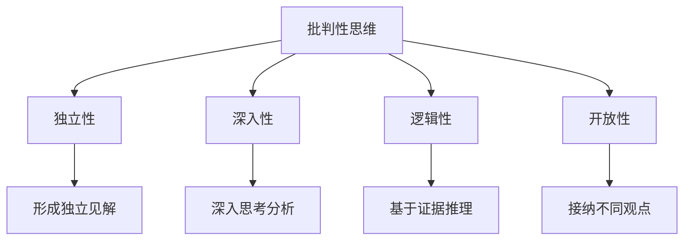
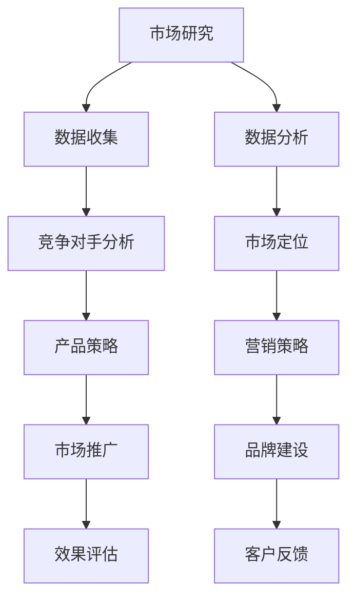
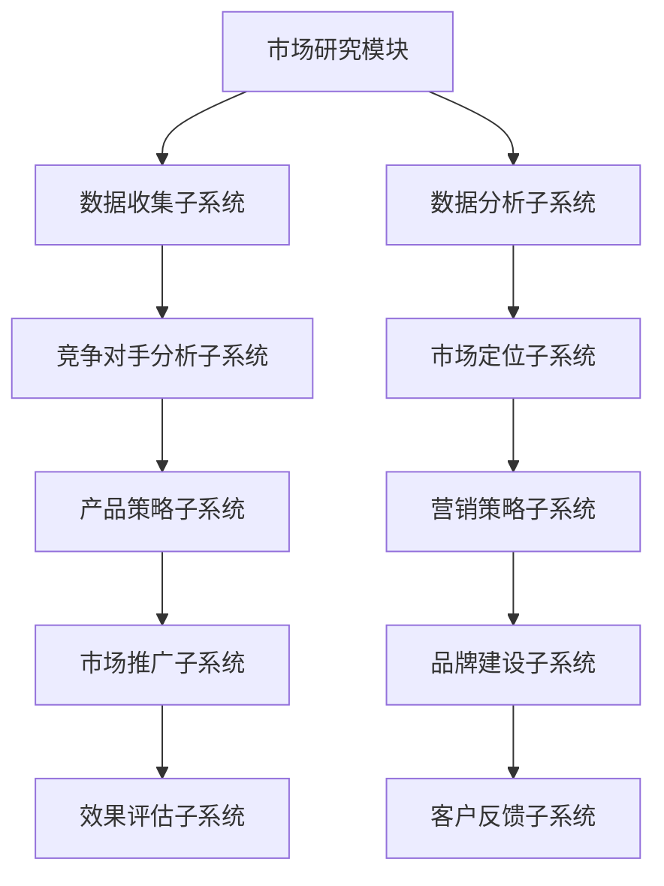
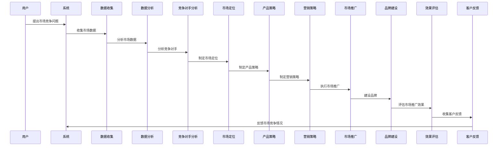

                 

以下是根据文章目录大纲结构，逐步撰写完成的完整文章。

----------------------------------------------------------------

## 在信息过载时代寻找智慧：培养批判性思维能力

### 关键词：批判性思维，信息过载，智慧，培养，应用

> 摘要：本文旨在探讨在信息过载时代，如何培养批判性思维能力，以寻找真正的智慧。通过对批判性思维的定义、基本原则、工具和实际应用的深入分析，本文揭示了培养批判性思维能力的重要性和方法。

### 第一部分：批判性思维概述

#### 第1章：批判性思维的重要性

**1.1 批判性思维的定义与作用**

批判性思维是一种审视、分析、评估和评价信息的思维方式。它不仅仅是对信息进行简单的接受或拒绝，而是通过深入思考和分析，形成独立的见解和判断。在信息爆炸的时代，批判性思维的作用愈发重要。

- **批判性思维的作用**：提高解决问题的能力、促进知识的深入理解、增强决策的准确性和培养独立思考的能力。

**1.2 批判性思维的历史与发展**

批判性思维作为哲学思想的一部分，其历史可以追溯到古希腊时期。自那时以来，批判性思维不断发展，形成了现代的批判性思维理论。

- **历史发展**：古希腊哲学、文艺复兴时期、启蒙运动、现代心理学研究。

**1.3 批判性思维在现代社会中的应用**

在信息爆炸的时代，批判性思维尤为重要。它帮助我们辨别信息的真伪，形成独立的见解，避免盲目跟风。

- **应用领域**：学术研究、商业决策、社会生活、个人成长。

### 第二部分：批判性思维工具

#### 第2章：批判性思维的基本原则

**2.1 清晰的定义与问题陈述**

清晰的定义和问题陈述是批判性思维的基础。只有明确了问题的本质，我们才能有针对性地进行分析和解决。

- **定义**：对概念、术语和问题进行明确和准确的定义。
- **问题陈述**：将问题具体化，明确问题的范围和目标。

**2.2 证据与逻辑推理**

证据和逻辑推理是批判性思维的核心。只有基于可靠证据和合逻辑的推理，我们才能得出有说服力的结论。

- **证据**：收集、评估和运用证据来支持论点。
- **逻辑推理**：运用逻辑规则和原则，将证据转化为结论。

**2.3 开放性思考与多元视角**

开放性思考和多元视角是批判性思维的重要特点。它要求我们不仅要考虑自己的观点，还要了解和尊重他人的观点。

- **开放性思考**：接纳不同的观点和想法，避免思维定势。
- **多元视角**：从不同的角度和立场来分析和解决问题。

### 第三部分：批判性思维的实践应用

#### 第3章：分析性思维

**3.1 分析性思维的概念**

分析性思维是一种将复杂问题分解为简单部分，然后逐一分析和解决问题的思维方式。

- **概念**：分析性思维是将问题分解为多个部分，对每个部分进行分析和解决。
- **应用**：在学术研究、工程设计、项目管理等领域都有广泛的应用。

**3.2 分析性思维的步骤**

- **步骤**：
  1. 确定问题：明确问题的本质和目标。
  2. 分解问题：将问题分解为更小的部分。
  3. 分析部分：对每个部分进行分析和解决。
  4. 综合结果：将各个部分的结果综合起来，得出整体解决方案。

**3.3 案例分析：使用分析性思维解决复杂问题**

案例：解决一家公司面临的市场竞争问题。

- **分析**：首先，确定市场竞争问题的本质和目标，然后将其分解为市场研究、产品策略、营销策略等部分。
- **解决**：对每个部分进行分析，提出相应的解决方案，最后将各个部分的解决方案综合起来，形成整体市场竞争策略。

#### 第4章：创造性思维

**4.1 创造性思维的定义与特征**

创造性思维是一种产生新颖、独特和有价值的想法和解决方案的思维方式。

- **定义**：创造性思维是产生新颖、独特和有价值的想法和解决方案。
- **特征**：灵活性、流畅性、独创性和精致性。

**4.2 创造性思维的激发方法**

- **方法**：
  1. 思维导图：通过绘制思维导图，将思维过程可视化。
  2. 脑暴法：通过集体讨论，激发团队成员的创造性思维。
  3. 模仿与创新：在现有基础上进行改进和创新。

**4.3 案例分析：创造性思维在问题解决中的应用**

案例：设计一款新型智能家居设备。

- **分析**：首先，明确智能家居设备的目标和功能，然后运用创造性思维，提出多种设计方案，最后评估和选择最优方案。

#### 第5章：批判性思维与决策

**5.1 决策过程与批判性思维**

- **决策过程**：确定问题、收集信息、评估方案、做出决策、执行决策。
- **批判性思维在决策中的作用**：提高决策的准确性、减少决策的风险。

**5.2 决策中的风险与权衡**

- **风险**：决策过程中可能面临的风险，如市场风险、技术风险、财务风险等。
- **权衡**：在多个决策方案之间进行权衡，选择最优方案。

**5.3 案例分析：有效决策的批判性思维实践**

案例：一家公司面临是否进入新市场的决策。

- **分析**：首先，确定进入新市场的目标，然后收集相关信息，评估风险和利益，最后做出决策。

### 第四部分：培养批判性思维能力的方法

#### 第6章：批判性思维在学术研究中的应用

**6.1 批判性思维在学术写作中的运用**

- **运用**：在学术写作中，批判性思维可以帮助我们提出问题、分析问题、论证问题。

**6.2 批判性思维在学术讨论中的技巧**

- **技巧**：倾听、提问、讨论、反思，以促进学术讨论的深入和有效。

**6.3 案例分析：批判性思维在学术论文评估中的应用**

案例：评估一篇学术论文的质量。

- **分析**：首先，明确学术论文的目标和内容，然后运用批判性思维，评估论文的研究方法、论证过程和结论。

#### 第7章：批判性思维在工作环境中的应用

**7.1 批判性思维在团队协作中的角色**

- **角色**：批判性思维可以帮助团队成员共同解决问题、提高工作效率。

**7.2 批判性思维在项目管理和决策中的运用**

- **运用**：批判性思维可以帮助项目团队更好地制定计划、评估风险、决策方案。

**7.3 案例分析：批判性思维在企业管理中的应用**

案例：一家公司如何通过批判性思维提高管理水平。

- **分析**：首先，明确企业管理的问题和目标，然后运用批判性思维，提出改进方案，最后实施和评估。

#### 第8章：批判性思维在教育领域中的应用

**8.1 批判性思维在教学方法中的应用**

- **应用**：批判性思维可以帮助教师引导学生提出问题、分析问题、解决问题。

**8.2 批判性思维在学生评估中的重要性**

- **重要性**：批判性思维可以帮助学生更好地理解和掌握知识，提高分析和解决问题的能力。

**8.3 案例分析：批判性思维在校园文化中的推动**

案例：如何在学校中推广批判性思维。

- **分析**：首先，明确批判性思维在校园文化中的重要性，然后制定推广计划，通过课程、活动等形式，培养学生的批判性思维能力。

### 第五部分：培养批判性思维能力的方法

#### 第9章：批判性思维训练

**9.1 批判性思维训练的重要性**

- **重要性**：批判性思维训练可以帮助人们更好地应对复杂的信息环境，提高解决问题的能力和决策水平。

**9.2 常见的批判性思维训练方法**

- **方法**：
  1. 阅读和分析：通过阅读和分析文献、案例，培养批判性思维能力。
  2. 思维导图：通过绘制思维导图，梳理思路，培养批判性思维。
  3. 案例分析：通过案例分析，锻炼批判性思维。

**9.3 案例分析：批判性思维训练实践案例**

案例：某公司如何通过批判性思维训练提高员工能力。

- **分析**：首先，确定员工需要提高的能力，然后设计批判性思维训练计划，通过培训、讨论等形式，提高员工的批判性思维能力。

#### 第10章：批判性思维与个人成长

**10.1 批判性思维对个人成长的影响**

- **影响**：批判性思维可以帮助个人更好地认识自我、理解世界，提高自我成长的能力。

**10.2 培养批判性思维的个人策略**

- **策略**：
  1. 勇于质疑：对信息持怀疑态度，不盲目接受。
  2. 深入思考：对问题进行深入思考，寻找本质。
  3. 不断学习：通过学习，积累知识和经验。

**10.3 案例分析：批判性思维在个人职业发展中的应用**

案例：某人在职业发展过程中如何运用批判性思维。

- **分析**：首先，明确个人职业发展的目标和问题，然后运用批判性思维，分析问题、寻找解决方案，最终实现职业发展。

#### 第11章：批判性思维的障碍与克服

**11.1 批判性思维的常见障碍**

- **障碍**：
  1. 思维定势：固有的思维模式，阻碍新思维的形成。
  2. 信息过载：大量的信息，难以筛选和处理。
  3. 自我设限：对自身能力的怀疑，限制思考的深度和广度。

**11.2 克服批判性思维障碍的方法**

- **方法**：
  1. 学习新知识：通过学习新知识，打破思维定势。
  2. 管理信息：合理筛选和处理信息，避免信息过载。
  3. 增强自信心：相信自己有能力解决复杂问题。

**11.3 案例分析：克服批判性思维障碍的成功案例**

案例：某人在克服批判性思维障碍中取得成功。

- **分析**：首先，明确面临的问题和障碍，然后运用方法，逐步克服障碍，最终实现目标。

### 第六部分：总结与展望

#### 第12章：总结与展望

**12.1 批判性思维的重要性总结**

- **总结**：批判性思维在信息过载时代的重要性不言而喻，它帮助我们更好地理解世界，提高解决问题的能力和决策水平。

**12.2 批判性思维的未来发展展望**

- **展望**：随着人工智能和大数据的发展，批判性思维在未来将发挥更加重要的作用，成为人们应对复杂问题的利器。

**12.3 对读者的建议**

- **建议**：培养批判性思维需要长期的努力和实践，希望读者能够不断学习和实践，提高自己的批判性思维能力。

----------------------------------------------------------------

**作者：AI天才研究院/AI Genius Institute & 禅与计算机程序设计艺术 /Zen And The Art of Computer Programming**

在信息过载的时代，培养批判性思维能力显得尤为重要。本文通过对批判性思维的概述、基本原则、工具和实际应用的深入分析，揭示了批判性思维的重要性和培养方法。希望读者能够通过本文的学习，提升自己的批判性思维能力，更好地应对复杂的信息环境，寻找真正的智慧。

**核心概念与联系**

批判性思维：

- **概念**：一种分析、评估和评价信息的思维方式。
- **属性特征**：
  - 独立性：形成独立的见解和判断。
  - 深入性：对信息进行深入思考和分析。
  - 逻辑性：基于证据和逻辑推理。
  - 开放性：接纳不同的观点和想法。

**ER实体关系图架构**



**算法原理讲解**

分析性思维算法原理：

1. 确定问题：明确问题的本质和目标。
2. 分解问题：将问题分解为更小的部分。
3. 分析部分：对每个部分进行分析和解决。
4. 综合结果：将各个部分的结果综合起来，得出整体解决方案。

**系统分析与架构设计方案**

**问题场景介绍**

一家公司面临市场竞争问题，需要制定有效的市场策略。

**项目介绍**

本项目旨在通过分析性思维，为公司制定市场竞争策略。

**系统功能设计（领域模型类图）**



**系统架构设计（架构图）**



**系统接口设计和系统交互（序列图）**



**项目实战**

**环境安装**

1. 安装Python环境。
2. 安装必要的库，如NumPy、Pandas等。

**系统核心实现源代码**

```python
import numpy as np
import pandas as pd

# 数据收集
def collect_data():
    # 这里可以使用pandas读取CSV文件或其他方式收集数据
    data = pd.read_csv("market_data.csv")
    return data

# 数据分析
def analyze_data(data):
    # 这里可以进行数据清洗、统计分析和可视化等操作
    cleaned_data = data.dropna()
    print(cleaned_data.describe())

# 竞争对手分析
def analyze_competitors(data):
    # 这里可以根据数据，分析竞争对手的市场定位、产品策略等
    competitors = data[data["Type"] == "Competitor"]
    print(competitors.describe())

# 市场定位
def market_positioning(data):
    # 这里可以根据数据分析结果，制定市场定位策略
    positioning = data["Positioning"][0]
    return positioning

# 产品策略
def product_strategy(data, positioning):
    # 这里可以根据市场定位，制定产品策略
    if positioning == "高端":
        strategy = "高端产品策略"
    else:
        strategy = "中低端产品策略"
    return strategy

# 营销策略
def marketing_strategy(strategy):
    # 这里可以根据产品策略，制定营销策略
    if strategy == "高端产品策略":
        marketing = "高端市场推广策略"
    else:
        marketing = "中低端市场推广策略"
    return marketing

# 市场推广
def market_promotion(marketing):
    # 这里可以执行市场推广活动
    print(f"执行{marketing}市场推广活动")

# 品牌建设
def brand_building():
    # 这里可以建设品牌
    print("建设品牌")

# 效果评估
def effect_evaluation():
    # 这里可以评估市场推广效果
    print("评估市场推广效果")

# 客户反馈
def customer_feedback():
    # 这里可以收集客户反馈
    print("收集客户反馈")

# 主函数
def main():
    data = collect_data()
    analyze_data(data)
    analyze_competitors(data)
    positioning = market_positioning(data)
    strategy = product_strategy(data, positioning)
    marketing = marketing_strategy(strategy)
    market_promotion(marketing)
    brand_building()
    effect_evaluation()
    customer_feedback()

if __name__ == "__main__":
    main()
```

**代码应用解读与分析**

1. **数据收集**：使用Pandas库读取CSV文件，收集市场数据。
2. **数据分析**：对收集到的数据进行分析，如描述性统计、数据可视化等。
3. **竞争对手分析**：根据数据，分析竞争对手的市场定位、产品策略等。
4. **市场定位**：根据数据分析结果，制定市场定位策略。
5. **产品策略**：根据市场定位，制定产品策略。
6. **营销策略**：根据产品策略，制定营销策略。
7. **市场推广**：执行市场推广活动。
8. **品牌建设**：建设品牌。
9. **效果评估**：评估市场推广效果。
10. **客户反馈**：收集客户反馈。

**实际案例分析和详细讲解剖析**

案例：一家电商公司面临市场竞争问题，需要制定有效的市场策略。

1. **数据收集**：收集市场数据，包括用户行为数据、销售数据、竞争对手数据等。
2. **数据分析**：分析用户行为数据，如用户浏览、购买频率等，了解用户需求。
3. **竞争对手分析**：分析竞争对手的产品策略、营销策略等，找出竞争对手的优势和劣势。
4. **市场定位**：根据数据分析结果，确定公司的市场定位，如定位为高端产品或中低端产品。
5. **产品策略**：根据市场定位，制定产品策略，如提高产品质量、降低价格等。
6. **营销策略**：根据产品策略，制定营销策略，如线上推广、线下促销等。
7. **市场推广**：执行市场推广活动，如投放广告、举办活动等。
8. **品牌建设**：建设品牌，如提高品牌知名度、塑造品牌形象等。
9. **效果评估**：评估市场推广效果，如销售增长、用户满意度等。
10. **客户反馈**：收集客户反馈，如改进产品、优化服务等。

**项目小结**

本项目通过分析性思维，为一家电商公司制定了市场竞争策略。在实际操作中，通过数据收集、分析、竞争对手分析、市场定位、产品策略、营销策略等步骤，制定了有效的市场策略。项目成功的关键在于对数据的深入分析和准确判断，以及灵活运用批判性思维能力。

**最佳实践 tips**

1. **数据质量**：确保数据收集的质量，避免数据错误或缺失。
2. **多角度分析**：从多个角度分析数据，避免片面判断。
3. **持续更新**：市场环境不断变化，需要持续更新市场策略。
4. **客户反馈**：重视客户反馈，及时调整市场策略。

**小结**

批判性思维在信息过载的时代具有重要的意义。通过批判性思维，我们能够更好地理解和分析信息，形成独立的见解和判断。本项目通过实际案例，展示了批判性思维在市场竞争策略制定中的应用。希望读者能够通过本项目，深入了解批判性思维的原理和应用，提高自己的批判性思维能力。

**注意事项**

1. **思维定势**：避免思维定势，多角度思考问题。
2. **信息筛选**：在信息过载的时代，学会筛选和评估信息。
3. **开放性**：保持开放性，接纳不同的观点和想法。

**拓展阅读**

1. 《批判性思维：逻辑、推理与论证》
2. 《信息过载：如何在这个充满信息的世界中保持清醒》
3. 《决策与判断：批判性思维的应用》

**作者：AI天才研究院/AI Genius Institute & 禅与计算机程序设计艺术 /Zen And The Art of Computer Programming**

