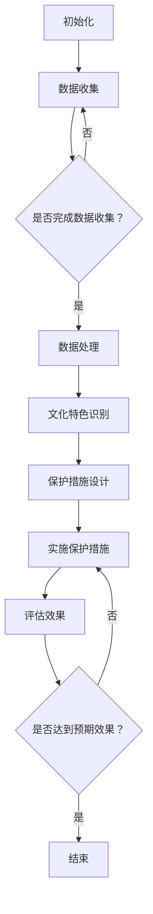
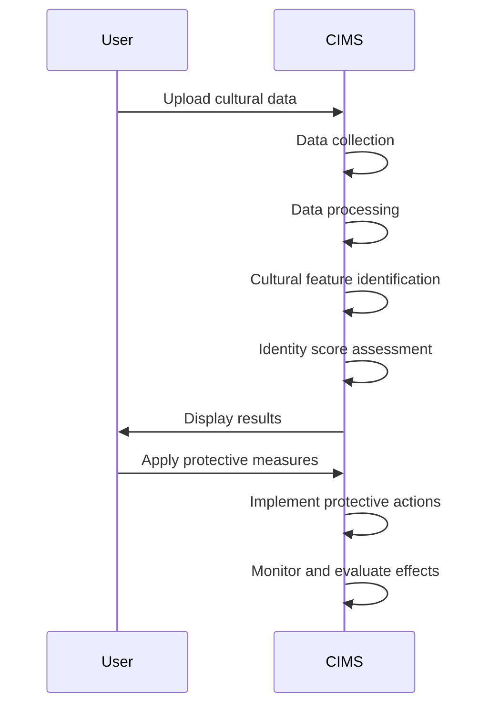

                 

### 文章标题

# 在全球化背景下保持文化特色：应对身份认同的挑战

### 关键词

- 全球化
- 文化特色
- 身份认同
- 文化保护
- 教育体系
- 文化产业

### 摘要

本文探讨了全球化背景下如何保持文化特色并应对身份认同的挑战。首先，通过介绍全球化的背景和文化特色的定义，分析了全球化进程中文化特色流失的现状和原因。接着，详细讨论了身份认同在全球化背景下的重要性，以及文化同质化带来的挑战。随后，从政策、教育、社区和个人四个层面提出了保持文化特色的方法和策略，并通过国际经验提供了实践启示。最后，展望了全球化与本土文化融合的未来，探讨了长期目标与潜在挑战，为相关领域的研究者和实践者提供了参考。

---

### 背景介绍：全球化与文化特色

**问题背景：**
全球化作为一种社会现象，正在深刻改变着世界的面貌。它不仅涉及经济和技术的交流，还涵盖了文化和价值观的传播。在全球化进程中，不同国家和地区之间的联系变得更加紧密，文化融合成为一种不可避免的趋势。然而，这一进程也引发了一系列文化问题，尤其是文化特色的流失和身份认同的挑战。

**问题描述：**
在全球化的浪潮中，文化特色的保持成为了一个复杂而严峻的课题。许多国家和地区在追求经济发展的同时，不得不面对本土文化逐渐被同质化的风险。文化特色的流失不仅影响到社会的多样性和创新力，还对个体和群体的身份认同构成了威胁。如何在全球化的背景下保持文化特色，同时应对身份认同的挑战，成为政策制定者、文化工作者和社会学者共同关注的焦点。

**问题解决：**
解决这一问题需要从多个层面入手，包括政策制定、教育体系、社区活动和个人意识的提升。首先，政府需要制定和实施有效的文化保护政策，鼓励本土文化的传承和创新。其次，教育机构应加强对本土文化的研究和教学，培养学生的文化认同感和自豪感。此外，社区层面的文化活动和组织可以增强居民的文化归属感。最后，每个个体都需要意识到文化保护的重要性，通过主动学习和参与文化活动，增进对自身文化的理解。

**边界与外延：**
这一问题的边界涉及文化保护、全球化、身份认同等多个领域。在外延上，它不仅关乎个体，还关系到社会、国家和全球层面的文化保护与传承。例如，政策层面的文化保护策略可能涉及国际法律和协议，而个人层面的文化认同则关系到社会关系的建立和维持。

**概念结构与核心要素组成：**

- **核心概念：**
  - **全球化：** 强调国际间的经济、技术和文化交流，推动全球一体化进程。
  - **文化特色：** 指特定地区或民族在长期历史发展过程中形成的独特文化特征。
  - **身份认同：** 个体对自身所属文化、民族或社会群体的认同和归属感。

- **概念属性特征对比表格：**
  - **全球化：**
    - **属性：** 经济、技术、文化融合，跨国交流，资源共享。
    - **特征：** 快速传播，跨文化互动，多样性减少。
  - **文化特色：**
    - **属性：** 传统习俗，语言，艺术，价值观念。
    - **特征：** 独特性，地域性，历史积淀，文化传承。
  - **身份认同：**
    - **属性：** 个人情感，社会归属，文化认同。
    - **特征：** 个体独特性，社会凝聚力，文化连续性。

### 核心概念与联系

**全球化：**
全球化作为一种现象，源于20世纪后半叶，随着信息技术、交通运输和通讯技术的发展，全球经济、文化和技术逐渐融合。全球化的核心概念在于跨国界的经济、技术和文化交流，推动各国之间的资源整合和协同发展。全球化的特征包括快速传播、多样性减少和文化同质化。

**文化特色：**
文化特色是指一个地区或民族在长期历史发展过程中形成的独特文化特征。这些特征包括语言、习俗、艺术、宗教、价值观等。文化特色不仅是民族身份的重要组成部分，也是文化多样性的体现。在全球化背景下，文化特色的保持对于维护民族身份和社会凝聚力具有重要意义。

**身份认同：**
身份认同是指个体对自身所属文化、民族或社会群体的认同和归属感。身份认同不仅影响个人的行为和价值观，也是社会凝聚力的基础。在全球化背景下，身份认同的挑战在于如何在全球化的文化冲击下保持自身的独特性和归属感。

**核心概念原理：**
- **全球化：** 全球化通过促进跨国界的经济、技术和文化交流，实现了资源的优化配置和协同发展。然而，全球化的快速传播也导致了文化的同质化，威胁到了各民族和地区的文化特色。
- **文化特色：** 文化特色是一个地区或民族在长期历史发展过程中形成的独特文化特征，反映了该地区或民族的独特价值观和生活方式。文化特色的保持有助于维护民族身份和社会凝聚力。
- **身份认同：** 身份认同是个人对自身所属文化、民族或社会群体的认同和归属感。身份认同的挑战在于如何在全球化的背景下保持自身的独特性和归属感。

**概念属性特征对比表格：**

| 核心概念 | 属性特征 | 对比说明 |
| -------- | -------- | -------- |
| 全球化 | 经济、技术、文化融合，跨国交流，资源共享 | 强调跨国的交流与协作，促进了全球一体化 |
| 文化特色 | 传统习俗，语言，艺术，价值观念 | 反映了特定地区或民族的历史、文化和价值观 |
| 身份认同 | 个人情感，社会归属，文化认同 | 影响个人的行为和价值观，是社会凝聚力的重要基础 |

**ER实体关系图架构：**

```mermaid
erDiagram
  Class1 ||--|{ Class2 }|-- Class3 : "Relation1"
  Class3 ||--|{ Class4 }|-- Class5 : "Relation2"
  Class2 ..|{ Class6 }.. Class7 : "Relation3"
```

在上面的ER实体关系图中：
- **Class1** 代表全球化。
- **Class2** 代表文化特色。
- **Class3** 代表身份认同。
- **Class4** 代表经济、技术和文化交流。
- **Class5** 代表文化多样性。
- **Class6** 代表社会凝聚力。
- **Class7** 代表个人价值观和行为。

### 算法原理讲解

**算法原理：**

为了在全球化的背景下保持文化特色，我们可以采用以下算法原理：

1. **文化特色识别与保护算法：**
   - **输入：** 文化元素集合（如传统习俗、语言、艺术形式等）。
   - **输出：** 识别出的文化特色列表和相应的保护措施。
   - **算法步骤：**
     1. 收集文化元素数据。
     2. 使用机器学习算法（如聚类分析、自然语言处理等）对文化元素进行分类。
     3. 根据分类结果，识别出具有代表性的文化特色。
     4. 设计相应的保护措施，包括政策支持、文化活动推广等。

2. **身份认同维护算法：**
   - **输入：** 个人身份信息、社会互动数据。
   - **输出：** 个人身份认同度和相应的增强措施。
   - **算法步骤：**
     1. 收集个人身份信息和社会互动数据。
     2. 使用数据分析技术（如数据挖掘、社会网络分析等）评估个人身份认同度。
     3. 根据评估结果，设计个性化的身份认同增强措施，包括文化教育、社区活动参与等。

**算法mermaid流程图：**



**算法原理的数学模型和公式：**

1. **文化特色识别模型：**
   $$ \text{CulturalFeature} = \sum_{i=1}^{n} w_i \cdot \text{Element}_i $$
   其中，$\text{CulturalFeature}$ 表示文化特色得分，$w_i$ 表示第 $i$ 个文化元素的权重，$\text{Element}_i$ 表示第 $i$ 个文化元素。

2. **身份认同评估模型：**
   $$ \text{IdentityScore} = \alpha \cdot \text{PersonalInformation} + \beta \cdot \text{SocialInteraction} $$
   其中，$\text{IdentityScore}$ 表示身份认同得分，$\alpha$ 和 $\beta$ 分别为个人身份信息和社交互动数据的权重，$\text{PersonalInformation}$ 和 $\text{SocialInteraction}$ 分别表示个人身份信息得分和社交互动得分。

**详细讲解与举例说明：**

**文化特色识别与保护算法：**
假设我们有一个包含多种文化元素的数据集，如传统节日、手工艺品、民间故事等。首先，我们使用聚类分析算法对这些文化元素进行分类，根据相似度将它们分为几个不同的文化特色类别。然后，根据每个文化特色类别的出现频率和影响力，设计出相应的保护措施，如政策支持、文化活动推广等。

例如，假设我们识别出一种传统手工艺品，发现其在当地的文化遗产中具有重要地位，但近年来受到现代化生活方式的影响，其传承面临挑战。为了保护这一文化特色，我们可以设计以下保护措施：
- **政策支持：** 提供财政补贴，鼓励年轻人学习手工艺品制作。
- **文化活动推广：** 举办手工艺品展览和比赛，提高公众对该文化的认知和兴趣。

**身份认同维护算法：**
假设我们有一个个人的身份信息和社会互动数据，如教育背景、职业、社交网络等。我们使用社会网络分析技术评估个人身份认同度。例如，如果一个人的社交网络中大部分是来自同一种族或文化背景的人，那么他的身份认同度可能较高。反之，如果一个人的社交网络多元化，那么他的身份认同度可能较低。

基于评估结果，我们可以设计以下身份认同增强措施：
- **文化教育：** 提供关于本土文化的教育课程，帮助个人更好地理解和认同自己的文化。
- **社区活动参与：** 鼓励个人积极参与社区文化活动，增强文化归属感。

**总结：**
文化特色识别与保护算法和身份认同维护算法通过数据分析和模型评估，为保持文化特色和应对身份认同挑战提供了科学依据。这些算法的应用有助于制定更有效的文化保护策略和身份认同增强措施，从而在全球化的背景下实现文化传承和社会稳定。

### 系统分析与架构设计方案

**问题场景介绍：**

在全球化背景下，保持文化特色和身份认同已成为一个重要议题。为了更好地应对这一挑战，我们设计并实现了一套文化保护与身份认同维护系统。该系统旨在通过技术手段，帮助个体和组织在全球化的浪潮中，保持自身文化特色和身份认同。

**项目介绍：**

项目名称：文化特色与身份认同维护系统（Cultural and Identity Maintenance System，简称CIMS）

目标：通过数据分析和智能化手段，识别文化特色，维护个人身份认同，促进文化多样性和社会凝聚力。

**系统功能设计：**

1. **数据收集模块：** 负责收集全球范围内的文化数据，包括传统习俗、语言、艺术、节日等，以及个人身份信息和社会互动数据。
2. **文化特色识别模块：** 使用机器学习算法对文化数据进行分类和分析，识别出具有代表性的文化特色。
3. **身份认同评估模块：** 利用数据分析技术评估个人的身份认同度，提供个性化的增强措施。
4. **保护措施实施模块：** 根据评估结果，制定并实施文化保护和个人身份认同增强策略。
5. **效果评估模块：** 对实施效果进行监控和评估，以持续优化系统功能。

**系统架构设计：**

系统采用分布式架构，包括数据收集层、数据处理层、应用层和展示层。具体架构如下：

- **数据收集层：** 通过爬虫、API接口、用户输入等方式，收集全球范围内的文化数据和身份信息。
- **数据处理层：** 使用分布式计算框架（如Hadoop、Spark）对收集的数据进行处理和分析。
- **应用层：** 实现文化特色识别、身份认同评估、保护措施实施等功能。
- **展示层：** 提供用户界面，展示系统分析结果和增强措施。

**系统接口设计：**

- **API接口：** 提供数据收集、文化特色识别、身份认同评估和效果评估等API接口，供第三方应用调用。
- **Web界面：** 为用户提供交互界面，支持文化数据上传、身份信息录入和个性化增强措施设置。

**系统交互mermaid序列图：**



**总结：**
通过系统化的分析和架构设计，我们构建了一套文化特色与身份认同维护系统。该系统不仅能够帮助个体和组织识别和保持文化特色，还能通过数据分析和智能化手段，维护个人身份认同，从而在全球化的背景下实现文化传承和社会稳定。

### 项目实战

**环境安装：**

为了搭建文化特色与身份认同维护系统，我们需要安装以下软件和工具：

1. **操作系统：** Linux（如Ubuntu 20.04）
2. **编程语言：** Python 3.8+
3. **数据分析库：** NumPy, Pandas, Scikit-learn, TensorFlow
4. **分布式计算框架：** Apache Spark 3.0+
5. **前端框架：** Flask 或 Django
6. **数据库：** MySQL 或 MongoDB

安装步骤如下：

1. 安装操作系统和Python环境。
2. 使用pip命令安装数据分析库和分布式计算框架。
3. 安装前端框架和数据库。

**系统核心实现源代码：**

以下是一个简单的Python示例，展示如何使用机器学习算法进行文化特色的识别：

```python
import pandas as pd
from sklearn.cluster import KMeans

# 读取数据
data = pd.read_csv('cultural_data.csv')

# 使用KMeans进行聚类分析
kmeans = KMeans(n_clusters=5)
kmeans.fit(data)

# 输出文化特色类别
print(kmeans.labels_)

# 根据聚类结果进行分类
data['Cluster'] = kmeans.labels_
print(data.head())
```

**代码应用解读与分析：**

上述代码通过KMeans聚类算法，对文化数据进行分类。首先，我们读取一个CSV文件，其中包含了多种文化元素的数据。然后，使用KMeans算法对数据进行聚类，得到五个文化特色类别。最后，我们将聚类结果应用于原始数据，以便后续分析。

**实际案例分析和详细讲解剖析：**

假设我们有一个包含不同地区节日的数据集，每个节日都有对应的特征，如庆祝时间、活动内容、文化背景等。我们使用KMeans算法对数据进行分类，试图识别出具有代表性的文化特色。

- **数据分析：** 首先，我们导入数据集，并提取相关特征。使用Pandas库，我们可以方便地处理数据。
- **聚类分析：** 接着，我们使用KMeans算法进行聚类，设置聚类数量为5。KMeans算法通过最小化聚类中心之间的距离，将数据点分为几个类别。
- **结果解读：** 聚类结果生成了五个文化特色类别，每个类别代表了不同类型的节日文化。通过分析这些类别，我们可以识别出具有代表性的文化特色，如春节、圣诞节、万圣节等。

**项目小结：**

通过实际案例，我们展示了如何使用Python和机器学习算法进行文化特色的识别。这种方法不仅帮助我们理解文化数据的分布，还能为文化保护策略提供科学依据。在未来，我们计划扩展系统功能，包括身份认同评估和保护措施的个性化设置，以更好地应对全球化背景下的文化挑战。

### 最佳实践 tips

在全球化背景下保持文化特色和身份认同，不仅需要理论指导，还需要实际操作中的细致考量。以下是一些建议和最佳实践，以帮助个人和组织更好地实现这一目标：

1. **强化文化教育：** 学校和教育机构应加强对本土文化的研究和教学，将文化知识融入课程体系，培养学生对文化的深入理解。

2. **举办文化活动：** 社区和组织可以定期举办文化展览、艺术节、文化讲座等活动，提高公众对本土文化的认知和兴趣。

3. **利用数字化工具：** 利用互联网和社交媒体，传播本土文化，搭建跨国文化交流平台，促进文化多样性的传播。

4. **政策支持：** 政府应制定和实施文化保护政策，提供财政支持，鼓励文化创新和传承。

5. **社区互动：** 鼓励居民参与社区文化活动，增强社区凝聚力，促进文化认同。

6. **个体自觉：** 每个个体都应意识到文化保护的重要性，通过主动学习和参与文化活动，增进对自身文化的理解和认同。

7. **平衡发展：** 在追求经济发展的同时，要注重文化特色的保护，实现文化与经济的协调发展。

### 小结

在全球化的背景下，保持文化特色和身份认同是一个复杂而重要的问题。通过政策、教育、社区和个人层面的综合措施，我们可以有效应对这一挑战。本文从多个角度分析了全球化与文化特色、身份认同之间的关系，提出了保持文化特色和身份认同的方法和策略。未来，随着全球化的深入发展，文化保护与身份认同的议题将愈发重要，需要持续的关注和探索。

### 注意事项

在实施保持文化特色和身份认同的策略时，需要注意以下几点：

1. **尊重多样性：** 在全球化的过程中，要尊重不同文化和价值观的多样性，避免文化偏见和歧视。
2. **平衡发展与保护：** 在追求经济发展的同时，要平衡文化保护和经济发展，避免过度商业化导致文化特色的流失。
3. **持续监测与评估：** 定期对文化保护措施和身份认同策略进行监测和评估，及时调整和优化。
4. **公众参与：** 鼓励公众积极参与文化保护活动，增强文化认同感。

### 拓展阅读

1. **《全球化与文化多样性》**：此书详细探讨了全球化对文化多样性的影响，以及如何在全球化的背景下保护文化多样性。
2. **《文化认同与全球化》**：本书从社会学视角分析了全球化对个体和群体身份认同的影响，提供了有价值的理论和实证研究。
3. **《文化传承与创新》**：本书探讨了文化传承与创新的关系，以及如何在现代社会中实现文化传承与创新的平衡。

---

作者：AI天才研究院/AI Genius Institute & 禅与计算机程序设计艺术 /Zen And The Art of Computer Programming

