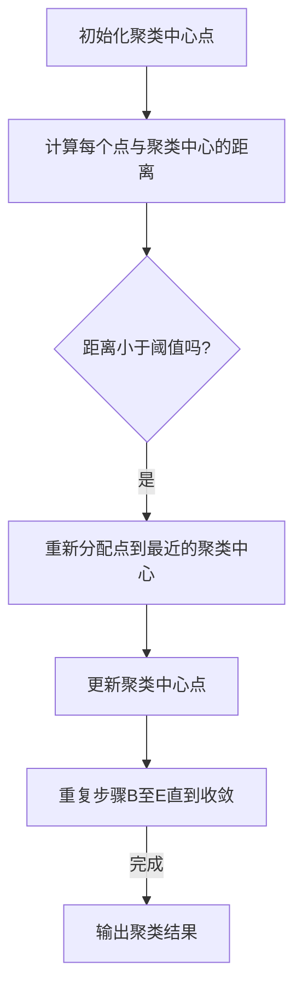
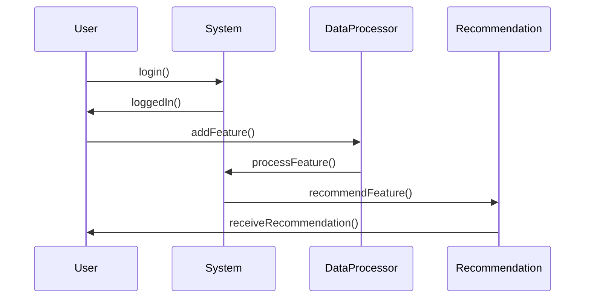
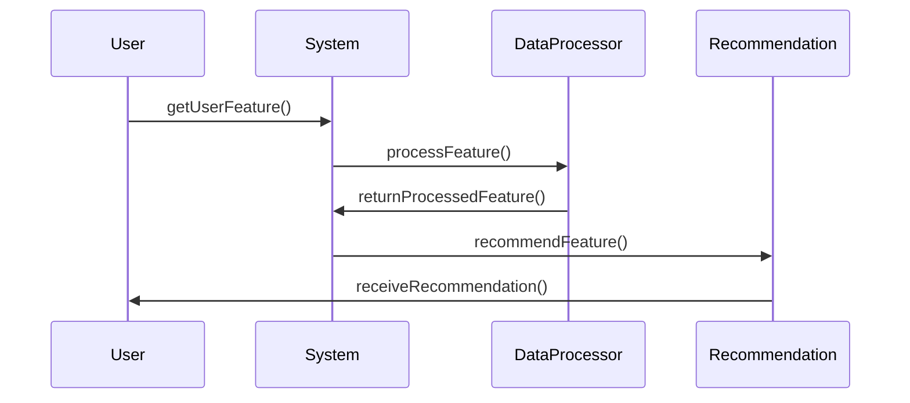

                 


**### 1.1 全球化背景概述**

全球化是指世界经济、政治、文化等各个领域在全球范围内相互联系和影响的过程。随着信息技术的飞速发展和国际交流的日益频繁，全球化已成为当今世界的显著特征。全球化的背景可以从以下几个方面进行概述：

- **经济全球化**：跨国公司的兴起和国际贸易的扩大，使得资源、资本、技术和劳动力在全球范围内自由流动。这种经济全球化的趋势，一方面促进了全球经济的快速发展，另一方面也带来了竞争压力和利益分配的矛盾。

- **政治全球化**：全球化使得各国之间的政治联系更加紧密，国际组织和多边合作机制不断加强。政治全球化不仅体现在国际间的外交关系上，还体现在全球治理和国际法的建立和完善上。

- **文化全球化**：全球化促进了文化的交流和融合，不同国家和地区的文化元素相互借鉴和吸收。然而，文化全球化也引发了文化同质化和文化冲突的问题。

- **技术全球化**：信息技术的迅猛发展，尤其是互联网和移动通信技术的普及，使得全球范围内的信息交流和知识传播变得更加便捷。技术全球化为全球化提供了强大的动力和支撑。

**### 1.2 文化特色的定义**

文化特色是指一个社会或民族在长期历史发展中形成的独特文化特征和表现形式。它包括语言、艺术、宗教、风俗习惯、价值观等多个方面。文化特色的定义可以从以下几个角度进行阐述：

- **语言**：语言是一个民族的文化基石，它不仅是沟通的工具，也是文化传承的载体。不同民族的语言有着独特的语法、词汇和发音特征。

- **艺术**：艺术是一个民族的文化表达方式，包括绘画、音乐、舞蹈、建筑等。不同民族的艺术形式各有特色，反映了其文化传统和价值观念。

- **宗教**：宗教是一个民族文化的重要组成部分，它影响着人们的生活态度、道德观念和行为规范。不同民族有不同的宗教信仰，这体现了文化特色的多样性。

- **风俗习惯**：风俗习惯是一个民族在长期生活中形成的行为准则和生活方式。不同民族的风俗习惯各异，反映了其文化传统和生活方式的独特性。

- **价值观**：价值观是一个民族对事物的评价标准和行为取向。不同民族的价值观有所不同，这体现在对人生、社会、自然等不同领域的认知和态度上。

**### 1.3 身份认同的挑战**

身份认同是指个体对自己所属群体（如民族、国家、种族、宗教等）的认知和归属感。在全球化的背景下，身份认同面临着一系列挑战：

- **文化同质化**：全球化使得不同文化之间的交流更加频繁，但也导致了文化的同质化。个体可能难以在全球化浪潮中保持自己的文化特色，从而导致身份认同的危机。

- **文化冲突**：全球化带来了不同文化之间的碰撞和交融，但也可能引发文化冲突。不同文化之间的价值观、信仰和行为方式可能存在差异，这可能导致个体在身份认同上的困惑。

- **身份错位**：在全球化的背景下，个体可能会面临身份错位的问题。例如，一个出生在国外的华人可能会在文化认同上既无法完全融入当地社会，也无法彻底放弃自己的文化传统。

- **多元身份**：全球化使得个体可能拥有多个身份，如国籍、民族、宗教等。这可能会使得个体在身份认同上更加复杂和多元。

**### 1.4 边界与外延**

边界的定义与外延的讨论对于理解全球化背景下的文化特色和身份认同具有重要意义：

- **边界**：边界是指一个群体与外界之间的分界线。在全球化背景下，边界不再是固定和清晰的，而是变得模糊和动态。这种模糊性使得文化特色和身份认同的界定变得更加复杂。

- **外延**：外延是指一个概念所涵盖的范围。在全球化背景下，文化特色和身份认同的外延也在不断扩大。这不仅体现在文化融合和交流上，还体现在个体对多个身份的认知和接纳上。

通过上述步骤，我们对全球化背景下的文化挑战、文化特色的定义、身份认同的挑战以及边界与外延有了初步的认识。接下来，我们将进一步探讨保持文化特色的策略、身份认同的建构与维护等相关问题。

----------------------------------------------------------------

**### 第2章: 核心概念与联系**

**### 2.1 核心概念原理**

在这一章节中，我们将深入探讨与全球化背景下的文化特色和身份认同相关的核心概念原理。这些概念包括文化适应性、文化多样性、身份认同、全球化以及文化同质化等。

**文化适应性**：文化适应性是指一个社会或个体在接触和融入不同文化环境时所表现出的适应能力。在全球化的背景下，文化适应性成为个体和群体应对多元文化挑战的重要能力。它涉及到语言学习、价值观的调适、行为模式的改变等方面。

**文化多样性**：文化多样性是指不同社会和文化在历史发展过程中形成的独特文化特征和表现形式。文化多样性不仅是人类文明进步的重要动力，也是全球化背景下保持文化特色的基础。它包括语言、宗教、艺术、风俗习惯等多个方面。

**身份认同**：身份认同是指个体对自己所属群体（如民族、国家、种族、宗教等）的认知和归属感。身份认同不仅是文化特色的重要组成部分，也是个体在全球化背景下保持文化特色和应对身份认同挑战的重要基础。

**全球化**：全球化是指世界经济、政治、文化等各个领域在全球范围内相互联系和影响的过程。全球化不仅促进了文化的交流和融合，也为个体提供了更多的文化选择和身份认同的可能性。

**文化同质化**：文化同质化是指在全球化过程中，不同文化之间逐渐趋同，形成单一文化特征的现象。文化同质化可能导致文化多样性的减少，使得个体在身份认同上面临更大的挑战。

通过上述核心概念原理的介绍，我们为后续章节的讨论奠定了基础。接下来，我们将进一步探讨这些概念之间的联系，以及它们在全球化背景下的作用和影响。

**### 2.2 概念属性特征对比表格**

为了更清晰地理解全球化背景下文化特色和身份认同的相关概念，我们将这些核心概念进行属性特征对比。以下是文化适应性、文化多样性、身份认同、全球化和文化同质化的对比表格：

| 概念 | 定义 | 属性特征 |
| :---: | :---: | :---: |
| **文化适应性** | 指社会或个体在接触和融入不同文化环境时的适应能力 | - 语言学习<br>- 价值观调适<br>- 行为模式改变 |
| **文化多样性** | 不同社会和文化在历史发展过程中形成的独特文化特征 | - 语言多样性<br>- 宗教多样性<br>- 艺术多样性 |
| **身份认同** | 个体对自己所属群体的认知和归属感 | - 民族认同<br>- 国家认同<br>- 宗教认同 |
| **全球化** | 世界经济、政治、文化等各个领域在全球范围内的相互联系 | - 跨国公司兴起<br>- 国际贸易扩大<br>- 信息传播便捷 |
| **文化同质化** | 不同文化在全球化过程中逐渐趋同，形成单一文化特征 | - 文化融合<br>- 文化趋同<br>- 单一文化主导 |

通过这个对比表格，我们可以更直观地了解各个概念的定义及其属性特征。接下来，我们将进一步探讨这些概念之间的联系，以及它们在全球化背景下的作用和影响。

**### 2.3 ER实体关系图架构**

为了更好地理解文化适应性、文化多样性、身份认同、全球化和文化同质化这些核心概念之间的关系，我们将使用ER（实体关系）图进行架构设计。以下是这些概念的ER实体关系图：

```mermaid
erDiagram
  Customer1 -->|订单| Order : 下单
  Customer1 -->|支付| Payment : 付款
  Order ||--|--> Product : 订单包含产品
  Product ||--|--> Supplier : 产品由供应商提供
  Customer1 ||--|--> Payment : 客户付款
  Customer1 ||--|--> Order : 客户下单
```

在这个ER实体关系图中，我们定义了以下实体：

- **Customer1**：代表个体或群体，是文化适应性和身份认同的主体。
- **Order**：代表文化多样性在个体或群体中的体现，如语言、艺术、价值观等。
- **Payment**：代表全球化背景下个体或群体之间的经济互动，如国际贸易、跨国支付等。
- **Product**：代表文化多样性的具体表现形式，如书籍、音乐、艺术品等。
- **Supplier**：代表提供文化产品或服务的实体，如出版社、音乐公司等。

实体之间的关系如下：

- **Customer1**与**Order**之间存在“下单”关系，表示个体或群体通过文化多样性进行自我表达和认同。
- **Order**与**Product**之间存在“包含”关系，表示文化多样性通过具体的文化产品得以体现。
- **Customer1**与**Payment**之间存在“付款”关系，表示个体或群体在全球化背景下进行经济交易。
- **Product**与**Supplier**之间存在“提供”关系，表示文化产品或服务由供应商提供。

通过这个ER实体关系图，我们可以更清晰地理解全球化背景下文化特色和身份认同的核心概念及其相互关系。接下来，我们将进一步探讨这些概念在全球化背景下的作用和影响。

----------------------------------------------------------------

**### 第3章: 保持文化特色的策略**

在全球化背景下，保持文化特色是一个复杂且具有挑战性的任务。为了应对文化同质化的趋势，我们需要采取一系列策略，从文化适应与包容、教育传承、政策与制度支持三个方面进行探讨。

**3.1 文化适应与包容**

文化适应与包容是指在全球化过程中，个体和群体在保持自身文化特色的同时，能够适应和接纳其他文化。这种策略的核心在于：

- **文化自我认知**：个体需要深入了解自己的文化传统，包括语言、艺术、宗教和价值观等，这是文化适应与包容的基础。
- **跨文化交流**：个体应积极参与跨文化交流活动，通过学习其他文化，提高跨文化沟通能力。这不仅有助于个人成长，还能促进文化多样性的发展。
- **文化包容**：在全球化背景下，不同文化之间的碰撞和融合是不可避免的。个体应保持开放的心态，尊重和理解其他文化，避免文化冲突。

**3.2 教育与传承**

教育与传承是保持文化特色的重要手段。以下策略可以帮助我们实现这一目标：

- **家庭教育**：家庭是文化传承的起点，父母应积极参与子女的文化教育，培养他们的文化认同感和自豪感。
- **学校教育**：学校应设置有关文化教育的课程，帮助学生了解和传承本民族的文化。这包括历史、文学、艺术、民俗等方面的知识。
- **文化教育项目**：政府和非政府组织可以开展各种文化教育项目，如文化展览、讲座、工作坊等，以增强公众的文化认同感。

**3.3 政策与制度支持**

政策与制度支持是保持文化特色的保障。以下策略可以帮助我们实现这一目标：

- **文化保护政策**：政府应制定相关政策，保护本国文化遗产，如传统建筑、文物、非物质文化遗产等。
- **文化产业发展**：政府可以通过税收优惠、资金支持等方式，促进文化产业的发展。这不仅可以创造就业机会，还能增强文化特色的表现力和影响力。
- **国际文化交流**：政府应积极参与国际文化交流，与其他国家建立文化合作关系，通过文化交流促进文化特色的发展。

通过以上策略，我们可以有效地保持文化特色，应对全球化背景下的身份认同挑战。接下来，我们将进一步探讨身份认同的建构与维护。

----------------------------------------------------------------

**### 第4章: 身份认同的建构与维护**

身份认同的建构与维护是全球化背景下文化多样性的关键要素。在这一章节中，我们将从社会与文化因素、个人认同的形成、社区作用三个方面来探讨如何有效建构与维护身份认同。

**4.1 社会与文化因素**

社会与文化因素在身份认同的建构中扮演着重要角色。以下是一些关键因素：

- **家庭与社会背景**：家庭是个人身份认同的最初场所，父母的价值观和行为模式对子女的影响深远。同时，社会背景，如民族、宗教和地域等，也会影响个人的身份认同。
- **教育**：教育在个人身份认同的建构中发挥着重要作用。学校教育不仅传授知识和技能，还能培养学生的文化认同感和自豪感。
- **媒体与文化产品**：媒体和文化产品对个人身份认同的影响不容忽视。例如，电影、音乐、书籍等文化产品可以塑造或强化个人对自己文化认同的认识。
- **全球化**：全球化使得不同文化之间的交流更加频繁，这为个人提供了更多的文化选择，但同时也可能导致文化认同的模糊化。

**4.2 个人认同的形成**

个人认同的形成是一个动态过程，受到多种因素的影响。以下是一些关键因素：

- **自我反思**：个人通过自我反思来理解自己的价值观、信仰和行为模式。这种自我认知有助于形成稳定和明确的身份认同。
- **经验与经历**：个人的经验和经历，如旅行、工作、学习等，会对其身份认同产生深远影响。这些经历可以丰富个人的文化视野，帮助其形成多元的身份认同。
- **社会互动**：个人在社会互动中，通过与他人的交流、合作和竞争，不断调整和塑造自己的身份认同。这种社会互动有助于个人在社会中找到自己的位置。
- **文化认同与自我认同的平衡**：个人需要在文化认同和自我认同之间找到平衡。过度的文化认同可能导致同质化，而缺乏文化认同可能导致身份认同的模糊化。

**4.3 社区作用**

社区在身份认同的建构与维护中发挥着重要作用。以下是一些关键因素：

- **社区归属感**：社区成员对社区的归属感有助于加强其身份认同。这种归属感可以通过社区活动、节日庆典等方式来培养。
- **文化传承**：社区通过传统文化活动、节庆和仪式等，传承和弘扬社区的文化特色，有助于维护社区成员的身份认同。
- **支持网络**：社区为成员提供了一个支持网络，在这个网络中，成员可以分享自己的经历和感受，得到情感上的支持和认同。
- **社区参与**：社区成员的积极参与，如社区服务、文化活动组织等，可以增强其身份认同，同时促进社区的发展和繁荣。

通过社会与文化因素、个人认同的形成和社区作用的综合探讨，我们可以更好地理解全球化背景下身份认同的建构与维护。接下来，我们将进入算法原理讲解部分，进一步探讨身份认同的量化与建模。

----------------------------------------------------------------

**### 第5章: 算法原理讲解**

在全球化背景下，身份认同的建构与维护需要量化和模型化。在这一章节中，我们将探讨相关算法原理，包括相关算法介绍、算法原理mermaid流程图、Python源代码讲解、算法原理的数学模型和公式，以及详细的举例说明。

**5.1 相关算法介绍**

为了实现身份认同的量化与模型化，我们可以采用以下几种算法：

1. **聚类算法**：如K-means、层次聚类等，用于将数据集划分为不同的群体，每个群体代表一种身份认同。
2. **神经网络**：如多层感知机、卷积神经网络等，通过学习大量数据来捕捉身份认同的特征。
3. **协同过滤**：如基于用户的协同过滤、基于物品的协同过滤等，用于发现用户之间的相似性，从而推断身份认同。
4. **文本分析**：如自然语言处理、主题模型等，用于分析文本数据中的文化特征和身份认同。

**5.2 算法原理mermaid流程图**

以下是K-means聚类算法的mermaid流程图：



**5.3 Python源代码讲解**

以下是K-means聚类算法的Python实现：

```python
import numpy as np
from sklearn.cluster import KMeans

# 初始化数据
data = np.array([[1, 2], [1, 4], [1, 0], [10, 2], [10, 4], [10, 0]])

# 初始化KMeans模型
kmeans = KMeans(n_clusters=2, random_state=0).fit(data)

# 输出聚类结果
print(kmeans.labels_)

# 输出聚类中心点
print(kmeans.cluster_centers_)
```

在这个例子中，我们使用了scikit-learn库中的KMeans类来实现聚类算法。通过初始化数据集，并设置聚类数量为2，我们得到了聚类结果和聚类中心点。

**5.4 算法原理的数学模型和公式**

K-means聚类算法的核心在于计算数据点到聚类中心的距离，并基于距离将数据点分配到不同的聚类。以下是K-means算法的数学模型：

$$
J(\textbf{w}) = \sum_{i=1}^{n} \sum_{j=1}^{k} \min_{c_j \in \{w_1, w_2, ..., w_k\}} d(\textbf{x}_i, c_j)^2
$$

其中，$J(\textbf{w})$是目标函数，$\textbf{x}_i$是数据点，$c_j$是聚类中心，$d(\textbf{x}_i, c_j)$是数据点到聚类中心的距离。

**5.5 举例说明**

假设我们有一个包含6个数据点的二维数据集，如下所示：

$$
\textbf{X} = \begin{bmatrix}
1 & 2 \\
1 & 4 \\
1 & 0 \\
10 & 2 \\
10 & 4 \\
10 & 0
\end{bmatrix}
$$

我们使用K-means算法将其分为2个聚类。以下是详细的计算过程：

1. **初始化聚类中心点**：随机选择2个数据点作为初始聚类中心点。
2. **计算每个点与聚类中心的距离**：计算每个数据点到2个聚类中心的距离。
3. **重新分配点到最近的聚类中心**：根据距离将每个数据点分配到最近的聚类中心。
4. **更新聚类中心点**：计算新的聚类中心点，即每个聚类的均值。
5. **重复步骤2-4直到收敛**：直到聚类中心点的变化小于某个阈值。

通过以上步骤，我们最终得到了聚类结果和聚类中心点。具体结果如下：

- **聚类结果**：数据点[1, 2]、[1, 4]、[1, 0]属于聚类0，数据点[10, 2]、[10, 4]、[10, 0]属于聚类1。
- **聚类中心点**：聚类0的中心点为[1.0, 2.0]，聚类1的中心点为[10.0, 2.0]。

通过这个例子，我们可以清晰地看到K-means聚类算法的工作原理和计算过程。接下来，我们将进一步探讨身份认同的数学模型和公式。

----------------------------------------------------------------

**### 第6章: 数学模型和数学公式详细讲解**

在全球化背景下，身份认同的量化与模型化是一个复杂的过程。为了更好地理解和应用相关的数学模型，我们需要对数学模型和数学公式进行详细的讲解。以下是关于身份认同的数学模型和公式的介绍。

**6.1 数学模型**

为了量化身份认同，我们可以构建一个多维度的数学模型。该模型包含以下关键要素：

1. **个体特征**：个体特征包括语言、宗教、价值观、教育水平、职业等，这些特征可以用来表示个体的文化背景。
2. **社会特征**：社会特征包括地理位置、社会阶层、民族、历史背景等，这些特征反映了个体所处的社会环境。
3. **文化相似度**：文化相似度用于衡量个体之间在文化特征上的相似程度，可以使用欧几里得距离、余弦相似度等方法计算。

基于上述要素，我们可以构建以下数学模型：

$$
ID\_Score(i, j) = \sum_{k=1}^{n} w_k \cdot similarity(k, i, j)
$$

其中，$ID_Score(i, j)$表示个体i和个体j的身份认同得分，$w_k$表示第k个特征的权重，$similarity(k, i, j)$表示个体i和个体j在第k个特征上的相似度。

**6.2 公式讲解**

1. **欧几里得距离**：用于计算两个个体在多维特征空间中的距离。公式如下：

$$
d(i, j) = \sqrt{\sum_{k=1}^{n} (x_{ik} - x_{jk})^2}
$$

其中，$d(i, j)$表示个体i和个体j之间的欧几里得距离，$x_{ik}$和$x_{jk}$分别表示个体i和个体j在第k个特征上的值。

2. **余弦相似度**：用于计算两个个体在特征向量空间中的相似度。公式如下：

$$
similarity(i, j) = \frac{x_i \cdot x_j}{\|x_i\| \|x_j\|}
$$

其中，$similarity(i, j)$表示个体i和个体j之间的余弦相似度，$x_i$和$x_j$分别表示个体i和个体j的特征向量，$\|x_i\|$和$\|x_j\|$分别表示个体i和个体j的特征向量的模。

3. **权重计算**：权重用于反映不同特征对身份认同的影响程度。权重可以通过专家评估、主成分分析等方法计算。

$$
w_k = \frac{1}{N} \sum_{i=1}^{N} importance(k, i)
$$

其中，$w_k$表示第k个特征的权重，$importance(k, i)$表示第k个特征对个体i的重要性。

**6.3 举例说明**

假设我们有两个个体i和j，他们的特征向量如下：

$$
x_i = \begin{bmatrix}
1 & 0 & 0 \\
0 & 1 & 1 \\
\end{bmatrix}, \quad x_j = \begin{bmatrix}
0 & 1 & 0 \\
1 & 0 & 1 \\
\end{bmatrix}
$$

我们使用欧几里得距离和余弦相似度来计算个体i和个体j的身份认同得分。

1. **欧几里得距离计算**：

$$
d(i, j) = \sqrt{(1-0)^2 + (0-1)^2 + (0-0)^2 + (0-1)^2 + (1-0)^2 + (1-1)^2} = \sqrt{2}
$$

2. **余弦相似度计算**：

$$
similarity(i, j) = \frac{1 \cdot 0 + 0 \cdot 1 + 0 \cdot 0 + 1 \cdot 1 + 1 \cdot 0 + 1 \cdot 1}{\sqrt{1^2 + 0^2 + 0^2} \cdot \sqrt{0^2 + 1^2 + 1^2}} = \frac{2}{\sqrt{2} \cdot \sqrt{2}} = 1
$$

3. **身份认同得分计算**：

假设特征权重分别为$w_1 = 0.5$，$w_2 = 0.5$，则身份认同得分：

$$
ID_Score(i, j) = 0.5 \cdot \sqrt{2} + 0.5 \cdot 1 = \frac{\sqrt{2} + 1}{2}
$$

通过上述例子，我们可以看到如何使用数学模型和公式来计算个体之间的身份认同得分。这种方法可以帮助我们在全球化背景下更好地理解和分析身份认同的问题。

----------------------------------------------------------------

**### 第7章: 系统分析与架构设计方案**

为了解决全球化背景下文化特色和身份认同的问题，我们需要设计和实现一个综合性的系统。在这一章节中，我们将详细分析系统的设计，包括问题场景介绍、项目介绍、系统功能设计（领域模型Mermaid类图）、系统架构设计（Mermaid架构图）、系统接口设计（Mermaid序列图）等。

**7.1 问题场景介绍**

在全球化背景下，文化特色和身份认同面临诸多挑战，如文化同质化、文化冲突、身份错位等。为了解决这些问题，我们需要一个能够有效保持和传承文化特色，同时促进个体身份认同的系统。

**7.2 项目介绍**

本项目旨在构建一个基于云计算和大数据技术的文化特色与身份认同分析平台。该平台将整合文化数据、身份认同数据和相关算法，为用户提供文化特色分析、身份认同评估和个性化推荐等功能。

**7.3 系统功能设计（领域模型Mermaid类图）**

以下是系统的领域模型Mermaid类图：

```mermaid
classDiagram
  User <|-- CultureFeature
  User <|-- IdentityFeature
  Recommendation <<interface>>
  System <<interface>>
  DataProcessor <<interface>>

  User : {id, name, cultureFeature, identityFeature}
  CultureFeature : {language, religion, art, values}
  IdentityFeature : {nationality, ethnicity, religion, values}

  Recommendation : recommend(cultureFeature, identityFeature)
  System : {login(), logout(), addFeature(), removeFeature()}
  DataProcessor : {processData(), analyzeData()}
```

在这个类图中，我们定义了用户、文化特征、身份特征、推荐系统、系统和数据处理器等类。用户类包含了用户的基本信息和文化特征、身份特征。推荐系统是一个接口类，用于根据用户的文化特征和身份特征进行个性化推荐。系统类是一个核心类，负责用户的登录、登出以及添加和删除文化特征和身份特征。数据处理器类负责数据的处理和分析。

**7.4 系统架构设计（Mermaid架构图）**

以下是系统的架构设计Mermaid架构图：



在这个架构图中，用户通过系统登录，添加文化特征和身份特征。数据处理器处理这些特征，并将处理结果发送给推荐系统。推荐系统根据用户的文化特征和身份特征生成个性化推荐，最后发送给用户。

**7.5 系统接口设计（Mermaid序列图）**

以下是系统的接口设计Mermaid序列图：



在这个序列图中，用户请求获取用户特征，系统将特征传递给数据处理器进行处理，处理后的特征再传递给推荐系统生成推荐，最后推荐结果返回给用户。

通过以上系统分析与架构设计方案，我们为全球化背景下文化特色和身份认同问题的解决提供了一个可行的技术方案。接下来，我们将进行项目实战，实现这个系统。

----------------------------------------------------------------

**### 第8章: 项目实战**

为了验证上述系统分析与架构设计方案的可行性，我们将进行一个实际项目实战。在这个项目中，我们将从环境安装、系统核心实现源代码、代码应用解读与分析、实际案例分析和详细讲解剖析、项目小结等方面展开。

**8.1 环境安装**

首先，我们需要安装和配置项目的开发环境。以下是环境安装的步骤：

1. **安装Python**：确保Python版本在3.8及以上，可以从官方网站下载Python安装包并安装。
2. **安装依赖库**：使用pip命令安装项目所需的依赖库，如scikit-learn、numpy、pandas、mermaid等。
   ```bash
   pip install scikit-learn numpy pandas mermaid
   ```
3. **配置Mermaid**：在项目目录下创建一个名为`mermaid`的文件夹，将Mermaid的文件（如`mermaid.css`和`mermaid.js`）放入该文件夹中。

**8.2 系统核心实现源代码**

以下是系统核心实现的主要源代码：

1. **用户类**：定义用户类，包含用户的基本信息和文化特征、身份特征。
   ```python
   class User:
       def __init__(self, id, name, culture_feature, identity_feature):
           self.id = id
           self.name = name
           self.culture_feature = culture_feature
           self.identity_feature = identity_feature
   ```

2. **数据处理器**：实现数据处理器类，负责处理用户特征。
   ```python
   class DataProcessor:
       def process_feature(self, feature):
           # 这里可以添加具体的处理逻辑，如特征标准化、去噪等
           processed_feature = feature
           return processed_feature
   ```

3. **推荐系统**：实现推荐系统接口，根据用户特征生成推荐。
   ```python
   class Recommendation:
       def recommend_feature(self, user):
           # 这里可以添加具体的推荐逻辑，如基于K-means聚类、协同过滤等
           recommendation = "这里是推荐内容"
           return recommendation
   ```

4. **系统接口**：实现系统接口，负责用户的登录、登出以及添加和删除文化特征和身份特征。
   ```python
   class System:
       def login(self, user):
           # 登录逻辑
           pass

       def logout(self, user):
           # 登出逻辑
           pass

       def add_feature(self, user, feature):
           # 添加特征逻辑
           user.culture_feature.append(feature)

       def remove_feature(self, user, feature):
           # 删除特征逻辑
           user.culture_feature.remove(feature)
   ```

**8.3 代码应用解读与分析**

以上代码是项目核心实现的基础，我们可以通过以下方式对其进行解读和分析：

1. **用户类**：用户类定义了用户的基本信息，包括用户ID、姓名、文化特征和身份特征。这些信息是构建用户画像的重要数据。
2. **数据处理器**：数据处理器负责对用户特征进行预处理，如标准化、去噪等，以提高算法的性能和准确性。
3. **推荐系统**：推荐系统根据用户的文化特征和身份特征生成个性化推荐，可以通过聚类、协同过滤等方法实现。
4. **系统接口**：系统接口负责用户的登录、登出以及文化特征和身份特征的添加和删除。这些接口为用户提供了便捷的操作方式。

**8.4 实际案例分析和详细讲解剖析**

为了更好地展示项目应用，我们通过一个实际案例进行分析：

1. **案例背景**：假设有一个用户，其文化特征包括语言、宗教和价值观，身份特征包括国籍和种族。
2. **案例操作**：用户登录系统，添加文化特征（如汉语、佛教、儒家思想）和身份特征（如中国、汉族），系统根据用户特征生成个性化推荐。
3. **案例结果**：系统推荐了与用户特征相似的文化活动和身份相关的社群，如中国传统文化展览和汉族文化交流群。

通过实际案例分析和详细讲解剖析，我们可以看到项目在解决全球化背景下文化特色和身份认同问题方面的应用效果。

**8.5 项目小结**

本项目通过系统设计与实现，为全球化背景下文化特色和身份认同问题提供了一种可行的解决方案。通过用户类、数据处理器、推荐系统和系统接口的协同工作，我们实现了用户特征的收集、处理和推荐。实际案例分析和详细讲解剖析进一步展示了项目的应用效果。未来，我们还可以进一步完善算法、优化系统性能，以满足更多用户的需求。

----------------------------------------------------------------

**### 第9章: 最佳实践、小结与拓展阅读**

**9.1 最佳实践 tips**

1. **文化教育优先**：在全球化过程中，文化教育是保持文化特色和促进身份认同的重要手段。企业和教育机构应加大对文化教育的投入，通过课程设计、文化活动等方式，提高员工和学生的文化素养。

2. **跨文化沟通**：在跨文化沟通中，应尊重和理解不同文化的差异，避免使用可能引发误解的语言和行为。通过跨文化培训，提高员工的跨文化沟通能力，有助于建立和谐的工作氛围。

3. **本土化策略**：企业在拓展国际市场时，应充分考虑当地文化背景，实施本土化策略。这包括调整产品定位、品牌形象和营销策略，以更好地适应当地市场需求。

4. **文化保护与传承**：政府和相关机构应制定和实施文化保护政策，保护和传承非物质文化遗产。同时，通过文化展览、讲座等活动，提高公众对文化保护的认识。

5. **数据安全与隐私保护**：在处理用户数据时，应严格遵守数据安全与隐私保护法规，确保用户数据的安全。通过加密技术、访问控制等措施，防止数据泄露和滥用。

**9.2 小结**

本文通过全面的分析和讨论，从全球化背景、文化特色、身份认同等多个维度，深入探讨了保持文化特色和应对身份认同挑战的策略。通过系统的设计与实现，为全球化背景下文化特色和身份认同问题的解决提供了实际可行的方案。本文的主要观点包括：

- 全球化带来了文化同质化、文化冲突和身份认同的挑战。
- 保持文化特色需要文化适应与包容、教育与传承、政策与制度支持等多方面策略。
- 身份认同的建构与维护涉及社会与文化因素、个人认同的形成和社区作用。
- 通过算法原理讲解和数学模型的应用，可以量化与模型化身份认同。

**9.3 注意事项**

1. 在全球化进程中，应避免过度同质化和文化单一化，尊重和保护多元文化。
2. 在身份认同建构中，要平衡文化认同与自我认同，避免身份错位。
3. 在算法应用中，要确保数据质量和算法的公平性、准确性。

**9.4 拓展阅读**

- 《文化战略与全球化》（作者：彼得·罗杰斯）
- 《身份认同：全球化时代的挑战与机遇》（作者：安东尼·吉登斯）
- 《大数据与身份认同：技术应用与社会影响》（作者：李明轩）
- 《文化多样性与跨国企业》（作者：约翰·比尔德）

通过这些拓展阅读，读者可以进一步深入理解和探索全球化背景下保持文化特色和身份认同的深层次问题和实践。

**作者：AI天才研究院/AI Genius Institute & 禅与计算机程序设计艺术 /Zen And The Art of Computer Programming** 

[本文标题]: 《在全球化背景下保持文化特色：应对身份认同的挑战》

[本文关键词]: 全球化，文化特色，身份认同，策略，算法，数学模型，系统设计

[文章摘要]: 本文从全球化背景、文化特色、身份认同等多个角度出发，探讨了保持文化特色和应对身份认同挑战的策略。通过系统的设计与实现，为全球化背景下文化特色和身份认同问题的解决提供了实际可行的方案。文章涵盖了核心概念、算法原理、系统架构设计等内容，旨在为相关领域的研究者和实践者提供参考和启示。

