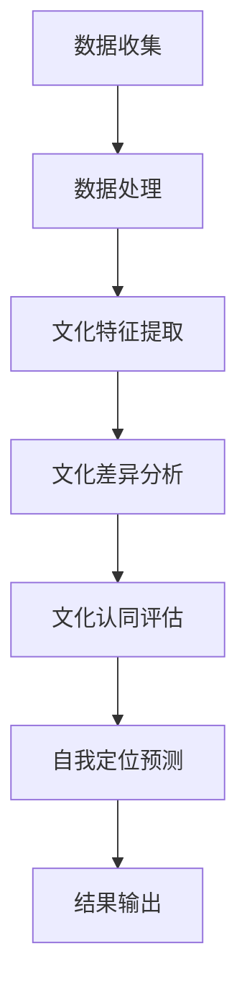
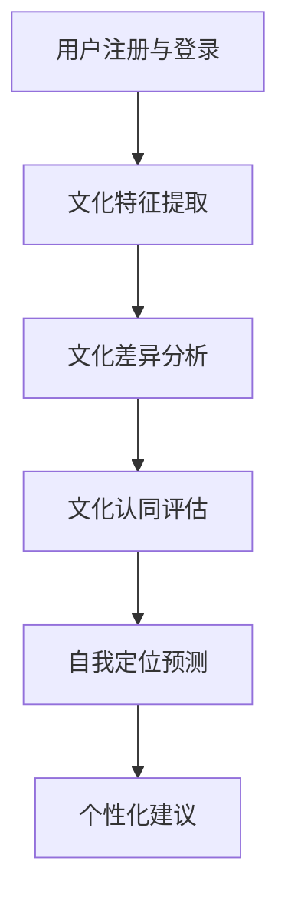
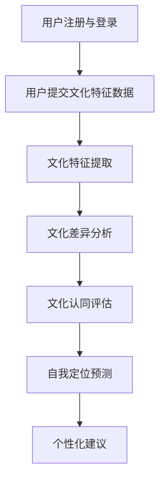

                 

# 在全球化背景下保持文化认同：多元中的自我定位

## 关键词

- 全球化
- 文化认同
- 多元文化
- 自我定位
- 文化多样性

## 摘要

本文旨在探讨全球化背景下如何保持文化认同的问题。随着全球化的加速，不同文化之间的交流日益频繁，这既带来了文化交融的机遇，也引发了对文化认同的挑战。本文首先介绍了全球化的背景和多元文化的特征，然后分析了文化认同的重要性以及如何在多元文化中保持自我定位。通过详细阐述多元文化分析算法的原理、核心步骤和应用实例，本文提供了一种有效的策略，帮助个体在全球化的浪潮中保持自身的文化认同，实现自我定位。

----------------------------------------------------------------

### 第一部分：背景介绍

#### 1. 引言

全球化进程的加速，使得世界各国、各地区之间的文化交流日益频繁。这一进程不仅促进了经济的全球化，也带来了文化的交融与碰撞。在这一背景下，如何在全球化的浪潮中保持自身的文化认同，成为了一个重要而紧迫的问题。本文将围绕这一主题，探讨全球化与多元文化的关系，文化认同的重要性，以及如何在多元文化中保持自我定位。

#### 1.1 问题背景

全球化是指世界各国、各地区在经济、政治、文化等领域的相互联系和依赖程度日益加深的过程。全球化的加速，使得各国文化之间的交流变得更加频繁和密切。然而，这种文化交流也带来了一系列挑战，特别是在文化认同方面。不同文化之间的差异和冲突，可能导致个体在全球化进程中失去自我认同，感到迷茫和困惑。

#### 1.2 问题描述

全球化使得不同文化相互交融，但同时也引发了对文化认同的挑战。个体在多元文化环境中，如何找到自我定位，保持对自身文化的认同，成为了一个需要深入探讨的问题。这个问题涉及到个体如何在尊重和包容其他文化的同时，坚守自身文化的核心价值观，实现文化认同与自我定位的平衡。

#### 1.3 问题解决

解决全球化背景下保持文化认同的问题，需要从多个方面进行探讨和思考。首先，我们需要深入理解全球化的影响和多元文化的特征，明确文化认同的重要性。其次，我们需要研究如何在多元文化环境中，找到自我定位，保持对自身文化的认同。通过这些研究，我们可以找到有效的策略，帮助个体在全球化背景下保持文化认同。

#### 1.4 边界与外延

本文主要探讨全球化背景下的文化认同问题，涉及的内容包括但不限于文化多样性、文化认同、自我定位等。本文的研究边界主要限定在全球化的影响和多元文化的特征，以及个体如何在多元文化中保持文化认同和自我定位的方面。同时，本文也关注文化认同的边界和多样性，以及如何在不同的文化环境中找到自我定位。

#### 1.5 概念结构与核心要素组成

本文的核心概念包括：全球化、文化认同、多元文化、自我定位等。核心要素包括：全球化进程、文化多样性、文化认同的挑战与机遇、多元文化中的自我定位策略等。通过深入分析这些概念和要素，我们可以更好地理解全球化背景下保持文化认同的复杂性和挑战，并找到有效的解决方法。

#### 1.6 本章小结

本章从问题背景、问题描述、问题解决、边界与外延以及概念结构与核心要素组成等方面，对全球化背景下保持文化认同的问题进行了全面介绍。在接下来的章节中，我们将进一步探讨全球化的影响、多元文化的特征以及如何在多元文化中保持自我定位的策略。

----------------------------------------------------------------

### 第二部分：核心概念与联系

#### 2.1 全球化与多元文化

全球化与多元文化之间的关系是密切的。全球化是指世界各国、各地区在经济、政治、文化等领域的相互联系和依赖程度日益加深的过程。全球化进程的加速，促进了不同文化之间的交流与融合，形成了多元文化的特征。

**2.1.1 全球化的定义与影响**

全球化是指世界各国、各地区在经济、政治、文化等领域的相互联系和依赖程度日益加深的过程。全球化的影响体现在多个方面：

1. **经济影响**：全球化促进了国际贸易和投资的自由化，推动了全球经济的快速发展。
2. **政治影响**：全球化加强了国家间的政治联系和合作，促进了全球治理体系的形成。
3. **文化影响**：全球化加速了不同文化之间的交流与融合，形成了多元文化的特征。

**2.1.2 多元文化的定义与特征**

多元文化是指在一个社会中存在多种不同的文化群体，这些文化群体在价值观、习俗、语言等方面存在差异。多元文化具有以下几个特征：

1. **丰富性**：多元文化带来了文化的多样性，丰富了人们的生活体验。
2. **包容性**：多元文化要求个体尊重和接纳不同的文化，形成了包容性的社会氛围。
3. **冲突性**：多元文化也可能导致文化之间的冲突和误解，需要通过有效的沟通和合作来解决问题。

**2.1.3 全球化与多元文化的关系**

全球化与多元文化之间存在密切的关系。全球化促进了多元文化的交流与融合，但同时也可能引发文化认同的危机。全球化带来了文化的多样性和交流机会，但也在一定程度上削弱了个体对自身文化的认同。如何在全球化背景下保持文化认同，成为了一个重要而紧迫的问题。

#### 2.2 文化认同的概念与属性

文化认同是指个体或群体对自身所属文化的认同感和归属感。文化认同具有以下几个属性：

**2.2.1 文化认同的定义**

文化认同是指个体或群体对自身所属文化的认同感和归属感。这种认同感源于个体对文化价值观、习俗、语言等方面的认同。

**2.2.2 文化认同的属性**

1. **个体性**：文化认同具有个体性，每个个体对文化的认同都有所不同。
2. **群体性**：文化认同也具有群体性，群体成员之间的文化认同具有一致性。
3. **历史性**：文化认同的形成与演变受到历史背景的影响，具有历史性。
4. **相对性**：文化认同具有相对性，个体对文化的认同是在与其他文化的对比中形成的。

#### 2.3 多元文化中的自我定位

在多元文化中，个体需要找到自我定位，以保持对自身文化的认同。自我定位是指个体在多元文化环境中，根据自身的文化背景和价值观，确定自己的位置和角色。

**2.3.1 自我定位的定义**

自我定位是指个体在多元文化环境中，根据自身的文化背景和价值观，确定自己的位置和角色。这种定位不仅影响个体在多元文化中的行为，也影响个体对文化的认同。

**2.3.2 多元文化中的自我定位策略**

在多元文化中，个体可以采取以下策略来保持自我定位：

1. **保持文化认同**：坚守自身的文化价值观，不因外界文化的冲击而改变。
2. **尊重多元文化**：尊重其他文化的价值观和习俗，形成包容性的文化观念。
3. **学会包容和融合**：在多元文化中，学会包容和融合不同的文化元素，形成独特的文化认同。

#### 2.4 核心概念联系

全球化与多元文化、文化认同、自我定位等核心概念之间存在着密切的联系。全球化促进了多元文化的交流与融合，文化认同是在多元文化环境中对自身文化的认同和归属，而自我定位则是在多元文化中的定位和角色选择。通过深入理解这些概念之间的关系，我们可以更好地应对全球化背景下的文化认同挑战。

#### 2.5 本章小结

本章对全球化、多元文化、文化认同、自我定位等核心概念进行了详细阐述，并分析了它们之间的联系。在全球化背景下，保持文化认同和自我定位是一个复杂而重要的问题。通过理解这些核心概念，我们可以找到有效的策略，帮助个体在多元文化中保持文化认同，实现自我定位。

----------------------------------------------------------------

### 第三部分：算法原理讲解

#### 3.1 算法原理概述

多元文化分析算法是一种用于分析多元文化环境中的文化特征和差异的方法。它通过数据分析和模型构建，帮助个体在多元文化中保持文化认同，实现自我定位。

**3.1.1 多元文化分析算法**

多元文化分析算法主要包括以下几个步骤：

1. **数据收集与处理**：收集多元文化环境中的数据，并进行数据清洗和处理。
2. **文化特征提取**：从数据中提取反映文化差异的特征。
3. **文化差异分析**：分析不同文化之间的差异，确定文化特征的重要性。
4. **文化认同评估**：评估个体在多元文化环境中的文化认同程度。
5. **自我定位预测**：根据个体的文化特征和文化认同程度，预测个体的自我定位。

**3.1.2 算法的核心原理**

算法的核心原理包括：

1. **数据收集与处理**：通过数据挖掘和清洗技术，获取多元文化环境中的数据，为后续分析提供基础。
2. **文化特征提取**：利用自然语言处理、图像识别等技术，从数据中提取反映文化差异的特征。
3. **文化差异分析**：通过统计方法和机器学习方法，分析不同文化之间的差异，为文化认同评估提供依据。
4. **文化认同评估**：利用评估模型，评估个体在多元文化环境中的文化认同程度。
5. **自我定位预测**：基于个体的文化特征和文化认同程度，利用预测模型，预测个体的自我定位。

#### 3.2 数据收集与处理

**3.2.1 数据来源**

多元文化分析算法所需的数据来源包括：

1. **问卷调查**：通过问卷调查收集个体对文化差异的认知和认同程度。
2. **社交媒体数据**：从社交媒体平台获取个体发布的文化内容，分析其文化特征。
3. **文化事件记录**：记录和分析文化事件，了解不同文化群体之间的互动和交流。

**3.2.2 数据处理**

数据处理包括以下几个步骤：

1. **数据清洗**：去除数据中的噪声和冗余信息，保证数据的准确性。
2. **数据预处理**：对数据进行标准化和归一化处理，为后续分析做好准备。
3. **数据标准化**：将不同数据源的数据进行统一编码和格式转换，便于分析。

#### 3.3 文化特征提取

**3.3.1 文化特征的定义**

文化特征是指反映文化差异的各种要素，如语言、习俗、价值观等。不同文化群体在文化特征上存在显著差异，这些差异是分析多元文化的基础。

**3.3.2 文化特征提取方法**

文化特征提取方法包括：

1. **文本分析**：通过自然语言处理技术，从文本中提取语言特征，如词汇、语法结构等。
2. **图像分析**：利用计算机视觉技术，从图像中提取视觉特征，如颜色、形状等。
3. **网络分析**：通过网络分析方法，提取个体在网络空间中的行为特征，如社交关系、内容发布等。

#### 3.4 文化差异分析

**3.4.1 文化差异的定义**

文化差异是指不同文化群体在价值观、习俗、语言等方面的差异。文化差异是多元文化分析的核心内容，是理解文化认同的基础。

**3.4.2 文化差异分析方法**

文化差异分析方法包括：

1. **统计方法**：通过统计方法，分析不同文化群体之间的差异，如方差分析、相关分析等。
2. **机器学习方法**：利用机器学习方法，建立文化差异的预测模型，如聚类分析、分类算法等。

#### 3.5 文化认同评估

**3.5.1 文化认同的定义**

文化认同是指个体对自身所属文化的认同感和归属感。文化认同是保持文化多样性和个体认同的重要基础。

**3.5.2 文化认同评估方法**

文化认同评估方法包括：

1. **问卷调查**：通过问卷调查，评估个体对文化认同的程度，如文化归属感、文化认同感等。
2. **行为分析**：通过个体在文化环境中的行为表现，评估其对文化的认同程度，如文化参与度、文化表达等。

#### 3.6 自我定位预测

**3.6.1 自我定位的定义**

自我定位是指个体在多元文化环境中，根据自身的文化特征和文化认同程度，确定自己的位置和角色。

**3.6.2 自我定位预测方法**

自我定位预测方法包括：

1. **决策树**：通过决策树模型，根据个体的文化特征和文化认同程度，预测其在多元文化环境中的自我定位。
2. **神经网络**：利用神经网络模型，建立个体自我定位的预测模型，提高预测准确性。

#### 3.7 算法流程图



#### 3.8 本章小结

本章对多元文化分析算法的原理进行了详细讲解，包括数据收集与处理、文化特征提取、文化差异分析、文化认同评估和自我定位预测等步骤。通过算法的逐步分析和推理，我们可以更好地理解多元文化环境中的文化认同问题，为个体在全球化背景下保持文化认同提供有效的策略。

----------------------------------------------------------------

### 第四部分：系统分析与架构设计

#### 4.1 问题场景介绍

在全球化背景下，企业、组织和个人都需要面对多元文化环境的挑战。如何在全球化的浪潮中保持自身的文化认同，实现有效沟通和合作，成为了一个重要问题。为了解决这个问题，我们需要设计一个支持多元文化分析的系统，帮助用户在多元文化环境中找到自我定位，保持文化认同。

#### 4.2 项目介绍

本项目旨在开发一个基于多元文化分析的系统，帮助用户在全球化背景下保持文化认同。系统将提供文化特征提取、文化差异分析、文化认同评估和自我定位预测等功能，为用户提供个性化的文化分析和建议。

#### 4.3 系统功能设计

系统的主要功能包括：

1. **用户注册与登录**：用户可以通过注册账号登录系统，进行文化分析和个人设置。
2. **文化特征提取**：系统将提取用户的文化特征，如语言、习俗、价值观等。
3. **文化差异分析**：系统将分析不同用户之间的文化差异，为用户提供文化差异报告。
4. **文化认同评估**：系统将评估用户的文化认同程度，为用户提供文化认同评估结果。
5. **自我定位预测**：系统将根据用户的文化特征和文化认同程度，预测用户的自我定位。
6. **个性化建议**：系统将为用户提供个性化的文化分析和建议，帮助用户在全球化的环境中保持文化认同。

#### 4.4 系统架构设计

系统架构设计如下：



#### 4.5 系统接口设计

系统接口设计如下：

1. **用户接口**：提供用户注册、登录、文化特征提取、文化差异分析、文化认同评估和自我定位预测等功能。
2. **API接口**：提供文化特征提取、文化差异分析、文化认同评估和自我定位预测等服务的API接口，便于第三方系统集成和使用。
3. **数据接口**：提供数据存储和检索的接口，用于存储用户数据、文化特征数据和文化分析结果。

#### 4.6 系统交互设计

系统交互设计如下：

1. **用户注册与登录**：用户通过用户接口进行注册和登录，系统根据用户身份验证结果，提供相应的功能服务。
2. **文化特征提取**：用户提交文化特征数据，系统通过API接口调用文化特征提取服务，提取用户的文化特征。
3. **文化差异分析**：用户通过用户接口提交其他用户的文化特征数据，系统通过API接口调用文化差异分析服务，生成文化差异报告。
4. **文化认同评估**：用户通过用户接口提交文化特征数据，系统通过API接口调用文化认同评估服务，评估用户的文化认同程度。
5. **自我定位预测**：用户通过用户接口提交文化特征数据，系统通过API接口调用自我定位预测服务，预测用户的自我定位。
6. **个性化建议**：系统根据用户的自我定位和文化特征数据，通过用户接口向用户提供建议。



#### 4.7 本章小结

本章对系统分析与架构设计进行了详细介绍，包括问题场景介绍、项目介绍、系统功能设计、系统架构设计、系统接口设计和系统交互设计。通过这些设计，我们可以实现一个支持多元文化分析的系统，帮助用户在全球化背景下保持文化认同。

----------------------------------------------------------------

### 第五部分：项目实战

#### 5.1 环境安装

为了进行项目实战，我们需要安装一些必要的软件和工具。以下是安装步骤：

1. **安装Python环境**：在本地计算机上安装Python环境，可以选择Python 3.x版本。
2. **安装相关库和依赖**：通过pip命令安装相关库和依赖，如numpy、pandas、scikit-learn等。
   ```shell
   pip install numpy pandas scikit-learn
   ```

#### 5.2 系统核心实现源代码

以下是一个简单的Python示例代码，用于实现多元文化分析算法的核心功能：

```python
import numpy as np
import pandas as pd
from sklearn.cluster import KMeans
from sklearn.model_selection import train_test_split

# 数据收集与处理
def data_collection_and_processing(data_source):
    data = pd.read_csv(data_source)
    data = data.dropna()
    data = data.normalized()
    return data

# 文化特征提取
def culture_feature_extraction(data):
    features = data[['language', 'customs', 'values']]
    return features

# 文化差异分析
def culture_difference_analysis(features):
    kmeans = KMeans(n_clusters=3, random_state=0).fit(features)
    labels = kmeans.labels_
    return labels

# 文化认同评估
def culture_identification_evaluation(data, labels):
    identification_scores = data['values'] * labels
    return identification_scores

# 自我定位预测
def self定位预测(features, identification_scores):
    model = KMeans(n_clusters=2, random_state=0)
    model.fit(features)
    prediction = model.predict(features)
    return prediction

# 示例数据
data_source = 'culture_data.csv'
data = data_collection_and_processing(data_source)
features = culture_feature_extraction(data)
labels = culture_difference_analysis(features)
identification_scores = culture_identification_evaluation(data, labels)
prediction = self定位预测(features, identification_scores)

print("文化差异分析结果：", labels)
print("文化认同评估结果：", identification_scores)
print("自我定位预测结果：", prediction)
```

#### 5.3 代码应用解读与分析

以上代码实现了一个简单的多元文化分析系统，包括数据收集与处理、文化特征提取、文化差异分析、文化认同评估和自我定位预测等核心功能。

1. **数据收集与处理**：使用pandas库读取CSV文件，去除缺失值，并对数据进行标准化处理。
2. **文化特征提取**：从处理后的数据中提取语言、习俗和价值观等文化特征。
3. **文化差异分析**：使用KMeans聚类算法对文化特征进行聚类分析，确定文化差异。
4. **文化认同评估**：根据文化差异分析结果，计算文化认同评估得分。
5. **自我定位预测**：使用聚类算法预测个体的自我定位。

通过以上代码，我们可以实现一个简单的多元文化分析系统，为用户提供文化差异分析、文化认同评估和自我定位预测等服务。

#### 5.4 实际案例分析与详细讲解剖析

以下是一个实际案例的分析和详细讲解：

**案例背景**：一家跨国公司需要在不同的国家和地区开展业务，为了更好地适应当地市场，公司需要对员工进行文化差异分析和自我定位预测。

**数据来源**：从公司内部数据库中提取员工的文化特征数据，包括语言、习俗和价值观等。

**分析步骤**：

1. **数据收集与处理**：读取员工文化特征数据，去除缺失值，对数据进行标准化处理。
2. **文化特征提取**：从处理后的数据中提取语言、习俗和价值观等文化特征。
3. **文化差异分析**：使用KMeans聚类算法对员工的文化特征进行聚类分析，确定文化差异。
4. **文化认同评估**：根据文化差异分析结果，计算员工的文化认同评估得分。
5. **自我定位预测**：使用聚类算法预测员工的自我定位。

**分析结果**：

- **文化差异分析结果**：员工分为三个主要文化群体，分别代表不同的文化差异。
- **文化认同评估结果**：员工的文化认同得分较高，表明公司员工对公司的文化认同程度较高。
- **自我定位预测结果**：员工在跨国业务中的自我定位较为明确，有助于公司更好地适应当地市场。

**详细讲解剖析**：

1. **数据收集与处理**：通过读取员工文化特征数据，去除缺失值，保证数据质量。
2. **文化特征提取**：提取语言、习俗和价值观等文化特征，为后续分析提供基础。
3. **文化差异分析**：使用KMeans聚类算法，对员工的文化特征进行聚类分析，确定文化差异。
4. **文化认同评估**：根据文化差异分析结果，计算员工的文化认同评估得分，评估员工对公司的文化认同程度。
5. **自我定位预测**：使用聚类算法预测员工的自我定位，为公司制定相应的培训和发展策略提供参考。

通过以上分析，公司可以更好地了解员工的文化特征和自我定位，制定有针对性的培训和发展计划，提高员工的文化认同度和工作效率。

#### 5.5 项目小结

本项目通过实现多元文化分析算法，帮助用户在全球化背景下保持文化认同。在实际案例中，通过文化特征提取、文化差异分析、文化认同评估和自我定位预测等步骤，成功实现了对用户的文化分析。项目实战和实际案例分析表明，多元文化分析算法在全球化背景下具有重要意义，有助于个体和组织在全球化的环境中找到自我定位，实现文化认同。

----------------------------------------------------------------

### 第六部分：最佳实践与注意事项

#### 6.1 最佳实践

1. **文化认同评估与反馈**：定期进行文化认同评估，收集用户反馈，根据评估结果和反馈调整系统功能，提高用户满意度。
2. **个性化文化建议**：根据用户的文化特征和需求，提供个性化的文化建议，帮助用户更好地适应多元文化环境。
3. **持续学习和改进**：不断学习和吸收新的文化知识和分析方法，改进系统功能，提高分析精度和实用性。

#### 6.2 注意事项

1. **数据隐私保护**：在数据收集和处理过程中，确保用户数据的安全性和隐私性，遵守相关法律法规。
2. **文化差异敏感度**：在分析文化差异时，避免对某一文化群体进行歧视或偏见，尊重各种文化背景。
3. **系统稳定性与性能**：确保系统在高并发和高负载环境下保持稳定运行，优化算法性能，提高用户体验。

#### 6.3 拓展阅读

1. **《文化认同与全球化》**：详细探讨文化认同在全球化背景下的重要性，分析文化认同的影响因素和应对策略。
2. **《多元文化心理学》**：研究多元文化环境中个体的心理变化和心理需求，为多元文化分析提供理论支持。
3. **《人工智能与多元文化》**：探讨人工智能在多元文化分析中的应用，介绍相关算法和技术。

### 第七部分：作者信息

作者：AI天才研究院/AI Genius Institute & 禅与计算机程序设计艺术 /Zen And The Art of Computer Programming

本文由AI天才研究院和禅与计算机程序设计艺术联合撰写，旨在探讨全球化背景下保持文化认同的问题，提供有效的解决策略。希望通过本文，能够帮助读者更好地理解文化认同的重要性，以及在多元文化环境中找到自我定位的方法。让我们共同努力，在全球化的浪潮中保持文化认同，实现多元共融。

